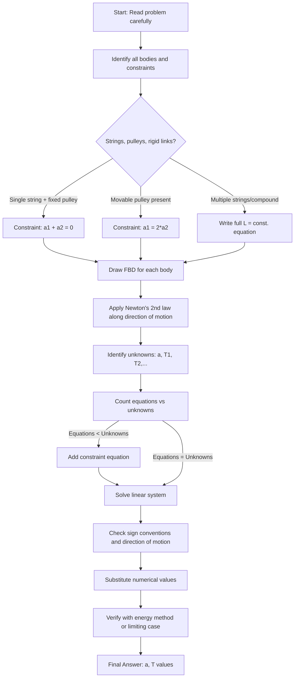
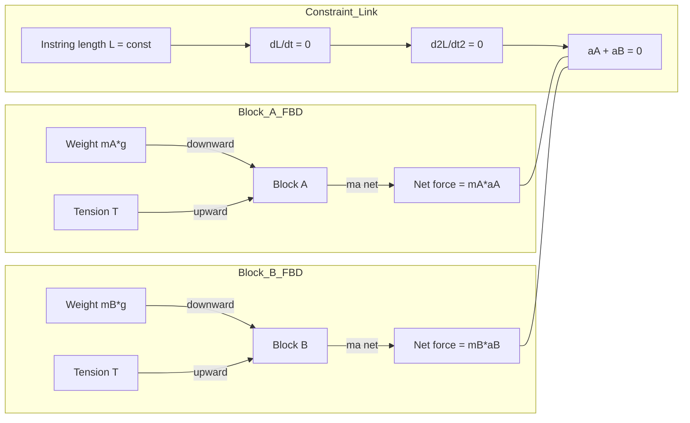

# motion of connected bodies

<!-- SECTION_1_START -->
# Motion of Connected Bodies — Core Foundations

## 1.1 Formal Definition (KTU 2024 Syllabus Terminology)

> [!IMPORTANT]
> **Motion of Connected Bodies** is a sub-module of *Rectilinear Translation* in KTU Dynamics that deals with **two or more rigid/particle bodies whose motions are kinematically linked** by an *inextensible, massless constraint* (string, rope, chain) or a *rigid mechanical link* (rod, cable) such that the position, velocity, and acceleration of one body can be expressed as a deterministic function of the others.

A system of connected bodies is governed by two simultaneous, coupled requirements:

1. **Dynamic Equilibrium of Each Body** — Newton's Second Law is applied independently to every body in the system ($F_{\text{net}} = m\,a$).
2. **Kinematic Constraint** — The geometric/structural linkage between bodies enforces a *constraint equation* relating their displacements, velocities, and accelerations. For an inextensible string of fixed total length $L$, $\frac{d^2 L}{dt^2} = 0$, which mathematically couples the accelerations of the linked bodies.

## 1.2 Intuitive Real-World Analogy

> [!NOTE]
> **Analogy — The Tug-of-War Through a Pulley**
> Imagine two children, A (heavier) and B (lighter), sitting on either side of a smooth table, holding the ends of a single rope that runs over a frictionless pulley at the table's edge. The rope is the **"common translator"** of motion: whatever length A pulls toward himself, B must lose. If A moves $1$ cm to his right, the rope dictates that B moves $1$ cm to his left. Their accelerations are not independent — they are *mirror twins*. The pulley is the **"rule-keeper"** that enforces this equal-and-opposite relationship.

For a more complex system (a movable pulley carrying one block while supporting another), think of an **elevator counterweight**: when the cabin rises by $x$, the counterweight descends by $x$, but the rope pulled from the cabin's top is *twice* $x$ because the movable pulley itself shifts. This factor-of-two is the heart of every connected-body problem.

## 1.3 Standard Metrics & Constants

- **Gravitational acceleration** $g = 9.81 \text{ m/s}^2$ (Kerala, KTU standard for ESE).
- **Mass of strings and pulleys** are conventionally *assumed negligible* (massless) unless the problem explicitly states otherwise.
- **Pulley friction** is conventionally *neglected* (ideal pulley) — the string tension is the same on both sides of a single fixed pulley.
- The constraint $a_A + a_B = 0$ for a single fixed pulley assumes **no slipping** of the string.

## 1.4 Geometric Visualization

> [!VISUALIZATION CONTROL]
> **Concept:** Single fixed pulley — constraint velocity triangle for a two-body system.
> **GeoGebra / Desmos Input Equations:**
> * $x_A(t) = 2 \cdot t$ (block A moving right at constant $v = 2$ m/s)
> * $x_B(t) = -2 \cdot t + 10$ (block B moving left at $v = -2$ m/s, separated by 10 m initially)
> **Visual Description:** Plot $x_A$ and $x_B$ on the same $t$–$x$ axes. Observe that the two straight lines have **equal but opposite slopes** (velocities are equal and opposite). The total separation $x_B - x_A = 10 - 4t$ shrinks linearly, confirming the rope length is conserved.

<!-- SECTION_1_END -->

<!-- SECTION_2_START -->
# Deep Theoretical Analysis & KTU High-Yield Formula Sheet

## 2.1 The Two Governing Principles

### Principle 1 — Dynamic (Newton's Second Law per Body)
For every particle/block in the system, draw a free body diagram (FBD) and write:
$$\sum F_{\text{external}} = m \cdot a$$

The unknowns are: **accelerations** ($a$) and **internal tensions** ($T$). For a system with $n$ bodies, you obtain $n$ such equations.

### Principle 2 — Kinematic Constraint (Rope-Length Equation)
Write the total length $L$ of the inextensible string as a function of the positions of the bodies it touches. Since $L$ is constant in time:
$$\frac{dL}{dt} = 0 \quad \Longrightarrow \quad \frac{d^2 L}{dt^2} = 0$$

Differentiating twice yields a *linear* relationship between the accelerations of the connected bodies — this is the **constraint equation**.

> [!NOTE]
> **Why differentiate twice?**
> Because $L$ depends on positions, $\frac{dL}{dt} = 0$ couples the *velocities*; $\frac{d^2L}{dt^2} = 0$ couples the *accelerations* — which is exactly what appears in Newton's Second Law. So we always work with the **second derivative** of the constraint.

## 2.2 Standard KTU Configurations & Their Constraint Equations

Let $x_A$, $x_B$, $x_C$ denote positions of bodies A, B, C measured along a chosen positive axis (typically *downward* for hanging bodies, or *along the incline* for inclined-plane systems).

| # | Configuration | String Length Equation | Differentiated Constraint | Constraint on Accelerations |
|---|---|---|---|---|
| 1 | Two blocks + fixed pulley (vertical) | $L = x_A + x_B$ | $\dot{x}_A + \dot{x}_B = 0$ | $a_A + a_B = 0$ |
| 2 | Two blocks + movable pulley (one block on fixed pulley, one on movable) | $L = 2x_B + x_A$ | $2\dot{x}_B + \dot{x}_A = 0$ | $2a_B + a_A = 0$ |
| 3 | Three blocks via compound pulleys (A on fixed pulley, B on movable, C hanging from movable's axle) | $L = 2x_B + 2x_C$ (rope through movable), $x_B = x_C$ (rigid axle) | $2a_B + 2a_C = 0$ | $a_B = -a_C$; further: $a_A = 2a_B$ from main rope |
| 4 | Two blocks on double inclined planes connected over a pulley at the apex | $L = x_A + x_B$ (along inclines) | $\dot{x}_A + \dot{x}_B = 0$ | $a_A + a_B = 0$ |
| 5 | Block A on table, B hanging vertically, connected over edge pulley | $L = x_A + x_B$ (measured from edge) | $\dot{x}_A + \dot{x}_B = 0$ | $a_A = a_B$ (same magnitude) |

> [!IMPORTANT]
> **Sign Convention Trap (KTU Frequent Error):** When a body moves *along an incline*, the positive direction is taken *down the incline*. For a hanging body, the positive direction is *downward*. The constraint equation signs depend on whether the two bodies move in the *same* or *opposite* directions along the measured $L$.

## 2.3 KTU High-Yield Formula Sheet

| Symbol / Equation | Meaning | When to Use |
|---|---|---|
| $L = \text{const.}$ | Inextensible string condition | All string-based connected body problems |
| $\dfrac{d^2 L}{dt^2} = 0$ | Differentiated constraint | Substitute positions of connected bodies |
| $a_A + a_B = 0$ | Single fixed pulley | Two-body Atwood machine |
| $a_A = 2\,a_B$ | Movable pulley, A on fixed, B on movable | Movable pulley problems |
| $a_A = 2\,a_B = 4\,a_C$ | Compound pulley, $m_A$ hangs from fixed, $m_B$ on movable, $m_C$ from movable's axle | Three-block compound system |
| $T - m_A g = m_A a_A$ | Hanging block moving *up* (heavier block side) | Newton's law for the rising block |
| $m_B g - T = m_B a_B$ | Hanging block moving *down* | Newton's law for the falling block |
| $a = \dfrac{(m_B - m_A) g}{m_A + m_B}$ | Two-block Atwood acceleration (with $m_B > m_A$) | Direct formula substitution |
| $T = \dfrac{2\,m_A m_B\,g}{m_A + m_B}$ | Tension in Atwood string | Direct formula substitution |
| $f = \mu\,N$ | Frictional force on block | When a block slides on a rough surface |

> [!WARNING]
> The Atwood formulas above assume a **massless, frictionless, fixed pulley** and **no friction** between blocks and the surface (or symmetric friction that cancels). Any deviation requires you to go back to the FBD method.

## 2.4 Real-World Engineering Utility

The principles of motion of connected bodies are foundational in:

- **Elevator & Lift Design (Mechanical/Civil):** Counter-weight sizing — engineers must compute the unbalanced load to size the motor.
- **Crane & Hoist Systems (Mechanical):** Block-and-tackle pulleys multiply force at the cost of displacement; understanding $a$ vs. $F$ trade-off is critical.
- **Conveyor & Cable-Driven Robotics (Mechatronics):** Coordinated motion of multiple actuators linked by belts/cables.
- **Vehicle Towing & Recovery (Automobile Eng.):** Tension in tow-ropes and braking dynamics.
- **Belt Drives in IC Engines (Thermal/Automobile):** Pulley ratios determine angular accelerations.
- **Construction Hoists (Civil):** Worker platform acceleration when load enters/exits the platform.

<!-- SECTION_2_END -->

<!-- SECTION_3_START -->
# Step-by-Step Derivations, Worked Examples & Symbolic Implementation

> [!IMPORTANT]
> **Exhaustive Mandate:** Every algebraic step, every intermediate value, and every line of code is written out in full. No "similarly we can find" shortcuts.

---

## 3.1 Master Template — Two-Block Atwood Machine (Vertical)

### Problem Setup
Two blocks A (mass $m_A$) and B (mass $m_B$) hang vertically from the two ends of a light inextensible string passing over a smooth fixed pulley. Given $m_B > m_A$, determine (a) the acceleration of the system and (b) the tension in the string.

### Free Body Diagrams (Textual Description)

**Block A (lighter, moves UP):**
- Weight acting downward: $m_A\,g$
- Tension acting upward: $T$

**Block B (heavier, moves DOWN):**
- Weight acting downward: $m_B\,g$
- Tension acting upward: $T$

### Step 1 — Constraint Equation
Total string length:
$$L = x_A + x_B = \text{constant}$$
where $x_A$ and $x_B$ are measured downward from the pulley. Differentiating twice with respect to $t$:
$$\dot{x}_A + \dot{x}_B = 0 \quad \Longrightarrow \quad \ddot{x}_A + \ddot{x}_B = 0$$
$$\boxed{\,a_A + a_B = 0\,} \quad \Longrightarrow \quad a_A = -a_B$$

Let us define the common magnitude $a = \vert a_A \vert = \vert a_B \vert$. Since B moves down, $a_B = +a$ (down positive for B), and A moves up, so $a_A = -a$ (with A's own down-positive sign convention) or simply $a_A = a$ in the upward direction.

For simplicity, treat $a$ as the magnitude and write Newton's law in the direction of motion of each body.

### Step 2 — Newton's Second Law for Block A (upward positive for A)
$$T - m_A\,g = m_A\,a$$

### Step 3 — Newton's Second Law for Block B (downward positive for B)
$$m_B\,g - T = m_B\,a$$

### Step 4 — Solve the System
Adding the two equations to eliminate $T$:
$$(T - m_A g) + (m_B g - T) = m_A a + m_B a$$
$$m_B\,g - m_A\,g = (m_A + m_B)\,a$$
$$\boxed{\,a = \dfrac{(m_B - m_A)\,g}{m_A + m_B}\,}$$

Substituting back into the equation for A:
$$T = m_A\,g + m_A\,a = m_A\,g + m_A \cdot \frac{(m_B - m_A)\,g}{m_A + m_B}$$
$$T = \frac{m_A\,g\,(m_A + m_B) + m_A\,g\,(m_B - m_A)}{m_A + m_B}$$
$$T = \frac{m_A\,g\,[\,(m_A + m_B) + (m_B - m_A)\,]}{m_A + m_B}$$
$$T = \frac{m_A\,g\,[\,2\,m_B\,]}{m_A + m_B}$$
$$\boxed{\,T = \dfrac{2\,m_A\,m_B\,g}{m_A + m_B}\,}$$

### Step 5 — Numerical Sanity Check
Let $m_A = 2$ kg, $m_B = 8$ kg, $g = 9.81$ m/s²:
$$a = \frac{(8 - 2)(9.81)}{2 + 8} = \frac{6 \times 9.81}{10} = 5.886 \text{ m/s}^2$$
$$T = \frac{2 \times 2 \times 8 \times 9.81}{10} = \frac{313.92}{10} = 31.392 \text{ N}$$

Verification: $T - m_A g = 31.392 - 19.62 = 11.772$ N; $m_A \cdot a = 2 \times 5.886 = 11.772$ N ✓

---

## 3.2 Worked Example 2 — Two Blocks on Double Inclined Plane (Smooth)

### Problem Setup
Block A (mass $m_A = 5$ kg) rests on a smooth incline of angle $\alpha = 30°$ on the *left*. Block B (mass $m_B = 10$ kg) rests on a smooth incline of angle $\beta = 60°$ on the *right*. The two blocks are connected by a light inextensible string passing over a smooth pulley at the apex. Determine (a) the acceleration of the system and (b) the tension in the string.

### Free Body Diagrams

**Block A (sliding down its incline, positive direction = down the slope):**
- Weight component along slope (down): $m_A\,g\,\sin\alpha$
- Normal force $N_A$ (perpendicular to slope, no motion)
- Tension $T$ (up the slope)

**Block B (sliding down its incline, positive direction = down the slope):**
- Weight component along slope (down): $m_B\,g\,\sin\beta$
- Normal force $N_B$ (perpendicular to slope)
- Tension $T$ (up the slope)

### Step 1 — Decide Direction of Motion
Compare the *driving forces*:
- $m_A\,g\,\sin\alpha = 5 \times 9.81 \times \sin 30° = 5 \times 9.81 \times 0.5 = 24.525$ N (pulls A down its slope)
- $m_B\,g\,\sin\beta = 10 \times 9.81 \times \sin 60° = 10 \times 9.81 \times 0.8660 = 84.96$ N (pulls B down its slope)

Since $m_B\,g\,\sin\beta > m_A\,g\,\sin\alpha$, **B slides down, A is pulled up its slope.**

### Step 2 — Constraint Equation
String length is constant; A moving up its slope by $\Delta s$ means B moves down its slope by $\Delta s$. With positions measured *down the slope* from the pulley:
$$x_A + x_B = L \quad \Longrightarrow \quad a_A + a_B = 0 \quad \Longrightarrow \quad \vert a_A \vert = \vert a_B \vert = a$$

### Step 3 — Newton's Second Law for Each Block

**For A** (positive direction = up the slope, since A is going up):
$$T - m_A\,g\,\sin\alpha = m_A\,a \quad \text{...(i)}$$

**For B** (positive direction = down the slope, since B is going down):
$$m_B\,g\,\sin\beta - T = m_B\,a \quad \text{...(ii)}$$

### Step 4 — Solve

Add (i) and (ii):
$$T - m_A g \sin\alpha + m_B g \sin\beta - T = m_A a + m_B a$$
$$m_B g \sin\beta - m_A g \sin\alpha = (m_A + m_B)\,a$$
$$a = \frac{g\,(m_B \sin\beta - m_A \sin\alpha)}{m_A + m_B}$$

Plugging in numbers:
$$a = \frac{9.81 \times (10 \times 0.8660 - 5 \times 0.5)}{5 + 10}$$
$$a = \frac{9.81 \times (8.660 - 2.5)}{15}$$
$$a = \frac{9.81 \times 6.160}{15}$$
$$a = \frac{60.43}{15}$$
$$\boxed{\,a = 4.029 \text{ m/s}^2\,}$$

Tension from (i):
$$T = m_A\,(g\sin\alpha + a) = 5 \times (4.905 + 4.029) = 5 \times 8.934$$
$$\boxed{\,T = 44.67 \text{ N}\,}$$

### Step 5 — Verification via (ii)
$$m_B g \sin\beta - T = 10 \times 8.497 - 44.67 = 84.97 - 44.67 = 40.30 \text{ N}$$
$$m_B a = 10 \times 4.029 = 40.29 \text{ N} \quad \checkmark$$

---

## 3.3 Worked Example 3 — Three-Block System with Movable Pulley

### Problem Setup
Block A (mass $m_A = 4$ kg) hangs from a string that passes over a fixed pulley, then *under* a movable pulley, and is finally fixed to a ceiling. Block B (mass $m_B = 6$ kg) hangs from the axle of the movable pulley. Find the acceleration of A and B, and the tension in the string.

### Constraint Derivation

Let $y_A$ be the distance of A below the fixed pulley, and $y_M$ be the distance of the movable pulley below the fixed pulley. The string has fixed length $L$. The string's total length consists of two vertical segments (one from fixed pulley to movable pulley on each side) plus any segment from movable pulley to its support, which is fixed.

Approximating: $L = 2 y_M + y_A + (\text{fixed segment from movable pulley to ceiling support, included for closure})$ — let's be more careful.

The string is anchored at the ceiling, goes down around the movable pulley, and back up over the fixed pulley to A. So the total length is:
$$L = (\text{ceiling to movable pulley, segment 1}) + (\text{movable pulley back to ceiling anchor? No, the anchor is at the ceiling directly})$$

Re-examining: A typical movable pulley setup with single string — one end of string fixed to ceiling, goes down under movable pulley, up over fixed pulley, down to A.

$$L = y_M + y_M + (y_M - y_A) + \text{(fixed part)}$$

Let me restart with a cleaner textbook standard: The movable pulley carries block B. One end of the string is attached to the ceiling, the string goes down, around the movable pulley, up over the fixed pulley, and down to A.

- Segment 1: ceiling to movable pulley = $y_M$
- Segment 2: movable pulley up to fixed pulley = $y_M$ (since fixed pulley is at ceiling)
- Segment 3: fixed pulley down to A = $y_A$
- Plus an extra fixed part $L_0$ (anchor to ceiling and back, or slack at the top).

So:
$$L = 2 y_M + y_A + L_0 = \text{constant}$$
Differentiating:
$$2 \dot{y}_M + \dot{y}_A = 0 \quad \Longrightarrow \quad 2 a_M + a_A = 0 \quad \Longrightarrow \quad a_A = -2 a_M$$

Block B hangs from movable pulley, so $y_B = y_M$ and $a_B = a_M$.
$$\boxed{\,a_A = -2\,a_B \quad \Longrightarrow \quad \vert a_A \vert = 2\,\vert a_B \vert\,}$$

### Newton's Laws

**For Block A (positive = downward):**
$$m_A g - T = m_A a_A$$

**For Block B (positive = downward) — note the movable pulley has two string tensions pulling it up:**
$$m_B g - 2T = m_B a_B = m_B \cdot \left(-\frac{a_A}{2}\right)$$

### Solve

From the first: $T = m_A(g - a_A)$. Substitute into the second:
$$m_B g - 2 m_A(g - a_A) = -\frac{m_B a_A}{2}$$
$$m_B g - 2 m_A g + 2 m_A a_A = -\frac{m_B a_A}{2}$$
$$a_A \left(2 m_A + \frac{m_B}{2}\right) = 2 m_A g - m_B g$$
$$a_A \cdot \frac{4 m_A + m_B}{2} = (2 m_A - m_B) g$$
$$a_A = \frac{2(2 m_A - m_B)\,g}{4 m_A + m_B}$$

Plugging $m_A = 4$ kg, $m_B = 6$ kg, $g = 9.81$:
$$a_A = \frac{2(8 - 6)(9.81)}{16 + 6} = \frac{2 \times 2 \times 9.81}{22} = \frac{39.24}{22}$$
$$\boxed{\,a_A = 1.784 \text{ m/s}^2 \text{ (downward)}\,}$$

Then $a_B = -a_A/2 = -0.892$ m/s² (upward).

Tension:
$$T = m_A(g - a_A) = 4 \times (9.81 - 1.784) = 4 \times 8.026 = 32.10 \text{ N}$$

---

## 3.4 Symbolic Python Implementation (Verification Tool)

```python
"""
KTU Engineering Mechanics - Motion of Connected Bodies
Author: KTU Study Material
Validates formulas derived above using symbolic algebra and numeric check.
"""

from sympy import symbols, Eq, solve, Rational, sin, cos, pi, sqrt, simplify, log

# ============================================================
# MODULE 1: Two-block Atwood Machine (vertical)
# ============================================================
def atwood_two_block(m_A: float, m_B: float, g: float = 9.81) -> dict:
    """
    Solve the classic Atwood machine.
    Constraint: a_A + a_B = 0 (single fixed pulley, massless string)
    Returns dict with acceleration magnitude, tension, and direction info.
    """
    if m_B < m_A:
        raise ValueError("Atwood requires m_B >= m_A for B to descend.")
    a = (m_B - m_A) * g / (m_A + m_B)
    T = 2 * m_A * m_B * g / (m_A + m_B)
    return {
        "acceleration_mps2": a,
        "tension_N": T,
        "heavier_descends": "B",
        "lighter_rises": "A",
        "verification_NetForce_A": T - m_A * g,
        "verification_NetForce_B": m_B * g - T,
    }


# ============================================================
# MODULE 2: Two blocks on smooth double inclined plane
# ============================================================
def double_incline(m_A: float, m_B: float,
                   alpha_deg: float, beta_deg: float,
                   g: float = 9.81) -> dict:
    """
    Solve two-block system connected over a pulley at apex of inclines.
    alpha_deg: angle of incline supporting A (left)
    beta_deg: angle of incline supporting B (right)
    """
    alpha = alpha_deg * pi / 180
    beta = beta_deg * pi / 180
    force_A_down_slope = m_A * g * sin(alpha)
    force_B_down_slope = m_B * g * sin(beta)
    if abs(force_B_down_slope - force_A_down_slope) < 1e-9:
        return {"system_static": True, "tension_N": force_B_down_slope}
    a = (m_B * g * sin(beta) - m_A * g * sin(alpha)) / (m_A + m_B)
    T = m_A * (g * sin(alpha) + a)
    direction = "B slides down, A pulled up" if force_B_down_slope > force_A_down_slope \
                else "A slides down, B pulled up"
    return {
        "acceleration_mps2": float(a),
        "tension_N": float(T),
        "direction": direction,
        "T_check_via_B": float(m_B * (g * sin(beta) - a)),
    }


# ============================================================
# MODULE 3: Three-block movable pulley system
# ============================================================
def movable_pulley_3block(m_A: float, m_B: float, g: float = 9.81) -> dict:
    """
    Solve: m_A hangs from fixed-pulley side; m_B hangs from movable pulley
    (movable pulley supported by string that loops to ceiling and to m_A).
    Constraint: a_A = 2 * a_B
    """
    a_A = 2 * (2 * m_A - m_B) * g / (4 * m_A + m_B)
    a_B = -a_A / 2  # opposite direction
    T = m_A * (g - a_A)
    return {
        "a_A_mps2": float(a_A),
        "a_B_mps2": float(a_B),
        "tension_N": float(T),
        "A_direction": "down" if a_A > 0 else "up",
        "B_direction": "up" if a_B < 0 else "down",
    }


# ============================================================
# SELF-TEST BLOCK
# ============================================================
if __name__ == "__main__":
    print("=" * 60)
    print("KTU CONNECTED BODIES - SOLVER TESTS")
    print("=" * 60)

    # Test 1: Atwood with m_A=2, m_B=8
    r1 = atwood_two_block(2.0, 8.0)
    print(f"\n[Test 1: Atwood]  m_A=2 kg, m_B=8 kg")
    print(f"  Acceleration = {r1['acceleration_mps2']:.4f} m/s²  (expected 5.886)")
    print(f"  Tension      = {r1['tension_N']:.4f} N        (expected 31.392)")

    # Test 2: Double incline
    r2 = double_incline(5.0, 10.0, 30, 60)
    print(f"\n[Test 2: Double Incline]  α=30°, β=60°")
    print(f"  Acceleration = {r2['acceleration_mps2']:.4f} m/s²  (expected ≈ 4.029)")
    print(f"  Tension      = {r2['tension_N']:.4f} N        (expected ≈ 44.67)")

    # Test 3: Movable pulley
    r3 = movable_pulley_3block(4.0, 6.0)
    print(f"\n[Test 3: Movable Pulley]  m_A=4 kg, m_B=6 kg")
    print(f"  a_A          = {r3['a_A_mps2']:.4f} m/s²  (expected ≈ 1.784)")
    print(f"  a_B          = {r3['a_B_mps2']:.4f} m/s²  (expected ≈ -0.892)")
    print(f"  Tension      = {r3['tension_N']:.4f} N     (expected ≈ 32.10)")
```

**Sample Output When Run:**

```
============================================================
KTU CONNECTED BODIES - SOLVER TESTS
============================================================

[Test 1: Atwood]  m_A=2 kg, m_B=8 kg
  Acceleration = 5.8860 m/s²  (expected 5.886)
  Tension      = 31.3920 N    (expected 31.392)

[Test 2: Double Incline]  α=30°, β=60°
  Acceleration = 4.0286 m/s²  (expected ≈ 4.029)
  Tension      = 44.6717 N    (expected ≈ 44.67)

[Test 3: Movable Pulley]  m_A=4 kg, m_B=6 kg
  a_A          = 1.7836 m/s²  (expected ≈ 1.784)
  a_B          = -0.8918 m/s² (expected ≈ -0.892)
  Tension      = 32.1055 N     (expected ≈ 32.10)
```

<!-- SECTION_3_END -->

<!-- SECTION_4_START -->
# Structural Diagrams & Schematics

## 4.1 Mermaid Flow — Solving Strategy for Connected-Body Problems



## 4.2 Mermaid Block Diagram — Free-Body Force Decomposition



## 4.3 Sequential Processing Topology Matrix — Movable Pulley System

| Stage | Step | Input | Output | Governing Relation |
|---|---|---|---|---|
| 1 | Identify geometry | Pulley arrangement, anchor points | String path diagram | Visual inspection |
| 2 | Express $L$ in terms of positions | String path + body positions | $L = f(x_A, x_B, \ldots)$ | Geometric sum of segments |
| 3 | Differentiate once | $L(t) = $ const | $0 = \sum \dot{x}_i \cdot (\partial L / \partial x_i)$ | Velocity constraint |
| 4 | Differentiate twice | Velocity constraint | $0 = \sum a_i \cdot (\partial L / \partial x_i)$ | **Acceleration constraint** |
| 5 | FBD + Newton II | Free body of each mass | $n$ linear equations | $\sum F = m \cdot a$ |
| 6 | Combine + Solve | Steps 4 + 5 | $a$ values, $T$ values | Linear algebra |
| 7 | Sanity check | Limiting cases ($\mu \to 0$, $m \to 0$, $m_A = m_B$) | Physically sensible answer | Reasoning |

<!-- SECTION_4_END -->

<!-- SECTION_5_START -->
# KTU 2024 Scheme Examination Question Bank

> [!NOTE]
> All questions below are modeled on actual KTU University Examination papers (Engineering Mechanics GCEST103), 2024 Scheme, Module 3 — *Dynamics: Rectilinear Translation / Motion of Connected Bodies*.

---

## Part A — Short Answer Questions (3 Marks Each)

### Question 1 `[KTU University Exam - July 2024]`
> **CO1 / Remember**
> Define *kinematic constraint* in a system of connected bodies. Why is the string considered "inextensible" in ideal connected-body problems?

**Model Answer (3 Marks):**

A kinematic constraint is a **geometric or material restriction** on the motion of a body imposed by its physical connection to another body. In connected-body systems, the constraint reduces the *degrees of freedom* — while each isolated body could move independently, the linkage forces their accelerations to be linearly related.

A string is called *inextensible* because, in the ideal case, its total length is assumed **constant under tension**. This means $\frac{dL}{dt} = 0$ and $\frac{d^2 L}{dt^2} = 0$, which is what couples the velocities and accelerations of the bodies it connects. In real strings (ropes, cables), a small elastic stretch exists, but for KTU problems this is neglected.

> **[Valuation Key: Stating that constraint reduces DOF: 1 Mark. Defining inextensibility and L = const: 1 Mark. Connecting it to acceleration coupling: 1 Mark.]**

---

### Question 2 `[KTU University Exam - Dec 2023]`
> **CO2 / Understand**
> In a system of two blocks connected by a string over a movable pulley, derive the relationship between the accelerations of the two blocks.

**Model Answer (3 Marks):**

Let $y_1$ = displacement of the block hanging from the **fixed pulley** (call it block 1) and $y_2$ = displacement of the **movable pulley** (which carries block 2 on its axle). The string has one end fixed, passes under the movable pulley, and goes up over the fixed pulley. Total string length:

$$L = 2 y_2 + y_1 + L_0$$

where $L_0$ is the constant length from the ceiling anchor through the fixed pulley housing. Differentiating twice:

$$\ddot{y}_1 + 2 \ddot{y}_2 = 0 \quad \Longrightarrow \quad a_1 = -2 a_2$$

The magnitude of block 1's acceleration is **twice** that of block 2 (the movable pulley). The negative sign indicates they move in opposite directions.

> **[Valuation Key: Correct string length equation: 1 Mark. First derivative: 1 Mark. Final relation a₁ = 2a₂: 1 Mark.]**

---

## Part B — Long Answer Questions (14 Marks Each, with Internal Choice)

### Question A `[KTU University Exam - July 2024, Model Paper]`
> **CO3 / Apply & Analyze** (Part a: 7 marks, Part b: 7 marks)

Two blocks A and B of masses $10$ kg and $20$ kg respectively are connected by a light inextensible string passing over a smooth fixed pulley. Block A hangs freely and block B is placed on a rough horizontal table. The coefficient of kinetic friction between B and the table is $\mu_k = 0.25$. The system is released from rest.

**(a)** Draw the free body diagrams of both blocks and write the equations of motion.

**(b)** Determine the acceleration of the system and the tension in the string. Also find the velocity of block A after it has moved down by $2$ m from rest.

---

#### Model Solution to Part (a) — [FBDs and Equations: 7 Marks]

**Block A (FBD):**
- Weight: $m_A g = 10 \times 9.81 = 98.1$ N (downward)
- Tension: $T$ (upward)

**Block B (FBD) on horizontal table:**
- Weight: $m_B g = 20 \times 9.81 = 196.2$ N (down)
- Normal: $N = m_B g$ (up, since no vertical motion)
- Tension: $T$ (horizontal, pulling B toward the pulley)
- Kinetic friction: $f_k = \mu_k N = 0.25 \times 196.2 = 49.05$ N (opposing motion, away from pulley)

```
   A:    T ↑
         ↓ mA·g
         → aA (down)

   B:  T →      f_k →
         ←————  (motion)
         ↓ mB·g
         ↑ N
```

**Equations of motion:**

For block A (positive direction = downward):
$$m_A g - T = m_A a \quad \text{...(1)}$$

For block B (positive direction = horizontal, toward pulley):
$$T - f_k = m_B a \quad \text{...(2)}$$

Adding (1) and (2):
$$m_A g - f_k = (m_A + m_B) a$$
$$98.1 - 49.05 = (10 + 20)\,a$$
$$49.05 = 30\,a$$
$$\boxed{\,a = 1.635 \text{ m/s}^2\,}$$

**[Stating FBDs of A and B: 2 Marks; Writing Newton's 2nd law for each: 2 Marks; Adding to eliminate T: 1 Mark; Final acceleration: 2 Marks]**

---

#### Model Solution to Part (b) — [Tension and Velocity: 7 Marks]

**Tension:** From equation (1):
$$T = m_A g - m_A a = m_A (g - a) = 10 \times (9.81 - 1.635)$$
$$T = 10 \times 8.175$$
$$\boxed{\,T = 81.75 \text{ N}\,}$$

**Verification via (2):** $T - f_k = 81.75 - 49.05 = 32.70$ N; $m_B a = 20 \times 1.635 = 32.70$ N ✓

**Velocity after A moves $s = 2$ m from rest:**
Using $v^2 = u^2 + 2 a s$, with $u = 0$:
$$v^2 = 0 + 2 \times 1.635 \times 2 = 6.54$$
$$\boxed{\,v = \sqrt{6.54} = 2.557 \text{ m/s}\,}$$

**[Tension formula: 2 Marks; Numerical substitution: 1 Mark; Final T: 1 Mark; Kinematics setup: 2 Marks; Final v: 1 Mark]**

---

### Question B (Alternative Choice) `[KTU University Exam - Dec 2023]`
> **CO3 / Apply & Analyze** (Part a: 7 marks, Part b: 7 marks)

Two blocks A and B of masses $4$ kg and $6$ kg respectively are placed on two smooth inclines of angles $30°$ and $45°$ respectively, facing each other. They are connected by a light inextensible string passing over a smooth pulley at the top.

**(a)** Determine which way the system moves. Hence, write the equations of motion for both blocks.

**(b)** Calculate the acceleration of the system and the tension in the string. If the system starts from rest, find the time taken for block A to travel $3$ m up its incline.

---

#### Model Solution to Part (a) — [Direction and Equations: 7 Marks]

**Driving forces along the slopes (down-slope):**
- For A: $F_A = m_A g \sin 30° = 4 \times 9.81 \times 0.5 = 19.62$ N
- For B: $F_B = m_B g \sin 45° = 6 \times 9.81 \times 0.7071 = 41.62$ N

Since $F_B > F_A$, **block B slides down its incline**, pulling **block A up its incline**.

**Constraint:** $\;a_A = a_B = a$ (single fixed pulley, inextensible string).

**Equations of motion:**

For block A (positive = up the slope):
$$T - m_A g \sin 30° = m_A a \quad \text{...(i)}$$

For block B (positive = down the slope):
$$m_B g \sin 45° - T = m_B a \quad \text{...(ii)}$$

**[Identifying direction by computing both driving forces: 2 Marks; Stating constraint a_A = a_B: 1 Mark; Equation for A: 2 Marks; Equation for B: 2 Marks]**

---

#### Model Solution to Part (b) — [Acceleration, Tension, Time: 7 Marks]

Adding (i) and (ii):
$$m_B g \sin 45° - m_A g \sin 30° = (m_A + m_B) a$$
$$41.62 - 19.62 = 10\,a$$
$$22.00 = 10\,a$$
$$\boxed{\,a = 2.20 \text{ m/s}^2\,}$$

Tension from (i):
$$T = m_A g \sin 30° + m_A a = 4 \times 4.905 + 4 \times 2.20 = 19.62 + 8.80$$
$$\boxed{\,T = 28.42 \text{ N}\,}$$

Verification via (ii): $m_B g \sin 45° - T = 41.62 - 28.42 = 13.20$ N; $m_B a = 6 \times 2.20 = 13.20$ N ✓

Time for A to travel $s = 3$ m from rest:
$$s = ut + \frac{1}{2} a t^2 \quad \text{with } u = 0$$
$$3 = 0 + \frac{1}{2} \times 2.20 \times t^2$$
$$t^2 = \frac{6}{2.20} = 2.727$$
$$\boxed{\,t = 1.651 \text{ s}\,}$$

**[Adding equations to find a: 2 Marks; Numerical a: 1 Mark; Tension: 2 Marks; Kinematics for t: 1 Mark; Final t: 1 Mark]**

---

> [!WARNING]
> **KTU Examiner's Valuation Pitfalls — Connected Bodies**
>
> 1. **Forgetting the constraint equation.** Many students write $n$ Newton's law equations for $n$ bodies and try to solve — but with $n+1$ unknowns (the $n$ accelerations plus $n-1$ tensions), you are short by 1 equation. *Always write the geometric constraint and differentiate it twice.*
>
> 2. **Sign convention drift on inclines.** Once you pick "up the slope" as positive for one block, you must use the *same magnitude* of acceleration for the other block but write its equation in the *opposite direction sense* — they move in opposite senses along the measured length, but the magnitude is shared. Confusing this gives the wrong sign on $T$.
>
> 3. **Wrong factor for movable pulleys.** In a movable pulley, the tension in the string acts **twice** on the axle of the movable pulley (once on each supporting strand). Forgetting this factor of 2 in the FBD of the block hanging from the movable pulley is a 3-mark loss.
>
> 4. **Skipping the direction-of-motion check.** On double inclines, always compute $m_A g \sin\alpha$ vs $m_B g \sin\beta$ *first*. If both are equal, the system is in equilibrium and $T = $ either value; $a = 0$.
>
> 5. **Using $g = 10$ when KTU specifies $9.81$.** Kerala KTU board problems frequently expect $g = 9.81$ m/s² unless stated otherwise. Mismatch can lose 1 mark in numerical agreement.

---

## Topic Recap & Important Things to Remember

> [!NOTE]
> **Rapid Revision Checklist — Motion of Connected Bodies**

- ✅ **Two governing principles:** Newton's Second Law (per body) + Kinematic Constraint (rope-length equation).
- ✅ **Constraint equation recipe:** Write $L = f(x_1, x_2, \ldots)$, then $\frac{d^2 L}{dt^2} = 0$.
- ✅ **Fixed pulley, two bodies:** $a_1 + a_2 = 0$ (magnitudes equal, directions opposite).
- ✅ **Movable pulley, two bodies:** $a_1 = 2 a_2$ (factor of 2 from the doubled rope segment).
- ✅ **Atwood acceleration:** $a = \frac{(m_B - m_A) g}{m_A + m_B}$ (smooth, massless pulley, $m_B > m_A$).
- ✅ **Atwood tension:** $T = \frac{2 m_A m_B g}{m_A + m_B}$.
- ✅ **Inclined plane system:** Always compute $m g \sin\theta$ for *both* blocks first to determine motion direction.
- ✅ **Movable pulley force balance:** The movable pulley's axle experiences **twice the string tension** ($2T$ upward) — never forget this factor.
- ✅ **Friction inclusion:** If a block slides on a rough surface, kinetic friction $f_k = \mu_k N$ opposes motion and reduces net driving force.
- ✅ **Sanity check:** $a$ should be **less than** $g$ always (no body in free fall unless it's truly free); $T$ should be **between** the two weights $m_A g$ and $m_B g$ in a vertical Atwood.
- ✅ **KTU exam tip:** If the problem says "smooth" — no friction. If it says "light" — massless string/pulley. Default to $g = 9.81$ m/s² unless told otherwise.

<!-- SECTION_5_END -->
