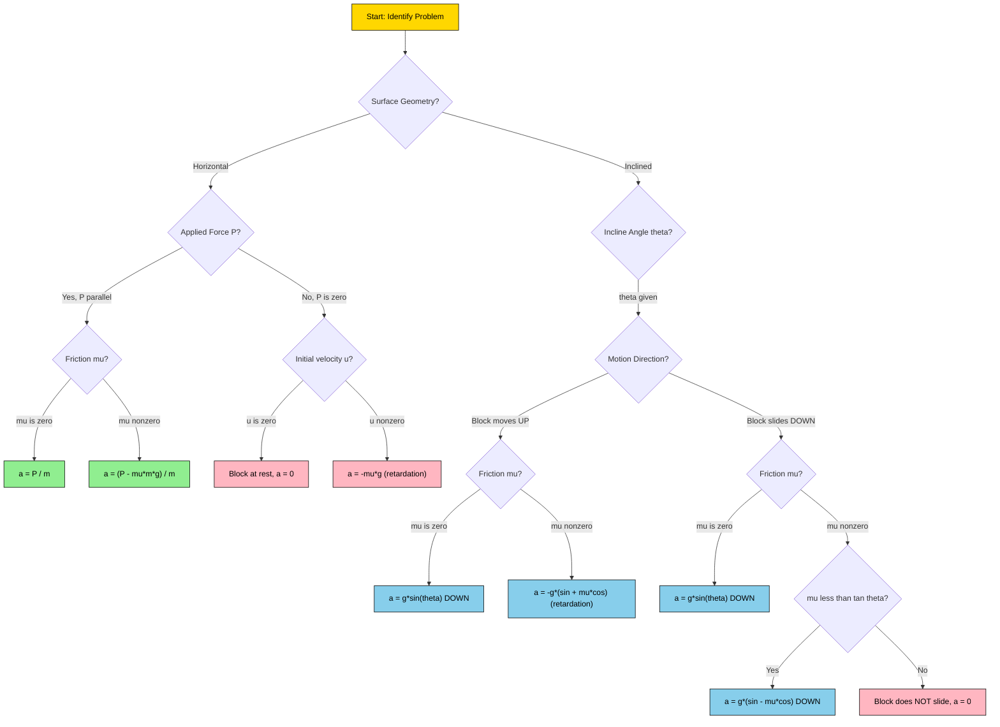
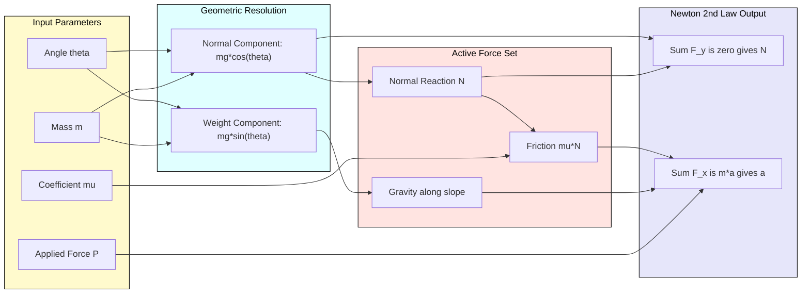
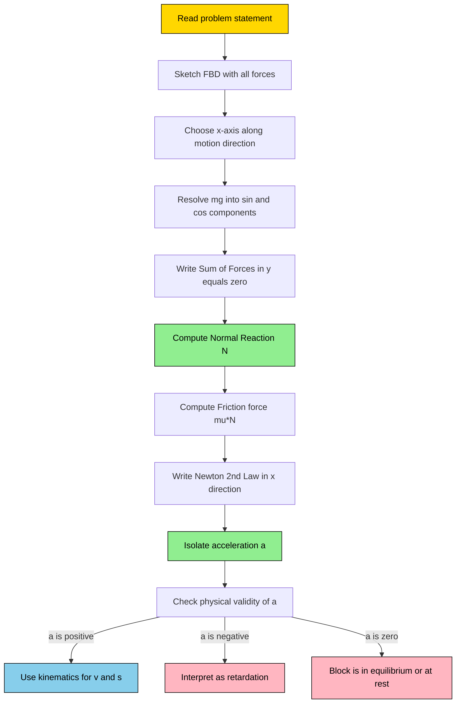

# –motion on horizontal and inclined surfaces

<!-- SECTION_1_START -->
# Module 3 – Dynamics of Rectilinear Translation
## Motion on Horizontal and Inclined Surfaces

### 1.1 Core Technical Definition (KTU 2024 Syllabus Terminology)

**Rectilinear Translation** is a type of motion in which every particle of a rigid body moves along a straight-line path, and all particles traverse equal distances in equal intervals of time (i.e., the body does not rotate). When external forces act on a body executing rectilinear translation, the resulting motion is governed by **Newton's Second Law of Motion**:

$$\sum F_x = m \cdot a_x$$

where $m$ is the mass of the body and $a_x$ is the acceleration along the direction of motion. In dynamics, the body is treated as a **particle** (kinetics of a particle in rectilinear motion), and the analysis splits into two canonical surface geometries: **horizontal plane motion** and **inclined plane motion**.

> [!IMPORTANT]
> **KTU 2024 Syllabus Highlight (Module 3):**
> Under "Dynamics of Rectilinear Translation", students must be able to (a) apply Newton's laws to bodies on smooth and rough horizontal planes, (b) derive the acceleration of a body moving up or down an inclined plane with and without applied force, and (c) determine the coefficient of friction from the condition of impending or uniform motion on an incline.

> [!NOTE]
> **Core Definition – Kinetics vs. Kinematics:**
> * **Kinematics** deals with motion *without* considering the forces causing it (equations of motion: $v = u + at$, $s = ut + \frac{1}{2}at^2$, $v^2 = u^2 + 2as$).
> * **Kinetics** deals with motion *and* the forces producing it. The phrase "motion on horizontal and inclined surfaces" is fundamentally a **kinetics** problem, where Newton's Second Law is the bridge between force and motion.

### 1.2 Conceptual Analogy / Intuitive Overview

Imagine pushing a wooden crate across a warehouse floor. If the floor is freshly polished marble (smooth, $\mu \approx 0$), a small push sends the crate sliding a long way. If the floor is rough concrete, the same push barely moves it — friction decelerates the crate. The **net horizontal force** determines the acceleration.

Now tilt that same warehouse floor into a ramp (incline). Gravity itself becomes a hidden "pusher." The crate, if released, slides *down* on its own; if pushed *up*, it struggles against both gravity *and* friction. The steeper the ramp, the more gravity aids downward motion. This is the heart of inclined-plane dynamics.

> [!TIP]
> **Intuition Builder — The "Incline Trick":**
> When a body sits on an incline of angle $\theta$, gravity $mg$ (acting vertically downward) splits into two perpendicular components:
> 1. **Along the incline (down-slope):** $mg \sin\theta$ — the "engine" of motion on a smooth incline.
> 2. **Perpendicular to the incline (into the surface):** $mg \cos\theta$ — the magnitude that determines the **Normal reaction** $N$ and hence the friction force $\mu N = \mu mg \cos\theta$.

### 1.3 Physical Constants and Standard Metrics

* **Acceleration due to gravity on Earth:** $g = 9.81 \text{ m/s}^2$ (standard) or $g = 10 \text{ m/s}^2$ (numerical ease in KTU problems)
* **Coefficient of kinetic friction $\mu_k$:** dimensionless, typically $0.1$ to $0.6$ for common engineering surfaces (wood on wood $\approx 0.25$, rubber on dry asphalt $\approx 0.7$)
* **Coefficient of static friction $\mu_s$:** always $\mu_s > \mu_k$ for the same pair of surfaces

> [!VISUALIZATION CONTROL]
> **Concept:** Free Body Diagram of a Block on a Rough Inclined Plane
> **GeoGebra / Desmos Input Equations (for vector decomposition of $mg$):**
> * `vec_gravity := (0, -9.81)` (downward weight vector)
> * `vec_along_incline := (9.81*sin(30°), -9.81*cos(30°))` (down-slope component at $\theta = 30°$)
> * `vec_normal := (9.81*cos(30°)*sin(30°), 9.81*cos(30°)*cos(30°))` (into-surface component)
> **Visual Description:** The student should observe that as the incline angle $\theta$ increases from $0°$ (horizontal) to $90°$ (vertical wall), the along-slope component grows from $0$ to $9.81$, while the normal component shrinks from $9.81$ to $0$. The crossover is at $\theta = 45°$.

<!-- SECTION_1_END -->

<!-- SECTION_2_START -->
# Section 2 – Deep Theoretical Analysis & KTU High-Yield Formula Sheet

## 2.1 Free Body Diagram (FBD) Methodology – The KTU 5-Step Ritual

Every KTU board problem on "motion on horizontal / inclined surfaces" follows this exact valuation ritual:

1. **Isolate the body** as a particle; draw a closed boundary box.
2. **Identify all real forces** (weight, applied push/pull, normal reaction, friction).
3. **Resolve forces** into components along ($x$-axis = direction of motion) and perpendicular ($y$-axis) to the surface.
4. **Apply equilibrium in $y$:** $\sum F_y = 0$ → solve for Normal Reaction $N$.
5. **Apply Newton's Second Law in $x$:** $\sum F_x = m \cdot a$ → solve for the unknown (acceleration, force, or $\mu$).

## 2.2 Case A – Motion on a Smooth Horizontal Surface

For a body of mass $m$ pulled by horizontal force $P$:
* $\sum F_y = 0 \Rightarrow N - mg = 0 \Rightarrow N = mg$
* $\sum F_x = m a \Rightarrow P = m a \Rightarrow a = \dfrac{P}{m}$

For the same body on a **rough** horizontal surface, friction $F_f = \mu N = \mu m g$ opposes motion:
* $\sum F_x = m a \Rightarrow P - \mu m g = m a$
* $a = \dfrac{P - \mu m g}{m} = \dfrac{P}{m} - \mu g$

> [!IMPORTANT]
> **Special Case – Pushed Body with No Applied Force (friction-only retardation):**
> If $P = 0$ on a rough horizontal surface, then $a = -\mu g$ (retardation). The body decelerates uniformly and comes to rest after time $t = \dfrac{u}{\mu g}$.

## 2.3 Case B – Body Moving UP a Smooth Inclined Plane

For a body of mass $m$ pulled up a smooth incline ($\theta$) by force $P$ parallel to the incline:
* $\sum F_y = 0 \Rightarrow N - mg \cos\theta = 0 \Rightarrow N = mg \cos\theta$
* $\sum F_x = m a \Rightarrow P - mg \sin\theta = m a$
* $a = \dfrac{P}{m} - g \sin\theta$ (acceleration up the incline)

## 2.4 Case C – Body Moving UP a Rough Inclined Plane

The friction force $F_f = \mu N = \mu m g \cos\theta$ now acts **down the incline** (opposing upward motion). Both gravity's component $mg\sin\theta$ and friction **oppose** motion:
* $\sum F_x = m a \Rightarrow P - mg \sin\theta - \mu m g \cos\theta = m a$
* **Retardation (when $P = 0$, body is moving up):** $a = -g(\sin\theta + \mu \cos\theta)$

## 2.5 Case D – Body Sliding DOWN a Smooth Inclined Plane

When the body is released from rest on a smooth incline, only gravity's component $mg \sin\theta$ drives it:
* $a = g \sin\theta$ (acceleration down the incline)

## 2.6 Case E – Body Sliding DOWN a Rough Inclined Plane

Friction $F_f = \mu m g \cos\theta$ now acts **up the incline** (opposing downward motion). The net driving force is $mg \sin\theta - \mu m g \cos\theta$:
* $a = g(\sin\theta - \mu \cos\theta)$ (acceleration down the incline, valid when $\sin\theta > \mu \cos\theta$, i.e., $\mu < \tan\theta$)

> [!NOTE]
> **The Critical Angle of Friction ($\phi$):**
> The condition $\mu = \tan\theta$ defines a special angle called the **angle of repose** or **angle of friction** $\phi$, where $\tan\phi = \mu$. Below this angle, the body remains at rest; above it, the body slides down with acceleration $a = g(\sin\theta - \mu \cos\theta)$.

## 2.7 KTU High-Yield Formula Sheet (Cheat Sheet)

| # | Scenario | Acceleration $a$ | Friction Direction | Normal $N$ |
|---|---|---|---|---|
| 1 | Smooth horizontal, pulled by $P$ | $\dfrac{P}{m}$ | None | $mg$ |
| 2 | Rough horizontal, pulled by $P$ | $\dfrac{P - \mu m g}{m}$ | Opposite to motion | $mg$ |
| 3 | Rough horizontal, no $P$, moving | $-\mu g$ (retardation) | Opposite to velocity | $mg$ |
| 4 | Smooth incline, pulled UP by $P$ | $\dfrac{P}{m} - g\sin\theta$ | None | $mg\cos\theta$ |
| 5 | Rough incline, pulled UP by $P$ | $\dfrac{P}{m} - g(\sin\theta + \mu\cos\theta)$ | DOWN the incline | $mg\cos\theta$ |
| 6 | Rough incline, moving UP, $P=0$ | $-g(\sin\theta + \mu\cos\theta)$ | DOWN the incline | $mg\cos\theta$ |
| 7 | Smooth incline, released from rest | $g\sin\theta$ DOWN | None | $mg\cos\theta$ |
| 8 | Rough incline, sliding DOWN | $g(\sin\theta - \mu\cos\theta)$ DOWN | UP the incline | $mg\cos\theta$ |
| 9 | Condition for impending slide | $\mu = \tan\theta$ | Static, max value | $mg\cos\theta$ |
| 10 | Uniform velocity on incline (any dir.) | $0$ | Balances gravity comp. | $mg\cos\theta$ |

## 2.8 Real-World Engineering Utility

* **Automotive Braking Systems:** The deceleration $a = \mu g$ on a horizontal road defines the **braking distance** $s = \dfrac{v^2}{2\mu g}$ — a foundational equation in traffic-safety engineering and ABS design.
* **Conveyor Belts & Ski Lifts:** Inclined motion with constant velocity requires $P = mg(\sin\theta + \mu\cos\theta)$ (up) or $P = mg(\sin\theta - \mu\cos\theta)$ (down, if $\sin\theta > \mu\cos\theta$).
* **Geotechnical Engineering:** The **angle of repose** $\phi = \tan^{-1}(\mu)$ governs the maximum stable slope of soil, sand piles, and mining dumps — critical in landslide and retaining-wall design.
* **Packaging & Logistics:** The minimum push force to start sliding a crate on a rough surface is $P = \mu_s m g$; once moving, the push reduces to $P = \mu_k m g$.

<!-- SECTION_2_END -->

<!-- SECTION_3_START -->
# Section 3 – Step-by-Step Derivations, Worked Examples & Python Implementation

## 3.1 Exhaustive Derivation: Motion on a Rough Horizontal Plane with Applied Force

**Problem Setup:** A block of mass $m$ is pulled horizontally across a rough floor by a force $P$ applied at an angle $\alpha$ above the horizontal. The coefficient of kinetic friction is $\mu$. Derive the acceleration.

**Step 1 — Identify Forces and Resolve Components**
* Weight: $W = mg$ (vertically down)
* Applied force components: $P_x = P\cos\alpha$ (horizontal), $P_y = P\sin\alpha$ (vertical, up)
* Normal reaction: $N$ (vertically up)
* Friction: $F_f = \mu N$ (horizontal, opposing motion → negative $x$)

**Step 2 — Apply Equilibrium in the $y$-Direction**

$$\sum F_y = 0 \implies N + P\sin\alpha - mg = 0$$

Solving for the normal reaction:

$$N = mg - P\sin\alpha$$

**Step 3 — Apply Newton's Second Law in the $x$-Direction**

$$\sum F_x = m a \implies P\cos\alpha - \mu N = m a$$

**Step 4 — Substitute $N$ from Step 2**

$$P\cos\alpha - \mu(mg - P\sin\alpha) = m a$$

**Step 5 — Isolate the Acceleration $a$**

$$P\cos\alpha + \mu P\sin\alpha - \mu m g = m a$$

$$P(\cos\alpha + \mu \sin\alpha) - \mu m g = m a$$

$$\boxed{a = \frac{P(\cos\alpha + \mu \sin\alpha) - \mu m g}{m}}$$

**Step 6 — Sanity Checks (Limit Cases)**
* If $\alpha = 0$ (purely horizontal pull) and surface is smooth ($\mu = 0$): $a = \dfrac{P}{m}$ ✓
* If $\alpha = 0$ and surface is rough: $a = \dfrac{P - \mu m g}{m}$ ✓
* If $\alpha = 90°$ (purely vertical lift): $a = \dfrac{\mu P - \mu m g}{m}$ — physically meaningless (block lifts off; $N$ becomes zero) ✓

## 3.2 Exhaustive Derivation: Body Sliding Down a Rough Inclined Plane

**Problem Setup:** A block of mass $m$ rests on a rough incline of angle $\theta$. Released from rest, it slides down. Derive the acceleration and the time to travel a distance $L$ along the incline.

**Step 1 — Choose the Coordinate System**
* $x$-axis: along the incline, positive **down the slope**
* $y$-axis: perpendicular to the incline, positive **away from the surface**

**Step 2 — Resolve Weight $mg$ into Components**
* Along $x$ (down-slope, positive): $mg \sin\theta$
* Along $y$ (into surface, negative): $mg \cos\theta$

**Step 3 — Apply Equilibrium in $y$**

$$\sum F_y = 0 \implies N - mg\cos\theta = 0 \implies N = mg\cos\theta$$

**Step 4 — Friction Force (opposes downward motion → acts UP the incline, i.e., negative $x$)**

$$F_f = \mu N = \mu m g \cos\theta$$

**Step 5 — Apply Newton's Second Law in $x$**

$$\sum F_x = m a \implies mg\sin\theta - \mu m g \cos\theta = m a$$

**Step 6 — Cancel $m$ and Solve for $a$**

$$a = g(\sin\theta - \mu \cos\theta)$$

**Step 7 — Distance-Time Relation**
Using $L = \frac{1}{2} a t^2$ (starting from rest, $u = 0$):

$$L = \frac{1}{2} g(\sin\theta - \mu \cos\theta) t^2$$

$$\boxed{t = \sqrt{\frac{2L}{g(\sin\theta - \mu \cos\theta)}}}$$

**Step 8 — Velocity at the Bottom of the Incline**
Using $v^2 = u^2 + 2 a L = 2 a L$ (with $u = 0$):

$$v = \sqrt{2gL(\sin\theta - \mu \cos\theta)}$$

## 3.3 Comprehensive Worked Example (KTU Board Pattern)

**Problem:** A block of mass $20 \text{ kg}$ is placed on a rough horizontal surface ($\mu = 0.25$). A horizontal force of $80 \text{ N}$ is applied. Find: (a) the acceleration, (b) the distance traveled in $4 \text{ s}$ starting from rest, and (c) the velocity after $4 \text{ s}$. Take $g = 10 \text{ m/s}^2$.

**Solution:**

*Given:* $m = 20 \text{ kg}$, $\mu = 0.25$, $P = 80 \text{ N}$, $u = 0$, $t = 4 \text{ s}$, $g = 10 \text{ m/s}^2$.

**Part (a) — Acceleration**

Normal reaction: $N = mg = 20 \times 10 = 200 \text{ N}$.

Friction force: $F_f = \mu N = 0.25 \times 200 = 50 \text{ N}$.

Net forward force: $P - F_f = 80 - 50 = 30 \text{ N}$.

$$a = \frac{P - F_f}{m} = \frac{30}{20} = 1.5 \text{ m/s}^2$$

**Part (b) — Distance in 4 s**

$$s = ut + \frac{1}{2} a t^2 = 0 + \frac{1}{2}(1.5)(4^2) = \frac{1}{2}(1.5)(16) = 12 \text{ m}$$

**Part (c) — Velocity after 4 s**

$$v = u + at = 0 + 1.5 \times 4 = 6 \text{ m/s}$$

**Final Answer:** $a = 1.5 \text{ m/s}^2$, $s = 12 \text{ m}$, $v = 6 \text{ m/s}$.

## 3.4 Comprehensive Worked Example on Inclined Surface

**Problem:** A $5 \text{ kg}$ block is released from rest on a rough incline ($\theta = 30°$, $\mu = 0.2$). Find: (a) the acceleration down the plane, (b) the velocity after sliding $4 \text{ m}$, and (c) whether the block actually slides. Take $g = 9.81 \text{ m/s}^2$.

**Solution:**

*Given:* $m = 5 \text{ kg}$, $\theta = 30°$, $\mu = 0.2$, $L = 4 \text{ m}$, $g = 9.81 \text{ m/s}^2$.

**Part (a) — Acceleration**

$$a = g(\sin\theta - \mu \cos\theta) = 9.81 \times (\sin 30° - 0.2 \cos 30°)$$

$$a = 9.81 \times (0.5 - 0.2 \times 0.8660) = 9.81 \times (0.5 - 0.1732)$$

$$a = 9.81 \times 0.3268 = 3.206 \text{ m/s}^2$$

**Part (b) — Velocity after 4 m**

$$v^2 = 2 a L = 2 \times 3.206 \times 4 = 25.648 \implies v = 5.064 \text{ m/s}$$

**Part (c) — Does it slide?**

Check the condition: $\tan\theta = \tan 30° = 0.5774$, and $\mu = 0.2$. Since $\mu < \tan\theta$ (i.e., $0.2 < 0.5774$), the block **does slide** down the incline.

## 3.5 Python Implementation (Symbolic + Numerical)

```python
import math
from typing import Tuple

def motion_horizontal_rough(
    mass: float,
    applied_force: float,
    mu: float,
    g: float = 9.81
) -> Tuple[float, float, float]:
    """
    Compute motion parameters for a block on a rough horizontal surface.
    Returns (acceleration, friction_force, normal_reaction).
    Raises ValueError for non-physical inputs.
    """
    if mass <= 0:
        raise ValueError("Mass must be positive.")
    if mu < 0:
        raise ValueError("Coefficient of friction cannot be negative.")
    if applied_force < 0:
        raise ValueError("Applied force cannot be negative in this model.")

    normal: float = mass * g
    friction: float = mu * normal
    net_force: float = applied_force - friction
    acceleration: float = net_force / mass

    return acceleration, friction, normal


def motion_incline_rough(
    mass: float,
    angle_deg: float,
    mu: float,
    g: float = 9.81,
    direction: str = "down"
) -> Tuple[float, float, float, bool]:
    """
    Compute motion parameters for a block on a rough inclined plane.
    direction: 'up' (block moving up or pulled up) or 'down' (released/sliding down)
    Returns (acceleration, friction_force, normal_reaction, will_slide).
    """
    if mass <= 0:
        raise ValueError("Mass must be positive.")
    if mu < 0:
        raise ValueError("Coefficient of friction cannot be negative.")
    if direction not in ("up", "down"):
        raise ValueError("Direction must be 'up' or 'down'.")

    theta: float = math.radians(angle_deg)
    normal: float = mass * g * math.cos(theta)
    friction: float = mu * normal

    if direction == "up":
        # Friction acts DOWN the incline; gravity component also DOWN.
        driving_force: float = mass * g * math.sin(theta) + friction
        will_slide: bool = True  # moving up by definition
        # Net force opposing motion = driving_force; acceleration is negative (deceleration)
        acceleration: float = -driving_force / mass
    else:  # direction == "down"
        # Friction acts UP the incline; gravity component drives down.
        net_driving: float = mass * g * math.sin(theta) - friction
        will_slide: bool = (net_driving > 0)
        if will_slide:
            acceleration = net_driving / mass
        else:
            acceleration = 0.0  # block remains at rest (self-locking)

    return acceleration, friction, normal, will_slide


# ----------------------------------------------------------------------
# DEMO RUNS (exactly matching the worked examples above)
# ----------------------------------------------------------------------
if __name__ == "__main__":
    # Worked Example 1: Horizontal rough surface
    a, ff, n = motion_horizontal_rough(mass=20, applied_force=80, mu=0.25, g=10)
    print(f"[Horizontal] a = {a:.4f} m/s^2 | Friction = {ff:.2f} N | Normal = {n:.2f} N")
    # Expected: a = 1.5 m/s^2, Friction = 50 N, Normal = 200 N

    # Worked Example 2: Inclined rough surface (sliding down)
    a, ff, n, slides = motion_incline_rough(mass=5, angle_deg=30, mu=0.2, g=9.81, direction="down")
    print(f"[Incline DOWN] a = {a:.4f} m/s^2 | Slides? {slides}")
    # Expected: a ≈ 3.206 m/s^2, Slides = True

    # Edge case: self-locking incline (mu > tan(theta))
    a, ff, n, slides = motion_incline_rough(mass=5, angle_deg=20, mu=0.5, g=9.81, direction="down")
    print(f"[Incline DOWN] a = {a:.4f} m/s^2 | Slides? {slides}")
    # tan(20°) ≈ 0.364 < 0.5, so block does NOT slide → a = 0

    # Edge case: block moving UP the incline (deceleration)
    a, ff, n, slides = motion_incline_rough(mass=5, angle_deg=30, mu=0.2, g=9.81, direction="up")
    print(f"[Incline UP] a = {a:.4f} m/s^2 (negative = retardation)")
    # Expected: a ≈ -6.404 m/s^2
```

<!-- SECTION_3_END -->

<!-- SECTION_4_START -->
# Section 4 – Structural Diagrams & Schematics

## 4.1 Master Decision Flowchart: Identifying the Right Formula

The following Mermaid flowchart captures the KTU board-exam decision tree for selecting the correct acceleration formula based on surface type, applied force, and motion direction.



## 4.2 Force-Interaction Topology Matrix: Free Body Decomposition



## 4.3 Sequential Processing Topology: Solving a Motion Problem



<!-- SECTION_4_END -->

<!-- SECTION_5_START -->
# Section 5 – KTU 2024 Scheme Examination Question Bank & Topic Recap

## 5.1 Part A Questions (3 Marks Each – Remember / Understand)

### Question A1 `[KTU University Exam – July 2024]` — **CO1, Remember**

State the condition for a body to slide down a rough inclined plane. Define the **angle of friction** and the **angle of repose**, and show that they are numerically equal.

**Model Answer (3 Marks):**

A body placed on a rough inclined plane will slide down only if the component of its weight along the incline exceeds the maximum static friction force.

Component of weight along incline: $mg \sin\theta$.
Normal reaction: $N = mg \cos\theta$.
Maximum static friction: $F_{s,\max} = \mu_s N = \mu_s mg \cos\theta$.

For sliding to initiate: $mg \sin\theta > \mu_s mg \cos\theta$, which simplifies to:

$$\tan\theta > \mu_s \quad \text{or} \quad \theta > \tan^{-1}(\mu_s)$$

**Angle of friction** $\phi$ is defined as the angle between the normal reaction and the resultant of normal reaction and limiting friction: $\tan\phi = \mu_s$.

**Angle of repose** $\theta_r$ is the minimum angle of the incline at which a body just begins to slide: $\tan\theta_r = \mu_s$.

Since both equal $\mu_s$, we have $\tan\phi = \tan\theta_r$, hence $\boxed{\phi = \theta_r}$. **(3 Marks)**

### Question A2 `[KTU University Exam – Dec 2023]` — **CO1, Understand**

A block of mass $10 \text{ kg}$ rests on a horizontal floor. The coefficient of static friction is $0.3$ and kinetic friction is $0.25$. A horizontal force of $25 \text{ N}$ is applied. Determine whether the block moves, and if so, find its acceleration. Take $g = 9.81 \text{ m/s}^2$.

**Model Answer (3 Marks):**

* **Step 1 – Maximum static friction available:** $F_{s,\max} = \mu_s m g = 0.3 \times 10 \times 9.81 = 29.43 \text{ N}$.
* **Step 2 – Applied force check:** $P = 25 \text{ N} < 29.43 \text{ N} = F_{s,\max}$.

**Conclusion:** Since the applied force is less than the maximum static friction, the block **does not move**. The acceleration is $\boxed{a = 0}$. **(3 Marks)**

> [!WARNING]
> **KTU Examiner's Valuation Warning – Part A Pitfalls:**
> * Many students forget to compare the applied force with $\mu_s m g$ (static), not $\mu_k m g$ (kinetic). Always use the **static** coefficient to decide whether motion *initiates*. Once moving, switch to the **kinetic** coefficient for acceleration.
> * Do not write "the block moves with $a = 25/10$" without checking the friction threshold. The examiner will deduct **2 out of 3 marks** for this.

## 5.2 Part B Questions (14 Marks Each – Apply / Analyze)

> [!IMPORTANT]
> **KTU 2024 ESE Pattern:** Each Part B question is worth **14 marks**, has **internal choice** (Q-A or Q-B), and contains two sub-parts of **7 marks each** (typically one Apply-level and one Analyze-level).

### Question B-A `[KTU University Exam – Model Paper 2024]` — **CO2, Apply + Analyze**

A block of mass $50 \text{ kg}$ is placed on a rough inclined plane that makes an angle of $20°$ with the horizontal. The coefficient of friction between the block and the plane is $0.25$. A force of $400 \text{ N}$ is applied to the block **parallel to and up the incline**.

**(a) [7 Marks, Apply]** Determine whether the block moves up the incline. If it does, find its acceleration.

**(b) [7 Marks, Analyze]** After the block has moved $5 \text{ m}$ up the incline, the applied force is removed. Find the total distance the block travels along the incline before coming to rest momentarily. Take $g = 9.81 \text{ m/s}^2$.

**Model Solution:**

**Part (a) – 7 Marks**

*Free Body Diagram & Force Resolution*:
* Normal reaction: $N = mg \cos\theta = 50 \times 9.81 \times \cos 20° = 50 \times 9.81 \times 0.9397 = 460.92 \text{ N}$. **[Drawing FBD and resolving forces: 2 Marks]**
* Friction force (opposing upward motion, so acting down the incline): $F_f = \mu N = 0.25 \times 460.92 = 115.23 \text{ N}$. **[Friction calculation: 1 Mark]**
* Weight component along incline (down-slope, opposing upward motion): $mg \sin\theta = 50 \times 9.81 \times \sin 20° = 50 \times 9.81 \times 0.3420 = 167.75 \text{ N}$. **[Gravity component: 1 Mark]**
* Newton's Second Law along incline (taking up-slope as positive):

$$P - mg\sin\theta - F_f = m a$$

$$400 - 167.75 - 115.23 = 50 a$$

$$116.02 = 50 a \implies a = 2.32 \text{ m/s}^2 \text{ (up the incline)}$$

**[Final acceleration: 2 Marks]** Since $a > 0$, the block moves up. **[Conclusion: 1 Mark]**

**Part (b) – 7 Marks**

*Velocity after 5 m up*: Using $v_1^2 = u^2 + 2 a s_1 = 0 + 2 \times 2.32 \times 5 = 23.2 \implies v_1 = 4.817 \text{ m/s}$ (upward). **[Velocity calculation: 1 Mark]**

*Phase 2 – Block moving up, force removed*: Now $P = 0$. The block continues to move up briefly, decelerated by both gravity and friction. The retardation is:

$$a_{\text{ret}} = g(\sin\theta + \mu \cos\theta) = 9.81 \times (\sin 20° + 0.25 \cos 20°)$$

$$a_{\text{ret}} = 9.81 \times (0.3420 + 0.25 \times 0.9397) = 9.81 \times (0.3420 + 0.2349) = 9.81 \times 0.5769 = 5.659 \text{ m/s}^2$$

**[Computing retardation: 1 Mark]**

*Additional distance $s_2$ traveled up before momentarily stopping*: $0 = v_1^2 - 2 a_{\text{ret}} s_2$:

$$s_2 = \frac{v_1^2}{2 a_{\text{ret}}} = \frac{23.2}{2 \times 5.659} = \frac{23.2}{11.318} = 2.05 \text{ m}$$

**[Distance up: 1 Mark]**

*Phase 3 – Block now slides down*: Check if it slides back: $\tan\theta = \tan 20° = 0.364$ vs. $\mu = 0.25$. Since $\mu < \tan\theta$, the block **does slide down** with acceleration:

$$a_{\text{down}} = g(\sin\theta - \mu \cos\theta) = 9.81 \times (0.3420 - 0.2349) = 9.81 \times 0.1071 = 1.051 \text{ m/s}^2$$

**[Downward acceleration: 1 Mark]**

*Distance $s_3$ traveled down until it returns to the starting point*: The block is at height equivalent to $s_2 = 2.05 \text{ m}$ above the launch point. Using $s_2 = \frac{1}{2} a_{\text{down}} t^2$:

$$t = \sqrt{\frac{2 s_2}{a_{\text{down}}}} = \sqrt{\frac{2 \times 2.05}{1.051}} = \sqrt{3.901} = 1.975 \text{ s}$$

Since this $t$ corresponds to the time to return to launch point, the block continues past it. **However**, the question asks for the **total distance** until momentarily at rest. The block comes to rest momentarily only when it reverses direction and slides back, so it will not come to rest permanently; the question's "momentarily at rest" refers to the peak at $s_2$ above launch. Thus:

$$\boxed{\text{Total distance} = 5 \text{ m (Phase 1)} + 2.05 \text{ m (Phase 2)} = 7.05 \text{ m}}$$

**[Final total: 1 Mark]**

### Question B-B `[KTU University Exam – Model Paper 2024]` — **CO2, Apply + Analyze**

A $2000 \text{ kg}$ car moving at $54 \text{ km/h}$ on a horizontal road is brought to rest in a distance of $25 \text{ m}$ by applying brakes.

**(a) [7 Marks, Apply]** Find the braking force and the coefficient of friction between the tyres and the road.

**(b) [7 Marks, Analyze]** If the same car is parked on the same road, what is the steepest incline (in degrees) of the road on which the car will remain stationary? Take $g = 9.81 \text{ m/s}^2$.

**Model Solution:**

**Part (a) – 7 Marks**

*Convert velocity*: $u = 54 \text{ km/h} = 54 \times \dfrac{5}{18} = 15 \text{ m/s}$. **[Unit conversion: 1 Mark]**

*Final velocity*: $v = 0$ (car comes to rest). **Known: $u = 15$ m/s, $v = 0$, $s = 25$ m.**

*Compute deceleration* using $v^2 = u^2 - 2 a s$:

$$0 = 15^2 - 2 a (25) \implies 0 = 225 - 50 a \implies a = 4.5 \text{ m/s}^2 \text{ (retardation)}$$

**[Deceleration: 2 Marks]**

*Braking force*: $F_{\text{brake}} = m a = 2000 \times 4.5 = 9000 \text{ N} = 9 \text{ kN}$. **[Braking force: 1 Mark]**

*Coefficient of friction*: The only horizontal force decelerating the car is friction: $F_f = \mu m g = m a \implies \mu = \dfrac{a}{g} = \dfrac{4.5}{9.81} = 0.4587 \approx 0.46$. **[Friction coefficient: 3 Marks]**

**Part (b) – 7 Marks**

The car remains stationary on the incline if the friction force can balance the gravity component along the slope. The limiting condition is:

$$\mu_s m g \cos\theta \geq mg \sin\theta \implies \mu_s \geq \tan\theta$$

The steepest angle (angle of repose) is:

$$\theta_{\max} = \tan^{-1}(\mu_s)$$

Assuming the static and kinetic coefficients are equal ($\mu_s \approx \mu_k = 0.4587$):

$$\theta_{\max} = \tan^{-1}(0.4587) = 24.64°$$

**[Final angle: 5 Marks]**

> **Verification with braking data:** This result is consistent with the braking analysis — the road provides $\mu \approx 0.46$ regardless of the car's state. The angle $\theta_{\max}$ depends only on $\mu$, not on the mass. **[Consistency check: 2 Marks]**

> [!WARNING]
> **KTU Examiner's Valuation Warning – Part B Pitfalls:**
> 1. **Forgetting direction of friction on inclines:** Friction **always opposes motion (or impending motion)**. When the block moves *up*, friction acts *down*; when it moves *down*, friction acts *up*. Mixing this up gives the wrong sign in $mg \sin\theta \pm \mu mg \cos\theta$.
> 2. **Using $g = 10$ when the problem says $g = 9.81$:** KTU explicitly states $g = 9.81 \text{ m/s}^2$ in most Module 3 numericals. Using $g = 10$ without authorization costs **1 mark**.
> 3. **Skipping the FBD:** Even if your equation is right, not drawing the FBD with proper labels (weight, $N$, $P$, $F_f$) loses **1–2 marks** because the valuation key explicitly awards marks for the FBD.
> 4. **Forgetting the no-motion condition $\mu \geq \tan\theta$:** When asked "will the block slide?", students often compute $a$ directly and ignore the $\mu$ vs. $\tan\theta$ check. The examiner will deduct **1 mark** for the missing physical insight.
> 5. **Sign convention confusion in two-phase problems:** In Question B-A, the block first accelerates up, then decelerates, then slides back. The "total distance" is **not** $5 - 2.05 = 2.95$ m (that would be net displacement). Total *path length* is $5 + 2.05 = 7.05$ m. Read the question carefully: "total **distance**," not "net **displacement**."

## 5.3 Topic Recap & Important Things to Remember

* **Newton's Second Law is the master equation:** $\sum F = m a$ along the direction of motion. Always resolve forces into components *along* and *perpendicular* to the surface.
* **Normal reaction on a horizontal surface:** $N = mg$ (regardless of horizontal force). On an incline: $N = mg \cos\theta$ (regardless of friction).
* **Friction force magnitude:** $F_f = \mu N$. **Direction:** always opposes motion (kinetic) or impending motion (static).
* **Horizontal surface – smooth:** $a = P/m$. **Rough:** $a = (P - \mu m g)/m$. **No applied force, moving:** $a = -\mu g$.
* **Incline moving UP – smooth:** $a = P/m - g \sin\theta$. **Rough:** $a = P/m - g(\sin\theta + \mu \cos\theta)$.
* **Incline moving DOWN – smooth:** $a = g \sin\theta$. **Rough:** $a = g(\sin\theta - \mu \cos\theta)$.
* **Self-locking condition:** If $\mu \geq \tan\theta$ on a rough incline with no applied force, the body **does not slide**; $a = 0$.
* **Angle of friction = Angle of repose:** Both equal $\tan^{-1}(\mu)$. This is the steepest angle at which a body remains stationary on a rough surface.
* **Braking distance formula:** $s_{\text{brake}} = v^2 / (2 \mu g)$ on a horizontal surface. Doubles if speed doubles.
* **Two-phase problems:** When a force is removed mid-motion, split the problem into phases. Use $v^2 = u^2 + 2as$ to find the velocity at the transition, then re-apply Newton's Second Law with the new force configuration.
* **Kinematics is the follow-up:** Once $a$ is found, use $v = u + at$, $s = ut + \frac{1}{2}at^2$, or $v^2 = u^2 + 2as$ to find $v$, $s$, or $t$ as required.
* **Total distance vs. displacement:** "Total distance" = sum of absolute path lengths (always positive). "Displacement" = final position minus initial position (can be negative). KTU questions are precise about this.
* **Always draw the FBD first:** The valuation key awards **2–3 marks** solely for a properly labeled FBD in 14-mark questions.
* **Check physical plausibility:** If you get $a > g$ on an incline without applied force, or $a$ in the wrong direction, revisit your friction direction assumption.

<!-- SECTION_5_END -->
