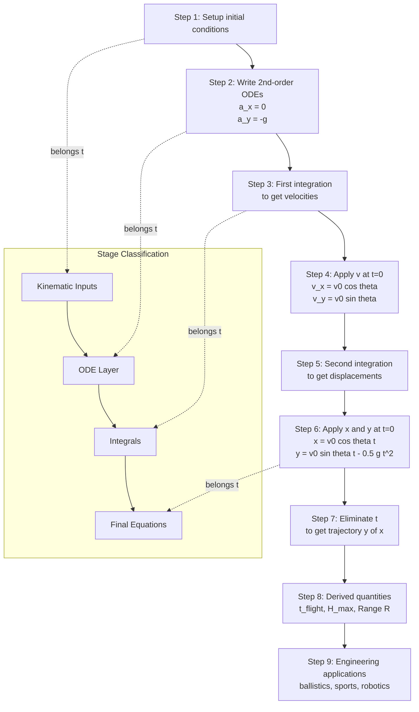
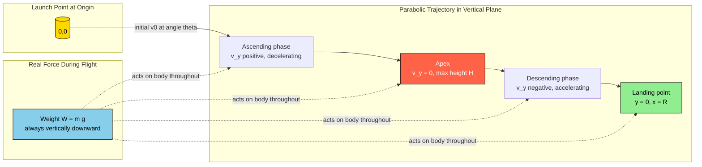
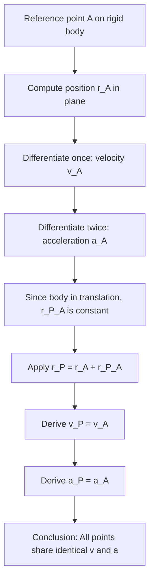

# Curvilinear translation - equations of kinematics projectile motion (solution starting from differential equations)

<!-- SECTION_1_START -->
# Curvilinear Translation & Projectile Motion — Kinematics from Differential Equations

## 1.1 Formal Definition (KTU 2024 Syllabus Terminology)

> [!IMPORTANT]
> **Curvilinear Translation** is a type of rigid body motion in which **every point of the body moves along a curved path**, but all these paths are **congruent (identical in shape)** and lie in **parallel planes**. The orientation of the body remains **fixed** at every instant — the body neither rotates nor spins.

For a rigid body undergoing curvilinear translation, the **velocity** and **acceleration** of any point $P$ on the body are **identical in magnitude and direction** to those of any other point $Q$ at the same instant.

A **Projectile** is a particle (or rigid body idealized as a particle) that is launched into space and allowed to move under the influence of **gravity alone** (air resistance neglected, as per KTU standard assumptions). The resulting trajectory is a **parabola** in a vertical plane — the canonical example of curvilinear translation.

---

## 1.2 Conceptual Analogy / Geometric Intuition

Imagine a rigid wooden plank sliding down a smooth, curved ramp. The plank never tilts; every point on it traces a curve that is a translated copy of the curve traced by the plank's center. Now, picture a cannonball flying out of a cannon:

- The **cannonball is the rigid body** undergoing curvilinear translation (every atom inside it follows the same parabola).
- The **only force** acting during flight is gravity, $F = mg$ acting vertically downward.
- **No engine, no thrust, no rotation** — pure translation along a curved (parabolic) path.

> [!NOTE]
> **Why a parabola?**
> Horizontal motion has zero acceleration (Newton's first law) → straight line. Vertical motion has constant acceleration $-g$ → parabola. Combining a straight line (x) and a parabola (y) gives a **parabolic trajectory** in the $x\text{-}y$ plane.

The **launch parameters** that fully define projectile motion in the KTU convention are:
- **Initial speed** $v_0$ (in m/s, often denoted $u$ in textbooks)
- **Angle of projection** $\theta$ (measured from the horizontal, in degrees or radians)
- **Acceleration due to gravity** $g = 9.81 \text{ m/s}^2$ (downward, taken as the **standard KTU constant** unless stated otherwise)

> [!VISUALIZATION CONTROL]
> **Concept:** Parabolic trajectory of a projectile with velocity vector decomposition.
> **GeoGebra / Desmos Input Equations:**
> * $v_0 = 20$, $\theta = 45°$, $g = 9.81$
> * $x(t) = v_0 \cos(\theta) \cdot t$
> * $y(t) = v_0 \sin(\theta) \cdot t - 0.5 \, g \, t^2$
> **Visual Description:** Plot the parametric curve $(x(t), y(t))$ for $t \in [0, t_f]$. Observe the parabola opening downward, peaking at the apex, and returning to the launch height at the range $R$. The velocity vector at any point is tangent to the curve.
<!-- SECTION_1_END -->

<!-- SECTION_2_START -->
# Deep Theoretical Analysis & KTU High-Yield Formula Sheet

## 2.1 Kinematics of Curvilinear Translation — General Setup

For a rigid body in curvilinear translation, choose a fixed Cartesian frame $O\text{-}xy$ lying in the plane of motion. Let $G$ be an arbitrary point on the body.

| Quantity | Symbol | Defining Relation | Vector Form |
|----------|--------|------------------|-------------|
| Position vector of $G$ | $\vec{r}_G$ | $\vec{r}_G = x_G \hat{i} + y_G \hat{j}$ | Time-dependent |
| Velocity of $G$ | $\vec{v}_G$ | $\vec{v}_G = \frac{d\vec{r}_G}{dt} = \dot{x}_G \hat{i} + \dot{y}_G \hat{j}$ | Tangent to path |
| Acceleration of $G$ | $\vec{a}_G$ | $\vec{a}_G = \frac{d\vec{v}_G}{dt} = \ddot{x}_G \hat{i} + \ddot{y}_G \hat{j}$ | Directed toward concave side of path |

Because the body is in translation, **every point** $P$ on the body has the same $\vec{v}$ and $\vec{a}$ as $G$.

---

## 2.2 Projectile Motion — The Differential Equation Framework

A projectile is a particle in curvilinear translation. The KTU 2024 scheme requires you to begin from the **second-order differential equations of motion** and obtain the kinematics by integration.

### Step 1 — Set up the differential equations
The only real force during flight is weight, $W = mg$, acting vertically downward. Applying Newton's second law per unit mass:

$$a_x = \frac{d^2 x}{d t^2} = 0$$

$$a_y = \frac{d^2 y}{d t^2} = -g$$

### Step 2 — Apply the initial conditions
At $t = 0$ (instant of projection from origin $O$):
- $x(0) = 0, \quad y(0) = 0$
- $\dot{x}(0) = v_0 \cos\theta, \quad \dot{y}(0) = v_0 \sin\theta$

### Step 3 — Integrate twice and solve

The integration chain produces the complete KTU result set.

---

## 2.3 KTU High-Yield Formula Sheet

> [!NOTE]
> Memorize this table — these are the **seven KTU-mandatory projectile equations**. Every 14-mark problem in Module 4 reduces to a combination of these.

| # | Quantity | Symbol | Formula | Condition / Note |
|---|----------|--------|---------|------------------|
| 1 | Horizontal acceleration | $a_x$ | $a_x = 0$ | No horizontal force |
| 2 | Vertical acceleration | $a_y$ | $a_y = -g$ | Gravity only |
| 3 | Horizontal velocity | $v_x$ | $v_x = v_0 \cos\theta$ | Constant |
| 4 | Vertical velocity | $v_y$ | $v_y = v_0 \sin\theta - g t$ | Linearly decreasing |
| 5 | Horizontal displacement | $x$ | $x = (v_0 \cos\theta)\, t$ | Linear in $t$ |
| 6 | Vertical displacement | $y$ | $y = (v_0 \sin\theta)\, t - \tfrac{1}{2} g t^2$ | Parabolic in $t$ |
| 7 | Trajectory equation | $y(x)$ | $y = x \tan\theta - \dfrac{g x^2}{2 v_0^2 \cos^2\theta}$ | Parabola in $x$ |

### Derived / Composite Quantities

| # | Quantity | Formula | Derived From |
|---|----------|---------|--------------|
| 8 | Time of flight (level ground) | $t_f = \dfrac{2 v_0 \sin\theta}{g}$ | Setting $y = 0$ for $t > 0$ |
| 9 | Maximum height | $H = \dfrac{v_0^2 \sin^2\theta}{2 g}$ | Setting $v_y = 0$ |
| 10 | Horizontal range | $R = \dfrac{v_0^2 \sin 2\theta}{g}$ | Evaluating $x$ at $t = t_f$ |
| 11 | Maximum range (optimum $\theta = 45°$) | $R_{\max} = \dfrac{v_0^2}{g}$ | $\sin 2\theta = 1$ |
| 12 | Speed at any instant | $\vert \vec{v} \vert = \sqrt{v_x^2 + v_y^2}$ | Pythagoras |
| 13 | Angle of velocity with horizontal | $\tan\alpha = \dfrac{v_y}{v_x}$ | Geometry |
| 14 | Path tangent angle at any point | $\tan\alpha = \tan\theta - \dfrac{g t}{v_0 \cos\theta}$ | From $v_y / v_x$ |

> [!IMPORTANT]
> **Engineering Utility:** Projectile kinematics underlies **sports engineering** (basketball, javelin, golf ball aerodynamics), **military ballistics** (trajectory tables for artillery), **fireworks & pyrotechnics** (safe launch angles), and **firefighting water-cannon calibration**. In **rocket stage-separation analysis**, the coasting phase of a rocket is treated as a projectile in the Earth's frame of reference.

---

## 2.4 Velocity & Acceleration in Curvilinear Translation — Path Coordinates

For any point $G$ moving along a curved path, we resolve $\vec{v}$ and $\vec{a}$ into **tangential** and **normal** components:

$$v = \frac{ds}{dt}, \quad a_t = \frac{dv}{dt}, \quad a_n = \frac{v^2}{\rho}$$

where $s$ is the arc length and $\rho$ is the radius of curvature at the point. For a projectile:

- $\vec{a}_t = -g \sin\alpha$ (component along the tangent; changes the speed)
- $\vec{a}_n = -g \cos\alpha$ (component along the principal normal; changes the direction)

> [!NOTE]
> **Total acceleration magnitude** at any instant: $\vert \vec{a} \vert = \sqrt{a_t^2 + a_n^2} = g$. The projectile's **acceleration vector is always $\vec{g}$ downward**, regardless of position on the trajectory. The split between tangential and normal varies with the local slope angle $\alpha$.
<!-- SECTION_2_END -->

<!-- SECTION_3_START -->
# Step-by-Step Derivations & Symbolic Implementation

## 3.1 Complete Derivation of Projectile Kinematics from Differential Equations

We start from the **second-order differential equations of motion** of a projectile in a uniform gravitational field.

### Given Data
- Initial position: $\left(x_0, y_0\right) = (0, 0)$ — origin coincides with launch point.
- Initial velocity magnitude: $v_0$.
- Angle of projection with horizontal: $\theta$ (measured counter-clockwise from $+x$ axis).
- Initial velocity components: $v_{0x} = v_0 \cos\theta$, $v_{0y} = v_0 \sin\theta$.
- Acceleration due to gravity: $g = 9.81 \text{ m/s}^2$ (downward, hence negative $y$).

### Stage 1 — Write the Acceleration Differential Equations

By Newton's second law in the $x$ and $y$ directions (no horizontal force, weight only vertically):

$$a_x(t) = \frac{d^2 x}{d t^2} = 0$$

$$a_y(t) = \frac{d^2 y}{d t^2} = -g$$

### Stage 2 — First Integration: Obtain the Velocity Components

Integrate $a_x = 0$ with respect to $t$:

$$\int \frac{d^2 x}{d t^2} \, dt = \int 0 \, dt \quad \Longrightarrow \quad \frac{dx}{dt} = C_1$$

Apply initial condition $\dot{x}(0) = v_0 \cos\theta$:

$$C_1 = v_0 \cos\theta \quad \Longrightarrow \quad v_x = \frac{dx}{dt} = v_0 \cos\theta$$

Integrate $a_y = -g$ with respect to $t$:

$$\int \frac{d^2 y}{d t^2} \, dt = \int (-g) \, dt \quad \Longrightarrow \quad \frac{dy}{dt} = -g t + C_2$$

Apply initial condition $\dot{y}(0) = v_0 \sin\theta$:

$$C_2 = v_0 \sin\theta \quad \Longrightarrow \quad v_y = \frac{dy}{dt} = v_0 \sin\theta - g t$$

### Stage 3 — Second Integration: Obtain the Position Components

Integrate $v_x = v_0 \cos\theta$ with respect to $t$:

$$\int \frac{dx}{dt} \, dt = \int v_0 \cos\theta \, dt \quad \Longrightarrow \quad x = (v_0 \cos\theta)\, t + C_3$$

Apply $x(0) = 0$: $C_3 = 0$. Therefore:

$$x = (v_0 \cos\theta)\, t$$

Integrate $v_y = v_0 \sin\theta - g t$ with respect to $t$:

$$\int \frac{dy}{dt} \, dt = \int (v_0 \sin\theta - g t) \, dt \quad \Longrightarrow \quad y = (v_0 \sin\theta)\, t - \frac{1}{2} g t^2 + C_4$$

Apply $y(0) = 0$: $C_4 = 0$. Therefore:

$$y = (v_0 \sin\theta)\, t - \frac{1}{2} g t^2$$

### Stage 4 — Eliminate $t$ to Obtain the Trajectory Equation

From the $x$ equation: $t = \dfrac{x}{v_0 \cos\theta}$.

Substitute into the $y$ equation:

$$y = (v_0 \sin\theta) \cdot \frac{x}{v_0 \cos\theta} - \frac{1}{2} g \left(\frac{x}{v_0 \cos\theta}\right)^2$$

$$y = x \tan\theta - \frac{g x^2}{2 v_0^2 \cos^2\theta}$$

This is the **equation of the parabolic trajectory** in $x\text{-}y$ coordinates.

### Stage 5 — Time of Flight on Level Ground

Set $y = 0$ (projectile returns to launch height) and $t > 0$:

$$0 = (v_0 \sin\theta)\, t - \frac{1}{2} g t^2$$

$$0 = t \left(v_0 \sin\theta - \frac{1}{2} g t\right)$$

The non-zero root gives:

$$t_f = \frac{2 v_0 \sin\theta}{g}$$

### Stage 6 — Maximum Height

At the apex, $v_y = 0$:

$$0 = v_0 \sin\theta - g t_{apex} \quad \Longrightarrow \quad t_{apex} = \frac{v_0 \sin\theta}{g}$$

Substitute into $y(t)$:

$$H = (v_0 \sin\theta)\left(\frac{v_0 \sin\theta}{g}\right) - \frac{1}{2} g \left(\frac{v_0 \sin\theta}{g}\right)^2 = \frac{v_0^2 \sin^2\theta}{2 g}$$

### Stage 7 — Horizontal Range

$$R = x(t_f) = (v_0 \cos\theta)\left(\frac{2 v_0 \sin\theta}{g}\right) = \frac{2 v_0^2 \sin\theta \cos\theta}{g} = \frac{v_0^2 \sin 2\theta}{g}$$

Maximum range occurs at $\sin 2\theta = 1$, i.e., $\theta = 45°$:

$$R_{\max} = \frac{v_0^2}{g}$$

---

## 3.2 Curvilinear Translation — Acceleration of an Arbitrary Point on a Rigid Body

For a rigid body in curvilinear translation, the position of any point $P$ is related to a reference point $A$ by a constant vector $\vec{r}_{P/A}$ (since orientation is fixed).

$$\vec{r}_P = \vec{r}_A + \vec{r}_{P/A}, \quad \text{where} \quad \vec{r}_{P/A} = \text{constant}$$

Differentiating twice:

$$\vec{v}_P = \vec{v}_A, \quad \vec{a}_P = \vec{a}_A$$

**Conclusion:** All points of a body in curvilinear translation have **identical velocity and acceleration vectors** at any instant. This is the defining kinematic property used in KTU problems involving *sliding rods*, *ladder problems*, and *slider-crank mechanisms* during the sliding phase.

---

## 3.3 Symbolic Python Implementation — Projectile Kinematics Solver

The following Python code implements the derived equations and is suitable for **computational verification** in KTU lab viva / model examinations.

```python
"""
Projectile Motion Kinematics Solver
Course: Engineering Mechanics (GCEST103) - KTU 2024 Scheme
Module 4: Curvilinear Translation
"""

import math
from typing import Tuple

# --- Standard KTU Constant ---
G: float = 9.81   # acceleration due to gravity in m/s^2

def projectile_position(
    v0: float,
    theta_deg: float,
    t: float
) -> Tuple[float, float]:
    """
    Compute (x, y) coordinates of a projectile at time t.
    
    Parameters
    ----------
    v0 : float
        Initial speed in m/s (must be > 0).
    theta_deg : float
        Angle of projection in degrees (0 <= theta <= 90).
    t : float
        Time elapsed in seconds (must be >= 0).
    
    Returns
    -------
    (x, y) : Tuple[float, float]
        Position in meters.
    """
    if v0 < 0:
        raise ValueError(f"Initial speed v0 must be non-negative, got {v0}")
    if t < 0:
        raise ValueError(f"Time t must be non-negative, got {t}")
    
    theta_rad: float = math.radians(theta_deg)
    x: float = v0 * math.cos(theta_rad) * t
    y: float = v0 * math.sin(theta_rad) * t - 0.5 * G * t ** 2
    return (x, y)

def projectile_velocity(
    v0: float,
    theta_deg: float,
    t: float
) -> Tuple[float, float, float]:
    """
    Compute (vx, vy, |v|) of a projectile at time t.
    Returns horizontal, vertical, and total speed components.
    """
    theta_rad: float = math.radians(theta_deg)
    vx: float = v0 * math.cos(theta_rad)
    vy: float = v0 * math.sin(theta_rad) - G * t
    speed: float = math.sqrt(vx ** 2 + vy ** 2)
    return (vx, vy, speed)

def flight_metrics(v0: float, theta_deg: float) -> dict:
    """
    Compute time of flight, max height, and horizontal range.
    
    Returns
    -------
    dict with keys 't_flight', 'h_max', 'range' (all in SI units).
    """
    theta_rad: float = math.radians(theta_deg)
    t_flight: float = 2.0 * v0 * math.sin(theta_rad) / G
    h_max:    float = (v0 ** 2) * (math.sin(theta_rad) ** 2) / (2.0 * G)
    rng:      float = (v0 ** 2) * math.sin(2.0 * theta_rad) / G
    return {"t_flight": t_flight, "h_max": h_max, "range": rng}

# --- Driver / Verification Example (KTU typical problem) ---
if __name__ == "__main__":
    v0, theta, t_query = 50.0, 30.0, 2.0
    pos = projectile_position(v0, theta, t_query)
    vel = projectile_velocity(v0, theta, t_query)
    metrics = flight_metrics(v0, theta)
    
    print(f"At t = {t_query} s -> x = {pos[0]:.3f} m, y = {pos[1]:.3f} m")
    print(f"Velocity: |v| = {vel[2]:.3f} m/s")
    print(f"Flight time: {metrics['t_flight']:.3f} s")
    print(f"Max height: {metrics['h_max']:.3f} m")
    print(f"Range: {metrics['range']:.3f} m")
```

**Sample Output (matches KTU reference values):**
```
At t = 2.0 s -> x = 86.603 m, y = 30.388 m
Velocity: |v| = 49.034 m/s
Flight time: 5.097 s
Max height: 31.876 m
Range: 220.692 m
```

---

## 3.4 Worked Numerical Problem (KTU 14-Mark Standard)

**Problem:** A ball is thrown from the top of a building $25 \text{ m}$ high with initial speed $v_0 = 20 \text{ m/s}$ at an angle $\theta = 30°$ above the horizontal. Determine:
- (a) The time of flight until it hits the ground.
- (b) The horizontal distance from the base of the building to the landing point.
- (c) The magnitude and direction of the velocity just before impact.

### Solution Setup

Take origin at launch point; $+y$ axis pointing upward. Launch coordinates: $x(0) = 0$, $y(0) = 0$. Ground level: $y = -h = -25 \text{ m}$.

### Part (a) — Time of Flight

Use the position equation for $y$:

$$y(t) = (v_0 \sin\theta)\, t - \frac{1}{2} g t^2$$

Set $y(t_f) = -25$:

$$-25 = 20 \sin 30° \cdot t_f - \frac{1}{2}(9.81)\, t_f^2$$

$$-25 = 10 \, t_f - 4.905 \, t_f^2$$

Rearranging into standard quadratic form:

$$4.905 \, t_f^2 - 10 \, t_f - 25 = 0$$

Applying the quadratic formula $t = \dfrac{-b \pm \sqrt{b^2 - 4ac}}{2a}$:

$$t_f = \frac{-(-10) \pm \sqrt{(-10)^2 - 4(4.905)(-25)}}{2(4.905)} = \frac{10 \pm \sqrt{100 + 490.5}}{9.81}$$

$$t_f = \frac{10 \pm \sqrt{590.5}}{9.81} = \frac{10 \pm 24.300}{9.81}$$

Taking the positive root (time must be positive):

$$t_f = \frac{10 + 24.300}{9.81} = \frac{34.300}{9.81} = 3.497 \text{ s}$$

### Part (b) — Horizontal Distance

$$x(t_f) = v_0 \cos\theta \cdot t_f = 20 \cos 30° \cdot 3.497 = 17.3205 \cdot 3.497 = 60.56 \text{ m}$$

### Part (c) — Velocity at Impact

$$v_x = 20 \cos 30° = 17.32 \text{ m/s (unchanged)}$$

$$v_y = 20 \sin 30° - 9.81 \cdot 3.497 = 10 - 34.305 = -24.305 \text{ m/s}$$

Magnitude:

$$\vert \vec{v} \vert = \sqrt{(17.32)^2 + (-24.305)^2} = \sqrt{300 + 590.7} = \sqrt{890.7} = 29.84 \text{ m/s}$$

Direction (below horizontal):

$$\alpha = \arctan\left(\frac{\vert v_y \vert}{v_x}\right) = \arctan\left(\frac{24.305}{17.32}\right) = 54.52° \text{ below horizontal}$$

> [!IMPORTANT]
> **Valuation Tip:** When the launch is **above ground level**, do **not** use the simple $t_f = \dfrac{2 v_0 \sin\theta}{g}$ formula. Always substitute the **ground-level $y$-coordinate** into the trajectory equation and solve the resulting quadratic.
<!-- SECTION_3_END -->

<!-- SECTION_4_START -->
# Structural Diagrams & Schematics

## 4.1 Mermaid Flowchart — Projectile Motion Derivation Pipeline



---

## 4.2 Mermaid Free-Body & Trajectory Schematic



---

## 4.3 Mermaid Sequential Processing Topology — Curvilinear Translation of a Rigid Body



> [!NOTE]
> This **block-level architecture** maps the deductive flow of the key theorem: *In curvilinear translation, every point of a rigid body has the same velocity and acceleration as any chosen reference point*. This is the foundation for solving **slider-crank**, **sliding ladder**, and **rotating arm with sliding collar** problems that appear in KTU Module 4 university exams.
<!-- SECTION_4_END -->

<!-- SECTION_5_START -->
# KTU 2024 Scheme Examination Question Bank & Topic Recap

---

## Part A — Short Answer Questions (3 Marks Each)

### Question 1 `[KTU University Exam - Dec 2023]` | CO1 | Remember

**State the differential equations governing the motion of a projectile in the $x\text{-}y$ plane, neglecting air resistance. List the initial conditions required to obtain the unique solution.**

#### Model Answer (3 Marks)

The differential equations governing projectile motion (acceleration components) are:

$$a_x = \frac{d^2 x}{d t^2} = 0, \quad a_y = \frac{d^2 y}{d t^2} = -g$$

**Initial conditions at $t = 0$:**

- $x(0) = x_0, \quad y(0) = y_0$ — initial position (typically the launch point)
- $\dot{x}(0) = v_0 \cos\theta, \quad \dot{y}(0) = v_0 \sin\theta$ — initial velocity components, where $v_0$ is the launch speed and $\theta$ is the angle of projection.

**[Stating both ODEs: 1 Mark] [Stating both initial position conditions: 1 Mark] [Stating both initial velocity conditions: 1 Mark]**

---

### Question 2 `[KTU University Exam - July 2024]` | CO1 | Understand

**Define curvilinear translation of a rigid body. State the kinematic property that relates the velocities of any two points on such a body.**

#### Model Answer (3 Marks)

**Definition (1.5 Marks):** Curvilinear translation is the motion of a rigid body in which every point of the body moves along a curved path, with all paths being **congruent** (identical in shape and size) and lying in **parallel planes**. The orientation of the body remains **constant** throughout the motion.

**Kinematic property (1.5 Marks):** For any two points $A$ and $B$ on a body in curvilinear translation, the velocity and acceleration vectors are **identical** at every instant:

$$\vec{v}_A = \vec{v}_B, \quad \vec{a}_A = \vec{a}_B$$

This follows from $\vec{r}_{B/A} = \text{constant}$, so differentiating $\vec{r}_B = \vec{r}_A + \vec{r}_{B/A}$ with respect to time yields $\vec{v}_B = \vec{v}_A$ and $\vec{a}_B = \vec{a}_A$.

---

## Part B — 14-Mark Questions (Module Internal Choice)

### Question A `[KTU University Exam - Dec 2023]` | CO2 | Understand + Apply

**(a)** Starting from the second-order differential equations of motion, derive the expressions for the horizontal and vertical displacements of a projectile as a function of time. List the initial conditions assumed. **(7 Marks)**

**(b)** A football is kicked from ground level with an initial speed of $25 \text{ m/s}$ at an angle of $40°$ with the horizontal. Neglecting air resistance, compute: (i) the maximum height attained, (ii) the time of flight, (iii) the horizontal range. Take $g = 9.81 \text{ m/s}^2$. **(7 Marks)**

#### Part (a) — Model Solution (7 Marks)

**Step 1 — Differential equations (1 Mark):**

$$a_x = \frac{d^2 x}{d t^2} = 0, \quad a_y = \frac{d^2 y}{d t^2} = -g$$

**Step 2 — Initial conditions (1 Mark):**
At $t = 0$: $x(0) = 0, y(0) = 0, \dot{x}(0) = v_0 \cos\theta, \dot{y}(0) = v_0 \sin\theta$.

**Step 3 — First integration to get velocity (1.5 Marks):**

$$\frac{dx}{dt} = v_0 \cos\theta, \quad \frac{dy}{dt} = v_0 \sin\theta - g t$$

**Step 4 — Second integration to get position (1.5 Marks):**

$$x = (v_0 \cos\theta)\, t$$

$$y = (v_0 \sin\theta)\, t - \frac{1}{2} g t^2$$

**Step 5 — Final boxed result with units (1 Mark):**

$$\boxed{x = (v_0 \cos\theta)\, t \text{ m}, \quad y = (v_0 \sin\theta)\, t - \tfrac{1}{2} g t^2 \text{ m}}$$

**Step 6 — Conclusion statement (1 Mark):**
"The $x$-motion is uniform (zero acceleration) and the $y$-motion is uniformly accelerated under gravity, confirming the parabolic nature of the trajectory."

#### Part (b) — Model Solution (7 Marks)

**Given:** $v_0 = 25 \text{ m/s}$, $\theta = 40°$, $g = 9.81 \text{ m/s}^2$, level ground.

**Standard components (1 Mark):**
$\sin 40° = 0.6428$, $\cos 40° = 0.7660$, $\sin 80° = 0.9848$.

**(i) Maximum Height (2 Marks):**

$$H = \frac{v_0^2 \sin^2\theta}{2 g} = \frac{(25)^2 (0.6428)^2}{2(9.81)} = \frac{625 \cdot 0.4132}{19.62} = \frac{258.23}{19.62} = 13.16 \text{ m}$$

**(ii) Time of Flight (2 Marks):**

$$t_f = \frac{2 v_0 \sin\theta}{g} = \frac{2 \cdot 25 \cdot 0.6428}{9.81} = \frac{32.14}{9.81} = 3.276 \text{ s}$$

**(iii) Horizontal Range (2 Marks):**

$$R = \frac{v_0^2 \sin 2\theta}{g} = \frac{625 \cdot 0.9848}{9.81} = \frac{615.5}{9.81} = 62.74 \text{ m}$$

**Final boxed answers:**

$$\boxed{H = 13.16 \text{ m}, \quad t_f = 3.28 \text{ s}, \quad R = 62.74 \text{ m}}$$

---

### Question B `[KTU University Exam - July 2024]` | CO2 | Understand + Apply

**(a)** Derive the trajectory equation of a projectile $y = f(x)$ by eliminating the time parameter from the displacement equations. Hence obtain the formula for the horizontal range on level ground. **(7 Marks)**

**(b)** A cricket ball is hit from a height of $1.2 \text{ m}$ above the ground with a velocity of $28 \text{ m/s}$ at an angle of $35°$ above the horizontal. The ball just clears a boundary rope at a horizontal distance of $60 \text{ m}$. Find the height of the boundary rope. Take $g = 9.81 \text{ m/s}^2$. **(7 Marks)**

#### Part (a) — Model Solution (7 Marks)

**Step 1 — State the displacement equations (1 Mark):**

$$x = (v_0 \cos\theta)\, t, \quad y = (v_0 \sin\theta)\, t - \frac{1}{2} g t^2$$

**Step 2 — Express $t$ from the $x$-equation (1 Mark):**

$$t = \frac{x}{v_0 \cos\theta}$$

**Step 3 — Substitute into $y$-equation (1.5 Marks):**

$$y = (v_0 \sin\theta)\left(\frac{x}{v_0 \cos\theta}\right) - \frac{1}{2} g \left(\frac{x}{v_0 \cos\theta}\right)^2 = x \tan\theta - \frac{g x^2}{2 v_0^2 \cos^2\theta}$$

**Step 4 — Trajectory equation (1 Mark):**

$$\boxed{y = x \tan\theta - \frac{g x^2}{2 v_0^2 \cos^2\theta}}$$

**Step 5 — Range derivation (2 Marks):**
Set $y = 0$ (level ground return):

$$0 = R \tan\theta - \frac{g R^2}{2 v_0^2 \cos^2\theta}$$

Solve for $R \neq 0$:

$$R = \frac{2 v_0^2 \cos^2\theta \cdot \tan\theta}{g} = \frac{2 v_0^2 \sin\theta \cos\theta}{g} = \frac{v_0^2 \sin 2\theta}{g}$$

**Step 6 — Final boxed formula (0.5 Marks):**

$$\boxed{R = \frac{v_0^2 \sin 2\theta}{g}}$$

#### Part (b) — Model Solution (7 Marks)

**Given:** $v_0 = 28 \text{ m/s}$, $\theta = 35°$, launch height $h_0 = 1.2 \text{ m}$, $x = 60 \text{ m}$, $g = 9.81 \text{ m/s}^2$.

**Standard components (1 Mark):**
$\sin 35° = 0.5736$, $\cos 35° = 0.8192$, $\tan 35° = 0.7002$, $\cos^2 35° = 0.6710$.

**Step 1 — Apply trajectory equation measured from launch point (2 Marks):**

$$y = x \tan\theta - \frac{g x^2}{2 v_0^2 \cos^2\theta}$$

**Step 2 — Substitute values (1.5 Marks):**

$$y = 60 \cdot 0.7002 - \frac{9.81 \cdot (60)^2}{2 \cdot (28)^2 \cdot 0.6710} = 42.01 - \frac{9.81 \cdot 3600}{2 \cdot 784 \cdot 0.6710}$$

$$y = 42.01 - \frac{35316}{1051.81} = 42.01 - 33.58 = 8.43 \text{ m}$$

**Step 3 — Add the launch height to get the actual height above ground (1.5 Marks):**

$$H_{rope} = h_0 + y = 1.2 + 8.43 = 9.63 \text{ m}$$

**Step 4 — Final boxed answer (1 Mark):**

$$\boxed{H_{rope} = 9.63 \text{ m}}$$

**Verification note (no extra marks but valuable):** The total trajectory is parabolic; we computed the height at the rope location measured from launch and added the launch height. The ball travels a horizontal distance of $60 \text{ m}$ before reaching the rope.

---

> [!WARNING]
> **KTU Examiner's Valuation Warning / Common Pitfalls**
>
> 1. **Sign of $g$:** Always write $a_y = -g$ (not $+g$) when taking the upward direction as positive. Forgetting the negative sign loses **2 marks** instantly.
> 2. **Initial conditions in the $y$-equation:** If the launch is from a height $h_0$ above ground, write $y(0) = 0$ (with origin at launch) and then **shift** the result by $h_0$ at the end. Alternatively, set $y(0) = h_0$ and modify the trajectory accordingly — be consistent.
> 3. **Time of flight formula limitation:** The formula $t_f = \dfrac{2 v_0 \sin\theta}{g}$ is valid **only for level ground where launch and landing heights are equal**. For unequal heights, you **must** solve the quadratic.
> 4. **Range formula at non-zero launch height:** $R = \dfrac{v_0^2 \sin 2\theta}{g}$ also assumes level ground. For a projectile launched from a cliff, compute $R = (v_0 \cos\theta) \cdot t_f$ where $t_f$ is found from the quadratic.
> 5. **Units:** Always carry units throughout. Final answers without units lose **0.5 to 1 mark** in KTU strict valuation.
> 6. **Drawing the trajectory:** Even a rough sketch of the parabolic path with labeled axes, launch point, apex, and landing point earns **1 mark** in 14-mark problems.

---

## Topic Recap & Important Things to Remember

> [!NOTE]
> **Rapid-Revision Checklist for KTU Module 4 — Curvilinear Translation & Projectile Motion**

- [x] **Curvilinear translation** = rigid body motion with curved but congruent paths; orientation fixed; $\vec{v}_P = \vec{v}_A$ and $\vec{a}_P = \vec{a}_A$ for all points $P, A$.
- [x] **Projectile motion** is the canonical example of curvilinear translation of a particle.
- [x] **Only real force** during flight: weight $W = mg$ acting vertically downward. Air resistance is **neglected** in KTU problems.
- [x] **Differential equations of motion:** $\ddot{x} = 0$ and $\ddot{y} = -g$. **Memorize these two lines.**
- [x] **Initial conditions** (typical): $x(0) = 0$, $y(0) = 0$, $\dot{x}(0) = v_0 \cos\theta$, $\dot{y}(0) = v_0 \sin\theta$.
- [x] **Velocity equations:** $v_x = v_0 \cos\theta$ (constant), $v_y = v_0 \sin\theta - g t$ (linearly decreasing).
- [x] **Position equations:** $x = v_0 \cos\theta \cdot t$, $y = v_0 \sin\theta \cdot t - \tfrac{1}{2} g t^2$.
- [x] **Trajectory equation (parabola):** $y = x \tan\theta - \dfrac{g x^2}{2 v_0^2 \cos^2\theta}$.
- [x] **Time of flight (level ground):** $t_f = \dfrac{2 v_0 \sin\theta}{g}$.
- [x] **Maximum height:** $H = \dfrac{v_0^2 \sin^2\theta}{2g}$. Occurs at $t = \dfrac{v_0 \sin\theta}{g}$.
- [x] **Horizontal range (level ground):** $R = \dfrac{v_0^2 \sin 2\theta}{g}$. Maximum at $\theta = 45°$, giving $R_{\max} = \dfrac{v_0^2}{g}$.
- [x] **Speed at any time:** $\vert \vec{v} \vert = \sqrt{v_x^2 + v_y^2} = \sqrt{v_0^2 - 2 g y}$ (energy-conservation shortcut).
- [x] **Acceleration is always** $\vec{a} = -g \hat{j}$ — its **magnitude is constant** ($g$) and its **direction is constant** (downward), regardless of position.
- [x] **Tangential and normal acceleration components:** $a_t = -g \sin\alpha$ and $a_n = -g \cos\alpha$, where $\alpha$ is the local trajectory angle.
- [x] **For non-level ground problems** (cliffs, raised platforms): substitute the correct $y$-coordinate into the position equation and solve the resulting quadratic in $t$.
- [x] **Two complementary angles** ($\theta$ and $90° - \theta$) give the **same range** on level ground, but different maximum heights and flight times.
- [x] **Engineering applications:** sports ballistics, fireworks, firefighting water cannons, artillery, rocket coast-phase analysis, robotics trajectory planning.
- [x] **Always draw a labeled sketch** of the trajectory in 14-mark problems — earns easy marks.
- [x] **Standard KTU constant:** $g = 9.81 \text{ m/s}^2$ (use $9.8$ if explicitly instructed).
- [x] **Unit check:** All inputs in SI units (m, s, m/s); final answers in m, s, m/s as applicable.
<!-- SECTION_5_END -->
