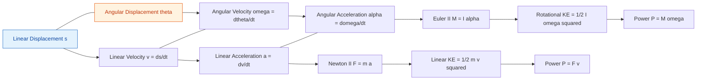
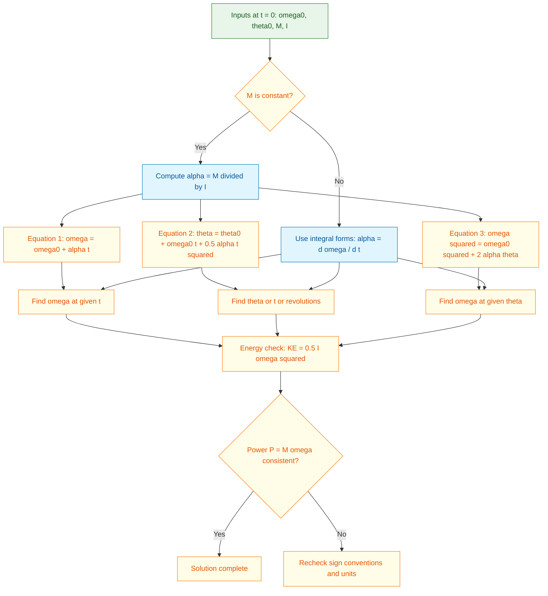
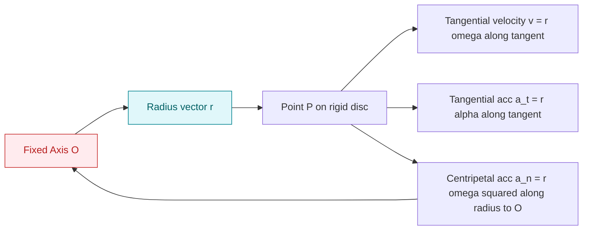

# Rotation – kinematics of rotation- equation of motion for a rigid body rotating about a fixed axis –rotation under a constant moment

<!-- SECTION_1_START -->

# 1. Core Technical Definition & Intuitive Overview

## 1.1 Rotation of a Rigid Body About a Fixed Axis

A **rigid body** is defined as a body in which the distance between any two particles remains **constant** throughout the motion, irrespective of the forces acting on it. When such a body rotates about a **fixed axis**, every particle of the body moves in a **circular path** whose centre lies on the axis of rotation, and all particles sweep out the **same angular displacement** in the **same time interval**.

> [!IMPORTANT]
> **KTU Syllabus Definition (Module 4):** *Rotation* is the curvilinear motion of a rigid body in which a straight line drawn on the body (or through two reference particles) remains *parallel to itself* in every position during motion. *Kinematics of rotation* deals with the geometry of motion (displacement, velocity, acceleration) **without** reference to the forces causing it.

### Conceptual Analogy / Intuition

Imagine a **ceiling fan** rotating about its vertical shaft.

- Every point on a blade tip travels along a **circular path** of radius equal to the blade length.
- The blade tip, the joint of the blade, and the centre of the motor all complete **one full circle** in the **same time**, but they cover **different linear distances** in that time.
- The whole fan is one rigid disc; only **one parameter — the angle swept — completely describes the motion of every particle.**

So instead of tracking 1000 particles with 1000 different linear displacements, we just track **one angle θ** that governs the entire body. This is the power of rotational kinematics.

## 1.2 Fundamental Angular Quantities

| Quantity | Symbol | Defining Relation | Unit | Nature |
|---|---|---|---|---|
| Angular Displacement | $\theta$ | Angle swept by a reference line | **radian (rad)** | Vector (along axis) |
| Angular Velocity | $\omega$ | $\omega = \dfrac{d\theta}{dt}$ | **rad/s** | Vector |
| Angular Acceleration | $\alpha$ | $\alpha = \dfrac{d\omega}{dt} = \dfrac{d^2\theta}{dt^2}$ | **rad/s²** | Vector |
| Angular Jerk | $j$ | $j = \dfrac{d\alpha}{dt}$ | **rad/s³** | Vector |

> [!NOTE]
> By KTU convention, all angular quantities are treated as **vectors** directed along the axis of rotation, with the sense given by the **Right-Hand Rule**: curl the fingers of the right hand in the direction of rotation; the thumb points along the vector.

## 1.3 Relation Between Linear and Angular Quantities

For a particle at perpendicular distance $r$ from the fixed axis:

$$s = r\theta \quad ; \quad v = r\omega \quad ; \quad a_t = r\alpha \quad ; \quad a_n = \dfrac{v^2}{r} = r\omega^2$$

where $a_t$ is the **tangential** (linear) acceleration and $a_n$ is the **normal / centripetal** (linear) acceleration. The **total linear acceleration** of any point $P$ is:

$$a = \sqrt{a_t^2 + a_n^2} = r\sqrt{\alpha^2 + \omega^4}$$

> [!VISUALIZATION CONTROL]
> **Concept:** Rotation of a rigid disc — tangential and normal acceleration of point P.
> **GeoGebra / Desmos Input Equations:**
> * Polar: $x(\theta) = r\cos\theta,\; y(\theta) = r\sin\theta$ with $r = 0.6$ m
> * Velocity vector: tangent of length $r\omega$
> * Normal vector: radial inward, length $r\omega^2$
> * Tangential vector: perpendicular to radius, length $r\alpha$
> **Visual Description:** The student should observe a circle of radius $r$, with a point P sweeping the circumference. Two orthogonal vectors at P — one along the tangent (linear acceleration component $a_t$) and one pointing to the centre (centripetal $a_n$).

<!-- SECTION_1_END -->

<!-- SECTION_2_START -->

# 2. Deep Theoretical Analysis & KTU High-Yield Formula Sheet

## 2.1 Derivation of the Angular Kinematic Chain

Starting from the fundamental definitions, three operational identities govern rotational kinematics. They are derived as follows.

**Step 1 — Angular Velocity from Displacement.**
By definition, the time rate of change of angular displacement:

$$\omega = \lim_{\Delta t \to 0}\dfrac{\Delta \theta}{\Delta t} = \dfrac{d\theta}{dt}$$

**Step 2 — Angular Acceleration from Angular Velocity.**
The time rate of change of angular velocity:

$$\alpha = \dfrac{d\omega}{dt} = \dfrac{d}{dt}\left(\dfrac{d\theta}{dt}\right) = \dfrac{d^2\theta}{dt^2}$$

**Step 3 — The Chain Rule Identity (eliminate $t$).**
Multiplying and dividing by $d\theta$:

$$\alpha = \dfrac{d\omega}{dt} = \dfrac{d\omega}{d\theta}\cdot\dfrac{d\theta}{dt} = \omega\,\dfrac{d\omega}{d\theta}$$

This gives the **three useful forms** of $\alpha$:

$$\boxed{\;\alpha = \dfrac{d\omega}{dt} = \dfrac{d^2\theta}{dt^2} = \omega\,\dfrac{d\omega}{d\theta}\;}$$

## 2.2 Equation of Motion for a Rigid Body Rotating About a Fixed Axis

For a particle of mass $m_i$ at distance $r_i$ from the axis, the tangential force required for its circular motion is $F_{t,i} = m_i a_{t,i} = m_i r_i \alpha$. The corresponding moment about the axis is:

$$dM_i = F_{t,i}\cdot r_i = m_i r_i^2\,\alpha$$

Summing over all particles of the rigid body:

$$M = \alpha \sum m_i r_i^2 = I\alpha$$

where $I = \sum m_i r_i^2$ is the **Mass Moment of Inertia (MMI)** about the given axis.

> [!IMPORTANT]
> **Euler's Rotational Equation of Motion (KTU Core Result):**
> $$\boxed{\;M = I\alpha\;}$$
> It is the **rotational analogue** of Newton's second law $F = ma$. Here, **moment (torque)** replaces force, **moment of inertia** replaces mass, and **angular acceleration** replaces linear acceleration.

### 2.2.1 Radius of Gyration

The **Radius of Gyration** $k$ of a body about a given axis is the distance at which the *entire mass* of the body can be assumed to be concentrated so that the MMI remains the same:

$$I = m k^2 \quad\Rightarrow\quad k = \sqrt{\dfrac{I}{m}} \;\;[\text{m}]$$

## 2.3 Rotation Under a Constant Moment (Constant $\alpha$)

If the net external moment $M$ about the fixed axis is **constant**, then $I\alpha = M$ implies that $\alpha$ is also a **constant**. Integrating the kinematic chain under $\alpha = $ constant yields the **three classical equations of rotational motion** (exact analogues of SUVAT equations in linear motion).

Let $\omega_0$ be the initial angular velocity at $t = 0$ and $\theta_0$ the initial angular displacement.

**Equation (i):** $\quad\omega = \omega_0 + \alpha t$

**Equation (ii):** $\quad\theta = \theta_0 + \omega_0 t + \tfrac{1}{2}\alpha t^2$

**Equation (iii):** $\quad\omega^2 = \omega_0^{\,2} + 2\alpha(\theta - \theta_0)$

If motion starts from rest ($\omega_0 = 0$) and from a reference angle ($\theta_0 = 0$), these reduce to:

$$\omega = \alpha t \quad;\quad \theta = \tfrac{1}{2}\alpha t^2 \quad;\quad \omega^2 = 2\alpha\theta$$

## 2.4 Work, Energy and Power in Rotation

When a moment $M$ rotates a body through an angle $d\theta$, the work done is $dW = M\,d\theta$.

$$W = \int_{\theta_1}^{\theta_2} M\,d\theta = \int_{\theta_1}^{\theta_2} I\alpha\,d\theta = \int_{\omega_1}^{\omega_2} I\omega\,d\omega = \tfrac{1}{2}I\omega_2^{\,2} - \tfrac{1}{2}I\omega_1^{\,2}$$

> [!NOTE]
> **Rotational Kinetic Energy:**
> $$\boxed{\;KE_{rot} = \tfrac{1}{2}I\omega^2\;}$$
> This is the direct analogue of $\tfrac{1}{2}mv^2$ — the inertia term $I$ replaces $m$, the angular speed $\omega$ replaces $v$.

**Power transmitted by a shaft rotating at $\omega$ under moment $M$:**

$$\boxed{\;P = M\omega = I\alpha\omega\;} \quad\quad [\text{Watts}]$$

## 2.5 KTU Formula Sheet / Cheat Sheet

| # | Formula | Meaning | Conditions |
|---|---|---|---|
| 1 | $\omega = d\theta/dt$ | Angular velocity def. | General |
| 2 | $\alpha = d\omega/dt$ | Angular acceleration def. | General |
| 3 | $\alpha = \omega\,d\omega/d\theta$ | Chain rule form | Eliminating $t$ |
| 4 | $s = r\theta$ | Arc length of point | Rigid rotation |
| 5 | $v = r\omega$ | Linear velocity of point | Rigid rotation |
| 6 | $a_t = r\alpha$ | Tangential acceleration | General rotation |
| 7 | $a_n = r\omega^2$ | Normal/centripetal accn. | General rotation |
| 8 | $a = r\sqrt{\alpha^2 + \omega^4}$ | Total linear acceleration | General |
| 9 | $\sum M_O = I_O \alpha$ | Equation of motion (Euler) | Fixed axis |
| 10 | $I = \sum m_i r_i^2$ | Mass Moment of Inertia | Discrete mass |
| 11 | $I = \int r^2\,dm$ | Mass Moment of Inertia | Continuous body |
| 12 | $I = m k^2$ | Radius of gyration | $k$ in metres |
| 13 | $\omega = \omega_0 + \alpha t$ | 1st equation of rotn. | $\alpha =$ const. |
| 14 | $\theta = \omega_0 t + \tfrac{1}{2}\alpha t^2$ | 2nd equation of rotn. | $\alpha =$ const. |
| 15 | $\omega^2 = \omega_0^2 + 2\alpha\theta$ | 3rd equation of rotn. | $\alpha =$ const. |
| 16 | $KE = \tfrac{1}{2}I\omega^2$ | Rotational KE | General |
| 17 | $P = M\omega$ | Rotational power | General |

## 2.6 Real-World Engineering Utility

The equation $M = I\alpha$ underpins the design of **flywheels, turbines, electric motors, vehicle clutches, robotic arms, helicopter rotors, and spacecraft reaction wheels**. In production systems, engineers use it to size braking torques, predict spin-down times, and compute the moment needed to achieve a desired angular acceleration in a given time $t = \omega/\alpha$. The kinematic equations (i)–(iii) are used in **machine start-up/shut-down analysis, clockwork and governor design, satellite attitude control, and high-speed CNC spindles**.

<!-- SECTION_2_END -->

<!-- SECTION_3_START -->

# 3. Step-by-Step Derivations & Worked Examples

## 3.1 Derivation: From $F = ma$ to $M = I\alpha$

Consider a rigid body rotating about a fixed axis through $O$ with angular acceleration $\alpha$. A generic particle of mass $m_i$ lies at perpendicular distance $r_i$ from the axis.

**Step 1:** The tangential force on the particle for its circular motion:
$$F_{t,i} = m_i a_{t,i} = m_i r_i \alpha$$

**Step 2:** The moment (torque) of this force about the axis $O$:
$$dM_i = F_{t,i}\cdot r_i = m_i r_i^{\,2}\alpha$$

**Step 3:** Sum over all $n$ particles (all share the same $\alpha$ because the body is rigid):
$$M = \alpha \sum_{i=1}^{n} m_i r_i^{\,2} = I\alpha$$

**Step 4:** The result $M = I\alpha$ is **Euler's equation of motion for a rigid body rotating about a fixed axis**, the rotational twin of Newton's second law. Q.E.D.

## 3.2 Derivation: The Three Equations Under Constant $\alpha$

Starting with the assumption $\alpha = $ constant, we integrate the kinematic relations.

**Step 1:** From $\alpha = d\omega/dt$:

$$\int_{\omega_0}^{\omega} d\omega = \int_{0}^{t} \alpha\,dt \quad\Rightarrow\quad \omega - \omega_0 = \alpha t \quad\Rightarrow\quad \boxed{\omega = \omega_0 + \alpha t}$$

**Step 2:** Substitute $\omega = d\theta/dt$ into the result above:

$$\dfrac{d\theta}{dt} = \omega_0 + \alpha t \quad\Rightarrow\quad \int_{\theta_0}^{\theta} d\theta = \int_{0}^{t} (\omega_0 + \alpha t)\,dt$$

$$\theta - \theta_0 = \omega_0 t + \tfrac{1}{2}\alpha t^2 \quad\Rightarrow\quad \boxed{\theta = \theta_0 + \omega_0 t + \tfrac{1}{2}\alpha t^2}$$

**Step 3:** Use $\alpha = \omega\,d\omega/d\theta$:

$$\int_{\omega_0}^{\omega} \omega\,d\omega = \int_{\theta_0}^{\theta} \alpha\,d\theta \quad\Rightarrow\quad \tfrac{1}{2}(\omega^2 - \omega_0^{\,2}) = \alpha(\theta - \theta_0)$$

$$\boxed{\omega^2 = \omega_0^{\,2} + 2\alpha(\theta - \theta_0)}$$

## 3.3 Standard Mass Moments of Inertia (KTU Reference Table)

| Body | Axis of Rotation | MMI $I$ |
|---|---|---|
| Thin Rod (length $L$, mass $m$) | Through centre, $\perp$ to rod | $\tfrac{1}{12}mL^2$ |
| Thin Rod (length $L$, mass $m$) | Through one end, $\perp$ to rod | $\tfrac{1}{3}mL^2$ |
| Solid Disc / Cylinder (radius $R$, mass $m$) | Central, $\perp$ to disc face | $\tfrac{1}{2}mR^2$ |
| Solid Sphere (radius $R$, mass $m$) | About any diameter | $\tfrac{2}{5}mR^2$ |
| Hollow Sphere (radius $R$, mass $m$) | About any diameter | $\tfrac{2}{3}mR^2$ |
| Solid Cone (base $R$, mass $m$) | Central axis of cone | $\tfrac{3}{10}mR^2$ |
| Rectangular Plate ($a \times b$, mass $m$) | Through centre, $\perp$ to plate | $\tfrac{1}{12}m(a^2 + b^2)$ |
| Thin Ring / Hoop (radius $R$, mass $m$) | Central, in plane of ring | $mR^2$ |
| Thin Ring (radius $R$, mass $m$) | Central diameter | $\tfrac{1}{2}mR^2$ |

## 3.4 Worked Example 1 — Constant Moment on a Flywheel

**Problem:** A solid cylindrical flywheel of mass **40 kg** and radius **0.5 m** is acted upon by a constant tangential force of **100 N** applied at the rim. Starting from rest, find:
(a) the angular acceleration,
(b) the angular velocity after **8 s**,
(c) the number of revolutions in 8 s.

**Solution:**

**Step 1: Compute Moment of Inertia.**
For a solid cylinder about its central axis:

$$I = \tfrac{1}{2}mR^2 = \tfrac{1}{2}(40)(0.5)^2 = \tfrac{1}{2}(40)(0.25) = 5\;\text{kg·m}^2$$

**Step 2: Compute Moment of Force.**
$$M = F\cdot R = 100 \times 0.5 = 50\;\text{N·m}$$

**Step 3: Apply $M = I\alpha$ to find $\alpha$.**
$$\alpha = \dfrac{M}{I} = \dfrac{50}{5} = 10\;\text{rad/s}^2$$

**[Stating $\alpha$ correctly: 1 Mark]**

**Step 4: Angular velocity at $t = 8$ s.**
Using $\omega = \omega_0 + \alpha t$ with $\omega_0 = 0$:

$$\omega = 0 + 10 \times 8 = 80\;\text{rad/s}$$

**[Substituting into 1st equation: 1 Mark; Final value: 1 Mark]**

**Step 5: Number of revolutions.**
Using $\theta = \omega_0 t + \tfrac{1}{2}\alpha t^2$:

$$\theta = 0 + \tfrac{1}{2}(10)(8)^2 = \tfrac{1}{2}(10)(64) = 320\;\text{rad}$$

Number of revolutions:

$$N = \dfrac{\theta}{2\pi} = \dfrac{320}{2\pi} = \dfrac{160}{\pi} \approx 50.93\;\text{rev}$$

**[Substitution: 1 Mark; Final answer: 1 Mark]**

## 3.5 Worked Example 2 — Braking Torque on a Disc

**Problem:** A grinding wheel of mass **25 kg** and radius **0.4 m** (uniform solid disc) is rotating at **1800 rpm**. A constant braking couple of **15 N·m** brings it to rest. Find:
(a) the angular deceleration,
(b) the time to stop,
(c) the number of revolutions before stopping.

**Solution:**

**Step 1: Moment of Inertia.**
$$I = \tfrac{1}{2}mR^2 = \tfrac{1}{2}(25)(0.4)^2 = \tfrac{1}{2}(25)(0.16) = 2.0\;\text{kg·m}^2$$

**Step 2: Convert $\omega_0$ to rad/s.**
$$N_0 = 1800\;\text{rpm} \quad\Rightarrow\quad \omega_0 = \dfrac{2\pi N_0}{60} = \dfrac{2\pi \times 1800}{60} = 60\pi \approx 188.5\;\text{rad/s}$$

**Step 3: Angular deceleration.**
The braking moment opposes motion, so $M = -15$ N·m:

$$\alpha = \dfrac{M}{I} = \dfrac{-15}{2.0} = -7.5\;\text{rad/s}^2$$

**[Sign convention: 1 Mark; Final value: 1 Mark]**

**Step 4: Time to stop.**
From $\omega = \omega_0 + \alpha t$ with $\omega = 0$:

$$0 = 60\pi + (-7.5)t \quad\Rightarrow\quad t = \dfrac{60\pi}{7.5} = 8\pi \approx 25.13\;\text{s}$$

**Step 5: Number of revolutions before stopping.**
From $\omega^2 = \omega_0^2 + 2\alpha\theta$ with $\omega = 0$:

$$0 = (60\pi)^2 + 2(-7.5)\theta \quad\Rightarrow\quad \theta = \dfrac{(60\pi)^2}{15} = 240\pi^2 \approx 2368.7\;\text{rad}$$

$$N = \dfrac{\theta}{2\pi} = \dfrac{240\pi^2}{2\pi} = 120\pi \approx 377.0\;\text{rev}$$

## 3.6 Worked Example 3 — Energy Method Check

**Problem:** Using energy principles, verify the kinetic energy lost by the wheel in Example 3.5 equals the work done by the braking couple.

**Solution:**

**Step 1: Initial KE of rotation.**
$$KE_i = \tfrac{1}{2}I\omega_0^2 = \tfrac{1}{2}(2.0)(60\pi)^2 = (60\pi)^2 = 3600\pi^2 \approx 35530.6\;\text{J}$$

**Step 2: Final KE.**
$$KE_f = \tfrac{1}{2}I\omega^2 = 0 \quad(\text{wheel is at rest})$$

**Step 3: Work done by the braking couple.**
$$W = M\cdot\theta = (-15)(240\pi^2) = -3600\pi^2 \approx -35530.6\;\text{J}$$

**Step 4: Work–Energy Theorem Check.**
$$KE_f - KE_i = W \quad\Rightarrow\quad 0 - 3600\pi^2 = -3600\pi^2 \;\;\checkmark$$

**[Verification: 1 Mark; Significance: 1 Mark]**

## 3.7 Worked Example 4 — Constant Moment on a Compound System

**Problem:** A light inextensible string is wrapped around a solid cylinder of mass **12 kg** and radius **0.2 m**. The string is pulled vertically by a constant force of **60 N**, causing the cylinder to unwind and rotate about a fixed horizontal axis. If the cylinder starts from rest, find the velocity of the string after **3 seconds** and the linear distance the string has moved.

**Solution:**

**Step 1: Moment of Inertia of the solid cylinder.**
$$I = \tfrac{1}{2}mR^2 = \tfrac{1}{2}(12)(0.2)^2 = \tfrac{1}{2}(12)(0.04) = 0.24\;\text{kg·m}^2$$

**Step 2: Moment about the axis.**
The string leaves tangentially, so:
$$M = F\cdot R = 60 \times 0.2 = 12\;\text{N·m}$$

**Step 3: Angular acceleration.**
$$\alpha = \dfrac{M}{I} = \dfrac{12}{0.24} = 50\;\text{rad/s}^2$$

**Step 4: Angular velocity at $t = 3$ s.**
$$\omega = 0 + \alpha t = 50 \times 3 = 150\;\text{rad/s}$$

**Step 5: Linear velocity of string.**
$$v = R\omega = 0.2 \times 150 = 30\;\text{m/s}$$

**Step 6: Angular displacement.**
$$\theta = \tfrac{1}{2}\alpha t^2 = \tfrac{1}{2}(50)(3)^2 = 225\;\text{rad}$$

**Step 7: Linear distance.**
$$s = R\theta = 0.2 \times 225 = 45\;\text{m}$$

<!-- SECTION_3_END -->

<!-- SECTION_4_START -->

# 4. Structural Diagrams & Schematics

## 4.1 Kinematic Chain — Linear vs. Rotational Analogy

The following block-level functional architecture flow maps the direct correspondence between linear and rotational kinematic quantities, the central idea of Module 4.

**Visual Description:** The diagram draws two parallel vertical rails — the **left rail (blue)** is the linear world ($s, v, a, F, m, KE, P$); the **right rail (orange)** is the rotational world ($\theta, \omega, \alpha, M, I, KE, P$). Crossing arrows tie the linear and rotational quantities that share the same physical role.

## 4.2 Constant-Moment Rotational Processing Topology

**Visual Description:** This flowchart acts as a **decision tree** for any KTU problem on "rotation under constant moment." Beginning at the top, the student first checks whether the moment is constant; if yes, they use the three standard equations; if no, they must integrate. All three paths converge on a final **energy check** for verification.

## 4.3 Sequential Processing Topology — Solving a KTU Problem

**Visual Description:** A linear eight-step pipeline that mirrors the exact valuation sequence a KTU examiner expects a student to follow. Skipping any node (e.g., not computing $I$ first) routinely costs 1–2 marks in the 14-mark question.

## 4.4 Physical Picture — Point Acceleration on a Rotating Disc

**Visual Description:** A schematic of a point P on a disc rotating about axis O. The diagram shows three orthogonal vectors at P — the radial vector, the tangential velocity $v$, the tangential acceleration $a_t$, and the centripetal acceleration $a_n$ pointing radially inward toward O. The total linear acceleration at P is the vector sum $\vec{a} = \vec{a_t} + \vec{a_n}$.

<!-- SECTION_4_END -->

<!-- SECTION_5_START -->

# 5. KTU 2024 Scheme Examination Question Bank & Topic Recap

## 5.1 Part A — Short Answer Questions (3 Marks Each)

### Question A.1 `[KTU University Exam – Dec 2023]`
**Define the following terms with units:**
(a) Angular velocity,
(b) Angular acceleration,
(c) Radius of gyration.

**Model Answer:**

**(a) Angular velocity** is the time rate of change of angular displacement. It is a vector quantity directed along the axis of rotation, given by $\omega = d\theta/dt$. **Unit: rad/s.**

**(b) Angular acceleration** is the time rate of change of angular velocity, $\alpha = d\omega/dt = \omega\,d\omega/d\theta$. **Unit: rad/s².** Its direction is along the axis of rotation, with sense given by the right-hand rule.

**(c) Radius of gyration** ($k$) is the distance from the axis of rotation at which the entire mass of the body may be assumed to be concentrated such that its mass moment of inertia is unchanged. Mathematically, $I = m k^2$, so $k = \sqrt{I/m}$. **Unit: metre (m).**

> [!WARNING]
> **Pitfall Callout (Part A):** Students frequently write units of angular quantities as *'rad/s'* using lowercase 'rad' and forget the dot in 'rad/s²'. The KTU valuation key requires the **standard SI form rad/s** and **rad/s²**. Loss of 0.5 marks per wrong unit.

**CO Mapping:** CO1 (Remember). **RBT Level:** Remember.

### Question A.2 `[KTU University Exam – July 2024]`
**State Euler's equation of motion for a rigid body rotating about a fixed axis. Mention the analogous linear quantity for each rotational term.**

**Model Answer:**

> [!NOTE]
> **Euler's Rotational Equation of Motion:** The algebraic sum of the moments of all external forces acting on a rigid body about a fixed axis is equal to the product of the mass moment of inertia of the body about that axis and its angular acceleration.
> $$\sum M_O = I_O\,\alpha$$

**Analogies with linear motion ($F = ma$):**

| Rotational Quantity | Symbol | Linear Analogue |
|---|---|---|
| Moment (Torque) | $M$ | Force $F$ |
| Mass Moment of Inertia | $I$ | Mass $m$ |
| Angular Acceleration | $\alpha$ | Linear Acceleration $a$ |
| Angular Velocity | $\omega$ | Linear Velocity $v$ |
| Angular Displacement | $\theta$ | Linear Displacement $s$ |
| Rotational KE = $\tfrac{1}{2}I\omega^2$ | — | Linear KE = $\tfrac{1}{2}mv^2$ |

**CO Mapping:** CO1 (Remember). **RBT Level:** Remember.

---

## 5.2 Part B — Long Answer Questions (14 Marks Each, Internal Choice)

### Question B (Module 4 — 14 Marks) `[KTU University Exam – Dec 2023]`

**(a)** Define angular velocity and angular acceleration. Derive the relation $\alpha = \omega\,d\omega/d\theta$ for a rigid body rotating about a fixed axis. **(7 Marks)**

**(b)** A solid cylinder of mass **30 kg** and diameter **0.6 m** starts from rest. A constant tangential force of **90 N** is applied at its rim. Determine: (i) the angular acceleration, (ii) the angular velocity after **5 seconds**, (iii) the number of revolutions in 5 s, and (iv) verify the result using the energy method. **(7 Marks)**

**Model Answer:**

**(a) Definition and Derivation:**

**Definitions:**
- **Angular velocity ($\omega$):** Time rate of change of angular displacement. $\omega = d\theta/dt$. Unit: **rad/s**. Vector along axis.
- **Angular acceleration ($\alpha$):** Time rate of change of angular velocity. $\alpha = d\omega/dt = d^2\theta/dt^2$. Unit: **rad/s²**.

**Derivation of $\alpha = \omega\,d\omega/d\theta$:**

**Step 1:** Start from the definition:
$$\alpha = \dfrac{d\omega}{dt}$$

**Step 2:** Multiply and divide the right-hand side by $d\theta$:

$$\alpha = \dfrac{d\omega}{dt}\cdot\dfrac{d\theta}{d\theta} = \dfrac{d\omega}{d\theta}\cdot\dfrac{d\theta}{dt}$$

**Step 3:** Recognise that $d\theta/dt = \omega$:

$$\therefore\;\alpha = \omega\,\dfrac{d\omega}{d\theta} \quad\text{Q.E.D.}$$

**[Defining quantities: 2 Marks; Algebraic manipulation: 3 Marks; Final identity: 2 Marks]**

**(b) Numerical Solution:**

**Step 1 — Moment of Inertia.**
For a solid cylinder of mass $m = 30$ kg and radius $R = 0.3$ m:

$$I = \tfrac{1}{2}mR^2 = \tfrac{1}{2}(30)(0.3)^2 = \tfrac{1}{2}(30)(0.09) = 1.35\;\text{kg·m}^2$$

**Step 2 — Moment about the axis.**
The force acts tangentially at the rim, so:
$$M = F\cdot R = 90 \times 0.3 = 27\;\text{N·m}$$

**Step 3 — Angular acceleration.**
$$\alpha = \dfrac{M}{I} = \dfrac{27}{1.35} = 20\;\text{rad/s}^2$$

**[Stating $I$: 1 Mark; Computing $M$: 1 Mark; Final $\alpha$: 1 Mark]**

**Step 4 — Angular velocity at $t = 5$ s.**
Using $\omega = \omega_0 + \alpha t$ with $\omega_0 = 0$:

$$\omega = 0 + 20 \times 5 = 100\;\text{rad/s}$$

**Step 5 — Number of revolutions.**
Using $\theta = \omega_0 t + \tfrac{1}{2}\alpha t^2$:

$$\theta = 0 + \tfrac{1}{2}(20)(5)^2 = 250\;\text{rad}$$

$$N = \dfrac{\theta}{2\pi} = \dfrac{250}{2\pi} = \dfrac{125}{\pi} \approx 39.79\;\text{rev}$$

**Step 6 — Energy Method Verification.**
Rotational KE at $t = 5$ s:
$$KE = \tfrac{1}{2}I\omega^2 = \tfrac{1}{2}(1.35)(100)^2 = 6750\;\text{J}$$

Work done by the moment over $\theta = 250$ rad:
$$W = M\theta = 27 \times 250 = 6750\;\text{J}$$

$$W = KE_f - KE_i = 6750 - 0 = 6750\;\text{J} \;\;\checkmark$$

**[Energy method 1 Mark; Final match: 1 Mark]**

**CO Mapping:** CO2 (Understand / Apply). **RBT Levels:** Apply (a), Apply (b).

### Question C (Module 4 — 14 Marks, **Alternative Choice**) `[KTU University Exam – July 2024]`

**(a)** Derive the three equations of motion for a rigid body rotating about a fixed axis under a constant moment. **(7 Marks)**

**(b)** A grinding wheel of mass **15 kg** and radius **0.2 m** (uniform solid disc) is rotating at **2400 rpm**. A constant braking torque of **10 N·m** is applied. Compute: (i) the time taken to come to rest, (ii) the angular displacement before stopping (in radians and revolutions), and (iii) the kinetic energy dissipated as heat. **(7 Marks)**

**Model Answer:**

**(a) Derivation of Three Equations:**

**Step 1 — Definition.** A *constant moment* implies $\alpha = M/I =$ constant. We integrate the kinematic chain.

**Step 2 — Equation 1: $\omega = \omega_0 + \alpha t$.**
From $\alpha = d\omega/dt$:

$$\int_{\omega_0}^{\omega} d\omega = \int_{0}^{t}\alpha\,dt \;\Rightarrow\; \omega - \omega_0 = \alpha t \;\Rightarrow\; \omega = \omega_0 + \alpha t$$

**Step 3 — Equation 2: $\theta = \theta_0 + \omega_0 t + \tfrac{1}{2}\alpha t^2$.**
With $\omega_0$ the velocity at $t = 0$, $\omega = d\theta/dt$ gives:

$$\dfrac{d\theta}{dt} = \omega_0 + \alpha t \;\Rightarrow\; \int_{\theta_0}^{\theta}d\theta = \int_{0}^{t}(\omega_0 + \alpha t)\,dt \;\Rightarrow\; \theta - \theta_0 = \omega_0 t + \tfrac{1}{2}\alpha t^2$$

**Step 4 — Equation 3: $\omega^2 = \omega_0^2 + 2\alpha(\theta - \theta_0)$.**
From $\alpha = \omega\,d\omega/d\theta$:

$$\int_{\omega_0}^{\omega}\omega\,d\omega = \int_{\theta_0}^{\theta}\alpha\,d\theta \;\Rightarrow\; \tfrac{1}{2}(\omega^2 - \omega_0^2) = \alpha(\theta - \theta_0)$$

**[Each equation 2 marks; final boxed form 1 mark]**

**(b) Numerical Solution:**

**Step 1 — Moment of Inertia.**
$$I = \tfrac{1}{2}mR^2 = \tfrac{1}{2}(15)(0.2)^2 = \tfrac{1}{2}(15)(0.04) = 0.3\;\text{kg·m}^2$$

**Step 2 — Convert Initial Angular Velocity.**
$$\omega_0 = \dfrac{2\pi N_0}{60} = \dfrac{2\pi \times 2400}{60} = 80\pi \approx 251.33\;\text{rad/s}$$

**Step 3 — Angular Deceleration.**
Braking moment opposes rotation: $M = -10$ N·m.

$$\alpha = \dfrac{M}{I} = \dfrac{-10}{0.3} = -\dfrac{100}{3} \approx -33.33\;\text{rad/s}^2$$

**Step 4 — Time to Stop.**
From $\omega = \omega_0 + \alpha t$ with $\omega = 0$:

$$0 = 80\pi - \tfrac{100}{3}t \;\Rightarrow\; t = \dfrac{80\pi \times 3}{100} = \dfrac{240\pi}{100} = \tfrac{12\pi}{5} \approx 7.54\;\text{s}$$

**Step 5 — Angular Displacement.**
From $\omega^2 = \omega_0^2 + 2\alpha\theta$ with $\omega = 0$:

$$0 = (80\pi)^2 - 2\cdot\dfrac{100}{3}\cdot\theta \;\Rightarrow\; \theta = \dfrac{3(80\pi)^2}{200} = \dfrac{3 \times 6400\pi^2}{200} = 96\pi^2 \approx 947.5\;\text{rad}$$

Number of revolutions:
$$N = \dfrac{\theta}{2\pi} = \dfrac{96\pi^2}{2\pi} = 48\pi \approx 150.8\;\text{rev}$$

**Step 6 — Kinetic Energy Dissipated.**
This equals the initial rotational KE (final KE = 0):

$$\Delta KE = \tfrac{1}{2}I\omega_0^2 = \tfrac{1}{2}(0.3)(80\pi)^2 = 0.15 \times 6400\pi^2 = 960\pi^2 \approx 9475.1\;\text{J}$$

**Cross-check with Work Done:**
$$W = M\theta = (-10)(96\pi^2) = -960\pi^2 \approx -9475.1\;\text{J}$$

The negative sign indicates that the work is done **on** the brake (energy lost by the wheel). Magnitude of heat generated = **9475.1 J**.

**[Stating $I$: 1 Mark; $\omega_0$ conversion: 1 Mark; $\alpha$: 1 Mark; $t$: 1 Mark; $\theta$ in rad and rev: 1 Mark; KE loss: 1 Mark]**

**CO Mapping:** CO2 (Apply). **RBT Levels:** Apply (a), Apply (b).

> [!WARNING]
> **KTU Examiner's Valuation Pitfall Callout:**
> 1. **Sign convention for braking/retarding moments:** A *braking* moment produces **negative angular acceleration** when measured in the direction of initial motion. Failing to put a minus sign on $M$ or $\alpha$ will cost 1 mark and produce physically wrong $t$ (it will turn out *negative* — an obvious red flag).
> 2. **RPM to rad/s conversion:** KTU keys expect $\omega_0 = 2\pi N_0 / 60$. Writing $N_0$ directly in the kinematic equations is a common, expensive error.
> 3. **Units of revolutions:** Report the number of revolutions as a *dimensionless number*; do not write 'rad' or 'rev' incorrectly. Use $N = \theta/(2\pi)$.
> 4. **Verification step:** Examiners award up to 1 mark for an *energy check*. Always include $KE_{rot} = \tfrac{1}{2}I\omega^2$ and work $W = M\theta$ to verify.

---

## 5.3 Topic Recap & Important Things to Remember

> [!NOTE]
> This is your **one-page rapid revision** sheet for the topic. Memorise every bullet before walking into the ESE.

- **Rigid body:** Inter-particle distances are *invariant*; a body rotating about a fixed axis has all particles tracing concentric circles.
- **Angular displacement $\theta$** is in **radians**; convert rev/min → rad/s using $\omega = 2\pi N/60$ and rev → rad using $\theta_{rad} = 2\pi N$.
- **Right-hand rule** fixes the vector direction of $\omega$ and $\alpha$ along the axis of rotation.
- **Three core kinematic identities:**
  * $\omega = d\theta/dt$,
  * $\alpha = d\omega/dt = d^2\theta/dt^2$,
  * $\alpha = \omega\,d\omega/d\theta$ (chain rule form).
- **Linear–rotational correspondences (memorise as a table):**
  * $s = r\theta$, $v = r\omega$, $a_t = r\alpha$, $a_n = r\omega^2$, $a = r\sqrt{\alpha^2 + \omega^4}$.
- **Euler's equation of motion:** $\sum M_O = I_O\alpha$ — the rotational analogue of $F = ma$. Always compute $I$ *first* from the standard table (disc, sphere, rod, ring, plate).
- **Radius of gyration:** $k = \sqrt{I/m}$. It is **not** a physical radius; it is a *fictitious distance* at which the entire mass could be concentrated.
- **Constant moment ⟹ constant $\alpha$** ⟹ use the three SUVAT-style rotational equations:
  * $\omega = \omega_0 + \alpha t$,
  * $\theta = \theta_0 + \omega_0 t + \tfrac{1}{2}\alpha t^2$,
  * $\omega^2 = \omega_0^2 + 2\alpha(\theta - \theta_0)$.
- **Rotational kinetic energy:** $KE = \tfrac{1}{2}I\omega^2$. Work done by a moment: $W = \int M\,d\theta$. Power delivered: $P = M\omega$.
- **Sign discipline:** If motion is decelerating (braking, retarding), the moment is **opposite** to $\omega$ and $\alpha$ becomes **negative**. The square of angular velocity is always positive.
- **Convert carefully:** $1\;\text{rev} = 2\pi\;\text{rad}$; $1\;\text{rpm} = \pi/30\;\text{rad/s}$.
- **Sanity check the answer** with the energy method whenever $M$ and $\theta$ are known: $W = M\theta$ should equal $\tfrac{1}{2}I(\omega_f^2 - \omega_i^2)$.
- **Common MMI values to remember cold (no derivation in exam):**
  * Thin rod through centre, $\perp$ to length: $\tfrac{1}{12}mL^2$.
  * Solid disc / solid cylinder about central axis: $\tfrac{1}{2}mR^2$.
  * Solid sphere about any diameter: $\tfrac{2}{5}mR^2$.
  * Hollow sphere (thin shell): $\tfrac{2}{3}mR^2$.
  * Thin ring/hoop about central axis: $mR^2$.

<!-- SECTION_5_END -->
