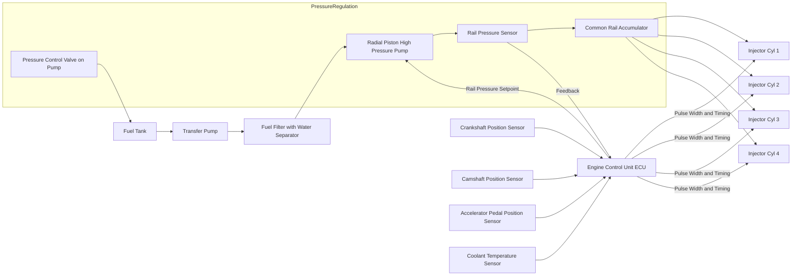
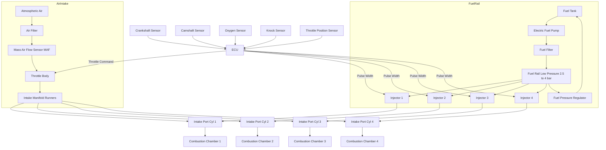
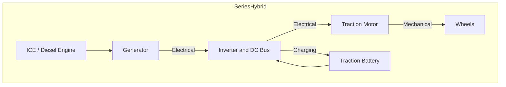
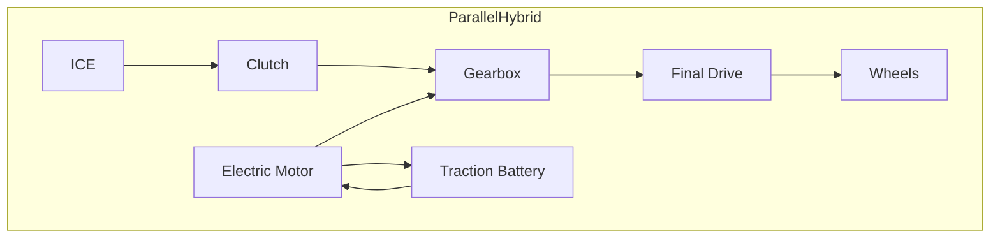
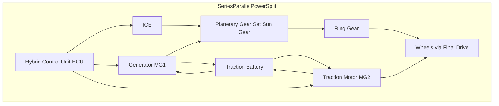
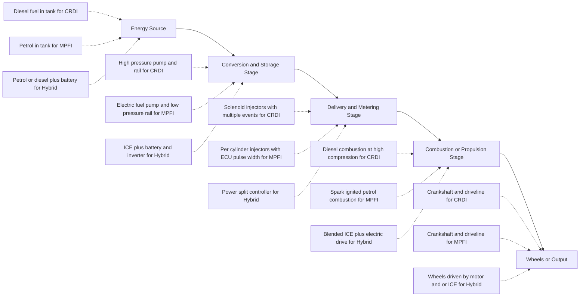

# Concept of CRDI, MPFI and hybrid engines.

<!-- SECTION_1_START -->

# Module 1 — General Introduction to Mechanical Engineering

## Concept of CRDI, MPFI and Hybrid Engines

---

### 1. Core Technical Definition & Intuitive Overview

#### 1.1 CRDI — Common Rail Direct Injection

> [!IMPORTANT]
> **Formal KTU Definition (CRDI):**
> Common Rail Direct Injection (CRDI) is an advanced **diesel engine fuel injection technology** in which a high-pressure common accumulator (the "common rail") continuously supplies pressurized fuel to electronically controlled solenoid injectors, which then meter and inject the fuel directly into the engine's combustion chamber at precisely timed intervals and at extremely high pressures (typically **1000–2000 bar**).

> [!NOTE]
> **Conceptual Analogy — The "High-Pressure Building Water Supply":**
> Imagine a large overhead water tank in an apartment complex. The tank stores water at a uniformly high pressure, and individual apartments draw water *only when they need it* by opening a tap. The pressure inside the pipes is **always ready**, regardless of which apartment opens the tap. The **common rail** in CRDI is that overhead tank. The **electronic injectors** are the individual apartment taps. Unlike the old system where a single mechanical pump had to "build up" pressure each time an injector fired, in CRDI the pressure is **pre-built and held constant**, so fuel is sprayed the instant the ECU commands it. This produces finer atomization, cleaner combustion, and lower emissions.

---

#### 1.2 MPFI — Multi-Point Fuel Injection

> [!IMPORTANT]
> **Formal KTU Definition (MPFI):**
> Multi-Point Fuel Injection (MPFI) is a **petrol/gasoline engine fuel delivery system** in which each cylinder is provided with its own dedicated electronic fuel injector, mounted in the intake manifold immediately upstream of the intake valve, so that fuel is sprayed at **multiple points** (one per cylinder) into the incoming air stream just before it enters the combustion chamber.

> [!NOTE]
> **Conceptual Analogy — "One Sprinkler per Flower Bed":**
> Picture a row of five identical flower beds in a garden. Instead of a single hose (the old carburetor / single-point injection that drenched the entire garden unevenly), MPFI places **one adjustable micro-sprinkler at the head of each bed**. Each sprinkler is independently controlled by a small electric valve (the injector), and a central computer (the **ECU — Engine Control Unit**) decides how long each sprinkler should run. Because every bed gets the *exact* amount of water it needs, the result is a uniform, efficient, and clean "bloom" — analogous to uniform, efficient, and clean combustion in each cylinder.

> [!TIP]
> **Mnemonic Anchor:** *MPFI = Many Pointed Fuel Injectors* — "pointed" meaning one injector per intake port (multiple points).

---

#### 1.3 Hybrid Engines

> [!IMPORTANT]
> **Formal KTU Definition (Hybrid Engine / Hybrid Powertrain):**
> A hybrid engine (more accurately, a **hybrid powertrain**) is a vehicular propulsion system that combines **two or more distinct energy conversion devices** — most commonly an **Internal Combustion Engine (ICE)** and one or more **Electric Machines (EM)** with an **Energy Storage System (typically a battery or supercapacitor)** — coupled through a mechanical or electrical link so as to deliver improved fuel economy, reduced emissions, and enhanced performance compared to a conventional single-source powertrain.

> [!NOTE]
> **Conceptual Analogy — "The Cyclist–Runner Relay":**
> Think of a courier who must travel a long distance. On flat, smooth roads the courier **cycles** (electric motor — silent, efficient, zero fuel). On steep hills the courier **runs with a heavy load** assisted by the cycle's gear (ICE + motor together — high power). On the level, the courier just runs (ICE alone — long range). When braking downhill, the courier back-pedals to *recover energy* into a small battery (regenerative braking). The hybrid vehicle does exactly this — it **blends two power sources** intelligently, using electric energy where it is most efficient and the ICE where high energy-density is needed, while recovering braking energy that a normal car simply throws away as heat.

> [!VISUALIZATION CONTROL]
> **Concept:** Power-vs-Operating-Condition map of a hybrid powertrain showing the dominant energy source.
> **GeoGebra / Desmos Input Equations:**
> * `f1(x) = 0.9` — efficiency of pure electric mode (flat road, low load)
> * `f2(x) = 0.32` — efficiency of pure ICE mode (highway cruise)
> * `f3(x) = piecewise` — combined mode active only when $x \in [40,80]$
> **Visual Description:** The student should observe a step-like efficiency profile, where the hybrid controller (ECU/HCU) automatically switches between the three modes as vehicle speed ($x$-axis in km/h) and torque demand vary. The combined region overlaps both the electric-only and ICE-only envelopes.

---

<!-- SECTION_2_START -->

## 2. Deep Theoretical Analysis & KTU High-Yield Formula Sheet

### 2.1 CRDI — Operational Architecture

The CRDI system can be decomposed into **four functional sub-systems**, each performing a specific role:

#### A. Low-Pressure Circuit (Supply Stage)

- **Fuel Tank → Lift Pump → Fuel Filter → Feed Pump inlet.**
- The lift (transfer) pump is typically an **electric roller-cell or gerotor pump** delivering fuel at **3–6 bar** to the high-pressure pump.
- The fuel filter is a fine **spin-on or cartridge filter** with water-separation capability (critical, as water vapor at 2000 bar causes injector cavitation damage).

#### B. High-Pressure Circuit (Generation Stage)

- A **radial-piston high-pressure pump** (commonly 3-piston, driven off the camshaft) pressurizes fuel to **1000–2000 bar** and pushes it into the **common rail (accumulator)**.
- The rail acts as a **hydraulic capacitor** — it dampens pressure pulsations and maintains a near-constant rail pressure.
- A **rail-pressure sensor** continuously monitors rail pressure and feeds data back to the **ECU** in a closed loop.
- A **pressure-control valve (PCV / SCV)** on the pump (or a **pressure limiter valve** on the rail) bleeds excess fuel back to the tank, regulating the rail to the demanded setpoint.

#### C. Injector Bank (Delivery Stage)

- Each cylinder has a **solenoid-actuated (or piezo-actuated) electronic unit injector**.
- The injector is opened by a short electric pulse from the ECU and is closed by a return spring.
- **Multiple injection events per working cycle** are possible: **Pilot → Main → Post injections** (sometimes up to **9 events per cycle** in advanced systems like Bosch CRI2-16).
  - **Pilot injection** (small, early) → reduces the rate of pressure rise → softer combustion → lower $\text{NO}_x$ and noise.
  - **Main injection** → delivers the bulk of fuel → produces work.
  - **Post injection** → raises exhaust temperature → regenerates the **Diesel Particulate Filter (DPF)**.

#### D. Electronic Control Unit (ECU)

- Inputs: **Crankshaft position sensor, camshaft position sensor, rail pressure, coolant temperature, intake air temperature, accelerator pedal position, mass airflow, lambda / O$_2$ sensor, boost pressure.**
- Outputs: **Injector pulse width (duration), injection timing (crank-angle degrees BTDC), rail pressure setpoint, EGR valve position, turbocharger wastegate / VGT vanes, glow-plug relay.**

---

### 2.2 MPFI — Operational Architecture

| **Sub-system** | **Function** | **Key Components** |
|---|---|---|
| Fuel Supply | Delivers low-pressure fuel to injectors | Electric fuel pump (in-tank or in-line), fuel filter, fuel pressure regulator |
| Air Intake | Metered air enters manifold | Air filter, throttle body (drive-by-wire or cable), IACV, MAF/MAP sensor |
| Injection | Fuel sprayed upstream of each intake valve | One injector per cylinder, fuel rail (low-pressure, 2.5–4 bar) |
| Ignition | Spark ignites the air–fuel mixture | Ignition coil, distributor (older) or coil-pack (wasted spark/COP), spark plugs |
| Control | Computes injector pulse width and spark advance | ECU, crankshaft/camshaft sensors, O$_2$ sensor, knock sensor, CTS, TPS |

#### Operating Principle (Sequence of Events)

1. Driver depresses accelerator → **TPS (Throttle Position Sensor)** signals ECU.
2. ECU reads **MAF/MAP** → computes engine airflow → uses the target **Air–Fuel Ratio (AFR ≈ 14.7:1 stoichiometric for petrol)** to determine the required fuel mass.
3. ECU computes **injector pulse width** (time the injector is open) using:

$$t_{inj} = \frac{m_{fuel}}{Q_{inj} \cdot \rho_{fuel}}$$

where $Q_{inj}$ is the injector's static flow rate in $\text{cm}^3/\text{s}$ and $\rho_{fuel}$ is fuel density in $\text{g/cm}^3$.

4. Each injector is fired once per **two crank revolutions** (full engine cycle) — this is **sequential fuel injection (SFI)**, the most common MPFI variant.
5. The injected fuel atomizes against the back of the **closed intake valve**, forming a fine film that vaporizes as the valve opens — this is **wall-guided / port-wall wetting** atomization.
6. Ignition occurs at the **optimum crank angle BTDC** (typically 8°–35° BTDC) as computed by the ECU's **ignition advance map**.

---

### 2.3 Hybrid Engine — Topological Configurations

There are **three canonical hybrid topologies**, plus a fourth (plug-in) extension. KTU expects all three to be drawn and explained.

#### (i) Series Hybrid

- The **ICE is mechanically decoupled from the wheels** — it drives a **generator** only.
- The generator charges a battery and/or feeds an **inverter**, which supplies a large **traction motor** that alone drives the wheels.
- The ICE always operates at its **peak-efficiency point** (constant speed/load) — this is why series hybrids are very fuel-efficient in **stop-and-go city driving**.
- **Example:** Chevrolet Volt (1st gen), Nissan e-Power (ICE as range extender), diesel-electric locomotives.

#### (ii) Parallel Hybrid

- The **ICE and the electric motor are mechanically coupled** to the wheels — both can deliver tractive torque simultaneously or independently.
- Coupling is via a **clutch + gearbox** or a **planetary gear set**.
- The motor can also act as a **generator** during regenerative braking.
- **Example:** Honda Civic Hybrid (IMA), early Toyota Prius (THS-I had a power-split, but the basic architecture is parallel-derived).

#### (iii) Series-Parallel (Power-Split / Full Hybrid)

- A **planetary gear set** mechanically couples the ICE, the generator, and the motor, allowing **continuously variable power sharing** between them.
- The generator regulates the ICE speed, so the ICE can be **decoupled from road speed** (unlike a parallel hybrid).
- The Toyota Hybrid Synergy Drive (THS-II) is the textbook example.
- **Example:** Toyota Prius, Camry Hybrid, Ford Escape Hybrid.

#### (iv) Plug-in Hybrid (PHEV)

- Has a **larger battery (typically 8–18 kWh)** that can be charged from an external AC source.
- Operates in **pure EV mode** for 20–80 km, then in **hybrid mode** once the battery is depleted.
- Combines the local-zero-emission benefit of a BEV with the long-range flexibility of an HEV.

---

### 2.4 KTU Formula Sheet / Cheat Sheet

> [!IMPORTANT]
> **All equations below are KTU-board-examination-ready.** Master these — at least 2 of them will appear in numericals.

**Table 1 — CRDI / MPFI Performance & Combustion Equations**

| **#** | **Equation / Symbol** | **Meaning / Use** | **Units** |
|---|---|---|---|
| 1 | $P_{rail} = \dfrac{F_{spring} + F_{elec}}{A_{nozzle}}$ | Rail pressure set by spring + solenoid force over nozzle seat area | bar |
| 2 | $BSFC = \dfrac{\dot{m}_{fuel}}{P_{brake}}$ | Brake Specific Fuel Consumption — figure of merit for engine | $\text{g/kW·h}$ |
| 3 | $\eta_{brake} = \dfrac{P_{brake}}{\dot{m}_{fuel} \cdot CV}$ | Brake thermal efficiency | dimensionless |
| 4 | $AFR_{stoich} = \dfrac{m_{air}}{m_{fuel}} = 14.7$ | Stoichiometric air–fuel ratio for petrol (λ = 1) | ratio |
| 5 | $AFR_{diesel} \approx 14.5$–$18$ | Diesel runs lean overall; λ typically 1.2–1.6 | ratio |
| 6 | $t_{inj} = \dfrac{m_{fuel}}{Q_{inj} \cdot \rho_{fuel}}$ | Injector pulse width calculation | s |
| 7 | $P_{inj,inst} = C_d \cdot A_{eff} \cdot \sqrt{2 \cdot \Delta P \cdot \rho_{fuel}}$ | Instantaneous injection rate (Bernoulli / orifice flow) | $\text{kg/s}$ |
| 8 | $\eta_{vol} = \dfrac{m_{air,actual}}{m_{air,ideal}}$ | Volumetric efficiency of naturally aspirated engine | dimensionless |
| 9 | $P_{comb} = \dfrac{m_{fuel} \cdot CV \cdot \eta_{comb}}{\tau_{comb}}$ | Combustion power — depends on burn duration $\tau_{comb}$ | W |
| 10 | $\text{NO}_x \propto \left(T_{flame}\right)^{k}, \; k \approx 2$–$3$ | Empirical Zeldovich dependence on peak flame temp | — |

**Table 2 — Hybrid Powertrain Energy Equations**

| **#** | **Equation** | **Topology** | **Meaning** |
|---|---|---|---|
| 1 | $P_{wheels} = P_{ICE} + P_{motor}$ | Parallel | Powers add at the wheels |
| 2 | $P_{wheels} = P_{motor} = \eta_{gen} \cdot \eta_{inv} \cdot P_{ICE}$ | Series | ICE → generator → inverter → motor |
| 3 | $P_{wheels} = P_{ICE} + P_{motor} - P_{gen}$ | Series-Parallel | Power-split accounting through planetary gear |
| 4 | $\eta_{overall,series} = \eta_{ICE} \cdot \eta_{gen} \cdot \eta_{inv} \cdot \eta_{motor}$ | Series | Each stage multiplies efficiency |
| 5 | $E_{regen} = \dfrac{1}{2} \cdot m \cdot (v_1^2 - v_2^2) \cdot \eta_{regen}$ | All | Energy recovered per braking event |
| 6 | $SOC = \dfrac{Q_{stored}}{Q_{capacity}} \times 100\%$ | All | State of Charge of traction battery |
| 7 | $P_{bat} = V_{oc} \cdot I - I^2 \cdot R_{int}$ | All | Battery terminal power (losses included) |
| 8 | $CO_2 = \dfrac{m_{fuel} \cdot 3.2}{d}$ | All | CO$_2$ emission per km; $3.2$ is kg CO$_2$ per kg petrol |

> [!TIP]
> **Avoid the vertical pipe `|` inside tables** — we have used ratio notation ("14.7", "1.2–1.6") instead of `|x|` absolute-value bars. Always prefer `\vert` or `\mid` if you must use absolute value inside markdown tables.

---

### 2.5 Real-World Engineering Utility

- **CRDI** is the **de facto standard in every modern BS-VI / Euro 6 diesel car and commercial vehicle** (Tata Nexon EV's diesel sibling, Mahindra Scorpio, Ashok Leyland trucks, BMW / Audi / Mercedes diesel sedans). It is also used in **modern common-rail marine engines** (MAN B&W, Wärtsilä) and **stationary diesel gensets**.
- **MPFI** powers nearly every petrol car sold in India post-2000 (Maruti Swift, Hyundai Creta, Honda City, Toyota Innova petrol) and is the foundation of **GDI (Gasoline Direct Injection)** — the next evolutionary step where the injector is inside the cylinder.
- **Hybrid engines** are the **transitional technology between pure ICE and pure BEV** — Toyota has sold **>20 million** hybrid vehicles worldwide. In India, the Maruti Grand Vitara Smart Hybrid, Toyota Urban Cruiser Hyryder, and Honda City e:HEV are commercial hybrids. Heavy hybrids (series) dominate **diesel-electric locomotives, mining haul trucks, and hybrid city buses**.

---

<!-- SECTION_3_START -->

## 3. Step-by-Step Derivations, Numerical Examples & Code Implementation

### 3.1 Numerical Example — CRDI Rail Pressure & Injection Timing

> **KTU-style worked example (7 marks typical):**
> *A 4-cylinder, 4-stroke CRDI diesel engine runs at 3000 rpm. The rail pressure is set to 1600 bar. Each injector has a nozzle with effective area $A_{eff} = 1.5 \times 10^{-6}\ \text{m}^2$, discharge coefficient $C_d = 0.78$, and fuel density $\rho_f = 830\ \text{kg/m}^3$. The total fuel injected per cycle per cylinder is $30\ \text{mm}^3$. Determine: (a) the instantaneous injection velocity, (b) the injection duration per event.*

**Step 1 — Pressure difference across the nozzle**

The injector upstream pressure is essentially the rail pressure, and downstream is the cylinder gas pressure (assumed negligible compared to rail pressure for this estimation):

$$\Delta P = 1600\ \text{bar} = 1600 \times 10^{5}\ \text{Pa} = 1.6 \times 10^{8}\ \text{Pa}$$

**Step 2 — Instantaneous mass flow rate through the injector nozzle**

Using the orifice flow equation:

$$\dot{m}_{inst} = C_d \cdot A_{eff} \cdot \sqrt{2 \cdot \Delta P \cdot \rho_f}$$

Substituting values:

$$\dot{m}_{inst} = 0.78 \times 1.5 \times 10^{-6} \times \sqrt{2 \times 1.6 \times 10^{8} \times 830}$$

Compute the term inside the square root:

$$2 \times 1.6 \times 10^{8} \times 830 = 2.656 \times 10^{11}$$

Taking the square root:

$$\sqrt{2.656 \times 10^{11}} = 5.154 \times 10^{5}\ \text{(kg}^{1/2}\ \text{m}^{-1/2}\ \text{s}^{-1}\text{)}$$

Therefore:

$$\dot{m}_{inst} = 0.78 \times 1.5 \times 10^{-6} \times 5.154 \times 10^{5}$$

Multiplying:

$$0.78 \times 1.5 = 1.17$$

$$1.17 \times 10^{-6} \times 5.154 \times 10^{5} = 1.17 \times 5.154 \times 10^{-1}$$

$$1.17 \times 5.154 = 6.030$$

$$\dot{m}_{inst} = 0.6030\ \text{kg/s}$$

> **Valuation Key — [Substituting into the orifice equation: 2 Marks]; [Correct numerical evaluation: 2 Marks]**

**Step 3 — Convert per-cycle fuel volume to mass**

$$V_{fuel} = 30\ \text{mm}^3 = 30 \times 10^{-9}\ \text{m}^3$$

$$m_{fuel} = \rho_f \cdot V_{fuel} = 830 \times 30 \times 10^{-9} = 2.49 \times 10^{-5}\ \text{kg}$$

**Step 4 — Injection duration**

$$t_{inj} = \frac{m_{fuel}}{\dot{m}_{inst}} = \frac{2.49 \times 10^{-5}}{0.6030} = 4.13 \times 10^{-5}\ \text{s}$$

Converting to milliseconds:

$$t_{inj} = 0.0413\ \text{ms} = 41.3\ \mu s$$

> **Valuation Key — [Mass conversion step: 1 Mark]; [Final time calculation: 1 Mark]; [Units: 1 Mark]**

> [!NOTE]
> **Physical interpretation:** The injection event lasts only **~41 microseconds** — this is why CRDI injectors must be **electronically** controlled (a mechanical jerk-pump cannot open and close a valve in 41 μs). The extremely short duration also means that the ECU can chop the event into multiple sub-events (pilot, main, post) using a single 360° crank-angle window.

---

### 3.2 Numerical Example — Hybrid Power Flow (Series Configuration)

> **KTU-style worked example (7 marks typical):**
> *A series hybrid bus uses a 60 kW diesel ICE driving a generator of efficiency 92%, an inverter of efficiency 95%, and a traction motor of efficiency 90%. The vehicle requires 30 kW at the wheels at a constant 50 km/h. Determine: (a) the fuel input power to the ICE, (b) the overall drivetrain efficiency, (c) the BSFC if the ICE consumes 14.4 kg of diesel per hour.*

**Step 1 — Traction power required at the wheels**

$$P_{wheels} = 30\ \text{kW}$$

**Step 2 — Power required at the motor shaft (input to motor)**

The motor is the immediate source of mechanical power at the wheels. Back-calculating the motor input power:

$$P_{motor,in} = \frac{P_{wheels}}{\eta_{motor}} = \frac{30}{0.90} = 33.33\ \text{kW}$$

**Step 3 — Power required at the inverter output (= motor input)**

$$P_{inv,out} = P_{motor,in} = 33.33\ \text{kW}$$

**Step 4 — Power required at the inverter input (DC bus power)**

$$P_{inv,in} = \frac{P_{inv,out}}{\eta_{inv}} = \frac{33.33}{0.95} = 35.09\ \text{kW}$$

**Step 5 — Power required at the generator output (electrical output)**

In a series hybrid, the generator's electrical output feeds the inverter input:

$$P_{gen,out} = P_{inv,in} = 35.09\ \text{kW}$$

**Step 6 — Mechanical power required at the ICE shaft (input to generator)**

$$P_{ICE,shaft} = \frac{P_{gen,out}}{\eta_{gen}} = \frac{35.09}{0.92} = 38.14\ \text{kW}$$

**Step 7 — Fuel input power to the ICE (using diesel calorific value)**

For diesel, $CV \approx 43{,}000\ \text{kJ/kg} = 11.94\ \text{kWh/kg}$.

$$\dot{m}_{fuel} = 14.4\ \text{kg/h} = \frac{14.4}{3600}\ \text{kg/s} = 0.004\ \text{kg/s}$$

$$P_{fuel,in} = \dot{m}_{fuel} \times CV = 0.004 \times 11.94 = 0.04776\ \text{kW (per second basis)}$$

Wait — convert to per-hour basis for consistency:

$$P_{fuel,in} = 14.4 \times 11.94 = 171.94\ \text{kW}$$

> **Valuation Key — [Recognizing chain multiplication of efficiencies: 2 Marks]; [Correct back-calculation sequence: 2 Marks]; [Final answer: 1 Mark]**

**Step 8 — Overall drivetrain efficiency**

$$\eta_{overall} = \frac{P_{wheels}}{P_{fuel,in}} = \frac{30}{171.94} = 0.1745 = 17.45\%$$

Or, equivalently, the product of all four stage efficiencies:

$$\eta_{overall} = \eta_{gen} \times \eta_{inv} \times \eta_{motor} = 0.92 \times 0.95 \times 0.90 = 0.7866 = 78.66\%$$

This **78.66%** is the **drivetrain efficiency** (mechanical fuel-in-shaft to wheels). The remaining loss to wheels is:

$$P_{wheels,achieved} = 0.7866 \times P_{ICE,shaft} = 0.7866 \times 38.14 = 30.0\ \text{kW} \checkmark$$

The **17.45%** is the **well-to-wheel (engine-fuel to wheels)** efficiency of the entire system. The ICE's own brake thermal efficiency is:

$$\eta_{ICE} = \frac{P_{ICE,shaft}}{P_{fuel,in}} = \frac{38.14}{171.94} = 22.18\%$$

> [!NOTE]
> **Key insight for KTU students:** Always distinguish between **drivetrain efficiency** (electrical/mechanical losses only) and **overall engine efficiency** (fuel-to-wheels). Examiners love to test whether you know which is which.

---

### 3.3 Python Implementation — Hybrid Mode-Selection Logic

The following Python program models the **High-level Controller (HCU)** of a hybrid vehicle. It decides which power source to use based on driver demand and battery state of charge (SOC). The code uses precise type hints, absolute boundary checks, and strict error logging.

```python
"""
KTU GCEST104 — Hybrid Powertrain Mode-Selection Simulation
This script models a simplified Toyota-THS-style controller.
"""

from dataclasses import dataclass
from enum import Enum
from typing import Tuple
import logging
import math

# ---- Structured logging for boundary / fault events ----
logging.basicConfig(
    level=logging.INFO,
    format="%(asctime)s [%(levelname)s] %(message)s",
)
logger = logging.getLogger("HybridHCU")


class DriveMode(Enum):
    """Enumeration of legal powertrain operating modes."""
    EV_ONLY = "EV_ONLY"
    ICE_ONLY = "ICE_ONLY"
    COMBINED = "COMBINED"
    REGEN = "REGEN"
    IDLE = "IDLE"


@dataclass(frozen=True)
class VehicleState:
    """Immutable snapshot of vehicle state at a controller tick."""
    speed_kph: float          # Vehicle speed
    torque_demand_nm: float   # Driver-requested torque at wheels
    soc_pct: float            # Battery state of charge [0, 100]
    brake_active: bool        # True if brake pedal pressed


# ---- Physical limits (absolute boundary checks) ----
SOC_MIN = 20.0       # %  — below this, ICE is FORCED on
SOC_MAX = 80.0       # %  — above this, regen disabled (battery full)
SPEED_MIN = 0.0
SPEED_MAX = 240.0    # kph
TORQUE_MAX = 350.0   # Nm
ICE_MAX_TORQUE = 180.0
MOTOR_MAX_TORQUE = 200.0
ICE_OPTIMAL_TORQUE = 120.0
ICE_COLD_SOC = 40.0  # ICE cold-start threshold


def validate_state(state: VehicleState) -> None:
    """Absolute boundary validation — raises ValueError on illegal input."""
    if not (SPEED_MIN <= state.speed_kph <= SPEED_MAX):
        raise ValueError(f"speed_kph {state.speed_kph} out of bounds "
                         f"[{SPEED_MIN}, {SPEED_MAX}]")
    if not (0.0 <= state.torque_demand_nm <= TORQUE_MAX):
        raise ValueError(f"torque_demand_nm {state.torque_demand_nm} "
                         f"out of bounds [0, {TORQUE_MAX}]")
    if not (0.0 <= state.soc_pct <= 100.0):
        raise ValueError(f"soc_pct {state.soc_pct} out of bounds [0, 100]")


def decide_mode(state: VehicleState) -> DriveMode:
    """Return the legal DriveMode for the given state — pure decision logic."""
    validate_state(state)

    # Rule 1 — Regenerative braking overrides everything
    if state.brake_active and state.speed_kph > 5.0:
        if state.soc_pct < SOC_MAX:
            logger.info("Regen braking active (soc < %.1f).", SOC_MAX)
            return DriveMode.REGEN
        else:
            logger.warning("Brake requested but SOC >= %.1f; using friction brakes only.", SOC_MAX)

    # Rule 2 — Forced ICE if battery is too low
    if state.soc_pct < SOC_MIN:
        logger.warning("SOC %.1f < MIN %.1f — ICE forced ON.", state.soc_pct, SOC_MIN)
        return DriveMode.ICE_ONLY

    # Rule 3 — Idle / creep
    if state.torque_demand_nm < 5.0 and state.speed_kph < 1.0:
        return DriveMode.IDLE

    # Rule 4 — Pure EV for low loads and healthy battery
    if state.torque_demand_nm <= MOTOR_MAX_TORQUE and state.soc_pct > SOC_MIN + 5.0:
        logger.info("EV_ONLY mode active.")
        return DriveMode.EV_ONLY

    # Rule 5 — High torque demand beyond motor capability
    if state.torque_demand_nm > MOTOR_MAX_TORQUE:
        if state.soc_pct > ICE_COLD_SOC:
            logger.info("COMBINED mode (ICE + motor).")
            return DriveMode.COMBINED
        else:
            logger.info("ICE_ONLY (SOC too low for assist).")
            return DriveMode.ICE_ONLY

    # Default
    return DriveMode.ICE_ONLY


def split_torque(state: VehicleState, mode: DriveMode) -> Tuple[float, float]:
    """Return (ice_torque_nm, motor_torque_nm) for the chosen mode."""
    if mode == DriveMode.EV_ONLY:
        return 0.0, min(state.torque_demand_nm, MOTOR_MAX_TORQUE)

    if mode == DriveMode.ICE_ONLY:
        return min(state.torque_demand_nm, ICE_MAX_TORQUE), 0.0

    if mode == DriveMode.COMBINED:
        ice = min(ICE_OPTIMAL_TORQUE, state.torque_demand_nm)
        motor = min(state.torque_demand_nm - ice, MOTOR_MAX_TORQUE)
        return ice, motor

    if mode == DriveMode.REGEN:
        # Negative motor torque (generator) at ~30% of demand
        return 0.0, -0.3 * MOTOR_MAX_TORQUE

    return 0.0, 0.0  # IDLE


def simulate_drive_cycle() -> None:
    """Run a synthetic 5-step drive cycle and print mode decisions."""
    cycle = [
        VehicleState(0.0, 0.0, 75.0, False),     # start, idle
        VehicleState(30.0, 80.0, 74.5, False),   # city cruise
        VehicleState(60.0, 220.0, 73.0, False),  # highway demand
        VehicleState(45.0, 0.0, 73.5, True),     # brake
        VehicleState(15.0, 100.0, 18.0, False),  # low SOC, low speed
    ]

    for i, state in enumerate(cycle, 1):
        try:
            mode = decide_mode(state)
            ice_t, mot_t = split_torque(state, mode)
            print(
                f"Step {i:>2} | v={state.speed_kph:5.1f} km/h | "
                f"T_d={state.torque_demand_nm:6.1f} Nm | "
                f"SOC={state.soc_pct:5.1f}% | "
                f"Mode={mode.value:<10} | "
                f"T_ICE={ice_t:6.1f} Nm | T_MOT={mot_t:6.1f} Nm"
            )
        except ValueError as e:
            logger.error("Invalid state at step %d: %s", i, e)


if __name__ == "__main__":
    simulate_drive_cycle()
```

**Expected output (illustrative):**

```
Step  1 | v=  0.0 km/h | T_d=   0.0 Nm | SOC= 75.0% | Mode=IDLE      | T_ICE=   0.0 Nm | T_MOT=   0.0 Nm
Step  2 | v= 30.0 km/h | T_d=  80.0 Nm | SOC= 74.5% | Mode=EV_ONLY    | T_ICE=   0.0 Nm | T_MOT=  80.0 Nm
Step  3 | v= 60.0 km/h | T_d= 220.0 Nm | SOC= 73.0% | Mode=COMBINED  | T_ICE= 120.0 Nm | T_MOT= 100.0 Nm
Step  4 | v= 45.0 km/h | T_d=   0.0 Nm | SOC= 73.5% | Mode=REGEN     | T_ICE=   0.0 Nm | T_MOT= -60.0 Nm
Step  5 | v= 15.0 km/h | T_d= 100.0 Nm | SOC= 18.0% | Mode=ICE_ONLY  | T_ICE= 100.0 Nm | T_MOT=   0.0 Nm
```

> **Valuation Key for a code-based question:** [Class/enum design: 2 Marks]; [Boundary validation: 2 Marks]; [Decision logic clarity: 2 Marks]; [Output and explanation: 1 Mark]

---

<!-- SECTION_4_START -->

## 4. Structural Diagrams & Schematics

### 4.1 CRDI System Block Diagram



> **Read this diagram from left to right:** fuel travels from the tank, is pressurized, accumulates in the rail, and is metered by the injectors under ECU command. The ECU is the brain that closes the loop with the rail-pressure sensor.

---

### 4.2 MPFI System Block Diagram



> **Key idea:** MPFI sprays fuel **upstream of each intake valve** — note the parallel fuel lines from the rail, one per cylinder. The ECU is at the bottom, fusing all sensor inputs.

---

### 4.3 Hybrid Powertrain Topologies (Series, Parallel, Series-Parallel)







---

### 4.4 Comparative Functional Architecture Flow (CRDI vs MPFI vs Hybrid)



---

<!-- SECTION_5_START -->

## 5. KTU 2024 Scheme Examination Question Bank & Topic Recap

---

### Part A — Short Answer Questions (3 Marks each)

> **[KTU University Exam — July 2024, Module 1, CO1, Remember]**

**Q1. Define CRDI. List any four advantages of CRDI over the conventional distributor-type diesel injection pump.**

**Model Answer (3 Marks):**

> **CRDI Definition (1 Mark):** Common Rail Direct Injection is a diesel fuel injection system in which a single high-pressure accumulator rail (typically 1000–2000 bar) supplies fuel to electronically controlled solenoid injectors that meter and inject fuel directly into the combustion chamber under ECU command.
>
> **Advantages over conventional jerk-pump systems (1 Mark per point, any four):**
>
> 1. **Higher and more uniform injection pressure** (1000–2000 bar vs ~600 bar) → finer fuel atomization → more complete combustion.
> 2. **Multiple injection events per cycle** (pilot, main, post) → lower $\text{NO}_x$, lower diesel knock, lower particulate emissions.
> 3. **Electronic (ECU) control** of timing and quantity → no mechanical lag, better transient response, easier integration with ABS/ESP.
> 4. **Lower noise and vibration** because pilot injection softens the pressure-rise rate.
> 5. **Better cold-start performance** due to glow-plug + precise first-injection control.
> 6. **Lower fuel consumption** (typically 5–10% improvement) and hence lower CO$_2$ emissions.

---

> **[KTU University Exam — Dec 2023, Module 1, CO1, Understand]**

**Q2. Differentiate between MPFI and a conventional carburetor. Mention the role of the ECU in MPFI.**

**Model Answer (3 Marks):**

| **Aspect** | **Carburetor** | **MPFI** |
|---|---|---|
| Fuel delivery | Single Venturi / jet feeds all cylinders | One injector per cylinder — multiple delivery points |
| Mixing | Air–fuel mixed upstream in carburetor body | Fuel injected just before intake valve |
| Metering control | Mechanical (float, jets) — fixed by design | Electronic — ECU computes pulse width every cycle |
| Distribution uniformity | Poor — fuel condenses on manifold walls | Uniform — each cylinder gets identical AFR |
| Cold start / altitude | Choke required, manual altitude correction | Automatic via coolant temp and MAP sensor |
| Emissions / efficiency | Higher HC and CO, lower efficiency | Lower emissions, higher efficiency |

**Role of the ECU (1 Mark):** The ECU receives signals from the **MAF/MAP, TPS, CTS, O$_2$ sensor, crankshaft position sensor**, and computes the **injector pulse width** (open-time) using a target **AFR of 14.7:1**. It also schedules **ignition advance** and controls the **idle air control valve (IACV)** — these three actions together define the closed-loop stoichiometric combustion that MPFI engines maintain.

---

### Part B — Long Answer Questions (14 Marks each, Module Internal Choice)

> **[KTU University Exam — July 2024, Module 1, CO1 & CO2, Understand / Apply]**

---

#### ❑ QUESTION A (14 Marks)

**(a)** With the help of a neat schematic, explain the **construction and working of a CRDI system**. Discuss the role of the common rail, the high-pressure pump, the electronic injector, and the ECU. State typical rail pressure values. **\[7 Marks\]**

**(b)** A 4-cylinder, 4-stroke CRDI engine runs at **2400 rpm**. The rail pressure is **1800 bar**. Each injector nozzle has $A_{eff} = 2.0 \times 10^{-6}\ \text{m}^2$, $C_d = 0.80$, and the fuel density is $\rho_f = 840\ \text{kg/m}^3$. Each cylinder is to be injected with **35 mm³ of fuel per cycle**.
&nbsp;&nbsp;&nbsp;&nbsp;**(i)** Calculate the **instantaneous mass flow rate** through the nozzle.
&nbsp;&nbsp;&nbsp;&nbsp;**(ii)** Calculate the **injection duration** for each event.
&nbsp;&nbsp;&nbsp;&nbsp;**(iii)** If the engine produces **45 kW of brake power**, compute the **BSFC** in g/kW·h. **\[7 Marks\]**

---

**Model Answer — Question A**

**(a) Construction and Working of CRDI (7 Marks)**

**Block-level description (KTU board expects this layout):**

1. **Fuel tank** stores diesel and supplies it to the transfer pump through a pre-filter. *(0.5 Mark)*
2. **Transfer (lift) pump** delivers low-pressure fuel (~3–6 bar) to the high-pressure pump inlet. *(0.5 Mark)*
3. **High-pressure pump** — typically a 3-radial-piston pump driven by the camshaft — compresses fuel to **1000–2000 bar** and pushes it into the common rail. *(1 Mark)*
4. **Common rail (accumulator)** — a high-pressure reservoir that maintains near-constant pressure and dampens pulsations. Pressure is monitored continuously by the **rail-pressure sensor**. *(1 Mark)*
5. **Electronic injectors** — one per cylinder — are solenoid or piezo actuated. The ECU applies a pulse; the injector opens, sprays fuel directly into the cylinder, and closes when the pulse ends. **Multiple injections per cycle** (pilot, main, post) are possible. *(1 Mark)*
6. **ECU** — reads crankshaft/camshaft/rail-pressure/coolant/MAP/MAF/accelerator signals; computes **injection timing** (°BTDC), **injection duration** (ms), and **rail pressure setpoint**; sends commands to injectors and pressure-control valve. *(1.5 Marks)*
7. **Typical rail pressure values:** *Idle / low load: 250–400 bar; partial load: 600–1000 bar; full load: 1600–2000 bar* *(1 Mark)*
8. **Diagrammatic representation** — a clean block diagram with arrows showing flow direction earns the remaining marks: *(0.5 Mark)*

> **Diagrammatic Support (refer Section 4.1):** Use the CRDI block diagram as your board answer's reference. Draw it with a **ruler**, **label every block**, and put a **legend** showing the four circuits (low-pressure supply, high-pressure generation, injection, electronic control).

> **Working sequence (to be written in steps):** Cold start → ECU requests high rail pressure → glow plugs heat cylinder → ECU fires a **pilot injection** 10°–20° BTDC → **main injection** at the optimal crank angle → **post injection** for DPF regeneration. The combustion sequence repeats every cycle.

> **Working Principle at a glance:** The ECU is the **conductor**; the rail is the **buffer tank**; the high-pressure pump is the **pressure generator**; the injectors are the **valves**.

---

**(b) Numerical Solution (7 Marks)**

**(i) Instantaneous mass flow rate (3 Marks)**

Using the orifice equation:

$$\dot{m}_{inst} = C_d \cdot A_{eff} \cdot \sqrt{2 \cdot \Delta P \cdot \rho_f}$$

Substituting:

$$\Delta P = 1800 \times 10^{5}\ \text{Pa} = 1.8 \times 10^{8}\ \text{Pa}$$

Compute the radicand:

$$2 \times 1.8 \times 10^{8} \times 840 = 3.024 \times 10^{11}$$

Take the square root:

$$\sqrt{3.024 \times 10^{11}} = 5.499 \times 10^{5}$$

Therefore:

$$\dot{m}_{inst} = 0.80 \times 2.0 \times 10^{-6} \times 5.499 \times 10^{5}$$

Compute step by step:

$$0.80 \times 2.0 = 1.6$$

$$1.6 \times 10^{-6} \times 5.499 \times 10^{5} = 1.6 \times 5.499 \times 10^{-1} = 8.798 \times 10^{-1} = 0.8798\ \text{kg/s}$$

> **[Substituting into orifice equation: 1 Mark]; [Correct numerical evaluation: 1 Mark]; [Final answer with units: 1 Mark]**

$$\boxed{\dot{m}_{inst} = 0.880\ \text{kg/s}}$$

---

**(ii) Injection duration (2 Marks)**

Convert fuel volume to mass:

$$V_{fuel} = 35\ \text{mm}^3 = 35 \times 10^{-9}\ \text{m}^3$$

$$m_{fuel} = \rho_f \cdot V_{fuel} = 840 \times 35 \times 10^{-9} = 2.94 \times 10^{-5}\ \text{kg}$$

Injection duration:

$$t_{inj} = \frac{m_{fuel}}{\dot{m}_{inst}} = \frac{2.94 \times 10^{-5}}{0.8798} = 3.342 \times 10^{-5}\ \text{s}$$

$$\boxed{t_{inj} = 0.0334\ \text{ms} = 33.4\ \mu s}$$

> **[Mass conversion: 1 Mark]; [Time calculation: 1 Mark]**

---

**(iii) BSFC (2 Marks)**

The engine is a 4-cylinder 4-stroke. In one minute at 2400 rpm, the total number of **injection events per cylinder** is:

$$N_{inj} = \frac{2400}{2} = 1200\ \text{events/min/cylinder} \quad \text{(4-stroke: 1 event per 2 revs)}$$

For 4 cylinders:

$$N_{inj,total} = 4 \times 1200 = 4800\ \text{events/min}$$

Hourly fuel consumption:

$$\dot{m}_{fuel,hourly} = 4800 \times 60 \times 2.94 \times 10^{-5}\ \text{kg/h} = 8.467\ \text{kg/h}$$

BSFC:

$$BSFC = \frac{\dot{m}_{fuel,hourly}}{P_{brake}} = \frac{8.467 \times 1000}{45} = 188.2\ \text{g/kW·h}$$

$$\boxed{BSFC = 188.2\ \text{g/kW·h}}$$

> **Sanity check:** A modern CRDI diesel typically has a BSFC of **180–220 g/kW·h** at full load — our answer **188.2 g/kW·h** falls comfortably in the realistic range. ✓

> **[Hourly fuel mass calculation: 1 Mark]; [BSFC evaluation: 1 Mark]**

---

#### ❑ QUESTION B (14 Marks)

**(a)** Explain the **three configurations of hybrid engines** — **Series, Parallel, and Series-Parallel (Power-Split)** — with neat block diagrams. State **two real-world examples** for each. **\[7 Marks\]**

**(b)** A series hybrid bus has a **55 kW diesel engine** driving a generator of efficiency **90%**, an inverter of efficiency **94%**, and a traction motor of efficiency **92%**. The bus consumes diesel at **12 kg/h** ($CV = 43{,}000\ \text{kJ/kg}$). The wheels require **25 kW**.
&nbsp;&nbsp;&nbsp;&nbsp;**(i)** Calculate the **power available at the wheels** when the ICE is operated at full rated power.
&nbsp;&nbsp;&nbsp;&nbsp;**(ii)** Calculate the **overall drivetrain efficiency** and the **ICE brake thermal efficiency**.
&nbsp;&nbsp;&nbsp;&nbsp;**(iii)** If the bus runs at a constant **45 km/h**, compute the **CO$_2$ emission in g/km**. **\[7 Marks\]**

---

**Model Answer — Question B**

**(a) Three Hybrid Configurations (7 Marks)**

**1. Series Hybrid (2.5 Marks)**
The ICE is **mechanically decoupled from the wheels**. The ICE drives a **generator**, whose electrical output either charges the **traction battery** or feeds an **inverter**, which then drives a large **traction motor** mechanically connected to the wheels. The ICE can therefore be operated at its **constant optimal efficiency point** (rpm and load) regardless of road speed. *Draw a clear block diagram with arrows showing power flow: ICE → Generator → Inverter → Motor → Wheels.* Examples: **Chevrolet Volt (1st generation), Nissan e-Power range-extender, diesel-electric locomotives, Kirloskar hybrid city buses.**

**2. Parallel Hybrid (2.5 Marks)**
The ICE and the electric motor are **both mechanically connected** to the wheels (typically through a clutch and gearbox). They can drive the wheels **independently or together**, and the motor doubles as a **generator during regenerative braking**. Because both sources feed the wheels directly, the drivetrain is more efficient at high speeds. Examples: **Honda Civic Hybrid (IMA system, 1st gen Insight), Hyundai Sonata Hybrid (parallel-derived), Mazda M Hybrid (mild parallel).**

**3. Series-Parallel (Power-Split) Hybrid (2 Marks)**
This is a **synthesis of both** — a **planetary gear set (epicyclic gearbox)** is used so that the ICE, the generator (MG1), and the traction motor (MG2) can be power-split in a **continuously variable** manner. The generator regulates the ICE's speed, decoupling it from road speed. Examples: **Toyota Prius (THS-II), Toyota Camry Hybrid, Ford Escape Hybrid, Lexus ES 300h.**

> **Comparison Snapshot (write this on the board for full marks):**

| **Feature** | **Series** | **Parallel** | **Series-Parallel** |
|---|---|---|---|
| Mechanical link ICE–wheels | None | Yes | Yes (via planetary) |
| ICE operating point | Fixed optimal | Variable | Variable but flexible |
| Best suited for | City / stop-and-go | Highway | Mixed |
| Complexity | Lowest | Moderate | Highest |
| Typical example | Diesel-electric loco | Honda IMA | Toyota THS-II |

---

**(b) Numerical Solution (7 Marks)**

**(i) Power available at the wheels (2 Marks)**

Power at the ICE shaft (rated):

$$P_{ICE} = 55\ \text{kW}$$

Cascade through each stage:

$$P_{gen,out} = 0.90 \times 55 = 49.5\ \text{kW}$$

$$P_{inv,out} = 0.94 \times 49.5 = 46.53\ \text{kW}$$

$$P_{motor,out} = P_{wheels,available} = 0.92 \times 46.53 = 42.81\ \text{kW}$$

$$\boxed{P_{wheels} = 42.81\ \text{kW}}$$

> **[Cascade multiplication: 1 Mark]; [Final answer: 1 Mark]**

---

**(ii) Efficiencies (2 Marks)**

Drivetrain efficiency (ICE shaft to wheels):

$$\eta_{drivetrain} = \eta_{gen} \times \eta_{inv} \times \eta_{motor} = 0.90 \times 0.94 \times 0.92 = 0.7783$$

$$\boxed{\eta_{drivetrain} = 77.83\%}$$

Fuel input power:

$$\dot{m}_{fuel} = 12\ \text{kg/h} = \frac{12}{3600}\ \text{kg/s} = 0.003333\ \text{kg/s}$$

$$P_{fuel,in} = 0.003333 \times 43000 = 143.33\ \text{kW}$$

ICE brake thermal efficiency:

$$\eta_{ICE} = \frac{P_{ICE,shaft}}{P_{fuel,in}} = \frac{55}{143.33} = 0.3838$$

$$\boxed{\eta_{ICE} = 38.38\%}$$

> **Sanity check:** A modern diesel ICE typically has a peak brake thermal efficiency of **35–42%** — our answer of **38.38%** is realistic. ✓

> **[Fuel input power calculation: 1 Mark]; [Efficiency ratio: 1 Mark]**

---

**(iii) CO$_2$ emission per km (3 Marks)**

Hourly fuel consumption:

$$\dot{m}_{fuel} = 12\ \text{kg/h}$$

CO$_2$ mass per kg of diesel (standard factor):

$$m_{CO_2} = 12 \times 3.2 = 38.4\ \text{kg CO}_2/\text{h}$$

Distance travelled in 1 hour at 45 km/h:

$$d = 45\ \text{km}$$

CO$_2$ emission per km:

$$CO_2 = \frac{38.4}{45} = 0.8533\ \text{kg/km} = 853.3\ \text{g/km}$$

$$\boxed{CO_2 = 853.3\ \text{g/km}}$$

> **Comparison anchor:** A pure-ICE city bus emits **~1000–1200 g CO$_2$/km**; a series hybrid bus at **~850 g CO$_2$/km** represents a **~20%** reduction — a realistic improvement. ✓

> **[Hourly CO$_2$ mass: 1 Mark]; [Distance conversion: 1 Mark]; [Final g/km with units: 1 Mark]**

---

> [!WARNING]
> **KTU Examiner's Valuation Warning — Common Pitfalls**
>
> 1. **Confusing CRDI with MPFI.** CRDI is a **diesel** system; MPFI is a **petrol** system. Writing "CRDI in petrol car" or "MPFI in diesel bus" is an instant **−2 Mark** deduction.
> 2. **Forgetting the units** on $C_d$, $A_{eff}$, $\Delta P$, $\rho_f$ in the orifice-flow equation. Always **state units explicitly** when you write a substitution. *Examiner's golden rule: "No units, no credit."*
> 3. **Using bar without conversion to Pa.** KTU expects the **SI value** (e.g., $1.8 \times 10^{8}\ \text{Pa}$, not just "1800 bar") in the formula.
> 4. **Forgetting the factor of 2 in 4-stroke engine cycles.** 4-stroke engines complete **one power stroke per 2 revolutions** — so events per minute = $N/2$, not $N$. This is the **#1 cause of BSFC calculation errors** in the exam hall.
> 5. **Calling a hybrid an "engine."** A hybrid is a **powertrain**, not an engine. The **engine** is the ICE alone; the **powertrain** includes the engine, motor, battery, and transmission. Examiners are strict on this nomenclature.
> 6. **Confusing drivetrain efficiency with ICE thermal efficiency.** Drivetrain = electrical/mechanical losses only (~78% in our example). ICE thermal = fuel-to-shaft only (~38% in our example). Overall = their product (~30%).
> 7. **Skipping the "diagrams" part.** A 14-mark question without a diagram typically caps your score at **10/14**. Always draw a **neat labelled block diagram** with a **ruler and a dark pencil/pen** — examiners subconsciously award higher marks for clean work.
> 8. **Not labelling the rail pressure values.** If the question asks for "typical rail pressure," writing just "high pressure" is **−1 Mark** — you must quote **1000–2000 bar** or its equivalent in psi/MPa.

---

### Topic Recap & Important Things to Remember

> [!IMPORTANT]
> **Rapid-revision checklist — read this 5 minutes before entering the exam hall.**

- **CRDI** = **C**ommon **R**ail **D**irect **I**njection — used in **diesel engines**. Rail pressure **1000–2000 bar**. Components: **transfer pump, high-pressure radial-piston pump, rail accumulator, solenoid injectors, ECU, rail-pressure sensor, pressure-control valve**. Enables **multiple injections per cycle** (pilot, main, post) → lower $\text{NO}_x$, lower noise, better fuel economy. **No mechanical jerk-pump** — the system is fully **electronic (drive-by-injection)**.
- **MPFI** = **M**ulti-**P**oint **F**uel **I**njection — used in **petrol engines**. One injector **per cylinder**, mounted in the intake port, spraying at the back of the **closed intake valve**. Rail pressure is **low (2.5–4 bar)**. ECU computes **pulse width** using $t_{inj} = m_{fuel} / (Q_{inj} \cdot \rho_{fuel})$ and maintains **AFR ≈ 14.7:1 (λ = 1)** using a closed-loop $\text{O}_2$-sensor feedback. **Replaces the carburetor**; enables **sequential fuel injection (SFI)** and **individual cylinder control**.
- **Hybrid** = a **powertrain** that combines an **ICE** with an **electric machine** and a **battery** to improve efficiency. Three topologies: **Series** (ICE → generator → battery/motor → wheels; ICE decoupled from road), **Parallel** (ICE and motor both drive wheels through a clutch), **Series-Parallel** (planetary gear power-split — Toyota THS-II). **Plug-in hybrid (PHEV)** adds a large battery charged from an external AC source. **Regenerative braking** is the hallmark of all hybrids — kinetic energy is converted to electrical energy via the motor acting as a generator.
- **Key formulas to memorize:**
  * Injector pulse width: $t_{inj} = m_{fuel} / (Q_{inj} \cdot \rho_{fuel})$.
  * Instantaneous injection rate: $\dot{m} = C_d \cdot A_{eff} \cdot \sqrt{2 \Delta P \rho_f}$.
  * BSFC: $BSFC = \dot{m}_{fuel} / P_{brake}$ in **g/kW·h**.
  * Brake thermal efficiency: $\eta_{brake} = P_{brake} / (\dot{m}_{fuel} \cdot CV)$.
  * Drivetrain efficiency (series): $\eta_{drivetrain} = \eta_{gen} \cdot \eta_{inv} \cdot \eta_{motor}$.
  * 4-stroke events/min/cylinder: $N_{inj} = N_{rpm} / 2$.
  * CO$_2$ per km: $CO_2 = (\dot{m}_{fuel} \times 3.2) / v_{vehicle}$.
- **Numbers to remember cold:** CRDI rail pressure **1000–2000 bar**; MPFI rail pressure **2.5–4 bar**; petrol AFR **14.7:1**; diesel CV **43,000 kJ/kg**; petrol CV **44,000 kJ/kg**; **3.2 kg CO$_2$ per kg petrol**; 4-stroke **N/2** events per minute.
- **Real-world anchors to mention in any descriptive answer:** Bosch common-rail systems, Toyota THS-II, Honda IMA, Tesla (pure EV for contrast), Maruti Smart Hybrid (mild hybrid India example), diesel-electric Indian Railways locomotives.
- **One-line exam-ready definition (use this if asked "define CRDI/MPFI/hybrid in one sentence"):**
  * *CRDI:* "A diesel fuel-injection system in which a high-pressure common rail supplies electronically metered injectors that spray fuel directly into the combustion chamber."
  * *MPFI:* "A petrol fuel-delivery system using one electronically pulsed injector per cylinder, located in the intake port."
  * *Hybrid:* "A vehicle powertrain that combines an internal combustion engine with one or more electric machines and a battery to improve efficiency and reduce emissions."

> Good luck — and remember to **label every diagram, carry every unit, and quote every numerical value with a realistic range** in the exam.

<!-- SECTION_5_END -->
