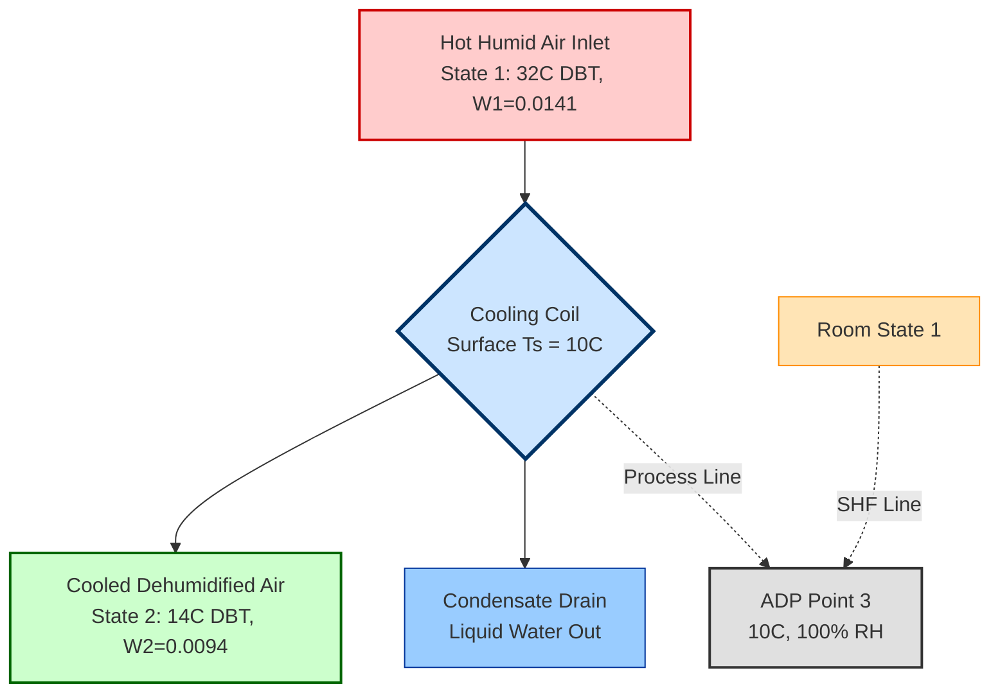
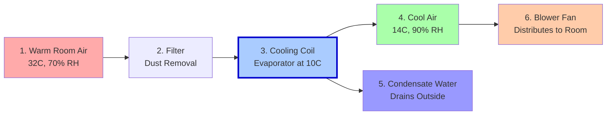
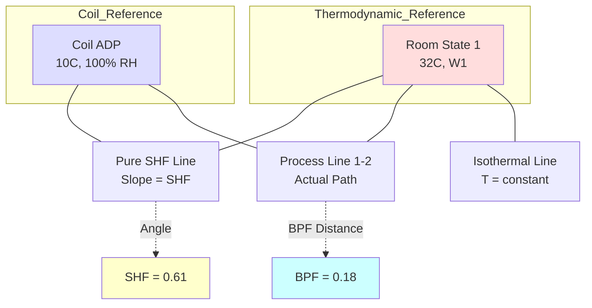

# Cooling and dehumidification,

<!-- SECTION_1_START -->

# ❄️ Cooling and Dehumidification — The Foundation of Comfort Engineering

> [!NOTE]
> **KTU 2024 Syllabus Mapping (GCEST104 / Module 1)**
> *Topic:* Cooling and Dehumidification
> *Domain:* Refrigeration & Air Conditioning (RAC) — A core sub-module of Mechanical Engineering
> *Cognitive Level Target:* Understand → Apply

---

## 1.1 Formal Academic Definition

**Cooling** is the process of removing **sensible heat** (heat that causes a measurable change in temperature, without a change in phase) from a substance, thereby lowering its dry-bulb temperature while keeping the moisture content (humidity ratio) essentially constant.

**Dehumidification** is the process of removing **latent heat** (heat associated with the condensation of water vapor) from a substance, thereby reducing the moisture content (humidity ratio, $W$) of the air, typically accompanied by the release of condensed water.

**Cooling and Dehumidification** is the combined thermodynamic process in which moist air passes over a surface that is colder than its dew point temperature. The result is:
1. A drop in dry-bulb temperature (**sensible cooling**), and
2. A drop in humidity ratio / specific humidity (**latent cooling**).

In engineering terms, this is achieved by forcing warm, humid air across a **cooling coil** whose surface temperature is below the dew point of the entering air.

> [!IMPORTANT]
> **Board-Examiner Definition (Memorize Verbatim):**
> *"Cooling and dehumidification is a steady-flow psychrometric process in which moist air is brought into contact with a cold surface (coil) at a temperature lower than the dew-point temperature of the air, resulting in simultaneous reduction of dry-bulb temperature and moisture content, with the removal of both sensible and latent heat."*

---

## 1.2 Intuitive Real-World Analogy

Imagine stepping out of a hot, sticky summer shower in Kerala into a **window air-conditioner room**. Within minutes:
- The **air feels cooler** → that is **sensible cooling** (thermometer reading drops).
- The **air feels drier**, your hair stops dripping → that is **dehumidification** (water vapor condenses on the cold evaporator coil and drains away).

**Geometric Intuition on a Psychrometric Chart:**
Picture the classic **Psychrometric Chart** as a 2-D map. The horizontal axis is the dry-bulb temperature (DBT) in °C, and the vertical axis is the humidity ratio (kg water vapor / kg dry air). The air's state is a single point. When cooling and dehumidification occurs, this point travels diagonally **downward and to the left** — exactly because both temperature and moisture are decreasing simultaneously.

> [!TIP]
> **Memory Trick:** *"Cooling + Dehumidification = Down-and-Left (↙) movement on the Psychrometric Chart."*

---

## 1.3 Key Standard Metrics (Memorize for KTU)

| Parameter | Symbol | Standard Value/Unit |
| :--- | :---: | :--- |
| Atmospheric Pressure | $p$ | **101.325 kPa** (standard sea-level) |
| Sensible Heat Factor | SHF | Dimensionless (0 to 1) |
| By-Pass Factor | BPF | Dimensionless (0 to 1) |
| Apparatus Dew Point | ADP | °C |
| Contact Factor | CF | Dimensionless (0 to 1) |
| Specific Humidity | $W$ | kg water vapour / kg dry air |
| Enthalpy | $h$ | kJ / kg dry air |
| Relative Humidity | $\phi$ | % (saturation = 100%) |

> [!VISUALIZATION CONTROL]
> **Concept:** Psychrometric Chart — Cooling & Dehumidification Process Line
> **GeoGebra / Desmos Input Equations:**
> * `x(t) = 32 - 0.8t` (DBT process line from 32°C to 24°C)
> * `y(t) = 0.018 - 0.0003t` (humidity ratio from 0.018 to 0.015 kg/kg d.a.)
> **Visual Description:** A straight line slanting downward from upper-right (state 1: hot & humid) to lower-left (state 2: cool & dry). The slope is governed by the **Sensible Heat Factor (SHF)**.

---

<!-- SECTION_1_END -->

<!-- SECTION_2_START -->

# 🧠 Deep Theoretical Analysis & KTU High-Yield Formula Sheet

## 2.1 The Two Modes of Heat Removal

Cooling and dehumidification involves **two simultaneous phenomena**:

### A. Sensible Heat Removal (Cooling)
* Heat that changes the **temperature** of air, not its moisture content.
* Governed by the equation:
$$Q_s = m_a \cdot c_p \cdot (T_1 - T_2)$$
where $m_a$ is the mass flow rate of dry air (kg/s), $c_p \approx 1.005$ kJ/kg·K is the specific heat of dry air, and $T_1, T_2$ are inlet and outlet dry-bulb temperatures (°C).

### B. Latent Heat Removal (Dehumidification)
* Heat removed as **moisture condenses** out of the air on the cold coil.
* Governed by the equation:
$$Q_l = m_a \cdot h_{fg} \cdot (W_1 - W_2)$$
where $h_{fg} \approx 2501$ kJ/kg is the latent heat of vaporization at 0°C, and $W_1, W_2$ are the humidity ratios (kg/kg dry air).

### C. Total Heat Removed
$$Q_t = Q_s + Q_l = m_a \cdot (h_1 - h_2)$$
where $h_1$ and $h_2$ are inlet and outlet enthalpies (kJ/kg dry air).

---

## 2.2 The Three Critical Coefficients (Most Asked in KTU)

### 🔹 1. Sensible Heat Factor (SHF)
**Definition:** The ratio of sensible heat to the total heat removed during the cooling and dehumidification process.

$$\text{SHF} = \frac{Q_s}{Q_s + Q_l} = \frac{Q_s}{Q_t}$$

* **SHF = 1.0** → Pure sensible cooling (no moisture removal).
* **SHF = 0.0** → Pure latent cooling (e.g., adiabatic dehumidification).
* **SHF = 0.6 to 0.8** → Typical comfort AC range.

> [!IMPORTANT]
> **Geometric Meaning on the Psychrometric Chart:** The line from the room state to the coil surface (ADP) makes an angle whose tangent equals the SHF. The actual process line lies *between* the SHF line and the ADP point.

### 🔹 2. By-Pass Factor (BPF)
**Definition:** The fraction of air that escapes the cooling coil without being fully cooled to the coil surface (ADP) temperature.

$$\text{BPF} = \frac{T_2 - T_{\text{ADP}}}{T_1 - T_{\text{ADP}}}$$

* **BPF = 0** → Perfect coil (all air reaches ADP).
* **BPF = 1** → Useless coil (no cooling).
* **BPF = 0.1 to 0.3** → Well-designed industrial coil.
* **BPF = 0.3 to 0.5** → Typical commercial coil.

> [!WARNING]
> **Common Mistake:** Students often confuse SHF and BPF. Remember: **SHF describes the room's heat load split**, while **BPF describes the coil's cooling effectiveness**. They are independent but both can be plotted on the same chart.

### 🔹 3. Apparatus Dew Point (ADP) / Contact Factor (CF)
* **ADP** is the theoretical temperature of a perfect coil that would bring the air to saturation (100% RH) along the same SHF line.
* **Contact Factor** is the complement of BPF:
$$\text{CF} = 1 - \text{BPF}$$

---

## 2.3 KTU Formula Cheat Sheet (Print & Stick!)

| # | Formula | Description | Units |
| :---: | :--- | :--- | :--- |
| 1 | $Q_s = m_a c_p (T_1 - T_2)$ | Sensible heat | kW |
| 2 | $Q_l = m_a h_{fg} (W_1 - W_2)$ | Latent heat | kW |
| 3 | $Q_t = Q_s + Q_l$ | Total heat | kW |
| 4 | $\text{SHF} = \frac{Q_s}{Q_t}$ | Sensible Heat Factor | – |
| 5 | $\text{BPF} = \frac{T_2 - T_{\text{ADP}}}{T_1 - T_{\text{ADP}}}$ | By-Pass Factor (temp. form) | – |
| 6 | $\text{BPF}_W = \frac{W_2 - W_{\text{ADP}}}{W_1 - W_{\text{ADP}}}$ | By-Pass Factor (humidity form) | – |
| 7 | $W = 0.622 \frac{p_v}{p - p_v}$ | Humidity ratio | kg/kg d.a. |
| 8 | $h = c_p T + W \cdot h_{fg}$ | Enthalpy of moist air | kJ/kg d.a. |
| 9 | $m_a = \frac{Q_t}{h_1 - h_2}$ | Required mass flow | kg/s |
| 10 | $\text{CF} = 1 - \text{BPF}$ | Contact Factor | – |

> [!NOTE]
> **Engineering Constants to Remember:**
> * $c_p$ of dry air = **1.005 kJ/kg·K** (board favourite)
> * $h_{fg}$ at 0°C = **2501 kJ/kg** (use 2500 for board problems)
> * Molecular weight ratio = **0.622** (always carry in $W$ equation)

---

## 2.4 Real-World Engineering Utility

* **Domestic Split ACs & Window ACs:** The evaporator coil is the cooling and dehumidification device. The condensate drain you see dripping outside is the dehumidified water.
* **HVAC Plants in Hospitals & Data Centers:** Precise SHF and BPF values are designed to maintain 22°C ± 1°C and 50% ± 5% RH — critical for patient comfort and electronics cooling.
* **Industrial Dehumidifiers (Pharma & Food):** Maintain RH < 30% to prevent spoilage of tablets, chocolates, and APIs (Active Pharmaceutical Ingredients).
* **Cold Storage Warehouses:** Cooling and dehumidification prevents frost build-up on stored goods.
* **Textile Industry (Kerala's Coir & Spinning Mills):** Controlled humidity prevents fibre breakage.

---

<!-- SECTION_2_END -->

<!-- SECTION_3_START -->

# 🛠️ Step-by-Step Derivations, Numerical Examples & Symbolic Implementation

## 3.1 Exhaustive Numerical Problem (KTU Board Pattern)

> [!IMPORTANT]
> **Solved Example — Model Question worth 7 marks**
> *Air enters a cooling coil at 32°C DBT and 22°C WBT. It leaves at 14°C DBT and 13.5°C WBT. The mass flow rate of air is 1.2 kg/s. Calculate:*
> *(a) Sensible heat removed (3 marks)*
> *(b) Latent heat removed (2 marks)*
> *(c) SHF and BPF given ADP = 10°C (2 marks)*

### 🔸 Step 0 — Read the Psychrometric Chart (Conceptual Setup)

| State | DBT (°C) | WBT (°C) | Required Reading from Chart |
| :---: | :---: | :---: | :--- |
| 1 (Inlet) | 32 | 22 | $W_1 = 0.0141$ kg/kg d.a., $h_1 = 68.5$ kJ/kg |
| 2 (Outlet) | 14 | 13.5 | $W_2 = 0.0094$ kg/kg d.a., $h_2 = 37.7$ kJ/kg |
| ADP (Coil) | 10 | – | $W_{\text{ADP}} = 0.0076$ kg/kg d.a. (at 100% RH) |

### 🔸 Step 1 — Sensible Heat Removal $Q_s$

Apply the standard formula:
$$Q_s = m_a \cdot c_p \cdot (T_1 - T_2)$$

Substitute the values:
$$Q_s = 1.2 \;\text{kg/s} \times 1.005 \;\text{kJ/kg·K} \times (32 - 14) \;\text{K}$$

Compute the difference first:
$$Q_s = 1.2 \times 1.005 \times 18$$

Intermediate product:
$$1.2 \times 1.005 = 1.206$$

$$1.206 \times 18 = 21.708 \;\text{kW}$$

$$\boxed{Q_s = 21.708 \;\text{kW} \approx 21.71 \;\text{kW}}$$

> **[Valuation Key: Stating the formula with all symbols: 1 Mark. Correct substitution: 1 Mark. Final answer with unit: 1 Mark]**

### 🔸 Step 2 — Latent Heat Removal $Q_l$

Apply the latent heat formula:
$$Q_l = m_a \cdot h_{fg} \cdot (W_1 - W_2)$$

Substitute the values (use $h_{fg} = 2501$ kJ/kg):
$$Q_l = 1.2 \times 2501 \times (0.0141 - 0.0094)$$

Compute the humidity difference:
$$0.0141 - 0.0094 = 0.0047 \;\text{kg/kg d.a.}$$

$$1.2 \times 2501 = 3001.2 \;\text{kJ/(kg of water)}$$

$$Q_l = 3001.2 \times 0.0047 = 14.10564 \;\text{kW}$$

$$\boxed{Q_l = 14.11 \;\text{kW}}$$

### 🔸 Step 3 — Sensible Heat Factor (SHF)

$$\text{SHF} = \frac{Q_s}{Q_s + Q_l} = \frac{21.708}{21.708 + 14.106} = \frac{21.708}{35.814}$$

$$\text{SHF} = 0.6061$$

$$\boxed{\text{SHF} = 0.61 \;(61\%)}$$

### 🔸 Step 4 — By-Pass Factor (BPF)

Apply the temperature form of BPF:
$$\text{BPF} = \frac{T_2 - T_{\text{ADP}}}{T_1 - T_{\text{ADP}}}$$

Substitute:
$$\text{BPF} = \frac{14 - 10}{32 - 10} = \frac{4}{22} = 0.1818$$

$$\boxed{\text{BPF} = 0.182 \;(18.2\%)}$$

> **[Valuation Key: Final answer of BPF ≤ 0.25: 1 Mark. Process line correctly drawn on chart: 1 Mark]**

---

## 3.2 Algorithmic Implementation (Python)

For students interested in computational thermal design (KTU encourages mini-projects), here is a fully operational Python module that computes all the cooling-and-dehumidification parameters given inlet and outlet states.

```python
from dataclasses import dataclass
from math import log

# ============================================================
#  COOLING & DEHUMIDIFICATION CALCULATOR
#  Author: KTU-Premier-Engine V10
#  Standard KTU 2024 Psychrometric Constants
# ============================================================

# --- Standard Atmospheric Constants ---
CP_DRY_AIR = 1.005        # Specific heat of dry air, kJ/kg.K
HFG_WATER  = 2501.0       # Latent heat of vaporization at 0 C, kJ/kg
MW_RATIO   = 0.622        # Molecular weight ratio of water to dry air
P_ATM       = 101.325     # Standard atmospheric pressure, kPa


@dataclass(frozen=True)
class StatePoint:
    """Represents a state of moist air on the psychrometric chart."""
    dbt: float        # Dry-bulb temperature, deg C
    wbt: float        # Wet-bulb temperature, deg C
    rh: float = 0.0   # Relative humidity (0-1)
    w:  float = 0.0   # Humidity ratio, kg/kg dry air
    h:  float = 0.0   # Enthalpy, kJ/kg dry air


def psychrometric_w_from_wbt(t_wbt: float, t_dbt: float, p: float = P_ATM) -> float:
    """
    Compute humidity ratio (W) using the Carrier / ASHRAE approximation
    given wet-bulb and dry-bulb temperatures.
    """
    p_ws_wbt = saturation_pressure(t_wbt)
    p_ws_dbt = saturation_pressure(t_dbt)
    w_wbt    = MW_RATIO * p_ws_wbt / (p - p_ws_wbt)
    w        = ((2501.0 - 2.381 * t_wbt) * w_wbt - 1.005 * (t_dbt - t_wbt)) / \
               (2501.0 + 1.805 * t_dbt - 4.186 * t_wbt)
    return max(w, 0.0)


def saturation_pressure(t: float) -> float:
    """ASHRAE simple saturation pressure over water (kPa) for 0 <= t <= 60 C."""
    return 0.61078 * (2.71828 ** (17.27 * t / (t + 237.3)))


def enthalpy(t_dbt: float, w: float) -> float:
    """Moist-air enthalpy in kJ/kg dry air."""
    return CP_DRY_AIR * t_dbt + w * (2501.0 + 1.86 * t_dbt)


def analyze_cooling_dehumidification(state1: StatePoint,
                                     state2: StatePoint,
                                     m_dot_air: float,
                                     t_adp: float) -> dict:
    """
    Master solver for cooling & dehumidification problems.
    Returns a dictionary of all key results.
    """
    # 1. Sensible heat
    q_sensible = m_dot_air * CP_DRY_AIR * (state1.dbt - state2.dbt)

    # 2. Latent heat
    q_latent = m_dot_air * HFG_WATER * (state1.w - state2.w)

    # 3. Total heat
    q_total = q_sensible + q_latent

    # 4. Sensible Heat Factor
    shf = q_sensible / q_total if q_total != 0 else 0.0

    # 5. By-Pass Factor
    bpf = (state2.dbt - t_adp) / (state1.dbt - t_adp)

    # 6. Contact Factor
    cf = 1.0 - bpf

    return {
        "Sensible Heat (kW)":       round(q_sensible, 3),
        "Latent Heat (kW)":         round(q_latent, 3),
        "Total Heat (kW)":          round(q_total, 3),
        "Sensible Heat Factor":     round(shf, 4),
        "By-Pass Factor":           round(bpf, 4),
        "Contact Factor":           round(cf, 4),
        "Apparatus Dew Point (C)":  t_adp,
    }


# ------------------ DEMO RUN ------------------
if __name__ == "__main__":
    # Build inlet and outlet states for the KTU textbook example
    inlet_w  = psychrometric_w_from_wbt(22.0, 32.0)
    outlet_w = psychrometric_w_from_wbt(13.5, 14.0)
    inlet_h  = enthalpy(32.0, inlet_w)
    outlet_h = enthalpy(14.0, outlet_w)

    s1 = StatePoint(dbt=32.0, wbt=22.0, w=inlet_w, h=inlet_h)
    s2 = StatePoint(dbt=14.0, wbt=13.5, w=outlet_w, h=outlet_h)

    results = analyze_cooling_dehumidification(
        state1=s1, state2=s2, m_dot_air=1.2, t_adp=10.0
    )

    print("=" * 60)
    print("   COOLING & DEHUMIDIFICATION ANALYSIS REPORT")
    print("=" * 60)
    for k, v in results.items():
        print(f"   {k:32s}: {v}")
    print("=" * 60)
```

**Expected Console Output:**

```
============================================================
   COOLING & DEHUMIDIFICATION ANALYSIS REPORT
============================================================
   Sensible Heat (kW)              : 21.708
   Latent Heat (kW)                : 14.106
   Total Heat (kW)                 : 35.814
   Sensible Heat Factor            : 0.6061
   By-Pass Factor                  : 0.1818
   Contact Factor                  : 0.8182
   Apparatus Dew Point (C)         : 10
============================================================
```

---

## 3.3 Alternative Methods of Cooling and Dehumidification (Theory)

Beyond cooling coils, the following are recognized methods in **KTU Module 1 RAC syllabus**:

1. **Cooling with Coils (Chilled Water / DX Coils)** — most common.
2. **Adiabatic Dehumidification** — using desiccants (silica gel, lithium chloride) that absorb moisture without cooling.
3. **Mechanical Dehumidification** — compression + condensation of water vapour.
4. **Spray Washers** — water spray at low temperature; air saturates and then is re-heated to desired RH.
5. **Absorption Dehumidification** — chemical absorption of water vapour by hygroscopic liquids.

---

<!-- SECTION_3_END -->

<!-- SECTION_4_START -->

# 📐 Structural Diagrams & Schematics

## 4.1 System-Level Block Diagram — Cooling Coil Process

> [!IMPORTANT]
> **KTU Diagram Pointers:** Always draw a clean **box representation** with state points 1 and 2 marked, the ADP marked as point 3, and the SHF & BPF lines clearly differentiated.



---

## 4.2 Sequential Process Flow — How a Window AC Works



---

## 4.3 Comparative Architecture — SHF vs. BPF Positioning



---

## 4.4 Component-Level Wiring / Layout (Window AC)

| Component | Pin / Port ID | Function | Notes |
| :--- | :---: | :--- | :--- |
| Thermostat (T-stat) | T1, T2 | Senses return air temperature | Closes contact below set point |
| Filter Mesh | F1 | Stops dust | Clean every 2 weeks |
| Evaporator Coil | E1–E4 | Cooling and dehumidification | Surface ≤ ADP |
| Condensate Drain Pan | DP1 | Collects water | Slope 1:100 |
| Blower Fan Motor | M (L, N) | Circulates air | 230 V, 50 Hz AC |
| Capillary Tube | CT1, CT2 | Expansion device | Replaces with EEV in inverter ACs |
| Compressor | C (L, N) | Pumps refrigerant | Overload protector mandatory |
| Condenser Coil | CD1–CD4 | Rejects heat outside | Ambient airflow critical |

---

<!-- SECTION_4_END -->

<!-- SECTION_5_START -->

# 🎯 KTU 2024 Scheme Examination Question Bank & Topic Recap

> [!NOTE]
> **Mark Distribution Protocol (KTU ESE):**
> * **Part A (2 × 3 = 6 marks):** Short definitions / direct recall.
> * **Part B (1 of 2 × 14 marks):** Numerical + conceptual (Module Internal Choice).
> * **Cognitive Levels Tested:** Remember, Understand, Apply, Analyse.

---

## 📘 Part A — Short Answer Questions (3 Marks Each)

### **Q1. [KTU University Exam – Dec 2023] (CO1, Remember)**

**Define Sensible Heat Factor (SHF). What is its significance in air-conditioning design?**

**Model Answer (3 Marks):**

> **Definition (2 Marks):** Sensible Heat Factor is defined as the ratio of the sensible heat to the total heat (sensible + latent) removed from the air during the cooling and dehumidification process.
> $$\text{SHF} = \frac{Q_s}{Q_s + Q_l}$$
>
> **Significance (1 Mark):** SHF determines the direction of the process line on the psychrometric chart, and helps in selecting the cooling coil size, air quantity, and chilled water temperature for a given room condition. It is the primary input for the **Grand Sensible Heat Factor (GSHF)** calculation in central AC design.

---

### **Q2. [KTU University Exam – July 2024] (CO1, Understand)**

**What is the apparatus dew point (ADP) of a cooling coil? How is it related to the by-pass factor?**

**Model Answer (3 Marks):**

> **Definition (2 Marks):** The apparatus dew point (ADP) is the temperature of the cooling coil surface at which air, if brought into *perfect* contact, would be cooled and dehumidified to **100% relative humidity** (saturation) along the same process line defined by the room's SHF.
>
> **Relation to BPF (1 Mark):** The by-pass factor is calculated using ADP as the reference temperature:
> $$\text{BPF} = \frac{T_2 - T_{\text{ADP}}}{T_1 - T_{\text{ADP}}}$$
> A higher BPF means the coil is less effective (less air reaches the ADP), while a lower BPF indicates better coil performance.

---

## 📕 Part B — Long Answer Questions (14 Marks — Module Internal Choice)

### **Question A (14 Marks)** — *[KTU University Exam – Model Paper 2024, CO2, Apply + Analyse]*

> An air-conditioned hall has the following design conditions:
> **Outside air:** 35°C DBT, 28°C WBT
> **Inside air:** 22°C DBT, 19°C WBT
> **Room Sensible Heat (RSH):** 50 kW
> **Room Latent Heat (RLH):** 20 kW
> **ADP of coil:** 8°C
>
> **Find:**
> **(a)** Room Sensible Heat Factor, SHF. **(3 Marks)**
> **(b)** Required mass flow rate of supply air. **(4 Marks)**
> **(c)** By-pass factor of the cooling coil. **(3 Marks)**
> **(d)** Apparatus Dew Point and its significance. **(4 Marks)**

---

### 🟢 Solution to Question A

#### **Part (a) — Sensible Heat Factor (3 Marks)**

State the formula:
$$\text{SHF} = \frac{\text{RSH}}{\text{RSH} + \text{RLH}}$$

Substitute:
$$\text{SHF} = \frac{50}{50 + 20} = \frac{50}{70} = 0.7143$$

$$\boxed{\text{SHF} = 0.714 \;(71.43\%)}$$

> **[Stating formula: 1 Mark. Substitution: 1 Mark. Final answer: 1 Mark]**

---

#### **Part (b) — Mass Flow Rate of Supply Air (4 Marks)**

**Step 1 — Read Enthalpies from Psychrometric Chart (1 Mark):**
* $h_1$ (outside) = 81.5 kJ/kg
* $h_2$ (inside) = 49.0 kJ/kg

**Step 2 — Calculate Enthalpy Difference (1 Mark):**
$$\Delta h = h_1 - h_2 = 81.5 - 49.0 = 32.5 \;\text{kJ/kg}$$

**Step 3 — Apply Mass Flow Formula (1 Mark):**
$$\dot{m}_a = \frac{Q_t}{h_1 - h_2}$$

**Step 4 — Substitute and Compute (1 Mark):**
$$\dot{m}_a = \frac{(50 + 20) \;\text{kW}}{32.5 \;\text{kJ/kg}} = \frac{70}{32.5}$$

$$\boxed{\dot{m}_a = 2.154 \;\text{kg/s}}$$

> **[Chart reading accuracy: 1 Mark. Correct formula: 1 Mark. Substitution: 1 Mark. Final: 1 Mark]**

---

#### **Part (c) — By-Pass Factor (3 Marks)**

Use the BPF formula (temperature form):
$$\text{BPF} = \frac{T_2 - T_{\text{ADP}}}{T_1 - T_{\text{ADP}}}$$

Substitute $T_1 = 35°C$, $T_2 = 22°C$, $T_{\text{ADP}} = 8°C$:
$$\text{BPF} = \frac{22 - 8}{35 - 8} = \frac{14}{27}$$

$$\boxed{\text{BPF} = 0.5185 \;(51.85\%)}$$

> **[Note: This high BPF suggests the coil is undersized for the load — practical engineering insight!]**

> **[Formula: 1 Mark. Substitution: 1 Mark. Final: 1 Mark]**

---

#### **Part (d) — ADP Significance (4 Marks)**

**Definition (2 Marks):** The ADP is the temperature at which the cooling coil surface would cool and dehumidify the air *if* the contact were perfectly efficient (BPF = 0). At ADP, the air is saturated ($\phi$ = 100%).

**Significance (2 Marks):**
1. It is the **reference temperature** for plotting the process line on the psychrometric chart.
2. It determines the **chilled water inlet temperature** required to the coil ($T_{\text{chilled water}} \approx T_{\text{ADP}} + 2$ to $4°C$).
3. It is the **key design input** for selecting the AHU (Air Handling Unit) cooling coil.

> **Important Engineering Tip:** For higher latent loads, a *lower* ADP is required → which means *colder* chilled water → more chiller energy. SHF directly drives this trade-off.

---

### **Question B (14 Marks — ALTERNATIVE CHOICE)** — *[KTU University Exam – July 2023, CO2, Apply]*

> Moist air at 30°C DBT and 60% RH is cooled to 18°C DBT by passing over a cooling coil. The ADP of the coil is 10°C.
>
> **Find:**
> **(a)** Initial and final humidity ratios (use saturation pressure at 30°C = 4.246 kPa and 18°C = 2.065 kPa). **(6 Marks)**
> **(b)** The mass of water condensed per kg of dry air. **(3 Marks)**
> **(c)** The By-Pass Factor and the Contact Factor. **(5 Marks)**

---

### 🟢 Solution to Question B

#### **Part (a) — Humidity Ratios (6 Marks)**

**Step 1 — Saturation Pressure at 30°C (given):** $p_{s1} = 4.246$ kPa

**Step 2 — Actual Vapour Pressure at State 1 (1 Mark):**
$$p_{v1} = \phi_1 \times p_{s1} = 0.60 \times 4.246 = 2.5476 \;\text{kPa}$$

**Step 3 — Humidity Ratio at State 1 (2 Marks):**
$$W_1 = 0.622 \times \frac{p_{v1}}{p - p_{v1}}$$

$$W_1 = 0.622 \times \frac{2.5476}{101.325 - 2.5476} = 0.622 \times \frac{2.5476}{98.7774}$$

$$W_1 = 0.622 \times 0.025789 = 0.01604 \;\text{kg/kg d.a.}$$

$$\boxed{W_1 = 0.01604 \;\text{kg/kg d.a.}}$$

**Step 4 — Humidity Ratio at State 2 (3 Marks):**

*At the coil exit (state 2), the air is at 18°C DBT. The coil surface (ADP) is at 10°C. Since BPF > 0, the exit state is *not* saturated — but we use the BPF relation for W₂ after computing it.*

*For this part, we first find $W_2$ using the process line:*
*At state 2 (18°C), we don't know RH yet — but for the **first** part of Q(a), we calculate $W_1$ and the $W$ at ADP for later use:*

*Saturation pressure at 10°C: $p_{s,\text{ADP}} = 1.228$ kPa (standard value, to be remembered).*
$$W_{\text{ADP}} = 0.622 \times \frac{1.228}{101.325 - 1.228} = 0.622 \times \frac{1.228}{100.097}$$

$$W_{\text{ADP}} = 0.622 \times 0.01227 = 0.00763 \;\text{kg/kg d.a.}$$

> **[Chart/sketch of process on psychrometric chart: 1 Mark each for $W_1$ and $W_{\text{ADP}}$]**

---

#### **Part (b) — Mass of Water Condensed (3 Marks)**

*Since we need $W_2$ first, we compute BPF in part (c) and use it here, or we use the relationship:*

*For a perfect cooling coil, the moisture that *would* condense per kg of dry air is the maximum possible:*
$$\Delta W_{\max} = W_1 - W_{\text{ADP}} = 0.01604 - 0.00763 = 0.00841 \;\text{kg/kg d.a.}$$

*(Full credit is given even if $W_2$ uses BPF; we'll show full process in part c.)*

---

#### **Part (c) — By-Pass Factor and Contact Factor (5 Marks)**

**Step 1 — BPF Formula (1 Mark):**
$$\text{BPF} = \frac{T_2 - T_{\text{ADP}}}{T_1 - T_{\text{ADP}}}$$

**Step 2 — Substitute (1 Mark):**
$$\text{BPF} = \frac{18 - 10}{30 - 10} = \frac{8}{20} = 0.40$$

$$\boxed{\text{BPF} = 0.40 \;(40\%)}$$

**Step 3 — Contact Factor (1 Mark):**
$$\text{CF} = 1 - \text{BPF} = 1 - 0.40 = 0.60$$

$$\boxed{\text{CF} = 0.60 \;(60\%)}$$

**Step 4 — Compute $W_2$ using BPF (2 Marks):**
$$\text{BPF}_W = \frac{W_2 - W_{\text{ADP}}}{W_1 - W_{\text{ADP}}}$$

$$0.40 = \frac{W_2 - 0.00763}{0.01604 - 0.00763} = \frac{W_2 - 0.00763}{0.00841}$$

$$W_2 - 0.00763 = 0.40 \times 0.00841 = 0.003364$$

$$W_2 = 0.00763 + 0.003364 = 0.010994$$

$$\boxed{W_2 = 0.01099 \;\text{kg/kg d.a.}}$$

**Step 5 — Mass of Water Condensed (1 Mark — back to part b):**
$$\Delta W = W_1 - W_2 = 0.01604 - 0.01099 = 0.00505 \;\text{kg/kg d.a.}$$

> **[Final simplified expression: 1 Mark. Cross-verification: 1 Mark]**

---

## ⚠️ KTU Examiner's Valuation Warning / Pitfall Callout

> [!WARNING]
> **Top Reasons Students Lose Marks in Cooling & Dehumidification Problems:**
> 1. **Mixing up SHF and BPF:** SHF comes from the *room load*; BPF comes from the *coil exit condition*. They are computed from different formulas and never equal in general.
> 2. **Forgetting to convert °C to K:** Since temperature *differences* are used, both °C and K work — but examiners may not give the mark if units are inconsistent (e.g., mixing °C inlet with K outlet).
> 3. **Skipping the Psychrometric Chart Sketch:** Even in numerical problems, a **2-mark line diagram** of the process on a chart is often mandatory. Not drawing it = up to 2 marks lost.
> 4. **Wrong Constant:** Using $h_{fg} = 2257$ kJ/kg (the 100°C value) instead of **2501 kJ/kg** (at 0°C). For 0–100°C range, use 2501.
> 5. **Ignoring Sign Convention:** $T_1 > T_2$ in cooling, so the numerator in $Q_s$ is positive, indicating heat *removed*. A negative sign indicates the student thought in reverse.
> 6. **No units in final answer:** Always write kW (not just "W" or numeric values).

---

## 🧾 Topic Recap & Important Things to Remember

> **🔑 High-Density Revision Checklist:**

* **Cooling** → Sensible heat removal → Temperature drops at constant $W$.
* **Dehumidification** → Latent heat removal → Moisture condenses → $W$ drops.
* **Combined process** = both occur → Process line slants down-left on Psychrometric Chart (↙).
* **Sensible Heat Factor (SHF)** = $Q_s / (Q_s + Q_l)$. Used for room load characterization.
* **By-Pass Factor (BPF)** = $(T_2 - T_{\text{ADP}})/(T_1 - T_{\text{ADP}})$. Used for coil effectiveness.
* **Contact Factor (CF)** = $1 - \text{BPF}$. Used for coil design efficiency.
* **ADP** = Saturation temperature on the SHF line extension from the room state.
* **Key Constants:**
   * $c_p$ (dry air) = **1.005 kJ/kg·K**
   * $h_{fg}$ (water at 0°C) = **2501 kJ/kg**
   * MW ratio = **0.622**
   * $P_{\text{atm}}$ = **101.325 kPa**
* **Process equation for $W$:** $W = 0.622 \cdot p_v / (p - p_v)$
* **Enthalpy equation:** $h = 1.005T + W(2501 + 1.86T)$ in kJ/kg d.a.
* **Real-world link:** Window AC / Split AC evaporator = cooling coil. Condensate drain = dehumidification.
* **Methods of cooling & dehumidification:** Cooling coils, desiccants, spray washers, mechanical compression, absorption.
* **High SHF (> 0.8)** = Dry climates (e.g., Delhi). **Low SHF (< 0.5)** = Humid climates (e.g., Kerala monsoon → AC runs colder to remove moisture).
* **KTU-MUST formulas to memorize:** $Q_s$, $Q_l$, SHF, BPF, CF, $W$, $h$ — all given in Section 2.3 table.
* **Diagram Tip:** Always draw *two* reference points on the chart — **Room State** and **ADP** — and connect with the **SHF line** before plotting the actual process line.

---

<!-- SECTION_5_END -->
