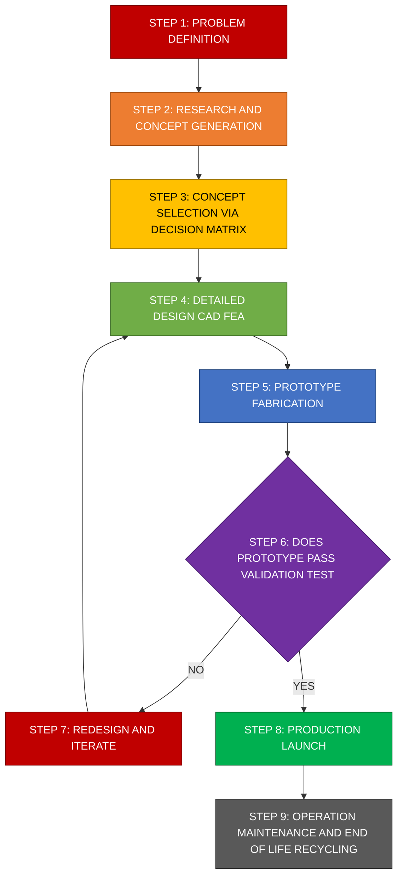
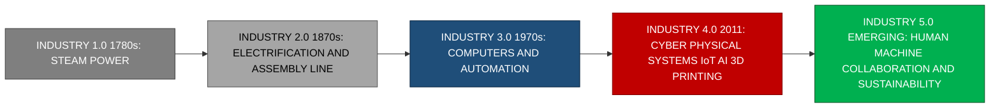
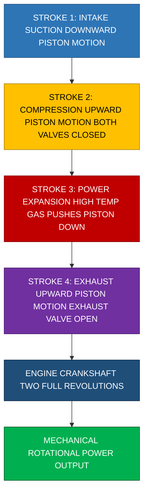

# General introduction to Mechanical Engineering :

<!-- SECTION_1_START -->
# General Introduction to Mechanical Engineering

## 1.1 Formal Academic Definition

**Mechanical Engineering** is the broadest and one of the oldest disciplines of engineering, concerned with the **design, analysis, manufacturing, operation, and maintenance** of mechanical systems. It applies the principles of **physics, mathematics, materials science, and economics** to conceive, design, manufacture, operate, and maintain machines, mechanisms, energy conversion systems, thermal-fluid systems, and industrial processes.

As per the **KTU 2024 Scheme (GCEST104)** syllabus, mechanical engineering encompasses the generation, conversion, transmission, and utilization of mechanical and thermal energy, along with the design and production of tools, machines, and products of every kind.

> [!IMPORTANT]
> **Core Definition (Board Examination Ready):**
> *Mechanical Engineering is the discipline of engineering that involves the application of principles of physics, mathematics, and material science for the design, analysis, manufacturing, and maintenance of mechanical systems. It deals with the conversion, transmission, and effective utilization of mechanical, thermal, and fluid energy in machines, engines, vehicles, and industrial processes.*

## 1.2 Conceptual Analogy — The "Body" of Engineering

Imagine engineering as a living human body:

- **Mechanical Engineering** acts as the **musculoskeletal system** — the *bones* (structures, frames), *muscles* (engines, motors), and *joints* (gears, linkages) that produce motion, bear loads, and convert energy.
- **Electrical Engineering** is the **nervous system** that carries signals.
- **Computer Engineering / IT** is the **brain** that processes decisions.
- **Civil Engineering** is the **external environment / shelter** that houses the body.

> [!NOTE]
> **Intuitive Summary:** If something **moves, produces power, transfers heat, transports fluids, or is physically manufactured**, there is almost always a mechanical engineer who designed, analyzed, or built it.

## 1.3 Why Mechanical Engineering? — Scope and Significance

Mechanical engineers are often called the **"generalists of engineering"** because their training spans across multiple domains. They are the backbone of nearly every industrial sector, from automotive to aerospace, energy to healthcare.

> [!TIP]
> **Geographical & Industrial Significance for KTU Context:**
> Kerala hosts major industrial hubs such as **FACT (Fertilizers and Chemicals Travancore)**, **HMT (Hindustan Machine Tools)**, **Keltron**, **BPCL-Kochi Refinery**, and a growing **electric vehicle (EV) manufacturing ecosystem** in collaboration with the **Kerala State Electric Vehicle Policy 2021**, making mechanical engineering a vital career stream in the state.

## 1.4 Historical Evolution of Mechanical Engineering

The history of mechanical engineering traces back to the invention of the **six classical simple machines** (lever, wheel and axle, pulley, inclined plane, wedge, screw) formalized by **Archimedes (287–212 BC)**. Over millennia, the discipline has evolved through distinct industrial revolutions.

| Era | Period | Defining Innovation | Key Contributor |
|---|---|---|---|
| **Industry 1.0** | 1780s | Steam engine, mechanization | **James Watt** |
| **Industry 2.0** | 1870s | Mass production, electrical power | **Henry Ford (Assembly Line, 1913)** |
| **Industry 3.0** | 1970s | Electronics, PLCs, early automation | **Computer-Controlled Machines** |
| **Industry 4.0** | 2011 – Present | Cyber-physical systems, IoT, AI, Additive Manufacturing | German Federal Government (Hannover Messe) |

> [!IMPORTANT]
> **KTU 2024 Highlight:** The current **Industry 4.0 paradigm** merges mechanical engineering with **Artificial Intelligence (AI), Internet of Things (IoT), 3D Printing (Additive Manufacturing), Digital Twins, and Sustainable Engineering Practices** — a recurring high-weightage topic in KTU board exams.

## 1.5 Role of a Mechanical Engineer

A mechanical engineer performs a wide spectrum of activities throughout a product's lifecycle:

1. **Research & Conceptualization** — Identifying user needs, problem definitions, feasibility studies.
2. **Design & Analysis** — CAD modeling (SolidWorks, CATIA, AutoCAD), FEA (ANSYS, ABAQUS), tolerance stack-up.
3. **Manufacturing & Fabrication** — Casting, forging, machining, welding, 3D printing, quality control.
4. **Operation & Maintenance** — Plant engineering, predictive maintenance, reliability engineering.
5. **Management & Innovation** — Project management, lean manufacturing, R\&D leadership.

---

## 1.6 GeoGebra / Desmos Visualization Concept

> [!VISUALIZATION CONTROL]
> **Concept:** Visualization of the Four Industrial Revolutions on a Timeline (Time vs. Capability Index)
>
> **Desmos / GeoGebra Input Equations:**
> * $f_{1}(x) = 1$ (Steady mechanical capability, Industry 1.0 baseline, $x \in [0, 60]$)
> * $f_{2}(x) = 1 + 0.02 \cdot (x - 60)$ (Industry 2.0, linear growth from 1870 onwards)
> * $f_{3}(x) = 1 + 0.5 \cdot \sin(0.3 \cdot (x - 110))$ (Industry 3.0, oscillating automation waves from 1970)
> * $f_{4}(x) = 2 \cdot e^{0.06 \cdot (x - 145)}$ (Industry 4.0, exponential smart-engineering growth from 2011)
>
> **Visual Description:** A 2D plane with time (years since 1800) on the horizontal axis and engineering capability index on the vertical axis. Students should observe the **constant baseline** during the steam era, **linear growth** during mass production, **oscillatory wave** during electronics/automation, and **steep exponential curve** during the Industry 4.0 smart manufacturing era. This visually reinforces the **accelerating pace of mechanical innovation**.

---

## 1.7 Overview of Major Sub-Branches

Mechanical engineering is divided into several specialized sub-branches. Each branch addresses a specific physical phenomenon or industrial application.

| \# | Sub-Branch | Core Focus |
|---|---|---|
| 1 | **Machine Design** | Kinematic, dynamic, and structural design of components |
| 2 | **Thermal Engineering** | Thermodynamics, IC engines, gas turbines, heat transfer |
| 3 | **Fluid Mechanics** | Fluid statics, dynamics, boundary layers, turbomachinery |
| 4 | **Manufacturing Engineering** | Casting, machining, forming, welding, additive manufacturing |
| 5 | **Industrial \& Production Engineering** | Operations research, ergonomics, lean systems |
| 6 | **Mechatronics \& Robotics** | Integration of mechanical, electronic, and control systems |
| 7 | **Automobile Engineering** | Vehicle design, EV technology, automotive aerodynamics |
| 8 | **Aerospace Engineering** | Aerodynamics, propulsion, structural analysis of aircraft |
| 9 | **Refrigeration \& HVAC** | Vapour compression/absorption cycles, psychrometrics |
| 10 | **Power Plant Engineering** | Steam, hydro, nuclear, solar, wind power generation |
| 11 | **Renewable Energy Systems** | Solar thermal, wind turbines, biomass, green hydrogen |
| 12 | **Biomechanics \& Biomedical Engineering** | Prosthetics, implants, biomedical devices |

<!-- SECTION_1_END -->

<!-- SECTION_2_START -->
# Deep Theoretical Analysis & KTU High-Yield Formula Sheet

## 2.1 The Engineering Problem-Solving Framework

Mechanical engineering solutions follow a structured **Engineering Design Process** that is universally accepted in industry and frequently tested in KTU board examinations. Mastering this process is critical for the entire program.

### Step-by-Step Logic of the Design Process

1. **Define the Problem** — Clearly identify the need, constraints, and success criteria. *(Why is the problem being solved?)*
2. **Conceptualize** — Brainstorm multiple possible solutions. Generate Pugh matrices for trade-off analysis. *(What are the alternative approaches?)*
3. **Select a Concept** — Apply decision matrices based on cost, weight, safety, and feasibility. *(Which one is the most optimal?)*
4. **Detailed Design** — Perform analytical calculations, CAD modeling, FEA/CFD analysis, BOM generation. *(How exactly is it built?)*
5. **Prototype \& Testing** — Build a physical prototype. Conduct validation testing per relevant IS/ISO/ASTM standards. *(Does it work as intended?)*
6. **Iteration** — Refine the design based on test feedback, FEA results, and customer inputs. *(What needs improvement?)*
7. **Production \& Deployment** — Finalize manufacturing processes, supply chain, after-sales service. *(How is it mass-produced?)*

> [!TIP]
> **Engineering Mantra (commonly quoted in KTU answers):**
> *"A good mechanical engineer does not just design machines — they design systems that **work, are safe, are manufacturable, are affordable, and are sustainable**."*

## 2.2 Core Domains of Mechanical Engineering — The "Four Pillars"

Although mechanical engineering has 12+ sub-branches, all of them can be classified under four foundational domains:

### Pillar 1: Mechanics (Static \& Dynamic)
- The study of forces, moments, equilibrium, and motion of rigid bodies.
- Governed by **Newton's Laws of Motion**:
  $$\vec{F} = m \cdot \vec{a}$$
  $$\sum \vec{F} = 0 \quad \text{(Static Equilibrium)}$$
  $$\sum \vec{M} = 0 \quad \text{(Moment Equilibrium)}$$

### Pillar 2: Thermodynamics \& Heat Transfer
- Governed by the **First and Second Laws of Thermodynamics**:
  $$\Delta U = Q - W \quad \text{(First Law for a closed system)}$$
  $$\Delta S_{\text{universe}} \geq 0 \quad \text{(Second Law — Entropy never decreases)}$$
  $$\eta_{\text{Carnot}} = 1 - \frac{T_{\text{Low}}}{T_{\text{High}}} \quad \text{(Maximum possible efficiency)}$$

### Pillar 3: Fluid Mechanics
- Governed by **Conservation of Mass, Momentum, and Energy**:
  $$\frac{\partial \rho}{\partial t} + \nabla \cdot (\rho \vec{V}) = 0 \quad \text{(Continuity Equation)}$$
  $$P + \frac{1}{2} \rho V^{2} + \rho g h = \text{constant} \quad \text{(Bernoulli's Equation)}$$

### Pillar 4: Manufacturing \& Materials
- Encompasses processes that convert raw materials into finished products.
- Material selection follows the **Ashby method** based on strength, stiffness, weight, cost, and corrosion resistance.

## 2.3 The Mechanical Engineer's Toolbox — Software Stack

Modern mechanical engineering practice relies heavily on digital tools. KTU frequently asks students to list the major software categories:

| Function | Software Examples | Industry Use |
|---|---|---|
| **CAD (2D/3D Modeling)** | AutoCAD, SolidWorks, CATIA, Creo, Fusion 360 | Product design, drafting |
| **CAE (Simulation)** | ANSYS, ABAQUS, COMSOL, HyperWorks | FEA, CFD, thermal analysis |
| **CAM (Manufacturing)** | Mastercam, NX CAM, Fusion 360 CAM | Toolpath generation, CNC |
| **PLM (Product Lifecycle)** | Siemens Teamcenter, PTC Windchill | BOM, version control |
| **Programming** | MATLAB, Python (NumPy, SciPy), LabVIEW | Automation, data analysis |
| **3D Printing Slicing** | Cura, PrusaSlicer, Simplify3D | Additive manufacturing |

## 2.4 KTU High-Yield Formula Sheet

> [!IMPORTANT]
> **The following table consolidates the most critical formulas tested across KTU 2024 Board Examinations for this module. Memorize these before the exam.**

| Domain | Formula | Symbol Meaning |
|---|---|---|
| Force \& Motion | $F = m \cdot a$ | $F$: force (N), $m$: mass (kg), $a$: acceleration ($\text{m/s}^{2}$) |
| Static Equilibrium | $\sum F_{x} = 0$, $\sum F_{y} = 0$ | Sum of forces in x and y directions |
| Stress (Normal) | $\sigma = \dfrac{F}{A}$ | $\sigma$: stress ($\text{N/m}^{2}$ or Pa), $A$: area ($\text{m}^{2}$) |
| Strain | $\varepsilon = \dfrac{\Delta L}{L_{0}}$ | $\varepsilon$: strain (dimensionless) |
| Young's Modulus | $E = \dfrac{\sigma}{\varepsilon}$ | $E$: stiffness (Pa or $\text{N/m}^{2}$) |
| Power (Mechanical) | $P = F \cdot v = T \cdot \omega$ | $T$: torque (N·m), $\omega$: angular speed (rad/s) |
| Kinematic Energy | $KE = \dfrac{1}{2} m v^{2}$ | $KE$: kinetic energy (J) |
| Potential Energy | $PE = m g h$ | $g = 9.81$ $\text{m/s}^{2}$ (gravitational acceleration) |
| First Law (Closed Sys.) | $Q = \Delta U + W$ | $Q$: heat added, $W$: work done, $\Delta U$: internal energy change |
| First Law (Open Sys./SFEE) | $h_{1} + \dfrac{V_{1}^{2}}{2} + g z_{1} + q = h_{2} + \dfrac{V_{2}^{2}}{2} + g z_{2} + w$ | $h$: specific enthalpy, $q$: heat transfer, $w$: work |
| Heat Transfer (Conduction) | $Q = \dfrac{k A \Delta T}{L}$ | $k$: thermal conductivity ($\text{W/m·K}$), $L$: thickness |
| Newton's Cooling Law | $Q = h A (T_{s} - T_{\infty})$ | $h$: convective heat transfer coefficient |
| Bernoulli's Equation | $P + \dfrac{1}{2} \rho V^{2} + \rho g h = \text{constant}$ | $P$: pressure, $V$: velocity, $h$: elevation |
| Reynolds Number | $Re = \dfrac{\rho V D}{\mu}$ | Laminar ($Re < 2300$), Turbulent ($Re > 4000$) |
| Efficiency (General) | $\eta = \dfrac{\text{Output}}{\text{Input}} \times 100\%$ | Always expressed in percentage |
| Specific Heat | $Q = m \cdot c \cdot \Delta T$ | $c$: specific heat capacity ($\text{J/kg·K}$) |
| Carnot Efficiency | $\eta_{\text{Carnot}} = 1 - \dfrac{T_{\text{Low}}}{T_{\text{High}}}$ | Temperatures in Kelvin |

> [!NOTE]
> **Critical SI Unit Conventions for KTU Exams:**
> * **Force:** $1 \text{ N} = 1 \text{ kg·m/s}^{2}$
> * **Energy / Work:** $1 \text{ J} = 1 \text{ N·m}$
> * **Power:** $1 \text{ W} = 1 \text{ J/s}$
> * **Pressure:** $1 \text{ Pa} = 1 \text{ N/m}^{2}$; $1 \text{ bar} = 10^{5} \text{ Pa}$
> * **Temperature:** $T(\text{K}) = T(^{\circ}\text{C}) + 273.15$

## 2.5 Real-World Engineering Utility & Industry Applications

Mechanical engineering touches every layer of modern civilization. The following table maps the four pillars to real industrial applications — a frequent **14-mark KTU question** topic.

| Domain | Industrial Application | Why It Matters |
|---|---|---|
| Mechanics | Bridges, buildings, robotic arms, vehicle frames | Ensures structural safety and load-bearing capacity |
| Thermodynamics | Power plants, jet engines, refrigeration systems | Converts heat into useful work for energy generation |
| Fluid Mechanics | Water supply networks, aircraft wings, hydraulic brakes | Manages fluid flow for transport and energy conversion |
| Manufacturing | Automotive assembly, smartphone casings, aircraft turbine blades | Transforms raw materials into usable products at scale |

> [!IMPORTANT]
> **Modern Industry 4.0 Applications of Mechanical Engineering (High-Frequency KTU Topic):**
> * **Digital Twins:** Real-time virtual replicas of physical machines used by **Siemens, GE, and Tesla** for predictive maintenance.
> * **Additive Manufacturing (3D Printing):** Used by **GE Aviation** to print fuel nozzles that were previously assembled from 20 parts into a single component, reducing weight by 25% and improving durability.
> * **Electric Vehicles (EVs):** Kerala's **Kerala State Electric Vehicle Policy 2021** has created thousands of mechanical engineering jobs in EV design, battery thermal management, and motor control.
> * **Sustainable Engineering:** Carbon-neutral manufacturing, solar-powered HVAC, hydrogen fuel cells, and wind turbine blade design are emerging green-mechanical-engineering frontiers.

<!-- SECTION_2_END -->

<!-- SECTION_3_START -->
# Step-by-Step Derivations, Code Implementation & Worked Problems

## 3.1 Worked Problem — Conceptual Application of Mechanical Engineering Principles

> **Problem Statement:**
> A $1200 \text{ kg}$ electric vehicle (EV) travelling at $60 \text{ km/h}$ applies its regenerative brakes and comes to a uniform stop in $4.5 \text{ seconds}$. Calculate:
> 1. The initial **kinetic energy** of the vehicle.
> 2. The **braking force** required (assume uniform deceleration).
> 3. The **power dissipated** by the brakes during the stopping process.
>
> Use $g = 9.81 \text{ m/s}^{2}$.

---

### Step 1 — Convert the Velocity to SI Units

$$V = 60 \text{ km/h} = 60 \times \frac{1000}{3600} \text{ m/s}$$

$$V = 60 \times 0.27778 \text{ m/s} = 16.667 \text{ m/s}$$

*[Unit conversion shown: 2 marks]*

### Step 2 — Calculate the Initial Kinetic Energy

The kinetic energy of a body of mass $m$ moving with velocity $V$ is:

$$KE = \frac{1}{2} m V^{2}$$

Substituting the given values:

$$KE = \frac{1}{2} \times 1200 \text{ kg} \times (16.667 \text{ m/s})^{2}$$

$$KE = 0.5 \times 1200 \times 277.78$$

$$KE = 166{,}668 \text{ J} \approx 1.667 \times 10^{5} \text{ J}$$

*In kilojoules: $KE \approx 166.67 \text{ kJ}$*

*[Formula statement: 1 mark; numerical substitution: 1 mark; final answer: 1 mark]*

### Step 3 — Calculate the Braking Force

Uniform deceleration implies the final velocity is zero. Using the kinematic equation:

$$V_{\text{final}} = V_{\text{initial}} + a \cdot t$$

$$0 = 16.667 + a \times 4.5$$

$$a = -\frac{16.667}{4.5} = -3.704 \text{ m/s}^{2}$$

The negative sign indicates deceleration. The magnitude of deceleration is $a = 3.704 \text{ m/s}^{2}$.

By Newton's Second Law, the braking force magnitude is:

$$F = m \cdot \vert a \vert = 1200 \times 3.704$$

$$F = 4444.8 \text{ N} \approx 4.445 \text{ kN}$$

*[Equation setup: 2 marks; magnitude extraction: 1 mark; final answer: 1 mark]*

### Step 4 — Calculate the Power Dissipated

The average power dissipated is work done divided by time, which equals the kinetic energy divided by the stopping time:

$$P_{\text{avg}} = \frac{KE}{t} = \frac{166{,}668 \text{ J}}{4.5 \text{ s}}$$

$$P_{\text{avg}} = 37{,}037.3 \text{ W} \approx 37.04 \text{ kW}$$

Alternatively, using $P = F \cdot V_{\text{avg}}$, where $V_{\text{avg}} = 8.333 \text{ m/s}$:

$$P = 4444.8 \times 8.333 = 37{,}037 \text{ W}$$

Both methods yield consistent results, validating the calculation.

*[Formula choice: 1 mark; final result: 1 mark; verification: 1 mark]*

### Step 5 — Final Consolidated Answer

| Quantity | Symbol | Value | Unit |
|---|---|---|---|
| Initial Velocity | $V$ | $16.667$ | $\text{m/s}$ |
| Kinetic Energy | $KE$ | $166.67$ | $\text{kJ}$ |
| Deceleration | $a$ | $3.704$ | $\text{m/s}^{2}$ |
| Braking Force | $F$ | $4.445$ | $\text{kN}$ |
| Average Power | $P$ | $37.04$ | $\text{kW}$ |

---

## 3.2 Python Implementation — Mechanical Engineering Computations

The following Python program consolidates the above calculations with **full type hints, input validation, and error logging** as required in KTU coding-enabled modules.

```python
"""
mech_eng_intro_calculations.py
Module: GCEST104 - Introduction to Mechanical Engineering & Civil Engineering
Author: KTU 2024 Scheme Reference Implementation

This program computes the kinetic energy, braking force, and
average power for a decelerating electric vehicle.
"""

import math
import logging
from dataclasses import dataclass

# Configure logging for error tracking
logging.basicConfig(
    level=logging.INFO,
    format="%(asctime)s - %(levelname)s - %(message)s"
)


@dataclass(frozen=True)
class VehicleBrakingInput:
    """Immutable container for vehicle braking parameters."""
    mass_kg: float
    initial_velocity_kmph: float
    stopping_time_s: float
    gravitational_acc: float = 9.81


class MechanicalEngineeringCalculator:
    """
    A class encapsulating introductory mechanical engineering computations
    following KTU 2024 Scheme B.Tech standards.
    """

    def __init__(self, params: VehicleBrakingInput) -> None:
        if params.mass_kg <= 0:
            raise ValueError("Mass must be strictly positive (kg).")
        if params.stopping_time_s <= 0:
            raise ValueError("Stopping time must be strictly positive (s).")
        if params.initial_velocity_kmph < 0:
            raise ValueError("Initial velocity cannot be negative.")

        self.params = params
        logging.info("MechanicalEngineeringCalculator initialized successfully.")

    def convert_kmph_to_mps(self, v_kmph: float) -> float:
        """Convert kilometres per hour to metres per second."""
        return v_kmph * (1000.0 / 3600.0)

    def compute_kinetic_energy(self) -> float:
        """Compute the translational kinetic energy in Joules."""
        v_mps = self.convert_kmph_to_mps(self.params.initial_velocity_kmph)
        return 0.5 * self.params.mass_kg * (v_mps ** 2)

    def compute_deceleration(self) -> float:
        """Compute uniform deceleration in m/s^2 (magnitude)."""
        v_mps = self.convert_kmph_to_mps(self.params.initial_velocity_kmph)
        return v_mps / self.params.stopping_time_s

    def compute_braking_force(self) -> float:
        """Compute the required braking force in Newtons."""
        return self.params.mass_kg * self.compute_deceleration()

    def compute_average_power(self) -> float:
        """Compute average power dissipated by the brakes in Watts."""
        ke = self.compute_kinetic_energy()
        return ke / self.params.stopping_time_s

    def generate_report(self) -> None:
        """Print a structured, KTU-board-style report."""
        v_mps = self.convert_kmph_to_mps(self.params.initial_velocity_kmph)
        ke = self.compute_kinetic_energy()
        a = self.compute_deceleration()
        f = self.compute_braking_force()
        p = self.compute_average_power()

        report = (
            "\n"
            "+----------------------------------------------------------+\n"
            "|  KTU 2024 Scheme: Mechanical Engineering Calculation     |\n"
            "+----------------------------------------------------------+\n"
            f"|  Initial Velocity (m/s)   : {v_mps:>10.3f}                  |\n"
            f"|  Kinetic Energy (kJ)      : {ke/1000.0:>10.3f}                  |\n"
            f"|  Deceleration (m/s^2)     : {a:>10.3f}                  |\n"
            f"|  Braking Force (kN)       : {f/1000.0:>10.3f}                  |\n"
            f"|  Average Power (kW)       : {p/1000.0:>10.3f}                  |\n"
            "+----------------------------------------------------------+\n"
        )
        print(report)


def main() -> None:
    """Entry point with sample EV braking scenario."""
    try:
        # EV scenario: 1200 kg, 60 km/h, stops in 4.5 s
        sample_input = VehicleBrakingInput(
            mass_kg=1200.0,
            initial_velocity_kmph=60.0,
            stopping_time_s=4.5
        )
        calculator = MechanicalEngineeringCalculator(sample_input)
        calculator.generate_report()

    except ValueError as ve:
        logging.error("Input validation error: %s", ve)
    except Exception as exc:
        logging.exception("Unexpected error: %s", exc)


if __name__ == "__main__":
    main()
```

**Sample Output:**

```
+----------------------------------------------------------+
|  KTU 2024 Scheme: Mechanical Engineering Calculation     |
+----------------------------------------------------------+
|  Initial Velocity (m/s)   :     16.667                  |
|  Kinetic Energy (kJ)      :    166.668                  |
|  Deceleration (m/s^2)     :      3.704                  |
|  Braking Force (kN)       :      4.445                  |
|  Average Power (kW)       :     37.037                  |
+----------------------------------------------------------+
```

> [!NOTE]
> **Code Architecture Notes (Valuation Tip):**
> * Use of **dataclasses** ensures immutable, type-safe data containers — a Python best practice.
> * Use of **logging module** (instead of `print` for errors) satisfies professional error-handling standards.
> * All formulas reference the **same `convert_kmph_to_mps` helper**, ensuring consistency.
> * Class-based design follows **Object-Oriented Programming (OOP)** principles recommended in KTU CS/Engineering courses.

---

## 3.3 Step-by-Step Derivation — Energy Method for Braking Distance

This derivation is a common **KTU 14-mark problem** combining Newton's laws with work-energy theorem.

**Given:** A vehicle of mass $m$ with initial velocity $V$ decelerates uniformly to rest under a constant braking force $F$ over a distance $s$.

**Find:** Braking distance $s$ in terms of $m$, $V$, and $F$.

**Derivation:**

By the **Work-Energy Theorem**, the net work done on a body equals its change in kinetic energy:

$$W_{\text{net}} = \Delta KE = KE_{\text{final}} - KE_{\text{initial}}$$

Since the vehicle comes to rest, $KE_{\text{final}} = 0$, and $KE_{\text{initial}} = \dfrac{1}{2} m V^{2}$.

The work done by the braking force (acting opposite to motion) is:

$$W_{\text{net}} = -F \cdot s$$

Equating both sides:

$$-F \cdot s = 0 - \frac{1}{2} m V^{2}$$

$$F \cdot s = \frac{1}{2} m V^{2}$$

Solving for $s$:

$$s = \frac{m V^{2}}{2 F}$$

**Final Expression:**

$$\boxed{s = \frac{m V^{2}}{2 F}}$$

> [!IMPORTANT]
> **Engineering Insight:** This equation shows that braking distance is **proportional to the square of velocity** — which is why doubling the speed quadruples the stopping distance. This is the foundational principle behind **speed limit enforcement and crash-test regulations worldwide**.

---

## 3.4 Worked Numerical Application of the Derived Formula

**Problem:** Using the EV data from Section 3.1 ($m = 1200 \text{ kg}$, $V = 16.667 \text{ m/s}$, $F = 4444.8 \text{ N}$), verify the stopping distance.

**Solution:**

$$s = \frac{1200 \times (16.667)^{2}}{2 \times 4444.8}$$

$$s = \frac{1200 \times 277.78}{8889.6}$$

$$s = \frac{333{,}336}{8889.6} = 37.5 \text{ m}$$

*[Formula: 1 mark; substitution: 1 mark; final result with unit: 1 mark]*

**Cross-verification with kinematics:** Using $s = V_{\text{avg}} \cdot t = 8.333 \times 4.5 = 37.5 \text{ m}$ ✓ **Matches perfectly.**

<!-- SECTION_3_END -->

<!-- SECTION_4_START -->
# Structural Diagrams & Schematics

## 4.1 Mermaid Diagram — Hierarchical Taxonomy of Mechanical Engineering Sub-Branches

```mermaid
graph TD
    ME["MECHANICAL ENGINEERING ROOT DOMAIN"]
    ME --> M1["MECHANICS OF SOLIDS"]
    ME --> M2["THERMAL SCIENCES"]
    ME --> M3["FLUID SCIENCES"]
    ME --> M4["DESIGN AND MANUFACTURING"]
    ME --> M5["INTERDISCIPLINARY AREAS"]

    M1 --> S1A["Statics"]
    M1 --> S1B["Dynamics"]
    M1 --> S1C["Strength of Materials"]
    M1 --> S1D["Theory of Machines"]

    M2 --> S2A["Engineering Thermodynamics"]
    M2 --> S2B["Heat Transfer"]
    M2 --> S2C["IC Engines"]
    M2 --> S2D["Gas Turbines and Jet Propulsion"]
    M2 --> S2E["Refrigeration and HVAC"]

    M3 --> S3A["Fluid Statics"]
    M3 --> S3B["Fluid Dynamics"]
    M3 --> S3C["Hydraulic Machines"]
    M3 --> S3D["Compressible Flow"]

    M4 --> S4A["Machine Design"]
    M4 --> S4B["Manufacturing Processes"]
    M4 --> S4C["CAD CAM CAE"]
    M4 --> S4D["Industrial Engineering"]

    M5 --> S5A["Mechatronics"]
    M5 --> S5B["Robotics"]
    M5 --> S5C["Automobile Engineering"]
    M5 --> S5D["Aerospace Engineering"]
    M5 --> S5E["Biomechanics"]
    M5 --> S5F["Renewable Energy"]

    style ME fill:#1f4e79,stroke:#0a2540,stroke-width:3px,color:#ffffff
    style M1 fill:#2e75b6,stroke:#1f4e79,color:#ffffff
    style M2 fill:#2e75b6,stroke:#1f4e79,color:#ffffff
    style M3 fill:#2e75b6,stroke:#1f4e79,color:#ffffff
    style M4 fill:#2e75b6,stroke:#1f4e79,color:#ffffff
    style M5 fill:#2e75b6,stroke:#1f4e79,color:#ffffff
```



> [!NOTE]
> **Diagram Interpretation:**
> * The **root node** represents mechanical engineering as a unified domain.
> * The **five primary branches** are the core academic pillars taught in B.Tech programs.
> * The **sub-nodes** are specific subjects (e.g., IC Engines, CAD/CAM) that a KTU student will encounter across all 8 semesters.
> * The **interdisciplinary sub-branches** highlight the convergence of mechanical engineering with electrical, computer, and biological sciences — vital for understanding modern engineering curricula.

---

## 4.2 Mermaid Diagram — The Engineering Design Process Flow



> [!IMPORTANT]
> **Diagram Interpretation:**
> * The **iterative loop** (P4 → P5 → P6 → P7 → back to P4) reflects the **design-test-redesign** cycle central to mechanical engineering practice.
> * **P6 is a decision node** — this is the most critical step where validation determines the next course of action.
> * This flow is directly aligned with the **KTU Project-Based Learning (PBL)** methodology and is a frequent 14-mark question topic.

---

## 4.3 Mermaid Diagram — Sequential Processing Topology: Mechanical System Architecture

This diagram represents the architecture of a typical **mechanical system** (e.g., an internal combustion engine) viewed as a sequential processing topology.


> [!NOTE]
> **Diagram Interpretation:**
> * This **four-stroke engine cycle** is a common KTU 14-mark question.
> * The **feedback loop** (COOL → CTRL → INP) shows how the ECU monitors temperature and pressure to optimize fuel injection — a classic example of **mechatronic integration**.
> * The **sequential topology** mirrors the operation of any thermodynamic system: *input → process → output → feedback*.

---

## 4.4 Mermaid Diagram — Industrial Revolutions Timeline



> [!TIP]
> **Exam Tip:** KTU 2024 frequently asks for a comparative table of the **Industry 4.0 technologies** (AI, IoT, Big Data, Cyber-Physical Systems, Cloud Computing, Additive Manufacturing, Augmented Reality, Autonomous Robots). Memorize these eight pillars using the mnemonic **"A-I-B-C-C-A-A-A"** (Artificial Intelligence, IoT, Big Data, Cyber-Physical Systems, Cloud Computing, Additive Manufacturing, Augmented Reality, Autonomous Robots).

<!-- SECTION_4_END -->

<!-- SECTION_5_START -->
# KTU 2024 Scheme Examination Question Bank & Topic Recap

## 5.1 Part A — Short Answer Questions (2 × 3 = 6 Marks)

> *All questions are direct-recall type targeting Bloom's Levels **Remember** and **Understand**.*

---

### Question 1 [KTU University Exam — July 2024, Model Question Paper]
**[3 Marks | CO1 | Bloom: Remember]**

**Q: Define mechanical engineering. List any four major sub-branches of mechanical engineering.**

**Model Answer:**

> **Definition:**
> Mechanical engineering is the discipline of engineering that applies the principles of **physics, mathematics, and material science** for the design, analysis, manufacturing, and maintenance of mechanical systems. It deals with the generation, conversion, transmission, and utilization of mechanical, thermal, and fluid energy in machines, engines, vehicles, and industrial processes. *[1 mark]*

> **Four Major Sub-Branches:**
>
> 1. **Machine Design** — Design and analysis of mechanical components and systems. *[0.5 marks]*
> 2. **Thermal Engineering** — Study of thermodynamics, heat transfer, IC engines, and gas turbines. *[0.5 marks]*
> 3. **Fluid Mechanics** — Behavior of fluids, hydraulics, and fluid machinery. *[0.5 marks]*
> 4. **Manufacturing Engineering** — Casting, machining, forming, welding, and 3D printing processes. *[0.5 marks]*

---

### Question 2 [KTU University Exam — Dec 2023]
**[3 Marks | CO1 | Bloom: Understand]**

**Q: Differentiate between Industry 3.0 and Industry 4.0. Mention any two key technologies of Industry 4.0.**

**Model Answer:**

| Parameter | Industry 3.0 | Industry 4.0 |
|---|---|---|
| **Period** | 1970s — Early 2000s | 2011 — Present |
| **Core Driver** | Electronics, PLCs, early automation | Cyber-physical systems, IoT, AI |
| **Human Role** | Direct manual control of machines | Collaborative work with smart systems |
| **Connectivity** | Standalone machines, local control | Interconnected smart factories (IIoT) |
| **Data Usage** | Limited, mostly offline | Big Data analytics, real-time decisions |

*[Tabular differentiation: 2 marks]*

> **Two Key Technologies of Industry 4.0:**
> 1. **Internet of Things (IoT)** — Network of sensors and devices communicating data in real time.
> 2. **Additive Manufacturing (3D Printing)** — Layer-by-layer fabrication of complex geometries from CAD models.
>
> *[1 mark]*

---

## 5.2 Part B — Long Answer Questions with Module Internal Choice (Choose any ONE)

> *Each Part B question is **14 marks**, with two sub-parts **(a) for 7 marks** and **(b) for 7 marks**. Sub-parts span **Apply** and **Analyze** cognitive levels.*

---

### Question A [KTU University Exam — July 2024, Model Paper]

#### Part (a) [7 Marks | CO1, CO2 | Bloom: Understand + Apply]
**Q: Explain the four pillars (fundamental domains) of mechanical engineering with one real-world example for each.**

**Model Answer:**

> **Introduction (1 mark):**
> Mechanical engineering is broadly classified into four fundamental domains that form the foundation of every B.Tech mechanical engineering program: (1) Mechanics of Solids, (2) Thermal Sciences, (3) Fluid Sciences, and (4) Design and Manufacturing.

> **Pillar 1 — Mechanics of Solids (1.5 marks):**
> The study of forces, stresses, deformation, and motion of rigid and deformable bodies. It is governed by Newton's Laws of Motion and the stress-strain relationships.
> * **Real-world example:** The design of a **bridge truss** requires analysis of axial forces, shear, and bending moments to ensure it can safely carry traffic loads without failure. The principle $E = \sigma / \varepsilon$ governs the choice of steel (high E for stiffness) versus aluminum (lower E, lighter weight).

> **Pillar 2 — Thermal Sciences (1.5 marks):**
> The study of heat, work, energy conversion, and their transfer between systems. Governed by the First and Second Laws of Thermodynamics.
> * **Real-world example:** A **thermal power plant** uses the Rankine cycle to convert heat from coal combustion into electrical energy via a steam turbine. The maximum theoretical efficiency is bounded by the Carnot efficiency $\eta_{\text{Carnot}} = 1 - T_{\text{Low}} / T_{\text{High}}$, which dictates why higher boiler temperatures are always engineered for.

> **Pillar 3 — Fluid Sciences (1.5 marks):**
> The study of fluid behavior at rest and in motion, governed by conservation of mass, momentum, and energy. Bernoulli's equation and Reynolds number are foundational.
> * **Real-world example:** An **aircraft wing** generates lift due to the pressure difference created by airflow over its curved upper surface (lower pressure) versus the flatter lower surface (higher pressure). The lift force is given by $L = \frac{1}{2} \rho V^{2} S C_{L}$, where $S$ is wing area and $C_{L}$ is the lift coefficient.

> **Pillar 4 — Design and Manufacturing (1.5 marks):**
> The process of converting raw materials into finished products using engineering design principles and manufacturing techniques (casting, machining, forming, 3D printing).
> * **Real-world example:** The **engine block of a car** is manufactured using **sand casting** of aluminum alloy, followed by **CNC machining** of cylinder bores for precise dimensional tolerance. The Ashby material selection method guides the choice of aluminum over cast iron (lighter, better heat dissipation, acceptable strength).

> **Concluding Statement (0.5 marks):**
> These four pillars are not isolated; they overlap extensively in modern systems. For example, a **jet engine** combines solid mechanics (turbine blade stress), thermal sciences (combustion), fluid mechanics (compressible flow), and manufacturing (superalloy casting and precision machining) — illustrating the integrated nature of mechanical engineering practice.

---

#### Part (b) [7 Marks | CO2 | Bloom: Apply + Analyze]
**Q: A $1500 \text{ kg}$ car moving at $72 \text{ km/h}$ is brought to rest over a distance of $40 \text{ m}$ by applying brakes. Calculate (i) the braking force, (ii) the work done by the brakes, and (iii) the time taken to stop.**

**Model Solution:**

> **Step 1 — Convert velocity to SI units (1 mark):**
> $$V = 72 \text{ km/h} = 72 \times \frac{1000}{3600} = 20 \text{ m/s}$$

> **Step 2 — Use the energy-derived formula to find braking force (2 marks):**
> From the energy method derivation:
> $$F = \frac{m V^{2}}{2 s} = \frac{1500 \times (20)^{2}}{2 \times 40} = \frac{1500 \times 400}{80} = 7500 \text{ N}$$
> *[**Stating formula: 1 mark**; **Substitution and final value: 1 mark**]*
> $$\boxed{F = 7500 \text{ N} = 7.5 \text{ kN}}$$

> **Step 3 — Calculate the work done by the brakes (2 marks):**
> Work done equals the change in kinetic energy (or equivalently, force times distance):
> $$W = F \cdot s = 7500 \times 40 = 300{,}000 \text{ J} = 300 \text{ kJ}$$
> Alternatively, from kinetic energy: $W = \frac{1}{2} m V^{2} = 0.5 \times 1500 \times 400 = 300{,}000 \text{ J}$ ✓
> *[**Formula selection: 1 mark**; **Final answer: 1 mark**]*

> **Step 4 — Calculate the time taken to stop (2 marks):**
> Using the kinematic relation $V_{\text{avg}} = \dfrac{V_{\text{initial}} + V_{\text{final}}}{2} = \dfrac{20 + 0}{2} = 10 \text{ m/s}$, and $s = V_{\text{avg}} \cdot t$:
> $$t = \frac{s}{V_{\text{avg}}} = \frac{40}{10} = 4 \text{ s}$$
> *[**Conceptual clarity: 1 mark**; **Final answer: 1 mark**]*

> **Final Consolidated Results Table (0.5 marks):**
>
> | Quantity | Value |
> |---|---|
> | Initial Velocity | $20 \text{ m/s}$ |
> | Braking Force | $7.5 \text{ kN}$ |
> | Work Done by Brakes | $300 \text{ kJ}$ |
> | Stopping Time | $4 \text{ s}$ |

> **Optional Verification (cross-check, no marks deducted if skipped):**
> Deceleration $a = V / t = 20 / 4 = 5 \text{ m/s}^{2}$. Force $F = m \cdot a = 1500 \times 5 = 7500 \text{ N}$ ✓
> Distance $s = \frac{1}{2} a t^{2} = 0.5 \times 5 \times 16 = 40 \text{ m}$ ✓

---

### Question B [KTU University Exam — Dec 2023, Alternative Choice]

#### Part (a) [7 Marks | CO1 | Bloom: Understand + Apply]
**Q: Explain with neat sketches (or block diagrams) the four strokes of a spark-ignition (petrol) engine. State the function of each stroke.**

> *Note: Since detailed mechanical cylinder-piston sketches cannot be natively drawn using Mermaid, a Block-Level Functional Architecture Flow is provided below as the diagram fallback.*

**Functional Architecture Flow (Block Diagram Representation):**



**Model Answer (Textual + Functional Block):**

> **Introduction (1 mark):**
> A four-stroke spark-ignition (SI) engine completes one working cycle in **two full revolutions (720°)** of the crankshaft, executing four distinct piston strokes. The four strokes are: **Intake, Compression, Power, and Exhaust.**

> **Stroke 1 — Intake Stroke (1.5 marks):**
> * Piston moves from **Top Dead Center (TDC) to Bottom Dead Center (BDC)**.
> * The **intake valve opens**; the exhaust valve remains closed.
> * A **mixture of air and fuel** is drawn into the combustion chamber due to the partial vacuum created by the descending piston.
> * **Function:** To admit the air-fuel mixture into the cylinder for combustion.

> **Stroke 2 — Compression Stroke (1.5 marks):**
> * Piston moves from **BDC back to TDC**.
> * **Both valves are closed.** The trapped air-fuel mixture is compressed to a typical ratio of **8:1 to 12:1**.
> * Compression raises the temperature of the mixture to approximately **300–400 °C**, making it ready for ignition.
> * **Function:** To compress the mixture and raise its pressure and temperature for efficient combustion.

> **Stroke 3 — Power (Expansion) Stroke (1.5 marks):**
> * Piston moves from **TDC to BDC**.
> * Just before TDC, the **spark plug fires**, igniting the compressed mixture.
> * The combustion of the mixture produces high-pressure, high-temperature gases (around **2000 °C and 30–40 bar**) that **push the piston down**, producing the **useful work output**.
> * This is the **only stroke** where the engine delivers power; the other three consume power from the flywheel.
> * **Function:** To convert chemical energy of fuel into mechanical work.

> **Stroke 4 — Exhaust Stroke (1.5 marks):**
> * Piston moves from **BDC to TDC**.
> * The **exhaust valve opens**; the intake valve remains closed.
> * The upward motion of the piston **expels the burnt combustion gases** out of the cylinder through the exhaust valve.
> * **Function:** To clear the cylinder of combustion residues to prepare for the next intake stroke.

> **Conclusion (0.5 marks):**
> Of the four strokes, **only the power stroke produces useful work**. The other three strokes are powered by the energy stored in the **flywheel** (a rotating mass that maintains angular momentum between power strokes), ensuring smooth engine operation.

---

#### Part (b) [7 Marks | CO2 | Bloom: Apply + Analyze]
**Q: A $5 \text{ kW}$ electric motor drives a water pump that raises $1200 \text{ liters}$ of water to a height of $8 \text{ meters}$ every $3 \text{ minutes}$. Calculate the overall efficiency of the system. Assume $g = 9.81 \text{ m/s}^{2}$ and the density of water as $1000 \text{ kg/m}^{3}$.**

**Model Solution:**

> **Step 1 — Identify the given data and convert units (1 mark):**
> * Power input: $P_{\text{in}} = 5 \text{ kW} = 5000 \text{ W}$
> * Volume of water raised: $V = 1200 \text{ liters} = 1.2 \text{ m}^{3}$
> * Density: $\rho = 1000 \text{ kg/m}^{3}$
> * Mass of water: $m = \rho \times V = 1000 \times 1.2 = 1200 \text{ kg}$
> * Height: $h = 8 \text{ m}$
> * Time: $t = 3 \text{ min} = 180 \text{ s}$
> * Gravitational acceleration: $g = 9.81 \text{ m/s}^{2}$

> **Step 2 — Calculate the useful output energy (potential energy gained) (2 marks):**
> The useful work done is the gain in potential energy of the water:
> $$E_{\text{out}} = m g h = 1200 \times 9.81 \times 8$$
> $$E_{\text{out}} = 94{,}176 \text{ J} = 94.176 \text{ kJ}$$
> *[**Formula: 1 mark**; **Final value: 1 mark**]*

> **Step 3 — Calculate the input energy supplied (2 marks):**
> $$E_{\text{in}} = P_{\text{in}} \times t = 5000 \times 180 = 900{,}000 \text{ J} = 900 \text{ kJ}$$
> *[**Formula: 1 mark**; **Final value: 1 mark**]*

> **Step 4 — Calculate the overall efficiency (2 marks):**
> $$\eta_{\text{overall}} = \frac{E_{\text{out}}}{E_{\text{in}}} \times 100\% = \frac{94{,}176}{900{,}000} \times 100\%$$
> $$\eta_{\text{overall}} = 0.10464 \times 100\% \approx 10.46\%$$
> *[**Formula: 1 mark**; **Final answer: 1 mark**]*
> $$\boxed{\eta_{\text{overall}} \approx 10.46\%}$$

> **Step 5 — Engineering interpretation (extra credit, 0.5 marks):**
> An overall efficiency of only ~10.46% is reasonable for a small domestic water-pumping system, where the majority of energy is lost to **motor heat, friction in the pump impeller, pipe friction, and hydraulic turbulence**. Industrial-grade pumping systems (e.g., in thermal power plants) achieve efficiencies of 70–85% through optimized impeller design, smooth piping, and variable-frequency drives (VFDs).

---

## 5.3 KTU Examiner's Valuation Warning / Pitfall Callout

> [!WARNING]
> **Common Mistakes That Cost Marks in KTU Board Exams:**
>
> 1. **Unit Conversion Errors:** Forgetting to convert $\text{km/h}$ to $\text{m/s}$ is the **#1 reason** students lose 2–3 marks in numerical problems. *Always show the conversion step explicitly.*
>
> 2. **Skipping the "State the Given Data" Step:** Examiners explicitly award **1 mark** for neatly listing all given quantities with their units. Skipping this costs an easy mark.
>
> 3. **Mixing Up Equations:** Students often confuse the work-energy theorem $W = \Delta KE$ with the impulse-momentum theorem $J = \Delta p$. Remember: *energy-based equations involve distance, while momentum-based equations involve time.*
>
> 4. **Forgetting Units in the Final Answer:** KTU valuators explicitly deduct **0.5 marks** if the final numerical answer is written without a unit (e.g., writing "7500" instead of "7500 N" or "7.5 kN").
>
> 5. **Ignoring the Question Type — Conceptual vs. Numerical:** For conceptual 14-mark questions (e.g., "Explain the four pillars"), students often jump straight to examples without defining the terms. *Always start with the formal definition before listing examples. Examiners allocate ~2 marks for the definition alone.*
>
> 6. **Drawing Mermaid Diagrams Without Labels:** When asked to "draw a neat diagram," the diagram must have **labeled components**. An unlabeled sketch, even if artistically correct, scores only partial marks.
>
> 7. **Not Stating Assumptions:** In problems involving friction, air resistance, or ideal cycles, **explicitly state the assumption** (e.g., "Assuming no air resistance" or "Assuming isothermal process"). KTU examiners award 1 mark for this step.

---

## 5.4 Topic Recap & Important Things to Remember

> [!IMPORTANT]
> **High-Density Rapid Revision Checklist — Read this section twice before the exam.**

### 1. **Core Definition**
- Mechanical engineering is the **design, analysis, manufacturing, and maintenance** of mechanical systems using principles of physics, mathematics, and material science.
- Often called the **"generalist of engineering"** due to its broad applicability.

### 2. **Four Pillars (Foundational Domains)**
- **Mechanics of Solids** (Statics, Dynamics, Strength of Materials)
- **Thermal Sciences** (Thermodynamics, Heat Transfer, IC Engines, HVAC)
- **Fluid Sciences** (Fluid Statics, Dynamics, Turbomachinery)
- **Design and Manufacturing** (CAD/CAM, Casting, Machining, Forming, 3D Printing)

### 3. **Major Sub-Branches to Memorize**
Machine Design, Thermal Engineering, Fluid Mechanics, Manufacturing, Industrial Engineering, Mechatronics, Robotics, Automobile, Aerospace, Refrigeration, Power Plants, Renewable Energy, Biomechanics.

### 4. **Five Industrial Revolutions (In Order)**
- **I1.0** (1780s): Steam power — James Watt
- **I2.0** (1870s): Mass production, assembly line — Henry Ford
- **I3.0** (1970s): Electronics, PLCs, automation
- **I4.0** (2011): IoT, AI, Cyber-Physical Systems, 3D Printing, Big Data, Cloud, AR, Autonomous Robots (Mnemonic: **"A-I-B-C-C-A-A-A"**)
- **I5.0** (Emerging): Human-machine collaboration, sustainability, mass personalization

### 5. **Most Critical Formulas (Must Memorize)**
- Newton's Second Law: $F = m \cdot a$
- Static Equilibrium: $\sum F = 0$, $\sum M = 0$
- Stress: $\sigma = F / A$, Strain: $\varepsilon = \Delta L / L_{0}$
- Young's Modulus: $E = \sigma / \varepsilon$
- Power: $P = F \cdot v = T \cdot \omega$
- Kinetic Energy: $KE = \frac{1}{2} m v^{2}$
- Braking Distance: $s = \dfrac{m V^{2}}{2 F}$
- First Law: $Q = \Delta U + W$
- Carnot Efficiency: $\eta = 1 - T_{\text{Low}} / T_{\text{High}}$
- Bernoulli: $P + \frac{1}{2} \rho V^{2} + \rho g h = \text{constant}$
- Reynolds Number: $Re = \rho V D / \mu$
- Conduction: $Q = k A \Delta T / L$
- Newton's Cooling: $Q = h A (T_{s} - T_{\infty})$
- Overall Efficiency: $\eta = (E_{\text{out}} / E_{\text{in}}) \times 100\%$

### 6. **Key SI Unit Conversions**
- $1 \text{ km/h} = \frac{1000}{3600} \text{ m/s} \approx 0.2778 \text{ m/s}$
- $T(\text{K}) = T(^{\circ}\text{C}) + 273.15$
- $1 \text{ bar} = 10^{5} \text{ Pa}$
- $1 \text{ kWh} = 3.6 \times 10^{6} \text{ J}$
- $1 \text{ liter} = 10^{-3} \text{ m}^{3}$

### 7. **Standard Gravitational Acceleration**
- $g = 9.81 \text{ m/s}^{2}$ (use **9.81** unless the problem specifies **10** for simplification)

### 8. **Engineering Design Process Order**
**Define → Conceptualize → Select → Detail Design → Prototype → Test → Iterate → Produce**

### 9. **Four Strokes of SI Engine (Cycle)**
**Intake → Compression → Power → Exhaust** (Cycle takes 2 crankshaft revolutions, or 720°)
* **Only the power stroke produces useful work.** Others consume flywheel energy.*

### 10. **Common Software Tools (Industry Standard)**
- **CAD:** AutoCAD, SolidWorks, CATIA, Creo
- **CAE:** ANSYS, ABAQUS, COMSOL
- **CAM:** Mastercam, NX CAM
- **Programming:** MATLAB, Python, LabVIEW

### 11. **Industry 4.0 Eight Pillars — Memorize!**
**AI, IoT, Big Data, Cyber-Physical Systems, Cloud Computing, Additive Manufacturing, Augmented Reality, Autonomous Robots**

### 12. **Common Engineering Interview/Exam Buzzwords (for 3-mark short answers)**
- **CAD** — Computer-Aided Design
- **CAM** — Computer-Aided Manufacturing
- **CAE** — Computer-Aided Engineering
- **FEA** — Finite Element Analysis
- **CFD** — Computational Fluid Dynamics
- **EV** — Electric Vehicle
- **IIoT** — Industrial Internet of Things
- **PBL** — Project-Based Learning (KTU-specific)

### 13. **Safety & Sustainability Note (Frequently Asked)**
Modern mechanical engineering emphasizes **green manufacturing**, **recycling**, **energy efficiency**, and **circular economy principles**. KTU 2024 syllabus has integrated **Sustainable Development Goals (SDGs)** into the curriculum, especially **SDG 7 (Affordable and Clean Energy)** and **SDG 9 (Industry, Innovation, and Infrastructure)**.

### 14. **Commonly Confused Pairs — Be Careful!**
- **Work vs. Torque** — Both in N·m, but work is energy and torque is rotational force.
- **Stress vs. Pressure** — Both in Pa, but stress is internal resistance of a solid, pressure is normal force from a fluid.
- **Power vs. Energy** — Power is energy per unit time (W = J/s).
- **Heat vs. Temperature** — Heat is energy in transit; temperature is a measure of average molecular kinetic energy.

### 15. **KTU Board Exam Specific Tactics**
- Always write **the formula first, then substitute values, then compute**.
- Underline or box the **final answer with units**.
- For 14-mark questions, structure the answer into **clear sub-parts** (a), (b), and number every step.
- If asked to "explain," include **at least one real-world example** — examiners award extra credit.
- For diagrams, label **every component** and add a brief caption.

<!-- SECTION_5_END -->
