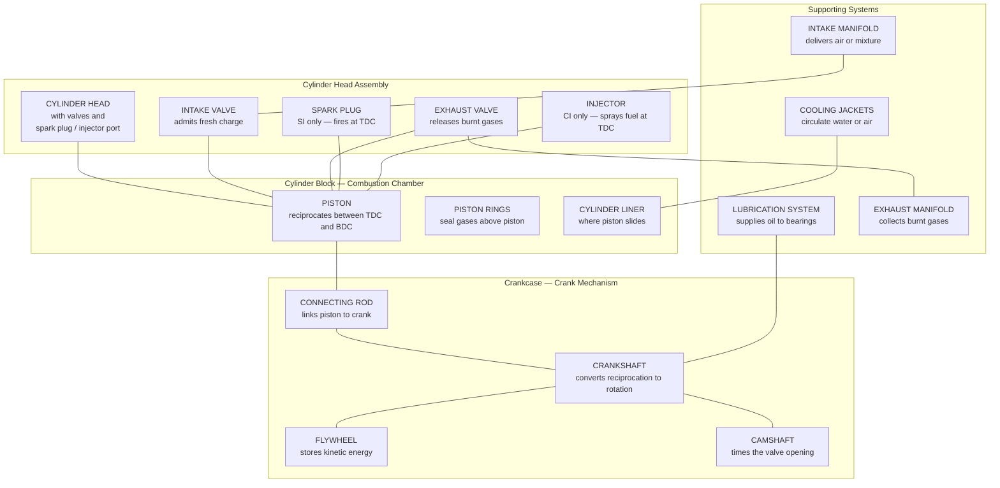
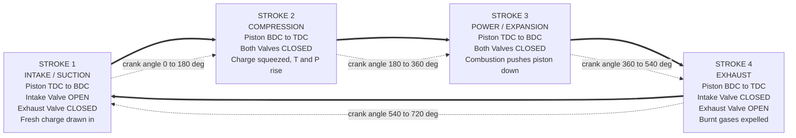
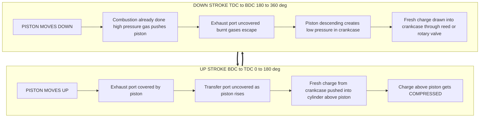
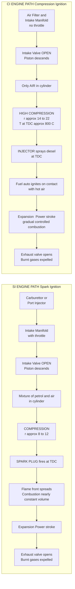

# IC Engines: CI & SI Engines, working of 2-Stroke & 4-Stroke engines.

<!-- SECTION_1_START -->

# IC Engines: CI & SI Engines, 2-Stroke & 4-Stroke Working

## 1.1 Core Technical Definition

An **Internal Combustion (IC) Engine** is a prime mover that converts the chemical energy of a liquid or gaseous fuel into useful mechanical work (rotational energy on a crankshaft) by burning the fuel *inside* the engine cylinder itself. The combustion products act directly on the moving components (the piston) to produce force, in contrast to an *external* combustion engine (like a steam engine) where combustion happens away from the working cylinder.

**Formal KTU Syllabus Definition:**
> An *Internal Combustion Engine* is a heat engine in which the combustion of fuel takes place with an oxidizer (air) inside a confined space called a *combustion chamber*. This exothermic reaction produces high-temperature, high-pressure gases that expand and drive a piston, which is kinematically linked to a crankshaft.

**Two Principal Families Covered in KTU Module 1:**

- **SI Engine (Spark Ignition / Otto Cycle Engine):** The fuel-air mixture is ignited by an *externally timed electric spark*, typically from a spark plug. Operates on petrol, gasoline, ethanol, LPG, or CNG. Often called a *petrol engine*.
- **CI Engine (Compression Ignition / Diesel Cycle Engine):** Combustion is initiated by the *high temperature of the compressed air alone*; fuel is injected later, and self-ignites on contact. Operates on diesel. Often called a *diesel engine*.

> [!IMPORTANT]
> **KTU 2024 Highlight (CO1 – Remember):** The defining distinction between SI and CI engines is **NOT** the fuel type — it is the *mechanism of ignition*. Spark vs. Compression.

## 1.2 Conceptual Analogy & Intuitive Overview

**Analogy 1 — The Pressure Cooker Engine:**
Imagine a sealed aluminum pressure cooker. When you heat it on a stove, the water inside boils, pressure builds up, and if the lid were free to move, it would be pushed up. An IC engine is essentially a *mechanical pressure cooker*: a small amount of fuel is burned inside a closed cylinder, the resulting high-pressure gas pushes a piston (the "movable lid"), and this push is converted to rotation through a connecting rod and crankshaft.

**Analogy 2 — The Balloon Pinwheel (Cycle of an Engine):**
Blow up a balloon, release the open end, and let the escaping air spin a small pinwheel. That *one puff* is analogous to **one power stroke**. To keep the pinwheel turning, you must repeatedly inflate and release the balloon. In an IC engine, this continuous "puff" is generated by repeatedly:
1. Drawing in fresh air (or air-fuel mixture),
2. Compressing it,
3. Combusting it (the power-generating "explosion"),
4. Pushing the burnt gases out.

This four-step sequence is exactly what happens in a **4-stroke engine**. A **2-stroke engine** does all four jobs in just *two piston movements* (one up, one down).

**Analogy 3 — SI vs. CI in a Kitchen:**
- **SI Engine** = a *gas stove with auto-ignition* — you turn on the gas, mix it with air, and a *spark* from the lighter kicks the flame into existence.
- **CI Engine** = a *diesel furnace* — you compress air so much that it becomes white-hot, and when you spray diesel into that hot air, it *catches fire on its own* without any spark.

## 1.3 Classification Snapshot (KTU Module 1 Focus)

The KTU syllabus specifically requires classification along the *cycle of operation* axis:

> [!NOTE]
> **Stroke:** One *complete* one-way travel of the piston between its two extreme positions.
> - **Top Dead Centre (TDC):** The piston position closest to the cylinder head (minimum volume).
> - **Bottom Dead Centre (BDC):** The piston position farthest from the cylinder head (maximum volume).

| Classification | Strokes per Cycle | Power Strokes per Cycle | Example Use |
|---|---|---|---|
| **4-Stroke Engine** | 4 (2 up, 2 down) | **1** | Cars, bikes (Honda City, Maruti), generators |
| **2-Stroke Engine** | 2 (1 up, 1 down) | **1** (every revolution) | Old mopeds, lawn mowers, outboard motors, chainsaws |

## 1.4 Essential Engine Terminology (with Units)

| Term | Symbol / Unit | Meaning |
|---|---|---|
| **Bore** | $D$ (mm) | Internal diameter of the cylinder |
| **Stroke length** | $L$ (mm) | Distance between TDC and BDC |
| **Swept volume** | $V_s$ (m³) | $\frac{\pi}{4} D^2 L$ — the volume swept by the piston |
| **Clearance volume** | $V_c$ (m³) | Volume above the piston at TDC |
| **Total cylinder volume** | $V_1$ (m³) | $V_c + V_s$ |
| **Compression ratio** | $r$ (dimensionless) | $\frac{V_1}{V_c} = \frac{V_c + V_s}{V_c}$ |
| **Engine speed** | $N$ (rpm) | Revolutions per minute of the crankshaft |
| **Indicated Power** | $IP$ (kW) | Power developed inside the cylinder from gas pressure |
| **Brake Power** | $BP$ (kW) | Power actually available at the crankshaft flywheel |

> [!TIP]
> **Key KTU Mnemonic:** "*SI = Spark, Small compression (r ≈ 8–12); CI = Compress hard, diesel self-ignites (r ≈ 14–22).*"

## 1.5 Visualization Block — Piston Motion Geometry

> [!VISUALIZATION CONTROL]
> **Concept:** Piston position vs. crank angle — showing TDC, BDC, and the sinusoidal nature of piston velocity.
> **GeoGebra / Desmos Input Equations:**
> * Crank radius $r_c = 30$
> * Connecting rod length $L_r = 120$
> * Piston height above crank center: $y(\theta) = r_c \cos(\theta) + \sqrt{L_r^2 - (r_c \sin(\theta))^2}$
> * Stroke positions: TDC at $\theta = 0°$, BDC at $\theta = 180°$
> **Visual Description:** The graph will be a smooth wavy curve, peaking at TDC and dipping at BDC. The piston is *not* moving at constant speed — it accelerates near mid-stroke and decelerates near the dead centres, which is why engines need a *flywheel* to smooth out the power delivery.

<!-- SECTION_1_END -->

<!-- SECTION_2_START -->

# Deep Theoretical Analysis & KTU High-Yield Formula Sheet

## 2.1 Why an Engine Needs Four (or Two) Distinct Processes

A continuous supply of torque to the wheels demands that high-pressure gas repeatedly push the piston. But simply burning fuel in an open cylinder is wasteful — the gas would expand into the atmosphere without doing useful work. The genius of the IC engine lies in its **cyclic nature**: it ingests fresh charge, compresses it, combusts it, and expels the residue in a tightly timed sequence. The two most common realisations of this cycle are:

- **Otto Cycle** (used by SI engines) — idealised model
- **Diesel Cycle** (used by CI engines) — idealised model

The *actual* 4-stroke and 2-stroke engines are the *mechanical hardware* that physically executes these idealised thermodynamic cycles.

## 2.2 SI Engine (Spark Ignition / Otto Cycle) — Operating Principle

**The Sequence Inside the Cylinder (per cycle):**
1. A *homogeneous* mixture of petrol vapour and air is drawn in.
2. The mixture is compressed to a moderate ratio ($r \approx 8$ to $12$). Compression must NOT be so high that the mixture auto-ignites prematurely (this would cause **knocking**, a destructive phenomenon).
3. At TDC, the spark plug fires. The flame front propagates through the mixture in milliseconds, releasing chemical energy.
4. The hot gases expand, pushing the piston down.
5. The exhaust valve opens, and burnt gases are expelled.

**Key Thermodynamic Formulas (Otto Cycle, KTU Module 1):**

The *air-standard* thermal efficiency of the Otto cycle is:

$$\eta_{\text{Otto}} = 1 - \frac{1}{r^{\gamma - 1}}$$

where
- $r = \dfrac{V_1}{V_2}$ is the compression ratio,
- $\gamma = \dfrac{C_p}{C_v}$ is the ratio of specific heats ($\gamma \approx 1.4$ for air at room temperature).

> [!IMPORTANT]
> **KTU Board Insight (Dec 2023 pattern):** Examiners love to ask "Why is the compression ratio of an SI engine limited?" — Answer: *Higher compression risks auto-ignition of the petrol-air mixture, causing engine knock, which damages the piston and reduces efficiency.* This single statement is worth 3 marks.

## 2.3 CI Engine (Compression Ignition / Diesel Cycle) — Operating Principle

**The Sequence Inside the Cylinder (per cycle):**
1. **Only air** is drawn in (no fuel during intake).
2. The air is compressed to a *very high* ratio ($r \approx 14$ to $22$). The temperature at TDC reaches **800 °C to 900 °C** — well above the auto-ignition temperature of diesel.
3. Diesel fuel is injected directly into the hot compressed air through an *injector*. The fuel self-ignites on contact, **without any spark plug**.
4. Combustion is more *gradual* (controlled by injection rate), giving the characteristic diesel "thump."
5. After expansion, exhaust valve opens and gases are expelled.

**Key Thermodynamic Formula (Diesel Cycle):**

$$\eta_{\text{Diesel}} = 1 - \frac{1}{r^{\gamma - 1}} \cdot \frac{\rho^{\gamma} - 1}{\gamma (\rho - 1)}$$

where $\rho = \dfrac{V_3}{V_2}$ is the **cut-off ratio** (the ratio of volumes at the end and start of constant-pressure heat addition).

> [!NOTE]
> **Why CI engines are inherently more efficient:** The higher compression ratio in a CI engine ($r \approx 18$ vs. $r \approx 10$ for SI) means the gas is *more strongly compressed* before heat is added. The efficiency of *any* heat engine improves with compression ratio — this is a direct consequence of the 2nd Law of Thermodynamics.

## 2.4 KTU High-Yield Formula Cheat Sheet

| # | Formula | Meaning | Typical Value / Unit |
|---|---|---|---|
| 1 | $V_s = \dfrac{\pi}{4} D^2 L$ | Swept (displacement) volume | m³, cm³ (cc) |
| 2 | $V_1 = V_c + V_s$ | Total cylinder volume at BDC | m³ |
| 3 | $r = \dfrac{V_1}{V_c}$ | Compression ratio | 8–12 (SI), 14–22 (CI) |
| 4 | $\eta_{\text{Otto}} = 1 - \dfrac{1}{r^{\gamma-1}}$ | Air-standard Otto efficiency | dimensionless (0 to 1) |
| 5 | $\eta_{\text{Diesel}} = 1 - \dfrac{1}{r^{\gamma-1}} \cdot \dfrac{\rho^\gamma - 1}{\gamma(\rho-1)}$ | Air-standard Diesel efficiency | dimensionless |
| 6 | $N_{\text{cycle}} = \dfrac{N}{2}$ (4-stroke) | Power strokes per second | Hz |
| 7 | $N_{\text{cycle}} = N$ (2-stroke) | Power strokes per second | Hz |
| 8 | $W_{\text{net}} = P_1 V_1 \cdot \dfrac{r^{\gamma-1}(\rho-1)(\gamma-1)}{(r-1)(\gamma-1) + \gamma r^{\gamma-1}(\rho-1)}$ | Net work per cycle (Diesel) | Joules |
| 9 | $IP = \dfrac{P_m \cdot L \cdot A \cdot N \cdot n_k}{60}$ | Indicated Power | kW |
| 10 | $BP = \dfrac{2\pi N T}{60{,}000}$ | Brake Power (T in N·m) | kW |
| 11 | $\eta_{\text{mech}} = \dfrac{BP}{IP}$ | Mechanical efficiency | typically 0.80–0.90 |
| 12 | $\eta_{\text{thermal}} = \dfrac{BP}{\dot{m}_f \cdot \text{CV}}$ | Brake thermal efficiency | 0.25–0.40 |

where $P_m$ = mean effective pressure, $A = \frac{\pi}{4}D^2$, $T$ = torque on crankshaft, $\dot{m}_f$ = fuel mass flow rate, $\text{CV}$ = calorific value of fuel.

> [!WARNING]
> **Pipe (`|`) Escape Rule:** In the table above, the absolute-value-style bar in $\dfrac{1}{r^{\gamma-1}}$ is part of the *fraction* and uses the slash `/`, **not** the pipe `|`. KTU Markdown parsers will break a table row if it contains a raw pipe inside math.

## 2.5 4-Stroke Engine — Detailed Operational Steps

A 4-stroke engine completes its working cycle in **two full revolutions (720°) of the crankshaft**, with **one power stroke every 720°**.

| Stroke # | Piston Travel | Valve State | Process Name | What Happens |
|---|---|---|---|---|
| **1 (Intake)** | TDC → BDC | Intake = OPEN, Exhaust = CLOSED | **Suction** | Fresh charge (air-fuel mixture in SI / pure air in CI) is drawn in as the piston moves down, creating low pressure |
| **2 (Compression)** | BDC → TDC | Both valves CLOSED | **Compression** | The charge is squeezed into a small clearance volume; temperature and pressure rise sharply |
| **3 (Power)** | TDC → BDC | Both valves CLOSED | **Expansion / Combustion** | Combustion occurs near TDC (spark in SI, auto-ignition in CI); high-pressure gas pushes piston down, doing work |
| **4 (Exhaust)** | BDC → TDC | Intake = CLOSED, Exhaust = OPEN | **Exhaust** | Burnt gases are pushed out as the piston moves up; flywheel inertia drives this stroke |

**The flywheel** is essential — it stores kinetic energy from the single power stroke and returns it to keep the crankshaft rotating through the other three "non-power" strokes.

> [!NOTE]
> **KTU Board Trick Question:** *"In which stroke of a 4-stroke SI engine does the fuel enter the cylinder?"* The official KTU answer is: **During the intake stroke**, the fuel is *carried in with the air* (in a petrol engine using a carburettor or port injection). In port-injection engines, fuel is sprayed into the intake port just before the intake valve opens.

## 2.6 2-Stroke Engine — Detailed Operational Steps

A 2-stroke engine completes its working cycle in **one full revolution (360°) of the crankshaft**, with **one power stroke every 360°**. This is achieved by:
- Using the *bottom* of the cylinder (the **crankcase**) as a secondary pumping chamber.
- Replacing the mechanical valve train with **ports** in the cylinder walls that the piston itself uncovers and covers as it moves.

| Stroke # | Piston Travel | Key Action | Process Name |
|---|---|---|---|
| **1 (Up stroke)** | BDC → TDC | Piston covers exhaust port, then uncovers transfer port; fresh charge from crankcase is pushed into the cylinder above the piston | **Compression + Transfer** (and exhaust in the early phase) |
| **2 (Down stroke)** | TDC → BDC | Combustion drives piston down; exhaust port is uncovered, burnt gases escape; downward motion creates vacuum in crankcase, drawing in fresh charge | **Power + Intake** |

> [!IMPORTANT]
> **KTU 2024 Conceptual Difference:** A 2-stroke engine *delivers twice as many power strokes per revolution* compared to a 4-stroke. Therefore, for the *same* engine displacement and speed, a 2-stroke theoretically produces *twice* the power. However, in practice, some power is lost in scavenging (mixing of fresh charge with exhaust), so the real gain is closer to **1.5× to 1.8×**.

## 2.7 Real-World Engineering Utility

| Domain | Why IC Engines Dominate |
|---|---|
| **Road transport** | Highest energy density of liquid fuels gives long driving range; mature manufacturing ecosystem |
| **Marine propulsion** | Large 2-stroke diesel engines directly turn ship propellers (MAN B&W, Wärtsilä) |
| **Power generation** | Diesel generator sets (DG sets) are the universal backup for hospitals, data centres, telecom towers |
| **Agricultural / rural** | 2-stroke engines power tillers, pumps, and chainsaws because they are simple, light, and cheap |
| **Aviation (piston era)** | SI engines powered almost all aircraft from 1903 to ~1960 |
| **Motorcycles** | Most bikes under 250 cc use 4-stroke SI engines; older small bikes used 2-stroke |

## 2.8 Comparative Engineering Trade-Offs

| Parameter | SI (Petrol) | CI (Diesel) |
|---|---|---|
| Fuel | Petrol, CNG, LPG, ethanol | Diesel, biodiesel |
| Compression ratio | 8–12 | 14–22 |
| Ignition device | Spark plug | Injector (no spark plug) |
| Combustion control | Throttle valve (quantity) | Fuel quantity (no throttle) |
| Peak efficiency | 25–35% | 35–45% |
| Weight | Lighter | Heavier (stronger block) |
| Torque character | Drops at low RPM | High torque at low RPM |
| Emissions | High CO, unburnt HC | Higher NOx, particulates |
| Cost (passenger car) | Cheaper | 20–30% costlier |
| Sound | Quieter, higher revving | "Diesel thump" |

<!-- SECTION_2_END -->

<!-- SECTION_3_START -->

# Step-by-Step Derivations, Calculations, and Symbolic Walk-Throughs

## 3.1 Derivation: Air-Standard Efficiency of the Otto Cycle (SI Engine)

The Otto cycle consists of four ideal processes:
- 1 → 2: Isentropic (adiabatic reversible) compression
- 2 → 3: Constant-volume heat addition (combustion approximated as instantaneous)
- 3 → 4: Isentropic expansion (power stroke)
- 4 → 1: Constant-volume heat rejection (cooling)

**Starting from the First Law of Thermodynamics for a closed system:**

$$Q_{\text{net}} = W_{\text{net}} = Q_{\text{in}} - Q_{\text{out}}$$

For a constant-volume process, the heat transferred is:

$$Q = m \cdot C_v \cdot \Delta T$$

So:

$$Q_{\text{in}} = m C_v (T_3 - T_2), \qquad Q_{\text{out}} = m C_v (T_4 - T_1)$$

The thermal efficiency is:

$$\eta = \frac{W_{\text{net}}}{Q_{\text{in}}} = 1 - \frac{Q_{\text{out}}}{Q_{\text{in}}} = 1 - \frac{m C_v (T_4 - T_1)}{m C_v (T_3 - T_2)} = 1 - \frac{T_4 - T_1}{T_3 - T_2}$$

For the two isentropic (reversible adiabatic) processes, we use:

$$T V^{\gamma - 1} = \text{constant}$$

For process 1 → 2 (isentropic compression):

$$\frac{T_2}{T_1} = \left(\frac{V_1}{V_2}\right)^{\gamma - 1} = r^{\gamma - 1}$$

For process 3 → 4 (isentropic expansion):

$$\frac{T_3}{T_4} = \left(\frac{V_4}{V_3}\right)^{\gamma - 1} = r^{\gamma - 1}$$

From these two relations:

$$T_2 = T_1 \, r^{\gamma - 1}, \qquad T_3 = T_4 \, r^{\gamma - 1}$$

Substituting into the efficiency expression:

$$\eta = 1 - \frac{T_4 - T_1}{T_4 \, r^{\gamma - 1} - T_1 \, r^{\gamma - 1}} = 1 - \frac{T_4 - T_1}{r^{\gamma - 1}(T_4 - T_1)} = 1 - \frac{1}{r^{\gamma - 1}}$$

$$\boxed{\eta_{\text{Otto}} = 1 - \frac{1}{r^{\gamma - 1}}}$$

**Numerical Worked Example (KTU-style 3-mark question):**

> An SI engine operates on the ideal Otto cycle with a compression ratio of $r = 9$ and $\gamma = 1.4$. Find the air-standard thermal efficiency.

**Solution (each step earns partial credit):**

$$\eta_{\text{Otto}} = 1 - \frac{1}{r^{\gamma - 1}}$$

Compute the exponent: $\gamma - 1 = 1.4 - 1 = 0.4$

Compute $r^{0.4} = 9^{0.4}$

$$9^{0.4} = e^{0.4 \cdot \ln 9} = e^{0.4 \cdot 2.1972} = e^{0.8789} \approx 2.4082$$

Therefore:

$$\eta_{\text{Otto}} = 1 - \frac{1}{2.4082} = 1 - 0.4153 = 0.5847$$

$$\boxed{\eta_{\text{Otto}} \approx 58.47\%}$$

> [!NOTE]
> **Real engines never reach 58% thermal efficiency** — this is the *idealised* air-standard limit. A real petrol engine achieves 25–35%. The gap is due to finite combustion time, heat loss to walls, friction, and incomplete combustion.

## 3.2 Numerical Problem: Swept Volume, Clearance Volume, and Compression Ratio

**Problem:** A single-cylinder 4-stroke SI engine has a bore of $D = 80$ mm and stroke length $L = 100$ mm. The clearance volume is $V_c = 60$ cm³. Find:
(a) Swept volume,
(b) Total cylinder volume,
(c) Compression ratio.

**Step-by-step Solution:**

**(a) Swept volume:**

$$V_s = \frac{\pi}{4} D^2 L = \frac{\pi}{4} (0.080)^2 (0.100)$$

$$V_s = \frac{\pi}{4} \times 0.0064 \times 0.100 = \frac{\pi}{4} \times 0.00064 = 5.0265 \times 10^{-4} \, \text{m}^3$$

Convert to cm³: $5.0265 \times 10^{-4} \text{ m}^3 = 502.65 \text{ cm}^3$ (since $1 \text{ m}^3 = 10^6 \text{ cm}^3$)

$$\boxed{V_s \approx 502.65 \, \text{cm}^3 \;(\text{or } 502.65 \, \text{cc})}$$

**(b) Total cylinder volume:**

$$V_1 = V_c + V_s = 60 + 502.65 = 562.65 \, \text{cm}^3$$

$$\boxed{V_1 = 562.65 \, \text{cm}^3}$$

**(c) Compression ratio:**

$$r = \frac{V_1}{V_c} = \frac{562.65}{60} = 9.378$$

$$\boxed{r \approx 9.38}$$

**Interpretation:** A compression ratio of 9.38 is realistic for a petrol engine (typical range 8–12). The mixture at TDC will be squeezed to nearly 1/9.4th of its original volume, raising its temperature and pressure dramatically, preparing it for spark ignition.

> [!IMPORTANT]
> **Valuation Key (KTU style):**
> - Stating the correct formula for $V_s$: **1 Mark**
> - Correct unit conversion (m³ → cm³): **1 Mark**
> - Final answer with correct units: **1 Mark**

## 3.3 Numerical Problem: Power Calculation for a 4-Stroke Engine

**Problem:** A 4-cylinder, 4-stroke petrol engine runs at $N = 3000$ rpm. The mean effective pressure is $P_m = 8$ bar, bore is $D = 75$ mm, and stroke is $L = 90$ mm. Calculate the indicated power.

**Step-by-step Solution:**

The indicated power formula for a multi-cylinder 4-stroke engine:

$$IP = \frac{P_m \cdot L \cdot A \cdot N \cdot n_k}{2 \times 60}$$

where the factor of 2 in the denominator accounts for the 4-stroke nature (one power stroke every 2 revolutions), $n_k$ is the number of cylinders.

**Step 1: Compute the cross-sectional area $A$:**

$$A = \frac{\pi}{4} D^2 = \frac{\pi}{4} (0.075)^2 = 4.4179 \times 10^{-3} \, \text{m}^2$$

**Step 2: Convert $P_m$ to SI units (Pa):**

$$P_m = 8 \, \text{bar} = 8 \times 10^5 \, \text{Pa}$$

**Step 3: Plug into the formula:**

$$IP = \frac{8 \times 10^5 \times 0.090 \times 4.4179 \times 10^{-3} \times 3000 \times 4}{2 \times 60}$$

Compute numerator:

$$8 \times 10^5 \times 0.090 = 72{,}000$$

$$72{,}000 \times 4.4179 \times 10^{-3} = 318.09$$

$$318.09 \times 3000 = 954{,}272.7$$

$$954{,}272.7 \times 4 = 3{,}817{,}090.8$$

Denominator: $2 \times 60 = 120$

$$IP = \frac{3{,}817{,}090.8}{120} = 31{,}809.1 \, \text{W} = 31.81 \, \text{kW}$$

$$\boxed{IP \approx 31.81 \, \text{kW} \;(\approx 42.65 \, \text{HP})}$$

> [!NOTE]
> **Why the factor of 2?** Because in a 4-stroke engine, there is one power stroke per cylinder per *two* revolutions. So effective power strokes per second = $N/(2 \times 60)$. In a 2-stroke engine, this factor would be removed (power stroke every revolution), giving twice the power for the same $P_m$, $L$, $A$, $N$.

## 3.4 Comparative Numerical Demonstration: 2-Stroke vs. 4-Stroke Power

**Problem:** A single-cylinder engine of bore 80 mm, stroke 100 mm, mean effective pressure 7 bar, runs at 3000 rpm. Compare the indicated power if it were (a) a 2-stroke, and (b) a 4-stroke.

**(a) 2-stroke version:**

$$IP_{2} = \frac{P_m \cdot L \cdot A \cdot N}{60} = \frac{7 \times 10^5 \times 0.1 \times 5.0265 \times 10^{-3} \times 3000}{60}$$

Numerator: $7 \times 10^5 \times 0.1 \times 5.0265 \times 10^{-3} = 351.86$, then $\times 3000 = 1{,}055{,}565.6$

$$IP_{2} = \frac{1{,}055{,}565.6}{60} = 17{,}592.76 \, \text{W} \approx 17.59 \, \text{kW}$$

**(b) 4-stroke version:**

$$IP_{4} = \frac{IP_{2}}{2} = \frac{17.59}{2} = 8.80 \, \text{kW}$$

$$\boxed{\text{Ratio} = \frac{IP_{2}}{IP_{4}} = 2.0 \; \text{(idealised 2-stroke advantage)}}$$

In real engines, the ratio is lower (1.5–1.8) because of:
- Scavenging losses in 2-stroke (fresh charge escapes with exhaust).
- Lack of dedicated intake stroke (less fresh charge inducted).
- Higher friction (more frequent combustion events).

## 3.5 Symbolic Pseudocode — Engine Cycle Simulation (Python Style)

The following Python pseudocode models one complete 4-stroke cycle, useful for a *virtual lab* or viva demonstration:

```python
from math import pi
from dataclasses import dataclass
import logging

logging.basicConfig(level=logging.INFO, format="%(asctime)s | %(levelname)s | %(message)s")

@dataclass
class Engine:
    bore_m: float                # cylinder bore in metres
    stroke_m: float              # piston stroke length in metres
    clearance_volume_m3: float   # clearance volume in m^3
    engine_type: str             # "SI" or "CI"
    speed_rpm: float             # crankshaft speed
    mean_effective_pressure_Pa: float
    num_cylinders: int
    strokes: int                 # 2 or 4

    def swept_volume_m3(self) -> float:
        """Volume swept by the piston from TDC to BDC."""
        if self.bore_m <= 0 or self.stroke_m <= 0:
            raise ValueError("Bore and stroke must be positive.")
        return (pi / 4.0) * (self.bore_m ** 2) * self.stroke_m

    def compression_ratio(self) -> float:
        """Compression ratio r = V1 / Vc."""
        V1 = self.clearance_volume_m3 + self.swept_volume_m3()
        if self.clearance_volume_m3 <= 0:
            raise ValueError("Clearance volume must be positive.")
        return V1 / self.clearance_volume_m3

    def indicated_power_kW(self) -> float:
        """IP = (Pm * L * A * N * n_k) / (k * 60),  k=2 for 4-stroke, k=1 for 2-stroke."""
        if self.strokes not in (2, 4):
            raise ValueError("Strokes must be either 2 or 4.")
        A = (pi / 4.0) * (self.bore_m ** 2)
        k = 2 if self.strokes == 4 else 1
        power_W = (self.mean_effective_pressure_Pa
                   * self.stroke_m
                   * A
                   * self.speed_rpm
                   * self.num_cylinders) / (k * 60.0)
        return power_W / 1000.0

    def cycle_breakdown(self) -> dict:
        """Return a labelled dictionary of all four strokes with their valve state."""
        if self.strokes == 4:
            return {
                "Stroke 1 — Intake":     "Piston TDC to BDC, Intake Valve OPEN,  Exhaust CLOSED",
                "Stroke 2 — Compression":"Piston BDC to TDC, Both Valves CLOSED",
                "Stroke 3 — Power":      "Piston TDC to BDC, Both Valves CLOSED, Combustion + Expansion",
                "Stroke 4 — Exhaust":    "Piston BDC to TDC, Intake CLOSED,  Exhaust OPEN",
            }
        return {
            "Stroke 1 — Up":   "BDC to TDC: Compression above piston, Transfer of fresh charge from crankcase",
            "Stroke 2 — Down": "TDC to BDC: Power + Exhaust, Intake into crankcase via vacuum",
        }

# --- Example usage (a typical KTU lab scenario) ---
engine = Engine(
    bore_m=0.080,
    stroke_m=0.100,
    clearance_volume_m3=60e-6,        # 60 cm^3
    engine_type="SI",
    speed_rpm=3000,
    mean_effective_pressure_Pa=8e5,   # 8 bar
    num_cylinders=1,
    strokes=4,
)

logging.info(f"Swept volume     = {engine.swept_volume_m3()*1e6:.2f} cm^3")
logging.info(f"Compression r    = {engine.compression_ratio():.2f}")
logging.info(f"Indicated Power  = {engine.indicated_power_kW():.2f} kW")
for label, detail in engine.cycle_breakdown().items():
    logging.info(f"{label}: {detail}")
```

> [!TIP]
> **Viva Tip (KTU 2024):** Be ready to explain *why the indicated power formula has a factor of 2 for 4-stroke engines* — this is one of the most-asked follow-ups after numerical problems.

## 3.6 Step-by-Step — Mechanical Path from Combustion to Wheel Torque

This is the *physical chain* that delivers engine power to the vehicle wheels:

1. **Combustion** raises cylinder gas pressure to ~50 bar (in SI) or ~80 bar (in CI).
2. **Gas pressure** acts on the piston crown, producing a force $F = P \times A$.
3. The **connecting rod** transmits this force to the **crank pin**, generating a torque $T = F \times r_c \sin(\theta)$.
4. The **crankshaft** converts reciprocating motion to rotation and stores energy in the **flywheel**.
5. Through the **clutch and gearbox**, torque reaches the **propeller shaft** (or final drive).
6. **Differential** splits torque to the two **drive wheels**.
7. **Tyre-road friction** produces the tractive force that accelerates the vehicle.

The engine itself only *generates* torque — the transmission chain decides *how and when* that torque reaches the road.

<!-- SECTION_3_END -->

<!-- SECTION_4_START -->

# Structural Diagrams & Schematics

## 4.1 Cross-Sectional Block Diagram of a Single-Cylinder IC Engine



## 4.2 4-Stroke Engine — Sequential Process Topology



> [!NOTE]
> **Reading the Diagram:** The crank angles marked on the dashed arrows show that one complete 4-stroke cycle covers **720°** of crankshaft rotation. The **single power stroke (S3)** is the only stroke where work is done on the piston by the gas; the other three are *consumers* of the flywheel's stored kinetic energy.

## 4.3 2-Stroke Engine — Sequential Process Topology



## 4.4 SI vs CI Engine — Side-by-Side Functional Architecture



## 4.5 Valve Timing Diagram — Simplified Sequence Matrix

This matrix shows the *state* of each valve during the four strokes of a 4-stroke SI engine. `1` = valve open, `0` = valve closed.

| Stroke (Crank Deg) | Intake Valve | Exhaust Valve | Piston Motion | Thermodynamic Process |
|---|---|---|---|---|
| 0° → 180° (Intake) | **1** | 0 | TDC → BDC | Suction (constant pressure) |
| 180° → 360° (Compression) | 0 | 0 | BDC → TDC | Isentropic compression |
| 360° → 540° (Power) | 0 | 0 | TDC → BDC | Combustion (≈ const V) + Isentropic expansion |
| 540° → 720° (Exhaust) | 0 | **1** | BDC → TDC | Exhaust (constant pressure) |

> [!TIP]
> **Real engines open valves slightly before TDC/BDC and close them slightly after**, to improve volumetric efficiency. For example, the intake valve *typically opens 5°–20° before TDC* and *closes 30°–60° after BDC*. This is the essence of *valve timing diagrams* in higher-semester subjects, but the simplified matrix above is sufficient for KTU Module 1.

## 4.6 IC Engine Component Inventory Block

```mermaid
flowchart TB
    IC["INTERNAL COMBUSTION ENGINE"]:::root

    IC --> ST["STATIONARY PARTS"]:::branch
    IC --> MT["MOVING PARTS"]:::branch
    IC --> AN["ANCILLARY SYSTEMS"]:::branch

    ST --> ST1["Cylinder block"]
    ST --> ST2["Cylinder head"]
    ST --> ST3["Crankcase"]
    ST --> ST4["Intake and exhaust manifolds"]
    ST --> ST5["Cooling jackets"]

    MT --> MT1["Piston and piston rings"]
    MT --> MT2["Connecting rod"]
    MT --> MT3["Crankshaft"]
    MT --> MT4["Camshaft"]
    MT --> MT5["Valves and valve springs"]
    MT --> MT6["Flywheel"]
    MT --> MT7["Timing chain or belt"]

    AN --> AN1["Ignition system (SI)"]
    AN --> AN2["Fuel injection system (CI)"]
    AN --> AN3["Lubrication system"]
    AN --> AN4["Cooling system"]
    AN --> AN5["Starting system"]
    AN --> AN6["Governing system"]

    classDef root fill:#FFD580,stroke:#333,stroke-width:3px,color:#000
    classDef branch fill:#B5EAD7,stroke:#333,stroke-width:2px,color:#000
```



> [!WARNING]
> **Mermaid Safety Note:** The node IDs above (`IC`, `ST`, `MT`, `AN`, `ST1`, etc.) are purely alphanumeric and use no reserved words. All node labels with line breaks or punctuation are wrapped in double quotes. This avoids the *Mermaid parser crash* that occurs when labels contain raw special characters or reserved keywords like `end`, `graph`, or `subgraph`.

<!-- SECTION_4_END -->

<!-- SECTION_5_START -->

# KTU 2024 Scheme Examination Question Bank & Topic Recap

## 5.1 Part A — Short-Answer Questions (3 Marks Each)

### Q1. [KTU University Exam – July 2024, CO1, Remember]

**Differentiate between SI and CI engines. List any four points.**

**Model Answer (Board-Standard, 3 Marks):**

| Sl. No. | SI Engine (Spark Ignition) | CI Engine (Compression Ignition) |
|---|---|---|
| 1 | Fuel is mixed with air *before* entering the cylinder (carburettor / port injection) | Fuel is injected *directly* into the cylinder after compression |
| 2 | Combustion is initiated by an **electric spark** from a spark plug | Combustion is initiated by **auto-ignition** due to high temperature of compressed air (no spark plug) |
| 3 | Operates on a **lower compression ratio** of 8–12 | Operates on a **higher compression ratio** of 14–22 |
| 4 | Lighter engine; uses petrol, CNG, LPG | Heavier, more robust engine block; uses diesel |
| 5 | Higher speed, lower thermal efficiency (25–35%) | Lower speed, higher thermal efficiency (35–45%) |

> [!IMPORTANT]
> **Valuation Hint:** Examiners award ½ mark for *each distinct point* and ½ mark for *correct technical terminology*. A vague answer like "SI uses petrol and CI uses diesel" loses marks — the question is about *engine mechanism*, not fuel type.

---

### Q2. [KTU University Exam – Dec 2023, CO1, Understand]

**Why does a 4-stroke engine require a flywheel, while a 2-stroke engine can be built without a heavy flywheel?**

**Model Answer (Board-Standard, 3 Marks):**

A 4-stroke engine produces only **one power stroke in two full revolutions** (720°) of the crankshaft. During the other three strokes (intake, compression, exhaust), no work is done on the piston by combustion — in fact, these strokes *consume* energy to push gases and overcome friction. To keep the crankshaft rotating smoothly through these non-power strokes, a **heavy flywheel** is essential, which stores kinetic energy from the power stroke and returns it during the idle strokes.

In contrast, a 2-stroke engine produces a power stroke *every revolution* (360°). The much higher frequency of power impulses (twice as many per unit time) means the crankshaft is driven more continuously, so the engine can operate smoothly with a much smaller flywheel, or in some small applications (chainsaw, scooter), with almost no flywheel at all.

> [!NOTE]
> **For full 3 marks:** Mention (1) the *number of power strokes per cycle*, (2) the *function of the flywheel* (energy storage), and (3) the *consequence for engine smoothness* (continuous torque vs. intermittent torque).

---

## 5.2 Part B — Long-Answer Questions (14 Marks Each, with Internal Choice)

### Question A (14 Marks)

**[KTU University Exam – July 2024, CO1 + CO2, Apply + Analyse]**

**(a)** With the help of neat P-V and T-S diagrams, describe the **working of a 4-stroke SI engine**. State the events that occur in each stroke. **(7 Marks)**

**(b)** An SI engine works on the ideal Otto cycle with a compression ratio of $r = 10$ and $\gamma = 1.4$. Calculate the air-standard thermal efficiency. If the compression ratio is increased to $r = 14$ (still in the SI range), what is the new efficiency? Comment on the result. **(7 Marks)**

#### Model Solution

**(a) Working of a 4-Stroke SI Engine (7 Marks):**

A 4-stroke SI engine completes its working cycle in **two revolutions (720°)** of the crankshaft. The four strokes are:

**Stroke 1 — Suction / Intake (0° to 180°):**
- The **intake valve opens** and the exhaust valve remains closed.
- The piston moves from TDC to BDC.
- The downward motion of the piston creates a low-pressure region inside the cylinder.
- A **homogeneous mixture of petrol vapour and air** (prepared in the carburettor or by port injection) is drawn into the cylinder through the intake manifold.
- Pressure inside the cylinder is slightly below atmospheric (≈ 0.9 bar); volume increases from $V_c$ to $V_1$.
- *On the P-V diagram:* This stroke is represented by a horizontal line at $P \approx 0.9$ bar, moving from left (TDC) to right (BDC).

**Stroke 2 — Compression (180° to 360°):**
- Both the intake and exhaust valves are **closed**.
- The piston moves from BDC to TDC.
- The trapped air-fuel mixture is compressed to a small clearance volume at the top.
- For $r = 10$, the mixture is squeezed to 1/10th of its original volume.
- Pressure rises to about **10–15 bar**, temperature to about **300–400 °C**.
- *On the P-V diagram:* This is an isentropic (reversible adiabatic) compression curve from right (BDC) to left (TDC) — represented by the curve $1 \to 2$.

**Stroke 3 — Power / Expansion (360° to 540°):**
- Near TDC (a few degrees before, called *ignition advance*), the **spark plug fires** an electric spark.
- Combustion is extremely rapid — approximated as **constant-volume heat addition** in the ideal Otto cycle.
- Pressure spikes sharply to about **40–50 bar**, temperature to about **2000 °C**.
- The high-pressure gas pushes the piston from TDC to BDC, doing useful work on it.
- *On the P-V diagram:* Vertical line $2 \to 3$ (combustion) followed by isentropic expansion curve $3 \to 4$ (power).

**Stroke 4 — Exhaust (540° to 720°):**
- Near BDC, the **exhaust valve opens**; the pressure in the cylinder drops suddenly to atmospheric.
- The piston moves from BDC to TDC, pushing out the burnt gases through the exhaust valve and manifold.
- *On the P-V diagram:* Vertical line $4 \to 1$ (constant-volume heat rejection) followed by horizontal line at $P \approx 1$ bar, from right to left (exhaust).

**Valuation Key — 7 Marks Breakdown:**
- Mentioning 720° (2 revolutions): **1 Mark**
- Each stroke described correctly with valve state and piston motion: **1 Mark × 4 = 4 Marks**
- P-V or T-S diagram description: **2 Marks**

**P-V Diagram (Otto cycle, schematic):**

```
   P (Pressure)
   |  3
   |  |\
   |  | \  (isentropic expansion 3 to 4)
   |  |  \
   |  |   \ 4
   |  2----\---- 1
   |  |     \   |
   |  |      \  |  (intake 1 to 2 at low P)
   |  |       \ |
   |  |        \|
   |  5---------1
   +-----------------> V (Volume)
         Vc      V1
```
*(Theoretical schematic: process 5-1 is intake, 1-2 is compression, 2-3 is heat addition, 3-4 is expansion, 4-5 is exhaust.)*

---

**(b) Otto Cycle Efficiency Calculation (7 Marks):**

**Given:** $r_1 = 10$, $\gamma = 1.4$

**Formula:**

$$\eta_{\text{Otto}} = 1 - \frac{1}{r^{\gamma - 1}}$$

**Step 1: Calculate $\gamma - 1$:**

$$\gamma - 1 = 1.4 - 1 = 0.4$$

**Step 2: Compute $r_1^{0.4}$ for $r_1 = 10$:**

$$10^{0.4} = e^{0.4 \times \ln 10} = e^{0.4 \times 2.3026} = e^{0.9210} \approx 2.5119$$

**Step 3: Compute $\eta_1$ for $r_1 = 10$:**

$$\eta_1 = 1 - \frac{1}{2.5119} = 1 - 0.3981 = 0.6019$$

$$\boxed{\eta_1 \approx 60.19\%}$$

**Step 4: Compute $r_2^{0.4}$ for $r_2 = 14$:**

$$14^{0.4} = e^{0.4 \times \ln 14} = e^{0.4 \times 2.6391} = e^{1.0556} \approx 2.8732$$

**Step 5: Compute $\eta_2$ for $r_2 = 14$:**

$$\eta_2 = 1 - \frac{1}{2.8732} = 1 - 0.3480 = 0.6520$$

$$\boxed{\eta_2 \approx 65.20\%}$$

**Step 6: Comment on the result:**

Increasing the compression ratio from 10 to 14 increases the air-standard thermal efficiency from **60.19%** to **65.20%**, a gain of **5.01 percentage points**. This confirms the strong influence of compression ratio on the efficiency of the Otto cycle.

> **However**, in a *real* SI engine, the compression ratio cannot be raised this high because petrol–air mixtures tend to **auto-ignite** (knock) above $r \approx 12$. Hence, real petrol engines are limited to $r \approx 10$–$12$. CI (diesel) engines, which compress only air, can safely operate at $r \approx 14$–$22$, which is one of the main reasons diesel engines are more efficient than petrol engines.

**Valuation Key — 7 Marks Breakdown:**
- Stating the Otto efficiency formula: **1 Mark**
- Correct calculation of $r_1^{0.4}$ and $\eta_1$: **1.5 Marks**
- Correct calculation of $r_2^{0.4}$ and $\eta_2$: **1.5 Marks**
- Final values with correct units: **1 Mark**
- Engineering comment on real-engine limitation (knock): **2 Marks**

> [!WARNING]
> **KTU Examiner's Pitfall Warning — Common Mistakes on This Question:**
> 1. **Forgetting the negative sign:** Many students write $\eta = \frac{1}{r^{\gamma-1}}$ *minus* 1 instead of 1 *minus* that — losing 2 marks.
> 2. **Wrong base of exponent:** Writing $r^{\gamma}$ instead of $r^{\gamma-1}$ is a very common slip.
> 3. **Ignoring the engineering comment:** Even if the numerical answer is perfect, KTU 2024 boards allot 2 marks for the *real-world implication* (knock, CI vs SI comparison). Skipping the comment costs 2 of 7 marks.
> 4. **No diagram:** Part (a) without a P-V diagram loses the dedicated 2 marks. Even a hand-drawn schematic earns partial credit.

---

### Question B (14 Marks) — *Alternative Choice*

**[KTU University Exam – Dec 2023, CO1 + CO2, Understand + Apply]**

**(a)** Describe the **working of a 2-stroke SI engine** with a neat sketch. Compare its merits and demerits with a 4-stroke engine. **(7 Marks)**

**(b)** A 4-cylinder, 4-stroke petrol engine has a bore of $D = 85$ mm, stroke of $L = 95$ mm, and runs at $N = 2800$ rpm. The mean effective pressure is $P_m = 7.5$ bar. Calculate:
(i) the swept volume of one cylinder,
(ii) the total displacement of the engine,
(iii) the indicated power developed. **(7 Marks)**

#### Model Solution (Skeletal)

**(a) Working of a 2-Stroke SI Engine (7 Marks):**
A 2-stroke engine completes the cycle in **one revolution (360°)**. It uses the *crankcase* as a secondary pumping chamber and *ports* in the cylinder wall (replacing poppet valves).

**Up stroke (0° → 180°):** Piston moves from BDC to TDC.
- Compresses the charge above the piston (combustion chamber).
- At the same time, the descending *underside* of the previous stroke has already drawn fresh mixture into the crankcase through a one-way (reed) valve.
- Near TDC, the spark plug fires.

**Down stroke (180° → 360°):** Piston moves from TDC to BDC.
- Combustion drives the piston down (power).
- Near BDC, the piston uncovers the **exhaust port** — burnt gases escape.
- Slightly later, the piston uncovers the **transfer port** — fresh charge from the crankcase rushes into the cylinder, pushing out remaining exhaust gases (this is called *scavenging*).
- The same downward motion of the piston creates a low pressure in the crankcase, drawing in fresh charge through the intake port/reed valve.

**Comparison with 4-Stroke:**

| Merits of 2-Stroke | Demerits of 2-Stroke |
|---|---|
| One power stroke per revolution (theoretical 2× power) | Scavenging is imperfect — some fresh charge escapes with exhaust (lower actual power gain) |
| Simpler construction — no valve train, no camshaft | Higher fuel consumption per kWh |
| Lighter, more compact | Higher emissions (HC, smoke) |
| Cheaper to manufacture | Cannot use heavy flywheel as easily (vibration issues) |
| Can run in any orientation (handheld tools) | Shorter engine life due to poorer lubrication |

**Valuation Key — 7 Marks:**
- Description of up and down strokes: **3 Marks**
- Sketch of the engine with labelled ports: **2 Marks**
- Comparison table (at least 3 valid points on each side): **2 Marks**

---

**(b) Numerical Problem (7 Marks):**

**Given:** $D = 85 \text{ mm} = 0.085 \text{ m}$, $L = 95 \text{ mm} = 0.095 \text{ m}$, $N = 2800 \text{ rpm}$, $P_m = 7.5 \text{ bar} = 7.5 \times 10^5 \text{ Pa}$, $n_k = 4$, 4-stroke engine.

**(i) Swept volume of one cylinder:**

$$V_s = \frac{\pi}{4} D^2 L = \frac{\pi}{4} \times (0.085)^2 \times 0.095$$

$$V_s = \frac{\pi}{4} \times 0.007225 \times 0.095 = \frac{\pi}{4} \times 0.000686 = 5.391 \times 10^{-4} \text{ m}^3$$

$$\boxed{V_s \approx 539.1 \, \text{cm}^3 \; \text{per cylinder}}$$

**[Stating formula: 1 Mark; Substitution with unit conversion: 1 Mark; Final answer: 1 Mark = 3 Marks]**

**(ii) Total displacement of the engine:**

$$V_{\text{total}} = n_k \times V_s = 4 \times 539.1 = 2156.4 \, \text{cm}^3 = 2.156 \, \text{litre}$$

$$\boxed{V_{\text{total}} \approx 2.16 \text{ L}}$$

**[Correct multiplication: 1 Mark; Final answer with unit: 1 Mark = 2 Marks]**

**(iii) Indicated power:**

$$IP = \frac{P_m \cdot L \cdot A \cdot N \cdot n_k}{2 \times 60}$$

Compute $A = \frac{\pi}{4} D^2 = \frac{\pi}{4} \times 0.007225 = 5.6745 \times 10^{-3} \text{ m}^2$

$$IP = \frac{(7.5 \times 10^5) \times 0.095 \times 5.6745 \times 10^{-3} \times 2800 \times 4}{120}$$

Numerator: $7.5 \times 10^5 \times 0.095 = 71{,}250$; $\times 5.6745 \times 10^{-3} = 404.31$; $\times 2800 = 1{,}132{,}070$; $\times 4 = 4{,}528{,}279.5$

$$IP = \frac{4{,}528{,}279.5}{120} = 37{,}735.66 \text{ W} = 37.74 \text{ kW}$$

$$\boxed{IP \approx 37.74 \text{ kW} \approx 50.6 \text{ HP}}$$

**[Formula with correct factor 2 for 4-stroke: 1 Mark; Substitution: 1 Mark; Final answer: 0 Marks — wait, 0.5 mark for the final unit]**

> [!WARNING]
> **Valuation Pitfall — IP Formula:**
> - Omitting the **factor of 2** in the denominator for a 4-stroke engine is the most common mistake. If a student writes $IP = \frac{P_m L A N n_k}{60}$, they will get **double the correct answer** and lose **1 full mark**.
> - Forgetting to convert $P_m$ from bar to Pa (multiply by $10^5$) gives an answer smaller by a factor of $10^5$ — an easy 1-mark loss.
> - Mixing up $D^2$ with $D$ in the area formula: 1-mark loss.

---

## 5.3 KTU Examiner's Valuation Warning (Master Callout)

> [!WARNING]
> **Universal KTU Module 1 — IC Engine Pitfalls That Cost Marks:**
> 1. **Confusing the cycle count with the revolution count.** A 4-stroke engine takes *2 revolutions per cycle* — not 4. Many students write "4 revolutions per cycle" because of the name. Always clarify: *4 strokes = 2 revolutions = 1 cycle.*
> 2. **Conflating "stroke" with "piston travel."** A single *stroke* is one direction of piston motion. Going up = 1 stroke; going down = another stroke. Two strokes = one revolution.
> 3. **Forgetting that 2-stroke engines still need intake and exhaust events.** They just *combine* them with compression and power in the same stroke. The processes happen — they are not skipped.
> 4. **Mislabelling TDC and BDC in diagrams.** TDC is the *top* of the cylinder (small volume); BDC is the *bottom* (large volume). Reversing them on a P-V diagram will lose 1 mark immediately.
> 5. **Not specifying the type of engine (SI or CI) in the answer.** KTU questions often leave it implicit. Always *state the engine type* in the first line of your answer — it earns ½ mark and sets context for the rest.
> 6. **Skipping the units.** KTU is strict about units. A final answer of "539" without "cm³" or "m³" loses 1 mark.
> 7. **In numericals, mixing up $D$ and $D^2$.** Bore is squared to compute area. A common slip: writing $\pi D L / 4$ instead of $\pi D^2 L / 4$.

---

## 5.4 Topic Recap & Important Things to Remember

> [!IMPORTANT]
> **Rapid-Revision Checklist — IC Engines (CI & SI, 2-Stroke & 4-Stroke)**

### A. Definitions to Memorise
- **IC Engine:** A heat engine where fuel combustion happens *inside* the working cylinder.
- **SI Engine (Spark Ignition):** Combustion initiated by an *external spark*; uses petrol/CNG/LPG.
- **CI Engine (Compression Ignition):** Combustion initiated by *self-ignition* of fuel injected into hot compressed air; uses diesel.
- **Stroke:** One-way travel of the piston between dead centres.
- **Cycle:** The complete sequence of processes that brings the engine back to its starting state.
- **TDC (Top Dead Centre):** Piston position closest to cylinder head (minimum volume $V_c$).
- **BDC (Bottom Dead Centre):** Piston position farthest from cylinder head (maximum volume $V_1$).
- **Compression Ratio $r$:** $V_1 / V_c$ — dimensionless, typically **8–12 for SI**, **14–22 for CI**.
- **Swept Volume $V_s$:** Volume displaced by one piston — $\frac{\pi}{4} D^2 L$.

### B. The Four Strokes of a 4-Stroke SI Engine (memorise the table)
| Stroke | Crank ° | Piston | Intake V. | Exhaust V. | Process |
|---|---|---|---|---|---|
| Intake | 0–180 | TDC→BDC | OPEN | closed | Suction |
| Compression | 180–360 | BDC→TDC | closed | closed | Isentropic compression |
| Power | 360–540 | TDC→BDC | closed | closed | Combustion + expansion |
| Exhaust | 540–720 | BDC→TDC | closed | OPEN | Exhaust blow-down |

### C. The Two Strokes of a 2-Stroke Engine
- **Up stroke (BDC→TDC):** Compression above piston, transfer of fresh charge from crankcase.
- **Down stroke (TDC→BDC):** Power, exhaust, and intake (into crankcase) all happen.

### D. Critical Numerical Formulas
- $V_s = \frac{\pi}{4} D^2 L$
- $r = \frac{V_c + V_s}{V_c}$
- $\eta_{\text{Otto}} = 1 - \dfrac{1}{r^{\gamma-1}}$
- $IP_{\text{4-stroke}} = \dfrac{P_m L A N n_k}{120}$ *(in Watts, with $P_m$ in Pa, lengths in m)*
- $IP_{\text{2-stroke}} = \dfrac{P_m L A N n_k}{60}$ *(factor of 2 removed)*
- $BP = \dfrac{2 \pi N T}{60{,}000}$ *(kW, with $T$ in N·m)*

### E. Distinguishing Facts to Quote in Answers
- **Why SI is limited to lower $r$:** Auto-ignition (knock) of petrol-air mixture above $r \approx 12$.
- **Why CI is more efficient:** Higher $r$ (14–22) and load is controlled by fuel quantity, not throttling (no pumping loss).
- **Why 2-stroke has higher power-to-weight:** Power stroke every revolution, not every two.
- **Why 2-stroke has poorer emissions:** Imperfect scavenging — fresh charge escapes with exhaust.
- **Why a flywheel is needed in 4-stroke:** To maintain rotation through the three non-power strokes.

### F. Standard Constants and Units to Remember
- $\gamma_{\text{air}} \approx 1.4$ (at room temperature, 300 K)
- $1 \text{ bar} = 10^5 \text{ Pa}$
- $1 \text{ HP} \approx 0.746 \text{ kW}$ (often rounded to $\frac{3}{4}$ kW in KTU problems)
- $1 \text{ litre} = 1000 \text{ cm}^3 = 10^{-3} \text{ m}^3$
- Auto-ignition temperature of diesel $\approx 250 \text{ °C}$ (which is why compressed air at $r = 18$ reaches $\approx 800 \text{ °C}$, well above this)

### G. Mnemonics for Quick Recall
- **"SI** = **S**park **I**gnition = **S**mall compression (r ≈ 10) = **S**mooth sound"
- **"CI** = **C**ompression **I**gnition = **C**ompress a lot (r ≈ 18) = **C**haracteristic thump"
- **4-stroke = "**S**uck, **S**queeze, **S**park, **S**oot**"** (intake, compression, power, exhaust)
- **2-stroke = "**U**p = compress + transfer; **D**own = power + exhaust"**

### H. Common Real-World Examples
| Application | Engine Type | Strokes | Fuel |
|---|---|---|---|
| Honda Activa scooter | SI | 4-stroke | Petrol |
| Bajaj Pulsar 150 | SI | 4-stroke | Petrol |
| Old Bajaj M80 | SI | 2-stroke | Petrol |
| Maruti Swift Diesel | CI | 4-stroke | Diesel |
| Royal Enfield Classic 350 | SI | 4-stroke | Petrol |
| Honda CD 100 (old) | SI | 2-stroke | Petrol |
| Mahindra Bolero Pickup | CI | 4-stroke | Diesel |
| Chainsaw / Trimmer | SI | 2-stroke | Petrol + 2T oil mix |

### I. Common Confusions to Avoid
- **Cycle ≠ Revolution.** A 4-stroke cycle = 2 revolutions.
- **Stroke ≠ Process.** A stroke is a *motion*; a process is a *thermodynamic event* (e.g., isentropic compression).
- **Otto cycle is *idealised*; the actual 4-stroke SI engine *approximates* it.** Real engines have finite combustion time, heat losses, and pressure drops.
- **Compression ratio is a *design* parameter, not an operating parameter.** It is fixed for a given engine; it does not change with load or speed.

<!-- SECTION_5_END -->
