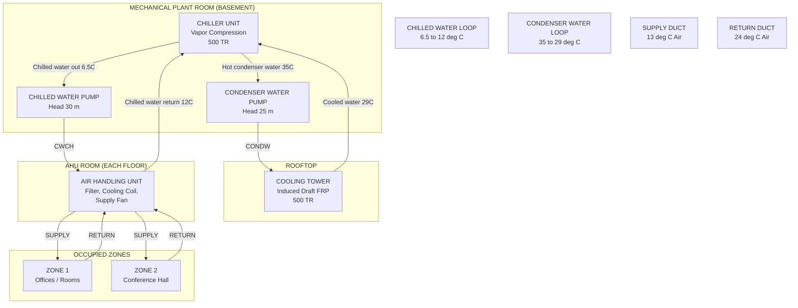
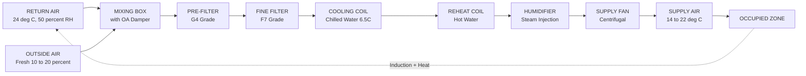
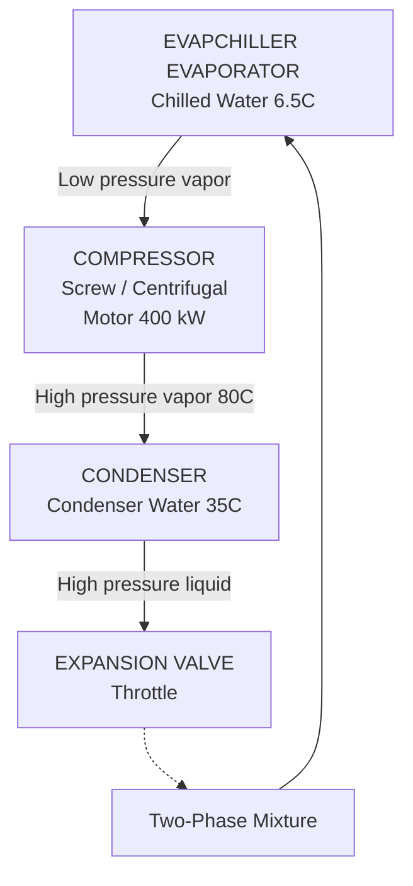
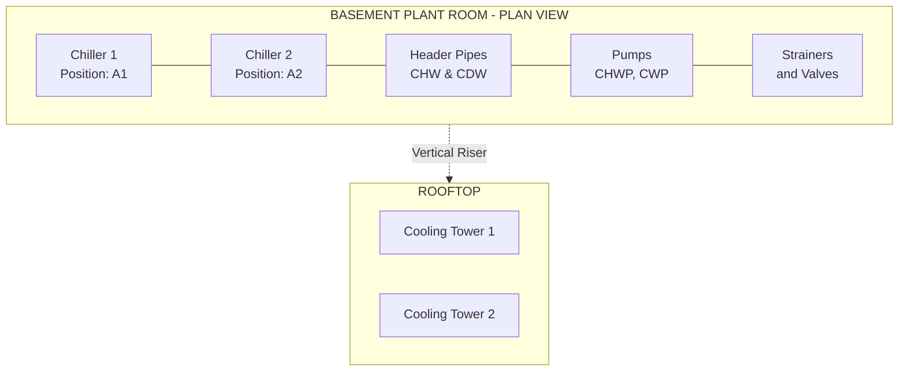

# Layout of central air conditioning systems.

<!-- SECTION_1_START -->
# CENTRAL AIR CONDITIONING SYSTEMS – LAYOUT FUNDAMENTALS

## 1.1 Formal Academic Definition (KTU 2024 Syllabus Terminology)

> [!NOTE]
> **Central Air Conditioning System (CACS)**: A large-scale, integrated HVAC (Heating, Ventilation, and Air Conditioning) arrangement in which a **centralized plant** (comprising chillers, cooling towers, pumps, and an Air Handling Unit – AHU) conditions the air and distributes it to multiple zones or rooms through a network of ducts, pipes, and terminal devices. The system is designed to maintain controlled temperature, humidity, air cleanliness, and air motion across an entire building or a cluster of buildings from a single mechanical location.

According to the KTU GCEST104 syllabus, this topic is studied under the *fundamentals of mechanical engineering* to introduce first-year B.Tech students to the way large buildings (hospitals, IT parks, malls, airports) are thermally managed.

## 1.2 Conceptual Analogy – The "Building as a Living Body"

Imagine a large office complex as a **human body**:

- The **chiller** is the *heart* — it pumps out cooled "blood" (chilled water).
- The **chilled water piping** is the *circulatory system* — arteries carrying the cool fluid.
- The **AHU (Air Handling Unit)** is the *lungs* — it conditions (cools, heats, filters, humidifies) the air.
- The **duct network** is the *trachea and bronchi* — distributing conditioned air to every room.
- The **cooling tower** is the *skin/sweat glands* — rejecting unwanted heat to the atmosphere.
- The **thermostat/control system** is the *brain* — constantly monitoring and adjusting.

> [!IMPORTANT]
> **KTU High-Yield Point**: A *central* system is distinguished from a *unitary/window/split* system by the fact that **conditioning equipment is housed in a dedicated plant room**, and conditioned air is supplied to **multiple zones simultaneously** through ductwork. The cooling capacity typically ranges from **10 TR to 5000+ TR** (1 TR = 3.517 kW of cooling).

## 1.3 Classification of Central Air Conditioning Systems

Central AC systems are broadly classified into two fundamental engineering families:

| Classification | Cooling Medium | Typical Capacity | Common Application |
|---|---|---|---|
| **All-Air Systems** | Air only (sensible + latent cooling via air) | Large (>100 TR) | Theatres, auditoriums, large open halls |
| **Air-Water Systems** | Both chilled water and air | Medium–Large | Hotels, hospitals, multi-storey offices |
| **Water Systems** | Chilled water to fan-coil units (FCUs) | Small–Medium | Apartments, small offices |

> [!VISUALIZATION CONTROL]
> **Concept:** Geometric layout of a chilled water central AC plant
> **Reference Axes (Plan View):**
> * $X$-axis: Length of plant room (m)
> * $Y$-axis: Width of plant room (m)
> * Marker positions: $P_1$ = Chiller, $P_2$ = Cooling Tower (rooftop), $P_3$ = Chilled Water Pump, $P_4$ = Condenser Water Pump, $P_5$ = AHU
> **Visual Description:** A rectangular building footprint with $P_1, P_3, P_4$ inside the basement plant room, $P_2$ on the roof, and $P_5$ on each floor, all connected by vertical risers along the $Y$-axis walls.

<!-- SECTION_1_END -->

<!-- SECTION_2_START -->
# 2. DEEP THEORETICAL ANALYSIS – COMPONENTS & HIGH-YIELD FORMULAS

## 2.1 The "Big Six" Components of a Central AC Plant

A standard central air conditioning system consists of the following six critical sub-systems, all of which are **mandatory topics in the KTU Module 1 viva and written exams**.

### 2.1.1 Chiller (The Refrigeration Unit)
- A chiller is a **vapor-compression refrigeration machine** that cools water from approximately $12^{\circ}\text{C}$ down to $6\text{–}7^{\circ}\text{C}$ (chilled water supply temperature).
- Two main types:
  * **Water-Cooled Chiller** — heat rejected to a separate condenser water loop → cooling tower.
  * **Air-Cooled Chiller** — heat rejected directly to ambient air via fans (used in small/medium systems).
- Modern installations often use **VFD-driven screw or centrifugal chillers** for energy efficiency.

### 2.1.2 Cooling Tower
- An **evaporative heat rejection device** that cools the warm condenser water returning from the chiller by bringing it into direct contact with ambient air.
- **Approach** = (Cold water temperature out) − (Ambient wet-bulb temperature); typically $3\text{–}5^{\circ}\text{C}$.
- **Range** = (Hot water in) − (Cold water out); typically $5\text{–}10^{\circ}\text{C}$.

### 2.1.3 Pumps
- **Chilled Water Pump (CHWP)**: Circulates chilled water between the chiller and the AHU.
- **Condenser Water Pump (CWP)**: Circulates condenser water between the chiller and the cooling tower.

### 2.1.4 Air Handling Unit (AHU)
The AHU is the **heart of air-side conditioning** and contains, in order of airflow:

1. **Return air mixing box / dampers** (recirculation + fresh air)
2. **Pre-filters** (G3/G4 grade)
3. **Cooling coil** (chilled water flows inside tubes; air passes over fins)
4. **Heating coil** (hot water or steam — for winter operation)
5. **Humidifier** (steam pan or water spray for winter)
6. **Dehumidifier / Reheat coil** (for precise humidity control)
7. **Fine filter** (F7/F8 — for clean rooms)
8. **Supply fan** (centrifugal or plug fan)
9. **Sound attenuator / silencer**

### 2.1.5 Duct Network
- **Galvanized Iron (GI) sheet metal ducts** distribute conditioned air.
- **Supply ducts** carry cool air to rooms; **return ducts** bring warm air back to the AHU.
- Sized using the **equal friction method** or **velocity reduction method** (typically $8\text{–}10\,\text{m/s}$ in main ducts).

### 2.1.6 Controls
- **Thermostats, humidity sensors, VAV (Variable Air Volume) boxes, BMS (Building Management System)** ensure coordinated operation.

## 2.2 KTU High-Yield Formula Sheet

> [!IMPORTANT]
> **Master these formulas — they appear in nearly every KTU Part B question on this module.**

| # | Formula | Symbol Meaning | Units |
|---|---|---|---|
| 1 | $Q = m \cdot c_p \cdot \Delta T$ | $Q$ = heat load, $m$ = mass flow, $c_p$ = specific heat ($4.18\,\text{kJ/kg·K}$ for water, $1.005\,\text{kJ/kg·K}$ for air), $\Delta T$ = temperature difference | kW |
| 2 | $\text{Capacity (TR)} = \dfrac{Q}{3.517}$ | Converts kW of cooling to Tons of Refrigeration | TR |
| 3 | $\dot{m}_w = \dfrac{Q}{c_{p,w} \cdot \Delta T_w}$ | Chilled water mass flow rate | kg/s |
| 4 | $\dot{V}_w = \dfrac{\dot{m}_w}{\rho_w}$ | Volumetric flow of water ($\rho_w \approx 1000\,\text{kg/m}^3$) | m³/s |
| 5 | $\text{COP} = \dfrac{Q_{\text{cooling}}}{W_{\text{input}}}$ | Coefficient of Performance of chiller (typical 3.0–6.0) | — |
| 6 | $\eta_{\text{overall}} = \dfrac{Q_{\text{useful}}}{Q_{\text{input}}}$ | Plant efficiency | % |
| 7 | $\text{HSPF / IPLV} = \dfrac{\text{Annual cooling}}{\text{Annual power}}$ | Seasonal performance metric | — |
| 8 | $P_{\text{pump}} = \dfrac{\dot{V} \cdot \Delta P}{\eta_{\text{pump}}}$ | Pump power | kW |

> [!NOTE]
> **Constants to remember (in bold as required by the protocol):**
> * **1 TR = 3.517 kW = 3024 kcal/hr**
> * **Specific heat of water $c_{p,w} = 4.186\,\text{kJ/kg·K}$**
> * **Specific heat of air $c_{p,a} = 1.005\,\text{kJ/kg·K}$**
> * **Density of water $\rho_w = 1000\,\text{kg/m}^3$**
> * **Density of air $\rho_a = 1.20\,\text{kg/m}^3$** (at NTP)

## 2.3 Real-World Engineering Utility

Central AC layouts are critical in:
- **Hospitals** — maintaining strict $22^{\circ}\text{C}$ and 50% RH for OTs and ICUs.
- **Data centers** — where chilled water systems remove server heat (often with hot-aisle/cold-aisle containment).
- **Pharmaceutical cleanrooms** — requiring HEPA filtration and tight temperature/humidity control.
- **Shopping malls & airports** — where ducted all-air systems handle high latent loads from crowds.

In production-grade building services, the **ASHRAE 90.1** and **ISHRAE Handbook** standards govern the design of these layouts.

<!-- SECTION_2_END -->

<!-- SECTION_3_START -->
# 3. STEP-BY-STEP LAYOUT DESCRIPTION & NUMERICAL DERIVATION

## 3.1 The Standard Chilled Water Central AC Layout – End-to-End Flow Path

The layout follows a **closed-loop cycle** for both water and air. Below is the **complete, exhaustive step-by-step flow** that a student must reproduce in a KTU exam for full marks.

### 3.1.1 Chilled Water Loop (Hydronic Side)

**Step 1 — Chilled water leaves the chiller evaporator**
The chiller cools water to a leaving temperature of $T_{\text{chws}} = 6.5^{\circ}\text{C}$ (chilled water supply).

**Step 2 — Pumped through the CHWP**
The Chilled Water Pump boosts pressure to overcome pipe friction, AHU coil resistance, and static head.

**Step 3 — Enters the AHU cooling coil**
Water enters the coil at $T_{\text{chws}} = 6.5^{\circ}\text{C}$ and leaves at $T_{\text{chwr}} = 12\text{–}13^{\circ}\text{C}$ (chilled water return), absorbing room heat.

**Step 4 — Returns to chiller**
The warmer return water re-enters the chiller evaporator to be re-cooled, completing the loop.

### 3.1.2 Condenser Water Loop (Heat Rejection Side)

**Step 5 — Hot refrigerant in the chiller condenser**
Heat absorbed from the building is rejected to the condenser water.

**Step 6 — Pumped via CWP to the cooling tower**
The Condenser Water Pump sends hot water (typically $35^{\circ}\text{C}$) up to the rooftop cooling tower.

**Step 7 — Cooling tower evaporative cooling**
A fraction of water evaporates, reducing the temperature to $29\text{–}30^{\circ}\text{C}$.

**Step 8 — Returns to chiller condenser**
Cooled condenser water flows back to the chiller, completing the second closed loop.

### 3.1.3 Air Side (Indoor Air Conditioning)

**Step 9 — Return air from rooms**
Warm return air at $24\text{–}26^{\circ}\text{C}$ enters the AHU return grille/duct.

**Step 10 — Mixing with fresh air**
A **mixed-air plenum** combines return air with a controlled amount of outdoor fresh air (typically 10–20% for offices).

**Step 11 — Filtration**
Air passes through pre-filters and fine filters to remove dust and particulates.

**Step 12 — Cooling coil**
Air contacts the cold coil, dropping to $13\text{–}14^{\circ}\text{C}$ (saturated), losing both sensible and latent heat.

**Step 13 — Reheat (if humidity control is critical)**
Air is reheated to a comfortable $20\text{–}22^{\circ}\text{C}$ without adding moisture.

**Step 14 — Supply fan pushes air through ducts**
Air travels via main ducts → branch ducts → diffusers → conditioned space.

**Step 15 — Room absorbs heat and moisture**
The cycle repeats continuously.

## 3.2 Numerical Derivation – Worked Example (KTU Board Standard)

> [!IMPORTANT]
> **Problem (KTU Model):** A central AC system serves an office building with a total cooling load of **500 kW**. The chilled water is supplied at $6.5^{\circ}\text{C}$ and returns at $12^{\circ}\text{C}$. Calculate: (i) the chilled water mass flow rate, (ii) the volumetric flow rate in L/s, and (iii) the cooling capacity in TR.

### Step-by-Step Solution

**Given:**
* $Q = 500\,\text{kW}$
* $T_{\text{chws}} = 6.5^{\circ}\text{C}$
* $T_{\text{chwr}} = 12^{\circ}\text{C}$
* $c_{p,w} = 4.186\,\text{kJ/kg·K}$
* $\rho_w = 1000\,\text{kg/m}^3$

**Step (i) — Mass flow rate**
From $Q = \dot{m} \cdot c_{p,w} \cdot \Delta T$:

$$\begin{aligned}
\dot{m}_w &= \frac{Q}{c_{p,w} \cdot \Delta T_w} \\
\Delta T_w &= T_{\text{chwr}} - T_{\text{chws}} = 12 - 6.5 = 5.5^{\circ}\text{C} \\
\dot{m}_w &= \frac{500}{4.186 \times 5.5} \\
\dot{m}_w &= \frac{500}{23.023} \\
\dot{m}_w &= 21.72\,\text{kg/s}
\end{aligned}$$

**Valuation Key Point:** *Stating the formula and $\Delta T$: 1 Mark. Substituting values: 1 Mark. Final answer: 1 Mark.*

**Step (ii) — Volumetric flow rate**
From $\dot{V} = \dfrac{\dot{m}}{\rho_w}$:

$$\begin{aligned}
\dot{V}_w &= \frac{21.72}{1000} \\
\dot{V}_w &= 0.02172\,\text{m}^3/\text{s} \\
\dot{V}_w &= 0.02172 \times 1000 \\
\dot{V}_w &= 21.72\,\text{L/s}
\end{aligned}$$

**Step (iii) — Cooling capacity in Tons of Refrigeration**

$$\begin{aligned}
\text{Capacity (TR)} &= \frac{Q}{3.517} \\
&= \frac{500}{3.517} \\
&= 142.16\,\text{TR}
\end{aligned}$$

**Final Answer:** $\dot{m}_w = 21.72\,\text{kg/s}$, $\dot{V}_w = 21.72\,\text{L/s}$, $\text{Capacity} \approx 142.2\,\text{TR}$.

## 3.3 Component Specifications Table (For Laboratory / Drawing Questions)

| Component | Material/Type | Typical Specification | Safety / Monitoring |
|---|---|---|---|
| **Chiller** | Screw/Centrifugal, water-cooled | 100–500 TR, COP ≥ 4.0 | Refrigerant leak sensor, flow switch |
| **Cooling Tower** | Induced draft, FRP construction | $35^{\circ}\text{C}$ in / $29^{\circ}\text{C}$ out | L.O. switch on fan motor, water level sensor |
| **CHWP / CWP** | End-suction centrifugal, cast iron | 10–50 m head, 25–100 m³/h | Strainer, NRV, isolation valves |
| **AHU** | Double-skin, 25 mm PUF insulation | 5000–50000 CFM | Belt guard, vibration isolators |
| **Ducts** | GI sheet, 24G / 22G | Velocity 8–10 m/s | Fire dampers at wall crossings |
| **Piping** | MS Class B / PPR | $c_{p,w}$ sized for $\Delta T = 5^{\circ}\text{C}$ | Expansion tank, air vent, PRV |

<!-- SECTION_3_END -->

<!-- SECTION_4_START -->
# 4. STRUCTURAL DIAGRAMS & SCHEMATICS (MERMAID)

## 4.1 Complete Central AC Plant – Functional Flow Diagram

## 4.2 Air-Side Block Diagram (AHU Internal Sequence)

## 4.3 Refrigeration Cycle Embedded in Chiller (Logical View)

## 4.4 Schematic Layout – Top View of Plant Room

<!-- SECTION_4_END -->

<!-- SECTION_5_START -->
# 5. KTU 2024 SCHEME EXAMINATION QUESTION BANK & TOPIC RECAP

## PART A — Short Answer Questions (3 Marks Each)

> **[KTU University Exam – July 2024, CO1, Remember]**
> **Q1. Define a central air conditioning system. List any four major components.**
>
> **Model Answer (3 Marks):**
> A central air conditioning system is an HVAC arrangement where air is conditioned by centrally located equipment and distributed to multiple zones through a network of ducts. **[1 Mark]**
> Four major components:
> 1. Chiller **[0.5 Mark]**
> 2. Cooling tower **[0.5 Mark]**
> 3. Air Handling Unit (AHU) **[0.5 Mark]**
> 4. Duct network **[0.5 Mark]**

> **[KTU University Exam – Dec 2023, CO1, Understand]**
> **Q2. Differentiate between a window air conditioner and a central air conditioning system (any four points).**
>
> **Model Answer (3 Marks):**
>
> | S.No. | Window AC | Central AC |
> |---|---|---|
> | 1 | Capacity 1–2 TR | Capacity 10–5000+ TR |
> | 2 | Self-contained unit | Central plant + ductwork |
> | 3 | Cools one room | Cools multiple rooms/zones |
> | 4 | No central controls | BMS / thermostat controlled |
> | 5 | Lower installation cost | Higher capital cost, lower per-TR cost |
>
> **[0.5 Mark × 4 = 2 Marks]** + **[0.5 Mark for table format / neatness]**

---

## PART B — Full 14-Mark Questions (Module Internal Choice)

### QUESTION A (14 Marks) — *[KTU University Exam – July 2024, CO2, Apply]*

> **With the help of a neat schematic diagram, explain the layout of a chilled water central air conditioning system. Also, calculate the chilled water flow rate required for a 300 kW cooling load if the water enters at $7^{\circ}\text{C}$ and leaves at $13^{\circ}\text{C}$.**

#### Part (a) — Layout Description (7 Marks)

**Step 1:** State the meaning of chilled water system. **[1 Mark]**

**Step 2:** Draw a labelled schematic showing: Chiller, CHWP, CWP, Cooling Tower, AHU, Supply Duct, Return Duct. **[3 Marks]**

**Step 3:** Describe the working — chilled water loop ($7^{\circ}\text{C}$ to $13^{\circ}\text{C}$), condenser water loop, and air-side conditioning in sequence. **[2 Marks]**

**Step 4:** Mention any one application (e.g., hospital, IT park). **[1 Mark]**

#### Part (b) — Numerical Calculation (7 Marks)

**Given:** $Q = 300\,\text{kW}$, $T_{\text{chws}} = 7^{\circ}\text{C}$, $T_{\text{chwr}} = 13^{\circ}\text{C}$, $c_{p,w} = 4.186\,\text{kJ/kg·K}$, $\rho_w = 1000\,\text{kg/m}^3$.

**Solution:**

$$\begin{aligned}
\Delta T_w &= T_{\text{chwr}} - T_{\text{chws}} \\
&= 13 - 7 = 6^{\circ}\text{C}
\end{aligned}$$

**Valuation:** *[Stating $\Delta T$ correctly: 1 Mark]*

$$\begin{aligned}
\dot{m}_w &= \frac{Q}{c_{p,w} \cdot \Delta T_w} \\
&= \frac{300}{4.186 \times 6} \\
&= \frac{300}{25.116} \\
&= 11.94\,\text{kg/s}
\end{aligned}$$

**Valuation:** *[Formula: 2 Marks; Substitution: 1 Mark; Final numerical answer with units: 1 Mark]*

$$\begin{aligned}
\dot{V}_w &= \frac{\dot{m}_w}{\rho_w} = \frac{11.94}{1000} \\
&= 0.01194\,\text{m}^3/\text{s} \\
&= 11.94\,\text{L/s}
\end{aligned}$$

**Valuation:** *[Formula: 1 Mark; Final answer: 1 Mark]*

**Final Result:** $\dot{m}_w \approx 11.94\,\text{kg/s}$ and $\dot{V}_w \approx 11.94\,\text{L/s}$.

---

### QUESTION B (14 Marks) — *[KTU University Exam – Dec 2023, CO2, Apply / Analyze]*

> **Describe the components of an Air Handling Unit (AHU) with a neat block diagram. Calculate the cooling capacity in TR if the chilled water mass flow rate is $20\,\text{kg/s}$ with a temperature rise of $5^{\circ}\text{C}$.**

#### Part (a) — AHU Components (7 Marks)

**Components in order of airflow:**

1. Return air mixing box with outdoor air damper
2. Pre-filter (G3/G4)
3. Cooling coil (chilled water)
4. Heating coil (hot water/steam)
5. Humidifier (steam pan)
6. Reheat coil
7. Fine filter (F7/F8)
8. Supply fan
9. Sound attenuator

**Valuation:** *[Block diagram with all 9 components: 4 Marks; Sequence explanation: 2 Marks; Function of each: 1 Mark]*

#### Part (b) — Numerical Calculation (7 Marks)

**Given:** $\dot{m}_w = 20\,\text{kg/s}$, $\Delta T_w = 5^{\circ}\text{C}$, $c_{p,w} = 4.186\,\text{kJ/kg·K}$.

**Step 1 — Heat load in kW:**

$$\begin{aligned}
Q &= \dot{m}_w \cdot c_{p,w} \cdot \Delta T_w \\
&= 20 \times 4.186 \times 5 \\
&= 418.6\,\text{kW}
\end{aligned}$$

**Valuation:** *[Formula: 1 Mark; Substitution: 1 Mark; Final: 1 Mark]*

**Step 2 — Convert to TR:**

$$\begin{aligned}
\text{Capacity (TR)} &= \frac{Q}{3.517} \\
&= \frac{418.6}{3.517} \\
&= 119.02\,\text{TR}
\end{aligned}$$

**Valuation:** *[Formula: 1 Mark; Final: 1 Mark]*

**Final Answer:** $\approx 119\,\text{TR}$ cooling capacity.

---

> [!WARNING]
> **KTU Examiner's Valuation Warning — Common Pitfalls:**
> 1. **Unit mix-up**: Students often forget to convert kW to TR (or vice versa). Always state **both** units.
> 2. **$\Delta T$ sign error**: Always take $\Delta T = T_{\text{return}} - T_{\text{supply}}$; using a negative value will give a negative flow rate.
> 3. **Omitting the diagram**: A schematic diagram in Part (a) of Q.A is **mandatory** for 3 of the 7 marks. Skipping it = guaranteed loss.
> 4. **No units in the final answer**: Always write "$= 11.94\,\text{kg/s}$", not "$= 11.94$". Loss of 0.5–1 mark per occurrence.
> 5. **Forgetting the cooling tower loop**: A common error is drawing only one loop; **two loops** (chilled water + condenser water) must be shown.

---

## 📌 TOPIC RECAP & IMPORTANT THINGS TO REMEMBER

- **Central AC** = central plant + ducts supplying multiple zones.
- **Six big components**: Chiller, Cooling Tower, CHWP, CWP, AHU, Ducts.
- **Two closed loops**: (i) Chilled water ($6.5^{\circ}\text{C} \rightarrow 12^{\circ}\text{C}$), (ii) Condenser water ($35^{\circ}\text{C} \rightarrow 29^{\circ}\text{C}$).
- **AHU sequence**: Mix → Filter → Cool → Reheat → Humidify → Fan → Supply.
- **Master formula**: $Q = \dot{m} \cdot c_p \cdot \Delta T$ (with $c_{p,\text{water}} = 4.186$, $c_{p,\text{air}} = 1.005$).
- **Conversion**: **1 TR = 3.517 kW = 3024 kcal/hr** — commit this to memory.
- **Cooling tower terminology**: Approach (3–5°C), Range (5–10°C).
- **Typical applications**: Hospitals, data centers, malls, airports, cleanrooms.
- **Standards referenced**: ISHRAE Handbook, ASHRAE 90.1.
- **Always draw a labelled schematic** in layout questions — it is a non-negotiable mark component.

<!-- SECTION_5_END -->
