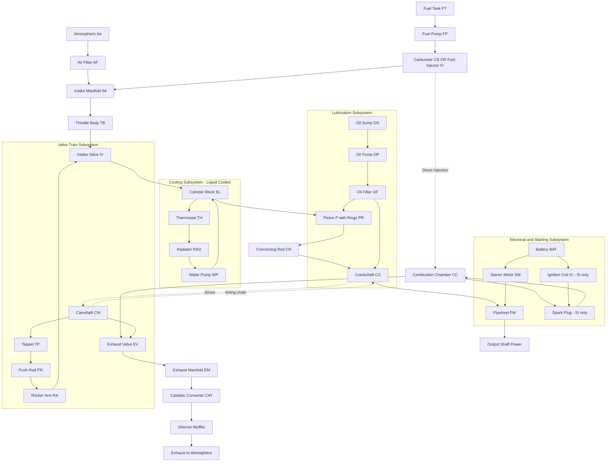
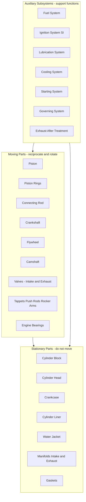

# Listing the parts of IC Engines.

<!-- SECTION_1_START -->

# Listing the Parts of IC Engines

## 1.1 Formal Academic Definition

An **Internal Combustion (IC) Engine** is a prime mover that converts the chemical energy of a liquid or gaseous fuel into useful mechanical work (rotational energy at the crankshaft) by burning the fuel *inside* the engine cylinder, using a controlled combustion process governed by a thermodynamic cycle — either the **Otto cycle** for Spark Ignition (SI) engines or the **Diesel cycle** for Compression Ignition (CI) engines.

In the **KTU 2024 Scheme** context (Course Code: GCEST104), an IC engine is a system composed of numerous *interacting sub-assemblies* — namely the **cylinder block, cylinder head, piston, connecting rod, crankshaft, valve train, intake system, exhaust system, cooling system, lubrication system, and ignition/fuel system** — all of which must be cataloged to understand the working of an automobile or a stationary power plant.

> [!IMPORTANT]
> **Syllabus Highlight (KTU 2024 – Module 1):** Students are expected to *list, identify, and briefly describe the function* of at least the **major 15–20 components** of a typical 4-stroke IC engine. Memorization of part names + understanding of their role in the four strokes (Intake, Compression, Power, Exhaust) is the primary evaluation focus.

## 1.2 Intuitive Analogy — The Engine as a "Controlled Factory Floor"

Imagine a **miniature factory floor** confined inside a metal cylinder. Inside this factory:

- A **door** (valve) opens to let raw material (air + fuel) enter.
- A **piston** acts like a heavy hammer that moves up and down.
- A **crankshaft** is the conveyor belt that converts the up-down hammer motion into rotation (the useful output).
- A **cooling system** is the air-conditioner preventing the factory from melting.
- A **lubrication system** is the oiling crew that prevents the moving parts from grinding each other into dust.
- A **flywheel** is the massive flywheel of a pottery wheel — storing energy between pushes so the motion stays smooth.

Just as a factory floor has *incoming materials, work stations, output conveyor, and a maintenance crew* — the IC engine has an **intake system, combustion chamber, power train, and supporting systems**.

## 1.3 Classification Overview

| Criterion | Type |
|-----------|------|
| **Fuel ignition method** | Spark Ignition (SI) & Compression Ignition (CI) |
| **Stroke cycle** | 2-Stroke & 4-Stroke |
| **Cooling method** | Air-Cooled & Water-Cooled |
| **Fuel used** | Petrol (Gasoline), Diesel, CNG, LPG, Bio-diesel |
| **Application** | Automotive (cars, bikes), Marine, Stationary (generators), Locomotive |

> [!NOTE]
> **Standard Engine Metrics (must remember):**
> - **Bore ($D$):** Internal diameter of the cylinder.
> - **Stroke ($L$):** Distance travelled by the piston between TDC and BDC.
> - **Swept Volume ($V_s$):** $\frac{\pi}{4} D^2 L$
> - **Compression Ratio ($r$):** $\frac{V_s + V_c}{V_c}$, where $V_c$ is the clearance volume.

> [!VISUALIZATION CONTROL]
> **Concept:** Cross-sectional layout of a 4-stroke water-cooled SI engine
> **Suggested Reference:** Search "Cutaway view of 4-cylinder SI engine" on *GeoGebra 3D* or any engineering drawing app.
> **Visual Description:** The student should observe the cylinder (vertical block), piston sliding inside it, the connecting rod linking piston to crankshaft (horizontal axis), valves on top of the cylinder head, and the surrounding water jacket layer. The crankshaft axis is perpendicular to the cylinder axis.

---

<!-- SECTION_1_END -->

<!-- SECTION_2_START -->

# Deep Theoretical Analysis — Systematic Listing of IC Engine Parts

## 2.1 Functional Grouping of IC Engine Parts

For KTU board examination purposes, the parts of an IC engine are conventionally classified into **three logical groups**:

### Group A — Stationary (Fixed) Parts
These parts do not move relative to the engine block; they form the structural skeleton.

1. **Cylinder Block** — Hosts the cylinder bores; made of cast iron or aluminum alloy.
2. **Cylinder Head (Cylinder Cover)** — Closes the top of the cylinder; houses valves, spark plug/injector, and part of the combustion chamber.
3. **Crankcase** — Lower housing that encloses the crankshaft and holds lubricating oil.
4. **Cylinder Liner (Sleeve)** — Replaceable inner lining fitted inside the cylinder block (in wet/dry liner designs).
5. **Manifolds** — Intake manifold (delivers air/fuel mixture) and exhaust manifold (collects burnt gases).
6. **Water Jacket** — Hollow cavity surrounding the cylinder for water circulation (in liquid-cooled engines).
7. **Gaskets** — Compressible sealing layers between cylinder block, head, and manifolds.

### Group B — Moving (Reciprocating / Rotating) Parts
These parts convert combustion pressure into rotational motion.

8. **Piston** — Reciprocates inside the cylinder, receives combustion force.
9. **Piston Rings** — Compression rings (gas sealing) and oil control rings (oil scraping).
10. **Connecting Rod (Con Rod)** — Links piston to crankshaft; converts reciprocating to rotary motion.
11. **Crankshaft** — Rotating shaft that delivers final power output; has crankpins, crank webs, and counterweights.
12. **Flywheel** — Heavy disc mounted on the crankshaft; stores rotational inertia to maintain smooth rotation.
13. **CamShaft** — Rotating shaft with eccentric lobes that operate the valves (in OHV and OHC designs).
14. **Valves** — Intake valve (lets charge in) and exhaust valve (lets burnt gases out).
15. **Timing Chain / Timing Belt / Timing Gears** — Synchronize camshaft rotation with crankshaft rotation.
16. **Tappets (Lifters) and Push Rods** — Transmit cam lobe motion up to the rocker arms.
17. **Rocker Arms** — Pivot-mounted levers that open/close valves in overhead valve (OHV) engines.
18. **Engine Bearings** — Main bearings (support crankshaft in block) and big-end bearings (support connecting rod on crankpin).

### Group C — Auxiliary / Supporting Subsystems
These systems do not produce power directly but are essential for engine operation, efficiency, and longevity.

19. **Fuel Supply System** — Carburetor (older SI engines) **or** Fuel Injection Pump + Injectors (modern SI/CI engines), fuel filter, fuel pump.
20. **Air Intake System** — Air filter, throttle body, intake manifold.
21. **Ignition System** (SI engines only) — Battery, ignition coil, distributor/ignition module, spark plug.
22. **Lubrication (Lubing) System** — Oil sump (pan), oil pump, oil filter, oil galleries, pressure relief valve.
23. **Cooling System** — Radiator, water pump, thermostat, cooling fan, hoses.
24. **Exhaust System** — Exhaust pipe, catalytic converter, silencer (muffler).
25. **Starting System** — Starter motor, starter solenoid, battery.
26. **Governing System** — Mechanical/Hydraulic/Electronic governor to control engine speed.

## 2.2 KTU Formula Sheet / Quick Reference Table

| # | Part Name | Material (Typical) | Function | Engine Type |
|---|-----------|--------------------|----------|-------------|
| 1 | Cylinder Block | Cast Iron / Al Alloy | Houses cylinder; structural backbone | SI & CI |
| 2 | Cylinder Head | Cast Iron / Al Alloy | Closes cylinder; houses valves & injector | SI & CI |
| 3 | Piston | Al Alloy | Receives combustion pressure | SI & CI |
| 4 | Piston Rings | Cast Iron / Steel | Seal gases + scrape oil | SI & CI |
| 5 | Connecting Rod | Forged Steel | Transfers piston force to crank | SI & CI |
| 6 | Crankshaft | Forged Steel | Converts reciprocating to rotary motion | SI & CI |
| 7 | Flywheel | Cast Iron | Stores rotational kinetic energy | SI & CI |
| 8 | CamShaft | Hardened Steel | Operates valves at correct timing | SI & CI |
| 9 | Intake Valve | Steel (nickel alloy) | Admits fresh charge | SI & CI |
| 10 | Exhaust Valve | Heat-resistant steel | Expels burnt gases | SI & CI |
| 11 | Spark Plug | Ceramic + Steel | Ignites compressed mixture | SI only |
| 12 | Fuel Injector | High-grade steel | Sprays diesel into hot air | CI only |
| 13 | Carburetor | Al/Zn Alloy | Atomizes petrol + air | SI (older) |
| 14 | Oil Pump | Steel | Circulates lubricant | SI & CI |
| 15 | Water Pump | Cast Iron | Circulates coolant | SI & CI (liquid-cooled) |
| 16 | Radiator | Copper / Al | Dissipates heat from coolant | SI & CI |
| 17 | Air Filter | Paper / Foam | Filters intake air | SI & CI |
| 18 | Silencer (Muffler) | Steel | Dampens exhaust noise | SI & CI |
| 19 | Battery | Lead-Acid / Li-ion | Stores electrical energy | SI & CI |
| 20 | Starter Motor | Electric DC motor | Cranks engine during starting | SI & CI |
| 21 | Governor | Mechanical/Electronic | Regulates engine speed | CI (more common) |
| 22 | Flywheel Ring Gear | Hardened Steel | Engages starter motor pinion | SI & CI |
| 23 | Gasket | Asbestos-free composite | Seals joints | SI & CI |
| 24 | Tappet | Hardened Steel | Transmits cam motion to push rod | SI & CI |
| 25 | Push Rod | Steel | Transmits tappet motion to rocker | SI & CI (OHV) |
| 26 | Rocker Arm | Steel | Pivots to open/close valve | SI & CI (OHV) |
| 27 | Crankcase | Cast Iron / Al | Houses crankshaft; holds oil | SI & CI |
| 28 | Oil Sump (Pan) | Sheet Steel | Stores engine oil | SI & CI |
| 29 | Catalytic Converter | Ceramic + steel shell | Reduces HC, CO, NOx emissions | SI & CI |
| 30 | Throttle Body | Al alloy | Controls air mass entering engine | SI |

## 2.3 Real-World Engineering Utility

- **Automotive Industry:** Modern 4-stroke SI engines in cars like Maruti Suzuki Alto or Hyundai i20 contain all the above 30 components in a compact ~1.2 L package producing ~80–90 bhp.
- **Power Generation:** Stationary CI (diesel) engines from manufacturers like *Cummins* and *Kirloskar* use the same parts but in much larger sizes (up to 20+ cylinders).
- **Two-wheeler Industry:** Air-cooled 2-stroke SI engines (older bikes) omit water jackets; modern 4-stroke bikes retain all listed parts in miniaturized form.
- **Aviation & Marine:** High-power engines add **turbochargers, superchargers, intercoolers** to the auxiliary list for higher specific output.

> [!NOTE]
> **Why this listing matters in KTU exams:** The board examiner's key demands that students *group* parts correctly, mention *materials* where possible, and *briefly state function* — not just write names. A student who merely lists "piston, crankshaft" without grouping (stationary/moving/auxiliary) typically loses **1–2 marks** out of 3 in Part A questions.

---

<!-- SECTION_2_END -->

<!-- SECTION_3_START -->

# Step-by-Step Listing with Functions & Engineering Descriptions

This section exhaustively lists the parts in their logical order, just as they would be encountered when physically tracing the path of fuel → combustion → power output.

## 3.1 Tracing the Path of Energy — A Walkthrough

**Step 1 — Air Entry:** Fresh atmospheric air enters through the **Air Filter (37)** which removes dust. It then passes through the **Throttle Body (30)** in SI engines which controls air mass based on accelerator pedal position.

**Step 2 — Fuel Mixing (SI) or Direct Injection (CI):**
- In SI engines: Fuel + air mix in the **Carburetor (13)** or **Intake Manifold (5a)** before entering the cylinder.
- In CI engines: Only air enters; diesel is sprayed directly via **Fuel Injector (12)** near the end of the compression stroke.

**Step 3 — Charge Entry into Cylinder:** The **Intake Valve (9)** opens (driven by **CamShaft (8)** through **Tappet (24) → Push Rod (25) → Rocker Arm (26)**) and the fresh charge rushes in (Intake Stroke).

**Step 4 — Compression:** Both valves close. The **Piston (3)** moves upward, compressing the charge inside the **Cylinder Block (1)** bore. **Piston Rings (4)** prevent gas leakage past the piston.

**Step 5 — Ignition:**
- SI: **Spark Plug (11)** fires at the correct instant, igniting the mixture.
- CI: Compressed air is so hot that diesel auto-ignites upon injection.

**Step 6 — Power Stroke:** Combustion gases expand violently, pushing the **Piston (3)** down. Force is transmitted via the **Connecting Rod (5)** to the **Crankshaft (6)**, causing it to rotate.

**Step 7 — Exhaust:** **Exhaust Valve (10)** opens. The rising **Piston (3)** pushes burnt gases out through the **Exhaust Manifold (5b)** → **Catalytic Converter (29)** → **Silencer/Muffler (18)** → atmosphere.

**Step 8 — Continuous Operation:** The **Flywheel (7)** stores excess rotational energy from the power stroke and returns it during the other three strokes, ensuring smooth rotation.

**Step 9 — Lubrication (Continuous):** The **Oil Pump (14)** draws oil from the **Oil Sump (28)** and pumps it through galleries to lubricate bearings, piston rings, and cam lobes.

**Step 10 — Cooling (Continuous):** The **Water Pump (15)** circulates coolant from the **Radiator (16)** through the **Water Jacket (6)** to absorb heat from the cylinder walls and head.

**Step 11 — Starting:** The **Starter Motor (20)**, powered by the **Battery (19)**, engages the **Flywheel Ring Gear (22)** to crank the engine until it fires.

**Step 12 — Speed Regulation:** The **Governor (21)** senses engine RPM and adjusts the fuel quantity to maintain a steady speed.

## 3.2 The Eight Essential Sub-Systems (Summary)

| # | Sub-System | Key Parts Included | KTU Mnemonic |
|---|------------|--------------------|--------------|
| 1 | **Block & Head System** | Cylinder block, head, liner, gaskets, water jacket | "B-H-L-G-W" |
| 2 | **Power Cylinder System** | Piston, rings, gudgeon pin, connecting rod | "P-R-G-C" |
| 3 | **Crank-Flywheel System** | Crankshaft, main bearings, flywheel | "C-B-F" |
| 4 | **Valve Train System** | Valves, springs, camshaft, tappets, push rods, rockers, timing gear | "V-S-C-T-P-R-G" |
| 5 | **Fuel & Air Intake System** | Air filter, carburetor / injector, fuel pump, manifold | "A-C/F-F-M" |
| 6 | **Ignition System (SI)** | Battery, coil, distributor, spark plug | "B-C-D-S" |
| 7 | **Lubrication System** | Sump, oil pump, filter, galleries, relief valve | "S-P-F-G-R" |
| 8 | **Cooling System** | Radiator, water pump, fan, thermostat, hoses | "R-P-F-T-H" |

## 3.3 Key Numerical Formulas (For 4-Stroke SI Engine)

The swept volume and other geometry values help correlate with engine "size":

$$
V_s = \frac{\pi}{4} D^2 L
$$

$$
V_c = \frac{V_s}{r - 1}
$$

$$
\text{Total Cylinder Volume} = V_s + V_c
$$

$$
\text{Power Output (Brake)} \ P_b = \frac{2 \pi N T}{60}
$$

where:
- $D$ = Bore diameter (m)
- $L$ = Stroke length (m)
- $r$ = Compression ratio (dimensionless, typically $r = 8$–$12$ for SI, $14$–$22$ for CI)
- $N$ = Crankshaft speed (rpm)
- $T$ = Brake torque (N·m)

> [!NOTE]
> **Engineering Application:** Knowing $V_s$ and $r$ helps the engineer decide on **knock resistance, fuel octane/cetane rating, and thermal efficiency**. Higher $r$ → higher efficiency, but risk of knock in SI engines. This is why high-performance engines use *premium* fuel.

## 3.4 Parts Unique to SI vs. CI Engines

| Part | SI (Petrol) Engine | CI (Diesel) Engine |
|------|--------------------|--------------------|
| Fuel Delivery | Carburetor (older) or Port Fuel Injection | Fuel Injection Pump + Injector |
| Ignition Source | **Spark Plug** required | NOT required (auto-ignition) |
| Compression Ratio | $8$–$12$ | $14$–$22$ |
| Governor | Optional | **Mandatory** (diesel runs at constant speed) |
| Glow Plug | Not required | Required for cold starting |
| Throttle Body | Yes (controls air-fuel mix) | Not present (only fuel quantity is controlled) |

## 3.5 Safety & Material Notes (KTU Practical Lab Perspective)

> [!WARNING]
> **Lab Safety Callout:** During dismantling-assembly of an IC engine model in the workshop:
> - Always disconnect the **Battery (19)** before touching electrical parts.
> - The **Exhaust Manifold (5b)** and **Silencer (18)** remain hot for hours after operation — never touch bare-handed.
> - **Engine oil** from the **Oil Sump (28)** is carcinogenic; dispose via proper hazardous-waste channels.
> - Use a **torque wrench** when tightening **Cylinder Head (2)** bolts in the *criss-cross* sequence to avoid head warping.

---

<!-- SECTION_3_END -->

<!-- SECTION_4_START -->

# Structural Diagrams & Schematics

## 4.1 Block-Level Functional Architecture Flow (IC Engine System Map)

The following Mermaid diagram shows the **flow of energy, mass, and signals** through all major IC engine parts, grouped into subsystems:



## 4.2 Sequential Processing Topology Matrix — Power Train Path

The following Mermaid diagram traces the **mechanical power train** — the most asked concept in KTU boards:

```mermaid
flowchart LR
    P0[Combustion Pressure in Cylinder] --> P1[Piston - Reciprocates]
    P1 --> P2[Gudgeon Pin Wrist Pin]
    P2 --> P3[Connecting Rod Small End]
    P3 --> P4[Connecting Rod Big End]
    P4 --> P5[Crankshaft Crankpin]
    P5 --> P6[Crankshaft Web]
    P6 --> P7[Main Journal]
    P7 --> P8[Main Bearing in Block]
    P8 --> P9[Crankshaft Pulley End]
    P9 --> P10[Flywheel via Bolts]
    P10 --> P11[Clutch Plate or Output Coupling]
    P11 --> P12[Final Power to Wheels or Load]
    
    P5 -.counterweight.-> P6
    P10 -.ring gear.-> ST[Starter Motor Pinion]
```



## 4.3 Component Grouping Diagram (3-Category View)



> [!NOTE]
> **Reading Tip for KTU Board Exams:** When asked "List the parts of an IC engine" (3-mark question), students who **draw a labeled block diagram like Section 4.3** and then briefly list parts under each of the three categories tend to score full marks. Examiners specifically look for the *ability to organize*, not merely to dump a list.

---

<!-- SECTION_4_END -->

<!-- SECTION_5_START -->

# KTU 2024 Scheme Examination Question Bank & Topic Recap

## Part A — Short Answer Questions (3 Marks each)

### Question 1
**[KTU University Exam – July 2024]** *Define an Internal Combustion engine. List any six major parts of a 4-stroke SI engine.*

**Model Answer (Valuation Key):**

An **Internal Combustion (IC) engine** is a heat engine in which the combustion of fuel takes place *inside* the engine cylinder itself, and the resulting hot gases expand to produce useful mechanical work. *[Definition: 1 Mark]*

Six major parts of a 4-stroke SI engine:
1. Cylinder Block
2. Piston
3. Connecting Rod
4. Crankshaft
5. Flywheel
6. Spark Plug

*[Any six correctly named parts: 2 Marks = 6 × 0.33 ≈ 2 Marks]*

### Question 2
**[KTU University Exam – Dec 2023]** *Differentiate between the spark plug and fuel injector with respect to their function and the engine type in which they are used.*

**Model Answer:**

| Feature | Spark Plug | Fuel Injector |
|---------|-----------|---------------|
| **Function** | Produces an electric spark to ignite the compressed air-fuel mixture | Sprays (atomizes) diesel fuel into hot compressed air |
| **Engine Type** | Spark Ignition (SI) engine only | Compression Ignition (CI) engine only |
| **Operating Principle** | High-voltage arc across electrodes | High-pressure atomization through nozzle |
| **Timing of Operation** | End of compression stroke (just before TDC) | End of compression stroke (CI self-ignites upon injection) |

*[Correct differentiation: 3 Marks — 1 mark each for function, engine type, and operating principle]*

---

## Part B — Long Answer Questions (14 Marks each)

> **Internal Choice Instruction (KTU Pattern):** Answer **either** Question A **or** Question B in full. Each question has sub-parts (a) = 7 marks and (b) = 7 marks.

### Question A (14 Marks)

**[KTU University Exam – July 2024 | Module 1 | Mapped CO: CO1, Understand]**

**(a)** Classify the parts of an IC engine into three major groups. List at least four parts in each group along with a one-line function of each. *(7 Marks)*

**(b)** With the help of a neat block diagram, explain the working of the **lubrication system** and **cooling system** of a water-cooled 4-stroke IC engine. List the parts used in each. *(7 Marks)*

---

**Model Solution (Question A):**

#### Part (a) — Classification (7 Marks)

The parts of an IC engine can be classified into three major groups:

**Group 1 — Stationary Parts:** Parts that do not move relative to the engine block.
- **Cylinder Block (1 mark):** Provides the cylindrical bore in which the piston reciprocates.
- **Cylinder Head (1 mark):** Closes the top of the cylinder and houses valves, spark plug/injector.
- **Crankcase (0.5 mark):** Lower housing enclosing the crankshaft and supporting the oil sump.
- **Water Jacket (0.5 mark):** Hollow cavity around the cylinder for coolant circulation.
- *(Any 4 parts × appropriate marks = 3 marks total for this group)*

**Group 2 — Moving Parts:** Parts that reciprocate or rotate.
- **Piston (0.5 mark):** Reciprocates in the cylinder, receiving combustion pressure.
- **Connecting Rod (0.5 mark):** Transmits piston force to the crankshaft.
- **Crankshaft (0.5 mark):** Converts reciprocating motion to rotary motion.
- **Camshaft (0.5 mark):** Operates intake and exhaust valves at correct timing.
- **Flywheel (0.5 mark):** Stores kinetic energy and ensures smooth rotation.
- **Valves (0.5 mark):** Control entry of charge and exit of exhaust gases.

**Group 3 — Auxiliary Systems:** Supporting systems for engine operation.
- **Fuel System (0.5 mark):** Supplies metered fuel (carburetor or injector + pump).
- **Ignition System (0.5 mark):** Generates spark at correct instant (SI only).
- **Lubrication System (0.5 mark):** Reduces friction between moving parts.
- **Cooling System (0.5 mark):** Removes excess heat from the engine.
- **Starting System (0.5 mark):** Cranks the engine using an electric starter.

*[Grouping classification: 1 Mark; Listing parts: 2 Marks; Functions: 4 Marks = Total 7 Marks]*

#### Part (b) — Lubrication and Cooling Systems (7 Marks)

**Lubrication System:**

```
Oil Sump → Oil Pump → Oil Filter → Main Oil Gallery 
→ Crankshaft Bearings → Camshaft Bearings → Piston Pins 
→ Oil Pan (drain back) [3 Marks for flow + parts listing]
```

Parts: Oil sump, oil pump, oil filter, pressure relief valve, oil galleries (drilled passages in block), dipstick.

**Cooling System (Water/Liquid Cooled):**

```
Radiator → Water Pump → Water Jacket (around cylinders) 
→ Thermostat → Return to Radiator → Cooling Fan pulls air 
through radiator fins [3 Marks for flow + parts listing]
```

Parts: Radiator, water pump, thermostat, cooling fan, hoses, water jacket, temperature gauge.

*[Final integrated explanation: 1 Mark = Total 7 Marks]*

---

### Question B (14 Marks) — *Alternative to Question A*

**[KTU University Exam – Dec 2023 | Module 1 | Mapped CO: CO1, Understand / Apply]**

**(a)** List and explain the function of any **seven parts** of the **valve train** of a 4-stroke overhead valve (OHV) engine. *(7 Marks)*

**(b)** Compare the parts of an SI engine with those of a CI engine. Mention at least three parts unique to each. *(7 Marks)*

---

**Model Solution (Question B):**

#### Part (a) — Valve Train Parts (7 Marks)

The **valve train** is the system responsible for opening and closing the intake and exhaust valves at the correct timing, synchronized with piston position.

1. **Camshaft (1 mark):** A shaft with eccentric lobes; one lobe per valve. As it rotates, the lobe lifts the tappet.
2. **Tappet (Lifters) (1 mark):** Sits on the cam lobe and moves up-down with the lobe profile.
3. **Push Rod (1 mark):** A long thin steel rod that transmits the tappet's motion upward to the rocker arm (in OHV design).
4. **Rocker Arm (1 mark):** A pivoting lever that converts the upward push-rod motion into a downward push on the valve stem.
5. **Valve Springs (1 mark):** Coiled springs that close the valve when cam lobe rotates away.
6. **Timing Chain / Belt (1 mark):** Connects the crankshaft to the camshaft ensuring synchronization (typical ratio 1:2 — camshaft rotates half the speed of crankshaft in 4-stroke).
7. **Intake and Exhaust Valves (1 mark):** Mushroom-shaped poppet valves; the intake valve admits the fresh charge and the exhaust valve expels burnt gases.

*[Each correct part with function: 1 Mark × 7 = 7 Marks]*

#### Part (b) — SI vs. CI Engine Parts (7 Marks)

| Part | SI Engine (Petrol) | CI Engine (Diesel) | Reason for Difference |
|------|--------------------|--------------------|------------------------|
| **Spark Plug** | Present | Absent | SI uses external ignition; CI uses auto-ignition due to high compression |
| **Carburetor / Port Fuel Injector** | Present | Absent (only direct injector) | SI mixes fuel with air before cylinder; CI injects only into hot compressed air |
| **Fuel Injection Pump** | Optional / simple | **Essential** (high-pressure pump) | CI requires very high pressure (~200–2000 bar) for fine atomization |
| **Glow Plug** | Absent | Present (for cold start) | CI cylinder air may not be hot enough in winter to ignite fuel |
| **Throttle Body** | Present | Absent | SI controls power by air mass; CI controls power by fuel mass |
| **Ignition Coil + Distributor** | Present | Absent | No spark is needed in CI engines |
| **Governor** | Optional | Mandatory | Diesel engines are commonly used in constant-speed applications (generators, pumps) |

*[3 unique SI parts with reason: 3 Marks; 3 unique CI parts with reason: 3 Marks; Overall correct comparison: 1 Mark = 7 Marks]*

---

> [!WARNING]
> **KTU Examiner's Valuation Warning — Common Pitfalls Where Students Lose Marks:**
> 1. **Listing without grouping (–1 to –2 marks):** A bare list of 20 parts earns partial credit, but organizing them into *Stationary / Moving / Auxiliary* demonstrates understanding and is rewarded.
> 2. **Forgetting function (–1 mark per question):** Naming a part without stating its function leads to a half-mark answer. KTU expects *part name + 1-line function*.
> 3. **Confusing SI and CI parts (–1 mark):** Writing "Spark Plug in diesel engine" or "Fuel injector in petrol carburetor engine" loses marks.
> 4. **Not drawing a diagram in 7-mark sub-parts (–1 to –2 marks):** For long questions, a **neat labeled block diagram** of subsystems is mandatory. Drawing without labels is also penalized.
> 5. **Spelling errors in part names** (e.g., "Cam shaft" vs. "Camshaft" — generally tolerated, but "Carburetor" misspelled as "Carbarator" *and* mis-explained is a red flag for the examiner).
> 6. **Omitting auxiliary systems (cooling, lubrication, ignition, starting):** Many students list only the "big" parts (piston, crank, cylinder) and forget the **auxiliary systems** which carry **30–40%** of the total mark weight in a 14-mark question.

---

## Topic Recap & Important Things to Remember

> [!IMPORTANT]
> **High-Density Revision Checklist — Parts of IC Engine (KTU 2024, GCEST104, Module 1)**

### A. Foundational Definitions
- An **IC engine** burns fuel *inside* the cylinder; contrast with *external combustion* engines (e.g., steam engine).
- **SI (Otto cycle):** Spark ignition, low compression ratio ($r = 8$–$12$), uses petrol/CNG.
- **CI (Diesel cycle):** Compression ignition, high compression ratio ($r = 14$–$22$), uses diesel.

### B. Must-Know Three-Group Classification
- **Stationary:** Cylinder block, cylinder head, crankcase, liner, manifolds, water jacket, gaskets.
- **Moving:** Piston, rings, connecting rod, crankshaft, flywheel, camshaft, valves, tappets, push rods, rocker arms, bearings.
- **Auxiliary:** Fuel system, ignition system (SI), lubrication system, cooling system, starting system, exhaust system, governing system.

### C. The 7 Auxiliary Sub-Systems (Highest Weightage)
- **Fuel Supply:** Tank, pump, filter, carburetor/injector.
- **Air Intake:** Air filter, throttle body (SI), manifold.
- **Ignition (SI only):** Battery, coil, distributor/module, spark plug.
- **Lubrication:** Sump, pump, filter, galleries, relief valve.
- **Cooling:** Radiator, water pump, fan, thermostat, water jacket.
- **Exhaust:** Manifold, catalytic converter, silencer.
- **Starting + Governing:** Battery, starter motor, governor.

### D. Key Functions to Memorize
- **Piston:** Reciprocates, receives combustion force, sealed by rings.
- **Connecting Rod:** Converts reciprocating → rotary motion.
- **Crankshaft:** Outputs rotational power.
- **Flywheel:** Stores inertia for smooth running.
- **Camshaft:** Operates valves via tappets, push rods, rockers.
- **Spark Plug:** Ignites mixture in SI engine.
- **Fuel Injector:** Atomizes diesel in CI engine.
- **Governor:** Maintains constant speed (especially CI).

### E. Key Formulas to Remember
$$
V_s = \frac{\pi}{4} D^2 L
$$

$$
r = \frac{V_s + V_c}{V_c}
$$

$$
P_b = \frac{2 \pi N T}{60}
$$

### F. Examiner's Pet Topics (Most Repeated)
1. List parts of IC engine and classify (3-mark and 7-mark questions).
2. Functions of piston, crankshaft, flywheel, camshaft.
3. SI vs. CI engine parts comparison.
4. Valve train components and their functions.
5. Sketching labeled diagram of lubrication / cooling / ignition system.
6. Why governor is essential in CI engines but not in SI.

### G. Common Exam Traps to Avoid
- Do NOT confuse **2-stroke and 4-stroke** part counts (2-stroke engines *omit* valves but add **ports** in the cylinder wall).
- Do NOT list "**piston pin**" and "**gudgeon pin**" as separate parts — they are the same.
- Do NOT omit the **oil sump** when listing lubrication system parts.
- Do NOT forget the **thermostat** when listing cooling system parts.

---

<!-- SECTION_5_END -->
