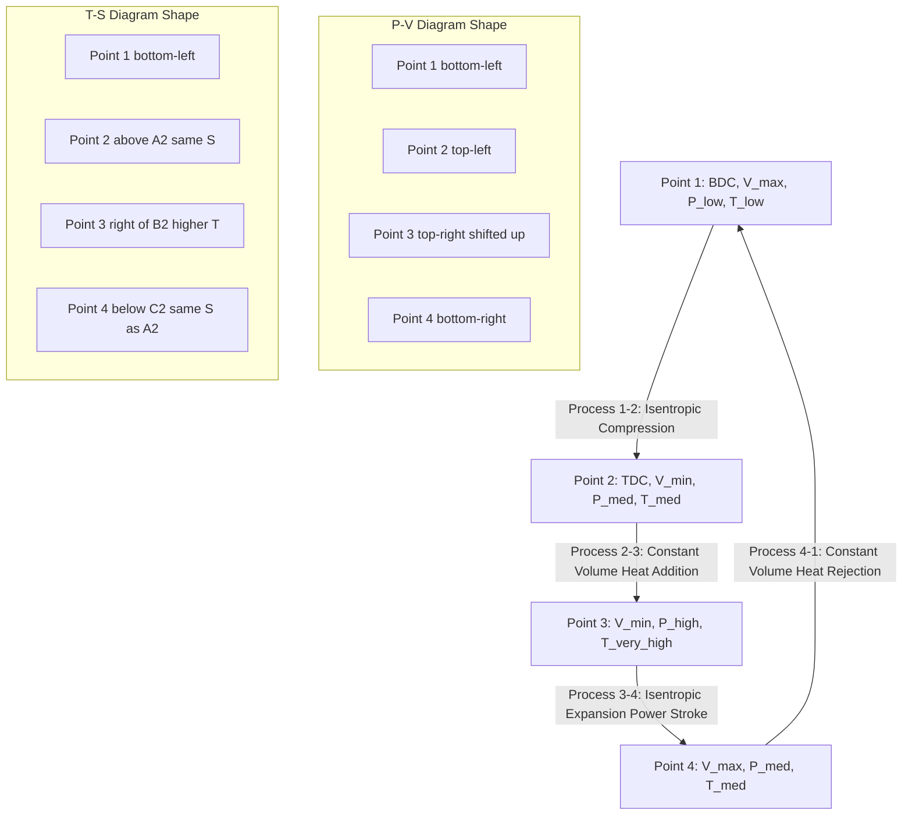
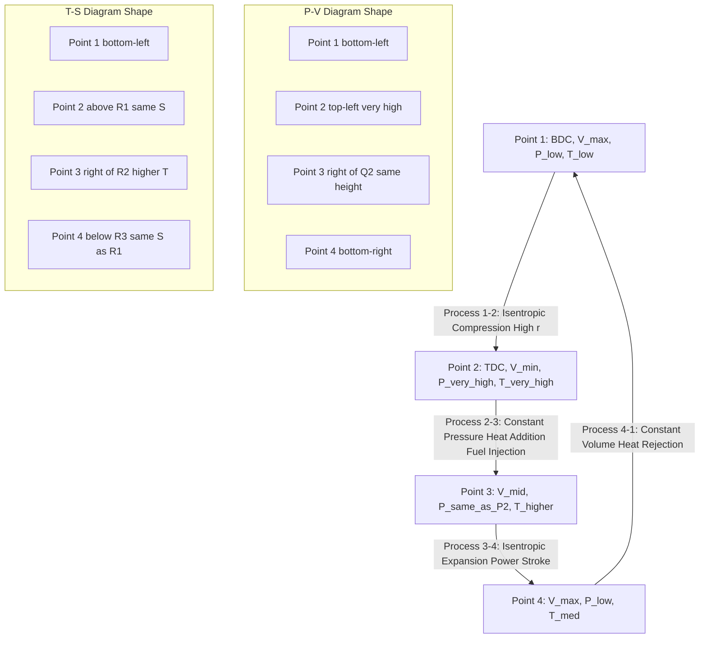
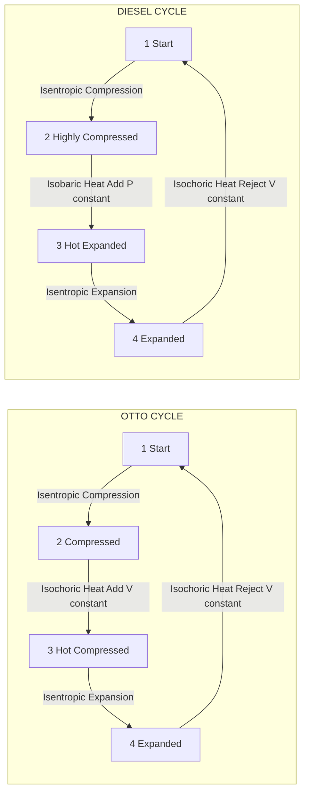
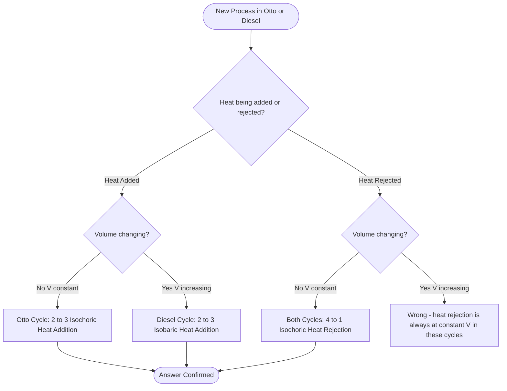
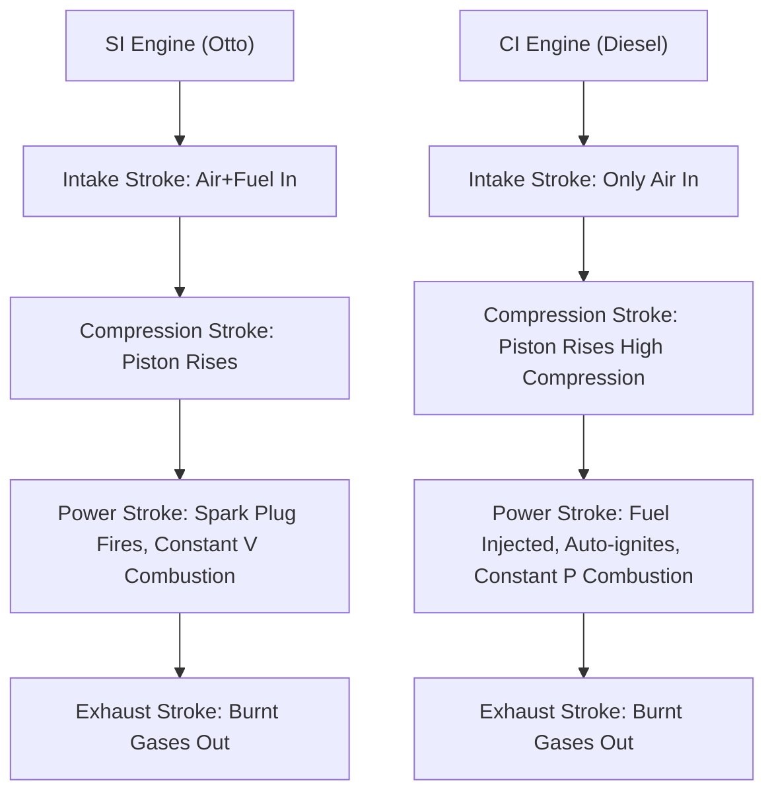

# Otto, Diesel cycles (no derivation of efficiency and problems).

<!-- SECTION_1_START -->
# 🔥 Otto & Diesel Cycles — A KTU 2024 Premier Engineering Note

> [!IMPORTANT]
> **Module Focus (GCEST104):** *General Introduction to Otto and Diesel Cycles* — Conceptual clarity, process identification, and P–V / T–S diagram understanding. **No derivations of efficiency and no numerical problems** are required from this topic in the KTU 2024 Scheme syllabus.

---

## 1.1 What Are "Air Standard Cycles"?

In real Internal Combustion (IC) engines, the working fluid inside the cylinder is a **complex, changing mixture** of air, fuel vapour, burned gases, and water vapour. To simplify analysis, mechanical engineers use a hypothetical model called an **Air-Standard Cycle**.

### 📘 Formal KTU Definition
> An **Air-Standard Cycle** is a thermodynamic cycle in which the **working fluid is assumed to be a fixed mass of air** that behaves as an **ideal gas**, and the combustion process is replaced by a **hypothetical heat addition** from an external source.

### 🧠 Intuition (The "Imagine This" Analogy)
> [!NOTE]
> **Analogy — "The Recipe-Free Kitchen":**
> Imagine you want to study *how a pressure cooker works*, but every time you cook, the ingredients (water, spices, steam) keep changing. To understand the physics of pressure and heat alone, you decide to fill the cooker with a **fixed amount of dry air**, heat it externally (like putting the cooker on an electric heater), cool it externally (like dipping it in cold water), and study the pressure–volume behaviour. **That "air-only experiment" is exactly an air-standard cycle!**

### 🔑 Standard Assumptions (Mandatory for KTU Answers)
1. The working fluid is a **fixed mass of air** (ideal gas).
2. All processes are **internally reversible**.
3. **Combustion is replaced by heat addition** ($Q_{in}$).
4. **Exhaust is replaced by heat rejection** ($Q_{out}$).
5. Specific heats ($C_p$, $C_v$) are **assumed constant**.
6. **Kinetic and potential energy changes are negligible.**

---

## 1.2 The Otto Cycle — Definition

> [!IMPORTANT]
> **📘 KTU Definition (Otto Cycle):**
> The **Otto Cycle** is the idealised air-standard cycle that approximates the working of a **Spark Ignition (SI) engine** (e.g., petrol engine, CNG car engine). It consists of **two isochoric (constant volume) heat transfer processes** and **two isentropic (reversible adiabatic) processes.**

### 🧠 Intuition (The "Bicycle Pump" Analogy)
> [!NOTE]
> **Analogy — "The Bicycle Pump Fire":**
> If you seal the nozzle of a bicycle pump and push the handle down **very fast**, the air inside gets **compressed suddenly** (no time for heat to escape — this is the *adiabatic compression*). If you imagine adding a small controlled "burst of heat" to that compressed air at the moment it's at its smallest volume (like a spark plug firing), the pressure spikes up dramatically without volume changing — that's **constant volume heat addition**. Then the hot air pushes the piston back out (*adiabatic expansion*), and finally cools back at the original large volume. **That 4-step sequence IS the Otto cycle!**

### 🌍 Where You See It in Real Life
- **Petrol / Gasoline cars** (Maruti, Honda City, Toyota Innova petrol variant)
- **Motorcycles** (Royal Enfield, KTM Duke, Bajaj Pulsar)
- **Lawn mowers**, **portable generators**
- **Aircraft piston engines** (Cessna 172)

---

## 1.3 The Diesel Cycle — Definition

> [!IMPORTANT]
> **📘 KTU Definition (Diesel Cycle):**
> The **Diesel Cycle** is the idealised air-standard cycle that approximates the working of a **Compression Ignition (CI) engine** (e.g., diesel engine, biodiesel engine). It consists of **one isobaric (constant pressure) heat addition process**, **one isentropic expansion**, and the other processes analogous to the Otto cycle.

### 🧠 Intuition (The "Slow Cooker vs Pressure Cooker" Analogy)
> [!NOTE]
> **Analogy — "The Diesel Knock":**
> In a pressure cooker, you compress the air (and steam) very, very tightly. If you then drip some fuel into that ultra-hot compressed air, **it auto-ignites** because the air is so hot it doesn't need a spark. This auto-ignition happens **slowly**, so the piston has already started moving down before all the fuel burns. The volume *keeps increasing* while the heat is being added — that is **constant pressure heat addition** (because the piston "gives way" to the rising pressure, keeping it steady). **This is the soul of the Diesel cycle!**

### 🌍 Where You See It in Real Life
- **Diesel cars, trucks, buses** (Tata trucks, Ashok Leyland buses, Mahindra Bolero)
- **Locomotives** (Indian Railways diesel engines)
- **Marine ships** (cargo vessels, naval ships)
- **Heavy machinery** (JCB, excavators, tractors, gensets)
- **Power generation plants** (large diesel generators in hospitals, data centres)

---

## 1.4 Otto vs Diesel — A Quick Glance (Big Picture)

| Feature | Otto Cycle (SI Engine) | Diesel Cycle (CI Engine) |
|---|---|---|
| **Fuel** | Petrol, CNG, LPG | Diesel, Biodiesel |
| **Ignition** | Spark plug | Auto-ignition by compression |
| **Heat Addition** | **Constant Volume (Isochoric)** | **Constant Pressure (Isobaric)** |
| **Compression Ratio** | Lower (**8 to 12**) | Higher (**14 to 25**) |
| **Thermal Efficiency** | Lower | **Higher** (thermodynamically) |
| **Weight / Size** | Lighter | Heavier (must withstand high pressure) |
| **Fuel Cost (India)** | Costlier | Cheaper (diesel subsidised historically) |
| **Sound / Vibration** | Smoother, quieter | "Diesel knock" — noisier |
| **KTU Mnemonic** | **"O" → One snap → "V"** | **"D" → Drag-out → "P"** |

> [!TIP]
> **Quick Board Trick:** Remember the **shape** of heat addition on the P–V diagram:
> * Otto: Heat addition line is **VERTICAL** (volume constant).
> * Diesel: Heat addition line is **HORIZONTAL** (pressure constant).

---

> [!VISUALIZATION CONTROL]
> **Concept:** Visual intuition of constant-volume vs constant-pressure heat addition.
> **GeoGebra / Desmos Input Equations (P-V Plot):**
> * Otto Heat Addition: $P = 1000$ at $V = 1$ (vertical line segment)
> * Diesel Heat Addition: $V = 2$ to $V = 4$ at $P = 50$ (horizontal line segment)
> **Visual Description:** On the P–V plane, Otto's heat addition is a *tall vertical jump* in pressure; Diesel's heat addition is a *long horizontal slide* to the right.

<!-- SECTION_1_END -->

<!-- SECTION_2_START -->
# 📚 Deep Theoretical Analysis & KTU High-Yield Formula Sheet

---

## 2.1 The Four Processes of the Otto Cycle

The Otto cycle operates on a **piston-cylinder arrangement**. It has **four processes**, conventionally numbered **1 → 2 → 3 → 4 → 1**.

> [!IMPORTANT]
> **KTU Board Tip:** When drawing the Otto cycle, always label the corners **1, 2, 3, 4** in the *clockwise* direction on the **P–V diagram** and the *clockwise* direction on the **T–S diagram**.

### Process 1 → 2 : **Isentropic (Reversible Adiabatic) Compression**
- **What happens:** The piston moves from **Bottom Dead Centre (BDC)** to **Top Dead Centre (TDC)**. Air is compressed rapidly.
- **Thermodynamic condition:** $PV^\gamma = \text{constant}$
- **Heat transfer:** $Q = 0$ (no time for heat exchange)
- **Entropy change:** $\Delta S = 0$
- **Temperature:** **Increases** ($T_2 > T_1$)
- **Pressure:** **Increases** ($P_2 > P_1$)
- **Volume:** **Decreases** ($V_2 < V_1$)

### Process 2 → 3 : **Isochoric (Constant Volume) Heat Addition**
- **What happens:** At TDC, the spark plug fires. Heat is added instantaneously from an external source (in the ideal model).
- **Thermodynamic condition:** $V = \text{constant}$
- **Heat transfer:** $Q_{in}$ is supplied
- **Temperature:** **Increases sharply** ($T_3 > T_2$)
- **Pressure:** **Increases sharply** ($P_3 > P_2$)
- **Volume:** **Unchanged** ($V_3 = V_2$)

> [!NOTE]
> **Why constant volume?** In an SI engine, combustion is so fast (a few milliseconds) that the piston barely moves during burning. So we assume **V is constant** during heat addition.

### Process 3 → 4 : **Isentropic (Reversible Adiabatic) Expansion** (Power Stroke)
- **What happens:** The high-pressure hot gas pushes the piston from TDC to BDC, doing **work on the piston**.
- **Thermodynamic condition:** $PV^\gamma = \text{constant}$
- **Heat transfer:** $Q = 0$
- **Temperature:** **Decreases** ($T_4 < T_3$)
- **Pressure:** **Decreases** ($P_4 < P_3$)
- **Volume:** **Increases** ($V_4 > V_3$)

### Process 4 → 1 : **Isochoric (Constant Volume) Heat Rejection**
- **What happens:** At BDC, the exhaust valve opens and heat is rejected to bring the air back to its initial state.
- **Thermodynamic condition:** $V = \text{constant}$
- **Heat transfer:** $Q_{out}$ is rejected
- **Temperature:** **Decreases** ($T_1 < T_4$)
- **Pressure:** **Decreases** ($P_1 < P_4$)
- **Volume:** **Unchanged** ($V_1 = V_4$)

> [!TIP]
> **Quick mnemonic for Otto process order:** **"C C E E"** → **C**ompression (iso), **C**onstant V heat add, **E**xpansion (iso), **E**xhaust heat rej. *(Try saying "CCEE" out loud!)*

---

## 2.2 The Four Processes of the Diesel Cycle

The Diesel cycle also has **four processes**, but the order of heat transfer differs.

> [!IMPORTANT]
> **KTU Board Tip:** The Diesel cycle has **TWO isentropic** processes (1→2 and 3→4) and the heat processes are split as **isobaric addition** (2→3) and **isochoric rejection** (4→1).

### Process 1 → 2 : **Isentropic Compression**
- **Same as Otto:** $PV^\gamma = \text{constant}$, $Q = 0$, $\Delta S = 0$.
- **But the compression ratio is HIGHER** (typically 14–25 in real CI engines).
- This is precisely *why* the air temperature at the end of compression ($T_2$) is so high — **hot enough to ignite diesel fuel spontaneously**.

### Process 2 → 3 : **Isobaric (Constant Pressure) Heat Addition**
- **What happens:** At TDC, fuel is injected. Combustion is slower than in SI engines, so the piston has already begun moving down. Pressure remains constant.
- **Thermodynamic condition:** $P = \text{constant}$
- **Heat transfer:** $Q_{in}$ is supplied
- **Temperature:** **Increases** ($T_3 > T_2$)
- **Volume:** **Increases** ($V_3 > V_2$)
- **Pressure:** **Unchanged** ($P_3 = P_2$)

> [!NOTE]
> **Why constant pressure?** In a CI engine, fuel injection is gradual. As the gas heats up, the piston "retreats" (moves down) to keep the pressure steady. So we model it as $P = \text{constant}$.

### Process 3 → 4 : **Isentropic Expansion** (Power Stroke)
- **Same as Otto:** $PV^\gamma = \text{constant}$, $Q = 0$.
- Piston is pushed from maximum volume back to BDC.

### Process 4 → 1 : **Isochoric (Constant Volume) Heat Rejection**
- **Same as Otto:** $V = \text{constant}$, heat $Q_{out}$ is rejected.

> [!TIP]
> **Quick mnemonic for Diesel:** **"C P E E"** → **C**ompression (iso), constant **P**ressure heat add, **E**xpansion (iso), **E**xhaust heat rej. *("CP-EE" = "Cappuccino"! ☕)*

---

## 2.3 The Differences Tabulated (KTU High-Yield Comparison Table)

| Parameter | **Otto Cycle** | **Diesel Cycle** |
|---|---|---|
| **Heat Addition Process** | **Isochoric** (Constant Volume) | **Isobaric** (Constant Pressure) |
| **Heat Rejection Process** | Isochoric (Constant Volume) | Isochoric (Constant Volume) |
| **Other Two Processes** | Two Isentropic | Two Isentropic |
| **Typical Compression Ratio ($r$)** | **8 to 12** | **14 to 25** |
| **Peak Pressure Location** | At end of heat addition (Point 3) | At end of compression (Point 2) |
| **Peak Temperature Location** | At end of heat addition (Point 3) | At end of heat addition (Point 3) |
| **Net Work** | Area enclosed by P–V curve | Area enclosed by P–V curve |
| **Thermal Efficiency** | $\eta_{otto}$ (depends on $r$ and $\gamma$) | $\eta_{diesel}$ (depends on $r$, $\gamma$, and cut-off ratio $\rho$) |
| **Real Engine Approximation** | Petrol / SI engine | Diesel / CI engine |

---

## 2.4 📋 KTU High-Yield Formula Sheet (No Derivation Required)

> [!IMPORTANT]
> **As per the GCEST104 syllabus instruction: "No derivation of efficiency and problems"** — so the following formulas are for **conceptual familiarity and diagram understanding only**, not for solving numericals in the KTU exam.

### General Gas Relations (Universal to Both Cycles)

| Relation | Formula | Where It Applies |
|---|---|---|
| Ideal Gas Law | $PV = mRT$ | All four processes |
| Isentropic Relation (P–V) | $PV^{\gamma} = \text{constant}$ | Processes 1→2 and 3→4 |
| Isentropic Relation (T–V) | $TV^{\gamma-1} = \text{constant}$ | Processes 1→2 and 3→4 |
| Isentropic Relation (T–P) | $TP^{\frac{1-\gamma}{\gamma}} = \text{constant}$ | Processes 1→2 and 3→4 |
| Isochoric Process | $\frac{P}{T} = \text{constant}$ | Otto 2→3 and 4→1; Diesel 4→1 |
| Isobaric Process | $\frac{V}{T} = \text{constant}$ | Diesel 2→3 only |
| Heat at Constant Volume | $Q_V = m \, C_v \, \Delta T$ | Otto 2→3 (in), Otto 4→1 (out) |
| Heat at Constant Pressure | $Q_P = m \, C_p \, \Delta T$ | Diesel 2→3 (in) |

### Key Ratios Used in Cycle Description

| Ratio | Definition | Used In |
|---|---|---|
| **Compression Ratio ($r$)** | $r = \dfrac{V_1}{V_2} = \dfrac{V_4}{V_3}$ | Both Otto and Diesel |
| **Cut-off Ratio ($\rho$)** | $\rho = \dfrac{V_3}{V_2}$ | **Diesel only** |
| **Expansion Ratio ($r_e$)** | $r_e = \dfrac{V_4}{V_3}$ | Diesel only (note: $r_e < r$) |
| **Ratio of Specific Heats ($\gamma$)** | $\gamma = \dfrac{C_p}{C_v}$ | Both |
| For Air (constant value) | $\gamma = 1.4$ | Standard assumption |

### Efficiency Formulas (Reference Only — Not to be Derived in Exam)

| Cycle | Efficiency Expression |
|---|---|
| **Otto** | $\eta_{otto} = 1 - \dfrac{1}{r^{\gamma-1}}$ |
| **Diesel** | $\eta_{diesel} = 1 - \dfrac{1}{r^{\gamma-1}} \cdot \dfrac{\rho^{\gamma} - 1}{\gamma (\rho - 1)}$ |

> [!NOTE]
> **KTU Insight:** Both efficiencies depend on **compression ratio $r$** and **$\gamma$**. The Diesel efficiency additionally depends on the **cut-off ratio $\rho$**. For the *same* $r$ and $\gamma$, **Otto > Diesel**, but Diesels operate at *much higher* $r$, so in practice Diesels are more efficient.

---

## 2.5 Real-World Engineering Significance

### Where Otto Cycle Concepts Are Used
- **Automotive design:** Engineers simulate petrol engines using Otto cycle to predict performance.
- **SI engine research:** Universities (IIT Madras, NIT Calicut) use Otto cycle theory in their combustion labs.
- **Two-wheeler industry:** Honda, Hero, TVS use Otto cycle principles.
- **Air-standard analysis:** Foundation for understanding the **Lenoir cycle**, **Atkinson cycle**, and **Miller cycle**.

### Where Diesel Cycle Concepts Are Used
- **Heavy vehicle industry:** TATA, Ashok Leyland, Mahindra.
- **Marine propulsion:** Container ships use massive 2-stroke diesel engines.
- **Locomotive engines:** Indian Railways WDM-class diesel locomotives.
- **Standby power:** Hospitals, airports, data centres use diesel gensets.
- **Combined cycle power plants:** The **Brayton cycle (gas turbine)** is also an air-standard cycle, building on the same assumptions.

> [!TIP]
> **KTU Project Idea:** Students can build a small **Stirling engine demo model** (also an air-standard cycle!) to visualise the Otto cycle in their workshop.

<!-- SECTION_2_END -->

<!-- SECTION_3_START -->
# 🛠️ Step-by-Step Process Analysis & Implementation

> [!IMPORTANT]
> **KTU Note:** Since the syllabus explicitly states **"no derivation of efficiency and problems"**, this section focuses on the **detailed, step-by-step physical and thermodynamic description** of each process. This is the **bread-and-butter** content that examiners look for in Part A and Part B answers.

---

## 3.1 Otto Cycle — Exhaustive Step-by-Step Process Description

### 🔧 Setup (Cylinder Schematic)
A standard Otto cycle operates in a **piston-cylinder device** with:
* **Two valves** — one *intake* (air in) and one *exhaust* (gas out).
* **One spark plug** at the cylinder head.
* A **movable piston** connected to a **crankshaft**.

### 🟦 Process 1 → 2 : Isentropic Compression

| Step | Description |
|---|---|
| **Step 1** | The piston starts at **Bottom Dead Centre (BDC)**, which is **Point 1** on the P–V diagram. The cylinder volume is maximum ($V_1$). |
| **Step 2** | The intake valve closes, and the piston starts moving **upward** toward TDC. |
| **Step 3** | The compression is so **rapid** that there is **no time for heat to escape** to the cylinder walls. |
| **Step 4** | This is modelled as a **reversible adiabatic (isentropic)** process. |
| **Step 5** | The piston reaches **Top Dead Centre (TDC)**, which is **Point 2** on the P–V diagram. The volume is minimum ($V_2$). |
| **Step 6** | During this process: $P \uparrow$, $T \uparrow$, $V \downarrow$, $Q = 0$, $\Delta S = 0$. |

Mathematical condition (for understanding, **not derivation**):

$$PV^{\gamma} = \text{constant} \quad \text{throughout 1→2}$$

### 🟧 Process 2 → 3 : Constant Volume Heat Addition

| Step | Description |
|---|---|
| **Step 1** | At TDC (**Point 2**), the piston is momentarily stationary. |
| **Step 2** | The **spark plug fires**, igniting the fuel-air mixture. |
| **Step 3** | In the ideal model, an **external heat source** instantaneously adds $Q_{in}$. |
| **Step 4** | Combustion is so fast that the piston **does not move** during heat addition. |
| **Step 5** | Volume is constant, but **pressure and temperature shoot up** to **Point 3**. |
| **Step 6** | During this process: $V = \text{constant}$, $P \uparrow \uparrow$, $T \uparrow \uparrow$, $Q_{in}$ is added. |

Mathematical condition:

$$\frac{P_2}{T_2} = \frac{P_3}{T_3} \quad \text{(since } V_3 = V_2 \text{)}$$

### 🟥 Process 3 → 4 : Isentropic Expansion (Power Stroke)

| Step | Description |
|---|---|
| **Step 1** | The high-pressure, high-temperature gas at **Point 3** exerts force on the piston. |
| **Step 2** | The piston is pushed **downward** from TDC to BDC. |
| **Step 3** | The gas does **positive work** on the piston — this is the **power stroke** that drives the crankshaft. |
| **Step 4** | Expansion is rapid, so **no heat escapes**. |
| **Step 5** | The piston reaches **Point 4** at BDC, with volume $V_4 = V_1$. |
| **Step 6** | During this process: $P \downarrow$, $T \downarrow$, $V \uparrow$, $Q = 0$, $\Delta S = 0$. |

Mathematical condition:

$$PV^{\gamma} = \text{constant} \quad \text{throughout 3→4}$$

### 🟩 Process 4 → 1 : Constant Volume Heat Rejection

| Step | Description |
|---|---|
| **Step 1** | At BDC (**Point 4**), the **exhaust valve opens**. |
| **Step 2** | Heat $Q_{out}$ is rejected at constant volume to return the system to its initial state. |
| **Step 3** | Pressure and temperature drop back to the original values at **Point 1**. |
| **Step 4** | During this process: $V = \text{constant}$, $P \downarrow$, $T \downarrow$, $Q_{out}$ is rejected. |

Mathematical condition:

$$\frac{P_4}{T_4} = \frac{P_1}{T_1} \quad \text{(since } V_1 = V_4 \text{)}$$

---

## 3.2 Diesel Cycle — Exhaustive Step-by-Step Process Description

### 🔧 Setup (Cylinder Schematic)
A Diesel cycle operates in a similar piston-cylinder, but with key differences:
* **No spark plug** — fuel is ignited purely by **auto-ignition** from hot compressed air.
* **Fuel injector** at the cylinder head instead of a carburettor.
* **Higher compression ratio** (engine block is built more robustly).

### 🟦 Process 1 → 2 : Isentropic Compression

| Step | Description |
|---|---|
| **Step 1** | Piston at **BDC (Point 1)**. Intake valve closes after air (not fuel) is drawn in. |
| **Step 2** | Piston moves up to **TDC (Point 2)**. Compression ratio is **14–25** (much higher than Otto). |
| **Step 3** | No heat transfer ($Q = 0$). |
| **Step 4** | The air temperature at **Point 2** reaches about **800–900 K** — high enough to ignite diesel on its own. |
| **Step 5** | During this process: $P \uparrow \uparrow \uparrow$, $T \uparrow \uparrow \uparrow$, $V \downarrow \downarrow \downarrow$, $Q = 0$. |

> [!IMPORTANT]
> **This is THE most important process in the Diesel cycle** — without this high compression and resulting high temperature, auto-ignition is impossible. This is the *thermodynamic genius* of Rudolf Diesel's invention.

### 🟧 Process 2 → 3 : Constant Pressure Heat Addition

| Step | Description |
|---|---|
| **Step 1** | At TDC (**Point 2**), fuel is sprayed into the hot compressed air via the **fuel injector**. |
| **Step 2** | The fuel **auto-ignites** on contact with the hot air. |
| **Step 3** | Combustion is **gradual**, so the piston is **already moving down** while heat is being added. |
| **Step 4** | The piston's downward motion **compensates** for the pressure rise, keeping **pressure constant**. |
| **Step 5** | Volume increases from $V_2$ to $V_3$, where $\rho = \dfrac{V_3}{V_2}$ is the **cut-off ratio**. |
| **Step 6** | During this process: $P = \text{constant}$, $T \uparrow$, $V \uparrow$, $Q_{in}$ is added. |

Mathematical condition:

$$\frac{V_2}{T_2} = \frac{V_3}{T_3} \quad \text{(since } P_3 = P_2 \text{)}$$

### 🟥 Process 3 → 4 : Isentropic Expansion (Power Stroke)

| Step | Description |
|---|---|
| **Step 1** | At **Point 3**, fuel injection stops. The gas continues to expand. |
| **Step 2** | Piston moves from a position somewhere in the middle of the cylinder down to **BDC (Point 4)**. |
| **Step 3** | The gas does work on the piston. |
| **Step 4** | No heat transfer ($Q = 0$). |
| **Step 5** | During this process: $P \downarrow$, $T \downarrow$, $V \uparrow$, $Q = 0$. |

### 🟩 Process 4 → 1 : Constant Volume Heat Rejection

| Step | Description |
|---|---|
| **Step 1** | At BDC (**Point 4**), exhaust valve opens. |
| **Step 2** | Heat $Q_{out}$ is rejected at constant volume. |
| **Step 3** | System returns to **Point 1** (initial state). |

---

## 3.3 Symbolic State-Point Summary Table (Very Useful for Board Answers)

> [!TIP]
> **KTU Board Tip:** This state-point table is exactly what examiners expect to see in a 14-mark question.

| State Point | Otto Cycle | Diesel Cycle |
|---|---|---|
| **Point 1** | Start of compression: $P_1$, $T_1$, $V_1 = V_{max}$ | Start of compression: $P_1$, $T_1$, $V_1 = V_{max}$ |
| **Point 2** | End of compression: $P_2$, $T_2$, $V_2 = V_{min}$ | End of compression: $P_2$, $T_2$, $V_2 = V_{min}$ *(very high T)* |
| **Point 3** | End of heat addition: $P_3$, $T_3$, $V_3 = V_2$ | End of heat addition: $P_3 = P_2$, $T_3$, $V_3$ |
| **Point 4** | End of expansion: $P_4$, $T_4$, $V_4 = V_1$ | End of expansion: $P_4$, $T_4$, $V_4 = V_1$ |

---

## 3.4 Python Implementation — Conceptual Cycle Plot (For Curious Students)

> [!NOTE]
> **For KTU context only — not part of syllabus, but useful for engineering curiosity and project work.**

```python
import numpy as np
import matplotlib.pyplot as plt

# ---- OTTO CYCLE on P-V diagram ----
V_otto = np.array([1.0, 0.2, 0.2, 1.0, 1.0])   # Volumes (arbitrary units)
P_otto = np.array([1.0, 8.0, 16.0, 2.0, 1.0])   # Pressures (arbitrary units)

# ---- DIESEL CYCLE on P-V diagram ----
V_diesel = np.array([1.0, 0.1, 0.4, 1.0, 1.0])  # Volumes (arbitrary units)
P_diesel = np.array([1.0, 25.0, 25.0, 2.5, 1.0]) # Pressures (arbitrary units)

fig, axes = plt.subplots(1, 2, figsize=(14, 5))

# Otto cycle plot
axes[0].plot(V_otto, P_otto, 'b-o', linewidth=2, markersize=8)
axes[0].set_title("Otto Cycle (SI Engine) — P-V Diagram", fontsize=13, fontweight='bold')
axes[0].set_xlabel("Volume V")
axes[0].set_ylabel("Pressure P")
axes[0].grid(True, linestyle='--', alpha=0.6)
for i, label in enumerate(['1', '2', '3', '4', '1']):
    axes[0].annotate(label, (V_otto[i], P_otto[i]),
                     textcoords="offset points", xytext=(8, 8), fontsize=11, fontweight='bold')

# Diesel cycle plot
axes[1].plot(V_diesel, P_diesel, 'r-s', linewidth=2, markersize=8)
axes[1].set_title("Diesel Cycle (CI Engine) — P-V Diagram", fontsize=13, fontweight='bold')
axes[1].set_xlabel("Volume V")
axes[1].set_ylabel("Pressure P")
axes[1].grid(True, linestyle='--', alpha=0.6)
for i, label in enumerate(['1', '2', '3', '4', '1']):
    axes[1].annotate(label, (V_diesel[i], P_diesel[i]),
                     textcoords="offset points", xytext=(8, 8), fontsize=11, fontweight='bold')

plt.tight_layout()
plt.savefig("otto_vs_diesel_pv.png", dpi=120)
plt.show()
```

> The output shows the **classic Otto cycle (vertical heat addition)** and the **Diesel cycle (horizontal heat addition)** on P–V coordinates — exactly the diagrams students must draw in exams.

---

## 3.5 Why These Cycles Matter — A Humanities/Management Connection

| Real-World Engineering Framework | Mapping to Air-Standard Cycle Logic |
|---|---|
| **Quality Management (ISO 9001)** | Cycle of *Plan → Execute → Check → Act* is a closed loop, just like the Otto/Diesel cycle returning to Point 1. |
| **Project Management (PMBOK)** | Iterative cycles of design → build → test → refine = thermodynamic cycle of compression → heat add → expansion → reject. |
| **Software Engineering (Agile)** | Sprint cycles mirror the closed thermodynamic loop. |
| **Industrial Engineering** | Lean manufacturing uses cycle-time analysis directly from the **T–S diagram** of engines. |

<!-- SECTION_3_END -->

<!-- SECTION_4_START -->
# 📐 Structural Diagrams & Schematics (Mermaid)

> [!IMPORTANT]
> **KTU Board Tip:** Every 14-mark Otto/Diesel question **demands** a P–V diagram and a T–S diagram. The Mermaid schematics below are conceptual data-flow representations of the same processes — they help you remember the *sequence* and *which line is which* on the physical diagrams.

---

## 4.1 Otto Cycle — P–V and T–S Schematic Flow



---

## 4.2 Diesel Cycle — P–V and T–S Schematic Flow



---

## 4.3 Combined Otto vs Diesel — Process Comparison Topology



---

## 4.4 Process-By-Process Visual Decision Map (For Exam Recall)



---

## 4.5 Conceptual Diagram — Stroke Sequencing in SI vs CI Engines



---

> [!NOTE]
> **🎨 Diagram Fallback Note:** Mermaid cannot draw continuous curves like true isentropic P–V arcs. In the **actual KTU answer sheet**, you must draw smooth, curved isentropics connecting the labelled corners (1, 2, 3, 4) using a pencil/ruler. The Mermaid flow diagrams above are only for **process-recall during revision**.

<!-- SECTION_4_END -->

<!-- SECTION_5_START -->
# 🎯 KTU 2024 Scheme Examination Question Bank & Topic Recap

---

## 📘 PART A — Short Answer Questions (3 Marks Each)

> **Cognitive Levels:** Remember / Understand
> **Syllabus Mapping:** CO1 — *Understand the fundamental thermodynamic cycles used in IC engines.*

---

### **Q1. [KTU University Exam - July 2024]**
**Define the Otto cycle and list its four processes. State the assumption that replaces the actual combustion process in the air-standard analysis.**

**Model Answer (3 Marks):**

> The **Otto cycle** is the idealised air-standard thermodynamic cycle that approximates the working of a **Spark Ignition (SI) engine**. *[1 Mark]*

The four processes are:
1. **Process 1 → 2:** Isentropic (reversible adiabatic) **compression**.
2. **Process 2 → 3:** **Isochoric (constant volume)** heat addition.
3. **Process 3 → 4:** Isentropic (reversible adiabatic) **expansion** (power stroke).
4. **Process 4 → 1:** **Isochoric (constant volume)** heat rejection. *[1 Mark]*

**Assumption replacing combustion:** The actual chemical combustion of fuel inside the cylinder is replaced by a **hypothetical heat transfer from an external source at constant volume**, since the combustion is assumed to be instantaneous and the piston does not move during this period. *[1 Mark]*

---

### **Q2. [KTU University Exam - Dec 2023]**
**Distinguish between Otto and Diesel cycles with respect to (a) the type of heat addition process and (b) the typical range of compression ratio used.**

**Model Answer (3 Marks):**

| S.No. | Parameter | **Otto Cycle** | **Diesel Cycle** |
|---|---|---|---|
| (a) | Heat Addition Process | **Constant Volume (Isochoric)** | **Constant Pressure (Isobaric)** |
| (b) | Compression Ratio ($r$) | **8 to 12** (lower) | **14 to 25** (higher) |

*[2 Marks for heat addition distinction; 1 Mark for compression ratio range]*

**Additional one-line reason:** *[Often asked for 1 extra mark]*
> Otto engines use a spark plug for ignition (so lower compression suffices), while Diesel engines rely on **auto-ignition** of fuel due to high air temperature from very high compression, hence the higher compression ratio.

---

## 📗 PART B — Long Answer Questions (14 Marks Each)
### *(With KTU-style Internal Choice: Attempt either A or B)*

---

### **Question 3A. [KTU University Exam - July 2024 | Module 1 | 14 Marks]**

> **With the help of a neat P–V and T–S diagram, describe the Otto cycle. State the four processes and the air-standard assumptions used.**

**Distribution:** CO1 — Understand | RBT Level: Understand / Apply

**Model Solution:**

#### (a) Air-Standard Assumptions Used — 4 Marks

The following assumptions are made to convert the complex real engine into a simple idealised Otto cycle:

1. The working fluid is a **fixed mass of air** which behaves as an **ideal gas** throughout the cycle. *[1 Mark]*
2. All processes are **internally reversible**. *[1 Mark]*
3. The **combustion process is replaced by heat addition** from an external source. *[1 Mark]*
4. The **exhaust process is replaced by heat rejection** to the surroundings. *[1 Mark]*

#### (b) P–V and T–S Diagrams — 4 Marks

*Diagrams should be drawn neatly on the answer sheet with the following features:*

**P–V Diagram (2 Marks):**
- X-axis: Volume ($V$); Y-axis: Pressure ($P$).
- Four points labelled **1, 2, 3, 4** in the *clockwise* direction.
- Process 1→2: A **curved isentropic** line rising from bottom-right to top-left.
- Process 2→3: A **vertical line** (constant volume) shooting upward.
- Process 3→4: A **curved isentropic** line falling from top-left to bottom-right.
- Process 4→1: A **vertical line** (constant volume) going downward.

**T–S Diagram (2 Marks):**
- X-axis: Entropy ($S$); Y-axis: Temperature ($T$).
- Points 1, 2, 3, 4 in the *clockwise* direction.
- Process 1→2: **Vertical line** (isentropic, $S$ constant).
- Process 2→3: A **curve rising to the right** (heat addition at constant $V$).
- Process 3→4: **Vertical line** (isentropic, $S$ constant).
- Process 4→1: A **curve falling to the left** (heat rejection at constant $V$).

#### (c) Description of the Four Processes — 6 Marks

**[Process 1→2: Isentropic Compression — 2 Marks]**
The piston moves from **Bottom Dead Centre (BDC)** to **Top Dead Centre (TDC)**. The compression is so rapid that no heat escapes to the cylinder walls. The pressure and temperature of air **rise sharply** while volume **decreases**. Mathematical condition: $PV^{\gamma} = \text{constant}$. State values: $V_1 \rightarrow V_2$, $P_1 \rightarrow P_2$, $T_1 \rightarrow T_2$, with $Q = 0$ and $\Delta S = 0$.

**[Process 2→3: Constant Volume Heat Addition — 2 Marks]**
At TDC, the **spark plug fires** in the actual SI engine. In the idealised model, heat $Q_{in}$ is added from an external source. Combustion is **instantaneous**, so the piston does not move — volume is **constant**. Pressure and temperature rise **sharply**. Condition: $\dfrac{P_2}{T_2} = \dfrac{P_3}{T_3}$ with $V_3 = V_2$.

**[Process 3→4: Isentropic Expansion (Power Stroke) — 1 Mark]**
The high-pressure hot gas pushes the piston from TDC back to BDC, doing useful work on the crankshaft. Volume increases, pressure and temperature fall. Condition: $PV^{\gamma} = \text{constant}$, $Q = 0$.

**[Process 4→1: Constant Volume Heat Rejection — 1 Mark]**
At BDC, the **exhaust valve opens**. Heat $Q_{out}$ is rejected at constant volume to bring the system back to its initial state. Condition: $\dfrac{P_4}{T_4} = \dfrac{P_1}{T_1}$ with $V_1 = V_4$.

---

### **Question 3B. [KTU University Exam - July 2024 | Module 1 | 14 Marks]**

> **With the help of a neat P–V and T–S diagram, describe the Diesel cycle. State the four processes and the air-standard assumptions used.**

**Distribution:** CO1 — Understand | RBT Level: Understand / Apply

**Model Solution:**

#### (a) Air-Standard Assumptions — 4 Marks
*(Same 4 assumptions as the Otto cycle, plus an explicit mention of constant-pressure heat addition.)*
1. Working fluid is a **fixed mass of ideal air**. *[1 Mark]*
2. All processes are **internally reversible**. *[1 Mark]*
3. **Combustion is replaced by constant-pressure heat addition** $Q_{in}$ (since fuel injection is gradual). *[1 Mark]*
4. **Exhaust is replaced by constant-volume heat rejection** $Q_{out}$. *[1 Mark]*

#### (b) P–V and T–S Diagrams — 4 Marks

**P–V Diagram (2 Marks):**
- Points **1, 2, 3, 4** in clockwise direction.
- Process 1→2: Curved isentropic line rising steeply (since $r$ is high).
- Process 2→3: **Horizontal line** (constant pressure) — this is the key visual difference from Otto.
- Process 3→4: Curved isentropic line falling.
- Process 4→1: Vertical line (constant volume).

**T–S Diagram (2 Marks):**
- Process 1→2: Vertical line.
- Process 2→3: A **curve rising to the right** (heat addition at constant $P$).
- Process 3→4: Vertical line.
- Process 4→1: Curve falling to the left.

#### (c) Description of the Four Processes — 6 Marks

**[Process 1→2: Isentropic Compression — 2 Marks]**
Piston moves from BDC to TDC. **Compression ratio is very high (14 to 25)**, much higher than Otto. The air temperature at the end of compression ($T_2$) reaches around **800–900 K**, which is high enough to **auto-ignite** the diesel fuel on injection. Condition: $PV^{\gamma} = \text{constant}$, $Q = 0$.

**[Stating the auto-ignition role: 1 Mark]**
**[Writing the high-temperature state value: 1 Mark]**

**[Process 2→3: Constant Pressure Heat Addition — 2 Marks]**
At TDC, fuel is **injected** into the hot compressed air. Auto-ignition occurs. Since fuel injection is **gradual** and the piston is **already moving down**, the volume increases while pressure is maintained **constant**. Condition: $\dfrac{V_2}{T_2} = \dfrac{V_3}{T_3}$ with $P_3 = P_2$. The ratio $\rho = \dfrac{V_3}{V_2}$ is the **cut-off ratio**.

**[Process 3→4: Isentropic Expansion — 1 Mark]**
After fuel injection stops, the gas continues to expand and push the piston. Condition: $PV^{\gamma} = \text{constant}$, $Q = 0$.

**[Process 4→1: Constant Volume Heat Rejection — 1 Mark]**
Exhaust valve opens; heat is rejected at constant $V$ to return to the initial state. Condition: $\dfrac{P_4}{T_4} = \dfrac{P_1}{T_1}$.

---

> [!WARNING]
> **🚨 KTU Examiner's Valuation Warning — Common Pitfalls:**
> 1. **Missing the P–V diagram or T–S diagram** → 2 to 3 marks deducted immediately. Always draw **both** diagrams clearly.
> 2. **Wrong direction of the cycle** — Some students draw the Otto/Diesel cycle in the *anticlockwise* direction, which represents a **refrigeration/heat pump cycle**, not an engine cycle. Use **clockwise** for power cycles. *[1 Mark lost]*
> 3. **Confusing Otto and Diesel heat addition shapes** — Drawing a vertical line for Diesel or a horizontal line for Otto. Remember: **Otto = Vertical; Diesel = Horizontal.** *[1 Mark lost]*
> 4. **Forgetting to label the axes** ($P$, $V$, $T$, $S$) and the state points (**1, 2, 3, 4**). *[0.5 to 1 Mark lost]*
> 5. **Not stating the air-standard assumptions** — Examiners expect at least 3 to 4 assumptions explicitly listed. *[1 to 2 Marks lost]*
> 6. **Confusing "isochoric" with "isobaric"** — *Isochoric* means constant **volume**; *isobaric* means constant **pressure**. *Iso-cho-ric* ↔ Volume (like "v" in volume); *Iso-bar-ic* ↔ bar (pressure unit). *[1 Mark lost]*
> 7. **Writing "compression ratio = $V_2/V_1$"** instead of $V_1/V_2$. It is always **larger volume ÷ smaller volume**, so $r = V_1/V_2$. *[0.5 Mark lost]*

---

## 📌 Topic Recap & Important Things to Remember

> [!IMPORTANT]
> **🧠 Rapid Revision Checklist — Print this and stick it on your study wall!**

### 🔑 Core Definitions
- **Air-Standard Cycle:** A hypothetical cycle where the working fluid is a fixed mass of ideal air, and combustion is replaced by external heat addition.
- **Otto Cycle:** Air-standard cycle for **SI (petrol) engines** with **constant volume** heat addition.
- **Diesel Cycle:** Air-standard cycle for **CI (diesel) engines** with **constant pressure** heat addition.

### 🔁 Process Sequences
- **Otto Order:** Isentropic Compression → Constant V Heat Add → Isentropic Expansion → Constant V Heat Reject.
- **Diesel Order:** Isentropic Compression → Constant P Heat Add → Isentropic Expansion → Constant V Heat Reject.
- **Memory trick:** Otto = "**C C E E**" ; Diesel = "**C P E E**" (only the second letter differs!).

### 📐 Diagrams (Must Memorise Both Shapes)
- **P–V diagram:** Otto has a **vertical** heat addition line; Diesel has a **horizontal** heat addition line. Both are traversed **clockwise**.
- **T–S diagram:** Both cycles have **two vertical** isentropic lines and **two curved** heat transfer lines. Always clockwise.

### 🔢 Key Ratios and Constants
- Compression ratio: $r = \dfrac{V_1}{V_2} = \dfrac{V_4}{V_3}$ (typical: Otto 8–12, Diesel 14–25).
- Cut-off ratio (Diesel only): $\rho = \dfrac{V_3}{V_2}$.
- Ratio of specific heats for air: $\gamma = 1.4$.

### ⚙️ Real-World Mapping
- **Otto Cycle ↔ SI Engine ↔ Petrol Car**
- **Diesel Cycle ↔ CI Engine ↔ Diesel Truck / Bus / Locomotive / Ship**

### 🚫 What KTU Does NOT Ask (As Per This Module)
- ❌ No **derivation** of thermal efficiency.
- ❌ No **numerical problems** on efficiency.
- ✅ Only **descriptive**, **diagram-based**, and **conceptual** questions.

### ✅ Toppers' Strategy for 14-Mark Answers
1. **Start with a small intro** defining the cycle (1–2 lines).
2. **List the air-standard assumptions** (4 bullets, ~4 lines).
3. **Draw P–V and T–S diagrams** with proper labels.
4. **Describe all 4 processes in order** with state values.
5. **Close with a 2-line conclusion** comparing with the real engine.

<!-- SECTION_5_END -->
