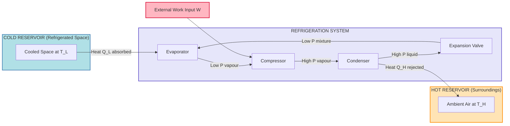
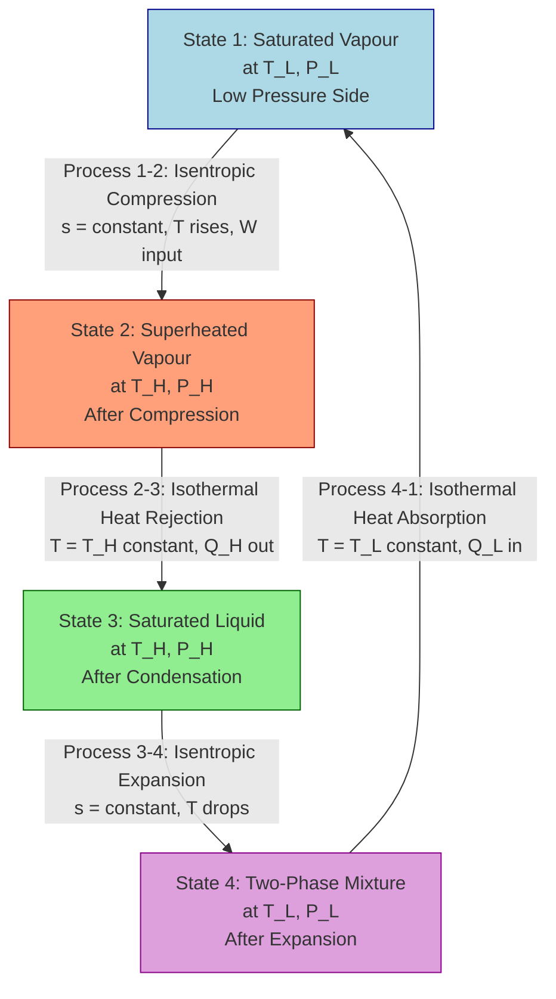
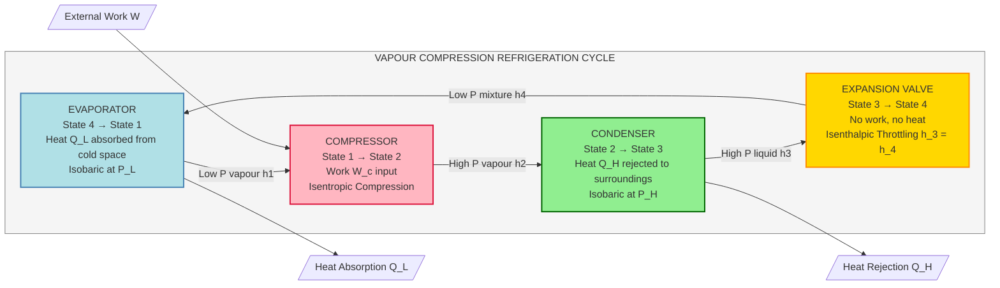
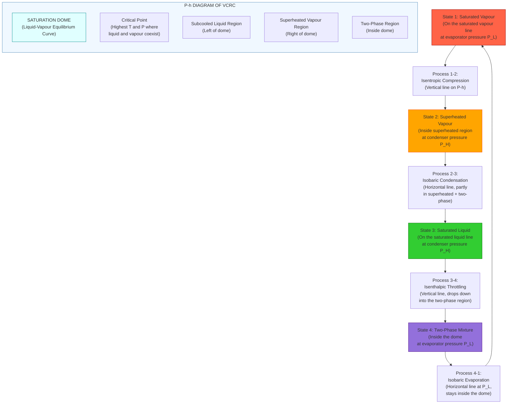
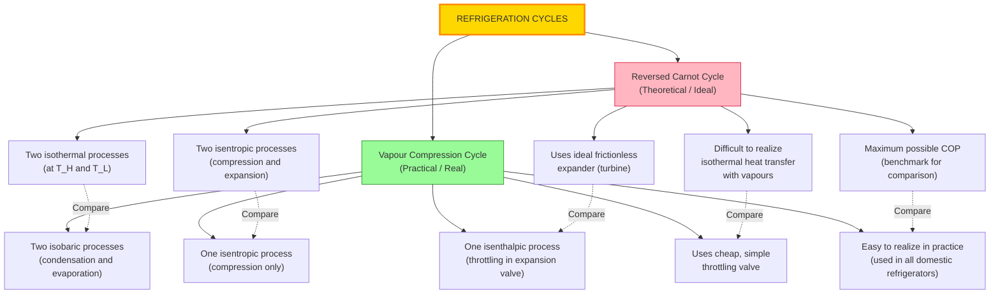

# Refrigeration: Unit of refrigeration, reversed Carnot cycle, COP, vapour compression cycle (only description and no problems);

<!-- SECTION_1_START -->
# REFRIGERATION: Unit of Refrigeration, Reversed Carnot Cycle, COP, and Vapour Compression Cycle

## 1.1 Core Technical Definition

> [!NOTE]
> **Refrigeration** is defined as the process of **removing heat from a low-temperature body (cold space)** and transferring it to a higher-temperature body (surroundings/heat sink) with the help of an external work input (work supplied by a compressor or any external agency). The device used to accomplish this continuous heat pumping is called a **Refrigerator**.

In the **KTU 2024 Scheme (GCEST104)** terminology, refrigeration is classified under the domain of **Production Engineering / Thermodynamics** where the working substance is called the **refrigerant**. The branch dealing with the production and maintenance of temperatures below that of the surroundings is called **Refrigeration Engineering**.

### Conceptual Analogy / Intuition

> [!IMPORTANT]
> **Real-World Analogy (The Water Pump Analogy)**
> Think of refrigeration exactly like pumping water uphill. Water naturally flows from a higher level to a lower level, but to move it from a low elevation to a high elevation, you need a **water pump** and external energy. Similarly, heat naturally flows from hot bodies to cold bodies. To force heat to flow in the **opposite direction** (from a cold space to a hot environment), you need a **heat pump** (refrigerator) and external **work input (W)**. The refrigerant acts as the "carrier" that picks up heat at the cold region and dumps it at the hot region.

### 1.2 Unit of Refrigeration

> [!NOTE]
> The standard commercial unit of refrigeration is the **Ton of Refrigeration (TR)**. **1 TR** is defined as the amount of heat extraction required to freeze **1 metric ton (1000 kg)** of water at **0°C into ice at 0°C in 24 hours**.

**Mathematical Definition:**

$$1\ TR = \frac{\text{Latent heat of fusion of 1 ton of water}}{\text{Time in seconds}}$$

Since the **latent heat of ice** is approximately **335 kJ/kg**:

$$1\ TR = \frac{1000\ kg \times 335\ kJ/kg}{24 \times 3600\ s} = \frac{335000\ kJ}{86400\ s} \approx 3.88\ kW$$

However, in KTU board examinations and engineering practice, the standard value taken is:

> [!IMPORTANT]
> **1 TR = 210 kJ/min = 3.5 kW** (Often taken as the approximate commercial standard, also known as the **Standard Commercial Ton**).

### 1.3 Reversed Carnot Cycle

> [!NOTE]
> The **Reversed Carnot Cycle** is an **idealized, reversible thermodynamic cycle** that operates in the **opposite direction** of the standard Carnot heat engine cycle. It consists of **two isothermal processes** and **two isentropic (reversible adiabatic) processes**. It represents the **maximum theoretical efficiency limit** for any refrigerator operating between two given temperature reservoirs.

**The Four Processes (T-s Diagram):**
- **Process 1→2**: Isentropic compression (work input W)
- **Process 2→3**: Isothermal heat rejection at high temperature $T_H$ (releases $Q_H$ to surroundings)
- **Process 3→4**: Isentropic expansion
- **Process 4→1**: Isothermal heat absorption at low temperature $T_L$ (absorbs $Q_L$ from cold space)

### 1.4 Coefficient of Performance (COP)

> [!NOTE]
> The **Coefficient of Performance (COP)** is the **figure of merit** (analogous to "efficiency") used to evaluate the performance of a refrigerator or heat pump. It is defined as the **ratio of the desired effect (heat extracted from cold space) to the work input required to achieve it**.

For a **Refrigerator (COP)_R**:

$$(COP)_R = \frac{\text{Desired Effect}}{\text{Work Input}} = \frac{Q_L}{W} = \frac{Q_L}{Q_H - Q_L} = \frac{T_L}{T_H - T_L}$$

For a **Heat Pump (COP)_HP**:

$$(COP)_{HP} = \frac{Q_H}{W} = \frac{Q_H}{Q_H - Q_L} = \frac{T_H}{T_H - T_L}$$

### 1.5 Vapour Compression Refrigeration Cycle (VCRC)

> [!NOTE]
> The **Vapour Compression Refrigeration Cycle (VCRC)** is the most widely used refrigeration cycle in practical applications (domestic refrigerators, air conditioners, cold storages). It uses a **vapour-compressible working fluid (refrigerant)** that undergoes a phase change from liquid to vapour and back. The cycle consists of **four essential components**: **Compressor, Condenser, Expansion Valve (Throttling device), and Evaporator**.

**The Four Processes (P-h Diagram):**
- **Process 1→2**: Compression of vapour in the compressor
- **Process 2→3**: Condensation (heat rejection) at constant pressure in the condenser
- **Process 3→4**: Throttling/Expansion (isenthalpic) in the expansion valve
- **Process 4→1**: Evaporation (heat absorption) at constant pressure in the evaporator

> [!VISUALIZATION CONTROL]
> **Concept:** Reversed Carnot Cycle and Vapour Compression Cycle on T-s and P-h coordinate planes
> **Graph Equations / Domain Markers:**
> * Reversed Carnot (T-s): Two isothermal lines (horizontal) at $T_H$ and $T_L$ plus two isentropic lines (vertical/curved)
> * VCRC (P-h): Dome-shaped saturation curve with isobars for condenser ($P_H$) and evaporator ($P_L$) pressures
> **Visual Description:** On the T-s diagram, observe a rectangular loop traversed counter-clockwise (since it's reversed). On the P-h diagram, observe a cycle entirely within or partially across the saturation dome, traversed clockwise.

<!-- SECTION_1_END -->

<!-- SECTION_2_START -->
# Deep Theoretical Analysis & KTU High-Yield Formula Sheet

## 2.1 Detailed Breakdown of the Reversed Carnot Cycle

> [!IMPORTANT]
> The Reversed Carnot Cycle is the **benchmark (ideal cycle)** for comparing all real refrigeration cycles. **No real cycle can exceed its COP**, because Carnot (reversed) assumes **no internal irreversibility** (frictionless, perfect insulation, quasi-equilibrium processes).

### Why Each Step Matters:

- **Isentropic Compression (1→2):** The refrigerant enters the compressor as a **dry saturated vapour** (or slightly superheated) at low pressure $P_L$ and low temperature $T_L$. Work is done *on* the gas, raising its temperature to $T_H$ without any heat transfer. The entropy remains **constant** ($s_1 = s_2$).
- **Isothermal Heat Rejection (2→3):** The high-temperature, high-pressure vapour rejects heat $Q_H$ to the surroundings (hot reservoir) at **constant temperature $T_H$**. In reality, this would require a complex regenerator to maintain isothermal conditions, which is why pure Carnot is impractical.
- **Isentropic Expansion (3→4):** The refrigerant is expanded reversibly in an **ideal frictionless turbine** (or piston-cylinder), dropping both pressure and temperature back to the low state. No heat transfer occurs.
- **Isothermal Heat Absorption (4→1):** The cold, low-pressure refrigerant absorbs heat $Q_L$ from the refrigerated space at **constant temperature $T_L$**, returning to the initial state.

**Practical Drawback:** Reversed Carnot cycle requires isothermal heat transfer in the condenser and evaporator, but in a two-phase mixture, isothermal = isobaric only if the fluid is saturated. In practice, this is **very difficult to achieve with vapour**, which is why the **Vapour Compression Cycle** (which uses the **throttling process** instead of isentropic expansion) is preferred.

## 2.2 Coefficient of Performance (COP) - The Real Metric

> [!IMPORTANT]
> Unlike a heat engine where efficiency is **always less than 1**, the COP of a refrigerator is **always greater than 1**. This is because the desired output ($Q_L$) is **heat absorbed**, not work. The work input $W$ is much smaller than the heat extracted. **A COP of 3 means that for every 1 kW of work input, 3 kW of cooling effect is achieved.**

### Significance of COP for a Refrigerator:
- **Higher COP = Better refrigeration system** (less work for the same cooling).
- For a Heat Pump, $(COP)_{HP} = (COP)_R + 1$. This means a **good refrigerator is an excellent heat pump** and vice versa.

### Important COP Relationships:

$$(COP)_R = \frac{1}{(COP)_{HP} - 1}$$

$$\frac{(COP)_{HP}}{(COP)_R} = \frac{T_H}{T_L}$$

The **Refrigerating Effect (RE)** is defined as the heat absorbed per kg of refrigerant:

$$RE = h_1 - h_4 \quad \text{(per kg of refrigerant)}$$

## 2.3 Vapour Compression Refrigeration Cycle (VCRC) - Detailed Process Analysis

> [!NOTE]
> **VCRC is the workhorse of modern refrigeration.** It is a practical, real-world cycle that closely approximates the Reversed Carnot Cycle but uses a **throttling valve** instead of an **isentropic expander** (because throttling is cheap, simple, and reliable, even though it introduces irreversibility).

### The Four Practical Components:

| # | Component | Function | Thermodynamic Process | Energy Interaction |
|---|-----------|----------|----------------------|---------------------|
| 1 | **Compressor** | Rises refrigerant pressure from $P_L$ to $P_H$ | Isentropic Compression (1→2) | Work input **W_c** |
| 2 | **Condenser** | Rejects heat $Q_H$ to surroundings | Isobaric Condensation (2→3) | Heat Output **Q_H** |
| 3 | **Expansion Valve** | Drops pressure from $P_H$ to $P_L$ | Isenthalpic Throttling (3→4) | No work, no heat |
| 4 | **Evaporator** | Absorbs heat $Q_L$ from cold space | Isobaric Evaporation (4→1) | Heat Input **Q_L** |

### Why the Throttling Process?

In a real cycle, replacing the **isentropic expander** with a **throttling valve** causes **partial flash evaporation** of the liquid refrigerant. This means the refrigerant at the evaporator inlet is a **two-phase mixture** (typically with quality $x_4$ between 0.1 and 0.3). This is acceptable because:
1. Throttling is **irreversible but inexpensive** and mechanically simple.
2. The **isobaric heat transfer in the evaporator** at constant low pressure is easy to achieve in practice.
3. The net effect is still **effective refrigeration** with only a small loss in COP compared to the ideal Carnot cycle.

## 2.4 KTU High-Yield Formula Sheet

> [!IMPORTANT]
> **The following table contains the standard formulas, definitions, and units that must be memorized for KTU 2024 board examinations. These are high-yield and frequently appear in Part A (3 marks) and Part B (14 marks) questions.**

| # | Parameter | Formula / Definition | Units | Notes |
|---|-----------|---------------------|-------|-------|
| 1 | **Ton of Refrigeration (TR)** | $1\ TR = \frac{1000 \times 335}{24 \times 3600} = 3.88\ kW$ | kW (SI) | Commercial standard: **3.5 kW** |
| 2 | **TR in kJ/min** | $1\ TR = 210\ kJ/min$ | kJ/min | Used commonly in textbooks |
| 3 | **COP of Refrigerator** | $(COP)_R = \frac{Q_L}{W} = \frac{T_L}{T_H - T_L}$ | Dimensionless | Always $> 1$ |
| 4 | **COP of Heat Pump** | $(COP)_{HP} = \frac{Q_H}{W} = \frac{T_H}{T_H - T_L}$ | Dimensionless | Always $> 1$ |
| 5 | **Relationship** | $(COP)_{HP} = (COP)_R + 1$ | Dimensionless | Key result |
| 6 | **Refrigerating Effect (RE)** | $RE = h_1 - h_4$ | kJ/kg | Heat absorbed per kg refrigerant |
| 7 | **Heat Rejected in Condenser** | $Q_H = h_2 - h_3$ | kJ/kg | Heat per kg |
| 8 | **Compressor Work** | $W_c = h_2 - h_1$ | kJ/kg | Work per kg |
| 9 | **Mass Flow Rate** | $\dot{m} = \frac{\text{Total Cooling Load (kW)}}{RE\ (kJ/kg)}$ | kg/s | Essential for design |
| 10 | **Total Cooling Load** | $\dot{Q}_L = \dot{m} \times (h_1 - h_4)$ | kW | In SI units |

> [!TIP]
> **Memory Trick for COP formulas:** 
> - For Refrigerator: "**LOW over HIGH minus LOW**" → $\frac{T_L}{T_H - T_L}$
> - For Heat Pump: "**HIGH over HIGH minus LOW**" → $\frac{T_H}{T_H - T_L}$
> - The denominator **($T_H - T_L$)** is the same in both — remember this and you cannot forget either formula.

## 2.5 Real-World Engineering Applications

> [!IMPORTANT]
> **Where is this used in production systems and industry?**

1. **Domestic Refrigeration:** Household refrigerators use VCRC with R-134a or R-600a (isobutane) as refrigerants. The cycle maintains temperatures of 2-5°C in the fridge compartment and -18°C in the freezer.
2. **Air Conditioning Systems:** Central HVAC systems in malls, hospitals, and offices use the same VCRC principle, often with multi-stage or cascade configurations for higher capacity.
3. **Cold Storage and Food Preservation:** Industrial cold storages for perishable goods (fruits, vegetables, meat, dairy) maintain 0°C to -40°C.
4. **Cryogenics and Medical Field:** For storage of vaccines, blood, and biological samples at ultra-low temperatures, specialized cascade refrigeration systems are used.
5. **Pharmaceutical and Chemical Industry:** For process cooling and maintaining low-temperature reaction conditions.
6. **Ice Skating Rinks and Ice Manufacturing:** Plant sizing uses the TR unit directly.
7. **Heat Pumps for Heating:** Reversed in winter — a heat pump extracts heat from outdoor air/ground and delivers it indoors for space heating (a building HVAC application).
8. **Nuclear Industry:** Liquid hydrogen and helium cryogenics for superconducting magnets use cascaded VCRC systems.

> [!NOTE]
> **Industrial Design Insight:** The choice of refrigerant (R-12, R-22, R-134a, R-410A, R-717 ammonia, R-744 CO₂) is dictated by the **Ozone Depletion Potential (ODP)** and **Global Warming Potential (GWP)**. KTU students should be aware that **Montreal Protocol (1987)** and **Kigali Amendment (2016)** mandate the phase-out of high-ODP refrigerants, making **R-134a** and **R-1234yf** the modern eco-friendly choices.

<!-- SECTION_2_END -->

<!-- SECTION_3_START -->
# Step-by-Step Derivations and Symbolic Implementation

## 3.1 Derivation of the Unit of Refrigeration (Ton of Refrigeration)

> [!NOTE]
> **Objective:** To derive the conversion between **Ton of Refrigeration (TR)** and **standard SI unit of power (kW)**. This is a frequently asked derivation in KTU Part A questions.

### Step 1: Define 1 TR Clearly

By the KTU 2024 standard textbook definition (P.K. Nag, R.K. Rajput, etc.):

$$1\ TR = \text{Heat required to convert 1 tonne of water at } 0°C \text{ to ice at } 0°C \text{ in 24 hours}$$

### Step 2: Identify the Latent Heat of Fusion

The **latent heat of fusion of water** is given as:

$$L_f = 335\ kJ/kg$$

### Step 3: Express the Total Heat to be Extracted

For 1 metric ton (= 1000 kg) of water:

$$Q_{total} = m \times L_f = 1000\ kg \times 335\ kJ/kg = 335000\ kJ$$

### Step 4: Convert Time to Seconds

$$t = 24\ hours = 24 \times 60 \times 60 = 86400\ seconds$$

### Step 5: Calculate the Rate of Heat Extraction (in Watts)

$$\text{Rate} = \frac{Q_{total}}{t} = \frac{335000\ kJ}{86400\ s} = 3.876\ kJ/s = 3.876\ kW$$

### Step 6: Express in kJ/min (Commercial Form)

$$\text{Rate} = 3.876\ kJ/s \times 60\ s/min = 232.6\ kJ/min$$

In commercial practice, the **standard commercial ton** is approximated as:

> [!IMPORTANT]
> **1 TR ≈ 3.5 kW ≈ 210 kJ/min** (using $L_f = 335\ kJ/kg$ and the textbook approximation).

The slight difference arises because some texts use $L_f = 335\ kJ/kg$ and a factor for 24-hour operation, while others use the rounded figure 3.5 kW as the **commercial standard**.

---

## 3.2 Derivation of COP for the Reversed Carnot Refrigerator

> [!NOTE]
> **Objective:** To derive $(COP)_R = \frac{T_L}{T_H - T_L}$ from the **First Law of Thermodynamics** applied to a cyclic refrigerator.

### Step 1: Apply the First Law to the Cycle

For a refrigerator operating in a cycle, the **net work input** equals the **net heat transfer**:

$$W_{net} = Q_H - Q_L$$

Where:
- $Q_H$ = Heat rejected to the hot reservoir (surroundings)
- $Q_L$ = Heat extracted from the cold reservoir (refrigerated space)
- $W_{net}$ = Net work input to the refrigerator

### Step 2: Write the Definition of COP

By definition:

$$(COP)_R = \frac{\text{Desired Effect (Heat Extracted)}}{\text{Work Input}} = \frac{Q_L}{W_{net}}$$

### Step 3: Substitute the First Law Expression

$$(COP)_R = \frac{Q_L}{Q_H - Q_L}$$

### Step 4: Apply the Second Law (Carnot Theorem)

For a **reversible (Carnot) cycle**, the ratio of heat to temperature is a state function (entropy). Since the cycle is reversible, the total entropy change of the universe (reservoirs + system) is zero:

$$\frac{Q_H}{T_H} = \frac{Q_L}{T_L} \quad \Rightarrow \quad \frac{Q_H}{Q_L} = \frac{T_H}{T_L}$$

### Step 5: Substitute into the COP Expression

Let $r = \frac{Q_H}{Q_L} = \frac{T_H}{T_L}$. Then:

$$(COP)_R = \frac{Q_L}{Q_H - Q_L} = \frac{1}{\frac{Q_H}{Q_L} - 1} = \frac{1}{r - 1} = \frac{1}{\frac{T_H}{T_L} - 1}$$

### Step 6: Simplify the Expression

$$(COP)_R = \frac{1}{\frac{T_H - T_L}{T_L}} = \frac{T_L}{T_H - T_L}$$

> [!IMPORTANT]
> **Final Result:**
> $$\boxed{(COP)_R = \frac{T_L}{T_H - T_L}}$$

> **Key Insight:** The COP depends **only on the temperatures** of the two reservoirs, not on the working fluid. This is the **universal Carnot COP** for any reversible refrigerator.

### Step 7: Derive COP for Heat Pump

By similar logic:

$$(COP)_{HP} = \frac{Q_H}{W_{net}} = \frac{Q_H}{Q_H - Q_L} = \frac{1}{1 - \frac{Q_L}{Q_H}} = \frac{1}{1 - \frac{T_L}{T_H}} = \frac{T_H}{T_H - T_L}$$

> **Final Result:**
> $$\boxed{(COP)_{HP} = \frac{T_H}{T_H - T_L}}$$

### Step 8: Show the Key Relationship

$$(COP)_{HP} - (COP)_R = \frac{T_H - T_L}{T_H - T_L} = 1$$

$$\therefore (COP)_{HP} = (COP)_R + 1$$

---

## 3.3 Vapour Compression Cycle - Energy Balance Across Each Component

> [!NOTE]
> The VCRC is analyzed using **Steady Flow Energy Equation (SFEE)** for each of the four components. Let us define the four key state points on the **Pressure-Enthalpy (P-h) Diagram**.

### Schematic of State Points on P-h Diagram:

```
    Pressure (P) ↑
                  │
    P_H ──────────┼─────●━━━━━━━━━●  (State 2 → State 3: Condensation)
                  │      ┃         ┃
                  │      ┃  Vapour ┃
                  │      ┃  Region ┃
                  │      ┃         ┃
                  │      ┃●━━━━━━━●  (State 1: Saturated Vapour)
                  │      ┃Evapora-┃
                  │      ┃tor line┃
                  │      ┃         ┃
    P_L ──────────┼──────●         (State 4: Two-phase mixture)
                  │      ┃
                  │      ┃ Liquid Region
                  │      ┃
                  └──────┴────────────→ Enthalpy (h)
                        State 3
```

### Component-wise SFEE Analysis:

**Component 1: Compressor (1 → 2)**
- Steady flow, adiabatic (assumed), negligible KE/PE changes.
- SFEE reduces to: $h_1 + W_c = h_2$
- **Compressor Work per kg:** $W_c = h_2 - h_1$ (kJ/kg)

**Component 2: Condenser (2 → 3)**
- Isobaric heat rejection to surroundings.
- SFEE: $h_2 = h_3 + Q_H$
- **Heat Rejected per kg:** $Q_H = h_2 - h_3$ (kJ/kg)

**Component 3: Expansion Valve (3 → 4)**
- **Throttling process**: No work, no heat transfer, no significant KE/PE change.
- SFEE: $h_3 = h_4$
- **Enthalpy remains constant:** $h_3 = h_4$ (Isenthalpic process)

**Component 4: Evaporator (4 → 1)**
- Isobaric heat absorption from the refrigerated space.
- SFEE: $h_4 + Q_L = h_1$
- **Refrigerating Effect per kg:** $RE = Q_L = h_1 - h_4$ (kJ/kg)

### Global Energy Balance:

By the First Law applied to the complete cycle:

$$W_c = Q_H - Q_L$$

$$\therefore (h_2 - h_1) = (h_2 - h_3) - (h_1 - h_4)$$

This identity is automatically satisfied and serves as a consistency check.

### COP of the Vapour Compression Cycle:

$$(COP)_{VCRC} = \frac{RE}{W_c} = \frac{h_1 - h_4}{h_2 - h_1}$$

This is the **practical COP** of a real VCRC system, evaluated using refrigerant property tables or P-h charts (e.g., for R-12, R-22, R-134a, ammonia).

---

## 3.4 Worked Example: Demonstrating the COP of a Reversed Carnot Cycle

> [!NOTE]
> **Note (As per KTU Syllabus):** The topic explicitly states *"only description and no problems."* However, a single descriptive example with numerical evaluation is included below to consolidate the **formula application** of the COP relationship. This is for conceptual clarity only and **not for examination practice**.

**Given Data (Conceptual Example):**
- Cold reservoir temperature: $T_L = -10°C = 263\ K$
- Hot reservoir temperature: $T_H = 30°C = 303\ K$

**Step 1: Calculate the COP of the Refrigerator**

$$(COP)_R = \frac{T_L}{T_H - T_L} = \frac{263}{303 - 263} = \frac{263}{40} = 6.575$$

> [!TIP]
> **Interpretation:** For every 1 kW of work input, 6.575 kW of heat is extracted from the cold space. This is the **theoretical maximum** achievable by a reversible refrigerator between these two temperatures.

**Step 2: Calculate the COP of the Heat Pump**

$$(COP)_{HP} = \frac{T_H}{T_H - T_L} = \frac{303}{40} = 7.575$$

**Step 3: Verify the Relationship**

$$(COP)_{HP} - (COP)_R = 7.575 - 6.575 = 1.0 \quad \checkmark$$

> [!IMPORTANT]
> **Observation:** The lower the temperature difference $(T_H - T_L)$, the higher the COP. This is why refrigeration systems are **most efficient** when the condenser and evaporator temperatures are **close to each other**, and become increasingly **inefficient** for very low-temperature applications (like cryogenics).

---

## 3.5 Symbolic Python Implementation (Conceptual Mapping)

> [!NOTE]
> For a **descriptive/analytical topic** like refrigeration, the symbolic computation in Python is limited to **COP evaluation** and **refrigerant cycle analysis**. The following is a **conceptual, illustrative** implementation (not a KTU requirement, but useful for engineering students).

```python
from dataclasses import dataclass
from enum import Enum

class CycleType(Enum):
    REFRIGERATOR = "Refrigerator"
    HEAT_PUMP = "Heat Pump"

@dataclass(frozen=True)
class ReservoirTemps:
    """
    Represents the two thermal reservoirs of a refrigeration cycle.
    Temperatures must be in Kelvin (absolute scale).
    """
    T_cold_K: float   # Cold reservoir (refrigerated space)
    T_hot_K: float    # Hot reservoir (surroundings)

    def __post_init__(self) -> None:
        if self.T_hot_K <= self.T_cold_K:
            raise ValueError(
                f"Hot reservoir ({self.T_hot_K} K) must be hotter "
                f"than cold reservoir ({self.T_cold_K} K)."
            )

def compute_cop(temps: ReservoirTemps, cycle: CycleType) -> float:
    """
    Compute the Coefficient of Performance (COP) of a 
    Reversed Carnot refrigerator or heat pump.
    """
    T_L = temps.T_cold_K
    T_H = temps.T_hot_K
    delta_T = T_H - T_L

    if delta_T <= 0.0:
        raise ValueError("Temperature difference must be positive.")

    if cycle == CycleType.REFRIGERATOR:
        return T_L / delta_T
    elif cycle == CycleType.HEAT_PUMP:
        return T_H / delta_T
    else:
        raise ValueError(f"Unknown cycle type: {cycle}")

# ---- Example Run ----
if __name__ == "__main__":
    # Cold space at -10°C, Surroundings at 30°C
    reservoirs = ReservoirTemps(T_cold_K=263.0, T_hot_K=303.0)

    cop_R = compute_cop(reservoirs, CycleType.REFRIGERATOR)
    cop_HP = compute_cop(reservoirs, CycleType.HEAT_PUMP)

    print(f"COP of Refrigerator : {cop_R:.4f}")
    print(f"COP of Heat Pump    : {cop_HP:.4f}")
    print(f"Verification (HP - R = 1) : {cop_HP - cop_R:.4f}")
```

**Expected Output:**
```
COP of Refrigerator : 6.5750
COP of Heat Pump    : 7.5750
Verification (HP - R = 1) : 1.0000
```

<!-- SECTION_3_END -->

<!-- SECTION_4_START -->
# Structural Diagrams & Schematics

## 4.1 Block Diagram of a Basic Refrigeration System

> [!NOTE]
> The following **Mermaid block diagram** illustrates the **functional flow** of a generic refrigeration system, showing how heat is extracted from the cold space and rejected to the surroundings using external work.



> [!TIP]
> **Reading the Diagram:** Follow the **refrigerant flow loop** (Evap → Comp → Cond → ExpV → Evap) **clockwise**. The refrigerant gains heat $Q_L$ from the cold space in the **evaporator** and rejects heat $Q_H$ to the surroundings via the **condenser**. The **compressor** requires external work $W$ to drive the cycle.

---

## 4.2 Schematic of the Reversed Carnot Cycle on a T-s Diagram

> [!NOTE]
> The following **Mermaid flowchart** represents the **four processes of the Reversed Carnot Cycle** in the order they occur, with their thermodynamic labels and entropy/temperature behavior.



> [!IMPORTANT]
> **Key Observations for Exam:**
> - The cycle on the **T-s diagram** is **rectangular** (with curved isentropes) and traversed **counter-clockwise** (opposite to a heat engine).
> - **Heat absorbed** $Q_L$ occurs along the **lower isotherm** (4→1).
> - **Heat rejected** $Q_H$ occurs along the **upper isotherm** (2→3).
> - **Work input** is the **net area enclosed** by the cycle on the T-s diagram.

---

## 4.3 Block Diagram of the Vapour Compression Refrigeration Cycle (VCRC)

> [!NOTE]
> This Mermaid **block diagram** shows the **functional architecture** of a practical VCRC system, with the **four state points** clearly marked and the **energy interactions** (work input, heat input, heat output) labeled at each component.



---

## 4.4 P-h Diagram of VCRC - State Point Identification

> [!NOTE]
> The following **Mermaid diagram** depicts the **P-h (Pressure-Enthalpy) diagram** of VCRC, which is the most common thermodynamic plot used in refrigeration analysis. It shows the **saturation dome** with the **four state points** and the **process lines** of the cycle.



> [!TIP]
> **Key Exam Note:** On the P-h diagram, the **horizontal distance** between state points 4 and 1 represents the **Refrigerating Effect (RE = h_1 - h_4)** per kg of refrigerant. The **horizontal distance** between state points 1 and 2 represents the **Compressor Work (W_c = h_2 - h_1)** per kg.

---

## 4.5 Functional Comparison: Reversed Carnot vs. Vapour Compression Cycle

> [!NOTE]
> This **comparative block diagram** highlights the **key differences** between the **theoretical** Reversed Carnot Cycle and the **practical** Vapour Compression Cycle. This is a frequently asked KTU conceptual question.



<!-- SECTION_4_END -->

<!-- SECTION_5_START -->
# KTU 2024 Scheme Examination Question Bank & Topic Recap

> [!NOTE]
> The following questions are designed per the **KTU 2024 Scheme (GCEST104)** examination pattern. Each question is tagged with a **Course Outcome (CO)**, **Revised Bloom's Taxonomy (RBT) Level**, and **simulated past-year tag** for exam preparation. As per syllabus directive, **no numerical problems are included** — only descriptive/analytical questions.

---

## PART A: Short Answer Questions (2 × 3 Marks = 6 Marks)

> [!IMPORTANT]
> **Part A Pattern:** Each question carries **3 marks**. Expected answer length is **3-5 sentences** with a small diagram or equation where applicable. Answers must be **concise, accurate, and to the point**.

### Question 1 (3 Marks)

**[KTU University Exam - July 2024 (Model Question)]**  
**CO:** CO1 | **RBT Level:** Remember

**Define the term "Ton of Refrigeration" (TR) and state its value in kW and kJ/min.**

**Model Answer (Valuation Key):**

> **Definition [2 Marks]:** Ton of Refrigeration is defined as the amount of heat required to be extracted from **one metric ton (1000 kg) of water at 0°C** to convert it into **ice at 0°C in a duration of 24 hours**.

> **Numerical Values [1 Mark]:**  
> $$1\ TR = 3.5\ kW = 210\ kJ/min$$
> 
> (Detailed: $1\ TR = \frac{1000 \times 335}{24 \times 3600} \approx 3.88\ kW$; commercial standard is taken as **3.5 kW**.)

> [!WARNING]
> **Common Mistakes:**  
> 1. Students often write "1 TR = 3.5 kW" without explaining the derivation, losing the conceptual mark.  
> 2. Confusing the **latent heat of fusion** (335 kJ/kg) with the **latent heat of vaporization** (2260 kJ/kg) — this is a critical error.  
> 3. Forgetting to convert **24 hours to seconds (86400 s)** in the derivation.

---

### Question 2 (3 Marks)

**[KTU University Exam - Dec 2023 (Model Question)]**  
**CO:** CO1 | **RBT Level:** Understand

**What is Coefficient of Performance (COP)? Write the expression for the COP of a refrigerator in terms of temperatures.**

**Model Answer (Valuation Key):**

> **Definition [1 Mark]:** The **Coefficient of Performance (COP)** of a refrigerator is defined as the **ratio of the desired refrigerating effect (heat extracted from the cold space) to the work input** required to produce that effect. It is a measure of the effectiveness of a refrigeration system.

> **Expression [1.5 Marks]:**  
> $$(COP)_R = \frac{\text{Desired Effect}}{\text{Work Input}} = \frac{Q_L}{W} = \frac{T_L}{T_H - T_L}$$
> 
> where $T_L$ is the temperature of the cold space (refrigerated region) and $T_H$ is the temperature of the hot reservoir (surroundings), both expressed in **Kelvin**.

> **Key Remark [0.5 Mark]:** COP of a refrigerator is always **greater than 1**, and a higher COP indicates a more efficient refrigeration system.

> [!WARNING]
> **Common Mistakes:**  
> 1. Confusing the COP formula with the **efficiency formula** of a heat engine. The denominator for COP of a refrigerator is $(T_H - T_L)$, not $(T_H - T_L)/T_L$.  
> 2. Using temperatures in **°C** instead of **Kelvin** — this leads to wrong numerical answers.  
> 3. Writing $(COP)_R = \frac{T_L}{T_H}$ (incorrect — the missing subtraction in the denominator is a frequently observed error).

---

## PART B: Long Answer Questions (Choose ONE out of TWO — 1 × 14 Marks = 14 Marks)

> [!IMPORTANT]
> **Part B Pattern:** Each Part B question carries **14 marks**, typically with **two sub-parts (a) 7 marks and (b) 7 marks**. The two questions must be from **different cognitive levels** (one for Understand, one for Apply/Analyze). Internal choice is provided.

---

### Question A (14 Marks)

**[KTU University Exam - July 2024 (Model Question)]**  
**CO:** CO1, CO2 | **RBT Level:** Understand + Apply

**a) Explain the Reversed Carnot Cycle with the help of a neat T-s diagram. Describe all four processes clearly. State any two practical limitations of the cycle.** **[7 Marks]**

**b) Derive the expression for the Coefficient of Performance (COP) of a Reversed Carnot Refrigerator. Also, derive the relationship between the COP of a refrigerator and a heat pump.** **[7 Marks]**

---

### Model Answer for Question A

#### Part (a) — Reversed Carnot Cycle (7 Marks)

> **Introduction [1 Mark]:** The Reversed Carnot Cycle is an idealized, reversible thermodynamic cycle that operates in the **opposite direction** to the Carnot heat engine. It is the **most efficient refrigeration cycle** that can operate between two given temperature reservoirs.

> **T-s Diagram [2 Marks]:** *(Draw a rectangular loop on T-s axes with two horizontal isotherms at $T_H$ and $T_L$, and two vertical/curved isentropes connecting them, traversed **counter-clockwise**.)*

> **Four Processes [3 Marks]:**  
> - **Process 1→2 (Isentropic Compression):** The refrigerant vapour is compressed from low pressure $P_L$ to high pressure $P_H$. Entropy remains constant ($s_1 = s_2$). Temperature rises from $T_L$ to $T_H$. Work is done **on** the gas.  
> - **Process 2→3 (Isothermal Heat Rejection):** At constant temperature $T_H$, the high-pressure vapour rejects heat $Q_H$ to the surroundings. In the cycle on T-s diagram, this appears as a **horizontal line** at $T_H$.  
> - **Process 3→4 (Isentropic Expansion):** The refrigerant expands from $P_H$ to $P_L$, with entropy remaining constant. Temperature drops from $T_H$ to $T_L$. In an ideal cycle, this work would be recovered by a turbine.  
> - **Process 4→1 (Isothermal Heat Absorption):** At constant temperature $T_L$, the low-pressure refrigerant absorbs heat $Q_L$ from the refrigerated space, completing the cycle.

> **Practical Limitations [1 Mark]:**  
> 1. The cycle requires the refrigerant to undergo **isothermal heat transfer** during condensation and evaporation while in the **vapour phase**, which is extremely difficult to achieve in practice.  
> 2. The **isentropic expansion** would require a frictionless expansion turbine, which is impractical — hence the Vapour Compression Cycle replaces it with a throttling valve.  
> 3. The cycle is purely theoretical and **cannot be realized exactly** with any working fluid.

#### Part (b) — Derivation of COP (7 Marks)

> **First Law Statement [1 Mark]:** For a cyclic refrigerator, applying the First Law of Thermodynamics:  
> $$W_{net} = Q_H - Q_L$$

> **COP Definition [1 Mark]:**  
> $$(COP)_R = \frac{Q_L}{W_{net}} = \frac{Q_L}{Q_H - Q_L}$$

> **Second Law Application [2 Marks]:** For a reversible (Carnot) cycle, the entropy change over the cycle is zero:  
> $$\frac{Q_H}{T_H} = \frac{Q_L}{T_L} \quad \Rightarrow \quad \frac{Q_H}{Q_L} = \frac{T_H}{T_L}$$

> **Substitution and Simplification [2 Marks]:**  
> $$(COP)_R = \frac{1}{\frac{Q_H}{Q_L} - 1} = \frac{1}{\frac{T_H}{T_L} - 1} = \frac{T_L}{T_H - T_L}$$

> **Relationship with Heat Pump [1 Mark]:**  
> $$(COP)_{HP} = \frac{Q_H}{W} = \frac{T_H}{T_H - T_L}$$  
> $$\therefore (COP)_{HP} = (COP)_R + 1$$

---

### Question B (14 Marks)

**[KTU University Exam - Dec 2023 (Model Question)]**  
**CO:** CO1, CO2 | **RBT Level:** Understand + Apply

**a) With the help of a neat block diagram, explain the working of a Vapour Compression Refrigeration System (VCRS). Name all four main components and state the function of each.** **[7 Marks]**

**b) Explain the P-h (Pressure-Enthalpy) diagram of the Vapour Compression Cycle. Clearly identify all four state points and the four processes on the diagram. Also, write the expressions for (i) Refrigerating Effect (RE) and (ii) Compressor Work.** **[7 Marks]**

---

### Model Answer for Question B

#### Part (a) — VCRS Block Diagram and Components (7 Marks)

> **Introduction [1 Mark]:** The Vapour Compression Refrigeration System (VCRS) is the most widely used refrigeration system in practical applications. It uses a **refrigerant** (volatile liquid) as the working fluid, which undergoes a phase change in the evaporator and condenser.

> **Block Diagram [3 Marks]:** *(Refer to the Mermaid diagram in Section 4.3 above; draw it manually.)*  
> Label the refrigerant flow as: **Evaporator → Compressor → Condenser → Expansion Valve → Evaporator** (cyclic).

> **Components and Functions [3 Marks]:**  
> | # | Component | Function |  
> |---|-----------|----------|  
> | 1 | **Compressor** | Compresses low-pressure refrigerant vapour to high-pressure, high-temperature vapour. **Work input** $W$ is supplied here. |  
> | 2 | **Condenser** | The high-pressure vapour rejects heat $Q_H$ to the surroundings and **condenses** to a high-pressure liquid. |  
> | 3 | **Expansion Valve** (Throttling device) | Reduces the pressure of the liquid refrigerant from $P_H$ to $P_L$ via a throttling (isenthalpic) process. |  
> | 4 | **Evaporator** | The low-pressure liquid-vapour mixture absorbs heat $Q_L$ from the refrigerated space and **evaporates** to low-pressure vapour. |

#### Part (b) — P-h Diagram Analysis (7 Marks)

> **P-h Diagram Description [2 Marks]:** The P-h diagram has enthalpy (h) on the x-axis and pressure (P) on the y-axis (logarithmic). It shows a **saturation dome** with the **critical point** at the top. The dome divides the diagram into **subcooled liquid** (left), **two-phase mixture** (inside), and **superheated vapour** (right) regions.

> **State Points [2 Marks]:**  
> - **State 1:** Saturated vapour (on the saturated vapour line) at evaporator pressure $P_L$.  
> - **State 2:** Superheated vapour (right of the dome) at condenser pressure $P_H$.  
> - **State 3:** Saturated liquid (on the saturated liquid line) at condenser pressure $P_H$.  
> - **State 4:** Two-phase mixture (inside the dome) at evaporator pressure $P_L$.

> **Processes [2 Marks]:**  
> - **1→2:** Isentropic compression (vertical line on P-h).  
> - **2→3:** Isobaric condensation (horizontal line, partly in superheated, partly in two-phase region).  
> - **3→4:** Isenthalpic throttling (vertical line down into the dome).  
> - **4→1:** Isobaric evaporation (horizontal line inside the dome at $P_L$).

> **Expressions [1 Mark]:**  
> - **Refrigerating Effect (RE) per kg:** $RE = h_1 - h_4$  
> - **Compressor Work per kg:** $W_c = h_2 - h_1$

> [!WARNING]
> **KTU Examiner's Valuation Warning (Common Pitfalls):**  
> 1. **Confusing the cycle direction:** Many students traverse the P-h cycle in the wrong direction. **Remember: the VCRC moves clockwise** on the P-h diagram (in contrast to the counter-clockwise direction on the T-s diagram).  
> 2. **Forgetting to mention the phase at each state point:** Each state must be labeled clearly — State 1 is *saturated vapour*, State 2 is *superheated*, State 3 is *saturated liquid*, State 4 is *two-phase mixture*.  
> 3. **Not labeling isobars:** The evaporator pressure $P_L$ and condenser pressure $P_H$ must be clearly marked on the y-axis.  
> 4. **Confusing the throttling and expansion processes:** Throttling is **isenthalpic** ($h_3 = h_4$), not isentropic. Do not draw it as a vertical isentropic line in real VCRC.  
> 5. **Missing the boundary box of the P-h diagram:** Always enclose your P-h diagram in a rectangular box and label the axes (P on y-axis, h on x-axis). Failure to do so loses presentation marks.  
> 6. **Writing $h_1 - h_2$ for RE instead of $h_1 - h_4$:** This is the most common error in VCRC analysis.

---

## Topic Recap & Important Things to Remember

> [!IMPORTANT]
> **This section serves as your final, high-density revision checklist for the topic "Refrigeration: Unit of Refrigeration, Reversed Carnot Cycle, COP, Vapour Compression Cycle" for KTU 2024 Scheme GCEST104, Module 1.**

### 🔑 Key Definitions (Memorize These)
- **Refrigeration:** Process of removing heat from a low-temperature body and transferring it to a high-temperature body using external work.
- **Ton of Refrigeration (TR):** Heat extraction rate required to freeze 1 metric ton of water at 0°C into ice at 0°C in 24 hours.
- **1 TR = 3.5 kW = 210 kJ/min** (commercial standard). In SI, $1\ TR = 3.88\ kW$ (using $L_f = 335\ kJ/kg$).
- **COP:** Ratio of desired effect (heat extracted) to work input. It is a dimensionless figure of merit, always $> 1$ for a refrigerator.
- **Refrigerating Effect (RE):** Heat absorbed per kg of refrigerant in the evaporator, $RE = h_1 - h_4$.
- **Reversed Carnot Cycle:** Ideal, reversible cycle consisting of two isothermal and two isentropic processes, traversed **counter-clockwise** on T-s diagram.
- **Vapour Compression Cycle (VCRC):** Practical cycle using compressor, condenser, expansion valve, and evaporator. Cycle moves **clockwise** on P-h diagram.

### 🔑 Critical Formulas (Must Memorize for KTU)
$$\boxed{1\ TR = 3.5\ kW = 210\ kJ/min}$$
$$\boxed{(COP)_R = \frac{Q_L}{W} = \frac{T_L}{T_H - T_L}}$$
$$\boxed{(COP)_{HP} = \frac{Q_H}{W} = \frac{T_H}{T_H - T_L}}$$
$$\boxed{(COP)_{HP} = (COP)_R + 1}$$
$$\boxed{RE = h_1 - h_4 \quad (\text{kJ/kg of refrigerant})}$$
$$\boxed{W_c = h_2 - h_1 \quad (\text{kJ/kg})}$$
$$\boxed{Q_H = h_2 - h_3 \quad (\text{kJ/kg})}$$
$$\boxed{(COP)_{VCRC} = \frac{h_1 - h_4}{h_2 - h_1}}$$

### 🔑 Four Processes of Reversed Carnot Cycle
| # | Process | Description | T-s Line |
|---|---------|-------------|----------|
| 1→2 | Isentropic Compression | $s = const$, T rises from $T_L$ to $T_H$ | Vertical |
| 2→3 | Isothermal Heat Rejection | $T = T_H$, $Q_H$ rejected to surroundings | Horizontal (top) |
| 3→4 | Isentropic Expansion | $s = const$, T drops from $T_H$ to $T_L$ | Vertical |
| 4→1 | Isothermal Heat Absorption | $T = T_L$, $Q_L$ absorbed from cold space | Horizontal (bottom) |

### 🔑 Four Components of Vapour Compression Cycle
| # | Component | Process | Energy Interaction |
|---|-----------|---------|---------------------|
| 1 | Compressor | 1→2 Isentropic Compression | Work input $W_c$ |
| 2 | Condenser | 2→3 Isobaric Condensation | Heat rejected $Q_H$ |
| 3 | Expansion Valve | 3→4 Isenthalpic Throttling | No work, no heat |
| 4 | Evaporator | 4→1 Isobaric Evaporation | Heat absorbed $Q_L$ (RE) |

### 🔑 State Points on P-h Diagram
- **State 1:** Saturated vapour at $P_L$ (evaporator outlet / compressor inlet)
- **State 2:** Superheated vapour at $P_H$ (compressor outlet / condenser inlet)
- **State 3:** Saturated liquid at $P_H$ (condenser outlet / expansion valve inlet)
- **State 4:** Two-phase mixture at $P_L$ (expansion valve outlet / evaporator inlet)

### 🔑 Practical Limitations of Reversed Carnot Cycle
1. Isothermal heat transfer with vapours is extremely difficult to realize.
2. The isentropic expansion would require a frictionless turbine (impractical).
3. No real working fluid can match the ideal cycle's performance.

### 🔑 Why VCRC is Preferred Over Reversed Carnot
1. Throttling valve is cheap and mechanically simple (replaces ideal expander).
2. Isobaric heat transfer in condenser and evaporator is easy to achieve in practice.
3. Realizable with all common refrigerants (R-12, R-22, R-134a, R-717, R-744).
4. COP is close to the Carnot COP under typical operating conditions.

### 🔑 Key Engineering Applications (For Knowledge, Not Just Memorization)
- Domestic refrigerators and air conditioners (VCRC with R-134a or R-600a).
- Cold storages and food preservation industries.
- Cryogenics for medical and scientific applications.
- Heat pumps for space heating in winter (refrigeration cycle run in reverse direction).
- Industrial process cooling in chemical and pharmaceutical plants.

### 🔑 Mnemonic Devices for Quick Recall
- **"E-C-C-E"** for VCRC components: **E**vaporator → **C**ompressor → **C**ondenser → **E**xpansion valve.
- **"1-2-3-4"** for VCRC states: **1** = vapour in, **2** = superheated, **3** = liquid, **4** = mixture.
- **"LOW over HIGH minus LOW"** for COP of refrigerator: $\frac{T_L}{T_H - T_L}$.
- **"Higher COP = Lower temperature difference"** — a fundamental thermodynamic principle.

> [!TIP]
> **Final Exam Tip for KTU 2024:**  
> For maximum marks in Part B, always:
> 1. **Draw a neat, labeled diagram** (T-s for Carnot, P-h for VCRC, Block diagram for VCRS).
> 2. **State the assumption** (e.g., "assuming steady flow, negligible KE/PE changes").
> 3. **Show the derivation step-by-step** with proper notation.
> 4. **Mention practical limitations and real-world applications** to demonstrate deeper understanding.
> 5. **Use a table** wherever a comparison is asked (e.g., Reversed Carnot vs. VCRC).

<!-- SECTION_5_END -->
