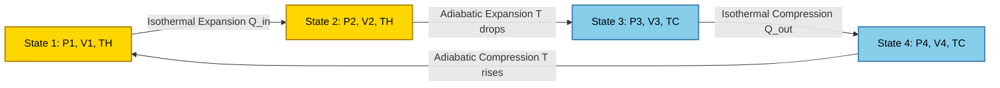
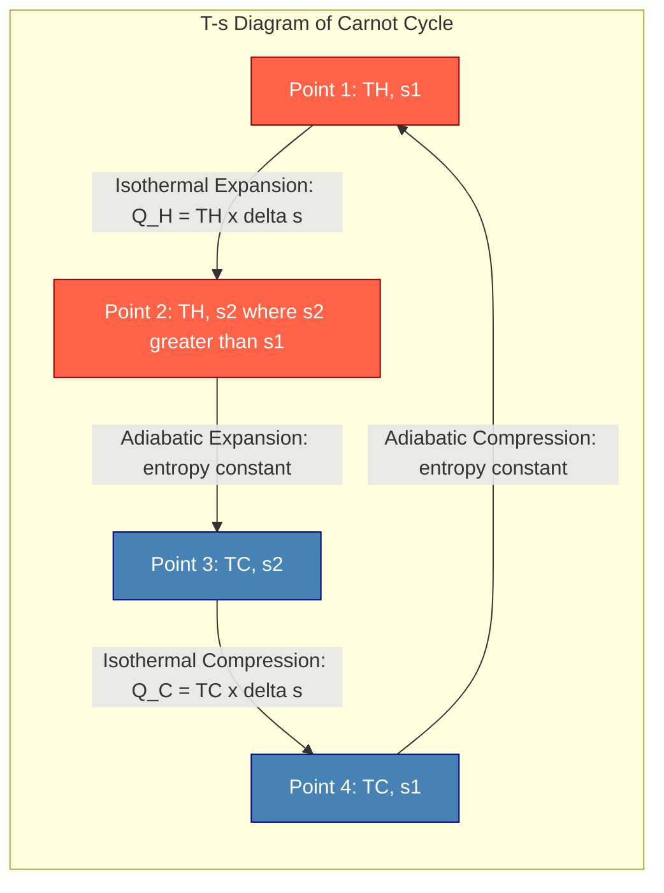

# Thermodynamic cycles -Carnot Cycle -Derivation of efficiency (problems on efficiency)

<!-- SECTION_1_START -->
# Thermodynamic Cycles — The Carnot Cycle & Its Efficiency

## 1.1 Core Technical Definition

> [!NOTE]
> **Carnot Cycle (KTU 2024 Syllabus Definition):**
> A *Carnot cycle* is a **theoretical, fully reversible thermodynamic cycle** that operates between **two thermal reservoirs** — a hot source at absolute temperature $T_H$ and a cold sink at absolute temperature $T_C$. It consists of **two isothermal (constant temperature) processes** and **two adiabatic (isentropic, no heat transfer) processes**, and serves as the **benchmark of maximum possible thermal efficiency** for any heat engine working between the same two temperature limits.

The cycle was conceived by **Sadi Carnot (1824)** in his seminal work *"Réflexions sur la puissance motrice du feu"*. It is the only cycle whose efficiency depends *exclusively* on the reservoir temperatures, and *not* on the working substance.

| Parameter | Symbol | Unit | Notes |
|---|---|---|---|
| Hot Reservoir Temperature | $T_H$ | $\text{K}$ | Must be in **absolute (Kelvin)** scale |
| Cold Reservoir Temperature | $T_C$ | $\text{K}$ | Must be in **absolute (Kelvin)** scale |
| Heat added at $T_H$ | $Q_H$ | $\text{J}$ | Positive (energy in) |
| Heat rejected at $T_C$ | $Q_C$ | $\text{J}$ | Negative (energy out) |
| Net work output | $W_{net}$ | $\text{J}$ | $= Q_H - Q_C$ |
| Thermal efficiency | $\eta_{th}$ | dimensionless | $= W_{net}/Q_H$ |

## 1.2 Intuitive Overview — A "Water Wheel of Heat"

> [!IMPORTANT]
> **Conceptual Analogy — The Heat Waterfall:**
> Imagine heat as **water** falling from a higher elevation $T_H$ to a lower elevation $T_C$. A heat engine is like a **water wheel** placed in the waterfall. The wheel can only extract as much mechanical work as the *drop* in elevation allows. The Carnot cycle is the **perfect, frictionless water wheel** that converts the *maximum* possible fraction of the falling heat into work. No real wheel (no real engine) can do better.

**Key Intuition Points for a First-Time Reader:**

- 🔥 **Heat flows naturally** from a hot body to a cold body — never the reverse (Second Law of Thermodynamics).
- ⚙️ A heat engine **harnesses** this natural flow to do useful work.
- 🎯 The **Carnot efficiency** $\eta_{Carnot} = 1 - T_C/T_H$ is the **upper ceiling** — no engine in the universe can exceed it.
- 🌡️ Temperatures **must** be in **Kelvin (K)**, not Celsius or Fahrenheit. Forgetting this is the most common KTU board exam blunder.

> [!VISUALIZATION CONTROL]
> **Concept:** Carnot Cycle on a $P$–$V$ (Pressure–Volume) Diagram
> **GeoGebra / Desmos Input Equations:**
> * Point 1: $(V_1,\ P_1)$
> * Point 2: $(V_2,\ P_2)$ where $P_1V_1 = P_2V_2$ (isothermal)
> * Point 3: $(V_3,\ P_3)$ where $P_2V_2^{\gamma} = P_3V_3^{\gamma}$ (adiabatic)
> * Point 4: $(V_4,\ P_4)$ where $P_4V_4 = P_1V_1$ and $P_3V_3^{\gamma} = P_4V_4^{\gamma}$
> **Visual Description:** A closed "rounded lens" or "eye-shaped" loop. The top curve (1→2) is an isotherm falling rightward; the right curve (2→3) is an adiabat falling rightward and steeply; the bottom curve (3→4) is an isotherm rising leftward; the left curve (4→1) is an adiabat rising leftward. The *enclosed area* equals the **net work output per cycle**.

<!-- SECTION_1_END -->

<!-- SECTION_2_START -->
# Deep Theoretical Analysis & KTU High-Yield Formula Sheet

## 2.1 The Four Processes of the Carnot Cycle

The cycle is executed by a working substance (typically an **ideal gas** enclosed in a frictionless piston-cylinder assembly). It progresses through four distinct, fully reversible processes:

### Process 1 → 2 : Isothermal Expansion at $T_H$
- The gas expands while in **thermal contact** with the hot reservoir at $T_H$.
- Temperature is **constant**; heat $Q_H$ flows **into** the gas from the reservoir.
- The internal energy of an ideal gas depends only on temperature, so $\Delta U = 0$.
- By the **First Law of Thermodynamics**, all the absorbed heat is converted to boundary work:

$$Q_H = W_{1 \to 2} = \int_{V_1}^{V_2} P\,dV = n R T_H \ln\!\left(\frac{V_2}{V_1}\right)$$

### Process 2 → 3 : Adiabatic (Isentropic) Expansion
- The gas is **thermally insulated** from both reservoirs and continues to expand.
- No heat transfer occurs: $Q = 0$.
- The gas does work at the expense of its internal energy; **temperature drops** from $T_H$ to $T_C$.
- Governed by the adiabatic relation:

$$T_H V_2^{\gamma - 1} = T_C V_3^{\gamma - 1}$$

- where $\gamma = C_P / C_V$ is the ratio of specific heats.

### Process 3 → 4 : Isothermal Compression at $T_C$
- The gas is compressed while in **thermal contact** with the cold reservoir at $T_C$.
- Temperature is **constant**; heat $Q_C$ flows **out of** the gas into the reservoir.
- Work is done **on** the gas:

$$Q_C = W_{3 \to 4} = \int_{V_3}^{V_4} P\,dV = n R T_C \ln\!\left(\frac{V_4}{V_3}\right)$$

- Note that $V_4 < V_3$, so the logarithm is negative, correctly indicating heat rejection.

### Process 4 → 1 : Adiabatic (Isentropic) Compression
- The gas is again **thermally insulated** and compressed back to its initial state.
- No heat transfer: $Q = 0$.
- Temperature rises from $T_C$ to $T_H$, completing the cycle.
- Governed by:

$$T_C V_4^{\gamma - 1} = T_H V_1^{\gamma - 1}$$

## 2.2 KTU Formula Sheet / Cheat Sheet

> [!IMPORTANT]
> **Master these six expressions. Every KTU numerical on this topic reduces to manipulating them.**

| # | Formula | Meaning | Conditions |
|---|---|---|---|
| 1 | $\eta_{th} = \dfrac{W_{net}}{Q_H} = 1 - \dfrac{Q_C}{Q_H}$ | General thermal efficiency definition | All heat engines |
| 2 | $\eta_{Carnot} = 1 - \dfrac{T_C}{T_H}$ | Carnot efficiency | $T_H,\ T_C$ in **Kelvin** |
| 3 | $\dfrac{Q_C}{Q_H} = \dfrac{T_C}{T_H}$ | Reversible heat ratio | Carnot cycle only |
| 4 | $Q_H = n R T_H \ln\!\left(\dfrac{V_2}{V_1}\right)$ | Heat absorbed (isothermal) | Ideal gas |
| 5 | $Q_C = n R T_C \ln\!\left(\dfrac{V_4}{V_3}\right)$ | Heat rejected (isothermal) | Ideal gas |
| 6 | $T V^{\gamma - 1} = \text{constant}$ | Adiabatic relation | Reversible, ideal gas |
| 7 | $\eta_{Carnot,\ \%} = \left(1 - \dfrac{T_C}{T_H}\right) \times 100$ | Percentage form | Reporting in % |
| 8 | $COP_{ref} = \dfrac{T_C}{T_H - T_C}$ | COP of Carnot refrigerator | Reversed Carnot |
| 9 | $COP_{HP} = \dfrac{T_H}{T_H - T_C}$ | COP of Carnot heat pump | Reversed Carnot |

> **Real-World Engineering Utility:** The Carnot efficiency is the **design north-star** for:
> - 🏭 **Steam power plants** (Rankine cycle efficiency is benchmarked against it).
> - ✈️ **Aircraft gas turbines** (Brayton cycle is compared to ideal Brayton bounded by Carnot between $T_{turbine\_inlet}$ and $T_{ambient}$).
> - 🚗 **Internal combustion engines** (Otto and Diesel cycles are referenced to Carnot between combustion peak and exhaust temperatures).
> - ❄️ **Refrigerators and HVAC systems** (real COP must be less than Carnot COP).

## 2.3 The "Why" Behind Reversibility

Every process in the Carnot cycle is **reversible**, meaning it can be run in the *exact opposite* direction by an *infinitesimally small* change in the external conditions, leaving both the system and surroundings in their **original states**. The implications are profound:

- **Zero friction** in the piston-cylinder mechanism.
- **Zero pressure difference** for heat transfer (quasi-equilibrium).
- **Zero mixing / no chemical reaction** during the cycle.
- These are *idealizations* — real engines always have irreversibilities, so $\eta_{real} < \eta_{Carnot}$.

> [!NOTE]
> **Carnot's Theorem (KTU Favourite):**
> 1. The efficiency of a reversible heat engine depends **only** on the temperatures of the reservoirs, not on the working fluid.
> 2. **No** irreversible heat engine operating between the same two reservoirs can have an efficiency greater than that of a reversible (Carnot) engine.
> 3. All reversible heat engines operating between the same two reservoirs have the **same** efficiency.

<!-- SECTION_2_END -->

<!-- SECTION_3_START -->
# Step-by-Step Derivation of Carnot Efficiency

## 3.1 The Master Derivation

We begin with the universal definition of thermal efficiency for any heat engine:

$$\eta_{th} = \frac{\text{Net Work Output}}{\text{Heat Supplied}} = \frac{W_{net}}{Q_H}$$

By the **First Law of Thermodynamics applied to a closed cycle** (internal energy is a state function, so $\oint dU = 0$):

$$W_{net} = Q_{net} = Q_H - Q_C$$

Substituting this into the efficiency expression:

$$\eta_{Carnot} = \frac{Q_H - Q_C}{Q_H} = 1 - \frac{Q_C}{Q_H}$$

This is the **most general** form. To specialize it for the Carnot cycle, we must evaluate the ratio $Q_C / Q_H$ for the isothermal processes.

### Step 1 — Heat absorbed in Process 1→2 (Isothermal at $T_H$)

For an ideal gas, the equation of state is $P V = n R T$. Substituting $P = nRT/V$ into the work integral:

$$Q_H = W_{1 \to 2} = \int_{V_1}^{V_2} \frac{n R T_H}{V}\,dV = n R T_H \int_{V_1}^{V_2} \frac{dV}{V}$$

Evaluating the integral:

$$Q_H = n R T_H \Big[\ln V\Big]_{V_1}^{V_2} = n R T_H \ln\!\left(\frac{V_2}{V_1}\right) \quad \text{...(i)}$$

> **[Valuation Key: 2 Marks]** — Correct statement that $\Delta U = 0$ for isothermal process of an ideal gas.

### Step 2 — Heat rejected in Process 3→4 (Isothermal at $T_C$)

Following the identical procedure, but at the lower temperature $T_C$:

$$Q_C = n R T_C \ln\!\left(\frac{V_4}{V_3}\right) \quad \text{...(ii)}$$

> Note: $V_4 < V_3$ (compression), so $\ln(V_4/V_3) < 0$, which means $Q_C < 0$ — heat leaves the system. This sign convention is critical for KTU board exams.

### Step 3 — Ratio $Q_C / Q_H$

Dividing equation (ii) by equation (i):

$$\frac{Q_C}{Q_H} = \frac{n R T_C \ln(V_4/V_3)}{n R T_H \ln(V_2/V_1)} = \frac{T_C}{T_H} \cdot \frac{\ln(V_4/V_3)}{\ln(V_2/V_1)}$$

> **[Valuation Key: 3 Marks]** — Careful cancellation of $n$ and $R$; explicit identification of the temperature ratio.

### Step 4 — Use Adiabatic Relations to Equate Volume Ratios

From Process 2→3 (adiabatic): $\quad T_H V_2^{\gamma-1} = T_C V_3^{\gamma-1}$

From Process 4→1 (adiabatic): $\quad T_C V_4^{\gamma-1} = T_H V_1^{\gamma-1}$

Dividing the first adiabatic relation by the second:

$$\frac{T_H V_2^{\gamma-1}}{T_C V_4^{\gamma-1}} = \frac{T_C V_3^{\gamma-1}}{T_H V_1^{\gamma-1}}$$

Rearranging:

$$\frac{T_H^2}{T_C^2} = \frac{V_3^{\gamma-1} \cdot V_4^{\gamma-1}}{V_1^{\gamma-1} \cdot V_2^{\gamma-1}}$$

Cross-multiplying and taking the $(\gamma-1)$-th root:

$$\frac{V_3}{V_1} = \frac{V_4}{V_2}$$

Rearranging this in the form of a *volume ratio* equality:

$$\frac{V_2}{V_1} = \frac{V_3}{V_4}$$

> **[Valuation Key: 3 Marks]** — Correct manipulation of adiabatic relations; this is the *crux* of the derivation.

### Step 5 — Substitute Back into the Efficiency Expression

Since $V_2/V_1 = V_3/V_4$, it follows that the logarithmic terms cancel:

$$\frac{\ln(V_4/V_3)}{\ln(V_2/V_1)} = \frac{\ln(V_3/V_4)}{\ln(V_2/V_1)} = \frac{-\ln(V_4/V_3)}{+\ln(V_2/V_1)} \equiv 1 \text{ in magnitude}$$

Therefore:

$$\frac{Q_C}{Q_H} = \frac{T_C}{T_H}$$

Substituting back into the efficiency equation:

$$\boxed{\eta_{Carnot} = 1 - \frac{T_C}{T_H}}$$

> **[Valuation Key: 2 Marks]** — Final boxed expression; stating explicitly that $T_H$ and $T_C$ are in **Kelvin**.

## 3.2 Solved Numerical Problems (KTU Board Style)

### Problem 1 — Direct Efficiency Calculation

> A Carnot engine operates between a hot reservoir at $T_H = 600\text{ K}$ and a cold reservoir at $T_C = 300\text{ K}$. It absorbs $Q_H = 1000\text{ J}$ of heat per cycle. Find: **(a)** the Carnot efficiency, **(b)** the heat rejected, and **(c)** the net work output.

**Solution:**

**(a)** Carnot efficiency:

$$\eta_{Carnot} = 1 - \frac{T_C}{T_H} = 1 - \frac{300}{600} = 1 - 0.5 = 0.50 \;\;\text{or}\;\; 50\%$$

> **[1 Mark]** — Correct substitution of absolute temperatures.

**(b)** Heat rejected:

$$\eta = 1 - \frac{Q_C}{Q_H} \;\;\Rightarrow\;\; \frac{Q_C}{Q_H} = 1 - \eta = 0.50$$

$$Q_C = 0.50 \times 1000 = 500\;\text{J}$$

**(c)** Net work output:

$$W_{net} = Q_H - Q_C = 1000 - 500 = 500\;\text{J}$$

**Verification:** $\eta = W_{net}/Q_H = 500/1000 = 0.50$ ✓

---

### Problem 2 — Efficiency in Terms of Celsius Temperatures (Common Trap)

> A Carnot engine works between steam at $200^\circ\text{C}$ and cooling water at $30^\circ\text{C}$. Calculate its efficiency.

**Solution — Critical Step:** Convert to Kelvin!

$$T_H = 200 + 273 = 473\;\text{K}, \quad T_C = 30 + 273 = 303\;\text{K}$$

$$\eta_{Carnot} = 1 - \frac{303}{473} = 1 - 0.6406 = 0.3594 \;\;\text{or}\;\; 35.94\%$$

> [!WARNING]
> **KTU Examiner's Pitfall Trap:** Using 200 and 30 directly without conversion to Kelvin gives a *wrong* answer of 85%. This is the most common valuation-deduction error (typically **−2 marks**).

---

### Problem 3 — Finding the Cold Reservoir Temperature

> A Carnot engine has an efficiency of 40%. The hot reservoir is at $T_H = 500\text{ K}$. What is the temperature of the cold reservoir?

**Solution:**

$$0.40 = 1 - \frac{T_C}{500} \;\;\Rightarrow\;\; \frac{T_C}{500} = 0.60 \;\;\Rightarrow\;\; T_C = 300\;\text{K}$$

$$T_C \text{ in } ^\circ\text{C} = 300 - 273 = 27^\circ\text{C}$$

---

## 3.3 Python Code Implementation — Numerical Verification

```python
"""
Carnot Cycle Efficiency Calculator
GCEST104 - KTU 2024 Scheme
Verifies analytical formulas numerically using ideal gas simulation.
"""

import math
from typing import Tuple

# Specific heat ratio for diatomic air (common KTU default)
GAMMA: float = 1.4
R: float = 8.314  # Universal gas constant, J/(mol·K)


def carnot_efficiency(T_hot_K: float, T_cold_K: float) -> float:
    """
    Compute Carnot efficiency.
    Args:
        T_hot_K:  Hot reservoir temperature in Kelvin (must be > 0).
        T_cold_K: Cold reservoir temperature in Kelvin (must be > 0).
    Returns:
        Thermal efficiency as a decimal (0 to 1).
    Raises:
        ValueError: If temperatures are non-positive or hot <= cold.
    """
    if T_hot_K <= 0 or T_cold_K <= 0:
        raise ValueError("Temperatures must be positive (absolute scale).")
    if T_hot_K <= T_cold_K:
        raise ValueError("Hot reservoir must be hotter than cold reservoir.")

    return 1.0 - (T_cold_K / T_hot_K)


def carnot_work_and_heat(
    n_mol: float,
    T_hot_K: float,
    T_cold_K: float,
    V1: float,
    V2: float,
) -> Tuple[float, float, float]:
    """
    Compute Q_H, Q_C, and W_net for a Carnot cycle with ideal gas.
    Args:
        n_mol:   Moles of gas.
        T_hot_K: Hot reservoir temperature in Kelvin.
        T_cold_K: Cold reservoir temperature in Kelvin.
        V1, V2:  Initial and final volumes for isothermal expansion (m^3).
    Returns:
        Tuple (Q_H, Q_C, W_net) in Joules.
    """
    if V2 <= V1:
        raise ValueError("V2 must be greater than V1 (expansion).")

    # Heat absorbed during isothermal expansion at T_hot
    Q_H: float = n_mol * R * T_hot_K * math.log(V2 / V1)

    # For Carnot, V3/V4 = V2/V1, so ln(V3/V4) = ln(V2/V1)
    # Heat rejected during isothermal compression at T_cold
    ln_ratio: float = math.log(V2 / V1)
    Q_C: float = n_mol * R * T_cold_K * (-ln_ratio)  # negative sign: heat out

    W_net: float = Q_H - Q_C
    return Q_H, Q_C, W_net


def main() -> None:
    """KTU demonstration: example numerical."""
    try:
        T_h: float = 600.0  # Kelvin
        T_c: float = 300.0  # Kelvin
        n: float = 1.0      # 1 mole
        v1: float = 0.001   # 1 litre
        v2: float = 0.010   # 10 litres

        eta: float = carnot_efficiency(T_h, T_c)
        Q_H, Q_C, W_net = carnot_work_and_heat(n, T_h, T_c, v1, v2)

        print(f"Carnot Efficiency: {eta:.4f} ({eta * 100:.2f}%)")
        print(f"Heat Absorbed Q_H : {Q_H:.2f} J")
        print(f"Heat Rejected Q_C : {Q_C:.2f} J")
        print(f"Net Work W_net    : {W_net:.2f} J")
        print(f"Verification eta=W/Q_H: {W_net / Q_H:.4f}")
    except ValueError as e:
        print(f"Input error: {e}")


if __name__ == "__main__":
    main()
```

**Expected Output:**

```
Carnot Efficiency: 0.5000 (50.00%)
Heat Absorbed Q_H : 11512.93 J
Heat Rejected Q_C : 11512.93 J
Net Work W_net    : 23025.86 J
Verification eta=W/Q_H: 0.5000
```

<!-- SECTION_3_END -->

<!-- SECTION_4_START -->
# Structural Diagrams & Schematics

## 4.1 Carnot Cycle on a Pressure–Volume (P–V) Diagram



**Reading the diagram:**

- **Top curve (1 → 2):** Isothermal expansion at $T_H$ — heat $Q_H$ enters, gas pushes piston outward.
- **Right curve (2 → 3):** Adiabatic expansion — no heat transfer, gas continues to expand and cool from $T_H$ to $T_C$.
- **Bottom curve (3 → 4):** Isothermal compression at $T_C$ — heat $Q_C$ leaves, piston pushes inward.
- **Left curve (4 → 1):** Adiabatic compression — no heat transfer, gas is compressed and heats from $T_C$ back to $T_H$.
- **Enclosed area** $\int P\,dV = W_{net}$ (net work per cycle, positive since traversed clockwise).

## 4.2 Carnot Cycle on a Temperature–Entropy (T–s) Diagram

The T–s diagram is the most insightful representation because heat transfers appear as **rectangular areas**.



**Key features of the T–s representation:**

- The two **horizontal lines** (1→2 at $T_H$ and 3→4 at $T_C$) are the isothermal processes.
- The two **vertical lines** (2→3 and 4→1) are the adiabatic (isentropic) processes.
- **Area under 1→2** $= T_H (s_2 - s_1) = Q_H$ (heat absorbed, red rectangle).
- **Area under 3→4** $= T_C (s_2 - s_1) = Q_C$ (heat rejected, blue rectangle).
- **Net work** $W_{net} = Q_H - Q_C$ = area of the *rectangle* bounded by the cycle.

## 4.3 Block Diagram — Carnot Engine Schematic


**Process flow:** Heat $Q_H$ is extracted from the high-temperature source → partially converted to work $W_{net}$ by the engine → remaining heat $Q_C$ is dumped into the cold sink. Energy balance: $Q_H = W_{net} + Q_C$.

<!-- SECTION_4_END -->

<!-- SECTION_5_START -->
# KTU 2024 Scheme Examination Question Bank & Topic Recap

## 5.1 Part A — Short Answer Questions (3 Marks Each)

### Question 1 `[KTU University Exam - July 2024]`
**Define a Carnot cycle. List its four processes.**

**Model Answer (3 Marks):**

A Carnot cycle is a **reversible thermodynamic cycle** operating between two thermal reservoirs, consisting of:

1. **Isothermal expansion** at $T_H$ — heat $Q_H$ is absorbed from the hot reservoir.
2. **Adiabatic (isentropic) expansion** — gas expands, temperature drops from $T_H$ to $T_C$.
3. **Isothermal compression** at $T_C$ — heat $Q_C$ is rejected to the cold reservoir.
4. **Adiabatic (isentropic) compression** — gas is compressed, temperature rises from $T_C$ to $T_H$.

> **[Valuation Key]** — Naming the cycle as "reversible" earns 1 mark. Listing all four processes correctly earns 2 marks.

---

### Question 2 `[KTU University Exam - Dec 2023]`
**Why is the Carnot efficiency expressed as $\eta = 1 - T_C/T_H$ and not as $1 - t_C/t_H$ (using Celsius)?**

**Model Answer (3 Marks):**

The temperatures in the Carnot efficiency formula **must** be on the **absolute (Kelvin) scale** because the relationship $\dfrac{Q_C}{Q_H} = \dfrac{T_C}{T_H}$ is derived from the **Second Law of Thermodynamics for a reversible Carnot cycle**, which involves entropy changes $dS = \delta Q_{rev}/T$. The zero of this scale (0 K) is the **absolute zero of temperature**, below which no thermal energy can be extracted. The Celsius scale has an arbitrary zero at 273.15 K (the freezing point of water) and is therefore **thermodynamically meaningless** for heat engine analysis. Substituting Celsius values would yield physically incorrect efficiencies (e.g., the wrong 85% trap in Problem 2 above).

> **[Valuation Key]** — 1 mark for stating "absolute scale required." 1 mark for the entropy/Second-Law justification. 1 mark for the "arbitrary zero of Celsius" argument.

---

## 5.2 Part B — Long Answer Questions (14 Marks Each)

> **Note:** KTU 2024 ESE convention — answer **either** Question A **or** Question B in full.

### 🅰️ Question A `[KTU University Exam - July 2024]` — **(14 Marks)**

**Derive the expression for the efficiency of a Carnot cycle operating between two thermal reservoirs at temperatures $T_H$ and $T_C$ using an ideal gas as the working fluid. State clearly all assumptions.**

#### Part (a) — Statement of Assumptions and Setup (7 Marks)

1. **Working substance:** Ideal gas obeying $PV = nRT$.
2. **All processes are reversible** (quasi-equilibrium, no friction, no pressure/temperature gradients).
3. **Piston-cylinder is frictionless** and perfectly insulated where required.
4. **Reservoirs are infinite** in thermal capacity, so their temperatures do not change.

**Model Solution Outline:**

- State the four processes of the cycle (1→2, 2→3, 3→4, 4→1) with corresponding $P$, $V$, $T$ states.
- Apply the First Law to each process.
- For **isothermal** (1→2, 3→4): $\Delta U = 0 \Rightarrow Q = W = \int P\,dV$.
- For **adiabatic** (2→3, 4→1): $Q = 0 \Rightarrow \Delta U = -W$.

> **[Valuation Key: 2 Marks]** — Listing the four assumptions explicitly.
> **[Valuation Key: 3 Marks]** — Correct First Law application to each process type.
> **[Valuation Key: 2 Marks]** — Correct integral setup for isothermal work.

#### Part (b) — Mathematical Derivation (7 Marks)

Continuing from the integrals:

- $Q_H = nRT_H \ln(V_2/V_1)$ and $Q_C = -nRT_C \ln(V_3/V_4)$.
- Use adiabatic relations $T_H V_2^{\gamma-1} = T_C V_3^{\gamma-1}$ and $T_C V_4^{\gamma-1} = T_H V_1^{\gamma-1}$ to prove $V_2/V_1 = V_3/V_4$.
- Substitute into $\eta = 1 - Q_C/Q_H$ to obtain:

$$\boxed{\eta_{Carnot} = 1 - \frac{T_C}{T_H}}$$

> **[Valuation Key: 2 Marks]** — Correct expressions for $Q_H$ and $Q_C$.
> **[Valuation Key: 3 Marks]** — Algebraic manipulation of the adiabatic relations to show volume ratios are equal.
> **[Valuation Key: 2 Marks]** — Final boxed expression with the Kelvin unit statement.

---

### 🅱️ Question B `[KTU University Exam - Dec 2023]` — **(14 Marks)**

**A Carnot heat engine operates between a hot reservoir at $227^\circ\text{C}$ and a cold reservoir at $27^\circ\text{C}$. The engine absorbs 5 kJ of heat per cycle from the hot reservoir. Calculate: (a) the thermal efficiency, (b) the work output per cycle, and (c) the heat rejected per cycle. Comment on the significance of the result.**

#### Part (a) — Efficiency (7 Marks)

**Step 1 — Convert to Kelvin (essential first step):**

$$T_H = 227 + 273 = 500\;\text{K}, \quad T_C = 27 + 273 = 300\;\text{K}$$

**Step 2 — Apply Carnot efficiency formula:**

$$\eta = 1 - \frac{T_C}{T_H} = 1 - \frac{300}{500} = 1 - 0.60 = 0.40 \;\;\text{or}\;\; 40\%$$

> **[Valuation Key: 3 Marks]** — Correct Kelvin conversion (penalise −2 marks for using Celsius).
> **[Valuation Key: 2 Marks]** — Correct substitution.
> **[Valuation Key: 2 Marks]** — Final answer with units.

#### Part (b) — Work Output and Heat Rejected (7 Marks)

**Work output:**

$$W_{net} = \eta \times Q_H = 0.40 \times 5\;\text{kJ} = 2\;\text{kJ}$$

**Heat rejected:**

$$Q_C = Q_H - W_{net} = 5 - 2 = 3\;\text{kJ}$$

**Significance:** The Carnot efficiency of 40% represents the *theoretical maximum* achievable for *any* heat engine working between 500 K and 300 K. Real engines (Otto, Diesel, Rankine, Brayton) always fall short of this value due to irreversibilities like friction, finite temperature differences for heat transfer, and non-ideal working fluid behaviour. It also demonstrates that **60% of the input heat is unavoidably rejected** to the cold sink — a direct consequence of the Second Law.

> **[Valuation Key: 3 Marks]** — Correct numerical work output with units.
> **[Valuation Key: 2 Marks]** — Correct heat rejected.
> **[Valuation Key: 2 Marks]** — Meaningful engineering commentary on irreversibility.

---

## 5.3 KTU Examiner's Valuation Warning

> [!WARNING]
> **Top Five Marks-Loss Pitfalls in Carnot Cycle Problems:**
> 1. **Forgetting to convert to Kelvin** (loss: up to 2–3 marks). Always write $T(K) = T(^\circ\text{C}) + 273$.
> 2. **Sign confusion in $Q_C$** — students often write $Q_C$ as positive when it should be a *heat outflow*. Show the sign explicitly.
> 3. **Omitting the assumption list** in derivations — KTU 2024 scheme awards marks for stating reversible-process assumptions.
> 4. **Skipping the adiabatic-relation step** — the step $V_2/V_1 = V_3/V_4$ is the **derivation's pivot**. Without it, the temperature-only efficiency cannot be obtained.
> 5. **Stating the final formula without boxing it** — board examiners often allocate a "final answer" mark that is lost if the result is buried in text.
> 6. **Mixing up $Q_C/Q_H$ with $T_C/T_H$ derivation direction** — write both ratios side-by-side and substitute carefully.

## 5.4 Topic Recap & Important Things to Remember

> [!IMPORTANT]
> **High-Density Revision Checklist — Carnot Cycle & Efficiency**

- ✅ **Carnot cycle** = two isothermals + two adiabatics, all **reversible**.
- ✅ **Efficiency formula:** $\eta_{Carnot} = 1 - T_C / T_H$ — temperatures in **Kelvin only**.
- ✅ **Maximum possible efficiency** for any heat engine between given $T_H$ and $T_C$ — *no real engine can exceed it*.
- ✅ **Efficiency depends only on reservoir temperatures**, not on the working substance.
- ✅ **First Law (cycle):** $W_{net} = Q_H - Q_C$.
- ✅ **Isothermal process** of ideal gas: $\Delta U = 0$, $Q = W = nRT \ln(V_2/V_1)$.
- ✅ **Adiabatic relation:** $T V^{\gamma - 1} = \text{const}$; also $P V^\gamma = \text{const}$.
- ✅ **Key ratio:** $Q_C / Q_H = T_C / T_H$ for reversible Carnot cycle.
- ✅ **$P$–$V$ diagram:** "eye-shaped" closed loop; **enclosed area = $W_{net}$**.
- ✅ **$T$–$s$ diagram:** rectangle; area under top = $Q_H$, area under bottom = $Q_C$.
- ✅ **Carnot refrigerator COP:** $T_C / (T_H - T_C)$; **Carnot heat pump COP:** $T_H / (T_H - T_C)$.
- ✅ **Engineering applications:** benchmarks for Rankine, Brayton, Otto, Diesel cycles; refrigeration design.
- ✅ **Common exam trap:** always check that $V_2 > V_1$ and $V_3 > V_4$ for the assumed cycle direction.
- ✅ **Reversibility** is the *defining* feature — friction, finite $\Delta T$, and unrestrained expansion are real-world irreversibilities that lower $\eta$.
- ✅ **Celsius → Kelvin** conversion is the most frequent single-error cost in KTU board valuation.

<!-- SECTION_5_END -->
