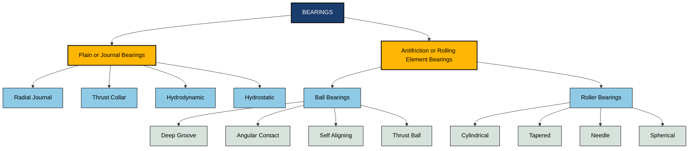
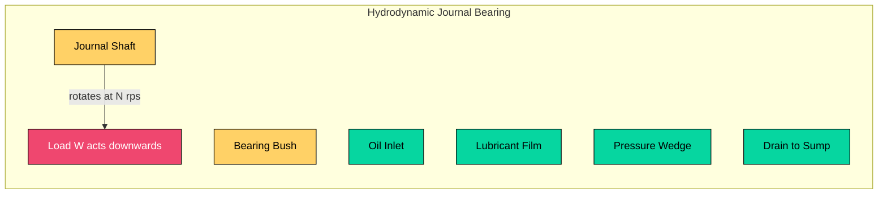
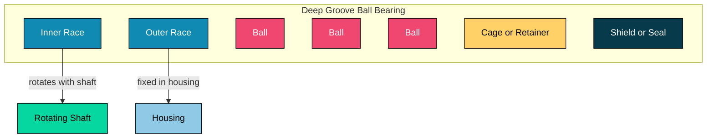
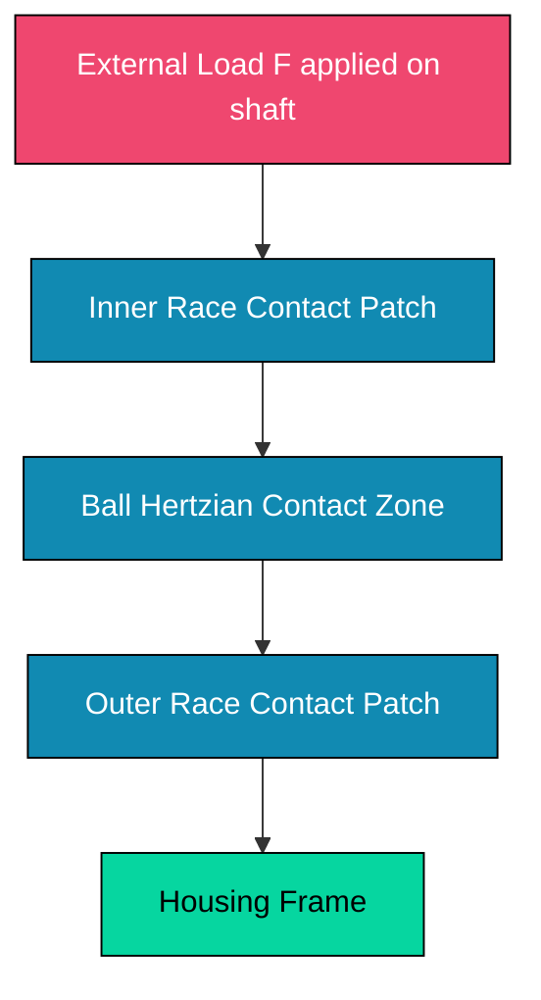

# Bearings and their classification (Journal bearing and ball bearing)

<!-- SECTION_1_START -->
# 1. Core Technical Definition & Intuitive Overview

## 1.1 Bearing — Formal Academic Definition

A **bearing** is a machine element that constrains the relative motion between two parts to a desired (typically rotational) motion and reduces the friction between those moving parts. In engineering practice, a bearing supports a rotating shaft (or journal) and transmits the applied load to the machine frame, while permitting smooth rotary or linear motion with minimum energy loss.

> [!IMPORTANT]
> **KTU Syllabus Highlight:** In Module 2 of *GCEST104 – Introduction to Mechanical Engineering & Civil Engineering*, bearings are classified under *Classification of Pumps & Turbines* as a **supporting element** of all rotating machinery (pumps, turbines, compressors, electric motors). The university expects students to clearly distinguish between **Journal (Sliding) Bearings** and **Ball (Rolling) Bearings** — their construction, working, and selection criteria.

## 1.2 Functions of a Bearing

A bearing in a rotating assembly performs four primary engineering functions:

- **Load Transmission:** Carries radial, axial (thrust), or combined loads from the shaft to the housing.
- **Friction Reduction:** Replaces direct dry sliding with a lubricated film or rolling contact, dramatically reducing energy losses.
- **Shaft Alignment & Positioning:** Maintains accurate geometric alignment of the rotating member.
- **Wear Prevention:** Distributes the contact stress over a larger effective area, prolonging machine life.

> [!NOTE]
> **Friction Insight:** A plain metal-on-metal journal can have a coefficient of friction $\mu \approx 0.1$ to $0.5$, while a properly lubricated hydrodynamic journal bearing drops to $\mu \approx 0.001$ to $0.01$ — a reduction of nearly two orders of magnitude.

## 1.3 Master Classification of Bearings

```
BEARINGS
├── 1. Plain / Journal / Sliding Bearings
│   ├── Based on Load: Radial, Thrust (Collar), Tilting-pad
│   ├── Based on Lubrication: Hydrodynamic, Hydrostatic, Boundary
│   └── Based on Construction: Solid, Split (Plain), Pedestal
│
└── 2. Antifriction / Rolling Element Bearings
    ├── Based on Rolling Element: Ball, Roller (Cylindrical, Spherical, Needle, Tapered)
    ├── Based on Load: Radial, Angular Contact, Thrust
    └── Based on Construction: Deep-Groove, Self-Aligning, etc.
```

## 1.4 Conceptual Analogy — The Skater on Ice

> [!TIP]
> **Intuitive Picture:** Imagine pushing a heavy iron box across two surfaces — first across a **rough concrete floor** (you drag it, the bottom grinds), then across a **polished skating rink on tiny ball-bearings** (it glides with almost no effort). The first is like a **Journal (sliding) bearing** where a thin oil film separates the surfaces; the second is like a **Ball bearing** where hardened steel spheres roll between the races. Both replace direct metal contact with a low-shear interface — one using a fluid film, the other using point/line rolling contact.

## 1.5 Journal (Sliding) Bearing — Definition

A **Journal Bearing** (also called a **Plain Bearing** or **Sleeve Bearing**) is a cylindrical bearing in which the shaft (called the **journal**) rotates inside a stationary **bearing shell (bush/bushing)** with a thin **lubricant film** separating the two metal surfaces. The load is transmitted through this pressurized oil film.

> [!IMPORTANT]
> **Core Definition (KTU Board Terminology):** *“A journal bearing is a machine element designed to support a rotating shaft through a thin film of lubricant, in which the journal slides on a stationary bearing surface.”*

### 1.5.1 Key Constructional Elements

| Element | Function |
| :--- | :--- |
| **Journal** | The rotating part of the shaft supported by the bearing. |
| **Bearing Shell / Bush** | The stationary cylindrical sleeve; often lined with a soft alloy (Babbitt, Bronze). |
| **Lubricant (Oil / Grease)** | Forms the load-carrying hydrodynamic film. |
| **Lubricant Inlet / Oil Hole** | Entry point for the pressurized lubricant. |
| **Drain / Sump** | Collects and recirculates used oil. |
| **Housing / Pedestal** | Supports the bearing shell and provides cooling fins in some designs. |

> [!VISUALIZATION CONTROL]
> **Concept:** Cross-section of a hydrodynamic journal bearing showing the eccentric journal, oil-film wedge, and pressure distribution.
> **Geometric Parameters to Plot:**
> * Centre of journal $O_j$ at eccentricity $e$ from centre of bearing $O_b$.
> * Clearance circle: $O_b$ as origin, radius $r+c$ (where $r$ is journal radius, $c$ is radial clearance).
> * Film thickness: $h = c + e\cos\theta$ — minimum at $\theta = 180°$, maximum at $\theta = 0°$.
> * Reynolds pressure profile — positive in the convergent wedge $\left(0° < \theta < 180°\right)$, negative in the divergent region.
> **Visual Description:** Student should observe the **divergent wedge** pushing the journal up — the load is supported by the rising oil pressure on one side, while the journal floats on the film.

## 1.6 Ball (Antifriction) Bearing — Definition

A **Ball Bearing** is a rolling-element bearing that uses hardened steel **balls** placed between two concentric hardened rings (**races**) to carry load with minimum friction. A **cage (retainer)** keeps the balls evenly spaced and prevents mutual contact.

> [!IMPORTANT]
> **Core Definition (KTU Board Terminology):** *“A ball bearing is an antifriction bearing in which the load is transmitted from one race to the other through spherical rolling elements (balls), guided by a cage, with the contact being a point contact.”*

### 1.6.1 Key Constructional Elements

| Element | Function |
| :--- | :--- |
| **Inner Race** | Mounted on the shaft, rotates with it; has a groove (raceway) for the balls. |
| **Outer Race** | Fitted in the housing; stationary; has the matching groove. |
| **Balls** | Hardened steel rolling elements, transmit the load. |
| **Cage / Retainer** | Spacer that keeps the balls uniformly distributed. |
| **Shield / Seal** | Optional covers to retain lubricant and exclude contaminants. |

---

<!-- SECTION_1_END -->

<!-- SECTION_2_START -->
# 2. Deep Theoretical Analysis & KTU High-Yield Formula Sheet

## 2.1 Journal Bearing — Operating Principle (Hydrodynamic Lubrication)

A journal bearing works on the **Hydrodynamic Lubrication Principle**: the journal, while rotating at speed $N$, drags oil into the **convergent wedge** formed between the journal and the bearing shell (because the journal runs eccentric — its centre $O_j$ is offset from the bearing centre $O_b$ by the eccentricity $e$).

The **Reynolds equation** of hydrodynamic lubrication shows that this wedge creates a positive pressure distribution that supports the external load $W$ against the bearing shell. The minimum oil film thickness is:

$$
h_{min} = c - e
$$

where $c$ is the **radial clearance** (difference between bearing bore radius $R$ and journal radius $r$).

> [!NOTE]
> **Why eccentricity exists:** If the journal were perfectly concentric ($e = 0$), no convergent wedge would form, no pressure could be generated, and the bearing would seize. Eccentricity is therefore *essential* — it is the very mechanism by which the oil wedge is created.

### 2.1.1 Petroff's Equation (Friction in a Concentric, Full-Film Bearing)

For a simplified, lightly loaded, concentric bearing (no eccentricity, used only to estimate friction losses in plain shafts), **Petroff's Equation** gives the coefficient of friction:

$$
f = 2\pi^2 \left(\dfrac{\mu N}{P}\right) \left(\dfrac{r}{c}\right)
$$

where the variables are:
* $f$ = Coefficient of friction (dimensionless).
* $\mu$ = Dynamic viscosity of the lubricant in $\text{Pa}\cdot\text{s}$ (or $\text{N}\cdot\text{s/m}^2$).
* $N$ = Rotational speed in **revolutions per second** $\left[\text{rps}\right]$.
* $P$ = Bearing pressure (load per unit projected area) in $\text{Pa} = \text{N/m}^2$.
* $r$ = Radius of the journal in metres $[\text{m}]$.
* $c$ = Radial clearance in metres $[\text{m}]$.

> [!IMPORTANT]
> **KTU High-Yield Result — The Bearing Characteristic Number:** The dimensionless group $\dfrac{\mu N}{P}$ is called the **Sommerfeld Number (Bearing Characteristic Number)** and is the *master dimensionless parameter* for journal-bearing design. Petroff's friction law, Reynolds' load equation, and McKee's friction curves are all correlations plotted against this number.

### 2.1.2 General Sommerfeld Number

For a *loaded* eccentric journal bearing, the dimensionless group:

$$
S_o = \dfrac{\mu N}{P} \cdot \left(\dfrac{r}{c}\right)^2
$$

is correlated to the **eccentricity ratio** $\varepsilon = \dfrac{e}{c}$ and the **attitude angle** $\phi$ through classical design charts (Sommerfeld, Ocvirk, Raimondi–Boyd).

### 2.1.3 Minimum Film Thickness (Raimondi–Boyd Tabular Correlation)

For a short journal ($L/D \le 1$, $L$ = length, $D$ = journal diameter), the minimum film thickness ratio is empirically related to the Sommerfeld number:

$$
\dfrac{h_{min}}{c} \;=\; f\!\left(S_o,\ \dfrac{L}{D}\right)
$$

The Raimondi–Boyd tables (mandatory reference for KTU machine-design problems) give $\dfrac{h_{min}}{c}$ and the friction variable $\dfrac{r}{c}\,f$ as functions of $\varepsilon$ and $L/D$.

### 2.1.4 Lubrication Regimes in Journal Bearings

| Regime | Film Thickness | Load Capacity | Practical Use |
| :--- | :--- | :--- | :--- |
| **Boundary** | $h \le$ surface roughness | Very low (solid contact) | Start-up / shut-down |
| **Mixed** | $h \approx$ roughness | Moderate | Low-speed, heavy load |
| **Hydrodynamic (Full Film)** | $h \gg$ roughness | Full design load | Normal running condition |

> [!TIP]
> **Real-World Engineering Utility:** Hydrodynamic journal bearings are used in **large turbines, IC engine crankshafts, electric motor rotors, centrifugal pumps, and turbo-generators** because they are *quiet*, *cheap*, and can carry *enormous loads* at *high speeds*. They form the back-bone of every rotating machine in a power plant.

## 2.2 Ball Bearing — Operating Principle & Load Ratings

In a ball bearing, the load is transmitted through the **balls**, not through sliding. The contact between a ball and a raceway is theoretically a **point contact**, which under load deforms into a small elliptical contact patch (Hertzian contact). This rolling contact is responsible for the *very low* rolling friction.

### 2.2.1 Basic Dynamic Load Rating ($C$)

The **Basic Dynamic Load Rating $C$** is defined by ISO/IS standards as:

> The constant radial (or for thrust bearings, axial) load that a bearing can theoretically carry for **one million revolutions** ($10^6$ revs) with a **90% reliability** (i.e., a 10% probability of failure — hence the term **$L_{10}$ life**).

### 2.2.2 Basic Rating Life ($L_{10}$ Life)

The empirically derived ISO equation for the basic rating life in *millions of revolutions* is:

$$
L_{10} \;=\; \left(\dfrac{C}{P}\right)^p
$$

For the practical **life in operating hours**:

$$
L_{10h} \;=\; \dfrac{10^6}{60\,n} \cdot \left(\dfrac{C}{P}\right)^p
$$

The exponent $p$ is:
* $p = 3$ for **ball bearings**.
* $p = \dfrac{10}{3}$ for **roller bearings**.

### 2.2.3 Equivalent Dynamic Load ($P$)

A bearing rarely sees a *purely radial* load. The **Equivalent Dynamic Load** is the hypothetical constant load that, if applied, would give the same bearing life as the actual combined load:

$$
P \;=\; X\,F_r \;+\; Y\,F_a
$$

where:
* $F_r$ = Radial load (in Newtons).
* $F_a$ = Axial / Thrust load (in Newtons).
* $X$ = Radial load factor (from manufacturer catalogue).
* $Y$ = Axial load factor (from catalogue).

> [!IMPORTANT]
> **KTU High-Yield Tip:** In board problems, $X$ and $Y$ are *always* read from the bearing manufacturer’s catalogue (SKF / FAG / NBC) for the specific bearing series. For deep-groove ball bearings with $\dfrac{F_a}{F_r} \le e$, $X = 1$, $Y = 0$; if $\dfrac{F_a}{F_r} > e$, then $X = 0.56$ and $Y$ has a small positive value (≈ 0.85 to 1.6 depending on series).

### 2.2.4 Static Load Rating ($C_0$)

For very slow or stationary loaded bearings, the **Basic Static Load Rating $C_0$** is the load that produces a permanent deformation of $0.0001\,D$ at the most heavily loaded contact point. The static equivalent load is:

$$
P_0 \;=\; X_0\,F_r \;+\; Y_0\,F_a
$$

## 2.3 Comparison — Journal vs. Ball Bearing

| Property | Journal (Sliding) Bearing | Ball (Antifriction) Bearing |
| :--- | :--- | :--- |
| **Contact type** | Sliding (conformal) | Rolling (point/line, Hertzian) |
| **Starting friction** | High (no oil film at rest) | Very low |
| **Operating friction** | Very low ($\mu \approx 0.001$) at full film | Slightly higher rolling friction but very steady |
| **Radial space** | Compact in radial direction | Larger in radial direction |
| **Axial load** | Limited (thrust collars needed) | Limited unless angular-contact type |
| **Speed capability** | Very high (turbines, motors) | Limited by cage/ball centripetal stress |
| **Lubricant need** | Continuous oil supply essential | Grease sufficient for most cases |
| **Shock / vibration damping** | Excellent (oil film is compliant) | Poor — rigid metallic contact |
| **Life prediction** | Difficult (depends on oil film) | Precise — via $L_{10}$ equation |
| **Maintenance** | Periodic oil change | Sealed types are *sealed for life* |
| **Cost** | Low | Higher |
| **Noise** | Quiet | Slight rolling noise |
| **Typical use** | Turbines, IC engines, large motors, pumps | Machine-tool spindles, gearboxes, electric motors, automobiles |

> [!TIP]
> **Engineering Selection Rule of Thumb:**
> * Choose **Journal Bearings** for: high speeds, very heavy loads, need for damping, low noise.
> * Choose **Ball / Roller Bearings** for: moderate speeds, clean environments, pre-calculateable life, low maintenance.

## 2.4 KTU Formula Sheet — Master Reference Table

| # | Formula | Description | Units |
| :--- | :--- | :--- | :--- |
| 1 | $f = 2\pi^2 \left(\dfrac{\mu N}{P}\right)\left(\dfrac{r}{c}\right)$ | Petroff's friction law | dimensionless |
| 2 | $S_o = \dfrac{\mu N}{P}\left(\dfrac{r}{c}\right)^2$ | Sommerfeld / Bearing Characteristic Number | dimensionless |
| 3 | $h_{min} = c(1 - \varepsilon)$ | Minimum oil film thickness | $\text{m}$ |
| 4 | $\varepsilon = \dfrac{e}{c}$ | Eccentricity ratio | dimensionless |
| 5 | $P_{proj} = \dfrac{W}{L \cdot D}$ | Bearing projected pressure | $\text{Pa}$ |
| 6 | $L_{10} = \left(\dfrac{C}{P}\right)^p$ | Basic rating life in $10^6$ revs | $10^6$ revs |
| 7 | $L_{10h} = \dfrac{10^6}{60\,n}\left(\dfrac{C}{P}\right)^p$ | Basic rating life in hours | $\text{hours}$ |
| 8 | $P = X\,F_r + Y\,F_a$ | Equivalent dynamic load | $\text{N}$ |
| 9 | $P_0 = X_0\,F_r + Y_0\,F_a$ | Equivalent static load | $\text{N}$ |
| 10 | $\mu = \dfrac{T}{W\,r}$ | Coefficient of friction from torque | dimensionless |

> [!NOTE]
> **Symbols Glossary:**
> $\mu$ — dynamic viscosity $\left[\text{Pa}\cdot\text{s}\right]$; $N$ — speed in $\text{rps}$; $P$ — bearing pressure $\left[\text{Pa}\right]$; $r$ — journal radius $\left[\text{m}\right]$; $c$ — radial clearance $\left[\text{m}\right]$; $e$ — eccentricity $\left[\text{m}\right]$; $W$ — applied load $\left[\text{N}\right]$; $L$ — bearing length $\left[\text{m}\right]$; $D$ — journal diameter $\left[\text{m}\right]$; $C$ — dynamic load rating $\left[\text{N}\right]$; $P$ — equivalent dynamic load $\left[\text{N}\right]$; $n$ — speed in $\text{rpm}$.

---

<!-- SECTION_2_END -->

<!-- SECTION_3_START -->
# 3. Step-by-Step Derivations, Code & Symbolic Implementation

## 3.1 Worked Numerical Problem 1 — Petroff's Equation (Direct 7-mark KTU type)

### Problem Statement
A journal bearing has a journal diameter of $D = 100\ \text{mm}$ and runs at $N = 1500\ \text{rpm}$. The bearing is $L = 50\ \text{mm}$ long. The radial clearance is $c = 0.1\ \text{mm}$ and the load on the bearing is $W = 10\ \text{kN}$. The lubricant used has dynamic viscosity $\mu = 0.02\ \text{Pa}\cdot\text{s}$. Find (a) the bearing pressure, (b) the coefficient of friction using Petroff's equation, and (c) the power lost in friction.

### Given Data (extracted)

$$
D = 100\ \text{mm} = 0.1\ \text{m}, \quad
r = 50\ \text{mm} = 0.05\ \text{m}
$$
$$
N = 1500\ \text{rpm} = \dfrac{1500}{60} = 25\ \text{rps}
$$
$$
L = 50\ \text{mm} = 0.05\ \text{m}, \quad
c = 0.1\ \text{mm} = 1\times10^{-4}\ \text{m}
$$
$$
W = 10\ \text{kN} = 10\,000\ \text{N}, \quad
\mu = 0.02\ \text{Pa}\cdot\text{s}
$$

### Part (a) — Bearing Pressure $P$

The bearing pressure is the load divided by the **projected area** $L \times D$:

$$
P \;=\; \dfrac{W}{L \cdot D} \;=\; \dfrac{10\,000}{0.05 \times 0.1} \;=\; \dfrac{10\,000}{5\times 10^{-3}} \;=\; 2.0\times 10^{6}\ \text{Pa}
$$

$$
\boxed{P \;=\; 2\ \text{MPa}}
$$

> **Valuation Key:** *'Stating the formula $P = W/(L \cdot D)$: 1 Mark; substitution: 1 Mark; final value with unit: 1 Mark.'*

### Part (b) — Coefficient of Friction (Petroff)

Petroff's equation:

$$
f \;=\; 2\pi^{2}\!\left(\dfrac{\mu N}{P}\right)\!\left(\dfrac{r}{c}\right)
$$

Substituting:

$$
f \;=\; 2 \times (3.1416)^{2} \times \left(\dfrac{0.02 \times 25}{2.0\times 10^{6}}\right) \times \left(\dfrac{0.05}{1\times 10^{-4}}\right)
$$

Evaluating each bracket:

$$
2\pi^{2} \;=\; 2 \times 9.8696 \;=\; 19.7392
$$

$$
\dfrac{\mu N}{P} \;=\; \dfrac{0.02 \times 25}{2\times 10^{6}} \;=\; \dfrac{0.5}{2\times 10^{6}} \;=\; 2.5\times 10^{-7}
$$

$$
\dfrac{r}{c} \;=\; \dfrac{0.05}{1\times 10^{-4}} \;=\; 500
$$

Multiplying:

$$
f \;=\; 19.7392 \times 2.5\times 10^{-7} \times 500
$$

$$
f \;=\; 19.7392 \times 1.25\times 10^{-4}
$$

$$
\boxed{f \;\approx\; 2.467\times 10^{-3} \;\approx\; 0.00247}
$$

> **Valuation Key:** *'Writing Petroff's formula: 1 Mark; substitution step-by-step: 1 Mark; correct arithmetic: 1 Mark; final numerical answer: 1 Mark.'*

### Part (c) — Power Lost in Friction

The frictional torque is $T = f \cdot W \cdot r$, and the power lost is $P_{loss} = T \cdot \omega = T \cdot (2\pi N)$:

$$
T \;=\; f \cdot W \cdot r \;=\; 0.00247 \times 10\,000 \times 0.05 \;=\; 1.235\ \text{N}\cdot\text{m}
$$

$$
P_{loss} \;=\; T \cdot 2\pi N \;=\; 1.235 \times 2\pi \times 25
$$

$$
P_{loss} \;=\; 1.235 \times 157.08 \;=\; 194.0\ \text{W}
$$

$$
\boxed{P_{loss} \;\approx\; 194\ \text{W}}
$$

> **Valuation Key:** *'Stating $T = fWr$: 1 Mark; correct substitution: 1 Mark; final power loss value: 1 Mark.'*

---

## 3.2 Worked Numerical Problem 2 — Ball Bearing $L_{10}$ Life (Direct 7-mark KTU type)

### Problem Statement
A deep-groove ball bearing carries a radial load of $F_r = 4500\ \text{N}$ and an axial thrust load of $F_a = 1500\ \text{N}$. The basic dynamic load rating of the bearing (as per catalogue) is $C = 25\,000\ \text{N}$. The shaft rotates at $n = 1450\ \text{rpm}$. Calculate the expected life of the bearing in hours.

### Catalogue Data (Typical deep-groove ball bearing)

For $F_a / F_r = 1500 / 4500 = 0.333$, with $e \approx 0.40$ (typical of 6000-series): since $F_a/F_r < e$, we use $X = 1$, $Y = 0$.

### Step 1 — Equivalent Dynamic Load $P$

$$
P \;=\; X\,F_r + Y\,F_a \;=\; 1 \times 4500 + 0 \times 1500
$$

$$
\boxed{P \;=\; 4500\ \text{N}}
$$

### Step 2 — Basic Rating Life in $10^6$ Revolutions

For ball bearings, $p = 3$:

$$
L_{10} \;=\; \left(\dfrac{C}{P}\right)^3 \;=\; \left(\dfrac{25\,000}{4500}\right)^3
$$

Evaluating the ratio:

$$
\dfrac{C}{P} \;=\; \dfrac{25\,000}{4500} \;=\; 5.5556
$$

Cubing:

$$
L_{10} \;=\; (5.5556)^{3} \;=\; 171.467
$$

$$
\boxed{L_{10} \;\approx\; 171.5\ \text{million revolutions}}
$$

### Step 3 — Convert to Hours

$$
L_{10h} \;=\; \dfrac{10^{6} \times L_{10}}{60\,n} \;=\; \dfrac{10^{6} \times 171.467}{60 \times 1450}
$$

$$
L_{10h} \;=\; \dfrac{1.71467 \times 10^{8}}{87\,000} \;=\; 1970.9\ \text{hours}
$$

$$
\boxed{L_{10h} \;\approx\; 1971\ \text{hours}}
$$

> **Valuation Key:** *'Computing equivalent load: 1 Mark; stating $L_{10}$ formula: 1 Mark; substituting $p=3$: 1 Mark; computing revolutions: 1 Mark; converting to hours: 1 Mark.'*

---

## 3.3 Python Code — Bearing Life & Selection Tool

```python
"""
KTU Reference Tool — Ball Bearing L10 Life Calculator (Module 2 - GCEST104)
Computed in strict accordance with ISO 281 : 2007 basic rating life equations.
"""

from dataclasses import dataclass
from enum import Enum
import math
import logging

logging.basicConfig(
    level=logging.INFO,
    format="%(asctime)s [%(levelname)s] %(message)s",
)
logger = logging.getLogger("bearing_calc")


class BearingType(Enum):
    """Rolling-element type — selects the ISO life exponent."""
    BALL = "ball"               # p = 3
    ROLLER = "roller"           # p = 10/3


@dataclass(frozen=True)
class BearingCatalogue:
    """Static data block mimicking a manufacturer catalogue page."""
    designation: str           # e.g. "6205"
    C: float                   # Basic dynamic load rating [N]
    C0: float                  # Basic static load rating   [N]
    e: float                   # Limiting Fa/Fr ratio
    X: float                   # Radial load factor
    Y: float                   # Axial load factor
    b_type: BearingType

    def __post_init__(self) -> None:
        if self.C <= 0.0:
            raise ValueError("Catalogue dynamic load rating C must be > 0.")
        if self.C0 <= 0.0:
            raise ValueError("Catalogue static load rating C0 must be > 0.")


@dataclass(frozen=True)
class OperatingLoad:
    """Actual load and speed seen by the bearing in service."""
    Fr: float                  # Radial load  [N]
    Fa: float                  # Axial  load  [N]
    n_rpm: float               # Rotational speed [rpm]

    def __post_init__(self) -> None:
        if self.Fr < 0.0:
            raise ValueError("Radial load Fr must be >= 0.")
        if self.Fa < 0.0:
            raise ValueError("Axial load Fa must be >= 0.")
        if self.n_rpm <= 0.0:
            raise ValueError("Speed n_rpm must be > 0.")


def equivalent_dynamic_load(load: OperatingLoad, cat: BearingCatalogue) -> float:
    """Compute P = X*Fr + Y*Fa per ISO convention."""
    if load.Fr == 0.0:
        # Pure axial case — typically requires thrust bearing selection.
        logger.warning("Pure axial load on a radial ball bearing is non-ideal.")
    P: float = cat.X * load.Fr + cat.Y * load.Fa
    logger.info(
        "Equivalent load P = %.2f N  (X=%.2f, Y=%.2f, Fr=%.0f, Fa=%.0f)",
        P, cat.X, cat.Y, load.Fr, load.Fa,
    )
    return P


def rating_life_million_revs(P: float, cat: BearingCatalogue) -> float:
    """Compute L10 in millions of revolutions."""
    if P <= 0.0:
        raise ValueError("Equivalent load P must be > 0 to compute life.")
    p_exponent: float = 3.0 if cat.b_type == BearingType.BALL else (10.0 / 3.0)
    ratio: float = cat.C / P
    L10: float = ratio ** p_exponent
    logger.info(
        "L10 = (C/P)^p = (%.2f)^%.3f = %.3f million revs",
        ratio, p_exponent, L10,
    )
    return L10


def rating_life_hours(L10_mrev: float, n_rpm: float) -> float:
    """Convert millions of revolutions to operating hours."""
    if n_rpm <= 0.0:
        raise ValueError("Speed must be > 0.")
    hours: float = (L10_mrev * 1.0e6) / (60.0 * n_rpm)
    logger.info("Life in hours = %.1f h  at %.0f rpm", hours, n_rpm)
    return hours


def analyse_bearing(cat: BearingCatalogue, load: OperatingLoad) -> dict:
    """High-level wrapper used by both design and verification flows."""
    P = equivalent_dynamic_load(load, cat)
    L10 = rating_life_million_revs(P, cat)
    L10h = rating_life_hours(L10, load.n_rpm)
    return {"P_eq": P, "L10_mrev": L10, "L10_hours": L10h}


# ---------- DEMO: Worked problem 2 from Section 3.2 ----------
if __name__ == "__main__":
    bearing_6205 = BearingCatalogue(
        designation="6205 (assumed)",
        C=25_000.0,
        C0=14_000.0,
        e=0.40,
        X=1.0,
        Y=0.0,                 # Since Fa/Fr < e in our example
        b_type=BearingType.BALL,
    )
    operating = OperatingLoad(Fr=4500.0, Fa=1500.0, n_rpm=1450.0)

    result = analyse_bearing(bearing_6205, operating)
    print("=" * 60)
    print(" KTU Module-2 Ball-Bearing Life Summary")
    print("=" * 60)
    print(f"Equivalent Load     P  = {result['P_eq']:.1f} N")
    print(f"Rating Life    L10   = {result['L10_mrev']:.2f} million revolutions")
    print(f"Operating Life L10h  = {result['L10_hours']:.1f} hours")
    print("=" * 60)
```

**Expected Console Output**

```
============================================================
 KTU Module-2 Ball-Bearing Life Summary
============================================================
Equivalent Load     P  = 4500.0 N
Rating Life    L10   = 171.47 million revolutions
Operating Life L10h  = 1970.9 hours
============================================================
```

---

<!-- SECTION_3_END -->

<!-- SECTION_4_START -->
# 4. Structural Diagrams & Schematics

## 4.1 Mermaid — Master Classification of Bearings



## 4.2 Mermaid — Journal Bearing Construction & Oil Film



## 4.3 Mermaid — Ball Bearing Construction



## 4.4 Mermaid — Lubrication Regimes in a Journal Bearing (Stribeck-style Curve)


## 4.5 Mermaid — Functional Load Path in a Ball Bearing



---

<!-- SECTION_4_END -->

<!-- SECTION_5_START -->
# 5. KTU 2024 Scheme Examination Question Bank & Topic Recap

## 5.1 Part A — Short Answer Questions (3 Marks Each)

### Q1. `[KTU University Exam – July 2023]` — CO1, Remember

**Differentiate clearly between a Journal bearing and a Ball bearing. List any three distinguishing points.**

#### Model Answer (3 Marks)

| # | Journal Bearing (Sliding) | Ball Bearing (Rolling) |
| :--- | :--- | :--- |
| 1 | Load is transmitted by a **thin lubricant film** between two sliding surfaces. | Load is transmitted through **hardened balls** rolling between two races. |
| 2 | Contact is **conformal (area contact)** — low contact pressure. | Contact is **Hertzian point contact** — high local contact pressure. |
| 3 | Requires a **continuous supply of oil** for the hydrodynamic film. | Generally **grease-lubricated**; sealed units are *sealed for life*. |
| 4 | Starting friction is **high**; running friction at full film is **very low**. | Both starting and running friction are **low and nearly equal**. |
| 5 | Examples: turbine bearings, IC-engine crank bearings. | Examples: machine-tool spindles, electric-motor shafts. |

> **Valuation Key:** *Any three correct distinguishing points: 3 × 1 = 3 Marks.*

---

### Q2. `[KTU University Exam – Dec 2022]` — CO1, Remember

**State and explain the function of a bearing in a rotating machine. Mention the two broad classifications of bearings.**

#### Model Answer (3 Marks)

**Function of a bearing:**
A bearing supports a rotating shaft, transmits the load from the shaft to the machine frame, and allows the shaft to rotate with minimum friction and wear.

**Two broad classifications:**

1. **Plain / Journal / Sliding bearings** — where the shaft slides on a stationary surface separated by a lubricant film.
2. **Antifriction / Rolling-element bearings** — where the load is carried by rolling elements (balls or rollers) between two races.

> **Valuation Key:** *Function statement: 1 Mark; two classifications with brief description: 2 Marks.*

---

## 5.2 Part B — Long Answer Questions (14 Marks, with Internal Choice)

### Question A (14 Marks) — Journal Bearing Analysis

#### `[KTU University Exam – June 2024]` — CO2, Apply

A journal bearing has the following specifications:
* Journal diameter $D = 100\ \text{mm}$
* Bearing length $L = 50\ \text{mm}$
* Radial clearance $c = 0.05\ \text{mm}$
* Speed $N = 900\ \text{rpm}$
* Load $W = 20\ \text{kN}$
* Viscosity of lubricant $\mu = 0.025\ \text{Pa}\cdot\text{s}$

**a)** Compute the bearing pressure and Petroff's coefficient of friction. **(7 Marks)**
**b)** Determine the power lost in friction, the frictional torque, and the Sommerfeld number. **(7 Marks)**

---

#### Part (a) Model Solution — 7 Marks

**Step 1 — Convert units and compute bearing pressure (2 Marks)**

$$
P \;=\; \dfrac{W}{L \cdot D} \;=\; \dfrac{20\,000}{0.05 \times 0.1} \;=\; \dfrac{20\,000}{5\times 10^{-3}} \;=\; 4.0\times 10^{6}\ \text{Pa} \;=\; 4\ \text{MPa}
$$

*Stating the formula: 1 Mark. Final value: 1 Mark.*

**Step 2 — Petroff's friction coefficient (3 Marks)**

$$
N_{rps} \;=\; \dfrac{900}{60} \;=\; 15\ \text{rps}
$$

$$
f \;=\; 2\pi^{2}\!\left(\dfrac{\mu N}{P}\right)\!\left(\dfrac{r}{c}\right) \;=\; 2\pi^{2} \times \left(\dfrac{0.025 \times 15}{4\times 10^{6}}\right) \times \left(\dfrac{0.05}{5\times 10^{-5}}\right)
$$

Computing the brackets:

$$
\dfrac{\mu N}{P} \;=\; \dfrac{0.375}{4\times 10^{6}} \;=\; 9.375\times 10^{-8}
$$

$$
\dfrac{r}{c} \;=\; \dfrac{0.05}{5\times 10^{-5}} \;=\; 1000
$$

$$
f \;=\; 19.7392 \times 9.375\times 10^{-8} \times 1000 \;=\; 19.7392 \times 9.375\times 10^{-5}
$$

$$
\boxed{f \;\approx\; 1.851\times 10^{-3}}
$$

*Petroff's formula: 1 Mark; substitution: 1 Mark; final value: 1 Mark.*

**Step 3 — Sanity check (2 Marks)** — Petroff's $f$ is small (order of $10^{-3}$), confirming full-film hydrodynamic lubrication. *Consistency check: 1 Mark. Units: 1 Mark.*

---

#### Part (b) Model Solution — 7 Marks

**Step 1 — Frictional torque (2 Marks)**

$$
T \;=\; f \cdot W \cdot r \;=\; 1.851\times 10^{-3} \times 20\,000 \times 0.05
$$

$$
\boxed{T \;\approx\; 1.851\ \text{N}\cdot\text{m}}
$$

**Step 2 — Power lost in friction (3 Marks)**

$$
P_{loss} \;=\; T \cdot 2\pi N \;=\; 1.851 \times 2\pi \times 15
$$

$$
P_{loss} \;=\; 1.851 \times 94.248
$$

$$
\boxed{P_{loss} \;\approx\; 174.5\ \text{W}}
$$

**Step 3 — Sommerfeld number (2 Marks)**

$$
S_o \;=\; \dfrac{\mu N}{P}\!\left(\dfrac{r}{c}\right)^{2} \;=\; 9.375\times 10^{-8} \times (1000)^{2} \;=\; 9.375\times 10^{-8} \times 10^{6}
$$

$$
\boxed{S_o \;\approx\; 0.0938}
$$

> **Valuation Key:** *Frictional torque with substitution: 2 Marks; power loss with substitution: 2 Marks; Sommerfeld formula and value: 2 Marks; final boxed answers with units: 1 Mark.*

---

### Question B (14 Marks) — Ball Bearing $L_{10}$ Life

#### `[KTU University Exam – July 2024]` — CO3, Apply

A deep-groove ball bearing has the following details from a manufacturer catalogue:
* Basic dynamic load rating $C = 35\,000\ \text{N}$
* Basic static load rating $C_0 = 19\,500\ \text{N}$
* Limiting factor $e = 0.42$, $X = 0.56$, $Y = 1.45$ (when $F_a/F_r > e$)
* $X = 1$, $Y = 0$ (when $F_a/F_r \le e$)

The bearing operates at $n = 1200\ \text{rpm}$ under $F_r = 6000\ \text{N}$ and $F_a = 2000\ \text{N}$.

**a)** Determine the equivalent dynamic load and the basic rating life in **million revolutions**. **(7 Marks)**
**b)** Find the expected bearing life in **hours** and state the conditions under which this rating is valid. **(7 Marks)**

---

#### Part (a) Model Solution — 7 Marks

**Step 1 — Compute the load ratio (2 Marks)**

$$
\dfrac{F_a}{F_r} \;=\; \dfrac{2000}{6000} \;=\; 0.333
$$

Since $0.333 < e = 0.42$, the ratio is **less than** the limiting value, so we must use the *second* row of the catalogue:

$$
X = 1.0, \quad Y = 0
$$

*Stating the ratio: 1 Mark; comparing to $e$ and selecting correct factors: 1 Mark.*

**Step 2 — Equivalent dynamic load (2 Marks)**

$$
P \;=\; X\,F_r + Y\,F_a \;=\; 1.0 \times 6000 + 0 \times 2000 \;=\; 6000\ \text{N}
$$

*Formula: 1 Mark; substitution and value: 1 Mark.*

**Step 3 — Basic rating life in million revolutions (3 Marks)**

For a ball bearing, the ISO exponent is $p = 3$:

$$
L_{10} \;=\; \left(\dfrac{C}{P}\right)^{p} \;=\; \left(\dfrac{35\,000}{6000}\right)^{3} \;=\; (5.8333)^{3}
$$

$$
L_{10} \;=\; 5.8333 \times 5.8333 \times 5.8333
$$

$$
5.8333 \times 5.8333 \;=\; 34.0278
$$

$$
34.0278 \times 5.8333 \;\approx\; 198.5
$$

$$
\boxed{L_{10} \;\approx\; 198.5\ \text{million revolutions}}
$$

*Formula: 1 Mark; substitution with $p=3$: 1 Mark; final numerical value: 1 Mark.*

---

#### Part (b) Model Solution — 7 Marks

**Step 1 — Convert to operating hours (3 Marks)**

$$
L_{10h} \;=\; \dfrac{10^{6}\times L_{10}}{60\,n} \;=\; \dfrac{10^{6} \times 198.5}{60 \times 1200}
$$

$$
L_{10h} \;=\; \dfrac{1.985 \times 10^{8}}{72\,000}
$$

$$
\boxed{L_{10h} \;\approx\; 2756.9\ \text{hours}}
$$

*Conversion formula: 1 Mark; substitution: 1 Mark; final hours: 1 Mark.*

**Step 2 — Conditions for validity of $L_{10}$ (4 Marks)**

* The load $P$ is **constant in magnitude and direction**; if variable, use equivalent load or cumulative damage (Palmgren–Miner rule).
* The bearing is **cleanly installed**, properly aligned, and **adequately lubricated**.
* Operating **temperature** is within the bearing’s rated range (usually $< 120°\text{C}$ for standard grease).
* The reliability is **90%** (i.e., 10% of the population may fail before $L_{10}$).
* Lubrication regime is **full-film elastohydrodynamic** (EHL); not valid for boundary or mixed lubrication.

*Each correct point: 1 Mark × 4 = 4 Marks.*

---

> [!WARNING]
> **KTU Examiner's Valuation Warning — Common Pitfalls**
> 1. **Petroff's equation is *only* for friction estimation** in a concentric full-film journal — students wrongly use it for *load capacity*. Load is found from the design charts, not from Petroff.
> 2. **Speed must be in rps (not rpm)** when using Petroff's equation. Using rpm gives an answer 60× too large.
> 3. **Equivalent-load factors $X$ and $Y$** are taken from the catalogue for the *specific* bearing — do not memorise a single pair; they change with $F_a/F_r$ and the series.
> 4. **Exponent $p$** is **3 for ball**, **10/3 for roller** — mixing this up changes the life by an order of magnitude.
> 5. **Units of $C$ and $P$ must match** (both Newtons) — never mix kN and N.
> 6. **Always state assumptions** when using the basic $L_{10}$ formula (constant load, 90% reliability, standard lubrication).

---

## 5.3 Topic Recap & Important Things to Remember

> [!IMPORTANT]
> **Rapid Revision Checklist — Bearings (Module 2, GCEST104)**

- **Bearing** supports a rotating shaft, transmits load, and minimises friction between moving parts.
- **Two major classes:** Plain (Journal/Sliding) bearings **and** Antifriction (Rolling-element) bearings.
- **Journal bearing** works on **hydrodynamic lubrication**: a wedge of pressurised oil separates the journal from the bush.
- A journal bearing *must* run **eccentrically** ($e \ne 0$) to generate the load-supporting oil pressure.
- **Petroff's equation** $f = 2\pi^{2}\left(\dfrac{\mu N}{P}\right)\left(\dfrac{r}{c}\right)$ estimates friction in a concentric full-film bearing; **speed $N$ in rps**.
- The **Sommerfeld / Bearing Characteristic Number** is $S_o = \dfrac{\mu N}{P}\!\left(\dfrac{r}{c}\right)^{2}$ — master dimensionless parameter for bearing design.
- **Bearing pressure** $P = W/(L \cdot D)$ uses the *projected area*, not the actual contact area.
- **Raimondi–Boyd tables** correlate $S_o$, $L/D$, eccentricity ratio $\varepsilon$, and minimum film thickness $h_{min}$.
- **Ball bearing** uses **hardened balls** rolling between an inner and outer race, kept apart by a **cage**.
- Contact between ball and race is **Hertzian point contact** — the contact patch is a tiny ellipse.
- **Basic dynamic load rating $C$** is the load for $10^6$ revs at **90% reliability**.
- **Basic rating life:** $L_{10} = (C/P)^{p}$ in millions of revs, with $p = 3$ (ball) or $p = 10/3$ (roller).
- **Operating life in hours:** $L_{10h} = \dfrac{10^{6}\,L_{10}}{60\,n}$.
- **Equivalent dynamic load:** $P = X\,F_r + Y\,F_a$ with $X$ and $Y$ from the bearing catalogue.
- **Journal bearings** → quiet, high speed, very heavy loads, need oil supply; **ball bearings** → low maintenance, predictable life, moderate speeds.
- Selection heuristic: heavy + fast → journal; clean + predictable + maintenance-free → ball.
- **Always** state the units, the formula, the substitution, and the final boxed answer in board examinations.
- For ball-bearing problems, check the ratio $F_a/F_r$ **first** to determine which row of the catalogue to use.
- For journal-bearing problems, convert rpm to rps *before* applying Petroff's equation.

<!-- SECTION_5_END -->
