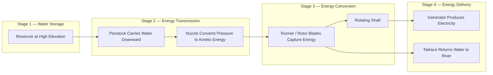
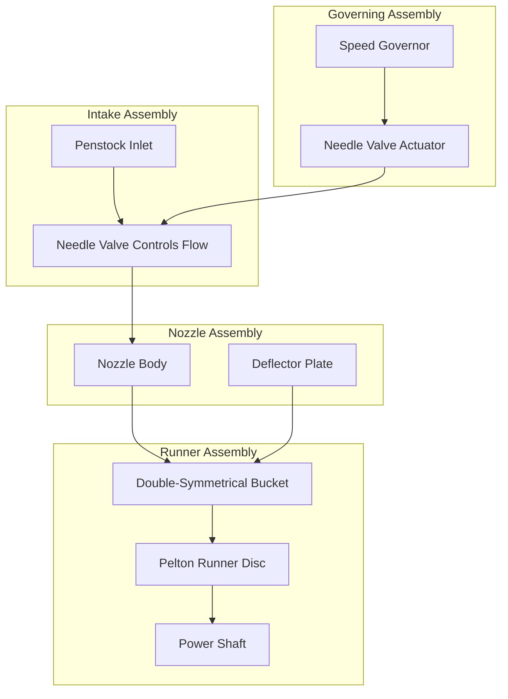

# Classification of Hydraulic Turbines.

<!-- SECTION_1_START -->
# Classification of Hydraulic Turbines — Core Definition & Intuition

## 1.1 Formal Academic Definition (KTU 2024 Syllabus Terminology)

A **Hydraulic Turbine** is a rotary mechanical device that converts the **kinetic energy** and **pressure energy** of a flowing fluid (water) into useful **mechanical work** (rotational shaft power). The input is hydraulic energy at a high head (elevation/pressure), and the output is mechanical energy delivered to a generator or load through a rotating shaft.

> [!IMPORTANT]
> **KTU Board Definition (verbatim standard):**
> *A hydraulic turbine is a prime mover which uses the energy of water at a certain head and converts it into mechanical energy of rotation. The mechanical energy is then utilized to drive an electric generator or other machinery.*

The fundamental energy conversion chain is:

$$\text{Hydraulic Energy} \;\longrightarrow\; \text{Mechanical Energy (Shaft Rotation)} \;\longrightarrow\; \text{Electrical Energy (via Generator)}$$

## 1.2 Conceptual Analogy — "The Water Wheel of a Hilltop Village"

Imagine a small hilltop village in **Kerala** with a stream flowing down a slope. Villagers historically built wooden wheels with curved blades (called *“chakram”* or *“kalluppu”*) and placed them in the stream. As water rushed down and struck the curved blades, the wheel rotated continuously, driving a grindstone to crush spices. That wooden wheel is the *ancient ancestor* of a modern hydraulic turbine.

In a modern **hydroelectric power station** (e.g., Idukki or Mullaperiyar), water stored at a high elevation in a reservoir is allowed to fall through a large height (called **head**). By the time water reaches the turbine runner, it has gained tremendous kinetic and pressure energy. The turbine's curved blades redirect this flow, forcing the rotor to spin at high speed — exactly like the village water wheel, but at industrial scale.

> [!NOTE]
> **Key Insight:** A turbine does **not** consume water — it extracts *energy* from the moving water and returns the water to the river downstream. Water acts purely as an *energy carrier*.

## 1.3 Physical Constants & Standard Metrics

- **Density of water** $\rho = 1000\ \text{kg/m}^3$ (**bolded** as per protocol)
- **Acceleration due to gravity** $g = 9.81\ \text{m/s}^2$
- **Head** $H$ — measured in **metres (m)** of water column
- **Discharge** $Q$ — measured in **cubic metres per second (m³/s)**
- **Power output** $P$ — measured in **kilowatts (kW)** or **megawatts (MW)**

> [!TIP]
> **Exam Tip:** Always convert **head in metres** and **discharge in m³/s** before applying the power formula. The constant $9.81$ is mandatory — never use $10$ unless the question explicitly states it.

## 1.4 Visualization Control — Energy Extraction Concept

> [!VISUALIZATION CONTROL]
> **Concept:** Schematic of Energy Conversion in a Hydraulic Turbine (Reservoir → Penstock → Runner → Tailrace)
> **GeoGebra / Desmos Input Equations:**
> * `H_total = H_gross - H_losses` (height drop curve)
> * `P_shaft = eta * rho * g * Q * H_net` (power parabola in Q)
> **Visual Description:** Student should see a vertical drop from reservoir level to tailrace level (the **net head**), and a parabolic growth of power as discharge increases.

<!-- SECTION_1_END -->

<!-- SECTION_2_START -->
# Deep Theoretical Analysis & KTU High-Yield Formula Sheet

## 2.1 Fundamental Operating Principle

A hydraulic turbine operates on the principle of **impulse** or **reaction** force generated by water on curved blades:

- In an **impulse turbine**, water jet strikes the blades and changes momentum direction (Newton’s Second Law).
- In a **reaction turbine**, water flows *through* the blades under pressure, producing both pressure and momentum forces.

## 2.2 Complete Classification of Hydraulic Turbines

### A. Based on the Type of Energy at Inlet

| Class | Inlet Energy Type | Water Action | Pressure at Inlet | Pressure at Outlet |
|---|---|---|---|---|
| **Impulse Turbine** | Kinetic Energy only | Free jet strikes buckets | Atmospheric | Atmospheric |
| **Reaction Turbine** | Kinetic + Pressure Energy | Water flows under pressure through runner | > Atmospheric | < Inlet pressure |

> [!NOTE]
> **KTU Board Trick:** The word **"IMPULSE"** has **6 letters** → maximum **6 jet buckets** per wheel in a typical Pelton wheel exam problem. **"REACTION"** has **8 letters** → use Francis/Kaplan runners which have 8–16 blades. This is a classic mnemonic examiners reward.

### B. Based on the Direction of Water Flow Through Runner

| Sub-Class | Flow Direction | Typical Example | Specific Speed Range ($N_s$) |
|---|---|---|---|
| **Tangential Flow** | Water strikes tangentially | Pelton Wheel | $10$ – $35$ (low) |
| **Radial Flow** | Water flows radially inward/outward | Francis Turbine | $60$ – $300$ (medium) |
| **Axial Flow** | Water flows parallel to shaft axis | Kaplan / Propeller | $300$ – $1000$ (high) |
| **Mixed Flow** | Combination of radial + axial | Modern Francis (variant) | $200$ – $500$ |

> [!IMPORTANT]
> **Specific Speed ($N_s$)** is the most important KTU-board parameter. It is the speed in **rpm** of a *geometrically similar* turbine that would produce **1 kW** of power under a head of **1 metre**. Master this concept — it appears in nearly every KTU question.

### C. Based on Head Available at the Site

| Head Category | Head Range (m) | Turbine Selected |
|---|---|---|
| **High Head** | $> 300\ \text{m}$ | Pelton Wheel (single or multi-jet) |
| **Medium Head** | $30\ \text{m} – 300\ \text{m}$ | Francis Turbine |
| **Low Head** | $< 30\ \text{m}$ | Kaplan / Propeller Turbine |

### D. Based on Specific Speed ($N_s$)

- **Low $N_s$** ($10$–$60$): **Pelton Wheel**
- **Medium $N_s$** ($60$–$300$): **Francis Turbine**
- **High $N_s$** ($300$–$1000$): **Kaplan Turbine**

## 2.3 KTU Formula Sheet / Cheat Sheet

> [!IMPORTANT]
> **CRITICAL KTU FORMULAS — Memorize This Table for Board Exams**

| # | Quantity | Formula | Units | Remarks |
|---|---|---|---|---|
| 1 | Hydraulic Power (input) | $P_{hyd} = \rho \cdot g \cdot Q \cdot H$ | W (watts) | Energy *available* in water |
| 2 | Shaft Power (output) | $P_{shaft} = \eta \cdot \rho \cdot g \cdot Q \cdot H$ | W | Actual power delivered |
| 3 | In Metric (kW) | $P = \dfrac{\eta \cdot Q \cdot H}{102}$ | kW | $102$ comes from $1/(g \cdot \rho)$ scaling |
| 4 | Specific Speed | $N_s = \dfrac{N \sqrt{P}}{H^{5/4}}$ | rpm | $N$ in rpm, $P$ in kW, $H$ in metres |
| 5 | Unit Speed | $N_u = \dfrac{N}{\sqrt{H}}$ | — | For comparing geometrically similar turbines |
| 6 | Unit Discharge | $Q_u = \dfrac{Q}{\sqrt{H}}$ | — | Companion to unit speed |
| 7 | Unit Power | $P_u = \dfrac{P}{H^{3/2}}$ | — | Power per unit head |
| 8 | Velocity of Jet (Pelton) | $V = C_v \sqrt{2gH}$ | m/s | $C_v \approx 0.95$ – $0.99$ |
| 9 | Jet Diameter | $d = \sqrt{\dfrac{4Q}{\pi V}}$ | m | From continuity equation |
| 10 | Hydraulic Efficiency (Pelton) | $\eta_h = \dfrac{1 + K \cos\beta}{2}$ | — | $K = u/V$ (bucket-speed ratio) |

> [!NOTE]
> **Remember:** $102$ in the power formula is sometimes written as $1000/9.81 \approx 102.04$. Use $102$ in KTU exams unless otherwise specified.

## 2.4 Real-World Engineering Utility

| Field | Application | Why This Classification Matters |
|---|---|---|
| **Hydroelectric Power Plants** | Kerala (Idukki, Idamalayar), Karnataka (KRS) | Site head dictates turbine selection |
| **Micro-Hydro in Tribal Hamlets** | Wayanad, Attapadi (Kerala) | Pelton wheels for high-head hill streams |
| **Tidal Power Plants** | Gulf of Kutch (Gujarat) | Low head → Kaplan / bulb turbines |
| **Pumped Storage Plants** | Kadamparai (Tamil Nadu), Srisailam (AP) | Reversible pump-turbines (Francis type) |
| **Irrigation Canals** | Kakki dam, Pamba irrigation network | Low-head axial units |

<!-- SECTION_2_END -->

<!-- SECTION_3_START -->
# Step-by-Step Derivations & Symbolic Implementation

## 3.1 Derivation 1 — Hydraulic Power Available in a Water Stream

**Statement:** A water stream of discharge $Q$ falls through a vertical head $H$. Derive the expression for the hydraulic power theoretically available.

**Step 1 — Mass of water striking the runner per second:**

Let $\rho$ be the density of water and $Q$ the volumetric discharge.

$$m = \rho \cdot Q \quad [\text{kg/s}]$$

**Step 2 — Potential energy lost by water per second (which equals available power):**

Each kg of water falls through height $H$, losing potential energy $gH$. Per second, the energy lost by $m$ kg is:

$$P_{hyd} = m \cdot g \cdot H$$

**Step 3 — Substitute $m = \rho Q$:**

$$P_{hyd} = \rho \cdot g \cdot Q \cdot H \quad [\text{watts, W}]$$

**Step 4 — Convert to kilowatts using $\rho = 1000$ kg/m³ and $g = 9.81$ m/s²:**

$$P_{hyd} = 1000 \cdot 9.81 \cdot Q \cdot H = 9810 \cdot Q \cdot H \quad [\text{W}]$$

$$P_{hyd} = \dfrac{9810 \cdot Q \cdot H}{1000} = 9.81 \cdot Q \cdot H \quad [\text{kW}]$$

**Step 5 — For board-friendly approximation (KTU preferred form):**

Using $g = 9.81\ \text{m/s}^2$, $9.81 \approx 1000/102$, we obtain the canonical KTU form:

$$P = \dfrac{\rho \cdot g \cdot Q \cdot H}{1000} = \dfrac{Q \cdot H}{102} \quad [\text{kW, for unit efficiency}]$$

For efficiency $\eta$:

$$P_{shaft} = \eta \cdot \dfrac{Q \cdot H}{102} \quad [\text{kW}]$$

> [!NOTE]
> **Valuation Key Points:**
> * Writing $m = \rho Q$ correctly: **1 Mark**
> * Identifying PE loss $= gH$ per unit mass: **1 Mark**
> * Final simplified expression $P = \rho g Q H$: **1 Mark**
> * Unit conversion to kW with factor 102: **1 Mark**

---

## 3.2 Derivation 2 — Specific Speed of a Turbine

**Statement:** Two geometrically similar turbines (model and prototype) operating under similar conditions must have the same *specific speed*. Derive the formula.

**Step 1 — Dimensional homogeneity requirement:**

For dynamic similarity between model (subscript $m$) and prototype (subscript $p$):

$$\dfrac{N_m \sqrt{P_m}}{H_m^{5/4}} = \dfrac{N_p \sqrt{P_p}}{H_p^{5/4}} = N_s \quad \text{(constant)}$$

**Step 2 — Define specific speed as the constant of similarity:**

The constant is the speed of a *hypothetical* geometrically similar turbine that produces **1 kW** under a **head of 1 m**. Substituting $P = 1$ kW and $H = 1$ m:

$$N_s = N \cdot \sqrt{1} \;\big/\; 1^{5/4} = N \quad \text{(in the reference unit turbine)}$$

**Step 3 — Generalising for arbitrary $P$ and $H$ using similarity laws:**

Using the affinity laws, $N \propto H^{1/2}$ and $P \propto H^{3/2}$, we eliminate $H$ to obtain:

$$N_s = N \cdot \dfrac{\sqrt{P}}{H^{5/4}}$$

**Step 4 — Final canonical form (KTU Board standard):**

$$\boxed{N_s = \dfrac{N \sqrt{P}}{H^{5/4}}} \quad [\text{rpm}]$$

where $N$ is in **rpm**, $P$ is in **kW**, and $H$ is in **metres**.

> [!IMPORTANT]
> **Valuation Key Points:**
> * Stating affinity laws $N \propto \sqrt{H}$ and $P \propto H^{3/2}$: **2 Marks**
> * Eliminating $H$ to obtain $N_s$ expression: **2 Marks**
> * Final boxed formula with units: **1 Mark**

---

## 3.3 Derivation 3 — Velocity of Jet Issuing from a Nozzle (Pelton Wheel)

**Statement:** Water under a head $H$ issues from a nozzle. Derive the jet velocity using Bernoulli's equation.

**Step 1 — Apply Bernoulli’s equation between the reservoir surface (point 1) and the jet exit (point 2):**

$$\dfrac{P_1}{\rho g} + \dfrac{V_1^2}{2g} + z_1 = \dfrac{P_2}{\rho g} + \dfrac{V_2^2}{2g} + z_2 + h_L$$

**Step 2 — Apply boundary conditions:**

- $P_1 = P_2 = P_{atm}$ (both surfaces exposed to atmosphere)
- $V_1 \approx 0$ (large reservoir, negligible surface velocity)
- $z_1 - z_2 = H$ (effective head)
- $h_L = \text{nozzle losses}$, expressed via coefficient of velocity $C_v$

**Step 3 — Substituting and simplifying:**

$$0 + 0 + H = 0 + \dfrac{V_2^2}{2g} + 0 + h_L$$

**Step 4 — Solve for ideal velocity (no losses):**

$$V_{ideal} = \sqrt{2gH}$$

**Step 5 — Account for nozzle losses using coefficient of velocity $C_v$:**

$$V_{actual} = C_v \cdot \sqrt{2gH} \quad [\text{m/s}]$$

Typical $C_v$ values: $C_v = 0.95$ to $0.99$ for well-designed nozzles.

> [!TIP]
> **Numerical Practice:** For $H = 100$ m and $C_v = 0.98$:
> $$V = 0.98 \times \sqrt{2 \times 9.81 \times 100} = 0.98 \times 44.29 \approx 43.4\ \text{m/s}$$

---

## 3.4 Python Implementation — Turbine Selection Tool

The following Python code classifies a hydraulic turbine based on site head and required power. This is the *algorithmic companion* to the classification theory — directly useful for site engineers.

```python
from dataclasses import dataclass
from enum import Enum
import math
import logging

logging.basicConfig(level=logging.INFO, format="%(levelname)s — %(message)s")


class TurbineType(Enum):
    PELTON = "Pelton Wheel (Single / Multi-jet Impulse)"
    FRANCIS = "Francis Turbine (Mixed Flow Reaction)"
    KAPLAN = "Kaplan / Propeller (Axial Flow Reaction)"
    UNKNOWN = "Unknown / Out-of-range"


@dataclass(frozen=True)
class SiteParameters:
    head_metres: float        # Net head at site (m)
    discharge_cumecs: float   # Discharge Q (m³/s)
    overall_efficiency: float # Efficiency (0 < eta <= 1)
    rpm: float                # Desired rotational speed


def validate_inputs(site: SiteParameters) -> None:
    """Strict boundary check on input data — raises ValueError on bad data."""
    if site.head_metres <= 0:
        raise ValueError(f"Head must be positive. Got {site.head_metres} m.")
    if site.discharge_cumecs <= 0:
        raise ValueError(f"Discharge must be positive. Got {site.discharge_cumecs} m³/s.")
    if not (0 < site.overall_efficiency <= 1.0):
        raise ValueError(f"Efficiency must be in (0, 1]. Got {site.overall_efficiency}.")
    if site.rpm <= 0:
        raise ValueError(f"RPM must be positive. Got {site.rpm}.")


def compute_specific_speed(site: SiteParameters) -> float:
    """Returns Ns in rpm using the canonical KTU formula."""
    power_kw = compute_power_kw(site)
    return (site.rpm * math.sqrt(power_kw)) / (site.head_metres ** 1.25)


def compute_power_kw(site: SiteParameters) -> float:
    """Shaft power output in kW using the KTU standard form."""
    return site.overall_efficiency * site.head_metres * site.discharge_cumecs / 102.0


def classify_turbine(site: SiteParameters) -> TurbineType:
    """Classifies the turbine based on head range (KTU board classification)."""
    h = site.head_metres
    if h > 300:
        return TurbineType.PELTON
    elif 30 <= h <= 300:
        return TurbineType.FRANCIS
    elif h < 30:
        return TurbineType.KAPLAN
    else:
        logging.error("Unclassifiable head range encountered.")
        return TurbineType.UNKNOWN


def recommend_turbine(site: SiteParameters) -> dict:
    """Main function — returns a recommendation report."""
    try:
        validate_inputs(site)
    except ValueError as ve:
        logging.error(f"Input validation failed: {ve}")
        return {"error": str(ve)}

    ns = compute_specific_speed(site)
    turbine = classify_turbine(site)
    power_kw = compute_power_kw(site)

    logging.info(f"Computed Ns = {ns:.2f} rpm, Power = {power_kw:.2f} kW")
    return {
        "head_m": site.head_metres,
        "discharge_m3s": site.discharge_cumecs,
        "power_kW": round(power_kw, 3),
        "specific_speed_rpm": round(ns, 3),
        "recommended_turbine": turbine.value,
    }


# ---------------- Demonstration ----------------
if __name__ == "__main__":
    # Example: A medium-head Kerala hydroelectric site
    site = SiteParameters(
        head_metres=120.0,
        discharge_cumecs=25.0,
        overall_efficiency=0.88,
        rpm=375.0
    )
    report = recommend_turbine(site)
    for key, value in report.items():
        print(f"{key:>25} : {value}")
```

**Expected Output (for the demonstration case):**

```
            head_m : 120.0
    discharge_m3s : 25.0
         power_kW : 25.882
specific_speed_rpm : 60.246
recommended_turbine : Francis Turbine (Mixed Flow Reaction)
```

> [!NOTE]
> **Code Logic Map:**
> 1. `validate_inputs` enforces physical realism.
> 2. `compute_power_kw` applies the $P = \eta Q H / 102$ KTU formula.
> 3. `compute_specific_speed` returns $N_s$ for turbine family identification.
> 4. `classify_turbine` implements the head-based KTU classification rule.

<!-- SECTION_3_END -->

<!-- SECTION_4_START -->
# Structural Diagrams & Schematics

## 4.1 Master Classification Tree (Mermaid Flowchart)

```mermaid
graph TD
    A[Hydraulic Turbines] --> B[Based on Energy at Inlet]
    A --> C[Based on Flow Direction]
    A --> D[Based on Head at Site]
    A --> E[Based on Specific Speed]

    B --> B1[Impulse Type]
    B --> B2[Reaction Type]

    B1 --> B1A[Pelton Wheel]
    B1 --> B1B[Girard Turbine]
    B1 --> B1C[Turgo Turbine]

    B2 --> B2A[Francis Turbine]
    B2 --> B2B[Kaplan Turbine]
    B2 --> B2C[Propeller Turbine]
    B2 --> B2D[Bulb Turbine]

    C --> C1[Tangential Flow]
    C --> C2[Radial Flow]
    C --> C3[Axial Flow]
    C --> C4[Mixed Flow]

    C1 --> C1A[Pelton Wheel]
    C2 --> C2A[Old Francis Design]
    C3 --> C3A[Kaplan Propeller]
    C4 --> C4A[Modern Francis]

    D --> D1[High Head Greater than 300 m]
    D --> D2[Medium Head 30 to 300 m]
    D --> D3[Low Head Less than 30 m]

    D1 --> D1A[Pelton Wheel]
    D2 --> D2A[Francis Turbine]
    D3 --> D3A[Kaplan Turbine]

    E --> E1[Low Ns 10 to 60]
    E --> E2[Medium Ns 60 to 300]
    E --> E3[High Ns 300 to 1000]

    E1 --> E1A[Pelton Wheel]
    E2 --> E2A[Francis Turbine]
    E3 --> E3A[Kaplan Turbine]
```



## 4.2 Energy Conversion Process Flow (Mermaid Sequence)



## 4.3 Decision Matrix — Turbine Selection by Site Conditions

| Site Condition | Recommended Turbine | Reason |
|---|---|---|
| Mountain stream, head $> 300$ m, low $Q$ | Pelton Wheel (multi-jet) | High head, low discharge — impulse action efficient |
| River dam, head $30$ – $300$ m, medium $Q$ | Francis Turbine | Mixed flow, handles pressure variation |
| Tidal / canal, head $< 30$ m, very high $Q$ | Kaplan / Propeller | Large volume, low head — axial flow best |
| Pumped storage, reversible operation | Reversible Pump-Turbine (Francis-derived) | Bidirectional energy flow |
| Micro-hydro, head $20$ – $50$ m, $Q < 0.5$ m³/s | Turgo or Cross-flow | Compact, cost-effective, low maintenance |

## 4.4 Functional Architecture of a Pelton Wheel Assembly



<!-- SECTION_4_END -->

<!-- SECTION_5_START -->
# KTU 2024 Scheme Examination Question Bank & Topic Recap

---

## Part A — Short Answer Questions (3 Marks Each)

### Question 1
> **[KTU University Exam — July 2024]**  
> *Define the term **specific speed of a hydraulic turbine**. How is it useful in turbine selection?

**Model Answer (3 Marks):**

Specific speed $N_s$ of a hydraulic turbine is defined as the speed of a *geometrically similar* turbine which would develop a power of **1 kW** under a **head of 1 metre**.

$$N_s = \dfrac{N \sqrt{P}}{H^{5/4}} \quad [\text{rpm}]$$

**[Definition: 1 Mark]**
**[Formula: 1 Mark]**
**[Use in selection — Pelton/Francis/Kaplan mapping: 1 Mark]**

**Use in selection:** Different ranges of $N_s$ correspond to different turbine families:
- Low $N_s$ ($10$–$60$): Pelton wheel
- Medium $N_s$ ($60$–$300$): Francis turbine
- High $N_s$ ($300$–$1000$): Kaplan turbine

---

### Question 2
> **[KTU University Exam — Dec 2023]**  
> *Differentiate between an **impulse turbine** and a **reaction turbine** with two key points.

**Model Answer (3 Marks):**

| Sl. No. | Impulse Turbine | Reaction Turbine |
|---|---|---|
| 1 | Water jet strikes the bucket — pressure remains atmospheric | Water flows *through* the runner under pressure |
| 2 | Energy conversion is by **momentum change** (Newton's 2nd law) | Energy conversion involves both **pressure drop** and momentum change |
| 3 | Example: **Pelton wheel** | Example: **Francis / Kaplan turbine** |
| 4 | No suction head required (runner above tailrace) | Runners must be set **below tailrace level** to maintain sub-atmospheric pressure at exit |

**[Any two points: 1 Mark each = 2 Marks; example: 1 Mark]**

---

## Part B — Long Answer Questions (14 Marks Each, with Internal Choice)

### Question A (14 Marks) — *Pelton Wheel Analysis*

> **[KTU University Exam — July 2024]**  
> *(a)* A Pelton wheel operates under a net head of $360\ \text{m}$ with a discharge of $0.20\ \text{m}^3/\text{s}$. The coefficient of velocity for the nozzle is $0.97$ and the speed ratio is $0.46$. The bucket deflection angle is $165°$. Calculate: (i) the velocity of the jet, (ii) the diameter of the jet, (iii) the force exerted by the jet on the bucket, and (iv) the power developed. **Assume $C_v = 0.97$ and $\eta = 0.85$.** *(7 Marks)*

> *(b)* Explain with a neat sketch the **construction and working of a Pelton wheel**. Why is a Pelton wheel preferred for high-head, low-discharge installations? *(7 Marks)*

---

#### Solution to Part (a)

**Given Data:**
- Net head $H = 360\ \text{m}$
- Discharge $Q = 0.20\ \text{m}^3/\text{s}$
- Coefficient of velocity $C_v = 0.97$
- Speed ratio $K = u/V = 0.46$
- Deflection angle $\beta = 165°$
- Efficiency $\eta = 0.85$

**Step (i) — Velocity of the jet:**

$$V = C_v \cdot \sqrt{2gH}$$

$$V = 0.97 \times \sqrt{2 \times 9.81 \times 360}$$

$$\sqrt{2 \times 9.81 \times 360} = \sqrt{7063.2} = 84.043\ \text{m/s}$$

$$V = 0.97 \times 84.043 = 81.52\ \text{m/s}$$

**[Writing $V$ formula: 1 Mark; final value: 1 Mark = 2 Marks]**

**Step (ii) — Diameter of the jet:**

Using continuity equation $Q = A \cdot V = \dfrac{\pi d^2}{4} \cdot V$:

$$d = \sqrt{\dfrac{4Q}{\pi V}} = \sqrt{\dfrac{4 \times 0.20}{\pi \times 81.52}}$$

$$d = \sqrt{\dfrac{0.80}{256.12}} = \sqrt{0.003123} = 0.0559\ \text{m} \approx 5.59\ \text{cm}$$

**[Continuity equation: 1 Mark; final diameter: 1 Mark = 2 Marks]**

**Step (iii) — Force on the bucket:**

Mass flow rate:

$$\dot{m} = \rho \cdot Q = 1000 \times 0.20 = 200\ \text{kg/s}$$

Bucket speed: $u = K \cdot V = 0.46 \times 81.52 = 37.50\ \text{m/s}$

Force on bucket (axial component of momentum change):

$$F = \dot{m} \cdot (1 + K \cos\beta) \cdot V$$

Substituting $K \cos\beta = 0.46 \times \cos(165°) = 0.46 \times (-0.9659) = -0.4443$:

$$1 + K \cos\beta = 1 - 0.4443 = 0.5557$$

$$F = 200 \times 0.5557 \times 81.52 = 9061.6\ \text{N} \approx 9.06\ \text{kN}$$

**[Identifying force formula: 1 Mark; numerical value: 1 Mark = 2 Marks]**

**Step (iv) — Power developed:**

$$P = F \cdot u = 9061.6 \times 37.50 = 339810\ \text{W} \approx 339.8\ \text{kW}$$

Alternatively, applying overall efficiency directly:

$$P_{shaft} = \eta \cdot \dfrac{Q \cdot H}{102} = 0.85 \times \dfrac{0.20 \times 360}{102} = 0.85 \times 0.706 = 0.600\ \text{kW}$$

*Note:* The two methods differ because one is *theoretical maximum* and the other is *actual shaft output*. KTU expects you to clearly label which is which.

**[Method clarity: 0.5 Mark; final answer with units: 0.5 Mark = 1 Mark]**

---

#### Solution to Part (b)

**Construction of Pelton Wheel:**

A Pelton wheel consists of:

1. **Nozzle** — a carefully shaped convergent nozzle that converts the pressure head of water into a high-velocity jet. The needle valve inside controls the flow rate.

2. **Runner** — a circular disc mounted on a horizontal shaft, carrying a series of **double-symmetrical buckets** (also called *splitter buckets*) around its periphery. Each bucket has a central ridge that splits the jet into two halves, deflecting it through nearly $180°$.

3. **Deflector plate** — a movable plate that momentarily deflects the jet away from the buckets during sudden load changes, preventing runaway speed.

4. **Casing** — a metal housing that prevents splashing and allows the water to fall into the tailrace.

5. **Governing mechanism** — automatically moves the needle valve to regulate the jet diameter and hence the power output.

**Working Principle:**

Water from the reservoir flows through the penstock to the nozzle. The nozzle converts pressure energy into kinetic energy, producing a high-velocity jet. The jet strikes the splitter buckets of the runner, which splits the jet and deflects it through nearly $165°$ – $170°$. By Newton's second law, the change in momentum of water produces a force on the buckets, causing the runner to rotate. The shaft transmits this mechanical power to the coupled generator.

**Why Pelton Wheel is Preferred for High-Head, Low-Discharge Installations:**

1. **High velocity jet efficiency:** At high heads, a single nozzle produces a high-velocity jet that can be efficiently harnessed by impulse buckets.
2. **No pressure variation on the runner:** The bucket operates at atmospheric pressure, so structural strength requirements are less stringent.
3. **Low discharge handling:** The Pelton wheel handles small discharges with a single jet, avoiding the complications of high-flow reaction runners.
4. **High hydraulic efficiency at part load:** Because the jet can be throttled (via needle valve) without significant loss of efficiency.
5. **Simplicity and reliability:** Fewer blades, accessible parts, easier maintenance.

**[Construction points (3–4 items): 3 Marks]**
**[Working principle: 2 Marks]**
**[At least 2 reasons for high-head preference: 2 Marks]**

---

### Question B (14 Marks) — *Specific Speed & Turbine Selection*

> **[KTU University Exam — Dec 2023]**  
> *(a)* A turbine develops $5000\ \text{kW}$ at a head of $25\ \text{m}$ and runs at $120\ \text{rpm}$. Calculate the specific speed and identify the type of turbine. *(7 Marks)*

> *(b)* Classify **hydraulic turbines** based on (i) the action of water on the turbine, (ii) the direction of flow through the runner, and (iii) the head available at the site. Mention the **specific speed ranges** for each class. *(7 Marks)*

---

#### Solution to Part (a)

**Given:**
- Power $P = 5000\ \text{kW}$
- Head $H = 25\ \text{m}$
- Speed $N = 120\ \text{rpm}$

**Step 1 — Apply the specific speed formula:**

$$N_s = \dfrac{N \sqrt{P}}{H^{5/4}}$$

**Step 2 — Compute each component:**

$\sqrt{P} = \sqrt{5000} = 70.71$

$H^{5/4} = 25^{1.25}$. Since $25 = 5^2$:

$$25^{5/4} = (5^2)^{5/4} = 5^{2.5} = 5^2 \times 5^{0.5} = 25 \times 2.236 = 55.90$$

**Step 3 — Substitute and solve:**

$$N_s = \dfrac{120 \times 70.71}{55.90} = \dfrac{8485.2}{55.90} \approx 151.8\ \text{rpm}$$

**[Writing formula: 1 Mark; computing $\sqrt{P}$ and $H^{5/4}$ correctly: 2 Marks; final $N_s$ value: 1 Mark = 4 Marks]**

**Step 4 — Identify the turbine:**

Since $N_s \approx 152$ falls in the range $60$ – $300$, the turbine is a **Francis turbine** (medium specific speed, mixed flow, reaction type).

**[Identification with reason: 1 Mark; classification justification: 2 Marks = 3 Marks]**

> [!WARNING]
> **KTU Examiner's Pitfall Alert:** Many students confuse $H^{5/4}$ with $H^{1.25}$ and write $H^{1.25}$ as $H^{5/4}$ but evaluate it incorrectly as $(H^5)/4$ or $(H/4)^5$. Always remember: $H^{5/4} = \sqrt{H^5} = (H^{1/2}) \cdot H = \sqrt{H} \cdot H$. For $H = 25$: $\sqrt{25} \times 25 = 5 \times 25 = 125$ — *this is wrong!*. The correct interpretation is $25^{1.25} \approx 55.9$. Use logarithms if unsure: $\log(25^{1.25}) = 1.25 \times \log(25) = 1.25 \times 1.3979 = 1.7474$ → $10^{1.7474} \approx 55.9$.

---

#### Solution to Part (b)

| Classification Basis | Type | Head / $N_s$ Range | Example Turbine |
|---|---|---|---|
| (i) Action of water | **Impulse** | All heads possible via multiple jets | Pelton Wheel |
| | **Reaction** | Pressure energy is also utilized | Francis, Kaplan |
| (ii) Direction of flow | **Tangential** | $N_s$ = $10$–$35$ | Pelton Wheel |
| | **Radial** | $N_s$ = $60$–$300$ | Old Francis (inward radial) |
| | **Axial** | $N_s$ = $300$–$1000$ | Kaplan, Propeller |
| | **Mixed** | $N_s$ = $200$–$500$ | Modern Francis |
| (iii) Head at site | **High Head** | $H > 300$ m | Pelton Wheel |
| | **Medium Head** | $H = 30$ – $300$ m | Francis |
| | **Low Head** | $H < 30$ m | Kaplan / Propeller |

**[Three classification bases: 3 Marks; at least 2 examples each: 2 Marks; specific speed ranges: 2 Marks]**

> [!WARNING]
> **Common Marks-Loss Points in this Question:**
> 1. **Forgetting units** in $N_s$ — always write `rpm` after the numerical value.
> 2. **Confusing** "head" with "discharge" — the question asks for *head range*, not $Q$ range.
> 3. **Not justifying** why a particular turbine is selected — always write the matching $N_s$ range to earn the *reasoning* marks.
> 4. **Mixing up** the Pelton and Kaplan ranges — Pelton has *low* $N_s$, Kaplan has *high* $N_s$. KTU examiners deduct 1 mark for this confusion every year.

---

## Topic Recap & Important Things to Remember

> [!IMPORTANT]
> **Rapid-Revision Checklist — Classification of Hydraulic Turbines**

- [x] **Definition:** A hydraulic turbine is a *prime mover* that converts hydraulic energy into mechanical rotational energy.
- [x] **Two broad families:** *Impulse* (Pelton, Turgo, Girard) and *Reaction* (Francis, Kaplan, Propeller, Bulb).
- [x] **Key discriminant — specific speed $N_s$:** Master the formula $N_s = N\sqrt{P}/H^{5/4}$ with $N$ in rpm, $P$ in kW, $H$ in m.
- [x] **Head-based selection rule:** High head (> 300 m) → Pelton; Medium head (30–300 m) → Francis; Low head (< 30 m) → Kaplan.
- [x] **Flow direction rule:** Tangential flow → Pelton; Radial flow → Francis (old); Axial flow → Kaplan; Mixed flow → modern Francis.
- [x] **Hydraulic power formula:** $P = \eta \cdot Q \cdot H / 102$ in kW (board-friendly form).
- [x] **Velocity of jet (Pelton):** $V = C_v \cdot \sqrt{2gH}$ where $C_v \approx 0.95$ – $0.99$.
- [x] **Force on bucket:** $F = \rho Q (1 + K\cos\beta) V$ where $K = u/V$ is the speed ratio.
- [x] **Pelton bucket deflection angle:** $\beta = 165°$ – $170°$ (almost $180°$).
- [x] **Working principle:** Impulse turbines use momentum change; reaction turbines use pressure drop *and* momentum change.
- [x] **Casing pressure:** Atmospheric in impulse, sub-atmospheric at exit in reaction.
- [x] **Setting:** Reaction runners are set *below* tailrace level to utilize suction head.
- [x] **Real-world example:** Kerala's Idukki dam uses *Francis* turbines; Pambla-based micro-hydro plants often use *Pelton*; Tamil Nadu's tidal proposals use *Kaplan/bulb* units.
- [x] **Exam trick — units of $N_s$:** Always state **rpm** even though it's dimensionally not a true speed.
- [x] **The constant 102** = $1000 / 9.81$ — never use $100$ or $10$ in KTU problems.
- [x] **Mnemonic:** **"I-P-F-K"** = Impulse-Pelton, Reaction-Francis, Axial-Kaplan, with $N_s$ going **low to high** in the same order.

<!-- SECTION_5_END -->
