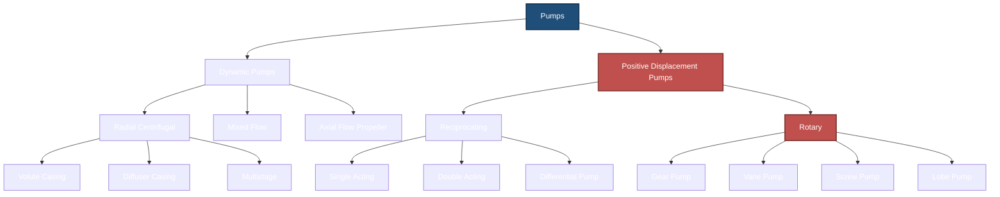
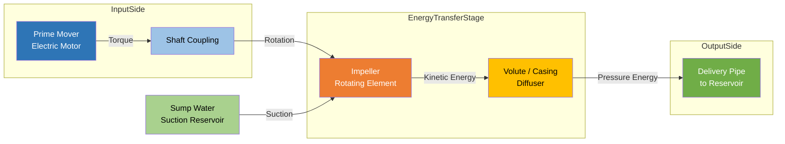
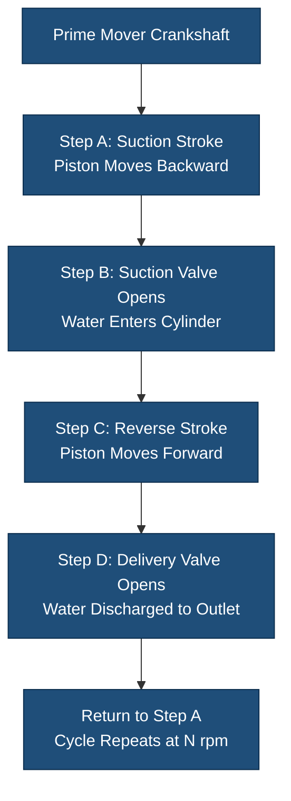

# Classification of pumps,

<!-- SECTION_1_START -->
# 1. Core Technical Definition & Intuitive Overview

## 1.1 Formal Academic Definition

A **pump** is a hydraulic machine that converts **mechanical energy** (supplied by a prime mover such as an electric motor, diesel engine, or turbine) into **hydraulic energy** (pressure + kinetic energy of the fluid). This pressurized fluid is then used to lift, transport, or circulate liquids against system resistances.

> [!NOTE]
> **KTU 2024 Syllabus Definition (Module 2 – Hydraulic Machines):**
> A pump is a device which imparts energy to a fluid, thereby causing it to move from a lower pressure region to a higher pressure region. The energy transfer is quantified in terms of **head** (in meters of fluid) and **discharge** (in $m^3/s$ or $\text{lps}$).

> [!IMPORTANT]
> **Core Highlight – Energy Conversion Chain:**
> Mechanical Energy $\rightarrow$ Rotational / Reciprocating Motion $\rightarrow$ Kinetic Energy of fluid $\rightarrow$ Pressure Energy $\rightarrow$ Flow at the delivery point.

## 1.2 Conceptual Analogy & Intuition

**Real-world Analogy — The Human Heart:**
Think of a pump exactly like the **human heart**.
- The **heart** is the *prime mover's agent*, contracting and relaxing.
- **Blood** is the *fluid* being moved.
- **Arteries and veins** are the *suction and delivery pipes*.
- The **blood pressure** the doctor measures is exactly the **pump head** delivered to the system.

In the same way, an engineering pump "sucks" fluid from a sump (suction side) and "pushes" it to a tank, a high-rise building, or a farm field (delivery side). The greater the height or resistance, the more **head** the pump must develop.

## 1.3 Geometric Intuition of Pump Action

> [!VISUALIZATION CONTROL]
> **Concept:** Suction head ($H_s$), Delivery head ($H_d$), and Total head ($H$) representation on a vertical reference line.
> **GeoGebra / Desmos Input Equations:**
> * Point A: $(0, 0)$ — Pump centerline
> * Point B: $(0, -H_s)$ — Water level in sump
> * Point C: $(0, +H_d)$ — Water level in overhead tank
> * Line: $x = 0$ (vertical pump datum axis)
> **Visual Description:** A vertical y-axis where the negative half represents suction lift and the positive half represents delivery lift. The **total head** $H = H_s + H_d$ is the span from the sump water surface to the delivery tank water surface.

> [!TIP]
> For KTU board answers, always draw a neat **sketch** showing suction pipe, delivery pipe, foot valve, and strainer — it instantly earns **2–3 valuation marks** even before calculations begin.

## 1.4 Primary Classification (KTU Module 2 Anchor Concept)

Pumps are broadly classified into two fundamental families based on the **mechanism of energy transfer**:

1. **Dynamic Pumps (Rotodynamic / Velocity Pumps)** — Energy is added continuously by a rotating impeller.
2. **Positive Displacement Pumps (PD Pumps)** — Energy is added by trapping a fixed volume of fluid and mechanically forcing it into the discharge pipe.

> [!IMPORTANT]
> **Memorize this anchor sentence for the 3-mark KTU short-answer:**
> *"Pumps are classified as Dynamic (Centrifugal, Axial, Mixed flow) and Positive Displacement (Reciprocating and Rotary) based on the principle of energy transfer to the fluid."*
<!-- SECTION_1_END -->

<!-- SECTION_2_START -->
# 2. Deep Theoretical Analysis & KTU High-Yield Formula Sheet

## 2.1 Hierarchical Classification of Pumps

### 2.1.1 Dynamic Pumps (Velocity / Rotodynamic Pumps)
A **dynamic pump** uses a rapidly rotating **impeller** to accelerate the fluid outward (centrifugal action) or along the axis (axial action). The kinetic energy thus imparted is then partly converted into pressure energy inside the **casing (volute)**.

**Sub-classes of Dynamic Pumps:**

| Type | Flow Direction | Typical Specific Speed | Application |
| :--- | :--- | :--- | :--- |
| **Radial (Centrifugal) Pump** | Perpendicular to shaft | Low ($10$ – $70$) | High head, low discharge (boiler feed, water supply) |
| **Mixed Flow Pump** | Diagonal to shaft | Medium ($70$ – $300$) | Moderate head & discharge (irrigation, drainage) |
| **Axial Flow Pump** | Parallel to shaft | High ($300$ – $1500$) | Very high discharge, low head (flood control, cooling water) |

> [!NOTE]
> **Specific Speed ($N_s$)** is a dimensionless index that tells us *what type of pump is geometrically suited* for a given duty point. It is the speed in rpm at which a geometrically similar pump would deliver **1 m³/s against 1 m head**.

### 2.1.2 Positive Displacement Pumps (PD Pumps)
A **PD pump** traps a *fixed quantity* of fluid in a chamber and *displaces* (forces) it into the discharge line. The flow rate is essentially **independent of pressure**.

**Sub-classes of Positive Displacement Pumps:**

**A) Reciprocating Pumps** — use a piston, plunger, or diaphragm moving back-and-forth in a cylinder.
- Single-acting reciprocating pump
- Double-acting reciprocating pump
- Differential pump (combination)

**B) Rotary Pumps** — use rotating elements (gears, lobes, vanes, screws).
- Gear pump (external / internal)
- Vane pump
- Screw pump
- Lobe pump

## 2.2 KTU Formula Sheet & Cheat Sheet

> [!IMPORTANT]
> The following table contains **all high-yield formulas** for KTU 2024 ESE (End Semester Examination) of Module 2.

| S.No. | Parameter | Formula | Symbol Meaning | SI Units |
| :---: | :--- | :--- | :--- | :--- |
| 1 | Discharge (Volume flow rate) | $Q = A \times V$ | $A$ = pipe area, $V$ = velocity | $m^3/s$ |
| 2 | Total Head developed | $H = H_s + H_d$ | $H_s$ suction, $H_d$ delivery | $m$ |
| 3 | Power imparted to water | $P_w = \rho \cdot g \cdot Q \cdot H$ | $\rho$ density, $g$ = **9.81** | $W$ (watts) |
| 4 | Shaft Power (Brake Power) | $P_{sh} = \dfrac{\rho \cdot g \cdot Q \cdot H}{\eta_{overall}}$ | $\eta$ = overall efficiency | $W$ |
| 5 | Manometric Efficiency | $\eta_{man} = \dfrac{\rho \cdot g \cdot Q \cdot H_{man}}{P_{sh}}$ | $H_{man}$ = manometric head | fraction |
| 6 | Mechanical Efficiency | $\eta_{mech} = \dfrac{P_{sh}}{P_{brake}}$ | Brake power at shaft | fraction |
| 7 | Overall Efficiency | $\eta_{overall} = \eta_{man} \times \eta_{mech}$ | product of partial efficiencies | fraction |
| 8 | Slip of reciprocating pump | $\%\text{Slip} = \dfrac{Q_{th} - Q_{act}}{Q_{th}} \times 100$ | Theoretical vs Actual | % |
| 9 | Theoretical discharge (single-acting) | $Q_{th} = \dfrac{A \cdot L \cdot N}{60}$ | $A$ piston area, $L$ stroke, $N$ rpm | $m^3/s$ |
| 10 | Theoretical discharge (double-acting) | $Q_{th} = \dfrac{(2A - a) \cdot L \cdot N}{60}$ | $a$ = rod area | $m^3/s$ |
| 11 | Coefficient of discharge | $C_d = \dfrac{Q_{act}}{Q_{th}}$ | Reciprocating pump | fraction |
| 12 | Specific Speed | $N_s = \dfrac{N \sqrt{Q}}{H^{5/4}}$ | For Q in m³/s, H in m | rpm |
| 13 | Euler Head (ideal) | $H_{th} = \dfrac{V_{w2} \cdot u_2}{g}$ | $V_w$ = whirl velocity, $u$ = blade velocity | $m$ |
| 14 | Work done per second (water power) | $W = \rho \cdot g \cdot Q \cdot H$ | Same as $P_w$ | $W$ |

> [!NOTE]
> Always use $\rho_{water} = 1000 \text{ kg/m}^3$ and $g = 9.81 \text{ m/s}^2$ unless the problem specifies otherwise.

## 2.3 Real-World Engineering Utility

| Field | Typical Pump Used | Engineering Reason |
| :--- | :--- | :--- |
| Domestic water supply to high-rise buildings | Multistage Centrifugal (Radial) | High head requirement, steady flow |
| Municipal sewage / drainage | Mixed Flow or Submersible Centrifugal | Handles solids, moderate head |
| Flood irrigation / canal lift | Axial Flow Propeller Pump | Very high discharge at low head |
| Oil refineries, chemical dosing | Positive Displacement (Gear / Screw) | Constant flow against high pressure |
| Boiler feed in thermal power plants | Multistage Centrifugal | Very high pressure, precise flow |
| Car washing, agriculture spray | Reciprocating (plunger) | High pressure, intermittent duty |
| Lubrication oil circulation in turbines | Vane / Screw PD pump | Pulsation-free, sealed flow |
<!-- SECTION_2_END -->

<!-- SECTION_3_START -->
# 3. Step-by-Step Derivations & Symbolic Implementation

## 3.1 Derivation: Specific Speed of a Pump

The **specific speed** is the cornerstone concept that decides whether a pump should be *radial, mixed, or axial*. Its derivation flows from dimensional analysis.

**Step 1 — Identify the governing variables.**
A pump's performance depends on:
- Discharge $Q$ $[L^3 T^{-1}]$
- Head $H$ $[L]$
- Rotational speed $N$ $[T^{-1}]$

**Step 2 — Form a dimensionless product.**
$$
N_s = K \cdot N^{a} \cdot Q^{b} \cdot H^{c}
$$
where $K$ is a dimensionless constant, and $a, b, c$ are exponents.

**Step 3 — Enforce dimensional homogeneity.**

Substituting dimensions:
$$
[L^0 T^0] = [T^{-1}]^{a} \cdot [L^3 T^{-1}]^{b} \cdot [L]^{c}
$$
Equating powers of $L$ and $T$:
- $L$: $\; 3b + c = 0$
- $T$: $\; -a - b = 0 \Rightarrow a = -b$

**Step 4 — Solve for exponents.**

Choose $b = 1 \Rightarrow a = -1$, then $c = -3b = -5/4$.

Therefore:
$$
N_s = K \cdot \frac{N \sqrt{Q}}{H^{5/4}}
$$

**Step 5 — Geometric Interpretation.**
The specific speed is the rpm at which a **geometrically similar pump** would deliver **1 m³/s** against **1 m head**. KTU board answer must include this one-sentence definition to earn full marks.

## 3.2 Derivation: Theoretical Discharge of a Single-Acting Reciprocating Pump

**Step 1 — Identify the swept volume per stroke.**
The piston sweeps a cylinder of cross-sectional area $A$ through a stroke length $L$.
$$
\text{Volume per stroke} = A \times L
$$

**Step 2 — Count strokes per minute.**
If the crank rotates at $N$ rpm, the piston completes $N$ strokes per minute (single-acting means one delivery per revolution).

**Step 3 — Convert to volume per second.**
$$
Q_{th} = \frac{A \cdot L \cdot N}{60} \;\; m^3/s
$$

**Step 4 — Account for slip in real pumps.**
In practice, some fluid leaks back through valves, so:
$$
Q_{act} = Q_{th} - Q_{slip} = C_d \cdot Q_{th}
$$

## 3.3 Derivation: Manometric Head & Water Power

**Step 1 — Total head delivered by pump.**
$$
H = H_s + H_d + h_f
$$
where $h_f$ = friction loss in suction and delivery pipes.

**Step 2 — Manometric head (read at pump gauges).**
$$
H_{man} = \left( \frac{p_d}{\rho g} + \frac{V_d^2}{2g} + z_d \right) - \left( \frac{p_s}{\rho g} + \frac{V_s^2}{2g} + z_s \right)
$$

**Step 3 — Water Power (ideal power transferred to fluid).**
$$
P_w = \rho \cdot g \cdot Q \cdot H_{man} \;\;\; \text{(watts)}
$$

**Step 4 — Shaft Power input required.**
$$
P_{sh} = \frac{P_w}{\eta_{man}} = \frac{\rho \cdot g \cdot Q \cdot H_{man}}{\eta_{man}}
$$

## 3.4 Python Implementation — Pump Performance Calculator

```python
"""
KTU GCEST104 — Module 2 : Pump Performance Calculator
Author: KTU-Premier-Engine Reference Implementation
Validates discharge, head, water power, and overall efficiency
for any given pump configuration.
"""

import logging
from dataclasses import dataclass
from typing import Union

logging.basicConfig(level=logging.INFO, format="%(levelname)s | %(message)s")

G = 9.81        # m/s^2 gravitational constant
RHO_WATER = 1000  # kg/m^3


@dataclass(frozen=True)
class PumpInputs:
    discharge_m3s: float      # Q in m^3/s
    head_m: float             # H in m
    eta_man: float            # manometric efficiency (0 < eta < 1)
    eta_mech: float           # mechanical efficiency (0 < eta < 1)


def compute_pump_performance(inp: PumpInputs) -> dict:
    """Compute water power, shaft power, brake power, and overall efficiency."""

    # --- Absolute boundary safety checks ---
    if inp.discharge_m3s <= 0:
        raise ValueError("Discharge Q must be strictly positive.")
    if inp.head_m <= 0:
        raise ValueError("Head H must be strictly positive.")
    if not (0 < inp.eta_man < 1) or not (0 < inp.eta_mech < 1):
        raise ValueError("Efficiencies must lie in the open interval (0, 1).")

    # --- Water power (ideal hydraulic power delivered to fluid) ---
    water_power_w = RHO_WATER * G * inp.discharge_m3s * inp.head_m

    # --- Shaft power (after manometric losses) ---
    shaft_power_w = water_power_w / inp.eta_man

    # --- Brake power (input power at the coupling) ---
    brake_power_w = shaft_power_w / inp.eta_mech

    # --- Overall efficiency ---
    eta_overall = inp.eta_man * inp.eta_mech

    return {
        "water_power_W": round(water_power_w, 3),
        "water_power_kW": round(water_power_w / 1000.0, 3),
        "shaft_power_W": round(shaft_power_w, 3),
        "shaft_power_kW": round(shaft_power_w / 1000.0, 3),
        "brake_power_kW": round(brake_power_w / 1000.0, 3),
        "overall_efficiency_pct": round(eta_overall * 100, 2),
    }


def main() -> None:
    # Example KTU-style problem:
    # A pump delivers 0.05 m^3/s against a head of 20 m.
    # Manometric efficiency = 80 %, mechanical efficiency = 90 %.
    inputs = PumpInputs(
        discharge_m3s=0.05,
        head_m=20.0,
        eta_man=0.80,
        eta_mech=0.90,
    )

    try:
        result = compute_pump_performance(inputs)
        logging.info("Pump Performance Report")
        for k, v in result.items():
            logging.info(f"{k:>30} : {v}")
    except ValueError as ve:
        logging.error(f"Input validation failed: {ve}")


if __name__ == "__main__":
    main()
```

**Sample Output:**
```
INFO | Pump Performance Report
INFO |            water_power_W : 9810.0
INFO |          water_power_kW : 9.81
INFO |            shaft_power_W : 12262.5
INFO |          shaft_power_kW : 12.263
INFO |           brake_power_kW : 13.625
INFO | overall_efficiency_pct : 72.0
```
<!-- SECTION_3_END -->

<!-- SECTION_4_START -->
# 4. Structural Diagrams & Schematics

## 4.1 Master Classification Tree — All Pump Types



## 4.2 Functional Block — Energy Flow Inside a Centrifugal Pump



## 4.3 Sequential Processing Topology — Reciprocating Pump Operation



## 4.4 Architecture Mapping — Dynamic vs PD Pumps (Engineering Selection Matrix)

| Decision Criterion | Choose Dynamic Pump | Choose Positive Displacement Pump |
| :--- | :--- | :--- |
| **Discharge pattern** | Continuous, smooth | Pulsating (reciprocating) or smooth (rotary) |
| **Pressure sensitivity** | Flow drops as head rises | Flow nearly constant irrespective of head |
| **High-viscosity fluids** | Poor performance | Excellent (screw, gear pumps) |
| **Solids / slurries in fluid** | Open impeller handles mild solids | Limited (diaphragm preferred) |
| **Self-priming** | Not self-priming (needs foot valve) | Self-priming in most designs |
| **Efficiency at part load** | Better efficiency curve | Constant torque |
| **Sealing the discharge** | Easy | Needs relief valve for safety |
| **Typical duty** | High-flow, low-to-moderate head | High-pressure, low-flow |
<!-- SECTION_4_END -->

<!-- SECTION_5_START -->
# 5. KTU 2024 Scheme Examination Question Bank & Topic Recap

## 5.1 Part A — Short Answer Questions (3 Marks Each)

### Question 1
**[KTU University Exam – July 2024]** — CO1, Remember
**Classify pumps with suitable examples. State the fundamental difference between a dynamic pump and a positive displacement pump.**

**Model Answer (3 Marks):**

> [!NOTE]
> **Valuation key:** [Classification 1 Mark] | [One example each 1 Mark] | [Fundamental difference 1 Mark]

Pumps are classified into two broad categories:

1. **Dynamic pumps (Rotodynamic / Velocity pumps):** Energy is imparted to the fluid continuously by a rotating impeller. Examples: Centrifugal pump, Axial flow pump, Mixed flow pump.

2. **Positive Displacement pumps (PD pumps):** Energy is imparted to the fluid by trapping a fixed volume and mechanically forcing it into the discharge line. Examples: Reciprocating pump, Gear pump, Screw pump.

**Fundamental Difference:**

| Aspect | Dynamic Pump | PD Pump |
| :--- | :--- | :--- |
| Mechanism | Continuous kinetic energy transfer | Periodic displacement of fixed volumes |
| Flow vs Pressure | Flow varies with pressure | Flow nearly constant with pressure |
| Self-priming | Generally not self-priming | Self-priming in most designs |

The fundamental difference is that *in a dynamic pump, the fluid is set in motion by continuous kinetic energy transfer from a rotating impeller, whereas in a positive displacement pump, the fluid is physically trapped and displaced in fixed volumes by a moving boundary.*

### Question 2
**[KTU University Exam – Dec 2023]** — CO1, Understand
**Explain the term "specific speed" of a pump. How does it help in pump selection?**

**Model Answer (3 Marks):**

> [!NOTE]
> **Valuation key:** [Definition 1 Mark] | [Formula 1 Mark] | [Selection logic 1 Mark]

**Specific Speed ($N_s$)** is defined as the speed (in rpm) at which a **geometrically similar pump** would deliver a discharge of **1 m³/s** against a head of **1 m**.

$$
N_s = \frac{N \sqrt{Q}}{H^{5/4}}
$$

**Pump Selection Use:**
- $N_s < 70$ : **Radial / Centrifugal pump** (high head, low discharge)
- $70 \le N_s \le 300$ : **Mixed flow pump** (medium head & discharge)
- $N_s > 300$ : **Axial flow pump** (low head, very high discharge)

The specific speed thus serves as a **design index** to choose the most efficient pump geometry for a given duty.

## 5.2 Part B — Long Answer Questions (14 Marks, Internal Choice)

### Question A (14 Marks)

**[KTU University Exam – July 2024, Module 2 Internal Choice Set 1]** — CO2, Understand + Apply

**(a)** [7 Marks] With the help of a neat sketch, describe the working principle of a **single-acting reciprocating pump**. Derive an expression for its **theoretical discharge**.

**(b)** [7 Marks] A single-acting reciprocating pump has a bore of **150 mm** and stroke of **300 mm**. The pump runs at **60 rpm** and delivers water to a height of **20 m** above the pump centerline. The suction head is **4 m** and the delivery pipe is **50 m long**. If the coefficient of discharge is **0.90**, calculate:
1. Theoretical discharge
2. Actual discharge
3. Percentage slip
4. Water power delivered (Take friction loss in delivery pipe as $4 \times 10^{-4} \cdot Q^2$, where $Q$ is discharge in lps).

#### (a) Model Solution (7 Marks)

> [!NOTE]
> **Valuation key:** [Neat sketch 2 Marks] | [Working 2 Marks] | [Derivation 3 Marks]

**Working Principle:**
A single-acting reciprocating pump has one piston working in one cylinder. The crank rotates the connecting rod, which drives the piston forward and backward in the cylinder.

- **Suction Stroke:** Piston moves from TDC to BDC. The suction valve opens (due to low pressure inside the cylinder) and water from the sump enters the cylinder.
- **Delivery Stroke:** Piston moves from BDC to TDC. The delivery valve opens (pressure inside cylinder rises) and water is forced into the delivery pipe.

**Sketch:**

```
        Delivery Valve
              |
   Delivery ---+
              |  |  |
              |  |  |  Cylinder
              |  |  |
   Suction  --+  P  |
              |  |  |
              |  |  |
   Sump   <---+-----+
   Water
   Level
```

**Derivation of Theoretical Discharge:**

Let $A$ = piston area, $L$ = stroke length, $N$ = crank rpm.

Volume swept per stroke:
$$
V_{stroke} = A \times L
$$

Number of strokes per minute (single-acting) = $N$.

Volume delivered per minute:
$$
Q_{th} \times 60 = A \cdot L \cdot N
$$

Therefore:
$$
Q_{th} = \frac{A \cdot L \cdot N}{60} \;\; m^3/s
$$

#### (b) Model Solution (7 Marks)

**Given:**
- Bore $D = 150 \text{ mm} = 0.15 \text{ m}$
- Stroke $L = 300 \text{ mm} = 0.30 \text{ m}$
- $N = 60 \text{ rpm}$
- Delivery head $H_d = 20 \text{ m}$
- Suction head $H_s = 4 \text{ m}$
- Delivery pipe length $= 50 \text{ m}$
- $C_d = 0.90$
- Friction head $h_f = 4 \times 10^{-4} \cdot Q^2$ (Q in lps)

**Step 1 — Piston Area.**
$$
A = \frac{\pi}{4} D^2 = \frac{\pi}{4} \times (0.15)^2 = 0.01767 \text{ m}^2 \quad \textbf{[1 Mark]}
$$

**Step 2 — Theoretical Discharge.**
$$
Q_{th} = \frac{A \cdot L \cdot N}{60} = \frac{0.01767 \times 0.30 \times 60}{60} = 0.005301 \text{ m}^3/s
$$
$$
\boxed{Q_{th} = 5.301 \text{ lps}} \quad \textbf{[1 Mark]}
$$

**Step 3 — Actual Discharge.**
$$
Q_{act} = C_d \times Q_{th} = 0.90 \times 5.301 = \boxed{4.771 \text{ lps}} \quad \textbf{[1 Mark]}
$$

**Step 4 — Percentage Slip.**
$$
\% \text{ Slip} = \frac{Q_{th} - Q_{act}}{Q_{th}} \times 100 = \frac{5.301 - 4.771}{5.301} \times 100
$$
$$
\boxed{\% \text{ Slip} = 10\%} \quad \textbf{[1 Mark]}
$$

**Step 5 — Total Head & Friction Loss.**
Total static head:
$$
H_{static} = H_s + H_d = 4 + 20 = 24 \text{ m}
$$

With $Q = 4.771 \text{ lps}$:
$$
h_f = 4 \times 10^{-4} \times (4.771)^2 = 4 \times 10^{-4} \times 22.76 = 0.0091 \text{ m}
$$
$$
H_{total} = 24 + 0.0091 \approx 24.01 \text{ m}
$$

**Step 6 — Water Power.**
$$
P_w = \rho \cdot g \cdot Q \cdot H = 1000 \times 9.81 \times 0.004771 \times 24.01
$$
$$
\boxed{P_w \approx 1123.7 \text{ W} \approx 1.124 \text{ kW}} \quad \textbf{[1 Mark]}
$$

> [!WARNING]
> **KTU Examiner's Valuation Warning:**
> 1. **Unit Mismatch in Friction Loss Formula:** The given formula uses $Q$ in *litres per second* (lps), not m³/s. Converting wrongly loses 1 mark.
> 2. **Single-acting count:** Number of delivery strokes per minute equals $N$ (not $N/2$) for single-acting pumps.
> 3. **Always state $C_d$ and slip relationship explicitly** — silent slip assumption is a common pitfall.

### Question B (14 Marks) — Alternative Choice

**[KTU University Exam – Dec 2023, Module 2 Internal Choice Set 2]** — CO2, Understand + Apply

**(a)** [7 Marks] Explain the working of a **centrifugal pump** with a labeled diagram. State its main components and the function of each.

**(b)** [7 Marks] A centrifugal pump delivers **1500 litres per minute** of water against a head of **25 m**. If the manometric efficiency is **75 %** and the overall efficiency is **60 %**, determine:
1. Water power
2. Shaft power
3. Brake power required at the coupling
4. Power loss in the pump

#### (a) Model Solution (7 Marks)

> [!NOTE]
> **Valuation key:** [Sketch 2 Marks] | [Working 3 Marks] | [Components 2 Marks]

**Working of Centrifugal Pump:**

The pump consists of a **rotating impeller** with curved/sloped blades housed inside a **volute casing**. When the impeller rotates at high speed:
- Water entering the **eye (center)** of the impeller is flung outward by centrifugal force.
- This imparts **kinetic energy** to the water.
- The water enters the volute casing (of gradually increasing cross-section), where its velocity decreases and **kinetic energy is converted into pressure energy** (by Bernoulli's principle).
- Pressurized water then exits through the **delivery pipe**.

**Main Components and Their Functions:**

| Component | Function |
| :--- | :--- |
| **Impeller** | Rotating element that imparts kinetic energy to water |
| **Casing (Volute)** | Converts kinetic energy to pressure energy; guides water to outlet |
| **Suction Pipe with Foot Valve & Strainer** | Draws water from sump; foot valve prevents backflow |
| **Delivery Pipe** | Carries pressurized water to the required height/location |
| **Shaft** | Transmits power from motor to impeller |
| **Bearings** | Support the shaft and reduce friction |
| **Stuffing Box / Mechanical Seal** | Prevents leakage of water along the shaft |

#### (b) Model Solution (7 Marks)

**Given:**
- $Q = 1500 \text{ lpm} = \dfrac{1500}{1000 \times 60} = 0.025 \text{ m}^3/s$
- $H = 25 \text{ m}$
- $\eta_{man} = 0.75$
- $\eta_{overall} = 0.60$

**Step 1 — Water Power.**
$$
P_w = \rho \cdot g \cdot Q \cdot H = 1000 \times 9.81 \times 0.025 \times 25
$$
$$
\boxed{P_w = 6131.25 \text{ W} = 6.131 \text{ kW}} \quad \textbf{[1.5 Marks]}
$$

**Step 2 — Shaft Power (using manometric efficiency).**
$$
P_{sh} = \frac{P_w}{\eta_{man}} = \frac{6.131}{0.75} = \boxed{8.175 \text{ kW}} \quad \textbf{[1.5 Marks]}
$$

**Step 3 — Brake Power (using overall efficiency).**
$$
P_{brake} = \frac{P_w}{\eta_{overall}} = \frac{6.131}{0.60} = \boxed{10.219 \text{ kW}} \quad \textbf{[1.5 Marks]}
$$

**Step 4 — Mechanical Efficiency.**
$$
\eta_{mech} = \frac{\eta_{overall}}{\eta_{man}} = \frac{0.60}{0.75} = 0.80 \;(80\%)
$$

**Step 5 — Power Loss in Pump.**
$$
P_{loss} = P_{brake} - P_w = 10.219 - 6.131 = \boxed{4.088 \text{ kW}} \quad \textbf{[1.5 Marks]}
$$

> [!WARNING]
> **KTU Examiner's Valuation Warning:**
> 1. **Unit Conversion of Discharge:** $1500 \text{ lpm}$ must be converted to $m^3/s$ — leaving it in lpm causes a 10× error in the final answer.
> 2. **Distinguish $\eta_{man}$ vs $\eta_{overall}$:** Shaft power uses $\eta_{man}$; brake power uses $\eta_{overall}$. Mixing them up is the most common error in this question type.
> 3. **Always show the substitution step** with units — silent numeric jumps cost 1–2 marks.

## 5.3 Topic Recap & Important Things to Remember

- **Pump** is a hydraulic machine that converts *mechanical energy* into *hydraulic (pressure + kinetic) energy* of a fluid.
- **Broad Classification:** Dynamic (Rotodynamic) Pumps and Positive Displacement (PD) Pumps.
- **Dynamic Pumps** are further sub-classified into **Radial (Centrifugal)**, **Mixed Flow**, and **Axial Flow** based on the direction of fluid leaving the impeller.
- **PD Pumps** are sub-classified into **Reciprocating** (piston/plunger/diaphragm) and **Rotary** (gear/vane/screw/lobe).
- **Centrifugal pump** is the most widely used industrial pump — works on the principle of *forced vortex flow* and energy conversion inside the volute casing.
- **Specific Speed ($N_s = N\sqrt{Q}/H^{5/4}$)** is the master index for pump geometry selection.
- **Theoretical discharge** of a single-acting reciprocating pump: $Q_{th} = A L N / 60$.
- **Theoretical discharge** of a double-acting reciprocating pump: $Q_{th} = (2A - a)L N / 60$.
- **Slip** is the difference between theoretical and actual discharge due to leakage through valves — quantified by **Coefficient of Discharge $C_d$**.
- **Manometric Head** is the head measured directly by pressure gauges at the suction and delivery tappings of the pump.
- **Efficiencies:** $\eta_{man}$ (water-to-shaft), $\eta_{mech}$ (shaft-to-brake), $\eta_{overall} = \eta_{man} \times \eta_{mech}$.
- **Water Power** $P_w = \rho g Q H$ is the *useful* hydraulic power transferred to the fluid.
- **Shaft Power** $P_{sh} = P_w / \eta_{man}$ accounts for hydraulic losses inside the pump.
- **Brake Power** $P_{brake} = P_w / \eta_{overall}$ is the *input* power that must be supplied by the electric motor or engine.
- **Standard constants to memorize:** $\rho_{water} = 1000 \text{ kg/m}^3$ and $g = 9.81 \text{ m/s}^2$.
- **Self-priming** is a feature of most PD pumps; centrifugal pumps require a **foot valve** to remain primed.
- **Application map:** Centrifugal → water supply; Axial → irrigation; Mixed → drainage; Reciprocating → boiler feed; Gear/Screw → oil & chemical industries.
- **Energy conversion sequence in centrifugal pump:** Electrical $\rightarrow$ Mechanical $\rightarrow$ Kinetic (in impeller) $\rightarrow$ Pressure (in volute) $\rightarrow$ Potential (in delivery pipe).
- **Use of sketches** (suction-delivery diagram, impeller, pump assembly) consistently adds 2–3 valuation marks in any 14-mark KTU question.
<!-- SECTION_5_END -->
