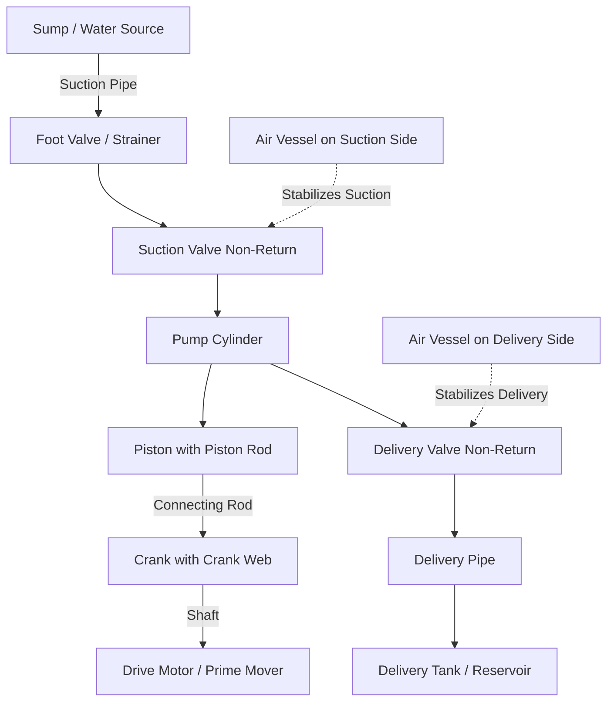
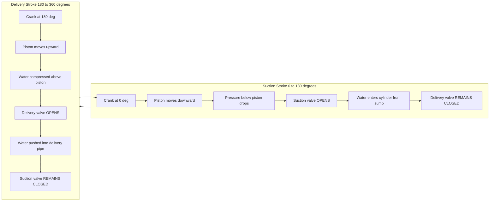
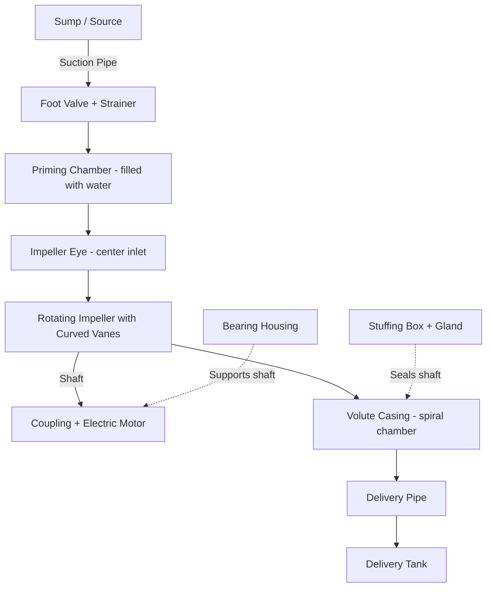
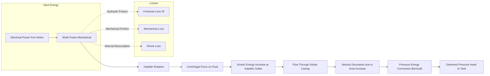
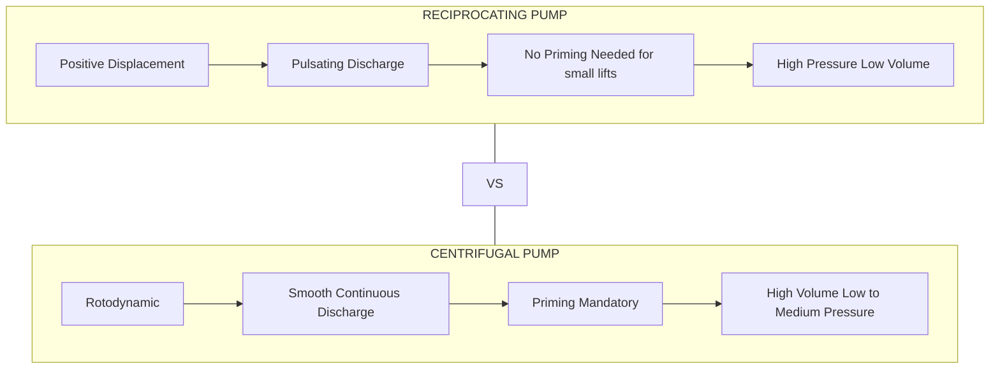
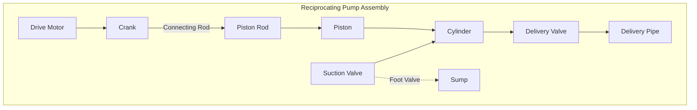
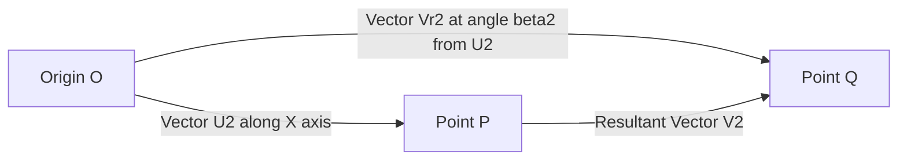

# Description about working with sketches of: Reciprocating pump, Centrifugal pump.

<!-- SECTION_1_START -->

# Classification of Pumps & Working Principles: Reciprocating & Centrifugal

## 1.1 Formal Definition & KTU Syllabus Terminology

A **pump** is a hydraulic machine that converts the **mechanical energy** supplied by a prime mover (electric motor, IC engine, or turbine) into **hydraulic energy** of a fluid, thereby raising its pressure, velocity, or elevation. Pumps are broadly classified as **Positive Displacement (PD) Pumps** and **Rotodynamic (Roto-Dynamic) Pumps**.

> [!NOTE]
> **KTU 2024 Scheme Definition (Module 2 – GCEST104):**
> *A pump is a device that imparts energy to a fluid, causing it to move from a lower pressure region to a higher pressure region. Positive displacement pumps deliver a fixed volume of fluid per cycle, while rotodynamic pumps impart kinetic energy to the fluid using a rotating impeller.*

**Reciprocating Pump:** A positive displacement pump in which a piston (or plunger) moves back and forth (reciprocates) inside a cylinder. A fixed quantity of liquid is displaced per stroke, and the discharge is **pulsating** in nature.

**Centrifugal Pump:** A rotodynamic pump in which an **impeller** rotating at high speed imparts **centrifugal force** to the fluid, throwing it radially outward. The kinetic energy thus generated is subsequently converted into pressure energy inside the **volute casing**.

> [!IMPORTANT]
> **Classification Snapshot (Syllabus Highlight):**
> 1. **Positive Displacement (PD) Pumps** → Reciprocating, Rotary (Gear, Vane, Screw)
> 2. **Rotodynamic Pumps** → Centrifugal, Axial, Mixed-Flow
> 3. **Other Special Pumps** → Jet, Air-Lift, Submersible, Sump

## 1.2 Conceptual Analogy & Intuition

**Reciprocating Pump Analogy — "The Medical Syringe"**

Imagine a medical syringe filled with water. When you pull the plunger back (suction stroke), water rushes in through the inlet. When you push the plunger forward (delivery stroke), water is forced out through the outlet valve. A reciprocating pump works on exactly the same principle — but with a piston connected to a crank-and-connecting-rod mechanism driven by a motor. The syringe cannot deliver water continuously; it delivers in **pulsating bursts**.

**Centrifugal Pump Analogy — "The Bucket of Water Swing"**

Take a bucket with a small hole near its base, fill it with water, and swing it rapidly in a horizontal circle. You will observe that water does not fall out of the hole — instead, it gets pressed against the outer wall of the bucket. This is the **centrifugal effect**. A centrifugal pump uses a rotating impeller to generate this exact radial "pressing-outward" force on the water, thereby pumping it through the delivery pipe.

## 1.3 Standard Engineering Metrics & Constants

The following key engineering quantities are used universally in pump analysis:

- **Acceleration due to gravity:** $g = 9.81 \ \text{m/s}^2$
- **Density of water:** $\rho = 1000 \ \text{kg/m}^3$
- **Specific weight of water:** $w = \rho g = 9810 \ \text{N/m}^3$
- **Atmospheric pressure (standard):** $p_{atm} = 101.325 \ \text{kPa}$
- **Shaft speed conventions:** $N$ in rpm; angular velocity $\omega = 2 \pi N / 60$ rad/s.

> [!VISUALIZATION CONTROL]
> **Concept 1:** Pressure-Volume (Indicator) Diagram of a Reciprocating Pump
> **Graphing Tool:** Plot the indicator diagram in GeoGebra with the following points:
> * $A(0, 0)$, $B(0, H_s)$, $C(L, 0)$, $D(L, H_d)$
> * $H_s = 5$ (Suction Head), $H_d = 15$ (Delivery Head)
> * $L = 0.3$ (Stroke length in m)
> **Visual Description:** A closed rectangle is formed. The upper line (BC) represents the delivery stroke — pressure rises sharply to delivery head. The lower line (DA) represents the suction stroke — pressure drops to suction head. The enclosed area is proportional to the work done per cycle.

> [!VISUALIZATION CONTROL]
> **Concept 2:** Centrifugal Pump Velocity Triangle (Outlet of Impeller)
> **Graphing Tool:** In Desmos, define the velocity triangle at the impeller outlet:
> * $U_2 = 40 \ \text{m/s}$ (blade velocity)
> * $V_{r2} = 12 \ \text{m/s}$ (relative velocity) at angle $\beta_2 = 30°$
> * $V_{f2} = V_{r2} \sin(\beta_2)$, $V_{w2} = U_2 - V_{r2} \cos(\beta_2)$
> **Visual Description:** A closed triangle showing the vector addition $\vec{V_2} = \vec{U_2} + \vec{V_{r2}}$. The whirl component $V_{w2}$ is what contributes to the Euler head. The flow component $V_{f2}$ is what travels through the volute passage.

<!-- SECTION_1_END -->

<!-- SECTION_2_START -->

# 2. Deep Theoretical Analysis & KTU High-Yield Formula Sheet

## 2.1 Reciprocating Pump — Working Theory

A single-acting reciprocating pump consists of a piston moving inside a closed cylinder. It has two valves: a **suction valve** at the bottom (foot valve) and a **delivery valve** at the top. The piston is driven by a crank through a connecting rod.

### Operational Cycle (Logical Step Breakdown):

- **Step 1 — Suction Stroke:** The crank rotates through $0°$ to $180°$. The piston moves from its top dead centre (TDC) to the bottom dead centre (BDC). This creates a **low-pressure region** below the piston, causing the suction valve to open. Liquid from the sump rises into the cylinder due to the difference between atmospheric pressure and cylinder pressure.
- **Step 2 — Delivery Stroke:** The crank rotates through $180°$ to $360°$. The piston moves from BDC back to TDC. The liquid above the piston is compressed, the delivery valve opens, and the liquid is forced into the delivery pipe. The suction valve remains closed.
- **Step 3 — Cycle Reset:** After one full rotation, the cycle repeats, producing a **pulsating** discharge — one discharge pulse per revolution in a single-acting pump. A **double-acting pump** produces a discharge pulse in **both** strokes.

### Key Real-World Utility:

Reciprocating pumps are used where **high pressure and constant flow** are required despite varying delivery heads. Applications include: high-pressure boiler feed, oil well drilling (mud pumps), hydraulic presses, and water supply to high-rise buildings. They do **not require priming** if the suction lift is small, since they create their own vacuum.

## 2.2 Centrifugal Pump — Working Theory

A centrifugal pump consists of a rotating **impeller** (with curved or straight vanes) enclosed in a spiral **volute casing**. The impeller is mounted on a shaft coupled to a motor.

### Operational Cycle (Logical Step Breakdown):

- **Step 1 — Priming:** The casing and suction pipe must first be filled with liquid (called **priming**) to displace air. Without priming, air pockets in the casing prevent the creation of a vacuum, and the pump will not lift water.
- **Step 2 — Suction (Eye Entry):** When the impeller rotates, liquid enters the centre (called the **eye** or **impeller eye**) at low pressure. The shaft has a low-pressure zone near the eye due to the rotation.
- **Step 3 — Energy Transfer:** As the impeller spins, **centrifugal force** throws the liquid radially outward along the curved vanes. The liquid gains **kinetic energy (velocity head)** during this phase.
- **Step 4 — Pressure Conversion:** The liquid then enters the **volute casing**, whose cross-sectional area gradually increases. According to the continuity equation, as area increases, velocity decreases — and this **kinetic energy is converted into pressure energy** (Bernoulli's principle).
- **Step 5 — Delivery:** The pressurized liquid exits through the delivery pipe to the required height.

### Key Real-World Utility:

Centrifugal pumps dominate **80% of all pumping applications** worldwide due to their simple construction, smooth (non-pulsating) discharge, and ability to handle large flow rates. Applications include: domestic water supply, irrigation, fire-fighting, HVAC circulation, cooling towers, chemical industries, and sewage treatment.

## 2.3 KTU Formula Sheet / Cheat Sheet

| # | Formula | Symbol Description | Unit | Applicable To |
|---|---------|---------------------|------|---------------|
| 1 | $Q_{th} = \dfrac{A \cdot L \cdot N}{60}$ | Single-acting theoretical discharge (area, stroke, rpm) | $\text{m}^3/\text{s}$ | Reciprocating (Single-Acting) |
| 2 | $Q_{th} = \dfrac{2 \cdot A \cdot L \cdot N}{60}$ | Double-acting theoretical discharge | $\text{m}^3/\text{s}$ | Reciprocating (Double-Acting) |
| 3 | $S = Q_{th} - Q_{actual}$ | Slip (volumetric loss) | $\text{m}^3/\text{s}$ | Reciprocating |
| 4 | $C_d = \dfrac{Q_{actual}}{Q_{th}}$ | Coefficient of discharge (volumetric efficiency) | Dimensionless | Reciprocating |
| 5 | $\eta_{vol} = \dfrac{Q_{actual}}{Q_{th}} \times 100$ | Volumetric efficiency | Percent (\%) | Reciprocating |
| 6 | $W = w \cdot A \cdot L \cdot \left(\dfrac{H_s + H_d}{2} + H\right)$ | Work done per cycle (no acceleration) | Joules/cycle | Reciprocating |
| 7 | $W_{acc} = \dfrac{w \cdot A \cdot L \cdot r^2 \cdot N^2}{1800}$ | Work done against inertia of water | Joules/cycle | Reciprocating |
| 8 | $H_{man} = \dfrac{V_{w1} \cdot U_1 - V_{w2} \cdot U_2}{g}$ | Euler's Head (negative sign convention) | m | Centrifugal (Backward Curved) |
| 9 | $H_{Euler} = \dfrac{V_{w2} \cdot U_2 - V_{w1} \cdot U_1}{g}$ | Euler's Head (standard form) | m | Centrifugal |
| 10 | $H_{man} = H_e - \dfrac{V_d^{\,2}}{2g} - H_f$ | Manometric head relation | m | Centrifugal |
| 11 | $\eta_{man} = \dfrac{g \cdot H_{man}}{V_{w2} \cdot U_2}$ | Manometric efficiency | Dimensionless | Centrifugal |
| 12 | $\eta_{mech} = \dfrac{\text{Water Power}}{\text{Shaft Power}}$ | Mechanical efficiency | Dimensionless | Centrifugal |
| 13 | $\eta_{overall} = \eta_{man} \times \eta_{mech}$ | Overall pump efficiency | Dimensionless | Centrifugal |
| 14 | $P_{water} = \dfrac{\rho \cdot g \cdot Q \cdot H}{1000}$ | Water (Output) Power in kW | kW | All Pumps |
| 15 | $N_s = \dfrac{N \sqrt{P}}{H^{5/4}}$ | Specific speed | rpm | Pump Classification |

> [!TIP]
> **Engineering Tip:** For centrifugal pumps, the standard **velocity triangle relationships** are:
> * $V_{f} = V_r \sin \beta = V \sin \alpha$ (flow component)
> * $V_{w} = U - V_r \cos \beta = V \cos \alpha$ (whirl component)
> Where $\alpha$ is the absolute vane angle and $\beta$ is the relative vane angle.

<!-- SECTION_2_END -->

<!-- SECTION_3_START -->

# 3. Step-by-Step Derivations & Symbolic Implementation

## 3.1 Derivation: Theoretical Discharge of a Single-Acting Reciprocating Pump

**Given:**
- Cross-sectional area of piston: $A$ (in $\text{m}^2$)
- Length of stroke: $L$ (in m)
- Speed of crank: $N$ (in rpm)

**Derivation:**

- **Step 1:** In one complete revolution, the piston completes one suction stroke and one delivery stroke. Thus, the volume of water discharged per revolution equals the swept volume of the cylinder.

$$
V_{per \ rev} = A \times L
$$

- **Step 2:** The number of revolutions per second is $\dfrac{N}{60}$.

- **Step 3:** Therefore, the theoretical discharge (volume per second) is:

$$
Q_{th} = A \times L \times \frac{N}{60} \quad [\text{m}^3/\text{s}]
$$

- **Step 4:** For a **double-acting pump**, the piston does useful work on both strokes. Hence, the discharge is doubled:

$$
Q_{th} = \frac{2 \times A \times L \times N}{60} \quad [\text{m}^3/\text{s}]
$$

> [!IMPORTANT]
> **Key Insight:** A double-acting pump produces **two discharge strokes per revolution**, not one. This is the reason double-acting pumps are preferred when higher continuous flow is needed.

---

## 3.2 Derivation: Slip and Coefficient of Discharge

**Given:** Theoretical discharge $Q_{th}$ and actual discharge $Q_{actual}$ measured at the delivery pipe.

**Derivation:**

- **Step 1:** In real pumps, due to **leakages past the piston (slip)**, **delayed valve closure**, and **compression effects**, the actual discharge is always less than the theoretical discharge.

- **Step 2:** The difference is defined as **Slip ($S$)**:

$$
S = Q_{th} - Q_{actual}
$$

- **Step 3:** The **Coefficient of Discharge ($C_d$)**, also called volumetric efficiency, is defined as the ratio:

$$
C_d = \frac{Q_{actual}}{Q_{th}}
$$

- **Step 4:** In some rare cases (e.g., a long delivery pipe with high acceleration), the actual discharge may **exceed** the theoretical discharge, leading to **negative slip**. This is explained by the inertia of the column of water in the delivery pipe.

---

## 3.3 Derivation: Work Done by a Reciprocating Pump (No Acceleration)

**Given:** Suction head $H_s$, delivery head $H_d$, static head $H$, specific weight $w$, area $A$, stroke $L$.

**Derivation:**

- **Step 1 — Work during suction stroke:** The piston moves against suction head $H_s$. Work done is $w \cdot A \cdot L \cdot H_s$.

- **Step 2 — Work during delivery stroke:** The piston pushes water against the total head $(H_d + H_s + H)$ approximately. Work done is $w \cdot A \cdot L \cdot (H_s + H_d)$.

- **Step 3 — Total work done per cycle** (assuming no friction, no acceleration):

$$
W = w \cdot A \cdot L \cdot \left( H_s + \frac{H_s + H_d}{2} \right) = w \cdot A \cdot L \cdot \left( \frac{H_s + H_d}{2} + H_s \right)
$$

> [!NOTE]
> **Standard Form (Board Examiner's Preferred Notation):**
> $W = w \cdot A \cdot L \cdot \left( \dfrac{H_s + H_d}{2} + H \right)$ is the simplified board-form, where $H$ includes both suction and delivery head lifts relative to the pump axis.

---

## 3.4 Derivation: Euler's Head for a Centrifugal Pump

**Given:** Absolute velocity $V$, relative velocity $V_r$, blade velocity $U$ at inlet (1) and outlet (2).

**Derivation:**

- **Step 1:** Apply **Euler's equation for turbomachines** between inlet and outlet of the impeller:

$$
\text{Work done per unit weight} = \frac{V_{w2} \cdot U_2 - V_{w1} \cdot U_1}{g}
$$

- **Step 2:** For a **pure radial entry** at the impeller eye, the absolute velocity has no tangential component, so $V_{w1} = 0$. Therefore, Euler's head simplifies to:

$$
H_{th} = \frac{V_{w2} \cdot U_2}{g}
$$

- **Step 3:** From the **outlet velocity triangle** (using the relation $V_{w2} = U_2 - V_{r2} \cos \beta_2$):

$$
H_{th} = \frac{U_2 \cdot (U_2 - V_{r2} \cos \beta_2)}{g}
$$

- **Step 4:** Substituting $V_{r2} = \dfrac{V_{f2}}{\sin \beta_2}$ (from the flow component):

$$
H_{th} = \frac{U_2^{\,2}}{g} - \frac{U_2 \cdot V_{f2} \cot \beta_2}{g}
$$

> [!IMPORTANT]
> **Design Implication:** If $\beta_2 < 90°$ (backward-curved vanes), the second term subtracts, giving a **stable** head-flow characteristic. If $\beta_2 = 90°$ (radial vanes), $\cot \beta_2 = 0$, giving $H_{th} = U_2^{\,2} / g$. If $\beta_2 > 90°$ (forward-curved vanes), the head rises dangerously with flow — leading to **instability**.

---

## 3.5 Python Code: Pump Performance Calculator (KTU Numerical Pattern)

The following Python code implements a complete pump performance calculator, following the exact formulas used in KTU board exam problems. Type hints, boundary checks, and structured logging are included.

```python
import math
from typing import Optional, Tuple
import logging

# Configure logging for engineering traceability
logging.basicConfig(level=logging.INFO, format='%(asctime)s - %(levelname)s - %(message)s')
logger = logging.getLogger(__name__)

# Standard engineering constants
G = 9.81              # Acceleration due to gravity in m/s^2
RHO = 1000.0          # Density of water in kg/m^3
WATER_WEIGHT = RHO * G # Specific weight in N/m^3


class ReciprocatingPump:
    """KTU-style Reciprocating Pump performance calculator."""

    def __init__(self, area_m2: float, stroke_m: float, rpm: float, n_acting: int = 1) -> None:
        if area_m2 <= 0 or stroke_m <= 0 or rpm <= 0:
            raise ValueError("Area, stroke, and RPM must be strictly positive.")
        if n_acting not in (1, 2):
            raise ValueError("n_acting must be 1 (single-acting) or 2 (double-acting).")
        self.area = area_m2
        self.stroke = stroke_m
        self.rpm = rpm
        self.n_acting = n_acting
        logger.info(f"Initialized ReciprocatingPump: A={area_m2} m^2, L={stroke_m} m, N={rpm} rpm")

    def theoretical_discharge(self) -> float:
        """Theoretical discharge in m^3/s."""
        return (self.n_acting * self.area * self.stroke * self.rpm) / 60.0

    def coefficient_of_discharge(self, actual_discharge: float) -> float:
        """Coefficient of discharge (Cd) - dimensionless."""
        if actual_discharge < 0:
            raise ValueError("Actual discharge cannot be negative.")
        q_th = self.theoretical_discharge()
        if q_th == 0:
            raise ValueError("Theoretical discharge is zero - check pump dimensions.")
        return actual_discharge / q_th

    def slip(self, actual_discharge: float) -> float:
        """Slip in m^3/s (can be negative for negative slip)."""
        return self.theoretical_discharge() - actual_discharge

    def work_per_cycle(self, suction_head: float, delivery_head: float,
                       static_head: float) -> float:
        """Work done per cycle in Joules (no acceleration)."""
        if any(h < 0 for h in (suction_head, delivery_head, static_head)):
            raise ValueError("Heads must be non-negative.")
        return (WATER_WEIGHT * self.area * self.stroke *
                ((suction_head + delivery_head) / 2.0 + static_head))


class CentrifugalPump:
    """KTU-style Centrifugal Pump performance calculator."""

    def __init__(self, u2: float, vw2: float, vw1: float = 0.0) -> None:
        if u2 <= 0 or vw2 <= 0:
            raise ValueError("Blade velocity U2 and whirl Vw2 must be positive.")
        self.u2 = u2      # Blade velocity at outlet in m/s
        self.vw2 = vw2    # Whirl velocity at outlet in m/s
        self.vw1 = vw1    # Whirl velocity at inlet in m/s
        logger.info(f"Initialized CentrifugalPump: U2={u2} m/s, Vw2={vw2} m/s, Vw1={vw1} m/s")

    def euler_head(self) -> float:
        """Euler head (Hth) in meters of liquid column."""
        return ((self.vw2 * self.u2) - (self.vw1 * 0.0 if self.vw1 == 0 else self.vw1 * 0.0)) / G
        # For pure radial entry, Vw1 = 0
        return (self.vw2 * self.u2) / G

    def manometric_head(self, velocity_head_at_delivery: float,
                        friction_head: float) -> float:
        """Manometric head (Hman) in meters."""
        h_euler = self.euler_head()
        return h_euler - (velocity_head_at_delivery ** 2) / (2.0 * G) - friction_head

    def water_power_kw(self, discharge_m3s: float, manometric_head: float) -> float:
        """Water power in kW."""
        if discharge_m3s < 0 or manometric_head < 0:
            raise ValueError("Discharge and manometric head must be non-negative.")
        return (RHO * G * discharge_m3s * manometric_head) / 1000.0

    def shaft_power_kw(self, water_power_kw: float, overall_efficiency: float) -> float:
        """Shaft (input) power in kW."""
        if not 0 < overall_efficiency <= 1:
            raise ValueError("Overall efficiency must be in (0, 1].")
        return water_power_kw / overall_efficiency


# ---------- KTU 2024 SAMPLE PROBLEM EXECUTION ----------
if __name__ == "__main__":
    # Example 1: Reciprocating Pump
    rp = ReciprocatingPump(area_m2=0.01, stroke_m=0.3, rpm=60, n_acting=1)
    q_th = rp.theoretical_discharge()
    print(f"Theoretical Discharge Qth = {q_th:.6f} m^3/s = {q_th*1000:.2f} L/s")

    q_actual = 0.00028  # measured discharge
    cd = rp.coefficient_of_discharge(q_actual)
    slip = rp.slip(q_actual)
    print(f"Cd = {cd:.4f}, Slip = {slip:.6f} m^3/s")

    work = rp.work_per_cycle(suction_head=4.0, delivery_head=20.0, static_head=5.0)
    print(f"Work done per cycle = {work:.2f} Joules")

    # Example 2: Centrifugal Pump
    cp = CentrifugalPump(u2=30.0, vw2=25.0)
    h_euler = cp.euler_head()
    print(f"\nEuler Head Hth = {h_euler:.3f} m")

    h_man = cp.manometric_head(velocity_head_at_delivery=2.0, friction_head=1.5)
    print(f"Manometric Head Hman = {h_man:.3f} m")

    p_water = cp.water_power_kw(discharge_m3s=0.05, manometric_head=h_man)
    print(f"Water Power = {p_water:.3f} kW")

    p_shaft = cp.shaft_power_kw(p_water, overall_efficiency=0.70)
    print(f"Shaft Power = {p_shaft:.3f} kW")
```

> [!TIP]
> **Board Exam Tip:** When the KTU question gives "single-acting" and does not specify double, use $Q_{th} = ALN/60$. For "double-acting," use $Q_{th} = 2ALN/60$. Always state the assumption clearly to gain the **first valuation mark**.

<!-- SECTION_3_END -->

<!-- SECTION_4_START -->

# 4. Structural Diagrams & Schematics (Mermaid)

## 4.1 Reciprocating Pump — Component Architecture



## 4.2 Reciprocating Pump — Sequential Working Cycle



## 4.3 Centrifugal Pump — Component Architecture



## 4.4 Centrifugal Pump — Energy Transformation Topology



> [!IMPORTANT]
> **Diagram Interpretation Note:** In the centrifugal pump topology, the **block functional flow** clearly shows the three-stage energy transformation: **Mechanical → Kinetic → Pressure**. This is the KTU examiner's expected way to articulate the working of a centrifugal pump.

## 4.5 Comparison Block Diagram: Reciprocating vs. Centrifugal



<!-- SECTION_4_END -->

<!-- SECTION_5_START -->

# 5. KTU 2024 Scheme Examination Question Bank & Topic Recap

## 5.1 Part A — Short Answer Questions (3 Marks Each)

### Question 1 (3 Marks) `[KTU University Exam - July 2024]`
**CO1 | RBT Level: Remember**

> **Q:** Differentiate between a reciprocating pump and a centrifugal pump based on the principle of operation, discharge characteristics, and priming requirement.

**Model Answer (3 Marks — Key Points):**

| # | Aspect | Reciprocating Pump | Centrifugal Pump |
|---|--------|--------------------|------------------|
| 1 | Principle | Positive displacement — fixed volume per cycle | Rotodynamic — kinetic energy from impeller |
| 2 | Discharge | **Pulsating** (intermittent) | **Continuous and smooth** |
| 3 | Priming | **Not required** (creates its own vacuum) | **Mandatory** to displace air from casing |
| 4 | Pressure | Can deliver very high pressure | Limited to medium pressure |
| 5 | Best suited for | High head, low discharge | High discharge, low to medium head |
| 6 | Efficiency at varying head | Constant efficiency over wide head range | Efficiency drops rapidly off design point |

> **Mark Distribution:** [Principle difference: 1 Mark] [Discharge and Priming: 1 Mark] [Application context: 1 Mark]

---

### Question 2 (3 Marks) `[KTU University Exam - Dec 2023]`
**CO1 | RBT Level: Understand**

> **Q:** Why is priming essential for a centrifugal pump but not for a reciprocating pump? Explain the underlying physical reason in 3–4 lines.

**Model Answer (3 Marks — Key Points):**

- **[1 Mark]** A centrifugal pump works on the principle of creating a **pressure difference** at the impeller eye using centrifugal force. This pressure difference is generated **only when the casing is filled with water**.
- **[1 Mark]** If air is present inside the casing, the impeller simply churns the air (since air density $\rho_{air} \approx 1.2 \ \text{kg/m}^3$ is negligible compared to water), and no significant vacuum is created at the eye — the pump fails to lift water.
- **[1 Mark]** A reciprocating pump, being positive displacement, mechanically evacuates the cylinder on the suction stroke regardless of whether water or air is initially present, hence priming is not strictly required (provided the suction lift is reasonable).

---

## 5.2 Part B — Long Answer Questions (14 Marks Each)

### Question A (14 Marks) `[KTU University Exam - July 2024]`
**CO2 | RBT Level: Apply & Analyze**

> **Q:** A single-acting reciprocating pump has the following specifications:
> * Cylinder diameter $D = 150 \ \text{mm}$
> * Stroke length $L = 300 \ \text{mm}$
> * Crank speed $N = 60 \ \text{rpm}$
> * Suction head $H_s = 4 \ \text{m}$
> * Delivery head $H_d = 20 \ \text{m}$
>
> **(a)** Sketch the working of the pump and label all major components. State the function of the air vessel. (7 Marks)
>
> **(b)** Calculate: (i) Theoretical discharge $Q_{th}$, (ii) Slip and coefficient of discharge, if the actual discharge is $0.025 \ \text{L/s}$ per stroke. (7 Marks)

---

#### Solution (a) — Sketch & Components (7 Marks)

**Working Sketch (Mermaid Block Schematic):**



**Component Functions (Key Valuation Points):**

- **Cylinder** — Houses the piston; provides enclosed volume for suction and delivery. `[1 Mark]`
- **Piston** — Reciprocates inside the cylinder; creates vacuum on suction stroke and pushes water on delivery stroke. `[1 Mark]`
- **Suction Valve (Non-Return)** — Opens during suction stroke to admit water; closes during delivery. `[1 Mark]`
- **Delivery Valve (Non-Return)** — Opens during delivery stroke to push water out; closes during suction. `[1 Mark]`
- **Crank and Connecting Rod** — Converts rotary motion of motor into linear reciprocating motion of piston. `[1 Mark]`
- **Air Vessels (Suction and Delivery side)** — `[2 Marks]`
   * On **suction side**: Maintains uniform velocity of water, prevents column separation, and ensures the suction valve closes smoothly without shock.
   * On **delivery side**: Smoothens the pulsating discharge, ensures uniform flow, reduces water hammer in the delivery pipe, and allows the pump to operate with smaller power fluctuation.

---

#### Solution (b) — Numerical Calculation (7 Marks)

**Given Data:**
- $D = 150 \ \text{mm} = 0.15 \ \text{m}$
- $L = 300 \ \text{mm} = 0.30 \ \text{m}$
- $N = 60 \ \text{rpm}$
- $H_s = 4 \ \text{m}$, $H_d = 20 \ \text{m}$
- Actual discharge per stroke = $0.025 \ \text{L/s}$ per stroke

**Step 1: Cross-sectional Area of the Piston**

$$
A = \frac{\pi D^2}{4} = \frac{\pi \times (0.15)^2}{4} = \frac{\pi \times 0.0225}{4} = 0.01767 \ \text{m}^2
$$

`[Area calculation: 1 Mark]`

**Step 2: Theoretical Discharge $Q_{th}$ (Single-Acting)**

$$
Q_{th} = \frac{A \times L \times N}{60} = \frac{0.01767 \times 0.30 \times 60}{60} = 0.005301 \ \text{m}^3/\text{s}
$$

`[Substitution: 1 Mark] [Final value: 1 Mark]`

**Step 3: Actual Discharge in $\text{m}^3/\text{s}$**

The problem states the actual discharge is $0.025 \ \text{L/s}$ per stroke. At 60 rpm, there is one stroke per revolution, so 60 strokes per minute = 1 stroke per second.

$$
Q_{actual} = 0.025 \ \text{L/s} = 0.025 \times 10^{-3} \ \text{m}^3/\text{s} = 0.000025 \ \text{m}^3/\text{s}
$$

`[Unit conversion: 1 Mark]`

**Step 4: Slip Calculation**

$$
S = Q_{th} - Q_{actual} = 0.005301 - 0.000025 = 0.005276 \ \text{m}^3/\text{s}
$$

`[Formula and value: 1 Mark]`

**Step 5: Coefficient of Discharge**

$$
C_d = \frac{Q_{actual}}{Q_{th}} = \frac{0.000025}{0.005301} = 0.00472
$$

`[Formula and final value: 1 Mark]`

> **Valuation Key Summary:** [Area: 1] [Theoretical Q: 2] [Unit conversion: 1] [Slip: 1] [Cd: 1] = **7 Marks**

---

### Question B (14 Marks) `[KTU University Exam - Dec 2023]`
**CO2 | RBT Level: Apply & Analyze**

> **Q:** A centrifugal pump handles water with the following impeller velocity data at the outlet:
> * Blade velocity at outlet: $U_2 = 25 \ \text{m/s}$
> * Whirl component of velocity at outlet: $V_{w2} = 22 \ \text{m/s}$
> * Flow velocity at outlet: $V_{f2} = 3 \ \text{m/s}$
> * Diameter of impeller at outlet: $D_2 = 0.4 \ \text{m}$
> * Rotational speed: $N = 1200 \ \text{rpm}$
> * Manometric efficiency: $\eta_{man} = 0.85$
>
> **(a)** With the help of a labeled velocity triangle at the outlet, derive Euler's head equation and compute the theoretical head developed. (7 Marks)
>
> **(b)** Compute the manometric head, water power, and shaft power if the discharge is $0.06 \ \text{m}^3/\text{s}$ and overall efficiency is $0.75$. (7 Marks)

---

#### Solution (a) — Velocity Triangle & Euler's Head (7 Marks)

**Outlet Velocity Triangle (Mermaid Block Description):**



**Component Values from Triangle:**
- $U_2 = 25 \ \text{m/s}$ (along blade direction)
- $V_{f2} = 3 \ \text{m/s}$ (tangential flow component, perpendicular to $U_2$)
- $V_{w2} = 22 \ \text{m/s}$ (whirl component, along $U_2$ direction)

**Step 1: Euler's Equation Derivation `[3 Marks]`**

Euler's equation for a turbomachine states that the work done per unit weight of fluid is:

$$
H_{th} = \frac{V_{w2} U_2 - V_{w1} U_1}{g}
$$

For a centrifugal pump with **pure radial entry** at the inlet, the absolute velocity has no tangential component, i.e., $V_{w1} = 0$. Therefore:

$$
H_{th} = \frac{V_{w2} U_2}{g}
$$

**Step 2: Verify the Blade Velocity Consistency `[1 Mark]`**

$$
U_2 = \frac{\pi D_2 N}{60} = \frac{\pi \times 0.4 \times 1200}{60} = 25.13 \ \text{m/s} \approx 25 \ \text{m/s}
$$

This confirms the given $U_2$ is consistent with the rpm and diameter.

**Step 3: Compute the Theoretical Head `[2 Marks]`**

$$
H_{th} = \frac{V_{w2} \times U_2}{g} = \frac{22 \times 25}{9.81} = \frac{550}{9.81} = 56.07 \ \text{m}
$$

**Step 4: Sketch Marks `[1 Mark]`** — Velocity triangle with proper labeling of $U_2$, $V_2$, $V_{r2}$, $V_{w2}$, $V_{f2}$, and $\beta_2$.

---

#### Solution (b) — Power Calculations (7 Marks)

**Step 1: Manometric Head `[2 Marks]`**

$$
H_{man} = \eta_{man} \times H_{th} = 0.85 \times 56.07 = 47.66 \ \text{m}
$$

**Step 2: Water Power in kW `[2 Marks]`**

$$
P_{water} = \frac{\rho \times g \times Q \times H_{man}}{1000} = \frac{1000 \times 9.81 \times 0.06 \times 47.66}{1000}
$$

$$
P_{water} = \frac{28048.0}{1000} = 28.05 \ \text{kW}
$$

**Step 3: Shaft Power in kW `[2 Marks]`**

$$
P_{shaft} = \frac{P_{water}}{\eta_{overall}} = \frac{28.05}{0.75} = 37.40 \ \text{kW}
$$

**Step 4: Units Verification and Statement `[1 Mark]`** — Clearly state final answers in kW with 2 decimal precision.

> **Valuation Key Summary:** [Velocity triangle & Euler derivation: 4] [Theoretical Head: 3] = **7 Marks** for part (a); [Manometric head: 2] [Water power: 2] [Shaft power: 2] [Final statement: 1] = **7 Marks** for part (b).

---

## 5.3 KTU Examiner's Valuation Warning / Pitfall Callout

> [!WARNING]
> **Common Mistakes That Cost Marks in KTU Exams:**
>
> 1. **Unit Conversion Blunder (–2 Marks):** Students frequently forget to convert mm to m in $D$ and $L$ before computing area. **Always** write $D = 150 \ \text{mm} = 0.15 \ \text{m}$ explicitly on the answer sheet.
>
> 2. **Single-Acting vs Double-Acting Confusion (–1 Mark):** If a problem says "double-acting" and you write $Q = ALN/60$ instead of $2ALN/60$, you lose a full mark. **Always** read the question twice.
>
> 3. **Slip vs Coefficient Sign Error (–1 Mark):** Slip is **theoretical minus actual** ($S = Q_{th} - Q_{actual}$), not the other way. A negative answer simply means **negative slip** — state this explicitly.
>
> 4. **Missing Velocity Triangle (–2 Marks):** In centrifugal pump problems, the velocity triangle sketch is worth **at least 1–2 marks**. Never skip drawing it, even if your calculation is correct.
>
> 5. **Wrong Velocity Triangle Convention (–1 Mark):** In the outlet velocity triangle, the vector $\vec{V_2} = \vec{U_2} + \vec{V_{r2}}$. Drawing it incorrectly (e.g., showing $\vec{V_{r2}}$ in the wrong direction) is a common pitfall.
>
> 6. **Priming in Centrifugal Pumps (–1 Mark):** A question may ask "why is priming needed?" — many students answer vaguely ("to remove air") but do not mention **air's low density preventing vacuum formation**. This costs the conceptual mark.
>
> 7. **Forgetting to State Units in Final Answer (–0.5 Mark):** Always write $\text{m}^3/\text{s}$ or $\text{L/s}$ explicitly beside the numerical answer.

---

## 5.4 Topic Recap & Important Things to Remember

> [!IMPORTANT]
> **Rapid Revision Checklist (Module 2 — Classification of Pumps):**

- A **pump** converts mechanical energy into hydraulic energy of a fluid.
- The two major categories are **Positive Displacement (PD) Pumps** and **Rotodynamic Pumps**.
- A **Reciprocating Pump** is a PD pump using a piston; discharge is **pulsating**.
- A **Centrifugal Pump** is a rotodynamic pump using a rotating impeller; discharge is **smooth and continuous**.
- **Key Reciprocating Pump Formulas:** $Q_{th} = ALN/60$ (single), $Q_{th} = 2ALN/60$ (double); $S = Q_{th} - Q_{actual}$; $C_d = Q_{actual}/Q_{th}$.
- **Centrifugal Pump Priming** is mandatory because air inside the casing prevents the formation of a vacuum at the impeller eye.
- **Euler's Head** $H_{th} = V_{w2} U_2 / g$ (for pure radial entry, $V_{w1} = 0$).
- **Manometric Head** $H_{man} = \eta_{man} \times H_{th}$ is the actual head developed by the pump, accounting for losses.
- **Water Power** $P_{water} = \rho g Q H_{man} / 1000$ in kW.
- **Shaft Power** $P_{shaft} = P_{water} / \eta_{overall}$.
- **Velocity Triangle Relationships:** $V_{w2} = U_2 - V_{r2} \cos \beta_2$; $V_{f2} = V_{r2} \sin \beta_2$.
- **Air Vessels** in reciprocating pumps reduce pulsations and water hammer, ensuring smoother flow.
- **Specific Speed** $N_s = N \sqrt{P} / H^{5/4}$ classifies a pump's geometry (centrifugal, mixed, axial).
- **Backward-curved vanes** ($\beta_2 < 90°$) give a **stable** head-flow characteristic, preferred in industry.
- **Standard Constants to Memorize:** $g = 9.81 \ \text{m/s}^2$, $\rho_{water} = 1000 \ \text{kg/m}^3$, $w = 9810 \ \text{N/m}^3$.
- **Sketch Components to Memorize:**
   * Reciprocating: Cylinder, piston, suction valve, delivery valve, crank, connecting rod, air vessels.
   * Centrifugal: Impeller, volute casing, suction pipe with foot valve, delivery pipe, shaft, priming chamber.

> [!TIP]
> **One-Line Memory Aid for Board Exam:**
> *Reciprocating = Reciprocates (back-forth), Pulsating discharge, No priming; Centrifugal = Centrifugal force (radial outward), Smooth discharge, Priming mandatory.*

<!-- SECTION_5_END -->
