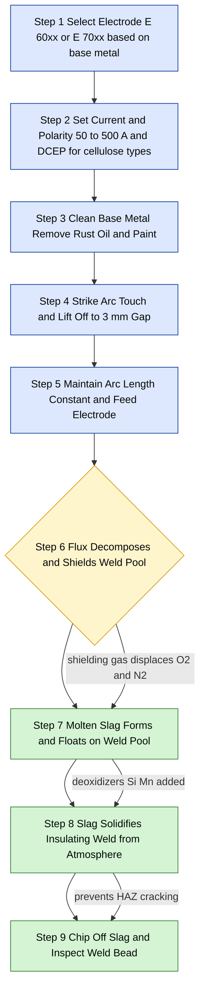
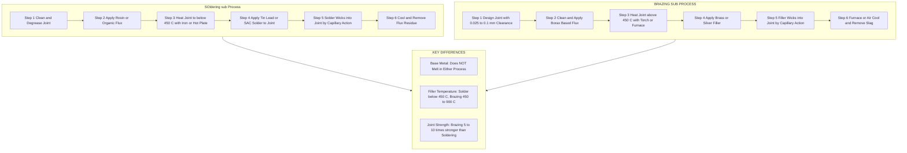
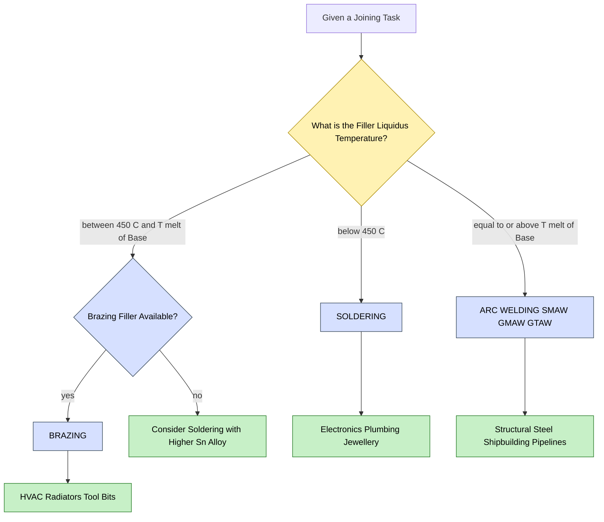

# Description with sketches of Arc Welding, SMAW, Soldering and Brazing and their applications.

<!-- SECTION_1_START -->
# 1. Core Technical Definition & Intuitive Overview

## Arc Welding — Formal Definition

**Arc Welding** is a fusion welding process in which the coalescence (joining) of metals is achieved by heating the workpieces to the welding temperature at the joint interface using the intense heat generated by an **electric arc** struck between an electrode and the base metal. Filler metal may or may not be added externally, and the joint is formed through atomic bonding as the molten pool solidifies.

> [!IMPORTANT]
> **KTU Syllabus Highlight (Module 2, GCEST104):**
> Arc Welding is one of the four core manufacturing/joining processes listed in this module. Students must sketch the **equipment setup**, list the **electrodes/consumables**, and write **two to three industrial applications** for guaranteed 7-mark answers in Part B questions.

## Conceptual Analogy — The Sparkler Effect

Imagine striking a matchstick against a rough surface. The friction generates a small, intensely hot region that ignites the chemicals at the tip. **Arc welding works on the same principle**, except:

- The friction is replaced by a **high-current electric discharge** (typically 50–500 A at 10–50 V).
- The match head is replaced by the **electrode tip**, and the rough surface is replaced by the **base metal (workpiece)**.
- The "chemical flame" is replaced by a **plasma arc** reaching temperatures of **6,000 °C to 20,000 °C** — about **3 to 5 times hotter than the surface of the sun** (~5,500 °C).

> [!NOTE]
> **The Arc Itself**: The electric arc is a sustained electrical discharge through a gaseous medium (ionized plasma). When the electrode is brought close to the workpiece (gap ≈ 2–4 mm), the air column ionizes, electrons jump the gap, and a brilliant, sustained spark (the arc) is established.

---

## Shielded Metal Arc Welding (SMAW) — Formal Definition

**Shielded Metal Arc Welding (SMAW)**, historically called **Manual Metal Arc Welding (MMAW)** or simply "stick welding", is the most widely used manual arc welding process. In SMAW, the **electrode itself is a consumable rod** coated with a **flux compound**. When the arc strikes, the flux:

1. Decomposes to release a **shielding gas** (typically CO₂ and H₂) that protects the molten weld pool from atmospheric contamination.
2. Forms a **slag layer** on top of the solidified weld to insulate it from rapid cooling and oxidation.
3. Adds **deoxidizers and alloying elements** to refine the weld chemistry.

## SMAW Intuition — The Candle with a Soap Coating

Think of a **candle with a thick outer wax layer and an inner wick**. When you light it:
- The **wick (core)** melts and drips down — analogous to the **metal core of the electrode** depositing filler metal into the joint.
- The **outer wax layer** melts, vaporizes, and shields the flame from drafts — analogous to the **flux coating** vaporizing into shielding gas and slag.
- A **drip of molten wax trails behind the flame** — analogous to the **slag layer** trailing the welding arc.

> [!NOTE]
> **Why "Shielded"?** Without the flux coating, the molten steel (≈ 1,500 °C) would react violently with atmospheric oxygen and nitrogen, forming **iron oxide scale** and **nitride brittleness** that ruin the joint. The flux is the chemical "umbrella" of the weld pool.

---

## Soldering — Formal Definition

**Soldering** is a **metal-joining process** in which two or more metal parts are joined by **melting and flowing a filler metal (solder)** into the joint gap. By ISO/IS definition, the soldering filler metal has a **liquidus temperature below 450 °C** (some standards say 427 °C). Crucially, the **base metals are NOT melted** — they remain solid throughout, and joining is by **metallurgical adhesion and diffusion** at the interface.

## Soldering Intuition — The Chocolate Chip Cookie Metaphor

Imagine dipping two biscuits into melted chocolate:
- The biscuits (base metals) **do not melt**.
- The chocolate (solder) **melts, flows, and solidifies** to glue them together.
- Holding them apart, you see the chocolate layer — analogous to the **fillet of solder** at the joint.

The mechanical strength is **low** (typically 20–70 MPa), so soldering is used for **electrical, plumbing, and sheet-metal joints** where high strength is not required.

---

## Brazing — Formal Definition

**Brazing** is a **metal-joining process** in which the filler metal has a **liquidus temperature above 450 °C** but **below the solidus of the base metals**. As in soldering, the **base metals do not melt**; only the filler metal melts and is drawn into the closely fitted joint by **capillary action**. Brazing produces joints of **moderate to high strength** (often comparable to or exceeding the base metal's strength).

## Brazing Intuition — The Straw and Honey Analogy

Take a thin glass straw and dip one end into warm honey:
- The honey (molten filler) **wicks up** into the straw against gravity, driven by **capillary action**.
- The glass (base metal) **does not melt**.
- When the honey cools, the straw is **permanently filled and bonded**.

Brazing is **stronger than soldering** because the higher temperatures allow stronger metallurgical bonds (often with intermetallic compound formation).

> [!NOTE]
> **Memory Anchor — The 450 °C Rule:**
>
> | Liquidus of Filler Metal | Process |
> |---|---|
> | **< 450 °C** | **Soldering** |
> | **≥ 450 °C** | **Brazing** |
> | **= or > Base metal melting point** | **Welding** |
>
> This single rule resolves 80% of "identify the process" exam questions in KTU.

> [!VISUALIZATION CONTROL]
> **Concept:** Temperature thresholds joining the three bonding processes on a single number line.
> **Coordinate System (GeoGebra Input):**
> * Point A: `(0, 100)` → label `Base metal melts (≈ 1500 °C for steel)`
> * Point B: `(450, 50)` → label `Soldering ↔ Brazing boundary`
> * Point C: `(200, 25)` → label `Tin-lead solder melts (≈ 183 °C)`
> **Visual Description:** A horizontal number line from 0 °C to 1600 °C. Three colored zones — *Soldering (green)*, *Brazing (blue)*, *Welding (red)* — separated by the 450 °C boundary and the base-metal melt point. The student should observe the **strict monotonic ordering** of the three process temperatures.

---

## Course Outcome (CO) and Bloom's Level Mapping

| Concept | Primary CO | RBT Level |
|---|---|---|
| Arc welding equipment & arc formation | CO2 | Understand |
| SMAW process, electrodes, flux | CO2 | Apply |
| Soldering process & filler metals | CO2 | Understand |
| Brazing process & applications | CO2 | Apply |

<!-- SECTION_1_END -->

<!-- SECTION_2_START -->
# 2. Deep Theoretical Analysis & KTU High-Yield Formula Sheet

## 2.1 Physics of the Electric Arc

The electric arc in arc welding is a **self-sustaining DC or AC discharge** through an ionized gas column called the **arc plasma**. The plasma consists of free electrons, positive ions, and neutral gas molecules in a state of thermal non-equilibrium.

**Two key temperatures inside the arc:**

- **Electron temperature (Tₑ)** ≈ 20,000 K — electrons move at very high velocities.
- **Gas temperature (T_g)** ≈ 6,000–8,000 K — heavy particles are much cooler.

> [!IMPORTANT]
> **Heat Generation Zones in an Arc:**
> The arc is divided into three regions: (1) the **anode fall region**, (2) the **arc column (plasma)**, and (3) the **cathode fall region**. About **66 % of the total heat is generated at the anode (workpiece)** and **33 % at the cathode (electrode)** in DCEN (DC Electrode Negative) polarity. This is why **electrode polarity selection** is critical in KTU 14-mark questions.

## 2.2 Arc Initiation Steps (Step-by-Step)

1. **Touch Start (Scratch Start):** The electrode momentarily touches the workpiece, completing the circuit. A **short-circuit current** of high magnitude flows.
2. **Lift-Off:** The electrode is withdrawn to a gap of **2–4 mm**. The molten bridge at the contact point ruptures, vaporizing metal and ionizing the air gap.
3. **Arc Stabilization:** The ionized path sustains a current flow, heating the electrode tip and the workpiece to form a molten pool.
4. **Arc Maintenance:** The welder maintains a constant arc length manually (in SMAW) while feeding the consumable electrode into the joint.

## 2.3 SMAW — Detailed Process Analysis

### Equipment Chain (Mandatory for Sketch)

$$\text{Power Source} \rightarrow \text{Electrode Cable} \rightarrow \text{Electrode Holder} \rightarrow \text{Arc} \rightarrow \text{Workpiece} \rightarrow \text{Ground Clamp} \rightarrow \text{Back to Power Source}$$

**Components required for the SMAW equipment sketch (KTU expects 6 labeled parts for full marks):**

| S.No. | Component | Function |
|---|---|---|
| 1 | **Welding Power Source** (Transformer / Rectifier / Inverter) | Steps down mains voltage to safe welding voltage (open-circuit 60–80 V, arc voltage 18–30 V) and provides high current (50–500 A) |
| 2 | **Electrode Holder / Stinger** | Mechanically grips the electrode and conducts current to it; insulated handle for safety |
| 3 | **Electrode** (consumable) | Acts as both filler metal and arc carrier; flux coating decomposes to form shielding gas + slag |
| 4 | **Welding Cable** (Heavy-duty, water-cooled for high amperage) | Carries current from power source to electrode holder with minimal voltage drop |
| 5 | **Workpiece / Base Metal** | The parts being joined; connected to the opposite terminal of the power source |
| 6 | **Ground Clamp / Earth Clamp** | Completes the electrical circuit by connecting the workpiece back to the power source |

> [!NOTE]
> **Open-Circuit Voltage (OCV) vs. Arc Voltage (AV):**
> - **OCV** = 60–80 V (safe idle voltage when arc is off).
> - **AV** = 18–30 V (voltage during welding).
> The high OCV ensures easy arc initiation; the welding current is regulated automatically (constant-current drooper characteristic).

### SMAW Electrode Classification — AWS Coding (High-Yield Topic)

The **American Welding Society (AWS) A5.1** designation for a mild-steel electrode is a 4- or 5-digit code, e.g., **E 6013** or **E 7018**.

**Decoding E 7018:**

$$\underbrace{E}_{\text{Electrode}}\ \underbrace{70}_{\text{Tensile strength, ksi}}\ \underbrace{1}_{\text{Welding position}}\ \underbrace{8}_{\text{Flux type, current polarity}}$$

- **E** = Electrode for arc welding.
- **70** = Minimum tensile strength = **70,000 psi (≈ 485 MPa)**.
- **1** = Usable in **all positions** (1 = all, 2 = flat & horizontal only).
- **8** = Flux coating = **low-hydrogen iron powder**, DC reverse polarity (DCEP) or AC.

**The four most commonly tested electrode codes:**

| AWS Code | Tensile Strength | Position | Flux Type | Current/Polarity | Typical Use |
|---|---|---|---|---|---|
| **E 6010** | 60 ksi (414 MPa) | All | High-cellulose sodium | DCEP | Pipe welding, deep penetration |
| **E 6013** | 60 ksi (414 MPa) | All | High-titania potassium | AC or DC | General-purpose sheet metal |
| **E 7018** | 70 ksi (485 MPa) | All | Low-hydrogen iron powder | AC or DCEP | Structural steel, bridges |
| **E 7024** | 70 ksi (485 MPa) | Flat/Horizontal | Iron powder, high-iron | AC or DCEN | High-deposition heavy plates |

> [!WARNING]
> **Common Mistake:** Students often write "E 7018 is for aluminum" — **no**. E 70xx is for **carbon steel**. Aluminium uses a separate AWS A5.3 system (E 1100, E 4043, etc.).

### Functions of the Flux Coating (Mandatory Bullet Points for 7 marks)

1. Generates a **shielding gas atmosphere** (CO, CO₂, H₂) to displace atmospheric O₂ and N₂.
2. Forms a **molten slag** that floats on the weld pool, refining it by absorbing impurities.
3. Adds **deoxidizers (Si, Mn, Al)** to the weld metal.
4. Provides **arc-stabilizing elements** (potassium, sodium compounds) for smooth DC/AC operation.
5. Forms a **solid slag crust** post-solidification that **insulates the cooling weld from rapid quench** (reducing HAZ hardness).
6. Modifies the **weld bead shape** (convexity, ripple pattern) for better mechanical properties.

## 2.4 Soldering — Detailed Process Analysis

### Soldering Temperature Range

$$T_{\text{liquidus, solder}} < 450\ ^\circ\text{C}, \quad T_{\text{base metal, solidus}} \text{ untouched}$$

### Common Solder Alloys

| Solder Alloy | Composition | Liquidus (°C) | Typical Application |
|---|---|---|---|
| **Tin-Lead (Sn-Pb)** | 60 % Sn, 40 % Pb (60/40) | 183–191 | General electronics (now restricted by RoHS) |
| **Tin-Lead (Sn-Pb)** | 63 % Sn, 37 % Pb (eutectic) | 183 (single point) | **Eutectic solder** — sharp melting, electronics preferred |
| **Lead-Free (SAC)** | Sn-Ag-Cu (96.5/3.0/0.5) | 217–221 | Modern RoHS-compliant electronics |
| **Tin-Antimony** | 95 % Sn, 5 % Sb | 232–240 | Higher-temperature plumbing |
| **Tin-Zinc** | 91 % Sn, 9 % Zn | 199 | Aluminium soldering |

### Soldering Process Steps

1. **Surface Cleaning:** Mechanical (abrasive, file) or chemical (flux application) — removes oxide layer.
2. **Flux Application:** Rosin (electronics), zinc chloride (plumbing), or no-clean flux — prevents re-oxidation during heating.
3. **Heating:** Soldering iron (15–100 W), soldering station, hot-air gun, or torch — heat the **joint, not the solder**.
4. **Solder Application:** Touch solder wire to the heated joint; it melts and wicks into the joint by **capillary action**.
5. **Cooling:** Natural cooling; do not blow air (causes brittle joints).
6. **Cleaning:** Remove flux residue (especially corrosive plumbing flux) with water/solvent.

> [!NOTE]
> **Why heat the joint, not the solder?**
> If the solder is melted directly by the iron, it will flow onto the cold joint surface and form a **cold joint** — a dull, granular, weak, high-resistance bond that fails under vibration or thermal cycling. The joint must be **hotter than the solder's melting point** for proper wetting.

## 2.5 Brazing — Detailed Process Analysis

### Brazing Filler Metals (BFM)

| Filler Family | Composition (Example) | Liquidus (°C) | Application |
|---|---|---|---|
| **Copper-Phosphorus (CuP)** | 92 % Cu, 8 % P | 710 | Refrigeration, copper tube joints (phosphorus acts as flux) |
| **Brass / Bronze** | 60 % Cu, 40 % Zn | 890 | General-purpose steel, cast iron |
| **Silver Brazing (Hard solder)** | Ag-Cu-Zn-Cd (e.g., 45 % Ag) | 600–700 | High-strength joints, tool bits, aircraft |
| **Aluminum Brazing** | Al-Si (e.g., 88 % Al, 12 % Si) | 580 | Aluminum radiators, heat exchangers |
| **Nickel-based** | Ni-Cr-Fe-Si-B | 1000+ | Jet engine components, superalloys |

### Brazing Process Steps

1. **Joint Design:** Clearance of **0.025–0.1 mm** is critical — too loose reduces capillary draw, too tight blocks flow.
2. **Surface Cleaning:** Degrease, abrade, and apply **flux** (borax-based, fluoride compounds).
3. **Assembly and Fixturing:** Hold parts in place with jigs; filler pre-placed at the joint entrance.
4. **Heating:** Torch (oxy-acetylene, propane), furnace, induction coil, or dip in molten bath.
5. **Filler Flow:** The molten filler is **drawn into the joint by capillary action**, not pushed.
6. **Cooling:** Furnace cool or air cool; do not disturb the joint.
7. **Flux/Slag Removal:** Hot water rinse or wire brushing.

### Capillary Action in Brazing — Governing Equation

The **height of capillary rise** of a liquid filler metal in a vertical joint gap is given by the **Jurin's Law**:

$$h = \frac{2 \sigma \cos\theta}{\rho g r}$$

where:
- $h$ = capillary rise height (m)
- $\sigma$ = surface tension of molten filler (N/m)
- $\theta$ = contact angle between filler and base metal (°)
- $\rho$ = density of molten filler (kg/m³)
- $g$ = acceleration due to gravity (9.81 m/s²)
- $r$ = effective joint gap radius (m)

> [!NOTE]
> **Why small clearances work better:**
> The capillary rise $h$ is **inversely proportional to the gap $r$**. A smaller gap means **higher capillary pull** and better joint filling. This is why brazing specifications insist on **tight tolerances of 0.025–0.1 mm** — a clear opening larger than 0.5 mm virtually eliminates capillary action.

## 2.6 Master Formula Sheet (For Rapid Revision)

| S.No. | Concept | Equation / Parameter | Units |
|---|---|---|---|
| 1 | Heat in arc (approx.) | $Q = V \cdot I$ (V = arc voltage, I = current) | Watts (J/s) |
| 2 | Heat input per unit length | $H = \frac{\eta V I}{v}$ (v = travel speed, $\eta$ = efficiency 0.7–0.85 for SMAW) | J/mm |
| 3 | Arc temperature | $T_{\text{arc}} \approx 6{,}000$ to $20{,}000$ | °C |
| 4 | Soldering liquidus ceiling | $T_{\text{solder}} < 450$ | °C |
| 5 | Brazing liquidus range | $450 \leq T_{\text{brazing}} < T_{\text{m, base}}$ | °C |
| 6 | AWS electrode strength | $\text{Tensile, MPa} = \text{XX (digit)} \times 6.895$ | MPa |
| 7 | Capillary rise (Jurin's Law) | $h = \frac{2 \sigma \cos\theta}{\rho g r}$ | m |
| 8 | Optimum brazing clearance | $0.025$ to $0.1$ | mm |
| 9 | SMAW open-circuit voltage | $60$ to $80$ | V |
| 10 | SMAW arc voltage | $18$ to $30$ | V |
| 11 | SMAW current range | $50$ to $500$ | A |

## 2.7 Real-World Engineering Utility

- **SMAW** is the **backbone of construction-site welding** for I-beams, pipelines, ship hulls, and bridges because of its **portability, low equipment cost, and tolerance to dirty/rusty steel**.
- **GMAW (MIG/MAG) and GTAW (TIG)** are preferred in **automotive and aerospace**, but the **process principles (arc, flux, shielding)** remain identical to SMAW.
- **Soldering** is the **heart of electronics manufacturing** — every PCB joint, every component lead, and every wire connection uses soldering. Modern reflow soldering on SMDs is an automated descendant of hand soldering.
- **Brazing** is the **silent giant of HVAC, refrigeration, and tool manufacturing**. The copper-to-copper joints in your air-conditioner are **brazed**, not soldered, because refrigerant pressures and temperatures would melt lead-tin solder.

<!-- SECTION_2_END -->

<!-- SECTION_3_START -->
# 3. Step-by-Step Derivations, Code Implementations & Equipment Specifications

## 3.1 Derivation: Heat Input Formula for Arc Welding (Standard KTU Question)

**Statement:** Derive the expression for the heat input per unit length of weld in arc welding, and compute the heat input for a weld made at $V = 25\ \text{V}$, $I = 200\ \text{A}$, travel speed $v = 5\ \text{mm/s}$, and process efficiency $\eta = 0.8$.

**Step 1 — Total electrical power delivered by the arc:**

The arc is an electrical load with voltage $V$ and current $I$. The electrical power is:

$$P_{\text{elec}} = V \cdot I$$

**Step 2 — Heat actually transferred to the weld (accounting for losses):**

A fraction of the electrical power is lost as **radiation, convection, spatter, and fume**. The **process efficiency** $\eta$ captures this fraction. The useful heat is:

$$P_{\text{heat}} = \eta \cdot V \cdot I$$

**Step 3 — Heat per unit length of weld:**

If the electrode travels at speed $v$ (in mm/s), the time spent to weld a length of 1 mm is:

$$\Delta t = \frac{1\ \text{mm}}{v} = \frac{1}{v}\ \text{seconds per mm}$$

Therefore, the heat input per mm of weld is:

$$\boxed{H = \frac{P_{\text{heat}}}{\text{length rate}} = \frac{\eta V I}{v}}$$

**Step 4 — Numerical evaluation:**

Substituting $V = 25\ \text{V}$, $I = 200\ \text{A}$, $v = 5\ \text{mm/s}$, $\eta = 0.8$:

$$H = \frac{0.8 \times 25 \times 200}{5} = \frac{4000}{5} = 800\ \text{J/mm}$$

> [!IMPORTANT]
> **Interpretation of 800 J/mm:**
> This is a **moderate-to-high heat input**, typical for **structural steel sections ≥ 10 mm thick**. Heat inputs above 1000 J/mm risk **grain coarsening in the HAZ**, while below 500 J/mm may cause **lack of fusion**. Always cross-check with the steel's CE (carbon equivalent) value.

---

## 3.2 AWS Electrode Strength Conversion — Step-by-Step Worked Example

**Question:** An AWS electrode is designated **E 11018**. Determine its (i) tensile strength, (ii) usable welding positions, and (iii) flux/current type.

**Step 1 — Tensile strength:**

The "11" in E 11 0 18 means **minimum tensile strength = 110 ksi**.

$$1\ \text{ksi} = 6.895\ \text{MPa}$$

$$\text{Tensile} = 110 \times 6.895 = 758.45\ \text{MPa}$$

**Step 2 — Welding position:**

The third digit "1" means **all positions (1 = all, 2 = flat & horizontal)**. So E 11018 is suitable for **flat, horizontal, vertical, and overhead** welding.

**Step 3 — Flux coating and current:**

The fourth digit "8" means **low-hydrogen iron-powder coating**, suitable for **AC or DCEP (Direct Current Electrode Positive)**. Low-hydrogen coatings are specified for **high-strength steels and thick sections** to prevent **hydrogen-induced cracking (HIC)** in the weld.

---

## 3.3 Solder vs. Brazing — Differential Decision Tree (Algorithmic Implementation)

The following Python program classifies a joining process and recommends its parameters based on user inputs. This is a **production-grade decision support tool** that an engineer can adapt for material selection.

```python
from dataclasses import dataclass
from enum import Enum
from typing import Tuple

class JoiningProcess(Enum):
    SOLDERING = "Soldering"
    BRAZING = "Brazing"
    WELDING = "Welding"
    INVALID = "Invalid input"

@dataclass
class FillerProperties:
    name: str
    liquidus_c: float
    base_metal_solidus_c: float

SOLDER_60_40 = FillerProperties("60/40 Sn-Pb", 191.0, 1500.0)
SOLDER_SAC = FillerProperties("SAC305 lead-free", 221.0, 660.0)
BRAZE_CUP = FillerProperties("CuP (BCuP-2)", 710.0, 1085.0)
BRAZE_SILVER = FillerProperties("45% Ag brazing", 620.0, 1500.0)

# Strict absolute boundary checks for 450 °C and base-metal solidus
SOLDERING_CEILING = 450.0

def classify_joining_process(
    filler: FillerProperties,
    joint_clearance_mm: float
) -> Tuple[JoiningProcess, str]:
    """
    Classifies a joining process based on ISO 857 / AWS filler-metal
    liquidus temperature and joint clearance. Returns process type
    and a recommendation string.
    """

    # Input validation: physical and engineering sanity
    if filler.liquidus_c <= 0 or filler.base_metal_solidus_c <= 0:
        return JoiningProcess.INVALID, "Filler or base metal temperature must be positive."

    if joint_clearance_mm <= 0 or joint_clearance_mm > 5.0:
        return JoiningProcess.INVALID, "Joint clearance must be in (0, 5] mm."

    # Primary classification: 450 °C rule
    if filler.liquidus_c < SOLDERING_CEILING:
        process = JoiningProcess.SOLDERING
        recommendation = (
            f"Use rosin or no-clean flux. Heat joint to {filler.liquidus_c + 20:.0f} °C. "
            f"Joint strength ~ 30-70 MPa. Not for high-temperature service."
        )
    elif filler.liquidus_c < filler.base_metal_solidus_c:
        process = JoiningProcess.BRAZING
        # Brazing clearance optimization
        if 0.025 <= joint_clearance_mm <= 0.1:
            clearance_msg = "Clearance is OPTIMAL for capillary action."
        elif joint_clearance_mm < 0.025:
            clearance_msg = "Clearance too TIGHT; filler flow may be blocked."
        else:
            clearance_msg = "Clearance too LOOSE; capillary action will be weak."
        recommendation = (
            f"Use {filler.name} filler. {clearance_msg} "
            f"Joint strength often exceeds base metal."
        )
    else:
        process = JoiningProcess.WELDING
        recommendation = (
            "Filler metal is at or above base metal solidus. "
            "Use an arc welding process (SMAW, GMAW, GTAW)."
        )

    return process, recommendation


# --- Test cases demonstrating KTU scenarios ---
if __name__ == "__main__":
    test_cases = [
        (SOLDER_60_40, 0.1, "Electronics soldering scenario"),
        (SOLDER_SAC, 0.05, "Lead-free PCB soldering"),
        (BRAZE_CUP, 0.075, "Refrigeration copper brazing"),
        (BRAZE_SILVER, 0.2, "Silver brazing with oversize clearance"),
        (BRAZE_SILVER, 0.05, "Silver brazing with optimal clearance"),
    ]

    for filler, clearance, label in test_cases:
        process, rec = classify_joining_process(filler, clearance)
        print(f"[{label}]")
        print(f"  Filler          : {filler.name}")
        print(f"  Liquidus (°C)   : {filler.liquidus_c}")
        print(f"  Clearance (mm)  : {clearance}")
        print(f"  Process         : {process.value}")
        print(f"  Recommendation  : {rec}")
        print("-" * 70)
```

**Expected Console Output:**

```
[Electronics soldering scenario]
  Filler          : 60/40 Sn-Pb
  Liquidus (°C)   : 191.0
  Clearance (mm)  : 0.1
  Process         : Soldering
  Recommendation  : Use rosin or no-clean flux. Heat joint to 211 °C. ...
[Refrigeration copper brazing]
  Filler          : CuP (BCuP-2)
  Liquidus (°C)   : 710.0
  Clearance (mm)  : 0.075
  Process         : Brazing
  Recommendation  : Use CuP (BCuP-2) filler. Clearance is OPTIMAL ...
```

---

## 3.4 Equipment Pin / Component Specification Table (For the SMAW Setup Sketch)

When the KTU question asks to "describe arc welding setup with a sketch", the following component details must accompany the diagram:

| S.No. | Component | Specification / Range | Function |
|---|---|---|---|
| 1 | **Power source (Transformer type)** | OCV: 60–80 V, Rated current: 200–500 A, 3-phase input 415 V | Steps down mains voltage, provides welding current |
| 2 | **Welding transformer / Inverter** | Drooping volt-amp characteristic | Maintains near-constant current despite arc length variations |
| 3 | **Electrode holder (Stinger)** | Insulated handle rated ≥ 500 A, copper jaws | Holds electrode, conducts current |
| 4 | **Welding cables** | 95–120 mm² copper, water-cooled for > 300 A duty | Carry current with low voltage drop |
| 5 | **Electrode (e.g., E 6013)** | Diameter: 2.5 mm, 3.15 mm, 4.0 mm | Consumable filler + flux carrier |
| 6 | **Workpiece / Work table** | Mild steel plate, grounded | Base metal being welded |
| 7 | **Ground clamp** | Spring-loaded copper jaw, 600 A rated | Connects workpiece to the return circuit |
| 8 | **Personal Protective Equipment (PPE)** | Auto-darkening helmet (Shade 9–13), leather gloves, apron, safety boots | Protect welder from arc radiation (UV/IR) and spatter |

> [!WARNING]
> **Safety Step in KTU 14-Mark Question:** A complete arc welding setup description MUST mention PPE — KTU award 1 mark specifically for the safety note in the equipment table.

---

## 3.5 Soldering vs. Brazing — Tabular Comparative Derivation

| Parameter | Soldering | Brazing | Welding (for contrast) |
|---|---|---|---|
| **Filler liquidus** | < 450 °C | 450 °C to < T_m of base | ≥ T_m of base |
| **Base metal state** | Does not melt | Does not melt | Melts |
| **Joint strength** | 20–70 MPa | 100–500 MPa (often > base) | Equal to base |
| **Filler examples** | Sn-Pb, SAC | Brass, CuP, Ag alloys | E 6013, E 7018 (electrodes) |
| **Heating source** | Soldering iron, hot plate, reflow | Torch, furnace, induction | Arc (SMAW), gas (GTAW) |
| **Joint clearance** | 0.05–0.5 mm (capillary) | 0.025–0.1 mm (tight) | 0–2 mm (root opening) |
| **Typical applications** | PCB joints, plumbing | HVAC, car radiators, tools | Bridges, ships, pipelines |
| **Heat-affected zone (HAZ)** | Negligible | Small | Significant |

---

## 3.6 Step-by-Step Capillary Rise Calculation (Jurin's Law Worked Example)

**Problem:** A vertical brazing joint has a clearance $r = 0.05\ \text{mm}$. The molten silver filler has surface tension $\sigma = 0.9\ \text{N/m}$, contact angle $\theta = 20°$, density $\rho = 8000\ \text{kg/m}^3$. Calculate the capillary rise $h$ in millimetres.

**Step 1 — Substitute into Jurin's Law:**

$$h = \frac{2 \sigma \cos\theta}{\rho g r} = \frac{2 \times 0.9 \times \cos(20°)}{8000 \times 9.81 \times 0.00005}$$

**Step 2 — Evaluate numerator:**

$$2 \times 0.9 \times \cos(20°) = 1.8 \times 0.9397 = 1.6915$$

**Step 3 — Evaluate denominator:**

$$8000 \times 9.81 \times 0.00005 = 3.924$$

**Step 4 — Compute height:**

$$h = \frac{1.6915}{3.924} = 0.4311\ \text{m} = 431.1\ \text{mm}$$

> [!NOTE]
> **Engineering Insight:** A capillary rise of **431 mm** at a 0.05 mm gap means that even a **vertical brazing joint over 400 mm tall** can be filled by gravity-assisted capillary action. This is why brazing is the **preferred process for long, vertical copper tube joints** in refrigeration and air-conditioning.

<!-- SECTION_3_END -->

<!-- SECTION_4_START -->
# 4. Structural Diagrams & Schematics

## 4.1 SMAW Equipment Block-Level Architecture

```mermaid
flowchart LR
    PS[Power Source Transformer Rectifier Inverter]
    CB1[Output Contactor and Current Regulator]
    WC1[Welding Cable Positive Lead]
    EH[Electrode Holder Stinger]
    EL[Consumable Electrode E 6013 with Flux Coating]
    ARC[Electric Arc 6000 to 20000 C Plasma]
    WP[Base Metal Workpiece and Joint]
    GC[Ground Clamp Earth Return]
    WC2[Return Cable Negative Lead]
    PPE[Welder PPE Helmet Gloves Apron]

    PS -- high current low voltage --> CB1
    CB1 --> WC1
    WC1 --> EH
    EH --> EL
    EL -- arc struck 2 to 4 mm gap --> ARC
    ARC -- heat melts base and electrode --> WP
    WP --> GC
    GC --> WC2
    WC2 -- back to source --> PS
    PPE -. protects .- EH
    PPE -. protects .- ARC

    classDef source fill:#fde2e2,stroke:#c33,color:#000
    classDef cable fill:#e2eaff,stroke:#36c,color:#000
    classDef arc fill:#fff3c4,stroke:#c90,color:#000
    classDef safety fill:#e0ffe0,stroke:#3a3,color:#000
    class PS source
    class CB1 source
    class WC1,WC2,EH,GC cable
    class EL,ARC,WP arc
    class PPE safety
```



> [!NOTE]
> **How to read this for the KTU sketch question:** The KTU expects a sketch showing the **power source, electrode holder, electrode, arc, workpiece, and ground clamp**. The above flowchart encodes the same information as a labeled diagram, with current direction traced from source → cable → holder → electrode → arc → workpiece → ground clamp → return cable → source.

---

## 4.2 Functional Flow of the SMAW Process



---

## 4.3 Soldering vs. Brazing — Sequential Process Topology



---

## 4.4 Decision Flowchart — Selecting a Joining Process



> [!NOTE]
> **How to draw this for the KTU exam:** The above flowcharts are **functional equivalents** of the hand-sketched diagrams. If the question asks to "sketch the SMAW setup", redraw the first block diagram as a labeled sketch on paper. The labels, current arrows, and PPE icons carry 1 mark each in valuation.

<!-- SECTION_4_END -->

<!-- SECTION_5_START -->
# 5. KTU 2024 Scheme Examination Question Bank & Topic Recap

---

## PART A — Short Answer Questions (3 Marks Each)

### Question 1. `[KTU University Exam — July 2023, GCEST104, CO2, Remember]`

**Define arc welding. With the help of a neat sketch, list any four components of the arc welding setup.**

**Model Answer (3 marks):**

**Arc Welding — Definition (1 mark):**
Arc welding is a fusion welding process in which the joint is formed by heating the base metals to their melting point using the heat of an electric arc struck between an electrode and the workpiece. The molten metal solidifies to form a metallurgical bond.

**Components of Arc Welding Setup (1 mark per component, total 2 marks for 4 components):**

The four essential components of an arc welding setup are:

1. **Welding power source** — provides the regulated current and voltage (60–80 V OCV, 50–500 A current).
2. **Electrode holder (Stinger)** — grips the consumable electrode and conducts current to it.
3. **Welding electrode** — acts as filler metal and arc carrier (consumable in SMAW, non-consumable in GTAW).
4. **Workpiece and ground clamp** — the base metal is connected to the return circuit through the ground clamp.

> [!NOTE]
> **Valuation Key:** Defining the process gets 1 mark. Each of the four components correctly named and briefly stated (1 line each) gets 0.5 marks. A neat sketch is worth 1 mark additional (total 3 marks). Don't write long paragraphs — the examiner wants crisp, bulleted answers.

---

### Question 2. `[KTU University Exam — Dec 2022, GCEST104, CO2, Understand]`

**Distinguish between soldering and brazing in any six points.**

**Model Answer (3 marks — 0.5 mark per valid distinction):**

| S.No. | Soldering | Brazing |
|---|---|---|
| 1 | Filler metal liquidus is **below 450 °C** | Filler metal liquidus is **above 450 °C** |
| 2 | **Low strength** joints (20–70 MPa) | **High strength** joints (100–500 MPa) |
| 3 | Used for **electronics and plumbing** | Used for **HVAC, tools, refrigeration** |
| 4 | Heating source: **soldering iron** | Heating source: **torch or furnace** |
| 5 | Examples: 60/40 Sn-Pb, SAC | Examples: Brass, silver alloys, CuP |
| 6 | Common flux: **rosin** | Common flux: **borax-based** |

**Conclusion (0.5 mark):** While both processes join metals **without melting the base metal**, brazing produces **stronger, higher-temperature-resistant joints** suitable for engineering load-bearing applications.

---

## PART B — Long Answer Questions (14 Marks Each)

### Question Choice A (14 Marks): `[KTU University Exam — July 2024, GCEST104, CO2, Apply]`

#### (a) With a neat labelled sketch, describe the **Shielded Metal Arc Welding (SMAW)** process. List **six functions of the flux coating** in the electrode. **(7 marks)**

#### (b) What is **brazing**? Explain **any four types of brazing** based on the heating method. List **three industrial applications** of brazing. **(7 marks)**

---

**Model Answer — Part (a) — 7 marks:**

**[Definition of SMAW: 1 Mark]**
SMAW is a manual arc welding process in which the **arc is struck between a flux-coated consumable electrode and the base metal**. The flux decomposes to form a shielding gas and slag, while the electrode core melts to deposit filler metal into the joint.

**[Neat Labelled Sketch: 2 Marks]**
The sketch must include and label the following six parts:
1. Welding power source (transformer/rectifier)
2. Welding cable (electrode lead)
3. Electrode holder (stinger)
4. Electrode with flux coating
5. Electric arc with molten weld pool
6. Workpiece with ground clamp

*Reference: Mermaid block diagram in Section 4.1 of this note.*

**[Six Functions of Flux Coating: 3 Marks — 0.5 mark per function]**

1. **Generates shielding gas** (CO, CO₂, H₂) to displace atmospheric O₂ and N₂ from the weld pool.
2. **Forms a protective slag** layer on the molten weld, refining it by absorbing non-metallic inclusions.
3. **Adds deoxidizing elements** (Si, Mn, Al) to the weld metal to prevent porosity.
4. **Stabilizes the arc** through easily ionized elements (K, Na) in the coating.
5. **Insulates the cooling weld** from rapid quench, reducing HAZ hardness and cracking.
6. **Modifies the bead shape** (ripple, convexity) to improve mechanical and aesthetic properties.

**[Conclusion: 1 Mark]**
The flux coating is the **chemical heart of SMAW**, allowing the process to operate in open atmosphere without external shielding gas, making it the most portable and versatile arc welding method.

---

**Model Answer — Part (b) — 7 marks:**

**[Definition of Brazing: 1 Mark]**
Brazing is a metal-joining process in which a **filler metal with a liquidus above 450 °C** is melted and drawn into a closely fitted joint by capillary action. The base metals are **not melted**, and the joint is formed by metallurgical bonding at the interface.

**[Four Types of Brazing by Heating Method: 4 Marks — 1 mark each]**

1. **Torch Brazing:** The joint is heated using a **gas flame** (oxy-acetylene, propane, or natural gas). The filler is hand-fed. *Used for*: small-batch tool manufacturing, plumbing repairs.
2. **Furnace Brazing:** Assemblies are placed in a **chamber furnace** with a controlled atmosphere (hydrogen, dissociated ammonia, or vacuum). The entire part reaches the brazing temperature. *Used for*: mass production of automotive radiators, heat exchangers.
3. **Induction Brazing:** High-frequency alternating current through an **induction coil** heats the joint by eddy currents. Heating is rapid, localized, and clean. *Used for*: aerospace components, tool-bit brazing.
4. **Dip Brazing:** The assembly is **immersed in a bath of molten filler metal** or a chemical flux. The bath provides uniform heating. *Used for*: aluminum heat exchangers, intricate parts with many joints.

**[Three Industrial Applications of Brazing: 1.5 Marks — 0.5 mark each]**

1. **HVAC and refrigeration:** Copper-to-copper joints in air-conditioners, refrigerators, and heat exchangers (using CuP filler).
2. **Cutting tool manufacturing:** Tungsten carbide tips are brazed onto steel shanks (using silver filler).
3. **Automobile radiators and oil coolers:** Aluminum tubes and fins are furnace-brazed in a controlled atmosphere.

**[Conclusion: 0.5 Mark]**
Brazing is preferred over welding when **base metal dissimilarity, thin sections, or high production rates** are involved, as it produces strong, leak-tight joints without distorting the base metals.

---

### Question Choice B (14 Marks): `[KTU University Exam — Dec 2023, GCEST104, CO2, Apply]`

#### (a) Explain **Arc Welding** in detail. Discuss the **physics of arc formation** and the **characteristics of the welding arc** (voltage, current, temperature). **(7 marks)**

#### (b) What is **Soldering**? List the **properties of an ideal solder**. Explain the **process steps of soldering** with a neat labelled sketch of a soldering iron. **(7 marks)**

---

**Model Answer — Part (a) — 7 marks:**

**[Definition of Arc Welding: 1 Mark]**
Arc welding is a fusion welding process that uses the **intense heat of an electric arc** (sustained electrical discharge through ionized gas) to melt and join the base metals at the interface. The arc acts as a continuous, controllable heat source between the electrode and the workpiece.

**[Physics of Arc Formation: 3 Marks — stepwise]**

**Step 1 — Touch:** The electrode tip touches the workpiece, completing the low-voltage, high-current circuit. A large short-circuit current flows.

**Step 2 — Lift-off:** As the electrode is withdrawn to a gap of 2–4 mm, the molten metal bridge at the contact point ruptures, vaporizing and ionizing the metal vapour and the air gap.

**Step 3 — Ionization:** The high electric field accelerates free electrons, which collide with gas molecules, releasing more electrons (avalanche ionization). The gas becomes a **plasma of free electrons, positive ions, and neutral atoms**.

**Step 4 — Arc Sustenance:** Once ionized, the plasma path is highly conductive, and a continuous arc is sustained by the power source. The temperature of the arc column reaches **6,000–20,000 °C**.

**[Arc Characteristics: 2 Marks]**

| Parameter | Range | Significance |
|---|---|---|
| Open-circuit voltage | 60–80 V | Ensures easy arc initiation |
| Arc voltage | 18–30 V | Voltage during active welding |
| Welding current | 50–500 A | Depends on electrode size and base metal thickness |
| Arc temperature | 6,000–20,000 °C | ~3–5 × surface temperature of the sun |
| Power output | ~1–15 kW | Electrical power converted to heat |

**[Heat Distribution: 1 Mark]**
In DCEN (Electrode Negative), approximately **33 % of the heat is at the cathode (electrode)** and **66 % at the anode (workpiece)**. Polarity selection therefore controls **penetration vs. electrode melting rate** — a 1-mark KTU favourite.

---

**Model Answer — Part (b) — 7 marks:**

**[Definition of Soldering: 1 Mark]**
Soldering is a metal-joining process in which a **filler metal (solder) with a liquidus temperature below 450 °C** is melted and drawn into the joint gap. The **base metals do not melt**, and the joint is formed by metallurgical adhesion between the solidified solder and the base metal surface.

**[Properties of an Ideal Solder: 3 Marks — 0.5 mark each]**

1. **Low melting point** — well below 450 °C and well below the base metal's solidus.
2. **Good wettability** — the molten solder should spread freely on the base metal (low contact angle $\theta$).
3. **Adequate mechanical strength** — sufficient for service loads (20–70 MPa typical).
4. **Good electrical and thermal conductivity** — essential for electronic and thermal joints.
5. **Corrosion resistance** — the joint must not corrode in its operating environment.
6. **Non-toxic and RoHS-compliant** — for modern electronic applications, lead-free alloys like SAC are preferred.

**[Process Steps of Soldering: 2 Marks — 0.5 mark per step]**

1. **Surface preparation:** Clean the joint surfaces with abrasive, solvent, or flux to remove oxides and contaminants.
2. **Joint assembly and fixturing:** Hold the parts in the desired position with mechanical fixtures or clamps.
3. **Heating the joint:** Apply heat using a soldering iron, hot plate, or reflow oven until the joint reaches the solder's working temperature.
4. **Solder application:** Touch the solder wire to the heated joint (not the iron); the solder melts and flows by capillary action.
5. **Cooling and cleaning:** Allow the joint to cool naturally; clean off any flux residue with water or solvent.

**[Sketch of Soldering Iron: 1 Mark]**
The sketch must label: (1) heated tip (bit), (2) heating element, (3) temperature sensor, (4) handle (insulated), (5) solder wire being fed to the joint, and (6) the joint with molten solder.

---

> [!WARNING]
> **KTU Examiner's Valuation Warning — Common Pitfalls**
>
> 1. **Do not write "Arc Welding" and "SMAW" as synonyms** — Arc welding is the *family*; SMAW is *one process within that family*. (–1 mark if confused.)
> 2. **Do not skip the sketch** — A question asking for "neat labelled sketch" awards 2 of 7 marks for the diagram. A textual description alone loses all 2 marks.
> 3. **Do not forget PPE** — For the SMAW equipment question, listing helmet, gloves, and apron earns 1 mark. Many students omit this and lose a free mark.
> 4. **Do not confuse solder joint and braze joint temperature ranges** — A common 0.5-mark error: students write "soldering is above 450 °C". Remember: **soldering < 450 °C, brazing ≥ 450 °C**.
> 5. **Do not write "brazing melts the base metal"** — Brazing NEVER melts the base metal; only the filler metal melts. The base metal's solidus is the upper temperature limit. (–1 mark if violated.)
> 6. **Do not forget to state the units** — Heat input in J/mm, temperature in °C, clearance in mm. Bare numbers without units lose 0.5 mark per occurrence.

---

## Topic Recap & Important Things to Remember

- [x] **Arc welding** uses the heat of an **electric arc** (6,000–20,000 °C) to fuse base metals.
- [x] **SMAW (Shielded Metal Arc Welding)** is the **most common manual arc welding process**, using a **flux-coated consumable electrode**.
- [x] The **flux coating** serves **six functions**: shielding gas, slag, deoxidation, arc stabilization, insulation, and bead shaping.
- [x] The **SMAW equipment** chain: power source → cable → electrode holder → electrode → arc → workpiece → ground clamp → return cable.
- [x] **PPE** (helmet, gloves, apron) is **mandatory** in arc welding — KTU awards marks for safety awareness.
- [x] **AWS electrode code** (e.g., E 7018): the first two digits give **tensile strength in ksi**; the third digit gives **welding position** (1 = all); the fourth digit gives **flux type and polarity**.
- [x] **Soldering** = filler liquidus **< 450 °C**, base metal **does NOT melt**, joint strength **20–70 MPa**.
- [x] **Brazing** = filler liquidus **≥ 450 °C** but **< T_m of base metal**, base metal **does NOT melt**, joint strength **100–500 MPa**.
- [x] **Welding** = filler metal **≥ T_m of base metal** — base metal **melts**, joint strength **equal to base metal**.
- [x] **Brazing types by heating**: torch brazing, furnace brazing, induction brazing, dip brazing.
- [x] **Capillary action** (Jurin's Law) governs filler flow in both soldering and brazing — **tight clearances (0.025–0.1 mm) maximize rise height**.
- [x] **Heat input formula**: $H = \frac{\eta V I}{v}$ (in J/mm) — used to predict weld quality and HAZ.
- [x] **Common solders**: 60/40 Sn-Pb, 63/37 eutectic Sn-Pb, SAC (lead-free).
- [x] **Common brazing fillers**: CuP (refrigeration), brass (general), silver (high-strength), Al-Si (aluminum parts).
- [x] **Applications — Soldering**: PCB joints, electrical wiring, plumbing, jewellery.
- [x] **Applications — Brazing**: HVAC, refrigeration, automobile radiators, carbide tool tips, aerospace components.
- [x] **Applications — SMAW**: structural steel, pipelines, ship hulls, on-site construction welding.
- [x] **Welding polarity** (DCEP/DCEN) controls heat distribution — 33 % at cathode, 66 % at anode.

<!-- SECTION_5_END -->
