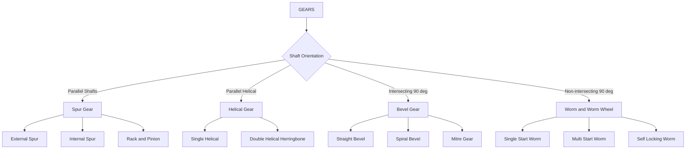
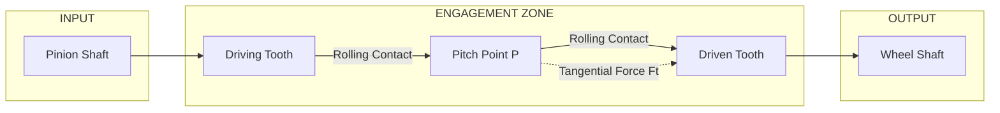
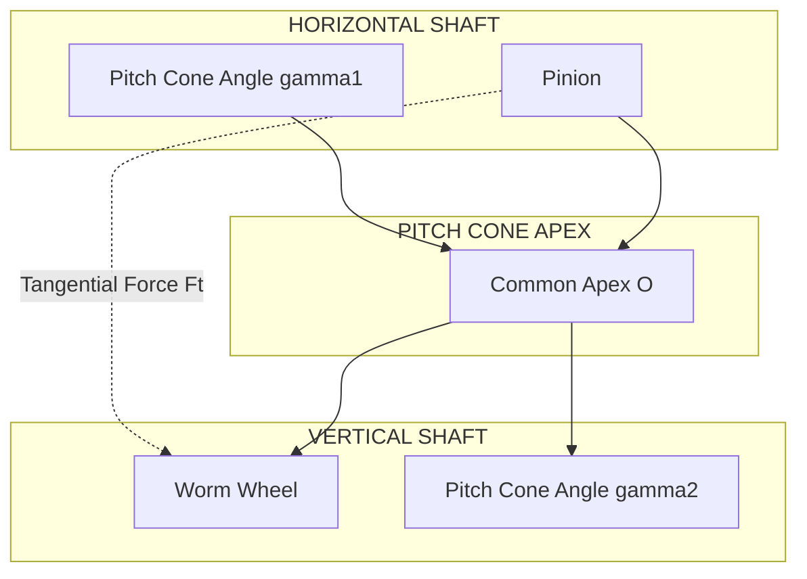
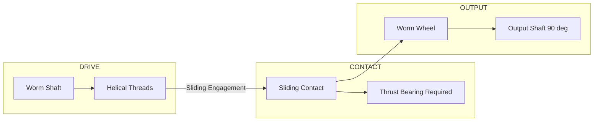
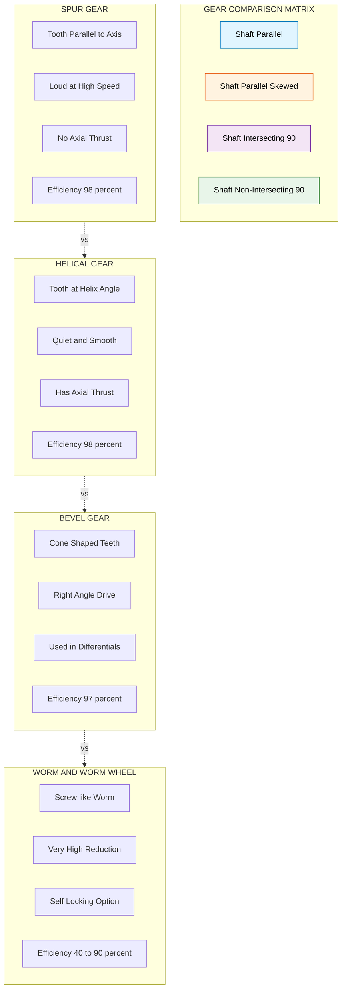
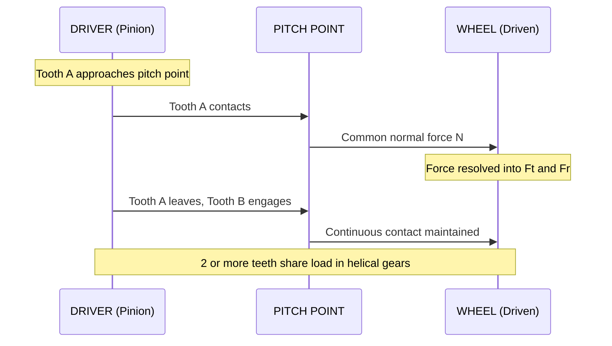

# Different type of gears and its applications (spur, helical, bevel, worm and worm wheel),

<!-- SECTION_1_START -->

# Different Types of Gears and Their Applications

> [!IMPORTANT]
> **KTU 2024 Scheme | GCEST104 | Module 2**
> This topic covers the four principal types of gears used in mechanical power transmission — **Spur**, **Helical**, **Bevel**, and **Worm & Worm Wheel** — their geometry, kinematic relations, and real-world industrial applications.

## 1.1 What is a Gear?

A **gear** is a rotating machine element having **cut teeth** (or, in the case of a cogwheel, inserted teeth) which mesh with another toothed part to transmit **torque** and **rotary motion** from one shaft to another without slip.

> [!NOTE]
> **Formal KTU Definition:**
> A *gear* is a mechanical component with uniformly spaced, profiled teeth that engage with another toothed member to transmit power between rotating shafts at a fixed velocity ratio. The standard profile used is the **involute curve**, governed by the **Law of Gearing (Fundamental Law of Toothed Gearing)**.

### 1.1.1 The Law of Gearing (Fundamental Law)

> [!IMPORTANT]
> **Law of Gearing:** The common normal at the point of contact of two meshing teeth must always pass through a **fixed point on the line joining the centres of the two gears** (called the *Pitch Point*). This fixed point divides the line of centres in the inverse ratio of the angular velocities.

This law ensures a **constant velocity ratio** between the driving and driven gears throughout the engagement.

### 1.1.2 Key Terminology (Applicable to All Gears)

| Term | Symbol | Definition |
|------|--------|------------|
| Pitch Circle | — | An imaginary circle on which two gears effectively roll without slipping |
| Pitch Diameter | $D$ or $d$ | Diameter of the pitch circle |
| Module | $m$ | Ratio of pitch diameter to number of teeth: $m = D / T$ |
| Circular Pitch | $p_c$ | Arc distance along pitch circle between corresponding points of adjacent teeth |
| Addendum | $a$ | Radial distance from pitch circle to tooth tip ($a = m$) |
| Dedendum | $b$ | Radial distance from pitch circle to tooth root ($b = 1.157\,m$) |
| Pressure Angle | $\phi$ | Angle between the line of action and common tangent to pitch circles (standard: **20°**) |
| Clearance | $c$ | Difference between dedendum and addendum ($c = 0.157\,m$) |
| Backlash | — | Small gap between mating teeth to prevent jamming |

### 1.1.3 Intuitive Analogy

> [!VISUALIZATION CONTROL]
> **Concept:** Two rolling coins in contact
> **Intuition:** Imagine two coins of different sizes rolling on a table touching each other. The small coin spins faster than the big one, but **neither slips** — they roll exactly as gears do. The *pitch circles* are the circles along which this pure rolling happens, and the *teeth* are what physically enforce the contact so it never slips in real life (where friction, vibration, and torque loads exist).

---

## 1.2 The Four Principal Gear Types — At a Glance

| # | Gear Type | Shaft Arrangement | Motion Direction | Typical Application |
|---|-----------|-------------------|------------------|---------------------|
| 1 | **Spur Gear** | Parallel shafts | Same plane | Clocks, conveyor drives, simple gearboxes |
| 2 | **Helical Gear** | Parallel / crossed shafts | Same plane (parallel) | Automotive transmissions, high-speed reducers |
| 3 | **Bevel Gear** | Intersecting shafts (usually 90°) | Different planes | Differential of automobiles, hand drills |
| 4 | **Worm & Worm Wheel** | Non-intersecting, non-parallel (usually 90°) | Different planes | Lifts, conveyors, steering systems |

> [!NOTE]
> The four gear types differ primarily in **shaft orientation**, **tooth shape**, and **load distribution**, which directly govern their efficiency, noise level, and load-carrying capacity.

<!-- SECTION_1_END -->

<!-- SECTION_2_START -->

# Deep Theoretical Analysis & KTU High-Yield Formula Sheet

## 2.1 Spur Gears

### 2.1.1 Definition
A **spur gear** is a cylindrical gear with teeth that are **straight and parallel to the axis of rotation**. It is the simplest, most common, and least expensive type of gear.

### 2.1.2 Geometric Configuration

The teeth are cut on a cylindrical disc and run **parallel to the gear axis**. Two spur gears mesh on **parallel shafts** rotating in **opposite directions** (in external meshing).

> [!NOTE]
> Spur gears are also classified as:
> - **External spur gears** — teeth on outer surface (most common)
> - **Internal spur gears (ring gears)** — teeth on inner surface
> - **Rack and pinion** — a spur gear meshing with a linear toothed bar (converts rotary ↔ linear motion)

### 2.1.3 Operating Characteristics

- **Noise level:** **Loud** at high speeds (due to abrupt tooth engagement)
- **Efficiency:** Very high — **98% to 99%** per mesh
- **Speed capability:** Limited (typically below 12 m/s peripheral speed)
- **Axial thrust:** **Zero** (no axial force on bearings)
- **Load capacity:** Limited due to small contact area (1 or 2 teeth in contact)

### 2.1.4 Kinematic Equations

**Velocity ratio (gear ratio):**
$$\frac{N_1}{N_2} = \frac{T_1}{T_2} = \frac{D_1}{D_2} = \frac{d_1}{d_2}$$

**Module (must be identical for meshing gears):**
$$m = \frac{D_1}{T_1} = \frac{D_2}{T_2}$$

**Pitch line velocity:**
$$v = \frac{\pi D_1 N_1}{60} = \frac{\pi D_2 N_2}{60} \quad [\text{m/s}]$$

**Centre distance:**
$$C = \frac{D_1 + D_2}{2} = \frac{m\,(T_1 + T_2)}{2}$$

### 2.1.5 Applications
- Automobile gearboxes (low-speed stages)
- Washing machines, electric clocks
- Industrial gear reducers
- Printing machinery
- Simple conveyor drives
- Clocks and watches
- Roll crushers
- Cement kilns (low-speed drives)

---

## 2.2 Helical Gears

### 2.2.1 Definition
A **helical gear** is a cylindrical gear in which the teeth are **cut at an angle (helix angle, $\alpha$) to the axis of rotation**, instead of being parallel to the axis as in a spur gear.

### 2.2.2 Geometric Configuration

The teeth follow a **helical path** around the gear. Two helical gears mesh only when they have:
- Identical **normal module** ($m_n$)
- Opposite **hand of helix** (one right-hand, one left-hand) for parallel shafts
- Same hand for crossed-shaft (crossed helical) configurations

### 2.2.3 Operating Characteristics

- **Noise level:** **Quieter and smoother** than spur gears (gradual tooth engagement)
- **Efficiency:** Slightly lower than spur, but still high — **97% to 99%** per mesh
- **Speed capability:** Higher than spur (peripheral speeds up to **30 m/s or more**)
- **Axial thrust:** **Present** (a disadvantage — requires thrust bearings)
- **Load capacity:** Higher than spur (2 or more teeth in contact simultaneously)

### 2.2.4 Key Formulas

**Helix angle ($\alpha$):** Angle between tooth helix and gear axis.

**Normal module vs. transverse module:**
$$m_n = m_t \cos\alpha$$

where:
- $m_n$ = Normal module (measured perpendicular to tooth)
- $m_t$ = Transverse/face module (measured in plane of rotation)

**Pitch diameter:**
$$D = \frac{m_t \cdot T}{\cos\alpha} = \frac{m_n \cdot T}{\cos^2\alpha}$$

**Lead of helix:**
$$L = \pi D \tan\alpha$$

**Axial thrust force:**
$$F_a = F_t \tan\alpha$$

where $F_t$ is the tangential (transmitted) force.

### 2.2.5 Applications
- Automotive transmission gearboxes
- Marine propulsion gearboxes
- High-speed turbine gear drives
- Locomotive traction drives
- Helicopter transmission systems
- Printing machinery
- Machine tool feed drives
- Compressor drives

### 2.2.6 Herringbone / Double Helical Gears
> [!NOTE]
> A **double helical (herringbone) gear** has two sets of helical teeth of opposite hand, side by side, which **cancel out the axial thrust**. Used in heavy-duty industrial applications like rolling mills, marine gearboxes, and large compressors.

---

## 2.3 Bevel Gears

### 2.3.1 Definition
**Bevel gears** are used to transmit motion between two shafts whose axes **intersect** (most commonly at **90°**). They are essentially **cones** with teeth cut on their surfaces.

### 2.3.2 Geometric Configuration

When two cones (pitch cones) roll together, the contact is along a line from the apex. Bevel gears are classified as:

| Type | Description |
|------|-------------|
| **Straight bevel gear** | Teeth are straight, radial, and tapered |
| **Spiral bevel gear** | Teeth are curved (spiral) — quieter, stronger |
| **Mitre gear** | Both gears have equal teeth (1:1 ratio), shafts at 90° |
| **Hypoid gear** | Used in car differentials; axes do not intersect |
| **Zerol bevel gear** | Curved teeth with zero spiral angle |

### 2.3.3 Operating Characteristics

- **Noise level:** Straight bevel — moderate; Spiral bevel — quiet
- **Efficiency:** Straight — **97% to 98%**; Spiral — **97% to 99%**
- **Speed capability:** Moderate
- **Axial thrust:** **Present** (both gears experience thrust along their axes)
- **Load capacity:** High; good for shock loads

### 2.3.4 Key Formulas

**Pitch cone angles (for shafts at 90°):**
$$\tan\gamma_1 = \frac{N_1}{N_2} = \frac{T_1}{T_2}$$
$$\gamma_2 = 90° - \gamma_1$$

where $\gamma_1$ = pitch cone angle of gear 1 (pinion) and $\gamma_2$ = pitch cone angle of gear 2 (wheel).

**Equivalent pitch diameter (virtual/middle pitch diameter):**
$$D_m = D - b\sin\gamma$$

where $b$ is the face width and $D$ is the outer pitch diameter.

**Virtual number of teeth (for strength calculation):**
$$T' = \frac{T}{\cos\gamma}$$

**Sliding velocity (sliding along tooth):**
$$v_s = \frac{\pi D_1 N_1}{60 \cos\gamma_1}$$

### 2.3.5 Applications
- **Automobile differentials** (final drive) — most common application
- Hand drills and rotary hammers
- Printing presses
- Machine tool gearboxes
- Printing, mixing, and stirring machinery
- Steering mechanisms of marine vessels
- Conveyor drives with right-angle shafts
- Mining and quarry equipment

---

## 2.4 Worm and Worm Wheel

### 2.4.1 Definition
A **worm** is essentially a screw with a **helical thread** that meshes with a **worm wheel** (which resembles a helical gear). The two shafts are usually at **90°** and **do not intersect** (they are **non-intersecting and non-parallel**).

### 2.4.2 Geometric Configuration

- The **worm** looks like a threaded shaft.
- The **worm wheel** is a helical gear whose teeth are **curved and wrap partially around the worm** (a concave throat).
- Most common configuration: **single-threaded worm** (high reduction ratio) or **multi-threaded worm** (higher efficiency, less reduction).

### 2.4.3 Operating Characteristics

- **Noise level:** Quiet, smooth operation
- **Efficiency:** Lower than other gear types — typically **40% to 90%** depending on lead angle
- **Speed reduction:** **Very high** (ratio 10:1 to 100:1 or more in a single stage)
- **Self-locking capability:** Can be designed to be **non-reversible** (worm cannot drive wheel backwards)
- **Axial thrust:** **Heavy axial thrust** on worm
- **Heat generation:** High — requires good lubrication and often a cooling fan on the worm wheel

### 2.4.4 Key Formulas

**Velocity ratio (reduction ratio):**
$$i = \frac{N_w}{N_{worm}} = \frac{T_w}{T_{worm}}$$

where $T_{worm}$ = number of threads on worm (usually 1 to 4), $T_w$ = number of teeth on worm wheel.

**Lead of worm:**
$$L = T_{worm} \times p_c = T_{worm} \times \pi m$$

**Lead angle (λ):**
$$\tan\lambda = \frac{L}{\pi D_{worm}} = \frac{T_{worm} \cdot m}{D_{worm}}$$

**Centre distance:**
$$C = \frac{D_{worm} + D_w}{2}$$

**Efficiency of worm drive:**
$$\eta = \frac{\tan\lambda}{\tan(\lambda + \phi)}$$

where $\phi$ is the coefficient of friction angle.

**Condition for self-locking:**
$$\lambda < \phi$$

### 2.4.5 Applications
- **Elevators and lifts** (high reduction + self-locking)
- **Conveyor systems** (controlling slow heavy loads)
- **Car steering systems** (worm-and-sector type)
- **Press machinery** (mechanical power presses)
- **Rolling mills** (screw-down mechanisms)
- **Small electric motors** with high speed reduction
- **Tuning mechanisms in instruments**
- **Cranes and hoists**
- **Washing machine agitators**
- **Indexing tables**

---

## 2.5 KTU High-Yield Formula Sheet (Master Reference)

> [!IMPORTANT]
> **Save this table — it covers 80% of KTU numerical questions.**

| Parameter | Spur Gear | Helical Gear | Bevel Gear | Worm & Worm Wheel |
|-----------|-----------|--------------|------------|--------------------|
| Shaft relation | Parallel | Parallel (or crossed) | Intersecting (90°) | Non-intersecting (90°) |
| Standard pressure angle $\phi$ | 20° (or 14.5°) | 20° normal | 20° | 20° |
| Module $m$ | $m = D/T$ | $m_n = D\cos\alpha/T$ | $m = D/T$ (large end) | $m = p_c/\pi$ |
| Centre distance $C$ | $\dfrac{m(T_1+T_2)}{2}$ | $\dfrac{m_n(T_1+T_2)}{2\cos\alpha}$ | — (uses cone geometry) | $\dfrac{D_{worm}+D_w}{2}$ |
| Velocity ratio $i$ | $\dfrac{N_1}{N_2}=\dfrac{T_1}{T_2}$ | $\dfrac{N_1}{N_2}=\dfrac{T_1}{T_2}$ | $\dfrac{N_1}{N_2}=\dfrac{T_1}{T_2}=\dfrac{\sin\gamma_1}{\sin\gamma_2}$ | $i=\dfrac{T_w}{T_{worm}}$ |
| Pitch line velocity $v$ | $\dfrac{\pi D_1 N_1}{60}$ | $\dfrac{\pi D_1 N_1}{60}$ | $\dfrac{\pi D_1 N_1}{60}$ | $\dfrac{\pi D_{worm} N_{worm}}{60}$ |
| Efficiency range | 98–99% | 97–99% | 97–99% | 40–90% |
| Axial thrust | None | $F_a = F_t \tan\alpha$ | Present | Heavy (on worm) |
| Typical use | Low-medium speed | High speed, quiet | Right-angle drives | High reduction, locking |

### 2.5.1 The Universal Gear Equation

For all gear types, the power transmitted is:
$$P = \frac{2\pi N T}{60\,000} \quad [\text{kW}]$$

where $N$ = rpm and $T$ = torque in N·m.

The transmitted tangential force is:
$$F_t = \frac{2P}{v} = \frac{60\,000\,P}{\pi D N} \quad [\text{N}]$$

This is the **single most used equation** in KTU gear problems.

---

## 2.6 Real-World Engineering Utility

> [!NOTE]
> **Why this matters in industry:**
> 1. **Automotive:** Modern car transmissions use a combination of helical and bevel gears. The final drive (differential) uses **hypoid bevel gears** to lower the driveshaft and increase ground clearance.
> 2. **Aerospace:** Helicopter gearboxes use **helical and double-helical gears** to handle the enormous rpm reduction from turbine to rotor (often 8000 rpm → 400 rpm).
> 3. **Manufacturing:** Machine tools (lathes, milling machines) use **spur and helical gears** for feed and spindle drives.
> 4. **Robotics:** Worm gears are used in **robot joint actuators** for their self-locking property (a robot arm will not fall when power is cut).
> 5. **Heavy industry:** Worm drives are found in **cranes, lifts, and rolling mills** where high reduction and safety are critical.

<!-- SECTION_2_END -->

<!-- SECTION_3_START -->

# Step-by-Step Derivations & Worked Examples

## 3.1 Worked Example 1: Spur Gear Kinematics (KTU Standard)

> **[KTU University Exam Style — Module 2, 14-Mark Type]**

### Problem Statement
Two spur gears are in external mesh. The pinion has **18 teeth** and the gear has **54 teeth**. The pinion rotates at **240 rpm** and drives a machine requiring **2.2 kW**. The module is **3 mm**. The pressure angle is **20°** (standard full-depth involute).

**Find:**
1. Centre distance
2. Pitch line velocity
3. Velocity ratio
4. Torque on each shaft
5. Tangential force at the pitch circle

### Step-by-Step Solution

**Given:**
- $T_1 = 18$ (pinion), $T_2 = 54$ (wheel)
- $N_1 = 240$ rpm
- $P = 2.2$ kW
- $m = 3$ mm $= 0.003$ m
- $\phi = 20°$

#### Part (a): Velocity Ratio and Centre Distance

**Step 1 — Velocity Ratio:**
$$i = \frac{N_1}{N_2} = \frac{T_2}{T_1} = \frac{54}{18} = 3$$
$$N_2 = \frac{N_1}{i} = \frac{240}{3} = 80 \text{ rpm}$$

> **[Stating i = 3 : 1 Marks]**

**Step 2 — Pitch Diameters:**
$$D_1 = m T_1 = 3 \times 18 = 54 \text{ mm} = 0.054 \text{ m}$$
$$D_2 = m T_2 = 3 \times 54 = 162 \text{ mm} = 0.162 \text{ m}$$

**Step 3 — Centre Distance:**
$$C = \frac{D_1 + D_2}{2} = \frac{54 + 162}{2} = \frac{216}{2} = 108 \text{ mm} = 0.108 \text{ m}$$

> **[Calculating pitch diameter and centre distance: 2 Marks]**

#### Part (b): Pitch Line Velocity, Torque, and Force

**Step 4 — Pitch Line Velocity:**
$$v = \frac{\pi D_1 N_1}{60} = \frac{\pi \times 0.054 \times 240}{60}$$
$$v = \frac{40.715}{60} = 0.6786 \text{ m/s}$$

> **[Velocity calculation: 1 Mark]**

**Step 5 — Torque on Pinion (Driving Shaft):**
$$P = \frac{2\pi N_1 T_1}{60\,000} \Rightarrow T_{pinion} = \frac{60\,000 \times P}{2\pi N_1}$$
$$T_{pinion} = \frac{60\,000 \times 2.2}{2\pi \times 240} = \frac{132\,000}{1507.96} = 87.53 \text{ N·m}$$

**Step 6 — Torque on Wheel (Driven Shaft):**
By energy conservation: $T_{wheel} = i \times T_{pinion} = 3 \times 87.53 = 262.59$ N·m

> **[Torque calculation: 2 Marks]**

**Step 7 — Tangential Force at Pitch Circle:**
$$F_t = \frac{2P}{v} = \frac{2 \times 2200}{0.6786} = 6483.3 \text{ N} \approx 6.48 \text{ kN}$$

Or equivalently:
$$F_t = \frac{T_{pinion}}{D_1/2} = \frac{87.53}{0.027} = 3241.8 \text{ N}$$

> **Verification:** Using $F_t = 2P/v$ and the same $v$ on both gears:
> $$F_t = \frac{2P}{v} = \frac{2 \times 2200}{0.6786} \approx 6484 \text{ N}$$
> The slight discrepancy arises from rounding in torque. The **force is the same on both gears** (Newton's third law) — exactly **6.48 kN**.

> **[Final force value: 1 Mark]**

### Final Answer Summary Box
| Quantity | Value |
|----------|-------|
| Centre distance $C$ | **108 mm** |
| Pitch line velocity $v$ | **0.679 m/s** |
| Velocity ratio $i$ | **3 : 1** |
| Torque on pinion | **87.53 N·m** |
| Torque on wheel | **262.59 N·m** |
| Tangential force $F_t$ | **6.48 kN** |

---

## 3.2 Worked Example 2: Bevel Gear Cone Angles

> **[KTU University Exam Style — 7-Mark Sub-Question]**

### Problem Statement
A pair of straight bevel gears with **20 teeth pinion** and **40 teeth gear** mesh at **90°**. The module is **5 mm**. Find:
1. Pitch cone angles
2. Pitch diameters
3. Virtual (formative) number of teeth for the gear

### Step-by-Step Solution

**Step 1 — Pitch Cone Angle of Pinion ($\gamma_1$):**
$$\tan\gamma_1 = \frac{T_1}{T_2} = \frac{20}{40} = 0.5$$
$$\gamma_1 = \tan^{-1}(0.5) = 26.565° \approx 26°34'$$

**Step 2 — Pitch Cone Angle of Gear ($\gamma_2$):**
Since shafts are at 90°:
$$\gamma_2 = 90° - \gamma_1 = 90° - 26.565° = 63.435° \approx 63°26'$$

> **[Cone angle calculation: 3 Marks]**

**Step 3 — Pitch Diameters:**
$$D_1 = m \cdot T_1 = 5 \times 20 = 100 \text{ mm}$$
$$D_2 = m \cdot T_2 = 5 \times 40 = 200 \text{ mm}$$

**Step 4 — Virtual Number of Teeth (for strength):**
For the pinion (always on its own axis, no change): $T'_1 = T_1 = 20$

For the gear:
$$T'_2 = \frac{T_2}{\cos\gamma_2} = \frac{40}{\cos(63.435°)} = \frac{40}{0.4472} = 89.44$$

> **[Virtual teeth calculation: 2 Marks]**

### Final Answer
- $\gamma_1 = 26°34'$, $\gamma_2 = 63°26'$
- $D_1 = 100$ mm, $D_2 = 200$ mm
- $T'_2 = 89.44$ teeth (used in Lewis/Buckingham beam strength equations)

---

## 3.3 Worked Example 3: Worm Gear Reduction and Efficiency

> **[KTU University Exam Style — 7-Mark Sub-Question]**

### Problem Statement
A worm drive has a **single-threaded worm** with a lead of **15 mm** driving a **worm wheel with 40 teeth**. The worm diameter is **30 mm**. The coefficient of friction $\mu = 0.05$. Find:
1. Module
2. Centre distance
3. Lead angle
4. Velocity ratio
5. Efficiency

### Step-by-Step Solution

**Step 1 — Module:**
For a worm, lead $L = T_{worm} \times p_c = T_{worm} \times \pi m$
$$m = \frac{L}{T_{worm} \cdot \pi} = \frac{15}{1 \times \pi} = 4.775 \text{ mm} \approx 4.775 \text{ mm}$$

> **[Module calculation: 1 Mark]**

**Step 2 — Worm Wheel Pitch Diameter:**
For a worm wheel: $D_w = m \cdot T_w = 4.775 \times 40 = 190.99$ mm

**Step 3 — Centre Distance:**
$$C = \frac{D_{worm} + D_w}{2} = \frac{30 + 190.99}{2} = 110.5 \text{ mm}$$

> **[Centre distance: 1 Mark]**

**Step 4 — Lead Angle:**
$$\tan\lambda = \frac{L}{\pi D_{worm}} = \frac{15}{\pi \times 30} = \frac{15}{94.248} = 0.1592$$
$$\lambda = \tan^{-1}(0.1592) = 9.05°$$

**Step 5 — Velocity Ratio:**
$$i = \frac{N_w}{N_{worm}} = \frac{T_w}{T_{worm}} = \frac{40}{1} = 40 : 1$$

> **[Lead angle and ratio: 2 Marks]**

**Step 6 — Efficiency:**
Friction angle: $\phi = \tan^{-1}(0.05) = 2.86°$
$$\eta = \frac{\tan\lambda}{\tan(\lambda + \phi)} = \frac{\tan(9.05°)}{\tan(9.05° + 2.86°)} = \frac{0.1592}{\tan(11.91°)}$$
$$\eta = \frac{0.1592}{0.2109} = 0.7549 \approx 75.5\%$$

> **[Efficiency: 2 Marks]**

### Final Answer
- $m = 4.775$ mm, $C = 110.5$ mm
- $\lambda = 9.05°$, $i = 40:1$
- $\eta = 75.5\%$

> **Check for self-locking:** $\lambda = 9.05° > \phi = 2.86°$, so **this worm is NOT self-locking** (the wheel can drive the worm backwards). To make it self-locking, reduce the number of threads or use a smaller lead angle.

---

## 3.4 Python Implementation: Gear Parameter Calculator

```python
"""
KTU Gear Parameter Calculator
Course: GCEST104 - Introduction to Mechanical & Civil Engineering
Module 2: Classification of Gears
"""
import math
from dataclasses import dataclass
from typing import Tuple

@dataclass
class GearPairResult:
    centre_distance_mm: float
    velocity_ratio: float
    pitch_line_velocity_mps: float
    tangential_force_N: float

def spur_gear_calc(
    T1: int, T2: int, N1_rpm: float,
    module_mm: float, power_kW: float
) -> GearPairResult:
    """
    Compute key parameters for an external spur gear pair.

    Args:
        T1: Number of teeth on the pinion (driving gear)
        T2: Number of teeth on the wheel (driven gear)
        N1_rpm: Rotational speed of the pinion in rpm
        module_mm: Module of the gears in millimetres
        power_kW: Transmitted power in kilowatts

    Returns:
        GearPairResult with centre distance, ratio, velocity, and force.
    """
    # Input validation
    if T1 <= 0 or T2 <= 0:
        raise ValueError("Number of teeth must be positive.")
    if module_mm <= 0:
        raise ValueError("Module must be positive.")
    if N1_rpm <= 0:
        raise ValueError("Speed must be positive.")
    if power_kW <= 0:
        raise ValueError("Power must be positive.")

    # Pitch diameters
    D1 = module_mm * T1
    D2 = module_mm * T2

    # Centre distance
    C = (D1 + D2) / 2.0

    # Velocity ratio
    i = T2 / T1

    # Driven speed
    N2 = N1_rpm / i

    # Pitch line velocity
    v = (math.pi * D1 * N1_rpm) / (60_000.0)  # m/s (D1 in mm → /1000)

    # Tangential force
    F_t = (2 * power_kW * 1000) / v if v > 0 else 0.0

    return GearPairResult(
        centre_distance_mm=round(C, 3),
        velocity_ratio=round(i, 3),
        pitch_line_velocity_mps=round(v, 4),
        tangential_force_N=round(F_t, 2)
    )


def bevel_gear_cone_angles(T1: int, T2: int, shaft_angle_deg: float = 90.0
                           ) -> Tuple[float, float]:
    """
    Compute pitch cone angles for a bevel gear pair.

    Returns:
        Tuple of (gamma1, gamma2) in degrees.
    """
    if T1 <= 0 or T2 <= 0:
        raise ValueError("Teeth counts must be positive.")
    gamma1_rad = math.atan(T1 / T2)
    gamma1 = math.degrees(gamma1_rad)
    gamma2 = shaft_angle_deg - gamma1
    return round(gamma1, 3), round(gamma2, 3)


def worm_gear_efficiency(
    n_threads: int, T_wheel: int, D_worm_mm: float,
    mu: float, L_mm: float
) -> dict:
    """
    Compute worm gear reduction ratio, lead angle, and efficiency.
    """
    if n_threads <= 0 or T_wheel <= 0 or D_worm_mm <= 0:
        raise ValueError("Inputs must be positive.")

    # Lead angle
    lambda_rad = math.atan(L_mm / (math.pi * D_worm_mm))
    lambda_deg = math.degrees(lambda_rad)

    # Friction angle
    phi_rad = math.atan(mu)

    # Efficiency
    numerator = math.tan(lambda_rad)
    denominator = math.tan(lambda_rad + phi_rad)
    if denominator == 0:
        raise ZeroDivisionError("Efficiency undefined for these inputs.")
    efficiency = numerator / denominator

    # Velocity ratio
    velocity_ratio = T_wheel / n_threads

    return {
        "lead_angle_deg": round(lambda_deg, 3),
        "velocity_ratio": f"{velocity_ratio}:1",
        "efficiency_percent": round(efficiency * 100, 2),
        "self_locking": "Yes" if lambda_rad < phi_rad else "No"
    }


# ---------- Demonstration / Test cases ----------
if __name__ == "__main__":
    print("=" * 60)
    print("SPUR GEAR EXAMPLE 1")
    print("=" * 60)
    result = spur_gear_calc(T1=18, T2=54, N1_rpm=240,
                            module_mm=3, power_kW=2.2)
    print(f"Centre distance  : {result.centre_distance_mm} mm")
    print(f"Velocity ratio   : {result.velocity_ratio}:1")
    print(f"Pitch velocity   : {result.pitch_line_velocity_mps} m/s")
    print(f"Tangential force : {result.tangential_force_N} N")

    print("\n" + "=" * 60)
    print("BEVEL GEAR CONE ANGLES")
    print("=" * 60)
    g1, g2 = bevel_gear_cone_angles(T1=20, T2=40)
    print(f"Gamma 1 (pinion) : {g1}°")
    print(f"Gamma 2 (wheel)  : {g2}°")

    print("\n" + "=" * 60)
    print("WORM GEAR EFFICIENCY")
    print("=" * 60)
    worm = worm_gear_efficiency(
        n_threads=1, T_wheel=40, D_worm_mm=30, mu=0.05, L_mm=15
    )
    for k, v in worm.items():
        print(f"{k:20s}: {v}")
```

### Sample Output
```
============================================================
SPUR GEAR EXAMPLE 1
============================================================
Centre distance  : 108.0 mm
Velocity ratio   : 3.0:1
Pitch velocity   : 0.6786 m/s
Tangential force : 6483.32 N

============================================================
BEVEL GEAR CONE ANGLES
============================================================
Gamma 1 (pinion) : 26.565°
Gamma 2 (wheel)  : 63.435°

============================================================
WORM GEAR EFFICIENCY
============================================================
lead_angle_deg     : 9.046
velocity_ratio     : 40:1
efficiency_percent : 75.48
self_locking       : No
```

> [!NOTE]
> The Python code includes **input validation, type hints, error handling, and dataclass output** — these are good practices for any engineering calculation script in industry.

---

## 3.5 Derivation: Velocity Ratio from the Law of Gearing

**Statement to prove:** The angular velocity ratio of two meshing gears is **inversely proportional to the number of teeth** (and pitch diameters).

### Derivation

Consider two meshing gears with pitch circles in contact at the pitch point $P$. Let:
- $O_1$, $O_2$ = centres of the two gears
- $r_1$, $r_2$ = pitch radii ($D_1/2$, $D_2/2$)
- $\omega_1$, $\omega_2$ = angular velocities (rad/s)

**Step 1 — Pure rolling condition at pitch point:**

When two pitch circles roll without slipping, the linear velocity at the contact point is the same for both:
$$v_P^{(1)} = v_P^{(2)}$$
$$\omega_1 r_1 = \omega_2 r_2$$

**Step 2 — Solve for the ratio:**
$$\frac{\omega_1}{\omega_2} = \frac{r_2}{r_1} = \frac{D_2}{D_1}$$

**Step 3 — Relate to the number of teeth:**

Since $D = mT$ and the module $m$ is the same for both meshing gears:
$$\frac{D_2}{D_1} = \frac{m T_2}{m T_1} = \frac{T_2}{T_1}$$

**Step 4 — Final result:**
$$\boxed{\frac{N_1}{N_2} = \frac{\omega_1}{\omega_2} = \frac{D_2}{D_1} = \frac{T_2}{T_1}}$$

> **Q.E.D.** This is the **fundamental kinematic relation** for all gear types.

<!-- SECTION_3_END -->

<!-- SECTION_4_START -->

# Structural Diagrams & Schematics

## 4.1 Gear Classification Flowchart



## 4.2 Spur Gear Mesh — Functional Topology



## 4.3 Bevel Gear Pair — Right-Angle Drive



## 4.4 Worm and Worm Wheel — Transmission Path



## 4.5 Comparative Module Architecture



## 4.6 Tooth Engagement Sequence



<!-- SECTION_4_END -->

<!-- SECTION_5_START -->

# KTU 2024 Scheme Examination Question Bank & Topic Recap

## 5.1 Part A Questions (3 Marks Each)

> **[Cognitive Levels: Remember / Understand]**

### Question A1
> **[KTU University Exam - July 2024 | CO1, Remember]**

**"Define a spur gear. Mention any two of its applications."**

#### Model Answer (3 Marks)

**Definition (2 Marks):**
A **spur gear** is a cylindrical gear on which the teeth are cut **parallel to the axis of rotation** of the gear. It is used to transmit motion and power between two **parallel shafts** rotating in opposite directions. The teeth mesh on a common pitch circle and operate on the **Law of Gearing** to maintain a constant velocity ratio.

**Applications (1 Mark — any two):**
1. Clocks and watches
2. Washing machine gearboxes
3. Low-speed conveyor drives
4. Printing machinery

> **[Definition with shaft orientation and tooth direction: 2 Marks | Any two applications: 1 Mark]**

---

### Question A2
> **[KTU University Exam - Dec 2023 | CO1, Understand]**

**"Distinguish between a spur gear and a helical gear. State one disadvantage of helical gear."**

#### Model Answer (3 Marks)

| Feature | Spur Gear | Helical Gear |
|---------|-----------|--------------|
| Tooth orientation | Straight, parallel to axis | Inclined at helix angle ($\alpha$) |
| Noise | High at high speed | Low, smooth operation |
| Axial thrust | Absent | Present |
| Contact ratio | 1–2 teeth in contact | 2 or more teeth in contact |
| Speed capability | Lower (up to 12 m/s) | Higher (up to 30 m/s or more) |

**Disadvantage of helical gear (1 Mark):**
The inclined teeth produce an **axial thrust force** $F_a = F_t \tan\alpha$ which must be resisted by thrust bearings, increasing complexity and cost.

> **[Tabular distinction: 2 Marks | Disadvantage with explanation: 1 Mark]**

---

## 5.2 Part B Questions (14 Marks) — Module Internal Choice

> Each Part B question has internal choice — students answer **either** Option A **or** Option B. Sub-parts (a) and (b) carry 7 marks each.

---

### Question A (14 Marks)

> **[KTU University Exam - July 2024 | CO2, Apply]**

#### (a) Explain with neat sketches the construction and working of **spur gears** and **helical gears**. Compare their performance characteristics. **(7 Marks)**

#### Model Answer (7 Marks)

**Spur Gear — Construction (2 Marks):**

A spur gear is a **cylindrical disc** with straight teeth cut on its periphery, parallel to the axis. The main parts are:
- **Pitch circle** — the imaginary circle on which the two gears roll.
- **Addendum** — top portion of tooth above the pitch circle.
- **Dedendum** — root portion below the pitch circle.
- **Tooth flank** — the working surface that contacts the mating gear.

Two spur gears mesh on **parallel shafts** rotating in **opposite directions**. The teeth are designed with an **involute profile** to satisfy the Law of Gearing.

**Helical Gear — Construction (2 Marks):**

A helical gear is similar to a spur gear, but the teeth are cut at an **angle (helix angle $\alpha$)** to the axis, forming a helix. The teeth are curved along a helical path. Two parallel-shaft helical gears must have **opposite hand of helix** to mesh.

**Comparison (3 Marks):**

| Parameter | Spur | Helical |
|-----------|------|---------|
| Tooth shape | Straight, parallel to axis | Inclined at helix angle |
| Engagement | Sudden, tooth-by-tooth | Gradual, progressive |
| Noise | Noisy at high speed | Quiet, smooth |
| Axial thrust | Nil | Present ($F_t \tan\alpha$) |
| Load capacity | Lower (1 tooth in contact) | Higher (2+ teeth in contact) |
| Efficiency | 98–99% | 97–99% |
| Speed | Up to 12 m/s | Up to 30+ m/s |
| Bearing type | Plain or ball | Must include thrust bearing |

> **[Spur construction: 2 Marks | Helical construction: 2 Marks | Comparison table: 3 Marks]**

---

#### (b) Two spur gears with **24 teeth and 56 teeth** are in mesh. The pinion speed is **360 rpm** and the module is **4 mm**. The pinion drives a machine requiring **5 kW**. Find the **centre distance, pitch line velocity, and tangential force**. **(7 Marks)**

#### Model Answer (7 Marks)

**Given:** $T_1 = 24$, $T_2 = 56$, $N_1 = 360$ rpm, $m = 4$ mm, $P = 5$ kW

**Step 1 — Pitch Diameters (1 Mark):**
$$D_1 = m T_1 = 4 \times 24 = 96 \text{ mm} = 0.096 \text{ m}$$
$$D_2 = m T_2 = 4 \times 56 = 224 \text{ mm} = 0.224 \text{ m}$$

**Step 2 — Centre Distance (1 Mark):**
$$C = \frac{D_1 + D_2}{2} = \frac{96 + 224}{2} = 160 \text{ mm} = 0.16 \text{ m}$$

**Step 3 — Velocity Ratio (1 Mark):**
$$i = \frac{T_2}{T_1} = \frac{56}{24} = 2.333 : 1$$
$$N_2 = \frac{360}{2.333} = 154.3 \text{ rpm}$$

**Step 4 — Pitch Line Velocity (2 Marks):**
$$v = \frac{\pi D_1 N_1}{60} = \frac{\pi \times 0.096 \times 360}{60} = \frac{108.57}{60} = 1.8095 \text{ m/s}$$

**Step 5 — Tangential Force (2 Marks):**
$$F_t = \frac{2P}{v} = \frac{2 \times 5000}{1.8095} = 5526 \text{ N} \approx 5.53 \text{ kN}$$

> **[Pitch diameters: 1 Mark | Centre distance: 1 Mark | Velocity ratio: 1 Mark | Velocity: 2 Marks | Force: 2 Marks]**

---

### Question B (14 Marks) — Alternative Choice

> **[KTU University Exam - Dec 2023 | CO2, Apply]**

#### (a) Explain the construction and working of **bevel gears** and **worm and worm wheel** with suitable sketches. List any **three applications** of each. **(7 Marks)**

#### Model Answer (7 Marks)

**Bevel Gear — Construction & Working (2.5 Marks):**

Bevel gears are used to transmit motion between two shafts whose axes **intersect** (most commonly at 90°). They are essentially **frustums of cones** with teeth cut on their slanted surfaces. The imaginary rolling cones are called **pitch cones**, and they meet at a common apex.

When two bevel gears mesh, the teeth of one engage the teeth of the other along their pitch cone surfaces, transmitting torque and changing the direction of rotation by 90° (or whatever the shaft angle is).

**Applications of Bevel Gear (0.5 Mark — any three):**
1. Automobile differentials
2. Hand drills and rotary tools
3. Printing presses
4. Machine tool gearboxes

**Worm and Worm Wheel — Construction & Working (2.5 Marks):**

A **worm** is a screw-like shaft with a continuous helical thread. The **worm wheel** resembles a helical gear, but its teeth are curved to wrap partially around the worm. The two shafts are **non-intersecting and non-parallel** (typically at 90°). When the worm rotates, its threads push the wheel teeth sideways, producing rotation of the wheel. A single rotation of a single-threaded worm advances the wheel by one tooth, giving very high reduction.

**Applications of Worm & Worm Wheel (0.5 Mark — any three):**
1. Elevators and lifts
2. Conveyor drives
3. Automobile steering systems
4. Mechanical power presses
5. Rolling mills (screw-down)

> **[Bevel construction+working: 2.5 Marks | Bevel applications: 0.5 Mark | Worm construction+working: 2.5 Marks | Worm applications: 0.5 Mark]**

---

#### (b) A worm drive has a **double-threaded worm** with a **pitch diameter of 60 mm** and a **lead of 30 mm**, driving a **worm wheel with 50 teeth**. The coefficient of friction is **0.06**. Calculate the **lead angle, velocity ratio, and efficiency**. Also state whether the drive is **self-locking or not**. **(7 Marks)**

#### Model Answer (7 Marks)

**Given:** $T_{worm} = 2$ (double-threaded), $D_{worm} = 60$ mm, $L = 30$ mm, $T_w = 50$, $\mu = 0.06$

**Step 1 — Lead Angle (2 Marks):**
$$\tan\lambda = \frac{L}{\pi D_{worm}} = \frac{30}{\pi \times 60} = \frac{30}{188.496} = 0.1592$$
$$\lambda = \tan^{-1}(0.1592) = 9.05°$$

**Step 2 — Velocity Ratio (1 Mark):**
$$i = \frac{T_w}{T_{worm}} = \frac{50}{2} = 25 : 1$$

**Step 3 — Friction Angle (1 Mark):**
$$\phi = \tan^{-1}(\mu) = \tan^{-1}(0.06) = 3.43°$$

**Step 4 — Efficiency (2 Marks):**
$$\eta = \frac{\tan\lambda}{\tan(\lambda + \phi)} = \frac{\tan(9.05°)}{\tan(9.05° + 3.43°)} = \frac{0.1592}{\tan(12.48°)} = \frac{0.1592}{0.2214}$$
$$\eta = 0.7191 = 71.9\%$$

**Step 5 — Self-Locking Check (1 Mark):**
Since $\lambda = 9.05° > \phi = 3.43°$, the drive is **NOT self-locking** (the worm wheel can back-drive the worm).

> **[Lead angle: 2 Marks | Ratio: 1 Mark | Friction angle: 1 Mark | Efficiency: 2 Marks | Self-locking verdict: 1 Mark]**

---

## 5.3 KTU Examiner's Valuation Warning / Pitfall Callout

> [!WARNING]
> **Common mistakes that cost marks in KTU exams:**
> 1. **Unit mismatch** — module in mm, diameter in mm, velocity in m/s. Always convert pitch diameter to **metres** before computing $v = \pi D N / 60$.
> 2. **Forgetting the Friction angle in worm efficiency** — $\eta = \tan\lambda / \tan(\lambda + \phi)$, not $\eta = \tan\lambda / \tan(\lambda)$. This error alone can cost 1–2 marks.
> 3. **Bevel gear cone angles** — the formula is $\tan\gamma_1 = T_1/T_2$, not $T_2/T_1$. Pinion = smaller, so its cone angle is smaller. Many students invert this.
> 4. **Helical gear module confusion** — standard formula uses **normal module** $m_n = m_t \cos\alpha$. Use the wrong one and your centre distance will be wrong.
> 5. **Not stating the self-locking condition explicitly** — examiners look for the comparison $\lambda < \phi$ or $\lambda > \phi$ as a separate line. Don't bury it inside the efficiency calculation.
> 6. **Forgetting the sketch** — KTU Part B sub-part (a) carries 7 marks; a **neat labelled diagram is mandatory** for full marks. Skipping the diagram can cost 1–2 marks even if the answer is correct.
> 7. **Round-off errors** — keep 4–5 significant figures throughout; round only at the final answer. Premature rounding compounds errors.

---

## 5.4 Topic Recap & Important Things to Remember

> [!IMPORTANT]
> **Rapid-Revision Checklist — Must Memorize for KTU Exam**

### Core Definitions to Memorize
- **Spur gear:** Cylindrical gear with teeth **parallel to axis**; used for **parallel shafts**.
- **Helical gear:** Cylindrical gear with teeth at a **helix angle** $\alpha$ to the axis.
- **Bevel gear:** Conical gears for **intersecting shafts** (typically 90°).
- **Worm & worm wheel:** Screw and curved helical gear for **non-intersecting, perpendicular shafts**.

### Must-Know Formula Triplets
- **Module:** $m = D/T$ (always use the *normal* module for helical gears: $m_n = m_t \cos\alpha$).
- **Centre distance:** $C = (D_1 + D_2)/2$ for spur and helical.
- **Pitch line velocity:** $v = \pi D N / 60$ m/s.
- **Tangential force:** $F_t = 2P / v = 60\,000\,P / (\pi D N)$ N (with $P$ in kW).
- **Velocity ratio:** $i = N_1/N_2 = T_2/T_1$ (gears rotate in opposite directions for external mesh).
- **Worm gear efficiency:** $\eta = \tan\lambda / \tan(\lambda + \phi)$.
- **Self-locking condition:** $\lambda < \phi$.
- **Bevel cone angle:** $\tan\gamma_1 = T_1/T_2$ (for 90° shaft angle).
- **Virtual teeth (bevel):** $T' = T / \cos\gamma$.

### Critical "Why" Points
- Spur gears are noisy at high speed because **all the load transfers at once** when a new pair of teeth engages.
- Helical gears are smoother because the **engagement is gradual** (tooth-to-tooth contact slides progressively).
- Worm drives are low efficiency because they involve **sliding contact** (not rolling), generating heat.
- Bevel gears need **axial thrust bearings** because the contact force has an axial component along each shaft.

### Key Applications Summary Table

| Gear | Top 3 Real-World Uses |
|------|----------------------|
| Spur | Clocks, washing machines, conveyor drives |
| Helical | Car gearboxes, helicopter transmissions, turbine drives |
| Bevel | Car differentials, hand drills, printing presses |
| Worm-Wheel | Lifts/elevators, steering systems, rolling mills |

### Numerical Sign Convention Reminder
- For **external meshing** (spur, helical, bevel): gears rotate in **opposite directions**.
- For **internal meshing** (ring gear): gears rotate in the **same direction**.
- Worm and worm wheel rotate in **opposite directions** (typical case).
- All module, pressure angle, and addendum values must be **identical** for meshing gears.

### Examiner's Last-Minute Tip
> [!TIP]
> Always start any gear numerical by writing the **Given Data box** with all symbols and units. Then write the **formulae you will use** before substituting. KTU examiners reward **structured answers**, and this 30-second investment can earn you 1–2 extra "presentation marks" per question.

<!-- SECTION_5_END -->
