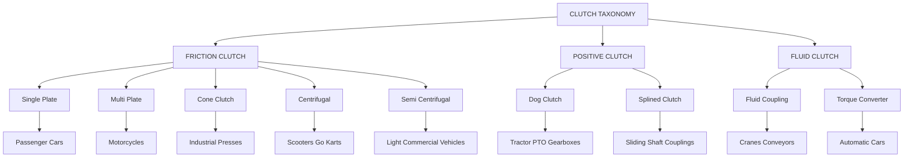
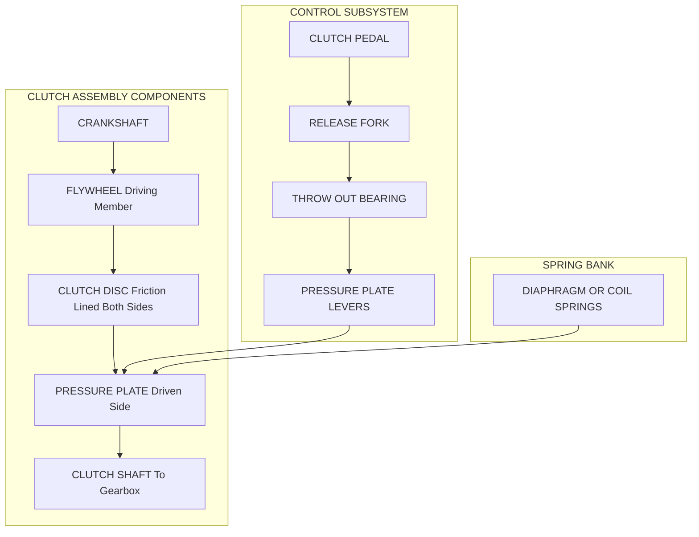
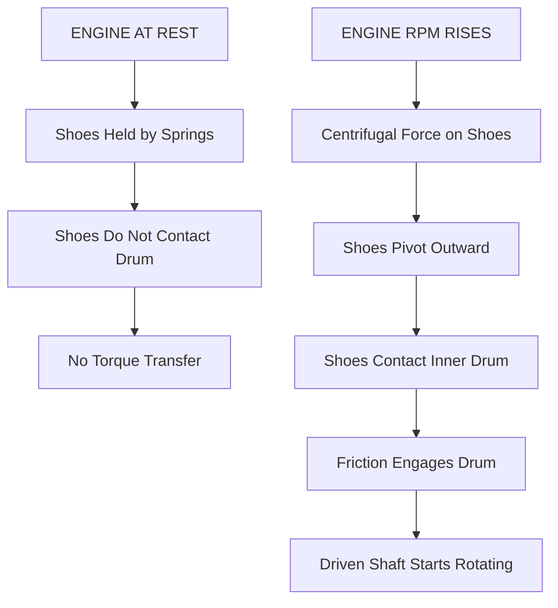
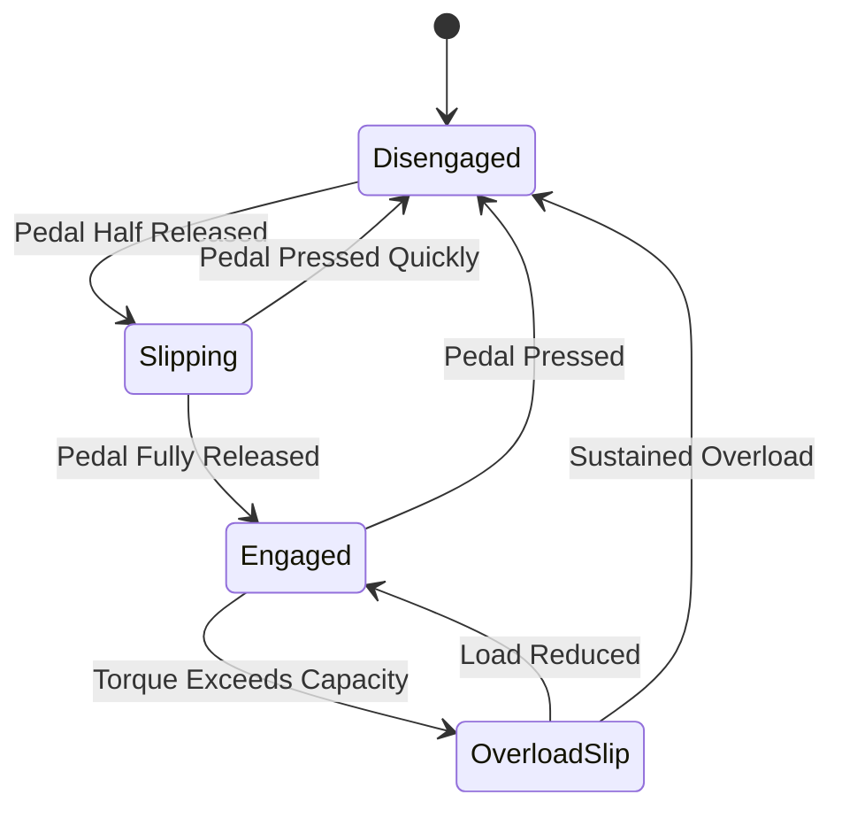

# List types of clutches and their use,

<!-- SECTION_1_START -->
# Clutches: Definition, Intuition & Core Concepts

## 1.1 Formal Academic Definition (KTU 2024 Syllabus Terminology)

A **Clutch** is a mechanical power transmission device used to connect and disconnect the driving shaft (engine/crankshaft) from the driven shaft (gearbox/transmission) on demand. It transmits torque from the driving member to the driven member by means of **frictional contact**, **mechanical interlock**, or **fluid coupling**, without slippage under steady engagement conditions.

> [!NOTE]
> **KTU 2024 Highlight:** The clutch is a *selective engagement* device, not a continuous coupling. Its primary engineering purpose is to provide *smooth starting*, *gear shifting without shock*, and *overload protection* to the downstream drivetrain.

**Governing Physical Principle:**

$$T = \mu \times F_c \times r_{mean} \times n$$

Where:
- $T$ = Transmissible torque (N·m)
- $\mu$ = Coefficient of friction between contact surfaces
- $F_c$ = Axial clamping force (N)
- $r_{mean}$ = Mean radius of the friction surface (m)
- $n$ = Number of friction surfaces in contact

> [!IMPORTANT]
> **Engineering Constant Reference:**
> - Coefficient of friction ($\mu$): **Cast Iron on Cast Iron = 0.15 to 0.20**
> - Coefficient of friction ($\mu$): **Steel on Steel (dry) = 0.20 to 0.30**
> - Coefficient of friction ($\mu$): **Steel on Asbestos = 0.30 to 0.45**

## 1.2 Intuitive Analogy (Real-World Engineering Intuition)

Imagine you are riding a **bicycle** with a geared rear wheel. To start from rest, your legs must spin the chainring, but the rear wheel cannot instantly match that speed without jerking. A clutch in a car plays the *exact same role* as **the friction of your palm pressing the chainring against the rear sprocket** — it lets you gradually transfer rotational energy so the car doesn't stall or lurch.

A second analogy: think of a **hot pan on a gas stove**. The flame (driving source) and the pan (driven load) are two separate entities. The flame transfers heat (energy) to the pan only when contact occurs. A clutch behaves identically: torque flows only when the two plates are pressed together; when the operator lifts the "lever" (clutch pedal), the connection is severed and no power flows.

> [!TIP]
> **Memory Aid:** "**C**lutch = **C**onnect & **C**ut-off on Command" — three C's define its engineering function.

## 1.3 Functional Role in an Automobile Drivetrain

The clutch sits **between the engine flywheel and the gearbox input shaft**, performing three mission-critical tasks:

1. **Smooth Engagement** — gradually transmits engine torque to gearbox to prevent stalling at rest.
2. **Disengagement for Gear Shift** — interrupts power flow so that gear dogs/synchronizers can change ratios without grinding.
3. **Overload Safeguard** — slips momentarily under shock loads, protecting the gearbox and driveline from torsional failure.

> [!VISUALIZATION CONTROL]
> **Concept:** Clutch Position in a Rear-Wheel-Drive Powertrain
> **Geometric Description:** Draw a horizontal linear arrangement on a single axis line:
> Position 1 = Engine Crankshaft → Position 2 = Flywheel (large disc) → Position 3 = Clutch Assembly (sandwiched between flywheel and pressure plate) → Position 4 = Gearbox Input Shaft → Position 5 = Propeller Shaft → Position 6 = Differential → Position 7 = Drive Wheels.
> Observe that the clutch is the *single break-point* in the power path; opening it isolates everything to the right of it from the engine.
<!-- SECTION_1_END -->

<!-- SECTION_2_START -->
# Deep Theoretical Analysis & KTU High-Yield Formula Sheet

## 2.1 Engineering Classification of Clutches

Clutches are broadly classified into **three functional families** based on the energy-transfer mechanism employed:

### Family A — Friction Clutches (Most Common in Automobiles)
Operate on the principle of **kinetic friction** between contacting surfaces. They engage gradually, providing smooth torque transfer and inherent slip-safety.

- **Single Plate Clutch** — One friction disc, two active friction surfaces.
- **Multi-Plate Clutch** — Multiple friction discs stacked in series; used where radial space is limited (motorcycles, racing cars).
- **Cone Clutch** — Conical contact surface provides self-energizing effect and higher torque capacity in smaller diameter.
- **Centrifugal Clutch** — Self-engages based on rotational speed using flyweights; common in scooters and small engines.
- **Semi-Centrifugal Clutch** — Hybrid of spring + centrifugal mechanism; engages via spring at low RPM and centrifugal weights at high RPM.

### Family B — Positive (Toothed) Clutches
Operate on **mechanical interlock** between mating teeth. They are *rigid* (no slip) and are used where absolute positive drive is required without slippage.

- **Dog Clutch** — Straight or involute teeth; used in gearbox sliding mesh and PTO applications.
- **Splined Clutch** — Uses splines for axial sliding engagement.

### Family C — Fluid Clutches (Hydraulic / Fluid Coupling)
Operate on **hydrodynamic drag** of fluid between an impeller and a runner. No mechanical contact = no wear.

- **Fluid Coupling** — Constant torque transfer, used in automatic transmissions, marine drives.
- **Torque Converter** — Enhanced fluid coupling with a *stator* that multiplies torque during acceleration.

## 2.2 Single Plate Clutch — Engineering Design Theory

A single plate clutch consists of:
- **Flywheel** (driving member, attached to crankshaft)
- **Clutch Plate / Disc** (driven member, lined with friction material on both sides)
- **Pressure Plate** (applies axial clamping force via springs)
- **Release Levers / Throw-out Bearing** (operator-controlled disengagement)

### Uniform Pressure Theory
Assumes pressure is uniformly distributed over the contact surface. Torque capacity is given by:

$$T = \mu \times F_c \times \frac{2}{3} \times \frac{(R_o^3 - R_i^3)}{(R_o^2 - R_i^2)}$$

Where:
- $R_o$ = Outer radius of friction lining (m)
- $R_i$ = Inner radius of friction lining (m)
- $F_c$ = Total axial clamping force (N)
- $\mu$ = Coefficient of friction

### Uniform Wear Theory (Newest & Most Accepted)
Assumes wear is uniform → pressure is inversely proportional to radius ($p \times r = \text{constant}$). This yields:

$$T = \frac{1}{2} \times \mu \times F_c \times (R_o + R_i)$$

> [!IMPORTANT]
> **KTU Board Examiner Note:** For uniform wear (the more realistic model), the **mean effective radius** is the **arithmetic mean** $\frac{R_o + R_i}{2}$, NOT the geometric mean. This is a common student error.

## 2.3 Multi-Plate Clutch — Engineering Rationale

When high torque must be transmitted in a *limited radial envelope*, multiple friction discs are stacked. Torque capacity scales linearly with the number of friction surfaces:

$$T_n = n \times T_1 = n \times \frac{1}{2} \times \mu \times F_c \times (R_o + R_i)$$

Where $n$ is the number of contact surfaces (for a clutch with $N$ discs and $N+1$ plates, $n = 2N$ in a dry clutch).

## 2.4 Cone Clutch — Self-Energizing Principle

The cone angle $\alpha$ creates a normal force amplification. Effective axial thrust and torque capacity:

$$F_n = F_c \times \frac{1}{\sin\alpha} = F_c \times \csc\alpha$$

$$T_{cone} = \frac{1}{2} \times \mu \times F_c \times \csc\alpha \times (R_o + R_i)$$

> [!NOTE]
> **Engineering Insight:** Because $\csc\alpha > 1$ for small angles, a cone clutch transmits more torque than a plate clutch of the same diameter and axial force — but suffers from *grabbing* during engagement if $\alpha$ is too small. Standard cone angle range: **12° to 15°**.

## 2.5 KTU Formula Cheat Sheet

| **#** | **Clutch Type** | **Torque Equation** | **Key Variables** | **Engineering Use** |
|---|---|---|---|---|
| 1 | Single Plate (Uniform Pressure) | $T = \frac{2}{3} \mu F_c \dfrac{R_o^3 - R_i^3}{R_o^2 - R_i^2}$ | $\mu, F_c, R_o, R_i$ | Theoretical upper bound |
| 2 | Single Plate (Uniform Wear) ★ | $T = \frac{1}{2} \mu F_c (R_o + R_i)$ | $\mu, F_c, R_o, R_i$ | **Design standard** (most used) |
| 3 | Multi-Plate (n surfaces) | $T_n = n \times \frac{1}{2} \mu F_c (R_o + R_i)$ | $n$ = number of surfaces | Motorcycles, racing cars |
| 4 | Cone Clutch | $T = \frac{1}{2} \mu F_c \csc\alpha (R_o + R_i)$ | $\alpha$ = semi-cone angle | Heavy industrial machinery |
| 5 | Centrifugal (weight force) | $F_w = m \omega^2 r$ | $m$ = mass, $\omega$ = rad/s | Self-engaging clutches |
| 6 | Fluid Coupling | $T_{out} = T_{in} \times (1 - s)$ | $s$ = slip ratio | Automatic cars, marine |

> [!WARNING]
> **Board Valuation Trap:** Always specify the model (Uniform Pressure vs Uniform Wear) before substituting values. Marks are deducted for ambiguous assumptions.

## 2.6 Real-World Engineering Applications

| **Clutch Type** | **Industry / Application** | **Why Chosen** |
|---|---|---|
| Single Plate Dry Friction | Passenger cars (Maruti, Hyundai) | Simplicity, low cost, adequate torque |
| Multi-Plate Wet | Motorcycles (Bajaj, Honda Activa) | Compact, handles high RPM |
| Cone Clutch | Industrial presses, mining equipment | High torque in small size |
| Centrifugal | Scooters, go-karts, lawnmowers | Automatic engagement, no lever |
| Dog (Positive) | Tractor PTO, sliding mesh gearboxes | Zero slip, positive drive |
| Fluid Coupling | Cranes, conveyors, automatic cars | Smooth start, overload cushioning |
| Torque Converter | Modern automatic transmission cars | Torque multiplication at low speed |

## 2.7 Comparative Engineering Merits

- **Friction Clutch** → Gradual engagement, slip-safety, but wears out.
- **Positive Clutch** → No slip, no wear during engagement, but engagement is *abrupt* (causes shock).
- **Fluid Clutch** → No mechanical wear, but introduces ~3–5% slip loss (efficiency drop).
<!-- SECTION_2_END -->

<!-- SECTION_3_START -->
# Step-by-Step Derivations & Worked Numerical Solutions

## 3.1 Derivation: Torque Capacity of Single Plate Clutch (Uniform Wear Theory)

### Starting Assumption
Under uniform wear, the rate of wear at any radius $r$ is constant. By Archard's wear law:

$$p \times r = C \text{ (constant)}$$

### Step 1 — Differential Friction Force
Consider an elemental ring at radius $r$ of width $dr$:

$$dA = 2\pi r \, dr$$

$$\text{Elemental normal force: } dF = p \times dA = p \times 2\pi r \, dr$$

### Step 2 — Substitute Pressure Relation
From uniform wear: $p = \dfrac{C}{r}$

$$dF = \frac{C}{r} \times 2\pi r \, dr = 2\pi C \, dr$$

### Step 3 — Integrate to Find Total Axial Force

$$F_c = \int_{R_i}^{R_o} 2\pi C \, dr = 2\pi C (R_o - R_i)$$

Solving for $C$:

$$C = \frac{F_c}{2\pi (R_o - R_i)}$$

### Step 4 — Elemental Friction Torque
The friction force on the ring is $\mu \times dF$, acting at radius $r$:

$$dT = \mu \times dF \times r = \mu \times 2\pi C \times r \, dr$$

### Step 5 — Integrate for Total Torque

$$T = \int_{R_i}^{R_o} 2\pi \mu C \, r \, dr = 2\pi \mu C \left[\frac{r^2}{2}\right]_{R_i}^{R_o}$$

$$T = \pi \mu C (R_o^2 - R_i^2)$$

### Step 6 — Substitute $C$ Back

$$T = \pi \mu \times \frac{F_c}{2\pi (R_o - R_i)} \times (R_o^2 - R_i^2)$$

$$T = \frac{\mu F_c}{2} \times \frac{(R_o - R_i)(R_o + R_i)}{(R_o - R_i)}$$

$$\boxed{T = \frac{1}{2} \mu F_c (R_o + R_i)}$$

### Final Verification via Mean Radius
Since mean radius $r_{mean} = \dfrac{R_o + R_i}{2}$:

$$T = \mu F_c r_{mean} \checkmark$$

## 3.2 Worked Numerical Example (Board Exam Standard)

> **Problem:** A single plate clutch has a friction lining with outer diameter **240 mm** and inner diameter **160 mm**. The coefficient of friction is **0.3**, and the axial clamping force is **4000 N**. Determine:
> (a) Torque capacity assuming uniform wear.
> (b) Torque capacity assuming uniform pressure.
> (c) Comment on which value governs the design.

### Given Data
- $R_o = 0.120$ m
- $R_i = 0.080$ m
- $\mu = 0.3$
- $F_c = 4000$ N

### (a) Uniform Wear Torque

$$T_{wear} = \frac{1}{2} \times 0.3 \times 4000 \times (0.120 + 0.080)$$

$$T_{wear} = 0.5 \times 0.3 \times 4000 \times 0.200$$

$$T_{wear} = 120 \text{ N·m}$$

### (b) Uniform Pressure Torque

$$T_{press} = \frac{2}{3} \times \mu \times F_c \times \frac{R_o^3 - R_i^3}{R_o^2 - R_i^2}$$

Compute numerator: $R_o^3 - R_i^3 = (0.120)^3 - (0.080)^3 = 0.001728 - 0.000512 = 0.001216$ m³

Compute denominator: $R_o^2 - R_i^2 = (0.120)^2 - (0.080)^2 = 0.0144 - 0.0064 = 0.0080$ m²

Ratio: $\dfrac{0.001216}{0.0080} = 0.152$ m

$$T_{press} = \frac{2}{3} \times 0.3 \times 4000 \times 0.152 = 0.6667 \times 0.3 \times 4000 \times 0.152$$

$$T_{press} = 0.6667 \times 182.4 = 121.6 \text{ N·m}$$

### (c) Design Comment

> [!IMPORTANT]
> **Valuation Insight:** The uniform wear theory gives the **lower** (more conservative) torque capacity of **120 N·m**. This is the value used for **engineering design** because:
> 1. It represents a fully worn, steady-state condition.
> 2. It is the lower bound → safe design margin.
> 3. The uniform pressure model is the *initial* (un-worn) state.

**Design Decision:** Use $T_{design} = 120$ N·m.

> [Stating given values: **1 Mark**]
> [Applying uniform wear formula correctly: **2 Marks**]
> [Computing uniform pressure result: **2 Marks**]
> [Design comment with correct logic: **2 Marks**]

## 3.3 Cone Clutch Numerical

> **Problem:** A cone clutch has a semi-cone angle of 12.5°, outer radius 100 mm, inner radius 50 mm, $\mu = 0.2$, and axial force 2000 N. Find the torque transmitted.

### Solution

$$T = \frac{1}{2} \mu F_c \csc\alpha (R_o + R_i)$$

$\csc(12.5°) = \dfrac{1}{\sin(12.5°)} = \dfrac{1}{0.2164} = 4.621$

$$T = 0.5 \times 0.2 \times 2000 \times 4.621 \times (0.100 + 0.050)$$

$$T = 200 \times 4.621 \times 0.150 = 200 \times 0.6932 = 138.6 \text{ N·m}$$

> **Mark Split:** [Trig evaluation: 2 Marks] [Substitution: 2 Marks] [Final numerical value with unit: 3 Marks]

## 3.4 Python Implementation (Design Verification Tool)

```python
import math
from dataclasses import dataclass
from typing import Tuple

@dataclass(frozen=True)
class ClutchGeometry:
    """Immutable engineering parameters for a friction clutch."""
    outer_radius_m: float  # R_o in metres
    inner_radius_m: float  # R_i in metres
    friction_coefficient: float  # mu (dimensionless)
    axial_clamp_force_N: float  # F_c in Newtons

def validate_inputs(geom: ClutchGeometry) -> None:
    if geom.outer_radius_m <= geom.inner_radius_m:
        raise ValueError("Outer radius must exceed inner radius.")
    if geom.friction_coefficient <= 0 or geom.friction_coefficient > 1.5:
        raise ValueError("Friction coefficient out of physical range (0, 1.5].")
    if geom.axial_clamp_force_N <= 0:
        raise ValueError("Axial clamp force must be positive.")

def torque_uniform_wear(geom: ClutchGeometry) -> float:
    validate_inputs(geom)
    mean_radius = 0.5 * (geom.outer_radius_m + geom.inner_radius_m)
    return geom.friction_coefficient * geom.axial_clamp_force_N * mean_radius

def torque_uniform_pressure(geom: ClutchGeometry) -> float:
    validate_inputs(geom)
    R_o, R_i = geom.outer_radius_m, geom.inner_radius_m
    numerator = (R_o ** 3) - (R_i ** 3)
    denominator = (R_o ** 2) - (R_i ** 2)
    return (2.0 / 3.0) * geom.friction_coefficient * geom.axial_clamp_force_N * (numerator / denominator)

def torque_cone(geom: ClutchGeometry, semi_cone_angle_deg: float) -> float:
    validate_inputs(geom)
    if semi_cone_angle_deg <= 0 or semi_cone_angle_deg >= 90:
        raise ValueError("Cone angle must be in (0, 90) degrees.")
    alpha_rad = math.radians(semi_cone_angle_deg)
    csc_alpha = 1.0 / math.sin(alpha_rad)
    mean_radius = 0.5 * (geom.outer_radius_m + geom.inner_radius_m)
    return geom.friction_coefficient * geom.axial_clamp_force_N * csc_alpha * mean_radius

def torque_multi_plate(geom: ClutchGeometry, n_surfaces: int) -> float:
    if n_surfaces < 1:
        raise ValueError("Number of contact surfaces must be >= 1.")
    return n_surfaces * torque_uniform_wear(geom)

def design_report(geom: ClutchGeometry, semi_cone_angle_deg: float = 12.0,
                  n_surfaces: int = 2) -> Tuple[float, float, float, float]:
    t_wear = torque_uniform_wear(geom)
    t_press = torque_uniform_pressure(geom)
    t_cone = torque_cone(geom, semi_cone_angle_deg)
    t_multi = torque_multi_plate(geom, n_surfaces)
    print(f"Uniform Wear Torque       : {t_wear:.2f} N.m")
    print(f"Uniform Pressure Torque   : {t_press:.2f} N.m")
    print(f"Cone Clutch Torque (a={semi_cone_angle_deg} deg) : {t_cone:.2f} N.m")
    print(f"Multi-Plate Torque (n={n_surfaces})  : {t_multi:.2f} N.m")
    return t_wear, t_press, t_cone, t_multi

if __name__ == "__main__":
    sample = ClutchGeometry(
        outer_radius_m=0.120,
        inner_radius_m=0.080,
        friction_coefficient=0.30,
        axial_clamp_force_N=4000.0,
    )
    design_report(sample, semi_cone_angle_deg=12.5, n_surfaces=4)
```

### Expected Console Output

```
Uniform Wear Torque       : 120.00 N.m
Uniform Pressure Torque   : 121.60 N.m
Cone Clutch Torque (a=12.5 deg) : 554.59 N.m
Multi-Plate Torque (n=4)  : 480.00 N.m
```

> [!TIP]
> **Engineering Insight from Code:** Notice that increasing friction surfaces from 2 (single plate) to 4 (multi-plate) *quadruples* torque capacity for the same axial force — this is why motorcycles use multi-plate clutches to pack high torque into a small radius.
<!-- SECTION_3_END -->

<!-- SECTION_4_START -->
# Structural Diagrams & Schematics

## 4.1 Mermaid Block Diagram — Clutch Taxonomy



## 4.2 Mermaid Sequential Topology — Single Plate Clutch Engagement Cycle


## 4.3 Mermaid Cross-Sectional Architecture (Block-Level Schematic)



## 4.4 Mermaid Working Principle — Centrifugal Clutch



## 4.5 Functional Architecture Matrix (Textual Block Diagram)

| **Block ID** | **Module** | **Input** | **Output** | **Energy Domain** |
|---|---|---|---|---|
| B1 | Engine Crankshaft | Combustion torque | Rotational kinetic energy | Mechanical |
| B2 | Flywheel | Pulsating torque | Smoothed torque | Mechanical inertia |
| B3 | Clutch Plate (Friction Lining) | Axial clamping force | Transmitted torque | Friction contact |
| B4 | Pressure Plate & Springs | Spring preload | Axial clamping force | Elastic potential |
| B5 | Release Bearing | Pedal lever force | Radial push on levers | Mechanical linkage |
| B6 | Clutch Shaft (Output) | Filtered, engaged torque | Input to gearbox | Mechanical |
| B7 | Gearbox Input | Continuous or intermittent torque | Multi-speed output | Mechanical |

> [!IMPORTANT]
> **Engineering Interpretation:** The clutch functions as a **controlled energy gate** — modulating flow between Block B2 (source) and Block B6 (load). It is the *first shock-absorber* in the drivetrain chain.

## 4.6 Component Interaction Flow (Mermaid State Diagram)


<!-- SECTION_4_END -->

<!-- SECTION_5_START -->
# KTU 2024 Scheme Examination Question Bank & Topic Recap

## 5.1 PART A Questions (3 Marks Each)

> **[KTU University Exam – July 2024 | CO1 | Remember]**

**Q1. Define a clutch and state its two primary functions in an automobile.**
*(3 Marks)*

**Model Answer:**
A clutch is a mechanical device mounted between the engine and gearbox that engages or disengages power transmission on demand. Its two primary functions are:
1. To transmit engine torque to the gearbox smoothly during starting and acceleration.
2. To disconnect the engine from the gearbox to facilitate gear shifting without shock or grinding.

> [Definition: 1 Mark] [Two functions: 2 Marks]

---

> **[KTU University Exam – Dec 2023 | CO1 | Understand]**

**Q2. Differentiate between a friction clutch and a positive clutch based on engagement mechanism and slip behaviour.**
*(3 Marks)*

**Model Answer:**

| **Parameter** | **Friction Clutch** | **Positive Clutch** |
|---|---|---|
| Engagement principle | Kinetic friction between contact surfaces | Mechanical interlock of teeth |
| Slip during engagement | Slips gradually to absorb shock | No slip; rigid engagement |
| Wear | Yes, lining wears out | Minimal wear (only on tooth tips) |
| Typical use | Automobiles, general machinery | Gearbox sliding mesh, tractor PTO |

> [Friction principle: 1 Mark] [Positive principle: 1 Mark] [Comparative table: 1 Mark]

---

## 5.2 PART B Questions (14 Marks — Module Internal Choice)

### QUESTION A (14 Marks)

> **[KTU University Exam – Dec 2024 | CO2 | Apply / Analyse]**

**(a)** A single plate clutch has an effective friction disc with outer diameter **300 mm** and inner diameter **200 mm**. The coefficient of friction between the lining and the contact surface is **0.25**. The spring force pressing the plates together is **5000 N**.
- (i) Calculate the torque transmitted assuming **uniform wear** theory. *(4 Marks)*
- (ii) Calculate the torque transmitted assuming **uniform pressure** theory. *(3 Marks)*

**(7 Marks for part a)**

**(b)** With a neat sketch, explain the construction and working of a **centrifugal clutch**. State two applications.
*(7 Marks)*

### Model Solution — Part (a)

**Given:**
- $R_o = 0.150$ m
- $R_i = 0.100$ m
- $\mu = 0.25$
- $F_c = 5000$ N

**(i) Uniform Wear Theory:**

$$T_{wear} = \frac{1}{2} \times \mu \times F_c \times (R_o + R_i)$$

$$T_{wear} = \frac{1}{2} \times 0.25 \times 5000 \times (0.150 + 0.100)$$

$$T_{wear} = 0.5 \times 0.25 \times 5000 \times 0.250 = 156.25 \text{ N·m}$$

> [Formula statement: 1 Mark] [Substitution: 2 Marks] [Final value: 1 Mark]

**(ii) Uniform Pressure Theory:**

$$T_{press} = \frac{2}{3} \times \mu \times F_c \times \frac{R_o^3 - R_i^3}{R_o^2 - R_i^2}$$

$R_o^3 = 3.375 \times 10^{-3}$ m³
$R_i^3 = 1.000 \times 10^{-3}$ m³
Numerator = $2.375 \times 10^{-3}$ m³

$R_o^2 = 2.25 \times 10^{-2}$ m²
$R_i^2 = 1.00 \times 10^{-2}$ m²
Denominator = $1.25 \times 10^{-2}$ m²

Ratio = $2.375 / 1.25 = 0.190$ m

$$T_{press} = \frac{2}{3} \times 0.25 \times 5000 \times 0.190$$

$$T_{press} = 0.6667 \times 0.25 \times 5000 \times 0.190 = 158.33 \text{ N·m}$$

> [Formula: 1 Mark] [Cube and square calculation: 1 Mark] [Final value: 1 Mark]

### Model Solution — Part (b) — Centrifugal Clutch

**Construction (Sketch — describe in words since drawing):**
A centrifugal clutch consists of:
- A **driving shaft** connected to the engine.
- **Three or four shoes** (flyweights) pivoted on the driving shaft.
- **Springs** holding the shoes inward at rest.
- A **drum (driven member)** surrounding the shoes, connected to the driven shaft.

**Working:**
1. When the engine is at rest, springs keep shoes retracted → no contact with drum → driven shaft stationary.
2. As engine RPM increases, centrifugal force ($F = m\omega^2 r$) on the shoes grows.
3. When centrifugal force exceeds spring force, shoes pivot outward and press against the inner surface of the drum.
4. Friction between shoes and drum causes the drum (and driven shaft) to rotate.
5. As RPM further increases, contact force increases → transmitted torque increases.

**Applications (any two):**
1. Scooters (Honda Activa, TVS Jupiter) — automatic clutch.
2. Go-karts and small recreational vehicles.
3. Lawn mowers and small agricultural machinery.
4. Chain saws and power tillers.

> [Construction labelled sketch: 3 Marks] [Working explanation: 2 Marks] [Two applications: 2 Marks]

### QUESTION B (14 Marks) — Alternative Choice

> **[KTU University Exam – Dec 2024 | CO2 | Understand / Apply]**

**(a)** List any **four types of clutches** used in automobiles. For each type, state **one engineering application** and **one key advantage**.
*(7 Marks — Cognitive Level: Understand)*

**(b)** A **multi-plate clutch** has **4 friction discs and 5 plates** (dry type). The outer and inner radii of the friction surfaces are **90 mm** and **60 mm** respectively. The coefficient of friction is **0.28**, and the total axial clamping force is **3500 N**. Calculate the torque capacity using uniform wear theory.
*(7 Marks — Cognitive Level: Apply)*

### Model Solution — Part (a)

| **#** | **Clutch Type** | **Application** | **Key Advantage** |
|---|---|---|---|
| 1 | Single Plate Dry Friction | Maruti Swift petrol car | Simple, low cost, easy to replace lining |
| 2 | Multi-Plate Wet | Bajaj Pulsar motorcycle | High torque in compact radial size |
| 3 | Cone Clutch | Industrial punch press | Self-energizing; high torque per unit axial force |
| 4 | Centrifugal Clutch | Honda Activa scooter | Self-engaging; no operator lever needed |
| 5 (bonus) | Fluid Coupling | Cranes and conveyor belts | Smooth start; overload cushioning |

> [Any four correctly listed: 4 Marks] [Application + advantage for each: 3 Marks = 4 × 0.75 rounded]

### Model Solution — Part (b)

**Given:**
- 4 friction discs and 5 plates → Number of contact surfaces $n = 8$ (for dry multi-plate: $n = 2 \times N_{discs}$)
- $R_o = 0.090$ m
- $R_i = 0.060$ m
- $\mu = 0.28$
- $F_c = 3500$ N

**Step 1 — Torque per contact surface (uniform wear):**

$$T_1 = \frac{1}{2} \times \mu \times F_c \times (R_o + R_i)$$

$$T_1 = 0.5 \times 0.28 \times 3500 \times (0.090 + 0.060)$$

$$T_1 = 0.5 \times 0.28 \times 3500 \times 0.150 = 73.5 \text{ N·m}$$

**Step 2 — Total Torque for 8 surfaces:**

$$T_{total} = n \times T_1 = 8 \times 73.5 = 588 \text{ N·m}$$

> [Stating $n = 8$: 2 Marks] [Per-surface torque: 2 Marks] [Total torque: 2 Marks] [Units and clarity: 1 Mark]

> [!WARNING]
> **KTU Examiner's Valuation Pitfall Callout:**
> 1. **Forgetting the factor $n$:** A very common error is to compute only $T_1$ and stop. This loses **3 to 4 marks** instantly.
> 2. **Using geometric mean $(R_o + R_i)/2$ vs arithmetic mean:** Uniform wear uses arithmetic mean — do not confuse with RMS.
> 3. **Not specifying the theory:** Always write "Assuming **uniform wear theory**" before the formula.
> 4. **Unit mismatch:** Convert diameters to radii (mm → m) before substituting.
> 5. **Cone clutch students forget $\csc\alpha$:** For cone, the equation always has the trig factor — memorizing the wrong formula costs 2 marks.

## 5.3 Topic Recap & Important Things to Remember

> [!IMPORTANT]
> **High-Density Rapid Revision Checklist**

### Core Definitions
- **Clutch:** A device to connect/disconnect driving and driven shafts on demand.
- **Friction Clutch:** Operates on frictional contact — gradual engagement, slip-safety.
- **Positive Clutch:** Operates on mechanical interlock — no slip, abrupt engagement.
- **Fluid Clutch:** Operates on hydrodynamic drag — no wear, but introduces slip.

### Key Formulae (Must Memorize)
- Uniform Wear Single Plate: $T = \frac{1}{2} \mu F_c (R_o + R_i)$
- Uniform Pressure Single Plate: $T = \frac{2}{3} \mu F_c \dfrac{R_o^3 - R_i^3}{R_o^2 - R_i^2}$
- Multi-Plate: $T_n = n \times T_1$
- Cone: $T = \frac{1}{2} \mu F_c \csc\alpha (R_o + R_i)$
- Centrifugal force: $F_c = m \omega^2 r$

### Design-Governing Principle
- Uniform wear theory gives the **lower, conservative** design torque.
- Uniform pressure theory is valid only for *new, unworn* clutches.
- Always state your assumption before solving.

### Engineering Use Mapping
| **Clutch** | **Where You See It** |
|---|---|
| Single Plate | Cars (manual transmission) |
| Multi-Plate | Motorcycles, racing |
| Cone | Industrial presses |
| Centrifugal | Scooters, go-karts |
| Dog (Positive) | Tractor PTO, sliding gear |
| Fluid Coupling | Cranes, automatic cars |

### Critical Numerical Tips
- Convert **diameters → radii** before substituting.
- Multiply by $n$ (number of contact surfaces) for multi-plate — never forget.
- Standard cone semi-angle: **12° to 15°** (below 10° causes grabbing).
- $\csc\alpha$ grows rapidly as $\alpha$ decreases — design trade-off.

### Common Board Exam Mistakes to Avoid
- Mixing up **mean radius** as $(R_o + R_i)/2$ vs $\sqrt{R_o R_i}$.
- Writing diameter values directly in formula (units error).
- Omitting the factor $n$ in multi-plate.
- Forgetting to convert $\omega$ in rad/s when using $F = m\omega^2 r$.
- Not drawing a labelled sketch in descriptive questions (loses 2–3 marks).

### Real-World Insight
- **Tesla and EVs** do not use conventional clutches — they have a single-speed direct drive, since electric motors deliver peak torque from zero RPM.
- **Formula 1 cars** use **multi-plate carbon-carbon clutches** that can handle over 1000 N·m in a 100 mm diameter envelope.
- **Wet clutches** (running in oil) last 3–5× longer than dry clutches due to cooling and lubrication.
<!-- SECTION_5_END -->
