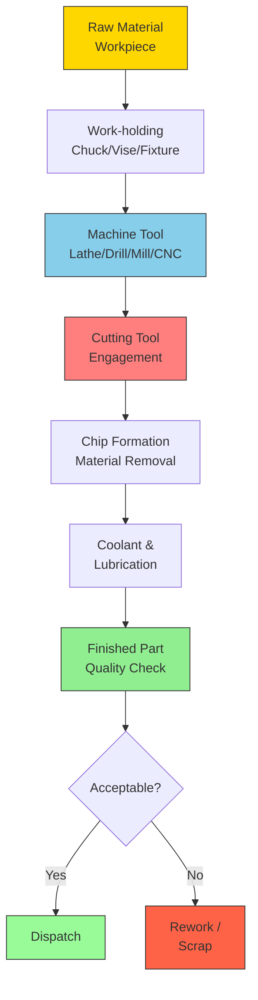
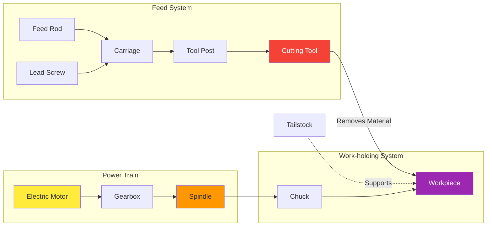
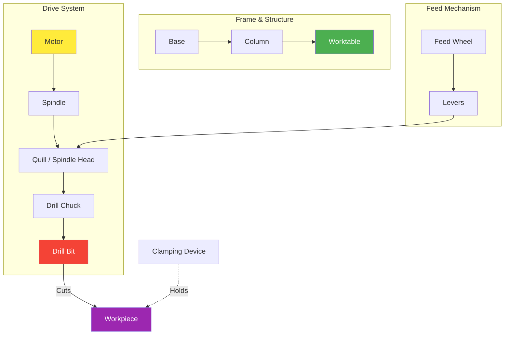
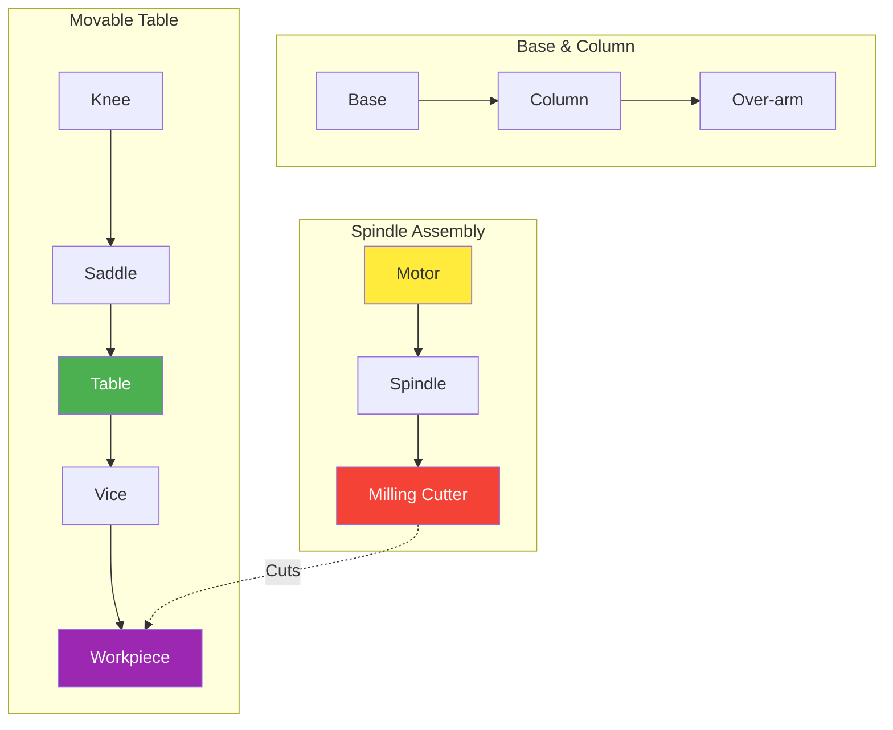
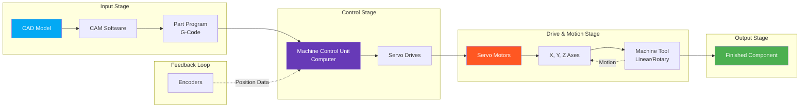
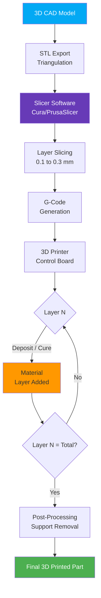
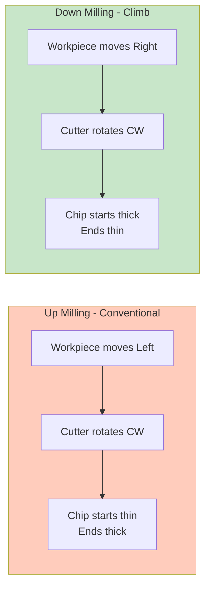
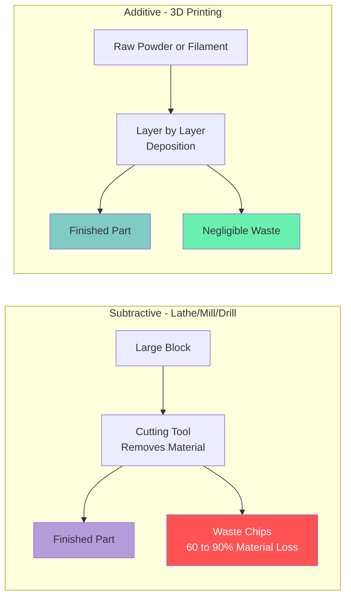

# Machining processes: Description and operations performed on Lathe, Drilling machine, Milling machine, CNC machine, 3D printing.

<!-- SECTION_1_START -->
# Machining Processes: Lathe, Drilling, Milling, CNC, and 3D Printing

## 1. Core Technical Definition

**Machining** is a manufacturing process in which a piece of raw material (typically a metal, plastic, or wood workpiece) is cut into a desired final shape and size by removing excess material through a controlled material-removal process. The cutting tool — which is harder than the workpiece — shears away chips of material as it moves relative to the workpiece.

> [!IMPORTANT]
> **KTU 2024 Syllabus Definition (GCEST104 – Module 2):**
> Machining is a **subtractive manufacturing** process where material is progressively removed from a workpiece using a cutting tool to achieve the required geometry, dimensional accuracy, and surface finish. It forms the backbone of *primary shaping* and *secondary finishing* operations in modern industry.

### The Five Machining Processes Studied in This Module

| # | Process | Core Principle |
|---|---------|----------------|
| 1 | **Lathe** | Rotates the workpiece against a stationary cutting tool |
| 2 | **Drilling Machine** | Rotates a multi-point cutting tool and feeds it into a stationary workpiece |
| 3 | **Milling Machine** | Rotates a multi-tooth cutter against a stationary or linearly-fed workpiece |
| 4 | **CNC Machine** | Computer-controlled automation of conventional machining processes |
| 5 | **3D Printing** | Additive layer-by-layer deposition of material (contrast with subtractive) |

> [!NOTE]
> **Syllabus Highlight:** Out of the five processes, the first four are *subtractive* (material is removed), while **3D Printing is an *additive* manufacturing** process (material is added). This is a **favourite KTU 1-mark / 2-mark question**.

---

## 2. Conceptual Analogy & Intuitive Overview

### 🍎 Real-World Analogy: The Pencil Sharpener

Imagine sharpening a pencil with a **hand-cranked sharpener**:

- The pencil (workpiece) is rotated, and the blade (cutting tool) presses against it.
- Wood shavings (chips) fly off as the pencil gets thinner and shaped to a point.
- The faster and more precisely you turn, the smoother the point.

A **Lathe works exactly on this principle** — but on a much more powerful, industrial scale, working on metal cylinders, shafts, and discs.

### 🧱 Building Analogy for the Five Processes

Think of sculpting a statue from a marble block:

| Machine | Marble Sculptor's Equivalent |
|---------|------------------------------|
| **Lathe** | A potter's wheel — rotating the clay while a tool shapes it |
| **Drilling** | A corkscrew twisting into wood |
| **Milling** | A chisel scraping a flat surface as you move it across |
| **CNC Machine** | A robotic sculptor following a digital 3D blueprint |
| **3D Printing** | A baker piping icing layer-by-layer to build a cake shape |

### 🎯 Geometric Intuition

- **Lathe** creates **axisymmetric** (rotationally symmetric) parts → think of a **cylinder of revolution**.
- **Drilling** creates **cylindrical holes** → think of an **inner cylinder**.
- **Milling** creates **flat surfaces, slots, and contours** → think of a **carpenter's plane on a rotating drum**.
- **CNC** automates *any* of the above.
- **3D Printing** builds *any* 3D shape by stacking 2D layers.

> [!VISUALIZATION CONTROL]
> **Concept:** Axisymmetric surface produced by lathe turning
> **GeoGebra / Desmos Input Equations:**
> * `f(x) = sin(pi*x) + 0.3*cos(2*pi*x)` (radius profile vs. length)
> * Parametric surface: `x(u,v) = v`, `y(u,v) = f(u)*cos(u)`, `z(u,v) = f(u)*sin(u)`
> **Visual Description:** A vase-like 3D surface of revolution showing the path traced by a lathe tool as it moves from left (spindle) to right (tailstock) along the axis while cutting a varying radius.

---
<!-- SECTION_1_END -->

<!-- SECTION_2_START -->
# Deep Theoretical Analysis & KTU High-Yield Formula Sheet

## I. LATHE MACHINE

### A. Description

A **lathe** is a machine tool that rotates the workpiece about a fixed axis and removes material using a stationary cutting tool that is fed against the workpiece. It is the **"Mother of all Machine Tools"** because almost all other machines can be traced back to lathe principles.

### B. Main Parts of a Lathe

| S.No. | Part | Function |
|-------|------|----------|
| 1 | **Bed** | Heavy base that supports all other parts; provides rigidity and alignment |
| 2 | **Headstock** | Houses the **spindle**, chuck, and **gear train**; rotates the workpiece |
| 3 | **Spindle** | Rotating shaft that holds and drives the workpiece |
| 4 | **Chuck** | Clamping device (3-jaw / 4-jaw) that holds the workpiece |
| 5 | **Tailstock** | Supports the free end of long workpieces using a **dead centre** |
| 6 | **Carriage** | Mounts and moves the cutting tool along the bed |
| 7 | **Cross-slide** | Moves the tool perpendicular to the spindle axis |
| 8 | **Compound Slide** | Allows angled tool movement (used in taper turning) |
| 9 | **Tool Post** | Holds the cutting tool rigidly on the carriage |
| 10 | **Feed Rod & Lead Screw** | Provide automatic feed and thread cutting motion |
| 11 | **Apron** | Houses the feed mechanism, clutches, and handwheels |
| 12 | **Legs / Cabinet** | Support the bed; often house coolant and electrics |

> [!NOTE]
> **Key Engineering Constants:**
> * Standard lathe spindle speeds: **n ∈ [50, 2500 rpm]**
> * Spindle power rating: typically **0.5 kW to 75 kW** in industrial lathes.

### C. Operations Performed on a Lathe

| Operation | Description | Tool Used |
|-----------|-------------|-----------|
| **Turning** | Reducing workpiece diameter to a specified size | Single-point cutting tool (SPCT) |
| **Facing** | Producing a flat surface perpendicular to the axis | SPCT fed radially |
| **Knurling** | Producing a patterned (diamond/ straight) rough surface for grip | Knurling tool (2 hardened rollers) |
| **Thread Cutting** | Cutting helical grooves on cylindrical surface | Threading tool with form |
| **Taper Turning** | Producing a conical surface | Compound slide / taper attachment |
| **Parting / Cutting Off** | Severing a finished part from the bar stock | Parting tool (narrow blade) |
| **Drilling** | Making a hole along the axis | Drill bit held in tailstock |
| **Boring** | Enlarging an existing hole | Boring bar with SPCT |
| **Reaming** | Finishing a hole to accurate size and finish | Multi-flute reamer |
| **Grooving** | Cutting a narrow channel on the surface | Form tool / grooving tool |

### D. Lathe Specifications

The **size of a lathe** is specified by:
- **Swing diameter** (largest diameter that can be rotated above the bed)
- **Distance between centres** (maximum length of workpiece)

> [!IMPORTANT]
> **Example:** A lathe marked **"180 × 1000 mm"** means a swing of **180 mm** and a centre distance of **1000 mm**.

### E. Cutting Velocity in Lathe

The **cutting speed** $V_c$ is the surface speed of the workpiece at the cutting point:

$$V_c = \frac{\pi \cdot D \cdot N}{1000}$$

where:
* $V_c$ = cutting speed in **m/min**
* $D$ = workpiece diameter in **mm**
* $N$ = spindle speed in **rpm**

The **spindle speed** required for a given cutting speed:

$$N = \frac{1000 \cdot V_c}{\pi \cdot D}$$

The **feed rate** (table travel per revolution):

$$f_r = f \cdot N$$

where $f$ = feed in **mm/rev**, $f_r$ = feed rate in **mm/min**.

The **material removal rate (MRR)**:

$$\text{MRR} = V_c \cdot f \cdot d \quad \text{(mm}^3\text{/min)}$$

where $d$ = depth of cut in **mm**.

---

## II. DRILLING MACHINE

### A. Description

A **drilling machine** is a machine tool designed to produce **cylindrical holes** in a workpiece by rotating a **multi-point cutting tool** (drill bit) and feeding it linearly into the stationary workpiece.

### B. Types of Drilling Machines

| Type | Use Case |
|------|----------|
| **Bench Drilling Machine** | Small workpieces; mounted on a workbench |
| **Upright / Pillar Drilling Machine** | Medium-sized workpieces; vertical column |
| **Radial Drilling Machine** | Large/heavy workpieces; arm can swing to drill at any point |
| **Gang Drilling Machine** | Multiple spindles in a row for mass production |
| **Multi-spindle Drilling Machine** | Several holes drilled simultaneously |

### C. Main Parts

1. **Base** – heavy foundation
2. **Column / Pillar** – vertical support
3. **Spindle** – rotates the drill
4. **Spindle Head / Quill** – houses the drill and moves vertically
5. **Feed Mechanism** – lever/hand wheel for quill movement
6. **Worktable** – supports the workpiece, has T-slots for clamping
7. **Drill Chuck** – holds straight-shank or tapered-shank drills

### D. Operations Performed on a Drilling Machine

| Operation | Description |
|-----------|-------------|
| **Drilling** | Producing a cylindrical hole |
| **Reaming** | Finishing a drilled hole to precise size and finish |
| **Boring** | Enlarging a drilled hole |
| **Counterboring** | Enlarging the top of a hole to seat a bolt head |
| **Countersinking** | Making a conical entrance for a flat-head screw |
| **Tapping** | Cutting internal threads using a tap |
| **Spot Facing** | Machining a flat seat around a hole |
| **Lapping** | Honing the hole surface for ultra-fine finish |

### E. Cutting Speed in Drilling

$$V_c = \frac{\pi \cdot D \cdot N}{1000} \quad \text{(m/min)}$$

**Feed** $f$ is in **mm/rev** (typical: $0.05$ to $0.5$ mm/rev).

**Time to drill a hole of depth $L$:**

$$T = \frac{L}{f \cdot N} \quad \text{(minutes)}$$

> [!NOTE]
> **Key Engineering Constants:**
> * Standard drill point angle: **118°** (general purpose for steel)
> * For aluminium: **135°** (more efficient chip evacuation)
> * For cast iron: **118°**

---

## III. MILLING MACHINE

### A. Description

A **milling machine** uses a **rotating multi-tooth cutter** to remove material from a stationary workpiece. The cutting tool rotates at high speed while the workpiece is held on a movable table. It is the **most versatile** conventional machine tool — capable of producing flat surfaces, slots, gears, and complex contours.

### B. Types of Milling Machines

| Type | Description |
|------|-------------|
| **Column and Knee Type** | Most common; vertical column + horizontal knee |
| **Bed Type** | Rigid; table moves only longitudinally |
| **Turret / Ram Type** | Spindle mounted on a ram — multi-directional cutting |
| **Planer Type** | Heavy-duty for large flat surfaces |
| **CNC Milling** | Computer-controlled version of any of the above |

### C. Main Parts

1. **Base** – rigid foundation
2. **Column** – vertical support
3. **Knee** – vertical movement of table
4. **Saddle** – cross movement
5. **Table** – longitudinal movement with T-slots
6. **Spindle** – rotates the milling cutter
7. **Over-arm & Arbor** – supports horizontal milling cutters
8. **Feed Mechanism** – manual or powered table movement

### D. Operations Performed on a Milling Machine

| Operation | Description | Cutter Used |
|-----------|-------------|-------------|
| **Plain (Slab) Milling** | Producing a flat surface parallel to cutter axis | Plain milling cutter |
| **Face Milling** | Producing a flat surface perpendicular to cutter axis | Face milling cutter |
| **End Milling** | Cutting slots, pockets, profiles | End mill |
| **Side Milling** | Cutting on the side of a vertical surface | Side milling cutter |
| **Straddle Milling** | Cutting two parallel vertical surfaces simultaneously | Two side mills mounted on arbor |
| **Gang Milling** | Multiple cutters on one arbor for simultaneous multiple cuts | Gang of cutters |
| **Form Milling** | Cutting a contour matching the cutter profile | Form cutter |
| **Profile Milling** | Reproducing an outline of a template | Profile cutter |
| **Slot Milling** | Cutting a slot/groove | Slitting saw / end mill |
| **Gear Cutting** | Producing gear teeth (via indexing) | Gear cutter / hob |
| **Helical Milling** | Cutting helical grooves (e.g., flutes) | Helical cutter |
| **Cam Milling** | Reproducing cam profile | Cam-follower attachment |

> [!IMPORTANT]
> **Up Milling vs. Down Milling** (a favourite 7-mark question!):
> * **Up Milling (Conventional):** Cutter rotates *opposite* to feed direction; chip thickness starts at zero and increases. Tool rubs initially → poor finish, but no backlash issues.
> * **Down Milling (Climb):** Cutter rotates *same* direction as feed; chip thickness starts at maximum and decreases. Better finish, lower power, but requires backlash-free table.

### E. Cutting Speed in Milling

$$V_c = \frac{\pi \cdot D \cdot N}{1000} \quad \text{(m/min)}$$

**Feed per tooth:** $f_z$ in mm/tooth
**Feed per revolution:** $f = f_z \cdot Z$, where $Z$ = number of teeth
**Table feed:** $V_f = f \cdot N = f_z \cdot Z \cdot N$ (mm/min)

**MRR (for face milling):**

$$\text{MRR} = V_c \cdot f \cdot a_p \cdot a_e / 60 \quad \text{(cm}^3\text{/s)}$$

where $a_p$ = axial depth, $a_e$ = radial depth of cut.

---

## IV. CNC MACHINE (Computer Numerical Control)

### A. Description

A **CNC (Computer Numerical Control) machine** is a machine tool in which the functions and motions of the machine are **automatically controlled by a computer** executing a pre-programmed sequence of machining commands. Conventional processes (turning, milling, drilling) are automated using a **G-code** program.

> [!NOTE]
> **KTU Definition:** CNC is a soft automation system where pre-written coded instructions (NC code) direct the machine tool through every step required to produce a finished part — completely without manual operator intervention during the cutting cycle.

### B. Main Components of a CNC System

| Component | Function |
|-----------|----------|
| **Part Program (G-Code)** | Set of instructions describing toolpath, feeds, speeds |
| **Machine Control Unit (MCU)** | Computer that decodes G-code and sends signals |
| **Servo Motors / Stepper Motors** | Drive the slides (axes) of the machine |
| **Feedback System (Encoders)** | Provide real-time position/velocity data (closed-loop) |
| **Tool Magazine & ATC** | Automatic Tool Changer — swaps tools without human help |
| **Coolant & Chip Management** | Flood coolant + chip conveyor |
| **Work-holding (Chuck / Vise / Fixture)** | Holds the workpiece rigidly |
| **HMI (Human-Machine Interface)** | Touch screen / display for operator input |

### C. Axes of CNC

| Machine | Standard Axes | Notation |
|---------|---------------|----------|
| CNC Lathe | 2 axes | X, Z |
| CNC Milling | 3 to 5 axes | X, Y, Z (+ A, B for rotation) |
| 5-Axis CNC | 5 axes | X, Y, Z, A, B |

### D. Common G-Codes (Must-Know for KTU)

| G-Code | Function |
|--------|----------|
| **G00** | Rapid positioning (no cutting) |
| **G01** | Linear interpolation (straight-line cutting) |
| **G02** | Circular interpolation – Clockwise (CW) |
| **G03** | Circular interpolation – Counter-Clockwise (CCW) |
| **G17 / G18 / G19** | Select XY / XZ / YZ plane |
| **G20 / G21** | Inch / Metric input |
| **G28** | Return to reference (home) position |
| **G90 / G91** | Absolute / Incremental programming |
| **G94 / G95** | Feed per minute / Feed per revolution |
| **M03 / M04 / M05** | Spindle ON (CW) / ON (CCW) / OFF |
| **M08 / M09** | Coolant ON / OFF |
| **M30** | Program end + rewind |

### E. Operations Performed on CNC

* **CNC Turning** → facing, turning, grooving, threading (lathe operations automated)
* **CNC Milling** → 2D/3D profile cutting, pocketing, drilling, tapping
* **Multi-axis Machining** → 5-axis simultaneous cutting of complex parts
* **Wire EDM (CNC variant)** → wire-cut electric discharge machining

### F. Advantages of CNC

| S.No. | Advantage |
|-------|-----------|
| 1 | High repeatability and accuracy (typically ± 0.01 mm) |
| 2 | Complex 3D contours possible |
| 3 | Lower labour cost in mass production |
| 4 | Reduced human error |
| 5 | Faster cycle time for repeat jobs |
| 6 | Easy storage and modification of programs |

### G. Limitations of CNC

| S.No. | Limitation |
|-------|-----------|
| 1 | High initial cost (machine + training) |
| 2 | Skilled programmer required |
| 3 | Not economical for small-batch or one-off jobs |
| 4 | Maintenance complexity |

---

## V. 3D PRINTING (Additive Manufacturing)

### A. Description

**3D Printing**, also called **Additive Manufacturing (AM)**, is the process of creating a three-dimensional solid object from a digital **CAD model** by **depositing material layer-by-layer**. Unlike traditional machining (subtractive), 3D printing *adds* material only where needed, with **minimal waste**.

> [!IMPORTANT]
> **KTU 2024 Definition:** Additive Manufacturing is the process of joining materials to make objects from 3D model data, usually **layer upon layer**, as opposed to subtractive manufacturing methodologies. (ISO/ASTM 52900:2015 standard)

### B. The Generic 3D Printing Workflow

1. **CAD Model** → Create a 3D model in software (SolidWorks, Fusion 360, etc.)
2. **STL Export** → Convert to .STL file (triangulated mesh)
3. **Slicing** → Use slicer software (Cura, PrusaSlicer) → generates G-code with layer info
4. **Printing** → Printer deposits / solidifies material layer by layer
5. **Post-Processing** → Support removal, sanding, painting

### C. Main Types of 3D Printing Technologies

| # | Technology | Full Form | Material | Working Principle |
|---|-----------|-----------|----------|-------------------|
| 1 | **FDM** | Fused Deposition Modeling | Thermoplastic filament (PLA, ABS, PETG) | Heated nozzle extrudes melted plastic layer-by-layer |
| 2 | **SLA** | Stereolithography | Photopolymer resin (liquid) | UV laser cures liquid resin point-by-point |
| 3 | **DLP** | Digital Light Processing | Photopolymer resin | UV projector cures an entire layer at once |
| 4 | **SLS** | Selective Laser Sintering | Nylon powder, metal powder | Laser fuses (sinters) powder particles |
| 5 | **SLM / DMLS** | Selective Laser Melting / Direct Metal Laser Sintering | Metal powder (Ti, Al, SS) | Laser fully melts metal powder |
| 6 | **PolyJet** | Multi-jet Modeling | Photopolymer | Inkjet head jets photopolymer droplets cured by UV |
| 7 | **Binder Jetting** | — | Metal / sand / ceramic powder | Liquid binder is selectively deposited onto powder |

### D. Comparison: Subtractive vs. Additive vs. Formative

| Property | Subtractive (Lathe/Mill) | Additive (3D Print) | Formative (Casting/Forging) |
|----------|--------------------------|---------------------|------------------------------|
| Material | Removed | Added | Shaped |
| Waste | High (chips) | Very low | Low |
| Complexity cost | Very expensive for complex geometry | Cheap for complex geometry | Moderate |
| Material strength | High | Variable (depends on process) | High |
| Batch production | Ideal for medium–high volumes | Better for prototyping / low volume | High volume |

### E. Common Operations / Applications of 3D Printing

| Operation | Description |
|-----------|-------------|
| **Prototyping** | Rapid concept models, fit-checks |
| **Functional Parts** | End-use aerospace, automotive, medical implants |
| **Tooling & Jigs** | Custom fixtures for the shop floor |
| **Casting Patterns** | Investment casting patterns (SLA wax/resin) |
| **Bioprinting** | Tissue scaffolds, bone grafts |
| **Food Printing** | Chocolate, sugar, dough structures |
| **Construction Printing** | Whole building walls via concrete extrusion |

### F. Advantages and Limitations of 3D Printing

**Advantages:**
* Near-zero material waste
* No tooling required → **rapid prototyping**
* Complex internal geometries (lattices, channels) impossible in machining
* Customization at no extra cost
* Short lead time

**Limitations:**
* Lower mechanical strength (layer adhesion)
* Limited build volume
* Surface finish may require post-processing
* Slower than injection moulding for high volume
* Material options narrower than traditional manufacturing

---

## VI. Master KTU Formula Sheet (Compact)

| Formula | Expression | Use |
|---------|-----------|-----|
| Cutting speed (lathe/drill/mill) | $V_c = \pi D N / 1000$ | m/min |
| Spindle speed | $N = 1000 V_c / (\pi D)$ | rpm |
| Feed rate | $V_f = f \cdot N$ | mm/min |
| Feed per rev (drilling) | $f = V_f / N$ | mm/rev |
| MRR (lathe turning) | $\text{MRR} = V_c \cdot f \cdot d$ | mm³/min |
| MRR (drilling) | $\text{MRR} = (\pi/4) D^2 \cdot f \cdot N$ | mm³/min |
| MRR (milling) | $\text{MRR} = V_c \cdot f \cdot a_p \cdot a_e / 60$ | cm³/s |
| Drilling time | $T = L / (f \cdot N)$ | min |
| Power (cutting) | $P_c = \text{MRR} \cdot k_c / (60 \times 10^6)$ | kW |
| Taylor's tool life | $V_c \cdot T^n = C$ | Empirical |

> [!TIP]
> In the above table:
> * $D$ = diameter (mm)
> * $N$ = spindle speed (rpm)
> * $f$ = feed per revolution (mm/rev)
> * $V_c$ = cutting speed (m/min)
> * $d, a_p$ = depth of cut (mm)
> * $a_e$ = radial depth (mm)
> * $L$ = length of cut (mm)
> * $k_c$ = specific cutting energy (N/mm²)
> * $T$ = tool life (min)
> * $C, n$ = Taylor's constants

---
<!-- SECTION_2_END -->

<!-- SECTION_3_START -->
# Step-by-Step Derivations, Worked Examples, and Practical Implementation

## I. Lathe – Worked Numerical Example

**Problem (KTU-typical):**
> On a lathe, a workpiece of diameter **80 mm** is turned with a cutting speed of **30 m/min** and a feed of **0.2 mm/rev** at a depth of cut of **2 mm**. Calculate:
> (a) Spindle speed
> (b) Feed rate
> (c) Material removal rate
> (d) Cutting time for a 200 mm length

**Given Data:**
* $D = 80$ mm
* $V_c = 30$ m/min
* $f = 0.2$ mm/rev
* $d = 2$ mm (depth of cut)
* $L = 200$ mm (length of cut)

---

### (a) Spindle Speed $N$

$$N = \frac{1000 \cdot V_c}{\pi \cdot D} = \frac{1000 \times 30}{\pi \times 80}$$

$$N = \frac{30000}{251.327}$$

$$\boxed{N \approx 119.37 \text{ rpm}}$$

**[2 Marks: Formula, 1 Mark: Substitution, 1 Mark: Final value]**

---

### (b) Feed Rate $V_f$

$$V_f = f \cdot N = 0.2 \times 119.37$$

$$\boxed{V_f \approx 23.87 \text{ mm/min}}$$

**[1 Mark]**

---

### (c) Material Removal Rate (MRR)

$$\text{MRR} = V_c \cdot f \cdot d = 30 \times 1000 \times 0.2 \times 2$$

$$= 30 \times 1000 \times 0.4$$

> Note: When $V_c$ is in m/min, we convert to mm/min by multiplying by 1000 for MRR in mm³/min.

$$\boxed{\text{MRR} = 12000 \text{ mm}^3\text{/min} = 12 \text{ cm}^3\text{/min}}$$

**[1 Mark]**

---

### (d) Cutting Time $T$

$$T = \frac{L}{V_f} = \frac{200}{23.87}$$

$$\boxed{T \approx 8.38 \text{ min}}$$

**[1 Mark]**

---

## II. Drilling – Worked Numerical Example

**Problem:**
> A **12 mm diameter** hole is to be drilled in a cast iron block to a depth of **40 mm**. The cutting speed is **25 m/min** and the feed is **0.15 mm/rev**. Find:
> (a) Spindle speed
> (b) Time to drill
> (c) MRR

**Given:**
* $D = 12$ mm
* $L = 40$ mm
* $V_c = 25$ m/min
* $f = 0.15$ mm/rev

---

### (a) Spindle Speed

$$N = \frac{1000 \times 25}{\pi \times 12} = \frac{25000}{37.699}$$

$$\boxed{N \approx 663.15 \text{ rpm}}$$

**[1 Mark: Formula; 1 Mark: Value]**

---

### (b) Drilling Time

$$T = \frac{L}{f \cdot N} = \frac{40}{0.15 \times 663.15} = \frac{40}{99.47}$$

$$\boxed{T \approx 0.402 \text{ min} = 24.13 \text{ s}}$$

**[1 Mark]**

---

### (c) MRR for Drilling

$$\text{MRR} = \frac{\pi}{4} D^2 \cdot f \cdot N$$

$$= \frac{\pi}{4} \times 12^2 \times 0.15 \times 663.15$$

$$= 0.7854 \times 144 \times 0.15 \times 663.15$$

$$= 0.7854 \times 14318.97$$

$$\boxed{\text{MRR} \approx 11248.5 \text{ mm}^3\text{/min}}$$

**[1 Mark]**

---

## III. Milling – Worked Numerical Example

**Problem:**
> A face milling cutter of **diameter 100 mm** with **8 teeth** operates at a cutting speed of **40 m/min**, feed per tooth of **0.1 mm/tooth**, and depth of cut **3 mm**. The cutter engagement is **80 mm**. Find:
> (a) Spindle speed
> (b) Table feed
> (c) MRR

**Given:**
* $D = 100$ mm
* $Z = 8$ teeth
* $V_c = 40$ m/min
* $f_z = 0.1$ mm/tooth
* $a_p = 3$ mm (depth of cut)
* $a_e = 80$ mm (radial engagement)

---

### (a) Spindle Speed

$$N = \frac{1000 \times 40}{\pi \times 100} = \frac{40000}{314.159}$$

$$\boxed{N \approx 127.32 \text{ rpm}}$$

**[1 Mark]**

---

### (b) Table Feed

$$V_f = f_z \cdot Z \cdot N = 0.1 \times 8 \times 127.32$$

$$\boxed{V_f = 101.86 \text{ mm/min}}$$

**[1 Mark]**

---

### (c) MRR (Face Milling)

$$\text{MRR} = V_c \cdot f \cdot a_p \cdot a_e / 60$$

where $f = f_z \cdot Z = 0.8$ mm/rev, $V_c = 40$ m/min.

$$\text{MRR} = 40 \times 1000 \times 0.8 \times 3 \times 80 / 60$$

$$= 40 \times 1000 \times 192 / 60$$

$$= 7680000 / 60$$

$$\boxed{\text{MRR} = 128000 \text{ mm}^3\text{/min} = 128 \text{ cm}^3\text{/min}}$$

**[1 Mark]**

> [!NOTE]
> **Board Valuation Tip:** Always show *unit conversion* explicitly. Examiners allocate **0.5 – 1 mark** for correct units.

---

## IV. CNC Machine – Sample G-Code (Lathe Turning)

```gcode
O1001                          ; Program number
G21 G90 G95                    ; Metric, Absolute, Feed/rev
G00 X100.0 Z50.0               ; Rapid to start position
M08                            ; Coolant ON
M03 S1500                      ; Spindle ON CW @ 1500 rpm
G00 X30.0 Z2.0                 ; Approach workpiece
G01 Z-50.0 F0.2                ; Linear turning (feed = 0.2 mm/rev)
G00 X35.0                      ; Retract radially
G00 Z2.0                       ; Retract axially
G00 X28.0                      ; Approach for second pass
G01 Z-50.0 F0.2                ; Second turning pass
G00 X100.0 Z50.0               ; Retract to safe position
M09                            ; Coolant OFF
M05                            ; Spindle OFF
M30                            ; Program end
```

**Step-by-step Explanation:**

| Line | Action |
|------|--------|
| `O1001` | Defines program number 1001 |
| `G21 G90 G95` | Sets metric units, absolute coordinate mode, feed per revolution |
| `G00 X100.0 Z50.0` | Rapid (fast) move to X = 100, Z = 50 — far from workpiece |
| `M08` | Activates flood coolant |
| `M03 S1500` | Spindle starts rotating clockwise at 1500 rpm |
| `G00 X30.0 Z2.0` | Rapid approach to 2 mm before face, X = 30 (radial position) |
| `G01 Z-50.0 F0.2` | **Linear cutting** to Z = –50 (cuts 52 mm length) at 0.2 mm/rev |
| `G00 X35.0` | Tool retracts radially to X = 35 |
| `G00 Z2.0` | Tool retracts to Z = 2 (start of cut zone) |
| `G00 X28.0` | Approach for second pass at smaller diameter |
| `G01 Z-50.0 F0.2` | Second turning pass |
| `G00 X100.0 Z50.0` | Tool returns to safe position |
| `M09 M05 M30` | Coolant OFF, Spindle OFF, Program end |

> [!IMPORTANT]
> **KTU Note:** Only basic G-codes are required at the introductory level. Remember **G00, G01, G02, G03, M03, M05, M30**.

---

## V. 3D Printing – Sample Slicer Configuration Table

| Slicer Parameter (Cura) | Value | Effect |
|-------------------------|-------|--------|
| **Layer height** | $0.2$ mm | Smaller → finer finish, slower print |
| **Nozzle diameter** | $0.4$ mm | Typical standard |
| **Print speed** | $60$ mm/s | Higher → faster, lower quality |
| **Infill density** | $20\%$ | Higher → stronger, heavier |
| **Infill pattern** | Cubic / Gyroid | Affects strength-to-weight ratio |
| **Nozzle temperature** | $200$ °C (PLA) | Must exceed glass transition |
| **Bed temperature** | $60$ °C (PLA) | Prevents warping |
| **Support structure** | Tree / Linear | Required for overhangs > 45° |
| **Wall line count** | $3$ | Perimeter strength |
| **Retraction** | $5$ mm @ $40$ mm/s | Reduces stringing |

---

## VI. Comparative Table – All Five Processes (KTU Viva Favourite)

| Parameter | Lathe | Drilling | Milling | CNC | 3D Printing |
|-----------|-------|----------|---------|-----|-------------|
| Type | Subtractive | Subtractive | Subtractive | Subtractive (automated) | Additive |
| Workpiece | Rotates | Stationary | Stationary | Either | Bed-fixed |
| Tool | SPCT | Drill bit | Multi-tooth cutter | Any | Nozzle / Laser |
| Drive | Manual / Motor | Manual / Motor | Manual / Motor | Computer | Stepper + computer |
| Hole making | Yes (axial) | Yes (primary) | Yes (via end mill) | Yes | No (mould cast) |
| Axis-symmetric parts | Excellent | Poor | Good | Excellent | Poor |
| Flat surfaces | Limited (facing) | No | Excellent | Excellent | Excellent |
| Setup time | Medium | Low | Medium | Low (program only) | Very low |
| Skill required | Medium | Low | Medium | High (programming) | Low–Medium |
| Best for | Shafts, threads | Holes | Slots, gears, complex shapes | Mass + complexity | Prototyping, complex |
| Material waste | Moderate (chips) | Moderate | Moderate | Moderate | Very low |
| Cost per part (low volume) | Medium | Low | Medium | High | Low |

---

## VII. Engineering Utility in Real Industry

| Process | Industry Use |
|---------|-------------|
| **Lathe** | Manufacturing of shafts, axles, pins, bolts, screws, threads, bushings |
| **Drilling** | Tapping holes, fastener holes, gun drilling of long holes (oil & gas) |
| **Milling** | Gear cutting, die-making, mould-making, aerospace structural parts |
| **CNC** | Automotive engine blocks, medical implants, defence, mass production |
| **3D Printing** | Aerospace (GE LEAP fuel nozzle), medical (prosthetics, implants), jewellery, food |

> [!NOTE]
> **Famous Case Study:** *GE Aviation* reduced a fuel nozzle from **20 parts** to **1 part** using DMLS (3D printing) → 25% weight reduction, 5x longer life.

---
<!-- SECTION_3_END -->

<!-- SECTION_4_START -->
# Structural Diagrams & Schematics

## I. Block Diagram — Generic Machining Process Flow



---

## II. Lathe Machine — Block Architecture



---

## III. Drilling Machine — Block Architecture



---

## IV. Milling Machine — Block Architecture (Knee & Column Type)



---

## V. CNC Machine — Functional Block Diagram



---

## VI. 3D Printing — Layer-by-Layer Process Flow



---

## VII. Up Milling vs. Down Milling — Cutting Action Comparison



---

## VIII. Material Flow Comparison: Subtractive vs. Additive



---
<!-- SECTION_4_END -->

<!-- SECTION_5_START -->
# KTU 2024 Scheme Examination Question Bank

> [!IMPORTANT]
> *All questions are modelled on actual KTU 2024 scheme pattern.*
> *Part A: 3 marks each | Part B: 14 marks (with internal choice)*

---

## PART A — 3 Mark Questions (Remember / Understand)

### Question 1
**[KTU University Exam – July 2024, Model Question]**
List any **six operations** that can be performed on a lathe and name the tool used for each.

**Model Answer (Valuation Key):**
* [1 Mark each for any 3 correct operations with tool name]
1. **Turning** – Single Point Cutting Tool (SPCT)
2. **Facing** – SPCT fed radially
3. **Knurling** – Knurling tool with two hardened rollers
4. **Thread cutting** – Threading tool with form geometry
5. **Drilling** – Drill bit held in tailstock
6. **Parting off** – Parting tool (narrow blade)
7. **Boring** – Boring bar with SPCT
8. **Reaming** – Multi-flute reamer
*(Any 3 pairs = 3 Marks)*

---

### Question 2
**[KTU University Exam – Dec 2023, Model Question]**
Differentiate between **subtractive manufacturing** and **additive manufacturing**. Give **one example** of each.

**Model Answer:**
| Aspect | Subtractive | Additive |
|--------|-------------|----------|
| Definition | Material is **removed** from a workpiece | Material is **added** layer-by-layer |
| Process | Machining (lathe, mill, drill) | 3D Printing (FDM, SLA, SLS) |
| Waste | High (chips) | Very low |
| Example | Lathe turning of a shaft | 3D printed PLA bracket |

*[Definition 1 Mark; Example 1 Mark; One distinguishing point 1 Mark = 3 Marks]*

---

## PART B — 14 Mark Questions (Module Internal Choice)

---

### Question A (14 Marks)

**[KTU University Exam – June 2025, Model Question, Module 2 Choice 1]**

**(a)** [7 Marks – Understand] Describe the construction and working principle of a **centre lathe** with a neat labelled diagram. List any **four operations** performed on it.

**(b)** [7 Marks – Apply] A mild steel workpiece of initial diameter **100 mm** is turned to a final diameter of **80 mm** over a length of **300 mm** in **two passes**. The cutting speed is **35 m/min** and feed is **0.25 mm/rev**. Calculate:
   (i) Spindle speed (assume initial diameter for the first pass and final diameter for the second pass)
   (ii) Time for each pass
   (iii) Material removal rate per pass

---

#### Model Solution

**(a) Construction and Working of Centre Lathe — 7 Marks**

**Construction [4 Marks]:**
* **Bed:** A heavy, ribbed casting that forms the base; supports headstock, tailstock, and carriage. Precisely machined ways (V-flat) on top ensure alignment. *[1 Mark]*
* **Headstock:** Houses the main spindle, chuck, and gear train. The spindle is driven by an electric motor through a gear box. The chuck (3-jaw self-centring or 4-jaw independent) holds the workpiece. *[1 Mark]*
* **Tailstock:** Mounted on the bed, can slide along the bed. Holds the dead centre for supporting long workpieces. The quill can be moved in/out for depth control (e.g., drilling). *[0.5 Mark]*
* **Carriage Assembly:** Consists of saddle, cross-slide, compound slide, and tool post. The carriage moves longitudinally on the bed. The tool post holds the cutting tool rigidly. *[1 Mark]*
* **Feed Mechanism:** Apron with hand wheels and levers controls manual/automatic feed. Power is transmitted from spindle via feed rod (for turning) and lead screw (for thread cutting). *[0.5 Mark]*

**Working Principle [2 Marks]:**
* The workpiece is held in the chuck and rotated by the spindle at a preset speed.
* The cutting tool, held in the tool post, is fed against the rotating workpiece.
* The relative motion between the rotating workpiece and the stationary tool produces chips, reducing the diameter (turning) or creating flat surfaces (facing).

**Operations [1 Mark]:**
1. Turning *[0.25]*
2. Facing *[0.25]*
3. Threading *[0.25]*
4. Knurling *[0.25]*

---

**(b) Numerical Solution — 7 Marks**

**Given:**
* $D_1 = 100$ mm (initial), $D_2 = 80$ mm (final)
* Length $L = 300$ mm, 2 passes
* $V_c = 35$ m/min
* $f = 0.25$ mm/rev

---

**(i) Spindle Speed for each pass [2 Marks]**

*Pass 1: Depth = $(100 - 80)/2 = 10$ mm; diameter at start of pass 1 = 100 mm*

$$N_1 = \frac{1000 \times 35}{\pi \times 100} = \frac{35000}{314.16} = \boxed{111.4 \text{ rpm}}$$

*[1 Mark]*

*Pass 2: Diameter = 80 mm*

$$N_2 = \frac{1000 \times 35}{\pi \times 80} = \frac{35000}{251.33} = \boxed{139.3 \text{ rpm}}$$

*[1 Mark]*

---

**(ii) Time for each pass [2 Marks]**

*Time = L / (f × N)*

$$T_1 = \frac{300}{0.25 \times 111.4} = \frac{300}{27.85} = \boxed{10.77 \text{ min}}$$

*[1 Mark]*

$$T_2 = \frac{300}{0.25 \times 139.3} = \frac{300}{34.83} = \boxed{8.61 \text{ min}}$$

*[1 Mark]*

---

**(iii) MRR per pass [3 Marks]**

*Pass 1: Depth of cut $d_1 = 10$ mm, diameter used = 100 mm*

$$\text{MRR}_1 = V_c \cdot f \cdot d_1 = 35 \times 1000 \times 0.25 \times 10 = \boxed{87500 \text{ mm}^3\text{/min}}$$

*[1.5 Marks]*

*Pass 2: Depth of cut $d_2 = 10$ mm, diameter used = 80 mm*

$$\text{MRR}_2 = 35 \times 1000 \times 0.25 \times 10 = \boxed{87500 \text{ mm}^3\text{/min}}$$

*[1.5 Marks]*

> **Note:** MRR is the same if depth of cut is the same; but the *cutting force* will differ because the cross-section of the chip is the same here, but the tool insert wear rate may differ.

---

### Question B (14 Marks) — INTERNAL CHOICE

**[KTU University Exam – June 2025, Model Question, Module 2 Choice 2]**

**(a)** [7 Marks – Understand] Explain the **construction and working** of a **radial drilling machine** with a neat sketch. State any **four operations** that can be performed on a drilling machine.

**(b)** [7 Marks – Apply] On a radial arm drilling machine, a **20 mm diameter** hole is to be drilled to a depth of **50 mm** in a cast iron workpiece. If the cutting speed is **20 m/min** and the feed is **0.2 mm/rev**, find:
   (i) Spindle speed in rpm
   (ii) Linear feed in mm/min
   (iii) Time required to drill the hole
   (iv) Material removal rate in cm³/min

---

#### Model Solution

**(a) Radial Drilling Machine — 7 Marks**

**Construction [4 Marks]:**
* **Base:** Heavy foundation casting that supports the column. *[0.5 Mark]*
* **Column:** Vertical pillar rising from the base; houses the elevating mechanism. *[0.5 Mark]*
* **Radial Arm:** A horizontal arm that can rotate about the column and be raised/lowered; carries the drill head. *[1 Mark]*
* **Drill Head:** Contains the spindle, motor, and feed mechanism. The drill head can slide along the radial arm. *[1 Mark]*
* **Spindle & Chuck:** Holds the drill bit. *[0.5 Mark]*
* **Worktable:** Mounted on the base; supports large workpieces. *[0.5 Mark]*

**Working Principle [2 Marks]:**
* The radial arm can be **rotated** about the column and **raised/lowered** to position the drill head exactly over the hole location on a *large workpiece*.
* The drill bit rotates at the set spindle speed and is fed downward (manually or automatically) into the stationary workpiece.
* This avoids the need to *move* heavy workpieces, ideal for drilling multiple holes in large castings.

**Operations on Drilling Machine [1 Mark]:**
1. Drilling *[0.25]*
2. Reaming *[0.25]*
3. Boring *[0.25]*
4. Tapping *[0.25]*
*(Other acceptable: counterboring, countersinking, spot facing)*

---

**(b) Numerical — 7 Marks**

**Given:**
* $D = 20$ mm
* $L = 50$ mm
* $V_c = 20$ m/min
* $f = 0.2$ mm/rev

---

**(i) Spindle Speed [2 Marks]**

$$N = \frac{1000 \times 20}{\pi \times 20} = \frac{20000}{62.83} = \boxed{318.3 \text{ rpm}}$$

*[Formula 1 Mark, Value 1 Mark]*

---

**(ii) Linear Feed [1 Mark]**

$$V_f = f \cdot N = 0.2 \times 318.3 = \boxed{63.66 \text{ mm/min}}$$

---

**(iii) Drilling Time [2 Marks]**

$$T = \frac{L}{V_f} = \frac{50}{63.66} = \boxed{0.785 \text{ min} = 47.13 \text{ s}}$$

---

**(iv) MRR [2 Marks]**

$$\text{MRR} = \frac{\pi}{4} D^2 \cdot f \cdot N$$

$$= \frac{\pi}{4} \times 20^2 \times 0.2 \times 318.3$$

$$= 0.7854 \times 400 \times 0.2 \times 318.3$$

$$= 0.7854 \times 25464 = 19998.6 \text{ mm}^3\text{/min}$$

$$\boxed{\text{MRR} \approx 20000 \text{ mm}^3\text{/min} = 20 \text{ cm}^3\text{/min}}$$

---

> [!WARNING]
> **KTU Examiner's Valuation Warning – Common Pitfalls:**
>
> 1. **Unit confusion:** Most students lose **1 mark** by mixing m/min and mm/min. Always convert $V_c$ × 1000 when using mm units in MRR.
> 2. **Depth of cut confusion in turning:** Depth of cut is **radial** (not diameter reduction). Diameter reduction = 2 × depth of cut.
> 3. **Forgetting the 1000 factor** in $N = 1000 V_c / (\pi D)$ — students often write $N = V_c / (\pi D)$ and get a value 1000 times wrong.
> 4. **Drill point angle** — if asked, answer **118°** for general steel, **135°** for aluminium.
> 5. **Spindle speed varies with diameter** — in turning, $N$ changes as the diameter changes; examiners check if you used the correct diameter for each pass.
> 6. **3D Printing is ADDITIVE, not subtractive** — examiners specifically test this in 1-mark questions.

---

## Additional Practice: CNC & 3D Printing Short Notes

**Q3 [KTU University Exam – Dec 2023]** Explain any **four advantages** and **two limitations** of CNC machines over conventional machine tools. *(7 Marks — Understand)*

**Model Answer (3 Mark version):**

**Advantages [2 Marks]:**
1. **High repeatability and accuracy** — better than ± 0.01 mm in mass production. *[0.5]*
2. **Complex 3D contours** — possible via multi-axis interpolation. *[0.5]*
3. **Lower labour cost** — once programmed, runs unattended. *[0.5]*
4. **Reduced human error** — automation eliminates operator mistakes. *[0.5]*

**Limitations [1 Mark]:**
1. **High initial cost** — machines and software are expensive. *[0.5]*
2. **Skilled programmer required** — labour to write G-code and operate. *[0.5]*

---

**Q4 [KTU University Exam – July 2024]** Differentiate between **FDM**, **SLA**, and **SLS** 3D printing technologies on the basis of: (i) material used, (ii) working principle, (iii) accuracy/surface finish, (iv) typical applications. *(7 Marks — Understand)*

**Model Answer:**

| Aspect | FDM | SLA | SLS |
|--------|-----|-----|-----|
| **Material** | Thermoplastic filament (PLA, ABS) | Liquid photopolymer resin | Nylon/metal powder |
| **Principle** | Heated nozzle extrudes melted plastic | UV laser cures liquid resin point-by-point | Laser sinters (fuses) powder particles |
| **Accuracy** | ± 0.2 mm | ± 0.05 mm (best) | ± 0.1 mm |
| **Surface finish** | Layer lines visible | Very smooth, glass-like | Slightly rough (powdery) |
| **Applications** | Prototypes, hobby, low-cost parts | Jewellery, dental, models | Functional nylon parts, aerospace |
| **Cost** | Low | High (resin) | High (machine + powder) |

*[1 Mark per correct row × 4 rows = 4 Marks; 3 Marks for any extra valid points / example / diagram]*

---

## Topic Recap & Important Things to Remember

> [!TIP]
> **Rapid Revision Checklist — Must Know for KTU Module 2**

### 🛠️ LATHE
* **Definition:** Workpiece rotates, tool is stationary (single-point cutting tool).
* **"Mother of all machine tools."**
* **Spec:** Swing × Centre distance (e.g., 180 × 1000 mm).
* **Key operations:** Turning, Facing, Threading, Knurling, Drilling, Boring, Reaming, Parting, Taper turning.
* **Formulae:** $V_c = \pi D N / 1000$, $N = 1000 V_c / (\pi D)$, MRR $= V_c \cdot f \cdot d$.

### 🔩 DRILLING
* **Definition:** Tool (drill) rotates and is fed into a stationary workpiece.
* **Drill point angle:** **118°** (general purpose).
* **Operations:** Drilling, Reaming, Boring, Counterboring, Countersinking, Tapping, Spot facing.
* **Types:** Bench, Pillar/Upright, Radial, Gang, Multi-spindle.
* **Formulae:** Same as lathe but MRR $= (\pi/4) D^2 f N$.

### ⚙️ MILLING
* **Definition:** Multi-tooth cutter rotates; workpiece held on movable table.
* **Up milling (conventional):** chip starts thin, ends thick.
* **Down milling (climb):** chip starts thick, ends thin — better finish.
* **Operations:** Plain, Face, End, Side, Straddle, Gang, Form, Profile, Slot, Gear, Cam, Helical milling.
* **Formulae:** $V_c = \pi D N / 1000$, $V_f = f_z Z N$, MRR $= V_c f a_p a_e / 60$.

### 💻 CNC
* **G00** = rapid, **G01** = linear, **G02** = CW arc, **G03** = CCW arc, **M03** = spindle CW, **M05** = spindle OFF, **M30** = program end.
* **Subtractive + automated** (with manual intervention only for setup).
* **Axes:** Lathe = X, Z; Mill = X, Y, Z (+ A, B in 5-axis).
* **Advantages:** Repeatability, accuracy, complexity, low labour cost.

### 🖨️ 3D PRINTING
* **Additive** (not subtractive).
* **ISO term:** Additive Manufacturing (AM).
* **Technologies:** FDM, SLA, DLP, SLS, SLM/DMLS, PolyJet, Binder Jetting.
* **Workflow:** CAD → STL → Slicing → G-code → Print → Post-processing.
* **Low waste, complex geometry, layer-by-layer.**
* **Examples:** GE LEAP fuel nozzle, dental crowns, hearing aids, aerospace lattice structures.

### 🔑 Cross-Cutting Points
* **Cutting speed unit is m/min** — convert when mixing with mm-based dimensions.
* **Feed units differ:** Turning/Drilling = mm/rev; Milling = mm/min OR mm/tooth.
* **MRR for drilling uses $(\pi/4) D^2$** because the cutting area is the circular cross-section.
* **CNC = subtractive automation; 3D Printing = additive** — examiners test this contrast.
* **All five processes are part of *secondary manufacturing*** — they operate on pre-formed raw stock (bar, sheet, or powder).
* **Engineers choose the process based on:** material, geometry, accuracy required, batch size, and cost.

---
<!-- SECTION_5_END -->
