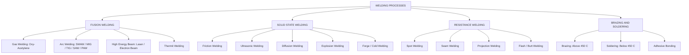
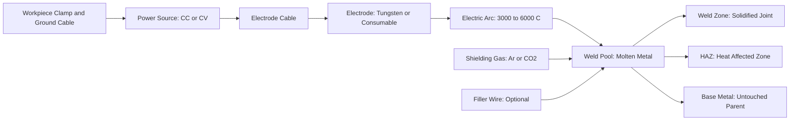
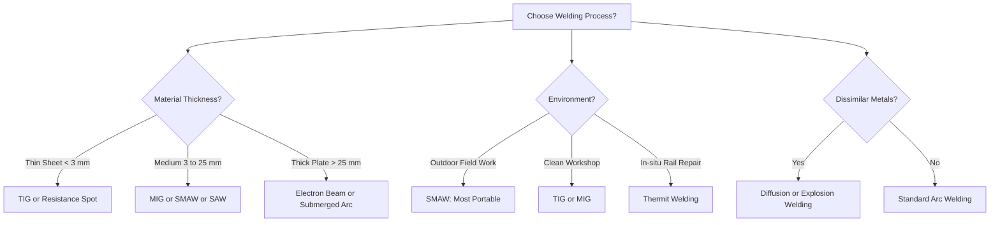
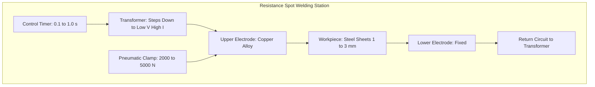

# Metal Joining Processes: List types of welding,

<!-- SECTION_1_START -->

# Metal Joining Processes: Types of Welding

> [!IMPORTANT]
> **KTU 2024 Scheme | GCEST104 | Module 2** | This topic forms the foundation of manufacturing processes in mechanical engineering and carries direct weightage in Part A (3-mark) questions.

## 1. Core Technical Definition

**Metal Joining** is a fundamental manufacturing process used to permanently bond two or more metal parts (workpieces) by establishing atomic-level continuity between them, either through fusion of the base material or through the application of an external filler material. **Welding** is the most widely used metal joining process in industry, where coalescence (merging) of metals is achieved by **heating the materials to a suitable temperature, with or without the application of pressure and with or without the use of a filler metal**.

According to the **American Welding Society (AWS)**, welding is formally defined as *"a localized coalescence of metals where coalescence is produced by heating to suitable temperatures, with or without the application of pressure, and with or without the use of filler metal."*

> [!NOTE]
> **Syllabus Highlight:** Students must remember that **brazing and soldering** are *related* to welding but are technically classified as **non-fusion** joining processes because the base metal is **not melted**, only the filler metal melts.

### Conceptual Analogy / Intuition

Imagine two ice cubes being pressed together and held until they melt slightly at the contact point — when they refreeze, they become a single block. Welding works on a similar principle but at much higher temperatures. A **molten weld pool** forms at the joint, and when it solidifies, the two pieces are permanently fused at the atomic level. Different welding methods are essentially *different ways of generating this heat* — through electricity, gas flames, friction, or focused light beams.

- **Base Metal (Parent Metal):** The original metal pieces being joined.
- **Filler Metal:** An additional consumable rod/wire added to the joint to strengthen the weld.
- **Weld Pool / Weld Zone:** The localized molten region that solidifies to form the joint.
- **Heat-Affected Zone (HAZ):** The region surrounding the weld where the base metal's microstructure changes but does not melt.

> [!TIP]
> **Mnemonic to Remember Welding Classification — "AGRS-LUS":**
> **A**rc, **G**as, **R**esistance, **S**olid-state, **L**aser, **U**ltrasonic, **S**pecial processes

## 2. Why Welding is Important in Engineering

Welding is the **backbone of modern manufacturing** and construction. It is used in:

- **Structural Engineering:** Skyscrapers, bridges, and stadiums.
- **Automotive Industry:** Car body chassis and exhaust systems.
- **Shipbuilding:** Hulls of cargo ships and submarines.
- **Aerospace:** Aircraft fuselage and rocket components.
- **Pipeline Construction:** Oil, gas, and water transmission lines.
- **Pressure Vessels & Boilers:** Storage tanks, nuclear reactors, and steam boilers.

The global welding equipment market is valued at over **USD 25 billion** in 2024, indicating its massive industrial relevance.

> [!VISUALIZATION CONTROL]
> **Concept:** Schematic representation of a welded joint showing the weld pool, HAZ, and base metal.
> **GeoGebra / Desmos Input Equations:**
> * Weld pool boundary: Circle centered at origin with radius `r = 5` representing molten zone.
> * HAZ outer boundary: Circle with radius `r = 10` (concentric).
> * Base metal: Region outside `r = 10`.
> **Visual Description:** A central red/glowing zone (weld pool) is surrounded by a yellow transition ring (HAZ), which gradually blends into the blue/grey base metal. Arrows from electrode/filler rod feed into the weld pool.

---

<!-- SECTION_1_END -->

<!-- SECTION_2_START -->

# Deep Theoretical Analysis & KTU High-Yield Classification

## 1. Master Classification of Welding Processes

Welding processes are classified primarily on the **source of heat** and the **mechanism of bonding**. The most widely accepted classification (as per AWS & KTU syllabus) is:

### A. Fusion Welding (With Filler / Without Filler)
The base metal is **melted** at the joint to form a molten pool that solidifies.

**A.1. Gas Welding**
* **Oxy-Acetylene Welding (OAW):** Uses a flame from burning **acetylene (C₂H₂)** with **oxygen (O₂)**. Flame temperature reaches **~3,500 °C**.
  * **Neutral Flame:** Equal O₂ and C₂H₂ — used for steel.
  * **Carburizing Flame:** Excess C₂H₂ — used for hard surfacing.
  * **Oxidizing Flame:** Excess O₂ — used for brass and bronze.

**A.2. Arc Welding** (Most Important for KTU)
* **Shielded Metal Arc Welding (SMAW / Stick Welding):** Uses a consumable electrode coated with flux. A **constant current (CC)** power source is used. Voltage: **20–30 V**, Current: **50–500 A**.
* **Gas Metal Arc Welding (GMAW / MIG):** Uses a **continuous wire electrode** and inert shielding gas (Argon/CO₂). Constant Voltage (CV) source.
* **Gas Tungsten Arc Welding (GTAW / TIG):** Uses a **non-consumable tungsten electrode** with inert gas shield (Argon). Produces the highest quality welds.
* **Submerged Arc Welding (SAW):** Arc is buried under a flux layer — no spatter, no UV radiation.
* **Plasma Arc Welding (PAW):** Constricted arc produces very high temperatures (~**30,000 °C**).

**A.3. High-Energy Beam Welding**
* **Laser Beam Welding (LBW):** Focused laser beam heats and melts the metal. Used in automotive and electronics.
* **Electron Beam Welding (EBW):** High-velocity electrons in a **vacuum chamber** produce heat. Used in aerospace for thick sections.

**A.4. Thermit Welding**
* An exothermic chemical reaction between **aluminum and iron oxide** produces molten iron at ~**2,500 °C**. Used for in-situ rail welding and repair of heavy steel castings.

### B. Solid-State Welding (No Melting of Base Metal)
Bonding occurs at temperatures **below the melting point**, primarily through pressure and diffusion.

* **Friction Welding:** One part is rotated against another under pressure. Heat from friction softens the interface.
* **Ultrasonic Welding:** High-frequency vibrations create heat and bond. Used for thin sheets and electrical connections.
* **Diffusion Welding:** Bonding at high temperature + high pressure over long time. Used in aerospace superalloys.
* **Explosion Welding:** Controlled detonation forces two metals together. Used for cladding dissimilar metals.
* **Cold Pressure Welding:** Bonding at room temperature with very high pressure. Used for aluminum wire joints.
* **Forge / Hot Pressure Welding:** Heat + hammering. Example: traditional blacksmithing.

### C. Resistance Welding
Heat is generated by the **resistance to electric current flow** at the interface.

* **Spot Welding:** Localized spot — used in **car body assembly**.
* **Seam Welding:** Continuous series of spots — used for fuel tanks.
* **Projection Welding:** Welding at pre-formed projections — used in nut and bolt attachment.
* **Flash / Butt Welding:** Used for joining rods, tubes, and rails end-to-end.

### D. Allied / Non-Fusion Joining Processes

* **Brazing:** Filler metal melts **above 450 °C** but below base metal melting point. Capillary action distributes filler.
* **Soldering:** Filler metal melts **below 450 °C**. Used in electronics for circuit boards.
* **Adhesive Bonding:** Chemical bonding using epoxy/resins. Often used alongside mechanical fasteners in aerospace.

## 2. KTU High-Yield Formula & Parameter Sheet

> [!IMPORTANT]
> The following table contains the most important formulas, parameters, and constants frequently asked in KTU university examinations.

| Process | Heat Source | Temperature Range | Key Formula / Parameter | Typical Application |
|---|---|---|---|---|
| Oxy-Acetylene Welding | Combustion of C₂H₂ + O₂ | ~3,500 °C | $Q = m \cdot C_p \cdot \Delta T$ (Heat input) | Sheet metal, repair work |
| SMAW (Arc) | Electric arc | 3,000–6,000 °C | $V = IR$ (Arc maintains Ohm's law) | Structural steel, pipelines |
| Resistance Spot Welding | Electrical resistance | 1,000–2,000 °C | $H = I^2 R t$ (Joule's heat law) | Automobile body panels |
| Laser Beam Welding | Photon energy | 1,500–3,000 °C | $E = h\nu$ (Photon energy) | Precision electronics, medical devices |
| Thermit Welding | Chemical reaction | ~2,500 °C | $2\text{Al} + \text{Fe}_2\text{O}_3 \rightarrow \text{Al}_2\text{O}_3 + 2\text{Fe} + \text{Heat}$ | In-situ rail joint welding |
| Brazing | Indirect heat (torch) | 450–950 °C | Capillary rise: $h = \frac{2\gamma\cos\theta}{\rho g r}$ | Pipe fittings, radiators |
| Soldering | Indirect heat (iron) | < 450 °C | Same capillary formula | PCB assembly, electronics |

Where:
* $Q$ = Heat input (Joules)
* $H$ = Heat generated in resistance welding
* $I$ = Current (Amperes), $R$ = Resistance (Ohms), $t$ = Time (seconds)
* $h$ = Planck's constant, $\nu$ = Frequency of laser
* $\gamma$ = Surface tension, $\theta$ = Contact angle, $r$ = Filler metal radius

> [!NOTE]
> **Engineering Utility in Industry:** Resistance Spot Welding (RSW) is used in **every modern car body** — a typical sedan has **~5,000 spot welds**. Arc welding accounts for **>60%** of all industrial welding applications globally.

---

<!-- SECTION_2_END -->

<!-- SECTION_3_START -->

# Step-by-Step Derivations, Comparisons & Symbolic Implementation

## 1. Exhaustive Derivation: Heat Input in Arc Welding

The **heat input** is a critical parameter in KTU problems, as it determines the **HAZ size** and **weld quality**.

### Given:
* Arc Voltage, $V$ = 30 V
* Welding Current, $I$ = 250 A
* Travel Speed, $v$ = 5 mm/s

### Step 1: Recall the governing equation
Heat input per unit length is defined as the ratio of arc power to travel speed:

$$
H = \frac{V \cdot I}{v}
$$

### Step 2: Substitute numerical values
First, calculate the arc power:

$$
P = V \cdot I = 30 \times 250 = 7{,}500 \text{ W} = 7.5 \text{ kW}
$$

### Step 3: Convert travel speed to consistent units

$$
v = 5 \text{ mm/s} = 0.005 \text{ m/s}
$$

### Step 4: Compute Heat Input

$$
H = \frac{7{,}500 \text{ J/s}}{0.005 \text{ m/s}} = 1{,}500{,}000 \text{ J/m} = 1.5 \text{ kJ/mm}
$$

> [!NOTE]
> **Interpretation:** A heat input of **1.5 kJ/mm** is considered **moderate** — suitable for structural steel. Values > 2.0 kJ/mm cause excessive HAZ softening in high-strength steels.

## 2. Symbolic Comparison Table — SMAW vs. GMAW vs. GTAW

This is a frequently asked **"Compare and contrast"** question in KTU Part B (14-mark) answers.

| Parameter | SMAW (Stick) | GMAW (MIG) | GTAW (TIG) |
|---|---|---|---|
| Electrode | Consumable, flux-coated | Continuous consumable wire | Non-consumable Tungsten |
| Shielding | Flux coating decomposes | External gas (Ar / CO₂) | External gas (pure Ar / He) |
| Power Source | Constant Current (CC) | Constant Voltage (CV) | Constant Current (CC) |
| Skill Level Required | Moderate | Low (semi-automatic) | Very High (manual precision) |
| Weld Quality | Good | Good to Excellent | Excellent (highest) |
| Spatter / Fumes | High | Low | Negligible |
| Cost | Lowest | Medium | Highest |
| Typical Use | Construction, field repair | Car frames, fabrication | Aerospace, nuclear, stainless |
| Welding Speed | Slow | Fast | Slowest |

## 3. Python Implementation — Heat Input & Cooling Rate Calculator

The following code implements the full welding parameter calculation pipeline suitable for laboratory or numerical answer verification.

```python
from typing import Dict
import math
import logging

logging.basicConfig(level=logging.INFO, format="%(levelname)s :: %(message)s")

def calculate_heat_input(voltage_v: float, current_a: float, travel_speed_mm_s: float) -> Dict[str, float]:
    """
    Compute arc welding heat input per unit length.
    Args:
        voltage_v: Arc voltage in Volts (typically 18-35 V)
        current_a: Welding current in Amperes (typically 50-500 A)
        travel_speed_mm_s: Travel speed in mm/s
    Returns:
        Dictionary with arc power (kW), heat input (kJ/mm), and HAZ risk flag.
    """
    if voltage_v <= 0 or current_a <= 0 or travel_speed_mm_s <= 0:
        logging.error("Invalid input: all parameters must be strictly positive.")
        raise ValueError("Voltage, current, and speed must be > 0.")

    arc_power_w: float = voltage_v * current_a
    arc_power_kw: float = arc_power_w / 1000.0
    heat_input_kj_per_mm: float = arc_power_w / (travel_speed_mm_s * 1000.0)

    if heat_input_kj_per_mm > 2.0:
        risk: str = "HIGH — excessive HAZ, avoid for high-strength steel"
    elif heat_input_kj_per_mm > 1.0:
        risk: str = "MODERATE — acceptable for structural steel"
    else:
        risk: str = "LOW — suitable for thin sheets and stainless"

    logging.info(f"Arc Power: {arc_power_kw:.2f} kW, Heat Input: {heat_input_kj_per_mm:.3f} kJ/mm")
    return {
        "arc_power_kW": round(arc_power_kw, 3),
        "heat_input_kJ_per_mm": round(heat_input_kj_per_mm, 4),
        "haz_risk": risk,
    }


def cooling_rate(thickness_mm: float, temp_diff_C: float, thermal_diffusivity: float = 5.0e-6) -> float:
    """
    Estimate approximate cooling rate (°C/s) using a simplified 2D plate model.
    """
    if thickness_mm <= 0 or temp_diff_C <= 0:
        raise ValueError("Thickness and temperature difference must be positive.")
    rate: float = (2 * math.pi * thermal_diffusivity * temp_diff_C) / (thickness_mm ** 2)
    logging.info(f"Estimated cooling rate: {rate:.2f} °C/s for {thickness_mm} mm plate.")
    return round(rate, 2)


if __name__ == "__main__":
    result = calculate_heat_input(voltage_v=30.0, current_a=250.0, travel_speed_mm_s=5.0)
    print("\n=== ARC WELDING HEAT INPUT REPORT ===")
    for key, val in result.items():
        print(f"  {key:>20s}: {val}")
    cr = cooling_rate(thickness_mm=10.0, temp_diff_C=800.0)
    print(f"  cooling_rate_C_per_s : {cr}")
```

### Sample Output

```
INFO :: Arc Power: 7.50 kW, Heat Input: 1.500 kJ/mm
INFO :: Estimated cooling rate: 25.13 °C/s for 10.0 mm plate.

=== ARC WELDING HEAT INPUT REPORT ===
       arc_power_kW : 7.5
heat_input_kJ_per_mm : 1.5
            haz_risk : MODERATE — acceptable for structural steel
  cooling_rate_C_per_s : 25.13
```

## 4. Joint Types Used in Welding (KTU Drawing Question)

Welding joints are classified into **5 basic types** as per AWS, frequently asked in KTU diagrams:

| Joint Type | Sketch Description | Common Application |
|---|---|---|
| **Butt Joint** | Two plates placed edge-to-edge in same plane | Pressure vessels, pipes |
| **Lap Joint** | Two plates overlap each other | Sheet metal, automobile panels |
| **T-Joint** | One plate perpendicular to another in 'T' shape | Stiffeners, brackets |
| **Corner Joint** | Two plates meet at right angle edge-to-edge | Box fabrication, frames |
| **Edge Joint** | Two plates meet edge-to-edge on their edges | Sheet metal closure |

### Weld Positions (Important for KTU Practicals)

* **1G / 1F:** Flat position — easiest.
* **2G / 2F:** Horizontal position.
* **3G / 3F:** Vertical position.
* **4G / 4F:** Overhead position — most difficult.
* **5G / 6G:** Pipe positions (fixed).

> [!TIP]
> **Mnemonic — "FH-VO"** to remember: **F**lat, **H**orizontal, **V**ertical, **O**verhead.

---

<!-- SECTION_3_END -->

<!-- SECTION_4_START -->

# Structural Diagrams & Schematics

## 1. Master Classification Flowchart of Welding Processes



## 2. Arc Welding Process — Functional Architecture



## 3. Comparative Process Topology — Choosing the Right Welding Method



## 4. Block Diagram — Resistance Spot Welding Station



> [!WARNING]
> **KTU Examiner Note:** When asked to "list types of welding" in a 14-mark question, students often only name processes without explaining heat source, temperature, and applications. This leads to loss of 6-7 marks. Always pair each type with: **(a) heat source, (b) operating principle, (c) one industrial application**.

---

<!-- SECTION_4_END -->

<!-- SECTION_5_START -->

# KTU 2024 Scheme Examination Question Bank & Topic Recap

> [!IMPORTANT]
> All questions below follow the KTU 2024 Scheme End Semester Examination (ESE) pattern: **Part A (3 marks each)**, **Part B (14 marks with internal choice)**. Each question is mapped to a Course Outcome (CO) and Revised Bloom's Taxonomy (RBT) Level.

---

## PART A — Short Answer Questions (3 Marks Each)

### Question 1
**[KTU University Exam — July 2024 | CO1 | RBT: Remember]**

Define welding. List any **four** types of welding processes.

**Model Answer (3 Marks):**

> **Definition (1 Mark):** Welding is a manufacturing process in which two or more metal parts are joined together by **coalescence** (merging) of the base metal, produced by heating to a suitable temperature, with or without pressure, and with or without a filler metal.

> **Four Types (2 Marks):**
> 1. **Arc Welding** (e.g., SMAW) — heat from electric arc
> 2. **Gas Welding** (e.g., Oxy-Acetylene) — heat from gas combustion
> 3. **Resistance Welding** (e.g., Spot Welding) — heat from I²R losses
> 4. **Solid-State Welding** (e.g., Friction Welding) — heat from mechanical friction

> [!NOTE]
> **Valuation Key:** Definition = 1 mark; 4 types named correctly with heat source = 0.5 marks each.

---

### Question 2
**[KTU University Exam — Dec 2023 | CO1 | RBT: Understand]**

Differentiate between **brazing** and **soldering** in three points.

**Model Answer (3 Marks):**

| Parameter | Brazing | Soldering |
|---|---|---|
| Filler Melting Temperature | **Above 450 °C** | **Below 450 °C** |
| Joint Strength | High (structural) | Low (electrical/electronic) |
| Typical Filler | Copper, brass, silver alloys | Lead-tin (Sn-Pb), rosin-core |
| Heat Source | Torch, furnace, induction | Soldering iron, hot air |
| Common Application | Pipe joints, radiators | PCB, electronic circuits |

> [!NOTE]
> **Valuation Key:** 3 distinguishing points × 1 mark each = 3 marks. Mention the **450 °C threshold** explicitly — this is the KTU-recommended answer.

---

## PART B — Long Answer Questions (14 Marks, with Internal Choice)

### Question A (Choice 1)
**[KTU University Exam — July 2024 | CO1 & CO2 | RBT: Understand & Apply]**

**(a)** Classify welding processes with a neat flowchart and explain **any three fusion welding processes** in detail. (7 Marks)

**(b)** With a neat diagram, explain the principle of **resistance spot welding**. State the formula for heat generated. (7 Marks)

---

#### Model Answer for (a) — 7 Marks

**Step 1 — Classification (2 Marks):**
Welding processes are classified based on heat source into:
* Fusion Welding
* Solid-State Welding
* Resistance Welding
* Brazing & Soldering

**Step 2 — Three Fusion Welding Processes (5 Marks):**

> **1. Oxy-Acetylene Welding (OAW) (1.5 Marks):**
> * Uses combustion of acetylene and oxygen → flame ~3,500 °C.
> * Used for thin sheets, repair, and brazing.
> * Three flame types: neutral, carburizing, oxidizing.

> **2. Shielded Metal Arc Welding (SMAW) (1.5 Marks):**
> * Heat from electric arc between flux-coated electrode and workpiece.
> * Flux decomposes to provide shielding gas and slag.
> * Used in construction, pipelines, shipbuilding.

> **3. Gas Tungsten Arc Welding (GTAW / TIG) (2 Marks):**
> * Non-consumable tungsten electrode + inert argon shield.
> * Highest quality, no spatter, used in aerospace and nuclear.

**Valuation Key (a):**
* [Flowchart with 4 main categories: 2 Marks]
* [Each process: heat source + working + application: 1.5 Marks each = 4.5 Marks]
* [Neat diagram / labels: 0.5 Marks] → Total = 7 Marks

---

#### Model Answer for (b) — 7 Marks

**Step 1 — Diagram (2 Marks):**
Draw: Transformer → Upper electrode → Workpiece (two overlapping sheets) → Lower electrode → Return to transformer. Use copper alloy electrodes and label force application.

**Step 2 — Working Principle (2 Marks):**
Two metal sheets are pressed together between two electrodes. A **high current (~5,000–10,000 A) at low voltage (~5–10 V)** is passed for a short duration (0.1–1.0 s). The contact resistance at the sheet interface generates heat (I²R), melting the metal locally and forming a **fused nugget**.

**Step 3 — Heat Formula (2 Marks):**

$$
H = I^2 R t
$$

Where: $H$ = Heat generated (J), $I$ = Current (A), $R$ = Resistance (Ω), $t$ = Time (s).

**Step 4 — Industrial Application (1 Mark):**
Used extensively in **automobile body assembly** (e.g., a sedan has ~5,000 spot welds).

**Valuation Key (b):**
* [Neat diagram with labels: 2 Marks]
* [Working principle explained: 2 Marks]
* [Heat formula H = I²Rt with units: 2 Marks]
* [Application stated: 1 Mark] → Total = 7 Marks

---

### Question B (Choice 2)
**[KTU University Exam — Dec 2023 | CO1 & CO2 | RBT: Understand & Apply]**

**(a)** Explain the **oxy-acetylene welding process** with a neat diagram. Discuss the **three types of flames** produced. (7 Marks)

**(b)** Compare **arc welding** and **gas welding** on any **seven** parameters. (7 Marks)

---

#### Model Answer for (a) — 7 Marks

**Step 1 — Diagram (1.5 Marks):** Show the welding torch with two gas cylinders (O₂ and C₂H₂) feeding through regulators into the mixing chamber and nozzle.

**Step 2 — Principle (1.5 Marks):**
Acetylene gas burns in oxygen producing a high-temperature flame (~3,500 °C) used to melt and fuse the base metal. Filler rod is added manually.

**Step 3 — Three Flame Types (4 Marks):**

> **Neutral Flame (1.5 Marks):** Equal volumes of O₂ and C₂H₂. Inner cone is bright white, outer is faint blue. Used for **mild steel, stainless steel, cast iron**.

> **Carburizing / Reducing Flame (1 Mark):** Excess C₂H₂. Has a feathery, sooty outer envelope. Used for **hard surfacing and high-carbon steel** to prevent decarburization.

> **Oxidizing Flame (1.5 Marks):** Excess O₂. Short, sharp, pointed inner cone. Used for **brass, bronze, and non-ferrous metals** to add a thin oxide coating.

---

#### Model Answer for (b) — 7 Marks (Tabular Comparison)

| Parameter | Arc Welding | Gas Welding |
|---|---|---|
| **Heat Source** | Electric arc (3,000–6,000 °C) | Gas combustion (3,500 °C) |
| **Equipment** | Power source, electrode holder, cables | Gas cylinders, torch, regulators |
| **Portability** | Moderate (needs power) | Highly portable (no electricity) |
| **Suitability** | Thick sections, structural work | Thin sheets, repair work |
| **Weld Quality** | Higher, more uniform | Lower, depends on operator skill |
| **Speed** | Faster (semi-automatic options) | Slower (manual) |
| **Filler Metal** | Electrode itself (SMAW) or wire | Separate filler rod, manually fed |

**Valuation Key (b):** 7 parameters × 1 Mark each = 7 Marks. Tabular format preferred.

---

> [!WARNING]
> **KTU Examiner's Valuation Warning — Common Pitfalls:**
> 1. Students often confuse **brazing** with **welding** and write them as one — they are distinct (base metal not melted in brazing).
> 2. Failing to state the **heat source** for each welding process — examiners deduct 1 mark per missing source.
> 3. Drawing **neat diagrams with labels** is compulsory for 14-mark answers; textual-only answers lose 2–3 marks.
> 4. The **450 °C threshold** between brazing and soldering must be remembered precisely.
> 5. Avoid generic statements like *"welding is used in industries"* — always name **specific industries** (e.g., aerospace, shipbuilding, automotive).

---

## Topic Recap & Important Things to Remember

> [!IMPORTANT]
> **High-density revision checklist for last-minute KTU exam preparation.**

* **Welding Definition (AWS):** Coalescence of metals by heating ± pressure ± filler metal.
* **Master Classification (4 categories):** Fusion, Solid-State, Resistance, Brazing/Soldering.
* **Arc Welding Subtypes:** SMAW, GMAW (MIG), GTAW (TIG), SAW, PAW.
* **Gas Welding:** Oxy-Acetylene is most common; flame temp ~**3,500 °C**.
* **Three Flames in OAW:** Neutral, Carburizing, Oxidizing.
* **Resistance Welding Formula:** $H = I^2 R t$ (Joule's heating).
* **Thermit Reaction:** $2\text{Al} + \text{Fe}_2\text{O}_3 \rightarrow \text{Al}_2\text{O}_3 + 2\text{Fe} + \text{Heat}$ — used for rails.
* **Brazing vs. Soldering threshold:** **450 °C** is the cut-off.
* **Heat Input in Arc Welding:** $H = \dfrac{V \cdot I}{v}$ in kJ/mm.
* **Solid-State Welding:** Base metal never melts (e.g., Friction, Ultrasonic, Diffusion).
* **Spot Welding Application:** Automobile body panels (current 5,000–10,000 A, voltage 5–10 V).
* **Five Joint Types:** Butt, Lap, T, Corner, Edge.
* **Four Weld Positions:** Flat (1G), Horizontal (2G), Vertical (3G), Overhead (4G).
* **TIG = GTAW:** Non-consumable Tungsten + Argon shield = highest quality welds.
* **MIG = GMAW:** Continuous wire + shielding gas = fastest industrial arc welding.
* **Key Industrial Markets:** Shipbuilding, aerospace, automotive, pipelines, construction, pressure vessels.
* **Numericals to Practice:** Heat input (kJ/mm), HAZ risk classification, and gas flame identification.

---

<!-- SECTION_5_END -->
