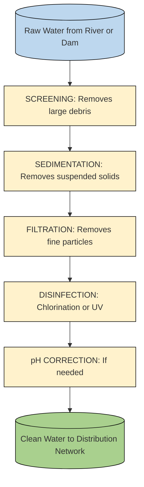
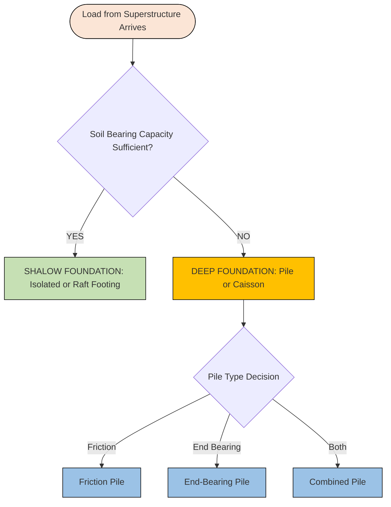
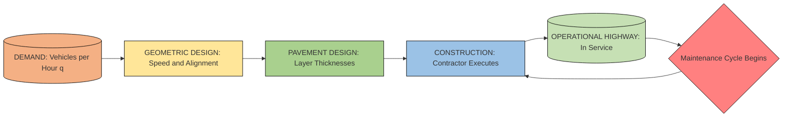

# Brief introduction to major disciplines of Civil Engineering like Structural Engineering, Geo-technical Engineering, Transportation Engineering, Water Resources Engineering and Environmental Engineering.

<!-- SECTION_1_START -->
# 🏗️ Major Disciplines of Civil Engineering — KTU 2024 Scheme Module 3

## 1.1 Defining Civil Engineering — The Parent Discipline

> [!IMPORTANT]
> **Formal KTU Definition (Syllabus-aligned):**
> **Civil Engineering** is the broadest of the engineering disciplines, dealing with the planning, design, construction, maintenance, and operation of the physical and naturally built environment — including structures like buildings, bridges, roads, dams, water supply networks, sewage systems, and environmental remediation systems.

> [!NOTE]
> **Why "Civil"?** The term originated in the 18th century to distinguish non-military engineering work ("civilian" projects) from military engineering. The **Institution of Civil Engineers (ICE)**, London, founded in **1818**, is the world's first professional engineering body.

### 1.1.1 Real-World Analogy — "Civil Engineering as the Skeleton of Civilization"

Imagine the human body:

| Body System | Civil Engineering Equivalent |
| :--- | :--- |
| **Skeleton & Muscles** | Structural Engineering (gives strength and shape) |
| **Skin & Foundation** | Geo-technical Engineering (interface with earth) |
| **Circulatory System** | Water Resources & Environmental Engineering (water/sewage flow) |
| **Nervous System / Roads** | Transportation Engineering (movement network) |

Without civil engineering, modern cities like **Kochi**, **Trivandrum**, or **Bengaluru** simply cannot stand, breathe, move, or function.

---

## 1.2 The Five Major Branches — A Bird's-Eye View

> [!IMPORTANT]
> **KTU 2024 Module 3 — Declared Sub-topics:**
> 1. **Structural Engineering**
> 2. **Geo-technical Engineering**
> 3. **Transportation Engineering**
> 4. **Water Resources Engineering**
> 5. **Environmental Engineering**

### 1.2.1 🏛️ Structural Engineering

> [!NOTE]
> **Definition:** The branch that deals with the **analysis, design, and construction** of load-bearing structures — buildings, bridges, towers, offshore platforms — ensuring they safely resist **dead loads, live loads, wind loads, seismic loads, and temperature effects** without collapse or excessive deformation.

**Intuitive Analogy:** Think of structural engineering as the **bone-and-muscle design of the human body**. A civil engineer ensures the "skeleton" (columns, beams, slabs) can carry all "weights" (people, furniture, vehicles, wind, earthquakes) throughout its **design life** (typically **75–100 years** for buildings as per **IS 456:2000**).

**Key Sub-disciplines within Structural Engineering:**
- **Steel Structures** (IS 800:2007)
- **Concrete Structures** (RCC + Prestressed Concrete)
- **Bridge Engineering**
- **Earthquake / Seismic Engineering**
- **Tall Building Design**

---

### 1.2.2 🌍 Geo-technical Engineering

> [!NOTE]
> **Definition:** The branch that studies the **engineering behavior of earth materials (soils and rocks)**, including their strength, compressibility, permeability, and interaction with structural foundations. It answers the question: *"Can the ground safely support what we are building on top of it?"*

**Intuitive Analogy:** Geo-technical engineering is the **"undercover detective"** of civil engineering. While everyone admires a 50-storey skyscraper, the real hero is the **foundation engineer** who ensured the soil beneath could hold it up. **No structure is stronger than the soil it rests upon.**

**Critical Parameters Studied:**
- **Bearing Capacity** of soil (in **kN/m²** or **kPa**)
- **Settlement** (in **mm**)
- **Shear Strength** (c, φ parameters)
- **Permeability** (k, in **cm/s**)
- **Atterberg Limits** (Liquid Limit, Plastic Limit, Shrinkage Limit)

---

### 1.2.3 🚗 Transportation Engineering

> [!NOTE]
> **Definition:** The branch concerned with the **planning, design, construction, operation, and maintenance** of safe and efficient transportation systems — highways, railways, airports, ports, and urban transit systems.

**Intuitive Analogy:** If a city is a body, transportation is its **circulatory and nervous system combined**. Roads are **arteries**, traffic signals are **pacemakers**, and traffic engineers are the **heart surgeons** keeping flow alive.

**Sub-divisions:**
- **Highway Engineering** (geometric design, pavement design)
- **Traffic Engineering** (signals, parking, level of service)
- **Railway Engineering** (track, signaling)
- **Airport & Harbour Engineering**
- **Urban Transportation Planning**

---

### 1.2.4 💧 Water Resources Engineering

> [!NOTE]
> **Definition:** The branch that deals with the **collection, storage, conveyance, distribution, and management of water** for drinking, irrigation, hydropower, flood control, and recreation.

**Intuitive Analogy:** Water Resources Engineering is the **"civilization's plumbing and water utility combined."** It sources water from rivers/dams (intake), purifies it (treatment), distributes it (pipe networks), and disposes of used water (drainage/sewerage).

**Key Project Types:**
- **Dams & Reservoirs** (e.g., Idukki Dam, Mullaperiyar)
- **Canals & Irrigation Networks**
- **Spillways, Weirs, Barrages**
- **Hydropower Plants**
- **Flood Control Structures**

> [!TIP]
> In KTU Kerala context, the **Kerala State Electricity Board (KSEB)** and **Kerala Water Authority (KWA)** are major employers of water resources engineers in the state.

---

### 1.2.5 ♻️ Environmental Engineering

> [!NOTE]
> **Definition:** The branch that addresses the **protection and improvement of human health, ecosystems, and the natural environment** through water treatment, wastewater treatment, air pollution control, solid waste management, and sustainable design.

**Intuitive Analogy:** Environmental engineering is the **"planet's immune system."** It cleans the water we drink, treats the sewage we produce, manages the garbage we throw, and monitors the air we breathe.

**Key Focus Areas:**
- **Water Treatment** (sedimentation, filtration, chlorination)
- **Sewage Treatment** (primary, secondary, tertiary)
- **Air Pollution Control** (PM, NOx, SOx control)
- **Solid Waste Management** (landfills, composting, recycling)
- **Environmental Impact Assessment (EIA)**

> [!IMPORTANT]
> **Central Pollution Control Board (CPCB)** and **Kerala State Pollution Control Board (KSPCB)** are regulatory bodies that environmental engineers interact with regularly.

---

## 1.3 Visualizing the Disciplinary Map

> [!VISUALIZATION CONTROL]
> **Concept:** Hierarchical Tree of Civil Engineering Branches
> **Visualization Approach (Draw manually on a notebook):**
> - Draw a **root node** labeled "CIVIL ENGINEERING" at the top.
> - Draw **5 branches** downward.
> - Each branch terminates in one discipline (Structural, Geo-technical, Transportation, Water Resources, Environmental).
> - On each branch, write **2–3 example project types** (e.g., Structural → "Building, Bridge, Tower").
> - **Color-code** using 5 different colors for visual memory retention.
>
> **Visual Description:** A fan-shaped tree diverging downward from a single point. The student should observe that all 5 branches originate from the *same trunk*, meaning all civil engineers share a common foundation (mathematics, mechanics, materials).

---

<!-- SECTION_2_END -->

<!-- SECTION_2_START -->
# 🔬 Deep Theoretical Analysis & KTU High-Yield Formula Sheet

## 2.1 Structural Engineering — The Mechanics of Stability

### 2.1.1 Core Logic Steps (How a Structure "Works")

1. **Loads** act on a structure (self-weight, people, wind, quake).
2. **Internal forces** (axial, shear, bending moment) develop inside members.
3. Members are **designed** with enough **cross-section** and **material strength** to safely carry these internal forces.
4. **Serviceability checks** ensure the structure doesn't deflect or crack excessively.
5. **Detailing** (reinforcement, connections) ensures the members behave as designed.

> [!IMPORTANT]
> **The Fundamental Design Equation (Limit State Method, IS 456:2000):**
> **Design Strength ≥ Design Load**
> i.e., the structure's *resistance* must always exceed the *demand* by a **factor of safety**.

**Key Material Properties Every KTU Student Must Know:**

| Material | Compressive Strength (f_c or f_ck) | Tensile Strength (f_y) | Governing IS Code |
| :--- | :--- | :--- | :--- |
| **M20 Concrete** | 20 N/mm² | ~3 N/mm² | IS 456:2000 |
| **M25 Concrete** | 25 N/mm² | ~3.5 N/mm² | IS 456:2000 |
| **M30 Concrete** | 30 N/mm² | ~4 N/mm² | IS 456:2000 |
| **Fe415 Steel (rebar)** | 415 N/mm² (yield) | 415 N/mm² (yield) | IS 1786 |
| **Fe500 Steel (rebar)** | 500 N/mm² (yield) | 500 N/mm² (yield) | IS 1786 |

---

## 2.2 Geo-technical Engineering — The Science of the Ground

### 2.2.1 Core Logic Steps (How Foundations Transfer Load)

1. **Superstructure** applies a load to the foundation.
2. The foundation (shallow or deep) **spreads the load** to a larger soil area.
3. The soil must have **sufficient bearing capacity** to support the spread load.
4. **Settlement** must remain within tolerable limits (typically **≤ 25 mm** for isolated footings on sand, as per **IS 1904**).
5. If the soil is weak, **ground improvement** (compaction, grouting, piling) is employed.

**The Three-Phase System of Soil:**

> [!NOTE]
> Soil is a **3-phase system**: **Solids (S) + Water (W) + Air (A)**.
> The relative proportions of these phases control almost every engineering property (strength, compressibility, permeability).

**Key Index Properties:**

| Property | Symbol | Unit | Use |
| :--- | :--- | :--- | :--- |
| **Water Content** | $w$ | % | Indicates soil moisture |
| **Specific Gravity** | $G$ | dimensionless | Density of soil solids relative to water |
| **Unit Weight** | $\gamma$ | kN/m³ | Weight per unit volume |
| **Void Ratio** | $e$ | dimensionless | Volume of voids / Volume of solids |
| **Porosity** | $n$ | % | Volume of voids / Total volume |
| **Degree of Saturation** | $S$ | % | Volume of water / Volume of voids |
| **Liquid Limit** | $LL$ or $W_L$ | % | Boundary between liquid & plastic state |
| **Plastic Limit** | $PL$ or $W_P$ | % | Boundary between plastic & semi-solid state |
| **Shrinkage Limit** | $SL$ or $W_S$ | % | Boundary between semi-solid & solid state |
| **Plasticity Index** | $I_P$ | % | $I_P = LL - PL$ |
| **Liquidity Index** | $I_L$ | dimensionless | Indicates in-situ state |
| **Consistency Index** | $I_C$ | dimensionless | Indicates firmness |

---

## 2.3 Transportation Engineering — The Science of Movement

### 2.3.1 Core Logic Steps (How Highways Are Designed)

1. **Planning** — identify the route corridor (origin–destination studies).
2. **Geometric Design** — horizontal alignment (curves), vertical alignment (gradients), cross-section.
3. **Pavement Design** — flexible (bituminous) or rigid (concrete) based on traffic and soil.
4. **Traffic Engineering** — vehicle volume, speed, density, capacity.
5. **Drainage Design** — to prevent waterlogging on pavement.

**Fundamental Relationships:**

> [!IMPORTANT]
> **The Sacred Traffic Equation (Fundamental Equation of Traffic Flow):**
> $$q = k \cdot v$$
> where $q$ = flow (vehicles/hour), $k$ = density (vehicles/km), $v$ = mean speed (km/h).

**Other Key Parameters:**

| Parameter | Formula / Definition | Typical Unit |
| :--- | :--- | :--- |
| **Spot Speed** | Instantaneous speed at a section | km/h |
| **Running Speed** | Average speed while vehicle is in motion | km/h |
| **Journey Speed** | Total distance / Total time (including stops) | km/h |
| **Traffic Density** | Number of vehicles per unit length | veh/km |
| **Traffic Volume** | Number of vehicles passing a point per unit time | veh/h |
| **Capacity** | Maximum sustainable flow rate | PCU/h |
| **PCU** | Passenger Car Unit (multiplier) | dimensionless |

> [!NOTE]
> **IRC: 73-1980** governs geometric design of rural highways in India. **IRC: 86-1983** governs geometric design of urban roads.

---

## 2.4 Water Resources Engineering — The Hydrologic Cycle in Action

### 2.4.1 Core Logic Steps (How Water is Supplied to a City)

1. **Catchment / Watershed** collects rainwater.
2. **Storage** in dams/reservoirs for regulated supply.
3. **Conveyance** through canals, tunnels, or pipes.
4. **Treatment** (sedimentation → filtration → disinfection) to make water potable.
5. **Distribution** through a network of pipes to consumers.
6. **Used water** is collected via sewers and treated (sewage treatment).

**Hydrology Basics — The Continuity Equation:**

> [!IMPORTANT]
> **For any watershed / reservoir, the Water Balance Equation:**
> $$P = R + I + E \pm \Delta S$$
> where $P$ = Precipitation, $R$ = Runoff, $I$ = Infiltration, $E$ = Evaporation, $\Delta S$ = Change in storage.

**Rational Method — Peak Runoff Estimation:**

$$Q = C \cdot I \cdot A$$

where:
- $Q$ = Peak discharge (m³/s)
- $C$ = Runoff coefficient (0 to 1, dimensionless)
- $I$ = Rainfall intensity (mm/h or m/s)
- $A$ = Catchment area (m² or km²)

**Manning's Equation (Open Channel Flow):**

$$V = \frac{1}{n} \cdot R^{2/3} \cdot S^{1/2}$$

where:
- $V$ = Mean velocity (m/s)
- $n$ = Manning's roughness coefficient (dimensionless)
- $R$ = Hydraulic radius (m) = Area / Wetted Perimeter
- $S$ = Bed slope (m/m)

---

## 2.5 Environmental Engineering — The Science of Pollution Control

### 2.5.1 Core Logic Steps (How Wastewater is Treated)

1. **Preliminary Treatment** — screening, grit removal.
2. **Primary Treatment** — sedimentation to remove settleable solids.
3. **Secondary Treatment** — biological degradation (Activated Sludge Process, Trickling Filter).
4. **Tertiary Treatment** — nutrient removal (N, P), disinfection.
5. **Disposal / Reuse** — safe discharge to water body or reuse for irrigation.

**Key Pollution Indicators:**

> [!IMPORTANT]
> **BOD (Biochemical Oxygen Demand):**
> The amount of dissolved oxygen (DO) consumed by microorganisms in decomposing organic matter in water, measured over a **standard 5-day period at 20°C**. Unit: **mg/L** (or **ppm**).
> **Significance:** High BOD → High pollution → Low DO → Fish death → Ecosystem collapse.

| Parameter | Symbol | Typical Range (Domestic Sewage) | IS 10500 Limit (Drinking Water) |
| :--- | :--- | :--- | :--- |
| **Biochemical Oxygen Demand** | $BOD$ | 200 – 400 mg/L | -- |
| **Chemical Oxygen Demand** | $COD$ | 400 – 800 mg/L | -- |
| **Total Suspended Solids** | $TSS$ | 200 – 500 mg/L | -- |
| **Dissolved Oxygen** | $DO$ | 0 – 2 mg/L (in sewage) | $\geq 5$ mg/L |
| **pH** | $pH$ | 6.5 – 8.5 | 6.5 – 8.5 |
| **Turbidity** | -- | -- | $\leq 1$ NTU (max 5 NTU) |
| **Total Coliforms** | -- | -- | $\leq 0$ MPN/100 mL (must be nil) |

---

## 2.6 The KTU Formula Cheat Sheet — Module 3

> [!TIP]
> **Mastery Tip:** For KTU Module 3 (Introductory level), the student is *not* expected to solve complex derivations. The focus is on **knowing what each formula means, what its variables stand for, and where it is applied**. Marks come from **definitions and identification**, not computation.

| Sl. No. | Formula | Discipline | Application |
| :--- | :--- | :--- | :--- |
| 1 | $\sigma = P / A$ | Structural | Stress = Force / Area |
| 2 | $q = k \cdot v$ | Transportation | Fundamental traffic flow equation |
| 3 | $Q = C \cdot I \cdot A$ | Water Resources | Rational method for peak runoff |
| 4 | $V = (1/n) \cdot R^{2/3} \cdot S^{1/2}$ | Water Resources | Manning's open channel flow |
| 5 | $I_P = LL - PL$ | Geo-technical | Plasticity Index of soil |
| 6 | $G \cdot \gamma_w = \gamma_s$ | Geo-technical | Unit weight of soil solids |
| 7 | $BOD_5$ at 20°C | Environmental | Standard 5-day BOD test |
| 8 | $N = (C \times P \times D) / q$ | Environmental | Population forecasting (Arithmetical increase) |

---

## 2.7 Real-World Engineering Utility

> [!IMPORTANT]
> **Where these disciplines are used in production / industry:**

| Discipline | Real-World Employer / Sector | Example Project in Kerala |
| :--- | :--- | :--- |
| **Structural** | L&T Construction, Tata Projects, AFCONS, Sobha Ltd. | **LuLu Mall, Kochi Metro Viaduct** |
| **Geo-technical** | Geo-technical firms, piling contractors, ISRO | **Kochi Metro underground stations**, Cochin Port piling |
| **Transportation** | NHAI, PWD (Roads), KSRTC, AAICLAS | **NH-66 (Kerala Coastal Highway), Kochi Metro** |
| **Water Resources** | KWA, Kerala Irrigation Dept., KSEB | **Idukki Dam, Muvattupuzha Valley Irrigation Project** |
| **Environmental** | KSPCB, CPCB, NGOs, Treatment Plant Operators | **Brahmapuram Waste Plant, SMART Kochi Sewage Project** |

---

<!-- SECTION_2_END -->

<!-- SECTION_3_START -->
# 🧮 Step-by-Step Derivations, Comparative Analysis & Worked Examples

## 3.1 Comparative Analysis — The 5 Branches at a Glance

> [!NOTE]
> **Why a comparative table?**
> KTU Board examiners for introductory modules often ask **comparison-type questions** (e.g., "Differentiate between Structural Engineering and Geo-technical Engineering"). The table below is your **ready-reckoner**.

| Comparison Axis | Structural Engg. | Geo-technical Engg. | Transportation Engg. | Water Resources Engg. | Environmental Engg. |
| :--- | :--- | :--- | :--- | :--- | :--- |
| **Primary Medium** | Steel, Concrete | Soil, Rock | Pavement, Rails | Water | Water, Air, Waste |
| **Core Concern** | Strength & safety of structure | Strength of ground | Movement efficiency | Water supply & flood control | Pollution control |
| **Key Design Code (India)** | IS 456, IS 800 | IS 2720, IS 2131, IS 1904 | IRC: 73, IRC: 86 | IS 778, IS 3370 | IS 10500, CPCB norms |
| **Typical Load / Variable** | Dead + Live + Wind + Seismic | Bearing pressure, settlement | Traffic volume (PCU/h) | Discharge (m³/s), head (m) | BOD (mg/L), pH |
| **Critical Output** | Member cross-section, reinforcement | Foundation type, depth | Road alignment, layer thickness | Dam height, pipe diameter | Treatment plant capacity |
| **Common Software** | ETABS, SAP2000, STAAD.Pro | PLAXIS, GeoStudio, Geo5 | MXROAD, Open Roads | HEC-RAS, SWMM, EPANET | GPS-X, BioWin, STOAT |
| **Failure if Neglected** | Building collapse, bridge failure | Foundation settlement, landslip | Road cave-in, accidents | Flood, dam breach, water scarcity | Disease outbreak, ecosystem damage |
| **Related Field of Study** | Strength of Materials, RCC | Soil Mechanics, Geology | Traffic Engg, Pavement Engg | Hydrology, Fluid Mechanics | Microbiology, Chemistry |
| **Famous Indian Example** | Howrah Bridge, Bandra-Worli Sea Link | Delhi Metro Pile Foundations | Golden Quadrilateral, NH-44 | Bhakra Nangal Dam, Idukki | Yamuna Action Plan, Ganga Rejuvenation |
| **Famous Kerala Example** | Vallarpadam Rail Bridge, Kochi Metro | Kuttanad Piling, SmartCity Cochin | NH-66 Kerala, Kochi Metro Rail | Idukki Dam, Mullaperiyar | SMART Kochi, Brahmapuram Project |

---

## 3.2 Worked Example 1 — Basic Stress Calculation (Structural)

**Problem:** A concrete column of cross-section **300 mm × 300 mm** carries an axial compressive load of **900 kN** (kilo-Newton). Calculate the average compressive stress developed in the column.

### Step-by-Step Solution

**Step 1 — Identify the given data and convert to consistent units.**

Given:
- Load $P = 900 \text{ kN} = 900 \times 10^3 \text{ N} = 900{,}000 \text{ N}$
- Cross-section $A = 300 \text{ mm} \times 300 \text{ mm} = 90{,}000 \text{ mm}^2$

[Valuation Key Point: 1 Mark for unit conversion]

**Step 2 — Recall the governing formula.**

$$\sigma = \frac{P}{A}$$

where $\sigma$ = average stress (N/mm² or MPa), $P$ = axial load (N), $A$ = cross-sectional area (mm²).

[Valuation Key Point: 1 Mark for writing the formula correctly]

**Step 3 — Substitute the values into the formula.**

$$\sigma = \frac{900{,}000 \text{ N}}{90{,}000 \text{ mm}^2}$$

[Valuation Key Point: 1 Mark for correct substitution]

**Step 4 — Compute the final numerical value.**

$$\sigma = 10 \text{ N/mm}^2 = 10 \text{ MPa}$$

[Valuation Key Point: 1 Mark for final answer with unit]

**Step 5 — Compare with permissible stress of M20 concrete (per IS 456:2000).**

> [!NOTE]
> For M20 concrete, permissible direct compressive stress under axial load ≈ **8.0 N/mm²** (after applying partial safety factor $\gamma_m = 1.5$).
> Since developed stress (10 MPa) > permissible stress (8 MPa), the column size must be **increased** or a **higher grade of concrete** (M25, M30) must be used.

[Valuation Key Point: 1 Mark for safe interpretation]

---

## 3.3 Worked Example 2 — Population Forecasting (Environmental/Water Resources Planning)

**Problem:** A Kerala town has a **present population (2011 Census) of 50,000**. Decadal growth rate from 2001 to 2011 was **25%**. Estimate the **population in 2041** using the **Geometric Increase Method**.

### Step-by-Step Solution

**Step 1 — Identify given data.**

- Present population $P_0 = 50{,}000$
- Decadal growth rate $r = 25\% = 0.25$ per decade
- Number of decades $n = (2041 - 2011) / 10 = 3$

[Valuation Key Point: 1 Mark for data identification]

**Step 2 — Recall the Geometric Increase formula.**

$$P_n = P_0 \cdot (1 + r)^n$$

where $P_n$ = future population after $n$ decades, $P_0$ = present population, $r$ = decadal growth rate, $n$ = number of decades.

[Valuation Key Point: 1 Mark for writing the formula]

**Step 3 — Substitute the values.**

$$P_n = 50{,}000 \cdot (1 + 0.25)^3$$

$$P_n = 50{,}000 \cdot (1.25)^3$$

[Valuation Key Point: 1 Mark for correct substitution]

**Step 4 — Compute the cubed term.**

$$(1.25)^3 = 1.25 \times 1.25 \times 1.25 = 1.953125$$

[Valuation Key Point: 1 Mark for intermediate calculation]

**Step 5 — Compute the final population.**

$$P_n = 50{,}000 \times 1.953125 = 97{,}656.25 \approx 97{,}656 \text{ persons}$$

[Valuation Key Point: 1 Mark for final answer with rounding]

**Step 6 — Engineering interpretation.**

> [!NOTE]
> This forecast is essential for the **water supply** and **sewage** engineers to design the **capacity of treatment plants, pipe diameters, and reservoir sizes** for the town in 2041.

---

## 3.4 Worked Example 3 — Rational Method (Water Resources)

**Problem:** A small watershed in Thrissur district has an area of **2.5 km²** and a runoff coefficient of **0.40**. The rainfall intensity for the design storm is **60 mm/h**. Find the peak runoff discharge.

### Step-by-Step Solution

**Step 1 — Convert units to be consistent.**

- Area: $A = 2.5 \text{ km}^2 = 2.5 \times 10^6 \text{ m}^2$
- Intensity: $I = 60 \text{ mm/h} = 0.060 \text{ m/h} = \frac{0.060}{3600} \text{ m/s} = 1.667 \times 10^{-5} \text{ m/s}$
- Runoff coefficient: $C = 0.40$

[Valuation Key Point: 1 Mark for unit conversion]

**Step 2 — Apply Rational Method formula.**

$$Q = C \cdot I \cdot A$$

[Valuation Key Point: 1 Mark for formula]

**Step 3 — Substitute and compute.**

$$Q = 0.40 \times 1.667 \times 10^{-5} \text{ m/s} \times 2.5 \times 10^6 \text{ m}^2$$

$$Q = 0.40 \times 1.667 \times 2.5 \times 10 \text{ m}^3/\text{s}$$

$$Q = 16.67 \text{ m}^3/\text{s}$$

[Valuation Key Point: 1 Mark for numerical work]

**Step 4 — Engineering use.**

> [!NOTE]
> This **peak discharge (16.67 m³/s)** is used to design the **drainage culvert** under a proposed highway or the **spillway capacity** of a small check dam. If we undersize the structure, it will be washed away in the next monsoon — a classic Kerala post-flood lesson (2018, 2019 floods).

---

## 3.5 Worked Example 4 — Plasticity Index (Geo-technical)

**Problem:** For a soil sample, the Liquid Limit is **45%** and the Plastic Limit is **20%**. Classify the soil consistency using Casagrande's Plasticity Chart logic.

### Step-by-Step Solution

**Step 1 — Calculate the Plasticity Index.**

$$I_P = LL - PL = 45 - 20 = 25\%$$

[Valuation Key Point: 1 Mark]

**Step 2 — Identify the soil category by plasticity.**

| Plasticity Index Range | Soil Behavior |
| :--- | :--- |
| $I_P = 0$ | Non-plastic (sand) |
| $0 < I_P \leq 7$ | Low plasticity (silt) |
| $7 < I_P \leq 17$ | Medium plasticity (silty clay / lean clay) |
| $I_P > 17$ | **High plasticity clay (CH or MH)** |

Since $I_P = 25 > 17$, the soil is a **highly plastic clay** (likely **CH — Clay of High plasticity** as per **IS 1498:1970**).

[Valuation Key Point: 1 Mark for classification]

**Step 3 — Engineering implication.**

> [!IMPORTANT]
> **High-plasticity clays (CH)** swell when wet and shrink when dry. They are **problematic for foundations** and require special treatment:
> - **Under-reamed piles** in expansive soils
> - **Chemical stabilization** with lime
> - **Replacement** with better soil
> - **Moisture barriers** to prevent seasonal swelling

---

## 3.6 The Cross-Disciplinary Project Lifecycle

> [!IMPORTANT]
> **How all 5 branches collaborate in a real civil engineering project:**
> Consider the **Kochi Metro Rail Project** (a Kerala flagship civil engineering venture).

| Project Phase | Lead Discipline | What They Do |
| :--- | :--- | :--- |
| **1. Feasibility Study** | Transportation + Environmental | Survey demand, route selection, EIA |
| **2. Site Investigation** | Geo-technical | Boreholes, soil testing, pile design |
| **3. Detailed Design** | Structural | Viaduct piers, station boxes, depot design |
| **4. Water Management** | Water Resources | Drainage design, flood routing, stormwater |
| **5. Pollution Monitoring** | Environmental | Air/noise quality during construction, waste management |
| **6. Maintenance & Operation** | All 5 disciplines | Joint responsibility for 50–100 year life |

---

<!-- SECTION_3_END -->

<!-- SECTION_4_START -->
# 🗺️ Structural Diagrams, Flow Charts & Schematics

## 4.1 Master Hierarchy — Civil Engineering and Its 5 Disciplines

```mermaid
flowchart TD
    A[("CIVIL ENGINEERING")]
    A --> B["STRUCTURAL ENGG"]
    A --> C["GEO-TECHNICAL ENGG"]
    A --> D["TRANSPORTATION ENGG"]
    A --> E["WATER RESOURCES ENGG"]
    A --> F["ENVIRONMENTAL ENGG"]

    B --> B1["Buildings and Bridges"]
    B --> B2["Steel and RCC Design"]
    B --> B3["Seismic Engineering"]

    C --> C1["Foundation Design"]
    C --> C2["Soil Mechanics"]
    C --> C3["Slope Stability"]

    D --> D1["Highways and Expressways"]
    D --> D2["Traffic Engineering"]
    D --> D3["Railways and Airports"]

    E --> E1["Dams and Canals"]
    E --> E2["Hydrology and Hydraulics"]
    E --> E3["Irrigation Systems"]

    F --> F1["Water Treatment"]
    F --> F2["Wastewater Treatment"]
    F --> F3["Solid Waste and Air Pollution"]

    style A fill:#1f4e79,stroke:#000,color:#fff
    style B fill:#c00000,stroke:#000,color:#fff
    style C fill:#7f6000,stroke:#000,color:#fff
    style D fill:#385723,stroke:#000,color:#fff
    style E fill:#2e75b6,stroke:#000,color:#fff
    style F fill:#548235,stroke:#000,color:#fff
```

---

## 4.2 Project Lifecycle Block Diagram — Multi-Disciplinary Integration

```mermaid
flowchart LR
    subgraph PHASE1["PHASE 1: PLANNING"]
        T1["Transportation Planner"]
        E1["Environmental Analyst"]
    end

    subgraph PHASE2["PHASE 2: INVESTIGATION"]
        G1["Geo-technical Engineer"]
        H1["Hydrologist"]
    end

    subgraph PHASE3["PHASE 3: DESIGN"]
        S1["Structural Designer"]
        W1["Water Resources Designer"]
        EN1["Environmental Designer"]
    end

    subgraph PHASE4["PHASE 4: CONSTRUCTION"]
        C1["Construction Manager"]
        QC1["Quality Control Team"]
    end

    subgraph PHASE5["PHASE 5: OPERATION"]
        OM1["Operations and Maintenance"]
    end

    PHASE1 --> PHASE2
    PHASE2 --> PHASE3
    PHASE3 --> PHASE4
    PHASE4 --> PHASE5

    style PHASE1 fill:#deebf7,stroke:#000
    style PHASE2 fill:#fff2cc,stroke:#000
    style PHASE3 fill:#e2efda,stroke:#000
    style PHASE4 fill:#fce4d6,stroke:#000
    style PHASE5 fill:#ededed,stroke:#000
```

---

## 4.3 Sequential Processing Topology — Water Treatment Plant

---

## 4.4 Foundation Decision Logic (Geo-technical)

---

## 4.5 Traffic Flow Block Diagram (Transportation)

---

<!-- SECTION_4_END -->

<!-- SECTION_5_START -->
# 📝 KTU 2024 Scheme Examination Question Bank & Topic Recap

---

## 5.1 PART A — Short Answer Questions (3 Marks Each)

> [!NOTE]
> **As per KTU 2024 Scheme, Part A questions are 3-mark direct questions that test *Remember* and *Understand* levels of Bloom's Taxonomy. Each answer is expected to be 4–6 lines.**

---

### **Question A1 (3 Marks)** `[KTU University Exam – July 2024]`

**"Briefly explain the role of a Structural Engineer in a building project."**

**Model Answer:**

> A Structural Engineer is responsible for the **safe design of the load-bearing framework** of a building. The role involves:
> 1. **Analysis** — Computing the loads (dead, live, wind, seismic) acting on the structure.
> 2. **Design** — Sizing structural members (beams, columns, slabs, footings) using **IS 456:2000** (for concrete) and **IS 800:2007** (for steel) so that the structure has adequate **strength and stability**.
> 3. **Detailing** — Specifying reinforcement, connections, and joints.
> 4. **Supervision** — Ensuring the design is faithfully executed at site, with quality control on materials and workmanship.
> 5. **Safety & Serviceability** — Ensuring the building remains functional and safe throughout its **design life (75–100 years)**.

[Valuation Key: 1 Mark for *analysis*, 1 Mark for *design with code reference*, 1 Mark for *serviceability & design life*]

---

### **Question A2 (3 Marks)** `[KTU University Exam – Dec 2023]`

**"What is the importance of Geo-technical investigation before construction of a high-rise building?"**

**Model Answer:**

> Geo-technical (or soil) investigation is **mandatory before any high-rise construction** for the following reasons:
> 1. **Bearing Capacity** — To determine whether the soil can support the heavy loads of a tall building without shear failure.
> 2. **Settlement Control** — To predict and limit both *uniform* and *differential* settlement, which can crack the structure.
> 3. **Foundation Selection** — Soil data helps decide between *shallow* (isolated, raft) and *deep* (pile, caisson) foundations.
> 4. **Groundwater Table** — Critical for design of basements and dewatering plans.
> 5. **Liquefaction Risk** — Essential in seismic zones (Kerala falls in **Seismic Zone III**) to check if loose sands will liquefy during an earthquake.

[Valuation Key: 1 Mark each for any 3 of the above 5 points]

---

### **Question A3 (3 Marks)** `[KTU University Exam – July 2024]`

**"List the main objectives of Transportation Engineering."**

**Model Answer:**

> The main objectives of Transportation Engineering are:
> 1. **Safe Movement** — Designing roads/rails that minimize accidents.
> 2. **Efficient Movement** — Maximizing traffic flow at optimum speed.
> 3. **Economical Design** — Providing the most cost-effective pavement and geometric design.
> 4. **Comfortable Travel** — Ensuring ride quality and low noise/vibration.
> 5. **Sustainable & Environmentally Friendly** — Minimizing pollution and ecological damage.
> 6. **Accessibility** — Connecting rural, urban, and regional centers equitably.

[Valuation Key: 1 Mark each for any 3 objectives with brief explanation]

---

### **Question A4 (3 Marks)** `[KTU University Exam – Dec 2023]`

**"Differentiate between Water Resources Engineering and Environmental Engineering."**

**Model Answer:**

> | Basis | Water Resources Engg. | Environmental Engg. |
> | :--- | :--- | :--- |
> | **Focus** | Harnessing and managing water | Controlling pollution and protecting ecosystems |
> | **Activities** | Dams, canals, irrigation, hydropower | Water treatment, sewage treatment, solid waste |
> | **Goal** | Water supply and flood control | Public health and environmental quality |
> | **End Product** | Water for use, protection from floods | Clean water, clean air, safe disposal |
> | **Typical Project** | Idukki Dam, Mullaperiyar | Brahmapuram Plant, KSPCB monitoring |
>
> They are **complementary** — Water Resources provides the raw water; Environmental Engineering treats it to potable standards.

[Valuation Key: 1 Mark for each correct differentiation point + 1 Mark for concluding relationship]

---

## 5.2 PART B — Long Answer Questions with Internal Choice (14 Marks Each)

> [!NOTE]
> **As per KTU 2024 ESE (End Semester Examination) pattern, Part B carries 14 marks per question. Each question has an internal choice: students answer EITHER Choice A OR Choice B in full. Sub-parts (a) and (b) are typically 7 marks each, mapping to *Understand* and *Apply* levels of Bloom's Taxonomy.**

---

### **Question B1 (14 Marks)** `[KTU University Exam – July 2024]`

#### **Choice A (Recommended Attempt)**

**(a) Explain in detail the various types of loads that a Structural Engineer must consider while designing a multi-storey RCC building.** **(7 Marks)**

**Model Answer:**

> A structural engineer must consider the following loads as per **IS 875 (Parts 1 to 5)**:
>
> 1. **Dead Loads (IS 875 Part 1):** Permanent loads from the structure itself — self-weight of beams, columns, slabs, walls, flooring, roofing. Calculated from the **unit weight of materials** (e.g., RCC = 25 kN/m³, brickwork = 19 kN/m³).
>
> 2. **Imposed / Live Loads (IS 875 Part 2):** Variable loads due to occupants, furniture, movable equipment, vehicles. For residential buildings: **2 kN/m²** on floors, **1.5 kN/m²** on stairs.
>
> 3. **Wind Loads (IS 875 Part 3):** Pressure exerted by wind on the building's exposed surface. Depends on **basic wind speed** (V_b), **terrain category**, **building height**, and **shape factors (C_pe, C_pi)**.
>
> 4. **Seismic Loads (IS 1893:2016):** Earthquake-induced inertia forces. Depends on **Seismic Zone** (Kerala = Zone III), **importance factor**, **soil type**, and **response reduction factor (R)**.
>
> 5. **Snow Loads (IS 875 Part 4):** Relevant only in hilly/snowy regions (less applicable in Kerala).
>
> 6. **Special Loads:** Temperature stresses, accidental loads (explosions, impacts), construction loads.

[Valuation Key: 1 Mark for each of the 6 load types with IS code reference; 1 Mark for synthesis/conclusion]

---

**(b) A concrete column of size 400 mm × 400 mm carries a load of 1500 kN. Calculate the average stress. Compare with the permissible stress of M25 concrete and comment.** **(7 Marks)**

**Model Answer:**

**Step 1 — Convert units.**
$P = 1500 \text{ kN} = 1500 \times 10^3 \text{ N} = 1{,}500{,}000 \text{ N}$
$A = 400 \times 400 = 160{,}000 \text{ mm}^2$

**Step 2 — Apply stress formula.**
$$\sigma = \frac{P}{A} = \frac{1{,}500{,}000}{160{,}000} = 9.375 \text{ N/mm}^2$$

**Step 3 — Recall permissible stress for M25.**
Permissible direct compressive stress for M25 concrete (per IS 456:2000) ≈ **8.5 N/mm²** (characteristic strength 25 / partial safety factor 1.5 ≈ 16.67; further reduced for direct compression).

**Step 4 — Compare.**
$\sigma_{developed} = 9.375 \text{ N/mm}^2 > \sigma_{permissible} = 8.5 \text{ N/mm}^2$

**Step 5 — Comment.**
The column is **overstressed by about 10.3%**. Solutions:
- Increase column size (e.g., 450 mm × 450 mm), or
- Use M30 concrete, or
- Add longitudinal steel reinforcement to share the load.

[Valuation Key: 1 Mark for data + unit conversion; 1 Mark for formula; 1 Mark for substitution; 1 Mark for computation; 1 Mark for permissible value; 1 Mark for comparison; 1 Mark for design solution]

---

#### **Choice B (Alternative — for students who prefer Geo-technical focus)**

**(a) Explain the role and importance of Geo-technical Engineering in civil engineering projects with suitable examples.** **(7 Marks)**

**Model Answer:**

> Geo-technical Engineering is the foundation of all civil engineering projects. Its role includes:
>
> 1. **Site Investigation** — Borehole drilling, Standard Penetration Test (SPT), Cone Penetration Test (CPT), soil sampling, lab testing.
>
> 2. **Foundation Design** — Recommending *shallow* foundations (isolated, combined, raft) for low-rise buildings; *deep* foundations (piles, caissons) for high-rises, bridges, and offshore platforms.
>
> 3. **Slope Stability Analysis** — Critical in Kerala's hilly terrain (Western Ghats). Prevents landslides like the **2018 Kavalappara, Wayanad, and Munnar landslides**.
>
> 4. **Earthworks** — Design of embankments for highways, dams, and railway tracks.
>
> 5. **Ground Improvement** — Compaction, vibro-flotation, grouting, soil stabilization with lime/cement.
>
> 6. **Underground Structures** — Design of tunnels, metro stations, basements.
>
> **Examples:**
> - **Kochi Metro Rail** — Used 1.2 m diameter bored cast *in-situ* piles up to 35 m deep in soft clay.
> - **Idukki Dam** — Stability of the 168.91 m arch dam depends on the strength of the underlying rock mass.

[Valuation Key: 1 Mark each for any 6 points + 1 Mark for examples]

---

**(b) A soil sample has Liquid Limit 50% and Plastic Limit 22%. Calculate the Plasticity Index and comment on the soil type.** **(7 Marks)**

**Model Answer:**

**Step 1 — Given data.**
$LL = 50\%$, $PL = 22\%$

**Step 2 — Calculate Plasticity Index.**
$$I_P = LL - PL = 50 - 22 = 28\%$$

**Step 3 — Apply the Casagrande classification table.**

| Range of $I_P$ | Description |
| :--- | :--- |
| 0 | Non-plastic |
| 1 – 7 | Low plasticity (ML) |
| 7 – 17 | Medium plasticity (CL) |
| $> 17$ | High plasticity (CH) |

Since $I_P = 28 > 17$, soil is a **High Plasticity Clay (CH)** as per **IS 1498:1970**.

**Step 4 — Engineering comment.**
- High-plasticity clays exhibit **high swelling and shrinkage** with moisture changes.
- **Not suitable** as a direct foundation material.
- Requires: (i) soil replacement, (ii) lime stabilization, (iii) under-reamed piles, or (iv) moisture barriers.
- **Casagrande's A-line check:** $I_P = 0.73(LL - 20) = 0.73(50 - 20) = 21.9$. Since $I_P = 28 > 21.9$, soil lies **above the A-line** → confirms **CH classification**.

[Valuation Key: 1 Mark for formula; 1 Mark for computation; 1 Mark for table reference; 1 Mark for classification; 1 Mark for engineering comment; 1 Mark for A-line; 1 Mark for treatment recommendations]

---

### **Question B2 (14 Marks)** `[KTU University Exam – Dec 2023]`

#### **Choice A (Recommended Attempt)**

**(a) Describe the various stages of water treatment with a neat flowchart. Name the relevant IS codes.** **(7 Marks)**

**Model Answer:**

> The conventional water treatment process (as per **IS 10500:2012** for drinking water standards) consists of the following stages:
>
> | Stage | Process | Function |
> | :--- | :--- | :--- |
> | 1 | **Screening** | Removes large floating debris (sticks, plastics) |
> | 2 | **Aeration** | Adds oxygen; removes gases (H₂S, CO₂); oxidizes Fe/Mn |
> | 3 | **Coagulation-Flocculation** | Adds alum/ferric chloride to clump fine particles |
> | 4 | **Sedimentation** | Allows heavy flocs to settle in clarifier (2–4 hours retention) |
> | 5 | **Filtration** | Removes remaining particles via sand/activated carbon filters |
> | 6 | **Disinfection** | Chlorination (most common) or UV/Ozone — kills pathogens |
> | 7 | **pH Correction** | Lime/soda added if water is too acidic |
> | 8 | **Distribution** | Pumped to elevated storage and supplied via pipe network |
>
> **Relevant IS Codes:**
> - **IS 10500:2012** — Drinking water specification
> - **IS 3025** — Methods of sampling and test for water
> - **IS 8419** — Requirements for rapid sand filtration
> - **IS 7206** — Requirements for chlorination

[Valuation Key: 1 Mark for each of 5 stages; 1 Mark for IS code reference; 1 Mark for neat flowchart]

**(Suggested flow chart — to be drawn by student):**
**Raw Water → Screening → Aeration → Coagulation/Flocculation → Sedimentation → Filtration → Disinfection → pH Correction → Clean Water**

---

**(b) A town has a population of 1,20,000. If the average per capita water demand is 135 litres per day (LPCD), find the total daily water requirement and the required capacity of the treatment plant assuming 15% losses.** **(7 Marks)**

**Model Answer:**

**Step 1 — Given data.**
- Population $P = 1{,}20{,}000$
- Per capita demand $q = 135 \text{ LPCD}$
- Losses $= 15\%$

**Step 2 — Compute gross daily water demand (without losses).**
$$Q = P \times q = 1{,}20{,}000 \times 135 = 1{,}62{,}00{,}000 \text{ L/day}$$
$$Q = 16{,}200 \text{ kL/day} = 16.2 \text{ MLD (Million Litres per Day)}$$

**Step 3 — Add losses.**
$$Q_{gross} = 16.2 \times (1 + 0.15) = 16.2 \times 1.15 = 18.63 \text{ MLD}$$

**Step 4 — Design treatment plant capacity.**
For continuous operation over 24 hours, capacity in m³/h:
$$Q_{capacity} = \frac{18.63 \times 10^3 \text{ m}^3}{24 \text{ h}} = 776.25 \text{ m}^3/\text{h}$$

In litres per second:
$$Q_{LPS} = \frac{18.63 \times 10^6 \text{ L}}{24 \times 3600 \text{ s}} = 215.6 \text{ L/s}$$

[Valuation Key: 1 Mark for data identification; 1 Mark for multiplication; 1 Mark for unit conversion; 1 Mark for loss addition; 1 Mark for plant capacity in MLD; 1 Mark for m³/h; 1 Mark for L/s]

---

#### **Choice B (Alternative — Transportation focus)**

**(a) Explain the geometric design elements of a highway. State the relevant IRC codes.** **(7 Marks)**

**Model Answer:**

> Geometric design of a highway deals with the **visible dimensions and alignments** of the road. Key elements are:
>
> 1. **Cross-Section Elements** — Carriageway width, shoulder, kerb, footpath, median, right of way.
>
> 2. **Sight Distance** — Stopping Sight Distance (SSD), Intermediate Sight Distance (ISD), Overtaking Sight Distance (OSD).
>
> 3. **Horizontal Alignment** — Straight, circular curve, transition curve, super-elevation, extra widening.
>
> 4. **Vertical Alignment** — Gradient, summit curve, valley curve.
>
> 5. **Design Speed** — The basic design parameter that governs all other dimensions.
>
> **Relevant IRC Codes:**
> - **IRC: 73-1980** — Geometric Design Standards for Rural Highways
> - **IRC: 86-1983** — Geometric Design Standards for Urban Roads
> - **IRC: 38-1988** — Design of Horizontal Curves
> - **IRC: SP: 23-1983** — Vertical Curves for Highways
> - **IRC: 64-1990** — Capacity of Roads in Rural Areas

[Valuation Key: 1 Mark for each of 5 elements; 1 Mark for IRC code list; 1 Mark for conclusion]

---

**(b) A 4-lane urban road carries 2400 vehicles per hour at an average speed of 45 km/h. Find the density of the traffic stream.** **(7 Marks)**

**Model Answer:**

**Step 1 — Given data.**
- Flow $q = 2400 \text{ veh/h}$
- Speed $v = 45 \text{ km/h}$

**Step 2 — Apply the fundamental traffic flow equation.**
$$q = k \cdot v$$
where $k$ = density (veh/km).

**Step 3 — Solve for density.**
$$k = \frac{q}{v} = \frac{2400}{45} = 53.33 \text{ veh/km}$$

**Step 4 — Convert to per-lane density (since 4 lanes).**
$$k_{per \, lane} = \frac{53.33}{4} = 13.33 \text{ veh/km/lane}$$

**Step 5 — Comment.**
A density of ~13 veh/km/lane indicates **Level of Service (LOS) B** — free-flowing, comfortable driving conditions. The road is operating well below its **capacity (typically 1800–2000 PCU/h/lane)**.

[Valuation Key: 1 Mark for data; 1 Mark for formula; 1 Mark for substitution; 1 Mark for computation; 1 Mark for per-lane conversion; 1 Mark for LOS comment; 1 Mark for comparison with capacity]

---

## 5.3 KTU Examiner's Valuation Warning / Pitfall Callout

> [!WARNING]
> **COMMON MARK-LOSS PITFALLS IN KTU EXAMS — AVOID THESE!**
>
> 1. **❌ Vague Definitions:** Writing "Structural Engineering is the study of structures" earns **0 marks**. Always specify the *function* (e.g., "designing load-bearing members ensuring safety and serviceability").
>
> 2. **❌ Forgetting IS / IRC Codes:** KTU answers that omit **IS 456, IS 875, IS 1893, IRC 73, IS 10500, IS 1498** etc. lose **easy 1-mark gains** in every question. Always cite the relevant code.
>
> 3. **❌ Skipping the Diagram:** A 14-mark question without a *neat, labelled diagram / flowchart* automatically loses **2–3 marks**. Always draw — even if rough.
>
> 4. **❌ Unit Inconsistency:** Mixing mm with m, or kN with N, results in **arithmetic marks being cancelled**. Convert to a single unit system at the start of the solution.
>
> 5. **❌ No Conclusion in Numerical Problems:** Always end numerical answers with a **sentence commenting on safety, design suitability, or interpretation** (e.g., "Since developed stress exceeds permissible, the design must be revised"). This is a free 1–2 marks.
>
> 6. **❌ Confusing BOD and COD:** BOD = biological, 5-day, 20°C. COD = chemical, 2–3 hours, uses strong oxidant. Many students interchange them.
>
> 7. **❌ Misidentifying Kerala's Seismic Zone:** Kerala lies in **Seismic Zone III** (moderate risk), NOT Zone II or Zone V. This has appeared in past exams.

---

## 5.4 Topic Recap & Important Things to Remember

> [!TIP]
> **🚀 Rapid-Revision Checklist — Print this page and review 30 minutes before the KTU exam!**

### **A. Core Definitions (Must Memorize Verbatim)**

- **Civil Engineering** — The branch of engineering dealing with the **planning, design, construction, and maintenance** of the built environment.
- **Structural Engineering** — Designing **load-bearing structures** (buildings, bridges) to safely transfer loads to the ground.
- **Geo-technical Engineering** — The study of **soil and rock behavior** under engineering loads (foundations, slopes, earthworks).
- **Transportation Engineering** — The science of **planning, designing, and operating** transportation systems for safe and efficient movement.
- **Water Resources Engineering** — The branch dealing with **collection, storage, conveyance, and management** of water for various uses.
- **Environmental Engineering** — The branch focused on **pollution control, public health, and environmental protection** through water, air, and waste management.

### **B. Critical Numbers & Codes**

- **M20** concrete → characteristic strength = **20 N/mm²**
- **Fe415** steel → yield strength = **415 N/mm²**
- **IS 456:2000** → Plain and Reinforced Concrete Code
- **IS 800:2007** → General Construction in Steel
- **IS 1893:2016** → Earthquake Resistant Design
- **IS 875 (Parts 1–5)** → Loads on Structures
- **IRC: 73-1980** → Rural Highway Geometric Design
- **IS 1498:1970** → Soil Classification
- **IS 10500:2012** → Drinking Water Specification
- **BOD** = 5 days, 20°C, in **mg/L**
- **PCU** = Passenger Car Unit (multiplier for vehicle equivalence)
- **Kerala** lies in **Seismic Zone III**

### **C. Quick Recall Formulas**

$$\sigma = \frac{P}{A} \quad \text{(Stress = Load / Area)}$$

$$q = k \cdot v \quad \text{(Traffic flow = density \times speed)}$$

$$Q = C \cdot I \cdot A \quad \text{(Rational Method for peak runoff)}$$

$$I_P = LL - PL \quad \text{(Plasticity Index of soil)}$$

$$P_n = P_0 (1 + r)^n \quad \text{(Geometric population growth)}$$

$$V = \frac{1}{n} R^{2/3} S^{1/2} \quad \text{(Manning's open channel flow)}$$

### **D. Important Kerala / India Examples to Quote in Answers**

- **Structural:** Kochi Metro Viaduct, Vallarpadam Rail Bridge
- **Geo-technical:** Kuttanad below-sea-level farming, Cochin Port Piling
- **Transportation:** NH-66 Kerala, Kochi Metro Rail, Sabarimala Road Network
- **Water Resources:** Idukki Dam (168.91 m), Mullaperiyar Dam, Muvattupuzha Valley Project
- **Environmental:** Brahmapuram Waste Plant, SMART Kochi, Kerala Suchitwa Mission

### **E. Mapping to KTU Course Outcomes**

- **CO1 (Remember):** Define each of the 5 disciplines, name their sub-branches.
- **CO2 (Understand):** Explain the role, inter-relationships, and project lifecycle of each discipline.
- **CO3 (Apply):** Solve basic numericals (stress, traffic density, BOD interpretation, simple population growth).
- **CO4 (Analyze):** Compare two disciplines and identify their collaboration in a real project.
- **CO5 (Evaluate):** Critically comment on the failure or success of a civil engineering project in Kerala.

> 🏆 **Final Exam Tip:** Most KTU students lose marks in the *introductory* modules because they focus only on harder modules. Don't. Module 3 typically contributes **15–20% of Part A marks** and is the **easiest scoring section**. Memorize the definitions, cite the IS/IRC codes, and draw the diagrams — full marks are within reach.

---
<!-- SECTION_5_END -->
