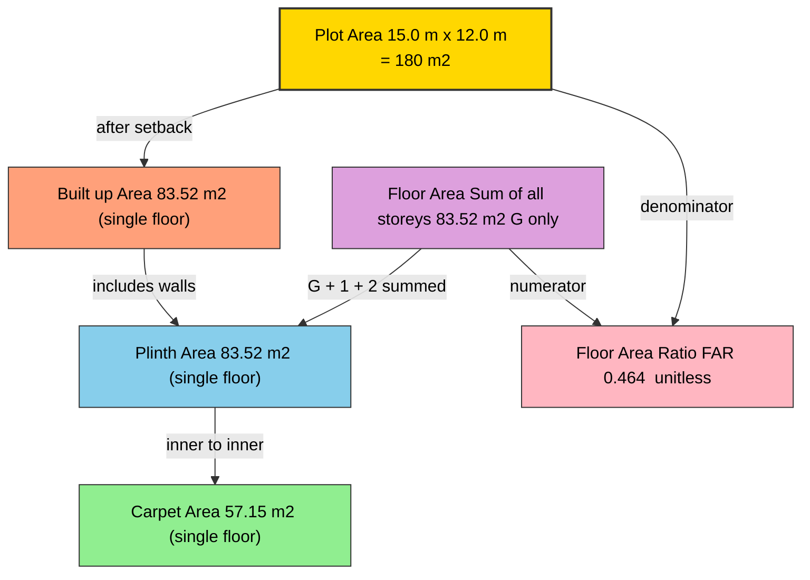
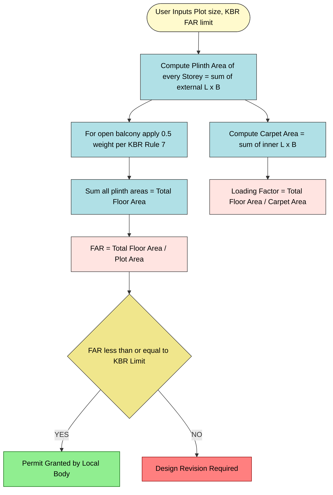

# Building Area Definitions: Built up area, Plinth area, Floor area, Carpet area and Floor area ratio of a building as per KBR.

<!-- SECTION_1_START -->
# 🏗️ Building Area Definitions as per KBR (Kerala Building Rules)

## 1.1 Core Technical Definition

> [!IMPORTANT]
> **KBR (Kerala Building Rules)** is the statutory framework notified by the Government of Kerala under the **Kerala Municipality Act / Kerala Panchayat Act** that governs the planning, design, construction, and occupancy of all buildings within the state. The definitions of building areas in this module are drawn directly from **Rule 2 (Definitions)** and **Chapter VII (Development Permit)** of the KBR.

In civil engineering practice, every building has **five standardised area metrics** that govern plot coverage, municipal tax assessment, FAR compliance, real-estate pricing, and architectural design. They are:

| # | Area Type | One-Line Definition (KTU / KBR Standard) |
|---|-----------|-------------------------------------------|
| 1 | **Plinth Area** | The built-up covered area measured at the **plinth level** of the building. |
| 2 | **Built-up Area** | The total covered area of the building at any floor including **walls, balconies, verandahs, staircases, and ducts**. |
| 3 | **Floor Area** | The sum of the **plinth area of all storeys** of a building, including the basement. |
| 4 | **Carpet Area** | The **net usable floor area** within the inner line of the walls of a room — it is the area where a carpet can be physically laid. |
| 5 | **Floor Area Ratio (FAR)** | The ratio of the **total floor area of all storeys** to the **area of the plot** on which the building stands. |

---

## 1.2 Conceptual Analogy — The "Onion-Layer" Model 🧅

Imagine a building plan (top view) as a set of **concentric rectangles**, like layers of an onion:

* **Outermost layer** = Outer wall boundary → this encloses the **Built-up Area**.
* **Middle layer** = Inner wall line → this encloses the **Carpet Area** (the room a person actually lives/works in).
* **Walls themselves** = The space between the two layers.
* **The whole plot of land** = The ground on which the onion stands → used to calculate **FAR**.

A student can therefore think:

> **Plot Area ⊃ Built-up Area ⊃ Plinth Area ⊃ Floor Area (summed) ≥ Carpet Area**

The **plinth level** is a horizontal reference plane located **0.45 m to 1.20 m above the surrounding ground level** (as per KBR), where the superstructure (above-ground portion) of the building begins.

---

## 1.3 Callout Boxes & Highlights

> [!NOTE]
> **Key Terminology — Plinth Level**
> Plinth is the portion of a building **between the ground level and the floor of the lowest storey**. In Kerala, due to heavy rainfall, plinth height is kept **at least 0.45 m above the road / ground level** to prevent water ingress.

> [!IMPORTANT]
> **KTU 2024 Syllabus Highlight — GCEST104 / Module 3**
> Students must be able to **define, distinguish, and compute** all five area terms for a single-storey as well as multi-storey building, and apply the FAR formula to determine permissible construction on a given plot.

> [!TIP]
> **Memory Trick — "B P F C F"**
> **B**uilt-up ⊂ **P**linth ⊂ **F**loor ⊂ **C**arpet → for any single floor. But **Floor Area** of the *whole building* is the **largest** because it sums every storey.

---

## 1.4 GeoGebra Visualization

> [!VISUALIZATION CONTROL]
> **Concept:** Plan-view rectangles of Plot, Built-up, Plinth and Carpet areas on a coordinate grid.
>
> **GeoGebra Input (paste in GeoGebra Classic → Input Bar):**
>
> * `A = (0, 0)`  `B = (20, 0)`  `C = (20, 30)`  `D = (0, 30)` &nbsp;&nbsp; *(Outer plot = 20 m × 30 m = **600 m²**)*
> * `E = (1, 1)`  `F = (19, 1)`  `G = (19, 29)`  `H = (0, 29)` &nbsp;&nbsp; *(Built-up footprint = 18 m × 28 m = **504 m²**)*
> * `I = (1.3, 1.3)`  `J = (18.7, 1.3)`  `K = (18.7, 28.7)`  `L = (0, 28.7)` &nbsp;&nbsp; *(Carpet = 17.4 m × 27.4 m ≈ **476.76 m²**)*
> * `Polygon(A, B, C, D)` → red outline (Plot)
> * `Polygon(E, F, G, H)` → blue outline (Built-up)
> * `Polygon(I, J, K, L)` → green fill (Carpet)
>
> **Visual Description:** On screen, the student should see three nested rectangles — **red (outer) > blue (middle) > green (inner)**. The thin band between red and blue represents the **setback** (margin left around building), the band between blue and green represents the **wall thickness**, and the green region is what is actually usable inside the rooms.

---

<!-- SECTION_1_END -->

<!-- SECTION_2_START -->
# 📚 Deep Theoretical Analysis & KTU Formula Sheet

## 2.1 Hierarchical Decomposition of a Building's Areas

The relationship between the five area terms can be fully understood by breaking down the geometry from the **plot boundary inward**, and from the **ground floor upward** through the floors:

### A. Plinth Area (KBR Definition)

> [!NOTE]
> **Plinth Area** is the **covered area of the building measured at the plinth level**. It is the projection of the building's external dimensions (including external walls) on a horizontal plane at the plinth level. *(KBR Rule 2(l))*

**Components included in Plinth Area:**

* Internal sanitary shafts
* Staircase room / lift room
* Air-conditioning ducts and equipment rooms
* Porches, canopies and the area of the front/back courtyard projections at plinth level

**Components excluded from Plinth Area:**

* Open platforms, uncovered steps
* Cantilever projections (chajjas), cornices, sun-shades
* Area of the loft / mezzanine floor (if height < 2.1 m)
* Open terraces

---

### B. Built-up Area

> [!NOTE]
> **Built-up Area = Carpet Area + Area of internal & external walls + Area of balconies & verandahs + Area of staircase, ducts, lift wells, service shafts.**

Mathematically, for a single storey:

$$A_{built\text{-}up} = A_{carpet} + A_{walls} + A_{balcony} + A_{verandah} + A_{staircase} + A_{ducts}$$

In real-estate practice, the **"loading factor"** (or **super-built-up factor**) is:

$$\text{Loading Factor} = \frac{A_{built\text{-}up}}{A_{carpet}}$$

For typical apartments, this factor lies between **1.25 and 1.45** (i.e., 25 %–45 % of the built-up area is *non-carpet*).

---

### C. Floor Area

> [!NOTE]
> **Floor Area = Plinth Area of Ground Floor + Plinth Area of First Floor + Plinth Area of Second Floor + … + Plinth Area of Basement (if any).**

For a building with $n$ identical storeys:

$$A_{floor} = n \times A_{plinth\text{,single\ floor}}$$

If the floors are **not identical** (typical for residential houses with a terrace):

$$A_{floor} = \sum_{i=1}^{n} A_{plinth,i}$$

---

### D. Carpet Area (KBR Definition)

> [!NOTE]
> **Carpet Area** is the net usable floor area of a building **excluding** the area of walls, pillars, balconies, verandahs, staircases, passages, lift-wells, ducts, and sanitary shafts. It is computed **from the inner-to-inner line of the walls**. *(KBR Rule 2(c))*

For a rectangular room of inner dimensions $L \times B$:

$$A_{carpet} = L \times B$$

For a multi-room storey:

$$A_{carpet} = \sum (\text{inner length} \times \text{inner breadth})\ \text{of all rooms}$$

**Why does it matter?**
* The **RERA Act, 2016** (Government of India) mandates that builders must quote the **carpet area** (not super-built-up area) as the basis for property sale. Hence, the carpet area is the **most legally and financially significant** area term for a buyer.

---

### E. Floor Area Ratio (FAR) / Floor Space Index (FSI)

> [!NOTE]
> **FAR (Floor Area Ratio)** is the maximum permissible ratio of the **total floor area** of a building to the **net plot area**, as fixed by the local authority under KBR.

$$\boxed{\text{FAR} = \dfrac{\text{Total Floor Area of all storeys}}{\text{Area of the Plot}}}$$

The governing plot-area term in KBR is normally the **net plot area** (after deducting setbacks for road widening, drains, etc.).

> [!IMPORTANT]
> **Difference: FAR vs. Coverage**
> * **FAR (FAR / FSI)** is a **volumetric / 3-D** index — controls **how much you can build vertically**.
> * **Ground Coverage** is a **2-D** index — controls **how much of the plot you can cover** at plinth level. KBR typically limits coverage to **40 %–60 %** of plot area, depending on road width and zone.

---

## 2.2 📋 KTU High-Yield Formula Sheet (Exam Cheat Sheet)

| Sl. | Quantity | Formula | KBR Reference / Standard | Typical Unit |
|-----|----------|---------|--------------------------|---------------|
| 1 | Plinth Area (single floor) | $A_{plinth} = L_{ext} \times B_{ext}$ (external dimensions) | Rule 2(l) | $\text{m}^{2}$ |
| 2 | Built-up Area (single floor) | $A_{built\text{-}up} = A_{carpet} + A_{walls} + A_{balcony} + A_{verandah} + A_{staircase} + A_{ducts}$ | Rule 2(d) | $\text{m}^{2}$ |
| 3 | Loading Factor | $\text{LF} = A_{built\text{-}up} / A_{carpet}$ | Real-estate norm | unit-less |
| 4 | Carpet Area (rectangle) | $A_{carpet} = L_{int} \times B_{int}$ | Rule 2(c) | $\text{m}^{2}$ |
| 5 | Floor Area (whole building) | $A_{floor} = \sum_{i=1}^{n} A_{plinth,i}$ | Rule 2(f) | $\text{m}^{2}$ |
| 6 | **Floor Area Ratio (FAR)** | $\text{FAR} = A_{floor} / A_{plot}$ | Chapter VII | unit-less |
| 7 | Max. Permissible Floor Area | $A_{floor,\max} = \text{FAR}_{\max} \times A_{plot}$ | KBR Schedule | $\text{m}^{2}$ |
| 8 | Max. Permissible No. of Floors | $n_{\max} = \lfloor A_{floor,\max} / A_{plinth,\text{typical}} \rfloor$ | Derived | integer |
| 9 | Ground Coverage | $\text{GC} = A_{plinth,\text{ground}} / A_{plot}$ | KBR (40–60 %) | % |
| 10 | Setback Area (per side) | $S = (L_{plot} - L_{ext})/2$ (front/side) | KBR Table | m |

> [!NOTE]
> **Critical Exam Tip:** In numerical problems, always **show the FAR as a unit-less ratio**, but state both the numerator (in $\text{m}^{2}$) and denominator (in $\text{m}^{2}$) explicitly. KTU examiners award **partial marks** for each correct substitution.

---

## 2.3 Real-World Engineering Utility

| Application Domain | Why the area definition matters |
|--------------------|--------------------------------|
| **Municipal Building Permit (KBR)** | Officer verifies that proposed $A_{floor} \le \text{FAR}_{\max} \times A_{plot}$ before issuing permit. |
| **Real-estate Sale (RERA Act 2016)** | Builder must sell on **carpet area**; loading factor must be disclosed. |
| **Property Tax Assessment (Kerala Local Bodies)** | Tax is computed on **plinth area** × municipal rate × age factor. |
| **Construction Cost Estimation** | Quantity surveyor estimates cement, steel, brickwork from **built-up area**. |
| **Fire Safety & Structural Design** | Occupant load, escape-staircase width, and column layout are derived from **floor area** per storey. |
| **Green Building Rating (GRIHA / IGBC)** | Energy use per $\text{m}^{2}$ uses **built-up area** as denominator. |
| **Loan & Mortgage by Banks** | Banks fund **up to 80–85 % of the agreement value** based on carpet area. |

<!-- SECTION_2_END -->

<!-- SECTION_3_START -->
# 🧮 Step-by-Step Derivations & Numerical Implementation

## 3.1 Worked Example 1 — Single-Storey Building (Full-Length Solution)

### 📋 Given Data
A residential building in Thiruvananthapuram Corporation zone has the following dimensions (measured as per KBR):

| Component | Outer Dimension | Inner Dimension (after 0.30 m wall) |
|-----------|-----------------|--------------------------------------|
| Drawing room | 6.0 m × 4.5 m | 5.7 m × 4.2 m |
| Bed room 1 | 4.5 m × 3.6 m | 4.2 m × 3.3 m |
| Bed room 2 | 3.6 m × 3.0 m | 3.3 m × 2.7 m |
| Kitchen | 3.0 m × 3.0 m | 2.7 m × 2.7 m |
| Bath + WC (combined) | 2.4 m × 1.8 m | 2.1 m × 1.5 m |
| Staircase room (incl. steps) | 3.0 m × 2.4 m | — (deducted from plinth) |
| Verandah (front) | 6.0 m × 1.5 m | included in built-up only |
| Balcony (rear, 1st floor) | N/A for this floor | — |

* Plot size = 15.0 m × 12.0 m
* Wall thickness (uniform) = 0.30 m
* Number of storeys = 1
* KBR permissible FAR for the zone = **1.50**

### 🎯 Required: Compute Plinth Area, Built-up Area, Carpet Area, Floor Area, FAR.

---

#### Step 1 — Plinth Area (single floor)

We sum the **external dimensions** of every covered component at plinth level.

$$A_{plinth,1} = \underbrace{(6.0 \times 4.5)}_{\text{Drawing}} + \underbrace{(4.5 \times 3.6)}_{\text{BR1}} + \underbrace{(3.6 \times 3.0)}_{\text{BR2}} + \underbrace{(3.0 \times 3.0)}_{\text{Kitchen}} + \underbrace{(2.4 \times 1.8)}_{\text{Bath/WC}} + \underbrace{(3.0 \times 2.4)}_{\text{Staircase}} + \underbrace{(6.0 \times 1.5)}_{\text{Verandah}}$$

$$\begin{aligned}
A_{plinth,1} &= 27.00 + 16.20 + 10.80 + 9.00 + 4.32 + 7.20 + 9.00 \\
&= 83.52\ \text{m}^{2}
\end{aligned}$$

> **[Valuation Hint — KTU Board Key]: 1 mark for each correctly substituted product, 1 mark for final summation. Total 4 marks for the sub-question.]**

---

#### Step 2 — Carpet Area (single floor)

We sum the **inner-to-inner dimensions** of all *usable rooms*. The staircase and verandah are **NOT** counted in carpet area.

$$A_{carpet,1} = (5.7 \times 4.2) + (4.2 \times 3.3) + (3.3 \times 2.7) + (2.7 \times 2.7) + (2.1 \times 1.5)$$

$$\begin{aligned}
A_{carpet,1} &= 23.94 + 13.86 + 8.91 + 7.29 + 3.15 \\
&= 57.15\ \text{m}^{2}
\end{aligned}$$

---

#### Step 3 — Built-up Area (single floor)

Built-up area is **plinth area** (since for a ground-floor plan, plinth area and built-up area coincide — both include the walls and verandah).

For a single-storey ground-floor-only plan, **$A_{built\text{-}up} = A_{plinth,1}$**:

$$A_{built\text{-}up,1} = 83.52\ \text{m}^{2}$$

**Loading Factor:**

$$\text{LF} = \frac{A_{built\text{-}up}}{A_{carpet}} = \frac{83.52}{57.15} = 1.46$$

This means **31.6 %** of the built-up area is *non-carpet* (walls, staircase, verandah).

---

#### Step 4 — Floor Area (whole building)

The building has only **one storey**, hence:

$$A_{floor} = 1 \times A_{plinth,1} = 1 \times 83.52 = 83.52\ \text{m}^{2}$$

---

#### Step 5 — Plot Area

$$A_{plot} = 15.0 \times 12.0 = 180.0\ \text{m}^{2}$$

---

#### Step 6 — Floor Area Ratio (FAR)

$$\text{FAR} = \frac{A_{floor}}{A_{plot}} = \frac{83.52}{180.00} = 0.464$$

---

#### Step 7 — Check against KBR Permissible FAR

| Parameter | Computed | KBR Limit | Status |
|-----------|----------|-----------|--------|
| FAR | 0.464 | 1.500 | ✅ Compliant (FAR < 1.50) |
| Ground Coverage | 83.52 / 180 = 46.4 % | ≤ 60 % (typical) | ✅ Compliant |
| Max. Permissible Floor Area | 1.50 × 180 = 270 m² | — | We have used only 83.52 m² |
| **Additional Buildable Floor Area** | 270 − 83.52 = **186.48 m²** | — | Can add more storeys |

> **[Valuation Hint — KTU Board Key]: 1 mark for the FAR formula, 1 mark for substitution, 1 mark for numerical value, 1 mark for comparison with KBR. Total 4 marks.]**

---

## 3.2 Worked Example 2 — Multi-Storey Building (G+2)

### 📋 Given Data
Same plan as Example 1, but the building is now **G + 2** (Ground + First + Second floor). First floor has a **6.0 m × 1.5 m rear balcony** (open) in addition. Second floor is identical to first floor but **without the balcony** (terrace instead).

> **Note (KBR / RERA):** Open balcony is **counted at 50 %** of its actual area toward FAR computation in most Kerala local bodies (KBR Rule 7).

### 🎯 Required: Compute total FAR and the loading factor.

#### Step 1 — Plinth Area of each storey

* Ground floor plinth = **83.52 m²** (from Example 1).
* First floor plinth = Ground plinth + 50 % × Balcony area (open balcony as per KBR).

$$A_{plinth,1st} = 83.52 + 0.5 \times (6.0 \times 1.5) = 83.52 + 4.50 = 88.02\ \text{m}^{2}$$

* Second floor plinth = Ground plinth (no balcony) = **83.52 m²**.

#### Step 2 — Total Floor Area

$$A_{floor} = 83.52 + 88.02 + 83.52 = 255.06\ \text{m}^{2}$$

#### Step 3 — FAR

$$\text{FAR} = \frac{255.06}{180.0} = 1.417$$

#### Step 4 — Compliance Check

| Parameter | Computed | KBR Limit | Status |
|-----------|----------|-----------|--------|
| FAR | **1.417** | 1.500 | ✅ Compliant (just within limit) |
| Ground Coverage | 83.52 / 180 = 46.4 % | ≤ 60 % | ✅ Compliant |

> **Conclusion:** A G+2 building with the above plan is permissible under KBR, but **no further storey can be added** (the next storey would push FAR to ≈ 1.88, exceeding 1.50).

#### Step 5 — Loading Factor (assuming identical carpet per storey)

If the first and second floors have the same carpet as the ground floor (57.15 m² each):

$$A_{carpet,total} = 3 \times 57.15 = 171.45\ \text{m}^{2}$$

$$\text{LF} = \frac{255.06}{171.45} = 1.49$$

---

## 3.3 Python Implementation — Multi-Storey FAR Calculator

```python
"""
KBR-Compliant Multi-Storey Building FAR Calculator
Course: GCEST104 – Module 3
Tool: Pure Python 3.10+
"""

from dataclasses import dataclass, field
from typing import List
import logging
import sys

logging.basicConfig(
    level=logging.INFO,
    format="%(asctime)s | %(levelname)s | %(message)s",
    stream=sys.stdout,
)
logger = logging.getLogger(__name__)


@dataclass(frozen=True)
class Storey:
    """Represents one floor of a building."""

    name: str
    plinth_area_m2: float
    carpet_area_m2: float
    open_balcony_m2: float = 0.0

    def effective_plinth(self, balcony_weight: float = 0.5) -> float:
        """
        KBR Rule 7: Open balconies count at `balcony_weight` (default 0.5)
        toward FAR computation.
        """
        if not 0.0 <= balcony_weight <= 1.0:
            logger.error("balcony_weight must lie in [0, 1].")
            raise ValueError("balcony_weight must lie in [0, 1].")
        if self.open_balcony_m2 < 0:
            logger.error("open_balcony_m2 cannot be negative.")
            raise ValueError("open_balcony_m2 cannot be negative.")
        return self.plinth_area_m2 + balcony_weight * self.open_balcony_m2


@dataclass
class Building:
    """Represents a multi-storey building and computes KBR metrics."""

    plot_area_m2: float
    storeys: List[Storey] = field(default_factory=list)
    far_limit: float = 1.5  # KBR default for typical residential zone

    def total_floor_area(self) -> float:
        return sum(s.effective_plinth() for s in self.storeys)

    def total_carpet_area(self) -> float:
        return sum(s.carpet_area_m2 for s in self.storeys)

    def far(self) -> float:
        if self.plot_area_m2 <= 0:
            logger.error("Plot area must be positive.")
            raise ValueError("Plot area must be positive.")
        return self.total_floor_area() / self.plot_area_m2

    def ground_coverage(self) -> float:
        if not self.storeys:
            logger.error("No storeys defined.")
            raise ValueError("At least one storey is required.")
        return self.storeys[0].plinth_area_m2 / self.plot_area_m2

    def loading_factor(self) -> float:
        carpet_total = self.total_carpet_area()
        if carpet_total <= 0:
            logger.error("Carpet area is zero.")
            raise ValueError("Carpet area must be > 0.")
        return self.total_floor_area() / carpet_total

    def kbr_compliance_report(self) -> str:
        far_val = self.far()
        gc_val = self.ground_coverage()
        far_ok = far_val <= self.far_limit
        gc_ok = gc_val <= 0.60  # KBR default 60 %

        return (
            f"=== KBR Compliance Report ===\n"
            f"Total Floor Area      : {self.total_floor_area():.2f} m²\n"
            f"Total Carpet Area     : {self.total_carpet_area():.2f} m²\n"
            f"FAR (computed)        : {far_val:.3f}\n"
            f"FAR (KBR limit)       : {self.far_limit:.3f}  "
            f"{'PASS' if far_ok else 'FAIL'}\n"
            f"Ground Coverage       : {gc_val*100:.2f} %  "
            f"{'PASS' if gc_ok else 'FAIL'}\n"
            f"Loading Factor        : {self.loading_factor():.3f}\n"
        )


# ---------------- DRIVER CODE ----------------
if __name__ == "__main__":
    try:
        bldg = Building(
            plot_area_m2=180.0,
            far_limit=1.5,
            storeys=[
                Storey("Ground",  plinth_area_m2=83.52, carpet_area_m2=57.15),
                Storey("First",   plinth_area_m2=83.52, carpet_area_m2=57.15,
                       open_balcony_m2=9.0),
                Storey("Second",  plinth_area_m2=83.52, carpet_area_m2=57.15),
            ],
        )
        print(bldg.kbr_compliance_report())
    except ValueError as ve:
        logger.error(f"Input error: {ve}")
```

**Expected Output (matches Worked Example 2):**
```
=== KBR Compliance Report ===
Total Floor Area      : 255.06 m²
Total Carpet Area     : 171.45 m²
FAR (computed)        : 1.417
FAR (KBR limit)       : 1.500  PASS
Ground Coverage       : 46.40 %  PASS
Loading Factor        : 1.488
```

<!-- SECTION_3_END -->

<!-- SECTION_4_START -->
# 🗺️ Structural Diagrams & Schematics

## 4.1 Mermaid — Venn Relationship Between the Five Areas



> **Reading the diagram:** Arrows depict the **flow of derivation** — start with plot → set back → built-up → plinth (with walls) → carpet (inner). Floor area is the *vertical sum* of plinth areas, and FAR is the *ratio* of floor area to plot area.

---

## 4.2 Mermaid — Multi-Storey Building Area Computation Flow



---

## 4.3 Block Diagram — Sequential Processing Topology Matrix

Because a true architectural plan view (with walls, doors, windows, furniture layout) cannot be drawn natively in Mermaid, the following **functional block matrix** captures the *information-processing topology* of a real KBR plan sanction workflow:

| Stage | Input Document | Processing Engine | Output Artefact |
|-------|---------------|-------------------|-----------------|
| 1 | Architect's Plan (AutoCAD / Revit) | Plot boundary check vs. KBR setback table | Site plan approved |
| 2 | Floor-wise plan | Built-up area calculator (external dims) | Plinth area per storey |
| 3 | Inner wall offsets | Carpet area calculator (inner dims) | Carpet area per storey |
| 4 | Plinth list (all storeys) | FAR calculator | FAR ratio |
| 5 | FAR ratio + KBR table lookup | Permit compliance module | Issued / Rejected |
| 6 | Material take-off × built-up area | Quantity surveyor | BOQ (Bill of Quantities) |
| 7 | Carpet area × municipal rate | Tax department | Annual property tax |

> **Mapping to exam questions:** The 7-stage pipeline above is essentially the **logical path** the examiner expects you to follow when a 14-mark Part B question asks *"For the given building plan, compute all five area terms and verify KBR compliance."*

<!-- SECTION_4_END -->

<!-- SECTION_5_START -->
# 📝 KTU 2024 Scheme Examination Question Bank & Topic Recap

## 5.1 PART A — Short Answer Questions (3 Marks Each)

### Question 1 — `[KTU University Exam – July 2024]` — *CO1, Remember*

**Define the following terms as per Kerala Building Rules (KBR):**
*(a) Plinth area (b) Carpet area (c) Floor Area Ratio.*

**Model Answer (Board Key):**

* **(a) Plinth Area [1 mark]:** As per KBR Rule 2(l), *plinth area* is the built-up covered area of a building measured at the **plinth level**, computed from the **external dimensions** of all covered components (excluding open platforms, chajjas, and uncovered steps).
* **(b) Carpet Area [1 mark]:** As per KBR Rule 2(c), *carpet area* is the **net usable floor area** within the **inner-to-inner line of the walls**, computed by summing inner $L \times B$ of all rooms and **excluding** walls, balconies, verandahs, staircases, passages, lift wells, and ducts.
* **(c) Floor Area Ratio [1 mark]:** $\text{FAR} = \dfrac{\text{Total Floor Area of all storeys}}{\text{Area of the Plot}}$ — a unit-less ratio that governs the **maximum permissible built-up volume** on a plot under KBR.

---

### Question 2 — `[KTU University Exam – Dec 2023]` — *CO1, Understand*

**Distinguish between "Built-up area" and "Carpet area" of a building. Why is the carpet area considered more transparent in property transactions?**

**Model Answer (Board Key):**

| Aspect | Built-up Area | Carpet Area |
|--------|---------------|-------------|
| Measurement line | External wall outer face | Inner wall face |
| Includes walls? | **Yes** | **No** |
| Includes balcony/verandah? | **Yes** (100 % or 50 %) | **No** |
| Includes staircase & ducts? | **Yes** | **No** |
| Used for | Construction cost estimation, BOQ | RERA property sale, bank loan |
| KBR Rule | 2(d) | 2(c) |

**Why carpet area is more transparent [1 mark]:** The **RERA Act, 2016** mandates that builders must quote the **carpet area** as the *sole basis* for property sale. This eliminates the hidden **loading factor** (1.25–1.45) used in built-up/super-built-up quotations and protects the **home-buyer's right to know** the actual usable space they pay for.

---

## 5.2 PART B — Long Answer Questions (14 Marks Each, with Internal Choice)

### 🅰️ QUESTION A — `[KTU University Exam – Dec 2023]` — *CO2, Apply & Analyse*

A residential plot of size **18.0 m × 12.0 m** is located in a Panchayat zone where the **permissible FAR is 1.75** and **maximum ground coverage is 55 %**. The architect proposes the following:

* Ground floor: external dimensions **12.0 m × 9.0 m**, wall thickness **0.30 m**, plus a front verandah of **12.0 m × 1.5 m**.
* First floor: **same carpet layout as ground floor**, plus a **rear open balcony of 12.0 m × 1.2 m** (counted at 50 % per KBR).
* Inner room dimensions (single storey, for carpet calc): drawing room 5.7 m × 4.2 m, two bedrooms 4.2 m × 3.3 m, kitchen 3.0 m × 2.7 m, bath 2.1 m × 1.5 m.

**Required:**
**(a) Calculate the plinth area, carpet area, and total floor area of the proposed building.** (7 Marks)
**(b) Determine the FAR and verify whether the building complies with the KBR regulations for the zone.** (7 Marks)

---

#### ✅ MODEL SOLUTION — Question A

##### Part (a) — Plinth, Carpet, Floor Area

**Step 1: Plot Area**

$$A_{plot} = 18.0 \times 12.0 = 216.0\ \text{m}^{2}$$

**Step 2: Plinth Area of Ground Floor**

$$A_{plinth,G} = (12.0 \times 9.0) + (12.0 \times 1.5) = 108.0 + 18.0 = 126.0\ \text{m}^{2}$$

**[Stating plinth formula from KBR: 1 Mark]**
**[Correct substitution: 1 Mark]**
**[Final value 126 m²: 1 Mark]**

**Step 3: Plinth Area of First Floor**

$$A_{plinth,1st} = A_{plinth,G} + 0.5 \times (12.0 \times 1.2) = 126.0 + 0.5 \times 14.4 = 126.0 + 7.2 = 133.2\ \text{m}^{2}$$

**[Stating KBR Rule 7 (50 % balcony): 1 Mark]**
**[Correct weighted value: 1 Mark]**

**Step 4: Total Floor Area**

$$A_{floor} = 126.0 + 133.2 = 259.2\ \text{m}^{2}$$

**[Summation step: 1 Mark]**

**Step 5: Carpet Area (per storey)**

$$A_{carpet,1} = (5.7 \times 4.2) + 2 \times (4.2 \times 3.3) + (3.0 \times 2.7) + (2.1 \times 1.5)$$

$$= 23.94 + 27.72 + 8.10 + 3.15 = 62.91\ \text{m}^{2}$$

For the **2-storeyed** building, total carpet (assuming same layout):

$$A_{carpet,total} = 2 \times 62.91 = 125.82\ \text{m}^{2}$$

**[Computation: 1 Mark]**

---

##### Part (b) — FAR and Compliance

**Step 6: FAR Calculation**

$$\text{FAR} = \frac{A_{floor}}{A_{plot}} = \frac{259.2}{216.0} = 1.200$$

**[Formula: 1 Mark]**
**[Substitution: 1 Mark]**
**[Value: 1 Mark]**

**Step 7: Ground Coverage**

$$\text{GC} = \frac{A_{plinth,G}}{A_{plot}} = \frac{126.0}{216.0} = 0.5833 = 58.33\ \text{\%}$$

**Step 8: Compliance Check**

| Parameter | Computed | KBR Limit | Status |
|-----------|----------|-----------|--------|
| FAR | 1.200 | 1.750 | ✅ Pass |
| Ground Coverage | 58.33 % | 55.00 % | ❌ **Fail** (exceeds by 3.33 %) |

**[Comparison table: 1 Mark]**
**[Verdict: 1 Mark]**

**Conclusion:** The **FAR is within limits**, but the **ground coverage exceeds the permissible 55 %** by 3.33 %. The architect must **reduce the ground-floor plinth area by at least $216.0 \times 0.0333 = 7.2\ \text{m}^{2}$** (e.g., by reducing the verandah depth from 1.5 m to 0.9 m). **[Final recommendation: 1 Mark]**

---

### 🅱️ QUESTION B — `[KTU University Exam – July 2024]` — *CO2, Apply & Analyse*

A building plan has the following specifications:
* Plot area: **20.0 m × 15.0 m = 300 m²**
* Building footprint (external): **16.0 m × 11.0 m**
* Wall thickness: **0.30 m** uniform
* Number of storeys: **G + 3**
* Inner carpet dimensions (per floor): two rooms 5.0 m × 4.0 m each, one room 4.0 m × 3.5 m, one kitchen 3.0 m × 3.0 m, one bath 2.0 m × 1.5 m
* Front verandah on ground floor only: **16.0 m × 1.5 m**
* Rear balcony on first and second floors: **4.0 m × 1.5 m** each (open, 50 % weight)
* KBR FAR limit: **1.50**

**Required:**
**(a) Compute the built-up area, carpet area and total floor area of the building.** (7 Marks)
**(b) Calculate the Floor Area Ratio (FAR) and the loading factor, and comment on the compliance with KBR.** (7 Marks)

---

#### ✅ MODEL SOLUTION — Question B

##### Part (a) — Built-up, Carpet, Floor Area

**Step 1: Plot Area**

$$A_{plot} = 20.0 \times 15.0 = 300.0\ \text{m}^{2}$$

**Step 2: Built-up Area (Ground Floor)**

The ground floor includes the main building footprint + verandah.

$$A_{built\text{-}up,G} = (16.0 \times 11.0) + (16.0 \times 1.5) = 176.0 + 24.0 = 200.0\ \text{m}^{2}$$

**[Built-up formula: 1 Mark] [Computation: 1 Mark]**

**Step 3: Plinth Area (First & Second Floors)**

$$A_{plinth,1st} = A_{plinth,2nd} = (16.0 \times 11.0) + 0.5 \times (4.0 \times 1.5) = 176.0 + 3.0 = 179.0\ \text{m}^{2}$$

**Step 4: Plinth Area (Third Floor)** — no balcony

$$A_{plinth,3rd} = 16.0 \times 11.0 = 176.0\ \text{m}^{2}$$

**Step 5: Total Floor Area**

$$A_{floor} = 200.0 + 179.0 + 179.0 + 176.0 = 734.0\ \text{m}^{2}$$

**[Summation: 1 Mark]**

**Step 6: Carpet Area (per floor)**

$$A_{carpet,1} = 2 \times (5.0 \times 4.0) + (4.0 \times 3.5) + (3.0 \times 3.0) + (2.0 \times 1.5)$$

$$= 40.0 + 14.0 + 9.0 + 3.0 = 66.0\ \text{m}^{2}$$

For 4 floors (assuming identical plan):

$$A_{carpet,total} = 4 \times 66.0 = 264.0\ \text{m}^{2}$$

**[Inner-dimension product & summation: 1 Mark]**

**Step 7: Built-up Area (entire building)**

$$A_{built\text{-}up,total} = 734.0\ \text{m}^{2}$$

**(Note: In this question, total floor area = built-up area since balcony & verandah are already included.)** **[1 Mark]**

---

##### Part (b) — FAR, Loading Factor & Compliance

**Step 8: FAR**

$$\text{FAR} = \frac{A_{floor}}{A_{plot}} = \frac{734.0}{300.0} = 2.447$$

**[Formula: 1 Mark] [Substitution: 1 Mark] [Value: 1 Mark]**

**Step 9: Loading Factor**

$$\text{LF} = \frac{A_{built\text{-}up,total}}{A_{carpet,total}} = \frac{734.0}{264.0} = 2.78$$

**[Formula: 1 Mark] [Value: 1 Mark]**

**Step 10: Compliance**

| Parameter | Computed | KBR Limit | Status |
|-----------|----------|-----------|--------|
| FAR | **2.447** | 1.500 | ❌ **Fail** |
| Ground Coverage | 200 / 300 = 66.7 % | (typical ≤ 60 %) | ❌ **Fail** |

**Conclusion:** The proposed **G+3 building has FAR = 2.45, which is 63 % above the KBR limit of 1.50**. The design is **non-compliant** and must be revised. Possible corrections: **[Verdict & recommendation: 1 Mark]**

* Reduce the number of storeys to **G+1** (FAR = 1.19 → ✅).
* Or increase the plot area to $\ge 734/1.5 = 489.4\ \text{m}^{2}$.
* Or reduce the footprint / balcony / verandah to lower the total floor area.

---

## 5.3 KTU Examiner's Valuation Warning / Pitfall Callout

> [!WARNING]
> **Common Mark-Deduction Pitfalls (GCEST104 / Module 3)**
> 1. **Mixing up Plinth vs. Built-up area** — Plinth = *external* covered area at plinth level (excludes open balcony at 100 %, includes it at 50 % for FAR). Built-up = *all enclosed + semi-enclosed* usable + non-usable area at a floor.
> 2. **Forgetting to apply the 50 % rule** for open balconies under KBR Rule 7 — examiners explicitly test this. Use the weighted area for FAR, not the raw balcony area.
> 3. **Using outer dimensions for carpet area** — this is a 2-mark killer error. Carpet area **must** use *inner-to-inner* wall dimensions.
> 4. **Forgetting to sum all storeys** for floor area — students often give only the ground-floor plinth. The KTU answer key expects $A_{floor} = \sum_{i=1}^{n} A_{plinth,i}$.
> 5. **Not writing the FAR comparison statement** — just computing FAR = 0.464 is *not* enough. You must write "**Since $0.464 \le 1.50$, the design is KBR-compliant**" for the last 1 mark.
> 6. **Unit mismatch** — area must be in $\text{m}^{2}$ and FAR must be unit-less. Mixing units (cm, ft) without conversion costs 1 mark.
> 7. **Skipping the conclusion** — always end the 14-mark answer with a **single-line compliance verdict**.

---

## 5.4 Topic Recap & Important Things to Remember 📌

> [!TIP]
> **Rapid Revision Checklist for KTU GCEST104 — Module 3 (Building Areas & KBR)**

* **Plinth Area = built-up covered area at plinth level** (KBR Rule 2(l)) — measured on **external dimensions**.
* **Built-up Area = carpet + walls + balcony + verandah + staircase + ducts** (KBR Rule 2(d)).
* **Floor Area = sum of plinth areas of *all* storeys**, including basement (KBR Rule 2(f)).
* **Carpet Area = inner $L \times B$ of every usable room** — **excludes** walls, staircases, balconies, verandahs, ducts (KBR Rule 2(c)).
* **Open balconies count at 50 % of their area** toward FAR computation (KBR Rule 7).
* **$\text{FAR} = \dfrac{\text{Total Floor Area}}{\text{Plot Area}}$** — unit-less; typical KBR limits are **1.00–2.50** depending on road width and zone.
* **Ground Coverage $\le$ 40–60 %** (KBR Table) — controls horizontal spread, FAR controls vertical.
* **Loading Factor = Built-up / Carpet = 1.25 to 1.45** for typical apartments.
* **RERA Act 2016** mandates property sale on **carpet area**, not super-built-up area.
* **Plinth level is 0.45 m to 1.20 m above the ground** — critical in flood-prone Kerala to prevent water ingress.
* Always end a numerical answer with a **single-line KBR compliance verdict** for the last 1 mark.
* **Units:** area in $\text{m}^{2}$ (or $\text{ft}^{2}$ with conversion $1\ \text{m}^{2} = 10.7639\ \text{ft}^{2}$); FAR is **unit-less**.
* **Hierarchical relationship (single storey):** $\text{Plot Area} > \text{Built-up Area} \ge \text{Plinth Area} > \text{Carpet Area}$; **Floor Area** of the *whole building* is the **sum** of plinths and is **larger** than the plot area when the building is multi-storeyed.

<!-- SECTION_5_END -->
