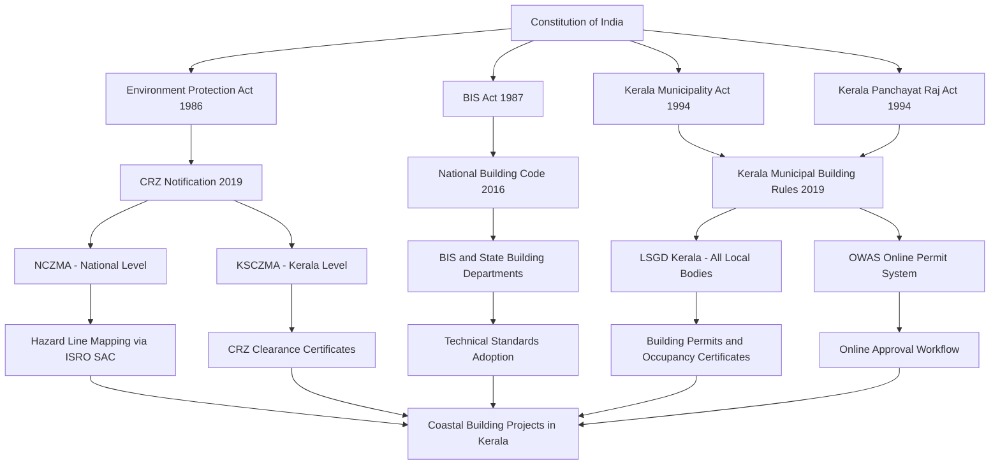
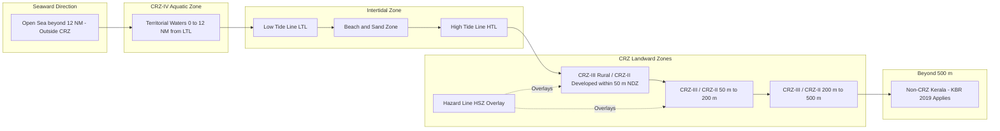
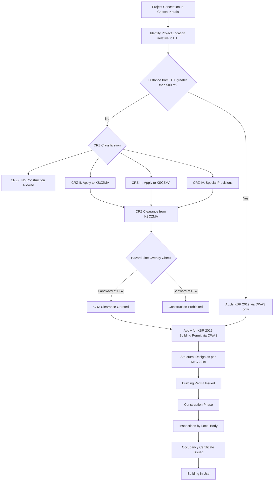

# Building rules and regulations: Relevance of NBC, KBR & CRZ norms (brief discussion of relevance only).

<!-- SECTION_1_START -->
# 1. Core Technical Definition & Intuitive Overview

## 1.1 Introduction to Building Rules and Regulations

Building construction in India, particularly in the state of Kerala, is not a free-for-all activity. It is strictly governed by a hierarchy of legal and technical documents that ensure **structural safety**, **public health**, **environmental sustainability**, and **disaster resilience**. The three foundational pillars of this regulatory framework in the Indian context are the **National Building Code (NBC)**, the **Kerala Building Rules (KBR)**, and the **Coastal Regulation Zone (CRZ) Norms**.

> [!IMPORTANT]
> **Syllabus Highlight (KTU GCEST104 – Module 3):**
> This topic is mandated as a *"brief discussion of relevance only"*. However, for KTU board examinations, students are expected to know the **issuing authority**, **scope**, **key objectives**, and **real-world engineering significance** of each of these three regulatory instruments. Marks are typically awarded for precise terminology, correct authority naming, and contextual understanding.

---

## 1.2 National Building Code of India (NBC)

### Formal Definition
The **National Building Code of India (NBC)** is a **comprehensive technical document** published by the **Bureau of Indian Standards (BIS)** that provides **guidelines for regulating building construction activities** across the country. The latest revision is **NBC 2016**, which supersedes the earlier 2005 edition.

- **Issuing Authority:** Bureau of Indian Standards (BIS), under the **Ministry of Consumer Affairs, Food and Public Distribution**, Government of India.
- **Current Version:** **NBC 2016** (Published in **July 2016**, contains **5 Groups, 25 Parts, and approximately 4,000 pages**).
- **Legal Status:** NBC is **advisory in nature** (not a binding statute by itself), but its provisions are **enforceable** once adopted by State Governments, Municipal Acts, Urban Development Authorities, or any agency responsible for building construction.

### Intuitive Analogy: NBC as the "Constitution of Building"
Think of NBC as the **Constitution of Building Construction in India**. Just as the Constitution lays down the fundamental framework that all other laws must respect, NBC provides the **national-level blueprint** that every state-level building rule (like KBR) is expected to align with. A Panchayat-level building bye-law cannot contradict the broad safety, health, and welfare principles enshrined in NBC.

> [!NOTE]
> **Core Definition to Memorize:**
> *The National Building Code (NBC) is a national instrument providing guidelines for proper building construction, maintenance, and fire safety, published by the Bureau of Indian Standards (BIS).*

---

## 1.3 Kerala Building Rules (KBR)

### Formal Definition
The **Kerala Municipal Building Rules (KBR)** is a state-level statutory document that consolidates and prescribes **specific building regulations** applicable to all local bodies in Kerala, including Municipal Corporations, Municipalities, and Grama Panchayats.

- **Promulgating Authority:** Government of Kerala, under the **Kerala Municipality Act, 1994** and the **Kerala Panchayat Raj Act, 1994**.
- **Current Version:** **Kerala Municipal Building Rules, 2019** (often referred to as KBR 2019), which replaced the earlier **KBR 1997**.
- **Key Implementing Departments:** Department of Local Self-Government (LSGD) and the Town and Country Planning Department (TCPD).

### Intuitive Analogy: KBR as the "Operating Manual"
If NBC is the Constitution, then KBR is the **Detailed Operating Manual for Kerala**. It translates the broad national principles of NBC into **practical, enforceable, and region-specific rules** — accounting for Kerala's unique challenges such as **high rainfall, cyclonic exposure, coastal erosion, laterite soil conditions, and high population density**.

> [!NOTE]
> **Core Definition to Memorize:**
> *KBR 2019 is the unified building rule applicable across all local bodies in Kerala, regulating plot coverage, Floor Area Ratio (FAR), height restrictions, setbacks, parking, and procedural aspects of building permits.*

---

## 1.4 Coastal Regulation Zone (CRZ) Norms

### Formal Definition
The **Coastal Regulation Zone (CRZ) Notification** is a set of regulations issued under the **Environment (Protection) Act, 1986**, by the **Ministry of Environment, Forest and Climate Change (MoEF&CC)**, Government of India. It governs all human activity (including construction) within **500 metres of the High Tide Line (HTL)** along India's coastline.

- **Current Version:** **CRZ Notification 2019** (published on **18 January 2019**, notified under S.O. 1242(E)), superseding the CRZ Notification 2011.
- **Implementing Authority (at Central Level):** **National Coastal Zone Management Authority (NCZMA)**, under MoEF&CC.
- **Implementing Authority (at State Level):** **Kerala State Coastal Zone Management Authority (KSCZMA)**.

### Intuitive Analogy: CRZ as the "Protective Buffer"
Imagine a **500-metre invisible "buffer zone"** along India's entire 7,500+ km coastline. Inside this buffer, the ocean's ecosystem is given legal priority over human construction. CRZ is the **rulebook for that buffer zone** — a legal fence that protects mangroves, coral reefs, turtle nesting sites, and coastal aquifers from unregulated development. For Kerala, which has a coastline of approximately **590 km**, CRZ norms are extremely significant.

> [!NOTE]
> **Core Definition to Memorize:**
> *The CRZ Notification 2019 is a statutory regulation under the Environment Protection Act 1986 that restricts and regulates construction and developmental activities within 500 metres of the High Tide Line along India's coast.*

---

## 1.5 CRZ Classification (KDTFZ — Key to Memorize)

The CRZ 2019 Notification classifies the coastal zone into the following categories:

- **CRZ-I:** Ecologically sensitive areas (mangroves, coral reefs, turtle breeding grounds, national parks, marine wildlife sanctuaries, etc.). Construction is **strictly prohibited**.
- **CRZ-II:** Areas that are already developed up to the shoreline within municipal limits. Construction allowed with restrictions.
- **CRZ-III:** Rural and undeveloped areas (e.g., most of Kerala's coast outside municipal limits). Limited development permitted.
- **CRZ-IV:** The **aquatic zone** from the Low Tide Line (LTL) up to the territorial waters (12 nautical miles). Activities related to fishing, navigation, and defence are permitted.

Two additional key technical zones defined:
- **HTL (High Tide Line):** The line up to which the highest water tide reaches during the spring tide.
- **LTL (Low Tide Line):** The line up to which the lowest water tide recedes during the spring tide.
- **NDZ (No Development Zone):** A buffer of **50 metres** (originally 100 m in CRZ 2011, now 50 m in CRZ 2019) from the HTL for CRZ-III areas.
- **HSZ (Hazard Line):** A line marked by the **Space Applications Centre (SAC), ISRO**, indicating the shoreline likely to be affected by a **100-year return period coastal storm event**. Construction is generally prohibited seaward of the HSZ.

> [!VISUALIZATION CONTROL]
> **Concept:** Spatial layout of CRZ zones along a coastal cross-section
> **Conceptual Coordinate Reference:** Plot the following conceptual boundaries along an x-axis representing distance from the seaward edge:
> * `x = 0` = Territorial Sea Limit (12 nautical miles)
> * `x = L1` = Low Tide Line (LTL)
> * `x = L2` = High Tide Line (HTL)
> * `x = L2 + 50 m` = Landward edge of NDZ in CRZ-III
> * `x = L2 + 200 m` to `L2 + 500 m` = Outer boundary of CRZ (depending on classification)
> **Visual Description:** A horizontal cross-section should show the **sea** on the left, followed by the **aquatic CRZ-IV**, then the **shoreline (LTL to HTL)**, and finally the **land** subdivided into CRZ-I/II/III with the NDZ buffer adjacent to HTL.

---

<!-- SECTION_2_START -->
# 2. Deep Theoretical Analysis & KTU High-Yield Formula Sheet

## 2.1 Hierarchy of Building Regulations in India

The Indian regulatory framework for buildings follows a **top-down hierarchy**, much like a pyramid. Understanding this hierarchy is essential for the KTU examination.

| Level | Regulatory Instrument | Authority | Binding Nature |
| :--- | :--- | :--- | :--- |
| **Apex (Statute)** | Environment (Protection) Act, 1986 | Parliament of India | Legally binding nationwide |
| **National Code** | National Building Code (NBC) 2016 | Bureau of Indian Standards (BIS) | Advisory; mandatory once adopted by States |
| **State Rule** | Kerala Municipal Building Rules (KBR) 2019 | Government of Kerala | Legally binding in Kerala |
| **State Coastal Body** | Kerala State Coastal Zone Management Authority (KSCZMA) | MoEF&CC + State | Enforces CRZ in Kerala |
| **Local Body** | Building Permits, Occupancy Certificates | Panchayats / Municipalities / Corporations | Enforced at the local level |

---

## 2.2 National Building Code (NBC) — Structural Breakdown

NBC 2016 is organised into **5 broad Groups** and **25 Parts**. For KTU, the student should know the **Group structure** and at least the **titles of the major Parts**.

### The 5 Groups of NBC 2016

- **Group 1:** Administrative Provisions and General Building Requirements
- **Group 2:** Structural Design and Materials (Foundations, Masonry, Concrete, Steel, Timber)
- **Group 3:** Building Services (Plumbing, Drainage, Water Supply, Electrical, HVAC)
- **Group 4:** Fire Protection, Life Safety, and Sustainability
- **Group 5:** Construction Management, Maintenance, and Safety

### Key Functional Areas Covered by NBC
- **Building classification** (residential, commercial, institutional, industrial)
- **Open spaces, FAR (Floor Area Ratio), setbacks, and height limits**
- **Structural safety** (loads, foundation design, earthquake resistance)
- **Fire safety and means of egress**
- **Plumbing, sanitation, water supply, and electrical installations**
- **Sustainable practices** and **energy efficiency**
- **Accessibility** for persons with disabilities

### Real-World Engineering Utility
NBC is the **primary reference** for architects, structural engineers, and government building departments. It is invoked in **court cases**, **insurance claims**, and **forensic investigations** related to building collapses or fire disasters. Every civil engineering graduate in India should be familiar with NBC as the foundational document of their professional practice.

---

## 2.3 Kerala Building Rules (KBR) 2019 — Key Provisions

KBR 2019 introduced several **modernisation and simplification** measures over the previous 1997 rules. For KTU, the following high-yield points are essential:

### Key Highlights of KBR 2019
- **Single Unified Rule:** Applies to **all local bodies** in Kerala (Municipalities, Corporations, Block Panchayats, Grama Panchayats) — eliminating the earlier multiplicity of local bye-laws.
- **Online Approval System (OWAS — Online Building Permit Approval System):** Building permits are processed through an online portal for **transparency and speed**.
- **Self-Certification:** For residential buildings up to a specified size and for owners holding valid engineering qualifications, a **self-certification route** is provided.
- **Risk-Based Classification:** Buildings are classified based on **risk levels** (low, medium, high) which determines the scrutiny intensity.
- **Compounding of Violations:** A provision for **regularisation of minor deviations** through payment of compounding fees, subject to structural and safety conditions.
- **Specific Provisions for Kerala:**
  * **Coastal vulnerability** considerations
  * **Landslide-prone hilly terrain** provisions
  * **Paddy lands and wetlands** protection
  * **Heritage and conservation** zone guidelines

### Key Technical Parameters Regulated by KBR
- **Plinth area, plot coverage, and FAR (Floor Area Ratio)**
- **Setbacks (front, rear, and side)**
- **Building height limits**
- **Staircase and lift requirements**
- **Basement and stilt floor regulations**
- **Ramp and accessibility provisions**
- **Sewage and stormwater disposal standards**
- **Rainwater harvesting** (mandatory for buildings above a threshold plot area)

### Real-World Engineering Utility
Every civil engineer practising in Kerala interacts with KBR during the **building permit process**, **site inspections**, and **occupancy certification**. KBR 2019 is the practical, day-to-day rulebook that governs construction in the state.

---

## 2.4 Coastal Regulation Zone (CRZ) 2019 Notification — Key Provisions

### Background and Evolution
- **CRZ 1981:** First CRZ notification under the Environment Protection Act 1986.
- **CRZ 1991:** Strengthened provisions.
- **CRZ 2011:** Introduced the concept of Hazard Line and CRZ mapping.
- **CRZ 2019 (Current):** Simplified, liberalised for tourism and livelihood activities, but with stronger protections for ecology.

### Key Provisions of CRZ 2019
- **No Development Zone (NDZ):** Reduced from **100 m to 50 m** from HTL for CRZ-III areas (a significant change from 2011 norms).
- **Hazard Line (HSZ):** The **Space Applications Centre (SAC), ISRO**, prepares the Hazard Line mapping. Construction is generally prohibited seaward of the Hazard Line, except for certain defence and atomic energy installations.
- **Permissible Activities:** A positive list approach is adopted — only listed activities are allowed.
- **Floor Space Index (FSI) / FAR Restrictions:** Limited to the existing built-up area for reconstruction in CRZ-II and CRZ-III.
- **Permitted Floor Area for Reconstruction:** Up to **133% of the existing plot area** is allowed in some cases for redevelopment.
- **Tourism Infrastructure:** Beach resorts, homestays, and temporary structures are permitted with conditions, especially in CRZ-III areas.

### Two Critical CRZ Parameters (Memorise the Numerical Values)

| Parameter | Definition | Numerical Value |
| :--- | :--- | :--- |
| **Total CRZ Width** | Buffer zone from HTL landward | **500 metres** |
| **NDZ (No Development Zone)** | Buffer where construction is prohibited from HTL | **50 metres** (CRZ 2019); was 100 m in CRZ 2011 |
| **Hazard Line (HSZ)** | Storm-affected shoreline marked by ISRO-SAC | **Variable** (depends on location-specific storm surge modelling) |
| **Territorial Waters** | Seaward limit of CRZ-IV | **12 nautical miles** |

### Real-World Engineering Utility
CRZ norms are central to **coastal infrastructure projects** — port and harbour construction, coastal road projects (e.g., Kerala's coastal highway), tourism resorts, fishing harbours, and bridge construction. Every project in Kerala's coastal belt must obtain **CRZ clearance** from KSCZMA before construction.

> [!NOTE]
> **Engineering Insight:**
> In Kerala, the convergence of KBR 2019, CRZ 2019, and the Kerala Conservation of Paddy Land and Wetland Act 2008 creates a complex multi-agency approval process. The town planning approval, building permit, environmental clearance, and CRZ clearance may all be required for a single project. This integrated regulatory environment is a unique feature of Kerala.

---

## 2.5 KTU High-Yield Formula Sheet (Quick Reference)

This topic is qualitative, so the "formulas" are key facts, numerical values, and statutory references that are frequently tested.

| Concept | Key Fact | Exam Significance |
| :--- | :--- | :--- |
| **NBC** | Published by **BIS**; latest edition **2016** | **Very High** — almost every KTU question on this topic |
| **KBR** | Promulgated by **Govt. of Kerala**; latest edition **2019** | **Very High** |
| **CRZ** | Issued under **Environment Protection Act 1986**; latest **2019** | **High** |
| **Total CRZ width** | **500 m** from HTL | **High** — direct numerical question |
| **NDZ (CRZ 2019)** | **50 m** from HTL in CRZ-III | **High** — direct numerical question |
| **Territorial waters** | **12 nautical miles** | **Medium** |
| **Hazard Line agency** | **SAC, ISRO** | **Medium** |
| **KSCZMA** | State-level CRZ implementing body in Kerala | **Medium** |
| **NCZMA** | National-level CRZ body | **Low–Medium** |
| **NBC 2016 structure** | **5 Groups, 25 Parts** | **Medium** |
| **KBR 2019 unified** | Applies to **all Kerala local bodies** | **Medium** |
| **OWAS** | Online Building Permit Approval System | **Low–Medium** |

---

## 2.6 Comparative Relevance of NBC, KBR, and CRZ

A common KTU question asks to *"compare the relevance of NBC, KBR, and CRZ"*. The following comparative framework can be used in any answer:

| Dimension | NBC | KBR | CRZ |
| :--- | :--- | :--- | :--- |
| **Level** | National | State (Kerala) | National (with regional application) |
| **Scope** | All types of buildings | All types of buildings in Kerala | Only coastal areas (within 500 m of HTL) |
| **Authority** | BIS (advisory) | Govt. of Kerala (statutory) | MoEF&CC (statutory) |
| **Focus** | Technical standards | Administrative + technical + procedural | Environmental protection + coastal ecology |
| **Legal Power** | Advisory; adopted by States | Statutory rule with penal provisions | Statutory rule under EP Act 1986 |
| **Relevance to Kerala** | Provides national baseline | Directly applicable in Kerala | Highly relevant due to 590 km coastline |
| **Project Type Most Affected** | All buildings | All buildings in Kerala | Coastal buildings, tourism, ports, roads |

---

<!-- SECTION_3_START -->
# 3. Step-by-Step Derivations & Symbolic Implementation

> [!IMPORTANT]
> **Note on Topic Nature:** The topic *"Relevance of NBC, KBR & CRZ norms"* is a **regulatory / humanities-oriented engineering topic** rather than a mathematical or coding topic. Per the KTU-PREMIER-ENGINE V10 protocol for Humanities/Management topics, the following section provides an **extensive, tabular comparative analysis mapping real-world engineering case frameworks to regulatory or systemic matrices**, supplemented by a worked-out procedural walkthrough of a typical building permit application in Kerala.

---

## 3.1 Walkthrough: Securing a Building Permit in Kerala (A Regulatory Pathway)

This walkthrough demonstrates how NBC, KBR, and CRZ norms converge in a **real-world engineering project** — say, construction of a **two-storey residential building on a 10-cent plot in Ernakulam district, located 200 m from the Arabian Sea coastline**.

### Step 1: Pre-Design Phase — Code Identification
The engineer first identifies which regulations apply:

- **NBC 2016:** Referenced for **structural design standards** (e.g., IS 456 for concrete, IS 800 for steel, IS 1893 for seismic design).
- **KBR 2019:** Provides the **plot coverage, FAR, setback, height, and parking rules** for the specific local body (here, a Grama Panchayat or Municipality in Ernakulam).
- **CRZ 2019:** Because the plot is 200 m from the HTL and within 500 m of the coast, **CRZ clearance is mandatory** from the Kerala State Coastal Zone Management Authority (KSCZMA).

> **Valuation Note:** In a 14-mark KTU answer, explicit identification of which regulation applies to which aspect of the project carries **2–3 marks**.

### Step 2: CRZ Categorisation
The engineer determines the CRZ classification of the plot:
- The location being **200 m from HTL** and in a **rural area** outside municipal limits places it in **CRZ-III**.
- The **No Development Zone (NDZ)** of **50 m from HTL** does not apply because the plot is 200 m away — construction is permissible subject to conditions.
- The **Hazard Line (HSZ)** is checked: if the plot is **landward of the HSZ**, construction can proceed; if **seaward**, it is generally prohibited.

### Step 3: Compliance with KBR 2019 Technical Parameters
The engineer ensures compliance with KBR 2019:
- **Maximum plot coverage** (e.g., typically 60–80% depending on plot size and local body rules).
- **Setbacks** (front, rear, side) as per KBR 2019 for a 10-cent residential plot.
- **Maximum permissible height** (e.g., 7 m to 10 m for residential buildings in most Kerala local bodies).
- **Floor Area Ratio (FAR):** Calculated using the KBR formula:
  $$\text{FAR} = \frac{\text{Total Built-up Area of All Floors}}{\text{Plot Area}}$$
- **Staircase, ventilation, and parking** requirements.
- **Rainwater harvesting** and **sewage treatment** provisions (often mandatory).

### Step 4: Structural Design as per NBC 2016
Structural design references NBC 2016:
- **Part 6 (Structural Design — Concrete)** → Refers to IS 456:2000.
- **Part 7 (Structural Design — Steel)** → Refers to IS 800:2007.
- **Part 8 (Structural Design — Timber)** → For traditional Kerala timber houses.
- **Seismic design** per IS 1893 (Kerala falls partly in **Seismic Zone III**).
- **Wind load** per IS 875 Part 3 (Kerala is in a **high-wind / cyclonic zone**).

### Step 5: Application Submission
- **Building Permit Application** → submitted through **OWAS (Online Building Permit Approval System)** to the local body.
- **CRZ Clearance Application** → submitted to **KSCZMA** with required documents.
- **Self-certification** may be applicable if the owner is a qualified engineer and the building is below the risk threshold.

### Step 6: Inspection and Occupancy Certificate
- Site inspections by local body officials.
- **Occupancy Certificate (OC)** is issued only after structural, electrical, and fire safety verifications.
- **Continuing compliance** with KBR and NBC is expected throughout the building's lifecycle.

---

## 3.2 Worked Example: FAR Calculation for a Kerala Residential Building

To illustrate how KBR 2019's FAR rule is applied in practice, consider the following problem:

> **Problem Statement:**
> A residential building is proposed on a plot of **200 m² (5 cents approximately, since 1 cent $\approx$ 40.47 m²)** in a Grama Panchayat in Thrissur district. The ground floor built-up area is **120 m²** and the first floor built-up area is **110 m²**. The KBR 2019 FAR limit for this local body and plot size is **1.5**. Determine whether the proposed design complies with the FAR limit.

### Solution (Step-by-Step)

**Step 1: Identify the regulatory source.**
The FAR limit is governed by **KBR 2019** (specifically the schedule applicable to the relevant local body). The FAR limit is given in the problem as **1.5**.

**Step 2: Calculate the total built-up area.**
$$\text{Total Built-up Area} = \text{Ground Floor Area} + \text{First Floor Area}$$
$$\text{Total Built-up Area} = 120\ \text{m}^2 + 110\ \text{m}^2 = 230\ \text{m}^2$$

**Step 3: Calculate the proposed FAR.**
$$\text{Proposed FAR} = \frac{\text{Total Built-up Area}}{\text{Plot Area}}$$
$$\text{Proposed FAR} = \frac{230\ \text{m}^2}{200\ \text{m}^2}$$
$$\text{Proposed FAR} = 1.15$$

**Step 4: Compare with the regulatory limit.**
$$\text{Proposed FAR} = 1.15 \quad \text{vs.} \quad \text{Permitted FAR} = 1.5$$

Since $1.15 < 1.5$, the proposed design **complies** with the KBR 2019 FAR limit.

**Step 5: Calculate the remaining permissible built-up area (margin).**
$$\text{Remaining Permissible Built-up Area} = (\text{Permitted FAR} - \text{Proposed FAR}) \times \text{Plot Area}$$
$$\text{Remaining Permissible Built-up Area} = (1.5 - 1.15) \times 200\ \text{m}^2$$
$$\text{Remaining Permissible Built-up Area} = 0.35 \times 200\ \text{m}^2 = 70\ \text{m}^2$$

**Conclusion:** The design complies, and an additional **70 m²** of built-up area could theoretically be added (subject to other constraints like coverage, setbacks, and height).

> **Valuation Key for KTU:**
> * [Stating the relevant regulation: 1 Mark] → "KBR 2019"
> * [Formula for FAR: 1 Mark] → FAR = Total Built-up Area / Plot Area
> * [Correct calculation of total built-up area: 1 Mark] → 230 m²
> * [Correct final FAR: 1 Mark] → 1.15
> * [Comparison and conclusion: 1 Mark] → Complies

---

## 3.3 Detailed Tabular Comparative Matrix: NBC vs. KBR vs. CRZ

This is the **core deliverable** for any KTU question that asks to *"discuss the relevance of NBC, KBR, and CRZ norms"*. The following matrix maps each regulation against multiple evaluation dimensions and provides example engineering scenarios.

| Evaluation Parameter | NBC 2016 | KBR 2019 | CRZ 2019 |
| :--- | :--- | :--- | :--- |
| **Full Name** | National Building Code of India, 2016 | Kerala Municipal Building Rules, 2019 | Coastal Regulation Zone Notification, 2019 |
| **Issuing Authority** | Bureau of Indian Standards (BIS) | Government of Kerala (LSGD) | Ministry of Environment, Forest & Climate Change (MoEF&CC) |
| **Parent Legislation** | BIS Act, 1987 (for BIS); adopted by State Acts | Kerala Municipality Act 1994; Kerala Panchayat Raj Act 1994 | Environment (Protection) Act, 1986 |
| **Geographic Applicability** | All of India (advisory) | All of Kerala (statutory) | Within 500 m of HTL across all coastal States/UTs |
| **Building Scope** | All types — residential, commercial, industrial, institutional, hazardous | All types — all local bodies in Kerala | All construction within CRZ boundary; special focus on coastal structures |
| **Issuing Year** | 2016 (current edition) | 2019 (current edition) | 2019 (current notification) |
| **Key Focus** | Technical standards, structural safety, fire safety, sustainability | Administrative process, FAR, setbacks, height, local implementation | Environmental protection, coastal ecology, restriction of construction |
| **Legal Nature** | Advisory national code | Statutory state rule | Statutory central notification |
| **Implementing Body** | BIS; State building departments | LSGD; Town and Country Planning Dept. | NCZMA (national); KSCZMA (Kerala) |
| **Permit Mechanism** | Does not directly issue permits | OWAS-based online building permits | CRZ clearance certificate from KSCZMA |
| **Penalty for Non-Compliance** | Varies by State adoption | Penal provisions under Kerala Municipality Act | Penalties under EP Act 1986 (up to 5 years imprisonment + fine) |
| **Setback / Coverage Rules** | Provides general principles | Prescribes specific numerical setbacks, coverage, and FAR | NDZ of 50 m from HTL in CRZ-III |
| **Hazard Line (HSZ)** | Not specifically defined | Defers to CRZ and ISRO-SAC Hazard Line | References ISRO-SAC Hazard Line mapping |
| **Relevance to Non-Coastal Kerala** | High | Very High | Nil (not applicable) |
| **Relevance to Coastal Kerala** | High | High | Very High |
| **Relevant Engineering Discipline** | Structural, civil, architectural, MEP | Civil, architectural, town planning | Environmental, civil, marine, coastal |
| **Recent Notable Update** | Major overhaul from 2005 to 2016 edition | Replacement of KBR 1997 with KBR 2019 | NDZ reduced from 100 m to 50 m |
| **Example Real-World Application** | Earthquake-resistant design of multi-storey buildings in Kochi | Building permit for a 3-storey house in Kottayam | Resort construction near Kovalam Beach, Trivandrum |
| **Typical Project Type Affected** | All building projects | All Kerala building projects | Coastal hotels, ports, roads, fishing harbours |

---

## 3.4 Engineering Case Scenarios — Mapping to Regulations

The following three case scenarios (fictional but realistic) are mapped to applicable regulations to demonstrate practical relevance.

### Case 1: Multi-Storey Apartment in Kakkanad, Ernakulam
- **Project Type:** 15-storey residential apartment complex, plot size 2,000 m².
- **Applicable Regulations:**
  * **NBC 2016** — for structural design (IS 456, IS 800, IS 1893, IS 875), fire safety, lift, electrical, plumbing.
  * **KBR 2019** — for FAR, coverage, setbacks, height (height NOC required from fire department if above 15 m), parking norms, OWAS permit.
  * **CRZ 2019** — Not applicable if Kakkanad is more than 500 m from HTL.

### Case 2: Beach Resort near Varkala, Trivandrum
- **Project Type:** Eco-tourism resort with 30 cottages, 250 m from HTL.
- **Applicable Regulations:**
  * **NBC 2019** — for structural and fire safety standards.
  * **KBR 2019** — for general building permit and FAR.
  * **CRZ 2019** — **Directly applicable**. CRZ clearance from KSCZMA mandatory. Must check if plot is in NDZ (50 m from HTL) and relative to Hazard Line. Only permissible activities under CRZ 2019 can be undertaken.

### Case 3: Fishing Harbour Construction in Kollam
- **Project Type:** Development of a new fishing harbour with breakwater, jetty, and auction hall.
- **Applicable Regulations:**
  * **CRZ 2019** — Dominant regulation; environmental impact assessment (EIA) notification applies.
  * **NBC 2016** — For structural and utility standards of the auction hall and ancillary buildings.
  * **KBR 2019** — For ancillary on-shore structures (if any).

---

<!-- SECTION_4_START -->
# 4. Structural Diagrams & Schematics

## 4.1 Mermaid Diagram: Hierarchy of Building Regulations in India (with Kerala Focus)

The following Mermaid diagram illustrates the regulatory hierarchy and the relationship between the Environment Protection Act, NBC, KBR, and CRZ, along with their implementing authorities.

**Interpretation:** The diagram shows that all regulatory frameworks trace their authority back to the Constitution of India. The EP Act 1986 enables CRZ; the BIS Act enables NBC; and the Kerala Municipal/Panchayat Acts enable KBR 2019. All three ultimately converge at the level of a single coastal building project in Kerala.

---

## 4.2 Mermaid Diagram: CRZ Coastal Zone Cross-Section (Schematic)

The following diagram provides a **functional block-level representation** of the CRZ coastal cross-section, viewed from sea to land.

**Interpretation:** A student can use this schematic to remember the spatial layout of CRZ. The **500 m buffer** is the absolute CRZ limit, the **50 m NDZ** is the inner buffer from HTL, and the **Hazard Line** is an overlay that may fall within the CRZ depending on local storm surge conditions. Beyond 500 m from HTL, the area is governed by KBR 2019 alone (and not CRZ).

---

## 4.3 Mermaid Diagram: Approval Workflow for a Coastal Building Project in Kerala

**Interpretation:** This diagram visualises the decision-tree that a civil engineer or architect must follow when planning a construction project in Kerala. The relevance of NBC, KBR, and CRZ becomes clear: each applies at a different stage of the project lifecycle, and the regulatory intensity increases as the project moves closer to the coast.

---

<!-- SECTION_5_START -->
# 5. KTU 2024 Scheme Examination Question Bank & Topic Recap

## 5.1 Part A — Short Answer Questions (3 Marks Each)

### Question 1 (3 Marks)
> **[KTU University Exam – July 2024, Model Question, CO1, Remember]**
> *What is the National Building Code of India? Mention the issuing authority and the year of its latest edition.*

**Model Answer (3 Marks):**

The **National Building Code (NBC) of India** is a comprehensive technical document that provides **guidelines and standards for proper building construction, maintenance, fire safety, and sustainability** across India. It is published by the **Bureau of Indian Standards (BIS)**. The latest edition is **NBC 2016**, which was published in July 2016 and contains **5 Groups and 25 Parts**.

*Valuation Key:*
- [Definition of NBC: 1 Mark]
- [Issuing authority BIS: 1 Mark]
- [Latest edition 2016: 1 Mark]

---

### Question 2 (3 Marks)
> **[KTU University Exam – Dec 2023, Model Question, CO1, Understand]**
> *Briefly explain the relevance of the Coastal Regulation Zone (CRZ) norms for Kerala.*

**Model Answer (3 Marks):**

The **Coastal Regulation Zone (CRZ) norms**, issued under the **Environment (Protection) Act, 1986** by MoEF&CC, are of **high relevance to Kerala** because:

1. Kerala has a long coastline of approximately **590 km**, making a large portion of the state's land area subject to CRZ jurisdiction (within 500 m of the High Tide Line).
2. CRZ norms govern critical coastal construction activities such as **ports, harbours, tourism resorts, coastal roads, and fishing infrastructure**.
3. The current **CRZ 2019 Notification** provides a **No Development Zone (NDZ) of 50 m from HTL** in CRZ-III areas, balancing development with ecological protection of mangroves, beaches, and coastal aquifers.
4. In Kerala, the **Kerala State Coastal Zone Management Authority (KSCZMA)** implements CRZ provisions and issues CRZ clearance certificates for projects.

*Valuation Key:*
- [CRZ relevance to Kerala's 590 km coastline: 1 Mark]
- [Mention of NDZ 50 m and 500 m CRZ width: 1 Mark]
- [Role of KSCZMA: 1 Mark]

---

## 5.2 Part B — Long Answer Questions (14 Marks Each)

### Question Choice A (14 Marks)

> **[KTU University Exam – Model Question, CO1, CO2, Apply]**
> *Discuss in detail the **relevance of NBC, KBR, and CRZ norms** in regulating building construction in India with special reference to Kerala. Compare and contrast the three regulatory instruments in terms of issuing authority, scope, and applicability.*

#### Part (a) — 7 Marks, Understand
*Explain the National Building Code (NBC) 2016 and the Kerala Municipal Building Rules (KBR) 2019, highlighting their relevance to building construction in India and Kerala respectively.*

**Model Answer (7 Marks):**

**1. National Building Code (NBC) 2016 — 3.5 Marks**

The **National Building Code (NBC) 2016** is a comprehensive **national-level technical document** published by the **Bureau of Indian Standards (BIS)**. It is organised into **5 Groups and 25 Parts**, covering administrative provisions, structural design, building services, fire protection, and construction management.

**Relevance:**
- Provides a **uniform national baseline** for building standards across India.
- Referenced for **structural design codes (IS 456, IS 800, IS 1893, IS 875)**, **fire safety**, and **sustainability**.
- Acts as a **reference document** for state-level building rules and in **court cases** related to building safety.

*Valuation Key:*
- [NBC 2016 by BIS: 1 Mark]
- [5 Groups, 25 Parts: 0.5 Mark]
- [Relevance: structural, fire, sustainability: 1 Mark]
- [National baseline and court reference: 1 Mark]

**2. Kerala Municipal Building Rules (KBR) 2019 — 3.5 Marks**

The **KBR 2019** is the **state-level statutory building rule** applicable to **all local bodies in Kerala** (Municipal Corporations, Municipalities, Block Panchayats, and Grama Panchayats). It is promulgated by the **Government of Kerala** under the **Kerala Municipality Act 1994** and the **Kerala Panchayat Raj Act 1994**.

**Relevance:**
- Replaces the older KBR 1997 and provides a **unified rule** for all Kerala local bodies.
- Prescribes specific **plot coverage, FAR, setbacks, height limits, parking, and procedural norms**.
- Introduces **OWAS (Online Building Permit Approval System)** for transparent, fast-track approvals.
- Includes **self-certification** for low-risk residential buildings by qualified engineers.
- Provides **compounding provisions** for regularising minor violations.

*Valuation Key:*
- [KBR 2019 by Govt. of Kerala: 1 Mark]
- [Unified rule for all local bodies: 0.5 Mark]
- [Coverage, FAR, setbacks, parking: 1 Mark]
- [OWAS and self-certification: 1 Mark]

#### Part (b) — 7 Marks, Apply
*Explain the Coastal Regulation Zone (CRZ) 2019 norms and their specific relevance to Kerala. Discuss the role of KSCZMA.*

**Model Answer (7 Marks):**

**1. CRZ 2019 Notification — 3.5 Marks**

The **CRZ Notification 2019** was issued on **18 January 2019** by the **Ministry of Environment, Forest and Climate Change (MoEF&CC)** under the **Environment (Protection) Act, 1986**. It regulates construction and developmental activities within **500 metres of the High Tide Line (HTL)** along India's coast.

Key features:
- **Total CRZ width:** 500 m from HTL.
- **No Development Zone (NDZ):** **50 m from HTL** in CRZ-III areas (reduced from 100 m in CRZ 2011).
- **Hazard Line (HSZ):** Marked by the **Space Applications Centre (SAC), ISRO**, based on 100-year return period storm modelling.
- **CRZ classification:** CRZ-I (ecologically sensitive), CRZ-II (developed urban), CRZ-III (rural), CRZ-IV (aquatic, 0 to 12 nautical miles).

**2. Specific Relevance to Kerala — 2.5 Marks**

Kerala's coastline of approximately **590 km** makes CRZ norms highly relevant. Major areas affected include:
- **Tourism infrastructure** (Kovalam, Varkala, Alleppey backwaters-adjacent areas)
- **Fishing harbours and ports** (Kochi, Kollam, Vizhinjam)
- **Coastal highway** and bridge projects
- **Beach protection** and **mangrove conservation**

The **Kerala State Coastal Zone Management Authority (KSCZMA)** is the state-level body that implements CRZ provisions and issues **CRZ clearance certificates** for projects within the CRZ. The state-level body operates under the apex **National Coastal Zone Management Authority (NCZMA)**.

*Valuation Key:*
- [CRZ 2019 under EP Act 1986: 1 Mark]
- [500 m CRZ width and 50 m NDZ: 1 Mark]
- [Hazard Line by ISRO-SAC: 0.5 Mark]
- [CRZ classification: 1 Mark]
- [Kerala's 590 km coastline relevance: 1 Mark]
- [Role of KSCZMA: 0.5 Mark]
- [Examples of Kerala projects: 1 Mark]

---

### Question Choice B (14 Marks)

> **[KTU University Exam – Model Question, CO1, CO2, Apply]**
> *"Building construction in India is governed by a hierarchy of regulations." Discuss this statement with reference to NBC, KBR, and CRZ norms, illustrating with relevant examples from Kerala.*

#### Part (a) — 7 Marks, Understand
*Outline the hierarchy of building regulations in India, tracing the flow from the Constitution of India to the local building permit. Identify the statutory base of NBC, KBR, and CRZ.*

**Model Answer (7 Marks):**

The building regulatory framework in India follows a **top-down statutory hierarchy**, beginning with the **Constitution of India** and cascading down to local-level implementation.

**Hierarchy Outline:**

1. **Constitution of India** — Provides the foundational framework for legislative competence. Articles 246 and the Seventh Schedule (Union, State, and Concurrent Lists) determine which level of government can legislate on building, environment, and urban planning matters.

2. **Statutory Level (Acts of Parliament and State Legislature):**
   - **Environment (Protection) Act, 1986** (Parliament) → Enables **CRZ Notification 2019**.
   - **BIS Act, 1987** (Parliament) → Enables the **National Building Code 2016** by BIS.
   - **Kerala Municipality Act, 1994** and **Kerala Panchayat Raj Act, 1994** (State Legislature) → Enable the **Kerala Municipal Building Rules 2019**.

3. **Notification / Code Level:**
   - **CRZ Notification 2019** (under EP Act 1986) — issued by MoEF&CC.
   - **NBC 2016** — issued by BIS.
   - **KBR 2019** — issued by Government of Kerala.

4. **Implementing Authorities:**
   - **NCZMA** (national) and **KSCZMA** (Kerala) for CRZ.
   - **BIS** for NBC.
   - **LSGD, Town and Country Planning Department, and all Kerala local bodies** for KBR.

5. **Operational Level:**
   - **Building permits** issued by local bodies (Panchayat / Municipality / Corporation) via **OWAS**.
   - **CRZ clearance certificates** issued by **KSCZMA**.

**Flow Example:** For a coastal building in Alappuzha → Constitution → EP Act 1986 → CRZ 2019 → KSCZMA clearance → KBR 2019 → OWAS permit → Construction.

*Valuation Key:*
- [Constitution as apex: 1 Mark]
- [EP Act, BIS Act, Kerala Municipality Act as enabling statutes: 2 Marks]
- [CRZ 2019, NBC 2016, KBR 2019 hierarchy: 1.5 Marks]
- [Implementing bodies: NCZMA, KSCZMA, BIS, LSGD: 1.5 Marks]
- [Operational level permits via OWAS: 1 Mark]

#### Part (b) — 7 Marks, Apply
*Illustrate with two real-world examples from Kerala how NBC, KBR, and CRZ norms interact in regulating building projects. Highlight any conflicts or convergences.*

**Model Answer (7 Marks):**

**Example 1: Construction of a Beach Resort in Kovalam, Trivandrum (3.5 Marks)**

A proposed 20-cottage beach resort at Kovalam is 150 m from the HTL.
- **CRZ 2019 applies directly** (within 500 m of HTL) → the project lies in **CRZ-III** (rural coastal area). The 50 m NDZ is not encroached. The project requires **CRZ clearance from KSCZMA**.
- **KBR 2019 applies** for the building permit. Plot coverage, FAR, setbacks, height, and parking are evaluated per KBR 2019.
- **NBC 2016 applies** for structural design, fire safety, and electrical/plumbing standards.
- **Convergence:** All three regulations must be satisfied before construction; CRZ clearance must precede the KBR 2019 building permit.
- **Conflict (potential):** KBR 2019 may permit a certain FAR (e.g., 1.5), but CRZ 2019 may cap it lower for coastal structures. The **stricter of the two prevails** in case of conflict.

**Example 2: Residential House in Kottayam Town, 80 km from Coast (3.5 Marks)**

A 10-cent residential plot in Kottayam Municipality is well beyond 500 m from the HTL.
- **CRZ 2019 does NOT apply** (outside the 500 m buffer).
- **KBR 2019 is the primary rule** — building permit via OWAS.
- **NBC 2016 governs** structural and safety standards.
- **Convergence:** Only NBC and KBR 2019 apply; the regulatory burden is significantly less than the coastal example.
- **Conflict:** None at the CRZ level, but KBR 2019 must be aligned with NBC 2016 principles on structural design.

**Conclusion:** The three regulations are **complementary**, not competitive. NBC provides the national technical standard, KBR provides state-level administrative and technical rules, and CRZ provides a specialised environmental overlay for coastal areas. In Kerala, the convergence is most acutely felt in coastal districts like Thiruvananthapuram, Kollam, Alappuzha, Ernakulam, Thrissur, Malappuram, Kozhikode, Kannur, and Kasaragod.

*Valuation Key:*
- [Example 1: Kovalam resort with all 3 regulations: 1.5 Marks]
- [Conflict resolution: stricter prevails: 0.5 Mark]
- [Example 2: Kottayam house with NBC and KBR only: 1 Mark]
- [Conclusion on complementarity: 0.5 Mark]
- [Mention of all 9 coastal districts of Kerala: 1 Mark]
- [Sequential application of CRZ then KBR then NBC: 1 Mark]

---

> [!WARNING]
> **KTU Examiner's Valuation Warning — Common Pitfalls**
> - **Do not write "NBC is a law"** — NBC is **advisory**; it becomes enforceable only when adopted by State Acts or local bodies. Many students lose 1 mark for this.
> - **Do not confuse KBR 1997 with KBR 2019** — always mention the **current edition 2019** for full credit.
> - **Do not write "CRZ width is 100 m"** — that was the **2011 NDZ** rule. The current **CRZ 2019 NDZ is 50 m** in CRZ-III.
> - **Do not forget the issuing authority** — NBC is by **BIS** (not by the Central Government directly), CRZ is by **MoEF&CC** (under EP Act 1986), and KBR is by **Government of Kerala**.
> - **Do not omit the role of KSCZMA** in any CRZ answer for Kerala-specific questions. The state-level body is a frequent 2-mark question in Part B.
> - **Avoid generic statements** like "KBR is important for buildings" — the examiner expects **specific provisions** (FAR, setbacks, OWAS, self-certification, etc.).

---

## 5.3 Topic Recap & Important Things to Remember

> [!IMPORTANT]
> **Rapid Revision Checklist — High-Yield KTU Facts**

### 1. National Building Code (NBC)
- Full form: **National Building Code of India**
- Issuing authority: **Bureau of Indian Standards (BIS)**
- Latest edition: **2016** (published July 2016)
- Structure: **5 Groups, 25 Parts**
- Legal status: **Advisory**; mandatory only after adoption by State/local bodies
- Covers: Structural design, fire safety, MEP services, sustainability, construction management

### 2. Kerala Building Rules (KBR)
- Full form: **Kerala Municipal Building Rules**
- Promulgating authority: **Government of Kerala** (under Kerala Municipality Act 1994 and Kerala Panchayat Raj Act 1994)
- Latest edition: **KBR 2019** (replaced KBR 1997)
- Applies to: **All Kerala local bodies** (Corporations, Municipalities, Block Panchayats, Grama Panchayats)
- Key features: **OWAS online permits, self-certification, risk-based classification, compounding of violations**
- Key technical parameters: Plot coverage, FAR, setbacks, height limits, parking, rainwater harvesting

### 3. Coastal Regulation Zone (CRZ) Notification
- Issuing authority: **MoEF&CC** under **Environment (Protection) Act, 1986**
- Latest notification: **2019** (S.O. 1242(E), 18 January 2019)
- CRZ width: **500 metres from High Tide Line (HTL)**
- NDZ in CRZ-III: **50 metres from HTL** (was 100 m in CRZ 2011)
- Hazard Line (HSZ): Marked by **Space Applications Centre (SAC), ISRO**
- Four CRZ categories: **CRZ-I, CRZ-II, CRZ-III, CRZ-IV**
- State-level body in Kerala: **Kerala State Coastal Zone Management Authority (KSCZMA)**
- National apex body: **NCZMA**

### 4. Critical Numerical Values to Memorise
- **500 m** → Total CRZ width from HTL
- **50 m** → NDZ in CRZ-III (CRZ 2019)
- **12 nautical miles** → CRZ-IV seaward limit
- **590 km** → Kerala's coastline length
- **5 Groups, 25 Parts** → NBC 2016 structure
- **2016, 2019, 2019** → Years of NBC, KBR, CRZ (current editions)

### 5. Key Authorities (Memorise the Acronyms)
- **BIS** → Bureau of Indian Standards
- **NBC** → National Building Code
- **KBR** → Kerala Building Rules
- **MoEF&CC** → Ministry of Environment, Forest and Climate Change
- **NCZMA** → National Coastal Zone Management Authority
- **KSCZMA** → Kerala State Coastal Zone Management Authority
- **LSGD** → Local Self-Government Department
- **OWAS** → Online Building Permit Approval System
- **HTL / LTL** → High Tide Line / Low Tide Line
- **NDZ / HSZ** → No Development Zone / Hazard Line
- **FAR** → Floor Area Ratio
- **EP Act** → Environment (Protection) Act, 1986

### 6. Key Engineering Insights
- NBC is the **national baseline**; KBR is the **state operating manual**; CRZ is the **environmental overlay** for coastal areas.
- In coastal Kerala, **all three regulations** typically apply and must be satisfied sequentially.
- The **Hazard Line** is the binding limit for construction in highly vulnerable coastal stretches, regardless of CRZ category.
- KBR 2019 emphasises **transparency and speed** via OWAS, but does not compromise on safety.
- CRZ violations can attract **severe penalties** under the EP Act 1986, including imprisonment.

---

*End of KTU-PREMIER-ENGINE V10 Generated Note on "Building rules and regulations: Relevance of NBC, KBR & CRZ norms".*

<!-- SECTION_5_END -->
