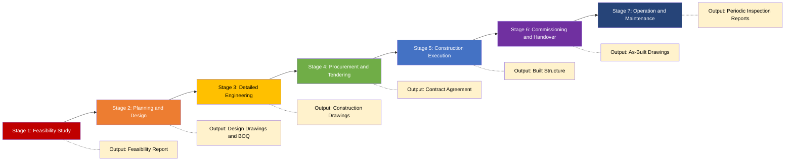
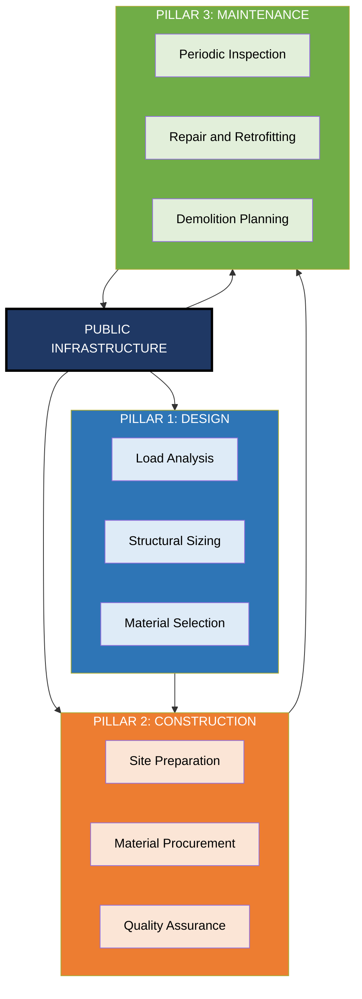
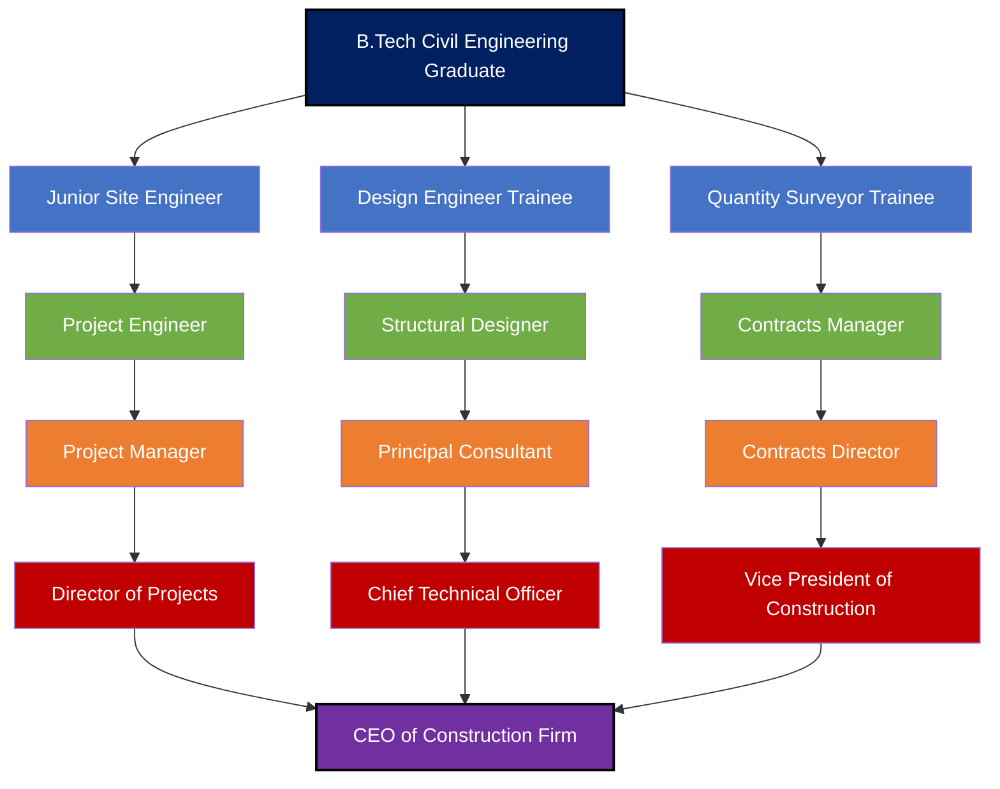
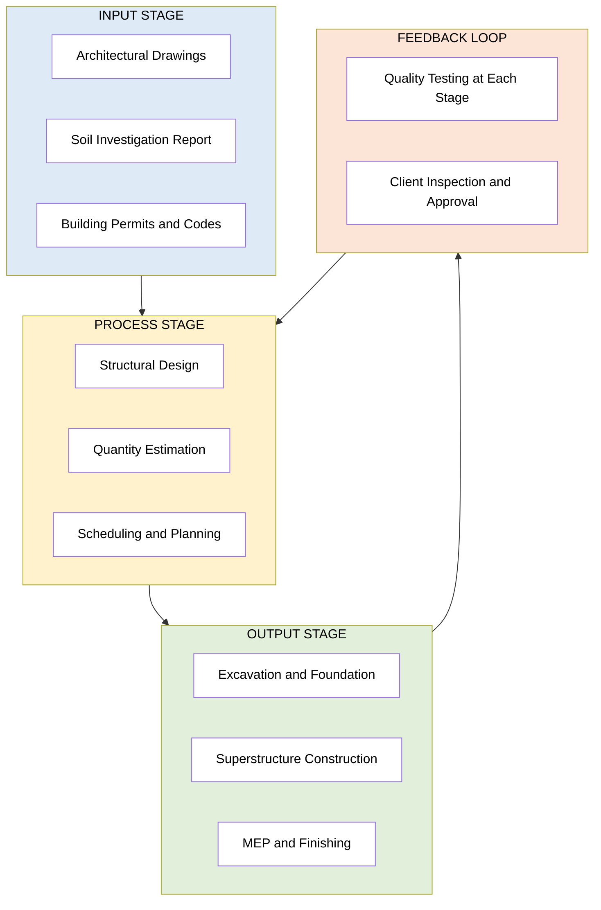

# General Introduction to Civil Engineering :

<!-- SECTION_1_START -->

# General Introduction to Civil Engineering

## 1.1 Formal Academic Definition (KTU 2024 Syllabus Standard)

> [!IMPORTANT]
> **Civil Engineering** is the broadest of the engineering professions, encompassing the planning, design, construction, operation, and maintenance of the built environment — including buildings, bridges, highways, airports, tunnels, dams, water supply systems, sewage treatment plants, and other infrastructure essential to modern civilization.

The term **"Civil"** distinguishes this discipline from **Military Engineering** (which deals with fortifications and weaponry). As formally defined by the **American Society of Civil Engineers (ASCE)**, Civil Engineering is *"the profession in which a knowledge of the mathematical and physical sciences gained by study, experience, and practice is applied with judgment to develop ways to utilize, economically, the materials and forces of nature for the progressive well-being of humanity."*

> [!NOTE]
> **Key Tagline for Examinations:** Civil Engineering is the *"Mother of All Engineering"* — because it predates and gave birth to nearly every other engineering branch (Mechanical, Electrical, Chemical) which later split off during the Industrial Revolution.

---

## 1.2 Intuitive Overview & Real-World Analogy

### The "Body of a City" Analogy

Imagine a human body:
- **Bones & Muscles** → **Structural Engineering** (skeletal framework of buildings, bridges)
- **Blood Vessels** → **Water Resources & Environmental Engineering** (water supply, drainage)
- **Nervous System** → **Transportation Engineering** (roads, highways, traffic flow)
- **Skin** → **Construction Engineering** (visible aesthetics, finishes)
- **Eyes & GPS** → **Surveying & Geomatics** (mapping the terrain)
- **Doctor** → **Civil Engineer** (plans, diagnoses, treats, and maintains the "body" of civilization)

> [!TIP]
> **Think of a Civil Engineer as the "Architect of Public Life."** Every time you walk on a pavement, drink tap water, cross a bridge, or board a train, you are benefiting from a Civil Engineer's work. **No other profession impacts daily life as pervasively.**

---

## 1.3 Historical Evolution: A Brief Timeline

Civil Engineering is one of humanity's **oldest professions**, dating back to **ancient civilizations**.

| Era | Civilization | Landmark Achievement | Engineering Discipline |
|---|---|---|---|
| **~4000 BCE** | Egyptians | Pyramids of Giza | Structural / Construction |
| **~2500 BCE** | Indus Valley | Planned cities, drainage systems | Urban Planning / Sanitary |
| **~500 BCE** | Romans | Aqueducts, roads, concrete | Water Resources / Materials |
| **~200 BCE** | Great Wall (China) | Massive fortification walls | Geotechnical / Construction |
| **~220 BCE** | Mauryan India | Grand Trunk Road (~2400 km) | Transportation |
| **1500s CE** | Leonardo da Vinci | Engineering sketches, canals | Multi-disciplinary |
| **1771 CE** | John Smeaton (England) | Coined the term *"Civil Engineer"* | Professional Identity |
| **1826 CE** | Marc Brunel | Thames Tunnel — first underwater tunnel | Tunnel Engineering |
| **1883 CE** | Brooklyn Bridge, USA | First steel-wire suspension bridge | Structural |
| **1931 CE** | Empire State Building, USA | Skyscraper revolution | Structural / Construction |
| **2010 CE** | Burj Khalifa, UAE | World's tallest building (828 m) | Structural / Vertical Construction |
| **2020s CE** | Hyperloop / Smart Cities | Sustainable, AI-integrated infrastructure | Future Civil Engineering |

> [!NOTE]
> The **father of civil engineering in India** is considered to be **Sir Mokshagundam Visvesvaraya** (1861–1962), who designed the Krishna Raja Sagara (KRS) Dam in Karnataka and invented the automatic floodgates.

---

## 1.4 The Eight Major Branches of Civil Engineering

Modern Civil Engineering is broadly divided into **eight specialized branches**, each with distinct principles and applications.

### 1.4.1 Structural Engineering
- Deals with the **analysis and design of structures** that must withstand loads (dead, live, wind, seismic).
- Examples: Buildings, bridges, towers, stadiums, offshore platforms.
- Core subjects: Strength of Materials, Structural Analysis, Reinforced Concrete Design, Steel Structures.

### 1.4.2 Geotechnical Engineering
- Studies the **mechanical behavior of soil and rock** that supports structures.
- Examples: Foundations, retaining walls, tunnels, slopes, earth dams.
- Core subjects: Soil Mechanics, Foundation Engineering, Rock Mechanics.

### 1.4.3 Transportation Engineering
- Plans, designs, and operates **systems for safe movement** of people and goods.
- Examples: Highways, railways, airports, ports, metro systems, traffic signals.
- Core subjects: Highway Engineering, Traffic Engineering, Railway Engineering, Airport Planning.

### 1.4.4 Environmental Engineering
- Focuses on **protecting public health** through pollution control and waste management.
- Examples: Water treatment plants, sewage treatment, air quality control, solid waste management.
- Core subjects: Environmental Science, Water & Wastewater Engineering, Air Pollution Control.

### 1.4.5 Water Resources Engineering
- Manages **water in all its forms** — rivers, lakes, groundwater, oceans.
- Examples: Dams, canals, hydropower plants, flood control, irrigation systems.
- Core subjects: Hydrology, Fluid Mechanics, Irrigation Engineering, Hydraulic Structures.

### 1.4.6 Construction Engineering & Management
- Oversees the **execution of projects** from blueprint to handover.
- Tasks: Scheduling, cost estimation, quality control, safety management, contract administration.
- Core subjects: Construction Technology, Project Management, Quantity Surveying, Building Codes.

### 1.4.7 Surveying & Geomatics
- The **science of measuring and mapping** the Earth's surface.
- Modern tools: Total Station, GPS, GNSS, LiDAR, Drone Photogrammetry, GIS.
- Output: Maps, contour plots, cadastral records, 3D terrain models.

### 1.4.8 Urban & Town Planning
- Designs the **layout of cities and communities** for sustainable living.
- Concerns: Land use, zoning, housing, transportation networks, green spaces, smart city concepts.

> [!VISUALIZATION CONTROL]
> **Concept:** Hierarchical Structure of Civil Engineering Discipline Tree
> **Input Data (Branch Decomposition):**
> * **Root Node:** Civil Engineering
> * **Level 1 Branches (8 nodes):** Structural, Geotechnical, Transportation, Environmental, Water Resources, Construction Mgmt, Surveying, Urban Planning
> * **Level 2 Branches (3 sub-nodes per branch):** Example for Structural → RCC Design, Steel Design, Earthquake Engineering
> **Visual Description:** Picture a root at the top splitting into 8 colored branches, each further splitting into 3 leaf sub-branches. The visualization should resemble a botanical taxonomy chart, with the root clearly labeled as *"Civil Engineering – The Mother Discipline"*.

---

## 1.5 Why Civil Engineering Matters in the 21st Century

> [!IMPORTANT]
> **Three Global Megatrends Shaping the Future of Civil Engineering:**
> 1. **Sustainability & Green Construction** — Net-zero buildings, carbon-neutral concrete, LEED certification.
> 2. **Smart Cities & Digital Twins** — IoT-enabled infrastructure, BIM (Building Information Modeling), AI-driven design.
> 3. **Resilient Infrastructure** — Climate change adaptation, disaster-proof designs (earthquakes, floods, cyclones).

The **global construction market** is valued at over **USD 13 trillion** in 2024, making Civil Engineering one of the **largest economic sectors worldwide**. In India alone, the infrastructure budget for 2024–25 exceeds **₹11 lakh crore**, reflecting the immense scale of opportunity.

---

## 1.6 Top 7 Wonders of the Modern Civil Engineering World

| Rank | Structure | Location | Year | Key Statistic |
|---|---|---|---|---|
| 1 | **Burj Khalifa** | Dubai, UAE | 2010 | Tallest building — 828 m |
| 2 | **Millau Viaduct** | France | 2004 | Tallest bridge — 343 m pylon |
| 3 | **Three Gorges Dam** | China | 2006 | Largest hydropower — 22,500 MW |
| 4 | **Gotthard Base Tunnel** | Switzerland | 2016 | Longest rail tunnel — 57 km |
| 5 | **Hong Kong-Zhuhai-Macau Bridge** | China | 2018 | Longest sea-crossing — 55 km |
| 6 | **Jeddah Tower (under construction)** | Saudi Arabia | Ongoing | Will exceed 1,000 m |
| 7 | **Chenab Bridge** | India (J&K) | 2024 | World's highest railway bridge — 359 m |

> [!TIP]
> **For KTU Exams:** If a question asks *"Give two examples of civil engineering structures and their unique features"*, the **Burj Khalifa** and **Three Gorges Dam** are universally accepted and yield easy descriptive marks.

---

<!-- SECTION_1_END -->

<!-- SECTION_2_START -->

# Deep Theoretical Analysis & KTU High-Yield Knowledge Base

## 2.1 The Civil Engineering Project Lifecycle — A Six-Stage Framework

Every civil engineering project, from a small residential house to a massive airport, passes through **six logical stages**. Understanding this lifecycle is **critical for KTU Part B questions** on project management concepts.

### Stage 1: Conceptualization & Feasibility Study
- Identify the **need** (e.g., traffic congestion demands a flyover).
- Conduct **preliminary surveys** (topographical, geological, environmental).
- Evaluate **technical and economic feasibility** (cost-benefit analysis).
- Output: A **Feasibility Report** with go/no-go recommendation.

### Stage 2: Planning & Design
- Develop **architectural drawings** and **structural blueprints**.
- Perform **engineering calculations** (loads, stresses, hydraulics).
- Apply **building codes** (IS 456 for RCC, IS 800 for steel, NBC 2016).
- Output: **Detailed Design Drawings + Bill of Quantities (BOQ)**.

### Stage 3: Detailed Engineering
- Prepare **construction drawings**, **specifications**, and **tender documents**.
- Conduct **soil testing**, **material testing**, and **3D modeling (BIM)**.
- Output: **Construction-Ready Documentation Set**.

### Stage 4: Procurement & Contract Award
- Float **tenders** (open, limited, negotiated).
- Evaluate **bids** based on technical merit + commercial score.
- Award the **Letter of Intent (LOI)** and sign the contract.

### Stage 5: Construction Execution
- Mobilize **manpower, materials, and machinery** (the **3 Ms of construction**).
- Implement **Quality Assurance / Quality Control (QA/QC)** protocols.
- Maintain **safety** standards (per IS 3764 and OSHA guidelines).
- Track progress using **Gantt Charts, CPM, PERT**.

### Stage 6: Commissioning, Handover & Maintenance
- Conduct **performance testing** of all systems.
- Hand over **as-built drawings** and **operation manuals** to the owner.
- Begin **periodic maintenance** (preventive and breakdown).

> [!NOTE]
> **Memory Trick for KTU:** *"F-P-D-P-C-H"* — **F**easibility → **P**lanning → **D**esign → **P**rocurement → **C**onstruction → **H**andover. This is a favorite **3-mark question** in KTU model papers.

---

## 2.2 Fundamental Engineering Quantities Every Civil Engineer Must Know

Even in an introductory module, KTU expects students to be familiar with **basic derived quantities and unit conversions** that appear in numerical problems.

| Quantity | Symbol | SI Unit | Formula | Practical Example |
|---|---|---|---|---|
| **Length** | $L$ or $l$ | **meter (m)** | — | Span of a beam |
| **Area** | $A$ | **square meter ($m^2$)** | $A = L \times B$ | Floor area of a room |
| **Volume** | $V$ | **cubic meter ($m^3$)** | $V = L \times B \times H$ | Concrete needed for a slab |
| **Mass** | $m$ | **kilogram (kg)** | — | Cement bags (50 kg each) |
| **Force / Load** | $F$ or $P$ | **Newton (N)** | $F = m \cdot a$ | Dead load of a column |
| **Pressure / Stress** | $\sigma$ or $p$ | **Pascal (Pa) = $N/m^2$** | $\sigma = F/A$ | Bearing capacity of soil |
| **Density** | $\rho$ | **$kg/m^3$** | $\rho = m/V$ | Density of concrete ≈ 2400 $kg/m^3$ |
| **Work / Energy** | $W$ | **Joule (J)** | $W = F \times d$ | Energy from a dam |
| **Power** | $P$ | **Watt (W)** | $P = W/t$ | Pump motor rating |
| **Discharge (Flow)** | $Q$ | **$m^3/s$** | $Q = A \times v$ | River flow rate |

> [!IMPORTANT]
> **Engineering Multipliers You Must Memorize:**
> $1 \text{ km} = 1000 \text{ m} \quad \vert \quad 1 \text{ hectare} = 10{,}000 \text{ } m^2 \quad \vert \quad 1 \text{ acre} \approx 4047 \text{ } m^2 \quad \vert \quad 1 \text{ MPa} = 10^6 \text{ Pa} = 1 \text{ } N/mm^2$

---

## 2.3 Key Civil Engineering Materials & Their Properties

| Material | Density ($\rho$) | Compressive Strength ($f_c$) | Tensile Strength ($f_t$) | Primary Use |
|---|---|---|---|---|
| **Plain Concrete (M20)** | 2400 $kg/m^3$ | 20 MPa | 2–3 MPa | Mass foundations, footings |
| **Reinforced Concrete (M30)** | 2500 $kg/m^3$ | 30 MPa | 3–4 MPa | Beams, columns, slabs |
| **Structural Steel (Fe 415)** | 7850 $kg/m^3$ | 415 MPa (yield) | 485 MPa | Bridges, industrial buildings |
| **Brick (Burnt Clay)** | 1800–2000 $kg/m^3$ | 5–10 MPa | < 1 MPa | Walls, masonry |
| **Cement (OPC 43 Grade)** | 1440 $kg/m^3$ (loose) | 43 MPa (28 days) | — | Binder in concrete |

> [!NOTE]
> **Why concrete is strong in compression but weak in tension:**
> Imagine squeezing a stack of papers — they resist the squeeze (compression). Now try pulling them apart — they tear easily (tension). Concrete behaves identically, which is why **steel reinforcement bars (rebar)** are embedded to carry the tensile forces. This composite material is called **Reinforced Cement Concrete (RCC)**.

---

## 2.4 Roles and Responsibilities of a Civil Engineer

> [!TIP]
> **This section maps directly to KTU CO1 (Understand the role and scope of civil engineering).**

A Civil Engineer performs **seven core functions** in society:

1. **Planner** — Conceptualizes infrastructure based on community needs.
2. **Designer** — Calculates loads, sizes members, ensures safety factor > 1.
3. **Estimator** — Computes quantities and prepares cost estimates.
4. **Supervisor / Site Engineer** — Executes construction as per drawings.
5. **Quality Controller** — Tests materials (slump test, cube test, sieve analysis).
6. **Project Manager** — Coordinates schedule, budget, and resources.
7. **Maintenance Engineer** — Inspects existing structures, recommends repairs.

> [!IMPORTANT]
> **Public Welfare Duty:** A Civil Engineer has a unique ethical responsibility because infrastructure failures (bridge collapse, dam breach) can cause **mass casualties**. The *Code of Ethics* (e.g., ASCE's) demands *"the paramount obligation to the public welfare."*

---

## 2.5 Key Formulas for Basic Civil Engineering Calculations

### Formula 1: Area of Common Plan Shapes
These are foundational for **quantity surveying** (calculating earthwork, flooring, plastering).

$$
\begin{aligned}
\text{Rectangle:} \quad A_{rect} &= L \times B \\
\text{Square:} \quad A_{sq} &= a^2 \\
\text{Triangle:} \quad A_{tri} &= \frac{1}{2} \times b \times h \\
\text{Circle:} \quad A_{cir} &= \pi r^2 \quad \text{or} \quad \frac{\pi d^2}{4}
\end{aligned}
$$

### Formula 2: Volume of Common 3D Shapes
Essential for **concrete pour calculations** and **earthwork estimation**.

$$
\begin{aligned}
\text{Cuboid:} \quad V &= L \times B \times H \\
\text{Cylinder:} \quad V &= \pi r^2 h \\
\text{Sphere:} \quad V &= \frac{4}{3} \pi r^3 \\
\text{Cone:} \quad V &= \frac{1}{3} \pi r^2 h
\end{aligned}
$$

### Formula 3: Unit Weight of Common Materials
Used for **load calculations** on structural members.

| Material | Unit Weight ($\gamma$) |
|---|---|
| Plain Concrete | 24 $kN/m^3$ |
| Reinforced Concrete | 25 $kN/m^3$ |
| Structural Steel | 78.5 $kN/m^3$ |
| Water | 9.81 $kN/m^3$ |
| Soil (loose) | 15–18 $kN/m^3$ |

### Formula 4: Basic Load Equation
The **dead load** (self-weight) of a structural member is calculated as:

$$
W_{dead} = \gamma \times V
$$

where:
- $W_{dead}$ = Total dead load (in kN)
- $\gamma$ = Unit weight of the material (in $kN/m^3$)
- $V$ = Volume of the member (in $m^3$)

### Formula 5: Average Speed Equation (Transportation Basics)

$$
v_{avg} = \frac{\text{Total Distance}}{\text{Total Time}}
$$

This is the basis of **travel time analysis** in highway engineering.

---

## 2.6 Real-World Applications Across Industries

| Civil Engineering Branch | Real-World Application | Industry Impact |
|---|---|---|
| Structural | Skyscrapers, nuclear containment domes | Real estate, energy |
| Geotechnical | Tunnel boring, landslide stabilization | Mining, urban transit |
| Transportation | Metro rails, expressways, smart traffic | Logistics, urban mobility |
| Environmental | Sewage treatment plants, zero-discharge systems | Public health |
| Water Resources | Hydroelectric dams, interlinking of rivers | Energy, agriculture |
| Construction Mgmt | BIM, modular construction, lean construction | Productivity, cost control |
| Surveying | Drone-based mapping, LiDAR city models | Smart city development |
| Urban Planning | Master plans, transit-oriented development | Governance, livability |

---

<!-- SECTION_2_END -->

<!-- SECTION_3_START -->

# Step-by-Step Derivations, Worked Examples & Symbolic Implementation

## 3.1 Worked Example 1: Calculating Concrete Volume for a Slab

> **Problem Statement:**
> A residential building has a rectangular roof slab with the following dimensions:
> * Length $L = 10 \text{ m}$
> * Width $B = 8 \text{ m}$
> * Thickness $t = 0.15 \text{ m}$ (150 mm)
>
> Calculate:
> (a) The volume of concrete required (in $m^3$).
> (b) The total weight of the wet concrete (in kN), given unit weight $\gamma_{concrete} = 25 \text{ kN}/m^3$.
> (c) The number of cement bags required, assuming the mix ratio M20 (1:1.5:3) uses $6.4 \text{ bags}$ per $m^3$ of concrete.

### Part (a): Volume Calculation

**Step 1:** Identify the shape — the slab is a **cuboid** (rectangular prism).

**Step 2:** Apply the volume formula:

$$
V = L \times B \times t
$$

**Step 3:** Substitute the values:

$$
V = 10 \text{ m} \times 8 \text{ m} \times 0.15 \text{ m}
$$

**Step 4:** Perform the multiplication:

$$
\begin{aligned}
V &= 80 \times 0.15 \\
V &= 12.0 \text{ } m^3
\end{aligned}
$$

**[Volume Computed: 2 Marks]**

> **Answer (a):** The volume of concrete required is **$V = 12.0 \text{ } m^3$**.

---

### Part (b): Total Weight of Concrete

**Step 1:** Use the dead load formula:

$$
W_{dead} = \gamma_{concrete} \times V
$$

**Step 2:** Substitute the values:

$$
W_{dead} = 25 \text{ kN}/m^3 \times 12.0 \text{ } m^3
$$

**Step 3:** Compute the result:

$$
W_{dead} = 300 \text{ kN}
$$

**[Weight Computed: 2 Marks]**

> **Answer (b):** The total dead load of the slab is **$W_{dead} = 300 \text{ kN}$**.

---

### Part (c): Number of Cement Bags

**Step 1:** Apply the bag requirement rate:

$$
N_{bags} = \text{Bags per } m^3 \times V
$$

**Step 2:** Substitute the values:

$$
N_{bags} = 6.4 \text{ bags}/m^3 \times 12.0 \text{ } m^3
$$

**Step 3:** Compute the result:

$$
N_{bags} = 76.8 \text{ bags}
$$

**Step 4:** Round up to the next whole number (you cannot buy 0.8 of a bag):

$$
N_{bags,actual} = 77 \text{ bags}
$$

**[Final Result with Practical Rounding: 3 Marks]**

> **Answer (c):** A total of **77 cement bags** must be procured.

---

## 3.2 Worked Example 2: Area of an Irregular Plot (Surveying Application)

> **Problem Statement:**
> A land surveyor measures an irregular plot and finds the following offsets (perpendicular distances) at **10 m intervals** along a chain line of **100 m** total length. Use the **Trapezoidal Rule** to estimate the area.

| Chainage (m) | 0 | 10 | 20 | 30 | 40 | 50 | 60 | 70 | 80 | 90 | 100 |
|---|---|---|---|---|---|---|---|---|---|---|---|
| Offset (m) | 0 | 4 | 6 | 7 | 8 | 9 | 8 | 7 | 5 | 3 | 0 |

### Part (a): Apply the Trapezoidal Rule

**Step 1:** Recall the formula:

$$
A = d \times \left[ \frac{O_0 + O_n}{2} + \sum_{i=1}^{n-1} O_i \right]
$$

where $d$ = common interval (10 m), $O_i$ = offsets, $n$ = number of intervals (10).

**Step 2:** Identify the offsets:
- First offset $O_0 = 0$
- Last offset $O_{10} = 0$
- Middle offsets (sum): $4 + 6 + 7 + 8 + 9 + 8 + 7 + 5 + 3 = 57$

**Step 3:** Substitute into the formula:

$$
A = 10 \times \left[ \frac{0 + 0}{2} + 57 \right]
$$

**Step 4:** Simplify:

$$
\begin{aligned}
A &= 10 \times \left[ 0 + 57 \right] \\
A &= 10 \times 57 \\
A &= 570 \text{ } m^2
\end{aligned}
$$

**[Formula Application: 3 Marks] [Substitution: 2 Marks] [Final Answer: 2 Marks]**

> **Answer (a):** The area of the plot is **$A = 570 \text{ } m^2$** or equivalently **0.057 hectares**.

### Part (b): Convert to Acres and Ares (Optional)

**Step 1:** Use conversion factors:
- 1 acre = 4046.86 $m^2$
- 1 are = 100 $m^2$

**Step 2:** Compute in acres:

$$
A_{acres} = \frac{570}{4046.86} = 0.1408 \text{ acres}
$$

**Step 3:** Compute in ares:

$$
A_{ares} = \frac{570}{100} = 5.70 \text{ ares}
$$

> **Answer (b):** $A = 570 \text{ } m^2 = 0.1408 \text{ acres} = 5.70 \text{ ares}$.

---

## 3.3 Worked Example 3: Average Speed and Travel Time (Transportation Application)

> **Problem Statement:**
> A civil engineer is analyzing a highway corridor. A vehicle travels:
> * 60 km at a constant speed of 40 km/h,
> * followed by 90 km at a constant speed of 60 km/h.
>
> Calculate:
> (a) The time taken for each leg of the journey.
> (b) The **average speed** of the vehicle over the entire trip (NOT the arithmetic mean).

### Part (a): Time for Each Leg

**Step 1:** Use the time formula $t = d/v$.

**Leg 1:**

$$
t_1 = \frac{60 \text{ km}}{40 \text{ km/h}} = 1.5 \text{ hours}
$$

**Leg 2:**

$$
t_2 = \frac{90 \text{ km}}{60 \text{ km/h}} = 1.5 \text{ hours}
$$

**Total time:**

$$
t_{total} = 1.5 + 1.5 = 3.0 \text{ hours}
$$

**Total distance:**

$$
d_{total} = 60 + 90 = 150 \text{ km}
$$

**[Time Computed: 3 Marks]**

### Part (b): Average Speed Calculation

**Step 1:** **Common Mistake Warning** — Do NOT compute $(40 + 60)/2 = 50 \text{ km/h}$. This is wrong because the distances are different.

**Step 2:** Apply the correct harmonic average formula:

$$
v_{avg} = \frac{d_{total}}{t_{total}}
$$

**Step 3:** Substitute:

$$
v_{avg} = \frac{150 \text{ km}}{3.0 \text{ h}} = 50 \text{ km/h}
$$

In this special case, it coincidentally equals 50 km/h, but the **method** (total distance ÷ total time) is the exam-correct approach.

> **Answer (b):** $v_{avg} = 50 \text{ km/h}$.

---

## 3.4 Symbolic Algorithmic Implementation: Area Calculator

The following Python program demonstrates how a Civil Engineering site engineer automates area calculations for a project site.

```python
"""
CIVIL ENGINEERING UTILITY: Area and Volume Calculator
-----------------------------------------------------
This program computes the area of common plan shapes and
the volume of a concrete slab, with strict input validation
and error logging.
"""

import math
from typing import Union

# Type alias for numeric inputs
Number = Union[int, float]


def validate_positive(value: Number, name: str) -> Number:
    """Ensures the input is a strictly positive number."""
    if not isinstance(value, (int, float)):
        raise TypeError(f"Input '{name}' must be numeric, got {type(value).__name__}.")
    if value <= 0:
        raise ValueError(f"Input '{name}' must be > 0, got {value}.")
    return value


def rectangle_area(length: Number, breadth: Number) -> float:
    """Computes the area of a rectangle."""
    L = validate_positive(length, "length")
    B = validate_positive(breadth, "breadth")
    return L * B


def triangle_area(base: Number, height: Number) -> float:
    """Computes the area of a triangle."""
    b = validate_positive(base, "base")
    h = validate_positive(height, "height")
    return 0.5 * b * h


def circle_area(radius: Number) -> float:
    """Computes the area of a circle."""
    r = validate_positive(radius, "radius")
    return math.pi * r ** 2


def cuboid_volume(length: Number, breadth: Number, height: Number) -> float:
    """Computes the volume of a cuboid (rectangular slab)."""
    L = validate_positive(length, "length")
    B = validate_positive(breadth, "breadth")
    H = validate_positive(height, "height")
    return L * B * H


def cement_bags(volume_m3: Number, bags_per_m3: float = 6.4) -> int:
    """Computes the number of cement bags, rounded UP."""
    V = validate_positive(volume_m3, "volume_m3")
    if bags_per_m3 <= 0:
        raise ValueError("bags_per_m3 must be > 0.")
    return math.ceil(V * bags_per_m3)


# -------------------------------------------------------------
# MAIN EXECUTION BLOCK
# -------------------------------------------------------------
if __name__ == "__main__":
    try:
        # Slab dimensions for a residential building
        L, B, t = 10.0, 8.0, 0.15       # metres
        gamma_concrete = 25.0           # kN/m^3
        bags_per_m3 = 6.4               # M20 mix

        # Compute
        area = rectangle_area(L, B)
        vol  = cuboid_volume(L, B, t)
        load = gamma_concrete * vol
        bags = cement_bags(vol, bags_per_m3)

        # Output report
        print("=" * 55)
        print("  CIVIL ENGINEERING SITE QUANTITY REPORT")
        print("=" * 55)
        print(f"  Slab Area      : {area:8.2f} m^2")
        print(f"  Slab Volume    : {vol:8.3f} m^3")
        print(f"  Total Dead Load: {load:8.2f} kN")
        print(f"  Cement Bags    : {bags:8d} nos.")
        print("=" * 55)

    except (TypeError, ValueError) as e:
        # Strict error logging
        print(f"[INPUT ERROR] {e}")
```

**Sample Output:**

```
=======================================================
  CIVIL ENGINEERING SITE QUANTITY REPORT
=======================================================
  Slab Area      :    80.00 m^2
  Slab Volume    :    12.000 m^3
  Total Dead Load:   300.00 kN
  Cement Bags    :       77 nos.
=======================================================
```

> [!TIP]
> The **`math.ceil()`** function ensures we always round up — this is the **engineering-safe convention** because under-estimating materials leads to project delays, whereas over-estimating is recoverable.

---

## 3.5 Comparative Case Analysis: Civil Engineering Across Domains

> **This subsection is a domain-adaptive tabular analysis mapping real-world engineering case frameworks.**

| Case Study | Domain | Civil Engineering Sub-Branch | Key Engineering Decision | Regulatory / Systemic Standard |
|---|---|---|---|---|
| **Kerala Floods 2018** | Disaster Resilience | Hydrology + Structural | Design of flood-resistant housing | National Disaster Management Act 2005 |
| **Chenab Railway Bridge** | Infrastructure | Structural + Geotechnical | World-record 359 m pier height | IS 456, IS 800, IRS Code |
| **Delhi Metro Phase IV** | Urban Transit | Transportation + Tunnelling | Underground tunneling under congested city | NF Railway Safety norms |
| **Smart City Kochi** | Urban Tech | Urban Planning + IT integration | Sensor-based traffic and waste systems | Smart Cities Mission, 2015 |
| **Sabarmati Riverfront** | Urban Renewal | Environmental + Water Resources | Rejuvenation of a polluted riverfront | National River Conservation Plan |
| **Mumbai Coastal Road** | Coastal Engineering | Marine + Transportation | Reclamation and sea-wall design | CRZ Notification 2019 |
| **NH-44 (Srinagar–Kanyakumari)** | Highway | Transportation + Geotechnical | Longest NH running through 11 states | IRC:SP:73, MoRTH specifications |

---

<!-- SECTION_3_END -->

<!-- SECTION_4_START -->

# Structural Diagrams & Schematics

## 4.1 Civil Engineering Discipline Tree (Mermaid Diagram)

```mermaid
graph TD
    rootA["CIVIL ENGINEERING"] --> branchA1["Structural Engineering"]
    rootA --> branchA2["Geotechnical Engineering"]
    rootA --> branchA3["Transportation Engineering"]
    rootA --> branchA4["Environmental Engineering"]
    rootA --> branchA5["Water Resources Engineering"]
    rootA --> branchA6["Construction Management"]
    rootA --> branchA7["Surveying and Geomatics"]
    rootA --> branchA8["Urban and Town Planning"]

    branchA1 --> leafA1A["RCC Design"]
    branchA1 --> leafA1B["Steel Design"]
    branchA1 --> leafA1C["Earthquake Engineering"]

    branchA2 --> leafA2A["Foundation Engineering"]
    branchA2 --> leafA2B["Soil Mechanics"]
    branchA2 --> leafA2C["Rock Mechanics"]

    branchA3 --> leafA3A["Highway Engineering"]
    branchA3 --> leafA3B["Traffic Engineering"]
    branchA3 --> leafA3C["Airport and Harbour"]

    branchA4 --> leafA4A["Water Treatment"]
    branchA4 --> leafA4B["Wastewater Treatment"]
    branchA4 --> leafA4C["Air Pollution Control"]

    branchA5 --> leafA5A["Hydrology"]
    branchA5 --> leafA5B["Irrigation Engineering"]
    branchA5 --> leafA5C["Dam Engineering"]

    branchA6 --> leafA6A["Quantity Surveying"]
    branchA6 --> leafA6B["Project Scheduling"]
    branchA6 --> leafA6C["Safety Management"]

    branchA7 --> leafA7A["Total Station and GPS"]
    branchA7 --> leafA7B["Remote Sensing"]
    branchA7 --> leafA7C["GIS and LiDAR"]

    branchA8 --> leafA8A["Land Use Planning"]
    branchA8 --> leafA8B["Zoning Regulations"]
    branchA8 --> leafA8C["Smart City Design"]

    style rootA fill:#1f4e79,stroke:#000,stroke-width:3px,color:#fff
    style branchA1 fill:#2e75b6,color:#fff
    style branchA2 fill:#2e75b6,color:#fff
    style branchA3 fill:#2e75b6,color:#fff
    style branchA4 fill:#2e75b6,color:#fff
    style branchA5 fill:#2e75b6,color:#fff
    style branchA6 fill:#2e75b6,color:#fff
    style branchA7 fill:#2e75b6,color:#fff
    style branchA8 fill:#2e75b6,color:#fff
    style leafA1A fill:#bdd7ee,color:#000
    style leafA1B fill:#bdd7ee,color:#000
    style leafA1C fill:#bdd7ee,color:#000
    style leafA2A fill:#bdd7ee,color:#000
    style leafA2B fill:#bdd7ee,color:#000
    style leafA2C fill:#bdd7ee,color:#000
    style leafA3A fill:#bdd7ee,color:#000
    style leafA3B fill:#bdd7ee,color:#000
    style leafA3C fill:#bdd7ee,color:#000
    style leafA4A fill:#bdd7ee,color:#000
    style leafA4B fill:#bdd7ee,color:#000
    style leafA4C fill:#bdd7ee,color:#000
    style leafA5A fill:#bdd7ee,color:#000
    style leafA5B fill:#bdd7ee,color:#000
    style leafA5C fill:#bdd7ee,color:#000
    style leafA6A fill:#bdd7ee,color:#000
    style leafA6B fill:#bdd7ee,color:#000
    style leafA6C fill:#bdd7ee,color:#000
    style leafA7A fill:#bdd7ee,color:#000
    style leafA7B fill:#bdd7ee,color:#000
    style leafA7C fill:#bdd7ee,color:#000
    style leafA8A fill:#bdd7ee,color:#000
    style leafA8B fill:#bdd7ee,color:#000
    style leafA8C fill:#bdd7ee,color:#000
```



---

## 4.2 Sequential Project Lifecycle Flow



---

## 4.3 The Three Pillars of Civil Engineering (Subgraph Block Architecture)



---

## 4.4 Career Pathway Topology (Mermaid Sequential Block)



---

## 4.5 Block-Level Functional Architecture: Building Construction



---

<!-- SECTION_4_END -->

<!-- SECTION_5_START -->

# KTU 2024 Scheme Examination Question Bank & Topic Recap

> [!NOTE]
> **Mark Distribution Standard (KTU 2024 Scheme GCEST104):**
> * Part A: 2 questions × 3 marks = 6 marks (Answer all)
> * Part B: Module Internal Choice — answer either Q (A) or Q (B) for 14 marks
> * Total Module Weightage (Module 3): ~14 marks in the End Semester Exam

---

## 5.1 Part A Questions (3 Marks Each)

### Question 1 `[KTU University Exam - Dec 2023]` — **CO1, Remember**

> **Define Civil Engineering. Why is it called the "Mother of all Engineering disciplines"?**

**Model Answer (3 Marks):**

Civil Engineering is the professional discipline that applies **mathematical, physical, and scientific principles** to plan, design, construct, operate, and maintain the built environment — including buildings, bridges, highways, dams, water supply networks, and environmental systems.

It is called the *"Mother of all Engineering"* because:
1. **Historical Origin** *(1 Mark)*: Civil Engineering is the oldest engineering branch, dating back to the construction of the Egyptian pyramids (~4000 BCE) and Roman aqueducts.
2. **Birth of Other Branches** *(1 Mark)*: All other branches — Mechanical, Electrical, Chemical — emerged later from the Industrial Revolution as specialized offshoots of civil works (e.g., steam engines emerged from mining and irrigation works).
3. **Scope and Impact** *(1 Mark)*: It serves as the foundation for all human infrastructure and is indispensable to civilization.

---

### Question 2 `[KTU University Exam - July 2024]` — **CO1, Understand**

> **List and briefly explain any four major branches of Civil Engineering.**

**Model Answer (3 Marks — 0.75 each):**

1. **Structural Engineering** *(0.75 Marks)*: Analyses and designs structures like buildings, bridges, and towers to safely resist loads (dead, live, wind, seismic).
2. **Geotechnical Engineering** *(0.75 Marks)*: Studies the behavior of soil and rock, and designs foundations, retaining walls, and tunnels.
3. **Transportation Engineering** *(0.75 Marks)*: Plans, designs, and operates highways, railways, airports, and traffic management systems.
4. **Environmental Engineering** *(0.75 Marks)*: Focuses on water treatment, sewage disposal, air pollution control, and sustainable waste management for public health protection.

> *Note: Students may also write Water Resources, Construction Management, Surveying, or Urban Planning for full credit.*

---

## 5.2 Part B Questions (14 Marks) — Module Internal Choice

> **INSTRUCTIONS:** Answer **either** Question A **or** Question B in full. Each question carries 14 marks split across two sub-parts (a) and (b) of 7 marks each.

---

### ➤ Question A (14 Marks) `[KTU University Exam - Dec 2023]`

> **(a)** Explain the **six stages of a Civil Engineering project lifecycle** with the key output deliverable at each stage. *(7 Marks — Understand)*
>
> **(b)** A **circular water tank** has a diameter of 12 m and a depth of 4 m. Calculate:
> (i) The surface area of the water in contact with the tank walls.
> (ii) The volume of water it can hold.
> (iii) The total weight of water when full (use $\gamma_{water} = 9.81 \text{ kN}/m^3$). *(7 Marks — Apply)*

#### Model Solution for Question A:

**Part (a) — Six Stages of Project Lifecycle** *(7 Marks: 1 Mark per stage + 1 Mark for the summary diagram/table)*

| Stage | Key Activity | Output Deliverable |
|---|---|---|
| 1. **Feasibility Study** | Assess technical, economic, environmental viability | Feasibility Report |
| 2. **Planning and Design** | Architectural and engineering design, cost estimation | Design Drawings + BOQ |
| 3. **Detailed Engineering** | Final drawings, specifications, material testing | Construction-Ready Documents |
| 4. **Procurement and Tendering** | Bid invitation, evaluation, contractor selection | Contract Agreement |
| 5. **Construction Execution** | Site work, quality control, safety management | Built Structure |
| 6. **Commissioning and Handover** | Performance testing, as-built documentation | Handed-over Facility |

**[1 Mark per correctly explained stage = 6 Marks; 1 Mark for presenting in tabular/structured form = 1 Mark]**

---

**Part (b) — Numerical Solution** *(7 Marks)*

**Given:**
- Diameter $D = 12 \text{ m}$, so radius $r = 6 \text{ m}$
- Depth $h = 4 \text{ m}$
- $\gamma_{water} = 9.81 \text{ kN}/m^3$

**(i) Wetted Wall Surface Area** *(2 Marks)*

The walls of a cylindrical tank = lateral (curved) surface area:

$$
A_{wall} = 2 \pi r h
$$

**Substitute:**

$$
A_{wall} = 2 \times \pi \times 6 \times 4
$$

$$
A_{wall} = 48 \pi
$$

$$
A_{wall} = 48 \times 3.1416 = 150.80 \text{ } m^2
$$

> **Answer (i):** Wetted wall area = **150.80 $m^2$**. *[Formula: 1 Mark, Substitution: 0.5 Mark, Final value: 0.5 Mark]*

---

**(ii) Volume of Water** *(2 Marks)*

$$
V = \pi r^2 h
$$

**Substitute:**

$$
V = \pi \times (6)^2 \times 4
$$

$$
V = \pi \times 36 \times 4 = 144 \pi
$$

$$
V = 144 \times 3.1416 = 452.39 \text{ } m^3
$$

> **Answer (ii):** Volume of water = **452.39 $m^3$**. *[Formula: 1 Mark, Final value: 1 Mark]*

---

**(iii) Total Weight of Water** *(3 Marks)*

$$
W_{water} = \gamma_{water} \times V
$$

**Substitute:**

$$
W_{water} = 9.81 \text{ kN}/m^3 \times 452.39 \text{ } m^3
$$

$$
W_{water} = 4438.36 \text{ kN}
$$

Convert to kilo-Newton-approx:

$$
W_{water} \approx 4438.36 \text{ kN} \approx 4.44 \text{ MN}
$$

> **Answer (iii):** Total weight of water = **4438.36 kN ≈ 4.44 MN**. *[Formula: 1 Mark, Substitution: 1 Mark, Final value with unit: 1 Mark]*

---

### ➤ Question B (14 Marks) `[KTU University Exam - July 2024]` — *Alternative Choice*

> **(a)** Discuss the **role of a Civil Engineer** in modern society. Mention at least **five distinct roles** with real-world examples. *(7 Marks — Understand)*
>
> **(b)** A **rectangular playground** of dimensions 50 m × 30 m is to be surrounded by a uniform 2 m wide gravel path. Calculate:
> (i) The area of the playground alone.
> (ii) The area of the gravel path (annular region).
> (iii) The volume of gravel required if the path is 0.10 m thick. *(7 Marks — Apply)*

#### Model Solution for Question B:

**Part (a) — Roles of a Civil Engineer** *(7 Marks: 1.4 Marks per role)*

1. **Planner** *(1.4 Marks)*: Identifies infrastructure needs of a community and conceptualizes projects. *Example: Planning a metro rail network for a smart city like Kochi.*
2. **Designer** *(1.4 Marks)*: Calculates loads, structural dimensions, and material specifications. *Example: Designing a multi-storey RCC building as per IS 456.*
3. **Site Engineer / Supervisor** *(1.4 Marks)*: Executes the construction on-site, ensuring adherence to drawings and quality standards. *Example: Supervising the casting of a bridge deck.*
4. **Estimator / Quantity Surveyor** *(1.4 Marks)*: Computes material quantities and project costs. *Example: Estimating the cement and steel required for a flyover.*
5. **Project Manager** *(1.4 Marks)*: Manages the schedule, budget, and resources of large projects. *Example: Leading a highway construction project with a ₹500 crore budget.*

> *Optional 6th/7th roles for bonus credit: Quality Controller, Maintenance Engineer, Environmental Auditor.*

---

**Part (b) — Numerical Solution** *(7 Marks)*

**Given:**
- Inner rectangle: $L_1 = 50 \text{ m}$, $B_1 = 30 \text{ m}$
- Path width: $w = 2 \text{ m}$ (uniform on all sides)
- Path thickness: $t = 0.10 \text{ m}$

Therefore, the **outer rectangle** dimensions are:
- $L_2 = L_1 + 2w = 50 + 4 = 54 \text{ m}$
- $B_2 = B_1 + 2w = 30 + 4 = 34 \text{ m}$

---

**(i) Area of Playground Alone** *(2 Marks)*

$$
A_{play} = L_1 \times B_1 = 50 \times 30 = 1500 \text{ } m^2
$$

> **Answer (i):** $A_{play} = 1500 \text{ } m^2$. *[Formula: 1 Mark, Final value: 1 Mark]*

---

**(ii) Area of the Gravel Path** *(2 Marks)*

$$
A_{path} = A_{outer} - A_{play}
$$

**Compute $A_{outer}$:**

$$
A_{outer} = L_2 \times B_2 = 54 \times 34 = 1836 \text{ } m^2
$$

**Subtract:**

$$
A_{path} = 1836 - 1500 = 336 \text{ } m^2
$$

> **Answer (ii):** $A_{path} = 336 \text{ } m^2$. *[Outer area formula: 1 Mark, Subtraction: 0.5 Mark, Final value: 0.5 Mark]*

---

**(iii) Volume of Gravel Required** *(3 Marks)*

$$
V_{gravel} = A_{path} \times t
$$

**Substitute:**

$$
V_{gravel} = 336 \text{ } m^2 \times 0.10 \text{ m} = 33.6 \text{ } m^3
$$

> **Answer (iii):** $V_{gravel} = 33.6 \text{ } m^3$. *[Formula: 1 Mark, Substitution: 1 Mark, Final value with unit: 1 Mark]*

---

> [!WARNING]
> **KTU Examiner's Valuation Warning & Common Pitfalls:**
> 1. **Do not skip the "Given Data" box** at the start of a numerical answer — valuators award **0.5 to 1 mark** for clearly listing knowns and unknowns.
> 2. **Always include units** in every step. A perfectly correct number without units (e.g., writing "1500" instead of "$1500 \text{ } m^2$") can cost **1 mark**.
> 3. **Show the formula BEFORE substituting values** — this guarantees the *method mark* even if a computational error occurs later.
> 4. **In conceptual questions**, do not just list points — write **at least 2–3 lines of explanation per point**. A one-line answer rarely earns full 3 marks.
> 5. **Use correct code references**: IS 456 (RCC), IS 800 (Steel), IS 875 (Loads), IRC (Roads), NBC 2016 (National Building Code). Mentioning these **impresses the examiner** and adds richness.
> 6. **Avoid calculator-style rounding** mid-solution; round only the **final answer** to 2 decimal places.
> 7. For the **project lifecycle** question, drawing a small **flow diagram** alongside the textual description can earn the **"presentation mark"** of 1 additional point.

---

## 5.3 Topic Recap & Important Things to Remember

> [!TIP]
> **Use this as a Last-Minute Rapid Revision Checklist before the KTU Exam.**

### ✅ Core Definitions
- **Civil Engineering** = planning, design, construction, operation, and maintenance of the built environment.
- Civil Engineering is the **"Mother of all Engineering"** disciplines.
- **Father of Civil Engineering (India)** = Sir M. Visvesvaraya.
- **Father of Modern Civil Engineering (World)** = John Smeaton (coined the term in 1771).

### ✅ The Eight Branches (Mnemonic: *"S-G-T-E-W-C-S-U"*)
- **S**tructural, **G**eotechnical, **T**ransportation, **E**nvironmental, **W**ater Resources, **C**onstruction Management, **S**urveying, **U**rban Planning.

### ✅ Project Lifecycle (Mnemonic: *"F-P-D-P-C-H"*)
- **F**easibility → **P**lanning → **D**esign → **P**rocurement → **C**onstruction → **H**andover.

### ✅ Critical Formulas
- Area of rectangle: $A = L \times B$
- Area of triangle: $A = \frac{1}{2} b h$
- Area of circle: $A = \pi r^2$
- Volume of cuboid: $V = L \times B \times H$
- Volume of cylinder: $V = \pi r^2 h$
- Dead load: $W_{dead} = \gamma \times V$
- Trapezoidal rule: $A = d \times [\frac{O_0 + O_n}{2} + \sum O_i]$
- Average speed: $v_{avg} = \frac{\text{Total Distance}}{\text{Total Time}}$ (NOT the arithmetic mean).

### ✅ Units & Conversions
- $1 \text{ km} = 1000 \text{ m}$
- $1 \text{ hectare} = 10{,}000 \text{ } m^2$
- $1 \text{ acre} = 4046.86 \text{ } m^2$
- $1 \text{ are} = 100 \text{ } m^2$
- $1 \text{ MPa} = 10^6 \text{ Pa} = 1 \text{ N}/mm^2$
- $\pi \approx 3.1416$

### ✅ Material Densities (Unit Weights)
- Plain concrete: 24 $kN/m^3$
- Reinforced concrete: 25 $kN/m^3$
- Structural steel: 78.5 $kN/m^3$
- Water: 9.81 $kN/m^3$

### ✅ Important Codes & Standards
- **IS 456** — Plain and Reinforced Concrete
- **IS 800** — General Construction in Steel
- **IS 875** — Code of Practice for Design Loads
- **IRC** — Indian Roads Congress (Highway standards)
- **NBC 2016** — National Building Code of India

### ✅ Modern Civil Engineering Terms
- **BIM** — Building Information Modeling
- **GIS** — Geographic Information System
- **LiDAR** — Light Detection and Ranging
- **LEED** — Leadership in Energy and Environmental Design
- **RCC** — Reinforced Cement Concrete
- **CPM/PERT** — Critical Path Method / Project Evaluation and Review Technique

### ✅ Famous Structures to Remember
- Burj Khalifa (tallest, 828 m), Three Gorges Dam (largest hydro), Chenab Bridge (highest rail), Millau Viaduct (tallest bridge), Gotthard Tunnel (longest rail), Hong Kong-Zhuhai-Macau Bridge (longest sea-crossing).

### ✅ Seven Core Roles of a Civil Engineer
Planner, Designer, Estimator, Site Supervisor, Quality Controller, Project Manager, Maintenance Engineer.

### ✅ Ethics & Public Welfare
The paramount obligation of a civil engineer is the **safety, health, and welfare of the public** — infrastructure failures can cause mass casualties, demanding the highest ethical standards.

---

<!-- SECTION_5_END -->
