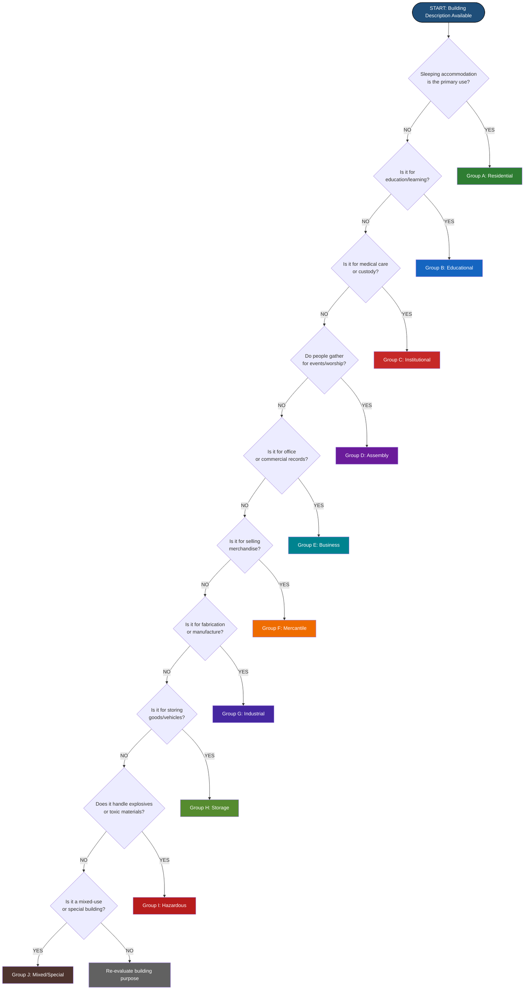
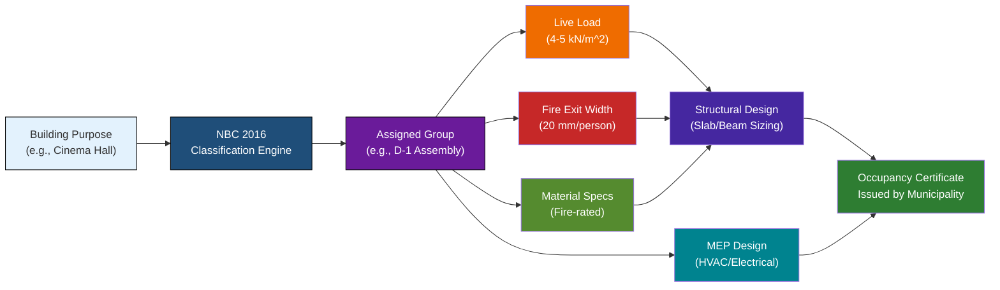
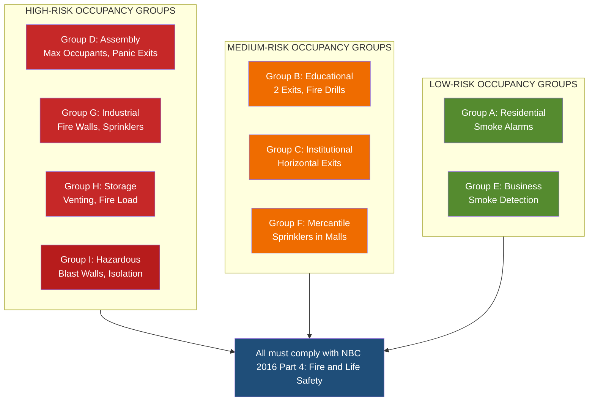

# Introduction to buildings: Types of buildings according to character of occupancy as per NBC,

<!-- SECTION_1_START -->

# Introduction to Buildings: Types of Buildings According to Character of Occupancy as per NBC

## 1. Core Technical Definition & Intuitive Overview

### 1.1 The National Building Code of India (NBC)

The **National Building Code of India (NBC)** is the premier national standard that provides guidelines for regulating building construction activities across the country. Published by the **Bureau of Indian Standards (BIS)**, the most recent comprehensive version is **NBC 2016** (National Building Code of India 2016), which supersedes the earlier NBC 2005.

> [!IMPORTANT]
> **Formal Definition (NBC 2016, Part 3 – Development Control Rules and General Building Requirements):**
> *Classification of buildings is the systematic grouping of all buildings into well-defined occupancy categories, based on the **character of occupancy** — i.e., the purpose for which a building (or part of it) is used or intended to be used.*

### 1.2 Conceptual Analogy / Intuition

> [!NOTE]
> **Real-World Analogy — The "City Zoning" Metaphor:**
> Imagine a city as a giant library. The librarian (the municipal authority) cannot allow a chemistry laboratory to be set up next to children's storybooks, nor store flammable liquids beside the reading hall. Similarly, a hospital cannot be placed adjacent to a fireworks factory, and a cinema hall cannot share a wall with a quiet school classroom.
>
> The NBC works exactly like this librarian — it sorts every building into a clear "category" or "group" based on **who uses it, how it is used, and what risks it carries**. This way, design rules (fire exits, ventilation, structural loads, sanitation) are applied **uniformly and safely** to similar buildings.

### 1.3 Need for Classification

| Why classify? | Engineering Justification |
|---|---|
| **Safety** | Different occupancies carry different fire, structural, and life-safety risks |
| **Design Standardization** | Allows uniform application of codes (loads, exits, materials) |
| **Legal & Administrative** | Helps local bodies issue occupancy certificates and permits |
| **Economic Efficiency** | Avoids over-designing a small house with industrial-grade specs |
| **Emergency Response** | Fire brigade and rescue teams know the building class instantly |

> [!TIP]
> **GeoGebra / Visualization Hint (not strictly required for this descriptive topic):**
> Since this is a *classification* topic, the "visualization" is a hierarchical tree diagram showing how the parent category *Buildings* branches into 10 sub-categories (Groups A to J). A simple tree-graph or organizational chart conveys the structure best.

### 1.4 Major Occupancy Groups — At a Glance

The NBC 2016 classifies **all buildings and structures** into **10 major occupancy groups**, designated by letters **A through J** (with subdivisions using numerals such as A-1, A-2, etc.).

> [!IMPORTANT]
> **The 10 NBC Occupancy Groups:**
>
> 1. **Group A** — Residential
> 2. **Group B** — Educational
> 3. **Group C** — Institutional
> 4. **Group D** — Assembly
> 5. **Group E** — Business
> 6. **Group F** — Mercantile
> 7. **Group G** — Industrial
> 8. **Group H** — Storage
> 9. **Group I** — Hazardous
> 10. **Group J** — Miscellaneous (Group J: not separately listed in older versions; in NBC 2016, mixed-use or special buildings)

> The 2016 version expanded from 8 groups to 10, adding a clearer distinction between **Mercantile (F)** and **Assembly (D)**, and refining **Industrial (G)** sub-categories.

<!-- SECTION_1_END -->

<!-- SECTION_2_START -->

# 2. Deep Theoretical Analysis & KTU High-Yield Formula Sheet

## 2.1 Detailed Breakdown of Each Occupancy Group

### **Group A — Residential Buildings**

Any building (or part) where sleeping accommodation is provided for normal residential purposes, with or without cooking or dining facilities.

| Sub-Group | Description | Real-World Example |
|---|---|---|
| **A-1** | Private dwelling, single or two-family independent residences | Independent houses, villas, bungalows |
| **A-2** | Flats / Apartments / Multi-family dwellings (up to 3 storeys may be A-2 or A-3 depending on height) | Apartment complexes, housing societies |
| **A-3** | Hostels, dormitories, boarding houses (residential, not institutional) | College hostels, working-men's hostels |
| **A-4** | Apartment houses / Flats above 3 storeys (high-rise residential) | High-rise apartment towers |
| **A-5** | Hotels, inns, guest houses, lodging houses (transient residential) | Hotels, motels, lodges |
| **A-6** | Starred hotels (luxury category with specific NBC standards) | Five-star / seven-star hotels |

> [!NOTE]
> **Engineering Significance:** Residential buildings are designed for **moderate live loads (2.0–3.0 kN/m²)**, low fire risk, and short evacuation times due to familiarity of occupants with the layout.

---

### **Group B — Educational Buildings**

Buildings used for the assembly of students / learners for educational / instructional purposes, accommodating more than a specified number of persons.

| Sub-Group | Description | Real-World Example |
|---|---|---|
| **B-1** | Schools, pre-primary, primary, secondary, higher secondary | CBSE schools, state-board schools |
| **B-2** | Colleges, universities, technical institutions, research institutes | Engineering colleges, IITs, NITs |
| **B-3** | Coaching / training centres, vocational institutes | Spoken-English classes, IT training centres |

> [!NOTE]
> **Key NBC Requirement:** Group B buildings must have **separate means of escape**, **fire-resistant construction**, and **adequate ventilation & lighting** as per NBC Part 4 (Fire and Life Safety).

---

### **Group C — Institutional Buildings**

Buildings used for medical, health, custodial, or correctional purposes, where occupants undergo treatment, care, or detention.

| Sub-Group | Description | Real-World Example |
|---|---|---|
| **C-1** | Hospitals, sanatoria, nursing homes, mental hospitals | Multi-specialty hospitals |
| **C-2** | Custodial institutions (jails, prisons, reformatories) | Central jails, juvenile homes |
| **C-3** | Penal or mental institutions (special high-security) | Mental asylums, juvenile correction homes |

> [!NOTE]
> **Engineering Significance:** Group C demands **continuous water supply**, **emergency power backup**, **wider corridors** (for stretcher movement), and **higher fire ratings** because occupants may be immobile.

---

### **Group D — Assembly Buildings**

Buildings where groups of people assemble for recreation, worship, amusement, or similar purposes.

| Sub-Group | Description | Real-World Example |
|---|---|---|
| **D-1** | Theatres, cinemas, concert halls, auditoriums | PVR, INOX, open-air theatres |
| **D-2** | Worship places (limited occupancy, e.g., < 300 persons) | Small temples, chapels |
| **D-3** | Worship places (large occupancy, ≥ 300 persons) | Big temples, churches, mosques |
| **D-4** | Transport terminals, bus stations, airports (passenger assembly) | Metro stations, airports |
| **D-5** | Sports stadiums, exhibition halls, swimming pools | Cricket stadiums, trade fair grounds |
| **D-6** | Amusement parks, dance halls, night clubs | Theme parks, discotheques |

> [!NOTE]
> **Key Concern:** Assembly buildings carry the **highest life-load risk** during emergencies (e.g., stampede). NBC mandates **multiple exit routes**, **panic-bar doors**, and **clear signage**.

---

### **Group E — Business Buildings**

Buildings used for transactions of business, keeping of accounts, professional work, and clerical services.

| Sub-Group | Description | Real-World Example |
|---|---|---|
| **E-1** | Offices, banks, professional chambers, R\&D offices | Corporate IT offices, government secretariats |
| **E-2** | Data centres, IT parks, BPO / KPO offices (special electrical load) | Infosys campuses, TCS hubs |
| **E-3** | Laboratories (non-hazardous) — testing / quality-control labs | Material-testing labs, calibration centres |

---

### **Group F — Mercantile Buildings**

Buildings used for displaying or selling merchandise (retail / wholesale trade), or for offices related to such trade.

| Sub-Group | Description | Real-World Example |
|---|---|---|
| **F-1** | Small shops, retail stores, market buildings (area ≤ 500 m² per floor) | Local kirana stores, neighbourhood shops |
| **F-2** | Large retail outlets, supermarkets, departmental stores, malls (area > 500 m² per floor) | Lulu Mall, D-Mart, Big Bazaar |
| **F-3** | Wholesale establishments, storage-cum-sale buildings | Godown-cum-shop, wholesale grain markets |

> [!IMPORTANT]
> **NBC 2016 Refinement:** Mercantile (Group F) is now **distinct from Assembly (Group D)**. Earlier NBC versions sometimes overlapped them. The 2016 version clearly separates them by **purpose (selling vs. gathering)**.

---

### **Group G — Industrial Buildings**

Buildings in which products or materials of all kinds and properties are fabricated, assembled, manufactured, or processed.

| Sub-Group | Description | Real-World Example |
|---|---|---|
| **G-1** | Low-hazard industries (non-toxic, non-explosive) | Garment factories, electronics assembly |
| **G-2** | Moderate-hazard industries (involving flammable liquids, moderate heat) | Paints, varnishes, distilleries |
| **G-3** | High-hazard industries (explosives, highly flammable gases, toxic chemicals) | Fireworks factories, petrochemical units |

> [!WARNING]
> **Fire Load Consideration:** Group G-3 buildings must be **isolated from residential zones** by mandated **buffer distances** (typically ≥ 15 m to 30 m depending on the hazard class).

---

### **Group H — Storage Buildings**

Buildings used primarily for storage of goods, materials, merchandise, or shelter of vehicles.

| Sub-Group | Description | Real-World Example |
|---|---|---|
| **H-1** | Storage of non-combustible materials (low fire load) | Cold storage, cement godowns |
| **H-2** | Storage of combustible materials (moderate fire load) | Paper godowns, timber yards |
| **H-3** | Storage of hazardous / flammable materials (high fire load) | Petrol depots, chemical warehouses |

---

### **Group I — Hazardous Buildings**

Buildings used for storage, handling, processing, or manufacture of highly combustible, explosive, toxic, or noxious materials.

| Sub-Group | Description | Real-World Example |
|---|---|---|
| **I-1** | Storage of explosives / ammunition | Defence ammunition depots |
| **I-2** | Manufacture of explosives / pyrotechnics | Fireworks manufacturing plants |
| **I-3** | Storage / handling of highly toxic / radioactive substances | Nuclear-fuel storage, LPG bulk depots |

> [!NOTE]
> **Engineering Significance:** Group I buildings are governed by **additional specialised codes** such as the **Indian Explosives Act**, **Atomic Energy Regulatory Board (AERB)** norms, and the **Factories Act 1948**.

---

### **Group J — Mixed / Special Occupancy Buildings**

In some versions of the code (and many local bylaws aligned with NBC), **Group J** covers buildings with **mixed occupancy** (e.g., a high-rise with residential floors above a commercial mall) or buildings that don't strictly fit into groups A–I.

> [!TIP]
> **KTU Exam Tip:** The latest official NBC 2016 lists 9 groups (A to I) explicitly in Part 3. Many textbooks and local municipal rules still mention "Group J" for **mixed-use or special structures**. Always cite the version clearly in your exam answers.

---

## 2.2 KTU High-Yield Formula Sheet (Cheat Sheet)

This topic is largely **descriptive**, so the "formulas" are the **classification rules, dimensions, and safety criteria** that examiners frequently test.

### Table 2.1 — NBC Occupancy Classification Quick-Reference

| Group | Occupancy Type | Key Sub-Categories | Primary Design Concern | Typical Live Load $\text{(kN/m}^2\text{)}$ |
|---|---|---|---|---|
| **A** | Residential | A-1 to A-6 (Houses, flats, hostels, hotels) | Live load, fire egress, ventilation | 2.0 – 3.0 |
| **B** | Educational | B-1 to B-3 (Schools, colleges, coaching) | Fire safety, occupancy density, escape routes | 3.0 – 4.0 |
| **C** | Institutional | C-1 to C-3 (Hospitals, prisons) | Sanitation, emergency power, wide corridors | 2.0 – 3.0 |
| **D** | Assembly | D-1 to D-6 (Cinemas, temples, stadiums) | Crowd load, panic exits, signage | 4.0 – 5.0 |
| **E** | Business | E-1 to E-3 (Offices, banks, IT parks) | HVAC, electrical load, fire suppression | 3.0 – 4.0 |
| **F** | Mercantile | F-1 to F-3 (Shops, malls, wholesale) | Fire load, escape width, parking | 4.0 – 5.0 |
| **G** | Industrial | G-1 to G-3 (Light to heavy industry) | Structural live load, fire, isolation distance | 5.0 – 10.0+ |
| **H** | Storage | H-1 to H-3 (Godowns, warehouses) | Floor load capacity, fire load | 5.0 – 15.0+ |
| **I** | Hazardous | I-1 to I-3 (Explosives, toxic) | Blast walls, separation, special licences | As per design |
| **J** | Mixed / Special | Multi-use, special structures | Combined code compliance | Mixed |

### Table 2.2 — Occupancy vs. Fire Exit Width (Per Occupant)

> [!IMPORTANT]
> NBC specifies **exit width per occupant** based on occupancy class. This is a frequently asked numerical problem in KTU exams.

| Occupancy Group | Stairway Width per Occupant (mm) | Critical Safety Rule |
|---|---|---|
| A (Residential) | $\text{12.5 mm / person}$ | Minimum 2 exits for all floors |
| B (Educational) | $\text{15 mm / person}$ | At least 2 independent exits |
| C (Institutional) | $\text{15 mm / person}$ | Horizontal exits for hospital beds |
| D (Assembly) | $\text{20 mm / person}$ | Multiple panic-bar exits |
| E (Business) | $\text{12.5 mm / person}$ | Smoke detection mandatory |
| F (Mercantile) | $\text{15 mm / person}$ | Sprinklers in malls |
| G (Industrial) | $\text{20 mm / person}$ | Fire-resistant construction |
| H (Storage) | $\text{12.5 mm / person}$ | Venting for explosion relief |
| I (Hazardous) | $\text{As per special code}$ | Blast walls, isolation |

### Table 2.3 — Real-World Engineering Utility

| Industry / Field | Why NBC Classification Matters |
|---|---|
| **Architecture** | Determines FAR (Floor Area Ratio), setbacks, height limits |
| **Structural Engineering** | Decides design live load on slabs, beams, columns |
| **Fire Engineering** | Determines fire-resistance rating, exit count, sprinkler mandate |
| **MEP (Mech/Elec/Plumbing)** | Decides HVAC tonnage, electrical load (kVA), water demand |
| **Urban Planning** | Zoning maps classify land by permissible occupancy |
| **Insurance** | Premiums vary by NBC group (Group I pays highest) |

<!-- SECTION_2_END -->

<!-- SECTION_3_START -->

# 3. Step-by-Step Derivations, Worked Examples & Implementation

## 3.1 Worked Example 1 — Identifying the Occupancy Group

> [!NOTE]
> **Problem Statement:**
> Classify the following buildings as per NBC 2016 (Group A through I):
> 1. A 5-star hotel in Kochi
> 2. The Apollo Hospital, Chennai
> 3. The Lulu Mall, Ernakulam
> 4. A fireworks manufacturing unit in Sivakasi
> 5. The IIT Madras campus
> 6. A cement godown warehouse

### Solution — Step-by-Step Classification

**Step 1: Identify the primary activity / purpose of the building.**

For each building, we look at:
- *Who uses it?* (Residents, students, patients, shoppers, workers)
- *What is the main activity?* (Sleeping, learning, healing, shopping, manufacturing, storing)

**Step 2: Match with the NBC group definitions.**

**Step 3: Assign the most specific sub-group.**

Let us tabulate this in a structured manner:

| S. No. | Building | Primary Activity | NBC Group | Sub-Group | Justification |
|---|---|---|---|---|---|
| 1 | 5-star hotel, Kochi | Transient residential accommodation | **A** | **A-6** | NBC specifically designates starred hotels as A-6 |
| 2 | Apollo Hospital, Chennai | Medical treatment & inpatient care | **C** | **C-1** | Hospitals fall under C-1 institutional |
| 3 | Lulu Mall, Ernakulam | Retail selling of merchandise | **F** | **F-2** | Area > 500 m² per floor, so F-2 (large retail) |
| 4 | Fireworks factory, Sivakasi | Manufacture of explosives | **I** | **I-2** | Manufacture of explosives is Group I-2 |
| 5 | IIT Madras, Chennai | Higher education & research | **B** | **B-2** | Universities and technical institutions = B-2 |
| 6 | Cement godown warehouse | Storage of non-combustible bulk material | **H** | **H-1** | Non-combustible stored goods = H-1 |

**Step 4: List the design implications.**

For example, for **Lulu Mall (Group F-2)**:
- Live load: $5.0 \text{ kN/m}^2$ on retail floors
- Mandatory sprinkler system (per NBC 2016 Part 4)
- Minimum 2 enclosed staircases
- Smoke detection and fire alarm in all floors
- Wider exit corridors ($\geq 1.5$ m)

---

## 3.2 Worked Example 2 — Exit Width Calculation (Numerical KTU-style)

> [!NOTE]
> **Problem Statement:**
> A cinema hall (Group D-1) has a total occupancy of **1200 persons**. Calculate the required total width of stairways as per NBC 2016, given that the rule for Assembly (Group D) is $\text{20 mm per occupant}$.

### Step-by-Step Solution

**Step 1: Identify the relevant NBC rule.**

For **Group D — Assembly Buildings (D-1)**, NBC specifies:

$$
W_{\text{total}} = N_{\text{occupants}} \times w_{\text{per person}}
$$

where:
- $W_{\text{total}}$ = total required stairway width (in mm)
- $N_{\text{occupants}}$ = total number of occupants
- $w_{\text{per person}}$ = width allotted per person (mm/person)

**Step 2: Substitute the values.**

Given:
- $N_{\text{occupants}} = 1200 \text{ persons}$
- $w_{\text{per person}} = 20 \text{ mm/person}$ (for Group D)

$$
W_{\text{total}} = 1200 \times 20 \text{ mm}
$$

**Step 3: Compute the final value.**

$$
W_{\text{total}} = 24{,}000 \text{ mm} = 24 \text{ m}
$$

**Step 4: Distribute the total width among multiple staircases.**

> [!IMPORTANT]
> NBC requires **at least 2 staircases** for any assembly building with > 50 occupants. Distribute the total width:

Assuming the designer provides **4 staircases** of equal width:

$$
W_{\text{each}} = \frac{W_{\text{total}}}{n_{\text{staircases}}} = \frac{24 \text{ m}}{4} = 6 \text{ m per staircase}
$$

But this is unusually wide. A more practical distribution would use **2 staircases**, but then the width each must be:

$$
W_{\text{each}} = \frac{24 \text{ m}}{2} = 12 \text{ m per staircase}
$$

> [!NOTE]
> A 12 m-wide staircase is impractical. In reality, designers increase the number of staircases (e.g., 6 to 8 staircases spread across the hall perimeter), each having a more realistic width of 3 m to 4 m.

**Step 5: Verification with the 2-staircase minimum rule.**

For $N = 1200$ persons, minimum staircases required:

$$
n_{\text{min}} = 2 \text{ staircases (always for assembly)}
$$

This is satisfied by the chosen distribution.

**Step 6: Final answer.**

> **The total stairway width required for the cinema hall is 24 m (24,000 mm).** With 4 staircases, each must be at least 6 m wide; with 6 staircases, each must be at least 4 m wide.

### Incremental Valuation Key (KTU Pattern)

| Step | Marks Allotted | What Examiner Checks |
|---|---|---|
| Stating NBC rule for Group D | **2 marks** | Writing $W = N \times w$ with $w = 20$ mm/person |
| Substituting values | **1 mark** | $1200 \times 20$ mm |
| Final computation | **1 mark** | $W = 24{,}000$ mm = 24 m |
| Distribution logic | **2 marks** | Mentioning minimum 2 staircases and explaining distribution |
| Practical design note | **1 mark** | Realistic staircase count (4–6) and width (3–6 m) |

---

## 3.3 Worked Example 3 — Live Load Comparison (Tabular Justification)

> [!NOTE]
> **Problem Statement:**
> Compare the **floor live load** (in $\text{kN/m}^2$) for the following occupancies, as per IS 875 (Part 2), which is referenced by NBC 2016:
> 1. Residential bedroom (A-1)
> 2. Classroom (B-1)
> 3. Hospital ward (C-1)
> 4. Cinema hall (D-1)
> 5. Office workspace (E-1)
> 6. Retail shop (F-1)
> 7. Light industrial workshop (G-1)
> 8. Warehouse for cement bags (H-1)

### Step-by-Step Tabular Comparison

| S. No. | Occupancy | NBC Group | IS 875 Part-2 Live Load $\text{(kN/m}^2\text{)}$ | Reasoning |
|---|---|---|---|---|
| 1 | Residential bedroom | A-1 | $2.0$ | Light furniture, low human density |
| 2 | Classroom | B-1 | $3.0$ | Desks, students, books |
| 3 | Hospital ward | C-1 | $2.0$ | Beds, equipment, but spread out |
| 4 | Cinema hall | D-1 | $4.0$ to $5.0$ | High human density, fixed seating |
| 5 | Office workspace | E-1 | $3.0$ | Desks, chairs, computers, files |
| 6 | Retail shop | F-1 | $4.0$ | Shelving, crowds, goods |
| 7 | Light industrial workshop | G-1 | $5.0$ to $7.5$ | Machinery, materials, workers |
| 8 | Cement warehouse | H-1 | $10.0$ to $15.0+$ | Stacked heavy goods (1 bag cement ≈ 50 kg) |

> [!IMPORTANT]
> **Engineering Insight:** As we move from **A (Residential)** to **H (Storage)**, the design live load **monotonically increases** because the *concentrated mass per unit floor area* grows. This is why warehouses need **thicker slabs, deeper beams, and closer column spacing** compared to a residential house.

---

## 3.4 Python Implementation — Occupancy Classifier (Algorithmic Reinforcement)

> [!NOTE]
> The following Python code is a *symbolic representation* of the NBC classification logic. While real buildings need site inspection, this code helps students internalize the decision tree.

```python
"""
NBC 2016 Occupancy Classifier
A simple rule-based engine that classifies a building description
into its NBC group (A through I) and lists design implications.
"""

from typing import Dict, List, Tuple

# Master rule table: keywords → NBC group and sub-group
NBC_RULES: List[Tuple[List[str], str, str, float, str]] = [
    # (keywords, group, sub_group, live_load_kN_m2, key_concern)
    (["house", "villa", "bungalow", "home", "dwelling"], "A", "A-1", 2.0, "Fire egress"),
    (["apartment", "flat", "housing"], "A", "A-2", 2.0, "Fire egress"),
    (["hostel", "dormitory", "boarding"], "A", "A-3", 2.5, "Fire egress"),
    (["high-rise residential", "tower"], "A", "A-4", 2.0, "High-rise safety"),
    (["hotel", "inn", "lodge", "guest house"], "A", "A-5", 3.0, "Fire egress"),
    (["5-star", "5 star", "luxury hotel", "resort"], "A", "A-6", 3.0, "Premium safety"),
    (["school", "primary", "secondary", "high school"], "B", "B-1", 3.0, "Crowd safety"),
    (["college", "university", "iit", "nit", "technical"], "B", "B-2", 3.0, "Lab safety"),
    (["coaching", "training centre", "vocational"], "B", "B-3", 3.0, "Crowd safety"),
    (["hospital", "clinic", "nursing home", "sanatorium"], "C", "C-1", 2.0, "Emergency power"),
    (["prison", "jail", "reformatory"], "C", "C-2", 3.0, "Security + safety"),
    (["mental hospital", "asylum"], "C", "C-3", 2.5, "Containment safety"),
    (["cinema", "theatre", "auditorium", "concert"], "D", "D-1", 5.0, "Panic exits"),
    (["small temple", "chapel"], "D", "D-2", 4.0, "Crowd flow"),
    (["large temple", "mosque", "church"], "D", "D-3", 5.0, "Crowd flow"),
    (["airport", "metro station", "bus terminal"], "D", "D-4", 5.0, "Evacuation"),
    (["stadium", "exhibition", "swimming pool"], "D", "D-5", 5.0, "Crowd control"),
    (["amusement park", "night club", "dance hall"], "D", "D-6", 5.0, "Crowd control"),
    (["office", "bank", "secretariat"], "E", "E-1", 3.0, "HVAC, electrical"),
    (["data centre", "it park", "bpo", "kpo"], "E", "E-2", 4.0, "Power + cooling"),
    (["laboratory", "testing lab"], "E", "E-3", 3.0, "Ventilation"),
    (["kirana", "small shop", "boutique"], "F", "F-1", 4.0, "Fire load"),
    (["mall", "supermarket", "department store"], "F", "F-2", 5.0, "Fire load"),
    (["wholesale", "godown-sale"], "F", "F-3", 5.0, "Fire load"),
    (["garment factory", "electronics assembly"], "G", "G-1", 5.0, "Light hazard"),
    (["paint factory", "distillery"], "G", "G-2", 7.5, "Flammable"),
    (["fireworks factory", "petrochemical"], "G", "G-3", 10.0, "High hazard"),
    (["cold storage", "cement godown"], "H", "H-1", 10.0, "Floor capacity"),
    (["paper godown", "timber yard"], "H", "H-2", 10.0, "Fire load"),
    (["petrol depot", "chemical warehouse"], "H", "H-3", 15.0, "High fire load"),
    (["ammunition depot"], "I", "I-1", 0.0, "Explosive licence"),
    (["fireworks manufacture"], "I", "I-2", 0.0, "Explosive code"),
    (["nuclear fuel", "lpg bulk"], "I", "I-3", 0.0, "AERB norms"),
]

def classify_building(description: str) -> Dict[str, object]:
    """
    Classify a building description into its NBC group.
    
    Args:
        description: Free-text description of the building.
    
    Returns:
        Dictionary with group, sub_group, live_load, and key_concern.
    """
    desc_lower = description.lower().strip()
    
    for keywords, group, sub, live_load, concern in NBC_RULES:
        for kw in keywords:
            if kw in desc_lower:
                return {
                    "input": description,
                    "group": group,
                    "sub_group": sub,
                    "live_load_kN_per_m2": live_load,
                    "key_concern": concern,
                    "status": "Classified"
                }
    
    return {
        "input": description,
        "group": "UNKNOWN",
        "sub_group": "N/A",
        "live_load_kN_per_m2": 0.0,
        "key_concern": "Manual review required",
        "status": "Not matched"
    }


# ----- Demonstration / Test Cases -----
if __name__ == "__main__":
    test_buildings = [
        "5-star hotel in Kochi",
        "Apollo Hospital, Chennai",
        "Lulu Mall, Ernakulam",
        "Fireworks factory in Sivakasi",
        "IIT Madras campus",
        "Cement godown warehouse",
    ]
    
    print("=" * 70)
    print("NBC 2016 OCCUPANCY CLASSIFICATION RESULTS")
    print("=" * 70)
    for b in test_buildings:
        result = classify_building(b)
        print(f"\nBuilding: {result['input']}")
        print(f"  NBC Group   : {result['group']}")
        print(f"  Sub-Group   : {result['sub_group']}")
        print(f"  Live Load   : {result['live_load_kN_per_m2']} kN/m^2")
        print(f"  Key Concern : {result['key_concern']}")
    print("=" * 70)
```

**Expected Output (sample):**

```
======================================================================
NBC 2016 OCCUPANCY CLASSIFICATION RESULTS
======================================================================

Building: 5-star hotel in Kochi
  NBC Group   : A
  Sub-Group   : A-6
  Live Load   : 3.0 kN/m^2
  Key Concern : Premium safety

Building: Apollo Hospital, Chennai
  NBC Group   : C
  Sub-Group   : C-1
  Live Load   : 2.0 kN/m^2
  Key Concern : Emergency power

... (and so on for all test cases)
======================================================================
```

> [!TIP]
> **Pedagogical Note:** This code uses *keyword matching* for clarity. In a real-world Building Permit Management System, the classification would be done by **municipal architects** after on-site inspection, and a database would be queried. However, the logic tree is exactly the same: *purpose → group → sub-group → design code*.

---

## 3.5 Comparison Matrix — NBC vs. Other International Codes

| Aspect | **India (NBC 2016)** | **USA (IBC)** | **UK (Approved Document B)** | **Eurocode (EN 1991-1-1)** |
|---|---|---|---|---|
| **Total Groups** | 9–10 (A–J) | 10 (I–X) | 7 (Purpose Groups) | Load-based, not occupancy-based |
| **Residential** | A | R-1 to R-4 | Group 1 (Residential) | Category A |
| **Educational** | B | E | Group 2 (Institutional) | Category C1 |
| **Industrial** | G | F-1, F-2 | Group 6 (Industrial) | Category E |
| **Hazardous** | I | H-1 to H-5 | Group 7 (Other) | Category F (special) |
| **Reference** | BIS, Govt. of India | ICC | UK Gov Building Regs | CEN (European) |

> [!NOTE]
> **For KTU exams**, the Indian NBC classification is the only expected answer. International codes are mentioned here only to give a global context for engineering interviews.

<!-- SECTION_3_END -->

<!-- SECTION_4_START -->

# 4. Structural Diagrams & Schematics

## 4.1 Mermaid Diagram — Complete NBC 2016 Occupancy Classification Tree

> [!NOTE]
> This **hierarchical tree diagram** is the most-requested visual for this topic. The image below renders as a top-down tree showing the parent "Buildings" node branching into the 9–10 NBC groups and their sub-categories.

```mermaid
graph TD
    Root["BUILDINGS AS PER NBC 2016"]
    
    Root --> GrpA["GROUP A: RESIDENTIAL"]
    Root --> GrpB["GROUP B: EDUCATIONAL"]
    Root --> GrpC["GROUP C: INSTITUTIONAL"]
    Root --> GrpD["GROUP D: ASSEMBLY"]
    Root --> GrpE["GROUP E: BUSINESS"]
    Root --> GrpF["GROUP F: MERCANTILE"]
    Root --> GrpG["GROUP G: INDUSTRIAL"]
    Root --> GrpH["GROUP H: STORAGE"]
    Root --> GrpI["GROUP I: HAZARDOUS"]
    Root --> GrpJ["GROUP J: MIXED/SPECIAL"]
    
    GrpA --> A1["A-1: Private Dwellings"]
    GrpA --> A2["A-2: Flats/Apartments"]
    GrpA --> A3["A-3: Hostels/Boarding"]
    GrpA --> A4["A-4: High-Rise Residential"]
    GrpA --> A5["A-5: Hotels/Lodges"]
    GrpA --> A6["A-6: Starred Hotels"]
    
    GrpB --> B1["B-1: Schools"]
    GrpB --> B2["B-2: Colleges/Universities"]
    GrpB --> B3["B-3: Coaching/Vocational"]
    
    GrpC --> C1["C-1: Hospitals/Nursing Homes"]
    GrpC --> C2["C-2: Prisons/Custodial"]
    GrpC --> C3["C-3: Mental/Medical Custody"]
    
    GrpD --> D1["D-1: Theatres/Cinemas"]
    GrpD --> D2["D-2: Small Worship"]
    GrpD --> D3["D-3: Large Worship"]
    GrpD --> D4["D-4: Transport Terminals"]
    GrpD --> D5["D-5: Stadiums/Exhibitions"]
    GrpD --> D6["D-6: Amusement/Dance Halls"]
    
    GrpE --> E1["E-1: Offices/Banks"]
    GrpE --> E2["E-2: Data Centres/IT Parks"]
    GrpE --> E3["E-3: Non-Hazard Labs"]
    
    GrpF --> F1["F-1: Small Shops"]
    GrpF --> F2["F-2: Malls/Supermarkets"]
    GrpF --> F3["F-3: Wholesale Outlets"]
    
    GrpG --> G1["G-1: Low Hazard Industry"]
    GrpG --> G2["G-2: Moderate Hazard Industry"]
    GrpG --> G3["G-3: High Hazard Industry"]
    
    GrpH --> H1["H-1: Non-Combustible Storage"]
    GrpH --> H2["H-2: Combustible Storage"]
    GrpH --> H3["H-3: Hazardous Storage"]
    
    GrpI --> I1["I-1: Explosive Storage"]
    GrpI --> I2["I-2: Explosive Manufacture"]
    GrpI --> I3["I-3: Toxic/Radioactive"]
    
    GrpJ --> J1["J-1: Mixed-Use Buildings"]
    GrpJ --> J2["J-2: Special Structures"]
    
    style Root fill:#1f4e79,stroke:#000,stroke-width:3px,color:#fff
    style GrpA fill:#2e7d32,stroke:#000,stroke-width:2px,color:#fff
    style GrpB fill:#1565c0,stroke:#000,stroke-width:2px,color:#fff
    style GrpC fill:#c62828,stroke:#000,stroke-width:2px,color:#fff
    style GrpD fill:#6a1b9a,stroke:#000,stroke-width:2px,color:#fff
    style GrpE fill:#00838f,stroke:#000,stroke-width:2px,color:#fff
    style GrpF fill:#ef6c00,stroke:#000,stroke-width:2px,color:#fff
    style GrpG fill:#4527a0,stroke:#000,stroke-width:2px,color:#fff
    style GrpH fill:#558b2f,stroke:#000,stroke-width:2px,color:#fff
    style GrpI fill:#b71c1c,stroke:#000,stroke-width:2px,color:#fff
    style GrpJ fill:#4e342e,stroke:#000,stroke-width:2px,color:#fff
```



---

## 4.2 Mermaid Diagram — Decision Flow for Classifying a Building



---

## 4.3 Mermaid Block Diagram — Functional Architecture: How NBC Classification Drives Building Design



> [!NOTE]
> **Interpretation of the Block Diagram:**
> The classification is not an academic exercise — it is the **root node** of the entire design process. The assigned NBC group dictates every downstream decision: structural sizing, fire safety, materials, mechanical-electrical-plumbing (MEP) loads, and finally, the issuance of the **occupancy certificate** by the municipal authority.

---

## 4.4 Mermaid Diagram — Subgraph: Fire Safety Requirements by Occupancy Group



<!-- SECTION_4_END -->

<!-- SECTION_5_START -->

# 5. KTU 2024 Scheme Examination Question Bank & Topic Recap

## 5.1 Part A Questions (3 Marks Each — Short Answer)

> [!IMPORTANT]
> **KTU Pattern:** Part A questions are short-answer, definition-based, or one-line justifications. Each carries **3 marks** and tests **RBT Levels: Remember / Understand**.

---

### **Question A1** `[KTU University Exam – Dec 2023]`

**Define "character of occupancy" of a building as per NBC 2016. Why is it important to classify buildings based on this parameter?**

**Model Answer (3 Marks):**

> **Definition (1 Mark):** *Character of occupancy* is the purpose for which a building (or part of it) is used or proposed to be used — for example, residential, educational, industrial, or assembly purposes.
>
> **Importance (2 Marks):**
> 1. It determines the **design live load**, **fire safety requirements**, and **means of escape** to be provided in the building.
> 2. It enables **uniform application of building regulations** by municipal authorities, ensuring safety, standardization, and legal compliance.

---

### **Question A2** `[KTU University Exam – July 2024]`

**Differentiate between Group A (Residential) and Group F (Mercantile) buildings with one example each.**

**Model Answer (3 Marks):**

| Aspect | Group A — Residential | Group F — Mercantile |
|---|---|---|
| Primary use | Sleeping / living accommodation | Display and sale of merchandise |
| Occupant duration | Long-term (hours to years) | Short-term (minutes to hours) |
| Example | Apartment, hostel | Shopping mall, retail shop |
| Crowd density | Low–moderate | High (especially malls) |

*(Valuation key: 1.5 marks for the table comparison, 1.5 marks for one example each.)*

---

## 5.2 Part B Questions (14 Marks Each — Descriptive with Internal Choice)

> [!IMPORTANT]
> **KTU Pattern:** Part B questions test **RBT Levels: Understand / Apply / Analyze**. Each carries **14 marks** and is split into two sub-parts: **(a) 7 marks** (theory/description) and **(b) 7 marks** (numerical/derivation/diagram).

---

### **Question B-A** `[KTU University Exam – Dec 2023]` **(14 Marks)**

**(a)** Classify buildings as per NBC 2016 based on **character of occupancy**. Briefly describe **any six** major groups with one example each. **(7 Marks)**

**(b)** An **auditorium** (Group D-5) has a total seating capacity of **1500 persons**. As per NBC 2016, the required stairway width for Group D is **20 mm per person**. Calculate the **total required stairway width** and recommend a **practical distribution** among multiple staircases. **(7 Marks)**

---

### **Model Answer — Part (a) — 7 Marks**

Buildings are classified by the **National Building Code of India (NBC 2016)** into 9 main occupancy groups (A to I) plus a mixed-use category (J). The classification is based on the **purpose / use** of the building.

**Six major groups (1 mark each, total 6 marks):**

| Group | Occupancy | Sub-Group Example | Real-World Example |
|---|---|---|---|
| **A** | Residential | A-1: Private dwelling | A villa in Trivandrum |
| **B** | Educational | B-1: School | Kendriya Vidyalaya |
| **C** | Institutional | C-1: Hospital | Medical College Hospital |
| **D** | Assembly | D-1: Cinema | PVR Cinemas |
| **E** | Business | E-1: Office | KSBC office complex |
| **F** | Mercantile | F-2: Shopping mall | Lulu Mall |

*(1 mark reserved for the introductory definition of classification.)*

---

### **Model Answer — Part (b) — 7 Marks**

**Step 1: Stating the NBC rule.** (2 Marks)

For Group D (Assembly), NBC 2016 specifies a stairway width of **20 mm per occupant**.

$$
W_{\text{total}} = N_{\text{occupants}} \times w_{\text{per person}}
$$

**Step 2: Substituting values.** (1 Mark)

Given $N = 1500$ persons and $w = 20$ mm/person:

$$
W_{\text{total}} = 1500 \times 20 = 30{,}000 \text{ mm}
$$

**Step 3: Final computation.** (1 Mark)

$$
W_{\text{total}} = 30 \text{ m}
$$

**Step 4: Distribution logic.** (2 Marks)

NBC mandates **at least 2 enclosed staircases** for assembly buildings. Distributing 30 m across **6 staircases**:

$$
W_{\text{each}} = \frac{30 \text{ m}}{6} = 5 \text{ m per staircase}
$$

**Step 5: Practical recommendation.** (1 Mark)

A 5 m-wide staircase is feasible if designed with intermediate landings and hand-rails. Alternatively, **8 staircases** of **3.75 m** width each is more realistic for crowd dispersal.

### Incremental Valuation Key (Part b)

| Step | Marks |
|---|---|
| Stating the NBC rule (formula + value) | 2 |
| Substituting $N = 1500$ | 1 |
| Final value $W = 30$ m | 1 |
| Distribution among $\geq 2$ staircases | 2 |
| Practical design note | 1 |
| **Total** | **7** |

---

### **Question B-B (Alternative Choice)** `[KTU University Exam – July 2024]` **(14 Marks)**

**(a)** Explain the **sub-classifications** of **Group A (Residential)** and **Group G (Industrial)** buildings as per NBC 2016, with **two examples** for each sub-class. **(7 Marks)**

**(b)** A **cement warehouse** (Group H-1) stores cement bags stacked up to a height of **4 m**. Each cement bag weighs **50 kg**, and the stacking footprint is **10 m × 8 m**. Calculate the **equivalent distributed live load** on the floor in $\text{kN/m}^2$, and comment on whether this load is acceptable for a standard warehouse slab designed for **$10 \text{ kN/m}^2$**. **(7 Marks)**

---

### **Model Answer — Part (a) — 7 Marks**

**Group A — Residential Sub-Classes:** (3.5 Marks)

| Sub-Class | Description | Example |
|---|---|---|
| **A-1** | Single / two-family private dwelling | Independent bungalow in Kochi |
| **A-2** | Apartments / flats (low-rise) | 3-storey flat in Calicut |
| **A-3** | Hostels, dormitories | Engineering-college hostel |
| **A-4** | High-rise apartments | 20-storey residential tower |
| **A-5** | Hotels, inns, lodges | 3-star hotel in Munnar |
| **A-6** | Starred / luxury hotels | Taj Hotel, Mumbai |

**Group G — Industrial Sub-Classes:** (3.5 Marks)

| Sub-Class | Description | Example |
|---|---|---|
| **G-1** | Low-hazard industries (non-toxic, non-explosive) | Garment stitching unit |
| **G-2** | Moderate-hazard industries (flammable liquids) | Paint mixing factory |
| **G-3** | High-hazard industries (explosives, toxic) | Fireworks manufacturing unit |

*(Valuation: 0.5 mark per correctly identified sub-class with example, totaling 7 marks.)*

---

### **Model Answer — Part (b) — 7 Marks**

**Step 1: Stacking data.** (1 Mark)

- Number of bags stacked per column = $\text{height / bag height} = 4 \text{ m} / 0.2 \text{ m} = 20$ bags per stack
- Footprint of stack = $10 \text{ m} \times 8 \text{ m} = 80 \text{ m}^2$

**Step 2: Total mass of stored cement.** (1 Mark)

- Total bags = assume uniform coverage; load per square metre = $20 \text{ bags} \times 50 \text{ kg} = 1000 \text{ kg/m}^2$

**Step 3: Convert to force (kN).** (2 Marks)

$$
W_{\text{total}} = 1000 \text{ kg/m}^2 \times 9.81 \text{ m/s}^2 = 9810 \text{ N/m}^2
$$

$$
W_{\text{total}} \approx 9.81 \text{ kN/m}^2
$$

**Step 4: Comparison with design capacity.** (2 Marks)

- Design slab capacity = $10 \text{ kN/m}^2$
- Actual live load = $9.81 \text{ kN/m}^2$
- **Margin of safety** = $10 - 9.81 = 0.19 \text{ kN/m}^2$ (very low)

**Step 5: Conclusion and recommendation.** (1 Mark)

> The load is **technically within the design limit** but with a **very low safety margin (only 1.9%)**. For practical safety, the stacking height should be **reduced to 3.5 m** (giving $\approx 8.6 \text{ kN/m}^2$), or the slab should be **redesigned for a higher live load class**.

### Incremental Valuation Key (Part b)

| Step | Marks |
|---|---|
| Stacking data (bags, footprint) | 1 |
| Total mass calculation | 1 |
| Conversion to kN/m² | 2 |
| Comparison with design load | 2 |
| Conclusion + recommendation | 1 |
| **Total** | **7** |

---

> [!WARNING]
> **KTU Examiner's Valuation Warning / Pitfall Callout**
>
> 1. **Do NOT skip the conversion step from kg to kN.** Many students write $1000 \text{ kg/m}^2$ as the answer, losing 2 marks. Always multiply by $g = 9.81 \text{ m/s}^2$ to express in $\text{kN/m}^2$.
> 2. **Do NOT write "Group J" as a guaranteed category.** NBC 2016 lists A through I explicitly. Mention J only if your local municipal bylaws do. Phrase it as *"Group J (Mixed-Use) is recognized in some municipal bylaws."*
> 3. **Do NOT confuse Mercantile (F) with Assembly (D).** F = selling goods; D = gathering people. A cinema = D-1, but the popcorn counter inside = F.
> 4. **Do NOT forget the example.** In 7-mark sub-parts, *each sub-class without an example loses 0.5 mark*. Always pair classification with a real example.
> 5. **Do NOT use ambiguous sub-group letters** (e.g., writing "A-7" or "D-7") — these do not exist. Stick to the official NBC sub-codes.

---

## 5.3 Topic Recap & Important Things to Remember

> [!TIP]
> **High-Density Revision Checklist for KTU Exam Prep:**

- **NBC** stands for **National Building Code of India**, published by **BIS (Bureau of Indian Standards)**. The current version is **NBC 2016**.

- Classification of buildings is based on **character of occupancy** — i.e., the *purpose of use* of a building or part thereof.

- There are **9 main groups (A through I)** in NBC 2016, with a possible **Group J (Mixed/Special)** in some municipal adaptations.

- **Group A — Residential:** Sleeping accommodation is the primary use. Sub-classes: A-1 (Houses), A-2 (Flats), A-3 (Hostels), A-4 (High-rise), A-5 (Hotels), A-6 (Starred Hotels).

- **Group B — Educational:** Schools, colleges, universities, coaching centres. Sub-classes: B-1 (Schools), B-2 (Colleges/Universities), B-3 (Coaching/Vocational).

- **Group C — Institutional:** Hospitals, prisons, mental asylums. Sub-classes: C-1 (Hospitals), C-2 (Prisons), C-3 (Mental/Medical custody).

- **Group D — Assembly:** Cinemas, theatres, temples, stadiums, airports. Sub-classes: D-1 to D-6. **Highest crowd-safety concern**.

- **Group E — Business:** Offices, banks, data centres. Sub-classes: E-1 (Offices), E-2 (IT/Data), E-3 (Labs).

- **Group F — Mercantile:** Shops, malls, wholesale outlets. Sub-classes: F-1 (Small shops, $\leq 500 \text{ m}^2$/floor), F-2 (Malls/Supermarkets), F-3 (Wholesale).

- **Group G — Industrial:** Manufacturing units. Sub-classes: G-1 (Low hazard), G-2 (Moderate), G-3 (High hazard). **Buffer distance from residential areas is mandatory**.

- **Group H — Storage:** Godowns, warehouses. Sub-classes: H-1 (Non-combustible), H-2 (Combustible), H-3 (Hazardous storage).

- **Group I — Hazardous:** Explosives, toxic, radioactive. Sub-classes: I-1 (Storage), I-2 (Manufacture), I-3 (Toxic/Radioactive). Governed by **special additional codes** (Explosives Act, AERB).

- **Stairway width rule (NBC 2016):** $W_{\text{total}} = N_{\text{occupants}} \times w_{\text{per person}}$, where $w = 20$ mm for Group D, $15$ mm for B/C/F, $12.5$ mm for A/E/H, and special for I.

- **Live load reference (IS 875 Part 2):** Residential $\approx 2.0 \text{ kN/m}^2$; Educational $\approx 3.0 \text{ kN/m}^2$; Assembly $\approx 5.0 \text{ kN/m}^2$; Industrial/Storage $\geq 5.0 \text{ kN/m}^2$ (often $\geq 10 \text{ kN/m}^2$ for heavy storage).

- **Universal safety rule:** **At least 2 independent means of escape (staircases)** are mandatory for all buildings with > 50 occupants.

- **Conversion reminder:** $1 \text{ kgf} = 9.81 \text{ N} = 0.00981 \text{ kN}$. Always convert masses to forces in numerical problems.

- **Classification drives design:** The assigned NBC group determines the **live load, fire exit width, material specs, MEP loads, and the eligibility for an Occupancy Certificate**.

- **Mnemonic for remembering groups A through I:** *"A Boy Can Draw Each Fine Grid, Heavily Inking"* — **A** Residential, **B** Educational, **C** Institutional, **D** Assembly, **E** Business, **F** Mercantile, **G** Industrial, **H** Storage, **I** Hazardous.

<!-- SECTION_5_END -->
