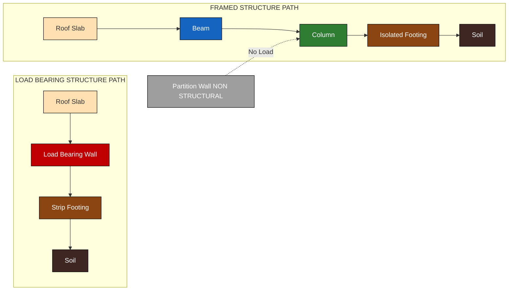
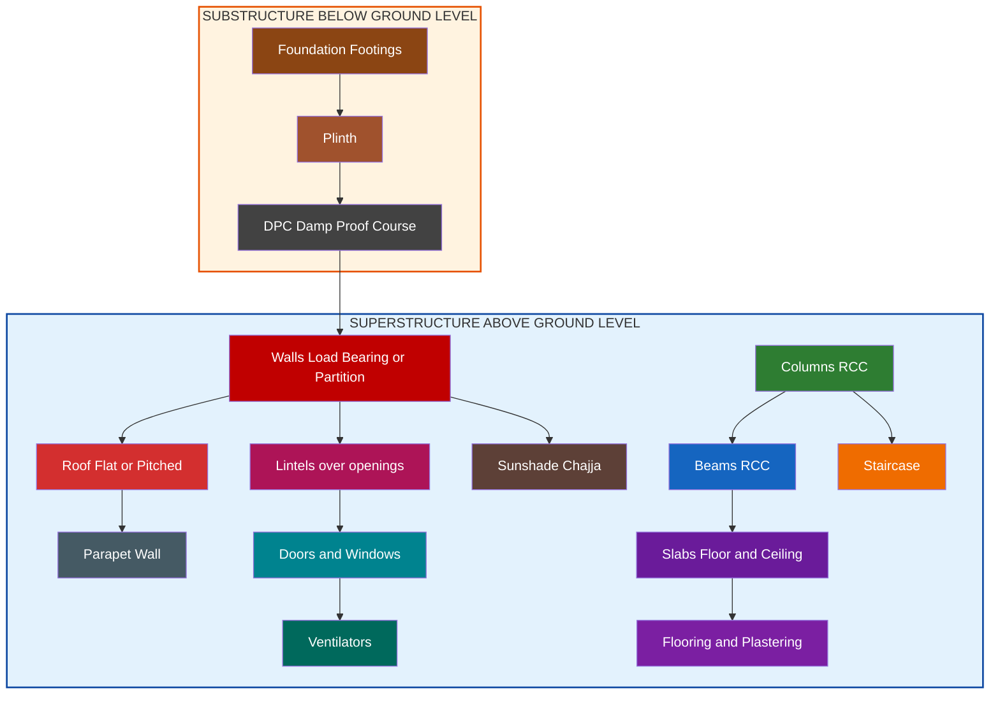
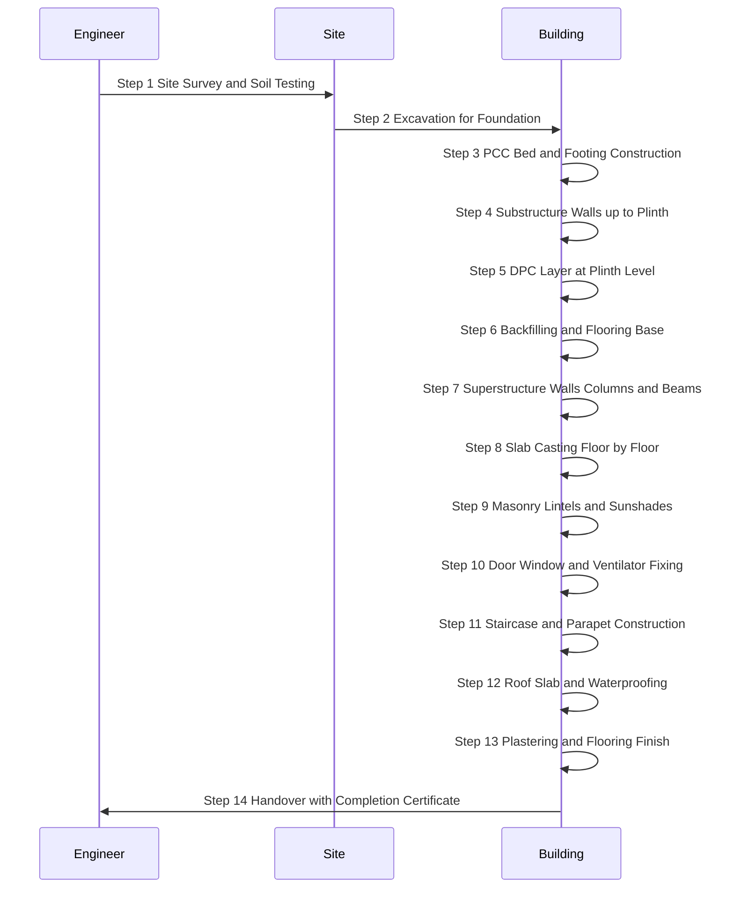

# Load bearing and non-load bearing building structures, components of a residential building and their functions (concept only).

<!-- SECTION_1_START -->

# Load-Bearing & Non-Load-Bearing Structures and Residential Building Components

## 1. Core Technical Definition & Intuitive Overview

### 1.1 Building Structure — Formal KTU Definition

A **building structure** is a robust, engineered assembly of interconnected physical components designed to safely transfer all superimposed loads (dead loads, live loads, wind loads, seismic loads) to the underlying foundation soil in a stable, predictable, and durable manner, while simultaneously providing functional shelter, thermal comfort, and resistance to environmental degradation.

> [!NOTE]
> **KTU 2024 Syllabus Highlight (GCEST104 – Module 3)**
> The scope is strictly **conceptual**. Students must master:
> 1. The classification of buildings as **Load-Bearing** vs **Non-Load-Bearing (Framed)**.
> 2. Identification of the **major components** of a typical residential building.
> 3. The **functional role** each component plays in transferring load, enclosing space, and ensuring habitability.

### 1.2 Load-Bearing Structure — Formal Definition

A **load-bearing structure** is a structural system in which the **walls themselves** are the primary vertical load-carrying members. The walls transmit the gravity loads from the roof and floor slabs directly downward to the foundation. The wall thickness is engineered to safely resist the cumulative compressive stresses imposed by successive storeys.

### 1.3 Non-Load-Bearing Structure (Framed Structure) — Formal Definition

A **non-load-bearing structure** is a structural system in which a **skeleton framework of columns and beams** (typically Reinforced Cement Concrete, i.e., **RCC**) bears the entire structural load. The walls in such a building serve **only as partition/curtain walls** and carry no structural load other than their own self-weight. They function as architectural infill rather than structural members.

### 1.4 Components of a Residential Building — Intuitive Overview

> [!IMPORTANT]
> **Conceptual Analogy — "The Human Body"**
> Think of a residential building as the **human body**:
> - **Foundation** $\rightarrow$ the **feet** (transfers all body weight to the ground)
> - **Plinth** $\rightarrow$ the **ankles** (interface between ground and body)
> - **Walls / Columns** $\rightarrow$ the **skeleton / ribcage** (gives shape and support)
> - **Beams & Slabs** $\rightarrow$ the **shoulders & arms** (hold horizontal members together)
> - **Roof** $\rightarrow$ the **head** (covers and protects from the sky)
> - **Doors & Windows** $\rightarrow$ the **mouth, nose, and eyes** (allow entry, exit, light, air)
> - **Staircase** $\rightarrow$ the **legs** (allows vertical movement between floors)
> - **DPC** $\rightarrow$ the **skin's waterproof layer** (prevents moisture from rising)

### 1.5 Substructure vs Superstructure

| Zone | Definition | Components |
|------|------------|------------|
| **Substructure** | Portion **below ground level (GL)** | Foundation, Plinth, Footings |
| **Superstructure** | Portion **above ground level (GL)** | Walls, Columns, Beams, Slabs, Roof, Doors, Windows, Staircase |

> [!VISUALIZATION CONTROL]
> **Concept:** Building Vertical Cross-Section Showing Substructure & Superstructure
> **GeoGebra / Desmos Input Equations:**
> * Line $x = 0$ (Ground Level reference axis)
> * Rectangle for Plinth: $0 \le y \le 1$ at $x = 0$
> * Rectangle for Foundation: $-2 \le y \le 0$ at $x = 0$
> * Rectangle for Superstructure Wall: $1 \le y \le 8$ at $x = 0$
> **Visual Description:** A vertical section showing the foundation block embedded below ground, the plinth beam at ground level, the wall rising up, a roof slab capping the top, and a staircase climbing along one side.

---

<!-- SECTION_1_END -->

<!-- SECTION_2_START -->

# 2. Deep Theoretical Analysis & KTU High-Yield Reference Sheet

## 2.1 Load-Bearing Structural System — Operational Logic

In a load-bearing system, the following **load transfer hierarchy** applies:

$$\text{Roof Load} \rightarrow \text{Floor Slab Load} \rightarrow \text{Walls} \rightarrow \text{Footings} \rightarrow \text{Soil}$$

### 2.1.1 Step-by-Step Logic of Load Transfer

- **Step 1 — Roof & Floor Slabs:** Receive imposed (live) loads and self-weight (dead loads).
- **Step 2 — Walls:** Receive loads from slabs above and channel them as in-plane compressive forces down their length.
- **Step 3 — Footings:** Spread the concentrated wall load over a larger soil area to keep bearing pressure $\le$ safe bearing capacity of soil.
- **Step 4 — Soil:** Ultimate load sink; must possess adequate bearing capacity.

### 2.1.2 Engineering Properties & Constraints

- **Material:** Commonly **brick masonry**, **stone masonry**, or **solid concrete blocks**.
- **Wall Thickness:** Increases with **height of building** and **number of storeys** to manage compressive stress.
- **Practical Height Limit:** Generally up to **3 storeys (≈ 10 m)** for economical design.
- **Span Restrictions:** Room sizes are limited because walls below must support long-span slabs without intermediate columns.
- **Cost:** Economical for **low-rise** buildings (1–3 floors); masonry labour is locally available.

## 2.2 Non-Load-Bearing (Framed) Structural System — Operational Logic

In a framed structure, the load path is:

$$\text{Slab} \rightarrow \text{Beams} \rightarrow \text{Columns} \rightarrow \text{Footings} \rightarrow \text{Soil}$$

### 2.2.1 Step-by-Step Logic of Load Transfer

- **Step 1 — Slab:** Distributes floor/roof loads to the supporting beams.
- **Step 2 — Beams:** Transfer these loads to the columns at their ends.
- **Step 3 — Columns:** Carry the cumulative vertical load downward to the foundation.
- **Step 4 — Footings:** Spread concentrated column loads to the soil.
- **Step 5 — Walls:** Function **only as partitions** — not part of the load path.

### 2.2.2 Engineering Properties & Advantages

- **Material:** **RCC** (Reinforced Cement Concrete) or **Steel** framework.
- **Wall Thickness:** Independent of load; can be as thin as **115 mm (half-brick)**.
- **Height Capacity:** Suitable for **high-rise** buildings (skyscrapers, multi-storey apartments).
- **Design Flexibility:** Open floor plans, large rooms, future alterations are feasible.
- **Speed:** Faster construction using pre-cast or cast-in-situ techniques.

## 2.3 KTU High-Yield Comparison Sheet — Load-Bearing vs Non-Load-Bearing

| Parameter | Load-Bearing Structure | Non-Load-Bearing (Framed) Structure |
|-----------|------------------------|-------------------------------------|
| **Load Carrier** | Walls | Columns & Beams |
| **Wall Function** | Structural + Partition | Partition only (curtain walls) |
| **Typical Material** | Brick / Stone masonry | RCC / Steel |
| **Maximum Economical Height** | Up to **3 storeys** | **Unlimited** (high-rise feasible) |
| **Wall Thickness** | Thick (230 mm – 450 mm) | Thin (115 mm – 230 mm) |
| **Room Span** | Limited ($\le 4$ m typically) | Large spans possible |
| **Foundation Type** | Continuous / Strip footing | Isolated / Raft / Pile footing |
| **Construction Speed** | Slow (mortar curing) | Fast (mechanized) |
| **Cost (Low-Rise)** | Economical | Costlier |
| **Cost (High-Rise)** | Impractical | Economical |
| **Future Modification** | Difficult | Easy (non-structural walls) |
| **Typical Example** | Traditional Kerala nalukettu, village houses | Modern apartments, offices, towers |

## 2.4 Components of a Residential Building — Functional Reference

| Component | Function |
|-----------|----------|
| **Foundation** | Transfers entire building load safely to soil |
| **Plinth** | Interface between substructure and superstructure; prevents dampness entry |
| **DPC (Damp Proof Course)** | Horizontal bitumen/polymer layer at plinth level to block rising moisture |
| **Walls** | Enclose space, provide privacy, and (if load-bearing) carry vertical loads |
| **Columns** | Vertical RCC members carrying loads in framed structures |
| **Beams** | Horizontal RCC members transferring slab loads to columns |
| **Slab** | Horizontal structural element forming floors and ceilings |
| **Lintels** | Small horizontal members over door/window openings to carry wall load above |
| **Sunshade (Chajja)** | Projecting slab over openings to block rain and direct sunlight |
| **Doors** | Provide access and circulation between rooms |
| **Windows** | Allow natural light and cross-ventilation |
| **Ventilators** | Small openings near ceiling for hot-air exhaust |
| **Staircase** | Enables vertical movement between floors |
| **Roof** | Top covering protecting the building from rain, sun, and heat |
| **Parapet** | Low protective wall at roof edge for safety |
| **Flooring** | Finished surface layer of floors (tiles, marble, etc.) |
| **Plastering** | Smooth surface finish on walls and ceiling |

### 2.5 Real-World Engineering Utility

- **Load-Bearing Concept:** Applied in vernacular architecture, government low-cost housing, and rural Kerala traditional homes where seismic risk is moderate and height is restricted.
- **Framed Structure Concept:** Foundation of all modern **high-rise construction**, **seismic-resistant design**, and **urban apartment complexes** in Kochi, Thiruvananthapuram, and Calicut metro regions.
- **Residential Components Knowledge:** Essential for **quantity surveying**, **building drawing**, **construction project management**, and **real-estate valuation** — all core skill areas for civil engineers.

> [!IMPORTANT]
> **KTU Examiner's Insight:** In KTU 2024 scheme exams, the most common question pattern is *"Compare load-bearing and framed structures"* (7 marks) followed by *"Briefly explain any five components of a residential building"* (7 marks). Memorize the comparison table above and at least 8 component-functions for high scores.

---

<!-- SECTION_2_END -->

<!-- SECTION_3_START -->

# 3. Step-by-Step Conceptual Breakdown & Component Specifications

## 3.1 Detailed Architectural Component Specification Matrix

Since the topic is **concept-only**, the KTU 2024 board exam focuses on descriptive answers, comparative analysis, and labelled diagrams. Below is the exhaustive component-by-component reference for all standard parts of a residential building.

### 3.1.1 Substructure Components

| Component | Detailed Specification | Construction Material |
|-----------|------------------------|----------------------|
| **Foundation** | Lowest engineered part; transfers load to soil at a stress $\le$ **Safe Bearing Capacity (SBC)** of soil | PCC (Plain Cement Concrete), RCC, brick masonry, stone masonry |
| **Footing** | Widened base of foundation that spreads load | Stepped (brick), Isolated (column), Strip (wall) |
| **Plinth** | Portion between ground level and floor level; height = **450 mm to 600 mm** above GL | Brick masonry, RCC plinth beam |
| **DPC** | Damp-proof course laid at plinth level, thickness = **40 mm to 50 mm** | Bitumen, polyethylene sheet, waterproof cement |

### 3.1.2 Superstructure Components

| Component | Detailed Specification | Construction Material |
|-----------|------------------------|----------------------|
| **Walls (Load-Bearing)** | Wall thickness governed by compressive stress; outer wall = **200 mm (single-brick)** or **400 mm (double-brick)** | Burnt clay bricks, solid concrete blocks, stone |
| **Walls (Partition)** | Non-load-bearing; thickness = **115 mm (half-brick)** | Hollow concrete blocks, AAC blocks, gypsum boards |
| **Columns** | Vertical RCC members, cross-section $\ge 230 \times 230$ mm for residential | M20 / M25 grade concrete with Fe415 steel |
| **Beams** | Horizontal members spanning between columns; depth = **1/10 to 1/15** of span | RCC with longitudinal & shear reinforcement |
| **Slab** | Floor/ceiling element; thickness = **125 mm to 150 mm** for residential | RCC one-way or two-way slab |
| **Lintel** | Provided over openings; bearing = **150 mm** on each side of opening | RCC lintel (preferred), brick arch (traditional) |
| **Sunshade (Chajja)** | Projection over windows/doors = **600 mm to 900 mm** | RCC with slight upward slope for rain run-off |
| **Doors** | Standard sizes: **0.9 m × 2.1 m** (main), **0.8 m × 2.1 m** (internal) | Timber, flush doors, PVC |
| **Windows** | Standard sizes: **1.0–1.5 m wide × 1.2–1.5 m high** | Glazed timber / aluminium / uPVC |
| **Ventilators** | Located **300 mm below ceiling**; size: **0.6 m × 0.4 m** | Glass louvers, timber frame |
| **Staircase** | Rise $r = 150$ mm, Tread $t = 250$–300 mm; relation $2r + t = 600$ mm (Riddle's formula) | RCC, steel, timber |
| **Roof** | Flat RCC slab or pitched truss roof; slope for pitched = **1:6 to 1:4** (terrace) | RCC, GI sheets, clay tiles, Mangalore tiles |
| **Parapet Wall** | Height above roof = **900 mm minimum** | Brick masonry, RCC |
| **Flooring** | Finished layer over floor slab; floor finish = **25 mm to 50 mm** | Vitrified tiles, marble, granite, IPS |
| **Plastering** | Internal: **12 mm thick**, 1:6 cement-mortar; External: **15–20 mm thick**, 1:4 cement-mortar | Cement-sand mortar |

## 3.2 Step-by-Step Conceptual Derivation: Why Walls Become Thicker in Load-Bearing Structures

Consider a load-bearing wall of height $H$ metres carrying the total load from floors above. The compressive stress $\sigma$ at the base of the wall is governed by:

$$\sigma = \frac{P}{A} = \frac{P}{t \times b}$$

Where:
* $P$ = Total cumulative vertical load (kN) from roof, slabs, and wall self-weight
* $A$ = Cross-sectional area of wall base
* $t$ = Wall thickness
* $b$ = Wall length (unit length = 1 m for analysis)

**Step 1 — Express load in terms of height:**
Assume each storey contributes a uniform load $w$ (kN/m). For an $n$-storey building:
$$P = n \cdot w$$

**Step 2 — Apply the safety constraint:**
For safe design, $\sigma \le \sigma_{permissible}$ where $\sigma_{permissible}$ is the allowable compressive stress of the masonry material.

**Step 3 — Rearrange to find required thickness:**
$$t \ge \frac{P}{b \cdot \sigma_{permissible}}$$

**Step 4 — Observe the conclusion:**
As $n$ increases (taller building), $P$ increases linearly, and therefore $t$ must also increase. Beyond a certain height, the wall thickness becomes impractically large, which is why load-bearing construction is restricted to low-rise buildings.

**Step 5 — Inference for framed structures:**
In a framed structure, the **columns** carry the load instead, and their cross-section can be increased **independently of wall thickness**. This decouples wall thickness from building height — enabling skyscrapers.

$$\boxed{\text{Wall thickness in load-bearing buildings} \propto \text{Number of storeys}}$$

## 3.3 Decision Logic — When to Choose Which System

```
Is building height > 3 storeys?
├── YES  → Use NON-LOAD-BEARING (Framed) Structure
│         └── Reason: Walls would become impractically thick
│
└── NO   → Check span requirements
          ├── Large open halls needed? → NON-LOAD-BEARING (Framed)
          └── Small rooms, local masonry available? → LOAD-BEARING
```

---

<!-- SECTION_3_END -->

<!-- SECTION_4_START -->

# 4. Structural Diagrams & Schematics

## 4.1 Classification of Building Structures

```mermaid
flowchart TD
    A["BUILDING STRUCTURAL SYSTEMS"] --> B["LOAD BEARING STRUCTURE"]
    A --> C["NON LOAD BEARING FRAMED STRUCTURE"]
    A --> D["COMPOSITE STRUCTURE"]

    B --> B1["Walls carry the load"]
    B --> B2["Brick or stone masonry"]
    B --> B3["Limited to low rise up to 3 storeys"]
    B --> B4["Thick walls"]
    B --> B5["Traditional houses and rural buildings"]

    C --> C1["Columns and beams carry the load"]
    C --> C2["RCC or steel framework"]
    C --> C3["Suitable for high rise buildings"]
    C --> C4["Thin partition walls"]
    C --> C5["Modern apartments and skyscrapers"]

    D --> D1["Load bearing walls in lower floors"]
    D --> D2["Framed structure in upper floors"]
    D --> D3["Used for buildings with 4 to 5 storeys"]

    style A fill:#1f4e79,color:#ffffff,stroke:#000000
    style B fill:#c00000,color:#ffffff,stroke:#000000
    style C fill:#2e7d32,color:#ffffff,stroke:#000000
    style D fill:#f57c00,color:#000000,stroke:#000000
```



## 4.2 Load Path Comparison — Load-Bearing vs Framed



## 4.3 Components of a Residential Building — Block Architecture



## 4.4 Sequential Construction Flow — Residential Building



---

<!-- SECTION_4_END -->

<!-- SECTION_5_START -->

# 5. KTU 2024 Scheme Examination Question Bank & Topic Recap

## 5.1 Part A — Short Answer Questions (3 Marks Each)

### Question 1 [KTU University Exam – July 2024]
**Differentiate between a load-bearing structure and a non-load-bearing structure. List any two situations where each is preferred.** (3 Marks) [CO1, Remember]

**Model Answer:**

A **load-bearing structure** is one in which the walls themselves carry the vertical loads from the roof and floors, transferring them directly to the foundation. A **non-load-bearing (framed) structure** uses a framework of RCC columns and beams to carry all loads, while walls serve only as partitions.

- **Load-Bearing Preferred:** (i) Single-storey village houses with locally available brick; (ii) Low-cost government housing up to 2 storeys.
- **Non-Load-Bearing Preferred:** (i) High-rise apartment buildings; (ii) Commercial complexes requiring large column-free spans.

> **Valuation Key:** [Definition of load-bearing: 1 Mark] [Definition of framed: 1 Mark] [Two situations: 1 Mark]

---

### Question 2 [KTU University Exam – Dec 2023]
**List any six major components of a residential building and state the function of each.** (3 Marks) [CO1, Understand]

**Model Answer:**

1. **Foundation** – Transfers the entire building load safely to the soil.
2. **Plinth** – The portion between ground level and floor level; prevents direct entry of dampness.
3. **Walls** – Enclose rooms, provide privacy, and (in load-bearing structures) carry vertical loads.
4. **Roof** – Top covering that protects the building from rain, heat, and other environmental agencies.
5. **Doors and Windows** – Doors allow access; Windows provide natural light and ventilation.
6. **Staircase** – Provides vertical circulation between different floors.

> **Valuation Key:** [Six components listed correctly: 1.5 Marks] [Functions stated correctly: 1.5 Marks]

---

## 5.2 Part B — Long Answer Questions (14 Marks, Module Internal Choice)

### Question A [KTU University Exam – July 2024] — Choice 1

**(a) Explain in detail the load-bearing structural system used in residential buildings. Discuss its advantages, limitations, and suitability.** (7 Marks) [CO1, Understand]

**Model Answer:**

In a **load-bearing structural system**, the walls of the building are the principal load-carrying members. The roof and floor slabs transfer their loads to the walls, which in turn transmit these loads through continuous strip footings to the soil below.

**Operational Logic:**
The walls are constructed of brick masonry, stone masonry, or solid concrete blocks, with sufficient thickness to safely resist the cumulative compressive stresses from successive storeys. The wall thickness increases with building height.

**Advantages:**
- Economical for low-rise (1–3 storey) construction.
- Uses locally available materials and unskilled labour.
- Simpler design and execution.
- Good thermal insulation due to thick walls.
- Low maintenance cost.

**Limitations:**
- Restricted to low-rise buildings (practically $\le$ 3 storeys).
- Larger wall thickness reduces carpet area.
- Limited room spans restrict architectural planning.
- Difficult to alter or extend the building later.
- Poor resistance to lateral (seismic/wind) loads.

**Suitability:**
Best suited for **single-family houses**, **village dwellings**, **low-cost housing**, and **government quarters** where the height is restricted and economy is the priority.

> **Valuation Key:** [Concept of load transfer: 2 Marks] [At least 3 advantages: 2 Marks] [At least 2 limitations: 2 Marks] [Suitability discussion: 1 Mark]

---

**(b) With a neat sketch, describe the components of a residential building from foundation to roof, stating the function of each component.** (7 Marks) [CO1, Apply]

**Model Answer:**

The major components of a residential building, from bottom to top, are:

**1. Foundation:** The lowest engineered part that transmits the entire load of the building to the soil at a stress not exceeding the safe bearing capacity of the soil.

**2. Plinth:** The portion of the wall between the ground level and the floor level, typically raised 450–600 mm above GL to prevent dampness and water entry.

**3. Damp Proof Course (DPC):** A horizontal waterproof layer (bitumen/polymer) provided at the plinth level to prevent capillary rise of moisture into the walls.

**4. Walls:** Vertical enclosure members that divide the building into rooms. In load-bearing structures, they carry the structural load; in framed structures, they are partition walls.

**5. Lintels:** Small horizontal members (RCC or brick arch) provided over door and window openings to carry the wall load above the opening.

**6. Columns and Beams:** In framed structures, columns are vertical RCC members carrying the load, and beams are horizontal members transferring slab loads to columns.

**7. Slab:** The horizontal RCC element forming the floor and ceiling of each storey.

**8. Doors and Windows:** Doors provide access between rooms; windows admit light and air.

**9. Staircase:** Provides vertical circulation between floors, designed with rise $r$ and tread $t$ such that $2r + t = 600$ mm.

**10. Roof:** The top covering protecting the interior from rain, sun, and wind. It may be flat RCC or pitched (truss with tiles).

**11. Parapet Wall:** A low wall (minimum 900 mm high) at the roof edge for safety.

**12. Flooring and Plastering:** Floor finish (tiles/marble) over the slab and smooth cement-mortar finish on walls and ceiling.

**Reference Sketch (ASCII Section):**

```
  ┌──────────────────────┐  ← Parapet (900 mm)
  │      ROOF SLAB       │
  ├──────────────────────┤
  │   Lintel (over wnd)  │
  │   ┌──┐  ┌──┐  ┌──┐  │  ← Walls
  │   │  │  │  │  │  │  │
  │   │  │  │  │  │  │  │
  │   └──┘  └──┘  └──┘  │
  ├──────────────────────┤  ← Slab
  │       (Next floor)   │
  └──────────────────────┘
  ====== DPC Layer ======  ← Plinth
  ▓▓▓▓▓▓ FOUNDATION ▓▓▓▓▓▓  ← Below GL
```

> **Valuation Key:** [Neat labelled sketch: 2 Marks] [Any 8 components with functions: 5 Marks]

---

### Question B [KTU University Exam – Dec 2023] — Choice 2

**(a) Describe the framed (non-load-bearing) structural system. How does it differ from a load-bearing system in terms of load transfer, material, and design flexibility?** (7 Marks) [CO1, Understand]

**Model Answer:**

A **framed structure** is a structural system composed of a skeleton of **RCC (Reinforced Cement Concrete) columns and beams** that together carry the entire gravity and lateral loads of the building. The walls are non-structural and serve only as partitions.

**Load Transfer Mechanism:**
The load path is: Slab $\rightarrow$ Beams $\rightarrow$ Columns $\rightarrow$ Footings $\rightarrow$ Soil. Each member has a clearly defined structural role, and the framework acts as a single unit.

**Differences from Load-Bearing System:**

| Aspect | Load-Bearing | Non-Load-Bearing (Framed) |
|--------|--------------|---------------------------|
| **Load Carrier** | Walls | Columns & Beams |
| **Material** | Brick/Stone masonry | RCC / Steel |
| **Wall Thickness** | Thick (230–400 mm) | Thin (115 mm partition walls) |
| **Design Flexibility** | Limited; walls cannot be shifted | High; walls can be re-planned anytime |
| **Storey Height** | $\le 3$ storeys | Unlimited |
| **Construction Speed** | Slow | Fast (mechanized) |
| **Seismic Resistance** | Poor (heavy, brittle walls) | Good (ductile RCC frame) |

**Design Flexibility:** In framed structures, the walls are infill panels and can be re-positioned or removed later without affecting the structural safety. Large column-free spans (halls, auditoriums) are possible, making it the preferred system for modern urban buildings.

> **Valuation Key:** [Definition of framed system: 1 Mark] [Load path explained: 2 Marks] [Comparison table with at least 4 points: 3 Marks] [Design flexibility discussion: 1 Mark]

---

**(b) Explain with examples the functions of the following components of a residential building: (i) Foundation, (ii) DPC, (iii) Lintel, (iv) Sunshade, (v) Parapet wall.** (7 Marks) [CO1, Apply]

**Model Answer:**

**(i) Foundation:**
The foundation is the lowest part of the building, located below ground level. Its function is to transfer the entire structural load of the building to the underlying soil at a pressure not exceeding the **Safe Bearing Capacity (SBC)** of the soil. *Example:* Strip footings of brick masonry for load-bearing houses, and isolated RCC footings for framed buildings.

**(ii) DPC (Damp Proof Course):**
DPC is a horizontal waterproof layer (typically 40–50 mm thick) provided at the plinth level of the building. Its function is to prevent the capillary rise of groundwater/moisture into the walls, which would otherwise cause dampness, efflorescence, and peeling of plaster. *Example:* A 50 mm thick layer of 1:2:4 cement concrete with a bitumen coat laid at plinth level.

**(iii) Lintel:**
A lintel is a short horizontal structural member placed over door and window openings. Its function is to support the wall load (masonry) above the opening and transfer it safely to the adjacent wall portions. *Example:* An RCC lintel of size 150 mm × 150 mm spanning 1.2 m with 150 mm bearing on each side.

**(iv) Sunshade (Chajja):**
A sunshade is a small projecting slab (cantilever) provided over window and door openings. Its function is to protect the openings from rain and direct sunlight, thereby improving indoor comfort. *Example:* A 600 mm wide RCC chajja with a slight upward slope (1:30) for rain-water run-off.

**(v) Parapet Wall:**
A parapet is a low protective wall constructed along the edge of the roof slab. Its function is to provide safety for persons using the terrace, prevent accidental falls, and serve as a boundary wall for the roof. *Example:* A 900 mm high brick masonry parapet with a coping (RCC capping) on top.

> **Valuation Key:** [Function of each component clearly stated: 1 Mark each $\times$ 5 = 5 Marks] [One example per component: 2 Marks]

---

> [!WARNING]
> **KTU Examiner's Valuation Warning — Common Pitfalls**
> 1. **Do NOT confuse "load-bearing wall" and "partition wall" terminology.** Many students write "load-bearing wall" for non-load-bearing buildings — **deduct 1–2 marks**.
> 2. **Always state the material (Brick/RCC/Stone)** when explaining structural types; vague answers lose marks.
> 3. **In component-function questions, the function must be specific** (e.g., "DPC prevents capillary rise of moisture" is correct; "DPC stops water" is too vague — **partial marks only**).
> 4. **For sketch-based questions, ALWAYS draw a labelled cross-section**, not a 3D perspective. Cross-section carries more marks in KTU valuation.
> 5. **Mention "Safe Bearing Capacity of Soil"** when defining foundation — it is a key KTU 2024 keyword.
> 6. **For comparison questions, a TABLE format is preferred** over paragraph — examiners reward structured answers with full marks.

---

## 5.3 Topic Recap & Important Things to Remember

> [!IMPORTANT]
> **Rapid Revision Checklist — KTU GCEST104 Module 3**

**Core Definitions:**
- **Load-Bearing Structure:** Walls carry vertical loads; restricted to low-rise (≤ 3 storeys).
- **Non-Load-Bearing (Framed) Structure:** RCC columns & beams carry all loads; walls are non-structural partitions.

**Key Load Paths:**
- Load-Bearing: Slab $\rightarrow$ Wall $\rightarrow$ Strip Footing $\rightarrow$ Soil
- Framed: Slab $\rightarrow$ Beam $\rightarrow$ Column $\rightarrow$ Isolated Footing $\rightarrow$ Soil

**Critical Component Functions (Must Memorize):**
- **Foundation** $\rightarrow$ Load transfer to soil within SBC.
- **Plinth** $\rightarrow$ Raises floor above GL, prevents dampness.
- **DPC** $\rightarrow$ Horizontal moisture barrier at plinth (40–50 mm thick).
- **Walls (LB)** $\rightarrow$ Carry load; **(Partition)** $\rightarrow$ Only divide space.
- **Columns & Beams** $\rightarrow$ Vertical & horizontal load carriers in framed structures.
- **Slab** $\rightarrow$ Floor/ceiling structural element (125–150 mm thick residential).
- **Lintels** $\rightarrow$ Carry wall load over door/window openings.
- **Sunshade** $\rightarrow$ Rain and sun protection over openings.
- **Staircase** $\rightarrow$ Vertical circulation; $2r + t = 600$ mm.
- **Roof** $\rightarrow$ Top weather protection.
- **Parapet** $\rightarrow$ Safety wall on roof ($\ge 900$ mm high).
- **Flooring & Plastering** $\rightarrow$ Finishes for serviceability.

**High-Yield Comparisons to Remember:**
- Wall thickness: Load-Bearing (thick) vs Framed (thin).
- Height: Load-Bearing (≤ 3 floors) vs Framed (unlimited).
- Material: Load-Bearing (masonry) vs Framed (RCC/Steel).
- Span: Load-Bearing (limited) vs Framed (large spans).
- Seismic: Load-Bearing (poor) vs Framed (good).

**KTU 2024 Frequently Asked Concepts:**
- Definition + load path of both structural systems.
- Comparison table (at least 6 differences).
- Any 6–8 components with functions.
- Labelled cross-sectional sketch of a residential building.
- Mention of **Safe Bearing Capacity (SBC)** when explaining foundation.

**Quick Recall Mnemonic — "F-P-D-W-C-B-S-L-D-W-V-S-R-P-F"** for components: **F**oundation, **P**linth, **D**PC, **W**alls, **C**olumns, **B**eams, **S**lab, **L**intel, **D**oors, **W**indows, **V**entilators, **S**taircase, **R**oof, **P**arapet, **F**inishes.

<!-- SECTION_5_END -->
