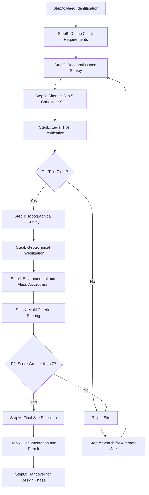
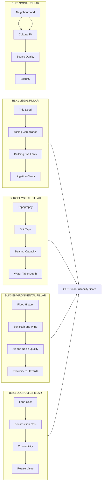
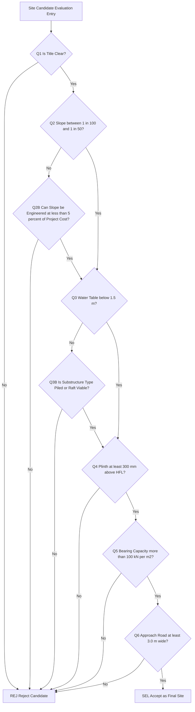

# Selection of site for a residential building.

<!-- SECTION_1_START -->
# Selection of Site for a Residential Building

## 1.1 Formal Academic Definition (KTU 2024 Syllabus Terminology)

**Site Selection** is the systematic, multi-criteria engineering decision-making process of evaluating a parcel of land against a defined set of **technical, legal, environmental, economic, and socio-cultural parameters** to determine its suitability, safety, and long-term viability for the construction of a residential structure.

In the KTU 2024 Scheme framework (Course: *GCEST104 — Introduction to Mechanical Engineering & Civil Engineering*, Module 3), site selection is treated as the **first and most critical pre-design phase** of any civil engineering project, since the decisions made at this stage govern the structural design, cost, durability, and habitability of the building throughout its service life.

> [!IMPORTANT]
> **KTU Syllabus Highlight (GCEST104 — Module 3):**
> Students must be able to list and explain the **primary and secondary factors** governing site selection, the role of **building bye-laws**, the **NBC (National Building Code of India)** provisions, and the **IS 1256 / IS 14833** codal recommendations relevant to residential plots.

## 1.2 Conceptual Analogy — The "House & Soil" Intuition

Imagine you are buying a plot to build your home — the place where you and your family will live for the next 50–60 years.

- **The plot is like the foundation of a marriage.** Choose unwisely (low-lying flood zone, contaminated soil, litigated land, far from hospitals), and every other aspect — design, cost, comfort, resale value — will be compromised.
- **The site is the "birthplace" of the building.** Just as a child inherits traits from its parents, a building inherits *strength, dryness, stability, ventilation, and dignity* from its site.

A well-chosen site quietly supports the building for generations; a poorly chosen site haunts it forever through cracks, dampness, floods, and legal disputes.

> [!NOTE]
> **Core Definition Box:**
> *A good residential site is one that is — **safe** (geotechnically stable), **legal** (clear title, bye-law compliant), **served** (water, electricity, road, drainage), **healthy** (free from pollution, flooding, contamination), and **sustainable** (environmentally and economically viable over its lifetime).*

## 1.3 Standard Reference Codes & Constants

| Reference | Issuing Body | Purpose in Site Selection |
|---|---|---|
| **NBC 2016** (National Building Code of India) | BIS | Standards for housing, planning, safety |
| **IS 1256** | BIS | Classification of building sites by characteristics |
| **IS 14833** | BIS | Site investigation for residential buildings |
| **IS 2720 (Parts)** | BIS | Soil testing (moisture, density, Atterberg limits, CBR) |
| **KMBR / KBR** | Kerala Municipality Building Rules | State-level bye-laws (setbacks, FSI, height) |
| **Standard Plot Dimensions** | Local Authority | Minimum $9 \text{ m} \times 9 \text{ m}$ for a small house in Kerala |
| **Safe Bearing Capacity (SBC)** | Geotechnical Norm | Typically $100 \text{ kN/m}^2$ to $250 \text{ kN/m}^2$ for residential buildings |

> [!VISUALIZATION CONTROL]
> **Concept:** Suitability Mapping of a Residential Plot on a 2-D Decision Grid
> **GeoGebra / Desmos Input Parameters:**
> * `X-axis = Technical Suitability Score (0–10)`
> * `Y-axis = Economic + Legal Suitability Score (0–10)`
> * `Region A (x>7, y>7): IDEAL — green zone`
> * `Region B (x<4, y>7): Cautiously accepted with engineering remediation`
> * `Region C (x>7, y<4): Technically good but legally/economically risky — REJECT`
> * `Region D (x<4, y<4): UNBUILDABLE — reject outright`
> **Visual Description:** A two-quadrant scatter plot showing site candidates as dots, with the upper-right "green" quadrant clearly representing the preferred selection zone for residential construction.

---

<!-- SECTION_1_END -->

<!-- SECTION_2_START -->
# Deep Theoretical Analysis & KTU High-Yield Formula Sheet

## 2.1 The Five Pillars of Residential Site Selection

Every site selection exercise in civil engineering is built on five mutually reinforcing pillars. KTU examiners consistently test whether students can **categorize** a given factor correctly under one of these pillars.

### Pillar 1 — Legal & Administrative Factors

These are non-negotiable. Failure on even one item makes the plot *legally unbuildable*, regardless of how good it is physically.

- **Clear Title Deed** — verified through encumbrance certificate (EC) for at least the last **30 years**.
- **Land Use Zoning** — the plot must fall under the *Residential Zone* in the master plan / town planning scheme.
- **Building Bye-Laws Compliance** — setbacks, Floor Space Index (FSI / FAR), Building Height, Parking norms.
- **Approved Layout Plan** — plot must lie inside a *sanctioned layout* approved by the local panchayat / municipality / corporation.
- **No Litigation** — check court records, revenue records, and the *Plea* and *Stay* databases.
- **Tax Paid Up-to-Date** — local body / land tax receipts must be current.
- **Road Access (Approach Road)** — minimum **3.0 m wide** for fire tender access in Kerala municipal rules.
- **Conversion Certificate** — if the land was originally agricultural (*non-pattaya* land in Kerala), conversion to *purayidam* (residential use) must be obtained before construction.

### Pillar 2 — Physical & Topographical Factors

The "geography" of the land determines how the building will sit, drain, and survive.

- **Topography & Slope** — ideal slope is **1 in 100 to 1 in 50** (i.e., a gentle gradient of about **1% to 2%**) falling away from the building. This ensures natural drainage of rainwater away from the foundation.
- **Shape of the Plot** — a *rectangular* plot with a width-to-length ratio between **1:1.5 and 1:2** is most efficient. Irregular, narrow, or trapezoidal plots waste built-up area.
- **Size of the Plot** — must satisfy the minimum plot area prescribed by the local authority (e.g., **$80 \text{ m}^2$** minimum in many Kerala panchayats).
- **Ground Level** — should be **at least 300 mm above** the highest flood level (HFL) recorded for that locality in the last **100 years**.
- **Soil Type & Bearing Capacity** — sandy, gravelly, or stiff clayey soils are preferred. **Black cotton soil**, **loose fill**, **marshy soil**, and **peat** are unsuitable unless improved by ground engineering.
- **Water Table Depth** — water table should remain at least **1.5 m to 2.0 m below the natural ground level (NGL)** throughout the year, to avoid dampness in basements and foundation corrosion.
- **Sub-Soil Condition** — no loose pockets, cavities, or buried organic matter within the zone of influence of the foundation.

### Pillar 3 — Environmental & Climatic Factors

A site that is technically stable but environmentally hostile is a poor choice.

- **Flooding History** — distance from rivers, streams, backwaters; historical flood lines; proximity to *paddy fields / kole lands* in Kerala.
- **Sun Path & Orientation** — for a residential building in the **tropical Kerala climate**, the longer wall should ideally face **North or South** to minimize direct heat gain (or **East–West** in cooler hill regions).
- **Wind Direction** — should be able to channel **prevailing summer breeze (South-West in Kerala)** into the house through openings; should be shielded from cold winter winds.
- **Air Quality** — distance from industries, garbage dumps, crematoriums, sewage treatment plants (the recommended buffer is at least **300 m to 500 m**).
- **Noise Pollution** — away from highways, railway lines, airports, market zones.
- **Vegetation Cover** — existing trees, especially large native ones, add value and micro-climate cooling; however, *check for tree-preservation orders* before clearing.

### Pillar 4 — Economic Factors

- **Land Cost** — must be within the **30% to 40%** of the total project budget for an average residential project.
- **Construction Cost Multiplier** — sites on *rock, soft clay, or high water table* escalate foundation cost by **20% to 60%**.
- **Connectivity & Infrastructure** — proximity to schools, hospitals, markets, public transport (target: within **1 km to 3 km**).
- **Resale Value & Appreciation Potential** — sites inside well-planned municipalities appreciate faster.
- **Availability of Utilities** — piped water, electricity, sewer/drain connection, telecom, gas — all should be within easy reach.

### Pillar 5 — Social & Aesthetic Factors

- **Neighbourhood Character** — homogeneous residential neighbourhood is preferred over mixed industrial zones.
- **Community & Cultural Acceptance** — local customs, *tharavadu* (heritage) considerations, temple/church proximity (in Kerala context).
- **Scenic Quality & View** — water bodies, hills, parks increase livability and property value.
- **Privacy & Security** — gated communities, well-lit streets, low crime rate.

> [!NOTE]
> **Engineering Utility:**
> In *production-level practice*, the above factors are weighted using the **Analytic Hierarchy Process (AHP)** or a **Weighted Linear Combination (WLC) model** to rank candidate sites objectively. The same framework appears in KTU's higher-semester elective on *Urban Planning & Sustainability*.

## 2.2 KTU Formula Sheet / Cheat Sheet

| # | Parameter | Recommended Range / Formula | Significance |
|---|---|---|---|
| 1 | Ideal Ground Slope | $S = \dfrac{1}{100} \text{ to } \dfrac{1}{50}$ (i.e., $1\% \text{ to } 2\%$) | Natural drainage |
| 2 | Min. Plot Size (Kerala) | $A_{\text{min}} = 80 \text{ m}^2$ | Bye-law |
| 3 | Min. Road Width (Approach) | $W_{\text{road}} = 3.0 \text{ m}$ | Fire-tender access |
| 4 | Min. Water-Table Depth | $d_{wt} \ge 1.5 \text{ m}$ to $2.0 \text{ m}$ | Damp-proofing |
| 5 | Building Above HFL | $\Delta H = \text{Plinth} - \text{HFL} \ge 300 \text{ mm}$ | Flood safety |
| 6 | Safe Bearing Capacity | $q_s = 100 \text{ kN/m}^2$ to $250 \text{ kN/m}^2$ | Foundation design |
| 7 | Soil Bearing Pressure (Terzaghi) | $q_u = c N_c + q N_q + 0.5 \gamma B N_\gamma$ | Ultimate bearing capacity |
| 8 | Allowable Bearing Pressure | $q_{all} = \dfrac{q_u}{F.S.}$, with $F.S. = 3$ | Design value |
| 9 | Settlement (Schleicher) | $S = \dfrac{q B (1-\mu^2)}{E_s} I_w$ | Elastic settlement check |
| 10 | FSI / FAR | $\text{FAR} = \dfrac{\text{Total Built-up Area}}{\text{Plot Area}} \le 1.5$ (typical Kerala) | Bye-law |
| 11 | Setback (Front) | $\ge 3.0 \text{ m}$ (KMBR) | Light & ventilation |
| 12 | Plot Aspect Ratio | $R = \dfrac{W}{L} = \dfrac{1}{1.5} \text{ to } \dfrac{1}{2}$ | Best usability |
| 13 | Distance from STP / Industry | $D \ge 300 \text{ m}$ to $500 \text{ m}$ | Health |
| 14 | Population Density (NBC) | $\le 200 \text{ persons/hectare}$ (low density) | Liveability |
| 15 | Plinth Height (Flood-prone) | $\ge 450 \text{ mm}$ above road crown | Kerala practice |

> [!WARNING]
> **LaTeX Isolation Note:** All subscripts above (e.g., $q_s$, $d_{wt}$) must be rendered in math mode. Never write $q_s$ as raw prose — KTU PDF formatting will collapse the underscore.

---

<!-- SECTION_2_END -->

<!-- SECTION_3_START -->
# Step-by-Step Methodology, Derivation & Procedural Implementation

## 3.1 The Standard Site Selection Workflow (Sequential Procedure)

The site selection for a residential building is executed in **five sequential phases**. Each phase has deliverables, decision gates, and KTU-evaluable steps.

### Phase 1 — Reconnaissance Survey (Initial Shortlisting)

**Objective:** Eliminate obviously unsuitable candidates from a wide list.

**Steps executed:**

1. Collect cadastral maps, revenue records, and town-planning master plans of the area.
2. Visit each candidate site physically — record the **topography, vegetation, drainage pattern, accessibility**.
3. Interview local residents for **flooding history, past landslides, water-logging**.
4. Cross-check with local panchayat / municipality office for **zoning, layout approval, encumbrance status**.
5. Shortlist **3 to 5 sites** that survive the initial filter.

**Deliverable:** A shortlist of candidate sites with preliminary qualitative notes.

### Phase 2 — Detailed Site Investigation (Geotechnical)

**Objective:** Quantify the physical and sub-soil characteristics of the shortlisted sites.

**Tests conducted (per IS 2720 & IS 14833):**

- **Test Pit / Trial Pit** — minimum 1 pit of size $1.0 \text{ m} \times 1.0 \text{ m}$ dug up to the foundation depth (typically **1.5 m to 3.0 m**).
- **Standard Penetration Test (SPT)** — at every **1.5 m** interval up to **10 m** depth; $N$-value recorded.
- **Borehole Drilling** — at least **one borehole per $300 \text{ m}^2$ of plot area** (KMBR guideline).
- **Ground Water Table Measurement** — using an observation well, monitored across **at least one full monsoon cycle** to capture peak rise.
- **Soil Sampling & Lab Tests:**
  * Grain-size analysis (Sieve & Hydrometer) — IS 2720 Part 4
  * Atterberg Limits ($W_L, W_P, I_P$) — IS 2720 Part 5
  * Natural Moisture Content — IS 2720 Part 2
  * Specific Gravity — IS 2720 Part 3
  * Compaction Test (Proctor) — IS 2720 Part 7
  * California Bearing Ratio (CBR) — IS 2720 Part 16
  * Unconfined Compressive Strength (UCS) for clay — IS 2720 Part 10

### Phase 3 — Bearing Capacity & Settlement Derivation

Once soil properties are known, the **Safe Bearing Capacity (SBC)** and **expected settlement** must be calculated.

**Step 3.1 — Ultimate Bearing Capacity (Terzaghi's Equation)**

For a strip footing under vertical load on a homogeneous soil:

$$
q_u = c N_c + q N_q + 0.5 \, \gamma \, B \, N_\gamma
$$

Where:

- $q_u$ = Ultimate bearing capacity in $\text{kN/m}^2$
- $c$ = Cohesion of the soil in $\text{kN/m}^2$
- $q = \gamma D_f$ = Overburden pressure at the level of the foundation base
- $\gamma$ = Unit weight of soil in $\text{kN/m}^3$
- $B$ = Width of the footing in metres
- $D_f$ = Depth of foundation below ground level in metres
- $N_c, N_q, N_\gamma$ = Terzaghi's bearing capacity factors (functions of the soil's angle of internal friction $\phi$)

For a square footing, the modified factors are used:

$$
q_{u,\text{sq}} = 1.3 \, c N_c + q N_q + 0.4 \, \gamma \, B \, N_\gamma
$$

**Step 3.2 — Allowable Bearing Pressure**

$$
q_{all} = \dfrac{q_u}{F.S.}
$$

A standard **Factor of Safety (F.S.) of 3** is used for residential buildings on isolated footings (as per IS 1904 & IS 6403).

**Step 3.3 — Settlement Check (Schleicher's Equation for Elastic Settlement)**

$$
S = \dfrac{q \, B \, (1 - \mu^2)}{E_s} \, I_w
$$

Where:

- $S$ = Elastic settlement in mm
- $q$ = Net contact pressure in $\text{kN/m}^2$
- $B$ = Footing width in m
- $\mu$ = Poisson's ratio of the soil
- $E_s$ = Modulus of elasticity of the soil in $\text{kN/m}^2$
- $I_w$ = Influence factor (function of foundation shape and rigidity; for a flexible square footing at the centre, $I_w \approx 1.12$; at the corner, $I_w \approx 0.56$)

The computed settlement must be **less than 65 mm** for isolated footings on cohesive soils and **less than 40 mm** on granular soils, as per IS 1904.

### Phase 4 — Suitability Scoring (Multi-Criteria Decision Analysis)

Each shortlisted site is scored on the five pillars.

**Weighted Linear Combination Formula:**

$$
S_{\text{total}} = \sum_{i=1}^{n} w_i \cdot s_i
$$

Where:

- $S_{\text{total}}$ = Total suitability score (max = 10)
- $w_i$ = Weight assigned to factor $i$ (such that $\sum w_i = 1$)
- $s_i$ = Score (0 to 10) given to the site on factor $i$

**Example Weighting for Kerala Residential Site:**

| Factor | Weight $w_i$ |
|---|---|
| Legal & Title | 0.30 |
| Soil & Bearing | 0.25 |
| Flood & Drainage | 0.15 |
| Connectivity | 0.10 |
| Sun & Wind | 0.08 |
| Cost | 0.07 |
| Aesthetics & Neighbourhood | 0.05 |
| **Total** | **1.00** |

The site with the highest $S_{\text{total}}$ is selected, subject to a minimum **threshold score of 7.0/10** on each *critical* factor (Legal, Soil, Flood).

### Phase 5 — Final Approval & Documentation

**Deliverables before construction:**

1. Approved site plan from licensed surveyor.
2. Geotechnical investigation report signed by a chartered engineer.
3. Title clearance certificate from legal counsel.
4. Building permit from local authority (Panchayat / Municipality / Corporation).
5. NOC from environmental authority (if site is in CRZ, ESA, or ecologically sensitive zone).
6. Conversion certificate (for agricultural-to-residential in Kerala).
7. Sanctioned building plan as per KMBR / KBR.

> [!IMPORTANT]
> **Engineering Real-World Practice:**
> In professional practice, the above workflow is digitised in **GIS (Geographic Information System)** platforms such as *QGIS, ArcGIS, AutoCAD Civil 3D*, and *Revit* — where layers of zoning, flood, soil, contour, and infrastructure data are overlaid to produce an **automated suitability heat-map**. Modern Kerala municipal corporations already use GIS-based plot clearance.

---

<!-- SECTION_3_END -->

<!-- SECTION_4_START -->
# Structural Diagrams & Schematics

## 4.1 End-to-End Site Selection Process Flow (Mermaid)

## 4.2 Pillar-Based Factor Architecture (Block Diagram)

## 4.3 Decision Matrix (Suitability Heatmap)

> [!NOTE]
> **Diagram Fallback Notice:** The Mermaid diagrams above render the *logic topology* of site selection (decision gates, sequential flow, factor pillars). For a true geo-referenced suitability map, students are encouraged to use **QGIS** with **raster-overlay of slope, soil, flood, and zoning layers** — this aligns with industry practice in Kerala's Local Self Government Department (LSGD).

---

<!-- SECTION_4_END -->

<!-- SECTION_5_START -->
# KTU 2024 Scheme Examination Question Bank & Topic Recap

## 5.1 Part A — Short Answer Questions (3 Marks Each)

### Question A1
> **[KTU University Exam — July 2024]**
> *List any six factors that govern the selection of a site for a residential building. (3 Marks)*
> **CO:** CO1 | **RBT Level:** Remember

**Model Answer (Valuation Key):**

1. Legal & title clarity of the plot.
2. Topography and slope of the ground.
3. Soil type and safe bearing capacity.
4. Water table depth and drainage condition.
5. Flood history of the area and elevation above HFL.
6. Connectivity to road, water supply, electricity and other utilities.

*(Any six points — ½ mark each = 3 marks)*

### Question A2
> **[KTU University Exam — Dec 2023]**
> *What is the ideal slope of the ground for a residential building site? Why is it important? (3 Marks)*
> **CO:** CO1 | **RBT Level:** Understand

**Model Answer:**

The ideal ground slope for a residential site is between **$1:100$ and $1:50$** (i.e., **1% to 2%**). This gentle gradient is important because it:

- Allows natural drainage of rainwater away from the building, preventing water-logging around the foundation.
- Avoids the high earthwork cost of levelling a steeply sloping site.
- Ensures vehicle access and comfortable pedestrian movement on approach roads and pathways.

*[Stating ideal range: 1 Mark; Explaining 2 reasons: 1 Mark each = 3 Marks]*

---

## 5.2 Part B — Long Answer Questions (14 Marks Each) — Module Internal Choice Pattern

### Question B1 (Option A) — 14 Marks
> **[KTU University Exam — July 2024, Module 3]**
> *(a) Explain in detail the legal and administrative factors that govern the selection of a residential building site. (7 Marks)*
> *(b) Discuss the topographical, soil, and water-table related factors that determine the suitability of a site, including the role of safe bearing capacity. (7 Marks)*
> **CO:** CO1, CO2 | **RBT Level:** Understand + Apply

**Model Answer:**

#### (a) Legal & Administrative Factors — 7 Marks

1. **Clear Title & Encumbrance** — The plot must have a clear, marketable title traceable for at least the last **30 years**, verified through Encumbrance Certificate (EC). *[1 Mark]*
2. **Zoning Compliance** — The land must fall within a *Residential Zone* as per the Town & Country Planning Department's master plan. Industrial / agricultural use in a residential zone invites demolition. *[1 Mark]*
3. **Approved Layout** — The plot must be part of a layout plan approved by the local self-government body. Unapproved layouts are liable for non-sanction of building permits. *[1 Mark]*
4. **Land-Use Conversion** — In Kerala, agricultural land (*non-pattaya* dry land) must be converted to *purayidam* (residential) using Form 5 under the Kerala Land Conservancy Act. *[1 Mark]*
5. **Building Bye-Laws** — The plot must satisfy setbacks (typically **3 m front, 1.5 m side, 2 m rear** in Kerala panchayats), FAR / FSI limits, parking norms, and height restrictions. *[1 Mark]*
6. **Litigation Status** — Active court cases, *stay orders*, or revenue disputes must be resolved before purchase. *[1 Mark]*
7. **Tax Receipts & Access** — Local body tax paid up-to-date, and a **minimum 3.0 m wide approach road** with clear title. *[1 Mark]*

#### (b) Topographical, Soil & Water-Table Factors — 7 Marks

1. **Topography** — A gentle slope of $1:100$ to $1:50$ is ideal, falling away from the building to promote drainage. Steep slopes increase retaining-wall and foundation costs. *[1 Mark]*
2. **Plot Shape & Size** — A rectangular plot with aspect ratio between $1:1.5$ and $1:2$, area $\ge 80 \text{ m}^2$ in Kerala, maximises usable built-up area. *[1 Mark]*
3. **Soil Type** — Sandy gravel, stiff clay, or hard murum are preferred. **Black cotton soil, loose fill, marshy soil, and peat** are unsuitable. *[1 Mark]*
4. **Safe Bearing Capacity (SBC)** — Determined by Terzaghi's equation $q_u = c N_c + q N_q + 0.5 \gamma B N_\gamma$, with a factor of safety of 3 for residential footings. Required SBC: **$100 \text{ kN/m}^2$ to $250 \text{ kN/m}^2$**. *[2 Marks for stating equation + typical range]*
5. **Water Table Depth** — Must remain at least **$1.5$ to $2.0 \text{ m}$** below NGL throughout the year to avoid capillary dampness and foundation corrosion. *[1 Mark]*
6. **Elevation Above HFL** — The plinth must be at least **$300 \text{ mm}$** above the Highest Flood Level recorded in the locality, especially in Kerala's flood-prone districts (Alappuzha, Kuttanad, parts of Thrissur). *[1 Mark]*

### Question B2 (Option B — Internal Choice Alternative) — 14 Marks
> **[KTU University Exam — Dec 2023, Module 3]**
> *(a) Discuss the environmental and climatic factors that influence the selection of a residential site, with specific reference to Kerala. (7 Marks)*
> *(b) Explain the concept of multi-criteria site suitability scoring using the Weighted Linear Combination method. Apply the method to two sample sites. (7 Marks)*
> **CO:** CO1, CO2 | **RBT Level:** Understand + Apply

**Model Answer:**

#### (a) Environmental & Climatic Factors (Kerala Context) — 7 Marks

1. **Flood Risk** — Kerala's recurrent flooding (2018, 2019) makes it essential to avoid low-lying *kole* lands, areas near rivers like the Periyar, Pamba, and Chalakudy, and reclaimed backwaters. *[1 Mark]*
2. **Sun Path & Orientation** — In Kerala's tropical climate, the longer wall of the house should face **North or South** to minimise solar heat gain; the shorter wall with cross-ventilation should be **East–West**. *[1 Mark]*
3. **Wind Direction** — The site should allow the **South-West monsoon breeze** (June–September) to enter the house, and the **North-East wind** (October–November) to be filtered or blocked. *[1 Mark]*
4. **Air Quality** — Sites within **$300 \text{ m}$ to $500 \text{ m}$** of solid-waste dumps, crematoriums, sewage treatment plants, or polluting industries are unsuitable. *[1 Mark]*
5. **Noise Pollution** — Sites within **$100 \text{ m}$** of highways or railway lines suffer noise levels above the CPCB limit of **$55 \text{ dB(A)}$** for residential zones. *[1 Mark]*
6. **Landslide & Soil Erosion Risk** — In hilly districts (Wayanad, Idukki, parts of Kozhikode), sites on **$30^{\circ}$–$45^{\circ}$ slopes** with loose laterite or weathered rock are landslide-prone and must be avoided. *[1 Mark]*
7. **Ecological Sensitivity** — Sites within **$500 \text{ m}$** of the boundary of national parks, wildlife sanctuaries, or CRZ-I/CRZ-II zones attract the **Wildlife Protection Act 1972** and **CRZ Notification 2019** restrictions. *[1 Mark]*

#### (b) Multi-Criteria Site Suitability Scoring (WLC Method) — 7 Marks

**Concept Explanation (3 Marks):**

The **Weighted Linear Combination (WLC)** method is a multi-criteria decision-making tool where each factor $i$ is given a *weight* $w_i$ (sum = 1) and the site is *scored* $s_i$ on a 0–10 scale. The total suitability score is:

$$
S_{\text{total}} = \sum_{i=1}^{n} w_i \cdot s_i
$$

The site with the highest $S_{\text{total}}$ above a *minimum threshold* is selected.

**Sample Application to Two Sites (4 Marks):**

| Factor | Weight $w_i$ | Site X (Score $s_i$) | Site Y (Score $s_i$) |
|---|---|---|---|
| Legal & Title | 0.30 | 9 | 7 |
| Soil & Bearing | 0.25 | 8 | 9 |
| Flood & Drainage | 0.15 | 6 | 9 |
| Connectivity | 0.10 | 9 | 6 |
| Sun & Wind | 0.08 | 8 | 7 |
| Cost | 0.07 | 7 | 8 |
| Aesthetics | 0.05 | 9 | 7 |

**Computation for Site X:**

$$
S_X = (0.30)(9) + (0.25)(8) + (0.15)(6) + (0.10)(9) + (0.08)(8) + (0.07)(7) + (0.05)(9)
$$

$$
S_X = 2.70 + 2.00 + 0.90 + 0.90 + 0.64 + 0.49 + 0.45 = 8.08
$$

**Computation for Site Y:**

$$
S_Y = (0.30)(7) + (0.25)(9) + (0.15)(9) + (0.10)(6) + (0.08)(7) + (0.07)(8) + (0.05)(7)
$$

$$
S_Y = 2.10 + 2.25 + 1.35 + 0.60 + 0.56 + 0.56 + 0.35 = 7.77
$$

**Conclusion:** Site X ($S_X = 8.08$) is preferred over Site Y ($S_Y = 7.77$). However, Site X's flood score of 6 is below the critical threshold of 7 and would need a flood-mitigation review before final selection. *[1 Mark for conclusion + threshold commentary]*

*[Defining WLC formula: 2 Marks; Tabulating data: 1 Mark; Computing both scores: 1 Mark]*

---

> [!WARNING]
> **KTU Examiner's Valuation Warning — Common Pitfalls:**
> 1. **Do NOT confuse "Site Selection" with "Plot Purchase".** Site selection is an *engineering evaluation* — purchase is a financial/legal transaction. Examiners deduct marks for mixing the two.
> 2. **Always state the standard code (NBC 2016, IS 1904, IS 14833, KMBR/KBR) wherever applicable** — leaving a question "code-less" loses 1 to 2 marks in ESE.
> 3. **Failing to mention the Factor of Safety = 3 in bearing capacity derivation** is the most common error. Always state $\text{F.S.} = 3$ explicitly.
> 4. **Do NOT skip the slope statement** in any site description. The slope ($1:100$ to $1:50$) is the most-asked KTU numerical default.
> 5. **For settlement problems**, students often forget the influence factor $I_w$ — leading to a 30%–50% error in $S$.
> 6. **In WLC problems**, students forget to verify that $\sum w_i = 1$. Examiners deduct a full mark for this omission.

---

## 5.3 Topic Recap & Important Things to Remember

> [!NOTE]
> **Rapid Revision Checklist — KTU Module 3 (GCEST104):**

- ✅ Site selection is the **first engineering decision** of any civil project — it precedes even the architectural design.
- ✅ **Five Pillars of Selection:** Legal, Physical, Environmental, Economic, Social — all must be satisfied.
- ✅ **Ideal ground slope:** between $\dfrac{1}{100}$ and $\dfrac{1}{50}$ (1% to 2%).
- ✅ **Minimum plot size** in Kerala: $\approx 80 \text{ m}^2$; minimum approach road width: $3.0 \text{ m}$.
- ✅ **Plinth elevation:** $\ge 300 \text{ mm}$ above the **Highest Flood Level (HFL)**.
- ✅ **Water table:** must remain $\ge 1.5$ to $2.0 \text{ m}$ below NGL year-round.
- ✅ **Safe Bearing Capacity** for residential buildings: $q_{all} = 100$ to $250 \text{ kN/m}^2$, derived from Terzaghi's equation with $\text{F.S.} = 3$.
- ✅ **Settlement limit (IS 1904):** $S \le 65 \text{ mm}$ for cohesive soils, $S \le 40 \text{ mm}$ for granular soils.
- ✅ **Terzaghi's bearing capacity equation** (strip footing): $q_u = c N_c + q N_q + 0.5 \gamma B N_\gamma$.
- ✅ **Schleicher's elastic settlement:** $S = \dfrac{q B (1-\mu^2)}{E_s} I_w$.
- ✅ **Settlement influence factor** $I_w \approx 1.12$ at the centre of a flexible square footing; $0.56$ at the corner.
- ✅ **Weighted Linear Combination (WLC):** $S_{\text{total}} = \sum w_i s_i$, with $\sum w_i = 1$.
- ✅ **Critical threshold rule:** even if total score is high, *any critical factor* (Legal, Soil, Flood) scoring below 7/10 mandates rejection.
- ✅ **Mandatory codes:** NBC 2016, IS 1256, IS 14833, IS 2720 (Parts 2,3,4,5,7,10,16), IS 1904, IS 6403, KMBR / KBR (Kerala).
- ✅ **Sustainability reminder:** prefer sites with existing tree cover, natural slope for drainage, and proximity to public transport — aligns with KTU 2024 NEP-2020 sustainable-development outcomes.
- ✅ **In exams:** always present answers under clear sub-headings (Legal → Physical → Environmental → Economic → Social) for easy valuation tick-marks.

---

<!-- SECTION_5_END -->
