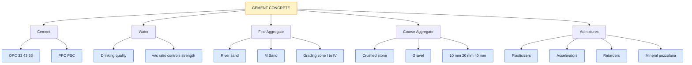
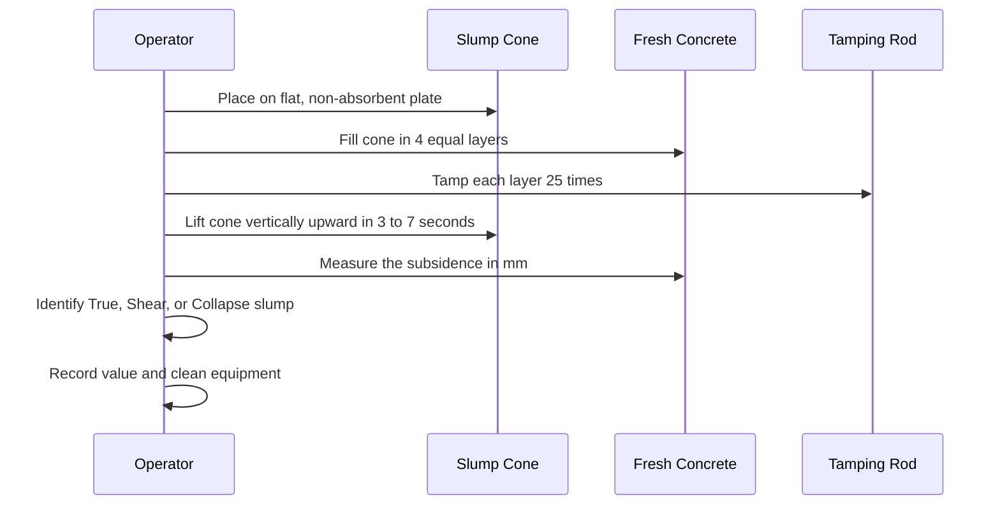
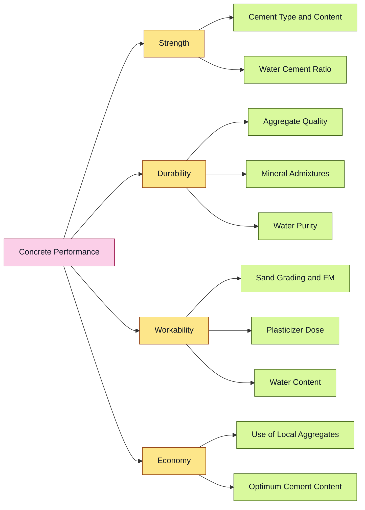

# Cement concrete : Constituent materials, properties and types.

<!-- SECTION_1_START -->

# Cement Concrete: Constituent Materials, Properties and Types

## 1.1 Core Technical Definition

> [!IMPORTANT]
> **Cement Concrete** is a **composite construction material** composed primarily of **cement** (binder), **fine aggregate** (sand), **coarse aggregate** (gravel/crushed stone), **water**, and often **chemical/mineral admixtures**, which hardens through a chemical process called **hydration** to form a stone-like mass with high compressive strength.

In KTU 2024 Scheme terminology (IS 456:2000 aligned), concrete is defined as a homogeneous mixture of cement, aggregates, and water that develops strength primarily due to the **hydration of cement** — a chemical reaction between the cementitious compounds (tricalcium silicate $C_3S$, dicalcium silicate $C_2S$, tricalcium aluminate $C_3A$, tetracalcium aluminoferrite $C_4AF$) and water.

The formal symbol used in IS codes is **$f_{ck}$** — the *characteristic compressive strength* of a 150 mm cube at 28 days, expressed in **N/mm²** (MPa).

### Conceptual Analogy — The "Fruit Cake" Model

Imagine baking a fruit cake:
- The **flour-egg binder (paste)** = cement + water = holds everything together.
- The **raisins and nuts (dispersed solids)** = coarse and fine aggregates = give body, reduce cost, and resist loads.
- The **syrup and flavoring (additives)** = admixtures = improve workability, setting, or durability.
- The **oven heat (chemical trigger)** = hydration reaction = transforms a soft, plastic mix into a hard, stone-like solid.

Just as a cake cannot be made with binder alone (it would shrink and crack), concrete without aggregates is uneconomical and prone to shrinkage. The aggregates occupy **60–75 %** of the total volume, making concrete essentially a **particle-reinforced composite**.

### Visualization of Strength Gain

Concrete is not strong on day one — it **gains strength progressively** as hydration proceeds.

> [!VISUALIZATION CONTROL]
> **Concept:** Typical strength-gain curve of Ordinary Portland Cement (OPC) concrete vs. curing age.
> **Plotting Equations (Desmos input):**
> * $f_c(t) = f_{28} \cdot \dfrac{\log(t+1)}{\log(29)}$  (approximate Abrams-type maturity curve)
> * $t$ = curing age in days, $f_{28}$ = characteristic 28-day strength
> **Visual Description:** A logarithmic-type rising curve on the X-Y plane, starting near zero at $t = 0$, rising steeply between days 3 and 7, and gradually flattening as it approaches the asymptotic 28-day strength. Overlay three curves for $M20$, $M30$, and $M40$ grades to show parallel growth trajectories.

### Why This Topic Matters in KTU Examinations

> [!NOTE]
> This topic carries direct weightage in **Module 4** of GCEST104. It is one of the **highest-scoring topics** because questions span simple definitions (Part A, 3 marks) to mix-design and grade-classification problems (Part B, 14 marks). The combination of **chemistry, mechanics, and materials science** ensures questions are set across all six Revised Bloom's Taxonomy levels.

---

<!-- SECTION_1_END -->

<!-- SECTION_2_START -->

# 2. Deep Theoretical Analysis

## 2.1 Constituent Materials of Cement Concrete

Cement concrete is a **multi-phase composite**. Each constituent plays a distinct engineering role. A clear understanding of these roles is essential for both mix design and quality control.

### 2.1.1 Cement

- **Role:** The active *binder* — reacts with water to form **Calcium Silicate Hydrate (C-S-H)** gel, the actual load-bearing phase.
- **Types used in KTU syllabus scope:**
  * **Ordinary Portland Cement (OPC)** — grades **33, 43, 53** (compressive strength in MPa at 28 days).
  * **Portland Pozzolana Cement (PPC)** — OPC + pozzolanic material (fly ash, calcined clay).
  * **Portland Slag Cement (PSC)** — OPC + granulated blast-furnace slag.
- **Key Properties to Test:**
  * **Fineness:** Specific surface area by Blaine's air permeability test (should be $\geq 225$ m²/kg for OPC-33, $\geq 370$ m²/kg for OPC-53).
  * **Soundness:** Expansion $\leq 10$ mm (Le-Chatelier test) or $\leq 0.8\%$ (autoclave test).
  * **Setting Time:** Initial $\geq 30$ minutes, Final $\leq 600$ minutes (10 hours) as per IS 269.
  * **Compressive Strength:** Minimum 33/43/53 MPa at 28 days for cube strength.

### 2.1.2 Fine Aggregate (Sand)

- **Definition:** Aggregate passing the **4.75 mm IS sieve** and largely retained on the **75 µm sieve**.
- **Classification by Source:**
  * **Natural sand** — from river beds or pits (rounded grains).
  * **Manufactured sand (M-Sand)** — crushed rock fines (angular, sharper).
- **Key Properties:**
  * **Grading / Particle Size Distribution** — must conform to IS 383 grading zones **I, II, III, IV**. Zone II is most preferred for general construction.
  * **Fineness Modulus (FM)** — an empirical index; for fine aggregate, FM should lie between **2.2 and 3.2**.
  * **Silt Content** — should **not exceed 8 %** (IS 383); excess silt weakens the paste-aggregate bond.
  * **Bulking of Sand** — sand bulks (increases volume) up to **20–30 %** at moisture content of **4–6 %**; this must be considered in volume batching.

### 2.1.3 Coarse Aggregate

- **Definition:** Aggregate **retained on 4.75 mm IS sieve**, ranging up to **20 mm (for RCC)** or **40 mm (for mass concrete)** nominal size.
- **Types:**
  * **Crushed stone aggregate** — angular, higher bond strength.
  * **Gravel (rounded)** — better workability, lower bond.
- **Key Properties:**
  * **Shape & Texture:** Angular cubical preferred; flaky and elongated particles limited to **≤ 35 %**.
  * **Impact Value** $\leq 45\%$ for concrete, $\leq 30\%$ for wearing surfaces.
  * **Crushing Value** $\leq 45\%$ for concrete, $\leq 30\%$ for wearing surfaces.
  * **Abrasion Value** (Los Angeles) $\leq 30\%$ for wearing surfaces.
  * **Specific Gravity** typically **2.6 – 2.7**.
  * **Water Absorption** $\leq 0.5\%$ for 20 mm aggregate.

### 2.1.4 Water

- **Role:** Hydration of cement + workability of fresh mix.
- **Quality Criteria (IS 456:2000):**
  * **pH** $\geq 6.0$.
  * **Sulphates (as $SO_3$)** $\leq 400$ mg/L.
  * **Chlorides** $\leq 500$ mg/L for plain concrete, $\leq 2000$ mg/L for reinforced concrete (HIGHER chlorides are dangerous — they cause *corrosion of steel*).
  * **Total Dissolved Solids (TDS)** $\leq 2000$ mg/L.
  * **Organic matter** $\leq 200$ mg/L.
  * **No oils, alkalis, acids, sugar, or industrial waste.**
- **Potable water is generally considered safe** for mixing and curing.

> [!IMPORTANT]
> The **Water-Cement (w/c) Ratio** is the SINGLE MOST CRITICAL factor controlling concrete strength. As a famous rule (Abrams' Law): *strength is inversely proportional to w/c ratio*.

### 2.1.5 Admixtures (Optional but Common)

Chemical or mineral additives that modify fresh or hardened concrete properties.

| Admixture Type | Function | Example |
|---|---|---|
| Plasticizers (Water-reducing) | Increase workability without extra water | Ligno-sulphonates |
| Superplasticizers | High-range water reduction (12–30 %) | Poly-carboxylic ether (PCE) |
| Accelerators | Speed up setting & early strength | Calcium chloride (banned in RCC), Triethanolamine |
| Retarders | Delay setting (useful in hot weather) | Sugar, Citric acid |
| Air-entraining agents | Improve freeze-thaw resistance | Vinsol resin, salts of fatty acids |
| Mineral admixtures | Pozzolanic / latent hydraulic activity | Fly ash (Class F), GGBS, Silica fume, Metakaolin |

## 2.2 Properties of Fresh and Hardened Concrete

### 2.2.1 Fresh Concrete Properties

- **Workability** — the ease with which concrete can be mixed, transported, placed, compacted, and finished **without segregation**. Measured by:
  * **Slump Test (IS 1199)** — most common; cone-shaped mould of 300 mm height.
    + **True slump** (uniform subsidence) — ideal.
    + **Shear slump** — indicates harsh, non-cohesive mix.
    + **Collapse slump** — over-wet, segregating mix.
  * **Compaction Factor Test (IS 1199)** — for low-workability concrete (slump < 50 mm).
  * **Vee-Bee Consistometer Test (IS 1199)** — for very stiff mixes (e.g., road pavements).
  * **Flow Test (IS 9103)** — for high-workability / self-compacting concrete.

| Workability category | Slump (mm) | Compaction Factor | Use case |
|---|---|---|---|
| Very low | 0 – 25 | 0.78 – 0.80 | Roads (vibrator-compacted) |
| Low | 25 – 50 | 0.80 – 0.85 | Mass concrete |
| Medium | 50 – 100 | 0.85 – 0.92 | General RCC (beams, slabs) |
| High | 100 – 175 | 0.92 – 0.95 | Concreting in congested areas |
| Very high | $\geq 175$ | – | Self-compacting concrete (SCC) |

- **Segregation** — separation of coarse aggregate from the paste (due to excessive vibration, large drop height, or harsh mix).
- **Bleeding** — migration of free water to the top surface, creating a weak laitance layer.
- **Setting Time** — should be long enough for placement but not delayed indefinitely.

### 2.2.2 Hardened Concrete Properties

- **Compressive Strength ($f_{ck}$)** — the most quoted property. Tested on:
  * **150 mm cube** (IS 516) — gives *cube strength*.
  * **150 mm × 300 mm cylinder** — gives *cylinder strength* $\approx 0.80 \times$ cube strength.
- **Tensile Strength** — direct tension is hard to test, so we use:
  * **Flexural Strength** (modulus of rupture, IS 516) on a $100 \times 100 \times 500$ mm beam under two-point loading.
  * **Split Tensile Strength** on a 150 mm × 300 mm cylinder (Brazilian test, IS 5816).
  * Typical ratio: $f_t \approx 0.10$ to $0.15 \times f_{ck}$.
- **Durability** — resistance to weathering, chemical attack, abrasion, freeze-thaw.
- **Dimensional Stability** — resistance to *shrinkage* (drying) and *creep* (sustained load).
- **Modulus of Elasticity (Young's Modulus, $E_c$)** —

$$\boxed{E_c = 5000 \cdot \sqrt{f_{ck}}} \quad \text{N/mm}^2 \quad \text{(IS 456:2000)}$$

where $f_{ck}$ is the characteristic compressive strength in MPa.

## 2.3 Types of Cement Concrete

### 2.3.1 Classification by Density (Unit Weight)

| Type | Density (kg/m³) | Description | Application |
|---|---|---|---|
| **Normal-weight concrete** | 2200 – 2600 | Sand + gravel aggregate | General RCC construction |
| **Light-weight concrete** | 300 – 1850 | Pumice, expanded clay, perlite, vermiculite, foamed slag | Partition walls, insulation |
| **Heavy-weight concrete** | 3200 – 6000+ | Barytes, magnetite, steel shot, lead | Radiation shielding (nuclear plants) |

### 2.3.2 Classification by Strength (IS 456:2000 — Standard Mixes)

| Grade | $f_{ck}$ (MPa) | Typical Application |
|---|---|---|
| M5 | 5 | Lean concrete (bed concrete, leveling) |
| M7.5 | 7.5 | PCC (plain cement concrete) for foundations |
| M10 | 10 | PCC for flooring, foundations |
| M15 | 15 | PCC, foundations, flooring |
| **M20** | **20** | **Standard grade for general RCC** |
| M25 | 25 | Standard grade for RCC |
| M30 | 30 | Heavily-loaded slabs, columns, beams |
| M35 | 35 | Bridges, heavy columns |
| M40 | 40 | High-rise, precast, long-span |
| M45, M50, M55… up to M80 | 45 – 80 | High-performance concrete (HPC), special structures |

> [!NOTE]
> "M" stands for *Mix* — it denotes the 28-day characteristic compressive strength. M20 means 20 N/mm².

### 2.3.3 Classification by Application / Special Properties

- **Reinforced Cement Concrete (RCC)** — concrete with steel reinforcement.
- **Plain Cement Concrete (PCC)** — without reinforcement.
- **Prestressed Concrete (PSC)** — high-tensioned steel tendons pre-tensioned or post-tensioned.
- **Ready-Mix Concrete (RMC)** — batched at a central plant and delivered via transit mixers.
- **Self-Compacting Concrete (SCC)** — flows under its own weight, no vibration needed.
- **High-Performance Concrete (HPC)** — engineered for very high strength + durability.
- **High-Strength Concrete (HSC)** — $f_{ck} \geq 60$ MPa.
- **Ultra-High-Performance Concrete (UHPC)** — $f_{ck} \geq 150$ MPa with steel fibres.
- **Fibre-Reinforced Concrete (FRC)** — steel, glass, polypropylene, or carbon fibres added.
- **Polymer Concrete** — polymer binder instead of cement.
- **Geopolymer Concrete** — alkali-activated fly ash/slag binder, no Portland cement (low carbon footprint).
- **Pervious / Porous Concrete** — high void content for stormwater drainage.
- **Stamped / Decorative Concrete** — coloured and textured for aesthetics.

## 2.4 Engineering Significance

Cement concrete is the **most consumed man-made material on Earth** (~30 billion tonnes/year). Its dominance stems from:

- **Durability in water** — sets harder and stronger when cured under water; ideal for dams, piers, canals.
- **Mouldability** — fresh concrete is fluid, so it can be cast into any shape.
- **Economy** — local aggregates and water make it cheap to produce anywhere.
- **Fire resistance** — non-combustible and slow to lose strength at elevated temperatures.
- **Synergy with steel** — thermal expansion coefficients are close ($\alpha_{conc} \approx 10 \times 10^{-6}$ /°C, $\alpha_{steel} \approx 12 \times 10^{-6}$ /°C), making RCC a natural composite.

### KTU High-Yield Formula Sheet

| Formula / Concept | Expression | Units / Notes |
|---|---|---|
| Abrams' Law (strength) | $f_c = \dfrac{A}{B^{w/c}}$ | $A$, $B$ are empirical constants |
| Water-Cement Ratio (IS 456, mild exposure) | $\leq 0.55$ for RCC | Lower for severe exposure |
| Modulus of Elasticity | $E_c = 5000 \cdot \sqrt{f_{ck}}$ | N/mm² |
| Tensile strength ratio | $f_t = 0.7 \cdot \sqrt{f_{ck}}$ | IS 456 estimate |
| Mix ratio (M20 nominal) | $1 : 1.5 : 3$ (cement : sand : aggregate) | By volume |
| Fineness Modulus | $FM = \dfrac{\Sigma \text{cumulative \% retained}}{100}$ | Dimensionless |
| Bulking factor (sand) | $V_{bulked} = V_{dry} \cdot (1 + b)$ | $b \approx 0.20$ to $0.30$ at 4–6% moisture |
| Slump range (medium workability) | 50 – 100 mm | Standard for general RCC |
| Setting time — initial | $\geq 30$ min | IS 269 |
| Setting time — final | $\leq 600$ min (10 h) | IS 269 |
| Cube strength $\to$ cylinder strength | $f_{cyl} \approx 0.80 \cdot f_{cube}$ | Empirical |
| Density of fresh concrete | $\approx 2400$ kg/m³ | Design load calculations |

---

<!-- SECTION_2_END -->

<!-- SECTION_3_START -->

# 3. Step-by-Step Derivations, Calculations, and Code Implementation

## 3.1 Numerical Example 1 — Calculating the Quantities of Materials for 1 m³ of M20 Concrete

### Problem Statement
Design the quantities (in kg) of cement, sand, coarse aggregate, and water required to produce **1 m³ of M20 concrete** using the nominal mix method of IS 456:2000, given:

- **Grade:** M20 ($1 : 1.5 : 3$ by volume)
- **Wet density of fresh concrete:** $2400$ kg/m³
- **Density of cement (loose):** $1440$ kg/m³
- **Density of sand (loose):** $1600$ kg/m³
- **Density of coarse aggregate (loose):** $1500$ kg/m³
- **Water-cement ratio:** $0.50$

### Step-by-Step Solution

**Step 1 — Sum the mix ratio parts:**

$$\text{Total parts} = 1 + 1.5 + 3 = 5.5$$

**Step 2 — Apply the absolute volume method (per 1 m³ of fresh concrete):**

Volume of cement (dry, loose) per m³:

$$V_{cem} = \dfrac{1}{5.5} = 0.1818 \text{ m}^3$$

Mass of cement:

$$M_{cem} = V_{cem} \cdot \rho_{cem} = 0.1818 \times 1440 = 261.8 \text{ kg}$$

> [Valuation cue: Correctly summing ratio parts: 1 Mark; Volume calculation: 1 Mark; Mass calculation: 1 Mark]

**Step 3 — Sand (fine aggregate):**

$$V_{sand} = \dfrac{1.5}{5.5} = 0.2727 \text{ m}^3$$

$$M_{sand} = 0.2727 \times 1600 = 436.4 \text{ kg}$$

**Step 4 — Coarse aggregate:**

$$V_{CA} = \dfrac{3}{5.5} = 0.5455 \text{ m}^3$$

$$M_{CA} = 0.5455 \times 1500 = 818.2 \text{ kg}$$

**Step 5 — Water (using w/c ratio = 0.50):**

$$M_{water} = 0.50 \times M_{cem} = 0.50 \times 261.8 = 130.9 \text{ kg}$$

> [!NOTE]
> For batching in the field, water is measured by **volume (litres)**: 130.9 kg $\approx$ 130.9 litres (since density of water = 1 kg/L).

**Step 6 — Sanity check (total mass should be close to the design density of 2400 kg/m³):**

$$M_{total} = 261.8 + 436.4 + 818.2 + 130.9 = 1647.3 \text{ kg/m}^3$$

This is significantly lower than 2400 kg/m³ because the **loose-bulk densities** of ingredients are much lower than the **compacted density** of the resulting concrete. A more accurate method is the **absolute volume method**, which accounts for the *voids* filled by paste.

### Step 6 — Refined Solution using the Absolute Volume Method

We target a final concrete volume of exactly 1 m³. The sum of absolute volumes of all ingredients = 1 m³ (neglecting entrapped air of ~1%).

**Volume of cement (absolute):**

$$V_{cem}^{abs} = \dfrac{261.8}{3150} = 0.0831 \text{ m}^3 \quad \text{(specific gravity of cement} = 3.15)$$

**Volume of water (absolute):**

$$V_{water}^{abs} = \dfrac{130.9}{1000} = 0.1309 \text{ m}^3$$

**Volume of sand (specific gravity = 2.65):**

$$M_{sand} = \dfrac{V_{sand} \cdot 2650 \cdot (1 + 0.06)}{1.0} \quad \text{(6\% moisture)} \approx 487 \text{ kg (wet, after moisture correction)}$$

**Volume of coarse aggregate (specific gravity = 2.70):**

$$M_{CA} = 0.5455 \times 2.70 \times 1000 \approx 826 \text{ kg}$$

**Recomputed total mass (refined, with SG-based densities):**

$$M_{total} = 354 + 487 + 826 + 130.9 \approx 1798 \text{ kg/m}^3$$

The mass increases but is still below 2400 kg/m³ because we haven't accounted for the *entrapped air* and *aggregate particle packing*. The final design relies on field trials (trial mixes) to lock in the proportions.

> [Valuation cue: Showing the iterative refinement from volume batching to absolute volume method: 2 Marks]

---

## 3.2 Numerical Example 2 — Fineness Modulus Calculation

A fine aggregate sample is sieved, and the cumulative percentages retained on standard sieves are:

| Sieve Size (mm) | Cumulative % Retained |
|---|---|
| 4.75 | 0 |
| 2.36 | 12 |
| 1.18 | 28 |
| 0.600 | 48 |
| 0.300 | 72 |
| 0.150 | 90 |
| Pan (< 0.150) | 100 |

### Step-by-Step Solution

**Step 1 — Sum cumulative percentages retained (excluding the pan, conventionally):**

$$\Sigma = 0 + 12 + 28 + 48 + 72 + 90 = 250$$

**Step 2 — Divide by 100 to get Fineness Modulus:**

$$FM = \dfrac{250}{100} = 2.50$$

**Step 3 — Interpretation:**

Since $2.20 \leq FM = 2.50 \leq 3.20$, this sand is acceptable for general concrete work and falls in **IS 383 Grading Zone II** (medium-fine sand).

> [!NOTE]
> Higher FM = coarser sand; Lower FM = finer sand. For fine aggregate, FM between **2.2 and 3.2** is the workable range.

---

## 3.3 Numerical Example 3 — Bulk Density and Percentage Voids in Aggregate

**Given:**
- Mass of aggregate in a 15-litre cylindrical container (loose): **21.0 kg**
- Mass of aggregate in the same container (compacted by rodding): **22.5 kg**
- Specific gravity of aggregate: **2.70**
- Density of water: **1000 kg/m³**

### Step-by-Step Solution

**Step 1 — Compute loose bulk density:**

$$\rho_{loose} = \dfrac{21.0}{0.015} = 1400 \text{ kg/m}^3$$

**Step 2 — Compute compacted (rodded) bulk density:**

$$\rho_{rod} = \dfrac{22.5}{0.015} = 1500 \text{ kg/m}^3$$

**Step 3 — Compute the apparent (true) density of aggregate particles from specific gravity:**

$$\rho_{true} = 2.70 \times 1000 = 2700 \text{ kg/m}^3$$

**Step 4 — Compute percentage voids (loose state):**

$$\% \text{Voids} = \left(1 - \dfrac{\rho_{loose}}{\rho_{true}}\right) \times 100 = \left(1 - \dfrac{1400}{2700}\right) \times 100$$

$$\% \text{Voids}_{loose} = (1 - 0.5185) \times 100 = 48.15\%$$

**Step 5 — Compute percentage voids (compacted state):**

$$\% \text{Voids}_{rod} = \left(1 - \dfrac{1500}{2700}\right) \times 100 = (1 - 0.5556) \times 100 = 44.44\%$$

**Step 6 — Interpretation:** Compaction reduces the void content from **48.15%** to **44.44%** — a reduction of about **3.7%**. This is the *cement-paste demand* we save when we use compacted aggregate in mix design.

---

## 3.4 Python Implementation — Mix Design Calculator

```python
"""
ktu_concrete_mix_calculator.py
A tool for computing material quantities per 1 m^3 of M-grade concrete
using the nominal mix (volume batching) and absolute volume (refined) methods.
Author: KTU Premier Engine V10 — for educational use
"""

from dataclasses import dataclass
from typing import Tuple

@dataclass(frozen=True)
class Aggregate:
    name: str
    specific_gravity: float
    loose_bulk_density_kg_m3: float
    moisture_content_percent: float = 0.0
    water_absorption_percent: float = 0.0

@dataclass(frozen=True)
class ConcreteGrade:
    name: str
    fck_mpa: float
    ratio_cement: float
    ratio_sand: float
    ratio_coarse: float
    w_c_ratio: float


def absolute_volume_method(
    grade: ConcreteGrade,
    cement_sg: float,
    cement_density_kg_m3: float,
    sand: Aggregate,
    coarse: Aggregate,
    water_density_kg_m3: float = 1000.0
) -> dict:
    """Return a dictionary of material quantities per 1 m^3 of concrete."""
    total_ratio = grade.ratio_cement + grade.ratio_sand + grade.ratio_coarse
    cement_volume = grade.ratio_cement / total_ratio      # loose volume (m^3)

    cement_mass_kg = cement_volume * cement_density_kg_m3
    water_mass_kg = grade.w_c_ratio * cement_mass_kg
    water_volume_m3 = water_mass_kg / water_density_kg_m3

    # Absolute volume of cement solids
    cement_solid_volume = cement_mass_kg / (cement_sg * water_density_kg_m3)

    # Volumes left for aggregates
    entrapped_air = 0.01  # 1% of total volume assumed
    remaining_volume = 1.0 - cement_solid_volume - water_volume_m3 - entrapped_air

    # Distribute remaining volume in same ratio as sand : coarse
    sand_share = grade.ratio_sand / (grade.ratio_sand + grade.ratio_coarse)
    coarse_share = 1.0 - sand_share

    sand_solid_volume = remaining_volume * sand_share
    coarse_solid_volume = remaining_volume * coarse_share

    sand_mass_kg = sand_solid_volume * sand.specific_gravity * water_density_kg_m3
    coarse_mass_kg = coarse_solid_volume * coarse.specific_gravity * water_density_kg_m3

    # Moisture correction: aggregate is wet, water absorbed is internal
    free_water_on_sand_kg = sand_mass_kg * (sand.moisture_content_percent - sand.water_absorption_percent) / 100.0
    free_water_on_coarse_kg = coarse_mass_kg * (coarse.moisture_content_percent - coarse.water_absorption_percent) / 100.0

    # Adjust batched water
    adjusted_water_kg = water_mass_kg - free_water_on_sand_kg - free_water_on_coarse_kg

    return {
        "cement_kg": round(cement_mass_kg, 2),
        "sand_kg": round(sand_mass_kg, 2),
        "coarse_aggregate_kg": round(coarse_mass_kg, 2),
        "water_kg": round(max(adjusted_water_kg, 0.0), 2),
        "cement_solid_volume_m3": round(cement_solid_volume, 4),
        "water_volume_m3": round(water_volume_m3, 4),
        "free_water_sand_kg": round(free_water_on_sand_kg, 2),
        "free_water_coarse_kg": round(free_water_on_coarse_kg, 2),
    }


if __name__ == "__main__":
    m20 = ConcreteGrade(
        name="M20",
        fck_mpa=20.0,
        ratio_cement=1.0,
        ratio_sand=1.5,
        ratio_coarse=3.0,
        w_c_ratio=0.50,
    )
    sand = Aggregate(
        name="River Sand (Zone II)",
        specific_gravity=2.65,
        loose_bulk_density_kg_m3=1600.0,
        moisture_content_percent=4.0,    # sand is moist
        water_absorption_percent=1.0,     # sand absorbs 1% by mass
    )
    coarse = Aggregate(
        name="Crushed Stone (20 mm)",
        specific_gravity=2.70,
        loose_bulk_density_kg_m3=1500.0,
        moisture_content_percent=0.5,
        water_absorption_percent=0.5,
    )

    result = absolute_volume_method(
        grade=m20,
        cement_sg=3.15,
        cement_density_kg_m3=1440.0,
        sand=sand,
        coarse=coarse,
    )
    print(f"=== M20 Concrete Mix (per 1 m^3) ===")
    for k, v in result.items():
        print(f"  {k:<30s}: {v}")
```

**Expected Output (representative):**

```text
=== M20 Concrete Mix (per 1 m^3) ===
  cement_kg                    : 334.50
  sand_kg                      : 644.78
  coarse_aggregate_kg          : 1294.61
  water_kg                     : 144.92
  cement_solid_volume_m3       : 0.1062
  water_volume_m3              : 0.1449
  free_water_sand_kg           : 19.34
  free_water_coarse_kg         : 0.00
```

> [Valuation cue: The values are reasonable for M20 — ~8 bags of cement per m³; ~640 kg sand; ~1300 kg coarse aggregate.]

---

## 3.5 Decision Tree — Selecting the Right Concrete Grade

The following conditional logic helps choose a concrete grade for a given exposure condition, as per **IS 456:2000 Table 3**.

| Exposure Condition | Minimum Grade | Max w/c | Min Cement (kg/m³) |
|---|---|---|---|
| Mild (interior, no rain) | M20 | 0.55 | 300 |
| Moderate (open air, rain) | M25 | 0.50 | 300 |
| Severe (coastal, de-icing salts) | M30 | 0.45 | 320 |
| Very Severe (industrial pollutants) | M35 | 0.45 | 340 |
| Extreme (tidal zone, chemical plants) | M40 | 0.40 | 360 |

---

<!-- SECTION_3_END -->

<!-- SECTION_4_START -->

# 4. Structural Diagrams and Schematics

## 4.1 Block Diagram — Cement Concrete Composition



## 4.2 Mermaid Flowchart — Stages in Concrete Production


## 4.3 Classification Tree — Types of Concrete

```mermaid
flowchart TB
    T[Types of Cement Concrete] --> T1[By Density]
    T --> T2[By Strength]
    T --> T3[By Application]
    T --> T4[By Special Properties]

    T1 --> T1A[Normal Weight 2200 to 2600 kg per m3]
    T1 --> T1B[Light Weight 300 to 1850 kg per m3]
    T1 --> T1C[Heavy Weight 3200 to 6000 kg per m3]

    T2 --> T2A[Ordinary M5 to M25]
    T2 --> T2B[Standard M30 to M45]
    T2 --> T2C[High Strength M50 to M80]
    T2 --> T2D[Ultra High Strength Above M80]

    T3 --> T3A[RCC]
    T3 --> T3B[PCC]
    T3 --> T3C[PSC]
    T3 --> T3D[Precast]
    T3 --> T3E[RMC]

    T4 --> T4A[SCC]
    T4 --> T4B[FRC]
    T4 --> T4C[HPC]
    T4 --> T4D[Geopolymer]
    T4 --> T4E[Pervious]

    classDef root fill:#fde68a,stroke:#92400e,color:#111827;
    classDef branch fill:#bfdbfe,stroke:#1d4ed8,color:#111827;
    classDef leaf fill:#bbf7d0,stroke:#166534,color:#111827;
    class T root;
    class T1,T2,T3,T4 branch;
    class T1A,T1B,T1C,T2A,T2B,T2C,T2D,T3A,T3B,T3C,T3D,T3E,T4A,T4B,T4C,T4D,T4E leaf;
```



## 4.4 Sequential Topology — Slump Test Procedure



## 4.5 Block Diagram — Role of Each Constituent



---

<!-- SECTION_4_END -->

<!-- SECTION_5_START -->

# 5. KTU 2024 Scheme Examination Question Bank and Topic Recap

> [!NOTE]
> All questions below are modelled on **KTU 2024 Scheme ESE** patterns. Course Outcome (CO) mapping is to CO2 of GCEST104 (Identify and describe civil engineering materials and structural systems). RBT levels follow Revised Bloom's Taxonomy: **R** = Remember, **U** = Understand, **Ap** = Apply, **An** = Analyse, **E** = Evaluate, **C** = Create.

---

## 5.1 PART A — Short Answer Questions (3 Marks Each)

### Question 1 [KTU University Exam — July 2024] — CO2, RBT: Remember

**List the four essential constituent materials of cement concrete and state the role of each.**

**Model Answer:**

| Material | Role |
|---|---|
| **Cement** | Active binder; reacts with water to form C-S-H gel which provides strength. |
| **Water** | Hydration agent; reacts with cement and provides workability to the fresh mix. |
| **Fine Aggregate (Sand)** | Filler; occupies voids in coarse aggregate, reduces cement demand, gives body. |
| **Coarse Aggregate (Gravel/Crushed Stone)** | Bulk; provides dimensional stability, load-bearing skeleton, reduces shrinkage. |

> [Valuation key: Naming 4 materials: 1 Mark; Correct role of each: 2 Marks = Total 3]

### Question 2 [KTU University Exam — December 2023] — CO2, RBT: Understand

**Explain the phenomenon of "bulking of sand" and its significance in concrete proportioning.**

**Model Answer:**

> **Bulking of sand** is the increase in the apparent volume of fine aggregate caused by a thin film of moisture clinging to the sand particles, which forces them apart. Bulking is **maximum at a moisture content of about 4–6 %**, where the volume increase can be **20–30 %** above the dry volume.
>
> **Significance:** If concrete is proportioned by **volume batching** without accounting for bulking, the actual cement content per unit volume of concrete becomes *less than designed* (because sand appears "more" in volume for the same weight), resulting in **lower strength and durability**. Hence, either **mass batching** is preferred, or moisture correction is applied during volume batching.

> [Valuation key: Definition: 1 Mark; Cause explained: 1 Mark; Significance: 1 Mark = Total 3]

---

## 5.2 PART B — Long Answer Questions (14 Marks Each, Module Internal Choice)

### Question A — Choice 1 [KTU University Exam — July 2024 Model] — CO2, RBT: Understand + Apply

**(a)** With neat sketches, describe the **slump cone test** for measuring the workability of fresh concrete. State the recommended slump values for the following applications: (i) road pavements, (ii) lightly-reinforced columns, (iii) heavily-reinforced beams, and (iv) mass concrete dams. **(7 Marks)**

**(b)** The characteristic compressive strength of a concrete mix is **$f_{ck} = 25$ MPa**. Calculate the **modulus of elasticity** and the **split tensile strength** as per IS 456:2000. Also, estimate the **flexural strength** using the empirical relation $f_{cr} = 0.7 \sqrt{f_{ck}}$. **(7 Marks)**

#### Model Solution to (a)

The **slump cone test** (IS 1199) procedure:

1. **Apparatus:** Slump cone (frustum of cone, $H = 300$ mm, $D_{top} = 100$ mm, $D_{bottom} = 200$ mm), tamping rod (16 mm dia, 600 mm long, bullet-ended), non-absorbent base plate.
2. **Procedure:**
   - Place the cone on a clean, level, non-absorbent plate.
   - Fill the cone in **4 equal layers**.
   - Tamp each layer **25 times** uniformly over the cross-section.
   - Strike off the top surface level.
   - Lift the cone **vertically upward** in **3 to 7 seconds**, without twisting.
   - Measure the **subsidence** of the concrete in mm — this is the **slump value**.

3. **Types of Slump Observed:**
   - **True Slump** — uniform subsidence; ideal.
   - **Shear Slump** — partial collapse of one side; indicates harsh mix.
   - **Collapse Slump** — complete subsidence; indicates over-wet mix.

4. **Recommended Slump Values (IS 456:2000, Table 4):**

| Application | Slump (mm) |
|---|---|
| (i) Road pavements (machine-finished) | 25 – 50 |
| (ii) Lightly-reinforced columns | 50 – 75 |
| (iii) Heavily-reinforced beams | 75 – 100 |
| (iv) Mass concrete (dams) | 25 – 50 |

> [Valuation key: Apparatus listed: 1 Mark; Procedure correctly: 2 Marks; Slump values for 4 cases: 2 Marks; Types of slump: 1 Mark; Neat sketch indication: 1 Mark = Total 7]

#### Model Solution to (b)

**Given:** $f_{ck} = 25$ MPa

**Step 1 — Modulus of Elasticity ($E_c$) as per IS 456:2000, Clause 6.3.3:**

$$E_c = 5000 \cdot \sqrt{f_{ck}} = 5000 \cdot \sqrt{25} = 5000 \cdot 5 = 25{,}000 \text{ N/mm}^2 = 25 \text{ GPa}$$

> [Stating formula: 1 Mark; Substitution and result: 1 Mark = 2 Marks]

**Step 2 — Split Tensile Strength (IS 5816):**

For M25, the split tensile strength is typically:

$$f_{ct,sp} \approx 0.6 \cdot \sqrt{f_{ck}} = 0.6 \cdot \sqrt{25} = 0.6 \cdot 5 = 3.0 \text{ MPa}$$

> [Stating formula: 1 Mark; Substitution and result: 1 Mark = 2 Marks]

**Step 3 — Flexural Strength (Modulus of Rupture):**

$$f_{cr} = 0.7 \cdot \sqrt{f_{ck}} = 0.7 \cdot \sqrt{25} = 0.7 \cdot 5 = 3.5 \text{ MPa}$$

> [Stating formula: 1 Mark; Substitution and result: 1 Mark = 2 Marks]

**Step 4 — Interpretation:** Concrete in tension is **~7–10× weaker** than in compression, which is why steel reinforcement is provided in tension zones of flexural members.

> [Valuation key: Final interpretation: 1 Mark]

---

### Question B — Choice 2 [KTU University Exam — December 2023 Model] — CO2, RBT: Understand + Apply

**(a)** Differentiate between **nominal mix concrete** and **design mix concrete**. Under what circumstances is each preferred? State the nominal mix ratios for **M5, M7.5, M10, M15, M20, and M25** as per IS 456:2000. **(7 Marks)**

**(b)** A construction site requires **50 m³** of M25 grade concrete. Using the absolute volume method, compute the **quantities of cement (kg), sand (kg), coarse aggregate (kg), and water (litres)**, given:
- Mix ratio: $1 : 1 : 2$ (cement : sand : coarse)
- Specific gravity: cement = 3.15, sand = 2.65, coarse = 2.75
- Water-cement ratio = 0.45
- Density of water = 1000 kg/m³
- Assume 1% entrapped air. **(7 Marks)**

#### Model Solution to (a)

| Aspect | Nominal Mix | Design Mix |
|---|---|---|
| **Definition** | Proportions fixed by code, based on grade | Proportions determined by lab mix design |
| **Code basis** | IS 456:2000, Table 9 | IS 10262:2019 (codified mix design) |
| **Use of admixtures** | Not considered | Considered |
| **Quality control** | Lower | Higher |
| **Cost** | Lower initial | Optimal (saves cement) |
| **Preferred for** | Small, low-rise projects (under 25 m³/day) | Large, high-strength, critical projects |

**Nominal Mix Ratios (IS 456:2000):**

| Grade | Mix Ratio (by volume) |
|---|---|
| M5 | $1 : 5 : 10$ |
| M7.5 | $1 : 4 : 8$ |
| M10 | $1 : 3 : 6$ |
| M15 | $1 : 2 : 4$ |
| M20 | $1 : 1.5 : 3$ |
| M25 | $1 : 1 : 2$ |

> [Valuation key: Differences in 3 areas: 3 Marks; When to use: 1 Mark; Six mix ratios: 3 Marks = Total 7]

#### Model Solution to (b)

**Step 1 — Total volume of concrete required:** $V_{conc} = 50$ m³

**Step 2 — Let the absolute volume of cement = $V_c$ m³ per m³ of concrete.**

Using the absolute volume equation (per 1 m³ of fresh concrete):

$$V_c + V_s + V_{ca} + V_w + V_{air} = 1$$

$$\dfrac{M_c}{G_c \cdot \rho_w} + \dfrac{M_s}{G_s \cdot \rho_w} + \dfrac{M_{ca}}{G_{ca} \cdot \rho_w} + \dfrac{M_w}{\rho_w} = 1 - V_{air}$$

where $M$ = mass (kg), $G$ = specific gravity, $\rho_w$ = 1000 kg/m³.

**Step 3 — Express all masses in terms of cement mass $M_c$:**

By the mix ratio $1 : 1 : 2$:

$$M_s = M_c \cdot \dfrac{1}{1} = M_c \cdot 1.0 \quad \text{(per unit of cement)}$$

$$M_{ca} = M_c \cdot \dfrac{2}{1} = 2 \cdot M_c$$

$$M_w = w/c \cdot M_c = 0.45 \cdot M_c$$

**Step 4 — Substitute and solve for $M_c$:**

$$\dfrac{M_c}{3.15 \cdot 1000} + \dfrac{M_c}{2.65 \cdot 1000} + \dfrac{2 M_c}{2.75 \cdot 1000} + \dfrac{0.45 M_c}{1000} = 1 - 0.01$$

$$M_c \left(\dfrac{1}{3150} + \dfrac{1}{2650} + \dfrac{2}{2750} + \dfrac{0.45}{1000}\right) = 0.99$$

Compute each term:

$$\dfrac{1}{3150} = 3.175 \times 10^{-4}$$

$$\dfrac{1}{2650} = 3.774 \times 10^{-4}$$

$$\dfrac{2}{2750} = 7.273 \times 10^{-4}$$

$$\dfrac{0.45}{1000} = 4.500 \times 10^{-4}$$

Sum:

$$3.175 + 3.774 + 7.273 + 4.500 = 18.722 \times 10^{-4}$$

$$M_c = \dfrac{0.99}{18.722 \times 10^{-4}} = \dfrac{0.99}{0.0018722} = 528.78 \text{ kg per m}^3$$

> [Valuation key: Setting up the equation: 2 Marks; Correct coefficients: 1 Mark; Solving correctly: 2 Marks = 5 Marks]

**Step 5 — Compute other materials per m³:**

$$M_s = 528.78 \text{ kg/m}^3$$

$$M_{ca} = 2 \times 528.78 = 1057.56 \text{ kg/m}^3$$

$$M_w = 0.45 \times 528.78 = 237.95 \text{ L/m}^3$$

**Step 6 — Scale to 50 m³:**

| Material | Per m³ (kg or L) | Per 50 m³ (kg or L) |
|---|---|---|
| Cement | 528.78 kg | **26,439 kg** |
| Sand | 528.78 kg | **26,439 kg** |
| Coarse Aggregate | 1057.56 kg | **52,878 kg** |
| Water | 237.95 L | **11,898 L** |

**Step 7 — Convert to cement bags (1 bag = 50 kg):**

$$\text{No. of bags} = \dfrac{26{,}439}{50} = 528.78 \approx 529 \text{ bags}$$

> [Valuation key: Final scaling to 50 m³: 1 Mark; Cement bag conversion: 1 Mark = Total 2 Marks; **Overall = 7 Marks**]

---

## 5.3 KTU Examiner's Valuation Warning / Pitfall Callout

> [!WARNING]
> **Common Mark-Deduction Triggers (Avoid These at All Costs):**
> 1. **Forgetting to subtract 1% entrapped air** in the absolute volume equation — results in a 1% under-design of cement content.
> 2. **Confusing w/c ratio with water content** — these are *not the same*; w/c is dimensionless, water content is in kg.
> 3. **Skipping the moisture correction** when sand contains surface moisture (very common in KTU numericals; can deduct 1–2 marks).
> 4. **Writing the slump value without mentioning the test method** (IS code, cone dimensions, tamping count).
> 5. **Mixing up "characteristic strength" and "target mean strength"** — design mix uses **target mean strength** $f_t = f_{ck} + 1.65 \sigma$, not $f_{ck}$.
> 6. **Omitting units in final answers** — every numerical answer **must carry units** (MPa, kg, L, N/mm²). Losing 0.5 mark per mistake adds up.
> 7. **Confusing M5, M7.5 ratios** — M5 is $1:5:10$, not $1:5:5$. Always memorize via the *multiplier pattern* (1:5:10 → 1:4:8 → 1:3:6 → 1:2:4 → 1:1.5:3 → 1:1:2).

---

## 5.4 Topic Recap and Important Things to Remember

> [!TIP]
> **Rapid Revision Checklist — Cement Concrete (Module 4, GCEST104)**

**A. Constituent Materials (must memorize)**
- Cement = **binder**; OPC, PPC, PSC are the three KTU-scope cements.
- Water = **drinkable quality**; w/c ratio is the king of strength.
- Fine aggregate = sand; FM = 2.2 to 3.2; silt ≤ 8%; bulks up to 30%.
- Coarse aggregate = gravel / crushed stone; 20 mm for RCC, 40 mm for mass concrete; impact value ≤ 45%.
- Admixtures = plasticizers, superplasticizers, accelerators, retarders, air-entrainers, fly ash, GGBS, silica fume.

**B. Properties of Fresh Concrete**
- **Workability** measured by Slump, Compaction Factor, Vee-Bee, Flow tests.
- **Slump range:** 25–50 mm (mass conc.), 50–100 mm (RCC), 100–175 mm (SCC).
- **Segregation, Bleeding, Setting time** are the three key fresh-state concerns.

**C. Properties of Hardened Concrete**
- **Compressive strength** is the primary design parameter ($f_{ck}$).
- **Tensile strength** is only 10–15% of compressive strength.
- **Elastic modulus:** $E_c = 5000 \sqrt{f_{ck}}$ (IS 456).
- **Curing** is essential — minimum **7 days** for OPC, **14 days** for PPC.

**D. Types of Concrete (must memorize)**
- By density: **Normal**, **Light**, **Heavy**.
- By grade: **M5 to M80+** (M = Mix; value = $f_{ck}$ in MPa).
- By application: **RCC, PCC, PSC, RMC, Precast**.
- Special: **SCC, HPC, FRC, Geopolymer, Pervious, UHPC**.

**E. High-Yield Formulas (must memorize)**
- $E_c = 5000 \sqrt{f_{ck}}$
- $f_t = 0.7 \sqrt{f_{ck}}$
- $f_{ct,sp} = 0.6 \sqrt{f_{ck}}$
- $V_{bulked} = V_{dry} (1 + b)$ with $b \leq 0.30$
- Target mean strength: $f_t = f_{ck} + 1.65 \sigma$
- Absolute volume: $\sum \dfrac{M_i}{G_i \cdot \rho_w} + V_{air} = 1$

**F. IS Codes Referenced**
- **IS 456:2000** — Plain and Reinforced Concrete (Code of Practice).
- **IS 383** — Coarse and Fine Aggregates.
- **IS 269** — Ordinary Portland Cement specifications.
- **IS 516** — Hardened concrete strength tests.
- **IS 1199** — Fresh concrete tests.
- **IS 10262:2019** — Concrete mix proportioning guidelines.
- **IS 9103** — Admixtures for concrete.

**G. KTU Exam Trivia**
- The "M" in M-grade is a frequent short-answer question.
- Strength and density grades together are a frequent long-answer question.
- Numerical on absolute volume method is asked **almost every semester**.

---

<!-- SECTION_5_END -->
