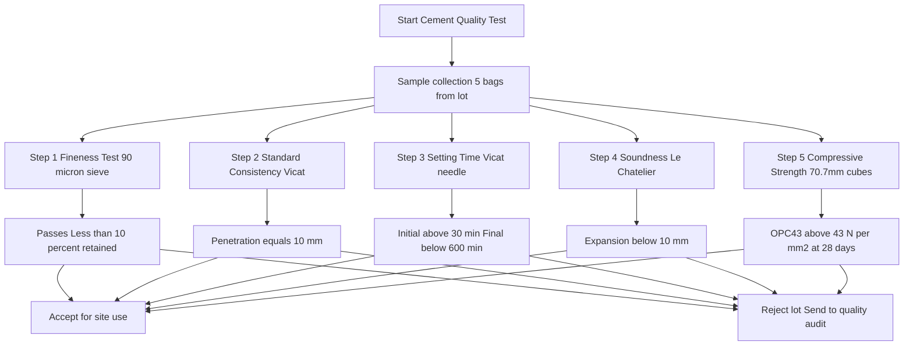
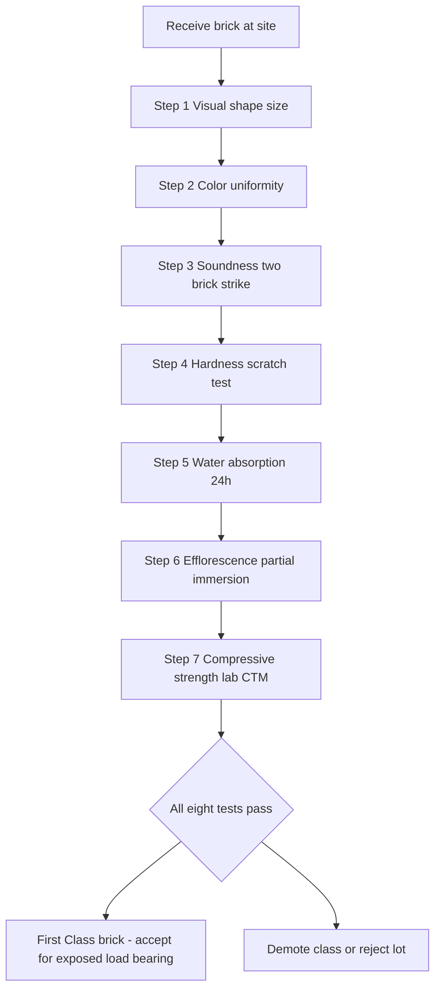
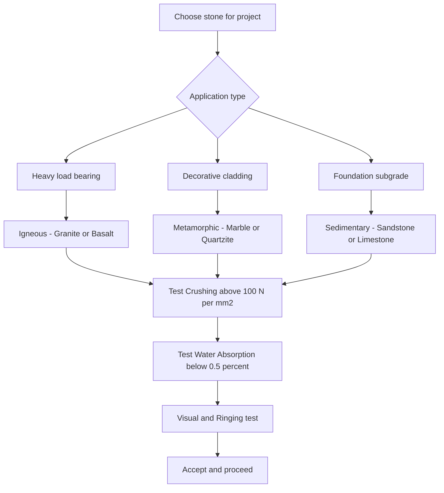

# Conventional construction materials: Brick, stone, sand, cement and timber- Classifications, Qualities, Tests and Uses of construction materials.

<!-- SECTION_1_START -->
# MODULE 4 — CONVENTIONAL CONSTRUCTION MATERIALS

## 1.1 Bricks

### Formal Definition
A **brick** is a fundamental masonry unit of structural and aesthetic utility, manufactured through the controlled shaping, drying, and kiln-firing of fine-grained argillaceous (clay-rich) soil. As per **IS 1077:1992 (Reaffirmed 2018)** and **BIS classification**, a standard modular brick measures **190 mm × 90 mm × 90 mm** (with a 10 mm mortar allowance, giving nominal dimensions of **200 mm × 100 mm × 100 mm**).

> [!IMPORTANT]
> **KTU Syllabus Highlight:** Bricks are categorized on the basis of *field quality* (First Class, Second Class, Third Class, Fourth Class) and not on raw material. Field engineers must learn to **visually identify** the class from physical characteristics during site inspection.

### Conceptual Analogy
Think of a brick as the **"alphabet of civil engineering"** — just as letters combine to form words and sentences, bricks combine with mortar to form walls, columns, arches, and even bridges. A well-made brick is the *DNA* of durable masonry; a poor one is the silent cause of structural failure decades later.

> [!NOTE]
> **Burnt-Clay Brick Composition:** Silica ($SiO_2$) 50–60%, Alumina ($Al_2O_3$) 20–30%, Lime ($CaO$) 2–5%, Iron Oxide ($Fe_2O_3$) < 7%, Magnesia < 1%.

### Sub-Classifications of Bricks

| Class | Compressive Strength | Water Absorption | Surface & Use |
|---|---|---|---|
| **First Class** | $\geq 10.5 \text{ N/mm}^2$ | $\leq 15\%$ | Sharp edges, smooth, ringing sound; exposed work, load-bearing walls |
| **Second Class** | $\geq 7.0 \text{ N/mm}^2$ | $\leq 22\%$ | Slight irregularities; hidden masonry, internal walls |
| **Third Class** | $\geq 5.0 \text{ N/mm}^2$ | $\leq 25\%$ | Rough, soft; temporary structures, low-rise work |
| **Fourth Class** | $\geq 3.5 \text{ N/mm}^2$ | — | Over-burnt/jhama bricks; aggregate in concrete (not masonry) |

---

## 1.2 Stones

### Formal Definition
**Building stone** is naturally occurring, dense, durable rock obtained by quarrying, cut into regular shapes, and used as a primary load-bearing or decorative construction material. Stones are classified per **IS 1123, IS 1124, IS 1706**, and **IS 7779**.

### Conceptual Analogy
Stones are the **"grandparents of construction"** — they have built the pyramids, the Roman aqueducts, and India's temples. A stone is essentially a *time capsule* of geological history; its mineral composition determines its strength just as a person's diet determines their health.

> [!IMPORTANT]
> **Key Principle:** The suitability of a stone is judged by its *petrological character* — the interlock between mineral grains determines resistance to weathering.

### Geological Classification of Stones

$$
\begin{aligned}
\text{Stones} \rightarrow \begin{cases} \text{Igneous (Granite, Basalt)} \\ \text{Sedimentary (Sandstone, Limestone)} \\ \text{Metamorphic (Marble, Slate, Quartzite)} \end{cases}
\end{aligned}
$$

---

## 1.3 Sand

### Formal Definition
**Sand** is a naturally occurring granular material composed of finely divided rock and mineral particles, with particle sizes ranging from **0.075 mm to 4.75 mm** (as per **IS 383:2016**). It forms the **fine aggregate** component of mortar and concrete.

### Conceptual Analogy
Sand is the **"glue's best friend"** — cement alone is too sticky and shrinks; sand bulks it up, reduces cost, prevents cracks, and provides dimensional stability. In concrete, sand fills the *gaps between coarse aggregate* like flour fills gaps between nuts in a chocolate-chip cookie.

> [!NOTE]
> **IS 383:2016 Grading Zones:** Sand for concrete is graded into **Zone I (coarsest) → Zone IV (finest)**. Zone II sand is most commonly preferred for general construction.

---

## 1.4 Cement

### Formal Definition
**Cement** is a hydraulic binding material that, when mixed with water, undergoes a chemical hydration reaction to form a hard, stony mass that binds aggregates together. **Ordinary Portland Cement (OPC)** — the most common variant — is manufactured from limestone and clay, ground and heated to **1450 °C (clinkering temperature)**, then interground with 3–5% gypsum.

### Conceptual Analogy
Cement is the **"vegetable oil of construction"** — it's the invisible ingredient that holds every modern structure together, just as oil binds a salad. Without cement, there is no reinforced concrete, no skyscrapers, no flyovers.

> [!IMPORTANT]
> **Bogue's Compounds (After R.H. Bogue):** The four principal clinker phases and their contribution to strength are:
> - $C_3S$ — Alite (early strength)
> - $C_2S$ — Belite (late strength)
> - $C_3A$ — Celite (flash set, low strength)
> - $C_4AF$ — Brownmillerite (no significant strength)

---

## 1.5 Timber

### Formal Definition
**Timber** is wood that has been seasoned, sawn, and prepared for structural use. For construction, timber with moisture content below a specified limit is termed **seasoned timber**; per **IS 401:2001**, moisture content should be $\leq 12\%$ for joinery and $\leq 20\%$ for structural members.

### Conceptual Analogy
Timber is **"nature's reinforced concrete"** — wood cells are essentially hollow natural tubes that act like *biological rebars*, giving it an astonishing strength-to-weight ratio (better than steel by weight). A tree trunk is, in a sense, a pre-engineered column.

> [!NOTE]
> **Classification Basis:** Timber is divided into **Hardwoods (deciduous, e.g., Teak, Sal)** and **Softwoods (coniferous, e.g., Pine, Deodar)**. The terms are *botanical*, not physical — balsa is botanically a hardwood but physically soft.

<!-- SECTION_1_END -->

<!-- SECTION_2_START -->
# 2. DEEP THEORETICAL ANALYSIS & KTU HIGH-YIELD FORMULA SHEET

## 2.1 Bricks — Quality Tests (As per IS 3495 & IS 1077)

A brick is accepted on the field only if it passes **eight standard field tests**. These are universally asked in KTU examinations:

1. **Visual / Shape & Size Test** — edges sharp, square, uniform (tolerance $\pm 3$ mm).
2. **Color Test** — uniform deep red / copper / cherry (indicates uniform burning).
3. **Soundness Test** — two bricks struck together should produce a clear metallic *ringing* sound (under-burnt bricks give a dull thud).
4. **Hardness Test** — fingernail cannot scratch a good brick.
5. **Structure Test** — broken surface should be **homogeneous, compact, free from lumps and holes**.
6. **Water Absorption Test** — after 24-hour immersion, $\Delta W \leq 15\%$ for first class.
7. **Efflorescence Test** — no white salt patches on drying (per IS 3495 Part 3).
8. **Compressive Strength Test** — $\geq 10.5$ N/mm² for first class brick (per IS 3495 Part 1).

> [!IMPORTANT]
> **Numerical Basis of Water Absorption:**
> $$\text{Water Absorption (\%)} = \frac{W_2 - W_1}{W_1} \times 100$$
> where $W_1$ = oven-dry weight, $W_2$ = saturated weight after 24 h immersion.

## 2.2 Bricks — KTU Formula / Parameter Sheet

| Parameter | First Class | Second Class | Third Class |
|---|---|---|---|
| Compressive Strength (N/mm²) | $\geq 10.5$ | $\geq 7.0$ | $\geq 5.0$ |
| Water Absorption (%) | $\leq 15$ | $\leq 22$ | $\leq 25$ |
| Density (kg/m³) | 1800–2000 | 1700–1900 | 1600–1800 |
| Color | Bright uniform | Slight variation | Uneven / dull |
| Sound | Ringing | Less ringing | Dull thud |
| Use | Exposed/load-bearing | Hidden masonry | Temporary structures |

## 2.3 Stones — Quality, Tests & Selection Criteria

### Physico-Mechanical Properties of Stones

| Property | Test (IS Code) | Acceptance Range | Engineering Significance |
|---|---|---|---|
| Crushing Strength | IS 1121 | $\geq 100 \text{ N/mm}^2$ (granite) | Load-bearing capacity |
| Specific Gravity | IS 1122 | $\geq 2.6$ | Density & porosity indicator |
| Water Absorption | IS 1124 | $\leq 0.5\%$ | Weathering resistance |
| Hardness | Mohs Scale | $\geq 3$ | Abrasion resistance |
| Toughness | Impact Test | High for paving | Shock-load resistance |
| Durability | Freezing/thawing | No cracking | Long-term life |

### Crushing Strength Formula

$$
\begin{aligned}
C &= \frac{P}{A} \quad \text{(N/mm}^2\text{)} \\
\text{where} \quad P &= \text{crushing load at failure (N)} \\
A &= \text{loaded cross-sectional area (mm}^2\text{)}
\end{aligned}
$$

> [!NOTE]
> **Engineering Utility:** Granite ($\sim 200$ N/mm²) is used in bridge piers and columns; sandstone ($\sim 65$ N/mm²) is used in walls and ornamental work; laterite ($\sim 20$ N/mm²) is used in low-cost housing in Kerala.

## 2.4 Sand — Sieve Analysis & Fineness Modulus (FM)

### Gradation Limits (per IS 383:2016 — Cumulative % Passing)

| Sieve Size (mm) | Zone I | Zone II | Zone III | Zone IV |
|---|---|---|---|---|
| 4.75 | 90–100 | 90–100 | 90–100 | 90–100 |
| 2.36 | 60–95 | 75–100 | 85–100 | 95–100 |
| 1.18 | 30–70 | 55–90 | 75–100 | 90–100 |
| 0.600 | 15–34 | 35–59 | 60–79 | 80–100 |
| 0.300 | 5–20 | 8–30 | 12–40 | 15–50 |
| 0.150 | 0–10 | 0–10 | 0–10 | 0–15 |

### Fineness Modulus (FM) — Definition & Formula

$$
\begin{aligned}
FM &= \frac{\sum \text{Cumulative \% retained on standard sieves}}{100} \\
\text{Standard Sieves:} \quad & 4.75, 2.36, 1.18, 0.60, 0.30, 0.15 \text{ mm}
\end{aligned}
$$

> [!IMPORTANT]
> **FM Classification:**
> - **Fine Sand:** FM = 2.2 – 2.6
> - **Medium Sand:** FM = 2.6 – 2.9
> - **Coarse Sand:** FM = 2.9 – 3.2
>
> A higher FM = coarser sand. For plastering, fine sand (FM $\approx 2.4$) is preferred. For concrete, medium-to-coarse (FM = 2.6–2.9) is preferred.

### Bulking of Sand (Critical Concept)

> [!NOTE]
> **Bulking** is the *apparent increase in volume* of damp sand due to thin water films around sand particles that push them apart. Maximum bulking occurs at **~5–6% moisture** and can reach **20–40% volumetric increase**.

$$
\begin{aligned}
\text{Bulking (\%)} &= \frac{V_d - V_s}{V_s} \times 100
\end{aligned}
$$

where $V_d$ = volume of damp sand, $V_s$ = volume of saturated/dry sand.

**Real-world consequence:** If a site engineer ignores bulking while proportioning concrete, the mix becomes sand-deficient, leading to cracks and honeycomb concrete.

## 2.5 Cement — Types & Composition

### BIS Classification of Cement (IS Codes)

| Type | IS Code | Key Property | Application |
|---|---|---|---|
| OPC 33 / 43 / 53 | IS 269, IS 8112, IS 12269 | 28-day strength class | General construction |
| Portland Pozzolana Cement (PPC) | IS 1489 (Part 1) | Low heat, durable | Marine, mass concrete |
| Rapid Hardening Cement | IS 8041 | High early strength | Road repair, pre-cast |
| Low Heat Cement | IS 12600 | Low $C_3S$, high $C_2S$ | Dams, mass concrete |
| Sulphate Resisting Cement | IS 12330 | Low $C_3A$ | Foundations, sewage |
| White Cement | — | Low iron oxide | Decorative, tiling |
| High Alumina Cement | IS 6452 | High early strength + chemical resistance | Refractory, repairs |

### Bogue's Equations (For OPC, % by Mass)

$$
\begin{aligned}
C_3S &= 4.07\,CaO - 7.60\,SiO_2 - 6.72\,Al_2O_3 - 1.43\,Fe_2O_3 \\
C_2S &= 2.87\,SiO_2 - 0.75\,C_3S \\
C_3A &= 2.65\,Al_2O_3 - 1.69\,Fe_2O_3 \\
C_4AF &= 3.04\,Fe_2O_3
\end{aligned}
$$

## 2.6 Cement — Field & Laboratory Tests

| Test | Apparatus | Specification (OPC 43) | IS Code |
|---|---|---|---|
| Fineness (sieve) | 90 µm sieve | $\leq 10\%$ retained | IS 4031 (Part 1) |
| Fineness (specific surface) | Blaine's air permeability | $\geq 225 \text{ m}^2/\text{kg}$ | IS 4031 (Part 2) |
| Standard Consistency | Vicat apparatus | Penetration = 10 mm | IS 4031 (Part 4) |
| Initial Setting Time | Vicat + needle | $\geq 30$ minutes | IS 4031 (Part 5) |
| Final Setting Time | Vicat + needle | $\leq 600$ minutes | IS 4031 (Part 5) |
| Soundness | Le-Chatelier / Autoclave | Expansion $\leq 10$ mm / 0.8% | IS 4031 (Part 3) |
| Compressive Strength | 70.7 mm cube | $\geq 43$ N/mm² at 28 d | IS 4031 (Part 6) |
| Tensile Strength | Briquette / indirect | $\geq 3.5$ N/mm² at 28 d | IS 4031 (Part 8) |

## 2.7 Timber — Defects, Seasoning & Preservatives

### Common Timber Defects

$$
\begin{aligned}
\text{Defects} \rightarrow \begin{cases} \text{During Growth: knots, shakes, twisted fibers} \\ \text{During Seasoning: warping, bowing, cupping, splitting} \\ \text{During Storage: decay, insect attack (termite, borer)} \end{cases}
\end{aligned}
$$

> [!IMPORTANT]
> **Seasoning reduces moisture content** from green state ($\sim 60\%$) to seasoned state ($\leq 12\%$). Methods include:
> - **Air Seasoning** (natural, 2–6 months, slow)
> - **Kiln Seasoning** (artificial, 4–6 days, controlled, best quality)

### Preservative Treatment Methods

- **Surface application** (brush/spray) — temporary.
- **Dipping / soaking** — short-term protection.
- **Pressure treatment** (Bethell, Rueping, Lowry) — deep penetration, permanent.
- **Common preservatives:** Creosote oil, CCA (copper-chrome-arsenic), ASCU (acid-copper-sulphate).

## 2.8 Master Comparison Table — Engineering Utility

| Material | Key Engineering Property | Primary Use | Life Span (years) |
|---|---|---|---|
| Brick (1st class) | Compressive strength $\geq 10.5$ N/mm² | Load-bearing walls, paving | 100+ |
| Granite stone | Crushing strength $\geq 200$ N/mm² | Columns, piers, foundation | 500+ |
| Sand (Zone II) | FM 2.6–2.9 | Fine aggregate in concrete | N/A (consumable) |
| OPC 43 | 28-day strength $\geq 43$ N/mm² | General concrete, plaster | N/A (binder) |
| Teak wood | Density 650 kg/m³ | Doors, windows, furniture | 50–80 |

<!-- SECTION_2_END -->

<!-- SECTION_3_START -->
# 3. STEP-BY-STEP DERIVATIONS, TESTS & SYMBOLIC IMPLEMENTATION

## 3.1 Brick — Compressive Strength Test (Step-by-Step)

**Objective:** Determine the crushing strength of burnt-clay bricks as per **IS 3495 (Part 1):1992**.

### Apparatus
- Compression Testing Machine (CTM), capacity 2000 kN.
- Plywood/cement mortar capping (1:3, 3 mm thick).
- Measuring scale, weighing balance (accuracy 1 g).

### Procedure (Exhaustive)

**Step 1 — Sample Preparation**

Select **5 representative bricks** from the lot. Remove loose particles, identify the **frog direction**. Apply a **1:3 cement-sand mortar cap** on both top and bottom faces and cure for **24 hours**. This ensures uniform load distribution and avoids point loading on irregularities.

**Step 2 — Dimension Measurement**

Measure brick dimensions (length $L$, width $W$) at three points and take the average. Calculate the loaded area $A$ in mm².

**Step 3 — Placement in CTM**

Place the brick **flat** (as in actual masonry) between the CTM platens. The load must be applied on the **gross area** (i.e., length × width), not the net (frog-excluded) area.

**Step 4 — Loading**

Apply load **uniformly and continuously** at a rate of approximately **14 N/mm² per minute** until the specimen fails. Record the maximum load $P$ (in N).

**Step 5 — Calculation**

$$
\begin{aligned}
C &= \frac{P}{A} \quad \text{(in N/mm}^2\text{)} \\
\text{For example:} \quad P &= 210{,}000 \text{ N} \\
A &= 200 \text{ mm} \times 100 \text{ mm} = 20{,}000 \text{ mm}^2 \\
C &= \frac{210{,}000}{20{,}000} = 10.5 \text{ N/mm}^2 \quad \checkmark \text{ (First Class)}
\end{aligned}
$$

**Step 6 — Report**

Average compressive strength = mean of 5 specimens. **Acceptance criterion (IS 1077):** not less than the specified class strength, with no individual brick value below the class value by more than **20%**.

## 3.2 Sand — Sieve Analysis (Python Implementation)

The grading curve and Fineness Modulus computation are fully automatable:

```python
"""
Sieve Analysis & Fineness Modulus Calculator
Standard Sieves: 4.75, 2.36, 1.18, 0.600, 0.300, 0.150 mm (IS 383:2016)
"""
from typing import Dict, List

STANDARD_SIEVES_MM: List[float] = [4.75, 2.36, 1.18, 0.60, 0.30, 0.15, 0.075]
TOTAL_WEIGHT_G: float = 1000.0  # initial dry sand weight (g)

def cumulative_percent_passing(retained_weights_g: Dict[float, float]) -> Dict[float, float]:
    """
    Compute cumulative % passing for each sieve from retained weights.
    Validates that total retained mass is within 1% of total weight.
    """
    cumulative_retained: float = 0.0
    passing: Dict[float, float] = {}

    for sieve in sorted(STANDARD_SIEVES_MM, reverse=True):
        cumulative_retained += retained_weights_g.get(sieve, 0.0)
        percent_passing: float = ((TOTAL_WEIGHT_G - cumulative_retained)
                                  / TOTAL_WEIGHT_G) * 100.0
        passing[sieve] = round(percent_passing, 2)

    # Validation: total loss should be < 1% of total
    loss_pct: float = (sum(retained_weights_g.values()) / TOTAL_WEIGHT_G) * 100
    if loss_pct < 99.0:
        raise ValueError(f"Sieve analysis loss {loss_pct:.2f}% exceeds 1% tolerance.")
    return passing

def fineness_modulus(retained_weights_g: Dict[float, float]) -> float:
    """FM = sum of cumulative % retained on standard sieves / 100"""
    cumulative_retained_sum: float = 0.0
    running: float = 0.0
    for sieve in sorted(STANDARD_SIEVES_MM, reverse=True):
        running += retained_weights_g.get(sieve, 0.0)
        cumulative_retained_sum += (running / TOTAL_WEIGHT_G) * 100.0
    fm: float = round(cumulative_retained_sum / 100.0, 2)
    return fm

# ---------- Example Run ----------
retained: Dict[float, float] = {
    4.75: 25, 2.36: 95, 1.18: 180, 0.60: 220,
    0.30: 230, 0.15: 200, 0.075: 45
}
print("Cumulative % Passing:", cumulative_percent_passing(retained))
print(f"Fineness Modulus: {fineness_modulus(retained)}")
print("Zone Classification: "
      + ("Coarse" if fineness_modulus(retained) > 2.9
         else "Medium" if fineness_modulus(retained) > 2.6
         else "Fine"))
```

> [!NOTE]
> **Reading the output:** A typical M-Sand (Manufactured Sand) sample in Kerala will give FM $\approx 2.4$–$2.8$, falling in *Zone II–III*, which is acceptable for RCC and plastering.

## 3.3 Cement — Initial & Final Setting Time (Vicat Apparatus Test)

**Procedure (as per IS 4031 Part 5):**

**Step 1 — Consistency Preparation**

Determine *standard consistency* $P$ (% water for 10 mm penetration in Vicat plunger). This is the reference water content.

**Step 2 — Paste Preparation**

Take 400 g cement, add $0.85P$% water (i.e., 85% of consistency water to give normal consistency for setting time). Gauge for 3–5 minutes. Start the stopwatch at the moment water is added (this is the **zero time**).

**Step 3 — Initial Setting Time Needle Test**

Use the **Vicat needle of 1 mm² cross-section, 50 mm length, 300 g total weight**. Lower the needle gently onto the paste surface every 15 minutes (or as the case progresses).

> [!IMPORTANT]
> **Initial Setting Time** = period elapsed between zero time and the time when the needle **penetrates to a depth of 33–35 mm from the top** of the mould. For OPC, this must be $\geq 30$ minutes.

**Step 4 — Final Setting Time**

Use the **annular collar needle** (with a hole through which the original needle cannot pass). Final setting time is reached when the needle **leaves an impression but the annular ring fails to do so**. For OPC, this must be $\leq 600$ minutes (10 hours).

**Step 5 — Reporting**

$$
\begin{aligned}
\text{Initial Setting Time} &= t_i \text{ minutes} \\
\text{Final Setting Time} &= t_f \text{ minutes}
\end{aligned}
$$

> [!WARNING]
> **Common Student Error:** Forgetting to apply the **0.85P correction** for setting time. The Vicat consistency test uses plunger penetration, but the setting time test requires *normal consistency* paste, not standard consistency paste.

## 3.4 Timber — Moisture Content & Density Calculation

**Standard test (IS 1708):**

**Step 1** — Cut a representative specimen (typically $60 \times 60 \times 60$ mm cube or $20 \times 20 \times 60$ mm stick).

**Step 2** — Weigh immediately: $W_g$ (green weight).

**Step 3** — Oven-dry at **$103 \pm 2\ ^\circ$C** until constant weight is achieved (typically 24–48 h). Reweigh: $W_d$ (oven-dry weight).

**Step 4** — Compute moisture content:

$$
\begin{aligned}
\text{MC (\%)} &= \frac{W_g - W_d}{W_d} \times 100
\end{aligned}
$$

**Step 5** — Compute density:

$$
\begin{aligned}
\rho &= \frac{W_d}{V_g} \quad \text{(g/cm}^3\text{ or kg/m}^3\text{)}
\end{aligned}
$$

where $V_g$ is the *green volume* measured before drying.

**Numerical Example:**

$$
\begin{aligned}
W_g &= 95 \text{ g}, \quad W_d = 70 \text{ g}, \quad V_g = 100 \text{ cm}^3 \\
\text{MC} &= \frac{95 - 70}{70} \times 100 = 35.71\% \quad \text{(freshly felled timber)} \\
\rho &= \frac{70}{100} = 0.70 \text{ g/cm}^3 = 700 \text{ kg/m}^3 \quad \text{(typical of Teak)}
\end{aligned}
$$

## 3.5 Stone — Crushing Strength Test (Exhaustive)

**Step 1 — Specimen preparation:** Cubes of size **$50 \times 50 \times 50$ mm** are cut from the parent stone. Surfaces are ground flat and parallel.

**Step 2 — Saturation:** Specimens are immersed in water for **72 hours** before testing (saturated surface-dry condition).

**Step 3 — Placement in CTM** between plywood packing. The load is applied **perpendicular to the bedding plane** of the stone.

**Step 4 — Load is applied continuously** at **14 N/mm² per minute** rate.

**Step 5 — Calculate** crushing strength = $P/A$ in N/mm².

**Step 6 — Acceptance (IS 1121):** Specimen value $\geq 100$ N/mm² for granite, $\geq 35$ N/mm² for sandstone.

## 3.6 Test Selection Guide for Site Engineers

| Material | Mandatory Field Test | Mandatory Lab Test |
|---|---|---|
| Brick | Soundness, water absorption | Compressive strength |
| Stone | Visual, ringing, hardness | Crushing strength, specific gravity |
| Sand | Visual (grit feel), bulking check | Sieve analysis, FM, silt content |
| Cement | Bag feel (lumps?), float test | Setting time, compressive strength |
| Timber | Visual (knots, decay), nail test | Moisture content, density |

<!-- SECTION_3_END -->

<!-- SECTION_4_START -->
# 4. STRUCTURAL DIAGRAMS & SCHEMATICS

## 4.1 Master Classification Tree of Conventional Construction Materials

```mermaid
graph TD
    rootA["Conventional Construction Materials"]
    rootA --> nodeB["Brick"]
    rootA --> nodeC["Stone"]
    rootA --> nodeD["Sand"]
    rootA --> nodeE["Cement"]
    rootA --> nodeF["Timber"]

    nodeB --> nodeB1["First Class"]
    nodeB --> nodeB2["Second Class"]
    nodeB --> nodeB3["Third Class"]
    nodeB --> nodeB4["Fourth Class Jhama"]

    nodeC --> nodeC1["Igneous - Granite, Basalt"]
    nodeC --> nodeC2["Sedimentary - Sandstone, Limestone"]
    nodeC --> nodeC3["Metamorphic - Marble, Slate"]

    nodeD --> nodeD1["Natural River Sand"]
    nodeD --> nodeD2["Pit Sand"]
    nodeD --> nodeD3["M-Sand Manufactured"]
    nodeD --> nodeD4["Sea Sand Restricted"]

    nodeE --> nodeE1["OPC 33 43 53"]
    nodeE --> nodeE2["PPC Pozzolana"]
    nodeE --> nodeE3["Rapid Hardening"]
    nodeE --> nodeE4["Sulphate Resisting"]

    nodeF --> nodeF1["Hardwood Teak Sal"]
    nodeF --> nodeF2["Softwood Pine Deodar"]
    nodeF --> nodeF3["Engineered Plywood Blockboard"]
```



## 4.2 Cement Test Workflow (Sequential Processing Topology)



## 4.3 Sand — Bulking Phenomenon (Functional Block Architecture)


## 4.4 Brick Field Test Decision Matrix



## 4.5 Stone Selection — Engineering Decision Tree



<!-- SECTION_4_END -->

<!-- SECTION_5_START -->
# 5. KTU 2024 SCHEME EXAMINATION QUESTION BANK & TOPIC RECAP

---

## PART A — Short Answer Questions (3 Marks Each)

### **Q1. [KTU University Exam – July 2024, CO1, Remember]**
**List any six qualities of a good brick.**

**Model Answer (Valuation Key):**

A good brick, as per IS 1077, should possess the following qualities:
1. **Shape & Size** — Regular, sharp, square edges with $\pm 3$ mm tolerance.
2. **Color** — Uniform bright copper/red, indicating uniform burning.
3. **Soundness** — Ringing metallic sound on striking two bricks together.
4. **Hardness** — Resistant to scratching by a fingernail.
5. **Structure** — Compact, homogeneous, free from holes, lumps, and efflorescence.
6. **Water Absorption** — Should not exceed **15%** for first-class bricks after 24 h immersion.
7. **Compressive Strength** — Should be $\geq 10.5$ N/mm² (first class).
8. **Free from defects** — No cracks, pebbles, or organic matter.

> [Listing any six with brief descriptions: **3 Marks**]

---

### **Q2. [KTU University Exam – Dec 2023, CO2, Understand]**
**Differentiate between River Sand and M-Sand (Manufactured Sand).**

**Model Answer (Valuation Key):**

| Property | River Sand | M-Sand (Manufactured Sand) |
|---|---|---|
| **Source** | Natural, from river beds | Crushed hard granite stones in quarry |
| **Shape** | Rounded, smooth | Angular, sharp, cubical |
| **Silt & Clay content** | Higher (often 3–8%) | Very low (< 1%) |
| **Moisture variation** | High (bulking issues) | Consistent, controlled |
| **Adulteration risk** | High (often mixed with sea sand) | None — factory-controlled |
| **Environmental impact** | River bed depletion, banned in many states | Eco-friendly, sustainable |
| **Cost (2024 Kerala)** | ₹60–80 / cft (rising) | ₹40–55 / cft |
| **Bond with cement** | Moderate (smooth surface) | Superior (angular, better interlock) |
| **Zone availability** | Mostly Zone II/III | Customizable to any zone |

> [Comparison on 5 distinct parameters: **3 Marks**]

---

## PART B — Long Answer Questions (14 Marks Each, with Internal Choice)

### **QUESTION A — [KTU University Exam – July 2024, CO1 & CO2, Understand & Apply]**

**(a)** Explain the **eight standard field and laboratory tests** conducted on burnt-clay bricks. Mention the relevant IS code for each test. **(7 Marks)**

**(b)** A brick specimen, when tested in a Compression Testing Machine, failed at a load of **275 kN**. The average cross-sectional dimensions of the brick were $200 \text{ mm} \times 100 \text{ mm}$. Calculate the compressive strength and classify the brick as per IS 1077. **(7 Marks)**

#### Model Solution

**(a) Eight Standard Tests on Bricks (7 Marks — Valuation Key Distribution)**

| Test | Description | IS Code | Marks |
|---|---|---|---|
| 1. Shape & Size | Sharp, regular, uniform with $\pm 3$ mm tolerance | IS 1077 | 0.5 |
| 2. Color | Uniform bright red / cherry / copper | IS 3495 | 0.5 |
| 3. Soundness | Two bricks struck — clear ringing sound | IS 3495 (P-2) | 1.0 |
| 4. Hardness | Cannot be scratched by fingernail | IS 3495 (P-2) | 0.5 |
| 5. Structure | Homogeneous, compact, no lumps on broken face | IS 3495 (P-2) | 0.5 |
| 6. Water Absorption | $\leq 15\%$ for 1st class (24 h immersion) | IS 3495 (P-2) | 1.0 |
| 7. Efflorescence | No white salt patches on drying | IS 3495 (P-3) | 1.0 |
| 8. Compressive Strength | $\geq 10.5$ N/mm² for 1st class | IS 3495 (P-1) | 1.0 |
| **Cross-check of IS code citation** |  |  | 1.0 |

**(b) Compressive Strength Calculation (7 Marks — Step-by-Step)**

**Given:**
- Failure load $P = 275 \text{ kN} = 275{,}000 \text{ N}$
- Cross-section $A = 200 \text{ mm} \times 100 \text{ mm} = 20{,}000 \text{ mm}^2$

**Step 1 — Apply the formula** [Mark: 2]
$$
C = \frac{P}{A}
$$

**Step 2 — Substitute numerical values** [Mark: 2]
$$
C = \frac{275{,}000 \text{ N}}{20{,}000 \text{ mm}^2}
$$

**Step 3 — Compute** [Mark: 1]
$$
C = 13.75 \text{ N/mm}^2
$$

**Step 4 — Classify as per IS 1077** [Mark: 2]

| Class | Min. Strength (N/mm²) | Our Brick |
|---|---|---|
| First | 10.5 | ✓ Satisfies |
| Second | 7.0 | ✓ |
| Third | 5.0 | ✓ |

Since $13.75 > 10.5$, the brick qualifies as a **First-Class Brick**. ✓

> [!WARNING]
> **KTU Examiner's Valuation Pitfall Callout:** Many students forget to **convert kN → N** (loses 1 mark). Also, do not subtract the frog area — compressive strength of a brick is always calculated on **gross area** as per IS 3495 Part 1. The 200 mm × 100 mm are *nominal* dimensions; use them directly.

---

### **QUESTION B (Alternative Choice) — [KTU University Exam – Dec 2023, CO1 & CO3, Understand & Apply]**

**(a)** Discuss the **classification of cement** based on BIS standards. Explain the composition and specific use of **Ordinary Portland Cement (OPC) and Portland Pozzolana Cement (PPC)**. **(7 Marks)**

**(b)** The following sieve analysis data was obtained for a sand sample (total weight 1000 g):

| Sieve (mm) | 4.75 | 2.36 | 1.18 | 0.60 | 0.30 | 0.15 | 0.075 |
|---|---|---|---|---|---|---|---|
| Retained (g) | 25 | 95 | 180 | 220 | 230 | 200 | 45 |

Calculate the **Fineness Modulus** and identify the **grading zone** as per IS 383:2016. **(7 Marks)**

#### Model Solution

**(a) Classification of Cement & OPC vs PPC (7 Marks)**

**Classification Table** [Mark: 3]

| Type | IS Code | Distinct Feature |
|---|---|---|
| OPC 33 | IS 269 | Low strength, low-cost |
| OPC 43 | IS 8112 | General construction |
| OPC 53 | IS 12269 | High strength, RCC |
| PPC | IS 1489 (P-1) | Pozzolanic + OPC, durable |
| RHC | IS 8041 | High $C_3S$, fast strength |
| Low Heat | IS 12600 | Low $C_3S$, dams |
| SRC | IS 12330 | Low $C_3A$, sulphate environments |
| White Cement | — | Decorative, low iron oxide |
| High Alumina | IS 6452 | Refractory, rapid strength |

**OPC Composition & Use** [Mark: 2]
- Composition: 60–65% Lime, 17–25% Silica, 3–8% Alumina, 0.5–6% Iron Oxide, 1–3% Magnesia, 1–3% Sulphur, 3–5% Gypsum (added during grinding).
- Use: General RCC, plaster, precast, where early strength is required.

**PPC Composition & Use** [Mark: 2]
- Composition: 65–75% Clinker + 20–35% Pozzolanic material (fly ash/calcined clay) + 3–5% Gypsum.
- Use: Marine structures, mass concrete, foundations, sewage works — where *long-term durability* and *low heat of hydration* are required.

**(b) Fineness Modulus & Zone Identification (7 Marks)**

**Step 1 — Compute cumulative retained** [Mark: 1]

| Sieve (mm) | Retained (g) | Cum. Retained (g) | Cum. Retained (%) | Cum. % Passing |
|---|---|---|---|---|
| 4.75 | 25 | 25 | 2.5 | 97.5 |
| 2.36 | 95 | 120 | 12.0 | 88.0 |
| 1.18 | 180 | 300 | 30.0 | 70.0 |
| 0.60 | 220 | 520 | 52.0 | 48.0 |
| 0.30 | 230 | 750 | 75.0 | 25.0 |
| 0.15 | 200 | 950 | 95.0 | 5.0 |
| 0.075 | 45 | 995 | 99.5 | 0.5 |

**Step 2 — Apply FM formula** [Mark: 2]

$$
\begin{aligned}
FM &= \frac{2.5 + 12.0 + 30.0 + 52.0 + 75.0 + 95.0}{100} \\
FM &= \frac{266.5}{100} \\
FM &= 2.665 \approx 2.67
\end{aligned}
$$

**Step 3 — Check Grading Zone** [Mark: 2]

Compare cumulative % passing values with IS 383:2016 limits. The sample lies in **Zone III** (Medium-Fine sand) — typically used for general-purpose concrete and plaster.

**Step 4 — Final Statement** [Mark: 1]

Since $FM = 2.67$ falls in the range $2.6 < FM \leq 2.9$, the sand is classified as **Medium Sand**, suitable for ordinary concrete works as per IS 383:2016.

> [!WARNING]
> **KTU Examiner's Valuation Pitfall Callout:** Students often include the **150 µm cumulative retained** in the FM sum — *wrong*! FM is computed from sieves **4.75 mm down to 150 µm (0.15 mm) only**, not including 75 µm. Also, don't write cumulative % *passing* in the FM numerator — it must be **% retained**.

---

## TOPIC RECAP & IMPORTANT THINGS TO REMEMBER

> [!IMPORTANT]
> **Final 60-Second Revision Checklist — KTU GCEST104 Module 4**

### **A. BRICKS**
- Standard modular size: **190 × 90 × 90 mm** (nominal 200 × 100 × 100 mm with mortar gap).
- IS 1077 governs classification; IS 3495 (Parts 1–4) governs the four lab tests.
- **8 Field/Lab Tests:** Shape, Color, Soundness, Hardness, Structure, Water Absorption, Efflorescence, Compressive Strength.
- Class threshold strengths: **First ≥ 10.5**, **Second ≥ 7.0**, **Third ≥ 5.0** N/mm².
- Compressive strength uses **gross area** (frog NOT excluded).
- Good brick: water absorption $\leq 15\%$, ringing sound, sharp edges, deep red color.

### **B. STONES**
- **Igneous** (Granite, Basalt) → strongest → foundations, columns.
- **Sedimentary** (Sandstone, Limestone) → medium → walls, ornamental.
- **Metamorphic** (Marble, Slate, Quartzite) → recrystallized → decorative, roofing.
- Crushing strength formula: $C = P/A$ (N/mm²).
- Test codes: IS 1121 (crushing), IS 1122 (specific gravity), IS 1124 (water absorption), IS 1706 (durability).
- Crushing strength of granite $\geq 200$ N/mm², sandstone $\geq 35$ N/mm².

### **C. SAND**
- Particle size: **0.075 mm to 4.75 mm** (per IS 383:2016).
- **Four Grading Zones** — Zone I (coarsest) → Zone IV (finest).
- **Fineness Modulus (FM)** = $\frac{\sum \text{Cumulative \% Retained}}{100}$ (sieves 4.75 mm to 0.15 mm).
- **FM Range:** Fine 2.2–2.6, Medium 2.6–2.9, Coarse 2.9–3.2.
- **Bulking of Sand** peaks at **5–6% moisture**; max bulking can be **20–40%**.
- M-Sand (Manufactured Sand) is the **eco-friendly, sustainable** alternative to river sand; preferred in Kerala since 2018.
- Sea sand is **banned** in reinforced concrete due to chloride attack on steel.

### **D. CEMENT**
- Cement is a **hydraulic binder** — sets & hardens by chemical reaction with water.
- **Bogue's Compounds:** $C_3S$ (early strength), $C_2S$ (late strength), $C_3A$ (flash set), $C_4AF$ (color, low strength).
- **OPC 43** is the *workhorse* of general construction in Kerala.
- **PPC** is preferred for marine, mass concrete, and durability-critical works.
- **Gypsum (3–5%)** is added to control flash setting.
- **Key Tests:** Fineness (90 µm sieve, $\leq 10\%$ retained), Consistency (Vicat, 10 mm), Initial Set $\geq 30$ min, Final Set $\leq 600$ min, Soundness ($\leq 10$ mm Le Chatelier), Compressive Strength (cube test).
- **Fineness** can be measured by **Blaine's air permeability** test in m²/kg.

### **E. TIMBER**
- **Hardwood** (Teak, Sal) — deciduous, denser, more durable.
- **Softwood** (Pine, Deodar) — coniferous, lighter, easier to work.
- Moisture content for structural use: $\leq 20\%$; for joinery: $\leq 12\%$.
- **Seasoning** (Air 2–6 months / Kiln 4–6 days) reduces MC and increases strength.
- Common defects: knots, shakes, warping, bowing, cupping, twisting, decay, insect attack.
- **Preservation:** Creosote oil, CCA, ASCU; applied by **pressure treatment** (Bethell, Rueping, Lowry processes).
- **Teak** (Tectona grandis) — Kerala's premium timber; density $\sim 650 \text{ kg/m}^3$; *Cochin Teak* is a globally recognized variant.

### **F. NUMERICAL SHORTCUTS TO MEMORIZE**
$$
\begin{aligned}
\text{Water Absorption (\%)} &= \frac{W_{wet} - W_{dry}}{W_{dry}} \times 100 \\
\text{Compressive Strength} &= \frac{P}{A} \\
\text{Bulking (\%)} &= \frac{V_{damp} - V_{saturated}}{V_{saturated}} \times 100 \\
\text{MC of Timber (\%)} &= \frac{W_{green} - W_{oven\,dry}}{W_{oven\,dry}} \times 100 \\
\text{Fineness Modulus} &= \frac{\sum \text{Cum. \% Retained (4.75 → 0.15 mm)}}{100}
\end{aligned}
$$

> [!NOTE]
> **KTU 2024 Exam Tip:** For Part B numerical questions, *always* show the formula, substitution, calculation, and final conclusion with units. Examiners award step-marks generously when units are consistent and IS code references are cited.

<!-- SECTION_5_END -->
