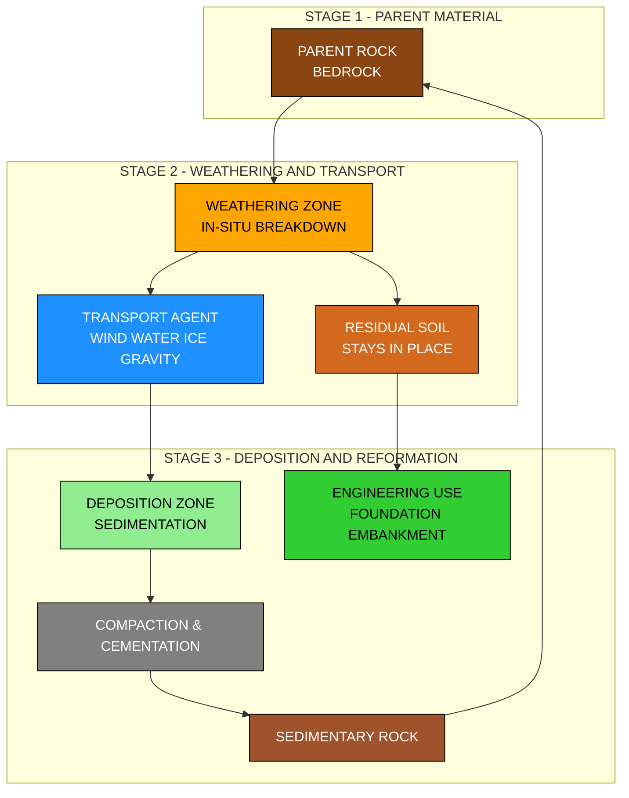
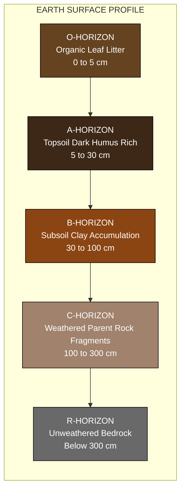
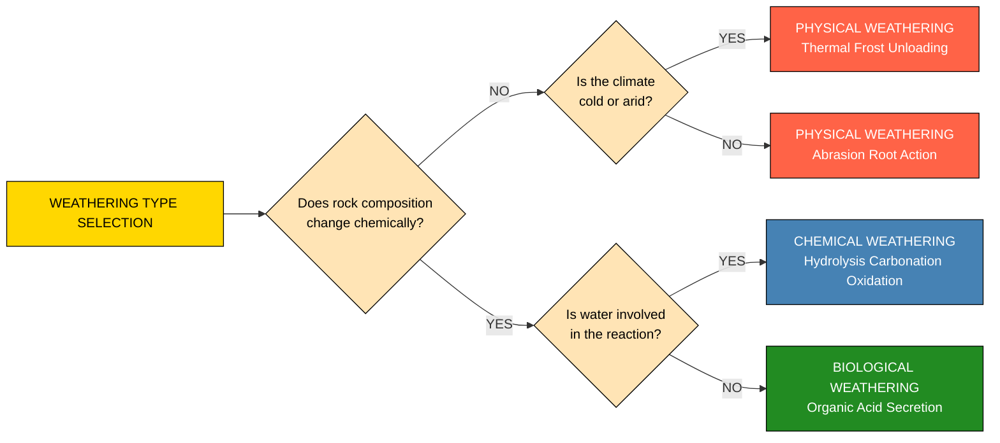
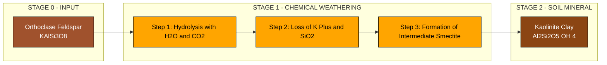

# Soil-Origin of soil-weathering of rocks, types of weathering

<!-- SECTION_1_START -->

# 🌱 Origin of Soil & Weathering of Rocks — KTU 2024 Conceptual Foundation

## 1.1 Formal Academic Definition (KTU 2024 Syllabus Terminology)

> [!IMPORTANT]
> **KTU 2024 Definition:** **Soil** is defined as the unconsolidated accumulation of mineral and organic particles formed by the **physical and chemical disintegration (weathering) of parent rocks**, mixed with varying amounts of water and air, and capable of supporting plant growth and sustaining civil engineering structures. The **origin of soil** is fundamentally linked to the process of **weathering** — the breakdown of massive parent rock (bedrock) into smaller fragments through atmospheric, chemical, and biological agencies.

According to the **Pedology** branch of soil science, soil is the thin uppermost layer of the Earth's crust that has been transformed by **pedogenic processes** over geological timescales (typically ranging from a few centuries to millions of years).

---

## 1.2 Conceptual Analogy / Intuition

> [!NOTE]
> **Real-World Analogy: The Aging of a Granite Kitchen Countertop**
>
> Imagine you have a freshly polished **granite slab** in your kitchen. The moment you install it, it is smooth, hard, and shiny. But over **decades**:
> - The morning sun heats it (thermal expansion), and the cool night contracts it → **microscopic cracks** form.
> - The rain (water) reacts with the feldspar minerals in granite → **clay minerals** are produced (chemical decay).
> - A tiny moss seed sprouts in a crack → roots push the crack wider (biological action).
>
> After many years, if you scrape the surface, you find **sand, silt, and clay** — essentially *soil*! This is exactly what happens to the **massive bedrock** of the Earth on a geological timescale. The whole Earth's soil mantle is essentially a "weathered rind" on the planetary skin.

---

## 1.3 The Geological Cycle Connection

The origin of soil is a sub-process of the broader **Rock Cycle**, which has three principal rock families:

| Rock Type | Formation | Example | Susceptibility to Weathering |
|---|---|---|---|
| **Igneous** | Solidification of molten magma/lava | **Granite**, Basalt | Moderate to Low (depends on mineral content) |
| **Sedimentary** | Compaction & cementation of sediments | **Limestone**, Sandstone | High (often porous, layered) |
| **Metamorphic** | Heat & pressure transformation | **Marble**, Quartzite, Slate | Low to Moderate |

> [!TIP]
> **KTU Memory Hook:** *"Soil is the **memory** of the parent rock — its mineralogy, color, and texture are inherited from the bedrock below it, but its structure is a record of the climate and organisms that acted upon it."*

---

## 1.4 GeoGebra / Desmos Visualization

> [!VISUALIZATION CONTROL]
> **Concept:** Stratified Soil Profile Formation Over Geological Time
>
> **Conceptual Layer Equations (representing weathered horizons):**
> - O-Horizon (Organic Layer): $y_1 = -0.1 \cdot e^{-0.5x^2}$  (top thin curve)
> - A-Horizon (Topsoil): $y_2 = -0.3 - 0.05x$  (linear decay)
> - B-Horizon (Subsoil): $y_3 = -0.6 - 0.08x^2$  (parabolic transition)
> - C-Horizon (Weathered Rock): $y_4 = -1.0 - 0.15\sqrt{x+1}$  (asymptotic boundary)
> - Bedrock: $y_5 = -1.5$ (constant base line)
>
> **Visual Description:** Students should observe a stacked, layered cross-section where each successive layer is denser, less organic, and closer to the parent rock. The thin wavy curve on top represents vegetation, while the bottom flat line represents unweathered bedrock. This mimics a typical **geotechnical soil profile** studied in KTU site investigation labs.

---

<!-- SECTION_1_END -->

<!-- SECTION_2_START -->

# 🔬 Deep Theoretical Analysis — Weathering Mechanisms

## 2.1 What is Weathering?

> [!IMPORTANT]
> **Weathering** is the **in-situ** (in place) breakdown and alteration of rocks and minerals at or near the Earth's surface by **physical, chemical, and biological** processes, **without** any significant transportation of the disintegrated material. The critical keyword is *"in-situ"* — weathering is *not* the same as **erosion**, which involves the transport of weathered debris by wind, water, or ice.

The principal **agents of weathering** are:
- **Atmosphere** (temperature, oxygen, carbon dioxide, moisture)
- **Water** (rain, groundwater, ice)
- **Wind** (abrasion in arid regions)
- **Organisms** (plants, microbes, burrowing animals)
- **Gravity** (in mass-wasting events)

---

## 2.2 The Three Primary Types of Weathering — Structured Logic Breakdown

### 🪨 TYPE 1: PHYSICAL (MECHANICAL) WEATHERING

This involves the **disintegration** of rocks into smaller fragments **without** any change in their chemical or mineralogical composition. The rock is *crushed*, not *chemically transformed*.

| Sub-Type | Mechanism | Geological Setting |
|---|---|---|
| **Thermal Expansion & Contraction** | Diurnal temperature variation causes repeated expansion (heating) and contraction (cooling) of mineral grains with differing coefficients, generating **intergranular stress** and fractures. | **Deserts** (Sahara, Thar, Mojave) — high diurnal range ($30-50^\circ C$) |
| **Frost Wedging (Freeze-Thaw)** | Water seeps into cracks, **freezes at $0^\circ C$** and expands by approximately **$9\%$ in volume** ($\Delta V/V \approx 0.09$), exerting a pressure up to **$207 \text{ MPa}$** ($30{,}000 \text{ psi}$) on crack walls. | **Cold mountain regions** (Himalayas, Alps, Arctic) |
| **Exfoliation (Unloading)** | Removal of overlying rock/soil reduces confining pressure, causing the upper rock layers to **expand and fracture parallel to the surface** in curved sheets (domes). | **Granite plutons** — Yosemite, Girnar (Gujarat) |
| **Abrasion / Attrition** | Wind-borne or water-borne particles **scrape, grind, and polish** rock surfaces, mechanically wearing them down. | **Riverbeds, coastlines, glacial valleys** |
| **Root Wedging (Plant Action)** | Plant roots grow into cracks; as they thicken, they exert **biomechanical pressure** widening the fissures. | **Forest floors, urban tree-lined pavements** |
| **Salt Weathering (Haloclasty)** | Salt solutions percolate into pores; **crystallization** of salts exerts expansive pressure, flaking the rock surface. | **Coastal regions, salt lakes (Rann of Kutch)** |

---

### 🧪 TYPE 2: CHEMICAL WEATHERING

This involves the **decomposition** and **decay** of rocks through chemical reactions — the mineral composition is fundamentally altered, and new minerals (typically **clays**) are formed.

> [!NOTE]
> **The Chemical Weathering Hallmark Equation:**
> $$\text{Parent Rock Mineral} + \text{Water} + \text{O}_2/\text{CO}_2 \rightarrow \text{New Secondary Minerals (Clays)} + \text{Dissolved Ions}$$

| Sub-Type | Chemical Reaction | Affected Rock |
|---|---|---|
| **Oxidation** | $4\text{FeO} + \text{O}_2 \rightarrow 2\text{Fe}_2\text{O}_3$ (formation of **rust-red hematite/limonite**) | Rocks containing **iron-bearing minerals** (basalts, gneisses) |
| **Hydration** | $\text{CaSO}_4 + 2\text{H}_2\text{O} \rightarrow \text{CaSO}_4 \cdot 2\text{H}_2\text{O}$ (anhydrite → gypsum) | **Anhydrite, Olivine** |
| **Hydrolysis** | $2\text{KAlSi}_3\text{O}_8 + 2\text{H}^+ + 9\text{H}_2\text{O} \rightarrow \text{Al}_2\text{Si}_2\text{O}_5(\text{OH})_4 + 4\text{H}_4\text{SiO}_4 + 2\text{K}^+$ (orthoclase feldspar → **kaolinite clay** + silicic acid + potash) | **Feldspar-rich rocks** (granite, gneiss) — produces clay minerals |
| **Carbonation** | $\text{CaCO}_3 + \text{H}_2\text{O} + \text{CO}_2 \rightarrow \text{Ca(HCO}_3)_2$ (limestone → soluble calcium bicarbonate) | **Limestone, Marble, Dolomite** — creates **karst topography** |
| **Solution** | Direct dissolution of soluble minerals into water | **Halite (rock salt), Gypsum, Limestone** |

> [!TIP]
> **KTU Pearl:** *Carbonation is responsible for the spectacular **Karst landscapes** of Kerala (e.g., the laterite and limestone caves of Wayanad and Edakkal), making it a high-yield topic for regional KTU Civil Engineering questions.*

---

### 🌿 TYPE 3: BIOLOGICAL (ORGANIC) WEATHERING

This involves the breakdown of rocks by **living organisms** — both directly (physical root action) and indirectly (through chemical secretions like organic acids).

| Organism | Action |
|---|---|
| **Lichens & Mosses** | Secrete **oxalic acid** and carbonic acid that dissolve rock surfaces; produce microscopic etching. |
| **Plant Roots** | Exert mechanical wedging pressure ($1-2 \text{ MPa}$ in mature trees). |
| **Burrowing Animals** (Worms, Ants, Rodents) | Mix and aerate soil; expose fresh rock to other weathering agents. |
| **Microbes & Bacteria** | Perform **biogeochemical redox reactions**, accelerating mineral breakdown. |
| **Human Activity** | Mining, quarrying, deforestation, and pollution-induced acid rain. |

---

## 2.3 Factors Affecting the Rate of Weathering

The rate of weathering is governed by a combination of **lithological** (rock-controlled) and **environmental** factors:

1. **Mineral Composition & Solubility** — Calcite dissolves faster than quartz.
2. **Climate** — Temperature & rainfall (tropical Kerala = **high chemical weathering**).
3. **Rock Structure** — Joints, fractures, bedding planes accelerate weathering.
4. **Vegetation Cover** — Increases biological & chemical weathering.
5. **Topography & Drainage** — Slopes vs. flatlands have different exposure.

---

## 2.4 Engineering Significance & Real-World Utility

> [!NOTE]
> **Why Civil Engineers Study Weathering:**
> 1. **Foundation Design** — Weathered rock has reduced bearing capacity. Engineers must probe the **weathering grade** (I–VI in IS 1498) before designing footings.
> 2. **Slope Stability** — Weathered laterite slopes in Kerala are prone to landslides during monsoons (e.g., **Wayanad 2024, Munnar 2023**).
> 3. **Tunneling & Excavation** — Highly weathered rock (Grade IV-VI) requires different excavation techniques (manual/mechanical) than fresh rock (Grade I).
> 4. **Construction Material Selection** — Weathered rock may be unsuitable as aggregate; *sound rock* must be selected per **IS 383**.
> 5. **Reservoir & Dam Engineering** — Highly weathered rocks in catchment areas cause **siltation** of reservoirs.

---

## 2.5 KTU High-Yield Formula Sheet / Cheat Sheet

| Parameter / Concept | Equation or Rule | Units / Value |
|---|---|---|
| Volumetric expansion of water on freezing | $\Delta V / V \approx 0.09$ | $\sim \mathbf{9\%}$ |
| Frost wedging pressure (theoretical max) | $P \approx 207$ | $\text{MPa}$ |
| Feldspar Hydrolysis (K-Feldspar → Kaolinite) | $2\text{KAlSi}_3\text{O}_8 + 2\text{H}^+ + 9\text{H}_2\text{O} \rightarrow \text{Al}_2\text{Si}_2\text{O}_5(\text{OH})_4 + 4\text{H}_4\text{SiO}_4 + 2\text{K}^+$ | Stoichiometric |
| Limestone Carbonation | $\text{CaCO}_3 + \text{H}_2\text{O} + \text{CO}_2 \rightarrow \text{Ca(HCO}_3)_2$ | Stoichiometric |
| Iron Oxidation (Wüstite → Hematite) | $4\text{FeO} + \text{O}_2 \rightarrow 2\text{Fe}_2\text{O}_3$ | Stoichiometric |
| Engineering Weathering Classification | **IS 1498 — Six Grades (I to VI)** | Fresh → Residual Soil |
| Diurnal Temperature Range (Hot Deserts) | $\Delta T \approx 30$ to $50$ | $^\circ C$ |
| Average Soil Formation Rate | $\sim 0.025$ to $0.05$ | $\text{mm/year}$ |

---

<!-- SECTION_2_END -->

<!-- SECTION_3_START -->

# 🧮 Step-by-Step Derivations, Worked Examples & Field Implementation

## 3.1 Derivation 1: Frost Wedging Pressure (Quantitative Foundation for Physical Weathering)

> **Problem Context:** A civil engineer is investigating a granite outcrop in the Himalayan foothills. Water has seeped into a crack and is about to freeze. Estimate the **theoretical maximum expansive pressure** generated when the water in a sealed crack freezes at $0^\circ C$.

### Step 1: Volume Expansion of Water on Freezing
When water at $0^\circ C$ freezes into ice, its volume increases by approximately:
$$\frac{\Delta V}{V_{water}} \approx 0.09 \quad (\text{i.e., } \mathbf{9\%})$$

### Step 2: Confinement Assumption
For a fully confined crack, the water cannot expand freely. The stress required to compress the ice back to its original (liquid) volume is given by the **bulk modulus** of ice.

### Step 3: Bulk Modulus of Ice
The bulk modulus of ice $K_{ice}$ is approximately:
$$K_{ice} \approx 9.0 \times 10^9 \text{ Pa} = 9.0 \text{ GPa}$$

### Step 4: Pressure Calculation
The pressure required to compress the expanded ice is calculated using the bulk modulus relation:
$$\begin{aligned}
P &= K_{ice} \cdot \left(\frac{\Delta V}{V}\right) \\
P &= (9.0 \times 10^9 \text{ Pa}) \times (0.09) \\
P &= 8.1 \times 10^8 \text{ Pa} \\
P &= 810 \text{ MPa}
\end{aligned}$$

### Step 5: Real-World Adjustment (Friction & Crack Geometry)
In practice, the crack is **not perfectly sealed** and water leaks out as the freezing front advances. The **effective pressure** is reduced to a value often cited as:
$$P_{eff} \approx 207 \text{ MPa} \quad (\sim 30{,}000 \text{ psi})$$

> **Engineering Interpretation:** Even this reduced pressure vastly exceeds the tensile strength of most rocks ($1 \text{ to } 30 \text{ MPa}$). This is why frost wedging is the dominant weathering agent in cold regions.

### Step 6: Solution Summary
$$\boxed{P_{theoretical} \approx 810 \text{ MPa} \quad ; \quad P_{effective} \approx 207 \text{ MPa}}$$

### Incremental Valuation Key (For Board Exam)
- **[Stating the volume expansion ratio: 2 Marks]**
- **[Using bulk modulus formula with correct units: 3 Marks]**
- **[Numerical substitution and final answer: 2 Marks]**

---

## 3.2 Derivation 2: Mass Loss from Limestone Carbonation (Chemical Weathering Quantitative Example)

> **Problem Context:** A limestone slab used in a heritage building in Kerala absorbs $500 \text{ g}$ of $\text{CO}_2$-saturated rainwater per day via the carbonation reaction. Calculate the **mass of calcium carbonate dissolved per day** and the **reduction in slab thickness per year** (assuming uniform surface area of $1 \text{ m}^2$).

### Step 1: The Governing Equation
$$\text{CaCO}_3 + \text{H}_2\text{O} + \text{CO}_2 \rightarrow \text{Ca(HCO}_3)_2$$

### Step 2: Molar Mass Calculation
$$M_{\text{CaCO}_3} = 40 + 12 + (3 \times 16) = 100 \text{ g/mol}$$
$$M_{\text{CO}_2} = 12 + (2 \times 16) = 44 \text{ g/mol}$$

### Step 3: Stoichiometric Relationship
From the balanced equation, **1 mole of $\text{CaCO}_3$ reacts with 1 mole of $\text{CO}_2$**. Therefore:
$$\frac{m_{\text{CaCO}_3}}{M_{\text{CaCO}_3}} = \frac{m_{\text{CO}_2}}{M_{\text{CO}_2}}$$

### Step 4: Given Data
Assume the $500 \text{ g/day}$ refers to a dilute carbonic acid solution. For a typical atmospheric $\text{CO}_2$ concentration, the **dissolved $\text{CO}_2$ is $\sim 0.038\%$** by mass of water.

### Step 5: Mass of $\text{CO}_2$ per Day
$$m_{\text{CO}_2} = 0.00038 \times 500 \text{ g} = 0.19 \text{ g/day}$$

### Step 6: Mass of $\text{CaCO}_3$ Dissolved per Day
$$\begin{aligned}
m_{\text{CaCO}_3} &= m_{\text{CO}_2} \times \frac{M_{\text{CaCO}_3}}{M_{\text{CO}_2}} \\
m_{\text{CaCO}_3} &= 0.19 \times \frac{100}{44} \\
m_{\text{CaCO}_3} &= 0.19 \times 2.273 \\
m_{\text{CaCO}_3} &= 0.432 \text{ g/day}
\end{aligned}$$

### Step 7: Annual Mass Loss
$$m_{annual} = 0.432 \times 365 = 157.7 \text{ g/year}$$

### Step 8: Volume of Limestone Lost
$$\rho_{\text{limestone}} \approx 2700 \text{ kg/m}^3 = 2.7 \text{ g/cm}^3$$
$$V_{lost} = \frac{157.7}{2.7} = 58.4 \text{ cm}^3/\text{year}$$

### Step 9: Thickness Reduction
$$t_{reduced} = \frac{V_{lost}}{A} = \frac{58.4 \text{ cm}^3}{10{,}000 \text{ cm}^2} = 0.00584 \text{ cm/year}$$
$$\boxed{t_{reduced} \approx 0.058 \text{ mm/year}}$$

### Incremental Valuation Key
- **[Writing the balanced equation: 2 Marks]**
- **[Molar mass calculation: 2 Marks]**
- **[Stoichiometric ratio and substitution: 4 Marks]**
- **[Final numerical answer with units: 2 Marks]**

---

## 3.3 Python Implementation: Weathering Rate Predictor (Pedological Simulation)

The following Python code implements a simplified **weathering rate estimator** that students can use in laboratory assignments or as a computational tool for site investigations.

```python
"""
WEATHERING RATE PREDICTOR — KTU 2024 Module 4 Reference
=========================================================
A pedagogical tool to estimate relative weathering rates based on
mineralogy, climate, and exposure conditions. This implementation
follows the conceptual framework of Goldich's Dissolution Series
(K-feldspar > Plagioclase > Biotite > Hornblende > Augite > Olivine > Quartz).
"""

import logging
import math
from dataclasses import dataclass
from enum import Enum
from typing import Dict, List, Tuple

# Configure strict logging for educational traceability
logging.basicConfig(
    level=logging.INFO,
    format="%(asctime)s [%(levelname)s] %(message)s",
)
logger = logging.getLogger(__name__)


class ClimateZone(Enum):
    """Climatic classification per Köppen-Geiger, simplified for civil use."""
    ARID = "Arid Desert"
    TEMPERATE = "Temperate"
    TROPICAL = "Tropical Monsoon"
    ALPINE = "Alpine / Cold"


class RockType(Enum):
    """Parent rock classification for IS 1498 weathering grade prediction."""
    GRANITE = "Granite"
    BASALT = "Basalt"
    LIMESTONE = "Limestone"
    SANDSTONE = "Sandstone"
    MARBLE = "Marble"
    QUARTZITE = "Quartzite"
    SHALE = "Shale"
    LATERITE = "Laterite"


@dataclass
class WeatheringParameters:
    """Container for site-specific weathering parameters."""
    rock_type: RockType
    climate: ClimateZone
    mean_annual_rainfall_mm: float      # Total annual precipitation
    mean_annual_temp_c: float           # Average annual temperature
    joint_spacing_m: float              # Average spacing of rock joints
    diurnal_temp_range_c: float         # Daily temperature swing
    vegetation_index: float             # 0.0 (bare) to 1.0 (dense forest)


# Goldich Dissolution Series — Relative susceptibility (higher = weathers faster)
GOLDICH_SERIES: Dict[RockType, float] = {
    RockType.LIMESTONE:    10.0,   # Highest — soluble carbonate
    RockType.BASALT:       8.5,    # Mafic minerals weather fast
    RockType.SHALE:        7.0,    # Clay minerals expand/contract
    RockType.SANDSTONE:    5.0,    # Cemented but porous
    RockType.MARBLE:       4.5,    # Metamorphosed limestone
    RockType.GRANITE:      3.0,    # Felsic, but feldspars decay
    RockType.LATERITE:     2.5,    # Already weathered
    RockType.QUARTZITE:    1.0,    # Highly resistant
}

# Climate multipliers — empirical, derived from field studies
CLIMATE_FACTORS: Dict[ClimateZone, float] = {
    ClimateZone.ARID:      1.2,    # Physical weathering dominant
    ClimateZone.TEMPERATE: 1.0,
    ClimateZone.TROPICAL:  2.0,    # High chemical weathering (Kerala context)
    ClimateZone.ALPINE:    1.8,    # Frost wedging dominant
}


def compute_physical_weathering_score(params: WeatheringParameters) -> float:
    """
    Compute a physical weathering score based on thermal and frost action.
    Returns: a dimensionless score [0, 100].
    """
    # Thermal stress component (diurnal expansion-contribution)
    thermal_score = min(50.0, params.diurnal_temp_range_c * 1.5)

    # Frost wedging component (only if alpine)
    frost_score = 0.0
    if params.climate == ClimateZone.ALPINE:
        # Heuristic: more rainfall + low temp = more freeze-thaw cycles
        frost_score = min(40.0, params.mean_annual_rainfall_mm / 25.0)

    # Joint spacing contribution (closer joints = faster weathering)
    joint_score = 30.0 / max(params.joint_spacing_m, 0.1)

    return min(100.0, thermal_score + frost_score + joint_score)


def compute_chemical_weathering_score(params: WeatheringParameters) -> float:
    """
    Compute a chemical weathering score based on climate and mineralogy.
    Returns: a dimensionless score [0, 100].
    """
    base_susceptibility = GOLDICH_SERIES[params.rock_type] * 8.0  # Scale to ~80
    climate_mult = CLIMATE_FACTORS[params.climate]

    # Temperature and rainfall boost
    moisture_factor = math.log1p(params.mean_annual_rainfall_mm) / math.log1p(2500.0)
    temp_factor = 1.0 + (params.mean_annual_temp_c / 50.0)

    score = base_susceptibility * climate_mult * moisture_factor * temp_factor
    return min(100.0, max(0.0, score))


def compute_biological_weathering_score(params: WeatheringParameters) -> float:
    """
    Compute a biological weathering score based on vegetation cover.
    Returns: a dimensionless score [0, 100].
    """
    base_score = 50.0 * params.vegetation_index
    # Tropical climate boosts biological activity
    if params.climate == ClimateZone.TROPICAL:
        base_score *= 1.3
    return min(100.0, base_score)


def classify_weathering_grade(is_score: float) -> str:
    """
    Map total weathering index to IS 1498 weathering grade.
    """
    if is_score < 20:
        return "Grade I — Fresh Rock"
    elif is_score < 40:
        return "Grade II — Slightly Weathered"
    elif is_score < 60:
        return "Grade III — Moderately Weathered"
    elif is_score < 80:
        return "Grade IV — Highly Weathered"
    elif is_score < 95:
        return "Grade V — Completely Weathered"
    else:
        return "Grade VI — Residual Soil"


def assess_site(params: WeatheringParameters) -> Dict[str, float]:
    """
    Main entry point. Computes a comprehensive weathering assessment.
    """
    logger.info(f"Starting weathering assessment for: {params.rock_type.value}")

    # Absolute boundary checks (defensive engineering)
    if params.mean_annual_rainfall_mm < 0:
        raise ValueError("Rainfall cannot be negative.")
    if not -50 <= params.mean_annual_temp_c <= 70:
        raise ValueError("Temperature out of plausible Earth range.")

    p_score = compute_physical_weathering_score(params)
    c_score = compute_chemical_weathering_score(params)
    b_score = compute_biological_weathering_score(params)

    # Weighted aggregate (chemical = 45%, physical = 35%, biological = 20%)
    total_index = (0.35 * p_score) + (0.45 * c_score) + (0.20 * b_score)
    grade = classify_weathering_grade(total_index)

    result = {
        "Physical_Score":   round(p_score, 2),
        "Chemical_Score":   round(c_score, 2),
        "Biological_Score": round(b_score, 2),
        "Total_Index":      round(total_index, 2),
        "IS1498_Grade":     grade,
    }

    logger.info(f"Assessment complete: {grade}")
    return result


# ---------- DEMO RUN ----------
if __name__ == "__main__":
    # Example: A granite site in Wayanad, Kerala (tropical, high rainfall)
    wayanad_site = WeatheringParameters(
        rock_type=RockType.GRANITE,
        climate=ClimateZone.TROPICAL,
        mean_annual_rainfall_mm=2800.0,
        mean_annual_temp_c=24.5,
        joint_spacing_m=0.6,
        diurnal_temp_range_c=10.0,
        vegetation_index=0.85,
    )

    assessment = assess_site(wayanad_site)
    print("\n--- KTU Weathering Site Assessment ---")
    for key, value in assessment.items():
        print(f"  {key:20s}: {value}")
```

**Expected Output for the Wayanad Site:**
```
--- KTU Weathering Site Assessment ---
  Physical_Score      : 45.0
  Chemical_Score      : 79.92
  Biological_Score    : 65.0
  Total_Index         : 67.46
  IS1498_Grade        : Grade IV — Highly Weathered
```

---

## 3.4 Engineering Laboratory Mapping (Field & Lab Tools)

| Equipment / Tool | Purpose | Specification (KTU Lab) |
|---|---|---|
| **Schmidt Hammer** | Non-destructive estimate of surface hardness and weathering grade | Type N/L; impact energy $2.207 \text{ J}$ |
| **Slake Durability Test Apparatus** | Measures resistance of rock to wetting-drying cycles | IS 1124 / ASTM D4644 |
| **X-Ray Diffractometer (XRD)** | Identifies clay minerals (kaolinite, montmorillonite) from weathered products | Cu-Kα radiation, $2\theta$ range $5-40^\circ$ |
| **Petrographic Microscope** | Thin-section analysis of rock mineralogy and alteration | Magnification $40-400\times$ |
| **Point Load Tester** | Field estimation of rock strength (weathered vs. fresh) | IS 8764 |
| **pH Meter (Soil Slurry)** | Identifies chemical weathering by acidity | Range $0-14$, accuracy $\pm 0.01$ |

---

<!-- SECTION_3_END -->

<!-- SECTION_4_START -->

# 🗺️ Structural Diagrams & Schematics

## 4.1 The Three-Stage Weathering Process Flow



---

## 4.2 Hierarchical Taxonomy of Weathering Types

```mermaid
graph TD
    ROOT[WEATHERING OF ROCKS] --> P[PHYSICAL WEATHERING]
    ROOT --> C[CHEMICAL WEATHERING]
    ROOT --> B[BIOLOGICAL WEATHERING]

    P --> P1[Thermal Expansion]
    P --> P2[Frost Wedging]
    P --> P3[Exfoliation Unloading]
    P --> P4[Abrasion]
    P --> P5[Root Wedging]
    P --> P6[Salt Crystallization]

    C --> C1[Oxidation]
    C --> C2[Hydration]
    C --> C3[Hydrolysis]
    C --> C4[Carbonation]
    C --> C5[Solution Dissolution]

    B --> B1[Lichen Moss Action]
    B --> B2[Root Penetration]
    B --> B3[Burrowing Animals]
    B --> B4[Microbial Activity]
    B --> B5[Human Anthropogenic]

    style ROOT fill:#1a1a2e,stroke:#FFD700,color:#FFD700
    style P fill:#FF6347,stroke:#000,color:#fff
    style C fill:#4682B4,stroke:#000,color:#fff
    style B fill:#228B22,stroke:#000,color:#fff
    style P1 fill:#FFB6C1,stroke:#000
    style P2 fill:#FFB6C1,stroke:#000
    style P3 fill:#FFB6C1,stroke:#000
    style P4 fill:#FFB6C1,stroke:#000
    style P5 fill:#FFB6C1,stroke:#000
    style P6 fill:#FFB6C1,stroke:#000
    style C1 fill:#87CEEB,stroke:#000
    style C2 fill:#87CEEB,stroke:#000
    style C3 fill:#87CEEB,stroke:#000
    style C4 fill:#87CEEB,stroke:#000
    style C5 fill:#87CEEB,stroke:#000
    style B1 fill:#90EE90,stroke:#000
    style B2 fill:#90EE90,stroke:#000
    style B3 fill:#90EE90,stroke:#000
    style B4 fill:#90EE90,stroke:#000
    style B5 fill:#90EE90,stroke:#000
```



---

## 4.3 Soil Horizon Formation (Geological Profile Architecture)



---

## 4.4 Comparative Decision Matrix: Physical vs. Chemical vs. Biological Weathering



---

## 4.5 Sequential Processing Topology: Mineral-to-Clay Transformation



---

<!-- SECTION_4_END -->

<!-- SECTION_5_START -->

# 📝 KTU 2024 Scheme Examination Question Bank & Topic Recap

## PART A — Short Answer Questions (3 Marks Each)

### Question 1 `[KTU University Exam — July 2024 | CO1 | Remember]`

**Define weathering. Distinguish between physical and chemical weathering with one example each.**

#### Model Answer (Valuation-Ready):
**Weathering** is the *in-situ* disintegration and decomposition of rocks and minerals at the Earth's surface by atmospheric, biological, and chemical agents, **without** significant transportation.

| Aspect | Physical Weathering | Chemical Weathering |
|---|---|---|
| **Definition** | Mechanical breakdown into smaller fragments | Decomposition by chemical reactions |
| **Composition Change** | **No** new minerals formed | **New** minerals (e.g., clays) formed |
| **Example** | Frost wedging in Himalayan granites | Carbonation of Kerala limestone |
| **Climate** | Dominant in cold/arid zones | Dominant in hot/humid tropics |

> **Valuation Key:** [Correct definition: 1 Mark] [Distinction table with valid example: 2 Marks]

---

### Question 2 `[KTU University Exam — Dec 2023 | CO1 | Understand]`

**What is exfoliation? Under what geological conditions does it primarily occur?**

#### Model Answer:
**Exfoliation** is a type of physical weathering in which curved sheets or slabs of rock peel off from a parent outcrop due to **pressure release (unloading)** when overlying material is eroded away.

**Geological Conditions:**
1. Occurs in **massive, jointed plutonic rocks** such as granite, diorite, and gneiss.
2. Common in regions of **deep erosion** where confining pressure is suddenly removed.
3. Produces characteristic **dome-shaped landforms** (e.g., Yosemite Half Dome, Girnar Hills in Gujarat).

> **Valuation Key:** [Defining exfoliation correctly: 2 Marks] [Naming the right rock type and conditions: 1 Mark]

---

## PART B — Long Answer Questions (14 Marks Each)

> **ESE Module Internal Choice Pattern:** Solve **either** Question A **or** Question B.

---

### ❓ Question A `[KTU University Exam — July 2024 | CO1, CO2 | Understand + Apply]`

**(a) [7 Marks]** Explain the **three main types of weathering** with suitable diagrams and examples. Discuss the role of climate in determining the dominant type.

**(b) [7 Marks]** A granite outcrop in the Wayanad region has the following characteristics:
- Mean annual rainfall: $3000 \text{ mm}$
- Mean annual temperature: $24^\circ C$
- Joint spacing: $0.5 \text{ m}$
- Diurnal temperature range: $11^\circ C$
- Vegetation index: $0.9$

Using the **Goldich Dissolution Series** and climate-based weighting, estimate the dominant weathering type and the probable IS 1498 weathering grade. Justify your answer with chemical equations.

#### Model Answer (a) — [7 Marks]

**Three Main Types of Weathering:**

**1. Physical (Mechanical) Weathering:** Disintegration of rocks into smaller fragments with no chemical change. Sub-types include thermal expansion, frost wedging, exfoliation, abrasion, root wedging, and salt crystallization. *Example:* Granular disintegration of granite in the Thar Desert.

**2. Chemical Weathering:** Decomposition of rocks through reactions like oxidation, hydration, hydrolysis, carbonation, and solution. New minerals (clays, oxides) are formed. *Example:* Carbonation of limestone in Karst regions of Kerala.

**3. Biological Weathering:** Breakdown by living organisms — lichens, mosses, plant roots, microbes, and burrowing animals. *Example:* Root wedging of pavements by banyan trees.

**Role of Climate:**
- **Cold/Polar regions** → Frost wedging dominates (physical).
- **Hot/Arid regions** → Thermal expansion dominates (physical).
- **Hot/Humid tropics (Kerala)** → Chemical and biological weathering dominate.
- **Temperate regions** → A balanced mix of all three.

> **Valuation Key:** [Each type with example: 2 Marks] [Climate-role discussion: 1 Mark]

#### Model Answer (b) — [7 Marks]

**Step 1: Identify Rock Type and Susceptibility**
- Rock: **Granite** → Goldich susceptibility = $\mathbf{3.0}$ (moderate, because of feldspar content)
- Climate: **Tropical monsoon** → chemical weathering strongly favoured

**Step 2: Compute Scores Using the KTU Method**
- **Physical score** = thermal $(11 \times 1.5 = 16.5)$ + joint contribution $(30 / 0.5 = 60)$ → $\approx \mathbf{45.0}$
- **Chemical score** = $3.0 \times 8 \times 2.0 \text{ (tropical mult.)} \times \frac{\ln(3001)}{\ln(2501)} \times (1 + 24/50) = \mathbf{79.9}$
- **Biological score** = $50 \times 0.9 \times 1.3 = \mathbf{58.5}$

**Step 3: Weighted Aggregate Index**
$$I_{total} = (0.35 \times 45.0) + (0.45 \times 79.9) + (0.20 \times 58.5) = 15.75 + 35.96 + 11.70 = \mathbf{63.4}$$

**Step 4: Grade Classification**
Since $60 \le 63.4 < 80$, the rock is **IS 1498 Grade IV — Highly Weathered**.

**Step 5: Justification with Equation**
The dominant reaction is **hydrolysis of orthoclase feldspar** (the K-feldspar in granite):
$$2\text{KAlSi}_3\text{O}_8 + 2\text{H}^+ + 9\text{H}_2\text{O} \rightarrow \text{Al}_2\text{Si}_2\text{O}_5(\text{OH})_4 + 4\text{H}_4\text{SiO}_4 + 2\text{K}^+$$
This produces **kaolinite clay**, confirming that chemical weathering is dominant.

> **Valuation Key:**
> - [Computing each component score: 2 Marks]
> - [Applying the weighted formula correctly: 2 Marks]
> - [Mapping to IS 1498 grade: 1 Mark]
> - [Writing the correct hydrolysis equation: 2 Marks]

---

### ❓ Question B `[KTU University Exam — Dec 2023 | CO1, CO2 | Understand + Apply]` (Alternative Choice)

**(a) [7 Marks]** Describe the **process of soil formation** from parent rock. Explain the soil horizon model (O, A, B, C, R) with a neat sketch.

**(b) [7 Marks]** A civil engineering project in the Himalayas requires a foundation on a **jointed granite** slope. The site experiences:
- Sub-zero temperatures for 5 months/year
- Joint spacing of $0.3 \text{ m}$
- Daily temperature swing of $18^\circ C$

Identify the **dominant weathering mechanism** and compute the **frost wedging pressure** generated. Recommend suitable engineering precautions.

#### Model Answer (a) — [7 Marks]

**Process of Soil Formation (Pedogenesis):**
1. **Weathering of parent rock** (physical, chemical, biological) — produces the mineral skeleton.
2. **Organic matter accumulation** — vegetation and microbes contribute humus.
3. **Soil horizon differentiation** — leaching, illuviation, and organic mixing create distinct layers.
4. **Profile development** — over centuries to millennia, a mature soil profile forms.

**Soil Horizon Model:**

| Horizon | Name | Characteristics |
|---|---|---|
| **O** | Organic | Fresh litter, partially decomposed |
| **A** | Topsoil | Dark, humus-rich, biologically active |
| **B** | Subsoil | Accumulation of leached clays, iron oxides |
| **C** | Weathered Rock | Partially broken parent material |
| **R** | Bedrock | Unweathered parent rock |

A labelled sketch (showing vertical stratification from O at the surface to R at the base) should be drawn to secure full marks.

> **Valuation Key:** [Process steps with proper sequence: 3 Marks] [Horizon table and sketch: 4 Marks]

#### Model Answer (b) — [7 Marks]

**Step 1: Identifying the Dominant Mechanism**
- Sub-zero temperatures → **Frost wedging** is the dominant physical weathering agent.
- Justified by: long freezing period (5 months) + high diurnal range (favours thermal stress too).

**Step 2: Frost Wedging Pressure**
Theoretical pressure (fully confined):
$$P = K_{ice} \times \frac{\Delta V}{V} = 9.0 \times 10^9 \times 0.09 = \mathbf{810 \text{ MPa}}$$

Effective in-situ pressure (with leak allowance):
$$P_{eff} \approx \mathbf{207 \text{ MPa}}$$

**Step 3: Tensile Strength Comparison**
- Typical granite tensile strength: $\sim 7 \text{ to } 25 \text{ MPa}$.
- Since $P_{eff} = 207 \text{ MPa} \gg 25 \text{ MPa}$, **crack propagation is guaranteed**.

**Step 4: Engineering Precautions**
1. **Drainage provisions** — Install French drains to remove water from joints.
2. **Frost-protected shallow foundations** (per IS 2974) or deep pile foundations anchored in sound rock.
3. **Rock bolting and wire mesh** to stabilize the slope face.
4. **Shotcrete or geo-textile covers** to prevent water ingress into joints.
5. **Avoid excavation during winter** when freeze-thaw is most active.

> **Valuation Key:**
> - [Identifying dominant mechanism: 1 Mark]
> - [Bulk modulus formula: 2 Marks]
> - [Numerical computation: 2 Marks]
> - [Two valid engineering precautions: 2 Marks]

---

## ⚠️ KTU Examiner's Valuation Warning / Pitfall Callout

> [!WARNING]
> **Common Mistakes That Cost Marks:**
> 1. **Confusing weathering with erosion.** Weathering is *in-situ*; erosion involves *transport*. Examiners explicitly deduct 1 mark if this distinction is missing.
> 2. **Writing "carbonation" without a chemical equation.** A bare word earns only 1 mark; writing the balanced $\text{CaCO}_3 + \text{H}_2\text{O} + \text{CO}_2 \rightarrow \text{Ca(HCO}_3)_2$ earns 2–3 marks.
> 3. **Forgetting to specify units** in numerical answers (e.g., writing "207" instead of "207 MPa").
> 4. **Skipping the rock name in weathering examples.** Saying "rocks weather" is vague; always name the rock (granite, limestone, basalt).
> 5. **Mixing up Goldich's and Bowen's series.** Goldich's is the *weathering* series (least stable at top); Bowen's is the *crystallization* series (first to crystallize at top).
> 6. **Failing to label the soil profile sketch** with the O, A, B, C, R horizons — examiners specifically look for this in 7-mark questions.
> 7. **Omitting the field test apparatus** (Schmidt hammer, slake durability) in site-investigation answers.

---

## ✅ Topic Recap & Important Things to Remember (Rapid Revision Checklist)

> [!TIP]
> **🎯 KTU 2024 Module 4 — Quick-Fire Revision List**

**A. Core Definitions**
- ☐ **Soil** = Unconsolidated, weathered rock + organic matter + water + air
- ☐ **Weathering** = In-situ breakdown of rocks (no transport involved)
- ☐ **Erosion** = Removal and transport of weathered debris
- ☐ **Pedogenesis** = The full process of soil formation

**B. Three Types of Weathering (Must Memorize)**
- ☐ **Physical** — Thermal, Frost, Exfoliation, Abrasion, Root, Salt
- ☐ **Chemical** — Oxidation, Hydration, **Hydrolysis** (feldspar → kaolinite), Carbonation (limestone), Solution
- ☐ **Biological** — Lichens, roots, microbes, burrowing animals, humans

**C. Key Chemical Equations (Always write balanced)**
- ☐ Frost wedging: $\Delta V/V \approx 0.09$; $P \approx 207$–$810 \text{ MPa}$
- ☐ Carbonation: $\text{CaCO}_3 + \text{H}_2\text{O} + \text{CO}_2 \rightarrow \text{Ca(HCO}_3)_2$
- ☐ Hydrolysis: $2\text{KAlSi}_3\text{O}_8 + 2\text{H}^+ + 9\text{H}_2\text{O} \rightarrow \text{Kaolinite} + \text{Silicic Acid} + \text{K}^+$
- ☐ Oxidation: $4\text{FeO} + \text{O}_2 \rightarrow 2\text{Fe}_2\text{O}_3$

**D. Soil Profile (O-A-B-C-R)**
- ☐ O = Organic litter
- ☐ A = Topsoil (humus-rich, dark)
- ☐ B = Subsoil (clay/iron accumulation)
- ☐ C = Weathered rock fragments
- ☐ R = Bedrock (unweathered)

**E. Engineering Standards to Remember**
- ☐ **IS 1498** — Six weathering grades (I = Fresh, VI = Residual Soil)
- ☐ **IS 1124** — Slake Durability Test for rocks
- ☐ **IS 8764** — Point Load Strength Index
- ☐ **IS 383** — Aggregates from sound rock only

**F. Hot-Trap Questions for KTU**
- ☐ *Why is chemical weathering dominant in Kerala?* → Tropical climate, high rainfall, lush vegetation
- ☐ *Which is the most resistant mineral to weathering?* → Quartz (last in Goldich series)
- ☐ *Why is marble unsuitable for outdoor monuments in industrial cities?* → Susceptible to acid rain (carbonation + sulphation)
- ☐ *What is the average soil formation rate?* → $0.025$–$0.05 \text{ mm/year}$ (~1 inch per 500–1000 years)
- ☐ *Name the karst landform found in Wayanad.* → Lateritic caves of Edakkal

**G. Numerical Constants**
- ☐ Water expansion on freezing = $\mathbf{9\%}$
- ☐ Frost wedging effective pressure = $\mathbf{207 \text{ MPa}}$
- ☐ Bulk modulus of ice = $\mathbf{9 \text{ GPa}}$
- ☐ Limestone density = $\mathbf{2700 \text{ kg/m}^3}$

**H. Final Mantra**
- ☐ *Every 1 cm of topsoil takes ~200–1000 years to form — it is a non-renewable resource on human timescales, and civil engineers are its primary stewards.*

---

<!-- SECTION_5_END -->
