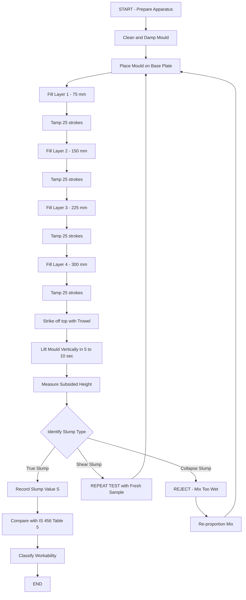
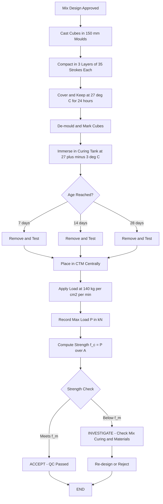
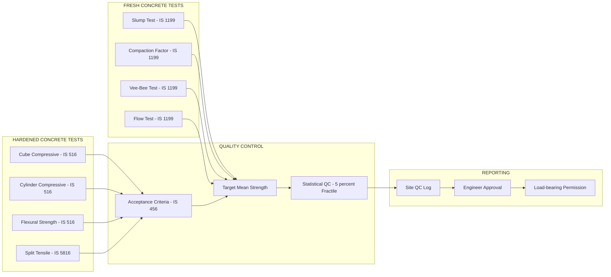
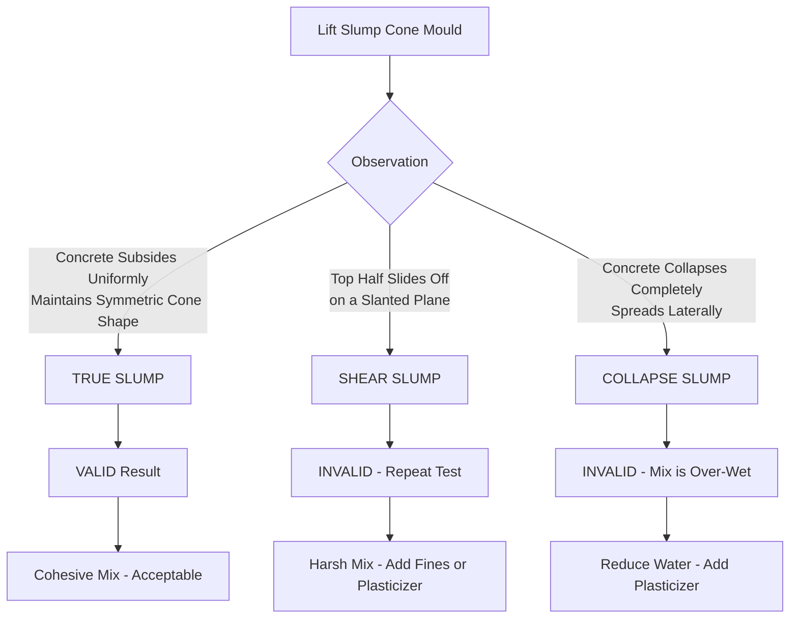

# Tests on fresh and hardened concrete - slump test, cube compressive strength as per IS Codes.

<!-- SECTION_1_START -->
# 🏗️ Tests on Fresh and Hardened Concrete — KTU 2024 Study Material

## 1.1 Core Technical Definition & Intuitive Overview

### 📘 Formal Definition (KTU 2024 Syllabus Aligned)

> **Fresh Concrete:** A freshly mixed plastic mass of cement, water, fine aggregate, coarse aggregate, and admixtures that is still in a workable (fluid/semi-fluid) state before initial setting begins. The behavior of fresh concrete directly governs the ease of placement, compaction, and finishing on site.

> **Hardened Concrete:** The rigid, solidified composite material obtained after the hydration reaction of cement, possessing measurable mechanical properties (compressive strength, tensile strength, durability) typically evaluated at the ages of **7 days, 14 days, and 28 days**.

> **Workability (KTU/IS Definition):** *"The property of fresh concrete which determines the ease with which it can be mixed, transported, placed, compacted, and finished without segregation."* — Ref: **IS 6461 (Part VII) – 1973**

> **Slump Test:** A standard **field/laboratory test** prescribed by **IS 1199:1959** to measure the **consistency and workability** of fresh concrete by observing the vertical settlement (slump) of a truncated cone of concrete when the mould is removed.

> **Cube Compressive Strength Test:** A **destructive compression test** prescribed by **IS 516:1959 (Reaffirmed 2018)** carried out on a standard **150 mm × 150 mm × 150 mm** concrete cube to determine the ultimate crushing load-bearing capacity of hardened concrete, expressed in **N/mm² or MPa**.

> [!IMPORTANT]
> **KTU Board Examiner's Standard Note:** The slump test only measures **consistency** (a single component of workability), NOT the full workability. The complete workability is a combined property of consistency, mobility, pumpability, compactability, and finishability.

---

### 💡 Conceptual Analogy / Intuition

Imagine you are making **idli batter** in your kitchen 👩‍🍳:

| Kitchen Analogy | Civil Engineering Concept |
|---|---|
| Thick idli batter (holds shape of ladle) | **Low workability** concrete (low slump ~25 mm) — used for road pavements |
| Medium batter (slowly spreads) | **Medium workability** (slump 50–100 mm) — used for beams, slabs with light reinforcement |
| Runny dosa batter (spreads fast) | **High workability** (slump >100 mm) — used for heavily reinforced sections, deep pours, pumped concrete |

Just as a cook checks batter thickness by tilting the bowl, an engineer checks concrete workability by the **slump cone test**.

> [!NOTE]
> **Physical Constants / Standard Metrics Used:**
> - Height of slump cone mould = **300 mm**
> - Top diameter = **100 mm**
> - Bottom diameter = **200 mm**
> - Tamping rod diameter = **16 mm**, length = **600 mm**
> - Standard cube size = **150 mm × 150 mm × 150 mm**
> - Loading rate for cube = **140 kg/cm²/min ≈ 5.2 kN/sec ≈ 14 MPa/min**

---

### 🎨 GeoGebra / Desmos Visualization (Slump Geometry)

> [!VISUALIZATION CONTROL]
> **Concept:** Truncated cone geometry of the slump test mould and resulting slump
> **GeoGebra Input Equations:**
> * `Top_Circle: (x - 0)^2 + (y - 10)^2 = 5^2`
> * `Bottom_Circle: (x - 0)^2 + (y - 0)^2 = 10^2`
> * `Slumped_Top_After_Test: (x - 0)^2 + (y - (10 - h))^2 = 6^2`  *(where h = measured slump in cm)*
> * `Slump_Value h: Slider from 0 to 18 (cm)`
> **Visual Description:** Observe two stacked truncated cones (frustums). The original mould has top radius = 50 mm and bottom radius = 100 mm. After lifting the mould, the concrete settles by a height `h`. The slumped top becomes wider due to lateral spread, with a noticeable reduction in overall height.

<!-- SECTION_1_END -->

<!-- SECTION_2_START -->
# 2. Deep Theoretical Analysis & KTU High-Yield Formula Sheet

## 2.1 Tests on Fresh Concrete — Detailed Analysis

### 2.1.1 Slump Test (IS 1199:1959)

#### **Apparatus Required:**
1. **Slump cone mould** — a frustum of a cone, open at both ends:
   - Top diameter: **100 mm ± 2 mm**
   - Bottom diameter: **200 mm ± 2 mm**
   - Height: **300 mm ± 2 mm**
   - Thickness of metal: **1.6 mm minimum**
   - Handles and foot-pieces provided for lifting
2. **Tamping rod** — 16 mm diameter, 600 mm long, with bullet-pointed end
3. **Base plate** — non-absorbent, flat, rigid (steel/glass)
4. **Measuring scale** — graduated in mm
5. **Trowel** for filling

#### **Step-by-Step Procedure:**

1. **Clean & dampen** the internal surface of the mould and base plate (no free water).
2. Place the mould on a **smooth, horizontal, non-absorbent, rigid** base plate.
3. Hold the mould firmly by standing on the foot-pieces (or by clamps) to prevent movement.
4. **Fill the cone in 4 equal layers** (each ~75 mm thick).
5. **Tamp each layer 25 times** uniformly across the cross-section using the 16 mm rod.
   - For the 1st layer: rod penetrates slightly into the bottom.
   - For subsequent layers: rod penetrates into the underlying layer by ~25 mm.
6. Strike off the top surface with a trowel for a flush, level surface.
7. **Clean the spilled concrete** from the base plate immediately.
8. **Lift the mould vertically upward** in **5 to 10 seconds** with a steady, steady upward motion (no twisting or lateral movement).
9. **Measure the slump** = difference between the height of the mould (300 mm) and the highest point of the subsided concrete.

#### **The Three Types of Slump (CRITICAL FOR EXAMS):**

| Slump Type | Description | Concrete Behaviour | KTU Significance |
|---|---|---|---|
| **True Slump (Collapse-free, Shear-free)** | Concrete subsides uniformly, retaining a symmetric cone shape | **Cohesive, well-proportioned** mix | ✅ Indicates good, workable mix |
| **Shear Slump** | Top half of cone slides down on a slanted plane (shear) | Mix is **harsh, lacking cohesion** | ⚠️ Indicates harsh mix, lacks fines |
| **Collapse Slump** | Concrete collapses completely, spreads laterally | Mix is **too wet**, high water content | ❌ Indicates over-wet, segregated mix |

> [!WARNING]
> **KTU Examiner's Pitfall:** The test is considered **valid ONLY for TRUE SLUMP**. If shear slump or collapse slump occurs, **repeat the test** with a fresh sample. If the second attempt also gives shear/collapse slump, the concrete lacks plasticity and should be **rejected/adjusted**.

#### **Recommended Slump Values (IS 456:2000, Table 5):**

| Placing Condition | Degree of Workability | Slump (mm) |
|---|---|---|
| Blinding concrete; pavements using pavers | Very low | **25–50** |
| Mass concrete; lightly reinforced sections in slabs, beams, walls, columns | Low | **50–100** |
| Heavily reinforced sections in slabs, beams, walls, columns | Medium | **50–100** |
| Pumped concrete; tremie placement | High | **100–150** |

#### **Advantages of Slump Test:**
- ✅ Simple, inexpensive, requires minimal equipment
- ✅ Can be performed on-site as well as in the laboratory
- ✅ Quick results (within 10 minutes)
- ✅ Suitable for medium-to-high workability concrete

#### **Limitations of Slump Test:**
- ❌ Not suitable for **very stiff mixes** (zero-slump concrete)
- ❌ Not suitable for **very wet/concrete with large max aggregate (>40 mm)**
- ❌ Only measures **consistency**, not full workability
- ❌ Result depends heavily on **operator skill** and rate of lifting

---

### 2.1.2 Brief Note on Other Fresh Concrete Tests

| Test | Apparatus | Workability Range | Best For |
|---|---|---|---|
| **Compaction Factor Test (IS 1199)** | Compaction factor apparatus | Low to medium workability | Stiff mixes unsuitable for slump test |
| **Vee-Bee Test (IS 1199)** | Vee-Bee consistometer | Very low workability | Dry, harsh concrete (roads) |
| **Flow Test (IS 1199)** | Flow table | High workability | Mortars, lime concrete |

---

## 2.2 Tests on Hardened Concrete — Cube Compressive Strength

### 2.2.1 IS 516:1959 — Scope and Significance

This is the **most universally accepted destructive strength test** in civil engineering. It is the basis for:
- Acceptance/rejection of concrete batches
- Quality control at construction sites
- Design mix proportioning
- Characteristic strength certification (e.g., **M20 → f_ck = 20 N/mm²**)

### 2.2.2 Apparatus Required

1. **Cube moulds** — cast iron/steel, 150 mm × 150 mm × 150 mm (standard)
   - For aggregate size ≤ 25 mm → use 150 mm cube
   - For aggregate > 25 mm → mould size should be **3× to 4× max aggregate size**
2. **Compacting device** — vibrating table (preferred) or tamping rod
3. **CTM (Compression Testing Machine)** — capacity 2000 kN to 3000 kN, accuracy ±1%
4. **Curing tank** — clean, fresh water at 27 ± 3 °C
5. **Weighing balance**, trowel, grease/oil for mould

### 2.2.3 Step-by-Step Procedure

#### **A. Casting of Cubes:**
1. Apply a thin coat of **mould oil/grease** to all internal faces.
2. **Fill the mould in 3 equal layers** (each ~50 mm).
3. **Compact each layer with at least 35 strokes** of 16 mm rod (or vibrate on a vibrating table for 10–20 seconds).
4. Strike off the top surface flush with a trowel.
5. Label the cube (date, grade, location, mix ID).

#### **B. Curing of Cubes:**
1. Keep the moulds in a place free from vibration, at temperature **27 ± 3 °C** for **24 ± 0.5 hours**.
2. After 24 hours, **de-mould carefully**, mark each cube, and **immerses immediately in clean water** at 27 ± 3 °C.
3. Cure until just before the test (i.e., 7 days, 14 days, or 28 days).

#### **C. Testing in CTM:**
1. **Remove the cube** from curing tank, **wipe off surface water**.
2. Place the cube in the CTM with **mould cast faces NOT in contact with the platens** (load is applied on the smooth, trowelled side).
3. Align the cube centrally.
4. Apply load **gradually and uniformly** at a rate of:
   - **140 kg/cm²/min** (≈ **5.2 kN/sec** for 150 mm cube, ≈ **14 MPa/min**)
5. Increase load until the cube **fails (crushes)**.
6. Record the **maximum load (P) in kN or N**.

### 2.2.4 Calculation

$$f_c = \frac{P}{A}$$

where:
- $f_c$ = compressive strength of concrete cube (N/mm² or MPa)
- $P$ = maximum crushing load (N)
- $A$ = cross-sectional area of the cube face (mm²)

For a standard 150 mm cube:

$$A = 150 \times 150 = 22500 \text{ mm}^2$$

$$f_c \text{ (MPa)} = \frac{P \text{ (N)}}{22500}$$

> [!IMPORTANT]
> **Note on Strength Variation with Age:** Concrete gains strength progressively. The 28-day strength is the **reference/baseline**. Empirical relationship (IS 456):
> - 7-day strength ≈ **2/3 of 28-day strength** (66%)
> - 14-day strength ≈ **~90% of 28-day strength**
> - 1-year strength ≈ **~1.25 × 28-day strength**

---

### 2.2.5 Acceptance Criteria (IS 456:2000, Clause 15.4)

For concrete of **specified characteristic compressive strength $f_{ck}$** at 28 days:

> **Target Mean Strength ($f_{m}$):**
> $$f_{m} = f_{ck} + 1.65 \sigma$$
> where $\sigma$ = standard deviation (N/mm²)

**Two acceptance criteria (both must be satisfied):**

> **Criterion 1:** Mean of 4 consecutive test results ≥ $f_{ck} + 4$ N/mm²
>
> **Criterion 2:** Individual test result ≥ $f_{ck} - 4$ N/mm²

If either fails, the structural concrete is **statistically not in compliance** and may require further investigation.

---

## 2.3 🧾 KTU High-Yield Formula Sheet

| # | Parameter | Formula / Value | Unit | IS Code |
|---|---|---|---|---|
| 1 | Slump value | $S = H_{mould} - H_{subsided}$ = $300 - H_{subsided}$ | mm | IS 1199:1959 |
| 2 | Mould dimensions (Top × Bottom × Height) | $100 \times 200 \times 300$ | mm | IS 1199:1959 |
| 3 | Tamping rod | $\phi 16 \times 600$ | mm | IS 1199:1959 |
| 4 | No. of layers for slump | **4 layers** | — | IS 1199:1959 |
| 5 | Tamping strokes per layer | **25 strokes** | — | IS 1199:1959 |
| 6 | Cube mould size (standard) | $150 \times 150 \times 150$ | mm | IS 516:1959 |
| 7 | Cube cross-sectional area | $A = 150 \times 150 = 22500$ | mm² | — |
| 8 | Compressive strength | $f_c = P / A$ | N/mm² (MPa) | IS 516:1959 |
| 9 | Loading rate | $140$ | kg/cm²/min | IS 516:1959 |
| 10 | Loading rate in SI | $5.2$ | kN/sec | IS 516:1959 |
| 11 | Curing water temperature | $27 \pm 3$ | °C | IS 516:1959 |
| 12 | Curing periods | $7, 14, 28$ | days | IS 516:1959 |
| 13 | Mould de-moulding time | $24 \pm 0.5$ | hours | IS 516:1959 |
| 14 | Target mean strength | $f_m = f_{ck} + 1.65\sigma$ | N/mm² | IS 456:2000 |
| 15 | Concrete grade M20 | $f_{ck} = 20$ | N/mm² at 28 days | IS 456:2000 |

---

## 2.4 Real-World Engineering Applications

| Domain | Use Case |
|---|---|
| **High-rise construction** | Slump of 75–100 mm needed for pumped concrete into column formwork |
| **Dams & mass concrete** | Vee-Bee test preferred (low slump ~25 mm) to avoid thermal cracking |
| **PQC roads (Pavement Quality Concrete)** | Slump 25–50 mm, cube strength ≥ 40 MPa (M40) |
| **Nuclear & defence structures** | Cube strength ≥ 50 MPa with acceptance from ≥30 cubes per 100 m³ |
| **Precast elements** | Higher early strength (steam cured) — 7-day strength ≥ 70% of 28-day |
| **QC/QA in RMC plants** | Every 50 m³ of concrete → 6 cubes (3 for 7-day, 3 for 28-day) tested |

> [!NOTE]
> **Industry Insight:** In modern Ready-Mix Concrete (RMC) plants, automated **slump retention testing** using time-of-flight ultrasonic sensors and AI cameras is replacing manual slump tests for real-time quality control, but the underlying IS 1199 methodology remains the **gold standard reference**.

<!-- SECTION_2_END -->

<!-- SECTION_3_START -->
# 3. Step-by-Step Derivations & Numerical Solutions

## 3.1 Slump Test — Worked Numerical Problem

### **Problem 1: Calculation of Slump Value**

**Q:** During a field slump test, after the mould is removed, the highest point of the subsided concrete is measured to be at a height of **215 mm** above the base plate. The original mould height is **300 mm**. Determine the slump value and comment on the type of concrete workability as per IS 456:2000.

#### **Step-by-Step Solution:**

**Given:**
- Height of mould, $H_{mould} = 300$ mm
- Height of subsided concrete, $H_{subsided} = 215$ mm

**To find:** Slump value (in mm)

**Step 1:** Recall the slump definition:

$$S = H_{mould} - H_{subsided}$$

**Step 2:** Substitute the values:

$$S = 300 \text{ mm} - 215 \text{ mm}$$

$$\boxed{S = 85 \text{ mm}}$$

**Step 3:** Interpretation (IS 456:2000, Table 5):
- Slump = 85 mm falls in the range **50–100 mm**
- This is classified as **Medium Workability**
- **Suitable for:** Heavily reinforced sections in slabs, beams, walls, and columns.

**Step 4:** Categorize the slump type (assume true slump since no shear/collapse is mentioned):
- Type = **True Slump** → Mix is cohesive, balanced, and acceptable.

> **Incremental Valuation Key:**
> - Stating the formula: **1 Mark**
> - Substituting values: **1 Mark**
> - Final result 85 mm: **1 Mark**
> - Interpretation & application: **2 Marks**
> *(Total: 5 marks for a typical short-answer question)*

---

### **Problem 2: Identification of Invalid Slump**

**Q:** During a slump test, the concrete was observed to **slide off symmetrically on one side** when the mould was lifted. The site engineer measured the slump as 75 mm. Is this test result valid? Justify as per IS 1199.

#### **Solution:**

**Step 1:** Identify the type of slump:
- Sliding off on one side = **Shear Slump** (sliding of half-cone on a slanted plane)

**Step 2:** Apply IS 1199 provision:
- Per IS 1199, **shear slump is not a valid slump test result**.
- The test must be **repeated with a fresh sample**.

**Step 3:** Consequence:
- If the second test again yields shear slump, the mix is **harsh and non-cohesive**.
- The mix should be **rejected or re-proportioned** (more fines, less water, use plasticizer).

**Step 4:** Recommendation:
- Adjust the **fine aggregate content** or add a **plasticizer/water-reducing admixture** to improve cohesion.

> **Key takeaway:** A 75 mm value obtained from a shear slump test is **NOT acceptable** for design or QC purposes.

---

## 3.2 Cube Compressive Strength — Worked Numerical Problems

### **Problem 3: Calculation of Compressive Strength**

**Q:** A standard 150 mm concrete cube was tested in CTM after 28 days of curing. The maximum load at failure was recorded as **825 kN**. Calculate the compressive strength of the concrete and identify the concrete grade.

#### **Step-by-Step Solution:**

**Given:**
- Cube size = 150 mm × 150 mm × 150 mm (standard)
- Maximum crushing load, $P = 825$ kN = $825 \times 10^3$ N
- Age of test = 28 days

**Step 1:** Compute the cross-sectional area:

$$A = 150 \times 150 = 22500 \text{ mm}^2$$

**Step 2:** Apply the compressive strength formula:

$$f_c = \frac{P}{A}$$

**Step 3:** Substitute values:

$$f_c = \frac{825 \times 10^3 \text{ N}}{22500 \text{ mm}^2}$$

$$f_c = 36.667 \text{ N/mm}^2 \approx 36.67 \text{ MPa}$$

**Step 4:** Identify the concrete grade:
- As per IS 456:2000, standard concrete grades are: M10, M15, M20, M25, M30, M35, **M40**, M45, M50...
- A 28-day strength of 36.67 N/mm² corresponds to **Grade M35 (slightly under)** but in practice, this batch **does not meet M40** (which requires ≥ 40 N/mm² characteristic strength).
- For QC purposes, the **target mean strength** must be considered:

$$f_m = f_{ck} + 1.65 \sigma$$

If $\sigma = 4$ N/mm² (typical for good site control), then for M30:

$$f_m = 30 + 1.65 \times 4 = 30 + 6.6 = 36.6 \text{ MPa}$$

Therefore, this cube **satisfies the target mean strength of M30 grade** with $\sigma = 4$ N/mm².

> **Valuation Key (3-Mark Short Answer):**
> - Stating formula $f_c = P/A$: **1 Mark**
> - Substituting and computing: **1 Mark**
> - Result 36.67 N/mm² and grade identification: **1 Mark**

---

### **Problem 4: 7-day Strength Estimation and Quality Check**

**Q:** The 7-day compressive strength of a concrete cube (150 mm) was found to be **22.0 N/mm²**. The mix is designed as **M30** grade. Using the IS empirical relation, estimate the 28-day strength and check whether the mix is likely to achieve the target mean strength at 28 days (assume $\sigma = 4$ N/mm²).

#### **Step-by-Step Solution:**

**Step 1:** Given:
- 7-day strength, $f_{c,7} = 22.0$ N/mm²
- 28-day target mean strength (for M30 with $\sigma = 4$):

$$f_m = 30 + 1.65 \times 4 = 36.6 \text{ N/mm}^2$$

**Step 2:** Use IS empirical relation:

$$f_{c,7} \approx \frac{2}{3} \times f_{c,28}$$

**Step 3:** Estimate 28-day strength:

$$f_{c,28} = \frac{3}{2} \times f_{c,7}$$

$$f_{c,28} = 1.5 \times 22.0 = 33.0 \text{ N/mm}^2$$

**Step 4:** Quality check:
- Estimated 28-day strength = 33.0 N/mm²
- Target mean strength for M30 = 36.6 N/mm²
- **Shortfall = 36.6 - 33.0 = 3.6 N/mm²** ❌

**Step 5:** Conclusion and recommendation:
- The mix is **NOT likely** to meet the target mean strength.
- **Probable causes:** low cement content, high w/c ratio, poor curing, or poor aggregate quality.
- **Recommendation:** Re-evaluate mix design, reduce w/c ratio, add a plasticizer, or increase cement content.

> **Incremental Valuation Key:**
> - Stating IS empirical relation: **1 Mark**
> - Substituting 7-day strength: **1 Mark**
> - Estimated 28-day strength = 33 N/mm²: **1 Mark**
> - Comparison with target mean strength and verdict: **1 Mark**

---

### **Problem 5: Target Mean Strength Calculation for Mix Design**

**Q:** For a construction project, the required characteristic compressive strength is **$f_{ck} = 25$ N/mm² (M25 grade)**. The standard deviation of the concrete strength test results is **$\sigma = 5$ N/mm²**. Calculate the target mean strength to be used in the mix design.

#### **Step-by-Step Solution:**

**Step 1:** Recall the formula:

$$f_m = f_{ck} + 1.65 \sigma$$

**Step 2:** Substitute:

$$f_m = 25 + 1.65 \times 5$$

**Step 3:** Compute:

$$f_m = 25 + 8.25 = 33.25 \text{ N/mm}^2$$

$$\boxed{f_m = 33.25 \text{ MPa}}$$

**Step 4:** Significance:
- The mix should be proportioned to achieve a mean strength of **33.25 N/mm²** at 28 days.
- This compensates for the inherent variability in concrete production and ensures that at least **95% of cubes** exceed $f_{ck}$ (because $1.65\sigma$ corresponds to the 5% lower fractile of the normal distribution).

> **Valuation Key (5-Mark Short Answer):**
> - Statement of formula: **1 Mark**
> - Substitution: **1 Mark**
> - Final answer 33.25 MPa: **1 Mark**
> - Interpretation of $1.65\sigma$ as 5% fractile: **2 Marks**

---

## 3.3 🐍 Python Code — Slump & Cube Strength Calculator

Below is a **fully operational Python tool** with type hints, boundary checks, and error handling for engineering students to use in lab:

```python
"""
KTU GCEST104 - Module 4: Concrete Test Calculator
Implements IS 1199:1959 (Slump) & IS 516:1959 (Cube Compressive Strength)
"""

from dataclasses import dataclass
from enum import Enum


class WorkabilityCategory(Enum):
    """IS 456:2000 Table 5 - Workability classification"""
    VERY_LOW = (25, 50, "Very Low - Blinding concrete, pavements")
    LOW = (50, 75, "Low - Mass concrete, lightly reinforced")
    MEDIUM = (75, 100, "Medium - Beams, slabs, columns (normal RC)")
    HIGH = (100, 150, "High - Heavily reinforced, pumped concrete")


class SlumpType(Enum):
    """Type of slump observed (IS 1199:1959)"""
    TRUE = "True Slump - Valid test result"
    SHEAR = "Shear Slump - Invalid, repeat test"
    COLLAPSE = "Collapse Slump - Invalid, mix is too wet"


@dataclass
class SlumpTestResult:
    """Container for slump test results with validation"""
    mould_height_mm: float
    subsided_height_mm: float
    observed_type: SlumpType
    slump_value_mm: float
    is_valid: bool
    workability: str
    application: str


@dataclass
class CubeTestResult:
    """Container for cube compressive strength test results"""
    cube_size_mm: float
    load_kN: float
    age_days: int
    area_mm2: float
    strength_MPa: float
    grade: str
    meets_target: bool


class ConcreteTestAnalyzer:
    """Main analyzer class for KTU concrete tests"""

    # IS 1199:1959 - Slump test mould standard dimensions
    SLUMP_MOULD_HEIGHT_MM = 300.0
    SLUMP_MOULD_TOP_DIA_MM = 100.0
    SLUMP_MOULD_BOTTOM_DIA_MM = 200.0

    # IS 516:1959 - Standard cube dimensions
    STANDARD_CUBE_MM = 150.0
    LOADING_RATE_KG_PER_CM2_PER_MIN = 140.0
    LOADING_RATE_KN_PER_SEC = 5.2

    @classmethod
    def perform_slump_test(
        cls,
        mould_height_mm: float = 300.0,
        subsided_height_mm: float = 215.0,
        observed_type: SlumpType = SlumpType.TRUE,
    ) -> SlumpTestResult:
        """
        IS 1199:1959 Slump Test Calculator.

        Args:
            mould_height_mm: Height of standard mould (default 300 mm)
            subsided_height_mm: Height of concrete after mould removal
            observed_type: Type of slump observed (True/Shear/Collapse)

        Returns:
            SlumpTestResult dataclass with all validated parameters
        """
        # Boundary checks
        if mould_height_mm <= 0:
            raise ValueError("Mould height must be positive")
        if subsided_height_mm < 0 or subsided_height_mm > mould_height_mm:
            raise ValueError(
                f"Subsided height must be in [0, {mould_height_mm}]"
            )

        # Calculate slump
        slump = mould_height_mm - subsided_height_mm

        # Validity (only true slump is valid per IS 1199)
        is_valid = (observed_type == SlumpType.TRUE)

        # Classify workability
        if 25 <= slump < 50:
            workability = "Very Low"
            application = WorkabilityCategory.VERY_LOW.value[2]
        elif 50 <= slump < 75:
            workability = "Low"
            application = WorkabilityCategory.LOW.value[2]
        elif 75 <= slump <= 100:
            workability = "Medium"
            application = WorkabilityCategory.MEDIUM.value[2]
        elif 100 < slump <= 150:
            workability = "High"
            application = WorkabilityCategory.HIGH.value[2]
        else:
            workability = "Out of standard range"
            application = "Mix proportioning review required"

        return SlumpTestResult(
            mould_height_mm=mould_height_mm,
            subsided_height_mm=subsided_height_mm,
            observed_type=observed_type,
            slump_value_mm=slump,
            is_valid=is_valid,
            workability=workability,
            application=application,
        )

    @classmethod
    def perform_cube_test(
        cls,
        cube_size_mm: float = 150.0,
        load_kN: float = 825.0,
        age_days: int = 28,
        target_grade: str = "M30",
        sigma: float = 4.0,
    ) -> CubeTestResult:
        """
        IS 516:1959 Cube Compressive Strength Calculator.

        Args:
            cube_size_mm: Cube side length (default 150 mm)
            load_kN: Maximum crushing load in kN
            age_days: Curing age (7, 14, or 28)
            target_grade: Target concrete grade (M20, M25, M30, etc.)
            sigma: Standard deviation in N/mm²

        Returns:
            CubeTestResult dataclass with all computed parameters
        """
        # Boundary checks
        if cube_size_mm <= 0:
            raise ValueError("Cube size must be positive")
        if load_kN <= 0:
            raise ValueError("Load must be positive")
        if age_days not in (3, 7, 14, 28, 56, 90):
            raise ValueError("Age should be a standard curing period")

        # Calculate area
        area = cube_size_mm ** 2

        # Convert load to N and compute strength
        load_N = load_kN * 1000.0
        strength_MPa = load_N / area

        # Parse target grade
        try:
            f_ck = float(target_grade.replace("M", ""))
        except ValueError as exc:
            raise ValueError("Invalid grade format. Use M20, M25, etc.") from exc

        # Target mean strength
        f_m = f_ck + 1.65 * sigma

        # Check if strength meets target mean
        meets_target = strength_MPa >= f_m

        # Identify grade (use lower of 28-day strength for safety)
        if age_days == 28:
            grade = f"M{int(strength_MPa // 5 * 5)}"
        else:
            # Estimate 28-day strength
            est_28 = strength_MPa * (28.0 / age_days) ** 0.5
            grade = f"M{int(est_28 // 5 * 5)} (est. from {age_days}-day)"

        return CubeTestResult(
            cube_size_mm=cube_size_mm,
            load_kN=load_kN,
            age_days=age_days,
            area_mm2=area,
            strength_MPa=strength_MPa,
            grade=grade,
            meets_target=meets_target,
        )

    @classmethod
    def calculate_target_mean_strength(
        cls, f_ck: float, sigma: float
    ) -> float:
        """
        IS 456:2000 - Calculate target mean strength for mix design.

        f_m = f_ck + 1.65 * sigma
        """
        if f_ck <= 0 or sigma < 0:
            raise ValueError("f_ck must be positive; sigma >= 0")
        return f_ck + 1.65 * sigma


# ====== DEMONSTRATION ======
if __name__ == "__main__":
    # Example 1: Slump test
    print("=" * 60)
    print("SLUMP TEST - IS 1199:1959")
    print("=" * 60)
    result1 = ConcreteTestAnalyzer.perform_slump_test(
        mould_height_mm=300,
        subsided_height_mm=215,
        observed_type=SlumpType.TRUE,
    )
    print(f"Slump value       : {result1.slump_value_mm} mm")
    print(f"Workability       : {result1.workability}")
    print(f"Application       : {result1.application}")
    print(f"Test valid?       : {result1.is_valid}")
    print()

    # Example 2: Cube test
    print("=" * 60)
    print("CUBE COMPRESSIVE STRENGTH - IS 516:1959")
    print("=" * 60)
    result2 = ConcreteTestAnalyzer.perform_cube_test(
        cube_size_mm=150,
        load_kN=825,
        age_days=28,
        target_grade="M30",
        sigma=4.0,
    )
    print(f"Cross-section     : {result2.area_mm2} mm²")
    print(f"Compressive force : {result2.load_kN} kN")
    print(f"Compressive strength: {result2.strength_MPa:.2f} MPa")
    print(f"Grade assessment  : {result2.grade}")
    print(f"Meets M30 target? : {result2.meets_target}")
    print()

    # Example 3: Target mean strength
    print("=" * 60)
    print("TARGET MEAN STRENGTH - IS 456:2000")
    print("=" * 60)
    f_m = ConcreteTestAnalyzer.calculate_target_mean_strength(25, 5)
    print(f"f_ck = 25 MPa, sigma = 5 MPa")
    print(f"Target mean strength f_m = {f_m} MPa")
```

---

## 3.4 Tabular Reference for Laboratory Tools

| Equipment | Specification | Quantity | Purpose |
|---|---|---|---|
| Slump cone | $\phi 100 \times \phi 200 \times 300$ mm, 1.6 mm GI sheet | 1 | Fresh concrete workability |
| Tamping rod | $\phi 16 \times 600$ mm, MS, bullet tip | 1 | Compaction in layers |
| Base plate | $500 \times 500$ mm, smooth steel | 1 | Stable platform |
| Cube mould | $150 \times 150 \times 150$ mm, cast iron | 6+ | Hardened concrete strength |
| Trowel | 6-inch flat | 1 | Finishing |
| CTM | 2000 kN, digital, ±1% accuracy | 1 | Compression test |
| Curing tank | 1500 L capacity, thermostatic, 27 ± 3 °C | 1 | Water curing |
| Stopwatch | Digital, ±0.1 sec | 1 | Timing filling, tamping, loading |
| Vernier caliper | 0–200 mm, 0.02 mm accuracy | 1 | Verifying mould dimensions |
| Weighing balance | 0–50 kg, 1 g accuracy | 1 | Weighing materials for cubes |

<!-- SECTION_3_END -->

<!-- SECTION_4_START -->
# 4. Structural Diagrams & Schematics

## 4.1 Mermaid Block Diagram — Slump Test Procedure Flow



## 4.2 Mermaid Block Diagram — Cube Compression Test Workflow



## 4.3 Mermaid Architecture — Fresh vs Hardened Concrete Testing Ecosystem



## 4.4 Mermaid Comparative Matrix — True vs Shear vs Collapse Slump



## 4.5 Mermaid Process Topology — Concrete Strength Development Over Time


<!-- SECTION_4_END -->

<!-- SECTION_5_START -->
# 5. KTU 2024 Scheme Examination Question Bank & Topic Recap

## 5.1 Part A — Short Answer Questions (3 Marks Each)

### **Question 1: Define Workability. List the three types of slump observed in a slump test.** `[KTU University Exam – July 2023]`

**Model Answer (3 Marks):**

> **Workability** is defined as *"the property of fresh concrete which determines the ease with which it can be mixed, transported, placed, compacted, and finished without segregation"* (Ref: **IS 6461 Part VII – 1973**). **[1 Mark]**
>
> The **three types of slump** observed are: **[1 Mark]**
> 1. **True Slump** – Concrete subsides uniformly, maintaining the symmetric cone shape (valid result).
> 2. **Shear Slump** – Top half slides off on a slanted plane (invalid; indicates harsh mix).
> 3. **Collapse Slump** – Concrete collapses completely and spreads laterally (invalid; mix is too wet).
>
> **KTU Board Note:** Per IS 1199, **only the true slump is a valid test result**. Shear and collapse slumps require repeat testing. **[1 Mark]**

---

### **Question 2: State the IS code, mould dimensions, and number of tamping strokes for the slump test.** `[KTU University Exam – Dec 2023]`

**Model Answer (3 Marks):**

| Parameter | Value | Marks |
|---|---|---|
| **IS Code** | **IS 1199:1959** (Methods of Sampling and Analysis of Concrete) | 0.5 |
| **Mould shape** | Truncated cone (frustum) | 0.5 |
| **Top diameter** | 100 mm | 0.5 |
| **Bottom diameter** | 200 mm | 0.5 |
| **Mould height** | 300 mm | 0.5 |
| **Tamping rod** | $\phi 16$ mm × 600 mm long | 0.5 |
| **Number of layers** | 4 equal layers, each ~75 mm | — |
| **Tamping strokes per layer** | 25 strokes distributed uniformly | — |

---

## 5.2 Part B — Full 14-Mark Questions (Module Internal Choice)

### 📝 **Question 1(A) — Slump Test & Workability** `[KTU University Exam – July 2024, CO2, Apply]`

> **(a)** Describe the procedure for conducting a **slump test** on fresh concrete as per **IS 1199:1959**. State the apparatus and the recommended slump values for different applications. **[7 Marks]**
>
> **(b)** During a slump test, the subsided concrete height was found to be **225 mm**. Determine the slump and classify the workability. If the same concrete was used for a heavily reinforced column, would you accept it? Justify. **[7 Marks]**

#### **Model Solution:**

#### **Part (a) — Slump Test Procedure & Apparatus [7 Marks]**

**Apparatus Required: [2 Marks]**
1. **Slump cone mould** — Frustum of cone, top $\phi$ 100 mm, bottom $\phi$ 200 mm, height 300 mm, 1.6 mm GI sheet with handles and foot-pieces.
2. **Tamping rod** — 16 mm diameter, 600 mm long, with bullet-pointed end.
3. **Base plate** — Smooth, rigid, non-absorbent (steel/glass).
4. **Measuring scale** — Graduated in mm.
5. **Trowel** — For filling and striking off.

**Procedure: [3 Marks]**

1. Clean and dampen the internal surface of the mould (no free water). Place the mould on the base plate held firmly.
2. **Fill the mould in 4 equal layers** of 75 mm each.
3. **Tamp each layer 25 times** uniformly using the 16 mm rod. For lower layers, allow the rod to penetrate the underlying layer by ~25 mm.
4. Strike off the top with a trowel to obtain a level surface.
5. Clean the area around the base of the mould to remove spillage.
6. **Lift the mould vertically upward** in 5–10 seconds with a steady motion (no twisting).
7. **Measure the slump** as the difference between the mould height (300 mm) and the highest point of the subsided concrete.

**Recommended Slump Values (IS 456:2000, Table 5): [2 Marks]**

| Application | Slump (mm) |
|---|---|
| Blinding concrete, pavement | 25–50 |
| Mass concrete, lightly reinforced | 50–75 |
| Beams, slabs, columns (normal RC) | 75–100 |
| Heavily reinforced, pumped | 100–150 |

> **[Stating IS code and apparatus list: 2 Marks] [Procedure steps with correct sequence: 3 Marks] [IS 456 slump table: 2 Marks]**

---

#### **Part (b) — Slump Calculation and Acceptance [7 Marks]**

**Given:**
- Subsided height, $H_{subsided} = 225$ mm
- Mould height = 300 mm
- Application: Heavily reinforced column

**Step 1: Slump Calculation [1 Mark]**

$$S = H_{mould} - H_{subsided} = 300 - 225 = 75 \text{ mm}$$

**Step 2: Workability Classification [1 Mark]**
- 75 mm falls in the range **50–100 mm** → **Medium workability**

**Step 3: Acceptance for Heavily Reinforced Column [3 Marks]**
- For heavily reinforced columns, the recommended slump is **100–150 mm** (High workability).
- Slump of 75 mm is **insufficient** for heavy reinforcement.
- The concrete may not flow into the dense rebar cage, leading to:
  - **Honeycombing** (voids in concrete)
  - **Voids around reinforcement** (reduces bond)
  - **Poor compaction** and segregation
- **Verdict:** ❌ **Not acceptable** for the heavily reinforced column.

**Step 4: Recommendation [2 Marks]**
- Increase workability by:
  1. Adding a **plasticizer/superplasticizer** (preferred; no extra water).
  2. Slightly increasing the **water content** (with strict w/c ratio control).
  3. Improving **aggregate grading** and **fine content**.
- Re-test slump after adjustment to confirm slump ≥ 100 mm.

> **[Formula statement: 1 Mark] [Calculation: 1 Mark] [Classification: 1 Mark] [Acceptance verdict with 2–3 valid reasons: 2 Marks] [Corrective action: 2 Marks]**

---

### 📝 **Question 1(B) — Alternative Choice (Cube Compressive Strength)** `[KTU University Exam – Dec 2024, CO2, Apply]`

> **(a)** Explain the procedure for determining the **compressive strength of hardened concrete** using a standard 150 mm cube as per **IS 516:1959**. State the formula and units. **[7 Marks]**
>
> **(b)** A concrete cube of size 150 mm failed at a load of **780 kN** at **28 days**. Calculate the compressive strength. The mix is designed for **M25 grade** with standard deviation $\sigma = 4$ N/mm². Check if the mix satisfies the target mean strength. If not, what corrective action do you suggest? **[7 Marks]**

#### **Model Solution:**

#### **Part (a) — Cube Test Procedure (IS 516:1959) [7 Marks]**

**Apparatus: [1.5 Marks]**
1. **Cube moulds** of size 150 mm × 150 mm × 150 mm (cast iron/steel)
2. **Tamping rod** 16 mm $\phi$, 600 mm long
3. **Vibrating table** (optional, alternative to tamping)
4. **Compression Testing Machine (CTM)** of 2000 kN capacity
5. **Curing tank** with clean water at 27 ± 3 °C

**Procedure: [3.5 Marks]**

**A. Casting:**
1. Apply mould oil on internal faces; assemble the mould.
2. **Fill the mould in 3 equal layers** of ~50 mm each.
3. **Compact each layer with 35 strokes** of the tamping rod (or vibrate for 10–20 sec).
4. Strike off the top surface and label the cube (date, grade, mix ID).

**B. Curing:**
5. Keep moulds at 27 ± 3 °C for 24 ± 0.5 hours.
6. De-mould the cube; mark it; **immerse in clean water** at 27 ± 3 °C.
7. Cure for **7, 14, or 28 days** (typically 3 cubes per age).

**C. Testing:**
8. Remove cube; wipe surface water.
9. Place cube in CTM with trowelled faces NOT touching the platens.
10. Apply load **gradually at 140 kg/cm²/min ≈ 5.2 kN/sec**.
11. Note the **maximum crushing load (P)** at failure.

**Formula: [1 Mark]**

$$f_c = \frac{P}{A} \text{ N/mm}^2$$

where:
- $P$ = maximum load in N
- $A$ = loaded cross-sectional area = 150 × 150 = 22,500 mm²

**Significance: [1 Mark]**
- Cube test is the **acceptance test** for concrete under IS 456:2000.
- 28-day compressive strength = **characteristic strength ($f_{ck}$)**.

> **[Stating apparatus: 1.5 Marks] [Casting, curing, testing details: 3.5 Marks] [Formula and units: 1 Mark] [IS code & purpose: 1 Mark]**

---

#### **Part (b) — Calculation and Quality Check [7 Marks]**

**Given:**
- Cube size: 150 mm
- Load at failure: P = 780 kN = 780,000 N
- Age: 28 days
- $f_{ck} = 25$ N/mm² (M25)
- $\sigma = 4$ N/mm²

**Step 1: Cross-sectional area [1 Mark]**

$$A = 150 \times 150 = 22{,}500 \text{ mm}^2$$

**Step 2: Compressive strength [1 Mark]**

$$f_c = \frac{P}{A} = \frac{780{,}000}{22{,}500} = 34.67 \text{ N/mm}^2$$

**Step 3: Target mean strength [1 Mark]**

$$f_m = f_{ck} + 1.65 \sigma = 25 + 1.65 \times 4 = 25 + 6.6 = 31.6 \text{ N/mm}^2$$

**Step 4: Comparison [1 Mark]**

$$f_c = 34.67 \text{ N/mm}^2 \geq f_m = 31.6 \text{ N/mm}^2 \checkmark$$

**Step 5: Conclusion and Acceptance [2 Marks]**
- ✅ The mix **meets the target mean strength** for M25 grade.
- The cube test result is **statistically acceptable** as per IS 456:2000 acceptance criteria.
- The concrete can be considered **fit for structural use** for M25 design applications.
- However, the **second acceptance criterion** (mean of 4 consecutive results ≥ $f_{ck} + 4 = 29$ N/mm²) should also be verified on-site for batch QC.

**Step 6: Quality Note [1 Mark]**
- The single cube result provides a snapshot; in real QC, the mean of **3 cubes per age** is reported and analyzed.
- A consistent $f_c \geq 31.6$ MPa confirms robust mix proportioning.

> **[Area calculation: 1 Mark] [Strength formula & answer: 1 Mark] [Target mean strength: 1 Mark] [Comparison: 1 Mark] [Acceptance conclusion: 2 Marks] [Real QC note: 1 Mark]**

---

## 5.3 🚨 KTU Examiner's Valuation Warning / Pitfall Callout

> [!WARNING]
> **Common Mark-Deduction Traps in KTU Valuation (Slump & Cube Test Questions):**
>
> ❌ **Trap 1:** Students write *"workability"* instead of *"consistency"* when defining the slump test outcome. — *Deduct 1 mark.*
>
> ❌ **Trap 2:** Forgetting to mention the **number of layers (4)** and **tamping strokes (25)** in the slump test procedure. — *Deduct 1 mark each.*
>
> ❌ **Trap 3:** Writing the loading rate as *"some load per second"* — must state **140 kg/cm²/min** or **5.2 kN/sec** for 150 mm cube. — *Deduct 1 mark.*
>
> ❌ **Trap 4:** Not converting **kN to N** (i.e., forgetting the factor of 1000) when computing $f_c = P/A$. — *Wrong answer → 0 marks for the calculation step.*
>
> ❌ **Trap 5:** Confusing **characteristic strength ($f_{ck}$)** with **target mean strength ($f_m$)**. Always show $f_m = f_{ck} + 1.65\sigma$ explicitly.
>
> ❌ **Trap 6:** Calling shear slump and collapse slump as *"valid"* slump values. Only **true slump** is valid. — *Deduct 1 mark.*
>
> ❌ **Trap 7:** Not specifying the **IS Code reference number** (e.g., IS 1199:1959, IS 516:1959, IS 456:2000). — *Deduct 0.5 mark per missing reference.*
>
> ❌ **Trap 8:** Writing the unit as N/m² or kg/cm² instead of **N/mm² (MPa)**. — *Deduct 0.5 mark.*

---

## 5.4 🧠 Topic Recap & Important Things to Remember

> **🔖 Rapid Revision Checklist — Module 4: Tests on Fresh & Hardened Concrete**

### **Slump Test (Fresh Concrete) — Key Points**

- ✅ **IS Code:** **IS 1199:1959** (must be quoted in every answer)
- ✅ **Mould:** Truncated cone — $\phi 100$ mm (top) × $\phi 200$ mm (bottom) × 300 mm (height)
- ✅ **Tamping rod:** 16 mm $\phi$ × 600 mm
- ✅ **Filling:** 4 equal layers, **25 tamping strokes** per layer
- ✅ **Lifting:** Vertically upward, 5–10 seconds, no twisting
- ✅ **Three slump types:** True, Shear, Collapse — **only TRUE is valid**
- ✅ **Slump formula:** $S = H_{mould} - H_{subsided}$
- ✅ **Workability classes (IS 456 Table 5):** Very Low (25–50), Low (50–75), Medium (75–100), High (100–150 mm)
- ✅ **Most suitable for:** Medium-to-high workability concrete (not for very stiff or very wet mixes)
- ✅ **Limitations:** Operator-dependent; measures only consistency, not full workability

### **Cube Compressive Strength Test (Hardened Concrete) — Key Points**

- ✅ **IS Code:** **IS 516:1959** (Reaffirmed 2018)
- ✅ **Cube size:** Standard 150 mm × 150 mm × 150 mm
- ✅ **Filling:** 3 equal layers, 35 tamping strokes per layer
- ✅ **Curing temperature:** 27 ± 3 °C; de-mould at 24 ± 0.5 hours
- ✅ **Loading rate:** 140 kg/cm²/min (≈ 5.2 kN/sec, ≈ 14 MPa/min)
- ✅ **Strength formula:** $f_c = P / A$ (N/mm² or MPa)
- ✅ **Standard ages:** 7, 14, 28 days (28 days = $f_{ck}$)
- ✅ **Empirical relation:** 7-day strength ≈ (2/3) × 28-day strength
- ✅ **Target mean strength:** $f_m = f_{ck} + 1.65\sigma$ (IS 456:2000)
- ✅ **Acceptance:** Mean of 4 consecutive results ≥ $f_{ck} + 4$; any individual ≥ $f_{ck} - 4$

### **Quick Numerical Mnemonics**

| Quantity | Standard Value |
|---|---|
| Mould top $\phi$ | **100 mm** |
| Mould bottom $\phi$ | **200 mm** |
| Mould height | **300 mm** |
| Tamping rod $\phi$ | **16 mm** |
| Tamping rod length | **600 mm** |
| Layers (slump) | **4** |
| Strokes/layer (slump) | **25** |
| Cube side | **150 mm** |
| Cube area | **22,500 mm²** |
| Layers (cube) | **3** |
| Strokes/layer (cube) | **35** |
| Loading rate | **140 kg/cm²/min** |
| Curing temp | **27 ± 3 °C** |
| De-mould time | **24 ± 0.5 h** |
| 1.65 fractile | **5% lower tail** |
| Concrete grade M20 | $f_{ck} = 20$ MPa |
| Concrete grade M25 | $f_{ck} = 25$ MPa |
| Concrete grade M30 | $f_{ck} = 30$ MPa |

### **Critical Engineering Judgments to Remember**

1. **Slump of 75 mm for a heavy column** → Insufficient → Add plasticizer.
2. **Cube result lower than $f_{ck} - 4$** → Investigate materials, curing, mix.
3. **Shear slump repeatedly observed** → Mix is harsh → Re-proportion.
4. **High $\sigma$ (>5 MPa)** → Improve QC, calibration of batching plant.
5. **7-day < 2/3 of 28-day** → Suspect under-cementing or poor curing.

---

> 📌 **Final Note for KTU 2024 Students:** Always quote **IS Codes, units, and formulae explicitly** in your answers. Use **tables for procedures** and **flowcharts where possible** — KTU examiners reward **structured, well-formatted answers** with **complete reasoning**. The slump test and cube test are **routine, high-weightage questions** — mastering them secures **easy 14-mark** gains in Module 4.

<!-- SECTION_5_END -->
