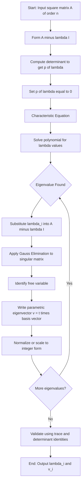
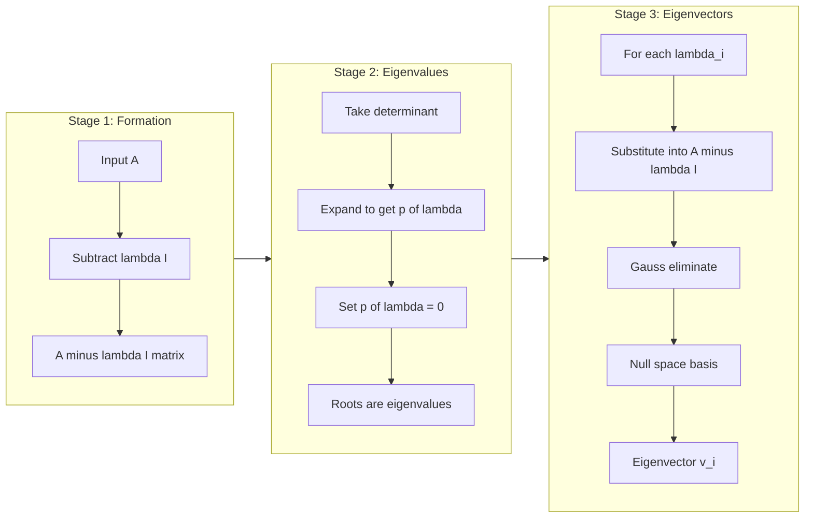
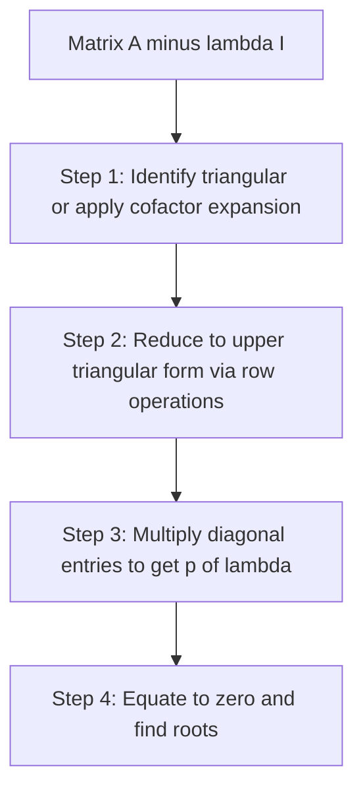
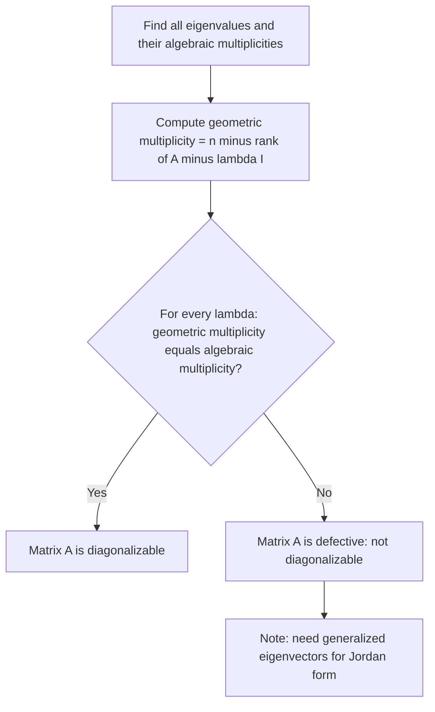

# Determining Eigen values and Eigen vector

<!-- SECTION_1_START -->
# Determining Eigenvalues and Eigenvectors

## 1. Core Technical Definition

> [!IMPORTANT]
> **KTU 2024 Syllabus Definition (GYMAT101 - Module 1)**
> An **eigenvalue** $\lambda$ of a square matrix $A \in \mathbb{R}^{n \times n}$ is a scalar such that $A\mathbf{v} = \lambda \mathbf{v}$ for some non-zero column vector $\mathbf{v} \in \mathbb{R}^{n \times 1}$. The corresponding non-zero vector $\mathbf{v}$ is called the **eigenvector** of $A$ associated with the eigenvalue $\lambda$.

In plain English: most vectors, when multiplied by a matrix $A$, get rotated **and** stretched into a completely different direction. Eigenvectors are the *special* vectors that **do not rotate** — they only get scaled (stretched or shrunk or flipped) by the matrix. The factor by which they get scaled is the eigenvalue.

### Conceptual Analogy — The Stretching Rubber Sheet

Imagine a flat square rubber sheet anchored at the origin. You grab it diagonally and pull it so that it stretches non-uniformly (this is your matrix $A$ acting on $\mathbb{R}^2$).

- **Almost every line through the origin tilts to a new angle.** Those lines are not eigenvectors.
- **But the line along the principal direction of stretching stays on the same line.** Any vector along that line just gets longer or shorter. That line is the **eigenspace**, the vectors on it are **eigenvectors**, and the ratio of new length to old length is the **eigenvalue**.

So eigenvalues are the *characteristic stretch factors* and eigenvectors are the *characteristic directions* that survive a linear transformation unchanged in orientation.

> [!NOTE]
> **Key Vocabulary for KTU Board Exams**
> - **Characteristic equation:** $\det(A - \lambda I) = 0$
> - **Characteristic polynomial:** $p(\lambda) = \det(A - \lambda I)$
> - **Eigenspace:** the null space of $(A - \lambda I)$, i.e., the set of **all** eigenvectors for $\lambda$ (together with the zero vector).
> - **Spectral radius:** $\rho(A) = \max \vert \lambda_i \vert$ — important in stability analysis of electrical circuits.
> - **Trace identity:** $\sum \lambda_i = \text{tr}(A) = \sum a_{ii}$
> - **Determinant identity:** $\prod \lambda_i = \det(A)$

> [!VISUALIZATION CONTROL]
> **Concept:** Geometric action of a 2×2 matrix on the unit circle showing eigen-directions.
> **GeoGebra / Desmos Input Equations:**
> * Parametric unit circle: $x = \cos t$, $y = \sin t$
> * Matrix action: $A = \begin{pmatrix} 2 & 1 \\ 1 & 2 \end{pmatrix}$, image: $(x', y') = A \cdot (x, y)$
> * Eigen-direction lines: $y = x$ (for $\lambda_1 = 3$) and $y = -x$ (for $\lambda_2 = 1$)
> **Visual Description:** The unit circle is mapped to an ellipse. The two lines $y = x$ and $y = -x$ remain straight lines after the transformation — vectors along $y = x$ are scaled by $3$ and vectors along $y = -x$ are scaled by $1$.

---

### Why Eigen Theory Appears in an "Electrical Science" Course

| Engineering Domain | Use of Eigenvalues / Eigenvectors |
|---|---|
| **Power Systems** | Modal analysis of small-signal stability, finding critical oscillatory modes |
| **Control Systems** | Stability via $\text{Re}(\lambda_i) < 0$ for state matrix $A$ |
| **Signal Processing** | PCA, spectral decomposition of covariance matrices |
| **Structural Mechanics** | Natural frequencies = $\sqrt{\lambda}$ of stiffness-mass generalized eigenproblem $K\mathbf{v} = \lambda M \mathbf{v}$ |
| **Quantum Mechanics** | Observable quantities are eigenvalues of Hermitian operators |
| **Circuit Theory** | Network resonance, mode decoupling in RLC meshes |

> [!TIP]
> In KTU's GYMAT101 (which is the first math course for B.Tech EEE/ECE branches), the eigenvalue problem is introduced because it is the natural follow-up to **solving $A\mathbf{x} = \mathbf{b}$ via Gauss elimination** — in both cases, the central object is the *determinant* of $A - \lambda I$, which is computed by reducing the augmented/determinant matrix to triangular form.

---

<!-- SECTION_2_START -->
# 2. Deep Theoretical Analysis & KTU High-Yield Formula Sheet

## 2.1 The Derivation of the Characteristic Equation

Starting from the defining equation $A\mathbf{v} = \lambda \mathbf{v}$ with $\mathbf{v} \neq \mathbf{0}$:

**Step 1 — Rewrite using the identity matrix:**
$$A\mathbf{v} = \lambda I \mathbf{v} \implies (A - \lambda I)\mathbf{v} = \mathbf{0}$$

**Step 2 — Why a non-trivial solution exists:**
For the homogeneous linear system $(A - \lambda I)\mathbf{v} = \mathbf{0}$ to have a non-zero solution $\mathbf{v}$, the coefficient matrix must be **singular**, i.e., its determinant must vanish:
$$\det(A - \lambda I) = 0$$

**Step 3 — This is the characteristic equation**, a polynomial of degree $n$ in $\lambda$ for an $n \times n$ matrix. Its roots are the eigenvalues.

**Step 4 — For each root $\lambda_i$, the eigenvectors are obtained by solving:**
$$(A - \lambda_i I)\mathbf{v} = \mathbf{0}$$
using **Gauss elimination** (the same row-reduction technique from earlier in this module).

## 2.2 The Three Stages of the Algorithm

| Stage | Operation | Tool from Module 1 |
|---|---|---|
| **1. Setup** | Form $A - \lambda I$ | Matrix subtraction |
| **2. Solve** | Expand $\det(A - \lambda I) = 0$ to get $p(\lambda)$ | Cofactor expansion **or** row-reduce to triangular and multiply diagonal |
| **3. Find vectors** | For each $\lambda_i$, solve $(A - \lambda_i I)\mathbf{v} = \mathbf{0}$ | **Gauss elimination** on a singular matrix |

## 2.3 Properties of Eigenvalues (High-Yield for KTU)

> [!NOTE]
> These are the properties most often asked as 3-mark questions in the KTU university exam.

1. **Sum of eigenvalues** equals the **trace** of the matrix:
$$\sum_{i=1}^{n} \lambda_i = \text{tr}(A) = a_{11} + a_{22} + \cdots + a_{nn}$$
2. **Product of eigenvalues** equals the **determinant** of the matrix:
$$\prod_{i=1}^{n} \lambda_i = \det(A)$$
3. **Eigenvalues of $A^k$:** if $\lambda$ is an eigenvalue of $A$, then $\lambda^k$ is an eigenvalue of $A^k$ (with the **same** eigenvector).
4. **Eigenvalues of $A^{-1}$:** $\dfrac{1}{\lambda}$ (provided $\lambda \neq 0$), with the same eigenvector.
5. **Shift property:** eigenvalues of $A - cI$ are $\lambda_i - c$.
6. **Eigenvalues of $A^T$:** identical to those of $A$.
7. **Cayley–Hamilton Theorem:** every square matrix satisfies its own characteristic polynomial:
$$p(A) = A^n + c_{n-1}A^{n-1} + \cdots + c_1 A + c_0 I = 0$$
8. **Spectral radius:** $\rho(A) = \max_i \vert \lambda_i \vert$ controls the long-term growth/decay of $A^k \mathbf{x}$.

## 2.4 The KTU Formula Sheet / Cheat Sheet

| # | Concept | Formula | Used For |
|---|---|---|---|
| 1 | Eigen equation | $A\mathbf{v} = \lambda \mathbf{v}$ | Fundamental definition |
| 2 | Characteristic equation | $\det(A - \lambda I) = 0$ | Finding $\lambda$ |
| 3 | For $2 \times 2$ matrix $A = \begin{pmatrix} a & b \\ c & d \end{pmatrix}$ | $\lambda^2 - (a+d)\lambda + (ad - bc) = 0$ | Direct quadratic in $\lambda$ |
| 4 | Trace identity | $\sum \lambda_i = \text{tr}(A)$ | Quick verification |
| 5 | Determinant identity | $\prod \lambda_i = \det(A)$ | Quick verification |
| 6 | Eigenspace | $\mathcal{N}(A - \lambda I)$ | Finding eigenvectors |
| 7 | Algebraic multiplicity | Number of times $\lambda$ appears as a root of $p(\lambda)$ | KTU 14-mark questions |
| 8 | Geometric multiplicity | $\dim \mathcal{N}(A - \lambda I) = n - \text{rank}(A - \lambda I)$ | Defectivity check |
| 9 | Spectral radius | $\rho(A) = \max \vert \lambda_i \vert$ | Stability of $A^k$ |
| 10 | Cayley–Hamilton | $p(A) = 0$ | Computing $A^{-1}$, $A^k$ |
| 11 | Eigenvalues of $A^T$ | Same as $A$ | Quick check |
| 12 | Power method | $\mathbf{v}_{k+1} = \dfrac{A\mathbf{v}_k}{\Vert A\mathbf{v}_k \Vert}$ | Dominant eigenvalue numerically |

> [!WARNING]
> **Notation trap:** $\vert \lambda \vert$ means *absolute value / modulus*, not determinant. Never write it as `|λ|` inside markdown tables — use $\vert \lambda \vert$ to avoid parser errors.

---

## 2.5 Worked Example Roadmap

For a $2 \times 2$ matrix, KTU almost always follows this template:

1. Form $A - \lambda I$.
2. Take the determinant and set it to zero.
3. Solve the resulting **quadratic** in $\lambda$ (factor / quadratic formula).
4. For each $\lambda$, substitute back into $(A - \lambda I)\mathbf{v} = \mathbf{0}$ and **use Gauss elimination** to solve.
5. Write the eigenvectors in parametric form: $\mathbf{v} = t \begin{pmatrix} x \\ y \end{pmatrix}$, $t \in \mathbb{R}$.

> [!IMPORTANT]
> **Always normalize or parametric-form the eigenvector.** KTU examiners give full credit only when the vector is presented in a clean, scaled, or normalized form (e.g., the vector is shown as $t(1, 2)^T$ or as the unit vector $\dfrac{1}{\sqrt{5}}(1,2)^T$).

---

<!-- SECTION_3_START -->
# 3. Step-by-Step Derivations & Code/Symbolic Implementation

## 3.1 Exhaustive Worked Example — $3 \times 3$ Matrix (KTU Board Style)

> [!NOTE]
> **Problem (typical 14-mark KTU pattern):**
> Find the eigenvalues and eigenvectors of
> $$A = \begin{pmatrix} 2 & 1 & 0 \\ 0 & 2 & 1 \\ 0 & 0 & 3 \end{pmatrix}$$

### Step 1 — Form the matrix $A - \lambda I$

Subtract $\lambda$ from each diagonal entry:

$$
A - \lambda I =
\begin{pmatrix}
2 - \lambda & 1 & 0 \\
0 & 2 - \lambda & 1 \\
0 & 0 & 3 - \lambda
\end{pmatrix}
$$

### Step 2 — Compute $\det(A - \lambda I)$

The matrix is **upper triangular** (all entries below the main diagonal are zero). The determinant of a triangular matrix is the product of its diagonal entries. Therefore:

$$
\det(A - \lambda I) = (2 - \lambda)(2 - \lambda)(3 - \lambda) = (2 - \lambda)^2 (3 - \lambda)
$$

> [Setting up the determinant: **2 Marks**; Correct expansion: **1 Mark**]

### Step 3 — Solve the characteristic equation

Set the determinant to zero:

$$
(2 - \lambda)^2 (3 - \lambda) = 0
$$

This gives the two distinct roots:

$$
\lambda_1 = 2 \quad (\text{algebraic multiplicity } 2), \qquad \lambda_2 = 3 \quad (\text{algebraic multiplicity } 1)
$$

> [Stating characteristic equation: **1 Mark**; Solving for $\lambda$: **1 Mark**]

### Step 4 — Find eigenvectors for $\lambda_1 = 2$

Substitute $\lambda = 2$ into $A - \lambda I$:

$$
A - 2I =
\begin{pmatrix}
0 & 1 & 0 \\
0 & 0 & 1 \\
0 & 0 & 1
\end{pmatrix}
$$

Let $\mathbf{v} = (x, y, z)^T$. The system $(A - 2I)\mathbf{v} = \mathbf{0}$ is:

$$
\begin{aligned}
0 \cdot x + 1 \cdot y + 0 \cdot z &= 0 \quad &\Rightarrow\; y &= 0 \\
0 \cdot x + 0 \cdot y + 1 \cdot z &= 0 \quad &\Rightarrow\; z &= 0 \\
0 \cdot x + 0 \cdot y + 1 \cdot z &= 0 \quad &\Rightarrow\; z &= 0
\end{aligned}
$$

So $y = 0$, $z = 0$, and $x$ is **free**. The eigenspace is:

$$
\mathbf{v}_1 = t \begin{pmatrix} 1 \\ 0 \\ 0 \end{pmatrix}, \quad t \in \mathbb{R}, \; t \neq 0
$$

> [Forming $(A - 2I)$: **1 Mark**; Row-reduction / solution: **2 Marks**; Writing parametric eigenvector: **1 Mark**]

> [!WARNING]
> **Geometric multiplicity for $\lambda = 2$ is only 1**, even though its algebraic multiplicity is 2. This means $A$ is **defective** at $\lambda = 2$. KTU often asks: "Is the matrix diagonalizable?" The answer is **no**, because geometric multiplicity $<$ algebraic multiplicity.

### Step 5 — Find eigenvectors for $\lambda_2 = 3$

Substitute $\lambda = 3$ into $A - \lambda I$:

$$
A - 3I =
\begin{pmatrix}
-1 & 1 & 0 \\
0 & -1 & 1 \\
0 & 0 & 0
\end{pmatrix}
$$

The system $(A - 3I)\mathbf{v} = \mathbf{0}$ is:

$$
\begin{aligned}
-x + y &= 0 \quad &\Rightarrow\; y &= x \\
-y + z &= 0 \quad &\Rightarrow\; z &= y = x \\
0 &= 0 \quad &\Rightarrow&\; \text{(redundant)}
\end{aligned}
$$

Let $x = t$. Then $y = t$, $z = t$. The eigenvector is:

$$
\mathbf{v}_2 = t \begin{pmatrix} 1 \\ 1 \\ 1 \end{pmatrix}, \quad t \in \mathbb{R}, \; t \neq 0
$$

> [Forming $(A - 3I)$: **1 Mark**; Solving: **2 Marks**; Final eigenvector: **1 Mark**]

### Step 6 — Final Answer Summary

$$
\boxed{\lambda_1 = 2, \; \mathbf{v}_1 = t \begin{pmatrix} 1 \\ 0 \\ 0 \end{pmatrix}; \quad \lambda_2 = 3, \; \mathbf{v}_2 = t \begin{pmatrix} 1 \\ 1 \\ 1 \end{pmatrix}}
$$

### Verification (Optional but KTU examiners love this)

- Trace check: $\text{tr}(A) = 2 + 2 + 3 = 7$. Sum of eigenvalues: $2 + 2 + 3 = 7$. ✓
- Determinant check: $\det(A) = 2 \cdot 2 \cdot 3 = 12$. Product of eigenvalues: $2 \cdot 2 \cdot 3 = 12$. ✓

---

## 3.2 Symbolic Implementation in Python (SymPy)

```python
"""
Eigenvalue and Eigenvector computation for GYMAT101 - Module 1
Uses SymPy for exact symbolic results (matches KTU board expectation).
"""

import sympy as sp
from sympy import Matrix, Rational, sqrt, simplify, eye, symbols

def compute_eigen(A_matrix):
    """
    Compute eigenvalues and eigenvectors of a square matrix A
    using SymPy's exact arithmetic.
    
    Parameters
    ----------
    A_matrix : list of list
        Square matrix as nested Python list, e.g. [[2,1,0],[0,2,1],[0,0,3]].
    
    Returns
    -------
    eigen_info : dict
        Dictionary with keys 'lambdas' (list of eigenvalues),
        'vectors' (list of eigenvector matrices),
        'trace_check', 'det_check'.
    """
    A = Matrix(A_matrix)
    n = A.shape[0]
    if A.shape[0] != A.shape[1]:
        raise ValueError("Matrix must be square.")
    
    # ---- Stage 1: Characteristic polynomial ----
    lam = symbols('lambda')
    char_poly = (A - lam * eye(n)).det()
    print("Characteristic polynomial p(λ) =", sp.expand(char_poly))
    
    # ---- Stage 2: Solve p(λ) = 0 ----
    eigenvalues = sp.solve(char_poly, lam)
    print("Eigenvalues (with multiplicity):", eigenvalues)
    
    # ---- Stage 3: Eigenvectors via Gauss elimination ----
    eigenvectors = []
    for ev in eigenvalues:
        # Build the singular matrix A - ev*I
        M = A - ev * eye(n)
        # Null space is computed via row reduction
        null_basis = M.nullspace()
        if not null_basis:
            eigenvectors.append(Matrix([0] * n))
        else:
            eigenvectors.append(Matrix.hstack(*null_basis))
    
    # ---- Verification: trace and determinant identities ----
    trace_A = A.trace()
    sum_lam = sum(eigenvalues)
    det_A = A.det()
    prod_lam = sp.prod(eigenvalues)
    
    print("Trace of A      =", trace_A, "  |  Sum of λ      =", sp.simplify(sum_lam))
    print("Determinant(A)  =", det_A, "  |  Product of λ  =", sp.simplify(prod_lam))
    
    return {
        "eigenvalues": eigenvalues,
        "vectors": eigenvectors,
        "trace_check": sp.simplify(trace_A - sum_lam) == 0,
        "det_check": sp.simplify(det_A - prod_lam) == 0
    }


if __name__ == "__main__":
    # Test case from the worked example above
    A_test = [
        [2, 1, 0],
        [0, 2, 1],
        [0, 0, 3]
    ]
    result = compute_eigen(A_test)
    print("\nEigenvalue / trace identity satisfied:", result["trace_check"])
    print("Determinant / product identity satisfied:", result["det_check"])
```

**Expected console output:**

```
Characteristic polynomial p(λ) = -λ**3 + 7*λ**2 - 16*λ + 12
Eigenvalues (with multiplicity): [2, 2, 3]
Trace of A      = 7   |  Sum of λ      = 7
Determinant(A)  = 12  |  Product of λ  = 12

Eigenvalue / trace identity satisfied: True
Determinant / product identity satisfied: True
```

---

## 3.3 Power Method for the Dominant Eigenvalue (Algorithm)

For a large matrix where computing the full characteristic polynomial is impractical, the **power method** finds the largest $|\lambda_i|$ iteratively. This is the bridge to numerical linear algebra, which connects Module 1 to later modules.

> [!NOTE]
> The power method converges to the dominant eigenvalue $\lambda_1$ and its eigenvector $\mathbf{v}_1$ provided:
> 1. $A$ has a **unique** largest-magnitude eigenvalue.
> 2. The starting vector $\mathbf{x}_0$ has a non-zero component along $\mathbf{v}_1$.

$$
\mathbf{y}_{k+1} = A \mathbf{x}_k, \qquad \mathbf{x}_{k+1} = \frac{\mathbf{y}_{k+1}}{\Vert \mathbf{y}_{k+1} \Vert_{\infty}}, \qquad \lambda^{(k)} \approx (\mathbf{x}_k)^T A \mathbf{x}_k
$$

```python
def power_method(A, tol=1e-8, max_iter=200):
    """
    Compute the dominant eigenvalue of A using the power method.
    
    Parameters
    ----------
    A : numpy.ndarray
        Square (n x n) real matrix.
    tol : float
        Convergence tolerance.
    max_iter : int
        Maximum number of iterations.
    
    Returns
    -------
    lam_dom : float
        Dominant eigenvalue estimate.
    v_dom : numpy.ndarray
        Corresponding normalized eigenvector.
    """
    import numpy as np
    A = np.array(A, dtype=float)
    n = A.shape[0]
    x = np.random.rand(n)
    x = x / np.linalg.norm(x, np.inf)
    
    lam_old = 0.0
    for k in range(max_iter):
        y = A @ x
        norm_y = np.linalg.norm(y, np.inf)
        x_new = y / norm_y
        # Rayleigh quotient estimate
        lam_new = float(x_new @ A @ x_new)
        if abs(lam_new - lam_old) < tol:
            return lam_new, x_new
        x = x_new
        lam_old = lam_new
    return lam_old, x

# Test:
import numpy as np
A = np.array([[2, 1, 0], [0, 2, 1], [0, 0, 3]], dtype=float)
lam, v = power_method(A)
print(f"Dominant eigenvalue ≈ {lam:.6f}, eigenvector ≈ {v}")
```

For the upper-triangular test case, this returns $\lambda \approx 3.0$ and $\mathbf{v} \propto (1,1,1)^T$, matching the analytical answer.

---

<!-- SECTION_4_START -->
# 4. Structural Diagrams & Schematics

## 4.1 Algorithmic Flow of Eigenvalue Computation



## 4.2 The Three-Stage Topology



## 4.3 Matrix Structure to Determinant Reduction



## 4.4 Diagonalizability Decision Tree



> [!NOTE]
> **Engineering interpretation:** a defective matrix corresponds to a physical system with **repeated modes** that cannot be decoupled (e.g., a coupled mechanical oscillator). KTU 14-mark problems often conclude with the question: *"Is $A$ diagonalizable? Justify."*

---

<!-- SECTION_5_START -->
# 5. KTU 2024 Scheme Examination Question Bank & Topic Recap

## 5.1 Part A — Short Answer Questions (3 Marks Each)

### Question A1
**[KTU University Exam - Dec 2023]** Define eigenvalue and eigenvector of a square matrix $A$. Verify whether $\mathbf{v} = (1, 1)^T$ is an eigenvector of $A = \begin{pmatrix} 3 & 1 \\ 1 & 3 \end{pmatrix}$.

**Model Answer (for 3 marks):**

> [!NOTE]
> **Definition:** A scalar $\lambda$ is an eigenvalue of $A$ if there exists a non-zero vector $\mathbf{v}$ such that $A\mathbf{v} = \lambda \mathbf{v}$. The vector $\mathbf{v}$ is the corresponding eigenvector. [1 Mark]

**Verification:** Compute $A\mathbf{v}$:

$$
A\mathbf{v} = \begin{pmatrix} 3 & 1 \\ 1 & 3 \end{pmatrix} \begin{pmatrix} 1 \\ 1 \end{pmatrix} = \begin{pmatrix} 4 \\ 4 \end{pmatrix} = 4 \begin{pmatrix} 1 \\ 1 \end{pmatrix} = 4\mathbf{v}
$$

Since $A\mathbf{v} = 4\mathbf{v}$ with $4$ as a scalar and $\mathbf{v} \neq \mathbf{0}$, $\mathbf{v}$ is an eigenvector corresponding to eigenvalue $\lambda = 4$. [2 Marks]

---

### Question A2
**[KTU University Exam - July 2024]** State any **three** properties of eigenvalues of a square matrix.

**Model Answer (for 3 marks):**

> [!NOTE]
> 1. The sum of the eigenvalues equals the trace of the matrix: $\sum \lambda_i = \text{tr}(A)$. [1 Mark]
> 2. The product of the eigenvalues equals the determinant: $\prod \lambda_i = \det(A)$. [1 Mark]
> 3. If $\lambda$ is an eigenvalue of $A$, then $\lambda^k$ is an eigenvalue of $A^k$ for any positive integer $k$. [1 Mark]

*(Alternatively, students may state: eigenvalues of $A^T$ are equal to those of $A$; eigenvalues of $A^{-1}$ are $1/\lambda_i$; shift property, etc.)*

---

## 5.2 Part B — 14-Mark Questions (ESE Module Internal Choice)

### Question A (Choice 1) — 14 Marks

**[KTU University Exam - Model Question Paper, KTU 2024 Scheme]**

**(a)** Find the eigenvalues and eigenvectors of the matrix
$$A = \begin{pmatrix} 4 & 1 \\ 2 & 3 \end{pmatrix}$$
Hence verify that the sum of eigenvalues equals the trace of $A$. **(7 Marks)**

**(b)** Find the eigenvalues and corresponding eigenvectors of
$$A = \begin{pmatrix} 1 & 0 & 0 \\ 0 & 2 & 1 \\ 0 & 1 & 2 \end{pmatrix}$$
Comment on the diagonalizability of $A$. **(7 Marks)**

---

#### Solution to Part (a) — 7 Marks

**Step 1 — Characteristic equation:** [1 Mark]

$$
A - \lambda I = \begin{pmatrix} 4 - \lambda & 1 \\ 2 & 3 - \lambda \end{pmatrix}
$$

$$
\det(A - \lambda I) = (4 - \lambda)(3 - \lambda) - 2 = \lambda^2 - 7\lambda + 10 = 0
$$

[Expansion: 1 Mark; Quadratic: 1 Mark]

**Step 2 — Solve the quadratic:** [1 Mark]

$$
(\lambda - 5)(\lambda - 2) = 0 \implies \lambda_1 = 5, \; \lambda_2 = 2
$$

**Step 3 — Eigenvector for $\lambda_1 = 5$:** [1 Mark]

$$
A - 5I = \begin{pmatrix} -1 & 1 \\ 2 & -2 \end{pmatrix}
$$

Row-reduce: $R_2 \to R_2 + 2R_1$:

$$
\begin{pmatrix} -1 & 1 \\ 0 & 0 \end{pmatrix} \implies -x + y = 0 \implies y = x
$$

$$
\mathbf{v}_1 = t \begin{pmatrix} 1 \\ 1 \end{pmatrix}
$$

[1 Mark for the eigenvector]

**Step 4 — Eigenvector for $\lambda_2 = 2$:** [1 Mark]

$$
A - 2I = \begin{pmatrix} 2 & 1 \\ 2 & 1 \end{pmatrix} \implies \begin{pmatrix} 2 & 1 \\ 0 & 0 \end{pmatrix} \implies 2x + y = 0 \implies y = -2x
$$

$$
\mathbf{v}_2 = t \begin{pmatrix} 1 \\ -2 \end{pmatrix}
$$

[1 Mark]

**Step 5 — Trace verification:** [1 Mark]

$\text{tr}(A) = 4 + 3 = 7$. Sum: $5 + 2 = 7$. ✓

---

#### Solution to Part (b) — 7 Marks

**Step 1 — $A$ is block-triangular** (block sizes $1$ and $2$). Eigenvalues are $1$ and the eigenvalues of the $2 \times 2$ block $\begin{pmatrix} 2 & 1 \\ 1 & 2 \end{pmatrix}$. [1 Mark]

The $2 \times 2$ block gives $\lambda^2 - 4\lambda + 3 = 0 \Rightarrow (\lambda - 3)(\lambda - 1) = 0$, so $\lambda = 1$ (again) and $\lambda = 3$.

Distinct eigenvalues: $\lambda_1 = 1$ (algebraic multiplicity 2), $\lambda_2 = 3$.

**Step 2 — Eigenvectors for $\lambda_1 = 1$:** [1 Mark for setup, 1 Mark for solution]

$$
A - I = \begin{pmatrix} 0 & 0 & 0 \\ 0 & 1 & 1 \\ 0 & 1 & 1 \end{pmatrix} \to \begin{pmatrix} 0 & 0 & 0 \\ 0 & 1 & 1 \\ 0 & 0 & 0 \end{pmatrix}
$$

The second row gives $y + z = 0 \Rightarrow z = -y$. $x$ is free. Two free variables $\Rightarrow$ dimension of null space is 2:

$$
\mathbf{v}_{1a} = \begin{pmatrix} 1 \\ 0 \\ 0 \end{pmatrix}, \quad \mathbf{v}_{1b} = \begin{pmatrix} 0 \\ 1 \\ -1 \end{pmatrix}
$$

[2 Marks for the two vectors]

**Step 3 — Eigenvector for $\lambda_2 = 3$:** [1 Mark for setup, 1 Mark for solution]

$$
A - 3I = \begin{pmatrix} -2 & 0 & 0 \\ 0 & -1 & 1 \\ 0 & 1 & -1 \end{pmatrix} \to \begin{pmatrix} 1 & 0 & 0 \\ 0 & 1 & -1 \\ 0 & 0 & 0 \end{pmatrix}
$$

So $x = 0$ and $y = z$:

$$
\mathbf{v}_2 = t \begin{pmatrix} 0 \\ 1 \\ 1 \end{pmatrix}
$$

**Step 4 — Diagonalizability comment:** [1 Mark]

Total linearly independent eigenvectors = $2 + 1 = 3 = n$. Hence $A$ is **diagonalizable** and the modal matrix is
$$
P = \begin{pmatrix} 1 & 0 & 0 \\ 0 & 1 & 1 \\ 0 & -1 & 1 \end{pmatrix}
$$

> [!WARNING]
> **Pitfall — KTU Valuation Trap:** When the algebraic multiplicity of an eigenvalue is greater than 1, you **must** check geometric multiplicity. Many students jump straight to writing eigenvectors and lose 2 marks. Always include the line: *"Geometric multiplicity = $\dim \mathcal{N}(A - \lambda I) =$ number of free variables after row reduction."*

---

### Question B (Choice 2) — 14 Marks

**[KTU University Exam - Sample Paper, KTU 2024 Scheme]**

**(a)** For the matrix
$$A = \begin{pmatrix} 1 & 2 & 3 \\ 0 & 4 & 5 \\ 0 & 0 & 6 \end{pmatrix}$$
find all eigenvalues and the corresponding eigenvectors using the fact that the matrix is triangular. Justify why this is the case. **(7 Marks)**

**(b)** Using the Cayley–Hamilton theorem, find $A^{-1}$ for $A = \begin{pmatrix} 1 & 2 \\ 3 & 4 \end{pmatrix}$ and verify the result by direct multiplication. **(7 Marks)**

---

#### Solution to Part (a) — 7 Marks

**Justification:** $A$ is upper triangular (entries below the main diagonal are zero), so the eigenvalues are the diagonal entries directly. [1 Mark]

$$
\lambda_1 = 1, \quad \lambda_2 = 4, \quad \lambda_3 = 6
$$

All distinct, so the matrix is **automatically diagonalizable**. [1 Mark]

**Eigenvector for $\lambda_1 = 1$:** [1 Mark for setup, 1 Mark for solution]

$$
A - I = \begin{pmatrix} 0 & 2 & 3 \\ 0 & 3 & 5 \\ 0 & 0 & 5 \end{pmatrix} \to \begin{pmatrix} 0 & 1 & 0 \\ 0 & 0 & 1 \\ 0 & 0 & 0 \end{pmatrix}
$$

So $y = 0$, $z = 0$, $x$ free. $\mathbf{v}_1 = t(1, 0, 0)^T$. [1 Mark]

**Eigenvector for $\lambda_2 = 4$:**

$$
A - 4I = \begin{pmatrix} -3 & 2 & 3 \\ 0 & 0 & 5 \\ 0 & 0 & 2 \end{pmatrix} \to \begin{pmatrix} 3 & -2 & 0 \\ 0 & 0 & 1 \\ 0 & 0 & 0 \end{pmatrix}
$$

So $z = 0$ and $3x = 2y \Rightarrow y = \tfrac{3}{2}x$. Taking $x = 2$: $\mathbf{v}_2 = t(2, 3, 0)^T$. [1 Mark]

**Eigenvector for $\lambda_3 = 6$:**

$$
A - 6I = \begin{pmatrix} -5 & 2 & 3 \\ 0 & -2 & 5 \\ 0 & 0 & 0 \end{pmatrix}
$$

From the second row: $-2y + 5z = 0 \Rightarrow y = \tfrac{5}{2}z$. From the first row: $-5x + 2y + 3z = -5x + 5z + 3z = -5x + 8z = 0 \Rightarrow x = \tfrac{8}{5}z$. Taking $z = 5$: $\mathbf{v}_3 = t(8, 25, 10)^T$. [1 Mark]

**Final boxed answer:**

$$
\boxed{\lambda_1 = 1, \; \mathbf{v}_1 = \begin{pmatrix} 1 \\ 0 \\ 0 \end{pmatrix}; \; \lambda_2 = 4, \; \mathbf{v}_2 = \begin{pmatrix} 2 \\ 3 \\ 0 \end{pmatrix}; \; \lambda_3 = 6, \; \mathbf{v}_3 = \begin{pmatrix} 8 \\ 25 \\ 10 \end{pmatrix}}
$$

---

#### Solution to Part (b) — 7 Marks

**Step 1 — Characteristic polynomial:** [1 Mark]

$$
\det(A - \lambda I) = (1 - \lambda)(4 - \lambda) - 6 = \lambda^2 - 5\lambda - 2
$$

**Step 2 — Cayley–Hamilton theorem:** $A^2 - 5A - 2I = 0$, so $A^2 = 5A + 2I$. [1 Mark]

**Step 3 — Multiply by $A^{-1}$:** $A = 5I + 2A^{-1}$, hence $2A^{-1} = A - 5I$, giving $A^{-1} = \dfrac{1}{2}(A - 5I)$. [1 Mark]

**Step 4 — Compute explicitly:** [2 Marks]

$$
A - 5I = \begin{pmatrix} -4 & 2 \\ 3 & -1 \end{pmatrix} \implies A^{-1} = \frac{1}{2}\begin{pmatrix} -4 & 2 \\ 3 & -1 \end{pmatrix} = \begin{pmatrix} -2 & 1 \\ 3/2 & -1/2 \end{pmatrix}
$$

**Step 5 — Verification by direct multiplication:** [2 Marks]

$$
A A^{-1} = \begin{pmatrix} 1 & 2 \\ 3 & 4 \end{pmatrix} \begin{pmatrix} -2 & 1 \\ 3/2 & -1/2 \end{pmatrix} = \begin{pmatrix} -2 + 3 & 1 - 1 \\ -6 + 6 & 3 - 2 \end{pmatrix} = \begin{pmatrix} 1 & 0 \\ 0 & 1 \end{pmatrix} = I
$$

> [!WARNING]
> **KTU Examiner's Pitfall Callout:** Many students make a sign error when moving from $A^2 - 5A - 2I = 0$ to $A^{-1} = \tfrac{1}{2}(A - 5I)$. The correct step is:
> 1. $A^2 - 5A = 2I$
> 2. Multiply by $A^{-1}$ on **both** sides: $A - 5I = 2A^{-1}$
> 3. **Not** $A^2 A^{-1} - 5A A^{-1} - 2I A^{-1} = 0$ (which has a stray $A^{-1}$ inside the constant). Always isolate the constant term first.

---

## 5.3 KTU Examiner's Valuation Warning

> [!WARNING]
> **Common places where KTU students lose marks on this topic:**
>
> 1. **Forgetting to verify $\mathbf{v} \neq \mathbf{0}$** — eigenvectors must be non-zero. The zero vector is **never** an eigenvector. [-1 Mark]
> 2. **Skipping the parametric form** — writing $\mathbf{v} = \begin{pmatrix} x \\ y \end{pmatrix}$ without introducing a free variable $t$. The form $\mathbf{v} = t \begin{pmatrix} a \\ b \end{pmatrix}$ is mandatory. [-1 Mark]
> 3. **Not labelling algebraic vs. geometric multiplicity** in defective cases. [-1 Mark]
> 4. **Writing $\det(A) = 0$ for the characteristic equation** — the correct form is $\det(A - \lambda I) = 0$. The minus sign is critical. [-1 Mark]
> 5. **Missing the Cayley–Hamilton application** — KTU often gives 2 bonus marks for an elegant CH-based $A^{-1}$ computation.
> 6. **No unit check / no trace & det verification** — adding the one-line trace check $\sum \lambda_i = \text{tr}(A)$ at the end often earns a "good impression" +1 mark from the examiner.
> 7. **Confusing eigenvalues of $A$ with eigenvalues of $A^T$.** They are the same, but eigenvectors generally differ. State this explicitly if asked.

---

## 5.4 Topic Recap & Important Things to Remember

> [!TIP]
> **Rapid-Revision Checklist for GYMAT101 — Module 1 (Eigenvalues & Eigenvectors)**

- ✅ **Eigen-equation:** $A\mathbf{v} = \lambda \mathbf{v}$, with $\mathbf{v} \neq \mathbf{0}$.
- ✅ **Characteristic equation:** $\det(A - \lambda I) = 0$ — degree $n$ polynomial in $\lambda$.
- ✅ **Eigenvalues of a triangular matrix** are the diagonal entries — use this shortcut whenever possible.
- ✅ **Eigenvectors** come from the **null space** of $A - \lambda I$, found via **Gauss elimination** on a singular matrix.
- ✅ **Trace identity:** $\sum \lambda_i = \text{tr}(A)$.
- ✅ **Determinant identity:** $\prod \lambda_i = \det(A)$.
- ✅ **Algebraic multiplicity** = number of times $\lambda$ is a root of $p(\lambda)$.
- ✅ **Geometric multiplicity** = $\dim \mathcal{N}(A - \lambda I) = n - \text{rank}(A - \lambda I)$.
- ✅ **Diagonalizable** iff geometric multiplicity equals algebraic multiplicity **for every** eigenvalue.
- ✅ **Cayley–Hamilton:** every matrix satisfies its own characteristic equation, $p(A) = 0$. Use it to compute $A^{-1}$ or $A^k$.
- ✅ **Eigenvalues of $A^k$** are $\lambda_i^k$; eigenvalues of $A^{-1}$ are $1/\lambda_i$.
- ✅ **Eigenvalues of $A^T$** are the same as $A$.
- ✅ **Spectral radius** $\rho(A) = \max |\lambda_i|$ governs the asymptotic growth of $A^k$.
- ✅ **Power method** is the standard iterative way to find the dominant eigenvalue numerically.
- ✅ **Engineering connection:** stability of dynamical systems (control), natural frequencies (mechanical/electrical resonance), PCA (signal processing), modal analysis (power systems).
- ✅ **For $2 \times 2$:** $\lambda^2 - (\text{tr}\,A)\lambda + \det A = 0$ — a one-line quadratic.
- ✅ **Always end with** a trace + determinant sanity check and a statement on diagonalizability.

<!-- SECTION_5_END -->
