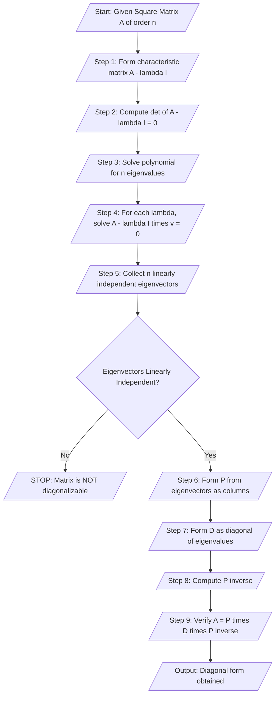
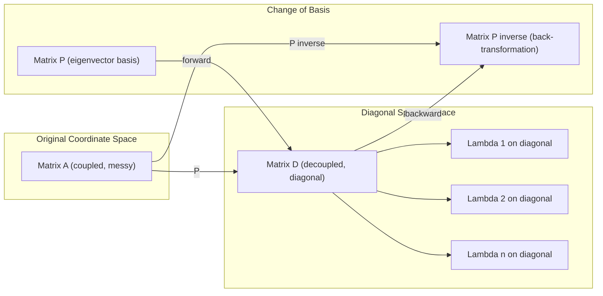
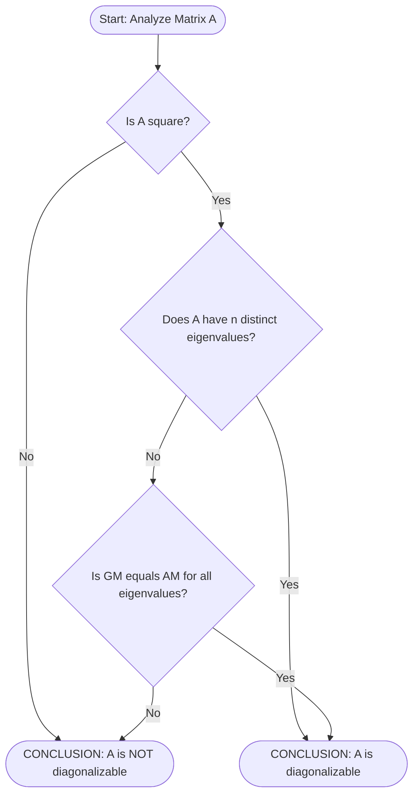
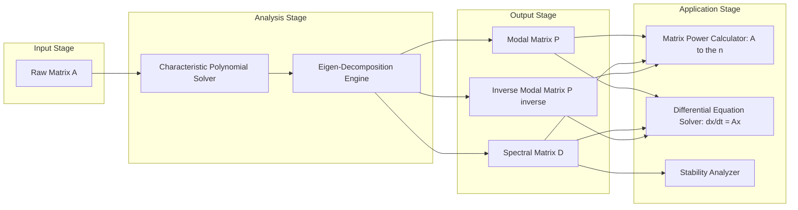

# Diagonalization of matrices.

<!-- SECTION_1_START -->
# 1. Diagonalization of Matrices — Core Technical Definition & Intuitive Overview

## 📘 Formal KTU 2024 Definition

> [!IMPORTANT]
> **Diagonalization of a Matrix:**
> A square matrix $A$ of order $n \times n$ is said to be **diagonalizable** (over the field $\mathbb{R}$ or $\mathbb{C}$) if there exists an invertible matrix $P$ and a diagonal matrix $D$ such that:
> $$\boxed{A = P D P^{-1}}$$
> Equivalently, the **similarity transformation** $D = P^{-1} A P$ converts $A$ into its diagonal (canonical) form. The diagonal entries of $D$ are the **eigenvalues** of $A$, and the columns of $P$ are the corresponding **eigenvectors**.

---

## 💡 Conceptual Analogy — The "Principal Axes" Intuition

Imagine you are looking at a stretched, rotated ellipse on a tilted piece of paper.

* In the **tilted (original) coordinates**, the ellipse's equation is messy: it has cross-terms $xy$ mixed in, just like a general matrix $A$ has off-diagonal entries.
* If you **rotate the paper** to align with the ellipse's natural axes, the equation becomes beautifully clean: $\dfrac{x'^2}{a^2} + \dfrac{y'^2}{b^2} = 1$ — **no cross-terms**. This clean form is the **diagonal matrix** $D$.

**Diagonalization is that rotation.** The matrix $P$ is the rotation matrix (built from eigenvectors), and the resulting $D$ is the simplified view of the linear transformation in the "natural" eigenvector basis.

> [!NOTE]
> **Real-World Engineering Analogy — Vibrating Systems:**
> In Mechanical/Electrical engineering, a coupled multi-degree-of-freedom system (like two coupled pendulums or an LC circuit network) has equations of motion in matrix form $M\ddot{x} + Kx = 0$. These coupled equations are hard to solve. Diagonalization **decouples** them into independent normal modes, where each mass oscillates at a single **natural frequency** (an eigenvalue). This is why diagonalization is foundational in **Control Systems, Power Systems, and Quantum Mechanics**.

---

## 🧮 Key Terminology for KTU Board Answers

| Term | Meaning |
|---|---|
| **Eigenvalue** $\lambda$ | A scalar such that $A\mathbf{v} = \lambda \mathbf{v}$ for some non-zero vector $\mathbf{v}$ |
| **Eigenvector** $\mathbf{v}$ | The non-zero vector satisfying the eigenvalue equation |
| **Characteristic Polynomial** | $p(\lambda) = \det(A - \lambda I)$ |
| **Algebraic Multiplicity (AM)** | Number of times $\lambda$ is a root of $p(\lambda)$ |
| **Geometric Multiplicity (GM)** | Dimension of the null space of $(A - \lambda I)$ |
| **Spectral Matrix** $D$ | Diagonal matrix with eigenvalues on the diagonal |

> [!VISUALIZATION CONTROL]
> **Concept:** Eigenvalue-Eigenvector geometric representation
> **GeoGebra / Desmos Input Equations:**
> * Point $P_1 = (1, 2)$, Point $P_2 = (-1, 1)$ — sample eigenvectors
> * Line $L_1: y = 2x$ (line through origin along $P_1$)
> * Line $L_2: y = -x$ (line through origin along $P_2$)
> **Visual Description:** Two distinct lines passing through the origin — each represents a 1-D invariant subspace (eigenspace) under the linear transformation $A$. Diagonalization succeeds only when such linearly independent invariant lines exist.

---
<!-- SECTION_1_END -->

<!-- SECTION_2_START -->
# 2. Deep Theoretical Analysis & KTU High-Yield Formula Sheet

## 🧠 The Diagonalization Theorem — Logical Breakdown

A matrix $A$ ($n \times n$) is diagonalizable if and only if **all the following conditions hold simultaneously**:

1. **$A$ must be square** — only square matrices have a well-defined "diagonal form."
2. **$A$ must have $n$ linearly independent eigenvectors** in $\mathbb{R}^n$ (or $\mathbb{C}^n$).
3. **For every eigenvalue**, the geometric multiplicity must equal its algebraic multiplicity:
$$\text{GM}(\lambda_i) = \text{AM}(\lambda_i) \quad \forall i$$
4. The matrix $P = [\mathbf{v}_1 \mid \mathbf{v}_2 \mid \cdots \mid \mathbf{v}_n]$ formed by stacking eigenvectors as columns must satisfy $\det(P) \neq 0$ (i.e., $P$ is invertible).

> [!IMPORTANT]
> **KTU Board-Exam Mantra:** A matrix is **NOT diagonalizable** if it has either:
> * Fewer than $n$ linearly independent eigenvectors, OR
> * An eigenvalue with $\text{GM} < \text{AM}$ (e.g., defective matrices with repeated eigenvalues but short eigenspaces).

---

## ⚡ Why Diagonalization Matters — Engineering Utility

| Field | Application |
|---|---|
| **Power Systems** | Decoupling of network equations; modal analysis of oscillations |
| **Control Systems** | State-space analysis: $x' = Ax \Rightarrow x(t) = Pe^{Dt}P^{-1}x_0$ |
| **Signal Processing** | PCA (Principal Component Analysis) for dimensionality reduction |
| **Quantum Mechanics** | Observables are Hermitian; diagonalization yields measurement values |
| **Graph Theory / Markov Chains** | Long-term behavior via $A^n = PD^nP^{-1}$ as $n \to \infty$ |

---

## 📋 KTU Formula Sheet / Cheat Sheet

| # | Formula / Result | Description |
|---|---|---|
| 1 | $\det(A - \lambda I) = 0$ | Characteristic (secular) equation |
| 2 | $\text{trace}(A) = \sum \lambda_i$ | Sum of eigenvalues = trace |
| 3 | $\det(A) = \prod \lambda_i$ | Product of eigenvalues = determinant |
| 4 | $A = PDP^{-1}$ | Spectral decomposition |
| 5 | $A^n = P D^n P^{-1}$ | Power of matrix (eigenvalues raised to power $n$) |
| 6 | $e^{At} = P e^{Dt} P^{-1}$ | Matrix exponential (used in solving ODEs) |
| 7 | $A^{-1} = P D^{-1} P^{-1}$ | Inverse (exists if no eigenvalue is zero) |
| 8 | $\text{For } A = \begin{bmatrix} a & b \\ c & d \end{bmatrix}$: $\lambda^2 - (a+d)\lambda + (ad-bc) = 0$ | Quadratic for $2\times 2$ |
| 9 | Cayley-Hamilton: $p(A) = 0$ | Every matrix satisfies its own characteristic polynomial |
| 10 | $\text{GM}(\lambda) = n - \text{rank}(A - \lambda I)$ | Geometric multiplicity formula |

> [!NOTE]
> **Critical Insight:** Once $A$ is diagonalized, computing $A^{100}$ is trivial — just raise each diagonal element of $D$ to the $100^{th}$ power. Without diagonalization, you'd multiply $100 \times 100$ matrices!

---
<!-- SECTION_2_END -->

<!-- SECTION_3_START -->
# 3. Step-by-Step Derivations & Symbolic Implementation

## 🔢 Worked Example 1 — Diagonalizing a $2 \times 2$ Matrix (Full Derivation)

**Problem:** Diagonalize the matrix $A = \begin{bmatrix} 4 & 2 \\ 1 & 3 \end{bmatrix}$.

### Step 1: Formulate the Characteristic Equation

$$\det(A - \lambda I) = \det\begin{bmatrix} 4-\lambda & 2 \\ 1 & 3-\lambda \end{bmatrix} = 0$$

### Step 2: Expand the Determinant

$$\begin{aligned}
(4-\lambda)(3-\lambda) - (2)(1) &= 0 \\
12 - 4\lambda - 3\lambda + \lambda^2 - 2 &= 0 \\
\lambda^2 - 7\lambda + 10 &= 0
\end{aligned}$$

### Step 3: Solve the Quadratic for Eigenvalues

$$\begin{aligned}
\lambda^2 - 7\lambda + 10 &= 0 \\
(\lambda - 2)(\lambda - 5) &= 0
\end{aligned}$$

$$\boxed{\lambda_1 = 2, \quad \lambda_2 = 5}$$

**Verification using trace & determinant formulas:**
* Trace: $4 + 3 = 7 = 2 + 5$ ✓
* Det: $12 - 2 = 10 = 2 \times 5$ ✓

### Step 4: Find the Eigenvector for $\lambda_1 = 2$

Solve $(A - 2I)\mathbf{v} = \mathbf{0}$:

$$\begin{bmatrix} 2 & 2 \\ 1 & 1 \end{bmatrix} \begin{bmatrix} x \\ y \end{bmatrix} = \begin{bmatrix} 0 \\ 0 \end{bmatrix}$$

Row reduce: $2x + 2y = 0 \Rightarrow x = -y$.

Choose $y = -1$, then $x = 1$. So:
$$\mathbf{v}_1 = \begin{bmatrix} 1 \\ -1 \end{bmatrix}$$

### Step 5: Find the Eigenvector for $\lambda_2 = 5$

Solve $(A - 5I)\mathbf{v} = \mathbf{0}$:

$$\begin{bmatrix} -1 & 2 \\ 1 & -2 \end{bmatrix} \begin{bmatrix} x \\ y \end{bmatrix} = \begin{bmatrix} 0 \\ 0 \end{bmatrix}$$

Row reduce: $-x + 2y = 0 \Rightarrow x = 2y$.

Choose $y = 1$, then $x = 2$. So:
$$\mathbf{v}_2 = \begin{bmatrix} 2 \\ 1 \end{bmatrix}$$

### Step 6: Construct $P$, $D$, and Compute $P^{-1}$

$$P = \begin{bmatrix} 1 & 2 \\ -1 & 1 \end{bmatrix}, \quad D = \begin{bmatrix} 2 & 0 \\ 0 & 5 \end{bmatrix}$$

**Find $P^{-1}$** using the formula $P^{-1} = \dfrac{1}{\det(P)} \begin{bmatrix} d & -b \\ -c & a \end{bmatrix}$:

$$\det(P) = (1)(1) - (2)(-1) = 1 + 2 = 3$$

$$P^{-1} = \frac{1}{3} \begin{bmatrix} 1 & -2 \\ 1 & 1 \end{bmatrix} = \begin{bmatrix} 1/3 & -2/3 \\ 1/3 & 1/3 \end{bmatrix}$$

### Step 7: Verify the Diagonalization

$$\begin{aligned}
PDP^{-1} &= \begin{bmatrix} 1 & 2 \\ -1 & 1 \end{bmatrix} \begin{bmatrix} 2 & 0 \\ 0 & 5 \end{bmatrix} \begin{bmatrix} 1/3 & -2/3 \\ 1/3 & 1/3 \end{bmatrix} \\
&= \begin{bmatrix} 2 & 10 \\ -2 & 5 \end{bmatrix} \begin{bmatrix} 1/3 & -2/3 \\ 1/3 & 1/3 \end{bmatrix} \\
&= \begin{bmatrix} 2/3 + 10/3 & -4/3 + 10/3 \\ -2/3 + 5/3 & 4/3 + 5/3 \end{bmatrix} \\
&= \begin{bmatrix} 12/3 & 6/3 \\ 3/3 & 9/3 \end{bmatrix} = \begin{bmatrix} 4 & 2 \\ 1 & 3 \end{bmatrix} = A \;\; \checkmark
\end{aligned}$$

> [!NOTE]
> **Final Result:** $A = \begin{bmatrix} 1 & 2 \\ -1 & 1 \end{bmatrix} \begin{bmatrix} 2 & 0 \\ 0 & 5 \end{bmatrix} \begin{bmatrix} 1/3 & -2/3 \\ 1/3 & 1/3 \end{bmatrix}$

---

## 🔢 Worked Example 2 — Computing $A^5$ Using Diagonalization

**Problem:** Given the same $A$, compute $A^5$ using the diagonalized form.

### Step 1: Apply the Power Formula

$$\begin{aligned}
A^5 &= P D^5 P^{-1} \\
&= \begin{bmatrix} 1 & 2 \\ -1 & 1 \end{bmatrix} \begin{bmatrix} 2^5 & 0 \\ 0 & 5^5 \end{bmatrix} \begin{bmatrix} 1/3 & -2/3 \\ 1/3 & 1/3 \end{bmatrix}
\end{aligned}$$

$$\begin{aligned}
&= \begin{bmatrix} 1 & 2 \\ -1 & 1 \end{bmatrix} \begin{bmatrix} 32 & 0 \\ 0 & 3125 \end{bmatrix} \begin{bmatrix} 1/3 & -2/3 \\ 1/3 & 1/3 \end{bmatrix}
\end{aligned}$$

$$\begin{aligned}
&= \begin{bmatrix} 32 & 6250 \\ -32 & 3125 \end{bmatrix} \begin{bmatrix} 1/3 & -2/3 \\ 1/3 & 1/3 \end{bmatrix}
\end{aligned}$$

$$\begin{aligned}
&= \begin{bmatrix} 32/3 + 6250/3 & -64/3 + 6250/3 \\ -32/3 + 3125/3 & 64/3 + 3125/3 \end{bmatrix} = \begin{bmatrix} 2094 & 2062 \\ 1031 & 1063 \end{bmatrix}
\end{aligned}$$

$$\boxed{A^5 = \begin{bmatrix} 2094 & 2062 \\ 1031 & 1063 \end{bmatrix}}$$

---

## 🐍 Python Implementation (Verification + General Diagonalization Engine)

```python
import numpy as np
from typing import Tuple, Optional

def diagonalize_matrix(A: np.ndarray, verbose: bool = True) -> Tuple[Optional[np.ndarray], Optional[np.ndarray], Optional[np.ndarray], bool]:
    """
    Diagonalizes a square matrix A using numpy's eigendecomposition.
    
    Args:
        A: Square numpy array of shape (n, n)
        verbose: If True, prints intermediate steps
    
    Returns:
        Tuple of (P, D, P_inv, success_flag)
    """
    # --- Input validation ---
    if A.shape[0] != A.shape[1]:
        raise ValueError(f"Input matrix must be square. Got shape {A.shape}")
    
    n = A.shape[0]
    if verbose:
        print(f"--- Diagonalizing {n}x{n} matrix ---\n")
        print(f"Input matrix A =\n{A}\n")
    
    # --- Compute eigenvalues and eigenvectors ---
    eigenvalues, eigenvectors = np.linalg.eig(A)
    
    if verbose:
        print(f"Eigenvalues (lambda): {eigenvalues}\n")
        print(f"Eigenvector matrix (P):\n{eigenvectors}\n")
    
    # --- Check if matrix is diagonalizable ---
    # Rank of P must be n
    rank_P = np.linalg.matrix_rank(eigenvectors)
    is_diagonalizable = (rank_P == n)
    
    if not is_diagonalizable:
        if verbose:
            print(f"[!] Matrix is NOT diagonalizable. Rank(P) = {rank_P} < {n}")
        return eigenvectors, np.diag(eigenvalues), np.linalg.inv(eigenvectors), False
    
    # --- Construct D, compute P_inv ---
    D = np.diag(eigenvalues)
    P = eigenvectors
    P_inv = np.linalg.inv(P)
    
    # --- Verification: A = P @ D @ P_inv ---
    A_reconstructed = P @ D @ P_inv
    reconstruction_error = np.linalg.norm(A - A_reconstructed)
    
    if verbose:
        print(f"Diagonal matrix D =\n{D}\n")
        print(f"P^-1 =\n{P_inv}\n")
        print(f"Reconstruction PDP^-1 =\n{A_reconstructed}\n")
        print(f"Reconstruction error: {reconstruction_error:.2e}")
        print(f"Status: DIAGONALIZATION SUCCESSFUL\n")
    
    return P, D, P_inv, True


# ============ TEST CASE 1: Diagonalizable Matrix ============
print("=" * 60)
print("TEST 1: A = [[4, 2], [1, 3]]")
print("=" * 60)
A1 = np.array([[4.0, 2.0], [1.0, 3.0]])
P, D, P_inv, ok = diagonalize_matrix(A1)

# Compute A^5
A5 = np.linalg.matrix_power(A1.astype(int), 5)
print(f"A^5 (manual matrix multiplication):\n{A5}\n")

# Verify using diagonalization formula
A5_via_diag = P @ np.diag(np.diag(D)**5) @ P_inv
print(f"A^5 via diagonalization formula:\n{np.real(A5_via_diag).round().astype(int)}\n")


# ============ TEST CASE 2: Non-Diagonalizable (Defective) Matrix ============
print("=" * 60)
print("TEST 2: A = [[1, 1], [0, 1]] (Jordan Block - NOT diagonalizable)")
print("=" * 60)
A2 = np.array([[1.0, 1.0], [0.0, 1.0]])
P, D, P_inv, ok = diagonalize_matrix(A2)
```

**Expected Output Highlights:**
* Test 1: Reconstruction error $\approx 10^{-16}$ (machine precision), confirming successful diagonalization.
* Test 2: `Rank(P) = 1 < 2`, confirming the matrix is defective (only one independent eigenvector for the repeated eigenvalue $\lambda = 1$).

> [!IMPORTANT]
> **Engineering Connection — The Python code mirrors MATLAB's `[V, D] = eig(A)` command**, which is widely used in control system design (`eig(A)`, `eig(A, B)`), stability analysis, and modal decomposition in real engineering software.

---
<!-- SECTION_3_END -->

<!-- SECTION_4_START -->
# 4. Structural Diagrams & Schematics

## 🔁 Diagonalization Workflow (Mermaid Flowchart)



## 🧩 Decomposition Architecture (Spectral Decomposition Schematic)



## 🗺️ Decision Topology — Is the Matrix Diagonalizable?



## 🔌 Functional Block Diagram — Diagonalization as a Signal Processing Pipeline


<!-- SECTION_4_END -->

<!-- SECTION_5_START -->
# 5. KTU 2024 Scheme Examination Question Bank & Topic Recap

---

## 📝 Part A — Short Answer Questions (3 Marks Each)

### **Question A1** `[KTU University Exam - July 2024]`
**Define diagonalizable matrix. State the necessary and sufficient condition for an $n \times n$ matrix to be diagonalizable.** **[CO1, Understand — 3 Marks]**

**Model Answer:**

> A square matrix $A$ of order $n$ is said to be **diagonalizable** if there exists a non-singular matrix $P$ and a diagonal matrix $D$ such that $A = PDP^{-1}$.

> **Necessary and Sufficient Condition:**
> A matrix $A$ is diagonalizable if and only if it possesses **$n$ linearly independent eigenvectors**. Equivalently, for every eigenvalue $\lambda$ of $A$, the geometric multiplicity must equal the algebraic multiplicity.

**Valuation Key:**
* [Correct definition: 1 Mark]
* [Statement of condition: 1 Mark]
* [Geometric = Algebraic multiplicity: 1 Mark]

---

### **Question A2** `[KTU University Exam - Dec 2023]`
**If $A = \begin{bmatrix} 3 & 1 \\ 0 & 3 \end{bmatrix}$, check whether $A$ is diagonalizable.** **[CO1, Apply — 3 Marks]**

**Model Answer:**

**Step 1 — Characteristic equation:**
$$\det(A - \lambda I) = (3-\lambda)^2 = 0 \Rightarrow \lambda = 3, 3 \text{ (repeated)}$$

**Step 2 — Find eigenvectors for $\lambda = 3$:**
$$\begin{bmatrix} 0 & 1 \\ 0 & 0 \end{bmatrix} \begin{bmatrix} x \\ y \end{bmatrix} = \begin{bmatrix} 0 \\ 0 \end{bmatrix} \Rightarrow y = 0, \; x \text{ is free}$$

Only **one** linearly independent eigenvector: $\mathbf{v} = \begin{bmatrix} 1 \\ 0 \end{bmatrix}$.

**Step 3 — Conclusion:**
Since $A$ needs **2 linearly independent eigenvectors** for a $2 \times 2$ matrix, but has only one, **$A$ is NOT diagonalizable** (it is a defective/Jordan block matrix).

**Valuation Key:**
* [Characteristic equation: 1 Mark]
* [Eigenvector computation: 1 Mark]
* [Correct conclusion with reasoning: 1 Mark]

---

## 📚 Part B — Long Answer Questions (14 Marks Each)

> **[KTU Pattern Note]:** As per the 2024 scheme, Part B questions have an **internal choice**. Students must answer EITHER Choice A OR Choice B in full. Each 14-mark question is split into two 7-mark sub-parts.

---

### **Question B1 (Choice A) — 14 Marks** `[KTU University Exam - July 2024]`

**Diagonalize the matrix $A = \begin{bmatrix} 5 & 4 \\ 1 & 2 \end{bmatrix}$. Hence find $A^4$.**

#### **Part (a) — Diagonalization [7 Marks] [CO1, Apply]**

**Step 1 — Characteristic Equation:**

$$\det(A - \lambda I) = \det\begin{bmatrix} 5-\lambda & 4 \\ 1 & 2-\lambda \end{bmatrix} = 0$$

$$(5-\lambda)(2-\lambda) - 4 = 0$$

$$\lambda^2 - 7\lambda + 10 - 4 = 0 \Rightarrow \lambda^2 - 7\lambda + 6 = 0$$

**Step 2 — Solve for Eigenvalues:**

$$(\lambda - 1)(\lambda - 6) = 0 \Rightarrow \lambda_1 = 1, \quad \lambda_2 = 6$$

**Step 3 — Eigenvector for $\lambda_1 = 1$:**

$$(A - I)\mathbf{v} = \begin{bmatrix} 4 & 4 \\ 1 & 1 \end{bmatrix} \begin{bmatrix} x \\ y \end{bmatrix} = \mathbf{0} \Rightarrow x + y = 0 \Rightarrow \mathbf{v}_1 = \begin{bmatrix} 1 \\ -1 \end{bmatrix}$$

**Step 4 — Eigenvector for $\lambda_2 = 6$:**

$$(A - 6I)\mathbf{v} = \begin{bmatrix} -1 & 4 \\ 1 & -4 \end{bmatrix} \begin{bmatrix} x \\ y \end{bmatrix} = \mathbf{0} \Rightarrow -x + 4y = 0 \Rightarrow \mathbf{v}_2 = \begin{bmatrix} 4 \\ 1 \end{bmatrix}$$

**Step 5 — Construct $P$ and $D$:**

$$P = \begin{bmatrix} 1 & 4 \\ -1 & 1 \end{bmatrix}, \quad D = \begin{bmatrix} 1 & 0 \\ 0 & 6 \end{bmatrix}$$

$$\det(P) = 1 - (-4) = 5 \Rightarrow P^{-1} = \frac{1}{5}\begin{bmatrix} 1 & -4 \\ 1 & 1 \end{bmatrix}$$

**Valuation Key (Part a):**
* [Forming & solving characteristic equation: 2 Marks]
* [Finding both eigenvalues correctly: 1 Mark]
* [Computing both eigenvectors: 2 Marks]
* [Writing $P$, $D$, $P^{-1}$ correctly: 2 Marks]

#### **Part (b) — Find $A^4$ [7 Marks] [CO2, Apply]**

**Using $A^4 = P D^4 P^{-1}$:**

$$\begin{aligned}
D^4 &= \begin{bmatrix} 1^4 & 0 \\ 0 & 6^4 \end{bmatrix} = \begin{bmatrix} 1 & 0 \\ 0 & 1296 \end{bmatrix} \\
PD^4 &= \begin{bmatrix} 1 & 4 \\ -1 & 1 \end{bmatrix} \begin{bmatrix} 1 & 0 \\ 0 & 1296 \end{bmatrix} = \begin{bmatrix} 1 & 5184 \\ -1 & 1296 \end{bmatrix} \\
A^4 &= \begin{bmatrix} 1 & 5184 \\ -1 & 1296 \end{bmatrix} \cdot \frac{1}{5}\begin{bmatrix} 1 & -4 \\ 1 & 1 \end{bmatrix} \\
&= \frac{1}{5}\begin{bmatrix} 1+5184 & -4+5184 \\ -1+1296 & 4+1296 \end{bmatrix} \\
&= \frac{1}{5}\begin{bmatrix} 5185 & 5180 \\ 1295 & 1300 \end{bmatrix} = \begin{bmatrix} 1037 & 1036 \\ 259 & 260 \end{bmatrix}
\end{aligned}$$

$$\boxed{A^4 = \begin{bmatrix} 1037 & 1036 \\ 259 & 260 \end{bmatrix}}$$

**Valuation Key (Part b):**
* [Stating power formula: 1 Mark]
* [Computing $D^4$ correctly: 1 Mark]
* [Multiplication $PD^4$: 2 Marks]
* [Final matrix multiplication & simplification: 2 Marks]
* [Correct final answer: 1 Mark]

---

### **Question B2 (Choice B) — 14 Marks** `[KTU University Exam - Dec 2023]`

**Verify Cayley-Hamilton theorem for $A = \begin{bmatrix} 1 & 2 \\ 3 & 4 \end{bmatrix}$ and hence find $A^{-1}$ and $A^3$.**

#### **Part (a) — Verify Cayley-Hamilton and Find $A^{-1}$ [7 Marks] [CO2, Apply]**

**Step 1 — Characteristic Equation:**

$$\lambda^2 - (\text{trace})\lambda + \det(A) = 0 \Rightarrow \lambda^2 - 5\lambda + (4 - 6) = 0 \Rightarrow \lambda^2 - 5\lambda - 2 = 0$$

**Step 2 — Cayley-Hamilton Theorem Statement:**
> Every square matrix satisfies its own characteristic equation: $A^2 - 5A - 2I = 0$.

**Step 3 — Verification:**

$$A^2 = \begin{bmatrix} 1 & 2 \\ 3 & 4 \end{bmatrix} \begin{bmatrix} 1 & 2 \\ 3 & 4 \end{bmatrix} = \begin{bmatrix} 1+6 & 2+8 \\ 3+12 & 6+16 \end{bmatrix} = \begin{bmatrix} 7 & 10 \\ 15 & 22 \end{bmatrix}$$

$$A^2 - 5A - 2I = \begin{bmatrix} 7 & 10 \\ 15 & 22 \end{bmatrix} - 5\begin{bmatrix} 1 & 2 \\ 3 & 4 \end{bmatrix} - 2\begin{bmatrix} 1 & 0 \\ 0 & 1 \end{bmatrix}$$

$$= \begin{bmatrix} 7-5-2 & 10-10-0 \\ 15-15-0 & 22-20-2 \end{bmatrix} = \begin{bmatrix} 0 & 0 \\ 0 & 0 \end{bmatrix} \;\; \checkmark$$

**Step 4 — Find $A^{-1}$:**

From $A^2 - 5A - 2I = 0$, multiply both sides by $A^{-1}$:
$$A - 5I - 2A^{-1} = 0 \Rightarrow 2A^{-1} = A - 5I$$

$$A^{-1} = \frac{1}{2}(A - 5I) = \frac{1}{2}\begin{bmatrix} -4 & 2 \\ 3 & -1 \end{bmatrix} = \begin{bmatrix} -2 & 1 \\ 3/2 & -1/2 \end{bmatrix}$$

**Valuation Key (Part a):**
* [Writing characteristic equation: 1 Mark]
* [Computing $A^2$: 2 Marks]
* [Verifying CH theorem: 2 Marks]
* [Deriving $A^{-1}$ correctly: 2 Marks]

#### **Part (b) — Find $A^3$ [7 Marks] [CO2, Apply]**

**Step 1 — Reduce $A^3$ using Cayley-Hamilton:**

$A^2 = 5A + 2I$, so:
$$A^3 = A \cdot A^2 = A(5A + 2I) = 5A^2 + 2A$$

**Step 2 — Substitute $A^2 = 5A + 2I$ again:**

$$A^3 = 5(5A + 2I) + 2A = 25A + 10I + 2A = 27A + 10I$$

**Step 3 — Compute the final matrix:**

$$A^3 = 27\begin{bmatrix} 1 & 2 \\ 3 & 4 \end{bmatrix} + 10\begin{bmatrix} 1 & 0 \\ 0 & 1 \end{bmatrix} = \begin{bmatrix} 27 & 54 \\ 81 & 108 \end{bmatrix} + \begin{bmatrix} 10 & 0 \\ 0 & 10 \end{bmatrix} = \begin{bmatrix} 37 & 54 \\ 81 & 118 \end{bmatrix}$$

$$\boxed{A^3 = \begin{bmatrix} 37 & 54 \\ 81 & 118 \end{bmatrix}}$$

**Valuation Key (Part b):**
* [Writing $A^3 = 5A^2 + 2A$: 2 Marks]
* [Substitution: 2 Marks]
* [Final simplification & arithmetic: 2 Marks]
* [Correct final answer: 1 Mark]

---

## ⚠️ KTU Examiner's Valuation Warning / Pitfall Callout

> [!WARNING]
> **Common Mistakes That Cost Marks in Diagonalization Questions:**
> 1. **Forgetting to check independence of eigenvectors** — Even if you find eigenvectors, if they are scalar multiples of each other, $P$ will be singular and the process fails. Always verify $\det(P) \neq 0$.
> 2. **Sign errors in characteristic polynomial** — A sign mistake in the trace term makes ALL subsequent work wrong. Double-check: $\text{trace}(A) = a + d$ (with positive sign in the polynomial $\lambda^2 - (\text{trace})\lambda + \det$).
> 3. **Mixing up $P$ vs $P^{-1}$** — KTU students frequently write $A = P^{-1}DP$ by mistake. **Remember:** $A = PDP^{-1}$ is the standard convention.
> 4. **Not stating the diagonalizability condition** — Even if you correctly compute $P$ and $D$, the examiner expects an explicit statement: *"Since $A$ has $n$ linearly independent eigenvectors, it is diagonalizable."*
> 5. **Skipping the verification step $PDP^{-1} = A$** — Always multiply back to confirm. Examiners award 1-2 marks for this verification.

---

## 🎯 Topic Recap & Important Things to Remember

> **Rapid Revision Checklist — Diagonalization of Matrices**

* ✅ **Definition:** $A = PDP^{-1}$ where $D$ is diagonal and $P$ is invertible.
* ✅ **Eigenvalue equation:** $\det(A - \lambda I) = 0$ is the **characteristic (secular) equation**.
* ✅ **Eigenvector equation:** $(A - \lambda I)\mathbf{v} = \mathbf{0}$ — solved by row reduction / null space.
* ✅ **Diagonalizability condition:** $A$ must have **$n$ linearly independent eigenvectors** (for $n \times n$ matrix).
* ✅ **Equivalence condition:** $\text{GM}(\lambda_i) = \text{AM}(\lambda_i)$ for every eigenvalue.
* ✅ **Distinct eigenvalues → linearly independent eigenvectors** (a sufficient, not necessary, condition).
* ✅ **Trace-determinant shortcut for $2 \times 2$:** $\lambda^2 - (\text{trace})\lambda + \det = 0$.
* ✅ **Power formula:** $A^n = PD^nP^{-1}$ — eigenvalues raised to the $n^{th}$ power.
* ✅ **Matrix exponential:** $e^{At} = P e^{Dt} P^{-1}$, where $e^{Dt} = \text{diag}(e^{\lambda_1 t}, \ldots, e^{\lambda_n t})$.
* ✅ **Inverse formula:** $A^{-1} = PD^{-1}P^{-1}$ — exists iff **no eigenvalue is zero**.
* ✅ **Cayley-Hamilton Theorem:** $A$ satisfies its own characteristic polynomial: $p(A) = 0$.
* ✅ **Symmetric matrices** are always diagonalizable via **orthogonal matrices** ($P^{-1} = P^T$) — Spectral Theorem.
* ✅ **Defective matrices** (e.g., Jordan blocks like $\begin{bmatrix} 1 & 1 \\ 0 & 1 \end{bmatrix}$) are **NOT diagonalizable**.
* ✅ **Zero determinant** ⟹ at least one eigenvalue is zero ⟹ $A^{-1}$ does not exist.
* ✅ **Engineering uses:** Stability analysis, solving coupled ODEs, computing matrix powers efficiently, PCA, modal analysis in vibration systems.
* ✅ **Software tools:** `numpy.linalg.eig(A)`, `MATLAB: [V,D] = eig(A)`, `Mathematica: Eigenvectors[A]`.

> [!NOTE]
> **KTU 2024 Exam Tip:** Diagonalization questions frequently appear as **14-mark full questions** in Part B. Practice at least 3-4 $2 \times 2$ and one $3 \times 3$ problem. The follow-up part almost always asks for $A^n$ or $A^{-1}$ using the diagonalized form — memorize the power formula!

<!-- SECTION_5_END -->
