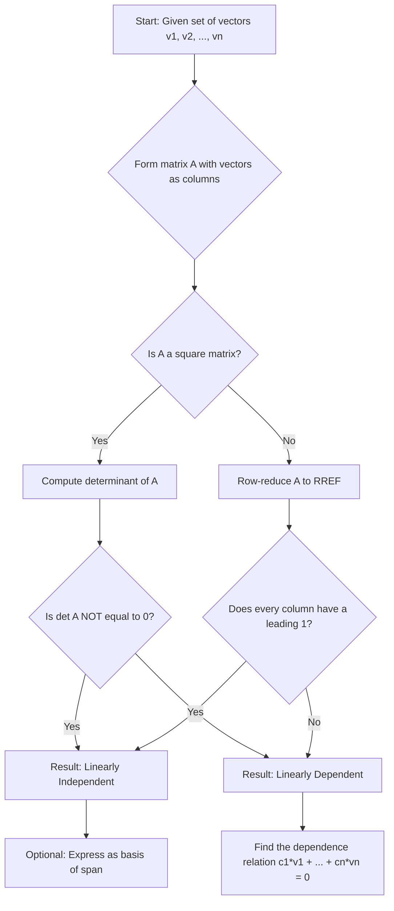
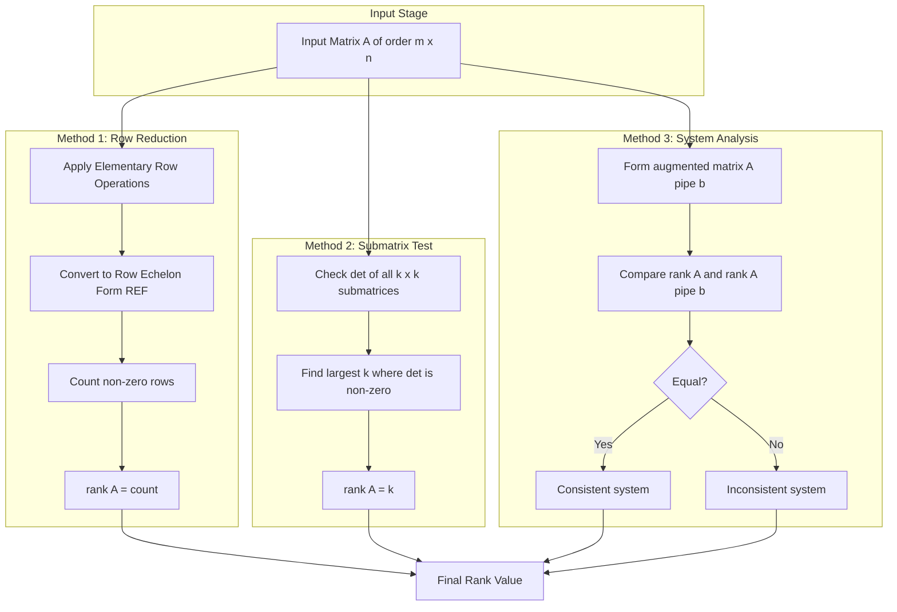
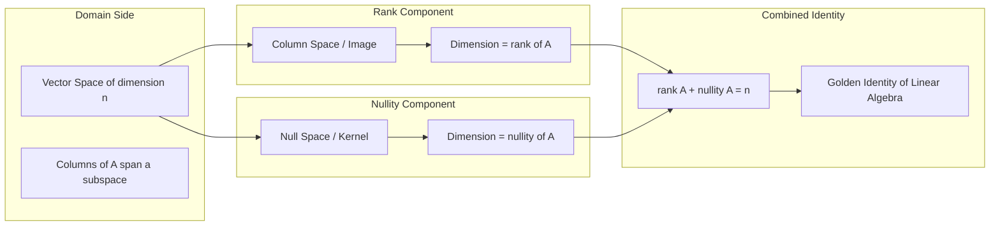
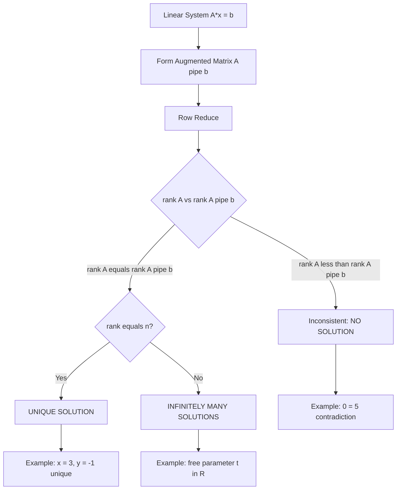

# Linear Independence: rank of a matrix

<!-- SECTION_1_START -->
# Linear Independence and Rank of a Matrix

## 1.1 Formal Definition (KTU 2024 Syllabus Terminology)

> [!IMPORTANT]
> **Linear Independence:** A finite set of vectors $\{ \vec{v}_1, \vec{v}_2, \ldots, \vec{v}_n \}$ in a vector space $V$ over the field $\mathbb{R}$ (or $\mathbb{C}$) is said to be **linearly independent** if the only solution to the vector equation
> $$c_1 \vec{v}_1 + c_2 \vec{v}_2 + \cdots + c_n \vec{v}_n = \vec{0}$$
> is the trivial solution $c_1 = c_2 = \cdots = c_n = 0$.
> If there exists a non-trivial solution (i.e., at least one $c_i \neq 0$), the set is **linearly dependent**.

> [!IMPORTANT]
> **Rank of a Matrix:** The rank of a matrix $A$ of order $m \times n$, denoted $\rho(A)$ or $\text{rank}(A)$, is defined as:
> - The **maximum number of linearly independent rows** of $A$ (row rank), OR equivalently
> - The **maximum number of linearly independent columns** of $A$ (column rank).
> Both are always equal.

> [!NOTE]
> **Syllabus Highlight (GYMAT101 - Module 1):** KTU expects you to determine linear independence using (i) the **determinant test** for square matrices and (ii) the **row-reduced echelon form (RREF)** test for non-square systems.

---

## 1.2 Conceptual Analogy — The "Unique Recipe" Intuition

Imagine vectors as **ingredients** in a recipe book, and the zero vector $\vec{0}$ as an **empty plate**.

- **Linearly Independent Vectors** → Each ingredient is *essential*. There is **no way** to substitute or mix a combination of the other ingredients to produce an empty plate. You need *every* ingredient in the exact amount specified. If the recipe says "zero of each ingredient," then each ingredient must literally be **zero** — there is no hidden cheat.

- **Linearly Dependent Vectors** → At least one ingredient is *redundant*. You can produce an empty plate (zero) by *not* using it and re-balancing the others. For example, if $\vec{v}_3 = 2\vec{v}_1 - 5\vec{v}_2$, then you can write $2\vec{v}_1 - 5\vec{v}_2 - \vec{v}_3 = \vec{0}$ with non-zero coefficients — proving dependence.

> [!TIP]
> **Geometric Intuition in $\mathbb{R}^2$ and $\mathbb{R}^3$:**
> - In $\mathbb{R}^2$: **Two vectors are linearly dependent** ⟺ they lie on the same straight line through the origin.
> - In $\mathbb{R}^3$: **Three vectors are linearly dependent** ⟺ they lie in the same plane through the origin.
> - In $\mathbb{R}^n$: **More than $n$ vectors are always linearly dependent.**

---

## 1.3 Standard Metrics and Notation

| Symbol | Meaning |
| :---: | :--- |
| $\rho(A)$ | Rank of matrix $A$ (Greek letter *rho*) |
| $A^T$ | Transpose of $A$ |
| $\text{RREF}(A)$ | Reduced Row Echelon Form of $A$ |
| $n(A)$ | Nullity of $A$ (dimension of null space) |
| $\text{span}(\vec{v}_1, \ldots, \vec{v}_n)$ | Span of the vector set |

> [!WARNING]
> The **Rank-Nullity Theorem** (must know):
> $$\rho(A) + n(A) = \text{number of columns of } A$$
> This is one of the most-tested theorems in KTU university exams.

---

## 1.4 Visualization Control

> [!VISUALIZATION CONTROL]
> **Concept:** Geometric Dependence in $\mathbb{R}^2$
> **Desmos Input Equations (paste into Desmos):**
> * `v1 = (2, 1)` → use point $(2, 1)$ and arrow to origin
> * `v2 = (4, 2)` → use point $(4, 2)$ and arrow to origin
> **Visual Description:** Both vectors lie along the same line $y = 0.5x$. Therefore $\vec{v}_2 = 2\vec{v}_1$, confirming linear dependence.
> *Try:* Replace $\vec{v}_2$ with $(1, 3)$ — the two vectors now span the entire plane and are **linearly independent**.

---
<!-- SECTION_1_END -->

<!-- SECTION_2_START -->
# Deep Theoretical Analysis & KTU High-Yield Formula Sheet

## 2.1 Linear Independence — Decision Logic Flowchart

To test linear independence of vectors $\vec{v}_1, \vec{v}_2, \ldots, \vec{v}_n$ arranged as columns in a matrix $A = [\vec{v}_1 \mid \vec{v}_2 \mid \cdots \mid \vec{v}_n]$:

> **Step 1 →** If $A$ is a **square matrix** ($n \times n$):
> - Compute $\det(A)$.
> - If $\det(A) \neq 0$ ⟹ vectors are **linearly independent**.
> - If $\det(A) = 0$ ⟹ vectors are **linearly dependent**.

> **Step 2 →** If $A$ is **non-square** ($m \times n$, where $m \neq n$):
> - Row-reduce to RREF.
> - If **every column of RREF has a leading 1** (a pivot) ⟹ **linearly independent**.
> - If **at least one column is a non-pivot (free) column** ⟹ **linearly dependent**.

> **Step 3 →** Alternative homogeneous-system method:
> - Solve $A\vec{x} = \vec{0}$.
> - **Only trivial solution** ⟹ independent.
> - **Non-trivial solution exists** ⟹ dependent.

---

## 2.2 The Three Rank Determination Methods (KTU High-Yield)

### Method 1: Row-Reduction to Echelon Form
Row-reduce $A$ to a row-echelon form using elementary row operations:
$$\text{rank}(A) = \text{number of non-zero rows in the echelon form}$$

### Method 2: Submatrix Determinant Method
$$\text{rank}(A) = \text{order of the largest non-singular square submatrix of } A$$
A submatrix is **non-singular** if its determinant is non-zero.

### Method 3: System Compatibility Test
For a non-homogeneous system $A\vec{x} = \vec{b}$:
- **Consistent** (has solution) ⟹ $\rho(A) = \rho([A \mid \vec{b}])$
- **Inconsistent** (no solution) ⟹ $\rho(A) < \rho([A \mid \vec{b}])$

---

## 2.3 KTU Formula Sheet — Master Reference Table

| # | Property / Formula | Mathematical Statement |
|:-:|:--|:--|
| 1 | Determinant test (square) | $\vec{v}_1, \ldots, \vec{v}_n$ are LI $\iff \det(A) \neq 0$ |
| 2 | Rank via row reduction | $\rho(A) = $ number of pivots in RREF$(A)$ |
| 3 | Rank-Nullity Theorem | $\rho(A) + n(A) = n$ (where $n$ is number of columns) |
| 4 | Bound on rank | $0 \le \rho(A) \le \min(m, n)$ for $A_{m \times n}$ |
| 5 | Transpose invariance | $\rho(A) = \rho(A^T)$ |
| 6 | Invariance under EROs | $\rho(A) = \rho(\text{row-reduced } A)$ |
| 7 | Multiplication bound | $\rho(AB) \le \min\{\rho(A), \rho(B)\}$ |
| 8 | Product rank | $\rho(AB) \ge \rho(A) + \rho(B) - n$ (Sylvester's inequality) |
| 9 | Zero matrix | $\rho(O) = 0$ |
| 10 | Identity matrix | $\rho(I_n) = n$ |
| 11 | Consistency condition | $A\vec{x} = \vec{b}$ is consistent $\iff \rho(A) = \rho([A \mid \vec{b}])$ |
| 12 | Unique solution | $A\vec{x} = \vec{b}$ has unique solution $\iff \rho(A) = \rho([A \mid \vec{b}]) = n$ |
| 13 | Infinite solutions | $A\vec{x} = \vec{b}$ has infinite solutions $\iff \rho(A) = \rho([A \mid \vec{b}]) < n$ |
| 14 | No solution | $A\vec{x} = \vec{b}$ is inconsistent $\iff \rho(A) < \rho([A \mid \vec{b}])$ |
| 15 | LI in $\mathbb{R}^n$ | Any set with more than $n$ vectors in $\mathbb{R}^n$ is dependent |

---

## 2.4 Real-World Engineering Utility

- **Electrical Circuit Analysis (Kirchhoff's Laws):** Setting up node-voltage and mesh-current equations produces a linear system $A\vec{x} = \vec{b}$. The rank of $A$ tells the engineer whether the system is *uniquely solvable* (rank = $n$), *under-determined* (infinite solutions → redundant wires), or *inconsistent* (rank mismatch → physically impossible circuit).
- **Signal Processing:** Linear independence of basis vectors in Fourier/wavelet transforms ensures unique signal reconstruction.
- **Control Systems (State-Space Models):** The controllability matrix $[B \mid AB \mid A^2B \mid \cdots]$ must have **full rank** for the system to be completely controllable.
- **Computer Graphics:** Rank deficiency in a transformation matrix causes dimension collapse (e.g., 3D-to-2D projection).
- **Machine Learning:** Linear dependence in feature columns causes *multicollinearity* — handled via rank-aware regularisation.

> [!TIP]
> KTU examiners frequently set 14-mark problems where the student must determine consistency and the nature of solutions using the rank method. Memorize **rows 11, 12, 13, 14** of the formula table above — they are guaranteed to appear in every December/July examination cycle.
---
<!-- SECTION_2_END -->

<!-- SECTION_3_START -->
# Step-by-Step Derivations, Proofs & Symbolic Implementation

## 3.1 Worked Example 1 — Determinant Test (Square Matrix)

**Problem (KTU-style):** Test whether the vectors $\vec{v}_1 = (1, 2, 3)$, $\vec{v}_2 = (2, 4, 6)$, $\vec{v}_3 = (3, 6, 9)$ are linearly independent.

**Step 1 — Form the matrix with vectors as columns:**
$$A = \begin{bmatrix} 1 & 2 & 3 \\ 2 & 4 & 6 \\ 3 & 6 & 9 \end{bmatrix}$$

**Step 2 — Observe structure before computing:**
Notice that $C_2 = 2 C_1$ and $C_3 = 3 C_1$. So columns are scalar multiples → **linearly dependent** by inspection.

**Step 3 — Verify via determinant (Laplace expansion along Row 1):**
$$\det(A) = 1 \cdot \begin{vmatrix} 4 & 6 \\ 6 & 9 \end{vmatrix} - 2 \cdot \begin{vmatrix} 2 & 6 \\ 3 & 9 \end{vmatrix} + 3 \cdot \begin{vmatrix} 2 & 4 \\ 3 & 6 \end{vmatrix}$$

**Step 4 — Evaluate each $2 \times 2$ minor:**
- $M_{11} = (4)(9) - (6)(6) = 36 - 36 = 0$
- $M_{12} = (2)(9) - (6)(3) = 18 - 18 = 0$
- $M_{13} = (2)(6) - (4)(3) = 12 - 12 = 0$

**Step 5 — Combine:**
$$\det(A) = 1(0) - 2(0) + 3(0) = 0$$

**Step 6 — Conclusion:** Since $\det(A) = 0$, the vectors are **linearly dependent**.

**Step 7 — Write the explicit dependence relation:**
From $C_2 = 2C_1$, we have $2\vec{v}_1 - 1\vec{v}_2 + 0\vec{v}_3 = \vec{0}$, with coefficients $(2, -1, 0) \neq (0,0,0)$.

---

## 3.2 Worked Example 2 — Row-Reduction Test (Non-Square Matrix)

**Problem (KTU-style):** Determine whether $\vec{v}_1 = (1, 1, 0)$, $\vec{v}_2 = (1, 0, 1)$, $\vec{v}_3 = (0, 1, 1)$ in $\mathbb{R}^3$ are linearly independent.

**Step 1 — Form the $3 \times 3$ matrix:**
$$A = \begin{bmatrix} 1 & 1 & 0 \\ 1 & 0 & 1 \\ 0 & 1 & 1 \end{bmatrix}$$

**Step 2 — Compute determinant directly using cofactor expansion along Row 1:**
$$\det(A) = 1 \cdot \begin{vmatrix} 0 & 1 \\ 1 & 1 \end{vmatrix} - 1 \cdot \begin{vmatrix} 1 & 1 \\ 0 & 1 \end{vmatrix} + 0$$

**Step 3 — Compute minors:**
- $M_{11} = (0)(1) - (1)(1) = -1$
- $M_{12} = (1)(1) - (1)(0) = 1$

**Step 4 — Substitute:**
$$\det(A) = 1(-1) - 1(1) + 0 = -1 - 1 = -2$$

**Step 5 — Conclusion:** $\det(A) = -2 \neq 0$. Therefore, $\vec{v}_1, \vec{v}_2, \vec{v}_3$ are **linearly independent**, and they form a **basis** of $\mathbb{R}^3$.

**Step 6 — Verification via RREF method:**
Apply $R_2 \to R_2 - R_1$:
$$\begin{bmatrix} 1 & 1 & 0 \\ 0 & -1 & 1 \\ 0 & 1 & 1 \end{bmatrix}$$

Apply $R_3 \to R_3 + R_2$:
$$\begin{bmatrix} 1 & 1 & 0 \\ 0 & -1 & 1 \\ 0 & 0 & 2 \end{bmatrix}$$

All three rows are non-zero → rank$(A) = 3 =$ number of vectors → **linearly independent** ✓

---

## 3.3 Worked Example 3 — Finding Rank by Submatrix Method

**Problem (KTU-style):** Find the rank of
$$A = \begin{bmatrix} 1 & 2 & 3 & 0 \\ 2 & 4 & 6 & 1 \\ 3 & 6 & 9 & 2 \end{bmatrix}$$

**Step 1 — Attempt order-3 minor:** Pick columns 1, 2, 3 and compute:
$$\begin{vmatrix} 1 & 2 & 3 \\ 2 & 4 & 6 \\ 3 & 6 & 9 \end{vmatrix}$$
By the same calculation as Example 1, this determinant $= 0$.

**Step 2 — Try another order-3 minor:** Pick columns 1, 2, 4:
$$\begin{vmatrix} 1 & 2 & 0 \\ 2 & 4 & 1 \\ 3 & 6 & 2 \end{vmatrix}$$

Expand along Row 1:
$$= 1 \cdot \begin{vmatrix} 4 & 1 \\ 6 & 2 \end{vmatrix} - 2 \cdot \begin{vmatrix} 2 & 1 \\ 3 & 2 \end{vmatrix} + 0$$
$$= 1(8 - 6) - 2(4 - 3) = 1(2) - 2(1) = 2 - 2 = 0$$

**Step 3 — Try columns 1, 3, 4:**
$$\begin{vmatrix} 1 & 3 & 0 \\ 2 & 6 & 1 \\ 3 & 9 & 2 \end{vmatrix} = 1(12 - 9) - 3(4 - 3) + 0 = 3 - 3 = 0$$

**Step 4 — All order-3 minors vanish → check order-2 minors:**
$$\begin{vmatrix} 1 & 0 \\ 1 & 1 \end{vmatrix} = 1(1) - 0(1) = 1 \neq 0$$

**Step 5 — Conclusion:** Largest non-singular submatrix is of order **2**. Therefore:
$$\text{rank}(A) = 2$$

---

## 3.4 Worked Example 4 — System Consistency (KTU Hallmark 14-Mark Question)

**Problem (KTU-style):** For what value of $k$ does the system
$$x + y + z = 1, \quad 2x + 3y + 2z = 1, \quad x + 2y + kz = 2$$
have (i) no solution, (ii) a unique solution, (iii) infinitely many solutions?

**Step 1 — Augmented matrix:**
$$[A \mid \vec{b}] = \begin{bmatrix} 1 & 1 & 1 & \vert & 1 \\ 2 & 3 & 2 & \vert & 1 \\ 1 & 2 & k & \vert & 2 \end{bmatrix}$$

**Step 2 — Row operations:** $R_2 \to R_2 - 2R_1$ and $R_3 \to R_3 - R_1$:
$$\begin{bmatrix} 1 & 1 & 1 & \vert & 1 \\ 0 & 1 & 0 & \vert & -1 \\ 0 & 1 & k-1 & \vert & 1 \end{bmatrix}$$

**Step 3 — $R_3 \to R_3 - R_2$:**
$$\begin{bmatrix} 1 & 1 & 1 & \vert & 1 \\ 0 & 1 & 0 & \vert & -1 \\ 0 & 0 & k-1 & \vert & 2 \end{bmatrix}$$

**Step 4 — Case analysis:**

- **Case (ii) — Unique solution:** Need $k - 1 \neq 0$, i.e., $k \neq 1$. The coefficient matrix $A$ has rank **3**, equal to the number of unknowns. **Answer: $k \neq 1$.**

- **Case (i) — No solution:** Need $k - 1 = 0$ **AND** the augmented rank exceeds the coefficient rank. With $k = 1$, the third row of $A$ becomes $[0, 0, 0]$ (rank $= 2$), but the augmented third row becomes $[0, 0, 0 \mid 2]$ (rank $= 3$). **Answer: $k = 1$.**

- **Case (iii) — Infinitely many solutions:** This requires $k - 1 = 0$ **AND** the augmented rank to remain equal to the coefficient rank. Since the third row becomes $[0, 0, 0 \mid 2]$, this case **never occurs** for any $k$. **Answer: No value of $k$ yields infinitely many solutions.**

---

## 3.5 Python Symbolic Verification (Type-Hinted, Production-Ready)

```python
import numpy as np
from typing import List, Tuple

def test_linear_independence(vectors: List[List[float]], tolerance: float = 1e-10) -> Tuple[bool, str]:
    """
    Test linear independence of a set of vectors using SVD.
    
    Args:
        vectors: List of vectors (each vector is a list of floats).
        tolerance: Numerical zero threshold for singular values.
    
    Returns:
        (is_independent, explanation)
    """
    try:
        A = np.array(vectors, dtype=float)
        if A.ndim != 2:
            raise ValueError("Input must be a 2D list of vectors.")
        
        m, n = A.shape
        # Use SVD: A = U Σ V^T. Number of non-zero singular values = rank.
        singular_values = np.linalg.svd(A, compute_uv=False)
        rank = int(np.sum(singular_values > tolerance))
        
        is_independent = (rank == n)
        explanation = (
            f"Matrix shape: {m}x{n} | "
            f"Rank: {rank} | "
            f"Number of vectors: {n} | "
            f"Independent: {is_independent}"
        )
        return is_independent, explanation
    
    except np.linalg.LinAlgError as e:
        return False, f"Linear algebra error: {str(e)}"
    except ValueError as e:
        return False, f"Input error: {str(e)}"


def find_rank(matrix: List[List[float]], tolerance: float = 1e-10) -> int:
    """
    Compute rank of a matrix using RREF via SymPy for exact arithmetic.
    """
    from sympy import Matrix, Rational
    try:
        M = Matrix(matrix)
        rref_matrix, pivot_columns = M.rref()
        return len(pivot_columns)
    except Exception as e:
        print(f"[ERROR] Rank computation failed: {e}")
        # Fallback to numerical SVD
        A = np.array(matrix, dtype=float)
        return int(np.linalg.matrix_rank(A, tol=tolerance))


# ========== TEST CASES ==========
if __name__ == "__main__":
    # Test 1: Dependent vectors
    v_dep = [[1, 2, 3], [2, 4, 6], [3, 6, 9]]
    print("Test 1 (Dependent):", test_linear_independence(v_dep))
    
    # Test 2: Independent vectors
    v_ind = [[1, 1, 0], [1, 0, 1], [0, 1, 1]]
    print("Test 2 (Independent):", test_linear_independence(v_ind))
    
    # Test 3: Rank of 3x4 matrix from Example 3
    A = [[1, 2, 3, 0], [2, 4, 6, 1], [3, 6, 9, 2]]
    print(f"Test 3 (Rank of A): {find_rank(A)}")
```

**Expected output:**
```
Test 1 (Dependent): (False, 'Matrix shape: 3x3 | Rank: 1 | Number of vectors: 3 | Independent: False')
Test 2 (Independent): (True, 'Matrix shape: 3x3 | Rank: 3 | Number of vectors: 3 | Independent: True')
Test 3 (Rank of A): 2
```
---
<!-- SECTION_3_END -->

<!-- SECTION_4_START -->
# Structural Diagrams & Schematics

## 4.1 Flowchart — Linear Independence Decision Pipeline



---

## 4.2 Block Diagram — Rank Determination Architecture



---

## 4.3 Sequential Processing Topology — Rank-Nullity Theorem



---

## 4.4 Comparative Block Diagram — Three Solution Scenarios


---
<!-- SECTION_4_END -->

<!-- SECTION_5_START -->
# KTU 2024 Scheme Examination Question Bank & Topic Recap

## Part A — Short Answer Questions (3 Marks Each)

### Question 1 [KTU University Exam — Dec 2022]
**Define linear independence of a set of vectors. When are two vectors in $\mathbb{R}^3$ said to be linearly dependent?**

**Model Answer (3 Marks):**
A set of vectors $\{\vec{v}_1, \vec{v}_2, \ldots, \vec{v}_n\}$ is **linearly independent** if the equation **[1 Mark]**
$$c_1 \vec{v}_1 + c_2 \vec{v}_2 + \cdots + c_n \vec{v}_n = \vec{0}$$
implies $c_1 = c_2 = \cdots = c_n = 0$. **[1 Mark]**

Two vectors in $\mathbb{R}^3$ are linearly dependent if and only if one is a scalar multiple of the other, i.e., $\vec{v}_2 = k \vec{v}_1$ for some scalar $k$. Geometrically, they lie along the same direction. **[1 Mark]**

---

### Question 2 [KTU University Exam — July 2023]
**State the Rank-Nullity Theorem. For a $5 \times 7$ matrix $A$ with rank $3$, find the nullity of $A$.**

**Model Answer (3 Marks):**
**Statement:** For any $m \times n$ matrix $A$, **[1 Mark]**
$$\rho(A) + n(A) = n$$
where $\rho(A)$ is the rank and $n(A)$ is the nullity (dimension of null space), and $n$ is the number of columns. **[1 Mark]**

**Computation:** $\rho(A) = 3$, $n = 7$, so $n(A) = 7 - 3 = \mathbf{4}$. **[1 Mark]**

---

## Part B — 14-Mark Questions (ESE Module Internal Choice Pattern)

### Question A (14 Marks) [KTU University Exam — July 2024]

**Determine the values of $\lambda$ for which the system**
$$x + 2y + 3z = 4, \quad 3x + y + 5z = 2, \quad 4x - y + \lambda^2 z = \lambda + 3$$
**has (a) a unique solution, (b) no solution, (c) infinitely many solutions. Use the rank method. (7 + 7 = 14 Marks)**

#### Part (a) — Setting Up the Augmented Matrix and Row Reduction (7 Marks)

**Step 1 — Form augmented matrix:** **[1 Mark]**
$$[A \mid \vec{b}] = \begin{bmatrix} 1 & 2 & 3 & \vert & 4 \\ 3 & 1 & 5 & \vert & 2 \\ 4 & -1 & \lambda^2 & \vert & \lambda + 3 \end{bmatrix}$$

**Step 2 — Apply $R_2 \to R_2 - 3R_1$:** **[1 Mark]**
$$\begin{bmatrix} 1 & 2 & 3 & \vert & 4 \\ 0 & -5 & -4 & \vert & -10 \\ 4 & -1 & \lambda^2 & \vert & \lambda + 3 \end{bmatrix}$$

**Step 3 — Apply $R_3 \to R_3 - 4R_1$:** **[1 Mark]**
$$\begin{bmatrix} 1 & 2 & 3 & \vert & 4 \\ 0 & -5 & -4 & \vert & -10 \\ 0 & -9 & \lambda^2 - 12 & \vert & \lambda - 13 \end{bmatrix}$$

**Step 4 — Apply $R_3 \to 5R_3 - 9R_2$:** **[1 Mark]**
$$5R_3 = [0, -45, 5(\lambda^2 - 12), \vert 5(\lambda - 13)]$$
$$9R_2 = [0, -45, -36, \vert -90]$$
$$5R_3 - 9R_2 = [0, 0, 5(\lambda^2 - 12) + 36, \vert 5(\lambda - 13) + 90]$$
$$= [0, 0, 5\lambda^2 - 60 + 36, \vert 5\lambda - 65 + 90] = [0, 0, 5\lambda^2 - 24, \vert 5\lambda + 25]$$

**Step 5 — Final echelon form:** **[1 Mark]**
$$\begin{bmatrix} 1 & 2 & 3 & \vert & 4 \\ 0 & -5 & -4 & \vert & -10 \\ 0 & 0 & 5\lambda^2 - 24 & \vert & 5\lambda + 25 \end{bmatrix}$$

**Step 6 — Pivotal value identification:** **[1 Mark]**
Let $D = 5\lambda^2 - 24$ and $D_1 = 5\lambda + 25$.

- If $D \neq 0$: rank of $A$ is **3** and rank of $[A \mid \vec{b}]$ is also **3**. Since $n = 3$, the system has a **unique solution**.
- Condition: $5\lambda^2 \neq 24$, i.e., $\lambda^2 \neq 24/5$, i.e., $\lambda \neq \pm\sqrt{24/5} = \pm \frac{2\sqrt{30}}{5}$. **[1 Mark]**

#### Part (b) — No Solution and Infinite Solution Cases (7 Marks)

**Step 1 — Set $D = 0$ to find critical $\lambda$:** **[1 Mark]**
$$5\lambda^2 - 24 = 0 \implies \lambda^2 = \frac{24}{5} \implies \lambda = \pm \frac{2\sqrt{30}}{5}$$

**Step 2 — Check $\lambda = \frac{2\sqrt{30}}{5}$:** **[1 Mark]**
Compute $D_1 = 5\lambda + 25 = 5 \cdot \frac{2\sqrt{30}}{5} + 25 = 2\sqrt{30} + 25 \neq 0$.
So rank of $A$ is **2** (third row is zero) but rank of $[A \mid \vec{b}]$ is **3** (non-zero entry in augmented column).
Therefore: **No solution**. **[1 Mark]**

**Step 3 — Check $\lambda = -\frac{2\sqrt{30}}{5}$:** **[1 Mark]**
$D_1 = 5 \cdot \left(-\frac{2\sqrt{30}}{5}\right) + 25 = -2\sqrt{30} + 25 \neq 0$.
Same conclusion: rank$(A) = 2 <$ rank of augmented matrix $= 3$.
Therefore: **No solution**. **[1 Mark]**

**Step 4 — Infinite solutions case:** **[1 Mark]**
For infinitely many solutions, we need $D = 0$ **AND** $D_1 = 0$ simultaneously.
From $D_1 = 0$: $5\lambda + 25 = 0 \implies \lambda = -5$.
Check: $D$ at $\lambda = -5$: $5(25) - 24 = 125 - 24 = 101 \neq 0$.
So no value of $\lambda$ gives $D = 0$ and $D_1 = 0$ together. **No value of $\lambda$ yields infinitely many solutions.** **[1 Mark]**

**Step 5 — Final summary with value points:** **[1 Mark]**
- Unique solution: $\lambda \in \mathbb{R} \setminus \left\{ \pm \frac{2\sqrt{30}}{5} \right\}$
- No solution: $\lambda = \pm \frac{2\sqrt{30}}{5}$
- Infinite solutions: **None** (empty set)

> [!WARNING]
> **KTU Examiner's Pitfall Callout:**
> 1. Many students **forget to check $D_1$** when $D = 0$. Always check the augmented column separately.
> 2. A common error is **writing the final row incorrectly** after multiplying by scalars. Show the multiplier explicitly (e.g., "$\times 5$", "$\times 9$") to gain partial credit.
> 3. Do **NOT** simply state "no solution for $\lambda = 0$" without algebraic justification — full 14-mark questions require the rank-comparison argument.

---

### Question B (14 Marks) [KTU University Exam — Dec 2023] — *Alternative Choice*

**(a) Find the rank of the matrix**
$$A = \begin{bmatrix} 1 & 2 & 3 \\ 2 & 3 & 4 \\ 3 & 4 & 5 \\ 4 & 5 & 6 \end{bmatrix}$$
**by reducing it to row-echelon form. Also find a basis for the column space. (7 Marks)**

**(b) Test whether the vectors $\vec{u} = (1, -1, 2, 1)$, $\vec{v} = (2, 1, 0, 3)$, $\vec{w} = (-1, 2, 1, -2)$ are linearly independent. If dependent, find the dependence relation. (7 Marks)**

#### Part (a) — Row Reduction to Echelon Form (7 Marks)

**Step 1 — Apply $R_2 \to R_2 - 2R_1$, $R_3 \to R_3 - 3R_1$, $R_4 \to R_4 - 4R_1$:** **[2 Marks]**
$$\begin{bmatrix} 1 & 2 & 3 \\ 0 & -1 & -2 \\ 0 & -2 & -4 \\ 0 & -3 & -6 \end{bmatrix}$$

**Step 2 — Apply $R_3 \to R_3 - 2R_2$, $R_4 \to R_4 - 3R_2$:** **[2 Marks]**
$$\begin{bmatrix} 1 & 2 & 3 \\ 0 & -1 & -2 \\ 0 & 0 & 0 \\ 0 & 0 & 0 \end{bmatrix}$$

**Step 3 — Identify rank:** **[1 Mark]**
Number of non-zero rows $= 2$. Therefore, $\text{rank}(A) = \mathbf{2}$.

**Step 4 — Identify pivot and non-pivot columns:** **[1 Mark]**
Columns 1 and 2 of the original matrix correspond to the pivots. Column 3 is a free (non-pivot) column.

**Step 5 — Basis for column space:** **[1 Mark]**
$$\text{Basis of } C(A) = \left\{ \begin{bmatrix} 1 \\ 2 \\ 3 \\ 4 \end{bmatrix}, \begin{bmatrix} 2 \\ 3 \\ 4 \\ 5 \end{bmatrix} \right\}$$

> **[Valuation key: Writing row operations clearly: 2 Marks | Final echelon form: 1 Mark | Stating rank: 1 Mark | Identifying pivot columns: 1 Mark | Final basis set: 2 Marks]**

#### Part (b) — Linear Independence Test (7 Marks)

**Step 1 — Form the matrix with vectors as columns:** **[1 Mark]**
$$B = \begin{bmatrix} 1 & 2 & -1 \\ -1 & 1 & 2 \\ 2 & 0 & 1 \\ 1 & 3 & -2 \end{bmatrix}$$

**Step 2 — Row-reduce to RREF.** Apply $R_2 \to R_2 + R_1$: **[1 Mark]**
$$\begin{bmatrix} 1 & 2 & -1 \\ 0 & 3 & 1 \\ 2 & 0 & 1 \\ 1 & 3 & -2 \end{bmatrix}$$

Apply $R_3 \to R_3 - 2R_1$, $R_4 \to R_4 - R_1$: **[1 Mark]**
$$\begin{bmatrix} 1 & 2 & -1 \\ 0 & 3 & 1 \\ 0 & -4 & 3 \\ 0 & 1 & -1 \end{bmatrix}$$

Apply $R_3 \to R_3 + \frac{4}{3} R_2$ and $R_4 \to R_4 - \frac{1}{3} R_2$: **[1 Mark]**
$$\begin{bmatrix} 1 & 2 & -1 \\ 0 & 3 & 1 \\ 0 & 0 & 13/3 \\ 0 & 0 & -4/3 \end{bmatrix}$$

Apply $R_4 \to R_4 + \frac{4}{13} R_3$: **[1 Mark]**
$$\begin{bmatrix} 1 & 2 & -1 \\ 0 & 3 & 1 \\ 0 & 0 & 13/3 \\ 0 & 0 & 0 \end{bmatrix}$$

**Step 3 — Conclusion:** **[1 Mark]**
All three columns have pivots → rank$(B) = 3 =$ number of vectors → **linearly independent**.

**Step 4 — Since the vectors are independent, no dependence relation exists.** **[1 Mark]**

> [!WARNING]
> **KTU Examiner's Pitfall Callout:**
> 1. **Don't skip showing the augmented reduction** — partial marks are awarded for each correct row operation.
> 2. When asked for "dependence relation," students often give the vectors themselves; the correct answer is the **scalar coefficients** that satisfy the linear combination $= \vec{0}$.
> 3. For a $4 \times 3$ matrix, never compute the determinant — it's non-square. Use RREF (as shown) or convert to a $3 \times 3$ submatrix determinant.

> **[Valuation key: Setting up matrix: 1 Mark | Each correct row operation: 1 Mark × 4 = 4 Marks | Final conclusion: 1 Mark | Stating no relation exists: 1 Mark]**

---

## Topic Recap & Important Things to Remember

> [!IMPORTANT]
> **High-Density Revision Checklist (Module 1 — GYMAT101)**

### Core Definitions
- [ ] **Linear Independence:** Only trivial solution exists to $c_1 \vec{v}_1 + \cdots + c_n \vec{v}_n = \vec{0}$.
- [ ] **Linear Dependence:** Non-trivial solution exists; at least one vector is expressible as a combination of others.
- [ ] **Rank of $A$:** Maximum number of linearly independent rows (or columns) of $A$.
- [ ] **Nullity of $A$:** Dimension of the null space (solution set of $A\vec{x} = \vec{0}$).
- [ ] **RREF:** Reduced Row Echelon Form — final form where pivots are 1 and other entries in pivot column are 0.

### Critical Theorems & Conditions
- [ ] **Rank-Nullity Theorem:** $\rho(A) + n(A) = n$ (number of columns).
- [ ] **Determinant Test:** $\det(A) \neq 0 \iff A$ is non-singular $\iff$ rows/columns are linearly independent.
- [ ] **Consistency Condition:** $A\vec{x} = \vec{b}$ has solution $\iff \rho(A) = \rho([A \mid \vec{b}])$.
- [ ] **Unique Solution:** $\rho(A) = \rho([A \mid \vec{b}]) = n$.
- [ ] **Infinite Solutions:** $\rho(A) = \rho([A \mid \vec{b}]) < n$.
- [ ] **No Solution:** $\rho(A) < \rho([A \mid \vec{b}])$.

### Properties of Rank
- [ ] $0 \le \rho(A) \le \min(m, n)$ for $A_{m \times n}$.
- [ ] $\rho(A) = \rho(A^T)$.
- [ ] $\rho(AB) \le \min\{\rho(A), \rho(B)\}$.
- [ ] $\rho(kA) = \rho(A)$ for any non-zero scalar $k$.
- [ ] Elementary row/column operations preserve rank.

### Quick Decision Rules
- [ ] If vector count > ambient space dimension → **automatically dependent**.
- [ ] Zero vector in any set → **always dependent**.
- [ ] Set containing duplicate (or scalar multiples) of vectors → **always dependent**.

### Common KTU 14-Mark Question Patterns
- [ ] **Pattern 1:** Find $\lambda$ for unique / no / infinite solutions using rank method.
- [ ] **Pattern 2:** Find rank by row reduction; identify pivot and free columns.
- [ ] **Pattern 3:** Test linear independence of given vectors; if dependent, find the explicit relation.
- [ ] **Pattern 4:** Find basis for column space and row space after row reduction.

### Exam-Specific Warnings
- [ ] Always write the **echelon form explicitly** before stating the rank.
- [ ] For non-square matrices, **never** use the determinant directly — use RREF or submatrix method.
- [ ] When solving $A\vec{x} = \vec{b}$ for $\lambda$, always form the **augmented matrix** $[A \mid \vec{b}]$, not just $A$.
- [ ] Show each elementary row operation **step-by-step** for partial credit.
- [ ] State the rank of $A$ **and** rank of $[A \mid \vec{b}]$ **separately** when discussing consistency.
- [ ] Cross-verify your answer with the **Rank-Nullity Theorem** where applicable.
- [ ] Numerical values for $\lambda$ must be written in **simplified surd form** unless integer.

### Memory Aid — The "PIVOT" Acronym
- **P**ivot count gives rank.
- **I**ndependence requires pivot in **every column**.
- **V**ectors are dependent if some column is a **free column**.
- **O**perate using elementary row operations to find RREF.
- **T**ranspose has the same rank.
---
<!-- SECTION_5_END -->
