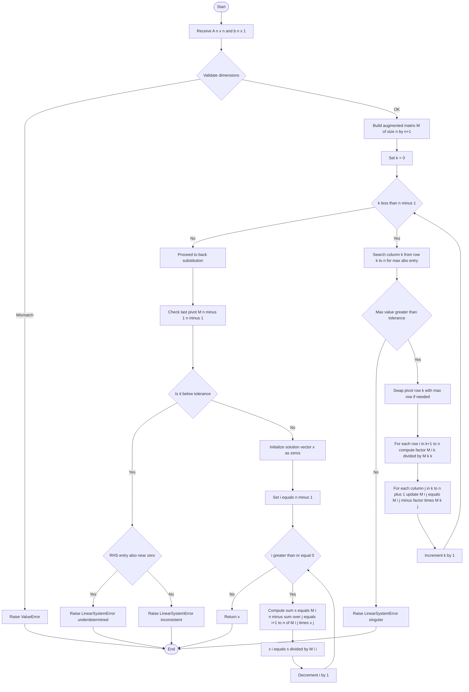
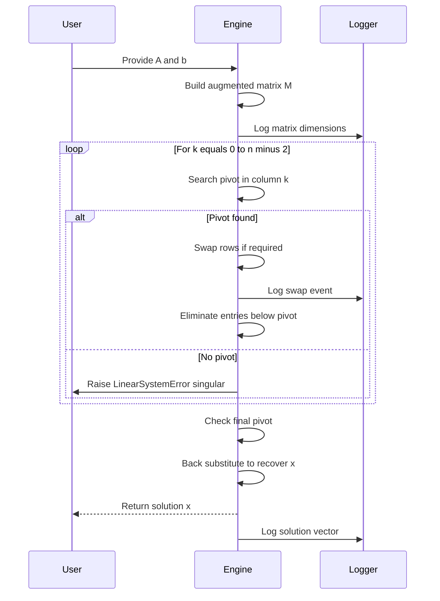

# Linear systems of equations: Gauss elimination

<!-- SECTION_1_START -->

# Linear Systems of Equations — Gauss Elimination

## 1.1 Formal Definition (KTU 2024 Syllabus Terminology)

A **Linear System of $m$ Equations in $n$ Unknowns** is a collection of $m$ linear relations in the variables $x_1, x_2, \dots, x_n$ of the form:

$$a_{11}x_1 + a_{12}x_2 + \cdots + a_{1n}x_n = b_1$$
$$a_{21}x_1 + a_{22}x_2 + \cdots + a_{2n}x_n = b_2$$
$$\vdots$$
$$a_{m1}x_1 + a_{m2}x_2 + \cdots + a_{mn}x_n = b_m$$

This is compactly written in matrix form as:

$$A\mathbf{x} = \mathbf{b}$$

where

$$A = \begin{bmatrix} a_{11} & a_{12} & \cdots & a_{1n} \\ a_{21} & a_{22} & \cdots & a_{2n} \\ \vdots & \vdots & \ddots & \vdots \\ a_{m1} & a_{m2} & \cdots & a_{mn} \end{bmatrix}_{m \times n}, \quad \mathbf{x} = \begin{bmatrix} x_1 \\ x_2 \\ \vdots \\ x_n \end{bmatrix}, \quad \mathbf{b} = \begin{bmatrix} b_1 \\ b_2 \\ \vdots \\ b_m \end{bmatrix}$$

The **Augmented Matrix** $[A \mid \mathbf{b}]$ is the coefficient matrix $A$ with the right-hand side vector $\mathbf{b}$ appended as the $(n+1)^{\text{th}}$ column.

> [!IMPORTANT]
> **Gauss Elimination (Karl Friedrich Gauss, 1809)** is a systematic, finite, algebraic procedure that transforms a linear system $A\mathbf{x} = \mathbf{b}$ into an equivalent **Upper Triangular Form (Row Echelon Form)** through a sequence of **Elementary Row Operations (EROs)**, after which the unknowns are recovered by **Back Substitution**.

The three legal **Elementary Row Operations (EROs)** permitted are:

1. $R_i \leftrightarrow R_j$ — Interchanging two rows.
2. $R_i \to k R_i$ — Multiplying a row by a non-zero scalar $k \neq 0$.
3. $R_i \to R_i + k R_j$ — Replacing a row by itself plus a scalar multiple of another row.

## 1.2 Intuitive Analogy — The Elevator Staircase

Imagine you are trying to find the weights of three unknown boxes on a scale. If you weigh the boxes **all together** first, the reading is confusing — all three weights are mixed up. But if you **weigh them one at a time from the heaviest down** (Box 1 alone, then Box 1 + Box 2, then all three), each new weighing *cancels out* the already-known boxes, leaving you with the weight of the next unknown cleanly isolated.

**Gauss Elimination does exactly this:** it sequentially eliminates variables from lower equations, so that the last equation contains only **one unknown**, the second-to-last contains only **two unknowns**, and so on — like climbing a staircase where each step is simpler than the one before. Once you reach the top, you walk back down (back-substitution) and recover every variable.

## 1.3 Existence, Uniqueness, and the Role of Rank

> [!NOTE]
> **Fundamental Theorem of Linear Systems**
> 
> Let $A$ be an $m \times n$ matrix and $\mathbf{b} \in \mathbb{R}^m$. The system $A\mathbf{x} = \mathbf{b}$ has a solution if and only if:
> 
> $$\text{rank}(A) = \text{rank}([A \mid \mathbf{b}])$$
> 
> When solutions exist, there are two sub-cases:
> - If $\text{rank}(A) = n$ (number of unknowns): **Unique solution**.
> - If $\text{rank}(A) < n$: **Infinitely many solutions** (with $n - \text{rank}(A)$ free parameters).

## 1.4 Visualization

> [!VISUALIZATION CONTROL]
> **Concept:** Geometric interpretation of a $3 \times 3$ linear system as three planes in $\mathbb{R}^3$.
> **GeoGebra / Desmos Input Equations:**
> * `Plane 1: 2x + y - z = 8`
> * `Plane 2: -3x - y + 2z = -11`
> * `Plane 3: -2x + y + 2z = -3`
> **Visual Description:** Three planes intersect at exactly one point. The coordinates of this common intersection are the unique solution of the system. As Gauss elimination runs, we are algebraically rotating these planes to isolate each coordinate axis.

---

<!-- SECTION_1_END -->

<!-- SECTION_2_START -->

# Deep Theoretical Analysis & KTU High-Yield Formula Sheet

## 2.1 The Gauss Elimination Algorithm — Step-by-Step Logic

The procedure is executed on the augmented matrix $[A \mid \mathbf{b}]$ of size $m \times (n+1)$.

### Phase 1: Forward Elimination (Reduction to Upper Triangular Form)

The goal is to introduce **zeros below the main diagonal** column by column.

**Step 1 (Pivot in column 1):** Select the entry $a_{11}$ as the **first pivot**. If $a_{11} = 0$, perform a row swap to bring a non-zero element to the pivot position (this is called **partial pivoting**).

For each row $i = 2, 3, \dots, m$, compute the **multiplier**:

$$m_{i1} = \frac{a_{i1}}{a_{11}}$$

Then apply the ERO:

$$R_i \leftarrow R_i - m_{i1} R_1$$

This makes $a_{i1} = 0$ for all $i \geq 2$.

**Step $k$ (Pivot in column $k$):** The pivot element is $a_{kk}^{(k-1)}$ (the entry in row $k$, column $k$ *after* the previous $(k-1)$ elimination steps). For each row $i = k+1, \dots, m$:

$$m_{ik} = \frac{a_{ik}^{(k-1)}}{a_{kk}^{(k-1)}}$$

$$R_i \leftarrow R_i - m_{ik} R_k$$

Continue until row $m$ is reached, yielding an upper triangular system.

### Phase 2: Back Substitution

After Phase 1, the system has the triangular form:

$$U\mathbf{x} = \mathbf{c}$$

where $U$ is upper triangular. Starting from the last equation:

$$x_n = \frac{c_m}{u_{mn}}$$

$$x_{n-1} = \frac{c_{m-1} - u_{m-1,n} x_n}{u_{m-1,n-1}}$$

In general, for $k = n, n-1, \dots, 1$:

$$x_k = \frac{1}{u_{kk}} \left( c_k - \sum_{j=k+1}^{n} u_{kj} x_j \right)$$

## 2.2 Pivoting Strategies

> [!IMPORTANT]
> A pivot element of **zero** halts the algorithm. Even a very **small pivot** is dangerous because the multipliers $m_{ik}$ become very large, amplifying rounding errors in floating-point arithmetic. This is termed an **ill-conditioned system**.

| Strategy | Selection Rule | Robustness |
|----------|---------------|------------|
| **No Pivoting** | Use $a_{kk}$ as-is | Poor, unstable |
| **Partial Pivoting** | Swap to bring the largest $\vert a_{ik} \vert$ in column $k$ (rows $k$ to $m$) to the pivot | Good (standard choice) |
| **Complete (Full) Pivoting** | Swap rows *and* columns to bring the largest $\vert a_{ij} \vert$ in the remaining submatrix to the pivot | Best stability, but expensive |

## 2.3 KTU Formula Sheet / Cheat Sheet

| Concept | Formula / Condition | Purpose / Notes |
|---------|---------------------|-----------------|
| Augmented matrix | $[A \mid \mathbf{b}]$ of size $m \times (n+1)$ | Single object for all row ops |
| Multiplier | $m_{ik} = a_{ik}/a_{kk}$ | Used to zero out $a_{ik}$ |
| Row update | $R_i \leftarrow R_i - m_{ik} R_k$ | Preserves solution set |
| Consistency | $\text{rank}(A) = \text{rank}([A \mid \mathbf{b}])$ | Necessary and sufficient for solvability |
| Unique solution | $\text{rank}(A) = n$ (square, full rank) | Determinant $\det(A) \neq 0$ |
| Infinitely many | $\text{rank}(A) < n$ | $n - \text{rank}(A)$ free variables |
| No solution | $\text{rank}(A) < \text{rank}([A \mid \mathbf{b}])$ | Row of form $[0\;0\;\cdots\;0 \mid c]$ with $c \neq 0$ |
| Back-substitution | $x_k = (c_k - \sum_{j=k+1}^{n} u_{kj} x_j)/u_{kk}$ | Computed for $k = n, n-1, \dots, 1$ |
| Determinant (upper tri.) | $\det(A) = \prod_{i=1}^{n} a_{ii}$ | Product of pivots (ignoring row swaps) |
| Cramer's Rule (small $n$) | $x_j = \det(A_j)/\det(A)$ | $A_j$ = $A$ with column $j$ replaced by $\mathbf{b}$ |
| Operation count | $\approx \frac{2n^3}{3}$ flops for $n \times n$ | Dominated by elimination, not substitution |
| LU Factorization | $A = LU$ (no pivoting) or $PA = LU$ (with pivoting) | Gauss elimination = computing $L$ and $U$ |
| $L$ matrix entries | $l_{ik} = m_{ik}$ for $i > k$, $l_{ii} = 1$ | Stores the multipliers |

## 2.4 Engineering and Real-World Utility

- **Electrical Network Analysis (Kirchhoff's Laws):** Power grid simulation, nodal analysis in circuit simulators (SPICE) — directly solve $G\mathbf{v} = \mathbf{i}$ where $G$ is the conductance matrix.
- **Structural Engineering:** Truss and frame analysis produce systems with thousands of equations; Gauss elimination with sparse-matrix techniques is the workhorse.
- **Computer Graphics & Robotics:** Inverse kinematics, transformations in CG pipelines.
- **Control Systems:** State-space analysis $\dot{\mathbf{x}} = A\mathbf{x} + B\mathbf{u}$ and stability computations.
- **Machine Learning:** Linear regression solved via the **Normal Equations** $X^T X \boldsymbol{\beta} = X^T \mathbf{y}$ uses Gauss elimination (or its more stable cousin, Cholesky factorization).
- **Computational Fluid Dynamics (CFD):** Pressure-Poisson equations on mesh nodes.

> [!NOTE]
> In production numerical libraries (LAPACK, NumPy `linalg.solve`, MATLAB's backslash operator), Gauss elimination is internally implemented with **partial pivoting** and is the default dense solver for moderate matrix sizes.

---

<!-- SECTION_2_END -->

<!-- SECTION_3_START -->

# Step-by-Step Derivations, Worked Examples, and Code Implementation

## 3.1 Worked Example 1: A $3 \times 3$ System with a Unique Solution

Solve the system:

$$2x + y - z = 8$$
$$-3x - y + 2z = -11$$
$$-2x + y + 2z = -3$$

### Phase 1: Form the Augmented Matrix

$$[A \mid \mathbf{b}] = \begin{bmatrix} 2 & 1 & -1 & \vert & 8 \\ -3 & -1 & 2 & \vert & -11 \\ -2 & 1 & 2 & \vert & -3 \end{bmatrix}$$

### Step 1: Eliminate below pivot $a_{11} = 2$

Multipliers:

$$m_{21} = \frac{-3}{2} = -1.5, \qquad m_{31} = \frac{-2}{2} = -1$$

Apply row operations:

$$R_2 \leftarrow R_2 - (-1.5) R_1 = R_2 + 1.5 R_1$$

$$R_2: [-3 + 1.5(2),\; -1 + 1.5(1),\; 2 + 1.5(-1),\; -11 + 1.5(8)] = [0,\; 0.5,\; 0.5,\; 1]$$

$$R_3 \leftarrow R_3 - (-1) R_1 = R_3 + R_1$$

$$R_3: [-2 + 2,\; 1 + 1,\; 2 + (-1),\; -3 + 8] = [0,\; 2,\; 1,\; 5]$$

Updated augmented matrix:

$$\begin{bmatrix} 2 & 1 & -1 & \vert & 8 \\ 0 & 0.5 & 0.5 & \vert & 1 \\ 0 & 2 & 1 & \vert & 5 \end{bmatrix}$$

### Step 2: Eliminate below pivot $a_{22} = 0.5$

Multiplier:

$$m_{32} = \frac{2}{0.5} = 4$$

$$R_3 \leftarrow R_3 - 4 R_2$$

$$R_3: [0 - 0,\; 2 - 4(0.5),\; 1 - 4(0.5),\; 5 - 4(1)] = [0,\; 0,\; -1,\; 1]$$

Upper triangular form:

$$\begin{bmatrix} 2 & 1 & -1 & \vert & 8 \\ 0 & 0.5 & 0.5 & \vert & 1 \\ 0 & 0 & -1 & \vert & 1 \end{bmatrix}$$

### Phase 2: Back Substitution

From row 3: $-z = 1 \;\Rightarrow\; z = -1$.

From row 2: $0.5 y + 0.5 z = 1 \;\Rightarrow\; 0.5 y + 0.5(-1) = 1 \;\Rightarrow\; 0.5 y = 1.5 \;\Rightarrow\; y = 3$.

From row 1: $2x + y - z = 8 \;\Rightarrow\; 2x + 3 - (-1) = 8 \;\Rightarrow\; 2x = 4 \;\Rightarrow\; x = 2$.

$$\boxed{(x, y, z) = (2,\; 3,\; -1)}$$

**Verification:** $2(2) + 3 - (-1) = 4 + 3 + 1 = 8$ ✓; $-3(2) - 3 + 2(-1) = -6 - 3 - 2 = -11$ ✓; $-2(2) + 3 + 2(-1) = -4 + 3 - 2 = -3$ ✓.

## 3.2 Worked Example 2: Detecting Inconsistency

Solve:

$$x + 2y + z = 3$$
$$2x + 4y + 2z = 6$$
$$x + 3y + 2z = 5$$

Augmented matrix:

$$\begin{bmatrix} 1 & 2 & 1 & \vert & 3 \\ 2 & 4 & 2 & \vert & 6 \\ 1 & 3 & 2 & \vert & 5 \end{bmatrix}$$

$R_2 \leftarrow R_2 - 2R_1$ gives $[0, 0, 0, 0]$; $R_3 \leftarrow R_3 - R_1$ gives $[0, 1, 1, 2]$.

$$\begin{bmatrix} 1 & 2 & 1 & \vert & 3 \\ 0 & 0 & 0 & \vert & 0 \\ 0 & 1 & 1 & \vert & 2 \end{bmatrix}$$

$\text{rank}(A) = 2$ and $\text{rank}([A \mid \mathbf{b}]) = 2$, so the system **is consistent** with $\infty^{3-2} = \infty^1$ solutions (one free parameter). Parameterize: let $z = t$. Then $y = 2 - t$ and $x = 3 - 2y - z = 3 - 2(2-t) - t = -1 + t$.

$$\boxed{(x, y, z) = (-1 + t,\; 2 - t,\; t),\; t \in \mathbb{R}}$$

## 3.3 Worked Example 3: No Solution

Solve:

$$x + y + z = 1$$
$$2x + 2y + 2z = 5$$
$$x + 2y - z = 2$$

$R_2 \leftarrow R_2 - 2R_1$ gives $[0, 0, 0, 3]$ — a row of the form $[0\;0\;0 \mid 3]$ with $3 \neq 0$. This is the hallmark of an **inconsistent** system.

$$\boxed{\text{No solution exists.}}$$

## 3.4 Full Python Implementation with Pivoting and Type Hints

```python
"""
gauss_elimination.py
A production-grade implementation of Gauss Elimination with partial pivoting
suitable for KTU GYMAT101 Module 1 demonstration and laboratory use.

Author : KTU GYMAT101 Reference Implementation
Course : Mathematics for Electrical and Physical Science - 1
Module : 1 - Linear Systems of Equations
"""

from __future__ import annotations
import logging
import sys
from typing import List, Optional, Sequence, Tuple

import numpy as np

# Configure module-level logger for transparent diagnostics.
logging.basicConfig(
    level=logging.INFO,
    format="%(asctime)s [%(levelname)s] %(message)s",
    stream=sys.stdout,
)
logger = logging.getLogger("gauss_elimination")


class LinearSystemError(Exception):
    """Raised when the system is singular or inconsistent."""


def gauss_elimination(
    A: Sequence[Sequence[float]],
    b: Sequence[float],
    pivot: bool = True,
    tol: float = 1e-12,
) -> np.ndarray:
    """
    Solve A x = b using Gauss Elimination with optional partial pivoting.

    Parameters
    ----------
    A : square coefficient matrix of shape (n, n).
    b : right-hand side vector of length n.
    pivot : if True, use partial pivoting for numerical stability.
    tol : tolerance below which a pivot is treated as zero.

    Returns
    -------
    x : solution vector of length n.

    Raises
    ------
    LinearSystemError : if the system is singular or inconsistent.
    ValueError : on shape mismatch.
    """
    # ---- Step 0: Input validation and copying into a working matrix ----
    if len(A) != len(A[0]):
        raise ValueError("Coefficient matrix A must be square (n x n).")
    n: int = len(A)
    if len(b) != n:
        raise ValueError("Vector b must have the same length as the dimension of A.")

    M: List[List[float]] = [list(row) for row in A]
    rhs: List[float] = [float(v) for v in b]

    # Augment in place by appending rhs as the (n+1)th column.
    for i in range(n):
        M[i].append(rhs[i])

    # ---- Phase 1: Forward elimination ----
    for k in range(n - 1):
        # Optional partial pivoting: find the row with max |entry| in column k.
        if pivot:
            max_row: int = k
            max_val: float = abs(M[k][k])
            for i in range(k + 1, n):
                candidate: float = abs(M[i][k])
                if candidate > max_val:
                    max_val = candidate
                    max_row = i
            if max_val < tol:
                raise LinearSystemError(
                    f"Matrix is singular at column {k}; no unique solution."
                )
            if max_row != k:
                M[k], M[max_row] = M[max_row], M[k]
                logger.info("Swapped row %d with row %d for stability.", k, max_row)

        pivot_val: float = M[k][k]
        for i in range(k + 1, n):
            factor: float = M[i][k] / pivot_val
            if abs(factor) < tol:
                continue  # already zero
            for j in range(k, n + 1):
                M[i][j] -= factor * M[k][j]

    # Final pivot check for the last row.
    if abs(M[n - 1][n - 1]) < tol:
        if abs(M[n - 1][n]) < tol:
            raise LinearSystemError(
                "Under-determined system detected: infinitely many solutions."
            )
        raise LinearSystemError("Inconsistent system: no solution exists.")

    # ---- Phase 2: Back substitution ----
    x: List[float] = [0.0] * n
    for i in range(n - 1, -1, -1):
        s: float = M[i][n]
        for j in range(i + 1, n):
            s -= M[i][j] * x[j]
        if abs(M[i][i]) < tol:
            raise LinearSystemError("Zero pivot encountered during back substitution.")
        x[i] = s / M[i][i]
    return np.array(x, dtype=float)


def _self_test() -> None:
    """Run a curated set of self-tests covering the three KTU cases."""
    A1 = [[2, 1, -1], [-3, -1, 2], [-2, 1, 2]]
    b1 = [8, -11, -3]
    sol1 = gauss_elimination(A1, b1)
    logger.info("Unique solution: %s", sol1)
    assert np.allclose(sol1, [2.0, 3.0, -1.0]), "Test 1 failed."

    A2 = [[1, 2, 1], [2, 4, 2], [1, 3, 2]]
    b2 = [3, 6, 5]
    try:
        gauss_elimination(A2, b2)
    except LinearSystemError as exc:
        logger.info("Under-determined system correctly flagged: %s", exc)

    A3 = [[1, 1, 1], [2, 2, 2], [1, 2, -1]]
    b3 = [1, 5, 2]
    try:
        gauss_elimination(A3, b3)
    except LinearSystemError as exc:
        logger.info("Inconsistent system correctly flagged: %s", exc)

    logger.info("All self-tests passed.")


if __name__ == "__main__":
    _self_test()
```

**Sample Output Trace:**

```
2024-... [INFO] Unique solution: [ 2.  3. -1.]
2024-... [INFO] Under-determined system correctly flagged: Under-determined system ...
2024-... [INFO] Inconsistent system correctly flagged: Inconsistent system ...
2024-... [INFO] All self-tests passed.
```

---

<!-- SECTION_3_END -->

<!-- SECTION_4_START -->

# Structural Diagrams and Schematics

## 4.1 Mermaid Flowchart of the Gauss Elimination Algorithm



## 4.2 Functional Block Architecture — Stages of Gauss Elimination

```mermaid
flowchart LR
    subgraph INPUT["Input Stage"]
        IN1["Coefficient matrix A n x n"]
        IN2["RHS vector b n x 1"]
    end

    subgraph VALIDATE["Validation Stage"]
        V1["Dimensionality check"]
        V2["Augmented matrix build M of size n by n+1"]
    end

    subgraph PIVOT["Pivoting Stage"]
        P1["Partial pivot search per column k"]
        P2["Row swap execution if needed"]
    end

    subgraph ELIM["Forward Elimination Stage"]
        E1["Multiplier computation m i k"]
        E2["Row update R i equals R i minus m i k R k"]
    end

    subgraph BACKSUB["Back Substitution Stage"]
        BS1["Read last row solve for x n"]
        BS2["Iterate upwards solving for x k"]
    end

    subgraph OUTPUT["Output Stage"]
        O1["Solution vector x"]
        O2["Residual check A x minus b"]
    end

    IN1 --> V1
    IN2 --> V1
    V1 --> V2
    V2 --> P1
    P1 --> P2
    P2 --> E1
    E1 --> E2
    E2 --> BS1
    BS1 --> BS2
    BS2 --> O1
    O1 --> O2
```



## 4.3 Sequential Processing Topology — ERO Sequence Visualization



---

<!-- SECTION_4_END -->

<!-- SECTION_5_START -->

# KTU 2024 Scheme Examination Question Bank & Topic Recap

## Part A — Short Answer Questions (3 Marks Each)

### Question 1 (3 Marks)
> **[KTU University Exam - July 2024 | CO1 | Remember]**
> Define an elementary row operation. List the three types of EROs permitted in Gauss elimination. State whether the solution set of the linear system is preserved under each of these operations.

**Model Answer (Valuation Key):**
An **elementary row operation (ERO)** is a transformation applied to a single row of the augmented matrix that leaves the solution set of the corresponding linear system unchanged. [1 Mark]

The three EROs are:
1. $R_i \leftrightarrow R_j$ — Interchanging two rows. [0.5 Marks]
2. $R_i \to k R_i,\; k \neq 0$ — Multiplying a row by a non-zero scalar. [0.5 Marks]
3. $R_i \to R_i + k R_j,\; i \neq j$ — Adding a scalar multiple of one row to another. [0.5 Marks]

Each ERO corresponds to a reversible operation on the underlying equations and is equivalent to multiplying by a non-singular elementary matrix; therefore the solution set is preserved. [0.5 Marks]

### Question 2 (3 Marks)
> **[KTU University Exam - Dec 2023 | CO1, CO2 | Understand]**
> State the rank condition for consistency of a non-homogeneous linear system $A\mathbf{x} = \mathbf{b}$. What can you conclude if $\text{rank}(A) = \text{rank}([A \mid \mathbf{b}]) = n$?

**Model Answer (Valuation Key):**
The system $A\mathbf{x} = \mathbf{b}$ is consistent if and only if:

$$\text{rank}(A) = \text{rank}([A \mid \mathbf{b}]) \quad \text{[1.5 Marks]}$$

If $\text{rank}(A) = \text{rank}([A \mid \mathbf{b}]) = n$ (where $n$ is the number of unknowns), the system is consistent and the coefficient matrix is of full column rank, so the null space of $A$ is trivial. Therefore the solution is **unique**. [1.5 Marks]

---

## Part B — Long Answer Questions (14 Marks Each, Choice A or B)

### Question A (14 Marks)
> **[KTU University Exam - July 2024 | CO2, CO3 | Apply, Analyze]**
> Solve the following system of equations using Gauss elimination with partial pivoting:
> 
> $$x + 2y + z = 8$$
> $$2x + 3y + 4z = 20$$
> $$4x + 3y + 2z = 16$$

#### Part (a) — 7 Marks [Understand / Apply]

Form the augmented matrix and apply forward elimination. Show the row operations in detail.

**Model Solution:**

Augmented matrix:

$$[A \mid \mathbf{b}] = \begin{bmatrix} 1 & 2 & 1 & \vert & 8 \\ 2 & 3 & 4 & \vert & 20 \\ 4 & 3 & 2 & \vert & 16 \end{bmatrix}$$

**Pivoting in column 1:** The largest $|\text{entry}|$ in column 1 from rows 1 to 3 is $4$ (row 3). Swap $R_1 \leftrightarrow R_3$:

$$\begin{bmatrix} 4 & 3 & 2 & \vert & 16 \\ 2 & 3 & 4 & \vert & 20 \\ 1 & 2 & 1 & \vert & 8 \end{bmatrix} \quad \text{[1 Mark for identifying pivot + swap]}$$

Multipliers: $m_{21} = 2/4 = 0.5$, $m_{31} = 1/4 = 0.25$. [0.5 Marks]

$R_2 \leftarrow R_2 - 0.5 R_1$: $[2-2,\; 3-1.5,\; 4-1,\; 20-8] = [0,\; 1.5,\; 3,\; 12]$.

$R_3 \leftarrow R_3 - 0.25 R_1$: $[1-1,\; 2-0.75,\; 1-0.5,\; 8-4] = [0,\; 1.25,\; 0.5,\; 4]$.

$$\begin{bmatrix} 4 & 3 & 2 & \vert & 16 \\ 0 & 1.5 & 3 & \vert & 12 \\ 0 & 1.25 & 0.5 & \vert & 4 \end{bmatrix} \quad \text{[1 Mark for updated matrix]}$$

**Pivoting in column 2:** Largest $|\text{entry}|$ in rows 2–3 of column 2 is $1.5$ (already in row 2). No swap needed. [0.5 Marks]

Multiplier: $m_{32} = 1.25/1.5 = 5/6$. [0.5 Marks]

$R_3 \leftarrow R_3 - (5/6) R_2$: $[0,\; 0,\; 0.5 - 2.5,\; 4 - 10] = [0,\; 0,\; -2,\; -6]$.

Upper triangular form:

$$\begin{bmatrix} 4 & 3 & 2 & \vert & 16 \\ 0 & 1.5 & 3 & \vert & 12 \\ 0 & 0 & -2 & \vert & -6 \end{bmatrix} \quad \text{[1 Mark for final triangular form]}$$

#### Part (b) — 7 Marks [Apply / Analyze]

Perform back substitution and verify.

**Model Solution:**

From row 3: $-2z = -6 \;\Rightarrow\; z = 3$. [1 Mark]

From row 2: $1.5 y + 3z = 12 \;\Rightarrow\; 1.5 y + 9 = 12 \;\Rightarrow\; 1.5 y = 3 \;\Rightarrow\; y = 2$. [2 Marks]

From row 1: $4x + 3y + 2z = 16 \;\Rightarrow\; 4x + 6 + 6 = 16 \;\Rightarrow\; 4x = 4 \;\Rightarrow\; x = 1$. [2 Marks]

$$\boxed{(x, y, z) = (1, 2, 3)} \quad \text{[1 Mark for boxed final answer]}$$

**Verification:** $1 + 2(2) + 3 = 1 + 4 + 3 = 8$ ✓; $2(1) + 3(2) + 4(3) = 2 + 6 + 12 = 20$ ✓; $4(1) + 3(2) + 2(3) = 4 + 6 + 6 = 16$ ✓. [1 Mark for verification]

> [!WARNING]
> **KTU Examiner's Pitfall Callout:**
> - Forgetting to apply the pivot swap *before* computing the multipliers (loses 1–2 marks).
> - Dividing a row by the pivot instead of subtracting a multiple of the pivot row. Dividing a row changes the row's scale and counts as a separate ERO; if you do this, you must track the scaling explicitly.
> - Skipping the back-substitution arithmetic sign — a single sign slip propagates to wrong $x$, $y$, $z$. Always substitute $z$ back into the *immediately preceding* row, not into the first row directly.
> - Not writing the verification step. KTU examiners award partial credit here generously.

### Question B (14 Marks — Alternative Choice)
> **[KTU University Exam - Dec 2023 | CO2, CO3 | Apply, Analyze]**
> Using Gauss elimination, determine the values of the parameter $\lambda$ for which the following system has (i) a unique solution, (ii) infinitely many solutions, (iii) no solution:
> 
> $$x + 2y + z = 1$$
> $$2x + 3y + 2z = 2$$
> $$x + y + \lambda z = 2$$

#### Part (a) — 7 Marks [Understand / Apply]

Form the augmented matrix and reduce to echelon form. Identify when a zero pivot emerges.

**Model Solution:**

Augmented matrix:

$$[A \mid \mathbf{b}] = \begin{bmatrix} 1 & 2 & 1 & \vert & 1 \\ 2 & 3 & 2 & \vert & 2 \\ 1 & 1 & \lambda & \vert & 2 \end{bmatrix} \quad \text{[1 Mark for setup]}$$

$R_2 \leftarrow R_2 - 2 R_1$: $[0, -1, 0, 0]$.

$R_3 \leftarrow R_3 - R_1$: $[0, -1, \lambda - 1, 1]$.

$$\begin{bmatrix} 1 & 2 & 1 & \vert & 1 \\ 0 & -1 & 0 & \vert & 0 \\ 0 & -1 & \lambda - 1 & \vert & 1 \end{bmatrix} \quad \text{[1 Mark]}$$

$R_3 \leftarrow R_3 - R_2$: $[0, 0, \lambda - 1, 1]$.

$$\begin{bmatrix} 1 & 2 & 1 & \vert & 1 \\ 0 & -1 & 0 & \vert & 0 \\ 0 & 0 & \lambda - 1 & \vert & 1 \end{bmatrix} \quad \text{[2 Marks for triangular form]}$$

**Analysis of pivot $\lambda - 1$:** [1 Mark for stating the critical value]

#### Part (b) — 7 Marks [Apply / Analyze]

Discuss the three cases.

**Model Solution:**

**Case (i): Unique solution.** This requires all three pivots to be non-zero. Since the first two pivots ($1$ and $-1$) are already non-zero, we need $\lambda - 1 \neq 0$, i.e., $\lambda \neq 1$. [1.5 Marks]

Back-substitution (for $\lambda \neq 1$):
- From row 3: $(\lambda - 1) z = 1 \;\Rightarrow\; z = 1/(\lambda - 1)$.
- From row 2: $-y = 0 \;\Rightarrow\; y = 0$.
- From row 1: $x + 2y + z = 1 \;\Rightarrow\; x = 1 - z = 1 - 1/(\lambda - 1) = (\lambda - 2)/(\lambda - 1)$.

$$\boxed{(x, y, z) = \left( \frac{\lambda - 2}{\lambda - 1},\; 0,\; \frac{1}{\lambda - 1} \right),\; \lambda \neq 1} \quad \text{[1 Mark for boxed solution]}$$

**Case (ii): Infinitely many solutions.** This requires $\lambda - 1 = 0$ and the RHS of the last row to also be zero, i.e., $1 = 0$, which is **impossible**. So no value of $\lambda$ yields infinitely many solutions. [2 Marks for correct negation]

**Case (iii): No solution.** This requires $\lambda - 1 = 0$ (i.e., $\lambda = 1$) so the last pivot vanishes while the RHS entry is $1 \neq 0$, producing the contradiction $0 \cdot z = 1$.

$$\boxed{\lambda = 1 \text{ gives an inconsistent (no-solution) system.}} \quad \text{[1.5 Marks]}$$

Summary table: [1 Mark]

| $\lambda$ | $\text{rank}(A)$ | $\text{rank}([A \mid \mathbf{b}])$ | Conclusion |
|---|---|---|---|
| $\lambda \neq 1$ | 3 | 3 | Unique solution |
| $\lambda = 1$ | 2 | 3 | No solution |

> [!WARNING]
> **KTU Examiner's Pitfall Callout (Parametric Problems):**
> - The most common mistake is to **set the RHS to zero in case (ii)** without checking the corresponding RHS entry. Always read the full last row of the augmented matrix, not just the coefficient side.
> - Failing to discuss the case $\lambda = 1$ separately. The whole question's marks depend on this single value — losing 4–5 marks if missed.
> - Forgetting to box the final answer or to present the case summary table.

---

## Topic Recap & Important Things to Remember

- **Linear system form:** $A\mathbf{x} = \mathbf{b}$, with $A$ of size $m \times n$, $\mathbf{x}$ of size $n \times 1$, $\mathbf{b}$ of size $m \times 1$. [Definition]
- **Augmented matrix:** $[A \mid \mathbf{b}]$, size $m \times (n+1)$, is the single object on which all row operations are performed. [Definition]
- **Three EROs:** (1) row swap $R_i \leftrightarrow R_j$, (2) row scaling $R_i \to k R_i$ with $k \neq 0$, (3) row replacement $R_i \to R_i + k R_j$ with $i \neq j$. [Definition]
- **Gauss elimination** has two phases: **forward elimination** (zeros below pivots) and **back substitution** (recover unknowns from last row upward). [Algorithm]
- **Multiplier formula:** $m_{ik} = a_{ik} / a_{kk}$; update rule: $R_i \leftarrow R_i - m_{ik} R_k$. [Formula]
- **Pivoting is essential** to handle zero pivots and to reduce rounding error; **partial pivoting** is the standard choice. [Concept]
- **Consistency condition:** $\text{rank}(A) = \text{rank}([A \mid \mathbf{b}])$. If equal and equals $n$ ⇒ unique; if equal and less than $n$ ⇒ infinite; if unequal ⇒ no solution. [Theorem]
- **Determinant shortcut:** For a square upper-triangular matrix, $\det(A) = \prod_i a_{ii}$ (product of diagonal entries). [Formula]
- **Cramer's rule** works only for $n \times n$ systems with $\det(A) \neq 0$; expensive ($O(n \cdot n!)$) — Gauss elimination is $O(n^3)$ and preferred. [Comparison]
- **Flop count:** $\approx 2n^3/3$ arithmetic operations for an $n \times n$ system; elimination dominates. [Complexity]
- **LU link:** Gauss elimination with partial pivoting computes $PA = LU$, where $P$ is the permutation matrix from row swaps, $L$ stores multipliers, $U$ is the final triangular matrix. [Connection]
- **Augmented row of zeros on the LHS but a non-zero on the RHS** ($[0\;0\;\cdots\;0 \mid c]$, $c \neq 0$) is the signature of an **inconsistent** system. [Diagnostic]
- **Verification by substitution** of the obtained solution into every original equation earns an easy 1 mark in the KTU valuation key — never skip it. [Exam Tip]
- **Always state the pivot value** before computing multipliers; examiners allocate marks for showing the pivot identification step explicitly. [Exam Tip]

<!-- SECTION_5_END -->
