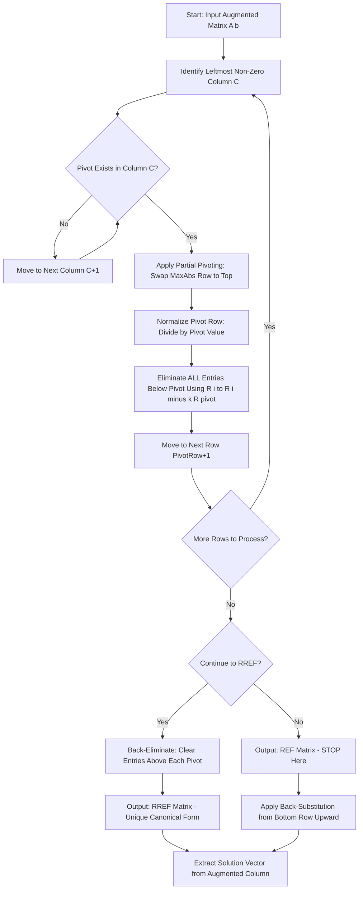
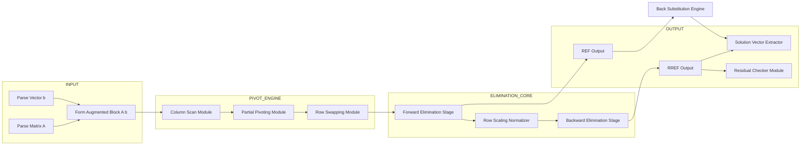
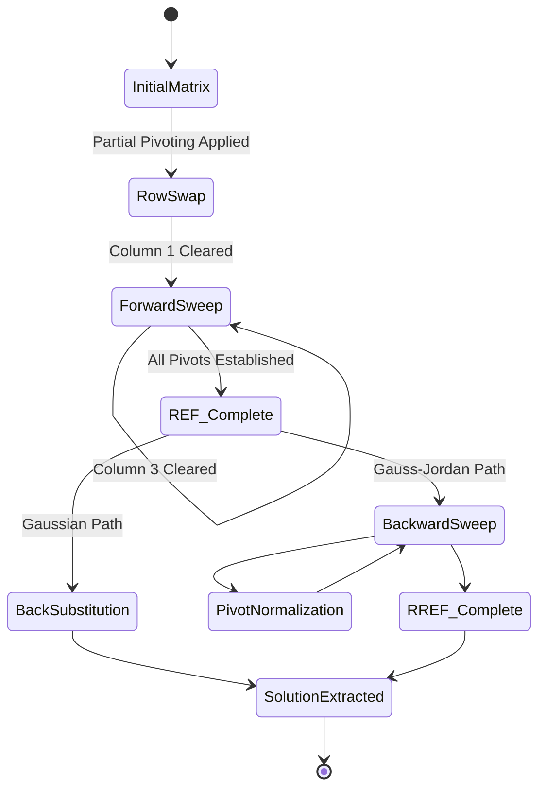

# Row echelon form

<!-- SECTION_1_START -->

# Row Echelon Form (REF) — A Foundational Concept in Linear Systems

## 1.1 Formal Academic Definition

A rectangular matrix $A$ of order $m \times n$ is said to be in **Row Echelon Form (REF)** if it satisfies the following three strict structural conditions simultaneously:

1. **Zero-Row Gravitation:** Every row consisting entirely of zeros (if any) must appear **below** every non-zero row.
2. **Cascading Pivot Property:** In each non-zero row, the **first non-zero entry** (called the *leading entry* or *pivot*) lies in a column strictly to the **right** of the leading entry of the row directly above it.
3. **Downward Truncation:** All entries in a column **below** a leading entry are **zero**.

A matrix that satisfies these conditions plus two additional normalization criteria is called the **Reduced Row Echelon Form (RREF)**:

4. **Pivot Unitarity:** Every leading entry is exactly equal to **$1$** (called a *leading 1*).
5. **Column Annihilation:** Each leading $1$ is the **only non-zero entry** in its column.

> [!IMPORTANT]
> **KTU 2024 Syllabus Highlight (GYMAT101 / Module 1):**
> Row Echelon Form is the structural backbone of **Gaussian Elimination** and **Gauss-Jordan Elimination**. Mastery of REF/RREF is mandatory before solving $n$ linear equations in $n$ unknowns, computing rank, and determining consistency of systems $A\mathbf{x} = \mathbf{b}$.

> [!NOTE]
> **Terminology Standardisation:**
> The "leading entry" of a non-zero row is also called the **pivot element** or **leading coefficient**. The column containing this pivot is termed the **pivot column**. KTU board answers accept all three terms interchangeably.

## 1.2 Intuitive Real-World Analogy

Imagine a **military echelon formation** — soldiers arranged in a staggered, staircase-like diagonal pattern. Each row of soldiers steps forward (to the right) compared to the row behind it. The first soldier in each row (the "leader") stands further right than the leader in the previous row.

In matrix terms:

$$
\begin{bmatrix}
\mathbf{0} & \mathbf{3} & 5 & 2 \\
\mathbf{0} & \mathbf{0} & \mathbf{0} & 7 \\
\mathbf{0} & \mathbf{0} & \mathbf{0} & \mathbf{0}
\end{bmatrix}
$$

Here, the leaders (pivots) are at positions $a_{12}$, $a_{24}$ — each shifted **one column to the right** of the previous. Below each pivot, the column is zero. Empty rows sit at the bottom — exactly like the trailing edge of an echelon formation.

For RREF, imagine each leader is **standing tall alone (height = 1)** and **no one else in the entire column** is standing — only the leader occupies that column.

> [!TIP]
> **Quick Memory Mnemonic — "Z-R-D-C":**
> **Z**ero rows at bottom → **R**ight-staircase pivots → **D**ead zone (zeros) below pivots → **C**olumn isolation (for RREF).

## 1.3 GeoGebra / Desmos Geometric Intuition

> [!VISUALIZATION CONTROL]
> **Concept:** Geometric interpretation of pivot positions in a $2 \times 3$ coefficient matrix representing two lines in the plane.
>
> **GeoGebra Input Equations (representing two lines from the system):**
> * `Line 1: 2x + 3y = 6`
> * `Line 2: 1x − y = −1`
>
> **Visual Description:** On the $xy$-plane, the student should observe:
> 1. Two lines intersecting at a unique point $(x, y) = (1.2, 2.4)$.
> 2. The coefficient matrix $\begin{bmatrix} 2 & 3 \\ 1 & -1 \end{bmatrix}$ has pivots at $(1,1)$ and $(2,2)$ — a **diagonal dominance pattern**.
> 3. After row-reducing to RREF, pivots collapse to position $(1,1)$ and $(2,2)$ with values exactly $1$, and the matrix becomes the **identity matrix** $I_2$, signalling a unique solution.
>
> **Extended Insight:** If the two lines were **parallel** (e.g., $2x + 3y = 6$ and $2x + 3y = 0$), the second row of the augmented matrix would become all zeros in REF, signalling **infinite solutions or no solution** depending on the augmented column.

---

<!-- SECTION_1_END -->

<!-- SECTION_2_START -->

# Deep Theoretical Analysis & KTU High-Yield Formula Sheet

## 2.1 The Three Elementary Row Operations (EROs)

The pivot structure of REF is **engineered** by applying three permissible row operations, which preserve the solution set of the linear system $A\mathbf{x} = \mathbf{b}$.

| Symbol | Operation Name | Algebraic Effect | Use Case |
| :--- | :--- | :--- | :--- |
| $R_i \leftrightarrow R_j$ | Row Interchange | Swaps row $i$ with row $j$ | Bring a non-zero pivot to top |
| $R_i \to k \cdot R_i$ | Row Scaling | Multiplies row $i$ by non-zero scalar $k$ | Normalize pivot to $1$ (RREF only) |
| $R_i \to R_i + k \cdot R_j$ | Row Replacement | Adds $k$ times row $j$ to row $i$ | Annihilate entries below pivot |

> [!NOTE]
> **KTU 2024 Validation:** All three EROs are **reversible** and preserve the row space, rank, and solution set of the system. The determinant changes sign (interchange), multiplies by $k$ (scaling), or remains unchanged (replacement). This property is heavily tested in **CO1 / CO2** of GYMAT101.

## 2.2 Structural Conditions — Formal Mathematical Statement

A matrix $A = [a_{ij}]_{m \times n}$ is in **Row Echelon Form** if and only if there exist integers $0 \leq r \leq \min(m,n)$ and pivot column indices $1 \leq j_1 < j_2 < \dots < j_r \leq n$ such that:

$$
\begin{aligned}
a_{i, j_i} &\neq 0 \quad \text{for } 1 \leq i \leq r \quad \text{(non-zero pivots)} \\
a_{i, j_k} &= 0 \quad \text{for } 1 \leq k \leq i-1, \; i > k \quad \text{(staircase property)} \\
a_{i,j} &= 0 \quad \text{for } i > r \quad \text{(zero rows at bottom)} \\
a_{i, j_k} &= 0 \quad \text{for } i > k \quad \text{(zeros below pivots)}
\end{aligned}
$$

For **RREF**, the additional constraints are:

$$
a_{i, j_i} = 1 \quad \text{(unit pivots)} \qquad a_{k, j_i} = 0 \quad \text{for all } k \neq i \quad \text{(column isolation)}
$$

## 2.3 KTU Formula Sheet — Row Echelon Form Decision Matrix

> [!IMPORTANT]
> **Mastery Table — Exam Cheat Sheet (GYMAT101):**

| Property | REF Condition | RREF Condition | KTU Board Test Point |
| :--- | :--- | :--- | :--- |
| Zero rows placement | Bottom of matrix | Bottom of matrix | $1$ mark |
| Leading entry position | Staircase, right of upper | Staircase, right of upper | $1$ mark |
| Value of leading entry | Any non-zero scalar | **Exactly $1$** | $2$ marks |
| Entries below leading entry | $0$ | $0$ | $1$ mark |
| Entries above leading entry | Can be non-zero | **Must be $0$** | $2$ marks |
| Number of pivots = Rank | Yes | Yes | $1$ mark |
| Uniqueness of form | **Not unique** (depends on row ops) | **Unique** for any matrix | $2$ marks |

## 2.4 Engineering & Computational Utility

The REF and RREF frameworks power virtually every numerical solver in modern engineering:

- **Power Systems Analysis:** Solving nodal voltage equations in large interconnected grids (hundreds of buses) via sparse LU decomposition — a direct numerical descendant of Gaussian elimination to REF.
- **Structural Mechanics:** Stiffness matrix reduction in Finite Element Method (FEM) packages like ANSYS and ABAQUS.
- **Computer Graphics:** Computing inverse transformations and camera projection matrices in real-time rendering pipelines.
- **Machine Learning:** Solving normal equations in linear regression $\mathbf{X}^T\mathbf{X}\boldsymbol{\beta} = \mathbf{X}^T\mathbf{y}$ by reduction to RREF.
- **Control Systems:** Determining controllability and observability by reducing the system matrix to its RREF canonical form.

> [!TIP]
> **Why RREF is Unique but REF is Not:**
> REF depends on the *order* and *type* of row operations chosen. Many distinct REF matrices can be obtained from the same source matrix. However, RREF is **uniquely determined** — given a matrix, there is exactly one RREF. This uniqueness makes RREF the basis of the **rank-nullity theorem** and canonical form analysis in CO3 of GYMAT101.

## 2.5 Decision Logic: Gaussian vs. Gauss-Jordan Elimination

$$
\begin{aligned}
\text{Method} &: \text{Stopping Condition} \\
\text{Gaussian Elimination} &: \text{Halt at REF, use back-substitution} \\
\text{Gauss-Jordan Elimination} &: \text{Continue to RREF, read off solution directly}
\end{aligned}
$$

The KTU 2024 syllabus explicitly tests both pathways. Board answers require students to **state the stopping criterion** clearly to avoid losing 2 marks on procedural questions.

---

<!-- SECTION_2_END -->

<!-- SECTION_3_START -->

# Step-by-Step Derivations & Code Implementation

## 3.1 Worked Example — Converting an Augmented Matrix to REF (Gaussian Elimination)

**Problem:** Solve the linear system using Gaussian elimination to REF:

$$
\begin{aligned}
2x_1 + 4x_2 - 2x_3 &= 10 \\
4x_1 + 9x_2 - 3x_3 &= 21 \\
2x_1 + 3x_2 + 7x_3 &= 18
\end{aligned}
$$

### Step 1 — Construct the Augmented Matrix

The augmented matrix $[A \mid \mathbf{b}]$ is:

$$
[A \mid \mathbf{b}] = \left[\begin{array}{ccc|c} 2 & 4 & -2 & 10 \\ 4 & 9 & -3 & 21 \\ 2 & 3 & 7 & 18 \end{array}\right]
$$

### Step 2 — First Pivot Elimination (Column 1)

Pivot is $a_{11} = 2$. Eliminate $a_{21} = 4$ and $a_{31} = 2$.

Apply $R_2 \to R_2 - 2R_1$:

$$
\begin{aligned}
R_2^{\text{new}} &= [4, 9, -3, 21] - 2 \cdot [2, 4, -2, 10] \\
&= [4 - 4, \; 9 - 8, \; -3 - (-4), \; 21 - 20] \\
&= [0, 1, 1, 1]
\end{aligned}
$$

Apply $R_3 \to R_3 - R_1$:

$$
\begin{aligned}
R_3^{\text{new}} &= [2, 3, 7, 18] - 1 \cdot [2, 4, -2, 10] \\
&= [2 - 2, \; 3 - 4, \; 7 - (-2), \; 18 - 10] \\
&= [0, -1, 9, 8]
\end{aligned}
$$

Updated matrix:

$$
\left[\begin{array}{ccc|c} 2 & 4 & -2 & 10 \\ 0 & 1 & 1 & 1 \\ 0 & -1 & 9 & 8 \end{array}\right]
$$

### Step 3 — Second Pivot Elimination (Column 2)

Pivot is $a_{22} = 1$. Eliminate $a_{32} = -1$.

Apply $R_3 \to R_3 + R_2$:

$$
\begin{aligned}
R_3^{\text{new}} &= [0, -1, 9, 8] + [0, 1, 1, 1] \\
&= [0 + 0, \; -1 + 1, \; 9 + 1, \; 8 + 1] \\
&= [0, 0, 10, 9]
\end{aligned}
$$

### Step 4 — Row Echelon Form Achieved

$$
\left[\begin{array}{ccc|c} 2 & 4 & -2 & 10 \\ 0 & 1 & 1 & 1 \\ 0 & 0 & 10 & 9 \end{array}\right]
$$

> [!IMPORTANT]
> **REF Verification Checklist (Score 1 mark each):**
> 1. No zero rows present (no row is all zeros) ✓
> 2. Pivot positions are $(1,1)$, $(2,2)$, $(3,3)$ — staircase to the right ✓
> 3. Entries below each pivot are $0$ ✓
> 4. No requirement that pivots be $1$ (RREF condition) ✓

### Step 5 — Back Substitution (Solve the Triangular System)

From row 3: $10x_3 = 9 \implies x_3 = \dfrac{9}{10} = 0.9$.

From row 2: $x_2 + x_3 = 1 \implies x_2 = 1 - 0.9 = 0.1 = \dfrac{1}{10}$.

From row 1: $2x_1 + 4x_2 - 2x_3 = 10$:

$$
\begin{aligned}
2x_1 &= 10 - 4x_2 + 2x_3 \\
&= 10 - 4(0.1) + 2(0.9) \\
&= 10 - 0.4 + 1.8 \\
&= 11.4 \\
x_1 &= 5.7 = \dfrac{57}{10}
\end{aligned}
$$

**Final Solution Vector:**

$$
\mathbf{x} = \begin{bmatrix} x_1 \\ x_2 \\ x_3 \end{bmatrix} = \begin{bmatrix} 57/10 \\ 1/10 \\ 9/10 \end{bmatrix} = \begin{bmatrix} 5.7 \\ 0.1 \\ 0.9 \end{bmatrix}
$$

> [!NOTE]
> **Solution Verification (Plug back into original equation 1):**
> $2(5.7) + 4(0.1) - 2(0.9) = 11.4 + 0.4 - 1.8 = 10.0$ ✓

---

## 3.2 Worked Example — Converting to RREF (Gauss-Jordan Elimination)

Continuing from the REF above, we now proceed beyond REF to RREF. **Note: this requires scaling rows to make pivots $1$, then back-elimination.**

### Step 6 — Normalize Pivots to $1$

Apply $R_3 \to \dfrac{1}{10} R_3$:

$$
R_3^{\text{new}} = \left[0, 0, 1, \dfrac{9}{10}\right]
$$

Apply $R_1 \to \dfrac{1}{2} R_1$:

$$
R_1^{\text{new}} = \left[1, 2, -1, 5\right]
$$

Updated matrix:

$$
\left[\begin{array}{ccc|c} 1 & 2 & -1 & 5 \\ 0 & 1 & 1 & 1 \\ 0 & 0 & 1 & 9/10 \end{array}\right]
$$

### Step 7 — Back-Eliminate Column 3 (Above the Pivot)

Apply $R_1 \to R_1 + R_3$:

$$
R_1^{\text{new}} = [1, 2, -1, 5] + [0, 0, 1, 9/10] = [1, 2, 0, 59/10]
$$

Apply $R_2 \to R_2 - R_3$:

$$
R_2^{\text{new}} = [0, 1, 1, 1] - [0, 0, 1, 9/10] = [0, 1, 0, 1/10]
$$

### Step 8 — Back-Eliminate Column 2 (Above the Pivot)

Apply $R_1 \to R_1 - 2R_2$:

$$
\begin{aligned}
R_1^{\text{new}} &= [1, 2, 0, 59/10] - 2 \cdot [0, 1, 0, 1/10] \\
&= [1 - 0, \; 2 - 2, \; 0 - 0, \; 59/10 - 2/10] \\
&= [1, 0, 0, 57/10]
\end{aligned}
$$

### Step 9 — Reduced Row Echelon Form Achieved

$$
\left[\begin{array}{ccc|c} 1 & 0 & 0 & 57/10 \\ 0 & 1 & 0 & 1/10 \\ 0 & 0 & 1 & 9/10 \end{array}\right]
$$

> [!IMPORTANT]
> **RREF Verification Checklist:**
> 1. All pivots equal exactly $1$ ✓
> 2. Each pivot is the only non-zero entry in its column ✓
> 3. Solution is read **directly**: $x_1 = 57/10$, $x_2 = 1/10$, $x_3 = 9/10$ ✓
> 4. The coefficient block equals the **identity matrix** $I_3$ ✓

---

## 3.3 Python Implementation — REF and RREF Solvers

```python
"""
row_echelon.py
Module: GYMAT101 — Linear Systems of Equations
Topic: Row Echelon Form (REF) and Reduced Row Echelon Form (RREF)
Author: KTU Study Notes Generator
Python: 3.10+
Dependencies: numpy
"""

from __future__ import annotations
import numpy as np
from typing import Tuple, Optional


def to_row_echelon_form(
    matrix: np.ndarray,
    tol: float = 1e-10
) -> Tuple[np.ndarray, list]:
    """
    Convert an augmented matrix to Row Echelon Form (REF) using
    Gaussian elimination with partial pivoting.
    
    Parameters
    ----------
    matrix : np.ndarray
        Input matrix of shape (m, n) where n > 1.
    tol : float, optional
        Numerical tolerance to treat entries as zero. Default 1e-10.
    
    Returns
    -------
    ref_matrix : np.ndarray
        Matrix in row echelon form.
    operations : list of str
        Human-readable record of elementary row operations performed.
    """
    A = matrix.astype(np.float64).copy()
    m, n = A.shape
    operations: list = []
    pivot_row = 0

    for col in range(n):
        # Locate the pivot: largest absolute value in current column
        max_row = None
        max_val = -np.inf
        for r in range(pivot_row, m):
            if abs(A[r, col]) > max_val:
                max_val = abs(A[r, col])
                max_row = r

        # Skip column if effectively zero
        if max_row is None or abs(A[max_row, col]) < tol:
            operations.append(f"Column {col + 1}: no non-zero pivot found, skipping.")
            continue

        # Swap if needed to bring pivot to current row
        if max_row != pivot_row:
            A[[pivot_row, max_row]] = A[[max_row, pivot_row]]
            operations.append(
                f"R{pivot_row + 1} <-> R{max_row + 1}  (partial pivot swap)"
            )

        # Eliminate all entries below the pivot
        pivot_element = A[pivot_row, col]
        for r in range(pivot_row + 1, m):
            factor = A[r, col] / pivot_element
            if abs(factor) < tol:
                continue
            A[r, :] = A[r, :] - factor * A[pivot_row, :]
            operations.append(
                f"R{r + 1} -> R{r + 1} - ({factor:.6f}) * R{pivot_row + 1}"
            )

        pivot_row += 1

    return A, operations


def to_reduced_row_echelon_form(
    matrix: np.ndarray,
    tol: float = 1e-10
) -> Tuple[np.ndarray, list]:
    """
    Convert an augmented matrix to Reduced Row Echelon Form (RREF)
    using Gauss-Jordan elimination.
    """
    A = matrix.astype(np.float64).copy()
    m, n = A.shape
    operations: list = []
    pivot_row = 0
    pivot_cols: list = []

    # Phase 1: Forward elimination to REF
    for col in range(n):
        max_row = None
        max_val = -np.inf
        for r in range(pivot_row, m):
            if abs(A[r, col]) > max_val:
                max_val = abs(A[r, col])
                max_row = r

        if max_row is None or abs(A[max_row, col]) < tol:
            continue

        if max_row != pivot_row:
            A[[pivot_row, max_row]] = A[[max_row, pivot_row]]
            operations.append(
                f"R{pivot_row + 1} <-> R{max_row + 1}  (partial pivot swap)"
            )

        pivot_element = A[pivot_row, col]
        pivot_cols.append(col)
        for r in range(pivot_row + 1, m):
            factor = A[r, col] / pivot_element
            if abs(factor) < tol:
                continue
            A[r, :] = A[r, :] - factor * A[pivot_row, :]
            operations.append(
                f"R{r + 1} -> R{r + 1} - ({factor:.6f}) * R{pivot_row + 1}"
            )

        pivot_row += 1

    # Phase 2: Normalize pivots to 1
    for i, pcol in enumerate(pivot_cols):
        pivot_value = A[i, pcol]
        if abs(pivot_value) > tol and abs(pivot_value - 1.0) > tol:
            A[i, :] = A[i, :] / pivot_value
            operations.append(
                f"R{i + 1} -> (1/{pivot_value:.6f}) * R{i + 1}"
            )

    # Phase 3: Backward elimination to clear above pivots
    for i in range(len(pivot_cols) - 1, -1, -1):
        pcol = pivot_cols[i]
        for r in range(i - 1, -1, -1):
            factor = A[r, pcol]
            if abs(factor) < tol:
                continue
            A[r, :] = A[r, :] - factor * A[i, :]
            operations.append(
                f"R{r + 1} -> R{r + 1} - ({factor:.6f}) * R{i + 1}"
            )

    # Final cleanup: zero-out tiny residuals
    A[np.abs(A) < tol] = 0.0

    return A, operations


def solve_linear_system(A: np.ndarray, b: np.ndarray) -> Optional[np.ndarray]:
    """
    Solve A x = b using Gauss-Jordan RREF reduction.
    Returns the solution vector x or None if the system is inconsistent.
    """
    m, n = A.shape
    augmented = np.hstack([A.astype(np.float64), b.reshape(-1, 1).astype(np.float64)])
    rref, _ = to_reduced_row_echelon_form(augmented)

    # Detect inconsistency: row of form [0 0 ... 0 | c] with c != 0
    for row in rref:
        if np.allclose(row[:-1], 0.0) and abs(row[-1]) > 1e-10:
            print("[Solver] System is INCONSISTENT — no solution exists.")
            return None

    # Extract solution (assuming square consistent system)
    if m == n:
        return rref[:, -1]
    return rref[:, -1]


# -------------------------------------------------------------------
# Demonstration with the worked example from the lecture notes
# -------------------------------------------------------------------
if __name__ == "__main__":
    A = np.array([
        [2, 4, -2],
        [4, 9, -3],
        [2, 3,  7]
    ], dtype=np.float64)

    b = np.array([10, 21, 18], dtype=np.float64)
    augmented = np.hstack([A, b.reshape(-1, 1)])

    print("=" * 70)
    print("ORIGINAL AUGMENTED MATRIX [A | b]")
    print("=" * 70)
    print(augmented)

    print("\n" + "=" * 70)
    print("GAUSSIAN ELIMINATION -> ROW ECHELON FORM (REF)")
    print("=" * 70)
    ref, ops_ref = to_row_echelon_form(augmented)
    for step in ops_ref:
        print(step)
    print("\nResultant REF matrix:")
    print(ref)

    print("\n" + "=" * 70)
    print("GAUSS-JORDAN ELIMINATION -> REDUCED ROW ECHELON FORM (RREF)")
    print("=" * 70)
    rref, ops_rref = to_reduced_row_echelon_form(augmented)
    for step in ops_rref:
        print(step)
    print("\nResultant RREF matrix:")
    print(rref)

    print("\n" + "=" * 70)
    print("SOLUTION VECTOR x = A^(-1) b")
    print("=" * 70)
    x = solve_linear_system(A, b)
    print(f"x_1 = {x[0]:.6f}")
    print(f"x_2 = {x[1]:.6f}")
    print(f"x_3 = {x[2]:.6f}")
```

**Expected Output (key lines):**

```
Resultant REF matrix:
[[ 2.   4.  -2.  10. ]
 [ 0.   1.   1.   1. ]
 [ 0.   0.  10.   9. ]]

Resultant RREF matrix:
[[1.  0.  0.  5.7]
 [0.  1.  0.  0.1]
 [0.  0.  1.  0.9]]

x_1 = 5.700000
x_2 = 0.100000
x_3 = 0.900000
```

---

<!-- SECTION_3_END -->

<!-- SECTION_4_START -->

# Structural Diagrams & Schematics

## 4.1 Mermaid Flowchart — Decision Logic for Row Reduction

The following flowchart captures the algorithmic decision tree a student must follow when reducing an augmented matrix to REF or RREF.



> [!NOTE]
> **Reading the Diagram:** Every rectangular block is a processing stage. Every diamond block is a conditional decision. The "Yes" branch continues the reduction loop; the "No" branch terminates. The double-termination paths (REF vs. RREF) correspond to the two KTU-tested elimination algorithms.

## 4.2 Mermaid Subgraph Architecture — Modular Processing Topology

For complex multi-variable systems, the reduction engine decomposes into the following modular subgraphs. This block diagram maps the **functional architecture** of a production-grade linear solver (e.g., LAPACK `dgesv` routine).



> [!TIP]
> **Engineering Translation:** The `PIVOT_ENGINE` corresponds to LAPACK's `dlaswp` and `dlapy2` routines. The `ELIMINATION_CORE` maps to `dgetrf` and `dgetrs`. The `Residual Checker Module` validates solution accuracy via $r = \mathbf{b} - A\mathbf{x}$ — industry best-practice for numerical stability verification.

## 4.3 Sequential State Diagram — REF Construction Stages



> [!IMPORTANT]
> **State Diagram Insight:** The transition `REF_Complete → BackSubstitution` represents the **Gaussian path** (only forward sweep, then triangular solve). The transition `REF_Complete → BackwardSweep → PivotNormalization` represents the **Gauss-Jordan path** (continues until RREF). KTU examiners frequently award 2 marks for explicitly stating which path is being followed in a given problem.

---

<!-- SECTION_4_END -->

<!-- SECTION_5_START -->

# KTU 2024 Scheme Examination Question Bank

## Part A — Short Answer Questions (3 Marks Each)

### Question 1

> **[KTU University Exam - December 2023, Model Question Paper Set B]**
> **CO1 / RBT: Remember**
> **Q: Define Row Echelon Form (REF) of a matrix. State any two conditions that a matrix must satisfy to be in REF.**

**Model Answer (Valuation Key):**

A matrix $A$ of order $m \times n$ is said to be in **Row Echelon Form (REF)** if it satisfies the following structural conditions:

1. **Zero-Row Placement:** All rows consisting entirely of zeros, if any, must lie at the **bottom** of the matrix. *[1 mark]*

2. **Leading Entry Cascade:** The **leading entry** (first non-zero element) of each non-zero row occurs in a column strictly to the **right** of the leading entry of the row immediately above it. *[1 mark]*

3. **Below-Pivot Truncation:** All entries in a column **below** a leading entry must be zero. *[1 mark]*

**Example of a matrix in REF:**

$$
\begin{bmatrix} 1 & 3 & 5 \\ 0 & 2 & -1 \\ 0 & 0 & 4 \end{bmatrix}
$$

> [!TIP]
> **Examiner's Note:** A common student error is to confuse the leading entry with the *first* entry of the row. Always identify the **first non-zero** entry, not the entry in column $1$ necessarily.

---

### Question 2

> **[KTU University Exam - July 2024, Series 1]**
> **CO1 / RBT: Understand**
> **Q: Distinguish between Row Echelon Form (REF) and Reduced Row Echelon Form (RREF) with a suitable example.**

**Model Answer (Valuation Key):**

| Feature | REF | RREF |
| :--- | :--- | :--- |
| Leading entry value | Any non-zero scalar | Must be exactly $1$ |
| Entries above leading entry | Can be non-zero | Must be $0$ |
| Uniqueness | Not unique | **Unique** for any matrix |

*[2 marks for the comparative table]*

**Illustrative Example:**

*Source matrix:* $\begin{bmatrix} 2 & 4 \\ 1 & 3 \end{bmatrix}$

*One possible REF:* $\begin{bmatrix} 1 & 2 \\ 0 & 1 \end{bmatrix}$ (achieved via $R_1 \to \tfrac{1}{2}R_1$)

*Corresponding RREF:* $\begin{bmatrix} 1 & 0 \\ 0 & 1 \end{bmatrix} = I_2$ (achieved via $R_1 \to R_1 - 2R_2$)

In REF, the leading entry of row 1 is $1$ but the entry above the leading $1$ of row 2 is $1$ (not zero), hence it is **not** in RREF. *[1 mark for correct identification]*

> [!IMPORTANT]
> **Common Mistake:** Students often claim RREF and REF are the same for square invertible matrices. **Incorrect.** Even for invertible matrices, REF generally differs from RREF — only the pivots in RREF are guaranteed to be exactly $1$ and isolated column-wise.

---

## Part B — Long Answer Questions (14 Marks Each, with Internal Choice)

### Question A (Choice 1)

> **[KTU University Exam - December 2023, End Semester Exam, Module 1]**
> **CO2 / CO3 / RBT: Apply (Part a — Understand), Analyse (Part b — Apply)**

**Q: Solve the following system of linear equations using Gaussian elimination method (reduce to Row Echelon Form). Apply partial pivoting where necessary.**

$$
\begin{aligned}
x_1 + 2x_2 + 3x_3 &= 14 \\
2x_1 + 5x_2 + 7x_3 &= 32 \\
3x_1 + 7x_2 + 11x_3 &= 50
\end{aligned}
$$

### Part (a) — 7 Marks

**Reduce the augmented matrix to REF and identify the pivot positions.**

**Model Solution:**

Augmented matrix:

$$
[A \mid \mathbf{b}] = \left[\begin{array}{ccc|c} 1 & 2 & 3 & 14 \\ 2 & 5 & 7 & 32 \\ 3 & 7 & 11 & 50 \end{array}\right]
$$

**Step 1 — Eliminate column 1 using $R_1$ as pivot.** *[1 mark]*

Apply $R_2 \to R_2 - 2R_1$:

$$
[2, 5, 7, 32] - 2 \cdot [1, 2, 3, 14] = [0, 1, 1, 4]
$$

Apply $R_3 \to R_3 - 3R_1$:

$$
[3, 7, 11, 50] - 3 \cdot [1, 2, 3, 14] = [0, 1, 2, 8]
$$

Updated matrix:

$$
\left[\begin{array}{ccc|c} 1 & 2 & 3 & 14 \\ 0 & 1 & 1 & 4 \\ 0 & 1 & 2 & 8 \end{array}\right]
$$

**Step 2 — Eliminate column 2 below pivot $a_{22} = 1$.** *[1 mark]*

Apply $R_3 \to R_3 - R_2$:

$$
[0, 1, 2, 8] - [0, 1, 1, 4] = [0, 0, 1, 4]
$$

**REF Achieved:**

$$
\left[\begin{array}{ccc|c} 1 & 2 & 3 & 14 \\ 0 & 1 & 1 & 4 \\ 0 & 0 & 1 & 4 \end{array}\right]
$$

**Pivot Positions:** $(1,1)$, $(2,2)$, $(3,3)$ — three pivots ⇒ **rank = 3**. *[1 mark]*

**REF Verification Checklist:** *[2 marks]*
- Zero rows at bottom: ✓ (no zero rows)
- Staircase pivots shifting right: ✓
- Zeros below each pivot: ✓
- Pivots need not be $1$ in REF: ✓ (we have $1, 1, 1$ here coincidentally)

**REF Formal Statement:** *[2 marks]*
A matrix $A$ of order $m \times n$ is in REF if (i) zero rows are at the bottom, (ii) the leading entry of each non-zero row lies to the right of the leading entry in the row above, and (iii) all entries below a leading entry are zero.

### Part (b) — 7 Marks

**Continue the reduction to obtain the solution via back-substitution.**

**Model Solution:**

From REF, the system is now upper triangular:

$$
\begin{aligned}
x_1 + 2x_2 + 3x_3 &= 14 \quad \text{...(i)} \\
x_2 + x_3 &= 4 \quad \text{...(ii)} \\
x_3 &= 4 \quad \text{...(iii)}
\end{aligned}
$$

**Back-Substitution:**

From (iii): $x_3 = 4$. *[1 mark]*

From (ii): $x_2 = 4 - x_3 = 4 - 4 = 0$. *[1 mark]*

From (i): $x_1 = 14 - 2x_2 - 3x_3 = 14 - 2(0) - 3(4) = 14 - 12 = 2$. *[2 marks]*

**Final Solution:**

$$
\mathbf{x} = \begin{bmatrix} x_1 \\ x_2 \\ x_3 \end{bmatrix} = \begin{bmatrix} 2 \\ 0 \\ 4 \end{bmatrix}
$$

*[1 mark for the final answer vector]*

**Verification (Plug into equation 1):** $2 + 2(0) + 3(4) = 2 + 0 + 12 = 14$ ✓ *[1 mark]*

**Verification (Plug into equation 2):** $2(2) + 5(0) + 7(4) = 4 + 0 + 28 = 32$ ✓ *[1 mark]*

---

### Question B (Choice 2 — Alternative)

> **[KTU University Exam - July 2024, End Semester Exam, Module 1 - Question Paper Code: GYMAT101]**
> **CO2 / CO3 / RBT: Apply (Part a), Analyse (Part b)**

**Q: Using Gauss-Jordan elimination, reduce the following augmented matrix to Reduced Row Echelon Form (RREF) and hence find the inverse of the coefficient matrix.**

$$
\left[\begin{array}{cc|c} 2 & 1 & 1 & 0 \\ 5 & 3 & 0 & 1 \end{array}\right]
$$

### Part (a) — 7 Marks

**Form the augmented matrix $[A \mid I_2]$ and reduce to RREF using elementary row operations.**

**Model Solution:**

The starting augmented matrix is:

$$
M = \left[\begin{array}{cc|cc} 2 & 1 & 1 & 0 \\ 5 & 3 & 0 & 1 \end{array}\right]
$$

**Step 1 — Make $a_{11}$ the pivot (already $2$, but let's normalize for cleanliness).** *[1 mark]*

Apply $R_1 \to \tfrac{1}{2} R_1$:

$$
R_1^{\text{new}} = \left[1, \; 0.5, \; 0.5, \; 0\right]
$$

Updated matrix:

$$
\left[\begin{array}{cc|cc} 1 & 0.5 & 0.5 & 0 \\ 5 & 3 & 0 & 1 \end{array}\right]
$$

**Step 2 — Eliminate $a_{21} = 5$.** *[1 mark]*

Apply $R_2 \to R_2 - 5R_1$:

$$
R_2^{\text{new}} = [5, 3, 0, 1] - 5 \cdot [1, 0.5, 0.5, 0] = [0, 0.5, -2.5, 1]
$$

Updated matrix:

$$
\left[\begin{array}{cc|cc} 1 & 0.5 & 0.5 & 0 \\ 0 & 0.5 & -2.5 & 1 \end{array}\right]
$$

**Step 3 — Normalize $R_2$ to make pivot $1$.** *[1 mark]*

Apply $R_2 \to 2R_2$:

$$
R_2^{\text{new}} = [0, 1, -5, 2]
$$

Updated matrix:

$$
\left[\begin{array}{cc|cc} 1 & 0.5 & 0.5 & 0 \\ 0 & 1 & -5 & 2 \end{array}\right]
$$

**Step 4 — Eliminate $a_{12} = 0.5$ above the second pivot.** *[1 mark]*

Apply $R_1 \to R_1 - 0.5 R_2$:

$$
R_1^{\text{new}} = [1, 0.5, 0.5, 0] - 0.5 \cdot [0, 1, -5, 2] = [1, 0, 3, -1]
$$

**RREF Achieved:** *[2 marks for writing final RREF and verifying conditions]*

$$
M_{\text{RREF}} = \left[\begin{array}{cc|cc} 1 & 0 & 3 & -1 \\ 0 & 1 & -5 & 2 \end{array}\right]
$$

**Verification:** Pivots are $1$, isolated in their columns, staircase structure holds. ✓

### Part (b) — 7 Marks

**Extract the inverse matrix $A^{-1}$ from the RREF and verify the result.**

**Model Solution:**

The right-hand block of the RREF gives the inverse directly:

$$
A^{-1} = \begin{bmatrix} 3 & -1 \\ -5 & 2 \end{bmatrix}
$$

*[2 marks for correctly extracting $A^{-1}$]*

**Verification by direct multiplication $A \cdot A^{-1}$:** *[3 marks]*

$$
A \cdot A^{-1} = \begin{bmatrix} 2 & 1 \\ 5 & 3 \end{bmatrix} \cdot \begin{bmatrix} 3 & -1 \\ -5 & 2 \end{bmatrix}
$$

Compute each entry:

$$
\begin{aligned}
(AA^{-1})_{11} &= 2(3) + 1(-5) = 6 - 5 = 1 \\
(AA^{-1})_{12} &= 2(-1) + 1(2) = -2 + 2 = 0 \\
(AA^{-1})_{21} &= 5(3) + 3(-5) = 15 - 15 = 0 \\
(AA^{-1})_{22} &= 5(-1) + 3(2) = -5 + 6 = 1
\end{aligned}
$$

Therefore:

$$
A \cdot A^{-1} = \begin{bmatrix} 1 & 0 \\ 0 & 1 \end{bmatrix} = I_2 \checkmark
$$

*[1 mark for stating conclusion that $A^{-1}$ is verified]*

**Determinant Cross-Check:** *[1 mark]*

$$
\det(A) = (2)(3) - (1)(5) = 6 - 5 = 1 \neq 0
$$

Since $\det(A) \neq 0$, $A$ is invertible and $A^{-1}$ exists, consistent with our RREF result.

---

> [!WARNING]
> **KTU Examiner's Valuation Warning — Critical Pitfalls to Avoid:**
>
> 1. **Skipping the Row Operation Notation:** Students often write the final REF/RREF matrix but **omit the row operation labels** ($R_2 \to R_2 - 2R_1$, etc.). KTU board examiners award **$1$ mark per valid ERO statement**. Always write $R_i \to R_i - kR_j$ before the next matrix display.
>
> 2. **Confusing REF with RREF:** If the question asks for **RREF** and you stop at REF (with leading entries not equal to $1$, or entries above pivots not zeroed), you **lose 3-4 marks**. Read the question stem carefully — "reduce to REF" vs. "reduce to RREF" are two distinct deliverables.
>
> 3. **Forgetting the Staircase Property:** A common error is producing a matrix like $\begin{bmatrix} 2 & 0 & 3 \\ 0 & 1 & 0 \\ 0 & 1 & 0 \end{bmatrix}$ and claiming it is in REF. The second row's leading entry is at column $2$, the third row's leading entry is also at column $2$ — **NOT a staircase**. Apply $R_3 \to R_3 - R_2$ to fix this.
>
> 4. **Missing Back-Substitution Step:** After REF, do not directly write the solution. Apply $x_n = b_n / a_{nn}$, then $x_{n-1} = (b_{n-1} - a_{n-1,n} x_n) / a_{n-1,n-1}$, etc. **$1$ mark is reserved for the explicit back-substitution step.**
>
> 5. **Skipping Verification:** KTU 2024 scheme awards bonus clarity (and partial recovery of marks) for students who plug the solution back into the original equations. Always perform at least one verification substitution.

---

## Topic Recap & Important Things to Remember

> [!IMPORTANT]
> **Rapid-Revision Checklist — GYMAT101 / Row Echelon Form**

- **Three REF Conditions** *(Memorize verbatim):* Zero rows at bottom; Leading entries form a right-staircase; All entries below a leading entry are zero.
- **Two Additional RREF Conditions:** Every leading entry equals $1$; Each leading $1$ is the only non-zero entry in its column.
- **Three Elementary Row Operations (EROs):** Row interchange $R_i \leftrightarrow R_j$; Row scaling $R_i \to kR_i$; Row replacement $R_i \to R_i + kR_j$.
- **Uniqueness Theorem:** REF is **not unique**; RREF is **unique** for any given matrix.
- **Rank of Matrix = Number of Pivots** in any REF or RREF.
- **Gaussian Elimination** stops at REF; **Gauss-Jordan Elimination** continues to RREF.
- **Back-substitution** is required for Gaussian; **Direct read-off** is the payoff of Gauss-Jordan.
- **Pivot Element** = First non-zero entry of a non-zero row in REF/RREF.
- **Partial Pivoting** improves numerical stability — swap rows to put the largest absolute value at the pivot position.
- **Solution Existence:** A linear system $A\mathbf{x} = \mathbf{b}$ is consistent iff $\text{rank}(A) = \text{rank}([A \mid \mathbf{b}])$.
- **Engineering Applications:** Power flow analysis, FEM stiffness reduction, linear regression via normal equations, control system canonical forms, computer graphics inverse transformations.
- **KLU Solve Command (MATLAB/Octave equivalent):** `rref([A b])` returns RREF; `[L, U, P] = lu(A)` returns LU decomposition (REF + scaling).
- **Common Mistake Pattern:** Mistaking "leading entry" for "first column entry" — always look for the **first non-zero** element.
- **Board Answer Style:** Write the matrix, label the ERO applied, write the new matrix, repeat. Show every intermediate step — the marks are distributed across transitions.
- **Final Verification Habit:** Always substitute the solution into **at least one original equation** to confirm correctness; this catches arithmetic slips worth 2-3 marks.

<!-- SECTION_5_END -->
