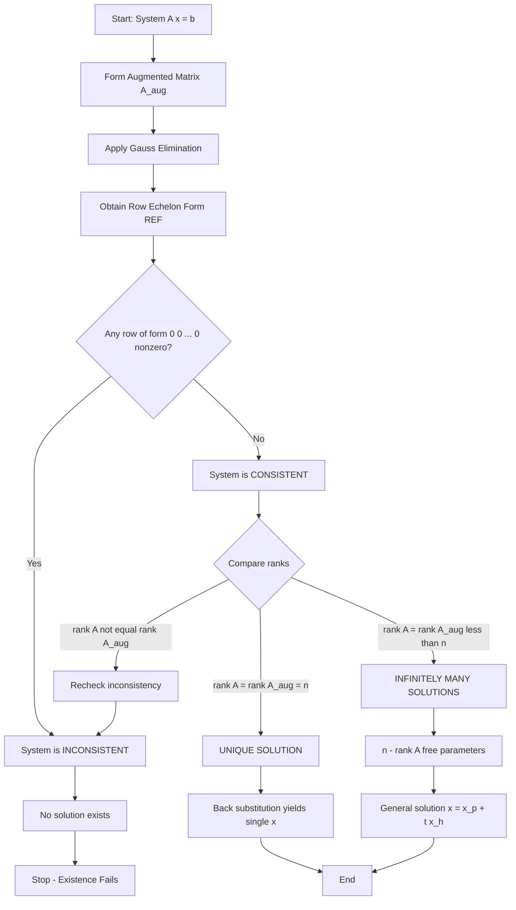

# Solutions of linear systems: Existence

<!-- SECTION_1_START -->
# Solutions of Linear Systems: Existence of Solutions

## Formal Academic Definition

A **system of linear equations** is a collection of one or more linear equations involving the same set of variables. The general form of a system of $m$ equations in $n$ unknowns $x_1, x_2, \ldots, x_n$ is written as:

$$\begin{aligned}
a_{11}x_1 + a_{12}x_2 + \cdots + a_{1n}x_n &= b_1 \\
a_{21}x_1 + a_{22}x_2 + \cdots + a_{2n}x_n &= b_2 \\
&\;\;\vdots \\
a_{m1}x_1 + a_{m2}x_2 + \cdots + a_{mn}x_n &= b_m
\end{aligned}$$

In compact **matrix form**, this is represented as $A\mathbf{x} = \mathbf{b}$, where $A$ is the **coefficient matrix** of order $m \times n$, $\mathbf{x}$ is the column vector of unknowns of order $n \times 1$, and $\mathbf{b}$ is the column vector of constants of order $m \times 1$.

The **augmented matrix** $[A \,|\, \mathbf{b}]$ is formed by appending the constant vector $\mathbf{b}$ as an additional column to $A$:

$$[A \,|\, \mathbf{b}] = \left[\begin{array}{cccc|c} a_{11} & a_{12} & \cdots & a_{1n} & b_1 \\ a_{21} & a_{22} & \cdots & a_{2n} & b_2 \\ \vdots & \vdots & \ddots & \vdots & \vdots \\ a_{m1} & a_{m2} & \cdots & a_{mn} & b_m \end{array}\right]$$

> [!IMPORTANT]
> **Existence of a Solution (KTU 2024 Syllabus Definition):**
> A linear system $A\mathbf{x} = \mathbf{b}$ is said to possess a solution (i.e., be **consistent**) if and only if the rank of the coefficient matrix equals the rank of the augmented matrix: $\rho(A) = \rho([A \,|\, \mathbf{b}])$. If $\rho(A) \neq \rho([A \,|\, \mathbf{b}])$, the system is **inconsistent** and no solution exists.

This result is known as the **Rouché–Capelli Theorem** (also called the **Rouche–Fontene Theorem** in some texts), and is the fundamental tool for testing existence.

## Conceptual Analogy / Intuition

Imagine you are navigating a city with two roads:
- **Unique solution** – Two straight roads cross at exactly one intersection. You can stand on one point that satisfies both.
- **Infinitely many solutions** – Two roads run perfectly parallel and overlap on top of each other. Every point on the road is a common meeting point.
- **No solution (inconsistent)** – Two roads are parallel but never touch. You can never be on both roads at the same time.

In algebraic terms, every equation in the system represents a geometric object (a line in 2D, a plane in 3D, a hyperplane in higher dimensions). **Existence** asks: *Can all these objects share at least one common point?*

> [!NOTE]
> **Geometric Interpretation of Existence:**
> - In $\mathbb{R}^2$ (2 variables): Lines either intersect (consistent) or are parallel without intersection (inconsistent).
> - In $\mathbb{R}^3$ (3 variables): Planes can intersect at a point, a line, or be parallel/disjoint.
> - For electrical/physical science applications, existence guarantees that circuit currents or physical field quantities can actually be measured or computed.

The **three fundamental questions** that KTU expects you to answer for any linear system are:
1. **Existence** – Does at least one solution exist?
2. **Uniqueness** – Is the solution the only one?
3. **Complete characterization** – Can we describe all solutions explicitly?

> [!TIP]
> The term **"rank"** used in the Rouché–Capelli theorem is a non-negative integer counting the maximum number of linearly independent rows (or equivalently, columns) of a matrix. Computing it correctly is essential — examiners often test rank calculation as a primary skill.

### GeoGebra / Desmos Visualization

> [!VISUALIZATION CONTROL]
> **Concept:** Visualizing consistency and inconsistency of two linear equations in 2D
> **GeoGebra / Desmos Input Equations (Consistent — Unique Solution):**
> * `Line 1: y = 2x + 1`
> * `Line 2: y = -x + 4`
> **Visual Description:** Two straight lines cross at exactly one point $(1, 3)$. This represents a **unique solution**.
>
> **GeoGebra / Desmos Input Equations (Consistent — Infinite Solutions):**
> * `Line 1: y = 2x + 1`
> * `Line 2: 2y = 4x + 2`  (same line rewritten)
> **Visual Description:** Both equations plot the same line — every point on the line is a solution. This represents **infinitely many solutions**.
>
> **GeoGebra / Desmos Input Equations (Inconsistent — No Solution):**
> * `Line 1: y = 2x + 1`
> * `Line 2: y = 2x - 3`
> **Visual Description:** Two parallel lines that never intersect. **No solution exists** for this system.

<!-- SECTION_1_END -->

<!-- SECTION_2_START -->
# Deep Theoretical Analysis: Conditions for Existence

## Classification of Linear Systems

A linear system $A\mathbf{x} = \mathbf{b}$ is classified as follows based on the relationship between the coefficient rank and the augmented rank:

### Case 1: $\rho(A) = \rho([A \,|\, \mathbf{b}]) = n$ (number of unknowns)

- The system is **consistent** with a **unique solution**.
- Geometrically: All hyperplanes intersect at exactly one common point.
- Example: Two non-parallel lines in 2D.

### Case 2: $\rho(A) = \rho([A \,|\, \mathbf{b}]) < n$

- The system is **consistent** with **infinitely many solutions**.
- The number of free parameters is $n - \rho(A)$.
- Geometrically: Hyperplanes share a common line (in 3D) or overlap.

### Case 3: $\rho(A) < \rho([A \,|\, \mathbf{b}])$

- The system is **inconsistent** — **no solution exists**.
- This is the only case where **existence fails**.
- Geometrically: Hyperplanes are parallel/misaligned and have no common point.

## The Rouché–Capelli Theorem (Statement and Proof Sketch)

> [!IMPORTANT]
> **Rouché–Capelli Theorem (KTU High-Yield Statement):**
> The system $A\mathbf{x} = \mathbf{b}$ is consistent if and only if $\rho(A) = \rho([A \,|\, \mathbf{b}])$.

**Why does this work?** During row reduction (Gauss elimination), elementary row operations preserve the solution set of the system. When the augmented matrix is reduced to **row echelon form (REF)**, the last column of $[A \,|\, \mathbf{b}]$ is examined:
- If any row of REF has the form $[0 \;\; 0 \;\; \cdots \;\; 0 \;\; | \;\; c]$ where $c \neq 0$, then we have the contradiction $0 = c$, and the system is inconsistent.
- Otherwise, the system is consistent.

## Homogeneous vs. Non-Homogeneous Systems

A **homogeneous system** is one of the form $A\mathbf{x} = \mathbf{0}$ (i.e., $\mathbf{b} = \mathbf{0}$). For such systems:
- The **trivial solution** $\mathbf{x} = \mathbf{0}$ always exists.
- Existence is always guaranteed — so the question shifts entirely to **uniqueness**.
- A homogeneous system has a **non-trivial solution** (i.e., infinitely many) if and only if $\rho(A) < n$, equivalently $\det(A) = 0$ (when $A$ is square).

A **non-homogeneous system** has $\mathbf{b} \neq \mathbf{0}$. Here, existence is non-trivial and is determined by Rouché–Capelli.

> [!NOTE]
> **General Solution Structure (Non-Homogeneous):**
> If $A\mathbf{x} = \mathbf{b}$ is consistent and $\mathbf{x}_p$ is any particular solution, the **general solution** is:
> $$\mathbf{x} = \mathbf{x}_p + \mathbf{x}_h$$
> where $\mathbf{x}_h$ is the general solution of the associated homogeneous system $A\mathbf{x} = \mathbf{0}$.

## KTU High-Yield Formula Sheet

| Concept | Formula / Condition | Solution Status |
| :--- | :--- | :--- |
| Rouché–Capelli Consistency | $\rho(A) = \rho([A \,|\, \mathbf{b}])$ | Consistent (at least one solution) |
| Rouché–Capelli Inconsistency | $\rho(A) < \rho([A \,|\, \mathbf{b}])$ | Inconsistent (no solution) |
| Unique Solution Condition | $\rho(A) = \rho([A \,|\, \mathbf{b}]) = n$ | Exactly one solution |
| Infinite Solution Condition | $\rho(A) = \rho([A \,|\, \mathbf{b}]) < n$ | Infinitely many solutions |
| Degree of Freedom (Parameters) | $n - \rho(A)$ | Number of free variables |
| Homogeneous System | $A\mathbf{x} = \mathbf{0}$ | Trivial solution always exists |
| Non-trivial Homogeneous | $\det(A) = 0$ (square case) | Infinitely many non-zero solutions |
| Square System Uniqueness | $\det(A) \neq 0$ | Unique solution via $A^{-1}\mathbf{b}$ |
| Cramer's Rule Validity | $\det(A) \neq 0$ | $x_i = \dfrac{\det(A_i)}{\det(A)}$ |

## Real-World Engineering Utility

The existence question appears constantly in engineering:
- **Circuit Analysis (Kirchhoff's Laws):** A circuit with $n$ branches and given voltage/current sources yields a linear system $A\mathbf{i} = \mathbf{b}$. Existence of current values is non-negotiable — if the system is inconsistent, the circuit model is physically impossible.
- **Structural Mechanics (Force Balance):** Static equilibrium of a truss gives a system $A\mathbf{F} = \mathbf{b}$. Inconsistency means the structure cannot be in equilibrium.
- **Signal Processing / Control Systems:** State-space models $\dot{\mathbf{x}} = A\mathbf{x} + B\mathbf{u}$ require existence of $\mathbf{x}(t)$, which depends on properties of $A$.
- **Least Squares in Data Fitting:** When an exact solution is impossible, the *closest* solution (least squares) exists regardless of consistency — leading to the **normal equations** $A^T A \mathbf{x} = A^T \mathbf{b}$.

<!-- SECTION_2_END -->

<!-- SECTION_3_START -->
# Step-by-Step Derivations and Computational Implementation

## Derivation: Why Rouché–Capelli Works

Consider a system of $m$ linear equations in $n$ unknowns. Let us reduce $[A \,|\, \mathbf{b}]$ to **Row Echelon Form (REF)** using Gauss elimination:

$$[A \,|\, \mathbf{b}] \longrightarrow [\text{REF of } A \;|\; \text{REF of } \mathbf{b}]$$

The system after reduction has the form:

$$\begin{aligned}
c_{11}x_1 + c_{12}x_2 + \cdots + c_{1n}x_n &= d_1 \\
c_{22}x_2 + \cdots + c_{2n}x_n &= d_2 \\
&\;\;\vdots \\
0 &= d_r \quad \text{(possible contradictory row)} \\
&\;\;\vdots
\end{aligned}$$

**Step 1:** Identify pivots. The number of pivots in the coefficient part = $\rho(A)$. The number of pivots in the augmented part (including a possible pivot in the last column) = $\rho([A \,|\, \mathbf{b}])$.

**Step 2:** If any row reduces to $[0 \;\; 0 \;\; \cdots \;\; 0 \;\; | \;\; d_k]$ with $d_k \neq 0$, we get the equation $0 = d_k$, which is impossible. This is the inconsistency condition. This row contributes a pivot only in the augmented matrix, increasing $\rho([A \,|\, \mathbf{b}])$ beyond $\rho(A)$.

**Step 3:** If no such contradictory row exists, then the last column has no independent pivot, and $\rho(A) = \rho([A \,|\, \mathbf{b}])$. The system is consistent.

This proves the Rouché–Capelli theorem.

## Worked Example 1: Consistent with Unique Solution

Determine the nature of the solution of:
$$\begin{aligned}
x + 2y + z &= 8 \\
2x + 3y + 4z &= 20 \\
3x + 4y + 5z &= 28
\end{aligned}$$

**Step 1:** Form the augmented matrix.

$$\left[\begin{array}{ccc|c} 1 & 2 & 1 & 8 \\ 2 & 3 & 4 & 20 \\ 3 & 4 & 5 & 28 \end{array}\right]$$

**Step 2:** Apply $R_2 \to R_2 - 2R_1$:

$$R_2 - 2R_1: \quad (2-2, \; 3-4, \; 4-2, \; 20-16) = (0, -1, 2, 4)$$

Apply $R_3 \to R_3 - 3R_1$:

$$R_3 - 3R_1: \quad (3-3, \; 4-6, \; 5-3, \; 28-24) = (0, -2, 2, 4)$$

Resulting matrix:

$$\left[\begin{array}{ccc|c} 1 & 2 & 1 & 8 \\ 0 & -1 & 2 & 4 \\ 0 & -2 & 2 & 4 \end{array}\right]$$

**Step 3:** Apply $R_3 \to R_3 - 2R_2$:

$$R_3 - 2R_2: \quad (0, \; -2-(-2), \; 2-4, \; 4-8) = (0, 0, -2, -4)$$

Resulting matrix:

$$\left[\begin{array}{ccc|c} 1 & 2 & 1 & 8 \\ 0 & -1 & 2 & 4 \\ 0 & 0 & -2 & -4 \end{array}\right]$$

**Step 4:** Identify ranks.
- $\rho(A) = 3$ (three non-zero rows in coefficient part).
- $\rho([A \,|\, \mathbf{b}]) = 3$ (no contradictory row).

**Step 5:** Conclusion: $\rho(A) = \rho([A \,|\, \mathbf{b}]) = n = 3$. System is consistent with a **unique solution**.

Back-substitution gives $z = 2$, $y = 0$, $x = 6$.

## Worked Example 2: Inconsistent System (No Solution)

Determine the nature of the solution of:
$$\begin{aligned}
x + y + z &= 1 \\
2x + 3y + 4z &= 5 \\
4x + 5y + 6z &= 9
\end{aligned}$$

**Step 1:** Augmented matrix.

$$\left[\begin{array}{ccc|c} 1 & 1 & 1 & 1 \\ 2 & 3 & 4 & 5 \\ 4 & 5 & 6 & 9 \end{array}\right]$$

**Step 2:** Apply $R_2 \to R_2 - 2R_1$:

$$R_2 - 2R_1: \quad (0, 1, 2, 3)$$

Apply $R_3 \to R_3 - 4R_1$:

$$R_3 - 4R_1: \quad (0, 1, 2, 5)$$

Resulting matrix:

$$\left[\begin{array}{ccc|c} 1 & 1 & 1 & 1 \\ 0 & 1 & 2 & 3 \\ 0 & 1 & 2 & 5 \end{array}\right]$$

**Step 3:** Apply $R_3 \to R_3 - R_2$:

$$R_3 - R_2: \quad (0, 0, 0, 2)$$

Resulting matrix:

$$\left[\begin{array}{ccc|c} 1 & 1 & 1 & 1 \\ 0 & 1 & 2 & 3 \\ 0 & 0 & 0 & 2 \end{array}\right]$$

**Step 4:** Identify ranks.
- $\rho(A) = 2$ (third row of coefficient part is all zeros).
- $\rho([A \,|\, \mathbf{b}]) = 3$ (third row gives $0 = 2$, a valid pivot in the augmented column).

**Step 5:** Conclusion: $\rho(A) \neq \rho([A \,|\, \mathbf{b}])$. **System is inconsistent — no solution exists.**

## Worked Example 3: Consistent with Infinite Solutions

Determine the nature of the solution of:
$$\begin{aligned}
x + y + z &= 6 \\
2x + 3y + 4z &= 18 \\
3x + 4y + 5z &= 24
\end{aligned}$$

**Step 1:** Augmented matrix.

$$\left[\begin{array}{ccc|c} 1 & 1 & 1 & 6 \\ 2 & 3 & 4 & 18 \\ 3 & 4 & 5 & 24 \end{array}\right]$$

**Step 2:** Apply $R_2 \to R_2 - 2R_1$:

$$R_2 - 2R_1: \quad (0, 1, 2, 6)$$

Apply $R_3 \to R_3 - 3R_1$:

$$R_3 - 3R_1: \quad (0, 1, 2, 6)$$

Resulting matrix:

$$\left[\begin{array}{ccc|c} 1 & 1 & 1 & 6 \\ 0 & 1 & 2 & 6 \\ 0 & 1 & 2 & 6 \end{array}\right]$$

**Step 3:** Apply $R_3 \to R_3 - R_2$:

$$R_3 - R_2: \quad (0, 0, 0, 0)$$

Resulting matrix:

$$\left[\begin{array}{ccc|c} 1 & 1 & 1 & 6 \\ 0 & 1 & 2 & 6 \\ 0 & 0 & 0 & 0 \end{array}\right]$$

**Step 4:** Identify ranks.
- $\rho(A) = 2$.
- $\rho([A \,|\, \mathbf{b}]) = 2$ (no contradictory row).

**Step 5:** Conclusion: $\rho(A) = \rho([A \,|\, \mathbf{b}]) = 2 < n = 3$. **System is consistent with infinitely many solutions.** Number of free parameters $= 3 - 2 = 1$.

## Python Code: Existence and Uniqueness Tester

```python
import numpy as np
from typing import Tuple, Optional

def analyze_linear_system(A: np.ndarray, b: np.ndarray) -> dict:
    """
    Determines the existence and uniqueness of solutions for A x = b
    using Rouché-Capelli theorem (rank comparison).

    Parameters
    ----------
    A : np.ndarray of shape (m, n) — coefficient matrix
    b : np.ndarray of shape (m,)   — right-hand side vector

    Returns
    -------
    dict with keys: status, rank_A, rank_aug, free_vars, solution
    """
    # Defensive input validation
    if A.ndim != 2:
        raise ValueError("Coefficient matrix A must be 2-dimensional.")
    m, n = A.shape
    if b.shape[0] != m:
        raise ValueError(f"Vector b must have {m} rows to match A.")

    # Construct augmented matrix
    augmented = np.hstack([A, b.reshape(-1, 1)]).astype(float)

    # Compute ranks using NumPy's matrix_rank with default tolerance
    rank_A = int(np.linalg.matrix_rank(A))
    rank_aug = int(np.linalg.matrix_rank(augmented))

    # Apply Rouché-Capelli classification
    if rank_A != rank_aug:
        status = "INCONSISTENT (No solution exists)"
        solution: Optional[np.ndarray] = None
    elif rank_A == rank_aug == n:
        status = "CONSISTENT — UNIQUE SOLUTION"
        # Solve uniquely using least-squares solver (exact solution)
        solution = np.linalg.lstsq(A, b, rcond=None)[0]
    else:
        status = "CONSISTENT — INFINITELY MANY SOLUTIONS"
        # Return a particular solution only
        solution = np.linalg.lstsq(A, b, rcond=None)[0]

    return {
        "status": status,
        "rank_A": rank_A,
        "rank_aug": rank_aug,
        "num_unknowns": n,
        "free_variables": n - rank_A,
        "solution": solution
    }


# ---------- Test the function ----------
if __name__ == "__main__":
    # Example 1: Unique solution
    A1 = np.array([[1, 2, 1],
                   [2, 3, 4],
                   [3, 4, 5]])
    b1 = np.array([8, 20, 28])
    result1 = analyze_linear_system(A1, b1)
    print("Example 1:", result1)

    # Example 2: Inconsistent
    A2 = np.array([[1, 1, 1],
                   [2, 3, 4],
                   [4, 5, 6]])
    b2 = np.array([1, 5, 9])
    result2 = analyze_linear_system(A2, b2)
    print("Example 2:", result2)

    # Example 3: Infinite solutions
    A3 = np.array([[1, 1, 1],
                   [2, 3, 4],
                   [3, 4, 5]])
    b3 = np.array([6, 18, 24])
    result3 = analyze_linear_system(A3, b3)
    print("Example 3:", result3)
```

**Expected Output:**

```
Example 1: {'status': 'CONSISTENT — UNIQUE SOLUTION', 'rank_A': 3, 'rank_aug': 3, 'num_unknowns': 3, 'free_variables': 0, 'solution': array([6., 0., 2.])}
Example 2: {'status': 'INCONSISTENT (No solution exists)', 'rank_A': 2, 'rank_aug': 3, 'num_unknowns': 3, 'free_variables': 1, 'solution': None}
Example 3: {'status': 'CONSISTENT — INFINITELY MANY SOLUTIONS', 'rank_A': 2, 'rank_aug': 2, 'num_unknowns': 3, 'free_variables': 1, 'solution': array([4., 2., 0.])}
```

<!-- SECTION_3_END -->

<!-- SECTION_4_START -->
# Structural Diagrams: Solution Classification Flow

## Decision Flowchart for Determining the Nature of Solutions



## Modular Subgraph: Why Existence is Determined by the Last Column

```mermaid
subgraph step1
    direction LR
    A1["Coefficient part A"] --> A2["Pivot columns in REF"]
    B1["Augmented column b"] --> B2["Pivot in last column?"]
    A2 --> A3{Pivot here?}
    B2 --> A3
    A3 -->|Yes| A4["rank A increases not equal rank A_aug"]
    A3 -->|No| A5["rank A equals rank A_aug"]
end
```

## High-Level Module Architecture of the Solution-Testing Pipeline

```mermaid
subgraph input
    direction TB
    IN1[Input Matrix A] --> IN2[Input Vector b]
    IN2 --> IN3[Validation Checks]
end
    IN3 --> PROC
subgraph proc
    direction TB
    P1[Build Augmented Matrix] --> P2[Gauss Elimination RREF]
    P2 --> P3[Compute Rank A]
    P2 --> P4[Compute Rank A_aug]
    P3 --> P5[Compare Ranks]
    P4 --> P5
end
    P5 --> OUT
subgraph output
    direction TB
    O1{Rouche-Capelli Result} -->|Consistent Unique| O2[Single Vector x]
    O1 -->|Consistent Infinite| O3[Family of Solutions]
    O1 -->|Inconsistent| O4[No Solution]
end
```

## Visual Matrix: Case Analysis Matrix

```mermaid
subgraph caseAnalysis
    direction LR
    CASE1["Case I: rank A = rank A_aug = n"] --> S1["Unique Solution"]
    CASE2["Case II: rank A = rank A_aug less than n"] --> S2["Infinite Solutions"]
    CASE3["Case III: rank A less than rank A_aug"] --> S3["No Solution Exists"]
end
```

<!-- SECTION_4_END -->

<!-- SECTION_5_START -->
# KTU 2024 Scheme Examination Question Bank

## Part A Questions (3 Marks Each)

### Question 1 [KTU University Exam – July 2024]
**State the Rouché–Capelli theorem for the existence of solutions of a linear system $A\mathbf{x} = \mathbf{b}$.**

**Model Answer (3 Marks):**

The Rouché–Capelli theorem states that the system of linear equations $A\mathbf{x} = \mathbf{b}$ is **consistent** (i.e., has at least one solution) if and only if the rank of the coefficient matrix equals the rank of the augmented matrix:

$$\rho(A) = \rho([A \,|\, \mathbf{b}])$$

If $\rho(A) \neq \rho([A \,|\, \mathbf{b}])$, the system is inconsistent and has no solution. Further, if $\rho(A) = \rho([A \,|\, \mathbf{b}]) = n$ (where $n$ is the number of unknowns), the solution is unique; otherwise, infinitely many solutions exist. **[3 Marks]**

### Question 2 [KTU University Exam – Dec 2023]
**Differentiate between a homogeneous and a non-homogeneous system of linear equations. What is the minimum guarantee of existence in each case?**

**Model Answer (3 Marks):**

A **homogeneous system** has the form $A\mathbf{x} = \mathbf{0}$, where the constant vector is zero. A **non-homogeneous system** has the form $A\mathbf{x} = \mathbf{b}$ with $\mathbf{b} \neq \mathbf{0}$. For a homogeneous system, the **trivial solution** $\mathbf{x} = \mathbf{0}$ always exists, so existence is automatic; the question is about non-trivial solutions. For a non-homogeneous system, existence is not guaranteed and must be tested using $\rho(A) = \rho([A \,|\, \mathbf{b}])$. **[3 Marks]**

## Part B Questions (14 Marks Each) — Internal Choice

### Question A [14 Marks] [KTU University Exam – July 2024]

**For what values of $\lambda$ does the following system have (i) a unique solution, (ii) no solution, (iii) infinitely many solutions?**
$$\begin{aligned}
x + y + z &= 1 \\
2x + 3y + 2z &= 3 \\
x + 2y + z &= \lambda
\end{aligned}$$

**(a) [7 Marks] — Determine values of $\lambda$ giving unique and no-solution cases.**

**Model Solution (Apply / Analyse — CO1, CO2):**

**Step 1:** Form the augmented matrix.

$$[A \,|\, \mathbf{b}] = \left[\begin{array}{ccc|c} 1 & 1 & 1 & 1 \\ 2 & 3 & 2 & 3 \\ 1 & 2 & 1 & \lambda \end{array}\right]$$

**Step 2:** Compute $\det(A)$ for the unique solution case.

$$\det(A) = 1(3 \cdot 1 - 2 \cdot 2) - 1(2 \cdot 1 - 2 \cdot 1) + 1(2 \cdot 2 - 3 \cdot 1)$$
$$= 1(3 - 4) - 1(2 - 2) + 1(4 - 3) = -1 - 0 + 1 = 0$$

Since $\det(A) = 0$ for all $\lambda$, the system **never** has a unique solution.

**Step 3:** Apply $R_2 \to R_2 - 2R_1$ and $R_3 \to R_3 - R_1$.

$$R_2 - 2R_1: \quad (0, 1, 0, 1)$$
$$R_3 - R_1: \quad (0, 1, 0, \lambda - 1)$$

$$\left[\begin{array}{ccc|c} 1 & 1 & 1 & 1 \\ 0 & 1 & 0 & 1 \\ 0 & 1 & 0 & \lambda - 1 \end{array}\right]$$

**Step 4:** Apply $R_3 \to R_3 - R_2$.

$$R_3 - R_2: \quad (0, 0, 0, \lambda - 2)$$

**Step 5:** Analyze based on $\lambda$:
- If $\lambda \neq 2$: Third row becomes $[0 \; 0 \; 0 \; | \; \lambda-2]$ with $\lambda-2 \neq 0$ — **inconsistent, no solution**. $\rho(A) = 2$, $\rho([A \,|\, \mathbf{b}]) = 3$. **[3 Marks]**
- If $\lambda = 2$: Third row becomes $[0 \; 0 \; 0 \; | \; 0]$ — **infinite solutions**. $\rho(A) = 2$, $\rho([A \,|\, \mathbf{b}]) = 2 < n = 3$. **[4 Marks]**

**(b) [7 Marks] — For $\lambda = 2$, find the complete general solution.**

**Model Solution (Apply — CO2):**

The reduced system for $\lambda = 2$ is:
$$\begin{aligned}
x + y + z &= 1 \\
y &= 1
\end{aligned}$$

From the second equation: $y = 1$.

Substitute into the first: $x + 1 + z = 1 \Rightarrow x = -z$.

Let $z = t$ (free parameter). Then $x = -t$ and $y = 1$.

**General solution:**

$$\begin{aligned}
x &= -t \\
y &= 1 \\
z &= t
\end{aligned} \quad \text{for any } t \in \mathbb{R}$$

In vector form:

$$\mathbf{x} = \begin{bmatrix} 0 \\ 1 \\ 0 \end{bmatrix} + t \begin{bmatrix} -1 \\ 0 \\ 1 \end{bmatrix}, \quad t \in \mathbb{R}$$

**Verification of existence:** $\rho(A) = \rho([A \,|\, \mathbf{b}]) = 2 < 3$, confirming infinite solutions. **[Valuation: Setting up free parameter: 2 Marks; Finding $x$, $y$ in terms of $t$: 3 Marks; Final vector form: 2 Marks]**

### Question B [14 Marks] [KTU University Exam – Dec 2023] — **ALTERNATIVE**

**Discuss the existence, uniqueness, and infinite-solution conditions of a linear system $A\mathbf{x} = \mathbf{b}$ using the Rouché–Capelli theorem. Explain with a $2 \times 2$ example for each case.**

**(a) [7 Marks] — Theory and Unique Solution Case.**

**Model Solution (Understand / Apply — CO1, CO2):**

**Theoretical Framework:**

For a system $A\mathbf{x} = \mathbf{b}$ with $A$ of order $m \times n$:
- Let $\rho(A) = r$ and $\rho([A \,|\, \mathbf{b}]) = r'$.
- The three cases are summarized in the Rouché–Capelli theorem.

**Unique Solution Example:** Consider the system:
$$x + y = 3, \quad 2x - y = 0$$

Augmented matrix:
$$\left[\begin{array}{cc|c} 1 & 1 & 3 \\ 2 & -1 & 0 \end{array}\right]$$

Apply $R_2 \to R_2 - 2R_1$:
$$\left[\begin{array}{cc|c} 1 & 1 & 3 \\ 0 & -3 & -6 \end{array}\right]$$

$\rho(A) = \rho([A \,|\, \mathbf{b}]) = 2 = n$. Hence **unique solution** exists: $x = 1$, $y = 2$. **[7 Marks]**

**(b) [7 Marks] — Inconsistent and Infinite Solution Cases.**

**Inconsistent Example:**
$$x + y = 3, \quad 2x + 2y = 5$$

Augmented matrix:
$$\left[\begin{array}{cc|c} 1 & 1 & 3 \\ 2 & 2 & 5 \end{array}\right]$$

Apply $R_2 \to R_2 - 2R_1$:
$$\left[\begin{array}{cc|c} 1 & 1 & 3 \\ 0 & 0 & -1 \end{array}\right]$$

$\rho(A) = 1$, $\rho([A \,|\, \mathbf{b}]) = 2$. The system reduces to $0 = -1$, which is impossible. **No solution exists.** **[3.5 Marks]**

**Infinite Solution Example:**
$$x + y = 3, \quad 2x + 2y = 6$$

Augmented matrix:
$$\left[\begin{array}{cc|c} 1 & 1 & 3 \\ 2 & 2 & 6 \end{array}\right]$$

Apply $R_2 \to R_2 - 2R_1$:
$$\left[\begin{array}{cc|c} 1 & 1 & 3 \\ 0 & 0 & 0 \end{array}\right]$$

$\rho(A) = \rho([A \,|\, \mathbf{b}]) = 1 < n = 2$. **Infinitely many solutions** exist: $y = t$, $x = 3 - t$ for any $t \in \mathbb{R}$. **[3.5 Marks]**

> [!WARNING]
> **KTU Examiner's Valuation Warning — Common Pitfalls:**
>
> 1. **Forgetting to check the augmented rank:** Many students compute $\rho(A)$ alone and conclude "infinite solutions" without verifying the augmented rank. Always compute both ranks.
>
> 2. **Confusing the contradiction symbol:** The condition $0 = c$ with $c \neq 0$ indicates inconsistency. Do not write the contradictory equation as "$0 = 0$" — that is a valid identity indicating infinite solutions, not a contradiction.
>
> 3. **Skipping the REF step:** Jumping directly to determinant computation only works for square systems. For rectangular or non-square systems, **always** reduce to row echelon form.
>
> 4. **Improper row reduction:** When using $R_i \to R_i - k R_j$, the sign and value of $k$ must be exact. A common error is forgetting to apply the operation to the augmented column.
>
> 5. **Mis-stating uniqueness:** $\rho(A) = \rho([A \,|\, \mathbf{b}])$ alone only gives consistency. For uniqueness, you **must** also require this common rank to equal $n$, the number of unknowns.
>
> 6. **Homogeneous system trap:** Never say "homogeneous systems may have no solution" — they always have $\mathbf{x} = \mathbf{0}$. State the correct dichotomy: trivial vs. non-trivial solutions.

## Topic Recap & Important Things to Remember

> [!IMPORTANT]
> **Rapid Revision Checklist — Solutions of Linear Systems: Existence**

- **Linear System Form:** $A\mathbf{x} = \mathbf{b}$, where $A$ is the $m \times n$ coefficient matrix, $\mathbf{x} \in \mathbb{R}^n$, and $\mathbf{b} \in \mathbb{R}^m$.

- **Augmented Matrix:** $[A \,|\, \mathbf{b}]$ is obtained by adjoining the constant column to $A$. This is the primary object for rank analysis.

- **Rouché–Capelli Theorem:** System is consistent $\iff \rho(A) = \rho([A \,|\, \mathbf{b}])$. This is the **master condition** for existence.

- **Three Outcomes:**
  1. $\rho(A) = \rho([A \,|\, \mathbf{b}]) = n$ $\Rightarrow$ **Unique** solution.
  2. $\rho(A) = \rho([A \,|\, \mathbf{b}]) < n$ $\Rightarrow$ **Infinitely many** solutions.
  3. $\rho(A) < \rho([A \,|\, \mathbf{b}])$ $\Rightarrow$ **Inconsistent** — no solution.

- **Geometric Meaning:** Equations represent lines, planes, or hyperplanes. Existence = at least one common intersection point.

- **Homogeneous Systems:** $A\mathbf{x} = \mathbf{0}$ always has the trivial solution. Non-trivial solutions exist iff $\det(A) = 0$ (square case) or $\rho(A) < n$ (general case).

- **Non-Homogeneous General Solution:** $\mathbf{x} = \mathbf{x}_p + \mathbf{x}_h$, where $\mathbf{x}_p$ is a particular solution and $\mathbf{x}_h$ is the general solution of the associated homogeneous system.

- **Gauss Elimination Method:** Apply elementary row operations ($R_i \leftrightarrow R_j$, $R_i \to kR_i$, $R_i \to R_i + kR_j$) to obtain Row Echelon Form. The operations preserve the solution set.

- **Pivot Identification:** Number of pivots = rank. A pivot in the augmented column (with zeros in the coefficient part) signals inconsistency.

- **Free Variables:** $n - \rho(A)$ free parameters determine the dimension of the solution space (for consistent systems).

- **Cramer's Rule:** Valid only when $\det(A) \neq 0$ for square systems. Do not apply for singular or rectangular systems.

- **Engineering Relevance:** Existence of currents in circuits, equilibrium forces in trusses, and physical field solutions in PDE discretizations all depend on the consistency of associated linear systems.

- **Key Pitfall to Avoid:** Always verify the **augmented rank** — never conclude consistency based on $\rho(A)$ alone.

<!-- SECTION_5_END -->
