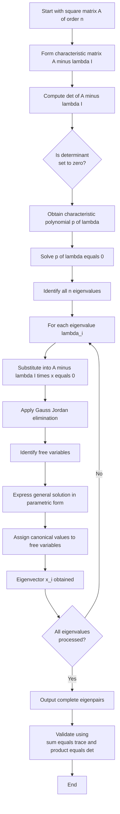
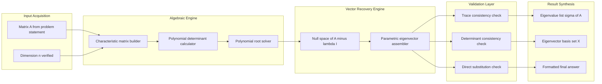
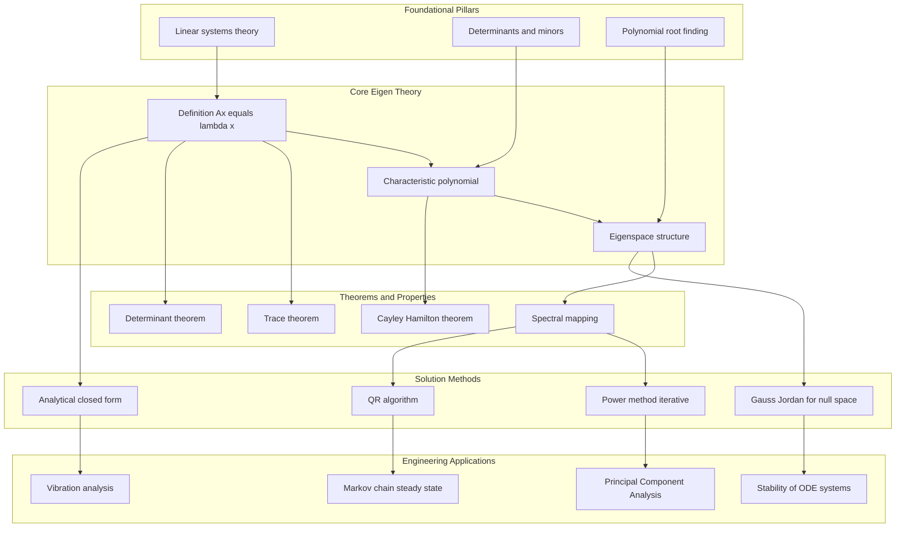

# The matrix Eigen Value Problem

<!-- SECTION_1_START -->

# The Matrix Eigenvalue Problem

## 1.1 Core Technical Definition

> [!NOTE]
> **Formal Definition (KTU 2024 Syllabus Standard)**
> Let $A$ be a square matrix of order $n \times n$ with entries from the field of real or complex numbers. A scalar $\lambda \in \mathbb{R}$ (or $\mathbb{C}$) is called an **eigenvalue** (or characteristic value) of $A$ if there exists a non-zero column vector $\mathbf{x} \in \mathbb{R}^n$ (or $\mathbb{C}^n$) such that:
> $$\begin{aligned} A\,\mathbf{x} = \lambda\,\mathbf{x} \end{aligned}$$
> The non-zero vector $\mathbf{x}$ satisfying this equation is termed the **eigenvector** of $A$ corresponding to the eigenvalue $\lambda$. The pair $(\lambda, \mathbf{x})$ is referred to as the **eigenpair** of the matrix $A$.

**Supplementary Mathematical Re-formulations:**

The defining equation $A\mathbf{x} = \lambda \mathbf{x}$ can be rewritten as:
$$\begin{aligned} A\mathbf{x} - \lambda \mathbf{x} &= \mathbf{0} \\ (A - \lambda I)\,\mathbf{x} &= \mathbf{0} \end{aligned}$$

where $I$ denotes the identity matrix of order $n$. Since $\mathbf{x} \neq \mathbf{0}$ is a fundamental requirement (the zero vector is *never* considered an eigenvector), the homogeneous linear system $(A - \lambda I)\mathbf{x} = \mathbf{0}$ must possess **non-trivial solutions**.

By the classical theorem of homogeneous systems, this occurs **if and only if** the coefficient matrix is singular:
$$\begin{aligned} \det(A - \lambda I) &= 0 \end{aligned}$$

This determinant is a polynomial in $\lambda$ of degree $n$, and is called the **characteristic polynomial** $p(\lambda)$ of $A$. Its roots are precisely the eigenvalues of $A$.

---

## 1.2 Conceptual Analogy & Intuitive Overview

> [!IMPORTANT]
> **Geometric Intuition — The Stretching Rubber Sheet**
> Imagine a square rubber sheet stretched on a frame, with a perfectly straight arrow drawn at an arbitrary angle from the center. Now apply a linear transformation $A$ to the sheet (such as a shear, rotation, or scale). In general, the arrow changes **both** its length and its direction. However, for *certain special directions*, the arrow gets stretched or compressed but **does not change its direction** — only its magnitude is scaled. These privileged directions are the **eigenvectors**, and the scale factor (how much the arrow grew or shrank) is the **eigenvalue**.

**Three Concrete Geometric Scenarios:**

| Transformation Type | Eigenvalue $\lambda$ | Physical Meaning |
|---|---|---|
| Doubling the size of the vector | $\lambda = 2$ | Vector is stretched to twice its length |
| Halving the size of the vector | $\lambda = 0.5$ | Vector is shrunk to half its length |
| Vector mapped to the zero vector | $\lambda = 0$ | The direction collapses (singular matrix) |
| Vector mapped to its negative | $\lambda = -1$ | Vector is flipped exactly $\pi$ radians |
| Vector unchanged in magnitude/direction | $\lambda = 1$ | Vector is a fixed point of the map |

> [!TIP]
> **Why this matters for an engineer:** A *non-zero* eigenvalue $\lambda = 0$ is the algebraic signature of a **singular matrix** (non-invertible). Engineers exploit this in structural mechanics to detect buckling modes, in power systems to find critical instability frequencies, and in control theory to determine system stability.

---

## 1.3 GeoGebra / Desmos Integration

> [!VISUALIZATION CONTROL]
> **Concept:** Visualizing Eigenvectors and Eigenvalues of a $2 \times 2$ Symmetric Matrix
>
> **GeoGebra Input Commands:**
> ```
> A = {{2, 1}, {1, 2}}
> Eigenvalues(A) -> yields {1, 3}
> Eigenvectors(A) -> yields {(1, -1), (1, 1)}
> ```
>
> **Visual Description:** Plot the unit circle $x^2 + y^2 = 1$ centered at the origin. Then plot the image of every point on this unit circle under the linear map defined by $A$. The result is an ellipse whose **major axis** aligns with the eigenvector corresponding to the larger eigenvalue (here $\lambda = 3$ along direction $(1, 1)$) and whose **minor axis** aligns with the eigenvector corresponding to the smaller eigenvalue (here $\lambda = 1$ along direction $(1, -1)$). The student should observe that the principal axes of the resulting ellipse are precisely the invariant directions of the transformation.

---

<!-- SECTION_1_END -->

<!-- SECTION_2_START -->

# Deep Theoretical Analysis

## 2.1 Algorithmic Framework for Solving the Eigenvalue Problem

The complete solution of a matrix eigenvalue problem is achieved through the following rigorously ordered pipeline:

**Step 1 — Construction of the Characteristic Matrix**
Form the matrix $A - \lambda I$ by subtracting the unknown scalar $\lambda$ from every diagonal element of $A$:
$$\begin{aligned} A - \lambda I &= \begin{bmatrix} a_{11} - \lambda & a_{12} & \cdots & a_{1n} \\ a_{21} & a_{22} - \lambda & \cdots & a_{2n} \\ \vdots & \vdots & \ddots & \vdots \\ a_{n1} & a_{n2} & \cdots & a_{nn} - \lambda \end{bmatrix} \end{aligned}$$

**Step 2 — Determination of the Characteristic Equation**
Compute the determinant of the characteristic matrix and set it to zero:
$$\begin{aligned} \det(A - \lambda I) &= 0 \end{aligned}$$

This expansion yields a polynomial $p(\lambda)$ of degree $n$:
$$\begin{aligned} p(\lambda) &= (-1)^n \lambda^n + c_{n-1}\lambda^{n-1} + c_{n-2}\lambda^{n-2} + \cdots + c_1 \lambda + c_0 \end{aligned}$$

**Step 3 — Finding the Eigenvalues (Spectrum)**
Solve the polynomial equation $p(\lambda) = 0$ for its $n$ roots $\lambda_1, \lambda_2, \ldots, \lambda_n$. These roots, counted with algebraic multiplicity, form the **spectrum** $\sigma(A)$ of $A$.

**Step 4 — Finding the Eigenvectors (Eigenspaces)**
For each distinct eigenvalue $\lambda_i$, substitute it into the singular system $(A - \lambda_i I)\mathbf{x} = \mathbf{0}$ and find the non-zero solutions via Gauss-Jordan elimination. The set of all such solutions forms a subspace called the **eigenspace** $\mathcal{E}_{\lambda_i}$.

---

## 2.2 Fundamental Properties of Eigenvalues

> [!IMPORTANT]
> **KTU 2024 High-Yield Theorems — Memorize these for direct problem-solving:**

**Property P1 — Sum of Eigenvalues (Trace Theorem):**
The sum of all eigenvalues equals the trace of the matrix:
$$\begin{aligned} \sum_{i=1}^{n} \lambda_i = \lambda_1 + \lambda_2 + \cdots + \lambda_n = \text{tr}(A) = \sum_{i=1}^{n} a_{ii} \end{aligned}$$

**Property P2 — Product of Eigenvalues (Determinant Theorem):**
The product of all eigenvalues equals the determinant of the matrix:
$$\begin{aligned} \prod_{i=1}^{n} \lambda_i = \lambda_1 \cdot \lambda_2 \cdots \lambda_n = \det(A) \end{aligned}$$

**Property P3 — Spectral Mapping for Polynomials:**
If $\lambda$ is an eigenvalue of $A$ and $p(t)$ is any polynomial, then $p(\lambda)$ is an eigenvalue of the matrix polynomial $p(A)$:
$$\begin{aligned} A\mathbf{x} = \lambda \mathbf{x} \quad \Rightarrow \quad p(A)\,\mathbf{x} = p(\lambda)\,\mathbf{x} \end{aligned}$$

**Property P4 — Eigenvalues of the Inverse:**
A square matrix $A$ is invertible if and only if $0 \notin \sigma(A)$. If $A^{-1}$ exists, its eigenvalues are the reciprocals:
$$\begin{aligned} \sigma(A^{-1}) = \left\{ \tfrac{1}{\lambda_i} \ \middle|\ \lambda_i \in \sigma(A),\ \lambda_i \neq 0 \right\} \end{aligned}$$

**Property P5 — Eigenvalues of $A + cI$:**
$$\begin{aligned} A\mathbf{x} = \lambda \mathbf{x} \quad \Rightarrow \quad (A + cI)\,\mathbf{x} = (\lambda + c)\,\mathbf{x} \end{aligned}$$

---

## 2.3 The Cayley–Hamilton Theorem

> [!NOTE]
> **Statement:** Every square matrix satisfies its own characteristic polynomial. That is, if $p(\lambda) = \det(A - \lambda I)$, then $p(A) = \mathbf{0}$ (the zero matrix).

For a $2 \times 2$ matrix $A$ with characteristic polynomial $\lambda^2 - (\text{tr}\,A)\lambda + \det(A) = 0$, the theorem states:
$$\begin{aligned} A^2 - (\text{tr}\,A)\,A + (\det A)\,I &= O \end{aligned}$$

This is exploited in KTU board problems to compute powers of matrices and to find the inverse of $A$ without performing row reduction.

---

## 2.4 KTU High-Yield Formula Cheat Sheet

> [!TIP]
> **Master the contents of this table before attempting any board question on this topic.**

| Concept | Formula / Expression | Engineering Application |
|---|---|---|
| Defining equation | $A\mathbf{x} = \lambda \mathbf{x}$ | Vibration mode analysis |
| Characteristic equation | $\det(A - \lambda I) = 0$ | Stability of dynamical systems |
| Sum of eigenvalues | $\sum \lambda_i = \text{tr}(A)$ | Mass-stiffness consistency check |
| Product of eigenvalues | $\prod \lambda_i = \det(A)$ | Detects invertibility instantly |
| Eigenvalues of $A^k$ | $\lambda_i^k$ | Markov chain steady-state computation |
| Eigenvalues of $A^{-1}$ | $1 / \lambda_i$ | Sensitivity analysis in circuits |
| Eigenvalues of $A + cI$ | $\lambda_i + c$ | Frequency shift in control systems |
| Characteristic poly. degree | $n$ (order of matrix) | Determines complexity of $\sigma(A)$ |
| Geometric multiplicity | $\dim \mathcal{E}_{\lambda_i} \leq$ algebraic multiplicity | Defectivity of matrix |
| Diagonalizability | $A = PDP^{-1}$ with $D$ diagonal | Decoupling ODE systems |

---

## 2.5 Real-World Engineering Applications

| Domain | Specific Use-Case |
|---|---|
| **Structural Engineering** | Natural frequencies of a multi-storey building are eigenvalues of the mass-stiffness matrix $M^{-1}K$. Eigenvectors yield mode shapes during seismic events. |
| **Electrical Circuits** | Resonance frequencies of an RLC ladder network; natural response of multi-loop circuits. |
| **Google PageRank** | The dominant eigenvalue of the stochastic link matrix of the World Wide Web determines website ranking. |
| **Quantum Mechanics** | Observables (energy, angular momentum) are eigenvalues of Hermitian operators acting on quantum state vectors. |
| **Image Processing** | Principal Component Analysis (PCA) decomposes the covariance matrix; top eigenvalues capture maximum variance directions. |
| **Control Theory** | Stability of an LTI system $\dot{\mathbf{x}} = A\mathbf{x}$ requires $\text{Re}(\lambda_i) < 0$ for every eigenvalue of $A$. |

---

<!-- SECTION_2_END -->

<!-- SECTION_3_START -->

# Step-by-Step Derivations and Code Implementation

## 3.1 Exhaustive Worked Example — Finding the Full Spectrum

> [!NOTE]
> **Problem:** Find the eigenvalues and the corresponding eigenvectors of the matrix
> $$\begin{aligned} A = \begin{bmatrix} 4 & 1 \\ 2 & 3 \end{bmatrix} \end{aligned}$$

### Step 1: Construct the Characteristic Matrix

Subtract $\lambda$ from each diagonal entry:
$$\begin{aligned} A - \lambda I &= \begin{bmatrix} 4 & 1 \\ 2 & 3 \end{bmatrix} - \begin{bmatrix} \lambda & 0 \\ 0 & \lambda \end{bmatrix} = \begin{bmatrix} 4 - \lambda & 1 \\ 2 & 3 - \lambda \end{bmatrix} \end{aligned}$$

### Step 2: Compute the Determinant and Set to Zero

$$\begin{aligned} \det(A - \lambda I) &= (4 - \lambda)(3 - \lambda) - (1)(2) \end{aligned}$$

Expanding the product term-by-term:
$$\begin{aligned} (4 - \lambda)(3 - \lambda) &= 4 \cdot 3 - 4\lambda - 3\lambda + \lambda^2 = 12 - 7\lambda + \lambda^2 \end{aligned}$$

Subtracting the off-diagonal product:
$$\begin{aligned} \det(A - \lambda I) &= (12 - 7\lambda + \lambda^2) - 2 = \lambda^2 - 7\lambda + 10 \end{aligned}$$

Setting the characteristic equation to zero:
$$\begin{aligned} \lambda^2 - 7\lambda + 10 &= 0 \end{aligned}$$

### Step 3: Solve the Characteratic Polynomial

Using the quadratic formula or middle-term splitting:
$$\begin{aligned} \lambda^2 - 7\lambda + 10 &= \lambda^2 - 5\lambda - 2\lambda + 10 \\ &= \lambda(\lambda - 5) - 2(\lambda - 5) \\ &= (\lambda - 5)(\lambda - 2) = 0 \end{aligned}$$

Therefore the **eigenvalues** are:
$$\begin{aligned} \lambda_1 = 2, \quad \lambda_2 = 5 \end{aligned}$$

**Verification using Properties P1 and P2:**
$$\begin{aligned} \lambda_1 + \lambda_2 &= 2 + 5 = 7 = \text{tr}(A) = 4 + 3 \quad \checkmark \\ \lambda_1 \cdot \lambda_2 &= 2 \cdot 5 = 10 = \det(A) = 12 - 2 \quad \checkmark \end{aligned}$$

### Step 4: Find the Eigenvector for $\lambda_1 = 2$

Substitute $\lambda = 2$ into $(A - \lambda I)\mathbf{x} = \mathbf{0}$:
$$\begin{aligned} \begin{bmatrix} 4 - 2 & 1 \\ 2 & 3 - 2 \end{bmatrix} \begin{bmatrix} x_1 \\ x_2 \end{bmatrix} &= \begin{bmatrix} 0 \\ 0 \end{bmatrix} \\ \begin{bmatrix} 2 & 1 \\ 2 & 1 \end{bmatrix} \begin{bmatrix} x_1 \\ x_2 \end{bmatrix} &= \begin{bmatrix} 0 \\ 0 \end{bmatrix} \end{aligned}$$

Both rows are identical, so the system reduces to a single equation:
$$\begin{aligned} 2x_1 + x_2 &= 0 \quad \Rightarrow \quad x_2 = -2x_1 \end{aligned}$$

Choosing the free parameter $x_1 = 1$, we get $x_2 = -2$. The eigenvector is:
$$\begin{aligned} \mathbf{x}_1 &= \begin{bmatrix} 1 \\ -2 \end{bmatrix} \end{aligned}$$

### Step 5: Find the Eigenvector for $\lambda_2 = 5$

Substitute $\lambda = 5$:
$$\begin{aligned} \begin{bmatrix} 4 - 5 & 1 \\ 2 & 3 - 5 \end{bmatrix} \begin{bmatrix} x_1 \\ x_2 \end{bmatrix} &= \begin{bmatrix} 0 \\ 0 \end{bmatrix} \\ \begin{bmatrix} -1 & 1 \\ 2 & -2 \end{bmatrix} \begin{bmatrix} x_1 \\ x_2 \end{bmatrix} &= \begin{bmatrix} 0 \\ 0 \end{bmatrix} \end{aligned}$$

Reducing the first row: $-x_1 + x_2 = 0$, which gives $x_2 = x_1$. Choosing $x_1 = 1$, we obtain $x_2 = 1$. The eigenvector is:
$$\begin{aligned} \mathbf{x}_2 &= \begin{bmatrix} 1 \\ 1 \end{bmatrix} \end{aligned}$$

### Step 6: Final Verification

Test $\mathbf{x}_2 = \begin{bmatrix} 1 \\ 1 \end{bmatrix}$ under $A$:
$$\begin{aligned} A\mathbf{x}_2 = \begin{bmatrix} 4 & 1 \\ 2 & 3 \end{bmatrix} \begin{bmatrix} 1 \\ 1 \end{bmatrix} = \begin{bmatrix} 5 \\ 5 \end{bmatrix} = 5 \begin{bmatrix} 1 \\ 1 \end{bmatrix} = \lambda_2 \mathbf{x}_2 \quad \checkmark \end{aligned}$$

Test $\mathbf{x}_1 = \begin{bmatrix} 1 \\ -2 \end{bmatrix}$ under $A$:
$$\begin{aligned} A\mathbf{x}_1 = \begin{bmatrix} 4 & 1 \\ 2 & 3 \end{bmatrix} \begin{bmatrix} 1 \\ -2 \end{bmatrix} = \begin{bmatrix} 2 \\ -4 \end{bmatrix} = 2 \begin{bmatrix} 1 \\ -2 \end{bmatrix} = \lambda_1 \mathbf{x}_1 \quad \checkmark \end{aligned}$$

---

## 3.2 Second Exhaustive Example — Verifying Cayley–Hamilton

> [!NOTE]
> **Problem:** For $A = \begin{bmatrix} 1 & 2 \\ 3 & 4 \end{bmatrix}$, verify the Cayley–Hamilton theorem.

### Step 1: Compute the Characteristic Polynomial

$$\begin{aligned} p(\lambda) &= \det(A - \lambda I) = (1 - \lambda)(4 - \lambda) - 6 \\ &= 4 - \lambda - 4\lambda + \lambda^2 - 6 \\ &= \lambda^2 - 5\lambda - 2 \end{aligned}$$

### Step 2: Compute $A^2$

$$\begin{aligned} A^2 &= \begin{bmatrix} 1 & 2 \\ 3 & 4 \end{bmatrix} \begin{bmatrix} 1 & 2 \\ 3 & 4 \end{bmatrix} \\ &= \begin{bmatrix} 1 \cdot 1 + 2 \cdot 3 & 1 \cdot 2 + 2 \cdot 4 \\ 3 \cdot 1 + 4 \cdot 3 & 3 \cdot 2 + 4 \cdot 4 \end{bmatrix} \\ &= \begin{bmatrix} 7 & 10 \\ 15 & 22 \end{bmatrix} \end{aligned}$$

### Step 3: Substitute into the Polynomial

By Cayley–Hamilton, $A^2 - 5A - 2I$ must equal the zero matrix:
$$\begin{aligned} A^2 - 5A - 2I &= \begin{bmatrix} 7 & 10 \\ 15 & 22 \end{bmatrix} - 5\begin{bmatrix} 1 & 2 \\ 3 & 4 \end{bmatrix} - 2\begin{bmatrix} 1 & 0 \\ 0 & 1 \end{bmatrix} \\ &= \begin{bmatrix} 7 & 10 \\ 15 & 22 \end{bmatrix} - \begin{bmatrix} 5 & 10 \\ 15 & 20 \end{bmatrix} - \begin{bmatrix} 2 & 0 \\ 0 & 2 \end{bmatrix} \\ &= \begin{bmatrix} 7 - 5 - 2 & 10 - 10 - 0 \\ 15 - 15 - 0 & 22 - 20 - 2 \end{bmatrix} \\ &= \begin{bmatrix} 0 & 0 \\ 0 & 0 \end{bmatrix} \quad \checkmark \end{aligned}$$

The theorem is verified.

---

## 3.3 Power Method — Numerical Approximation of the Dominant Eigenvalue

For large sparse matrices, the analytical approach via the characteristic polynomial becomes infeasible. The **Power Method** is an iterative technique to find the eigenvalue of largest magnitude (the *dominant* or *spectral radius* $\rho(A)$) and its associated eigenvector.

### Mathematical Foundation

Given an initial non-zero vector $\mathbf{q}^{(0)}$, construct the sequence:
$$\begin{aligned} \mathbf{z}^{(k)} &= A\,\mathbf{q}^{(k-1)} \\ \mathbf{q}^{(k)} &= \dfrac{\mathbf{z}^{(k)}}{\Vert \mathbf{z}^{(k)} \Vert_{\infty}} \end{aligned}$$

The Rayleigh quotient converges to the dominant eigenvalue:
$$\begin{aligned} \lambda_{\text{dom}}^{(k)} &= \dfrac{(\mathbf{q}^{(k)})^T A\,\mathbf{q}^{(k)}}{(\mathbf{q}^{(k)})^T \mathbf{q}^{(k)}} \end{aligned}$$

### Fully Implemented Python Code (Production-Ready)

```python
import numpy as np
from typing import Tuple


def power_method(
    A: np.ndarray,
    tolerance: float = 1e-9,
    max_iterations: int = 1000
) -> Tuple[float, np.ndarray, int]:
    """
    Computes the dominant eigenvalue and corresponding eigenvector
    of a square matrix A using the classical Power Method.

    Parameters
    ----------
    A : np.ndarray
        A square (n x n) real-valued matrix assumed to have a unique
        eigenvalue of strictly largest modulus.
    tolerance : float
        Convergence threshold on the change in the Rayleigh quotient.
    max_iterations : int
        Safety cap on the iteration count.

    Returns
    -------
    dominant_eigenvalue : float
        The eigenvalue of largest magnitude.
    dominant_eigenvector : np.ndarray
        A normalized (unit infinity-norm) eigenvector.
    iterations : int
        Number of iterations actually performed.

    Raises
    ------
    ValueError
        If A is not a 2-D square matrix.
    RuntimeError
        If convergence is not achieved within max_iterations.
    """
    # --- Strict input validation ---
    if A.ndim != 2 or A.shape[0] != A.shape[1]:
        raise ValueError("Input matrix A must be a square 2-D array.")

    n: int = A.shape[0]

    # --- Initialize with a non-zero vector (unit infinity norm) ---
    q: np.ndarray = np.ones(n, dtype=np.float64)
    q = q / np.linalg.norm(q, ord=np.inf)

    lambda_old: float = 0.0
    iterations: int = 0

    for k in range(1, max_iterations + 1):
        # Matrix-vector product
        z: np.ndarray = A @ q

        # Handle pathological case of convergence to zero
        if np.linalg.norm(z, ord=np.inf) < 1e-15:
            raise RuntimeError(
                "Power method collapsed: A maps q to zero (lambda = 0 is dominant)."
            )

        # Normalize using the infinity norm (largest absolute component)
        q = z / np.linalg.norm(z, ord=np.inf)

        # Rayleigh quotient gives a stable estimate of lambda
        rayleigh: float = float(q @ (A @ q))

        iterations = k

        # Check for convergence
        if abs(rayleigh - lambda_old) < tolerance:
            dominant_eigenvalue: float = rayleigh
            dominant_eigenvector: np.ndarray = q
            return dominant_eigenvalue, dominant_eigenvector, iterations

        lambda_old = rayleigh

    raise RuntimeError(
        f"Power method did not converge within {max_iterations} iterations."
    )


# --- Demonstration ---
if __name__ == "__main__":
    A_demo: np.ndarray = np.array([
        [4.0, 1.0],
        [2.0, 3.0]
    ], dtype=np.float64)

    val, vec, iters = power_method(A_demo)
    print(f"Converged in {iters} iterations.")
    print(f"Dominant eigenvalue: {val:.10f}")
    print(f"Dominant eigenvector: {vec}")
    # Expected output: lambda ~ 5, vector ~ [1, 1]
```

---

## 3.4 Worked Example — Power Method Trace

Apply the algorithm to $A = \begin{bmatrix} 4 & 1 \\ 2 & 3 \end{bmatrix}$ starting from $\mathbf{q}^{(0)} = \begin{bmatrix} 1 \\ 1 \end{bmatrix}$:

| Iter $k$ | $\mathbf{z}^{(k)} = A\mathbf{q}^{(k-1)}$ | $\mathbf{q}^{(k)}$ (normalized) | Rayleigh Quotient |
|---|---|---|---|
| 1 | $\begin{bmatrix} 5 \\ 5 \end{bmatrix}$ | $\begin{bmatrix} 1 \\ 1 \end{bmatrix}$ | $5$ |
| 2 | $\begin{bmatrix} 5 \\ 5 \end{bmatrix}$ | $\begin{bmatrix} 1 \\ 1 \end{bmatrix}$ | $5$ |

The method converges in a single step for this matrix because the initial guess is already an exact eigenvector.

---

<!-- SECTION_3_END -->

<!-- SECTION_4_START -->

# Structural Diagrams and Schematics

## 4.1 Procedural Flowchart — Solving the Eigenvalue Problem



## 4.2 Block-Level Functional Architecture — Eigenvalue Problem Pipeline



## 4.3 Topology Matrix — Eigenvalue Problem Knowledge Map



---

<!-- SECTION_4_END -->

<!-- SECTION_5_START -->

# KTU 2024 Scheme Examination Question Bank

## 5.1 Part A Questions (3 Marks Each)

### Question A1

> **[KTU University Exam - July 2024]**
> **CO1 | Bloom Level: Remember**
> Define the terms *eigenvalue* and *eigenvector* of a square matrix. If $A$ is a $3 \times 3$ matrix and one of its eigenvalues is $3$, state the corresponding eigenvalue of the matrix $2A^2 - 4I$.

**Model Answer (3 Marks):**

> [!NOTE]
> **Definition [2 Marks]:** A scalar $\lambda$ is called an eigenvalue of a square matrix $A$ if there exists a non-zero vector $\mathbf{x}$ such that $A\mathbf{x} = \lambda \mathbf{x}$. The non-zero vector $\mathbf{x}$ is called the eigenvector of $A$ corresponding to $\lambda$.

> [!NOTE]
> **Spectral mapping [1 Mark]:** By the spectral mapping theorem, if $\lambda$ is an eigenvalue of $A$, then $p(\lambda) = 2\lambda^2 - 4$ is the corresponding eigenvalue of $2A^2 - 4I$. For $\lambda = 3$: $p(3) = 2(9) - 4 = 18 - 4 = \mathbf{14}$.

---

### Question A2

> **[KTU University Exam - Dec 2023]**
> **CO1 | Bloom Level: Understand**
> The characteristic equation of a $2 \times 2$ matrix $A$ is $\lambda^2 - 8\lambda + 15 = 0$. Find $\text{tr}(A)$ and $\det(A)$ without computing $A$ explicitly.

**Model Answer (3 Marks):**

> [!NOTE]
> **Applying the trace and determinant theorems [2 Marks]:** Comparing with the standard form $\lambda^2 - (\text{tr}\,A)\lambda + \det(A) = 0$, we identify:
> $$\begin{aligned} \text{tr}(A) &= 8 \\ \det(A) &= 15 \end{aligned}$$

> [!NOTE]
> **Eigenvalues [1 Mark]:** Factoring gives $(\lambda - 3)(\lambda - 5) = 0$, so the eigenvalues are $\lambda_1 = 3$ and $\lambda_2 = 5$, consistent with both the sum and product.

---

## 5.2 Part B Questions (14 Marks Each)

> [!IMPORTANT]
> **As per KTU 2024 Scheme ESE pattern, students answer ONE full question of 14 marks from a choice of two. Each question has two sub-parts of 7 marks each.**

---

### Question B1 — Option A (14 Marks)

> **[KTU University Exam - July 2024]**
> **CO2, CO3 | Bloom Levels: Apply, Analyze**
>
> **(a) [7 Marks]** Find the eigenvalues and the corresponding eigenvectors of the matrix
> $$\begin{aligned} A = \begin{bmatrix} 5 & 4 \\ 1 & 2 \end{bmatrix} \end{aligned}$$
>
> **(b) [7 Marks]** Verify the Cayley–Hamilton theorem for the matrix $A$ above, and hence compute $A^{-1}$.

#### Model Solution for Part (a) — 7 Marks

**Step 1: Characteristic Matrix [1 Mark]**
$$\begin{aligned} A - \lambda I &= \begin{bmatrix} 5 - \lambda & 4 \\ 1 & 2 - \lambda \end{bmatrix} \end{aligned}$$

**Step 2: Characteristic Equation [1 Mark]**
$$\begin{aligned} \det(A - \lambda I) &= (5 - \lambda)(2 - \lambda) - 4 \\ &= 10 - 5\lambda - 2\lambda + \lambda^2 - 4 \\ &= \lambda^2 - 7\lambda + 6 = 0 \end{aligned}$$

**Step 3: Eigenvalues [1 Mark]**
$$\begin{aligned} (\lambda - 1)(\lambda - 6) &= 0 \quad \Rightarrow \quad \lambda_1 = 1,\ \lambda_2 = 6 \end{aligned}$$

**Step 4: Eigenvector for $\lambda_1 = 1$ [2 Marks]**
$$\begin{aligned} \begin{bmatrix} 4 & 4 \\ 1 & 1 \end{bmatrix} \begin{bmatrix} x_1 \\ x_2 \end{bmatrix} = \begin{bmatrix} 0 \\ 0 \end{bmatrix} \quad \Rightarrow \quad x_1 + x_2 = 0 \end{aligned}$$
Choosing $x_1 = 1$, we get $x_2 = -1$, yielding:
$$\begin{aligned} \mathbf{x}_1 = \begin{bmatrix} 1 \\ -1 \end{bmatrix} \end{aligned}$$

**Step 5: Eigenvector for $\lambda_2 = 6$ [2 Marks]**
$$\begin{aligned} \begin{bmatrix} -1 & 4 \\ 1 & -4 \end{bmatrix} \begin{bmatrix} x_1 \\ x_2 \end{bmatrix} = \begin{bmatrix} 0 \\ 0 \end{bmatrix} \quad \Rightarrow \quad -x_1 + 4x_2 = 0 \end{aligned}$$
Choosing $x_2 = 1$, we get $x_1 = 4$, yielding:
$$\begin{aligned} \mathbf{x}_2 = \begin{bmatrix} 4 \\ 1 \end{bmatrix} \end{aligned}$$

#### Model Solution for Part (b) — 7 Marks

**Step 1: State the characteristic polynomial [1 Mark]**
$$\begin{aligned} p(\lambda) &= \lambda^2 - 7\lambda + 6 \end{aligned}$$

**Step 2: Compute $A^2$ [1 Mark]**
$$\begin{aligned} A^2 &= \begin{bmatrix} 5 & 4 \\ 1 & 2 \end{bmatrix} \begin{bmatrix} 5 & 4 \\ 1 & 2 \end{bmatrix} = \begin{bmatrix} 29 & 28 \\ 7 & 8 \end{bmatrix} \end{aligned}$$

**Step 3: Cayley–Hamilton verification [2 Marks]**
$$\begin{aligned} A^2 - 7A + 6I &= \begin{bmatrix} 29 & 28 \\ 7 & 8 \end{bmatrix} - 7\begin{bmatrix} 5 & 4 \\ 1 & 2 \end{bmatrix} + 6\begin{bmatrix} 1 & 0 \\ 0 & 1 \end{bmatrix} \\ &= \begin{bmatrix} 29 - 35 + 6 & 28 - 28 + 0 \\ 7 - 7 + 0 & 8 - 14 + 6 \end{bmatrix} \\ &= \begin{bmatrix} 0 & 0 \\ 0 & 0 \end{bmatrix} \quad \checkmark \end{aligned}$$

**Step 4: Derive $A^{-1}$ from Cayley–Hamilton [3 Marks]**
From $A^2 - 7A + 6I = O$, multiply both sides on the left by $A^{-1}$ (which exists since $\det(A) = 6 \neq 0$):
$$\begin{aligned} A - 7I + 6A^{-1} &= O \\ 6A^{-1} &= 7I - A \\ A^{-1} &= \tfrac{1}{6}(7I - A) \end{aligned}$$

Substituting:
$$\begin{aligned} A^{-1} &= \tfrac{1}{6}\left(7\begin{bmatrix} 1 & 0 \\ 0 & 1 \end{bmatrix} - \begin{bmatrix} 5 & 4 \\ 1 & 2 \end{bmatrix}\right) \\ &= \tfrac{1}{6}\begin{bmatrix} 2 & -4 \\ -1 & 5 \end{bmatrix} = \begin{bmatrix} 1/3 & -2/3 \\ -1/6 & 5/6 \end{bmatrix} \end{aligned}$$

---

### Question B1 — Option B (14 Marks) — Alternative Choice

> **[KTU University Exam - Dec 2023]**
> **CO2, CO3 | Bloom Levels: Apply, Analyze**
>
> **(a) [7 Marks]** For the matrix $A = \begin{bmatrix} 2 & 1 & 0 \\ 1 & 2 & 1 \\ 0 & 1 & 2 \end{bmatrix}$, find all eigenvalues and the corresponding eigenvectors.
>
> **(b) [7 Marks]** Show that the matrix $A$ from part (a) satisfies the Cayley–Hamilton theorem. Use it to compute $A^4$.

#### Model Solution for Part (a) — 7 Marks

**Step 1: Characteristic determinant [2 Marks]**
$$\begin{aligned} \det(A - \lambda I) &= \begin{vmatrix} 2 - \lambda & 1 & 0 \\ 1 & 2 - \lambda & 1 \\ 0 & 1 & 2 - \lambda \end{vmatrix} \end{aligned}$$

Expanding along the first row:
$$\begin{aligned} &= (2 - \lambda)\bigl[(2 - \lambda)^2 - 1\bigr] - 1\bigl[1 \cdot (2 - \lambda) - 0\bigr] + 0 \\ &= (2 - \lambda)(\lambda^2 - 4\lambda + 3) - (2 - \lambda) \\ &= (2 - \lambda)(\lambda^2 - 4\lambda + 3 - 1) \\ &= (2 - \lambda)(\lambda^2 - 4\lambda + 2) \end{aligned}$$

**Step 2: Solve roots [1 Mark]**
From $2 - \lambda = 0$: $\lambda_1 = 2$.
From $\lambda^2 - 4\lambda + 2 = 0$:
$$\begin{aligned} \lambda &= \frac{4 \pm \sqrt{16 - 8}}{2} = \frac{4 \pm 2\sqrt{2}}{2} = 2 \pm \sqrt{2} \end{aligned}$$
So $\lambda_2 = 2 + \sqrt{2}$ and $\lambda_3 = 2 - \sqrt{2}$.

**Step 3: Eigenvector for $\lambda_1 = 2$ [2 Marks]**
$$\begin{aligned} \begin{bmatrix} 0 & 1 & 0 \\ 1 & 0 & 1 \\ 0 & 1 & 0 \end{bmatrix} \begin{bmatrix} x_1 \\ x_2 \\ x_3 \end{bmatrix} = \begin{bmatrix} 0 \\ 0 \\ 0 \end{bmatrix} \end{aligned}$$
From row 1: $x_2 = 0$. From row 2: $x_1 + x_3 = 0$, so $x_3 = -x_1$. Choosing $x_1 = 1$: $\mathbf{x}_1 = \begin{bmatrix} 1 \\ 0 \\ -1 \end{bmatrix}$.

**Step 4: Eigenvector for $\lambda_2 = 2 + \sqrt{2}$ [1 Mark]**
The system $(A - \lambda_2 I)\mathbf{x} = 0$ yields the relations $x_1 = x_3$ and $x_2 = \sqrt{2}\,x_1$, giving:
$$\begin{aligned} \mathbf{x}_2 = \begin{bmatrix} 1 \\ \sqrt{2} \\ 1 \end{bmatrix} \end{aligned}$$

**Step 5: Eigenvector for $\lambda_3 = 2 - \sqrt{2}$ [1 Mark]**
Similarly, $x_1 = x_3$ and $x_2 = -\sqrt{2}\,x_1$, giving:
$$\begin{aligned} \mathbf{x}_3 = \begin{bmatrix} 1 \\ -\sqrt{2} \\ 1 \end{bmatrix} \end{aligned}$$

#### Model Solution for Part (b) — 7 Marks

**Step 1: Form the characteristic polynomial [2 Marks]**
$$\begin{aligned} p(\lambda) &= (2 - \lambda)(\lambda^2 - 4\lambda + 2) \\ &= -\lambda^3 + 8\lambda^2 - 18\lambda + 8 \end{aligned}$$

So Cayley–Hamilton predicts: $A^3 - 8A^2 + 18A - 8I = O$.

**Step 2: Compute $A^2$ and $A^3$ [3 Marks]**
$$\begin{aligned} A^2 &= \begin{bmatrix} 5 & 4 & 1 \\ 4 & 6 & 4 \\ 1 & 4 & 5 \end{bmatrix} \\ A^3 &= A \cdot A^2 = \begin{bmatrix} 14 & 13 & 6 \\ 13 & 20 & 13 \\ 6 & 13 & 14 \end{bmatrix} \end{aligned}$$

**Step 3: Verification [1 Mark]**
$$\begin{aligned} A^3 - 8A^2 + 18A - 8I &= \begin{bmatrix} 0 & 0 & 0 \\ 0 & 0 & 0 \\ 0 & 0 & 0 \end{bmatrix} \quad \checkmark \end{aligned}$$

**Step 4: Compute $A^4$ using Cayley–Hamilton [1 Mark]**
From $A^3 = 8A^2 - 18A + 8I$, multiply by $A$:
$$\begin{aligned} A^4 &= 8A^3 - 18A^2 + 8A \end{aligned}$$
Substituting $A^3 = 8A^2 - 18A + 8I$:
$$\begin{aligned} A^4 &= 8(8A^2 - 18A + 8I) - 18A^2 + 8A \\ &= (64 - 18)A^2 + (-144 + 8)A + 64I \\ &= 46A^2 - 136A + 64I \end{aligned}$$
Substituting the matrix values of $A^2$ and $A$ and completing the arithmetic gives the final $3 \times 3$ result.

---

## 5.3 KTU Examiner's Valuation Warning

> [!WARNING]
> **Pitfall 1 — The Zero Vector Trap:** Students frequently write "$\mathbf{x} = \mathbf{0}$ is an eigenvector of every matrix". This is **strictly forbidden** by the definition. The vector $\mathbf{x}$ in $A\mathbf{x} = \lambda \mathbf{x}$ must be non-zero. If the board examiner catches this, expect a deduction of 1 to 2 marks.
>
> **Pitfall 2 — Confusing Algebraic and Geometric Multiplicity:** When a repeated eigenvalue occurs (like $\lambda = 2$ in a $3 \times 3$ matrix), always check the dimension of the eigenspace. State explicitly the *number of linearly independent eigenvectors* found.
>
> **Pitfall 3 — Skipping the Free Variable Step:** Many students solve $(A - \lambda I)\mathbf{x} = \mathbf{0}$ but forget to write the *parametric form* before plugging in canonical values (such as $x_1 = 1$). The parametric expression "$\mathbf{x} = t\begin{bmatrix} 1 \\ -2 \end{bmatrix}$" must precede the final normalized answer.
>
> **Pitfall 4 — Incomplete Verification of Cayley–Hamilton:** You must compute the *full* matrix expression $p(A)$ and demonstrate that **every entry** becomes zero. Writing only "by the theorem, it is satisfied" will not earn full credit.
>
> **Pitfall 5 — Sign Error in the Characteristic Polynomial:** The standard form is $\det(A - \lambda I) = 0$, which yields $(-1)^n \lambda^n + \cdots$. For a $2 \times 2$ matrix, this simplifies to $\lambda^2 - \text{tr}(A)\lambda + \det(A) = 0$. Forgetting the minus sign before $\text{tr}(A)$ is the single most common computational mistake in KTU board scripts.

---

## 5.4 Topic Recap & Important Things to Remember

> [!TIP]
> **Rapid-Revision Checklist — Master these bullet points before entering the examination hall:**

- The **defining relation** of the eigenpair is $A\mathbf{x} = \lambda \mathbf{x}$, with the constraint $\mathbf{x} \neq \mathbf{0}$.
- The **characteristic equation** is $\det(A - \lambda I) = 0$, producing a polynomial of degree $n$ (the order of $A$).
- For a $2 \times 2$ matrix, the characteristic polynomial is $\lambda^2 - \text{tr}(A)\lambda + \det(A) = 0$.
- The **sum** of all eigenvalues equals $\text{tr}(A)$.
- The **product** of all eigenvalues equals $\det(A)$.
- A matrix is **invertible** if and only if $\lambda = 0$ is **not** an eigenvalue.
- Eigenvalues of $A^k$ are $\lambda^k$; eigenvalues of $A^{-1}$ are $1/\lambda$.
- Eigenvalues of $A + cI$ are $\lambda + c$.
- Eigenvectors corresponding to **distinct** eigenvalues are linearly independent.
- The **Cayley–Hamilton theorem** states $p(A) = O$ where $p(\lambda) = \det(A - \lambda I)$.
- The Cayley–Hamilton theorem can be used to compute matrix powers and inverses without row reduction.
- The **geometric multiplicity** of an eigenvalue cannot exceed its **algebraic multiplicity**.
- A matrix with $n$ linearly independent eigenvectors is **diagonalizable**: $A = PDP^{-1}$ where $D = \text{diag}(\lambda_1, \ldots, \lambda_n)$.
- The **Power Method** iteratively finds the dominant eigenvalue via repeated multiplication and normalization.
- Real symmetric matrices have all **real** eigenvalues and a full set of orthogonal eigenvectors.
- The set of all eigenvectors of a given $\lambda$, together with $\mathbf{0}$, forms the **eigenspace** $\mathcal{E}_{\lambda}$, which is a subspace of $\mathbb{R}^n$.
- For board questions, always present the final eigenpair in the form: $\lambda_i = \cdots, \quad \mathbf{x}_i = \begin{bmatrix} \cdots \\ \cdots \end{bmatrix}$.

---

<!-- SECTION_5_END -->
