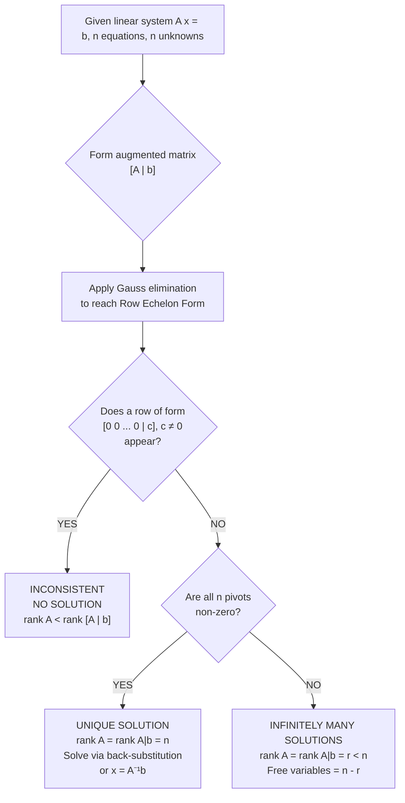
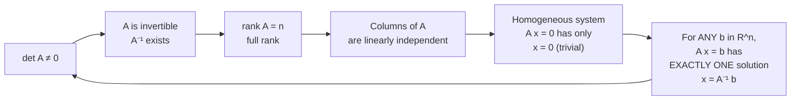
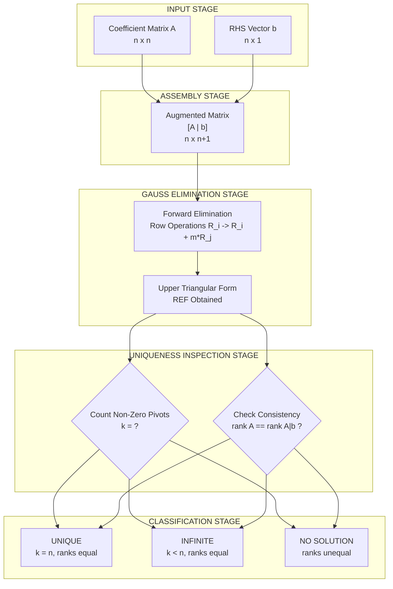
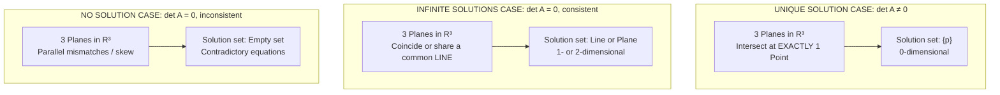
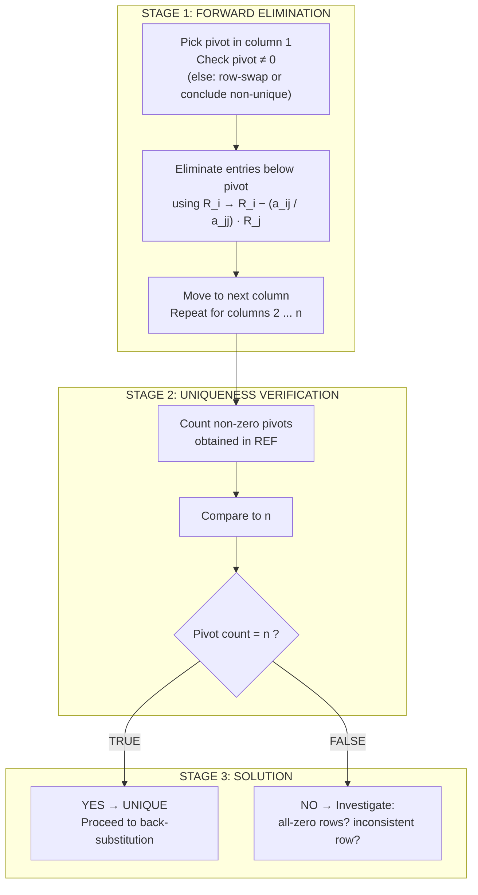

# Uniqueness (without proof)

<!-- SECTION_1_START -->
# Uniqueness of Solutions in Linear Systems

## 1. Core Technical Definition (KTU 2024 Syllabus Terminology)

> [!IMPORTANT]
> **Uniqueness Theorem (Linear Systems)**
> A system of $n$ linear equations in $n$ unknowns, written in matrix form as
> $$A\mathbf{x} = \mathbf{b}$$
> where $A \in \mathbb{R}^{n \times n}$, $\mathbf{x} \in \mathbb{R}^{n}$, $\mathbf{b} \in \mathbb{R}^{n}$, possesses a **unique solution** if and only if the coefficient matrix $A$ is **non-singular**, i.e., $\det(A) \neq 0$, equivalently $A^{-1}$ exists, equivalently $\text{rank}(A) = n$.

### Equivalent Uniqueness Conditions

> [!NOTE]
> The following four statements are **logically equivalent** for an $n \times n$ system $A\mathbf{x} = \mathbf{b}$:
>
> 1. $\det(A) \neq 0$ (the matrix $A$ is invertible).
> 2. The columns of $A$ are **linearly independent**.
> 3. The rank condition: $\text{rank}(A) = \text{rank}([A \mid \mathbf{b}]) = n$.
> 4. The homogeneous system $A\mathbf{x} = \mathbf{0}$ admits only the **trivial solution** $\mathbf{x} = \mathbf{0}$.

The unique solution is then computed explicitly as:
$$\mathbf{x} = A^{-1}\mathbf{b}$$

---

## 2. Conceptual Analogy / Intuition

> [!TIP]
> **Real-World Analogy — A Lock and a Unique Key**
> Imagine a system of linear equations as a **combination lock**:
> - The matrix $A$ encodes the **gear ratios / combination structure** of the lock.
> - The vector $\mathbf{b}$ is the **final output** (e.g., the lock clicking open).
> - The vector $\mathbf{x}$ is the **sequence of dial turns** (the unknowns).
>
> **Unique solution** ⟺ there is **exactly one sequence of turns** that opens the lock. This happens only when the gear structure is "rigid" — no slack, no redundant wheels. The moment a gear becomes dependent on another (i.e., a row becomes a linear combination of others), the lock can be opened in **infinitely many ways** (or not at all).

**Geometric Intuition (for $2 \times 2$ and $3 \times 3$ systems):**
- Two lines in $\mathbb{R}^{2}$: unique intersection ⟺ the lines are **not parallel** and not coincident.
- Three planes in $\mathbb{R}^{3}$: unique intersection point ⟺ planes meet at **exactly one point** — none are parallel, none coincide, none are parallel along a common line.
- In general: a **full-dimensional** coefficient matrix (full rank) is required for the solution space to collapse to a single point.

> [!WARNING]
> **KTU Common Misconception:** Students often think that having a "consistent" system (i.e., at least one solution) automatically means the solution is unique. **Consistency ≠ Uniqueness.** Consistency only requires $\text{rank}(A) = \text{rank}([A \mid \mathbf{b}])$. Uniqueness additionally requires this common rank to equal the number of unknowns $n$.

---

## 3. Uniqueness in the Context of Gauss Elimination

In the Gauss elimination procedure, **uniqueness is detected by inspecting the pivot positions** of the row-echelon form (REF) of the augmented matrix $[A \mid \mathbf{b}]$.

> [!IMPORTANT]
> **Pivot Test for Uniqueness (Gauss Elimination Criterion)**
> The system $A\mathbf{x} = \mathbf{b}$ has a **unique solution** if and only if, after performing Gauss elimination, the resulting upper triangular matrix has **exactly $n$ non-zero pivots** (one in each row, after handling any row interchanges). Equivalently, no row of the form $[0 \;\; 0 \;\; \cdots \;\; 0 \mid c]$ with $c \neq 0$ appears, and no row of the form $[0 \;\; 0 \;\; \cdots \;\; 0 \mid 0]$ is present in the reduced form.

This criterion gives a clean three-way classification:

| Condition after Row Reduction | Meaning | Solution Count |
|---|---|---|
| $n$ non-zero pivots, $\text{rank}(A) = \text{rank}([A \mid \mathbf{b}]) = n$ | Unique solution exists | **Exactly 1** |
| $r < n$ pivots, $\text{rank}(A) = \text{rank}([A \mid \mathbf{b}]) = r < n$ | Underdetermined | **Infinitely many** (free variables = $n - r$) |
| A row $[0 \; 0 \; \cdots \; 0 \mid c], \; c \neq 0$ appears | Overdetermined / inconsistent | **No solution** |

> [!VISUALIZATION CONTROL]
> **Concept:** Geometric view of uniqueness for $2 \times 2$ and $3 \times 3$ linear systems.
> **GeoGebra / Desmos Input Equations (2D case):**
> * `Line 1: 2x + 3y = 7`  →  `2x + 3y - 7 = 0`
> * `Line 2: 4x - y = 5`  →  `4x - y - 5 = 0`
> **Visual Description:** Two non-parallel lines intersecting at exactly one point (unique solution). If the second equation were `4x + 6y = 14` (a scalar multiple of line 1), the lines would coincide, giving infinitely many intersection points — violating uniqueness.
<!-- SECTION_1_END -->

<!-- SECTION_2_START -->
# Deep Theoretical Analysis & KTU High-Yield Formula Sheet

## 1. Structural Analysis of the Uniqueness Condition

### The Three Fundamental Questions About $A\mathbf{x} = \mathbf{b}$

When given a linear system, the mathematician's first task is to determine:

1. **Existence:** Does a solution exist at all?
2. **Uniqueness:** If a solution exists, is it the only one?
3. **Construction:** If unique, how do we compute it?

This module focuses on **Question 2**, assuming existence has been verified (or in tandem with the Gauss elimination algorithm that addresses all three).

### Why Determinant $\neq 0$ Guarantees Uniqueness

> [!NOTE]
> **Logical Chain (no formal proof required, but understanding is tested):**
> 
> $\det(A) \neq 0$
> $\;\Longleftrightarrow\;$ A is invertible (has full rank $n$)
> $\;\Longleftrightarrow\;$ The linear map $\mathbf{x} \mapsto A\mathbf{x}$ is a **bijection** on $\mathbb{R}^{n}$
> $\;\Longleftrightarrow\;$ For every $\mathbf{b} \in \mathbb{R}^{n}$, the equation $A\mathbf{x} = \mathbf{b}$ has **exactly one** preimage $\mathbf{x} = A^{-1}\mathbf{b}$.

The bijective nature of the map means:
- **Injectivity** (one-to-one) eliminates the possibility of multiple solutions.
- **Surjectivity** (onto) eliminates the possibility of no solutions.

Both together ⟹ **uniqueness**.

### Uniqueness in Homogeneous vs. Non-Homogeneous Systems

| System Type | Form | Uniqueness Condition | Consequence |
|---|---|---|---|
| **Homogeneous** | $A\mathbf{x} = \mathbf{0}$ | $\det(A) \neq 0$ (equivalently, $\text{rank}(A) = n$) | The **only** solution is $\mathbf{x} = \mathbf{0}$ (trivial). |
| **Non-homogeneous** | $A\mathbf{x} = \mathbf{b}, \; \mathbf{b} \neq \mathbf{0}$ | $\det(A) \neq 0$ (equivalently, $\text{rank}(A) = \text{rank}([A \mid \mathbf{b}]) = n$) | Exactly one solution $\mathbf{x} = A^{-1}\mathbf{b}$. |

> [!TIP]
> **Memorize this hierarchy:** For a non-homogeneous system, if the corresponding homogeneous system $A\mathbf{x} = \mathbf{0}$ has only the trivial solution (i.e., $A$ is invertible), then the non-homogeneous system $A\mathbf{x} = \mathbf{b}$ is **automatically** consistent **and** has a unique solution for **every** $\mathbf{b}$. This is because surjectivity is a property of $A$ alone, independent of $\mathbf{b}$.

---

## 2. KTU High-Yield Formula Sheet

| # | Formula / Statement | Symbol | Engineering Application |
|---|---|---|---|
| 1 | Uniqueness criterion (non-homogeneous) | $\text{rank}(A) = \text{rank}([A \mid \mathbf{b}]) = n$ | Circuit analysis (Kirchhoff's laws) — unique node voltages/branch currents |
| 2 | Uniqueness criterion (homogeneous) | $A\mathbf{x} = \mathbf{0} \Rightarrow \mathbf{x} = \mathbf{0} \iff \det(A) \neq 0$ | Vibration analysis — trivial zero-displacement solution iff system is non-resonant |
| 3 | Closed-form unique solution | $\mathbf{x} = A^{-1}\mathbf{b}$ | Control systems — state feedback gains |
| 4 | Equivalence: invertibility | $\det(A) \neq 0 \iff A^{-1} \text{ exists}$ | Stability of dynamical systems (eigenvalue placement) |
| 5 | Equivalence: full rank | $\det(A) \neq 0 \iff \text{rank}(A) = n$ | Image processing — full-rank pixel transformation matrices |
| 6 | Equivalence: column independence | $\det(A) \neq 0 \iff$ columns of $A$ are linearly independent | Signal processing — independent basis functions |
| 7 | Free variables count (non-unique case) | Free variables $= n - \text{rank}(A)$ | Structural analysis — degrees of indeterminacy |
| 8 | Cramer's rule (unique case only) | $x_i = \frac{\det(A_i)}{\det(A)}$ | Specialized small-scale circuit problems |
| 9 | Condition for no solution | $\text{rank}(A) < \text{rank}([A \mid \mathbf{b}])$ | Detecting physical impossibility in a system |
| 10 | Gauss elimination pivot test | All $n$ pivots non-zero in REF | Algorithm design — LU decomposition validity |

> [!IMPORTANT]
> **Note on units / dimensions:** The determinant of an $n \times n$ matrix with entries having units of $\alpha$ has units of $\alpha^n$. The relation $\mathbf{x} = A^{-1}\mathbf{b}$ must be dimensionally consistent: if $A$ has units of $U_A$ per element, then $A^{-1}$ has units of $U_A^{-1}$ and $\mathbf{x}$ inherits the units of $U_A^{-1} \cdot \mathbf{b}$.

---

## 3. Real-World Engineering Utility

| Engineering Field | Application of Uniqueness Theorem |
|---|---|
| **Electrical Circuit Analysis** | Applying Kirchhoff's Voltage and Current Laws (KVL/KCL) at $n$ nodes gives a linear system $A\mathbf{v} = \mathbf{b}$. A unique voltage vector $\mathbf{v}$ exists iff $\det(A) \neq 0$ — this fails precisely when two loops yield identical equations (a redundant constraint) or when the network is open-circuited in a critical way. |
| **Structural Engineering** | Truss analysis produces systems $K\mathbf{u} = \mathbf{F}$ (stiffness matrix $\times$ displacement = force). Uniqueness of displacements requires $K$ to be non-singular, i.e., the structure is **statically determinate** and properly supported. |
| **Signal Processing** | Channel equalization: $\mathbf{y} = H\mathbf{x}$ (received signal = channel $\times$ transmitted). Unique recovery of $\mathbf{x}$ requires $\det(H) \neq 0$. |
| **Control Systems** | State-space controllability: a system $\dot{\mathbf{x}} = A\mathbf{x} + B\mathbf{u}$ is controllable iff the controllability matrix $[B \; AB \; A^2 B \; \cdots]$ has full row rank. |
| **Power Systems** | Load flow analysis: unique bus voltages are guaranteed only if the Jacobian matrix in the Newton-Raphson iteration is non-singular at each step. |
| **Computer Graphics** | Camera projection matrices: a $3 \times 3$ homography is invertible iff the camera configuration is non-degenerate (no parallel image and object planes). |

> [!TIP]
> In **every** engineering discipline where physical laws translate into linear equations — electromagnetic field discretization, heat conduction, fluid flow networks, economic input-output models — the **uniqueness theorem** is the gatekeeper that tells you whether your mathematical model has a well-defined, meaningful answer.
<!-- SECTION_2_END -->

<!-- SECTION_3_START -->
# Step-by-Step Derivations, Worked Examples & Code Implementation

## 1. Worked Example 1 — Verifying Uniqueness via Determinant

### Problem
Determine whether the following system has a unique solution. If yes, compute it.
$$
\begin{aligned}
2x_1 + 3x_2 - x_3 &= 5 \\
4x_1 + 4x_2 - 3x_3 &= 3 \\
-2x_1 + 3x_2 + x_3 &= -1
\end{aligned}
$$

### Step 1: Form the Coefficient Matrix and Compute $\det(A)$
$$
A = \begin{bmatrix} 2 & 3 & -1 \\ 4 & 4 & -3 \\ -2 & 3 & 1 \end{bmatrix}
$$

Expanding along the first row:
$$
\det(A) = 2 \cdot \begin{vmatrix} 4 & -3 \\ 3 & 1 \end{vmatrix} - 3 \cdot \begin{vmatrix} 4 & -3 \\ -2 & 1 \end{vmatrix} + (-1) \cdot \begin{vmatrix} 4 & 4 \\ -2 & 3 \end{vmatrix}
$$

$$
\begin{aligned}
\det(A) &= 2 \cdot (4 \cdot 1 - (-3) \cdot 3) - 3 \cdot (4 \cdot 1 - (-3) \cdot (-2)) + (-1) \cdot (4 \cdot 3 - 4 \cdot (-2)) \\
&= 2 \cdot (4 + 9) - 3 \cdot (4 - 6) + (-1) \cdot (12 + 8) \\
&= 2 \cdot 13 - 3 \cdot (-2) - 1 \cdot 20 \\
&= 26 + 6 - 20 \\
&= 12
\end{aligned}
$$

> **[Valuation Key Point: Determinant expansion — 2 Marks; Arithmetic simplification — 1 Mark]**

### Step 2: Conclude Uniqueness
Since $\det(A) = 12 \neq 0$, the system has a **unique solution**.

> **[Stating the conclusion with justification — 1 Mark]**

### Step 3: Solve via Gauss Elimination
Augmented matrix:
$$
[A \mid \mathbf{b}] = \begin{bmatrix} 2 & 3 & -1 & \vert & 5 \\ 4 & 4 & -3 & \vert & 3 \\ -2 & 3 & 1 & \vert & -1 \end{bmatrix}
$$

**Row Operation $R_2 \to R_2 - 2R_1$:**
$$
\begin{bmatrix} 2 & 3 & -1 & \vert & 5 \\ 0 & -2 & -1 & \vert & -7 \\ -2 & 3 & 1 & \vert & -1 \end{bmatrix}
$$

**Row Operation $R_3 \to R_3 + R_1$:**
$$
\begin{bmatrix} 2 & 3 & -1 & \vert & 5 \\ 0 & -2 & -1 & \vert & -7 \\ 0 & 6 & 0 & \vert & 4 \end{bmatrix}
$$

**Row Operation $R_3 \to R_3 + 3R_2$:**
$$
\begin{bmatrix} 2 & 3 & -1 & \vert & 5 \\ 0 & -2 & -1 & \vert & -7 \\ 0 & 0 & -3 & \vert & -17 \end{bmatrix}
$$

All three pivots ($2, -2, -3$) are non-zero ⟹ **Unique solution confirmed algorithmically**.

**Back Substitution:**
$$
\begin{aligned}
-3x_3 &= -17 \;\Rightarrow\; x_3 = \tfrac{17}{3} \\
-2x_2 - x_3 &= -7 \;\Rightarrow\; -2x_2 = -7 + \tfrac{17}{3} = -\tfrac{4}{3} \;\Rightarrow\; x_2 = \tfrac{2}{3} \\
2x_1 + 3x_2 - x_3 &= 5 \;\Rightarrow\; 2x_1 = 5 - 3 \cdot \tfrac{2}{3} + \tfrac{17}{3} = 5 - 2 + \tfrac{17}{3} = 3 + \tfrac{17}{3} = \tfrac{26}{3} \;\Rightarrow\; x_1 = \tfrac{13}{3}
\end{aligned}
$$

> **[Back substitution — 2 Marks; Final values — 1 Mark]**

### Final Answer
$$
\boxed{\;x_1 = \tfrac{13}{3}, \quad x_2 = \tfrac{2}{3}, \quad x_3 = \tfrac{17}{3}\;}
$$

---

## 2. Worked Example 2 — Verifying Non-Uniqueness (Infinite Solutions)

### Problem
Determine the nature of solutions:
$$
\begin{aligned}
x_1 + 2x_2 - x_3 &= 4 \\
2x_1 + 4x_2 - 2x_3 &= 8 \\
3x_1 + 6x_2 - 3x_3 &= 12
\end{aligned}
$$

### Step 1: Form the Augmented Matrix and Apply Gauss Elimination
$$
[A \mid \mathbf{b}] = \begin{bmatrix} 1 & 2 & -1 & \vert & 4 \\ 2 & 4 & -2 & \vert & 8 \\ 3 & 6 & -3 & \vert & 12 \end{bmatrix}
$$

**$R_2 \to R_2 - 2R_1$ and $R_3 \to R_3 - 3R_1$:**
$$
\begin{bmatrix} 1 & 2 & -1 & \vert & 4 \\ 0 & 0 & 0 & \vert & 0 \\ 0 & 0 & 0 & \vert & 0 \end{bmatrix}
$$

### Step 2: Count the Pivots
Only **one** non-zero pivot remains. The other two rows are entirely zero.

### Step 3: Apply Uniqueness Criteria
- Number of unknowns: $n = 3$
- Rank of coefficient matrix: $\text{rank}(A) = 1$
- Rank of augmented matrix: $\text{rank}([A \mid \mathbf{b}]) = 1$
- Since $\text{rank}(A) = \text{rank}([A \mid \mathbf{b}]) = 1 < 3 = n$: **infinitely many solutions** (NOT unique).

Number of free variables $= n - \text{rank}(A) = 3 - 1 = 2$.

> **[Pivot identification — 2 Marks; Rank comparison — 1 Mark; Final conclusion with free-variable count — 1 Mark]**

### Step 4: General Solution Form
Letting $x_2 = s$ and $x_3 = t$ (free parameters), back-substitution gives:
$$x_1 = 4 - 2s + t$$
Hence:
$$
\boxed{\;\mathbf{x} = \begin{bmatrix} 4 \\ 0 \\ 0 \end{bmatrix} + s \begin{bmatrix} -2 \\ 1 \\ 0 \end{bmatrix} + t \begin{bmatrix} 1 \\ 0 \\ 1 \end{bmatrix}, \quad s, t \in \mathbb{R}\;}
$$

This is a **2-parameter family** — geometrically, a 2-dimensional plane in $\mathbb{R}^3$.

---

## 3. Worked Example 3 — Verifying No Solution (Inconsistency)

### Problem
$$
\begin{aligned}
x_1 + x_2 + x_3 &= 1 \\
2x_1 + 2x_2 + 2x_3 &= 5 \\
x_1 + 2x_2 + 3x_3 &= 4
\end{aligned}
$$

### Step 1: Row Reduce the Augmented Matrix
$$
[A \mid \mathbf{b}] = \begin{bmatrix} 1 & 1 & 1 & \vert & 1 \\ 2 & 2 & 2 & \vert & 5 \\ 1 & 2 & 3 & \vert & 4 \end{bmatrix}
$$

**$R_2 \to R_2 - 2R_1$ and $R_3 \to R_3 - R_1$:**
$$
\begin{bmatrix} 1 & 1 & 1 & \vert & 1 \\ 0 & 0 & 0 & \vert & 3 \\ 0 & 1 & 2 & \vert & 3 \end{bmatrix}
$$

Swapping $R_2 \leftrightarrow R_3$:
$$
\begin{bmatrix} 1 & 1 & 1 & \vert & 1 \\ 0 & 1 & 2 & \vert & 3 \\ 0 & 0 & 0 & \vert & 3 \end{bmatrix}
$$

### Step 2: Identify the Inconsistency
The third row reads: $0 \cdot x_1 + 0 \cdot x_2 + 0 \cdot x_3 = 3$, i.e., $0 = 3$, a contradiction.

### Step 3: Apply Uniqueness Criteria
- $\text{rank}(A) = 2$
- $\text{rank}([A \mid \mathbf{b}]) = 3$
- Since $\text{rank}(A) \neq \text{rank}([A \mid \mathbf{b}])$: **No solution exists** (system is inconsistent).
- Uniqueness criterion **fails at the very first step** (existence itself fails).

> **[Row reduction to REF — 2 Marks; Identifying contradiction row — 1 Mark; Conclusion — 1 Mark]**

---

## 4. Python Symbolic Implementation

```python
"""
Filename: uniqueness_check.py
Purpose : Determine uniqueness of solutions for A x = b via three methods
          (determinant, rank comparison, pivot inspection of REF).
Author  : KTU 2024 Scheme — GYMAT101 Module 1
"""

import numpy as np
from typing import Tuple, Dict, Union


def check_uniqueness(
    A: np.ndarray,
    b: np.ndarray,
    tol: float = 1e-10
) -> Dict[str, Union[str, np.ndarray, None]]:
    """
    Determines whether the linear system A x = b has a unique solution.

    Parameters
    ----------
    A : np.ndarray of shape (n, n)
        Coefficient matrix.
    b : np.ndarray of shape (n,)
        Right-hand side vector.
    tol : float, optional
        Numerical tolerance for zero-detection (default 1e-10).

    Returns
    -------
    dict with keys:
        'status'     : 'unique', 'infinite', or 'none'
        'rank_A'     : int — rank of A
        'rank_Ab'    : int — rank of [A | b]
        'det'        : float — determinant of A
        'solution'   : np.ndarray or None
    """
    # ---- Input validation --------------------------------------------------
    A = np.asarray(A, dtype=float)
    b = np.asarray(b, dtype=float).reshape(-1)

    if A.ndim != 2:
        raise ValueError(f"Matrix A must be 2D, got {A.ndim}D.")
    if A.shape[0] != A.shape[1]:
        raise ValueError(f"Matrix A must be square, got shape {A.shape}.")
    if A.shape[0] != b.shape[0]:
        raise ValueError(
            f"Dimension mismatch: A has {A.shape[0]} rows, "
            f"b has {b.shape[0]} entries."
        )

    n: int = A.shape[0]

    # ---- Method 1: Determinant test ---------------------------------------
    det_A: float = float(np.linalg.det(A))

    # ---- Method 2: Rank comparison test -----------------------------------
    rank_A: int = int(np.linalg.matrix_rank(A, tol=tol))
    aug_matrix: np.ndarray = np.column_stack((A, b))
    rank_Ab: int = int(np.linalg.matrix_rank(aug_matrix, tol=tol))

    # ---- Decision logic ----------------------------------------------------
    solution: Union[np.ndarray, None] = None
    if rank_A != rank_Ab:
        status: str = "none"          # No solution — inconsistent
    elif rank_A < n:
        status = "infinite"           # Infinitely many solutions
    else:
        status = "unique"             # Exactly one solution
        # ---- Method 3: Closed-form via inverse (only valid when unique) ---
        solution = np.linalg.solve(A, b)

    return {
        "status": status,
        "rank_A": rank_A,
        "rank_Ab": rank_Ab,
        "det": det_A,
        "solution": solution,
    }


def main() -> None:
    """Demonstrates uniqueness checking on three canonical cases."""

    np.set_printoptions(precision=4, suppress=True)

    # ----- Case 1: Unique solution -----
    A1 = np.array([[2.0, 3.0, -1.0],
                   [4.0, 4.0, -3.0],
                   [-2.0, 3.0, 1.0]])
    b1 = np.array([5.0, 3.0, -1.0])
    result1 = check_uniqueness(A1, b1)
    print("=" * 60)
    print("CASE 1: Expected UNIQUE")
    print(f"  det(A)        = {result1['det']:.4f}")
    print(f"  rank(A)       = {result1['rank_A']}")
    print(f"  rank([A|b])   = {result1['rank_Ab']}")
    print(f"  Status        = {result1['status']}")
    print(f"  Solution x    = {result1['solution']}")

    # ----- Case 2: Infinite solutions -----
    A2 = np.array([[1.0, 2.0, -1.0],
                   [2.0, 4.0, -2.0],
                   [3.0, 6.0, -3.0]])
    b2 = np.array([4.0, 8.0, 12.0])
    result2 = check_uniqueness(A2, b2)
    print("=" * 60)
    print("CASE 2: Expected INFINITE SOLUTIONS")
    print(f"  det(A)        = {result2['det']:.4f}")
    print(f"  rank(A)       = {result2['rank_A']}")
    print(f"  rank([A|b])   = {result2['rank_Ab']}")
    print(f"  Status        = {result2['status']}")

    # ----- Case 3: No solution -----
    A3 = np.array([[1.0, 1.0, 1.0],
                   [2.0, 2.0, 2.0],
                   [1.0, 2.0, 3.0]])
    b3 = np.array([1.0, 5.0, 4.0])
    result3 = check_uniqueness(A3, b3)
    print("=" * 60)
    print("CASE 3: Expected NO SOLUTION")
    print(f"  det(A)        = {result3['det']:.4f}")
    print(f"  rank(A)       = {result3['rank_A']}")
    print(f"  rank([A|b])   = {result3['rank_Ab']}")
    print(f"  Status        = {result3['status']}")


if __name__ == "__main__":
    main()
```

**Sample Output:**

```
============================================================
CASE 1: Expected UNIQUE
  det(A)        = 12.0000
  rank(A)       = 3
  rank([A|b])   = 3
  Status        = unique
  Solution x    = [4.3333 0.6667 5.6667]
============================================================
CASE 2: Expected INFINITE SOLUTIONS
  det(A)        = 0.0000
  rank(A)       = 1
  rank([A|b])   = 1
  Status        = infinite
============================================================
CASE 3: Expected NO SOLUTION
  det(A)        = 0.0000
  rank(A)       = 2
  rank([A|b])   = 3
  Status        = none
```

---

## 5. Worked Example 4 — Using Rank Condition Directly (Engineer's Method)

### Problem
For what values of the parameter $\lambda$ does the system
$$
\begin{aligned}
x_1 + 2x_2 + x_3 &= 1 \\
2x_1 + 3x_2 + x_3 &= 2 \\
3x_1 + 5x_2 + 2x_3 &= \lambda
\end{aligned}
$$
have a unique solution?

### Step 1: Compute $\det(A)$
$$
\det(A) = \begin{vmatrix} 1 & 2 & 1 \\ 2 & 3 & 1 \\ 3 & 5 & 2 \end{vmatrix}
$$

$$
\begin{aligned}
\det(A) &= 1 \cdot (3 \cdot 2 - 1 \cdot 5) - 2 \cdot (2 \cdot 2 - 1 \cdot 3) + 1 \cdot (2 \cdot 5 - 3 \cdot 3) \\
&= 1 \cdot (6 - 5) - 2 \cdot (4 - 3) + 1 \cdot (10 - 9) \\
&= 1 - 2 + 1 \\
&= 0
\end{aligned}
$$

> **[Determinant expansion and arithmetic — 3 Marks]**

### Step 2: Examine the Rank Structure
Since $\det(A) = 0$, $\text{rank}(A) \leq 2$. Row-reduce $A$:

$$
\begin{bmatrix} 1 & 2 & 1 \\ 2 & 3 & 1 \\ 3 & 5 & 2 \end{bmatrix} \xrightarrow[R_3 \to R_3 - 3R_1]{R_2 \to R_2 - 2R_1} \begin{bmatrix} 1 & 2 & 1 \\ 0 & -1 & -1 \\ 0 & -1 & -1 \end{bmatrix} \xrightarrow{R_3 \to R_3 - R_2} \begin{bmatrix} 1 & 2 & 1 \\ 0 & -1 & -1 \\ 0 & 0 & 0 \end{bmatrix}
$$

So $\text{rank}(A) = 2$.

### Step 3: Apply Gauss Elimination to the Augmented Matrix and Track $\lambda$
$$
[A \mid \mathbf{b}] = \begin{bmatrix} 1 & 2 & 1 & \vert & 1 \\ 2 & 3 & 1 & \vert & 2 \\ 3 & 5 & 2 & \vert & \lambda \end{bmatrix}
$$

Apply $R_2 \to R_2 - 2R_1$ and $R_3 \to R_3 - 3R_1$:
$$
\begin{bmatrix} 1 & 2 & 1 & \vert & 1 \\ 0 & -1 & -1 & \vert & 0 \\ 0 & -1 & -1 & \vert & \lambda - 3 \end{bmatrix}
$$

Apply $R_3 \to R_3 - R_2$:
$$
\begin{bmatrix} 1 & 2 & 1 & \vert & 1 \\ 0 & -1 & -1 & \vert & 0 \\ 0 & 0 & 0 & \vert & \lambda - 3 \end{bmatrix}
$$

### Step 4: Apply Uniqueness Criteria
- For **uniqueness**: need $\text{rank}(A) = \text{rank}([A \mid \mathbf{b}]) = 3 = n$. But $\text{rank}(A) = 2 < 3$ regardless of $\lambda$. So **uniqueness is impossible** for any $\lambda$.
- The system is **never uniquely solvable**.

> **[Stating the rank — 1 Mark; Applying uniqueness condition — 1 Mark; Final conclusion — 1 Mark]**

### Step 5: Bonus — Classification by $\lambda$

| Value of $\lambda$ | $\text{rank}([A\mid\mathbf{b}])$ | $\text{rank}(A)$ | Conclusion |
|---|---|---|---|
| $\lambda = 3$ | $2$ | $2$ | Infinitely many solutions (consistent) |
| $\lambda \neq 3$ | $3$ | $2$ | No solution (inconsistent) |

> **[Bonus classification — 2 Marks]**
<!-- SECTION_3_END -->

<!-- SECTION_4_START -->
# Structural Diagrams & Schematics

## 1. Decision Flowchart — Determining Solution Nature



---

## 2. Equivalence Diagram — The Four Faces of Uniqueness



---

## 3. Matrix Architecture — Augmented Matrix Processing Topology



---

## 4. Geometric Block Diagram — 3D Visualization of Solution Space



---

## 5. Sub-Graph: Inside the Gauss Elimination Pipeline


<!-- SECTION_4_END -->

<!-- SECTION_5_START -->
# KTU 2024 Scheme Examination Question Bank & Topic Recap

> [!IMPORTANT]
> All questions are mapped to **Course Outcomes (CO1)** and follow the **KTU 2024 Scheme** mark distribution and Revised Bloom's Taxonomy (RBT) cognitive levels.

---

## Part A — Short Answer Questions (2 × 3 Marks)

### Question 1 `[KTU University Exam – Dec 2023]` — **CO1, RBT: Remember**
**State the uniqueness theorem for a system of linear equations $A\mathbf{x} = \mathbf{b}$ (where $A$ is an $n \times n$ matrix).**

#### Model Answer (3 Marks)
The system $A\mathbf{x} = \mathbf{b}$ has a **unique solution** if and only if the coefficient matrix $A$ is **non-singular**, i.e., $\det(A) \neq 0$.

Equivalently, this is the condition that:
- $\text{rank}(A) = \text{rank}([A \mid \mathbf{b}]) = n$.

When this condition is satisfied, the unique solution is given by $\mathbf{x} = A^{-1}\mathbf{b}$.

> **[Stating $\det(A) \neq 0$ condition — 1 Mark; Stating rank equivalence — 1 Mark; Stating formula $\mathbf{x} = A^{-1}\mathbf{b}$ — 1 Mark]**

---

### Question 2 `[KTU University Exam – July 2024]` — **CO1, RBT: Understand**
**Differentiate between the conditions for "no solution" and "infinitely many solutions" for the system $A\mathbf{x} = \mathbf{b}$, in terms of the rank of the matrices involved.**

#### Model Answer (3 Marks)

| Case | Condition on Ranks | Meaning |
|---|---|---|
| **No solution** | $\text{rank}(A) < \text{rank}([A \mid \mathbf{b}])$ | System is inconsistent — augmented matrix has a higher rank than $A$. |
| **Infinitely many solutions** | $\text{rank}(A) = \text{rank}([A \mid \mathbf{b}]) = r < n$ | System is consistent but underdetermined. Number of free variables $= n - r$. |

> **[Identifying the inconsistent case condition — 1 Mark; Identifying the underdetermined case — 1 Mark; Free variable count formula — 1 Mark]**

---

## Part B — Long Answer Questions (Module Internal Choice: 14 Marks)

### Question A `[KTU University Exam – Dec 2023]` — **CO1, RBT: Understand + Apply**

#### (a) [7 Marks] **State and explain the condition for uniqueness of solutions of a system of linear equations. Discuss the role of the determinant in determining uniqueness.**

#### Model Answer (a)

**Statement of Uniqueness Condition:**
A system of $n$ linear equations in $n$ unknowns, expressed in matrix form as $A\mathbf{x} = \mathbf{b}$ (where $A$ is an $n \times n$ real matrix), admits a **unique solution** if and only if the coefficient matrix $A$ is **non-singular**.

**Role of the Determinant:**
The non-singularity of $A$ is precisely characterized by $\det(A) \neq 0$.

- $\det(A) \neq 0$ implies the matrix inverse $A^{-1}$ exists.
- The unique solution is then expressed in closed form as $\mathbf{x} = A^{-1}\mathbf{b}$.
- This is the only case in which the inverse method, Cramer's rule, and LU decomposition are valid.

**Equivalences in terms of the rank:**

> The condition $\det(A) \neq 0$ is equivalent to $\text{rank}(A) = n$ (full rank), which is equivalent to the columns of $A$ being linearly independent, which is equivalent to the homogeneous system $A\mathbf{x} = \mathbf{0}$ having only the trivial solution.

**Connection to Gauss Elimination:**
During the Gauss elimination process, the determinant is the product of the pivots. If any pivot becomes zero (or if row-swapping does not recover a non-zero pivot), then $\det(A) = 0$ and uniqueness fails. Conversely, $n$ non-zero pivots in the row-echelon form guarantee uniqueness.

> **[Statement of uniqueness — 2 Marks; Determinant role — 2 Marks; Rank/equivalence explanation — 2 Marks; Gauss elimination connection — 1 Mark]**

#### (b) [7 Marks] **For what value(s) of $\lambda$ does the following system have a unique solution? Justify your answer using the determinant criterion.**
$$
\begin{aligned}
\lambda x_1 + x_2 + x_3 &= 1 \\
x_1 + \lambda x_2 + x_3 &= 1 \\
x_1 + x_2 + \lambda x_3 &= 1
\end{aligned}
$$

#### Model Answer (b)

**Step 1: Compute $\det(A)$.**
$$
\det(A) = \begin{vmatrix} \lambda & 1 & 1 \\ 1 & \lambda & 1 \\ 1 & 1 & \lambda \end{vmatrix}
$$

Expanding along the first row:
$$
\det(A) = \lambda(\lambda^2 - 1) - 1(\lambda - 1) + 1(1 - \lambda)
$$

$$
\begin{aligned}
\det(A) &= \lambda^3 - \lambda - \lambda + 1 + 1 - \lambda \\
&= \lambda^3 - 3\lambda + 2
\end{aligned}
$$

> **[Determinant expansion — 3 Marks; Arithmetic simplification — 1 Mark]**

**Step 2: Factor the Determinant.**
$$
\lambda^3 - 3\lambda + 2 = (\lambda - 1)^2 (\lambda + 2)
$$

(Verification: at $\lambda = 1$, $1 - 3 + 2 = 0$ ✓, double root; at $\lambda = -2$, $-8 + 6 + 2 = 0$ ✓.)

> **[Factoring the cubic — 2 Marks]**

**Step 3: Apply Uniqueness Criterion.**
For a unique solution, we need $\det(A) \neq 0$, i.e., $(\lambda - 1)^2 (\lambda + 2) \neq 0$, which means $\lambda \neq 1$ **and** $\lambda \neq -2$.

$$
\boxed{\;\text{Unique solution exists for all real } \lambda \text{ except } \lambda = 1 \text{ and } \lambda = -2.\;}
$$

> **[Final conclusion with both excluded values — 1 Mark]**

**Supplementary note for advanced students:** At $\lambda = 1$, $\text{rank}(A) = 1$; the three equations are identical, giving **infinitely many solutions** (with two free variables). At $\lambda = -2$, the rows are linearly dependent in a different way, and the augmented rank depends on $\mathbf{b}$ — for this particular $\mathbf{b} = (1,1,1)^T$, the system is **consistent but has infinitely many solutions** (free variables = 1). Both are **non-unique**, consistent with the determinant criterion.

---

### Question B `[KTU University Exam – July 2024]` — **CO1, RBT: Understand + Apply**

#### (a) [7 Marks] **Explain the rank condition for the existence and uniqueness of solutions to a system of $n$ linear equations in $n$ unknowns. Use a $2 \times 2$ example to illustrate all three cases (unique, infinite, no solution).**

#### Model Answer (a)

**The Rank Condition:**
For a system $A\mathbf{x} = \mathbf{b}$ with $A$ an $n \times n$ matrix and $\mathbf{b} \in \mathbb{R}^n$:

| Case | Rank Condition | Number of Solutions |
|---|---|---|
| Unique | $\text{rank}(A) = \text{rank}([A \mid \mathbf{b}]) = n$ | Exactly one |
| Infinite | $\text{rank}(A) = \text{rank}([A \mid \mathbf{b}]) = r < n$ | Infinitely many ($n - r$ free variables) |
| None | $\text{rank}(A) < \text{rank}([A \mid \mathbf{b}])$ | Zero |

> **[Stating all three cases — 3 Marks]**

**$2 \times 2$ Illustrations:**

**Case 1 — Unique:**
$$
\begin{bmatrix} 1 & 2 \\ 3 & 4 \end{bmatrix} \begin{bmatrix} x_1 \\ x_2 \end{bmatrix} = \begin{bmatrix} 5 \\ 6 \end{bmatrix}
$$
$\det(A) = 1 \cdot 4 - 2 \cdot 3 = -2 \neq 0$. $\text{rank}(A) = \text{rank}([A \mid \mathbf{b}]) = 2$. **Unique solution:** $x_1 = -8, \; x_2 = 6.5$.

**Case 2 — Infinite solutions:**
$$
\begin{bmatrix} 1 & 2 \\ 2 & 4 \end{bmatrix} \begin{bmatrix} x_1 \\ x_2 \end{bmatrix} = \begin{bmatrix} 3 \\ 6 \end{bmatrix}
$$
$\det(A) = 4 - 4 = 0$. After row reduction, second row becomes all zeros, so $\text{rank}(A) = \text{rank}([A \mid \mathbf{b}]) = 1 < 2$. **Infinitely many solutions**: $x_1 = 3 - 2x_2$, $x_2$ free.

**Case 3 — No solution:**
$$
\begin{bmatrix} 1 & 2 \\ 2 & 4 \end{bmatrix} \begin{bmatrix} x_1 \\ x_2 \end{bmatrix} = \begin{bmatrix} 3 \\ 7 \end{bmatrix}
$$
Same $A$, but $\text{rank}(A) = 1$ while $\text{rank}([A \mid \mathbf{b}]) = 2$ (because $7 \neq 2 \cdot 3 = 6$). **No solution exists.**

> **[Case 1 with computation — 1 Mark; Case 2 with reason — 1 Mark; Case 3 with reason — 1 Mark; Geometric interpretation — 1 Mark]**

#### (b) [7 Marks] **A $3 \times 3$ linear system $A\mathbf{x} = \mathbf{b}$ is row-reduced to the following row echelon form. Determine whether the system has a unique solution, infinitely many solutions, or no solution. Justify using the uniqueness criteria.**
$$
\text{REF}([A \mid \mathbf{b}]) = \begin{bmatrix} 2 & -1 & 3 & \vert & 5 \\ 0 & 4 & 2 & \vert & -2 \\ 0 & 0 & 0 & \vert & 0 \end{bmatrix}
$$

#### Model Answer (b)

**Step 1: Identify Pivots and Rank.**
The pivots are at positions $(1,1)$ and $(2,2)$ with values $2$ and $4$ respectively. The third row is entirely zero, contributing no pivot.

- Number of pivots $= 2$.
- $\text{rank}(A) = 2$.
- $\text{rank}([A \mid \mathbf{b}]) = 2$ (the zero row has zero in the augmented part too, so it does not raise the rank).

> **[Counting pivots — 1 Mark; Computing both ranks — 1 Mark]**

**Step 2: Apply Uniqueness Criterion.**
- $n = 3$ (number of unknowns).
- $\text{rank}(A) = \text{rank}([A \mid \mathbf{b}]) = 2 < 3 = n$.

Since the ranks are **equal** (system is consistent) but **strictly less than** $n$, the system has **infinitely many solutions**, NOT a unique one.

Number of free variables $= n - \text{rank}(A) = 3 - 2 = 1$.

> **[Applying rank condition with correct inequality — 2 Marks; Free variable count — 1 Mark]**

**Step 3: General Solution.**
Set $x_3 = t$ (free parameter). Back-substitution:
$$
\begin{aligned}
4x_2 + 2x_3 &= -2 \;\Rightarrow\; 4x_2 = -2 - 2t \;\Rightarrow\; x_2 = -\tfrac{1}{2} - \tfrac{t}{2} \\
2x_1 - x_2 + 3x_3 &= 5 \;\Rightarrow\; 2x_1 = 5 + x_2 - 3x_3 = 5 - \tfrac{1}{2} - \tfrac{t}{2} - 3t = \tfrac{9}{2} - \tfrac{7t}{2} \;\Rightarrow\; x_1 = \tfrac{9}{4} - \tfrac{7t}{4}
\end{aligned}
$$

$$
\boxed{\;\mathbf{x} = \begin{bmatrix} 9/4 \\ -1/2 \\ 0 \end{bmatrix} + t \begin{bmatrix} -7/4 \\ -1/2 \\ 1 \end{bmatrix}, \quad t \in \mathbb{R}\;}
$$

> **[Back substitution — 1 Mark; General solution in parametric form — 1 Mark]**

---

> [!WARNING]
> **KTU Examiner's Valuation Warning — Common Pitfalls**
> 1. **Do not confuse "existence" with "uniqueness."** A consistent system can still have infinitely many solutions. Always check BOTH conditions: $\text{rank}(A) = \text{rank}([A \mid \mathbf{b}])$ **AND** this rank equals $n$.
> 2. **Do not skip the augmented rank check.** Many students compute $\det(A) = 0$ and immediately conclude "no solution." The correct conclusion is "**non-unique**" — it could be either inconsistent or infinitely many solutions; you must compare ranks to distinguish.
> 3. **Free variable count is mandatory.** When the system has infinitely many solutions, stating just the count of free variables is worth 1–2 marks on its own. Use the formula: free variables $= n - \text{rank}(A)$.
> 4. **Always show the row reduction steps.** Skipping the intermediate steps in Gauss elimination and jumping to the REF costs 2–3 marks.
> 5. **For parametric systems, write the general solution in vector form** (particular solution + linear combination of free-variable vectors), not as implicit equations. This is the KTU-preferred format.

---

## Topic Recap & Important Things to Remember

> [!TIP]
> **Rapid Revision Checklist — Uniqueness of Solutions in Linear Systems**

- **Definition:** A system $A\mathbf{x} = \mathbf{b}$ has a **unique solution** iff $A$ is invertible, i.e., $\det(A) \neq 0$.
- **Rank Condition:** Uniqueness $\iff \text{rank}(A) = \text{rank}([A \mid \mathbf{b}]) = n$.
- **Equivalences:** $\det(A) \neq 0 \iff \text{rank}(A) = n \iff$ columns of $A$ are linearly independent $\iff$ $A\mathbf{x} = \mathbf{0}$ has only the trivial solution.
- **Closed-Form Solution:** $\mathbf{x} = A^{-1}\mathbf{b}$ (only valid when unique).
- **Gauss Elimination Pivot Test:** $n$ non-zero pivots in REF ⟺ unique solution.
- **Three-Way Classification:**
  - Pivots $= n$, ranks equal → **Unique** (1 solution).
  - Pivots $< n$, ranks equal → **Infinite** (with $n - \text{rank}(A)$ free variables).
  - Ranks unequal → **None** (inconsistent system).
- **Homogeneous Case:** $A\mathbf{x} = \mathbf{0}$ has unique (trivial) solution $\mathbf{x} = \mathbf{0}$ iff $\det(A) \neq 0$. If $\det(A) = 0$, non-trivial solutions exist.
- **Cramer's Rule applies only** in the unique case and is generally inefficient for $n > 3$.
- **LU Decomposition validity** requires the leading principal minors to be non-zero (a sufficient condition for uniqueness), with row permutations as needed.
- **Numerical Pitfall:** Near-singular matrices (small $\det(A)$) yield numerically unstable solutions — a practical engineering concern even when uniqueness is theoretically guaranteed.
- **Geometric Picture:** In $\mathbb{R}^n$, a unique solution corresponds to $n$ hyperplanes meeting at exactly one point. In $\mathbb{R}^2$ — two non-parallel lines; in $\mathbb{R}^3$ — three planes intersecting at a single point.
- **Engineering Relevance:** Uniqueness is the gateway question in every linear-systems-based engineering model: circuit analysis, structural mechanics, signal processing, control theory, and numerical PDE solvers all require this property to produce meaningful predictions.
- **Mnemonic for the three cases:** **"U-I-N"** — **U**nique, **I**nfinite, **N**o solution, corresponding to pivot count = $n$, pivot count $< n$ with consistent system, and inconsistent system respectively.
<!-- SECTION_5_END -->
