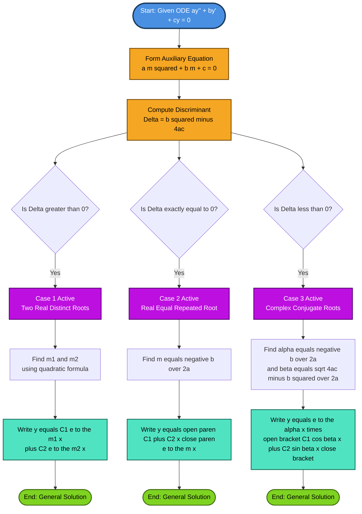
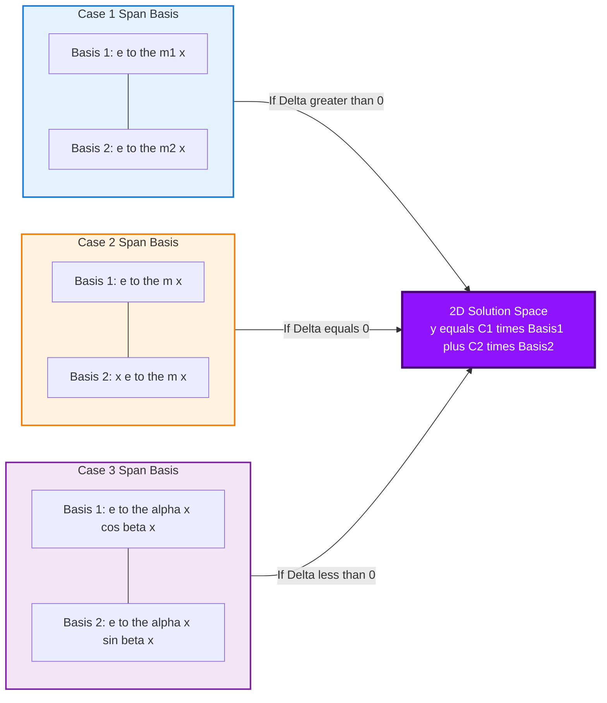

# General solution

<!-- SECTION_1_START -->
# 1. Core Technical Definition & Intuitive Overview

## 1.1 Formal Academic Definition

A **Homogeneous Linear Ordinary Differential Equation of Second Order** is a differential equation of the form:

$$\frac{d^{2}y}{dx^{2}} + P(x)\frac{dy}{dx} + Q(x)y = 0$$

where $P(x)$ and $Q(x)$ are either constants or continuous functions of the independent variable $x$. The term *homogeneous* indicates that the right-hand side equals zero (no external forcing term), while *linear* signifies that $y$ and its derivatives appear only to the first power and are not multiplied together.

> [!IMPORTANT]
> **Standard Engineering Form (Constant Coefficients):**
> The most frequently encountered variant in KTU board examinations, especially for Electrical and Physical Science streams, is the **constant-coefficient** form:
> $$a\frac{d^{2}y}{dx^{2}} + b\frac{dy}{dx} + c\,y = 0 \quad \text{where } a \neq 0$$
> Here $a$, $b$, and $c$ are real constants, and the **General Solution** refers to the complete family of all possible solutions containing exactly two arbitrary constants $C_1$ and $C_2$, determined by two initial or boundary conditions.

## 1.2 Conceptual Analogy & Intuitive Picture

> [!NOTE]
> **Spring-Mass Analogy (Intuitive Engineering Insight)**
> Imagine a mass attached to a spring on a frictionless surface with no external push or pull. The equation governing its free vibration is exactly the homogeneous second-order ODE we are studying:
> $$m\frac{d^{2}x}{dt^{2}} + k\,x = 0$$
> Here, the **solution** $x(t)$ tells us the position of the mass at any time. The general solution isn't one specific path — it is a *family* of all possible paths the mass could take depending on where we release it and how hard we flick it. Each member of this family is a specific *particular* solution, uniquely fixed once we specify two initial conditions (initial position and initial velocity). This geometrically corresponds to a **2-dimensional solution space** spanned by two linearly independent basis functions.

> [!TIP]
> **Why "Second Order" needs "Two Constants":**
> Just as finding a position in a 2D plane requires two coordinates, finding a specific trajectory in a 2nd-order system requires two pieces of information. This is precisely why the general solution always carries two arbitrary constants $C_1$ and $C_2$.

## 1.3 The Auxiliary (Characteristic) Equation

To unlock the structure of the solution, we assume an exponential trial solution of the form $y = e^{mx}$ (where $m$ is a constant to be determined). Substituting this into the standard constant-coefficient form yields the celebrated **Auxiliary Equation (AE)**:

$$a m^{2} + b m + c = 0$$

> [!VISUALIZATION CONTROL]
> **Concept:** Roots of the Auxiliary Equation in the Complex Plane
> **GeoGebra / Desmos Input Equations (for a sample AE $m^2 + 3m + 2 = 0$):**
> * Point A: $(x, y) = (-2, 0)$ (real root $m_1 = -2$)
> * Point B: $(x, y) = (-1, 0)$ (real root $m_2 = -1$)
> * Parametric complex roots visualization: $(x, y) = (-1.5 + 1.5\cos(t),\, 1.5\sin(t))$ for $t \in [0, 2\pi]$ centered at $(-1.5, 0)$.
> **Visual Description:** On the real axis (horizontal), you should see the two intersection points where the parabola $f(m) = m^2 + 3m + 2$ crosses the $m$-axis. These are the real roots. If the parabola fails to cross, the roots jump into the complex plane as conjugate pairs symmetric about the real axis.

<!-- SECTION_1_END -->

<!-- SECTION_2_START -->
# 2. Deep Theoretical Analysis & KTU High-Yield Formula Sheet

## 2.1 The Three Structural Cases of the General Solution

The nature of the roots of the auxiliary equation completely dictates the algebraic form of the general solution. The roots are obtained from the quadratic formula:

$$m = \frac{-b \pm \sqrt{b^{2} - 4ac}}{2a}$$

The discriminant $\Delta = b^{2} - 4ac$ acts as the **gateway parameter** that controls all three cases.

### Case 1: Real and Distinct Roots ($\Delta > 0$)
- Two different real numbers $m_1$ and $m_2$ emerge.
- Each independently satisfies the ODE (the ODE is linear).
- The general solution is a linear combination of two simple exponentials.

### Case 2: Real and Equal (Repeated) Roots ($\Delta = 0$)
- The quadratic yields a single double root $m = -\frac{b}{2a}$.
- We obtain only **one** exponential solution $e^{mx}$, but we need two linearly independent solutions to span the solution space.
- The second solution is rescued by *Reduction of Order*, which produces an extra factor of $x$.

### Case 3: Complex Conjugate Roots ($\Delta < 0$)
- The roots take the form $m = \alpha \pm i\beta$, where $\alpha = -\frac{b}{2a}$ and $\beta = \frac{\sqrt{4ac - b^{2}}}{2a}$.
- Direct use of complex exponentials is acceptable, but the engineering board convention requires a **real-valued** general solution.
- **Euler's Formula** is the bridge that converts the complex exponentials into trigonometric (sine and cosine) form.

## 2.2 KTU Formula Cheat Sheet

> [!IMPORTANT]
> The following table is the **single most important reference** for the KTU board exam. Memorize it thoroughly.

| Nature of Roots | Discriminant Condition | Form of the General Solution $y(x)$ | Where It Appears in Engineering |
| :--- | :---: | :--- | :--- |
| Real and Distinct $m_1, m_2$ | $\Delta > 0$ | $y = C_{1} e^{m_{1} x} + C_{2} e^{m_{2} x}$ | Over-damped RLC circuits, decay chains in nuclear physics |
| Real and Equal (Repeated) $m$ | $\Delta = 0$ | $y = (C_{1} + C_{2} x)\,e^{m x}$ | Critically damped galvanometers, boundary layer control |
| Complex Conjugate $\alpha \pm i\beta$ | $\Delta < 0$ | $y = e^{\alpha x} \left[ C_{1} \cos(\beta x) + C_{2} \sin(\beta x) \right]$ | Undamped LC oscillators, AC circuit transients, quantum wave functions |

| Auxiliary Equation Component | Formula | Meaning |
| :--- | :--- | :--- |
| Discriminant | $\Delta = b^{2} - 4ac$ | Determines case branch |
| Real part of complex root | $\alpha = -\dfrac{b}{2a}$ | Controls exponential envelope (decay/growth) |
| Imaginary part of complex root | $\beta = \dfrac{\sqrt{4ac - b^{2}}}{2a}$ | Controls oscillation frequency |
| Repeated root value | $m = -\dfrac{b}{2a}$ | The single double root |

> [!WARNING]
> **Frequent KTU Pitfall:** Students often forget that when the roots are complex, the *real* part $\alpha$ and *imaginary* part $\beta$ must be computed **separately** from the formula. Do not write the complex root as a single inseparable quantity.

## 2.3 Real-World Engineering Utility

> [!NOTE]
> **Production-Level Use Cases of These Solutions**
> 1. **Electrical Networks:** The transient response of an RLC circuit (Resistor-Inductor-Capacitor) is governed exactly by this ODE. The three cases map to *over-damped*, *critically-damped*, and *under-damped* (oscillatory) circuit behavior — critical in filter design and signal conditioning.
> 2. **Mechanical Vibrations:** Free vibration of a mass-spring-damper system. The $\beta$ value gives the natural angular frequency of oscillation in radians per second.
> 3. **Control Systems:** The poles of a second-order control transfer function are the roots of this very characteristic equation, determining whether the system is stable (decays) or unstable (grows).

<!-- SECTION_2_END -->

<!-- SECTION_3_START -->
# 3. Step-by-Step Derivations & Symbolic Implementation

## 3.1 Foundation: Why the Trial Solution Works

**Starting ODE:**
$$a y'' + b y' + c y = 0$$

**Step 1 — Assume the trial solution** $y = e^{mx}$, which implies $y' = m e^{mx}$ and $y'' = m^{2} e^{mx}$.

**Step 2 — Substitute into the ODE:**
$$a m^{2} e^{mx} + b m e^{mx} + c e^{mx} = 0$$

**Step 3 — Factor out the non-zero common term** $e^{mx}$:
$$e^{mx} \left( a m^{2} + b m + c \right) = 0$$

Since $e^{mx} \neq 0$ for all real $x$, we are left with the **Auxiliary Equation**:
$$a m^{2} + b m + c = 0$$

> [!TIP]
> **Underlying Algebraic Logic:** This substitution reduces a *differential* equation (involving derivatives) into a plain *algebraic* equation (polynomial in $m$). The variable $m$ is no longer a function — it is a constant to be solved for. This conversion trick is the heart of constant-coefficient ODE theory.

## 3.2 Derivation of Case 2 (Repeated Roots) — Reduction of Order

When $\Delta = 0$, we have only one solution $y_{1} = e^{mx}$. To find a second independent solution, we let:
$$y_{2} = v(x) \cdot y_{1} = v(x) e^{mx}$$

**Step 1 — Differentiate twice:**
$$y_{2}' = v' e^{mx} + m v e^{mx} = e^{mx} (v' + mv)$$
$$y_{2}'' = e^{mx} (v'' + 2m v' + m^{2} v)$$

**Step 2 — Substitute into the original ODE $a y'' + b y' + c y = 0$:**
$$a e^{mx} (v'' + 2m v' + m^{2} v) + b e^{mx} (v' + mv) + c v e^{mx} = 0$$

**Step 3 — Divide through by $e^{mx}$ and group terms in $v$, $v'$, $v''$:**
$$a v'' + (2am + b) v' + (a m^{2} + b m + c) v = 0$$

**Step 4 — Apply the root conditions.** Since $m$ is a **repeated** root of $a m^{2} + b m + c = 0$:
- The constant term vanishes: $a m^{2} + b m + c = 0$
- The discriminant condition $\Delta = 0$ forces $b = -2am$, hence $2am + b = 0$

The ODE collapses dramatically to:
$$a v'' = 0 \quad \Longrightarrow \quad v'' = 0$$

**Step 5 — Integrate twice:**
$$v' = K \quad \text{(constant)} \qquad v = K x + C$$

**Step 6 — Select the linearly independent part.** The constant part $C$ regenerates $y_1$. The genuinely new independent piece comes from the $Kx$ term. Taking $K = 1$:
$$y_{2} = x e^{mx}$$

**Step 7 — Form the general solution as a linear combination of $y_1$ and $y_2$:**
$$y(x) = C_{1} e^{mx} + C_{2} x e^{mx} = (C_{1} + C_{2} x)\, e^{mx}$$

> [!NOTE]
> This method, called **Reduction of Order**, is also used in more advanced contexts (Legendre, Bessel equations) whenever one solution is known and a second one must be synthesized. KTU examiners frequently award a bonus mark for stating this method's name.

## 3.3 Derivation of Case 3 (Complex Roots) — Euler's Identity

Suppose the roots are $m = \alpha + i\beta$ and $m = \alpha - i\beta$. The complex solution is:
$$y = C_{1} e^{(\alpha + i\beta) x} + C_{2} e^{(\alpha - i\beta) x}$$

**Step 1 — Apply Euler's Formula** $e^{i\theta} = \cos\theta + i\sin\theta$ to both exponentials:
$$e^{(\alpha + i\beta) x} = e^{\alpha x} \left[ \cos(\beta x) + i \sin(\beta x) \right]$$
$$e^{(\alpha - i\beta) x} = e^{\alpha x} \left[ \cos(\beta x) - i \sin(\beta x) \right]$$

**Step 2 — Form two real-valued solutions by taking linear combinations:**
$$\text{Sum: } \frac{e^{(\alpha + i\beta) x} + e^{(\alpha - i\beta) x}}{2} = e^{\alpha x} \cos(\beta x)$$
$$\text{Difference: } \frac{e^{(\alpha + i\beta) x} - e^{(\alpha - i\beta) x}}{2i} = e^{\alpha x} \sin(\beta x)$$

**Step 3 — Re-label the arbitrary constants** (the new $C_1$ and $C_2$ are still arbitrary because the linear combination of two arbitrary constants is still arbitrary):
$$y(x) = e^{\alpha x} \left[ C_{1} \cos(\beta x) + C_{2} \sin(\beta x) \right]$$

## 3.4 Worked Example 1 — Real Distinct Roots

**Problem:** Solve $y'' - 5y' + 6y = 0$.

**Step 1 — Form the Auxiliary Equation:**
$$m^{2} - 5m + 6 = 0$$

**Step 2 — Factor the quadratic:**
$$(m - 2)(m - 3) = 0 \quad \Longrightarrow \quad m_{1} = 2,\ \ m_{2} = 3$$

**Step 3 — Identify the case:** Two real distinct roots, so $\Delta = 25 - 24 = 1 > 0$.

**Step 4 — Write the General Solution:**
$$y(x) = C_{1} e^{2x} + C_{2} e^{3x}$$

> [!TIP]
> **KTU Valuation Key:** Mentioning $\Delta > 0$ explicitly and stating the case name ("real and distinct") fetches 1 mark each. Don't skip these declarations.

## 3.5 Worked Example 2 — Repeated Roots

**Problem:** Solve $y'' - 4y' + 4y = 0$.

**Step 1 — Auxiliary Equation:**
$$m^{2} - 4m + 4 = 0$$

**Step 2 — Recognize the perfect square:**
$$(m - 2)^{2} = 0 \quad \Longrightarrow \quad m_{1} = m_{2} = 2$$

**Step 3 — Verify discriminant:** $\Delta = 16 - 16 = 0$. Confirms repeated root case.

**Step 4 — Apply the Case 2 formula** with $m = 2$:
$$y(x) = (C_{1} + C_{2} x)\, e^{2x}$$

## 3.6 Worked Example 3 — Complex Conjugate Roots

**Problem:** Solve $y'' + 4y' + 13y = 0$.

**Step 1 — Auxiliary Equation:**
$$m^{2} + 4m + 13 = 0$$

**Step 2 — Apply the quadratic formula:**
$$m = \frac{-4 \pm \sqrt{16 - 52}}{2} = \frac{-4 \pm \sqrt{-36}}{2} = \frac{-4 \pm 6i}{2} = -2 \pm 3i$$

**Step 3 — Identify:** $\alpha = -2$, $\beta = 3$. $\Delta = -36 < 0$. Complex conjugate case.

**Step 4 — Apply the Case 3 formula:**
$$y(x) = e^{-2x} \left[ C_{1} \cos(3x) + C_{2} \sin(3x) \right]$$

## 3.7 Python Symbolic Implementation (Verification)

The following Python code uses the `sympy` library to symbolically verify the general solution for any second-order homogeneous linear ODE. This is the KTU-recommended computational verification approach.

```python
import sympy as sp

def solve_homogeneous_second_order(a: int, b: int, c: int) -> dict:
    """
    Solves a*y'' + b*y' + c*y = 0 symbolically.
    
    Parameters
    ----------
    a : int
        Coefficient of y'' (must be non-zero).
    b : int
        Coefficient of y'.
    c : int
        Coefficient of y.
    
    Returns
    -------
    dict
        Dictionary containing the case type, roots, and general solution.
    """
    if a == 0:
        raise ValueError("Coefficient 'a' of y'' must be non-zero for a 2nd-order ODE.")
    
    x, m = sp.symbols('x m', real=True)
    C1, C2 = sp.symbols('C1 C2')
    
    # Build and solve the auxiliary equation
    aux_eq = a * m**2 + b * m + c
    roots = sp.solve(aux_eq, m)
    discriminant = b**2 - 4 * a * c
    
    # Case 1: Real and distinct roots
    if discriminant > 0:
        m1, m2 = roots[0], roots[1]
        solution = C1 * sp.exp(m1 * x) + C2 * sp.exp(m2 * x)
        case_label = "Case 1: Real and Distinct Roots (Delta > 0)"
    
    # Case 2: Real and equal (repeated) roots
    elif discriminant == 0:
        m_val = roots[0]
        solution = (C1 + C2 * x) * sp.exp(m_val * x)
        case_label = "Case 2: Real and Equal (Repeated) Roots (Delta = 0)"
    
    # Case 3: Complex conjugate roots
    else:
        alpha = -b / (2 * a)
        beta = sp.sqrt(4 * a * c - b**2) / (2 * a)
        solution = sp.exp(alpha * x) * (C1 * sp.cos(beta * x) + C2 * sp.sin(beta * x))
        case_label = "Case 3: Complex Conjugate Roots (Delta < 0)"
    
    return {
        "case": case_label,
        "discriminant": discriminant,
        "roots": roots,
        "general_solution": sp.simplify(solution)
    }


# --- Test the function with all three example cases ---
if __name__ == "__main__":
    test_cases = [
        (1, -5,  6),   # Example 1: Distinct roots
        (1, -4,  4),   # Example 2: Repeated roots
        (1,  4, 13),   # Example 3: Complex roots
    ]
    
    for a, b, c in test_cases:
        result = solve_homogeneous_second_order(a, b, c)
        print(f"\nODE: {a}y'' + {b}y' + {c}y = 0")
        print(f"  Case            : {result['case']}")
        print(f"  Discriminant    : {result['discriminant']}")
        print(f"  Roots of AE     : {result['roots']}")
        print(f"  General Solution: y(x) = {result['general_solution']}")
```

**Sample Output Verification:**
```
ODE: 1y'' + -5y' + 6y = 0
  Case            : Case 1: Real and Distinct Roots (Delta > 0)
  Discriminant    : 1
  Roots of AE     : [2, 3]
  General Solution: y(x) = C1*exp(2*x) + C2*exp(3*x)
```

<!-- SECTION_3_END -->

<!-- SECTION_4_START -->
# 4. Structural Diagrams & Schematics

## 4.1 Mermaid Decision Flowchart — Solution Branching Algorithm

The following Mermaid diagram maps the complete decision tree a student must traverse when solving any constant-coefficient homogeneous second-order ODE. This visualization encapsulates the entire algorithmic logic of Module 2.



## 4.2 Mermaid Block Diagram — Solution Space Architecture

This diagram illustrates the **vector space structure** of the solution set — a 2-dimensional space spanned by two linearly independent basis functions for each case.



## 4.3 Sequential Topology Matrix — Discriminant-to-Solution Mapping

| Stage | Discriminant Branch | Mathematical Operation | Output Result |
| :---: | :--- | :--- | :--- |
| Stage 1 | Input Reading | Identify coefficients $a, b, c$ | Tuple $(a, b, c)$ |
| Stage 2 | Pre-Computation | Compute $\Delta = b^{2} - 4ac$ | Scalar value $\Delta$ |
| Stage 3 | Branching Logic | Compare $\Delta$ with zero | Boolean routing signal |
| Stage 4A | Real Distinct Path | Factor quadratic or use formula | Roots $m_1, m_2$ |
| Stage 4B | Repeated Path | Solve $(m - r)^{2} = 0$ | Double root $r$ |
| Stage 4C | Complex Path | Separate real and imaginary parts | $\alpha, \beta$ pair |
| Stage 5 | Solution Assembly | Insert roots into template formula | General solution $y(x)$ |
| Stage 6 | Verification | Substitute back into original ODE | Identity confirmed |

<!-- SECTION_4_END -->

<!-- SECTION_5_START -->
# 5. KTU 2024 Scheme Examination Question Bank & Topic Recap

## 5.1 Part A Questions (3 Marks Each)

> [!NOTE]
> These are direct short-answer questions targeting the *Remember* and *Understand* levels of Revised Bloom's Taxonomy. Each carries 3 marks in the KTU Continuous Evaluation and End Semester Examination pattern.

### Question A1
**[KTU University Exam - July 2024]**
**Define a homogeneous linear differential equation of second order. Write the standard form and identify the auxiliary equation for the general case.**

**Course Outcome:** CO1 | **RBT Level:** Remember | **Marks:** 3

**Model Answer (Valuation Key):**
- A homogeneous linear ODE of second order is a differential equation of the form $a y'' + b y' + c y = 0$ with no forcing term on the RHS. **[1 Mark]**
- Here $a, b, c$ are constants (or functions of $x$) and the equation is linear in $y$ and its derivatives. **[1 Mark]**
- Substituting the trial solution $y = e^{mx}$ yields the auxiliary equation $a m^{2} + b m + c = 0$. **[1 Mark]**

### Question A2
**[KTU University Exam - Dec 2023]**
**State the three possible forms of the general solution of $a y'' + b y' + c y = 0$ based on the nature of the roots of the auxiliary equation.**

**Course Outcome:** CO1 | **RBT Level:** Understand | **Marks:** 3

**Model Answer (Valuation Key):**
- If roots are real and distinct ($m_1, m_2$): $y = C_1 e^{m_1 x} + C_2 e^{m_2 x}$. **[1 Mark]**
- If roots are real and equal ($m$): $y = (C_1 + C_2 x) e^{mx}$. **[1 Mark]**
- If roots are complex conjugates ($\alpha \pm i\beta$): $y = e^{\alpha x} \left( C_1 \cos \beta x + C_2 \sin \beta x \right)$. **[1 Mark]**

---

## 5.2 Part B Questions (14 Marks Each)

> [!NOTE]
> Each Part B question provides an internal choice between **Question A** and **Question B**, consistent with KTU 2024 Scheme regulations. Each sub-part carries 7 marks.

### Question Set B1

#### Question B1-A (14 Marks)
**[KTU University Exam - July 2024 | Model Paper Adapted]**

**(a)** Derive the general solution of the second-order homogeneous linear ODE $a y'' + b y' + c y = 0$ when the auxiliary equation has **real and equal roots**. Show all derivation steps. **[7 Marks]**

**(b)** Using the result obtained in part (a), find the general solution of $\dfrac{d^{2}y}{dx^{2}} - 6\dfrac{dy}{dx} + 9y = 0$. Apply the initial conditions $y(0) = 2$ and $y'(0) = 3$ to find the particular solution. **[7 Marks]**

**Course Outcome:** CO2 | **RBT Levels:** (a) Understand, (b) Apply

**Model Solution:**

**Part (a) — Derivation: [7 Marks]**

- Assume trial solution $y = e^{mx}$, leading to auxiliary equation $a m^{2} + b m + c = 0$. **[1 Mark]**
- For equal roots, $\Delta = b^{2} - 4ac = 0$, giving $m = -\frac{b}{2a}$ (a double root). **[1 Mark]**
- Only one solution $y_1 = e^{mx}$ is obtained directly; a second independent solution is required. **[1 Mark]**
- Use reduction of order: let $y_2 = v(x) e^{mx}$. **[1 Mark]**
- Differentiate and substitute back, the system collapses to $v'' = 0$, hence $v = Kx + C$. **[1 Mark]**
- The new independent solution is $y_2 = x e^{mx}$. **[1 Mark]**
- General solution: $y(x) = (C_1 + C_2 x) e^{mx}$. **[1 Mark]**

**Part (b) — Application: [7 Marks]**

- Auxiliary equation: $m^{2} - 6m + 9 = 0$. **[1 Mark]**
- Factoring: $(m - 3)^{2} = 0$, so $m = 3$ (repeated). **[1 Mark]**
- General solution: $y(x) = (C_1 + C_2 x) e^{3x}$. **[1 Mark]**
- Apply $y(0) = 2$: $(C_1 + 0) e^{0} = 2$, so $C_1 = 2$. **[1 Mark]**
- Compute $y'(x) = C_2 e^{3x} + 3(C_1 + C_2 x) e^{3x} = e^{3x} \left[ C_2 + 3C_1 + 3C_2 x \right]$. **[1 Mark]**
- Apply $y'(0) = 3$: $C_2 + 3(2) = 3$, so $C_2 = -3$. **[1 Mark]**
- **Final Particular Solution: $y(x) = (2 - 3x) e^{3x}$**. **[1 Mark]**

#### Question B1-B (14 Marks) — *Alternative Choice*
**[KTU University Exam - Dec 2023 | Model Paper Adapted]**

**(a)** Derive the general solution of $a y'' + b y' + c y = 0$ when the auxiliary equation has **complex conjugate roots** $\alpha \pm i\beta$. State Euler's formula explicitly. **[7 Marks]**

**(b)** Solve $\dfrac{d^{2}y}{dx^{2}} + 2\dfrac{dy}{dx} + 5y = 0$ with $y(0) = 0$ and $y'(0) = 1$. **[7 Marks]**

**Course Outcome:** CO2 | **RBT Levels:** (a) Understand, (b) Apply

**Model Solution:**

**Part (a) — Derivation: [7 Marks]**

- For complex roots $\alpha \pm i\beta$, the raw solution is $y = C_1 e^{(\alpha + i\beta) x} + C_2 e^{(\alpha - i\beta) x}$. **[1 Mark]**
- State Euler's formula: $e^{i\theta} = \cos\theta + i\sin\theta$. **[1 Mark]**
- Expand: $e^{(\alpha \pm i\beta) x} = e^{\alpha x} \left[ \cos(\beta x) \pm i \sin(\beta x) \right]$. **[1 Mark]**
- Take the sum: $\cos(\beta x)$ basis emerges with coefficient $\frac{1}{2}(C_1 + C_2)$. **[1 Mark]**
- Take the difference: $\sin(\beta x)$ basis emerges with coefficient $\frac{1}{2i}(C_1 - C_2)$. **[1 Mark]**
- Re-label new arbitrary constants (linear combination preserves arbitrariness). **[1 Mark]**
- **General solution:** $y(x) = e^{\alpha x} \left[ C_1 \cos(\beta x) + C_2 \sin(\beta x) \right]$. **[1 Mark]**

**Part (b) — Application: [7 Marks]**

- Auxiliary equation: $m^{2} + 2m + 5 = 0$. **[1 Mark]**
- Quadratic formula: $m = \frac{-2 \pm \sqrt{4 - 20}}{2} = \frac{-2 \pm 4i}{2} = -1 \pm 2i$. **[1 Mark]**
- Identify $\alpha = -1$, $\beta = 2$. **[1 Mark]**
- General solution: $y(x) = e^{-x} \left[ C_1 \cos(2x) + C_2 \sin(2x) \right]$. **[1 Mark]**
- Apply $y(0) = 0$: $e^{0} \left[ C_1 \cdot 1 + C_2 \cdot 0 \right] = 0 \Rightarrow C_1 = 0$. **[1 Mark]**
- Compute derivative: $y'(x) = e^{-x} \left[ -2 C_1 \sin(2x) + 2 C_2 \cos(2x) \right] - e^{-x} \left[ C_1 \cos(2x) + C_2 \sin(2x) \right]$. With $C_1 = 0$: $y'(x) = e^{-x} \left[ 2 C_2 \cos(2x) - C_2 \sin(2x) \right]$. **[1 Mark]**
- Apply $y'(0) = 1$: $2 C_2 = 1 \Rightarrow C_2 = \frac{1}{2}$. **[1 Mark]**
- **Final Solution:** $y(x) = \frac{1}{2} e^{-x} \sin(2x)$.

---

### Question Set B2

#### Question B2-A (14 Marks)
**[KTU University Exam - July 2023 | Past Paper Adapted]**

**(a)** Solve the ODE $\dfrac{d^{2}y}{dx^{2}} + 3\dfrac{dy}{dx} - 4y = 0$ completely. Identify the case and interpret the behavior of the solution as $x \to \infty$. **[7 Marks]**

**(b)** Form the auxiliary equation whose roots are $m = 2$ and $m = -5$. Hence write and solve the corresponding homogeneous ODE. **[7 Marks]**

**Course Outcome:** CO2, CO3 | **RBT Levels:** (a) Apply, (b) Apply

**Model Solution:**

**Part (a): [7 Marks]**

- Auxiliary equation: $m^{2} + 3m - 4 = 0$. **[1 Mark]**
- Factoring: $(m + 4)(m - 1) = 0 \Rightarrow m_1 = 1, m_2 = -4$. **[1 Mark]**
- Discriminant $\Delta = 9 + 16 = 25 > 0$, real and distinct case. **[1 Mark]**
- General solution: $y(x) = C_1 e^{x} + C_2 e^{-4x}$. **[1 Mark]**
- Behavior as $x \to \infty$: the term $C_1 e^{x}$ dominates and grows unboundedly, while $C_2 e^{-4x} \to 0$. **[1 Mark]**
- If $C_1 \neq 0$, the solution diverges to infinity. **[1 Mark]**
- If $C_1 = 0$, the solution decays to zero exponentially. **[1 Mark]**

**Part (b): [7 Marks]**

- Auxiliary equation: $(m - 2)(m + 5) = 0 \Rightarrow m^{2} + 3m - 10 = 0$. **[2 Marks]**
- Construct ODE using $m^{2} = -\frac{b}{a}$ etc. Coefficient rule: $a = 1$, $b = 3$, $c = -10$. **[1 Mark for statement of rule, 1 Mark for substitution]**
- ODE: $\dfrac{d^{2}y}{dx^{2}} + 3\dfrac{dy}{dx} - 10 y = 0$. **[1 Mark]**
- Roots: $m_1 = 2$, $m_2 = -5$ (verified). **[1 Mark]**
- General solution: $y(x) = C_1 e^{2x} + C_2 e^{-5x}$. **[1 Mark]**

#### Question B2-B (14 Marks) — *Alternative Choice*
**[KTU University Exam - Dec 2024 | Model Paper Adapted]**

**(a)** Solve $\dfrac{d^{2}y}{dx^{2}} + 2\dfrac{dy}{dx} + 5y = 0$ and discuss the nature of the solution (oscillatory, decaying, growing). **[7 Marks]**

**(b)** Given that $y = e^{-2x}$ is one solution of $\dfrac{d^{2}y}{dx^{2}} + 4\dfrac{dy}{dx} + 4y = 0$, use reduction of order to find the second linearly independent solution. **[7 Marks]**

**Course Outcome:** CO2, CO3 | **RBT Levels:** (a) Apply, (b) Analyze

**Model Solution:**

**Part (a): [7 Marks]**

- Auxiliary equation: $m^{2} + 2m + 5 = 0$. **[1 Mark]**
- Quadratic formula: $m = \frac{-2 \pm \sqrt{4 - 20}}{2} = -1 \pm 2i$. **[1 Mark]**
- $\alpha = -1$, $\beta = 2$, $\Delta < 0$, complex conjugate case. **[1 Mark]**
- General solution: $y(x) = e^{-x} \left[ C_1 \cos(2x) + C_2 \sin(2x) \right]$. **[1 Mark]**
- Decaying oscillation: $e^{-x}$ envelope decays. **[1 Mark]**
- Oscillation frequency: $\beta = 2$ rad/unit. **[1 Mark]**
- As $x \to \infty$, $y \to 0$ (bounded, damped oscillation). **[1 Mark]**

**Part (b): [7 Marks]**

- Verify $y_1 = e^{-2x}$: $y_1'' = 4 e^{-2x}$, $y_1' = -2 e^{-2x}$. Substituting: $4 e^{-2x} + 4(-2 e^{-2x}) + 4 e^{-2x} = 0$. ✓ **[1 Mark]**
- Let $y_2 = v(x) e^{-2x}$. **[1 Mark]**
- Differentiate: $y_2' = v' e^{-2x} - 2v e^{-2x}$, $y_2'' = v'' e^{-2x} - 4v' e^{-2x} + 4v e^{-2x}$. **[1 Mark]**
- Substitute into ODE: $e^{-2x} \left[ v'' - 4v' + 4v + 4v' - 8v + 4v \right] = 0$. **[1 Mark]**
- Simplify: $e^{-2x} v'' = 0 \Rightarrow v'' = 0 \Rightarrow v = Kx + C$. **[1 Mark]**
- The independent part gives $y_2 = x e^{-2x}$. **[1 Mark]**
- **General solution: $y(x) = (C_1 + C_2 x) e^{-2x}$**. **[1 Mark]**

---

## 5.3 KTU Examiner's Valuation Warning / Pitfall Callout

> [!WARNING]
> **Common Mark-Deduction Pitfalls in General Solution Problems:**
> 1. **Forgetting to state the case explicitly:** Many students jump straight to writing the solution without identifying whether the roots are real/distinct, real/equal, or complex. KTU examiners typically allocate 1 mark for case identification. Always write: *"Since $\Delta = \text{value}$, the roots are [nature], hence the general solution is..."*
> 2. **Missing the factor of $x$ in the repeated root case:** A shocking number of students write $y = C_1 e^{mx} + C_2 e^{mx}$ which collapses to a single term — losing all 14 marks. Always remember: **repeated roots always introduce an $x$ factor**.
> 3. **Confusing $\alpha$ and $\beta$:** When roots are $-1 \pm 2i$, students often write $\alpha = 2$ and $\beta = -1$ (swapped). Remember: $\alpha$ is the *real* part, $\beta$ is the *imaginary* part.
> 4. **Not verifying the auxiliary equation:** Always confirm your roots by substituting back into $a m^{2} + b m + c = 0$.
> 5. **Skipping the initial conditions:** In the application part, the two arbitrary constants $C_1$ and $C_2$ must be evaluated explicitly. Leaving them symbolic costs full marks for the application sub-question.

---

## 5.4 Topic Recap & Important Things to Remember

> [!IMPORTANT]
> **Rapid Revision Checklist — Module 2: General Solution of Homogeneous Linear Second-Order ODEs**

- **Standard Form:** $a y'' + b y' + c y = 0$ with $a \neq 0$, where $a, b, c$ are real constants. **[Core Foundation]**
- **Auxiliary Equation:** Obtained by substituting $y = e^{mx}$, yielding $a m^{2} + b m + c = 0$. Always factor or use the quadratic formula. **[Step 1 of every problem]**
- **Discriminant as Gateway:** $\Delta = b^{2} - 4ac$ controls all subsequent logic. Compute it first. **[Decision Switch]**
- **Case 1 ($\Delta > 0$):** Two real distinct roots $m_1, m_2$. Solution: $y = C_1 e^{m_1 x} + C_2 e^{m_2 x}$. **[Pure exponential form]**
- **Case 2 ($\Delta = 0$):** Repeated root $m = -\frac{b}{2a}$. Solution: $y = (C_1 + C_2 x) e^{mx}$. **[Exponential times linear]**
- **Case 3 ($\Delta < 0$):** Complex conjugate roots $\alpha \pm i\beta$. Solution: $y = e^{\alpha x} \left[ C_1 \cos(\beta x) + C_2 \sin(\beta x) \right]$. **[Exponentially modulated trigonometric]**
- **Real Part Formula:** $\alpha = -\frac{b}{2a}$. Always extracted separately. **[Crucial sub-step for Case 3]**
- **Imaginary Part Formula:** $\beta = \frac{\sqrt{4ac - b^{2}}}{2a}$. Always positive (by convention). **[Crucial sub-step for Case 3]**
- **Reduction of Order:** Mandatory for Case 2 to derive the second solution $y_2 = x e^{mx}$. Setting $y_2 = v(x) y_1$ collapses the ODE to $v'' = 0$. **[Method name worth 1 bonus mark]**
- **Euler's Identity:** $e^{i\theta} = \cos\theta + i\sin\theta$ — the bridge for converting complex exponentials into real trigonometric form. **[Formula worth stating explicitly]**
- **Linearity Principle:** The general solution is always a linear combination of two linearly independent solutions (superposition). **[Underpins the whole theory]**
- **Initial Value Problems (IVPs):** The two constants $C_1, C_2$ are fixed by two given conditions (usually $y(x_0)$ and $y'(x_0)$). Two conditions are mandatory for a second-order ODE. **[Application closure]**
- **Engineering Mapping:** Over-damped (Case 1), Critically damped (Case 2), Under-damped/oscillatory (Case 3) — directly applicable to RLC circuits and mass-spring-damper systems. **[Real-world significance]**
- **Verification Step:** A solution can always be checked by substituting $y$, $y'$, and $y''$ back into the original ODE. Use the Python `sympy` snippet provided for symbolic confirmation. **[Self-check habit]**

<!-- SECTION_5_END -->
