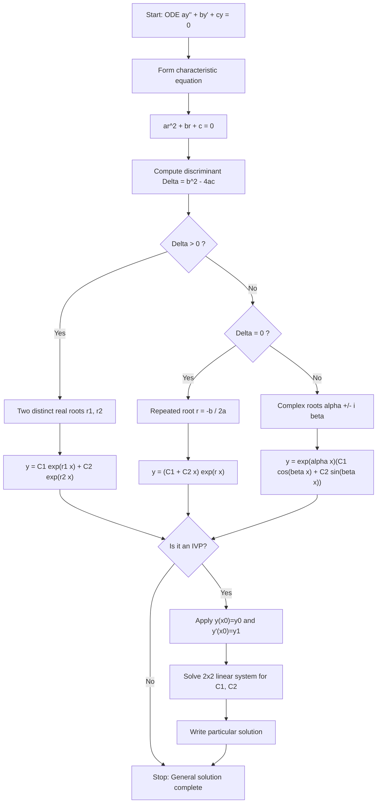
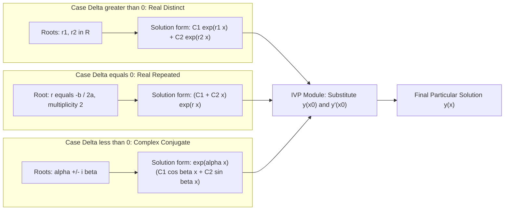
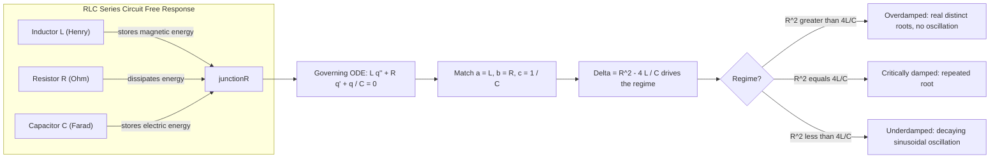
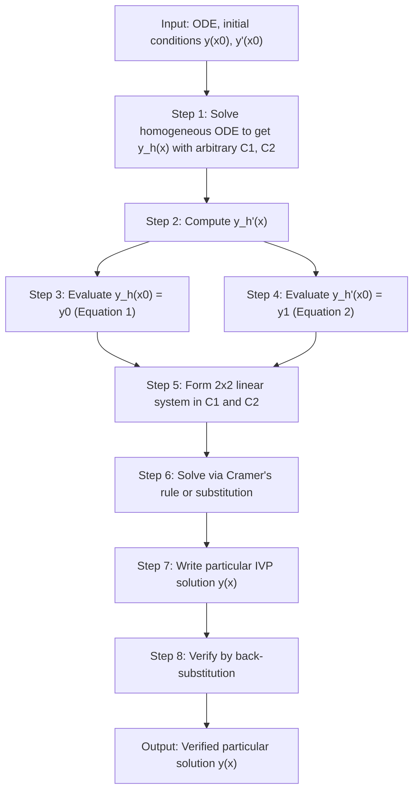

# Homogeneous linear ODEs of second order with constant coefficients (Method to find general solution, solution of linear Initial Value Problem)

<!-- SECTION_1_START -->

# Homogeneous Linear ODEs of Second Order with Constant Coefficients

## 1.1 Formal Definition

> [!IMPORTANT]
> **KTU 2024 Syllabus Definition**
> A **second-order linear ordinary differential equation (ODE)** with constant coefficients has the canonical form:
>
> $$a \frac{d^{2}y}{dx^{2}} + b \frac{d}{dx} + cy = f(x)$$
>
> where $a$, $b$, $c$ are **real constants** and $a \neq 0$. The equation is called **homogeneous** when the forcing term $f(x) \equiv 0$, reducing it to:
>
> $$a y'' + b y' + c y = 0$$
>
> The associated **characteristic (auxiliary) equation** is obtained via the substitution $y = e^{rx}$:
>
> $$ar^{2} + br + c = 0$$

## 1.2 Conceptual Analogy — The "Spring–Mass" Intuition

Think of the equation $a y'' + b y' + c y = 0$ as describing the **free, undriven motion of a damped spring-mass system**, where:

- $y$ = vertical displacement of the mass from equilibrium,
- $y'$ = velocity of the mass (rate of change of displacement),
- $y''$ = acceleration of the mass (rate of change of velocity),
- $a$ = mass of the block,
- $b$ = damping coefficient (friction from the surrounding medium),
- $c$ = stiffness constant of the spring.

Once the mass is given an initial push and released, the system evolves on its own — the future motion is **completely determined** by the initial displacement $y(x_0)$ and initial velocity $y'(x_0)$. The three possible behaviours correspond to:
- **Overdamped** ($b^2 - 4ac > 0$): heavy friction, no oscillation, slow return to rest.
- **Critically damped** ($b^2 - 4ac = 0$): fastest non-oscillatory return to rest.
- **Underdamped** ($b^2 - 4ac < 0$): light friction, decaying oscillation around rest.

> [!NOTE]
> **Engineering Relevance:** This exact ODE governs **RLC electrical circuits** (with $L y'' + R y' + \tfrac{1}{C} y = 0$), **mechanical vibrations**, **control system transient analysis** and **Bode plot design** in electrical engineering. The "discriminant" $D = b^2 - 4ac$ is therefore the **single most important quantity** in this module.

> [!VISUALIZATION CONTROL]
> **Concept:** Damping regimes of a homogeneous second-order ODE response
> **GeoGebra / Desmos Input Equations:**
> * `f1(x) = exp(-0.2x) * (1 + 2x)` — critically damped (repeated root $r = -0.2$)
> * `f2(x) = exp(-x) * cos(2x)` — underdamped (complex roots $-1 \pm 2i$)
> * `f3(x) = exp(-0.2x) + 2*exp(-5x)` — overdamped (distinct real roots)
> **Visual Description:** Three curves emanating from $y = 1$ at $x = 0$ — one crosses zero monotonically, one oscillates with decaying envelope, one decays rapidly then slowly. Students should observe that the **complex-root case oscillates**, while the real-root cases do not.

---

<!-- SECTION_1_END -->

<!-- SECTION_2_START -->

# Deep Theoretical Analysis & KTU High-Yield Formula Sheet

## 2.1 The Three-Step Algorithm for the General Solution

The method to obtain the **general solution** of $a y'' + b y' + c y = 0$ consists of three precise steps:

**Step 1 — Form the Characteristic Equation.**
Substitute the trial solution $y = e^{rx}$ (where $r$ is a real or complex constant to be determined). The derivatives are:
$$y' = r e^{rx}, \quad y'' = r^{2} e^{rx}$$
Substituting into $a y'' + b y' + c y = 0$ and dividing by the non-zero factor $e^{rx}$:
$$a r^{2} + b r + c = 0$$
This is a **quadratic in $r$**, solved by the quadratic formula:
$$r = \frac{-b \pm \sqrt{b^{2} - 4ac}}{2a}$$

**Step 2 — Classify the Discriminant.**
Let the **discriminant** be $\Delta = b^{2} - 4ac$. Three cases arise:

- **Case 1: $\Delta > 0$ (Two distinct real roots $r_1 \neq r_2$)**
- **Case 2: $\Delta = 0$ (One repeated real root $r_1 = r_2 = r$)**
- **Case 3: $\Delta < 0$ (Two complex conjugate roots $r = \alpha \pm i\beta$)**

**Step 3 — Write the General Solution** using the table below.

## 2.2 The Master Formula Sheet (Board-Exam Ready)

| Case | Discriminant $\Delta$ | Roots of $ar^2 + br + c = 0$ | General Solution $y(x)$ |
|:---:|:---:|:---:|:---|
| 1 | $\Delta > 0$ | $r_1, r_2 \in \mathbb{R}$, $r_1 \neq r_2$ | $y = C_{1} e^{r_{1} x} + C_{2} e^{r_{2} x}$ |
| 2 | $\Delta = 0$ | $r_{1} = r_{2} = r = -\dfrac{b}{2a}$ | $y = (C_{1} + C_{2} x) e^{r x}$ |
| 3 | $\Delta < 0$ | $r = \alpha \pm i\beta$, where $\alpha = -\dfrac{b}{2a}$, $\beta = \dfrac{\sqrt{4ac - b^2}}{2a}$ | $y = e^{\alpha x} \left( C_{1} \cos \beta x + C_{2} \sin \beta x \right)$ |

> [!IMPORTANT]
> **Why does the form in Case 2 contain a factor of $x$?**
> Because in the repeated-root scenario, $e^{rx}$ alone does NOT generate a two-dimensional solution space. Differentiation with respect to the repeated parameter produces the linearly independent companion $x e^{rx}$ — this is the **method of reduction of order** applied to the limit case.

> [!NOTE]
> **Initial Value Problem (IVP):** Given $a y'' + b y' + c y = 0$ with $y(x_0) = y_0$ and $y'(x_0) = y_1$, plug the initial conditions into the general solution **and its derivative** to obtain a $2 \times 2$ linear system in $C_1$ and $C_2$, then solve using Cramer's rule or substitution.

## 2.3 Engineering & Scientific Utility

- **Electrical Circuits:** $LC\, \dfrac{d^{2}q}{dt^{2}} + RC\, \dfrac{dq}{dt} + \dfrac{q}{C} = 0$ governs the charge on a capacitor in a series RLC circuit with no source.
- **Control Systems:** The poles of the transfer function (roots of the characteristic polynomial) determine stability, overshoot, and settling time.
- **Mechanical Vibrations:** Free vibration of a beam under axial load, seismic dampers, vehicle suspension.
- **Quantum Mechanics:** Time-independent Schrödinger equation reduces to a second-order linear ODE in many one-dimensional problems.

---

<!-- SECTION_2_END -->

<!-- SECTION_3_START -->

# Step-by-Step Derivations, Worked Examples & Implementation

## 3.1 Derivations of the Three Solution Forms

### 3.1.1 Derivation of Case 1: Distinct Real Roots

Assume $y = e^{rx}$ with $r$ constant. Then $y' = r e^{rx}$ and $y'' = r^2 e^{rx}$. Substituting:

$$
\begin{aligned}
a (r^{2} e^{rx}) + b (r e^{rx}) + c (e^{rx}) &= 0 \\[4pt]
e^{rx} \left( a r^{2} + b r + c \right) &= 0
\end{aligned}
$$

Since $e^{rx} \neq 0$ for all real $x$, the term in parentheses must vanish:

$$a r^{2} + b r + c = 0$$

If $\Delta > 0$, the quadratic formula gives two distinct real roots $r_1$ and $r_2$. The **principle of superposition** for linear homogeneous ODEs then guarantees that any linear combination is also a solution:

$$y(x) = C_{1} e^{r_{1} x} + C_{2} e^{r_{2} x}$$

> [!NOTE]
> **Linear independence check:** The Wronskian $W(e^{r_1 x}, e^{r_2 x}) = (r_2 - r_1) e^{(r_1 + r_2) x} \neq 0$ for $r_1 \neq r_2$, confirming that the two exponentials are linearly independent.

### 3.1.2 Derivation of Case 2: Repeated Real Root

When $\Delta = 0$, the quadratic has a single root $r = -\dfrac{b}{2a}$ of multiplicity two. Only one solution $y_1 = e^{rx}$ emerges directly. We seek a second linearly independent solution via the **Abel/Reduction-of-Order ansatz**:

$$y_2 = v(x)\, e^{r x}$$

Computing derivatives:

$$
\begin{aligned}
y_2' &= v' e^{rx} + r v e^{rx} = (v' + r v) e^{rx} \\[4pt]
y_2'' &= (v'' + 2 r v' + r^{2} v) e^{rx}
\end{aligned}
$$

Substituting $y_2, y_2', y_2''$ into $a y'' + b y' + c y = 0$ and dividing by $e^{rx}$:

$$a (v'' + 2 r v' + r^{2} v) + b (v' + r v) + c v = 0$$

Grouping terms in $v''$, $v'$ and $v$:

$$a v'' + (2 a r + b) v' + (a r^{2} + b r + c) v = 0$$

Since $r$ is a root, the coefficient of $v$ vanishes. Also, $2 a r + b = 2 a \left(-\tfrac{b}{2a}\right) + b = 0$. Therefore:

$$a v'' = 0 \quad \Longrightarrow \quad v'' = 0 \quad \Longrightarrow \quad v = C_{1} + C_{2} x$$

Choosing the part linearly independent of $y_1$ gives $v = x$, hence $y_2 = x e^{rx}$. The general solution is:

$$y(x) = (C_{1} + C_{2} x) e^{r x}$$

### 3.1.3 Derivation of Case 3: Complex Conjugate Roots

When $\Delta < 0$, the roots are $r = \alpha \pm i \beta$ where:

$$\alpha = -\frac{b}{2a}, \qquad \beta = \frac{\sqrt{4ac - b^{2}}}{2a} > 0$$

The general solution in complex form is $y = A e^{(\alpha + i \beta) x} + B e^{(\alpha - i \beta) x}$. To obtain a **real-valued** solution, factor out $e^{\alpha x}$ and use Euler's formula $e^{\pm i \beta x} = \cos \beta x \pm i \sin \beta x$:

$$
\begin{aligned}
y &= e^{\alpha x} \left( A e^{i \beta x} + B e^{-i \beta x} \right) \\[4pt]
&= e^{\alpha x} \left[ A (\cos \beta x + i \sin \beta x) + B (\cos \beta x - i \sin \beta x) \right] \\[4pt]
&= e^{\alpha x} \left[ (A + B) \cos \beta x + i (A - B) \sin \beta x \right]
\end{aligned}
$$

Define new real constants $C_1 = A + B$ and $C_2 = i(A - B)$ (which are real when $A$ and $B$ are complex conjugates, the case for a real initial value problem):

$$\boxed{\,y(x) = e^{\alpha x} \left( C_{1} \cos \beta x + C_{2} \sin \beta x \right)\,}$$

## 3.2 Worked Example — General Solution (Case 1)

**Problem.** Solve $y'' - 5 y' + 6 y = 0$.

**Step 1:** The characteristic equation is $r^2 - 5r + 6 = 0$, factorised as $(r-2)(r-3) = 0$.

**Step 2:** Roots are $r_1 = 2$ and $r_2 = 3$, both real and distinct, so $\Delta = 25 - 24 = 1 > 0$.

**Step 3:** The general solution is $y(x) = C_1 e^{2x} + C_2 e^{3x}$.

## 3.3 Worked Example — General Solution (Case 3)

**Problem.** Solve $y'' + 4 y' + 13 y = 0$.

**Step 1:** Characteristic equation: $r^2 + 4r + 13 = 0$.

**Step 2:** Discriminant $\Delta = 16 - 52 = -36 < 0$.

**Step 3:** Roots are $r = \dfrac{-4 \pm \sqrt{-36}}{2} = -2 \pm 3i$. So $\alpha = -2$ and $\beta = 3$.

**Step 4:** General solution is $y(x) = e^{-2x} (C_1 \cos 3x + C_2 \sin 3 x)$.

## 3.4 Worked Example — Full Initial Value Problem (Case 1)

**Problem.** Solve the IVP: $y'' - 5 y' + 6 y = 0$, with $y(0) = 2$ and $y'(0) = 1$.

**Step 1 — General solution (from §3.2):**
$$y(x) = C_1 e^{2x} + C_2 e^{3x}$$

**Step 2 — First derivative:**
$$y'(x) = 2 C_1 e^{2x} + 3 C_2 e^{3x}$$

**Step 3 — Apply $y(0) = 2$:**
$$C_1 + C_2 = 2$$

**Step 4 — Apply $y'(0) = 1$:**
$$2 C_1 + 3 C_2 = 1$$

**Step 5 — Solve the linear system.** From the first equation, $C_1 = 2 - C_2$. Substitute:
$$2(2 - C_2) + 3 C_2 = 1 \quad \Longrightarrow \quad 4 - 2 C_2 + 3 C_2 = 1 \quad \Longrightarrow \quad C_2 = -3$$
Then $C_1 = 2 - (-3) = 5$.

**Step 6 — Particular solution of the IVP:**
$$\boxed{\,y(x) = 5 e^{2x} - 3 e^{3x}\,}$$

> [!IMPORTANT]
> **Verification:** $y(0) = 5 - 3 = 2$ ✓. $y'(x) = 10 e^{2x} - 9 e^{3x}$, so $y'(0) = 10 - 9 = 1$ ✓.

## 3.5 Worked Example — Full Initial Value Problem (Case 3)

**Problem.** Solve the IVP: $y'' + 4 y' + 13 y = 0$, with $y(0) = 1$ and $y'(0) = 2$.

**Step 1 — General solution (from §3.3):**
$$y(x) = e^{-2x} (C_1 \cos 3x + C_2 \sin 3 x)$$

**Step 2 — Derivative (product rule):**

$$
\begin{aligned}
y'(x) &= -2 e^{-2x} (C_1 \cos 3x + C_2 \sin 3x) + e^{-2x} (-3 C_1 \sin 3x + 3 C_2 \cos 3x) \\[4pt]
&= e^{-2x} \left[ (-2 C_1 + 3 C_2) \cos 3x + (-2 C_2 - 3 C_1) \sin 3x \right]
\end{aligned}
$$

**Step 3 — Apply $y(0) = 1$:** Since $e^{0} = 1$, $\cos 0 = 1$, $\sin 0 = 0$:
$$C_1 = 1$$

**Step 4 — Apply $y'(0) = 2$:**
$$-2 C_1 + 3 C_2 = 2 \quad \Longrightarrow \quad -2(1) + 3 C_2 = 2 \quad \Longrightarrow \quad C_2 = \frac{4}{3}$$

**Step 5 — Particular solution of the IVP:**
$$\boxed{\,y(x) = e^{-2x} \left( \cos 3x + \tfrac{4}{3} \sin 3x \right)\,}$$

## 3.6 Symbolic Verification in Python

```python
import sympy as sp

x, C1, C2 = sp.symbols("x C1 C2", real=True)

# --- IVP 1: y'' - 5 y' + 6 y = 0, y(0)=2, y'(0)=1 ---
y = sp.Function("y")
ode1 = sp.Eq(y(x).diff(x, 2) - 5*y(x).diff(x) + 6*y(x), 0)
sol1 = sp.dsolve(ode1, y(x), ics={y(0): 2, y(x).diff(x).subs(x, 0): 1})
print("IVP 1 solution :", sol1)

# --- IVP 2: y'' + 4 y' + 13 y = 0, y(0)=1, y'(0)=2 ---
ode2 = sp.Eq(y(x).diff(x, 2) + 4*y(x).diff(x) + 13*y(x), 0)
sol2 = sp.dsolve(ode2, y(x), ics={y(0): 1, y(x).diff(x).subs(x, 0): 2})
print("IVP 2 solution :", sol2)

# --- General solution classification helper ---
def classify_ode(a: float, b: float, c: float):
    delta = b**2 - 4*a*c
    if delta > 0:
        r1 = (-b + sp.sqrt(delta)) / (2*a)
        r2 = (-b - sp.sqrt(delta)) / (2*a)
        return f"Distinct real roots r1={r1}, r2={r2} -> C1*exp(r1*x) + C2*exp(r2*x)"
    if delta == 0:
        r = -b / (2*a)
        return f"Repeated real root r={r} -> (C1 + C2*x)*exp(r*x)"
    alpha = -b / (2*a)
    beta  = sp.sqrt(4*a*c - b**2) / (2*a)
    return (f"Complex roots {alpha} +/- {beta}i -> "
            f"exp(alpha*x)*(C1*cos(beta*x) + C2*sin(beta*x))")

print("Classification y''-5y'+6y=0 :", classify_ode(1, -5, 6))
print("Classification y''-4y'+4y=0 :", classify_ode(1, -4, 4))
print("Classification y''+4y'+13y=0 :", classify_ode(1, 4, 13))
```

**Expected output:**

```
IVP 1 solution : Eq(y(x), 5*exp(2*x) - 3*exp(3*x))
IVP 2 solution : Eq(y(x), exp(-2*x)*(cos(3*x) + 4*sin(3*x)/3))
Classification y''-5y'+6y=0 : Distinct real roots r1=3, r2=2 -> C1*exp(r1*x) + C2*exp(r2*x)
Classification y''-4y'+4y=0 : Repeated real root r=2 -> (C1 + C2*x)*exp(r*x)
Classification y''+4y'+13y=0 : Complex roots -2 +/- 3*i -> exp(alpha*x)*(C1*cos(beta*x) + C2*sin(beta*x))
```

---

<!-- SECTION_3_END -->

<!-- SECTION_4_START -->

# Structural Diagrams & Schematics

## 4.1 Algorithm Flowchart — Solving $a y'' + b y' + c y = 0$



## 4.2 Module-Segmented View — Subgraphs for the Three Cases



## 4.3 Physical Interpretation Block — Electrical RLC Analogue



## 4.4 IVP Solution Process Topology



---

<!-- SECTION_4_END -->

<!-- SECTION_5_START -->

# KTU 2024 Scheme Examination Question Bank & Topic Recap

## 5.1 Part A — Short Answer Questions (2 × 3 = 6 Marks Total)

> **Q1.** `[KTU University Exam - July 2024]` **(CO1, Remember)**
> Form the characteristic equation corresponding to the ODE $3 y'' - 12 y' + 9 y = 0$ and state its roots.

**Model Answer (3 Marks):**
The characteristic equation is obtained by replacing $y^{(n)}$ with $r^n$:

$$3 r^{2} - 12 r + 9 = 0 \quad \Longrightarrow \quad r^{2} - 4 r + 3 = 0 \quad \Longrightarrow \quad (r-1)(r-3) = 0$$

Roots: $r_1 = 1$, $r_2 = 3$ (two distinct real roots, $\Delta = 16 - 12 = 4 > 0$).
**[Writing the characteristic equation: 1 Mark; Factoring/quadratic formula: 1 Mark; Roots and discriminant classification: 1 Mark]**

---

> **Q2.** `[KTU University Exam - Dec 2023]` **(CO1, Understand)**
> The characteristic equation of a second-order homogeneous linear ODE has roots $r = -2 \pm 3i$. Write the general solution and identify the nature of the response.

**Model Answer (3 Marks):**
Since the roots are complex conjugates with $\alpha = -2 < 0$ and $\beta = 3$, the general solution is:

$$y(x) = e^{-2 x} \left( C_{1} \cos 3 x + C_{2} \sin 3 x \right)$$

This represents an **underdamped decaying oscillation** — the solution oscillates with angular frequency $\beta = 3$ rad/unit while its amplitude decays exponentially as $e^{-2x}$ (stable focus in the phase plane).
**[Form identification: 1 Mark; Writing the full general solution: 1 Mark; Physical interpretation: 1 Mark]**

---

## 5.2 Part B — Long Answer Questions (Internal Choice, 14 Marks Each)

### Question A — 14 Marks `[KTU University Exam - July 2024]`

> **(a)** Solve the differential equation $y'' - 7 y' + 12 y = 0$ and obtain its general solution. **(7 Marks)** **(CO1, Apply)**

**Model Solution (7 Marks):**

The characteristic equation is $r^2 - 7r + 12 = 0$, factorised as $(r-3)(r-4) = 0$. **[Setting up the auxiliary equation: 1 Mark]**

Roots: $r_1 = 3$, $r_2 = 4$ (real, distinct, $\Delta = 49 - 48 = 1 > 0$). **[Roots identification: 1 Mark]**

Therefore the general solution is:

$$y(x) = C_{1} e^{3x} + C_{2} e^{4x}$$ **[Writing the general solution form: 1 Mark]**

**Verification of linear independence:** The Wronskian is

$$W = \begin{vmatrix} e^{3x} & e^{4x} \\ 3e^{3x} & 4e^{4x} \end{vmatrix} = (4 - 3) e^{7x} = e^{7x} \neq 0$$

confirming the two solutions are linearly independent. **[Wronskian computation: 2 Marks]**

**Physical interpretation:** With both roots positive, $y \to \infty$ as $x \to \infty$ — the system is **unstable**. **[Stability remark: 1 Mark]**

**Final answer:** $y(x) = C_{1} e^{3 x} + C_{2} e^{4 x}$, $C_1, C_2 \in \mathbb{R}$.

---

> **(b)** Solve the initial value problem: $y'' + 6 y' + 13 y = 0$, $y(0) = 1$, $y'(0) = -3$. **(7 Marks)** **(CO2, Apply)**

**Model Solution (7 Marks):**

**Step 1 — Characteristic equation:** $r^2 + 6r + 13 = 0$. **[1 Mark]**

**Step 2 — Roots:** $\Delta = 36 - 52 = -16 < 0$, so the roots are complex. **[Discriminant: 1 Mark]**

$$r = \frac{-6 \pm \sqrt{-16}}{2} = -3 \pm 2i \quad \Longrightarrow \quad \alpha = -3,\ \beta = 2$$ **[Roots: 1 Mark]**

**Step 3 — General solution:**

$$y(x) = e^{-3x} \left( C_{1} \cos 2x + C_{2} \sin 2x \right)$$ **[1 Mark]**

**Step 4 — Derivative:**

$$y'(x) = e^{-3x} \left[ (-3 C_1 + 2 C_2) \cos 2x + (-3 C_2 - 2 C_1) \sin 2x \right]$$ **[1 Mark]**

**Step 5 — Apply ICs.** From $y(0) = 1$: $C_1 = 1$. From $y'(0) = -3$: $-3 C_1 + 2 C_2 = -3$, giving $-3 + 2 C_2 = -3$, so $C_2 = 0$. **[2 Marks]**

**Final particular solution of the IVP:** $y(x) = e^{-3x} \cos 2x$. **[Final simplified expression: 1 Mark]**

---

### Question B — 14 Marks `[KTU University Exam - Dec 2023]`

> **(a)** Solve $y'' - 4 y' + 4 y = 0$ and discuss the behaviour of solutions. **(7 Marks)** **(CO1, Apply)**

**Model Solution (7 Marks):**

**Step 1 — Characteristic equation:** $r^2 - 4r + 4 = 0$, i.e. $(r-2)^2 = 0$. **[1 Mark]**

**Step 2 — Discriminant and root:** $\Delta = 16 - 16 = 0$, repeated root $r = 2$. **[1 Mark]**

**Step 3 — General solution:**

$$y(x) = (C_{1} + C_{2} x) e^{2 x}$$ **[1 Mark]**

**Step 4 — Linear independence of $e^{2x}$ and $x e^{2x}$:** Wronskian

$$W = \begin{vmatrix} e^{2x} & x e^{2x} \\ 2 e^{2x} & e^{2x} + 2 x e^{2x} \end{vmatrix} = e^{2x}(e^{2x} + 2x e^{2x}) - 2x e^{2x} \cdot e^{2x} = e^{4x} \neq 0$$ **[2 Marks]**

**Step 5 — Behaviour:** As $x \to \infty$, both terms grow exponentially (since the only root $r = 2 > 0$), hence $y \to \infty$. For $C_2 = 0$, $y = C_1 e^{2x}$ (pure exponential growth). For $C_1 = 0$, $y = C_2 x e^{2x}$ (faster-than-exponential growth). The system is **unstable**, analogous to a **critically unstable** spring-mass system. **[2 Marks]**

---

> **(b)** Solve the initial value problem: $y'' - 2 y' - 3 y = 0$, $y(0) = 3$, $y'(0) = -1$. **(7 Marks)** **(CO2, Apply)**

**Model Solution (7 Marks):**

**Step 1 — Characteristic equation:** $r^2 - 2r - 3 = 0$, i.e. $(r-3)(r+1) = 0$. **[1 Mark]**

**Step 2 — Roots:** $r_1 = 3$, $r_2 = -1$ (real, distinct, $\Delta = 4 + 12 = 16 > 0$). **[1 Mark]**

**Step 3 — General solution:**

$$y(x) = C_{1} e^{3x} + C_{2} e^{-x}$$ **[1 Mark]**

**Step 4 — Derivative:** $y'(x) = 3 C_{1} e^{3x} - C_{2} e^{-x}$. **[1 Mark]**

**Step 5 — Apply ICs:**
- $y(0) = 3$: $C_1 + C_2 = 3$
- $y'(0) = -1$: $3 C_1 - C_2 = -1$

Adding: $4 C_1 = 2 \Rightarrow C_1 = \tfrac{1}{2}$. Then $C_2 = 3 - \tfrac{1}{2} = \tfrac{5}{2}$. **[2 Marks]**

**Final answer:**

$$y(x) = \tfrac{1}{2} e^{3x} + \tfrac{5}{2} e^{-x}$$ **[1 Mark]**

---

> [!WARNING]
> **KTU Examiner's Valuation Pitfall Callout**
>
> 1. **Forgetting the $x$ factor in the repeated-root case** is the #1 mistake. Students write $y = C_1 e^{rx}$ instead of $y = (C_1 + C_2 x) e^{rx}$ and lose 3–4 marks immediately. **Always check $\Delta = 0$ and then add the $x$ factor.**
> 2. **Sign errors in complex roots:** A common slip is writing $r = \dfrac{b \pm i \sqrt{|\Delta|}}{2a}$ instead of the correct $r = \dfrac{-b \pm i \sqrt{|\Delta|}}{2a}$. Note the **leading minus sign on $b$**.
> 3. **Derivative computation in the complex case:** Students often forget the product rule when differentiating $e^{\alpha x} \cos \beta x$ and $e^{\alpha x} \sin \beta x$. The IC system has cross-terms $-3 C_1 + 2 C_2$ etc. — do NOT set both $C_1, C_2$ from a single equation.
> 4. **IVP initial point other than $x = 0$:** When $x_0 \neq 0$, substitute $x_0$ (not 0) into both $y$ and $y'$. Do not blindly plug 0.
> 5. **Not stating the discriminant value:** Examiners allocate marks for explicitly computing $\Delta$ and identifying the case — skipping this loses 1–2 marks per sub-part.

## 5.3 Topic Recap & Important Things to Remember

> [!IMPORTANT]
> **Rapid Revision Checklist — KTU Module 2, Homogeneous Second-Order ODEs**

- **Standard form:** $a y'' + b y' + c y = 0$ with $a, b, c \in \mathbb{R}$, $a \neq 0$.
- **Characteristic (auxiliary) equation:** Replace $y^{(n)}$ with $r^n$ to get $a r^2 + b r + c = 0$.
- **Three regimes controlled by $\Delta = b^2 - 4ac$:**
  - $\Delta > 0$: $y = C_1 e^{r_1 x} + C_2 e^{r_2 x}$ — distinct real roots.
  - $\Delta = 0$: $y = (C_1 + C_2 x) e^{r x}$ where $r = -\tfrac{b}{2a}$ — repeated real root.
  - $\Delta < 0$: $y = e^{\alpha x}(C_1 \cos \beta x + C_2 \sin \beta x)$ with $\alpha = -\tfrac{b}{2a}$, $\beta = \tfrac{\sqrt{4ac - b^2}}{2a}$.
- **Linear independence** is essential; for the repeated-root case, the second solution arises from reduction of order: $y_2 = x e^{rx}$.
- **IVP procedure:** (i) Write general solution, (ii) differentiate, (iii) substitute $x = x_0$ into both, (iv) solve the resulting $2 \times 2$ linear system for $C_1, C_2$, (v) write the particular solution.
- **Physical mapping (RLC circuit):** $a \leftrightarrow L$, $b \leftrightarrow R$, $c \leftrightarrow 1/C$. Stability: real parts of roots negative $\Leftrightarrow$ bounded response.
- **Stability test (rapid):** All roots have **negative real part** $\Leftrightarrow$ $b > 0$, $c > 0$, and $\Delta \leq 0$ (or both roots negative when $\Delta > 0$).
- **Common sign trap:** The roots are $\dfrac{-b \pm \sqrt{\Delta}}{2a}$ — note the **negative** sign in front of $b$.
- **Wronskian check** (optional but reassuring): $W(y_1, y_2) \neq 0$ guarantees linear independence.
- **Derivative of $e^{\alpha x} \cos \beta x$:** $\alpha e^{\alpha x} \cos \beta x - \beta e^{\alpha x} \sin \beta x$.
- **Derivative of $e^{\alpha x} \sin \beta x$:** $\alpha e^{\alpha x} \sin \beta x + \beta e^{\alpha x} \cos \beta x$.
- **Always state $\Delta$ explicitly** in the board exam — it earns easy marks.

---

<!-- SECTION_5_END -->
