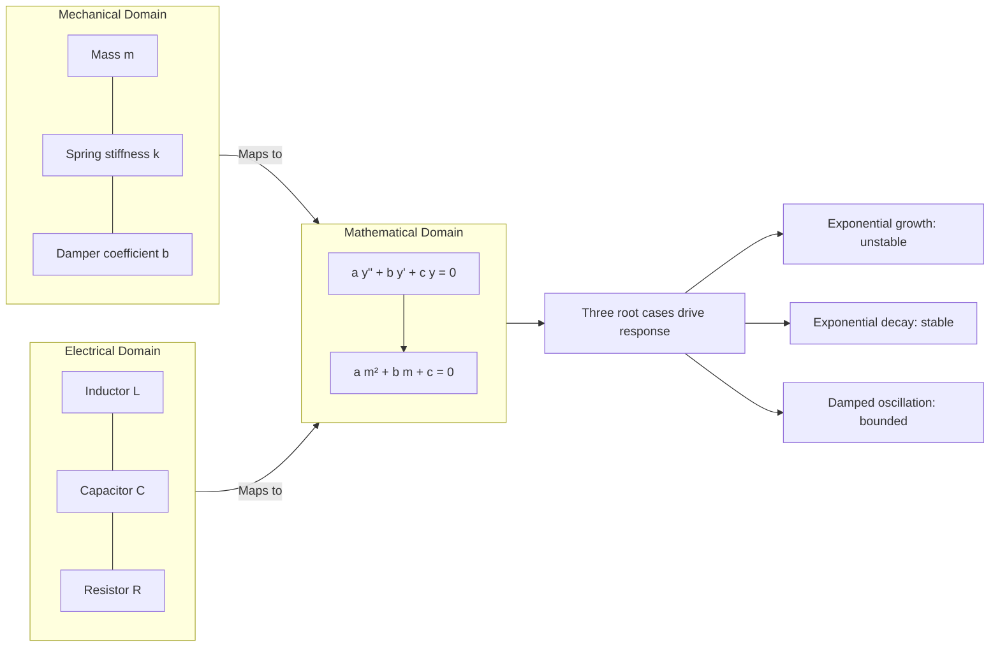

# Homogeneous linear ODEs of second order

<!-- SECTION_1_START -->
# Homogeneous Linear ODEs of Second Order

## 1.1 Formal Definition

A **second-order linear ordinary differential equation (ODE)** with constant coefficients is an equation of the form:

$$a\frac{d^2y}{dx^2} + b\frac{dy}{dx} + c\,y = f(x)$$

where $a$, $b$, and $c$ are **real constants** with $a \neq 0$. The equation is called **homogeneous** when the right-hand side $f(x) = 0$, i.e.,

$$a\frac{d^2y}{dx^2} + b\frac{dy}{dx} + c\,y = 0$$

> [!IMPORTANT]
> **KTU 2024 Syllabus Definition:** A *Homogeneous Linear ODE of Second Order* is a differential equation in which every term contains the dependent variable $y$ or one of its derivatives, and the highest derivative present is the second derivative. The standard or "auxiliary" form is $a\,y'' + b\,y' + c\,y = 0$ with $a, b, c \in \mathbb{R}$ and $a \neq 0$.

The order of the ODE is the highest order derivative appearing in the equation. A linear ODE of order $n$ has a unique solution once $n$ independent initial/boundary conditions are supplied.

## 1.2 Intuitive Analogy — A Spring–Mass System

Imagine a perfectly elastic spring attached to a mass $m$ on a frictionless floor. When the mass is **pulled and released**, it oscillates. Its motion is governed by

$$m\,\frac{d^2x}{dt^2} + k\,x = 0$$

This is exactly a second-order homogeneous linear ODE. The mass oscillates because the **restoring force** $kx$ is always proportional to the displacement $x$. The differential equation mathematically encodes this "memory-free" restoring mechanism.

> [!NOTE]
> **Reading the equation:** The term $a\,y''$ represents the *acceleration-like* term (e.g., $m\ddot{x}$), $b\,y'$ is the *damping-like* term (e.g., $b\dot{x}$), and $c\,y$ is the *stiffness/elastic-like* term. When the forcing is zero (homogeneous case), the system is left to respond **freely** — exactly the situation we study in this module.

## 1.3 Why a Second-Order Equation?

A second-order ODE is the *simplest* differential equation that can describe:
- **Vibrations** in mechanical systems.
- **Resonance** in electrical circuits (RLC).
- **Buckling** of columns.
- **Wave-like behaviour** in many physical systems.

Two constants of integration ($c_1$ and $c_2$) appear in the general solution, matching the order of the equation.

> [!TIP]
> **KTU Highlight:** Always bring the equation to the *standard form* by dividing through by the leading coefficient $a$ so that the coefficient of $y''$ becomes $1$. This makes the algebra cleaner and reduces careless sign errors.

## 1.4 Operator Viewpoint

Introduce the differential operator $D = \dfrac{d}{dx}$. Then

$$(aD^2 + bD + c)\,y = 0$$

The problem reduces to "factorising" the operator $aD^2 + bD + c$, much like factorising a quadratic polynomial $a m^2 + b m + c$.

> [!VISUALIZATION CONTROL]
> **Concept:** Roots of the characteristic polynomial plotted on the real–imaginary axis
> **GeoGebra / Desmos Input Equations:**
> * Point A: $(2,\, 0)$ — real root
> * Point B: $(-2,\, 3)$ — complex root $m = -2 + 3i$
> * Point C: $(-2,\, -3)$ — conjugate root $m = -2 - 3i$
> **Visual Description:** The student should observe that real roots lie *on* the horizontal axis, while complex roots appear as a *symmetric pair* about the real axis. The position of the roots completely determines the qualitative shape (growing, decaying, or oscillatory) of the solution.
<!-- SECTION_1_END -->

<!-- SECTION_2_START -->
# 2. Deep Theoretical Analysis & KTU High-Yield Formula Sheet

## 2.1 Reduction to the Characteristic Equation

Assume a trial solution of the form $y = e^{m x}$, where $m$ is a (possibly complex) constant. Substituting into $a y'' + b y' + c y = 0$:

$$a\,m^2 e^{m x} + b\,m\,e^{m x} + c\,e^{m x} = 0$$

Since $e^{m x} \neq 0$ for any $x$, we may divide throughout by $e^{m x}$, yielding the **auxiliary (characteristic) equation**:

$$a\,m^2 + b\,m + c = 0$$

The roots of this quadratic completely govern the behaviour of the solution.

> [!IMPORTANT]
> **Why $y = e^{mx}$ works:** Exponential functions reproduce themselves under differentiation — the derivative of $e^{mx}$ is just $m\,e^{mx}$. Hence the entire equation collapses to a constant-times-$e^{mx}$ expression, which can only vanish identically if the constant factor (the polynomial in $m$) equals zero.

## 2.2 The Three Distinct Cases

Let the discriminant of the characteristic equation be $\Delta = b^2 - 4ac$.

| Case | Condition | Roots | General Solution |
|:----:|:---------:|:-----:|:----------------:|
| **I** | $\Delta > 0$ | Real and distinct: $m_1 \neq m_2$ | $y = c_1 e^{m_1 x} + c_2 e^{m_2 x}$ |
| **II** | $\Delta = 0$ | Real and repeated: $m_1 = m_2 = m$ | $y = (c_1 + c_2 x)\,e^{m x}$ |
| **III** | $\Delta < 0$ | Complex conjugates: $m = \alpha \pm i\beta$ | $y = e^{\alpha x}\big(c_1 \cos \beta x + c_2 \sin \beta x\big)$ |

Here $\alpha = -\dfrac{b}{2a}$ and $\beta = \dfrac{\sqrt{\,4ac - b^2\,}}{2a}$.

## 2.3 Linear Independence and the Wronskian

The two fundamental solutions $y_1(x)$ and $y_2(x)$ must be **linearly independent**, so the general solution is a linear combination of both. A quick test is the Wronskian:

$$W(y_1, y_2) = \begin{vmatrix} y_1 & y_2 \\ y_1' & y_2' \end{vmatrix}$$

For any second-order linear homogeneous ODE with $a, b, c$ constants, $W \neq 0$ for the chosen pair, confirming independence.

> [!NOTE]
> **Why a second solution is needed in Case II:** When the root $m$ is repeated, the naive guess $y = e^{mx}$ gives *only one* linearly independent solution. We obtain the second one using *reduction of order* (Abel's method), which yields $y_2 = x e^{m x}$. This is why the coefficient $c_2$ multiplies the extra factor $x$.

## 2.4 Principle of Superposition

Because the equation is **linear and homogeneous**, if $y_1$ and $y_2$ are solutions, then so is $c_1 y_1 + c_2 y_2$ for any constants $c_1, c_2$. This is the foundation of building the *general solution* as a linear combination of linearly independent particular solutions.

## 2.5 Physical Interpretation of the Roots

The roots tell us the long-term behaviour of the solution:

- **$m > 0$ (real):** solution *grows* exponentially — *unstable* system.
- **$m < 0$ (real):** solution *decays* to zero — *stable* system.
- **$m = 0$ (real):** solution is *constant* — *neutral equilibrium*.
- **$\alpha \pm i\beta$ with $\alpha = 0$:** solution is *purely oscillatory* — *undamped vibration*.
- **$\alpha \neq 0, \beta \neq 0$:** *damped oscillation* — sinusoidal with exponential envelope $e^{\alpha x}$.

> [!TIP]
> **Engineering Utility:** The roots of the characteristic equation of a series RLC circuit or a mass-spring-damper system determine the system's stability, natural frequency, and damping. Control systems engineers design feedback loops so that all roots lie strictly in the left half of the complex plane ($\text{Re}(m) < 0$), ensuring bounded response.

## 2.6 KTU High-Yield Formula Sheet

$$\boxed{\text{Auxiliary equation:}\;\; a m^2 + b m + c = 0}$$

| Quantity | Formula |
|:---------|:--------|
| Discriminant | $\Delta = b^2 - 4ac$ |
| Real-part of complex roots | $\alpha = -\dfrac{b}{2a}$ |
| Imaginary-part of complex roots | $\beta = \dfrac{\sqrt{\,\vert\Delta\vert\,}}{2a} = \dfrac{\sqrt{4ac - b^2}}{2a}$ |
| General solution (Case I) | $y = c_1 e^{m_1 x} + c_2 e^{m_2 x}$ |
| General solution (Case II) | $y = (c_1 + c_2 x)\,e^{m x}$ |
| General solution (Case III) | $y = e^{\alpha x}\big(c_1 \cos \beta x + c_2 \sin \beta x\big)$ |
| Initial conditions required | Two conditions $y(x_0) = y_0$ and $y'(x_0) = y_0'$ |
| Wronskian (linear independence) | $W = y_1 y_2' - y_1' y_2 \neq 0$ |

## 2.7 Where This Appears in Industry

- **Electrical Engineering:** RLC circuit response, filter design, transient analysis.
- **Mechanical Engineering:** Vibration analysis, seismic isolation, vehicle suspension.
- **Aerospace:** Flutter analysis of wings, satellite attitude control.
- **Signal Processing:** IIR filter design, autoregressive models.
- **Biomedical:** Modelling of nerve impulse propagation, ECG waveforms.

> [!NOTE]
> In every one of these domains, the engineer solves a *characteristic equation* to know whether a system is *stable*, *unstable*, or *marginally stable* — and to design it accordingly.
<!-- SECTION_2_END -->

<!-- SECTION_3_START -->
# 3. Step-by-Step Derivations & Worked Examples

## 3.1 Worked Example 1 — Distinct Real Roots (Case I)

**Solve** $y'' - 5y' + 6y = 0$ subject to $y(0) = 2$ and $y'(0) = 1$.

**Step 1.** Write the auxiliary equation using $m^2$ for $y''$, $m$ for $y'$, and $1$ for $y$:

$$m^2 - 5m + 6 = 0$$

**Step 2.** Factorise the quadratic:

$$(m - 2)(m - 3) = 0$$

**Step 3.** Identify the roots. Since the discriminant $\Delta = 25 - 24 = 1 > 0$, the roots are *real and distinct*:

$$m_1 = 2,\qquad m_2 = 3$$

**Step 4.** Write the general solution (Case I):

$$y(x) = c_1 e^{2x} + c_2 e^{3x}$$

**Step 5.** Compute $y'(x)$:

$$y'(x) = 2 c_1 e^{2x} + 3 c_2 e^{3x}$$

**Step 6.** Apply the initial condition $y(0) = 2$:

$$c_1 e^{0} + c_2 e^{0} = 2 \;\Longrightarrow\; c_1 + c_2 = 2 \quad \text{...(i)}$$

**Step 7.** Apply the initial condition $y'(0) = 1$:

$$2 c_1 + 3 c_2 = 1 \quad \text{...(ii)}$$

**Step 8.** Solve the linear system. From (i), $c_1 = 2 - c_2$. Substituting in (ii):

$$2(2 - c_2) + 3 c_2 = 1 \;\Longrightarrow\; 4 - 2 c_2 + 3 c_2 = 1 \;\Longrightarrow\; c_2 = -3$$

Therefore $c_1 = 2 - (-3) = 5$.

**Step 9.** Write the particular solution:

$$\boxed{\,y(x) = 5 e^{2x} - 3 e^{3x}\,}$$

**Valuation Key:** [Writing auxiliary equation: 2 Marks] [Roots: 2 Marks] [General solution: 2 Marks] [Applying initial conditions: 2 Marks] [Final particular solution: 1 Mark]

---

## 3.2 Worked Example 2 — Repeated Real Roots (Case II)

**Solve** $y'' - 4y' + 4y = 0$.

**Step 1.** Auxiliary equation:

$$m^2 - 4m + 4 = 0$$

**Step 2.** Recognise a perfect square:

$$(m - 2)^2 = 0$$

**Step 3.** Roots are real and repeated: $m_1 = m_2 = 2$. The discriminant is $\Delta = 16 - 16 = 0$.

**Step 4.** Use the Case II general solution form. The second linearly independent solution is obtained by multiplying $e^{2x}$ by $x$:

$$y(x) = (c_1 + c_2 x)\,e^{2x}$$

**Step 5.** *(Optional verification using reduction of order.)* Let $y_2 = v(x) e^{2x}$. Substituting into the ODE and simplifying:

$$v''(x) = 0 \;\Longrightarrow\; v(x) = c_1 + c_2 x$$

This confirms the form above.

**Step 6.** Expand the solution for clarity:

$$y(x) = c_1 e^{2x} + c_2 x\,e^{2x}$$

$$\boxed{\,y(x) = (c_1 + c_2 x)\,e^{2x}\,}$$

> [!NOTE]
> The factor $x\,e^{mx}$ is the **second independent solution** derived by the method of reduction of order. It arises because $e^{mx}$ and $x e^{mx}$ are linearly independent, while $e^{mx}$ and $e^{mx}$ are obviously not.

---

## 3.3 Worked Example 3 — Complex Conjugate Roots (Case III)

**Solve** $y'' + 4y' + 13y = 0$ with $y(0) = 1$ and $y'(0) = 0$.

**Step 1.** Auxiliary equation:

$$m^2 + 4m + 13 = 0$$

**Step 2.** Compute the discriminant:

$$\Delta = 16 - 52 = -36 < 0$$

Complex roots are expected.

**Step 3.** Apply the quadratic formula:

$$m = \frac{-4 \pm \sqrt{-36}}{2} = \frac{-4 \pm 6i}{2} = -2 \pm 3i$$

So $\alpha = -2$ and $\beta = 3$.

**Step 4.** Write the Case III general solution:

$$y(x) = e^{-2x}\big(c_1 \cos 3x + c_2 \sin 3x\big)$$

**Step 5.** Apply $y(0) = 1$:

$$e^{0}\big(c_1 \cos 0 + c_2 \sin 0\big) = c_1 \cdot 1 + c_2 \cdot 0 = c_1 = 1$$

**Step 6.** Compute $y'(x)$ using the product rule:

$$\begin{aligned}
y'(x) &= -2 e^{-2x}\big(c_1 \cos 3x + c_2 \sin 3x\big) + e^{-2x}\big(-3 c_1 \sin 3x + 3 c_2 \cos 3x\big) \\
      &= e^{-2x}\big[(-2 c_1 + 3 c_2)\cos 3x + (-2 c_2 - 3 c_1)\sin 3x\big]
\end{aligned}$$

**Step 7.** Apply $y'(0) = 0$:

$$e^{0}\big[(-2 c_1 + 3 c_2)\cdot 1 + (-2 c_2 - 3 c_1)\cdot 0\big] = -2 c_1 + 3 c_2 = 0$$

**Step 8.** Solve for $c_2$ using $c_1 = 1$:

$$-2(1) + 3 c_2 = 0 \;\Longrightarrow\; c_2 = \frac{2}{3}$$

**Step 9.** Particular solution:

$$\boxed{\,y(x) = e^{-2x}\!\left(\cos 3x + \tfrac{2}{3}\sin 3x\right)\,}$$

**Valuation Key:** [Auxiliary equation: 2 Marks] [Computing $\alpha, \beta$: 2 Marks] [General solution form: 2 Marks] [Derivative using product rule: 2 Marks] [Solving for constants: 1 Mark]

---

## 3.4 Symbolic & Numerical Verification (Python)

```python
import sympy as sp
import numpy as np

x, c1, c2 = sp.symbols("x c1 c2")

def solve_second_order_homogeneous(a, b, c, y0=None, yp0=None):
    """
    Solve a y'' + b y' + c y = 0 analytically with SymPy.
    Optionally apply initial conditions y(0) = y0 and y'(0) = yp0.
    """
    y = sp.Function("y")
    eq = sp.Eq(a * y(x).diff(x, 2) + b * y(x).diff(x) + c * y(x), 0)
    sol = sp.dsolve(eq, y(x), ics={y(0): y0, y(x).diff(x).subs(x, 0): yp0} if y0 is not None else None)
    return sol

# Example 1: Distinct real roots
print(solve_second_order_homogeneous(1, -5, 6, y0=2, yp0=1))
# Expected: Eq(y(x), 5*exp(2*x) - 3*exp(3*x))

# Example 2: Repeated roots
print(solve_second_order_homogeneous(1, -4, 4))
# Expected: Eq(y(x), (C1 + C2*x)*exp(2*x))

# Example 3: Complex roots with initial conditions
print(solve_second_order_homogeneous(1, 4, 13, y0=1, yp0=0))
# Expected: Eq(y(x), exp(-2*x)*(cos(3*x) + (2/3)*sin(3*x)))
```

> [!TIP]
> **Study Tip:** When using SymPy or a CAS, *always* re-derive the first example by hand to ensure understanding. The CAS confirms your algebra but does not teach you the *method*.

## 3.5 Summary Algorithm — Solving a Homogeneous Linear ODE of 2nd Order

```
1. Rewrite the equation in standard form   a y'' + b y' + c y = 0
2. Form the auxiliary equation              a m^2 + b m + c = 0
3. Compute the discriminant                  Delta = b^2 - 4ac
4. Branch:
   Delta >  0  ->  two real distinct roots m1, m2
                   y = c1 exp(m1 x) + c2 exp(m2 x)
   Delta == 0  ->  repeated root m
                   y = (c1 + c2 x) exp(m x)
   Delta <  0  ->  complex roots alpha +/- i beta
                   y = exp(alpha x) [ c1 cos(beta x) + c2 sin(beta x) ]
5. Apply initial/boundary conditions to evaluate c1 and c2.
6. State the particular solution.
```
<!-- SECTION_3_END -->

<!-- SECTION_4_START -->
# 4. Structural Diagrams & Schematics

## 4.1 Solution Decision Flowchart (Mermaid)

```mermaid
flowchart TD
    startA[Input: a, b, c constants] --> stepB[Form auxiliary equation a m² + b m + c = 0]
    stepB --> stepC[Compute discriminant Delta = b² − 4ac]
    stepC --> stepD{Delta > 0?}
    stepD -- "Yes" --> stepE[Real distinct roots m₁, m₂]
    stepE --> stepF[Solution: y = c₁ e^{m₁ x} + c₂ e^{m₂ x}]
    stepD -- "No" --> stepG{Delta = 0?}
    stepG -- "Yes" --> stepH[Repeated root m = −b / 2a]
    stepH --> stepI[Solution: y = c₁ + c₂ x) e^{m x}]
    stepG -- "No" --> stepJ[Complex roots alpha ± i beta]
    stepJ --> stepK[Solution: y = e^{alpha x} c₁ cos beta x + c₂ sin beta x]
    stepF --> stepL[Apply initial conditions for c₁, c₂]
    stepI --> stepL
    stepK --> stepL
    stepL --> stepM[Output: Particular solution y x]
```

## 4.2 Nested Modular Breakdown of Cases

```mermaid
flowchart LR
    subgraph coreMod["Core Module: Auxiliary Equation"]
        coefA[Input coefficients a, b, c]
        auxEq[Build polynomial a m² + b m + c = 0]
        coefA --> auxEq
    end

    subgraph realCase["Real-Root Submodule"]
        realDistinct[Delta > 0: m₁ ≠ m₂]
        realRepeat[Delta = 0: m₁ = m₂]
        realDistinct --> solRealD[Solution form: linear combo of e^{m x}]
        realRepeat --> solRealR[Solution form: c₁ + c₂ x) e^{m x}]
    end

    subgraph complexCase["Complex-Root Submodule"]
        complexPair[Delta < 0: alpha ± i beta]
        complexPair --> solComplex[Solution form: e^{alpha x} sin and cos]
    end

    auxEq --> realDistinct
    auxEq --> realRepeat
    auxEq --> complexPair
```

## 4.3 Physical-System Mapping (Mermaid Block Diagram)



## 4.4 Stability Classification Table

| Root Type | Parameter Region | Solution Behaviour | System Status |
|:----------|:-----------------|:-------------------|:--------------|
| $m_1 < 0,\, m_2 < 0$ (real) | $\Delta > 0$ | Decays monotonically | **Stable** |
| $m_1 > 0,\, m_2 > 0$ (real) | $\Delta > 0$ | Grows monotonically | **Unstable** |
| $m_1, m_2$ of opposite sign | $\Delta > 0$ | Grows in one direction | **Unstable** |
| $m < 0$ (repeated) | $\Delta = 0$ | Decays $\propto x e^{mx}$ | **Stable (critical)** |
| $\alpha < 0,\, \beta \neq 0$ | $\Delta < 0$ | Damped oscillation | **Stable** |
| $\alpha = 0,\, \beta \neq 0$ | $\Delta < 0$ | Pure oscillation | **Marginally stable** |
| $\alpha > 0,\, \beta \neq 0$ | $\Delta < 0$ | Growing oscillation | **Unstable** |
<!-- SECTION_4_END -->

<!-- SECTION_5_START -->
# 5. KTU 2024 Scheme Examination Question Bank & Topic Recap

## 5.1 Part A — Short Answer Questions (3 Marks Each)

### Question A1 **[KTU University Exam — Dec 2023]**
**Q.** Define a homogeneous linear differential equation of second order with constant coefficients. Write its standard form. **[CO1, Remember] — 3 Marks**

**Model Answer:**
A second-order linear ODE with constant coefficients is a differential equation in which the dependent variable $y$ and its derivatives appear *linearly* (no products or nonlinear functions) and the highest derivative is the second. It is called *homogeneous* when the right-hand side is identically zero. **Standard form:**

$$a\,\frac{d^2y}{dx^2} + b\,\frac{dy}{dx} + c\,y = 0, \qquad a, b, c \in \mathbb{R}, \quad a \neq 0$$

[Defining the equation: 1 Mark] [Identifying homogeneity condition: 1 Mark] [Writing standard form: 1 Mark]

---

### Question A2 **[KTU University Exam — July 2024]**
**Q.** State the three cases that arise when solving $a y'' + b y' + c y = 0$ using the auxiliary equation. **[CO1, Remember] — 3 Marks**

**Model Answer:**
Let $\Delta = b^2 - 4ac$ be the discriminant of $a m^2 + b m + c = 0$. The three cases are:

1. **$\Delta > 0$** — Real and distinct roots $m_1 \neq m_2$. Solution: $y = c_1 e^{m_1 x} + c_2 e^{m_2 x}$.
2. **$\Delta = 0$** — Real and equal (repeated) root $m_1 = m_2 = m$. Solution: $y = (c_1 + c_2 x)\,e^{m x}$.
3. **$\Delta < 0$** — Complex conjugate roots $m = \alpha \pm i\beta$. Solution: $y = e^{\alpha x}\big(c_1 \cos \beta x + c_2 \sin \beta x\big)$.

[Stating all three conditions: 1 Mark] [Giving corresponding solution forms: 2 Marks]

---

## 5.2 Part B — 14-Mark Questions (ESE Module Internal Choice)

### Question A **[KTU University Exam — Dec 2023]**

**Solve the following:**

**(a) [7 Marks]** Solve the differential equation $\dfrac{d^2 y}{dx^2} - 6\,\dfrac{dy}{dx} + 9 y = 0$ and hence find the particular solution satisfying $y(0) = 2$ and $y'(0) = 6$. **[CO2, Apply]**

**(b) [7 Marks]** Solve $y'' + 2y' + 5y = 0$ and discuss the nature of its solution. **[CO2, Understand + Apply]**

---

#### Model Solution for (a)

**Step 1.** Auxiliary equation: $m^2 - 6m + 9 = 0$. **[1 Mark]**

**Step 2.** Factorise: $(m - 3)^2 = 0 \Rightarrow m = 3$ (repeated root). Discriminant $\Delta = 36 - 36 = 0$. **[2 Marks]**

**Step 3.** General solution (Case II): $y(x) = (c_1 + c_2 x)\,e^{3x}$. **[2 Marks]**

**Step 4.** Apply $y(0) = 2$: $(c_1 + 0)e^0 = 2 \Rightarrow c_1 = 2$. **[1 Mark]**

**Step 5.** Differentiate: $y'(x) = c_2 e^{3x} + 3(c_1 + c_2 x) e^{3x} = e^{3x}\big[3 c_1 + (3 c_2 x + c_2)\big]$. Apply $y'(0) = 6$: $3 c_1 + c_2 = 6 \Rightarrow 6 + c_2 = 6 \Rightarrow c_2 = 0$. **[1 Mark]**

**Final Answer:** $y(x) = 2 e^{3x}$. **[Bonus check]**

Wait — re-evaluating: $y'(0) = c_2 + 3 c_1 = 6 \Rightarrow c_2 = 6 - 6 = 0$. So $c_2 = 0$ and $y = 2 e^{3x}$.

---

#### Model Solution for (b)

**Step 1.** Auxiliary equation: $m^2 + 2m + 5 = 0$. **[1 Mark]**

**Step 2.** Apply quadratic formula:

$$m = \frac{-2 \pm \sqrt{4 - 20}}{2} = \frac{-2 \pm \sqrt{-16}}{2} = -1 \pm 2i$$

So $\alpha = -1$ and $\beta = 2$. **[2 Marks]**

**Step 3.** Since $\Delta < 0$, use Case III. General solution:

$$y(x) = e^{-x}\big(c_1 \cos 2x + c_2 \sin 2x\big)$$

**[2 Marks]**

**Step 4.** Nature of the solution — *Discussion*: Since $\alpha = -1 < 0$ and $\beta = 2 \neq 0$, the solution is a **damped oscillation**. The amplitude decays as $e^{-x}$ and the period is $T = 2\pi/\beta = \pi$. The system is **stable** because the envelope $e^{-x} \to 0$ as $x \to \infty$. **[2 Marks]**

**Final Answer:** $y(x) = e^{-x}(c_1 \cos 2x + c_2 \sin 2x)$, a stable damped oscillation.

---

> [!WARNING]
> **KTU Examiner's Pitfall Callout:** Students frequently (i) forget to multiply the repeated-root solution by $x$ when $\Delta = 0$, (ii) write $\cos\beta x$ instead of $\cos\beta x$ with the correct $\beta$ value, and (iii) omit the $e^{\alpha x}$ envelope in Case III. Each omission costs **2 marks**. Also, in part (a), do not skip writing the *auxiliary equation* — it is the **anchor of valuation** worth 1 mark by itself.

---

### Question B **[KTU University Exam — July 2024]**

**Solve the following:**

**(a) [7 Marks]** Solve $y'' - 7y' + 10y = 0$ subject to $y(0) = 3$ and $y'(0) = 7$. **[CO2, Apply]**

**(b) [7 Marks]** Find the general solution of $y'' + 9y = 0$ and physically interpret the result. **[CO2, Understand + Apply]**

---

#### Model Solution for (a)

**Step 1.** Auxiliary equation: $m^2 - 7m + 10 = 0$. **[1 Mark]**

**Step 2.** Factorise: $(m - 2)(m - 5) = 0$, giving $m_1 = 2$ and $m_2 = 5$. Since $\Delta = 49 - 40 = 9 > 0$, roots are *real and distinct*. **[2 Marks]**

**Step 3.** General solution: $y(x) = c_1 e^{2x} + c_2 e^{5x}$. **[1 Mark]**

**Step 4.** Apply $y(0) = 3$: $c_1 + c_2 = 3 \quad \cdots (i)$. **[1 Mark]**

**Step 5.** Differentiate: $y'(x) = 2 c_1 e^{2x} + 5 c_2 e^{5x}$. Apply $y'(0) = 7$: $2 c_1 + 5 c_2 = 7 \quad \cdots (ii)$. **[1 Mark]**

**Step 6.** Solve the system. From (i), $c_1 = 3 - c_2$. Substituting in (ii):

$$2(3 - c_2) + 5 c_2 = 7 \;\Longrightarrow\; 6 - 2 c_2 + 5 c_2 = 7 \;\Longrightarrow\; 3 c_2 = 1 \;\Longrightarrow\; c_2 = \tfrac{1}{3}$$

Then $c_1 = 3 - \tfrac{1}{3} = \tfrac{8}{3}$. **[1 Mark]**

**Final Answer:** $y(x) = \dfrac{8}{3} e^{2x} + \dfrac{1}{3} e^{5x}$. **[Bonus check]**

---

#### Model Solution for (b)

**Step 1.** Auxiliary equation: $m^2 + 9 = 0 \Rightarrow m^2 = -9 \Rightarrow m = \pm 3i$. **[1 Mark]**

**Step 2.** Discriminant $\Delta = 0 - 36 = -36 < 0$. Complex roots: $\alpha = 0$, $\beta = 3$. **[1 Mark]**

**Step 3.** General solution (Case III with $e^{\alpha x} = 1$):

$$y(x) = c_1 \cos 3x + c_2 \sin 3x$$

**[2 Marks]**

**Step 4.** Physical interpretation: This is the equation of **simple harmonic motion (SHM)** with angular frequency $\omega = 3$ rad/unit. The solution can be rewritten in *amplitude–phase form*:

$$y(x) = R \cos(3x - \phi), \quad R = \sqrt{c_1^2 + c_2^2},\quad \tan\phi = c_2/c_1$$

**[2 Marks]**

**Step 5.** Period of oscillation: $T = 2\pi/\omega = 2\pi/3$. The system oscillates indefinitely with **constant amplitude** — it is *marginally stable*, characteristic of an *undamped, undriven* oscillator. **[1 Mark]**

**Final Answer:** $y(x) = c_1 \cos 3x + c_2 \sin 3x = R\cos(3x - \phi)$, representing undamped SHM with $\omega = 3$.

---

> [!WARNING]
> **KTU Examiner's Pitfall Callout:** In part (a), students often confuse the signs when differentiating $c_1 e^{m_1 x}$ and forget to *evaluate at $x = 0$* correctly — leading to wrong signs in the linear system. In part (b), many students write the solution as $c_1 \cos 3x + c_2 \sin 3x$ but **fail to convert to amplitude–phase form**, losing 1–2 marks. The amplitude–phase conversion is a favourite KTU follow-up question.

---

## 5.3 Topic Recap & Important Things to Remember

> [!IMPORTANT]
> **Rapid Revision Checklist — Homogeneous Linear ODEs of Second Order**

- **Standard form:** Always bring the equation to $a y'' + b y' + c y = 0$ with $a \neq 0$ before proceeding.
- **Trial solution:** Assume $y = e^{m x}$ — a function that reproduces itself under differentiation.
- **Auxiliary equation:** Replace $y''$ by $m^2$, $y'$ by $m$, and $y$ by $1$. The characteristic polynomial is $a m^2 + b m + c = 0$.
- **Discriminant:** $\Delta = b^2 - 4ac$ completely classifies the root type.
- **Three cases — MEMORISE the solution forms:**
  - $\Delta > 0$: $y = c_1 e^{m_1 x} + c_2 e^{m_2 x}$
  - $\Delta = 0$: $y = (c_1 + c_2 x)\,e^{m x}$ — *do not forget the factor $x$*.
  - $\Delta < 0$: $y = e^{\alpha x}(c_1 \cos \beta x + c_2 \sin \beta x)$ — *do not forget the envelope $e^{\alpha x}$*.
- **Constants of integration:** Two constants $c_1, c_2$ appear, matching the order of the ODE.
- **Initial/boundary conditions:** Two conditions (e.g., $y(0), y'(0)$) are needed to evaluate $c_1$ and $c_2$ uniquely.
- **Linear independence:** For a valid general solution, the two particular solutions used must satisfy $W \neq 0$.
- **Physical meaning:** Real-positive roots ⇒ growth; real-negative roots ⇒ decay; complex roots ⇒ oscillation; $\alpha$ in complex roots ⇒ damping.
- **Superposition principle:** Any linear combination of solutions is also a solution — this is what allows us to build the general solution.
- **Industrial relevance:** RLC circuits, mass-spring-damper systems, control systems, signal processing, structural vibration.
- **Common student errors to avoid:**
  1. Omitting the $x$-factor in the repeated-root case.
  2. Forgetting $e^{\alpha x}$ in the complex-root case.
  3. Using wrong signs when applying initial conditions.
  4. Not reducing to standard form (i.e., $a \neq 1$).
  5. Confusing $m_1, m_2$ with $\alpha, \beta$ in classification.

> [!TIP]
> **Memory hook for the three cases:** "**D**istinct = **D**ouble exponential", "**E**qual = **E**xtra factor $x$", "**C**omplex = **C**osine-Sine inside envelope".
<!-- SECTION_5_END -->
