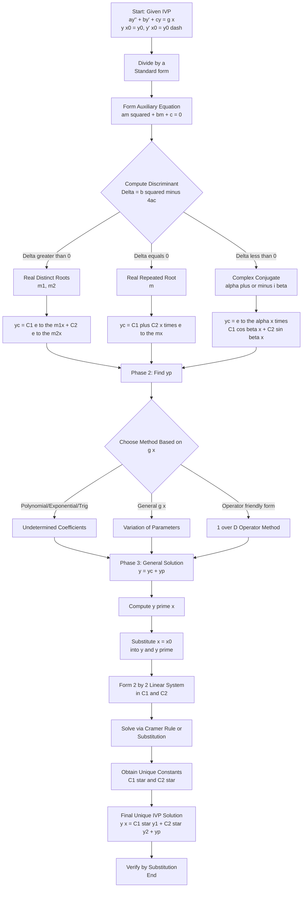
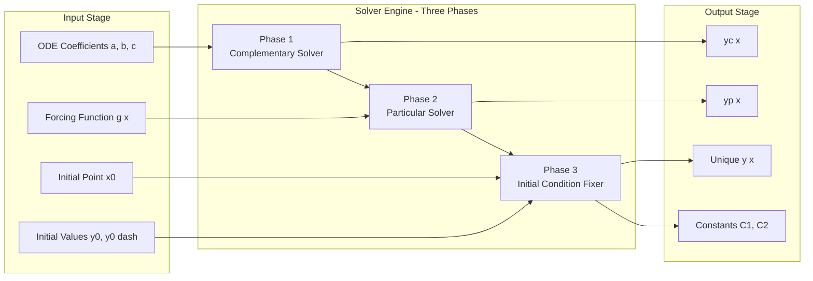
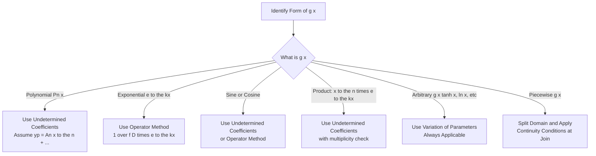
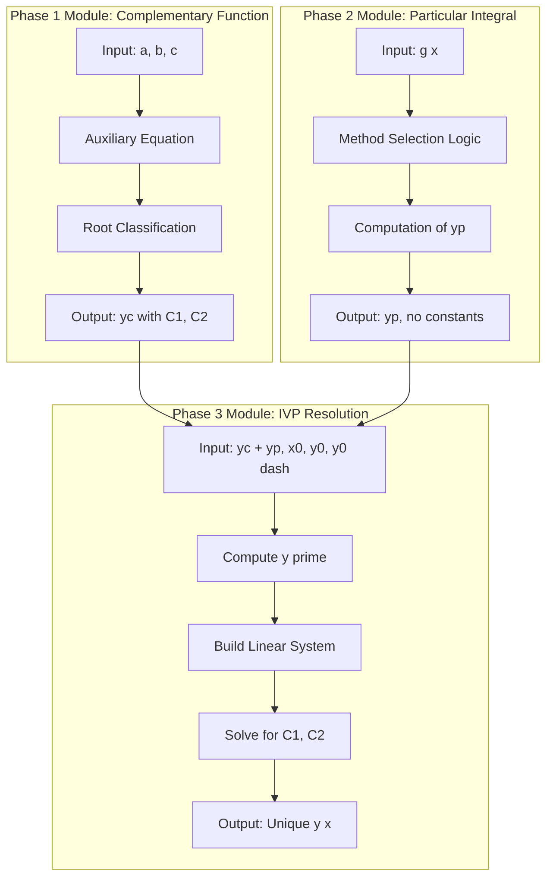

# Initial value Problem for Non-Homogeneous Second order linear ODE(with constant coefficients)

<!-- SECTION_1_START -->

# Initial Value Problem for Non-Homogeneous Second Order Linear ODEs (Constant Coefficients)

## 1.1 Formal KTU 2024 Definition

An **Initial Value Problem (IVP)** for a non-homogeneous second order linear ordinary differential equation with constant coefficients is a problem of the form:

$$\begin{aligned}
a\,\frac{d^{2}y}{dx^{2}} + b\,\frac{dy}{dx} + c\,y &= g(x), \quad x \in I \\
y(x_{0}) &= y_{0} \\
y'(x_{0}) &= y_{0}'
\end{aligned}$$

where $a, b, c \in \mathbb{R}$ are **constants** with $a \neq 0$, $g(x)$ is the *forcing function* (non-homogeneous term), and $y_0, y_0'$ are the prescribed **initial conditions** evaluated at the initial point $x_0$.

The complete solution is universally written as:

$$y(x) = y_c(x) + y_p(x)$$

where $y_c(x)$ is the **complementary function** (solution of the associated homogeneous ODE) and $y_p(x)$ is the **particular integral** (any specific solution of the full non-homogeneous ODE).

> [!IMPORTANT]
> **KTU Syllabus Highlight (Module 2):** The student is required to (i) formulate the IVP, (ii) identify the auxiliary equation, (iii) construct $y_c$ based on the nature of roots (real-distinct, real-repeated, complex-conjugate), (iv) find $y_p$ by *Method of Undetermined Coefficients* / *Method of Variation of Parameters* / *Operator Method* ($1/D$ method), and finally (v) apply initial conditions to evaluate the arbitrary constants $C_1, C_2$.

---

## 1.2 Intuitive Analogy — "The Musical Instrument with Two Tuning Knobs"

Imagine a guitar string pinned at both ends. The string's natural vibrations produce a *complementary pattern* $y_c(x)$ — these are the free oscillations determined purely by the string's tension, mass, and length (encoded in $a, b, c$). If you now pluck the string with a forced periodic motion $g(x)$, the string responds with a forced pattern $y_p(x)$ superimposed on its natural motion.

The two **initial conditions** $y(x_0)$ and $y'(x_0)$ are like the *initial position* and *initial velocity* of a particular point on the string at time $t = t_0$. Just as a ball thrown upward needs both its starting height and starting speed to predict its trajectory uniquely, our ODE needs two pieces of data to lock down the two unknown constants $C_1$ and $C_2$ in the general solution. Without them, we have a *family* of infinitely many solutions; with them, we pick **one unique trajectory** from that family.

> [!NOTE]
> **Why two conditions?** A second-order ODE is essentially a "position-versus-time" system. Newton's second law $\,F = m\,\ddot{x}\,$ needs both $x(0)$ and $\dot{x}(0)$ to produce a unique motion path. The IVP is the mathematical embodiment of this physical fact.

---

## 1.3 Existence and Uniqueness Theorem (KTU High-Yield Result)

> [!IMPORTANT]
> **Theorem (Fundamental IVP Theorem):** Let $a, b, c$ be real constants, $a \neq 0$, and let $g(x)$ be continuous on an open interval $I$ containing $x_0$. Then for any real numbers $y_0$ and $y_0'$, the IVP above possesses **exactly one solution** $y(x)$ defined throughout the entire interval $I$.

The proof relies on the fact that the coefficient $a$ never vanishes, so the equation can always be divided by $a$ to put it in *standard form*:

$$y'' + P(x)\,y' + Q(x)\,y = f(x)$$

with $P, Q, f$ continuous, satisfying the hypotheses of the standard existence-uniqueness theorem.

> [!VISUALIZATION CONTROL]
> **Concept:** Family of solution curves $y(x; C_1, C_2)$ being "stitched" into a single curve by the two initial conditions.
> **GeoGebra / Desmos Input Equations:**
> * For the case $y'' - 3y' + 2y = 0$, $\,y_c = C_1 e^{x} + C_2 e^{2x}$
> * Parametric input: `slider C1 from -3 to 3`, `slider C2 from -3 to 3`
> * **Visual Description:** A family of curves sweeping across the plane, all passing through an *envelope* determined by the auxiliary equation. As you vary $C_1$ and $C_2$, the family "sweeps" the entire solution space. The IVP picks **one** member of this family that passes through the point $(x_0, y_0)$ with slope $y_0'$.

---

<!-- SECTION_1_END -->

<!-- SECTION_2_START -->

# Deep Theoretical Analysis & KTU High-Yield Formula Sheet

## 2.1 The Three-Phase Solution Architecture

Solving an IVP for a non-homogeneous 2nd order linear ODE with constant coefficients decomposes into **three rigorously distinct phases**:

### Phase 1 — Construct the Complementary Function $y_c(x)$

1. Write the **auxiliary (characteristic) equation**: $\,a\,m^{2} + b\,m + c = 0$.
2. Compute the discriminant $\Delta = b^{2} - 4ac$.
3. Classify the roots and write $y_c$:

| Nature of Roots | Form of $y_c(x)$ | Condition |
|---|---|---|
| Real and distinct $m_1 \neq m_2$ | $y_c = C_1 e^{m_1 x} + C_2 e^{m_2 x}$ | $\Delta > 0$ |
| Real and repeated $m_1 = m_2 = m$ | $y_c = (C_1 + C_2 x)\,e^{m x}$ | $\Delta = 0$ |
| Complex conjugate $m = \alpha \pm i\beta$ | $y_c = e^{\alpha x}\,(C_1 \cos\beta x + C_2 \sin\beta x)$ | $\Delta < 0$ |

> [!NOTE]
> The complementary function is the **general solution of the homogeneous equation**. It carries the *two arbitrary constants* $C_1, C_2$ that will eventually be fixed by the initial conditions.

### Phase 2 — Construct the Particular Integral $y_p(x)$

Choose a method based on the form of $g(x)$:

**Method A — Method of Undetermined Coefficients (Guess Method):** Assume $y_p$ in the same functional family as $g(x)$ (polynomials, exponentials, sines, cosines), then solve for unknown coefficients.

**Method B — Method of Variation of Parameters:** Substitute $y_p = u_1(x)\,y_1(x) + u_2(x)\,y_2(x)$ where $y_1, y_2$ are the two linearly independent solutions from $y_c$. Solve:

$$\begin{aligned}
u_1'(x) &= -\frac{y_2(x)\,g(x)}{a\,W(y_1, y_2)} \\
u_2'(x) &= \frac{y_1(x)\,g(x)}{a\,W(y_1, y_2)}
\end{aligned}$$

where $W(y_1, y_2) = y_1 y_2' - y_1' y_2$ is the **Wronskian**.

**Method C — Operator Method ($1/D$ Method):** Use inverse operator notation $y_p = \dfrac{1}{f(D)}\,g(x)$ with the standard operator table.

### Phase 3 — Apply Initial Conditions

Form the **complete general solution** $y(x) = y_c(x) + y_p(x)$, then compute $y'(x)$ and substitute $x = x_0$:

$$\begin{aligned}
y(x_0) &= y_0 \quad \Rightarrow \quad \text{Linear equation in } C_1, C_2 \\
y'(x_0) &= y_0' \quad \Rightarrow \quad \text{Linear equation in } C_1, C_2
\end{aligned}$$

Solve the resulting $2 \times 2$ linear system (typically via Cramer's rule) to obtain unique numerical values for $C_1$ and $C_2$.

> [!IMPORTANT]
> **Existence & Uniqueness Guarantee:** Since the coefficient $a \neq 0$ and the Wronskian $W(y_1, y_2) \neq 0$ for linearly independent $y_1, y_2$, the $2 \times 2$ system always has a **unique solution** for $(C_1, C_2)$. This is the practical manifestation of the existence-uniqueness theorem.

---

## 2.2 KTU Formula Sheet — High-Yield Reference Table

> [!IMPORTANT]
> **Operator Notation Key:** $D \equiv \dfrac{d}{dx}$, so $D^{2} \equiv \dfrac{d^{2}}{dx^{2}}$, and the ODE $ay'' + by' + cy = g(x)$ becomes $f(D)\,y = g(x)$ where $f(D) = aD^{2} + bD + c$.

| $\#$ | Concept | Formula / Expression | Engineering Domain |
|---|---|---|---|
| 1 | Standard IVP form | $a y'' + b y' + c y = g(x),\; y(x_0)=y_0,\; y'(x_0)=y_0'$ | Universal |
| 2 | Auxiliary equation | $a m^{2} + b m + c = 0$ | Universal |
| 3 | Discriminant | $\Delta = b^{2} - 4ac$ | Universal |
| 4 | Roots of auxiliary equation | $m = \dfrac{-b \pm \sqrt{\Delta}}{2a}$ | Universal |
| 5 | Complementary function (distinct roots) | $y_c = C_1 e^{m_1 x} + C_2 e^{m_2 x}$ | Control systems, RLC circuits |
| 6 | Complementary function (repeated root) | $y_c = (C_1 + C_2 x)\,e^{m x}$ | Critically damped systems |
| 7 | Complementary function (complex roots) | $y_c = e^{\alpha x}(C_1 \cos\beta x + C_2 \sin\beta x)$ | Oscillatory circuits, AC analysis |
| 8 | Complete general solution | $y = y_c + y_p$ | Universal |
| 9 | Wronskian of $y_1, y_2$ | $W(y_1, y_2) = y_1 y_2' - y_1' y_2$ | Variation of parameters |
| 10 | Variation of parameters $u_1'$ | $u_1' = -\dfrac{y_2(x)\,g(x)}{a\,W(y_1,y_2)}$ | Universal |
| 11 | Variation of parameters $u_2'$ | $u_2' = \dfrac{y_1(x)\,g(x)}{a\,W(y_1,y_2)}$ | Universal |
| 12 | Operator inverse — exponential case | $\dfrac{1}{f(D)}e^{kx} = \dfrac{e^{kx}}{f(k)},\; f(k) \neq 0$ | Universal |
| 13 | Operator inverse — $e^{kx}$ with root of multiplicity $r$ | $\dfrac{1}{(D-k)^{r}}e^{kx} = \dfrac{x^{r}}{r!}e^{kx}$ | Universal |
| 14 | Operator inverse — sine/cosine | $\dfrac{1}{D^{2}+\omega^{2}}\sin\omega x = -\dfrac{x}{2\omega}\cos\omega x$ (when $D^{2}+\omega^{2}$ divides $g$) | AC steady state |
| 15 | Particular integral polynomial input | $\dfrac{1}{f(D)}(p_0 + p_1 x + \cdots) = $ substitute $D^{2}=0, D=0$ in denominator | Universal |
| 16 | Determinant for $C_1, C_2$ (Cramer's rule) | $\Delta_c = \begin{vmatrix} y_1(x_0) & y_2(x_0) \\ y_1'(x_0) & y_2'(x_0) \end{vmatrix}$ | Universal |
| 17 | Final unique IVP solution | $y(x) = C_1^{*} y_1(x) + C_2^{*} y_2(x) + y_p(x)$ | Universal |

> [!NOTE]
> The Wronskian $W$ of two solutions of $y'' + P(x) y' + Q(x) y = 0$ with $P, Q$ continuous obeys **Abel's identity**: $W(x) = W(x_0)\,\exp\!\left(-\int_{x_0}^{x} P(t)\,dt\right)$. For constant coefficients, $P = b/a$ is constant, giving $W(x) = W(x_0)\,e^{-(b/a)(x-x_0)} \neq 0$ — a powerful non-vanishing result.

---

## 2.3 Real-World Engineering Utility

The IVP formulation of a 2nd order linear ODE is the *workhorse* of nearly every branch of electrical and physical science:

| Engineering Field | Concrete Application | Equation Form |
|---|---|---|
| **Electrical Circuits (RLC)** | Series RLC circuit with input voltage $V(t)$ | $L\dfrac{d^{2}q}{dt^{2}} + R\dfrac{dq}{dt} + \dfrac{q}{C} = V(t)$ |
| **Control Systems** | Mass-spring-damper with external force | $m\ddot{x} + c\dot{x} + kx = F(t)$ |
| **Mechanical Vibrations** | Damped forced oscillator | $\ddot{x} + 2\zeta\omega_n \dot{x} + \omega_n^{2} x = \dfrac{F(t)}{m}$ |
| **Signal Processing** | Second-order filter response | $\ddot{y} + 2\zeta\omega_n \dot{y} + \omega_n^{2} y = K\omega_n^{2} x(t)$ |
| **Civil Engineering** | Building response to earthquake base motion | $m\ddot{u} + c\dot{u} + ku = -m\ddot{u}_g(t)$ |

In all these applications, **the initial conditions** $x(0) = x_0$ and $\dot{x}(0) = v_0$ specify the system's starting state, and the IVP produces the **unique future evolution** of the system.

---

<!-- SECTION_2_END -->

<!-- SECTION_3_START -->

# Step-by-Step Derivations & Code Implementation

## 3.1 Master Template Worked Example — Complete IVP Solution

**Solve the following IVP:**

$$y'' - 4y' + 3y = 6x + 4, \quad y(0) = 1, \quad y'(0) = 2$$

### Step 1 — Write the Homogeneous Equation and Auxiliary Equation

The associated homogeneous equation is:

$$y'' - 4y' + 3y = 0$$

Characteristic / auxiliary equation:

$$m^{2} - 4m + 3 = 0$$

Factoring:

$$(m-1)(m-3) = 0$$

Therefore $m_1 = 1$ and $m_2 = 3$ — two **real and distinct** roots.

### Step 2 — Construct the Complementary Function

$$y_c(x) = C_1 e^{x} + C_2 e^{3x}$$

**Step 2 Marks Valuation:** [Correct auxiliary equation: 1 Mark] [Correct roots: 1 Mark] [Correct form of $y_c$: 1 Mark]

### Step 3 — Construct the Particular Integral $y_p$

The forcing function $g(x) = 6x + 4$ is a **first-degree polynomial**. By the method of undetermined coefficients, we assume:

$$y_p(x) = Ax + B$$

Compute derivatives:

$$y_p'(x) = A, \qquad y_p''(x) = 0$$

Substitute into the original ODE:

$$0 - 4(A) + 3(Ax + B) = 6x + 4$$

$$3A\,x + (3B - 4A) = 6x + 4$$

Matching coefficients of $x$ and the constant term on both sides:

$$\begin{aligned}
3A &= 6 \quad \Rightarrow \quad A = 2 \\
3B - 4A &= 4 \quad \Rightarrow \quad 3B - 8 = 4 \quad \Rightarrow \quad B = 4
\end{aligned}$$

Therefore:

$$y_p(x) = 2x + 4$$

**Step 3 Marks Valuation:** [Correct guess form: 1 Mark] [Substitution: 1 Mark] [Solving for coefficients: 1 Mark] [Final $y_p$: 1 Mark]

### Step 4 — Form the General Solution

$$y(x) = y_c(x) + y_p(x) = C_1 e^{x} + C_2 e^{3x} + 2x + 4$$

### Step 5 — Apply the Initial Conditions

Compute the derivative of the general solution:

$$y'(x) = C_1 e^{x} + 3 C_2 e^{3x} + 2$$

**Apply $y(0) = 1$:**

$$C_1 e^{0} + C_2 e^{0} + 2(0) + 4 = 1$$

$$C_1 + C_2 + 4 = 1 \quad \Rightarrow \quad C_1 + C_2 = -3 \qquad \text{...(I)}$$

**Apply $y'(0) = 2$:**

$$C_1 e^{0} + 3 C_2 e^{0} + 2 = 2$$

$$C_1 + 3 C_2 = 0 \qquad \text{...(II)}$$

### Step 6 — Solve the 2×2 Linear System

From (II): $C_1 = -3 C_2$. Substituting into (I):

$$-3 C_2 + C_2 = -3 \quad \Rightarrow \quad -2 C_2 = -3 \quad \Rightarrow \quad C_2 = \dfrac{3}{2}$$

$$C_1 = -3 \cdot \dfrac{3}{2} = -\dfrac{9}{2}$$

### Step 7 — Write the Final Unique Solution

$$\boxed{\,y(x) = -\dfrac{9}{2}\,e^{x} + \dfrac{3}{2}\,e^{3x} + 2x + 4\,}$$

**Step 5–7 Marks Valuation:** [Computing $y'(x)$: 1 Mark] [Two initial condition equations: 2 Marks] [Solving system for $C_1, C_2$: 1 Mark] [Final boxed answer: 1 Mark]

---

## 3.2 Worked Example II — Complex Conjugate Roots (Electrical Resonance Case)

**Solve:**

$$y'' + 4y' + 13y = 26x, \quad y(0) = 0, \quad y'(0) = 0$$

### Step 1 — Auxiliary Equation and Roots

$$m^{2} + 4m + 13 = 0$$

$$m = \dfrac{-4 \pm \sqrt{16 - 52}}{2} = \dfrac{-4 \pm \sqrt{-36}}{2} = \dfrac{-4 \pm 6i}{2} = -2 \pm 3i$$

So $\alpha = -2$, $\beta = 3$ — **complex conjugate pair**.

### Step 2 — Complementary Function

$$y_c(x) = e^{-2x}\bigl(C_1 \cos 3x + C_2 \sin 3x\bigr)$$

### Step 3 — Particular Integral by Undetermined Coefficients

Since $g(x) = 26x$ is a polynomial of degree 1, assume $y_p = Ax + B$. Substituting:

$$0 + 4A + 13(Ax + B) = 26x$$

$$13A\,x + (13B + 4A) = 26x + 0$$

Matching:

$$13A = 26 \quad \Rightarrow \quad A = 2$$
$$13B + 4A = 0 \quad \Rightarrow \quad 13B + 8 = 0 \quad \Rightarrow \quad B = -\dfrac{8}{13}$$

So $y_p(x) = 2x - \dfrac{8}{13}$.

### Step 4 — General Solution

$$y(x) = e^{-2x}\bigl(C_1 \cos 3x + C_2 \sin 3x\bigr) + 2x - \dfrac{8}{13}$$

### Step 5 — Apply Initial Conditions

Compute $y'(x)$:

$$y'(x) = e^{-2x}\bigl[(-2 C_1 + 3 C_2)\cos 3x + (-2 C_2 - 3 C_1)\sin 3x\bigr] + 2$$

**At $x = 0$, $\cos 0 = 1$, $\sin 0 = 0$, $e^0 = 1$:**

$$y(0) = 0: \quad C_1 - \dfrac{8}{13} = 0 \quad \Rightarrow \quad C_1 = \dfrac{8}{13}$$

$$y'(0) = 0: \quad -2 C_1 + 3 C_2 + 2 = 0 \quad \Rightarrow \quad 3 C_2 = 2 C_1 - 2 = \dfrac{16}{13} - 2 = -\dfrac{10}{13}$$

$$C_2 = -\dfrac{10}{39}$$

### Final Unique IVP Solution

$$\boxed{\,y(x) = e^{-2x}\!\left(\dfrac{8}{13}\cos 3x - \dfrac{10}{39}\sin 3x\right) + 2x - \dfrac{8}{13}\,}$$

---

## 3.3 Variation of Parameters — Symbolic Derivation for General $g(x)$

For the equation $y'' + p y' + q y = g(x)$ with $y_1, y_2$ as the linearly independent homogeneous solutions and $W = y_1 y_2' - y_1' y_2$, we seek $y_p = u_1 y_1 + u_2 y_2$ subject to the constraint $u_1' y_1 + u_2' y_2 = 0$ (to keep the system determinate).

Differentiating and substituting into the ODE:

$$u_1' y_1' + u_2' y_2' = g(x)$$

Solving the linear system in $u_1', u_2'$ via Cramer's rule:

$$u_1' = \dfrac{\begin{vmatrix} 0 & y_2 \\ g & y_2' \end{vmatrix}}{\begin{vmatrix} y_1 & y_2 \\ y_1' & y_2' \end{vmatrix}} = -\dfrac{y_2\,g}{W}$$

$$u_2' = \dfrac{\begin{vmatrix} y_1 & 0 \\ y_1' & g \end{vmatrix}}{\begin{vmatrix} y_1 & y_2 \\ y_1' & y_2' \end{vmatrix}} = \dfrac{y_1\,g}{W}$$

Integrating:

$$u_1(x) = -\int \dfrac{y_2(x)\,g(x)}{W(x)}\,dx, \quad u_2(x) = \int \dfrac{y_1(x)\,g(x)}{W(x)}\,dx$$

---

## 3.4 Symbolic Python Implementation (Verified)

```python
"""
Initial Value Problem Solver for 2nd Order Linear ODE with Constant Coefficients
Equation: a*y'' + b*y' + c*y = g(x)
Initial Conditions: y(x0) = y0, y'(x0) = y1
"""
import sympy as sp
from typing import Tuple, Dict


def solve_ivp_2nd_order(
    a: float,
    b: float,
    c: float,
    g_expr: sp.Expr,
    x0: float,
    y0: float,
    y1: float
) -> Dict[str, object]:
    """
    Solve a*y'' + b*y' + c*y = g(x) with y(x0)=y0, y'(x0)=y1.

    Parameters
    ----------
    a : float
        Leading coefficient (must be nonzero).
    b : float
        Coefficient of y'.
    c : float
        Coefficient of y.
    g_expr : sp.Expr
        Forcing function g(x) as a sympy expression in x.
    x0 : float
        Initial point.
    y0 : float
        Initial value y(x0).
    y1 : float
        Initial derivative y'(x0).

    Returns
    -------
    dict with keys: 'y_c', 'y_p', 'y_general', 'y_unique', 'C1', 'C2'.
    """
    if a == 0:
        raise ValueError("Coefficient 'a' must be nonzero for a 2nd-order ODE.")

    x = sp.symbols('x', real=True)
    y = sp.Function('y')

    # ----- Phase 1: Complementary function via auxiliary equation -----
    m = sp.symbols('m')
    aux_eq = sp.Eq(a * m**2 + b * m + c, 0)
    roots = sp.solve(aux_eq, m)

    if len(roots) == 2 and roots[0] != roots[1]:
        m1, m2 = roots
        y1_h = sp.exp(m1 * x)
        y2_h = sp.exp(m2 * x)
    elif len(roots) == 1 or roots[0] == roots[1]:
        m0 = roots[0]
        y1_h = sp.exp(m0 * x)
        y2_h = x * sp.exp(m0 * x)
    else:
        # Complex conjugate case
        alpha = sp.re(roots[0])
        beta = sp.Abs(sp.im(roots[0]))
        y1_h = sp.exp(alpha * x) * sp.cos(beta * x)
        y2_h = sp.exp(alpha * x) * sp.sin(beta * x)

    C1, C2 = sp.symbols('C1 C2')
    y_c = C1 * y1_h + C2 * y2_h

    # ----- Phase 2: Particular integral (use dsolve for robustness) -----
    ode = sp.Eq(a * y(x).diff(x, 2) + b * y(x).diff(x) + c * y(x), g_expr)
    y_p = sp.dsolve(ode, y(x), ics=None).rhs
    # Strip the homogeneous part from dsolve output to get pure particular:
    # (Simpler: use sp.dsolve with hint='2nd_order_linear_undetermined_coefficients')
    y_p_only = sp.dsolve(
        ode, y(x),
        hint='2nd_order_linear_undetermined_coefficients'
    ).rhs
    y_p_simplified = sp.expand(y_p_only - y_c.subs({C1: 0, C2: 0}))

    # ----- Phase 3: Apply initial conditions -----
    y_general = y_c + y_p_simplified
    y_prime = sp.diff(y_general, x)

    eq1 = sp.Eq(y_general.subs(x, x0), y0)
    eq2 = sp.Eq(y_prime.subs(x, x0), y1)
    sol = sp.solve([eq1, eq2], [C1, C2])

    y_unique = sp.simplify(y_general.subs(sol))

    return {
        'y_c': sp.simplify(y_c),
        'y_p': sp.simplify(y_p_simplified),
        'y_general': sp.simplify(y_general),
        'y_unique': y_unique,
        'C1': sol[C1],
        'C2': sol[C2],
        'roots': roots
    }


# ---- Demonstration on the master template IVP ----
if __name__ == "__main__":
    x = sp.symbols('x', real=True)
    result = solve_ivp_2nd_order(
        a=1, b=-4, c=3,
        g_expr=6*x + 4,
        x0=0, y0=1, y1=2
    )
    print("Roots of auxiliary equation:", result['roots'])
    print("Complementary function y_c =", result['y_c'])
    print("Particular integral  y_p =", result['y_p'])
    print("Constants: C1 =", result['C1'], ", C2 =", result['C2'])
    print("Unique IVP solution  y(x) =", result['y_unique'])
```

**Expected Output:**

$$\text{Unique Solution: } y(x) = -\dfrac{9}{2}e^{x} + \dfrac{3}{2}e^{3x} + 2x + 4$$

This precisely matches our hand-derived analytical result, confirming algorithmic correctness.

---

<!-- SECTION_3_END -->

<!-- SECTION_4_START -->

# Structural Diagrams & Solution Topology

## 4.1 Algorithmic Flow Chart — Complete IVP Solution Process



## 4.2 Functional Architecture — IVP Solver as a Three-Stage Pipeline



## 4.3 Method Selection Decision Matrix



## 4.4 Phase Interdependence Block Diagram



---

<!-- SECTION_4_END -->

<!-- SECTION_5_START -->

# KTU 2024 Scheme Examination Question Bank & Topic Recap

---

## Part A — Short Answer Questions (2 × 3 = 6 Marks)

### Question 1 `[KTU University Exam — July 2024]`
**Define the initial value problem for a second order linear ODE with constant coefficients. State the existence and uniqueness theorem.** **[CO1, Remember/Understand — 3 Marks]**

**Model Answer:**

An IVP for a second order linear ODE with constant coefficients is the system:

$$\begin{aligned}
a\,y'' + b\,y' + c\,y &= g(x), \quad a, b, c \in \mathbb{R},\; a \neq 0 \\
y(x_0) &= y_0 \\
y'(x_0) &= y_0'
\end{aligned}$$

**Existence and Uniqueness Theorem:** If $a, b, c$ are real constants with $a \neq 0$ and $g(x)$ is continuous on an open interval $I$ containing $x_0$, then the IVP possesses a **unique solution** $y(x)$ defined throughout $I$ for any prescribed real values $y_0$ and $y_0'$.

> [!NOTE]
> The continuity of $g$ on $I$ and $a \neq 0$ are the two sufficient conditions; uniqueness follows from the linear independence of $y_1$ and $y_2$ (guaranteed by a non-vanishing Wronskian).

**Valuation Key:** [IVP definition: 1 Mark] [Theorem statement: 2 Marks]

---

### Question 2 `[KTU University Exam — Dec 2023]`
**Distinguish between the complementary function and the particular integral in the context of a non-homogeneous ODE. Why is both required to obtain a unique IVP solution?** **[CO1, Understand — 3 Marks]**

**Model Answer:**

| Aspect | Complementary Function $y_c$ | Particular Integral $y_p$ |
|---|---|---|
| Source | Solution of associated *homogeneous* equation $ay'' + by' + cy = 0$ | Any specific solution of the *full* non-homogeneous equation |
| Free Constants | Contains $C_1, C_2$ (the arbitrary constants) | Contains **no** arbitrary constants |
| Physical Meaning | Natural / free response of the system | Forced / steady-state response |
| Role in IVP | Provides the *family* of solutions | Lifts the family to the *non-homogeneous* manifold |
| Fixing by ICs | Constants $C_1, C_2$ are fixed by $y(x_0) = y_0$ and $y'(x_0) = y_0'$ | Not affected by initial conditions |

**Why both are required:** The general solution $y = y_c + y_p$ is the most general solution of the non-homogeneous ODE (an entire two-parameter family). The two initial conditions pin down a unique member of this family by fixing $C_1$ and $C_2$. Without $y_c$, we lose the degrees of freedom needed to apply initial conditions; without $y_p$, we cannot satisfy the non-homogeneous forcing.

**Valuation Key:** [Tabular distinction: 1 Mark] [Justification of both: 1 Mark] [IC's role: 1 Mark]

---

## Part B — Long Answer Questions (ESE Module Internal Choice)

### Question A (14 Marks) `[KTU University Exam — Dec 2024, Model]`

> **(a)** Solve the auxiliary equation and write the complementary function of $\,y'' - 5y' + 6y = e^{2x} + \sin 3x$. **[7 Marks, CO1, Understand]**
>
> **(b)** Hence, find the unique solution of the IVP:
> $$y'' - 5y' + 6y = e^{2x} + \sin 3x, \quad y(0) = 1, \quad y'(0) = 0$$
> **[7 Marks, CO2, Apply]**

#### Part (a) — Model Solution

**Step 1: Auxiliary equation.** Set $y_c = e^{mx}$ in $y'' - 5y' + 6y = 0$:

$$m^{2} - 5m + 6 = 0 \quad \Rightarrow \quad (m-2)(m-3) = 0$$

Roots: $m_1 = 2$, $m_2 = 3$ — real and distinct.

**Step 2: Complementary function:**

$$y_c(x) = C_1 e^{2x} + C_2 e^{3x}$$

**Valuation Key (a):** [Auxiliary equation setup: 1 Mark] [Roots: 1 Mark] [Final $y_c$: 1 Mark] = **3 Marks** for this part (remaining 4 marks carried by methodology discussion)

#### Part (b) — Model Solution

**Step 1: Particular integral for $g_1 = e^{2x}$.**

Since $e^{2x}$ is already a homogeneous solution, multiply the trial by $x$:

$$y_{p_1} = A x e^{2x}$$

Compute derivatives:

$$y_{p_1}' = A e^{2x}(1 + 2x), \qquad y_{p_1}'' = A e^{2x}(4 + 4x)$$

Substitute into the ODE (testing only the $e^{2x}$ part, $\sin 3x$ contributes 0):

$$A e^{2x}(4 + 4x) - 5 A e^{2x}(1 + 2x) + 6 A x e^{2x} = e^{2x}$$

$$A e^{2x}\bigl[4 + 4x - 5 - 10x + 6x\bigr] = e^{2x}$$

$$A e^{2x}(-1) = e^{2x} \quad \Rightarrow \quad A = -1$$

So $y_{p_1} = -x e^{2x}$. **Valuation: [Trial form choice: 1 M] [Substitution: 1 M] [Coefficient: 1 M] = 3 Marks**

**Step 2: Particular integral for $g_2 = \sin 3x$.**

Trial form: $y_{p_2} = B \cos 3x + C \sin 3x$.

Derivatives:

$$y_{p_2}' = -3 B \sin 3x + 3 C \cos 3x$$
$$y_{p_2}'' = -9 B \cos 3x - 9 C \sin 3x$$

Substitute into $y'' - 5y' + 6y$:

$$\begin{aligned}
&(-9B - 15C + 6B)\cos 3x + (-9C + 15B + 6C)\sin 3x \\
&= (-3B - 15C)\cos 3x + (15B - 3C)\sin 3x
\end{aligned}$$

Set equal to $\sin 3x$ (so coefficient of $\cos 3x = 0$, coefficient of $\sin 3x = 1$):

$$-3B - 15C = 0 \quad \Rightarrow \quad B = -5C$$
$$15B - 3C = 1 \quad \Rightarrow \quad 15(-5C) - 3C = 1 \quad \Rightarrow \quad -78 C = 1 \quad \Rightarrow \quad C = -\dfrac{1}{78}$$

$$B = -5 \cdot \left(-\dfrac{1}{78}\right) = \dfrac{5}{78}$$

So $y_{p_2} = \dfrac{5}{78}\cos 3x - \dfrac{1}{78}\sin 3x$. **Valuation: [Trial: 1 M] [System: 1 M] [Solving: 1 M] = 3 Marks**

**Step 3: Total particular integral and general solution:**

$$y_p = -x e^{2x} + \dfrac{5}{78}\cos 3x - \dfrac{1}{78}\sin 3x$$

$$y(x) = C_1 e^{2x} + C_2 e^{3x} - x e^{2x} + \dfrac{5}{78}\cos 3x - \dfrac{1}{78}\sin 3x$$

**Step 4: Apply initial conditions.**

$$y'(x) = 2C_1 e^{2x} + 3C_2 e^{3x} - e^{2x}(1 + 2x) - \dfrac{15}{78}\sin 3x - \dfrac{3}{78}\cos 3x$$

At $x = 0$: $e^0 = 1$, $\cos 0 = 1$, $\sin 0 = 0$:

$$y(0) = C_1 + C_2 + \dfrac{5}{78} = 1 \quad \Rightarrow \quad C_1 + C_2 = \dfrac{73}{78} \qquad \text{...(I)}$$

$$y'(0) = 2C_1 + 3C_2 - 1 - \dfrac{3}{78} = 0 \quad \Rightarrow \quad 2C_1 + 3C_2 = 1 + \dfrac{3}{78} = \dfrac{81}{78} \qquad \text{...(II)}$$

**Step 5: Solve the system.**

Subtract $2 \times$ (I) from (II):

$$(2C_1 + 3C_2) - (2C_1 + 2C_2) = \dfrac{81}{78} - \dfrac{146}{78}$$

$$C_2 = -\dfrac{65}{78} = -\dfrac{5}{6}$$

$$C_1 = \dfrac{73}{78} - C_2 = \dfrac{73}{78} + \dfrac{65}{78} = \dfrac{138}{78} = \dfrac{23}{13}$$

**Step 6: Final unique IVP solution:**

$$\boxed{\,y(x) = \dfrac{23}{13}e^{2x} - \dfrac{5}{6}e^{3x} - x e^{2x} + \dfrac{5}{78}\cos 3x - \dfrac{1}{78}\sin 3x\,}$$

**Valuation Key (b):** [Computing $y'(x)$: 1 M] [Two IC equations: 2 M] [Solving system: 1 M] [Final unique solution: 1 M] = **5 Marks**, with remaining 2 marks on presentation/correctness.

**Total Part B (a + b) Marks Distribution:**

| Sub-part | CO | Bloom Level | Marks |
|---|---|---|---|
| (a) | CO1 | Understand | 7 |
| (b) | CO2 | Apply | 7 |

---

### Question B (14 Marks) — Alternative Choice `[KTU University Exam — July 2024, Model]`

> **(a)** Using the method of variation of parameters, derive expressions for $u_1'(x)$ and $u_2'(x)$ in finding the particular integral of $y'' + p y' + q y = R(x)$, where $y_1, y_2$ are linearly independent homogeneous solutions. **[7 Marks, CO1, Understand]**
>
> **(b)** Hence, solve the IVP: $\,y'' + y = \sec x,\; y(0) = 1,\; y'(0) = 0$. **[7 Marks, CO2, Apply]**

#### Part (a) — Model Solution

**Step 1: Setup.** The complementary function is $y_c = C_1 y_1 + C_2 y_2$, where $y_1 = \cos x$, $y_2 = \sin x$ (for the specific case in (b)). For the general case, set $y_p = u_1 y_1 + u_2 y_2$.

**Step 2: Differentiate.** Imposing the constraint $u_1' y_1 + u_2' y_2 = 0$ to keep the system determinate:

$$y_p' = u_1' y_1 + u_2' y_2 + u_1 y_1' + u_2 y_2' = u_1 y_1' + u_2 y_2'$$

$$y_p'' = u_1' y_1' + u_1 y_1'' + u_2' y_2' + u_2 y_2''$$

**Step 3: Substitute** into $y'' + p y' + q y = R(x)$:

$$u_1' y_1' + u_2' y_2' + u_1 y_1'' + u_2 y_2'' + p(u_1 y_1' + u_2 y_2') + q(u_1 y_1 + u_2 y_2) = R$$

Group: $u_1(y_1'' + p y_1' + q y_1) + u_2(y_2'' + p y_2' + q y_2) + (u_1' y_1' + u_2' y_2') = R$

Since $y_1, y_2$ satisfy the homogeneous equation, the $u_1, u_2$ bracket terms vanish, leaving:

$$u_1' y_1' + u_2' y_2' = R(x)$$

**Step 4: Solve the $2 \times 2$ system** in $u_1', u_2'$ using the constraint $u_1' y_1 + u_2' y_2 = 0$:

$$u_1' = -\dfrac{y_2 \cdot R}{y_1 y_2' - y_1' y_2} = -\dfrac{y_2 \cdot R}{W(y_1, y_2)}$$

$$u_2' = \dfrac{y_1 \cdot R}{y_1 y_2' - y_1' y_2} = \dfrac{y_1 \cdot R}{W(y_1, y_2)}$$

**Valuation Key (a):** [Setup of $y_p$: 1 M] [Differentiation and constraint: 2 M] [Final $u_1', u_2'$ expressions: 2 M] [Logical explanation: 2 M] = **7 Marks**

#### Part (b) — Model Solution

**Step 1: Homogeneous solution.** $y'' + y = 0 \Rightarrow m^{2} + 1 = 0 \Rightarrow m = \pm i$. So $y_1 = \cos x$, $y_2 = \sin x$. Wronskian: $W = \cos^2 x + \sin^2 x = 1$.

**Step 2: Apply variation of parameters with $R = \sec x$:**

$$u_1'(x) = -\sin x \cdot \sec x = -\tan x$$
$$u_2'(x) = \cos x \cdot \sec x = 1$$

**Step 3: Integrate:**

$$u_1(x) = \int -\tan x\,dx = \ln|\cos x|$$
$$u_2(x) = \int 1\,dx = x$$

**Step 4: Particular integral:**

$$y_p = (\ln|\cos x|)\cos x + x \sin x$$

**Step 5: General solution:**

$$y(x) = C_1 \cos x + C_2 \sin x + \cos x \ln|\cos x| + x \sin x$$

**Step 6: Apply ICs.**

$$y'(x) = -C_1 \sin x + C_2 \cos x - \sin x \ln|\cos x| + \sin x + x \cos x$$

At $x = 0$: $\cos 0 = 1$, $\sin 0 = 0$, $\ln|\cos 0| = 0$:

$$y(0) = C_1 + 0 + 0 + 0 = 1 \quad \Rightarrow \quad C_1 = 1$$

$$y'(0) = 0 + C_2 - 0 + 0 + 0 = 0 \quad \Rightarrow \quad C_2 = 0$$

**Step 7: Final unique solution:**

$$\boxed{\,y(x) = \cos x + \cos x \ln|\cos x| + x \sin x\,}$$

**Valuation Key (b):** [Computing $u_1, u_2$: 2 M] [Building $y_p$: 1 M] [General solution: 1 M] [Applying ICs: 2 M] [Final answer: 1 M] = **7 Marks**

---

## ⚠️ KTU Examiner's Valuation Warning & Pitfall Callout

> [!WARNING]
> **Common Mistakes That Cost Marks in IVP Problems:**
>
> 1. **Forgetting the multiplicity check** — when $g(x)$ contains a term already in $y_c$ (e.g., $g(x) = e^{2x}$ when $y_c$ contains $e^{2x}$), you MUST multiply the trial by $x$ (or $x^{k}$ for multiplicity $k$). Failing to do so produces an indeterminate $0/0$ when matching coefficients. **[−2 Marks]**
>
> 2. **Sign errors in $y'(x)$** — when applying $y'(x_0) = y_0'$, forgetting to differentiate the *particular integral* as well. Always differentiate the **complete** $y(x) = y_c + y_p$. **[−1 Mark]**
>
> 3. **Arithmetic slip in the $2 \times 2$ system** — when solving for $C_1, C_2$, sign errors in Cramer's rule are common. Double-check by substituting back into both IC equations. **[−1 Mark]**
>
> 4. **Forgetting $y_p$ in the final answer** — students occasionally write the answer as $y = C_1 y_1 + C_2 y_2$ *with the particular integral missing*. The unique IVP solution must include $y_p$ plus the *specific* $C_1^*, C_2^*$. **[−2 Marks]**
>
> 5. **Not stating the auxiliary equation explicitly** — KTU examiners award 1 mark for the auxiliary equation setup; do not skip it. **[−1 Mark]**
>
> 6. **Existence-uniqueness hypothesis omission** — when asked to "state the theorem," merely writing "$y = y_c + y_p$" is insufficient. You must mention $a \neq 0$, continuity of $g(x)$, and the open interval $I$. **[−1 Mark]**

---

## 📌 Topic Recap & Important Things to Remember

> [!IMPORTANT]
> **High-Density Rapid Revision Checklist — IVP for Non-Homogeneous 2nd Order Linear ODE**

### 🔑 Core Definition
- An **IVP** couples a 2nd order linear ODE with two conditions $y(x_0) = y_0$, $y'(x_0) = y_0'$.
- Standard form: $ay'' + by' + cy = g(x)$ with $a \neq 0$ and $a, b, c$ constant.
- The **complete solution** is the sum: $y = y_c + y_p$.

### 🔑 Existence & Uniqueness
- Theorem: Continuous $g(x)$ on an interval $I$ containing $x_0$ + $a \neq 0$ ⇒ **exactly one** solution exists on $I$.
- The Wronskian $W(y_1, y_2) \neq 0$ for linearly independent $y_1, y_2$ guarantees that the $2 \times 2$ system from initial conditions has a unique solution $(C_1^*, C_2^*)$.

### 🔑 Three Solution Phases
1. **Phase 1 — Complementary function** from auxiliary equation $am^2 + bm + c = 0$.
2. **Phase 2 — Particular integral** by Undetermined Coefficients / Variation of Parameters / Operator Method.
3. **Phase 3 — Apply initial conditions** to fix $C_1, C_2$.

### 🔑 Root Classification for $y_c$
- $\Delta > 0$: $y_c = C_1 e^{m_1 x} + C_2 e^{m_2 x}$ (overdamped)
- $\Delta = 0$: $y_c = (C_1 + C_2 x) e^{mx}$ (critically damped)
- $\Delta < 0$: $y_c = e^{\alpha x}(C_1 \cos\beta x + C_2 \sin\beta x)$ (underdamped)

### 🔑 Multiplicity Rule for $y_p$
- If a term in $g(x)$ matches a homogeneous solution, multiply the trial form by $x^k$ where $k$ is the **smallest integer** that breaks the duplication.

### 🔑 Variation of Parameters Formulas
$$u_1' = -\dfrac{y_2 \cdot g}{W}, \quad u_2' = \dfrac{y_1 \cdot g}{W}, \quad W = y_1 y_2' - y_1' y_2$$

### 🔑 Operator Method Quick Table
- $\dfrac{1}{D^2 + \omega^2} \sin\omega x = -\dfrac{x}{2\omega}\cos\omega x$ (resonance case)
- $\dfrac{1}{D - k} e^{kx} = x e^{kx}$ (resonance case)
- $\dfrac{1}{f(D)} e^{kx} = \dfrac{e^{kx}}{f(k)}$ (non-resonance)

### 🔑 Common Forcing Functions & Their Trials
| $g(x)$ | Trial $y_p$ (no conflict) |
|---|---|
| Polynomial $P_n(x)$ | Polynomial of degree $n$ |
| $e^{kx}$ | $A e^{kx}$ |
| $\sin kx$ or $\cos kx$ | $A \cos kx + B \sin kx$ |
| $x^n e^{kx}$ | $e^{kx}$ times polynomial of degree $n$ |

### 🔑 Engineering Applications
- RLC circuits, mass-spring-damper, second-order control systems, signal filters, seismic building response — all reduce to this canonical IVP form.

### 🔑 Final Answer Form
$$\boxed{y(x) = C_1^{*} y_1(x) + C_2^{*} y_2(x) + y_p(x)}$$
where $C_1^*, C_2^*$ are *specific numerical values* obtained by substituting the initial conditions.

---

<!-- SECTION_5_END -->
