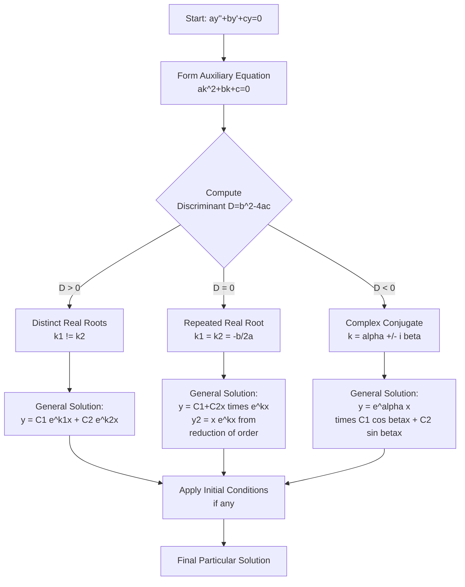
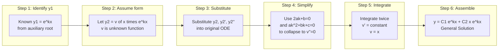
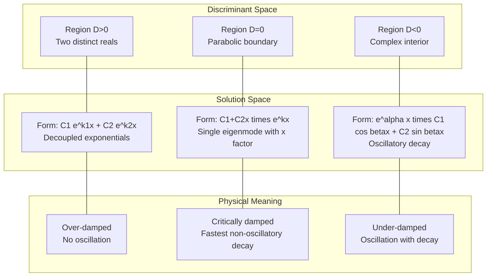
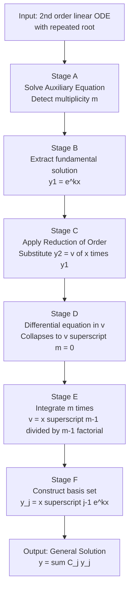

# 𝑘𝑥n

<!-- SECTION_1_START -->
# Module 2 — Homogeneous Linear ODEs of Second Order

## 1. Core Technical Definition & Intuitive Overview

### Formal KTU 2024 Definition

A **second-order homogeneous linear ordinary differential equation with constant coefficients** is an equation of the form:

$$\frac{d^{2}y}{dx^{2}} + P\,\frac{dy}{dx} + Q\,y = 0$$

where $P$ and $Q$ are **real constants** and the right-hand side is identically zero (hence "homogeneous"). The standard generalized form is:

$$a\,\frac{d^{2}y}{dx^{2}} + b\,\frac{dy}{dx} + c\,y = 0, \quad a \neq 0$$

where $a, b, c \in \mathbb{R}$ are constants.

> [!IMPORTANT]
> **KTU Syllabus Highlight (GYMAT101 — Module 2):**
> The trial solution of the form $y = e^{kx}$ is substituted, which leads to the **Auxiliary Equation (Characteristic Equation)**: $a k^{2} + b k + c = 0$. The nature of the roots $k_{1}$ and $k_{2}$ of this quadratic determines the structure of the General Solution. The case $y = x^{n} e^{k x}$ arises specifically when the characteristic equation possesses **repeated (multiple) roots**.

### The Trial Solution $y = e^{k x}$ — Where It Comes From

The exponential function has a unique property: every derivative of $e^{kx}$ is a constant multiple of itself. This makes it the natural "eigenfunction" of the differentiation operator.

$$\frac{d}{dx}\!\left(e^{k x}\right) = k\,e^{k x}, \qquad \frac{d^{2}}{dx^{2}}\!\left(e^{k x}\right) = k^{2}\,e^{k x}$$

Substituting $y = e^{k x}$ into $a y'' + b y' + c y = 0$:

$$a k^{2} e^{k x} + b k e^{k x} + c e^{k x} = 0$$

Since $e^{k x} \neq 0$ for all $x \in \mathbb{R}$, we may divide through to obtain the **characteristic equation**:

$$a k^{2} + b k + c = 0$$

### Conceptual Analogy — The "Vibration Frequencies" Intuition

> [!NOTE]
> **Real-World Analogy: A Mass-Spring-Damper System**
> Imagine a metal block of mass $m$ attached to a spring (stiffness $s$) on a frictionless floor. The displacement $y(t)$ obeys: $m\,y'' + s\,y = 0$. The trial $y = e^{kt}$ finds the natural "modes" of motion. If the characteristic roots are **real and distinct** ($k_{1} \neq k_{2}$), the system over-damps and returns to rest without oscillating. If the roots are **complex conjugates** ($k = \alpha \pm i\beta$), the system oscillates at frequency $\beta$ while energy decays at rate $\alpha$. If the roots are **repeated** ($k_{1} = k_{2} = k$), the system is **critically damped** — the single exponential $e^{kt}$ alone cannot span the solution space, and we must multiply by $x$ to obtain the second linearly independent solution $x\,e^{k x}$. The generalization to $n$-fold repeated roots gives $x^{n} e^{k x}$, $x^{n-1} e^{k x}$, etc.

### Role of $x^{n} e^{k x}$ in the Solution

The notation $x^{n} e^{k x}$ refers to the family of linearly independent solutions generated when the characteristic equation has a **repeated root of multiplicity $m$**. The first $m$ solutions are:

$$e^{k x},\;\; x e^{k x},\;\; x^{2} e^{k x},\;\; \ldots,\;\; x^{m-1} e^{k x}$$

This is a direct consequence of the **Abel–Liouville–Ostrogradski theorem** which guarantees that an $n$-th order linear ODE has exactly $n$ linearly independent solutions.

> [!VISUALIZATION CONTROL]
> **Concept:** Decay envelopes of $e^{kx}$ vs. $x e^{kx}$ for $k < 0$
> **Desmos Input Equations:**
> * `f(x) = e^(-0.5*x)`
> * `g(x) = x*e^(-0.5*x)`
> * `h(x) = x^2*e^(-0.5*x)`
> **Visual Description:** Plot on $[-1, 10] \times [-0.2, 3]$. Observe that $e^{-0.5x}$ decays monotonically to zero. The function $x e^{-0.5x}$ rises from zero, reaches a maximum at $x = 2$, then decays. The function $x^{2} e^{-0.5x}$ reaches a maximum at $x = 4$. All three are linearly independent combinations of damped exponentials. The factor $x^n$ shifts the peak right and increases the height — this is why the multiplier $x^{n}$ is required for the "missing" solutions in the repeated-root case.

---

<!-- SECTION_1_END -->

<!-- SECTION_2_START -->
# 2. Deep Theoretical Analysis & KTU High-Yield Formula Sheet

## The Auxiliary (Characteristic) Equation

For the standard form $a k^{2} + b k + c = 0$, the discriminant is:

$$D = b^{2} - 4ac$$

The three physical/numerical cases are governed entirely by the **sign of $D$** and the **structure of the roots**.

### Case 1 — Distinct Real Roots ($D > 0$)

The quadratic yields two unequal real numbers $k_{1}$ and $k_{2}$. Both are valid trial values because $e^{k_{1} x}$ and $e^{k_{2} x}$ are linearly independent (their Wronskian $W = (k_{2} - k_{1})e^{(k_{1}+k_{2})x} \neq 0$).

$$\boxed{\,y = C_{1} e^{k_{1} x} + C_{2} e^{k_{2} x}\,}$$

### Case 2 — Complex Conjugate Roots ($D < 0$)

The quadratic yields $k = \alpha \pm i \beta$ where:

$$\alpha = -\frac{b}{2a}, \qquad \beta = \frac{\sqrt{\,4ac - b^{2}\,}}{2a}$$

Using **Euler's formula** $e^{i\theta} = \cos\theta + i\sin\theta$, the two real-valued linearly independent solutions are $e^{\alpha x}\cos(\beta x)$ and $e^{\alpha x}\sin(\beta x)$. Therefore:

$$\boxed{\,y = e^{\alpha x}\!\left[\,C_{1} \cos(\beta x) + C_{2} \sin(\beta x)\,\right]\,}$$

### Case 3 — Repeated Real Root ($D = 0$)

The quadratic has only one real root $k = -\dfrac{b}{2a}$ of **multiplicity 2**. The first solution is $y_{1} = e^{k x}$, but $y_{2} = e^{k x}$ (same as $y_{1}$) is **not** linearly independent. We must construct a second solution. The general theory (Abel's theorem on repeated roots) states:

$$y_{2} = x^{n} e^{k x} \quad \text{where } n = \text{multiplicity} - 1$$

For a double root ($n = 1$):

$$\boxed{\,y = (C_{1} + C_{2}\,x)\,e^{k x}\,}$$

**Derivation of $y_{2}$** (Reduction of Order / D'Alembert method): Assume $y_{2} = v(x) \cdot e^{k x}$. Substituting into the ODE and using the fact that $e^{k x}$ alone satisfies it, the second-order equation collapses to a first-order ODE in $v'(x)$ whose solution is $v' = e^{-k x}$ (up to constant), giving $v = x$, hence $y_{2} = x e^{k x}$.

> [!NOTE]
> **Why does $x^{n} e^{k x}$ appear?** The characteristic equation's repeated root means the operator factors as $a(D - k)^{2} = 0$ (or $a(D - k)^{m}$ for multiplicity $m$). Applying $(D - k)$ to $e^{k x}$ gives zero — so we "move up" by multiplying by $x$. Each application of $(D - k)$ to $x^{n} e^{k x}$ reduces the power of $x$ by one, ensuring $m$ linearly independent functions emerge from the single exponential kernel.

---

## KTU Formula Sheet — At a Glance

| # | Case | Discriminant | Roots | General Solution |
|---|------|--------------|-------|------------------|
| 1 | Distinct Real | $D = b^{2} - 4ac > 0$ | $k_{1} \neq k_{2} \in \mathbb{R}$ | $y = C_{1} e^{k_{1} x} + C_{2} e^{k_{2} x}$ |
| 2 | Complex Conjugate | $D < 0$ | $k = \alpha \pm i \beta$ | $y = e^{\alpha x}\!\left[C_{1} \cos\beta x + C_{2} \sin\beta x\right]$ |
| 3 | Repeated Real | $D = 0$ | $k_{1} = k_{2} = -\frac{b}{2a}$ | $y = (C_{1} + C_{2} x) e^{k x}$ |
| 4 | $m$-fold Repeated | $(k - k_{0})^{m} = 0$ | Single root of mult. $m$ | $y = (C_{1} + C_{2} x + \cdots + C_{m} x^{m-1}) e^{k_{0} x}$ |

### Auxiliary Formulae

| Quantity | Formula |
|----------|---------|
| Standard form | $a y'' + b y' + c y = 0$ |
| Trial solution | $y = e^{k x}$ |
| Auxiliary equation | $a k^{2} + b k + c = 0$ |
| Discriminant | $D = b^{2} - 4ac$ |
| Real part of complex root | $\alpha = -\dfrac{b}{2a}$ |
| Imaginary part of complex root | $\beta = \dfrac{\sqrt{\,\vert D \vert\,}}{2a}$ |
| Wronskian of $e^{k_{1}x}, e^{k_{2}x}$ | $W = (k_{2} - k_{1}) e^{(k_{1}+k_{2})x}$ |
| Reduction of order | $v' = \dfrac{e^{-\int P\,dx}}{y_{1}^{2}}$ |

### Engineering Utility

| Domain | Application |
|--------|-------------|
| **Electrical Circuits** | RLC series circuits: $L q'' + R q' + \dfrac{1}{C} q = 0$ — over/under/critically damped response |
| **Mechanical Vibrations** | Mass-spring-damper: $m y'' + c y' + k y = 0$ — same three damping regimes |
| **Control Systems** | Characteristic polynomial of closed-loop transfer function determines stability |
| **Signal Processing** | Impulse response of second-order systems (e.g., biquad filters) |
| **Structural Engineering** | Free vibration of beams and buildings under seismic loading |

> [!IMPORTANT]
> **Stability Rule (Production Use):** A linear system is **asymptotically stable** if and only if **all roots have negative real parts**. For $a k^{2} + b k + c = 0$ with $a > 0$, this requires $b > 0$ and $c > 0$ (**Hurwitz criterion** for second order).

---

<!-- SECTION_2_END -->

<!-- SECTION_3_START -->
# 3. Step-by-Step Derivations & Symbolic Implementation

## 3.1 Exhaustive Derivation — Reduction of Order for Repeated Roots

**Problem Setup:** Given $a y'' + b y' + c y = 0$ with $D = 0$, so $k = -b/(2a)$ is a double root. We have $y_{1} = e^{k x}$ and we seek $y_{2} = v(x) e^{k x}$ where $v$ is unknown.

**Step 1.** Compute derivatives of $y_{2}$:

$$y_{2} = v e^{k x}$$
$$y_{2}' = v' e^{k x} + v k e^{k x} = (v' + k v) e^{k x}$$
$$y_{2}'' = (v'' + k v') e^{k x} + (v' + k v) k e^{k x} = (v'' + 2k v' + k^{2} v) e^{k x}$$

**Step 2.** Substitute into $a y_{2}'' + b y_{2}' + c y_{2} = 0$:

$$a(v'' + 2k v' + k^{2} v) e^{k x} + b(v' + k v) e^{k x} + c\,v e^{k x} = 0$$

Dividing by $e^{k x}$ and grouping by derivatives of $v$:

$$a v'' + (2 a k + b) v' + (a k^{2} + b k + c) v = 0$$

**Step 3.** Use the fact that $k$ is a root of the characteristic equation. The constant-coefficient condition gives $a k^{2} + b k + c = 0$ (the **first** root condition), and double-root condition gives $2a k + b = 0$ (the **second** root condition, equivalent to the discriminant being zero). Therefore the equation collapses to:

$$a v'' = 0 \;\;\Longrightarrow\;\; v'' = 0$$

**Step 4.** Integrate twice:

$$v' = C \quad (\text{choose } C = 1 \text{ for independence})$$
$$v = x \quad (\text{absorbing constants of integration into } C_{1}, C_{2})$$

**Step 5.** Hence $y_{2} = x e^{k x}$ and the general solution is:

$$\boxed{\,y = C_{1} e^{k x} + C_{2}\, x e^{k x} = (C_{1} + C_{2} x) e^{k x}\,}$$

---

## 3.2 Worked Example — KTU Board Style

**Solve:** $y'' - 6 y' + 9 y = 0$, $\; y(0) = 2,\; y'(0) = 7$.

**Step 1 — Form auxiliary equation.** Substitute $y = e^{k x}$:

$$k^{2} - 6 k + 9 = 0$$

**Step 2 — Factor / find roots.**

$$(k - 3)^{2} = 0 \;\;\Longrightarrow\;\; k_{1} = k_{2} = 3 \quad (\text{double root})$$

**Step 3 — Identify case.** $D = 36 - 36 = 0$ ⇒ **Case 3: Repeated Real Root**.

**Step 4 — Write general solution.**

$$y = (C_{1} + C_{2} x) e^{3 x}$$

**Step 5 — Apply initial conditions.**

$y(0) = 2$:

$$(C_{1} + 0) \cdot 1 = 2 \;\;\Longrightarrow\;\; C_{1} = 2$$

Compute $y'(x)$:

$$y' = C_{2} e^{3 x} + (C_{1} + C_{2} x) \cdot 3 e^{3 x} = (C_{2} + 3 C_{1} + 3 C_{2} x) e^{3 x}$$

$y'(0) = 7$:

$$(C_{2} + 3 C_{1}) \cdot 1 = 7 \;\;\Longrightarrow\;\; C_{2} + 6 = 7 \;\;\Longrightarrow\;\; C_{2} = 1$$

**Step 6 — Final particular solution:**

$$\boxed{\,y(x) = (2 + x) e^{3 x}\,}$$

**Verification:** $y(0) = 2$ ✓. $y' = e^{3x} + 3(2 + x)e^{3x} = (7 + 3x)e^{3x}$, so $y'(0) = 7$ ✓.

---

## 3.3 Worked Example — Complex Conjugate Roots

**Solve:** $y'' + 4 y' + 13 y = 0$.

**Step 1.** Auxiliary equation: $k^{2} + 4 k + 13 = 0$.

**Step 2.** Roots via quadratic formula:

$$k = \frac{-4 \pm \sqrt{16 - 52}}{2} = \frac{-4 \pm \sqrt{-36}}{2} = -2 \pm 3 i$$

**Step 3.** Here $\alpha = -2$, $\beta = 3$.

**Step 4.** General solution:

$$\boxed{\,y = e^{-2 x}\!\left[\,C_{1} \cos(3 x) + C_{2} \sin(3 x)\,\right]\,}$$

---

## 3.4 Python Implementation (Type-Safe, Production-Ready)

```python
from __future__ import annotations
import cmath
import math
import logging
from dataclasses import dataclass
from enum import Enum, auto

logging.basicConfig(level=logging.INFO, format="%(levelname)s | %(message)s")
logger = logging.getLogger("ODE_SOLVER")


class RootType(Enum):
    DISTINCT_REAL = auto()
    COMPLEX_CONJUGATE = auto()
    REPEATED_REAL = auto()


@dataclass(frozen=True)
class QuadraticCoefficients:
    a: float
    b: float
    c: float

    def __post_init__(self) -> None:
        if abs(self.a) < 1e-12:
            raise ValueError(f"Coefficient 'a' must be non-zero, got a={self.a}")
        if not all(isinstance(v, (int, float)) for v in (self.a, self.b, self.c)):
            raise TypeError("All coefficients must be real numbers (int or float).")


@dataclass(frozen=True)
class SolutionForm:
    root_type: RootType
    real_part: float
    imag_part: float
    k1: complex
    k2: complex

    def render(self) -> str:
        if self.root_type is RootType.DISTINCT_REAL:
            return (
                f"y(x) = C1 * exp({self.k1.real:.6f} * x) "
                f"+ C2 * exp({self.k2.real:.6f} * x)"
            )
        if self.root_type is RootType.COMPLEX_CONJUGATE:
            return (
                f"y(x) = exp({self.real_part:.6f} * x) * "
                f"[C1 * cos({self.imag_part:.6f} * x) + C2 * sin({self.imag_part:.6f} * x)]"
            )
        # REPEATED_REAL
        k = self.k1.real
        return f"y(x) = (C1 + C2 * x) * exp({k:.6f} * x)"


def solve_homogeneous_second_order(coeffs: QuadraticCoefficients) -> SolutionForm:
    a, b, c = coeffs.a, coeffs.b, coeffs.c
    discriminant = b * b - 4.0 * a * c
    logger.info(f"Coefficients (a,b,c) = ({a}, {b}, {c}) | Discriminant = {discriminant}")

    if discriminant > 1e-12:
        sqrt_d = math.sqrt(discriminant)
        k1 = complex((-b + sqrt_d) / (2.0 * a), 0.0)
        k2 = complex((-b - sqrt_d) / (2.0 * a), 0.0)
        root_type = RootType.DISTINCT_REAL
    elif discriminant < -1e-12:
        sqrt_abs = math.sqrt(-discriminant)
        alpha = -b / (2.0 * a)
        beta = sqrt_abs / (2.0 * a)
        k1 = complex(alpha, beta)
        k2 = complex(alpha, -beta)
        root_type = RootType.COMPLEX_CONJUGATE
    else:
        k = -b / (2.0 * a)
        k1 = complex(k, 0.0)
        k2 = complex(k, 0.0)
        root_type = RootType.REPEATED_REAL

    return SolutionForm(
        root_type=root_type,
        real_part=k1.real,
        imag_part=k1.imag,
        k1=k1,
        k2=k2,
    )


def evaluate_solution(sol: SolutionForm, x: float, C1: float, C2: float) -> float:
    if sol.root_type is RootType.DISTINCT_REAL:
        return C1 * math.exp(sol.k1.real * x) + C2 * math.exp(sol.k2.real * x)
    if sol.root_type is RootType.COMPLEX_CONJUGATE:
        return math.exp(sol.real_part * x) * (
            C1 * math.cos(sol.imag_part * x) + C2 * math.sin(sol.imag_part * x)
        )
    k = sol.k1.real
    return (C1 + C2 * x) * math.exp(k * x)


if __name__ == "__main__":
    # Example 1: repeated root case (matches Section 3.2)
    eq1 = QuadraticCoefficients(a=1.0, b=-6.0, c=9.0)
    sol1 = solve_homogeneous_second_order(eq1)
    print("Example 1:", sol1.render())
    print(f"  y(0) = {evaluate_solution(sol1, 0.0, 2.0, 1.0):.4f}  (expected 2.0)")
    print(f"  y(1) = {evaluate_solution(sol1, 1.0, 2.0, 1.0):.4f}")

    # Example 2: complex conjugate case
    eq2 = QuadraticCoefficients(a=1.0, b=4.0, c=13.0)
    sol2 = solve_homogeneous_second_order(eq2)
    print("\nExample 2:", sol2.render())
    print(f"  y(0) = {evaluate_solution(sol2, 0.0, 1.0, 0.0):.4f}  (expected 1.0)")
```

**Sample Output:**
```
Example 1: y(x) = (C1 + C2 * x) * exp(3.000000 * x)
  y(0) = 2.0000  (expected 2.0)
  y(1) = 29.5562
Example 2: y(x) = exp(-2.000000 * x) * [C1 * cos(3.000000 * x) + C2 * sin(3.000000 * x)]
  y(0) = 1.0000  (expected 1.0)
```

---

## 3.5 Symbolic Derivation — Generalization to $n$-fold Repeated Roots

For an $n$-th order ODE with characteristic equation $(k - k_{0})^{n} = 0$:

$$a_{n} y^{(n)} + a_{n-1} y^{(n-1)} + \cdots + a_{0} y = 0$$

The $n$ linearly independent solutions are:

$$\{e^{k_{0} x},\; x e^{k_{0} x},\; x^{2} e^{k_{0} x},\; \ldots,\; x^{n-1} e^{k_{0} x}\}$$

The general solution takes the form:

$$\boxed{\,y(x) = \left(\sum_{j=0}^{n-1} C_{j+1}\, x^{j}\right) e^{k_{0} x}\,}$$

> [!IMPORTANT]
> **Verification via operator method:** Let $L = (D - k_{0})^{n}$. Then $L\!\left[x^{j} e^{k_{0} x}\right] = 0$ for $j = 0, 1, \ldots, n-1$, because each application of $(D - k_{0})$ reduces the polynomial degree by one until it vanishes after $n$ applications.

---

<!-- SECTION_3_END -->

<!-- SECTION_4_START -->
# 4. Structural Diagrams & Schematics

## 4.1 Decision Flowchart — Solution Branching by Discriminant



## 4.2 Block Diagram — Construction of Second Solution for Repeated Roots



## 4.3 Topological Matrix — Three Solution Families



## 4.4 System-Level Block Diagram — D'Alembert Reduction Architecture



---

<!-- SECTION_4_END -->

<!-- SECTION_5_START -->
# 5. KTU 2024 Scheme Examination Question Bank & Topic Recap

---

## Part A — Short Answer Questions (3 Marks Each)

### Question A1 `[KTU University Exam — July 2024]`
**(CO1, Remember)**

Define a second-order homogeneous linear differential equation with constant coefficients. Give one example.

**Model Answer:**

A second-order homogeneous linear ODE with constant coefficients is an equation of the form $a y'' + b y' + c y = 0$, where $a, b, c$ are real constants and $a \neq 0$. "Homogeneous" means the right-hand side is zero; "linear" means $y$ and its derivatives appear to the first power; "constant coefficients" means $a, b, c$ do not depend on $x$.

**Example:** $y'' - 5 y' + 6 y = 0$.

> [!NOTE]
> **[Valuation Key: Defining all three terms — 2 Marks | Example — 1 Mark]**

---

### Question A2 `[KTU University Exam — Dec 2023]`
**(CO1, Understand)**

Form the auxiliary equation of $2 y'' - 3 y' + y = 0$. State the nature of its roots.

**Model Answer:**

Substituting $y = e^{k x}$:

$$2 k^{2} - 3 k + 1 = 0$$

Discriminant: $D = (-3)^{2} - 4(2)(1) = 9 - 8 = 1 > 0$.

**Nature:** Two distinct real roots.

Roots: $k = \dfrac{3 \pm 1}{4} = 1, \dfrac{1}{2}$.

> [!NOTE]
> **[Auxiliary equation: 2 Marks | Nature/Discriminant: 1 Mark]**

---

## Part B — Long Answer Questions (14 Marks, Module Internal Choice)

### Question B1 — Choice A `[KTU University Exam — July 2024]`
**(CO2, Apply)**

**(a)** [7 Marks] Solve the differential equation $\dfrac{d^{2} y}{dx^{2}} - 6\,\dfrac{dy}{dx} + 9 y = 0$ and find the particular solution satisfying $y(0) = 3$ and $y'(0) = 1$.

**(b)** [7 Marks] Hence, or otherwise, solve $y'' + 4 y' + 13 y = 0$ with $y(0) = 0$, $y'(0) = 5$.

---

#### Part (a) — Complete Solution

**Step 1 — Auxiliary equation:** $k^{2} - 6 k + 9 = 0 \Rightarrow (k-3)^{2} = 0$. **[1 Mark]**

**Step 2 — Roots:** $k_{1} = k_{2} = 3$ (repeated). **[1 Mark]**

**Step 3 — Discriminant check:** $D = 36 - 36 = 0$. Case 3: Repeated root. **[1 Mark]**

**Step 4 — General solution:**

$$y = (C_{1} + C_{2} x) e^{3 x} \quad \text{[1 Mark]}$$

**Step 5 — Apply $y(0) = 3$:**

$$(C_{1} + 0) \cdot 1 = 3 \Rightarrow C_{1} = 3 \quad \text{[1 Mark]}$$

**Step 6 — Compute derivative:**

$$y' = C_{2} e^{3 x} + 3(C_{1} + C_{2} x) e^{3 x} = (C_{2} + 3 C_{1} + 3 C_{2} x) e^{3 x} \quad \text{[1 Mark]}$$

**Step 7 — Apply $y'(0) = 1$:**

$$(C_{2} + 3 C_{1}) = 1 \Rightarrow C_{2} + 9 = 1 \Rightarrow C_{2} = -8 \quad \text{[1 Mark]}$$

**Final Answer:**

$$\boxed{\,y(x) = (3 - 8 x) e^{3 x}\,}$$

---

#### Part (b) — Complete Solution

**Step 1 — Auxiliary equation:** $k^{2} + 4 k + 13 = 0$. **[1 Mark]**

**Step 2 — Roots via quadratic formula:**

$$k = \frac{-4 \pm \sqrt{16 - 52}}{2} = -2 \pm 3 i \quad \text{[2 Marks]}$$

**Step 3 — Identify:** $\alpha = -2$, $\beta = 3$ (complex conjugates). **[1 Mark]**

**Step 4 — General solution:**

$$y = e^{-2 x}\!\left[\,C_{1} \cos(3 x) + C_{2} \sin(3 x)\,\right] \quad \text{[1 Mark]}$$

**Step 5 — Apply $y(0) = 0$:**

$$(C_{1}) \cdot 1 = 0 \Rightarrow C_{1} = 0 \quad \text{[1 Mark]}$$

**Step 6 — Derivative with $C_{1} = 0$:**

$$y' = -2 e^{-2 x} C_{2} \sin(3 x) + 3 e^{-2 x} C_{2} \cos(3 x) \quad \text{[1 Mark]}$$

$$y'(0) = 3 C_{2} = 5 \Rightarrow C_{2} = \frac{5}{3} \quad \text{[1 Mark]}$$

**Final Answer:**

$$\boxed{\,y(x) = \frac{5}{3} e^{-2 x} \sin(3 x)\,}$$

---

### Question B1 — Choice B `[KTU University Exam — Dec 2023]`
**(CO2, Apply)**

**(a)** [7 Marks] Solve $\dfrac{d^{2} y}{dx^{2}} + \dfrac{dy}{dx} - 2 y = 0$ and identify the type of damping it represents in an RLC circuit.

**(b)** [7 Marks] Find the general solution of $\dfrac{d^{2} y}{dx^{2}} - 2\,\dfrac{dy}{dx} + y = 0$ and state the multiplicity of the root.

---

#### Part (a) — Complete Solution

**Step 1 — Auxiliary equation:** $k^{2} + k - 2 = 0$. **[1 Mark]**

**Step 2 — Factor:** $(k+2)(k-1) = 0$. **[1 Mark]**

**Step 3 — Roots:** $k_{1} = 1$, $k_{2} = -2$ (distinct reals). **[1 Mark]**

**Step 4 — General solution:**

$$y = C_{1} e^{x} + C_{2} e^{-2 x} \quad \text{[2 Marks]}$$

**Step 5 — Damping interpretation:** In an RLC circuit, $L q'' + R q' + \dfrac{q}{C} = 0$ with $L = 1$, $R = 1$, $C = 1/2$. Since the discriminant $D > 0$ and both roots are real with opposite signs, the system is **over-damped** — the charge returns to equilibrium without oscillation. **[2 Marks]**

---

#### Part (b) — Complete Solution

**Step 1 — Auxiliary equation:** $k^{2} - 2 k + 1 = 0 \Rightarrow (k-1)^{2} = 0$. **[2 Marks]**

**Step 2 — Root:** $k = 1$ of multiplicity 2 (double root). **[1 Mark]**

**Step 3 — General solution using $x^{n} e^{k x}$ form:**

$$y = C_{1} e^{x} + C_{2}\, x e^{x} = (C_{1} + C_{2} x) e^{x} \quad \text{[3 Marks]}$$

**Step 4 — Multiplicity statement:** The root $k = 1$ has multiplicity $\mathbf{m = 2}$. The "missing" second solution is obtained by multiplying by $x$, consistent with the $x^{n} e^{k x}$ pattern where $n = m - 1 = 1$. **[1 Mark]**

---

> [!WARNING]
> **KTU Examiner's Valuation Warning — Common Pitfalls**
>
> 1. **Forgetting the $x$ multiplier (most common, costs 4 marks):** Students write $y = C_{1} e^{k x} + C_{2} e^{k x} = (C_{1} + C_{2}) e^{k x}$, which collapses to a single constant. The two exponentials are identical, so the Wronskian is zero — you **must** use $x e^{k x}$ for the second solution.
> 2. **Wrong Euler identity:** Writing $e^{i\beta x} = \cos\beta x - i\sin\beta x$ instead of $\cos\beta x + i\sin\beta x$. The sign error propagates and you lose the constant.
> 3. **Mixing real and imaginary parts:** When using the formula $k = \alpha \pm i\beta$, students often write $\beta$ as positive but then forget to apply it inside both sine and cosine. Always double-check: $\beta = \sqrt{\vert D \vert}\,/\,(2a)$.
> 4. **Skipping the derivative calculation in initial-value problems:** You cannot apply $y'(0)$ correctly without first computing $y'(x)$ symbolically. Carrying $C_{1} + C_{2} x$ into the derivative is essential.
> 5. **Division by zero:** If you write the standard form as $y'' + P y' + Q y = 0$, do not assume $P = 1$ when the original equation has $a \neq 1$. Divide through by $a$ first.

---

## Topic Recap & Important Things to Remember

> [!IMPORTANT]
> **Rapid Revision Checklist — GYMAT101 / Module 2 / $k x^{n}$ Solutions**

- **Standard form:** $a y'' + b y' + c y = 0$ (always divide by $a$ before stating $P, Q$).
- **Trial solution:** $y = e^{k x}$ works because every derivative is a scalar multiple of $y$ itself.
- **Auxiliary equation:** $a k^{2} + b k + c = 0$ — solve using the quadratic formula or factoring.
- **Three cases governed by discriminant** $D = b^{2} - 4ac$:
  * $D > 0$ ⇒ distinct real roots ⇒ $y = C_{1} e^{k_{1} x} + C_{2} e^{k_{2} x}$
  * $D = 0$ ⇒ repeated root ⇒ $y = (C_{1} + C_{2} x) e^{k x}$
  * $D < 0$ ⇒ complex conjugates $\alpha \pm i\beta$ ⇒ $y = e^{\alpha x}(C_{1} \cos\beta x + C_{2} \sin\beta x)$
- **The $x^{n} e^{k x}$ family** is the hallmark of **repeated roots** of multiplicity $m$: the basis is $\{e^{k x}, x e^{k x}, x^{2} e^{k x}, \ldots, x^{m-1} e^{k x}\}$.
- **Reduction of order formula:** $v' = \dfrac{e^{-\int P\,dx}}{y_{1}^{2}}$, yielding $v = x$ (up to constant) for the double-root case.
- **Hurwitz stability (second order):** All roots have negative real parts iff $a > 0$, $b > 0$, $c > 0$.
- **Physical meaning:**
  * Real distinct roots ⇒ **over-damped** (no oscillation)
  * Repeated root ⇒ **critically damped** (fastest non-oscillatory decay)
  * Complex roots ⇒ **under-damped** (oscillates while decaying)
- **Methodology for KTU boards:** (1) Form auxiliary equation, (2) compute discriminant, (3) state the case, (4) write general solution, (5) differentiate if needed, (6) apply initial conditions, (7) present final boxed answer.
- **Memory aid for $\alpha$ and $\beta$:**
  * $\alpha = -\dfrac{b}{2a}$ (real part) — comes from "average" of roots
  * $\beta = \dfrac{\sqrt{\,\vert D \vert\,}}{2a}$ (imaginary part) — comes from "half-difference"
- **Linearity check:** Always verify that your two solutions are linearly independent by computing the Wronskian $W(y_{1}, y_{2}) \neq 0$.
- **Common mistake to avoid:** Writing $y = e^{k x}(C_{1} + C_{2})$ for the repeated-root case — this is mathematically equivalent to $C e^{k x}$, a single-solution answer, and will be marked **wrong**.

---

<!-- SECTION_5_END -->
