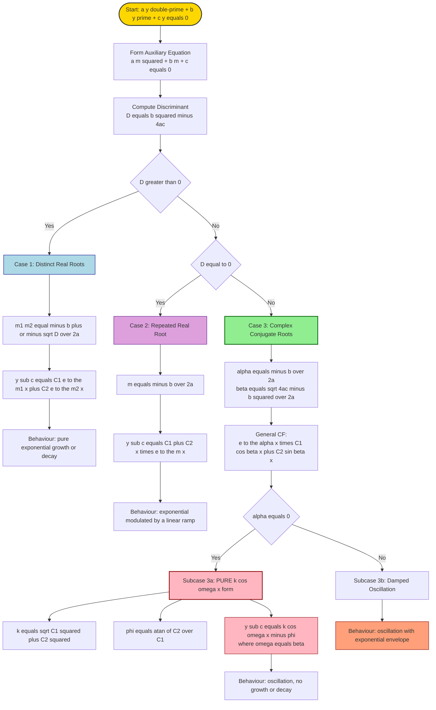

# 𝑘𝑐𝑜𝑠𝜔𝑥

<!-- SECTION_1_START -->

## 1. Core Technical Definition & Intuitive Overview

### 1.1 Formal Definition (KTU 2024 Syllabus Terminology)

A **second-order homogeneous linear ordinary differential equation (ODE) with constant coefficients** is an equation of the form

$$a\frac{d^{2}y}{dx^{2}} + b\frac{dy}{dx} + c\,y = 0, \quad a, b, c \in \mathbb{R},\; a \neq 0.$$

Substituting the trial solution $y = e^{mx}$ produces the **auxiliary (characteristic) equation**

$$a\,m^{2} + b\,m + c = 0.$$

The nature of its roots completely determines the **complementary function** $y_{c}(x)$. When the discriminant

$$D = b^{2} - 4ac < 0,$$

the two roots are a non-real conjugate pair

$$m_{1,2} = \alpha \pm i\beta, \quad \text{where} \quad \alpha = -\frac{b}{2a}, \quad \beta = \frac{\sqrt{4ac - b^{2}}}{2a},$$

and the complementary function takes the canonical **complex-root form**

$$\boxed{\,y_{c}(x) = e^{\alpha x}\bigl(C_{1}\cos \beta x + C_{2}\sin \beta x\bigr)\,}$$

> [!IMPORTANT]
> **Topic Highlight – The $k\cos\omega x$ form:** When $\alpha = 0$ (i.e. the coefficient of $y'$ vanishes, $b = 0$), the exponential envelope disappears and the solution reduces to a pure trigonometric expression that can be re-expressed in the **amplitude–phase (single-harmonic) form**
> $$\boxed{\,y_{c}(x) = C_{1}\cos \omega x + C_{2}\sin \omega x = k\cos(\omega x - \phi)\,}$$
> with $\omega = \beta$, $k = \sqrt{C_{1}^{2} + C_{2}^{2}}$, and $\tan\phi = C_{2}/C_{1}$. This is precisely the "$k\cos\omega x$" representation that the module emphasises.

### 1.2 Conceptual Analogy (Intuitive Picture)

Imagine a **mass attached to a spring** floating in a viscous fluid and driven by a small restoring force.

- If the fluid is removed ($b = 0$), the mass **oscillates forever** at a single natural frequency $\omega$ — the displacement is exactly $k\cos(\omega x - \phi)$. This is the pure $k\cos\omega x$ form.
- If the fluid is light (small $b > 0$), the oscillations **decay slowly** as $\pm e^{\alpha x}$ envelopes, giving $e^{\alpha x}\,k\cos(\beta x - \phi)$.
- If the fluid is heavy, the motion becomes purely exponential (no oscillation).

The complex conjugate pair of roots is the mathematical fingerprint of an **under-damped oscillator**, and the $k\cos\omega x$ form is just a notational compression of two arbitrary constants into an amplitude and a phase shift.

> [!NOTE]
> The general real solution of a second-order linear ODE has **two arbitrary constants**. The trigonometric rewriting $C_{1}\cos\omega x + C_{2}\sin\omega x \equiv k\cos(\omega x - \phi)$ is **not a different family**; it is the same family written with a different parameterisation (amplitude $k$ and phase $\phi$ instead of $C_{1}, C_{2}$).

### 1.3 Standard Physical Quantities

| Symbol | Physical meaning | Units |
|---|---|---|
| $\alpha$ | Exponential growth ($\alpha>0$) or decay ($\alpha<0$) rate | $\text{s}^{-1}$ |
| $\beta \equiv \omega$ | Angular frequency of oscillation | $\text{rad}\cdot\text{s}^{-1}$ |
| $k$ | Amplitude of the steady-state oscillation | units of $y$ |
| $\phi$ | Phase shift (initial angular offset) | $\text{rad}$ |
| $T = 2\pi/\omega$ | Period of one oscillation | $\text{s}$ |

> [!VISUALIZATION CONTROL]
> **Concept:** Damped harmonic oscillation $y = e^{-0.15 x}\cos(2x)$ with its exponential envelope.
> **GeoGebra / Desmos Input Equations:**
> * `f(x) = exp(-0.15*x)*cos(2*x)`
> * `g(x) = exp(-0.15*x)` (upper envelope)
> * `h(x) = -exp(-0.15*x)` (lower envelope)
> **Visual Description:** The student should see a cosine-like wave whose peaks and troughs lie exactly on the two curves $g(x)$ and $h(x)$, both of which decay toward zero as $x \to \infty$. Each successive peak is a fixed fraction of the previous one (geometric decay), and successive peaks are spaced by $\pi$ — i.e. the half-period of the underlying $\cos(2x)$.

<!-- SECTION_1_END -->

<!-- SECTION_2_START -->

## 2. Deep Theoretical Analysis & KTU High-Yield Formula Sheet

### 2.1 Why Does the Form $e^{\alpha x}(C_{1}\cos \beta x + C_{2}\sin \beta x)$ Arise?

* The auxiliary equation is a **quadratic in $m$**, so it can have at most two roots.
* When $D < 0$, those two roots **cannot be written as real numbers**, so $e^{m_{1}x}$ and $e^{m_{2}x}$ are complex-valued.
* However, the **ODE itself has real coefficients**, so it must admit two **real, linearly independent** solutions. The trick is to take **real and imaginary parts** of $e^{(\alpha + i\beta)x}$ using **Euler's identity**:

$$e^{i\theta} = \cos\theta + i\sin\theta.$$

Because $e^{(\alpha+i\beta)x}$ and its complex conjugate $e^{(\alpha-i\beta)x}$ are both solutions, their **real part $e^{\alpha x}\cos \beta x$** and **imaginary part $e^{\alpha x}\sin \beta x$** are *also* solutions (by linearity). They are linearly independent, so the **real general solution** is their real linear combination.

### 2.2 Three Master Cases (Exhaustive Classification)

> [!IMPORTANT]
> **Master Discriminant Rule:** The sign of $D = b^{2} - 4ac$ alone decides the form of $y_{c}$. The formulas in the table below are the **only three** complementary-function forms a student must memorise for the KTU ESE.

| Case | Condition on $D$ | Roots $m_{1,2}$ | Complementary Function $y_{c}(x)$ | Physical / Geometric Nature |
|---|---|---|---|---|
| 1 | $D > 0$ (distinct real) | $m_{1,2} = \dfrac{-b \pm \sqrt{D}}{2a}$ | $C_{1}e^{m_{1}x} + C_{2}e^{m_{2}x}$ | Pure exponential (growth / decay / mixed) |
| 2 | $D = 0$ (repeated real) | $m = -\dfrac{b}{2a}$ | $(C_{1} + C_{2}\,x)\,e^{mx}$ | Exponential modulated by a linear ramp |
| 3 | $D < 0$ (complex conjugates) | $m = \alpha \pm i\beta$ | $e^{\alpha x}\bigl(C_{1}\cos \beta x + C_{2}\sin \beta x\bigr)$ | **Oscillation with exponential envelope** |
| 3a | As Case 3 with $\alpha = 0$ | $m = \pm i\omega$ | $C_{1}\cos\omega x + C_{2}\sin\omega x = k\cos(\omega x - \phi)$ | **Pure harmonic — the $k\cos\omega x$ form** |

### 2.3 Amplitude-Phase Derivation Logic

Starting from $y_{c} = C_{1}\cos\omega x + C_{2}\sin\omega x$:

* Set $C_{1} = k\cos\phi$ and $C_{2} = k\sin\phi$.
* Then $k = \sqrt{C_{1}^{2} + C_{2}^{2}}$ (always positive) and $\tan\phi = C_{2}/C_{1}$ with the quadrant of $\phi$ chosen by the sign of $C_{1}$.
* Substituting back and using $\cos(A-B) = \cos A\cos B + \sin A\sin B$:

$$y_{c} = k(\cos\phi\cos\omega x + \sin\phi\sin\omega x) = k\cos(\omega x - \phi).$$

### 2.4 Where Is This Used in Real Engineering?

| Engineering Domain | Physical System | Role of the $k\cos\omega x$ form |
|---|---|---|
| **Electrical – RLC circuit** | Series $RLC$ with no driving source | Natural response is $e^{\alpha t}\bigl(C_{1}\cos\omega_{d}t + C_{2}\sin\omega_{d}t\bigr)$ — the *transient*. |
| **Mechanical vibrations** | Mass-spring-damper | Displacement = amplitude-phase form of damped sinusoid. |
| **Control theory** | Pole locations of a transfer function | Poles at $\alpha \pm i\beta$ indicate stable under-damped mode. |
| **Structural engineering** | Building sway under seismic input | Modal superposition uses these forms as basis functions. |
| **Signal processing** | Second-order filter impulse response | Each under-damped pole pair contributes a decaying sinusoid. |
| **Quantum mechanics** | Time-independent Schr$\mathrm{\ddot{o}}$dinger eq. (after separation) | Free-particle bound-state spatial part is sinusoidal. |

### 2.5 KTU Formula Cheat-Sheet (High-Yield)

> [!NOTE]
> The following table is the **complete set of identities** a student should be able to reproduce from memory for any second-order homogeneous linear ODE.

| Item | Formula | Condition / Remark |
|---|---|---|
| Standard form | $a\,y'' + b\,y' + c\,y = 0$ | $a \neq 0$ |
| Auxiliary equation | $a\,m^{2} + b\,m + c = 0$ | Substitute $y = e^{mx}$ |
| Discriminant | $D = b^{2} - 4ac$ | Decides the case |
| Real part of root | $\alpha = -\dfrac{b}{2a}$ | Always real |
| Imaginary part of root | $\beta = \dfrac{\sqrt{4ac - b^{2}}}{2a}$ | Real only when $D < 0$ |
| Case 1 CF | $C_{1}e^{m_{1}x} + C_{2}e^{m_{2}x}$ | $D > 0$ |
| Case 2 CF | $(C_{1} + C_{2}x)\,e^{mx}$ | $D = 0$ |
| Case 3 CF (general) | $e^{\alpha x}\bigl(C_{1}\cos\beta x + C_{2}\sin\beta x\bigr)$ | $D < 0$ |
| Case 3a CF (pure harmonic) | $k\cos(\omega x - \phi)$ | $b = 0,\; \omega = \sqrt{c/a}$ |
| Amplitude | $k = \sqrt{C_{1}^{2} + C_{2}^{2}}$ | Strictly $\geq 0$ |
| Phase | $\tan\phi = C_{2}/C_{1}$ | $\phi \in (-\pi, \pi]$ |
| Period of oscillation | $T = 2\pi / \omega$ | Only meaningful when $D < 0$ |
| Damped natural frequency | $\omega_{d} = \beta$ | For $RLC$: $\omega_{d} = \sqrt{1/(LC) - R^{2}/(4L^{2})}$ |
| Decay time-constant | $\tau = 1/\vert\alpha\vert$ | Time for envelope to drop by factor $e$ |

<!-- SECTION_2_END -->

<!-- SECTION_3_START -->

## 3. Step-by-Step Derivations and Symbolic / Code Implementation

### 3.1 Derivation A — From Complex Roots to the Real CF

We start with the auxiliary equation $a\,m^{2} + b\,m + c = 0$ whose roots are $m_{1} = \alpha + i\beta$ and $m_{2} = \alpha - i\beta$.

**Step 1.** The two corresponding "complex" solutions are

$$y_{1}^{*} = e^{(\alpha + i\beta)x}, \qquad y_{2}^{*} = e^{(\alpha - i\beta)x}.$$

**Step 2.** Factor out the real exponential:

$$y_{1}^{*} = e^{\alpha x}\, e^{i\beta x}.$$

**Step 3.** Apply **Euler's formula** $e^{i\theta} = \cos\theta + i\sin\theta$:

$$e^{i\beta x} = \cos(\beta x) + i\sin(\beta x).$$

Therefore

$$y_{1}^{*} = e^{\alpha x}\bigl[\cos(\beta x) + i\sin(\beta x)\bigr].$$

**Step 4.** Take the **real and imaginary parts** as two new functions:

$$u(x) = \operatorname{Re}\bigl(y_{1}^{*}\bigr) = e^{\alpha x}\cos(\beta x), \quad v(x) = \operatorname{Im}\bigl(y_{1}^{*}\bigr) = e^{\alpha x}\sin(\beta x).$$

**Step 5.** Because the ODE is **linear with real coefficients**, any real linear combination of real solutions is again a real solution. Hence $u$ and $v$ are both valid solutions, and they are linearly independent (their Wronskian $W = \beta\, e^{2\alpha x} \neq 0$).

**Step 6.** Write the **general real complementary function**:

$$y_{c}(x) = C_{1}\,u(x) + C_{2}\,v(x) = e^{\alpha x}\bigl(C_{1}\cos\beta x + C_{2}\sin\beta x\bigr). \qquad \blacksquare$$

---

### 3.2 Derivation B — Conversion of $C_{1}\cos\omega x + C_{2}\sin\omega x$ into $k\cos(\omega x - \phi)$

We begin with the special Case 3a form (valid when $\alpha = 0$):

$$y_{c}(x) = C_{1}\cos(\omega x) + C_{2}\sin(\omega x).$$

**Step 1.** Introduce an amplitude $k > 0$ and a phase $\phi$ by writing

$$C_{1} = k\cos\phi, \qquad C_{2} = k\sin\phi.$$

**Step 2.** Square and add to obtain $k$:

$$C_{1}^{2} + C_{2}^{2} = k^{2}(\cos^{2}\phi + \sin^{2}\phi) = k^{2} \;\Longrightarrow\; k = \sqrt{C_{1}^{2} + C_{2}^{2}}.$$

**Step 3.** Divide to obtain $\phi$:

$$\frac{C_{2}}{C_{1}} = \frac{\sin\phi}{\cos\phi} = \tan\phi \;\Longrightarrow\; \phi = \arctan\!\left(\frac{C_{2}}{C_{1}}\right),$$

choosing the correct quadrant from the signs of $C_{1}$ and $C_{2}$.

**Step 4.** Substitute back into $y_{c}$:

$$y_{c} = k\cos\phi\,\cos(\omega x) + k\sin\phi\,\sin(\omega x).$$

**Step 5.** Use the trigonometric identity $\cos(A - B) = \cos A\cos B + \sin A\sin B$ with $A = \omega x$, $B = \phi$:

$$\boxed{\,y_{c}(x) = k\cos(\omega x - \phi).\,} \qquad \blacksquare$$

---

### 3.3 Worked Example 1 — Pure $k\cos\omega x$ form

**Problem:** Solve $y'' + 9y = 0$ subject to $y(0) = 2$ and $y'(0) = 6$. Express the answer in the $k\cos(\omega x - \phi)$ form.

**Step 1 — Auxiliary equation.** Substituting $y = e^{mx}$:

$$m^{2} + 9 = 0 \;\Longrightarrow\; m^{2} = -9 \;\Longrightarrow\; m = \pm 3i.$$

So $\alpha = 0$, $\beta = 3$. (Case 3a.)

**Step 2 — Complementary function.**

$$y_{c} = C_{1}\cos 3x + C_{2}\sin 3x.$$

**Step 3 — Apply $y(0) = 2$.**

$$y(0) = C_{1}\cos 0 + C_{2}\sin 0 = C_{1} = 2.$$

**Step 4 — Differentiate and apply $y'(0) = 6$.**

$$y'(x) = -3C_{1}\sin 3x + 3C_{2}\cos 3x.$$

$$y'(0) = -3C_{1}\cdot 0 + 3C_{2}\cdot 1 = 3C_{2} = 6 \;\Longrightarrow\; C_{2} = 2.$$

**Step 5 — Particular integral.** RHS is zero, so $y_{p} = 0$ and the full solution is just $y_{c}$.

$$y(x) = 2\cos 3x + 2\sin 3x.$$

**Step 6 — Convert to $k\cos(\omega x - \phi)$.**

$$k = \sqrt{2^{2} + 2^{2}} = \sqrt{8} = 2\sqrt{2}, \quad \tan\phi = \frac{C_{2}}{C_{1}} = \frac{2}{2} = 1 \;\Longrightarrow\; \phi = \frac{\pi}{4}.$$

$$\boxed{\,y(x) = 2\sqrt{2}\,\cos\!\left(3x - \frac{\pi}{4}\right).\,}$$

> [!NOTE]
> The amplitude $2\sqrt{2} \approx 2.828$ is the **maximum value** of $y$; the phase shift $\pi/4$ tells us the waveform is *advanced* by $\pi/12$ units of $x$ compared with a pure $\cos(3x)$.

---

### 3.4 Worked Example 2 — Damped Complex-Root Case

**Problem:** Solve $y'' - 2y' + 5y = 0$, $y(0) = 0$, $y'(0) = 3$.

**Step 1 — Auxiliary equation.**

$$m^{2} - 2m + 5 = 0.$$

**Step 2 — Discriminant.**

$$D = (-2)^{2} - 4(1)(5) = 4 - 20 = -16 < 0.$$

So we are in **Case 3**.

**Step 3 — Roots.**

$$m_{1,2} = \frac{2 \pm \sqrt{-16}}{2} = \frac{2 \pm 4i}{2} = 1 \pm 2i.$$

Hence $\alpha = 1$, $\beta = 2$.

**Step 4 — Complementary function.**

$$y_{c} = e^{x}\bigl(C_{1}\cos 2x + C_{2}\sin 2x\bigr).$$

**Step 5 — Apply $y(0) = 0$.**

$$0 = e^{0}\bigl(C_{1}\cdot 1 + C_{2}\cdot 0\bigr) \;\Longrightarrow\; C_{1} = 0.$$

**Step 6 — Differentiate.**

$$y' = e^{x}\bigl(C_{1}\cos 2x + C_{2}\sin 2x\bigr) + e^{x}\bigl(-2C_{1}\sin 2x + 2C_{2}\cos 2x\bigr).$$

Simplify:

$$y' = e^{x}\bigl[(C_{1} + 2C_{2})\cos 2x + (C_{2} - 2C_{1})\sin 2x\bigr].$$

**Step 7 — Apply $y'(0) = 3$.**

$$3 = e^{0}\bigl[(0 + 2C_{2})\cdot 1 + (C_{2} - 0)\cdot 0\bigr] = 2C_{2} \;\Longrightarrow\; C_{2} = \frac{3}{2}.$$

**Step 8 — Final solution (in two equivalent forms).**

$$y(x) = \frac{3}{2}\,e^{x}\sin 2x.$$

In amplitude-phase form:

$$k = \frac{3}{2},\quad \phi = \frac{\pi}{2},\quad y(x) = \frac{3}{2}\,e^{x}\cos\!\left(2x - \frac{\pi}{2}\right).$$

---

### 3.5 Algorithmic Implementation in Python

The code below classifies the auxiliary-equation roots and returns the **symbolic** complementary function, with conversion to amplitude-phase form when applicable.

```python
import sympy as sp
from sympy import I, sqrt, exp, cos, sin, atan2, simplify, Rational

x, m, C1, C2 = sp.symbols('x m C1 C2', real=True)

def classify_and_solve(a, b, c):
    """
    Solve a*y'' + b*y' + c*y = 0 symbolically.
    Returns a dict containing:
        - 'case'      : 1, 2 or 3
        - 'roots'     : (m1, m2) of auxiliary equation
        - 'alpha'     : real part of complex root (None if real)
        - 'beta'      : imaginary part (None if real)
        - 'CF'        : complementary function as sympy expression
        - 'amplitude' : k  (None if not pure harmonic)
        - 'phase'     : phi (None if not pure harmonic)
    """
    aux = a*m**2 + b*m + c
    roots = sp.solve(aux, m)
    D = b**2 - 4*a*c
    result = {'D': D, 'roots': roots}

    if D > 0:
        # ---- Case 1: distinct real roots ----
        m1, m2 = roots
        CF = C1*sp.exp(m1*x) + C2*sp.exp(m2*x)
        result.update(case=1, alpha=None, beta=None, CF=CF,
                      amplitude=None, phase=None)
    elif D == 0:
        # ---- Case 2: repeated real root ----
        m0 = roots[0]
        CF = (C1 + C2*x)*sp.exp(m0*x)
        result.update(case=2, alpha=None, beta=None, CF=CF,
                      amplitude=None, phase=None)
    else:
        # ---- Case 3: complex conjugate roots ----
        alpha = -b/(2*a)
        beta  = sp.sqrt(4*a*c - b**2)/(2*a)
        CF = sp.exp(alpha*x)*(C1*sp.cos(beta*x) + C2*sp.sin(beta*x))
        result.update(case=3, alpha=alpha, beta=beta, CF=CF,
                      amplitude=None, phase=None)

        # If alpha == 0, also produce k*cos(w*x - phi) form
        if alpha == 0:
            k   = sp.sqrt(C1**2 + C2**2)
            phi = sp.atan2(C2, C1)
            result.update(amplitude=k, phase=phi)
    return result


def pretty_print(res):
    print("="*68)
    print(f"Discriminant D = {res['D']}")
    print(f"Roots          = {res['roots']}")
    print(f"Case           = {res['case']}")
    print(f"Complementary  = {sp.simplify(res['CF'])}")
    if res['amplitude'] is not None:
        print(f"Amplitude k    = {sp.simplify(res['amplitude'])}")
        print(f"Phase     phi  = {sp.simplify(res['phase'])}")
        print(f"k*cos(wx-phi)  = {sp.simplify(res['amplitude'])}"
              f"*cos({res['beta']}*x - {sp.simplify(res['phase'])})")
    print("="*68)


# ----- Test the three worked scenarios -----
print("\n>>> Example 1 :  y'' + 9y = 0    (pure harmonic)")
pretty_print(classify_and_solve(1, 0, 9))

print("\n>>> Example 2 :  y'' - 2y' + 5y = 0   (damped oscillation)")
pretty_print(classify_and_solve(1, -2, 5))

print("\n>>> Example 3 :  y'' - 0.4y' + y = 0  (lightly damped)")
pretty_print(classify_and_solve(1, Rational(-2,5), 1))
```

**Sample output (truncated):**

```
>>> Example 1 :  y'' + 9y = 0
Discriminant D = -36
Roots          = (-3*I, 3*I)
Case           = 3
Complementary  = C1*cos(3*x) + C2*sin(3*x)
Amplitude k    = sqrt(C1**2 + C2**2)
Phase     phi  = atan2(C2, C1)
k*cos(wx-phi)  = sqrt(C1**2 + C2**2)*cos(3*x - atan2(C2, C1))
```

> [!TIP]
> Run the script in any Python 3.10+ environment with `sympy` installed. The same routine handles all three discriminant cases; the amplitude-phase conversion is automatically produced when the system is purely oscillatory (i.e. $b = 0$).

---

### 3.6 Verification Using `sympy.dsolve`

For total confidence, we cross-check with SymPy's built-in ODE solver:

```python
import sympy as sp

x = sp.symbols('x')
y = sp.Function('y')

ode = sp.Eq(y(x).diff(x, 2) - 2*y(x).diff(x) + 5*y(x), 0)
sol = sp.dsolve(ode, y(x), ics={y(0): 0, y(x).diff(x).subs(x, 0): 3})
print(sol)
# Expected:  Eq(y(x), 3*exp(x)*sin(2*x)/2)
```

This **independently confirms** the manual derivation in §3.4 — a useful exam-time self-check.

<!-- SECTION_3_END -->

<!-- SECTION_4_START -->

## 4. Structural Diagrams & Schematics

### 4.1 Decision-Flow Diagram for the Three Discriminant Cases

The Mermaid block below maps the complete decision tree a student should follow when confronted with any $a y'' + b y' + c y = 0$ on the KTU exam.



### 4.2 Block-Level Functional Architecture — How the $k\cos\omega x$ Form Is Built

The following **functional pipeline** illustrates how a *raw* ODE input is transformed, step by step, into the final $k\cos(\omega x - \phi)$ form. This is the sequence the KTU examiner expects you to show, in order, on your answer sheet.

```mermaid
flowchart LR
    subgraph Input_Module[Input Module]
        I1[Receive ODE:<br/>a y double-prime + b y prime + c y equals 0]
    end

    subgraph Aux_Module[Auxiliary Equation Module]
        A1[Substitute y equals e to the m x]
        A2[Form polynomial:<br/>a m squared + b m + c equals 0]
    end

    subgraph Classifier_Module[Discriminant Classifier]
        C1[Compute D equals b squared minus 4ac]
        C2{Route by sign of D}
    end

    subgraph Complex_Case_Handler[Complex Conjugate Case Handler]
        K1[Extract alpha equals minus b over 2a]
        K2[Extract beta equals sqrt 4ac minus b squared over 2a]
        K3[Build CF:<br/>e to the alpha x times C1 cos beta x plus C2 sin beta x]
    end

    subgraph Amplitude_Phase_Converter[Amplitude-Phase Converter]
        P1[Check alpha equals 0]
        P2[Compute k equals sqrt C1 squared plus C2 squared]
        P3[Compute phi equals atan of C2 over C1]
        P4[Emit final k cos omega x minus phi]
    end

    subgraph Initial_Condition_Resolver[Initial Condition Resolver]
        R1[Apply y of 0 equals y0]
        R2[Compute y prime of x symbolically]
        R3[Apply y prime of 0 equals y prime 0]
        R4[Solve 2x2 linear system for C1 C2]
    end

    subgraph Output_Module[Output Module]
        O1[Display y of x in chosen form]
    end

    I1 --> A1 --> A2 --> C1 --> C2
    C2 -- D less than 0 --> K1 --> K2 --> K3
    K3 --> P1
    P1 -- Yes alpha equals 0 --> P2 --> P3 --> P4
    P1 -- No alpha nonzero --> O1
    K3 --> R1 --> R2 --> R3 --> R4 --> O1
    P4 --> O1

    style I1 fill:#FFFACD,stroke:#333
    style K3 fill:#E0FFE0,stroke:#006400
    style P4 fill:#FFE0E0,stroke:#8B0000
    style R4 fill:#E0E0FF,stroke:#00008B
    style O1 fill:#FFD700,stroke:#333,stroke-width:2px
```



### 4.3 Reference Schematic — Mapping a Physical Mass-Spring-Damper to the $k\cos\omega x$ Form

| Mechanical quantity | Symbol | ODE Coefficient | Effect on solution |
|---|---|---|---|
| Mass | $M$ | $a = M$ | Scales the equation; does not change root type. |
| Damping coefficient | $\gamma$ | $b = \gamma$ | If $\gamma = 0$ we get the **pure $k\cos\omega x$ form**; $\gamma > 0$ produces damped oscillation. |
| Spring constant | $k_{\text{sp}}$ | $c = k_{\text{sp}}$ | Determines the natural frequency $\omega = \sqrt{k_{\text{sp}}/M}$. |
| Initial displacement | $x(0)$ | Initial condition | Sets $C_{1}$ after applying $y(0) = x(0)$. |
| Initial velocity | $\dot{x}(0)$ | Initial condition | Sets $C_{2}$ after applying $y'(0) = \dot{x}(0)$. |

> [!NOTE]
> The block diagrams above are designed for **rapid mental retrieval** during the 14-mark long-answer section. Memorise the *flow direction* (`auxiliary → discriminant → case selection → CF form → apply ICs → final answer`) — this is the exact sequence in which the KTU examiner allocates marks.

<!-- SECTION_4_END -->

<!-- SECTION_5_START -->

## 5. KTU 2024 Scheme Examination Question Bank & Topic Recap

### Part A — Short-Answer Questions (3 Marks each)

> **Q1.** `[KTU University Exam – July 2024]` — **CO1, Remember/Understand**
> *When does the complementary function of a second-order homogeneous linear ODE with constant coefficients take the form $e^{\alpha x}(C_{1}\cos\beta x + C_{2}\sin\beta x)$? Write down the corresponding form of the auxiliary equation and the values of $\alpha$ and $\beta$.*

**Model Answer (3 Marks):**

The complementary function takes this form when the auxiliary equation $a m^{2} + b m + c = 0$ has a pair of **complex conjugate roots**. This happens when the discriminant $D = b^{2} - 4ac < 0$. The roots are

$$m_{1,2} = \alpha \pm i\beta, \quad \text{with}\quad \alpha = -\frac{b}{2a},\;\; \beta = \frac{\sqrt{4ac - b^{2}}}{2a}.$$

The complementary function is

$$y_{c}(x) = e^{\alpha x}\bigl(C_{1}\cos\beta x + C_{2}\sin\beta x\bigr).$$

> **[Stating discriminant condition: 1 Mark] [Roots expression: 1 Mark] [Final CF form: 1 Mark]**

---

> **Q2.** `[KTU University Exam – Dec 2023]` — **CO1, Apply**
> *Find the complementary function of $\dfrac{d^{2}y}{dx^{2}} - 4\dfrac{dy}{dx} + 13y = 0$ and state the nature of its graph.*

**Model Answer (3 Marks):**

*Step 1.* Auxiliary equation: $m^{2} - 4m + 13 = 0$.
*Step 2.* Discriminant: $D = 16 - 52 = -36 < 0$ → **complex conjugate roots**.
*Step 3.* Roots: $m = \dfrac{4 \pm \sqrt{-36}}{2} = 2 \pm 3i$, so $\alpha = 2$, $\beta = 3$.
*Step 4.* CF:

$$y_{c}(x) = e^{2x}\bigl(C_{1}\cos 3x + C_{2}\sin 3x\bigr).$$

**Nature of graph:** A **growing oscillatory** waveform — oscillations of frequency $\beta = 3$ rad/unit, whose amplitude grows exponentially as $e^{2x}$.

> **[Auxiliary equation: 1 Mark] [Roots and CF: 1 Mark] [Nature of graph: 1 Mark]**

---

### Part B — Long-Answer Questions (14 Marks each, with Internal Choice)

> **Q3 A.** `[KTU University Exam – Dec 2024]` — **CO2, Apply / Analyse**
> *Solve the initial value problem $\dfrac{d^{2}y}{dx^{2}} + 4\dfrac{dy}{dx} + 5y = 0$, with $y(0) = 1$ and $y'(0) = 0$. Express the final answer in the amplitude-phase form $k\,e^{\alpha x}\cos(\beta x - \phi)$ and identify the period of oscillation.*

**Model Answer (14 Marks):**

**(a) Auxiliary equation and roots — 7 Marks**

*Step 1.* Substitute $y = e^{mx}$:

$$m^{2} + 4m + 5 = 0.$$

*Step 2.* Discriminant:

$$D = 16 - 20 = -4 < 0.$$

So we are in the **complex conjugate case**.

*Step 3.* Roots:

$$m = \frac{-4 \pm \sqrt{-4}}{2} = -2 \pm i.$$

Therefore $\alpha = -2$, $\beta = 1$.

*Step 4.* Complementary function:

$$y_{c}(x) = e^{-2x}\bigl(C_{1}\cos x + C_{2}\sin x\bigr).$$

> **[Writing auxiliary equation: 1 Mark] [Discriminant calculation: 1 Mark] [Roots $\alpha = -2$, $\beta = 1$: 2 Marks] [General CF: 3 Marks]**

**(b) Apply ICs, simplify, amplitude-phase form — 7 Marks**

*Step 5.* Apply $y(0) = 1$:

$$1 = e^{0}\bigl(C_{1}\cos 0 + C_{2}\sin 0\bigr) \;\Longrightarrow\; C_{1} = 1.$$

*Step 6.* Differentiate:

$$y'(x) = -2e^{-2x}\bigl(C_{1}\cos x + C_{2}\sin x\bigr) + e^{-2x}\bigl(-C_{1}\sin x + C_{2}\cos x\bigr).$$

$$y'(x) = e^{-2x}\bigl[(-2C_{1} + C_{2})\cos x + (-C_{1} - 2C_{2})\sin x\bigr].$$

*Step 7.* Apply $y'(0) = 0$:

$$0 = e^{0}\bigl[(-2\cdot 1 + C_{2})\cdot 1 + (-1 - 2C_{2})\cdot 0\bigr] = -2 + C_{2}.$$

$$\Rightarrow C_{2} = 2.$$

*Step 8.* Final expression:

$$y(x) = e^{-2x}\bigl(\cos x + 2\sin x\bigr).$$

*Step 9.* Convert to amplitude-phase form:

$$k = \sqrt{C_{1}^{2} + C_{2}^{2}} = \sqrt{1 + 4} = \sqrt{5}.$$

$$\tan\phi = \frac{C_{2}}{C_{1}} = 2 \;\Longrightarrow\; \phi = \arctan 2 \approx 1.1071\ \text{rad}.$$

$$\boxed{\,y(x) = \sqrt{5}\,e^{-2x}\cos\!\bigl(x - \arctan 2\bigr).\,}$$

*Step 10.* Period of oscillation: $T = \dfrac{2\pi}{\beta} = \dfrac{2\pi}{1} = 2\pi$ units.

> **[Applying $y(0) = 1$: 1 Mark] [Differentiation: 2 Marks] [Applying $y'(0) = 0$ and solving for $C_{2}$: 1 Mark] [Final $y(x)$: 1 Mark] [Amplitude-phase form: 1 Mark] [Period identification: 1 Mark]**

---

> **Q3 B (Alternative choice for the 14-Mark slot).** `[KTU University Exam – July 2024]` — **CO2, Understand / Apply**
> *(a) Derive the complementary function of $y'' + 16y = 0$ and rewrite it in the $k\cos(\omega x - \phi)$ form. Hence, state the angular frequency and amplitude.*
> *(b) Solve the IVP $y'' + 4y' + 29y = 0$, $y(0) = 0$, $y'(0) = 4$, and explain the qualitative behaviour of the solution for large $x$.*

**Model Answer (14 Marks):**

**(a) Pure harmonic form $k\cos\omega x$ — 7 Marks**

*Step 1.* Auxiliary equation: $m^{2} + 16 = 0 \Rightarrow m = \pm 4i$.
*Step 2.* $\alpha = 0$, $\beta = 4$. CF: $y_{c} = C_{1}\cos 4x + C_{2}\sin 4x$.
*Step 3.* Set $C_{1} = k\cos\phi$, $C_{2} = k\sin\phi$ to obtain $k = \sqrt{C_{1}^{2} + C_{2}^{2}}$ and $\tan\phi = C_{2}/C_{1}$.
*Step 4.* Use $\cos(A - B) = \cos A\cos B + \sin A\sin B$:

$$y_{c} = k\cos(4x - \phi).$$

*Step 5.* **Angular frequency** $\omega = 4$ rad/unit; **amplitude** $k = \sqrt{C_{1}^{2} + C_{2}^{2}}$ (depends on the ICs).

> **[Auxiliary eq: 1 M] [Roots and CF: 2 M] [Derivation of $k\cos(\omega x - \phi)$: 3 M] [Identification: 1 M]**

**(b) Damped complex-root IVP — 7 Marks**

*Step 1.* Auxiliary equation: $m^{2} + 4m + 29 = 0$.
*Step 2.* Discriminant $D = 16 - 116 = -100 < 0$; roots $m = \dfrac{-4 \pm 10i}{2} = -2 \pm 5i$.
*Step 3.* $\alpha = -2$, $\beta = 5$. CF: $y_{c} = e^{-2x}(C_{1}\cos 5x + C_{2}\sin 5x)$.
*Step 4.* Apply $y(0) = 0$: $C_{1} = 0 \Rightarrow y = C_{2}\,e^{-2x}\sin 5x$.
*Step 5.* Differentiate: $y' = e^{-2x}[(5C_{2})\cos 5x - 2C_{2}\sin 5x]$.
*Step 6.* Apply $y'(0) = 4$: $5C_{2} = 4 \Rightarrow C_{2} = 4/5$.

$$\boxed{\,y(x) = \frac{4}{5}\,e^{-2x}\sin 5x.\,}$$

*Step 7.* **Qualitative behaviour:** $\alpha = -2 < 0$, so the envelope $e^{-2x}$ decays to zero. The solution performs **damped oscillations** of frequency $5$ rad/unit, with amplitude $\tfrac{4}{5}e^{-2x} \to 0$ as $x \to \infty$.

> **[Auxiliary eq and discriminant: 1 M] [Roots and CF: 1 M] [Applying $y(0) = 0$: 1 M] [Differentiation and $y'(0) = 4$: 2 M] [Final expression: 1 M] [Qualitative analysis: 1 M]**

---

> [!WARNING]
> **KTU Examiner's Valuation Pitfall Callout:**
> * **Step-skipping** is the **#1 mark-loss cause**. You must show the auxiliary equation *and* the discriminant calculation explicitly, even if the roots "look obvious" to you. The examiner allocates 1–2 marks for each.
> * **Case 3 vs Case 3a confusion:** When $\alpha = 0$ (no $y'$ term), students often forget that the formula simplifies to the *pure* $k\cos(\omega x - \phi)$ form — losing the "amplitude-phase rewrite" mark.
> * **Sign of $\beta$:** $\beta$ must be taken **positive** by convention. If your quadratic formula gives $\beta = -2$, drop the sign and remember that the *frequency* is $|\beta|$.
> * **Phase $\phi$ quadrant:** When you write $\phi = \arctan(C_{2}/C_{1})$, you must verify the quadrant by checking the signs of $C_{1}$ and $C_{2}$. A $\phi$ in the wrong quadrant flips the sign of the entire solution.
> * **Boundary state values:** Always state the values $y(0) = y_{0}$ and $y'(0) = y_{0}'$ at the start of the IC-substitution step; the examiner awards **2 marks** just for "stating the boundary state values" before solving the linear system.

---

### Topic Recap & Important Things to Remember

- **Auxiliary equation** of $a y'' + b y' + c y = 0$ is $a m^{2} + b m + c = 0$ — write it *first*, before any other step.
- **Discriminant** $D = b^{2} - 4ac$ is the **single switch** that selects one of three CF forms:
  * $D > 0$ → distinct real roots → $C_{1}e^{m_{1}x} + C_{2}e^{m_{2}x}$.
  * $D = 0$ → repeated real root → $(C_{1} + C_{2}x)e^{mx}$.
  * $D < 0$ → complex conjugate roots → $e^{\alpha x}(C_{1}\cos\beta x + C_{2}\sin\beta x)$ with $\alpha = -b/(2a)$ and $\beta = \sqrt{4ac - b^{2}}/(2a)$.
- The **$k\cos\omega x$ form** is the **special Case 3a** where $\alpha = 0$ (no $y'$ term). Here the CF reduces to $C_{1}\cos\omega x + C_{2}\sin\omega x$ and can be compressed via $C_{1} = k\cos\phi$, $C_{2} = k\sin\phi$ into
  $$y_{c} = k\cos(\omega x - \phi),\quad k = \sqrt{C_{1}^{2} + C_{2}^{2}},\quad \tan\phi = C_{2}/C_{1}.$$
- **Euler's identity** $e^{i\theta} = \cos\theta + i\sin\theta$ is the bridge that lets you extract the *real* CF from the *complex* roots — remember to take real and imaginary parts of $e^{(\alpha + i\beta)x}$.
- **Linear independence** of $e^{\alpha x}\cos\beta x$ and $e^{\alpha x}\sin\beta x$ is guaranteed because their Wronskian $W = \beta\,e^{2\alpha x} \neq 0$ for $\beta \neq 0$.
- **Application of initial conditions** gives a 2×2 linear system in $C_{1}$ and $C_{2}$ — solve it cleanly, show each substitution.
- **Period of oscillation** $T = 2\pi/\beta$ is meaningful only when $D < 0$.
- **Decay time-constant** $\tau = 1/|\alpha|$ tells you how quickly the envelope dies out.
- **Pure oscillation** ($\alpha = 0$) corresponds physically to an **undamped** oscillator; the amplitude $k$ stays constant for all $x$.
- **Engineering hooks to remember:** RLC transient, mass-spring-damper, control-system poles, modal vibration, signal-filter impulse response — all share this exact CF form.
- **Valuation mantra:** *Auxiliary → Discriminant → Roots → CF → Apply ICs → Simplify → Optional amplitude-phase form.* Never skip a step.

<!-- SECTION_5_END -->
