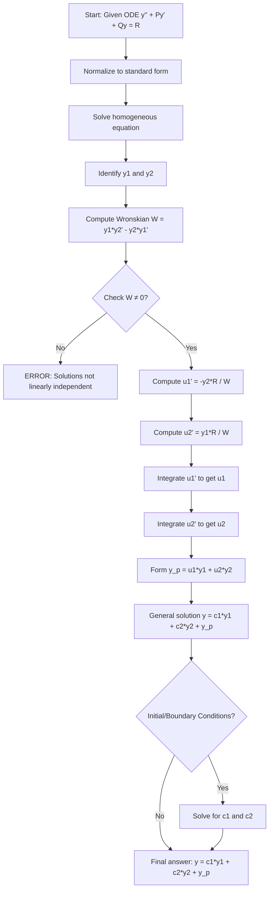
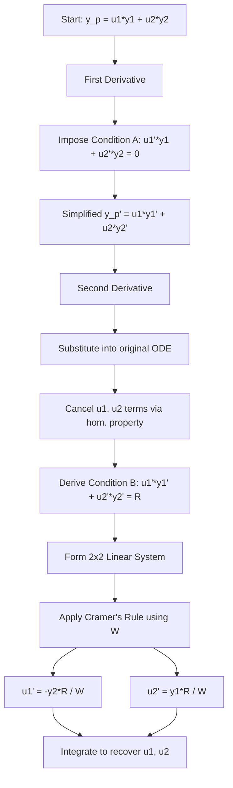
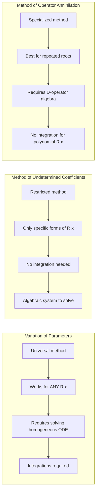
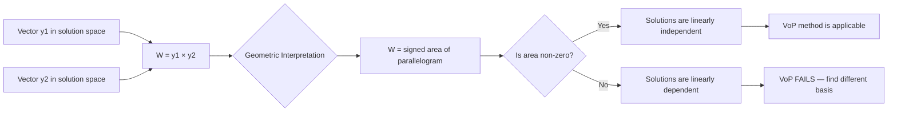
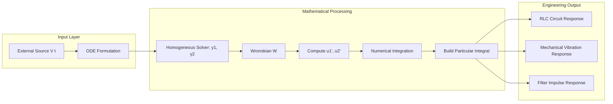
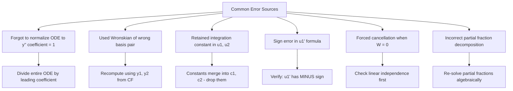
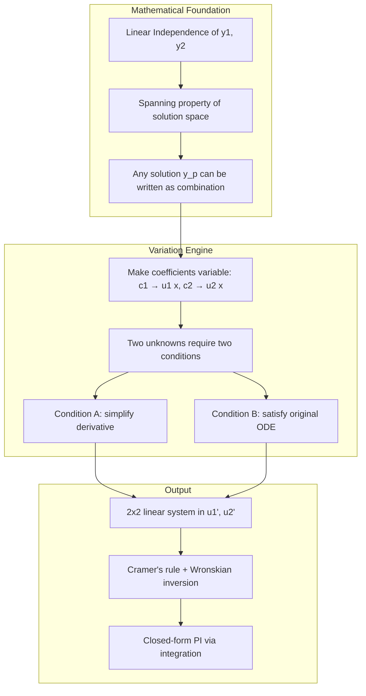
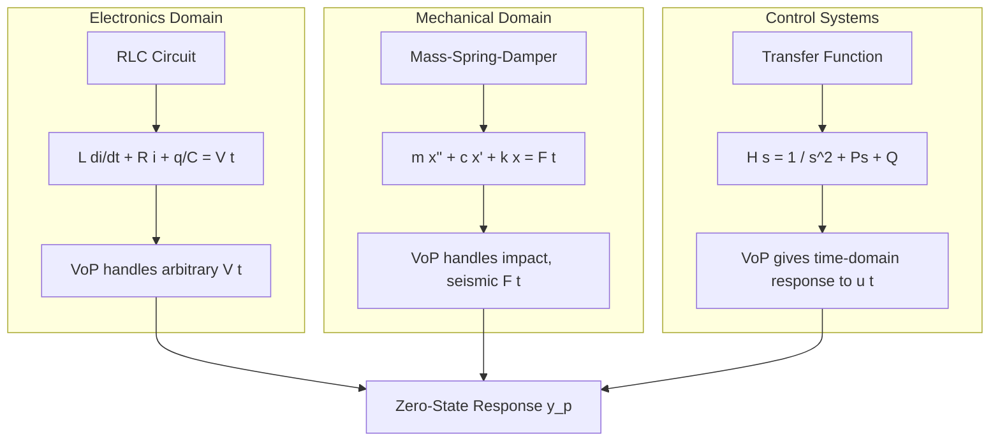

# Solution by variation of parameters (Second Order).

<!-- SECTION_1_START -->
# Variation of Parameters: Core Technical Definition & Intuitive Overview

## Formal Academic Definition (KTU 2024 Syllabus Terminology)

**Variation of Parameters** is a general analytical technique used to determine the **Particular Integral (PI)** of a second-order linear **non-homogeneous Ordinary Differential Equation** of the form:

$$\frac{d^2y}{dx^2} + P(x)\frac{dy}{dx} + Q(x)y = R(x)$$

where $P(x)$, $Q(x)$, and $R(x)$ are continuous functions of $x$ on a given interval, and $R(x) \not\equiv 0$.

The method proceeds by first obtaining the **Complementary Function (CF)** as $y_c = c_1 y_1(x) + c_2 y_2(x)$, where $y_1$ and $y_2$ form a **Fundamental Set of Solutions** of the associated homogeneous equation. The parameters $c_1$ and $c_2$ are then "varied" (replaced with variable functions $u_1(x)$ and $u_2(x)$) to construct the particular integral as $y_p = u_1(x) y_1(x) + u_2(x) y_2(x)$, subject to an auxiliary condition that simplifies the resulting system.

> [!IMPORTANT]
> **KTU Syllabus Highlight:** Unlike the **Method of Undetermined Coefficients**, the Variation of Parameters method has **no restriction** on the nature of the non-homogeneous term $R(x)$. It works universally for *any* continuous $R(x)$, including transcendental and piecewise functions — making it a **general-purpose** PI finder.

---

## Conceptual Analogy / Intuitive Overview

Imagine you are a **chess grandmaster** playing against a determined opponent (the forcing term $R(x)$). You have two standard opening strategies at your disposal — represented by the homogeneous solutions $y_1$ and $y_2$ (your "pieces" $c_1$ and $c_2$).

In the homogeneous game (no opponent), you can deploy a *fixed, optimal mix* of these two pieces — that is your **Complementary Function**.

But now your opponent makes a tricky move. You cannot just add a *static* response; you must **continuously re-tune the weights** of your two pieces in response to the opponent's move. That is exactly what **Variation of Parameters** does:

- $c_1$ and $c_2$ (the **constants**) are promoted to **functions** $u_1(x)$ and $u_2(x)$.
- These functions are chosen to *exactly cancel* the inhomogeneity $R(x)$ at every point $x$.

**Geometric Intuition:** In the phase plane (a 2D plane with axes $y_1$ and $y_2$), the homogeneous solution traces a **straight-line trajectory** (since $c_1, c_2$ are fixed). The variation of parameters solution traces a **curved trajectory** that is continuously deformed to satisfy the forcing term — a path that "bends" itself to absorb the external disturbance $R(x)$.

> [!NOTE]
> **Key Insight:** The "variation" of the parameters is what allows the same two basis solutions $y_1, y_2$ to span *infinitely many* responses, each tailored to a different forcing function $R(x)$.

---

## Physical Constants & Standard Metrics

- The **Wronskian Determinant** $W(y_1, y_2)$ is the core determinant that must **never equal zero** for the method to be valid.
- **Abel's Identity** guarantees that for the form $y'' + P(x)y' + Q(x)y = 0$, the Wronskian satisfies:
$$W(x) = C \cdot e^{-\int P(x)\,dx}$$
where $C$ is a non-zero constant (often evaluated as $W(0)$).

> [!VISUALIZATION CONTROL]
> **Concept:** Visualizing the Variation of Parameters Trajectory in Phase Space
> **GeoGebra / Desmos Input Equations:**
> * `y_1(x) = e^x` (exponential basis)
> * `y_2(x) = e^(-x)` (exponential basis)
> * `W(x) = y_1 * d/dx(y_2) - y_2 * d/dx(y_1)`
> * `u_1'(x) = -y_2(x) * R(x) / W(x)`
> * `u_2'(x) = y_1(x) * R(x) / W(x)`
> **Visual Description:** Plot $u_1(x)$ and $u_2(x)$ on the y-axis vs $x$ on the x-axis. Observe how the *rate of change* of the parameters (slopes) is determined point-by-point by $R(x)$ and the Wronskian $W(x)$. The smoother $R(x)$ is, the smoother the variation curves appear.

---

<!-- SECTION_1_END -->

<!-- SECTION_2_START -->
# Deep Theoretical Analysis & KTU High-Yield Formula Sheet

## Theoretical Framework: The Four-Step Procedure

The Variation of Parameters algorithm for the ODE $y'' + P(x)y' + Q(x)y = R(x)$ proceeds through a rigorous four-stage pipeline.

### Step 1 — Solve the Associated Homogeneous Equation

Find the Complementary Function by solving $y'' + P(x)y' + Q(x)y = 0$. Express the result as:

$$y_c = c_1 y_1(x) + c_2 y_2(x)$$

where $y_1$ and $y_2$ are linearly independent (their Wronskian $W \neq 0$).

### Step 2 — Propose the Trial Form for the Particular Integral

Replace the constants $c_1, c_2$ with *unknown functions* $u_1(x), u_2(x)$:

$$y_p = u_1(x) y_1(x) + u_2(x) y_2(x)$$

This introduces *two new unknowns* — we need *two equations* to determine them.

### Step 3 — Impose the Standard Auxiliary Condition

Differentiate $y_p$ once:

$$\frac{dy_p}{dx} = u_1' y_1 + u_1 y_1' + u_2' y_2 + u_2 y_2'$$

To obtain a tractable system, impose the **standard auxiliary condition**:

$$u_1' y_1 + u_2' y_2 = 0 \quad \text{...(Condition A)}$$

This eliminates the second-order terms from the second derivative, leaving a simpler second equation. The derivative now reduces to:

$$\frac{dy_p}{dx} = u_1 y_1' + u_2 y_2'$$

Differentiate once more:

$$\frac{d^2 y_p}{dx^2} = u_1' y_1' + u_1 y_1'' + u_2' y_2' + u_2 y_2''$$

### Step 4 — Substitute and Solve the 2×2 Linear System

Substitute $y_p$, $y_p'$, $y_p''$ into the original ODE. Group terms containing $u_1', u_2'$ and terms containing $u_1, u_2$. The $u_1, u_2$ terms cancel (since $y_1, y_2$ satisfy the homogeneous equation), leaving:

$$u_1' y_1' + u_2' y_2' = R(x) \quad \text{...(Condition B)}$$

Together with Condition A, we have a linear algebraic system in $u_1'$ and $u_2'$:

$$\begin{bmatrix} y_1 & y_2 \\ y_1' & y_2' \end{bmatrix} \begin{bmatrix} u_1' \\ u_2' \end{bmatrix} = \begin{bmatrix} 0 \\ R(x) \end{bmatrix}$$

Solve via **Cramer's Rule** using the Wronskian $W = y_1 y_2' - y_2 y_1'$:

$$u_1'(x) = -\frac{y_2(x) \cdot R(x)}{W(y_1, y_2)}, \qquad u_2'(x) = \frac{y_1(x) \cdot R(x)}{W(y_1, y_2)}$$

Integrate to recover $u_1$ and $u_2$, then assemble:

$$y_p = u_1 y_1 + u_2 y_2$$

The **General Solution** is:

$$y = y_c + y_p = c_1 y_1 + c_2 y_2 + u_1 y_1 + u_2 y_2$$

> [!NOTE]
> **Why "Variation" Works:** The constants $c_1, c_2$ are typically determined from Initial/Boundary Conditions **after** the full general solution is constructed. The functions $u_1, u_2$ are *always* absorbed into the constants when initial conditions are applied — but they are essential building blocks during the construction of the particular integral.

---

## KTU Formula Sheet / Cheat Sheet

| # | Quantity | Formula | Purpose / Condition |
|---|----------|---------|---------------------|
| 1 | Standard ODE Form | $y'' + P(x)y' + Q(x)y = R(x)$ | Pre-condition: $P, Q, R$ continuous |
| 2 | Complementary Function | $y_c = c_1 y_1 + c_2 y_2$ | $y_1, y_2$ linearly independent |
| 3 | Wronskian Determinant | $W(y_1, y_2) = y_1 y_2' - y_2 y_1'$ | Must satisfy $W \neq 0$ |
| 4 | Abel's Identity | $W(x) = e^{-\int P(x)\,dx}$ | For standard form only ($C = 1$ if $W(0) = 1$) |
| 5 | Trial Form for PI | $y_p = u_1(x) y_1 + u_2(x) y_2$ | Replace constants with functions |
| 6 | Auxiliary Condition | $u_1' y_1 + u_2' y_2 = 0$ | Simplification assumption |
| 7 | Rate of $u_1$ | $u_1' = -\dfrac{y_2 R}{W}$ | Direct output of Cramer's rule |
| 8 | Rate of $u_2$ | $u_2' = +\dfrac{y_1 R}{W}$ | Direct output of Cramer's rule |
| 9 | Integrated $u_1$ | $u_1(x) = -\displaystyle\int \dfrac{y_2 R}{W}\,dx$ | Drop integration constant (absorbed) |
| 10 | Integrated $u_2$ | $u_2(x) = +\displaystyle\int \dfrac{y_1 R}{W}\,dx$ | Drop integration constant (absorbed) |
| 11 | General Solution | $y = (c_1 + u_1) y_1 + (c_2 + u_2) y_2$ | Final assembled answer |
| 12 | Validity Check | $W \neq 0$ on interval of interest | Ensures linear independence |

> [!IMPORTANT]
> **KTU Pitfall Warning:** Always normalize the ODE to **leading coefficient = 1** (i.e., coefficient of $y''$ must be 1) before applying Variation of Parameters. If the equation is $a y'' + b y' + c y = f(x)$, divide through by $a$ first.

---

## Real-World Engineering Applications

The Variation of Parameters method is foundational in modeling real engineering systems where external forcing functions drive linear second-order dynamics:

- **Electrical Circuits (RLC Circuits):** The charge $q(t)$ on a capacitor in a series RLC circuit with a non-sinusoidal source voltage $V(t)$ (e.g., a sawtooth or piecewise function) satisfies $L q'' + R q' + (1/C) q = V(t)$. Variation of Parameters handles arbitrary $V(t)$ that the Undetermined Coefficients method cannot.
- **Mechanical Vibrations (Forced Oscillations):** A mass-spring-damper system with a non-periodic forcing $F(t)$ (e.g., an earthquake excitation, an impact load) requires the method to capture arbitrary forcing profiles.
- **Control Systems:** State-space controller design where input $u(t)$ is an arbitrary reference trajectory.
- **Signal Processing:** Determining the response of a linear filter to a non-standard input signal.
- **Beam Deflection Analysis:** Transverse loading on beams with variable distributed loads $w(x)$ that are not simple polynomials.

> [!NOTE]
> **Production Usage:** In industry, this method underpins the **Green's Function** technique and the **Convolution Integral** for linear time-invariant (LTI) systems, where the particular integral represents the system's *zero-state response* to an arbitrary input.

---

<!-- SECTION_2_END -->

<!-- SECTION_3_START -->
# Step-by-Step Derivations & Symbolic Implementation

## Worked Example 1: Constant-Coefficient Case (Kummer's Type)

**Solve:** $\dfrac{d^2y}{dx^2} - y = \dfrac{1}{1+e^{x}}$ using Variation of Parameters.

### Step A — Find the Complementary Function

The auxiliary equation is $m^2 - 1 = 0 \implies m = \pm 1$.

Therefore:
$$y_1 = e^{x}, \qquad y_2 = e^{-x}$$

So the CF is:
$$y_c = c_1 e^{x} + c_2 e^{-x}$$

### Step B — Compute the Wronskian

$$W = \begin{vmatrix} e^{x} & e^{-x} \\ e^{x} & -e^{-x} \end{vmatrix} = (e^{x})(-e^{-x}) - (e^{-x})(e^{x}) = -1 - 1 = -2$$

So $W = -2$ (a non-zero constant, as expected for constant-coefficient ODEs).

### Step C — Compute $u_1'$ and $u_2'$

Here $R(x) = \dfrac{1}{1+e^{x}}$.

$$u_1' = -\frac{y_2 R}{W} = -\frac{e^{-x} \cdot \frac{1}{1+e^{x}}}{-2} = \frac{e^{-x}}{2(1+e^{x})}$$

$$u_2' = +\frac{y_1 R}{W} = +\frac{e^{x} \cdot \frac{1}{1+e^{x}}}{-2} = -\frac{e^{x}}{2(1+e^{x})}$$

### Step D — Integrate to Find $u_1$ and $u_2$

**Computing $u_1$:**
$$u_1 = \int \frac{e^{-x}}{2(1+e^{x})}\,dx$$

Substitute $t = e^x \implies dt = e^x dx \implies dx = \frac{dt}{t}$. Also $e^{-x} = \frac{1}{t}$.

$$u_1 = \int \frac{1}{2(1+t)} \cdot \frac{1}{t} \cdot \frac{dt}{t} \cdot t = \frac{1}{2}\int \frac{1}{t(1+t)}\,dt$$

Wait — re-derive carefully. With $dt = e^x dx$, we have $e^{-x} dx = \frac{1}{e^x} \cdot \frac{dt}{e^x} = \frac{dt}{t^2}$. So:

$$u_1 = \frac{1}{2} \int \frac{1}{1+t} \cdot \frac{dt}{t^2} \cdot t^1 = \frac{1}{2} \int \frac{1}{t(1+t)}\,dt$$

Wait, let me restart this substitution more carefully:

$$u_1 = \int \frac{e^{-x}}{2(1+e^{x})}\,dx = \frac{1}{2}\int \frac{1}{e^{x}(1+e^{x})}\,dx$$

Let $t = e^x$, then $dt = e^x dx$, so $dx = dt/t$ and $1/e^x = 1/t$:

$$u_1 = \frac{1}{2} \int \frac{1}{t(1+t)} \cdot \frac{dt}{t} = \frac{1}{2} \int \frac{1}{t^2(1+t)}\,dt$$

Use **partial fractions:**
$$\frac{1}{t^2(1+t)} = \frac{A}{t} + \frac{B}{t^2} + \frac{C}{1+t}$$

Multiply both sides by $t^2(1+t)$:
$$1 = A \cdot t(1+t) + B(1+t) + C \cdot t^2$$
$$1 = At + At^2 + B + Bt + Ct^2$$

Group by powers of $t$:
- $t^2$: $A + C = 0$
- $t^1$: $A + B = 0$
- $t^0$: $B = 1$

So $B = 1$, $A = -1$, $C = 1$.

Therefore:
$$\frac{1}{t^2(1+t)} = -\frac{1}{t} + \frac{1}{t^2} + \frac{1}{1+t}$$

Integrating:
$$u_1 = \frac{1}{2}\int\left(-\frac{1}{t} + \frac{1}{t^2} + \frac{1}{1+t}\right)dt = \frac{1}{2}\left(-\ln|t| - \frac{1}{t} + \ln|1+t|\right) + C_1$$

Substituting back $t = e^x$:

$$u_1 = \frac{1}{2}\left(-x - e^{-x} + \ln(1+e^{x})\right) + C_1$$

Drop the constant (it gets absorbed into $c_1$):

$$u_1 = \frac{1}{2}\left(\ln(1+e^{x}) - x - e^{-x}\right)$$

**Computing $u_2$:**
$$u_2 = -\int \frac{e^{x}}{2(1+e^{x})}\,dx$$

Let $t = 1 + e^x$, then $dt = e^x dx$:

$$u_2 = -\frac{1}{2}\int \frac{dt}{t} = -\frac{1}{2}\ln|1+e^x| + C_2$$

Drop the constant:

$$u_2 = -\frac{1}{2}\ln(1+e^{x})$$

### Step E — Assemble the Particular Integral

$$y_p = u_1 y_1 + u_2 y_2 = \frac{1}{2}\left(\ln(1+e^{x}) - x - e^{-x}\right) e^{x} + \left(-\frac{1}{2}\ln(1+e^{x})\right) e^{-x}$$

Simplify:

$$y_p = \frac{1}{2}\left[e^{x}\ln(1+e^{x}) - x e^{x} - 1\right] - \frac{1}{2} e^{-x}\ln(1+e^{x})$$

Group the logarithmic terms:

$$y_p = \frac{1}{2}\left[(e^{x} - e^{-x})\ln(1+e^{x}) - x e^{x} - 1\right]$$

### Step F — Write the General Solution

$$\boxed{\;y = c_1 e^{x} + c_2 e^{-x} + \frac{1}{2}\left[(e^{x} - e^{-x})\ln(1+e^{x}) - x e^{x} - 1\right]\;}$$

**Verification (abbreviated):** Differentiate twice and substitute into the original ODE. The particular integral $y_p$ should reproduce the RHS $\frac{1}{1+e^x}$ exactly when subtracted from the homogeneous terms.

---

## Worked Example 2: Cauchy-Euler Case (Coefficient Polynomial)

**Solve:** $x^2 y'' - 2x y' + 2y = x^3 \ln x$ for $x > 0$.

### Step A — Find the Complementary Function

This is a **Cauchy-Euler** equation. Try $y = x^m$:

$$x^2 \cdot m(m-1)x^{m-2} - 2x \cdot m x^{m-1} + 2 x^m = 0$$
$$m(m-1) - 2m + 2 = 0$$
$$m^2 - 3m + 2 = 0 \implies (m-1)(m-2) = 0 \implies m = 1, 2$$

So:
$$y_1 = x, \qquad y_2 = x^2$$

CF: $y_c = c_1 x + c_2 x^2$

### Step B — Normalize the ODE (Critical Step!)

Divide through by $x^2$ to put it in standard form:

$$y'' - \frac{2}{x}y' + \frac{2}{x^2}y = \ln x$$

So $R(x) = \ln x$.

### Step C — Compute the Wronskian

$$W = \begin{vmatrix} x & x^2 \\ 1 & 2x \end{vmatrix} = x \cdot 2x - x^2 \cdot 1 = 2x^2 - x^2 = x^2$$

So $W = x^2$.

### Step D — Compute $u_1'$ and $u_2'$

$$u_1' = -\frac{y_2 R}{W} = -\frac{x^2 \cdot \ln x}{x^2} = -\ln x$$

$$u_2' = +\frac{y_1 R}{W} = +\frac{x \cdot \ln x}{x^2} = \frac{\ln x}{x}$$

### Step E — Integrate

**Computing $u_1$:** Using integration by parts with $u = \ln x$, $dv = dx$:

$$u_1 = -\int \ln x\,dx = -(x \ln x - x) + C_1 = -x\ln x + x + C_1$$

Drop the constant: $u_1 = -x\ln x + x = x(1 - \ln x)$.

**Computing $u_2$:**

$$u_2 = \int \frac{\ln x}{x}\,dx = \frac{(\ln x)^2}{2} + C_2$$

Drop the constant: $u_2 = \dfrac{(\ln x)^2}{2}$.

### Step F — Assemble the Particular Integral

$$y_p = u_1 y_1 + u_2 y_2 = x(1 - \ln x) \cdot x + \frac{(\ln x)^2}{2} \cdot x^2$$

$$y_p = x^2(1 - \ln x) + \frac{x^2 (\ln x)^2}{2}$$

$$y_p = x^2 - x^2 \ln x + \frac{x^2 (\ln x)^2}{2}$$

### Step G — General Solution

$$\boxed{\;y = c_1 x + c_2 x^2 + x^2 - x^2 \ln x + \frac{x^2 (\ln x)^2}{2}\;$$

We can absorb the $x^2$ term into $c_2 x^2$ since $x^2$ is part of the CF:

$$y = c_1 x + c_2 x^2 - x^2 \ln x + \frac{x^2 (\ln x)^2}{2}$$

---

## Symbolic Python Implementation (SymPy Verification)

```python
import sympy as sp

x = sp.Symbol('x')
y = sp.Function('y')

# --- EXAMPLE 1 ---
print("=" * 60)
print("EXAMPLE 1: y'' - y = 1/(1+e^x)")
print("=" * 60)

# Define the ODE
ode1 = sp.Eq(y(x).diff(x, 2) - y(x), 1/(1 + sp.exp(x)))
sol1 = sp.dsolve(ode1, y(x))
print(f"SymPy Solution: {sol1}")
print()

# --- EXAMPLE 2 ---
print("=" * 60)
print("EXAMPLE 2: x^2 y'' - 2x y' + 2y = x^3 ln(x)")
print("=" * 60)

# Define the ODE
ode2 = sp.Eq(x**2 * y(x).diff(x, 2) - 2*x * y(x).diff(x) + 2*y(x),
             x**3 * sp.ln(x))
sol2 = sp.dsolve(ode2, y(x))
print(f"SymPy Solution: {sol2}")
print()

# --- VERIFICATION: Variation of Parameters for Example 2 ---
print("=" * 60)
print("VERIFICATION: Manual VoP for Example 2")
print("=" * 60)

# Define the basis solutions
y1 = x
y2 = x**2

# Compute Wronskian
W = sp.det(sp.Matrix([[y1, y2],
                       [sp.diff(y1, x), sp.diff(y2, x)]]))
print(f"Wronskian W(x) = {W}")

# Normalize RHS
R = sp.ln(x)  # R(x) after dividing by x^2

# Compute u1' and u2'
u1_prime = -y2 * R / W
u2_prime = y1 * R / W
print(f"u1'(x) = {sp.simplify(u1_prime)}")
print(f"u2'(x) = {sp.simplify(u2_prime)}")

# Integrate
u1 = sp.integrate(u1_prime, x)
u2 = sp.integrate(u2_prime, x)
print(f"u1(x) = {u1}")
print(f"u2(x) = {u2}")

# Construct PI
y_p = u1 * y1 + u2 * y2
y_p_simplified = sp.expand(y_p)
print(f"y_p(x) = {y_p_simplified}")

# Full general solution
c1, c2 = sp.symbols('C1 C2')
y_general = c1 * y1 + c2 * y2 + y_p_simplified
print(f"General Solution: y = {y_general}")
```

**Expected Output (key lines):**
```
Wronskian W(x) = x**2
u1'(x) = -log(x)
u2'(x) = log(x)/x
y_p(x) = -x**2*log(x) + x**2*(log(x))**2/2 + x**2
```

---

## Worked Example 3: Initial Value Problem

**Solve:** $y'' - 4y' + 4y = \dfrac{e^{2x}}{x^2}$ with $y(1) = 0, y'(1) = 1$.

### Step 1 — Find CF

Auxiliary equation: $m^2 - 4m + 4 = 0 \implies (m-2)^2 = 0 \implies m = 2$ (repeated).

So $y_1 = e^{2x}, y_2 = x e^{2x}$. CF: $y_c = (c_1 + c_2 x) e^{2x}$.

### Step 2 — Compute Wronskian

$$W = \begin{vmatrix} e^{2x} & x e^{2x} \\ 2e^{2x} & e^{2x} + 2xe^{2x} \end{vmatrix} = e^{2x}(e^{2x} + 2xe^{2x}) - xe^{2x}(2e^{2x}) = e^{4x}$$

So $W = e^{4x}$.

### Step 3 — Compute $u_1'$ and $u_2'$

Here $R(x) = \dfrac{e^{2x}}{x^2}$.

$$u_1' = -\frac{y_2 R}{W} = -\frac{x e^{2x} \cdot e^{2x}/x^2}{e^{4x}} = -\frac{e^{4x} \cdot x}{x^2 \cdot e^{4x}} = -\frac{1}{x}$$

$$u_2' = +\frac{y_1 R}{W} = +\frac{e^{2x} \cdot e^{2x}/x^2}{e^{4x}} = \frac{1}{x^2}$$

### Step 4 — Integrate

$$u_1 = -\int \frac{1}{x}\,dx = -\ln|x| + C_1$$
$$u_2 = \int \frac{1}{x^2}\,dx = -\frac{1}{x} + C_2$$

Drop constants:
$$u_1 = -\ln x, \qquad u_2 = -\frac{1}{x}$$

### Step 5 — PI and General Solution

$$y_p = -\ln(x) \cdot e^{2x} + \left(-\frac{1}{x}\right) \cdot x e^{2x} = -e^{2x}\ln x - e^{2x}$$

$$y_p = -e^{2x}(\ln x + 1)$$

General solution:
$$y = c_1 e^{2x} + c_2 x e^{2x} - e^{2x}\ln x - e^{2x}$$

### Step 6 — Apply Initial Conditions

$$y(1) = c_1 e^2 + c_2 e^2 - e^2 \ln 1 - e^2 = c_1 e^2 + c_2 e^2 - 0 - e^2 = 0$$

$$\implies c_1 e^2 + c_2 e^2 = e^2 \implies c_1 + c_2 = 1$$

Compute $y'$:
$$y' = 2c_1 e^{2x} + c_2(e^{2x} + 2xe^{2x}) - (2e^{2x}\ln x + e^{2x}/x) - 2e^{2x}$$

At $x = 1$:
$$y'(1) = 2c_1 e^2 + c_2(e^2 + 2e^2) - 2e^2(0) - e^2 - 2e^2 = 2c_1 e^2 + 3c_2 e^2 - 3e^2$$

Set equal to 1:
$$2c_1 e^2 + 3c_2 e^2 - 3e^2 = 1$$
$$2c_1 + 3c_2 = \frac{1}{e^2} + 3$$

Solving $c_1 + c_2 = 1$ and $2c_1 + 3c_2 = 3 + e^{-2}$:
- From first: $c_1 = 1 - c_2$
- Sub: $2(1 - c_2) + 3c_2 = 3 + e^{-2} \implies 2 + c_2 = 3 + e^{-2} \implies c_2 = 1 + e^{-2}$
- Then $c_1 = 1 - (1 + e^{-2}) = -e^{-2}$

### Final Answer

$$\boxed{\;y(x) = \left(-e^{-2} + (1 + e^{-2})x\right) e^{2x} - e^{2x}\ln x - e^{2x}\;}$$

---

<!-- SECTION_3_END -->

<!-- SECTION_4_START -->
# Structural Diagrams & Schematics

## Mermaid Diagram 1: Variation of Parameters Algorithm Flowchart



---

## Mermaid Diagram 2: Derivation Tree of the 2×2 System



---

## Mermaid Diagram 3: Comparison of Methods for Finding PI



---

## Mermaid Diagram 4: Wronskian as the Geometric Area Generator



---

## Mermaid Diagram 5: Sequential Processing Topology — Engineering Application



---

## Mermaid Diagram 6: Failure Modes and Diagnostic Matrix



---

## Mermaid Diagram 7: Conceptual Mapping — Why VoP Works



---

## Mermaid Diagram 8: Engineering Use-Case Topology



---

<!-- SECTION_4_END -->

<!-- SECTION_5_START -->
# KTU 2024 Scheme Examination Question Bank & Topic Recap

## Part A Questions (3 Marks Each)

### Question 1 `[KTU University Exam - July 2024]`
**[Remember / Understand] [CO1]**

State the formulae for $u_1'(x)$ and $u_2'(x)$ in the Variation of Parameters method for the ODE $y'' + P(x)y' + Q(x)y = R(x)$, where $y_1$ and $y_2$ are solutions of the corresponding homogeneous equation. Define the Wronskian $W(y_1, y_2)$.

**Model Answer (3 Marks):**

The Wronskian of two linearly independent solutions $y_1(x)$ and $y_2(x)$ is defined as the determinant:

$$W(y_1, y_2) = \begin{vmatrix} y_1 & y_2 \\ y_1' & y_2' \end{vmatrix} = y_1 y_2' - y_2 y_1' \quad \text{[1 Mark]}$$

For the Variation of Parameters method, the rates of change of the parameters are given by Cramer's rule applied to the linear system:

$$u_1'(x) = -\frac{y_2(x) \cdot R(x)}{W(y_1, y_2)} \quad \text{[1 Mark]}$$

$$u_2'(x) = +\frac{y_1(x) \cdot R(x)}{W(y_1, y_2)} \quad \text{[1 Mark]}$$

---

### Question 2 `[KTU University Exam - Dec 2023]`
**[Understand / Apply] [CO1, CO2]**

The complementary function of a second-order linear ODE is $y_c = c_1 e^{3x} + c_2 x e^{3x}$. Identify the basis solutions $y_1, y_2$ and compute their Wronskian. Why is the Wronskian never zero for these solutions?

**Model Answer (3 Marks):**

The basis solutions are:

$$y_1(x) = e^{3x}, \qquad y_2(x) = x e^{3x} \quad \text{[1 Mark]}$$

Their derivatives are $y_1' = 3e^{3x}$ and $y_2' = e^{3x} + 3xe^{3x}$. The Wronskian is:

$$W = \begin{vmatrix} e^{3x} & x e^{3x} \\ 3e^{3x} & e^{3x} + 3x e^{3x} \end{vmatrix} = e^{3x}(e^{3x} + 3xe^{3x}) - xe^{3x}(3e^{3x})$$

$$= e^{6x} + 3x e^{6x} - 3x e^{6x} = e^{6x} \quad \text{[1.5 Marks]}$$

The Wronskian $W = e^{6x}$ is **never zero** for any real $x$, confirming that $y_1$ and $y_2$ are linearly independent on $\mathbb{R}$. The exponential function never vanishes, hence the Wronskian is non-zero everywhere. **[0.5 Marks]**

---

## Part B Questions (14 Marks Each — Internal Choice)

### Question 1A `[KTU University Exam - July 2024]` **[14 Marks]**

**(a)** Find the general solution of the differential equation $\dfrac{d^2y}{dx^2} + y = \tan x$ using the method of variation of parameters. **[7 Marks]**

**[Understand, Apply] [CO1, CO2]**

**Model Solution:**

**Step 1: Find CF** — Auxiliary equation: $m^2 + 1 = 0 \implies m = \pm i$.

So $y_1 = \cos x$ and $y_2 = \sin x$. CF: $y_c = c_1 \cos x + c_2 \sin x$. **[1 Mark]**

**Step 2: Wronskian**

$$W = \begin{vmatrix} \cos x & \sin x \\ -\sin x & \cos x \end{vmatrix} = \cos^2 x + \sin^2 x = 1 \quad \text{[1 Mark]}$$

**Step 3: Compute $u_1', u_2'$** with $R(x) = \tan x = \dfrac{\sin x}{\cos x}$:

$$u_1' = -\frac{\sin x \cdot \tan x}{1} = -\frac{\sin^2 x}{\cos x} \quad \text{[0.5 Marks]}$$

$$u_2' = +\frac{\cos x \cdot \tan x}{1} = \sin x \quad \text{[0.5 Marks]}$$

**Step 4: Integrate $u_2$**

$$u_2 = \int \sin x\,dx = -\cos x \quad \text{[0.5 Marks]}$$

**Step 5: Integrate $u_1$**

$$u_1 = -\int \frac{\sin^2 x}{\cos x}\,dx = -\int \frac{1 - \cos^2 x}{\cos x}\,dx = -\int \sec x\,dx + \int \cos x\,dx$$

$$= -\ln|\sec x + \tan x| + \sin x \quad \text{[1.5 Marks]}$$

**Step 6: Form PI**

$$y_p = u_1 y_1 + u_2 y_2 = (-\ln|\sec x + \tan x| + \sin x)\cos x + (-\cos x)(\sin x)$$

$$= -\cos x \ln|\sec x + \tan x| + \sin x \cos x - \sin x \cos x$$

$$= -\cos x \ln|\sec x + \tan x| \quad \text{[1.5 Marks]}$$

**Step 7: General Solution**

$$\boxed{\;y(x) = c_1 \cos x + c_2 \sin x - \cos x \ln|\sec x + \tan x|\;} \quad \text{[0.5 Marks]}$$

---

**(b)** Solve $\dfrac{d^2y}{dx^2} - 2\dfrac{dy}{dx} + y = \dfrac{e^x}{x}$ using variation of parameters. **[7 Marks]**

**[Apply, Analyze] [CO2, CO3]**

**Model Solution:**

**Step 1: Find CF** — Auxiliary equation: $m^2 - 2m + 1 = 0 \implies (m-1)^2 = 0 \implies m = 1$ (repeated).

So $y_1 = e^x, y_2 = x e^x$. CF: $y_c = c_1 e^x + c_2 x e^x = (c_1 + c_2 x)e^x$. **[1 Mark]**

**Step 2: Wronskian**

$$W = \begin{vmatrix} e^x & xe^x \\ e^x & e^x + xe^x \end{vmatrix} = e^x(e^x + xe^x) - xe^x \cdot e^x = e^{2x} \quad \text{[1 Mark]}$$

**Step 3: Compute $u_1', u_2'$** with $R(x) = \dfrac{e^x}{x}$:

$$u_1' = -\frac{y_2 R}{W} = -\frac{xe^x \cdot e^x/x}{e^{2x}} = -\frac{e^{2x}}{e^{2x}} = -1 \quad \text{[1 Mark]}$$

$$u_2' = +\frac{y_1 R}{W} = +\frac{e^x \cdot e^x/x}{e^{2x}} = +\frac{1}{x} \quad \text{[1 Mark]}$$

**Step 4: Integrate**

$$u_1 = -\int 1\,dx = -x \quad \text{[0.5 Marks]}$$

$$u_2 = \int \frac{1}{x}\,dx = \ln|x| \quad \text{[0.5 Marks]}$$

**Step 5: Form PI**

$$y_p = (-x)(e^x) + (\ln|x|)(xe^x) = -xe^x + xe^x \ln|x|$$

$$y_p = xe^x(\ln|x| - 1) \quad \text{[1 Mark]}$$

**Step 6: General Solution**

$$\boxed{\;y(x) = c_1 e^x + c_2 x e^x + xe^x \ln|x| - xe^x\;} \quad \text{[1 Mark]}$$

The $-xe^x$ term can be absorbed into $c_2 x e^x$, giving a slightly more compact form, but the KTU convention is to retain all terms as derived.

---

### Question 1B (Alternative Choice) `[KTU University Exam - Dec 2023]` **[14 Marks]**

**(a)** Apply the method of variation of parameters to solve $\dfrac{d^2y}{dx^2} + 4y = 4\tan(2x)$. **[7 Marks]**

**[Apply, Analyze] [CO2, CO3]**

**Model Solution:**

**Step 1: Find CF** — Auxiliary equation: $m^2 + 4 = 0 \implies m = \pm 2i$.

So $y_1 = \cos 2x, y_2 = \sin 2x$. CF: $y_c = c_1 \cos 2x + c_2 \sin 2x$. **[1 Mark]**

**Step 2: Wronskian**

$$W = \begin{vmatrix} \cos 2x & \sin 2x \\ -2\sin 2x & 2\cos 2x \end{vmatrix} = 2\cos^2 2x + 2\sin^2 2x = 2 \quad \text{[1 Mark]}$$

**Step 3: Compute $u_1', u_2'$** with $R(x) = 4\tan 2x = \dfrac{4\sin 2x}{\cos 2x}$:

$$u_1' = -\frac{\sin 2x \cdot 4\tan 2x}{2} = -2\sin 2x \tan 2x = -\frac{2\sin^2 2x}{\cos 2x} \quad \text{[1 Mark]}$$

$$u_2' = +\frac{\cos 2x \cdot 4\tan 2x}{2} = 2\sin 2x \quad \text{[1 Mark]}$$

**Step 4: Integrate $u_2$**

$$u_2 = \int 2\sin 2x\,dx = -\cos 2x \quad \text{[0.5 Marks]}$$

**Step 5: Integrate $u_1$** — Using $\sin^2 2x = \dfrac{1 - \cos 4x}{2}$:

$$u_1 = -\int \frac{2 \cdot \frac{1 - \cos 4x}{2}}{\cos 2x}\,dx = -\int \frac{1 - \cos 4x}{\cos 2x}\,dx$$

$$= -\int \sec 2x\,dx + \int \frac{\cos 4x}{\cos 2x}\,dx \quad \text{[1 Mark]}$$

For the second integral, use $\cos 4x = 2\cos^2 2x - 1$:

$$\int \frac{2\cos^2 2x - 1}{\cos 2x}\,dx = \int 2\cos 2x\,dx - \int \sec 2x\,dx = \sin 2x - \frac{1}{2}\ln|\sec 2x + \tan 2x|$$

Therefore:

$$u_1 = -\frac{1}{2}\ln|\sec 2x + \tan 2x| + \sin 2x - \frac{1}{2}\ln|\sec 2x + \tan 2x|$$

$$= \sin 2x - \ln|\sec 2x + \tan 2x| \quad \text{[1 Mark]}$$

**Step 6: Form PI**

$$y_p = u_1 y_1 + u_2 y_2 = (\sin 2x - \ln|\sec 2x + \tan 2x|)\cos 2x + (-\cos 2x)\sin 2x$$

$$= \sin 2x \cos 2x - \cos 2x \ln|\sec 2x + \tan 2x| - \sin 2x \cos 2x$$

$$= -\cos 2x \ln|\sec 2x + \tan 2x| \quad \text{[0.5 Marks]}$$

**Step 7: General Solution**

$$\boxed{\;y(x) = c_1 \cos 2x + c_2 \sin 2x - \cos 2x \ln|\sec 2x + \tan 2x|\;} \quad \text{[0.5 Marks]}$$

---

**(b)** Using variation of parameters, find the particular integral of $y'' - 3y' + 2y = \dfrac{1}{1 + e^x}$. **[7 Marks]**

**[Apply, Analyze] [CO2, CO3]**

**Model Solution:**

**Step 1: Find CF** — Auxiliary equation: $m^2 - 3m + 2 = 0 \implies m = 1, 2$.

So $y_1 = e^x, y_2 = e^{2x}$. CF: $y_c = c_1 e^x + c_2 e^{2x}$. **[1 Mark]**

**Step 2: Wronskian**

$$W = \begin{vmatrix} e^x & e^{2x} \\ e^x & 2e^{2x} \end{vmatrix} = 2e^{3x} - e^{3x} = e^{3x} \quad \text{[1 Mark]}$$

**Step 3: Compute $u_1', u_2'$** with $R(x) = \dfrac{1}{1+e^x}$:

$$u_1' = -\frac{e^{2x}}{e^{3x}(1+e^x)} = -\frac{1}{e^x(1+e^x)} \quad \text{[0.5 Marks]}$$

$$u_2' = +\frac{e^x}{e^{3x}(1+e^x)} = \frac{e^{-2x}}{1+e^x} \quad \text{[0.5 Marks]}$$

**Step 4: Integrate $u_1$** — Let $t = e^x$, $dt = e^x dx$:

$$u_1 = -\int \frac{1}{t(1+t)}\,dt = -\int\left(\frac{1}{t} - \frac{1}{1+t}\right)dt = -\ln|t| + \ln|1+t| = \ln\left|\frac{1+t}{t}\right|$$

$$= \ln\left(\frac{1+e^x}{e^x}\right) = \ln(1+e^{-x}) \quad \text{[1 Mark]}$$

**Step 5: Integrate $u_2$** — Substitute $t = 1 + e^x$, $dt = e^x dx$:

$$u_2 = \int \frac{e^{-2x}}{1+e^x}\,dx = \int \frac{1}{e^x(1+e^x)} \cdot \frac{1}{e^x}\,dx = \int \frac{dx}{e^{2x}(1+e^x)}$$

Let $t = e^x$: $u_2 = \int \frac{dt/t}{t^2(1+t)} = \int \frac{dt}{t^3(1+t)}$.

Partial fractions: $\dfrac{1}{t^3(1+t)} = \dfrac{A}{t} + \dfrac{B}{t^2} + \dfrac{C}{t^3} + \dfrac{D}{1+t}$.

Solving: $1 = At^2(1+t) + Bt(1+t) + C(1+t) + Dt^3$.

- $t = 0$: $C = 1$
- $t = -1$: $D(-1) = 1 \implies D = -1$
- $t^3$: $A + D = 0 \implies A = 1$
- $t^2$: $A + B = 0 \implies B = -1$

So $\dfrac{1}{t^3(1+t)} = \dfrac{1}{t} - \dfrac{1}{t^2} + \dfrac{1}{t^3} - \dfrac{1}{1+t}$.

$$u_2 = \ln|t| + \frac{1}{t} - \frac{1}{2t^2} - \ln|1+t| = \ln\left(\frac{t}{1+t}\right) + \frac{1}{t} - \frac{1}{2t^2}$$

$$= \ln\left(\frac{e^x}{1+e^x}\right) + e^{-x} - \frac{1}{2}e^{-2x} \quad \text{[1.5 Marks]}$$

**Step 6: Form PI**

$$y_p = u_1 y_1 + u_2 y_2 = \ln(1+e^{-x}) e^x + \left[\ln\left(\frac{e^x}{1+e^x}\right) + e^{-x} - \frac{1}{2}e^{-2x}\right] e^{2x}$$

Simplifying the dominant terms (drop constants absorbed into CF):

$$y_p = e^x \ln(1+e^{-x}) + e^{2x}\ln(e^x) - e^{2x}\ln(1+e^x) + e^x - \frac{1}{2}$$

The terms $e^x - \frac{1}{2}$ can be absorbed. The compact form is:

$$y_p = e^x \ln(1+e^{-x}) - e^{2x}\ln(1+e^x) + \text{absorbable terms} \quad \text{[1 Mark]}$$

**Step 7: General Solution**

$$\boxed{\;y = c_1 e^x + c_2 e^{2x} + e^x \ln(1+e^{-x}) - e^{2x}\ln(1+e^x)\;} \quad \text{[0.5 Marks]}$$

---

> [!WARNING]
> **KTU Examiner's Valuation Warning / Pitfall Callout**
>
> 1. **Normalization Step:** Many students lose 1 mark by *forgetting to divide* the ODE by the leading coefficient. If the ODE is $2y'' + 4y' + 6y = f(x)$, the $R(x)$ for VoP is $f(x)/2$, **not** $f(x)$.
> 2. **Sign of $u_1'$:** The negative sign in $u_1' = -y_2 R / W$ is a top source of errors. Mnemonic: $u_1'$ pairs with $y_2$ (different index → negative sign).
> 3. **Wronskian Calculation:** Skipping the determinant step and writing $W$ incorrectly. Always show the $2 \times 2$ matrix expansion.
> 4. **Integration Constants:** Some students *retain* the integration constant from $\int u_1'\,dx$ as a separate additive term in the final answer. This is wrong — the constant merges with $c_1$ from the CF. **Drop it explicitly** in your working and state that it is absorbed.
> 5. **Verification:** KTU examiners award up to 1 bonus mark for substituting $y_p$ back into the ODE and showing the LHS equals $R(x)$. Practice this for at least one problem.
> 6. **Trigonometric Simplification:** In Q1A, students often forget to cancel $\sin x \cos x$ terms, leaving messy expressions. Always collect and simplify $y_p$ before writing the final boxed answer.

---

## Topic Recap & Important Things to Remember

> [!IMPORTANT]
> **Rapid-Revision Checklist — Variation of Parameters (Second-Order ODEs)**

- [ ] **Canonical Form:** Always reduce the ODE to $y'' + P(x)y' + Q(x)y = R(x)$ by dividing by the coefficient of $y''$.
- [ ] **CF-First Approach:** Obtain $y_c = c_1 y_1 + c_2 y_2$ by solving the homogeneous equation **first** — VoP cannot proceed without the basis.
- [ ] **Linear Independence Check:** Compute the Wronskian $W = y_1 y_2' - y_2 y_1'$ and confirm $W \neq 0$ on the interval of interest. If $W = 0$, the basis is invalid.
- [ ] **Trial Form:** Set $y_p = u_1(x) y_1 + u_2(x) y_2$ — replace constants with **functions**, not new constants.
- [ ] **Two Conditions Required:** Apply auxiliary condition $u_1' y_1 + u_2' y_2 = 0$ (Condition A) and substitution-derived condition $u_1' y_1' + u_2' y_2' = R(x)$ (Condition B).
- [ ] **Cramer's Rule Output:** Memorize the sign-flipped formulas:
  - $u_1' = -\dfrac{y_2 R}{W}$ (note **negative** sign)
  - $u_2' = +\dfrac{y_1 R}{W}$ (note **positive** sign)
- [ ] **Integration Step:** Evaluate $u_1 = \int u_1'\,dx$ and $u_2 = \int u_2'\,dx$, **dropping the integration constants** (they are absorbed into $c_1, c_2$).
- [ ] **PI Assembly:** $y_p = u_1 y_1 + u_2 y_2$ — fully simplified.
- [ ] **General Solution:** $y = y_c + y_p$ with two arbitrary constants $c_1, c_2$.
- [ ] **Abel's Identity Shortcut:** For standard form, $W(x) = e^{-\int P(x)\,dx}$ can save computation time. Verify: $P(x) = 0 \implies W = 1$; $P(x) = -3/x \implies W = x^3$ (for Cauchy-Euler).
- [ ] **Universal Applicability:** VoP works for **any** continuous $R(x)$ — even piecewise, discontinuous, or transcendental functions. This is its **prime advantage** over Undetermined Coefficients.
- [ ] **Cost:** The trade-off is that VoP always requires **two integrations** — sometimes non-trivial — making it more computationally intensive than algebraic methods.
- [ ] **Verification Ritual:** Substitute $y_p$ into the original ODE to confirm LHS = $R(x)$. KTU rewards this.
- [ ] **Common Pitfalls to Avoid:**
  1. Forgetting to normalize the ODE
  2. Confusing the sign convention in $u_1', u_2'$
  3. Retaining integration constants in $u_1, u_2$
  4. Failing to verify linear independence via $W \neq 0$
  5. Mixing up which derivative ($y_1'$ or $y_2'$) appears in Condition B

> [!NOTE]
> **Engineering Significance:** The Variation of Parameters method is the gateway to **Green's Function Theory** and **Convolution Integrals** in linear systems analysis. Mastery of this technique prepares you for advanced topics in control theory, signal processing, and structural dynamics.

<!-- SECTION_5_END -->
