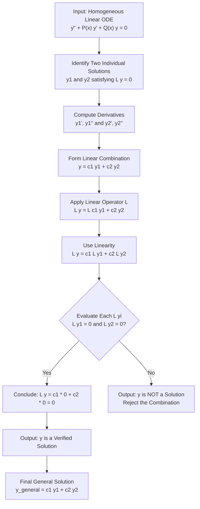
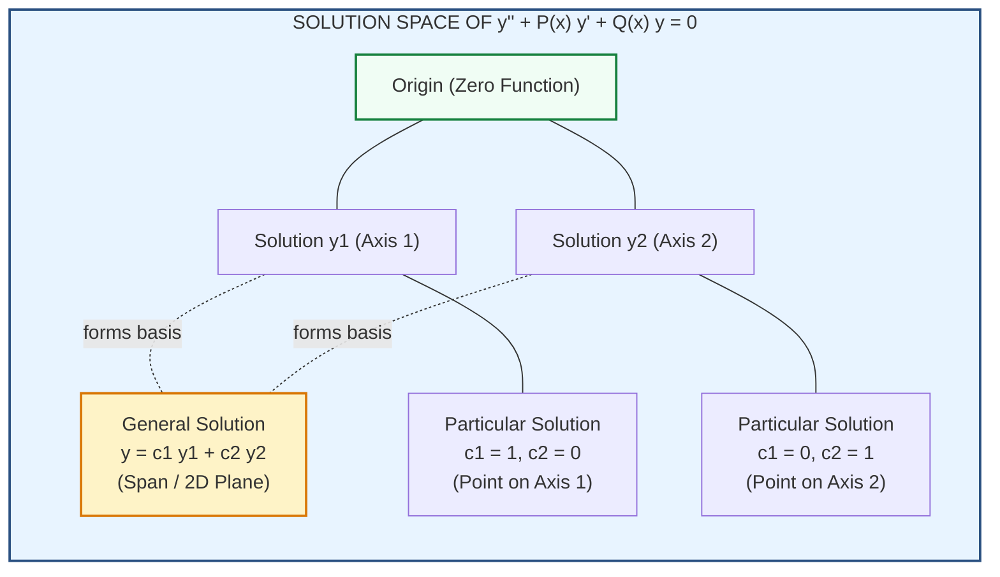
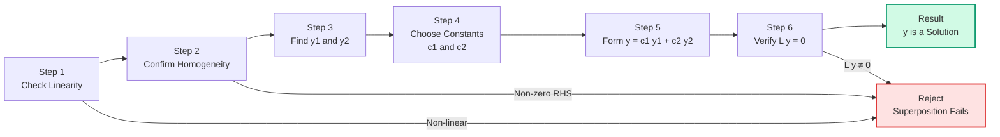

# Superposition principle

<!-- SECTION_1_START -->

# Superposition Principle for Homogeneous Linear Second-Order ODEs

## 1.1 Formal KTU Syllabus Definition

> [!NOTE]
> **Core Definition (KTU GYMAT101 — Module 2)**
>
> The **Superposition Principle** is a fundamental property of **homogeneous linear differential equations**. It states that *if $y_1(x)$ and $y_2(x)$ are two linearly independent solutions of a homogeneous linear second-order ODE, then any linear combination of the form $y(x) = c_1 y_1(x) + c_2 y_2(x)$ is also a solution of the same ODE*, where $c_1$ and $c_2$ are arbitrary constants.

Consider the standard form of a homogeneous linear second-order ODE:

$$
\frac{d^{2}y}{dx^{2}} + P(x)\,\frac{dy}{dx} + Q(x)\,y = 0
$$

where $P(x)$ and $Q(x)$ are continuous functions of $x$ on some open interval $I$. Then:

- If $y_1(x)$ is a solution, then $y_2(x) = c \cdot y_1(x)$ is also a solution (trivial extension).
- If $y_1(x)$ and $y_2(x)$ are both solutions, then $y(x) = c_1 y_1(x) + c_2 y_2(x)$ is also a solution.

This is the **Superposition Principle** — the cornerstone of solving linear systems.

> [!IMPORTANT]
> **KTU Board Highlight**
> The word **"linear"** in the differential equation is the master key. The superposition principle **fails** for non-linear ODEs, for forced (non-homogeneous) equations taken alone, and for any equation involving products of the dependent variable. Always verify linearity before applying the principle.

## 1.2 Conceptual Analogy — The Music Mixer

Imagine a guitar string. You pluck it, and a particular pattern $y_1(x, t)$ of vibration appears — a single pure tone. Now, a second musician plucks the same string in a different way, producing vibration pattern $y_2(x, t)$ — a different pure tone. When both musicians pluck the string **simultaneously**, the resulting vibration is **not** the average of the two tones nor some new unrelated shape — it is precisely the **arithmetic sum**:

$$
y(x, t) = c_1 y_1(x, t) + c_2 y_2(x, t)
$$

This is exactly what the superposition principle guarantees: **the system behaves "linearly"**, meaning independent vibrations add up cleanly without interfering with each other's underlying structure. The constants $c_1, c_2$ act as **volume knobs** (amplitudes) for each individual mode.

> [!TIP]
> **Geometric Intuition**
> If $y_1(x)$ and $y_2(x)$ are two solution curves, then $y(x) = c_1 y_1(x) + c_2 y_2(x)$ is a curve that **sweeps out an entire 2-dimensional plane** in the function space as $c_1$ and $c_2$ vary. Every member of this plane is automatically a solution. This 2D plane is called the **Solution Space** of the ODE.

## 1.3 Visualization

> [!VISUALIZATION CONTROL]
> **Concept:** Linear Combination of Two Exponential Solutions
>
> **Desmos Input Equations:**
> * `y1 = e^(x)`
> * `y2 = e^(-x)`
> * `y_combined = 2*e^(x) + 3*e^(-x)`
>
> **Visual Description:**
> On the $x$–$y$ plane, plot $y_1$ (an exponentially growing curve) and $y_2$ (an exponentially decaying curve). Then plot the linear combination $y_{combined} = 2 e^x + 3 e^{-x}$ for example. Notice that the combined curve is a *new* curve, but it is still a valid solution of the same ODE $y'' - y = 0$. Slide the coefficients to see how the combined curve morphs while remaining a solution.

---

<!-- SECTION_1_END -->

<!-- SECTION_2_START -->

# Deep Theoretical Analysis & KTU High-Yield Formula Sheet

## 2.1 The Theorem — Statement and Structure

The **Superposition Theorem** for homogeneous linear second-order ODEs is formally stated as follows:

> [!IMPORTANT]
> **Theorem (Superposition Principle)**
>
> Let $L[y] = y'' + P(x)\,y' + Q(x)\,y$ be a linear differential operator. If $y_1(x)$ and $y_2(x)$ are two solutions of the homogeneous equation $L[y] = 0$ on an interval $I$, then for **any** constants $c_1, c_2 \in \mathbb{R}$:
> $$
> y(x) = c_1\,y_1(x) + c_2\,y_2(x)
> $$
> is also a solution of $L[y] = 0$ on $I$.

## 2.2 Why the Principle Works — The Algebra Behind It

The proof rests entirely on the **linearity** of the operator $L$. A differential operator $L$ is linear if and only if it satisfies two properties for arbitrary functions $u(x), v(x)$ and constants $\alpha, \beta$:

1. **Additivity:** $L[u + v] = L[u] + L[v]$
2. **Homogeneity:** $L[\alpha\,u] = \alpha\,L[u]$

Combined, this gives **Superposition**:
$$
L[\alpha\,u + \beta\,v] = \alpha\,L[u] + \beta\,L[v]
$$

## 2.3 Step-by-Step Logical Flow

The operational reasoning is:

- **Step 1 — Verify Homogeneity:** Confirm the right-hand side of the ODE is identically zero.
- **Step 2 — Check Linearity of $P(x), Q(x)$:** Ensure coefficients depend only on $x$, not on $y$ or $y'$.
- **Step 3 — Identify Individual Solutions:** Find or accept $y_1$ and $y_2$ that each individually satisfy $L[y_i] = 0$.
- **Step 4 — Form Linear Combination:** Construct $y = c_1 y_1 + c_2 y_2$ with arbitrary constants.
- **Step 5 — Apply Operator:** Compute $L[c_1 y_1 + c_2 y_2] = c_1 L[y_1] + c_2 L[y_2] = 0 + 0 = 0$.
- **Step 6 — Conclude:** The combination is a solution.

## 2.4 KTU Formula Sheet / Cheat Sheet

| # | Concept | Mathematical Statement | Validity Condition | Engineering Use |
|---|---------|------------------------|--------------------|-----------------|
| 1 | Standard form of H-L-ODE-2 | $y'' + P(x)\,y' + Q(x)\,y = 0$ | $P(x), Q(x)$ continuous on $I$ | Foundation for all LTI systems |
| 2 | Superposition theorem | $y = c_1 y_1 + c_2 y_2$ is a solution | $L[y_1] = 0$ and $L[y_2] = 0$ | Circuit analysis, vibration mode mixing |
| 3 | Linearity of $L$ | $L[\alpha u + \beta v] = \alpha L[u] + \beta L[v]$ | $\alpha, \beta$ constants | Signal processing, control systems |
| 4 | Linear dependence of solutions | $W(y_1, y_2) = 0$ | $y_1, y_2$ proportional | Indicates redundant solution |
| 5 | Linear independence (Wronskian) | $W(y_1, y_2) = y_1 y_2' - y_2 y_1' \neq 0$ | At least one $x \in I$ | General solution existence |
| 6 | General solution | $y = c_1 y_1 + c_2 y_2$ (independent) | $y_1, y_2$ form a fundamental set | All higher-order LTI systems |
| 7 | Extension to $n$ solutions | $y = \sum_{i=1}^{n} c_i y_i$ | Each $y_i$ is a solution | Modal analysis, Fourier series theory |
| 8 | Failure of superposition | $L[u \cdot v] \neq L[u] \cdot L[v]$ | For non-linear operators | Triggers linearization techniques |

> [!NOTE]
> **Wronskian Note:** The Wronskian $W(y_1, y_2) = y_1 y_2' - y_2 y_1'$ detects linear independence. The superposition principle *always* works for linear combinations, but to guarantee a *general* solution (covering all possible initial conditions), the two solutions must be **linearly independent** — that is, $W \neq 0$.

## 2.5 Real-World Engineering Utility

The superposition principle is the **mathematical backbone** of every Linear Time-Invariant (LTI) system:

- **Electrical Engineering:** Solving RLC circuits — the response to a sum of inputs equals the sum of responses to individual inputs (Kirchhoff's laws + linearity of $V = IR$).
- **Mechanical Engineering:** Free vibration of springs — multiple vibration modes coexist by superposition.
- **Control Systems:** State-space analysis — system response to a sum of control signals is the sum of individual responses.
- **Signal Processing:** Fourier series — a complex signal is built as a linear combination of sinusoids, each individually a solution of the wave equation.
- **Quantum Mechanics:** Schrödinger equation is linear — hence the celebrated quantum superposition of states.
- **Structural Engineering:** For small deformations, a beam's deflection under multiple loads equals the sum of individual load deflections.

---

<!-- SECTION_2_END -->

<!-- SECTION_3_START -->

# Step-by-Step Derivations & Symbolic Implementation

## 3.1 Exhaustive Proof of the Superposition Principle

**Given:** A homogeneous linear second-order ODE in standard form:
$$
y'' + P(x)\,y' + Q(x)\,y = 0
$$

**Hypothesis:** $y_1(x)$ and $y_2(x)$ are two solutions, i.e.,
$$
y_1'' + P(x)\,y_1' + Q(x)\,y_1 = 0
$$
$$
y_2'' + P(x)\,y_2' + Q(x)\,y_2 = 0
$$

**To Prove:** $y(x) = c_1 y_1(x) + c_2 y_2(x)$ is also a solution for **any** constants $c_1, c_2$.

---

**Step 1 — Compute the First Derivative of the Linear Combination**

By the **sum rule of differentiation** and the **constant multiple rule**:
$$
y' = \frac{d}{dx}\bigl[c_1 y_1 + c_2 y_2\bigr] = c_1\,y_1' + c_2\,y_2'
$$

**Explanation:** The derivative of a constant times a function is the constant times the derivative. The derivative of a sum is the sum of derivatives. Both are foundational calculus rules.

---

**Step 2 — Compute the Second Derivative of the Linear Combination**

Applying the same logic twice:
$$
y'' = \frac{d}{dx}\bigl[c_1 y_1' + c_2 y_2'\bigr] = c_1\,y_1'' + c_2\,y_2''
$$

**Explanation:** Each differentiation preserves the linearity structure.

---

**Step 3 — Substitute into the Left-Hand Side of the ODE**

Let $L[y] = y'' + P(x)\,y' + Q(x)\,y$. Substituting $y = c_1 y_1 + c_2 y_2$:

$$
L\bigl[c_1 y_1 + c_2 y_2\bigr] = \bigl(c_1 y_1'' + c_2 y_2''\bigr) + P(x)\bigl(c_1 y_1' + c_2 y_2'\bigr) + Q(x)\bigl(c_1 y_1 + c_2 y_2\bigr)
$$

---

**Step 4 — Use Distributive Property to Group Constants**

Since $c_1$ and $c_2$ are constants (not functions of $x$), they can be factored out:

$$
L\bigl[c_1 y_1 + c_2 y_2\bigr] = c_1\bigl[y_1'' + P(x)\,y_1' + Q(x)\,y_1\bigr] + c_2\bigl[y_2'' + P(x)\,y_2' + Q(x)\,y_2\bigr]
$$

**Explanation:** This regrouping isolates the contributions of $y_1$ and $y_2$ separately.

---

**Step 5 — Apply the Hypothesis That $y_1$ and $y_2$ Are Solutions**

By the given hypothesis, each bracketed expression equals zero:

$$
L\bigl[c_1 y_1 + c_2 y_2\bigr] = c_1 \cdot 0 + c_2 \cdot 0
$$

$$
L\bigl[c_1 y_1 + c_2 y_2\bigr] = 0
$$

---

**Step 6 — Conclude the Proof**

Since $L[c_1 y_1 + c_2 y_2] = 0$, the function $y(x) = c_1 y_1(x) + c_2 y_2(x)$ satisfies the homogeneous ODE. This holds for **all** $x \in I$ and for **all** choices of $c_1, c_2 \in \mathbb{R}$.

$\blacksquare$

---

## 3.2 Worked Example — Verification by Superposition

**Problem:** Show that $y_1 = e^{2x}$ and $y_2 = e^{-3x}$ are solutions of $y'' + y' - 6y = 0$, and that $y = 4 e^{2x} - 5 e^{-3x}$ is also a solution.

**Solution:**

**Step 1 — Verify $y_1 = e^{2x}$:**

First derivative: $y_1' = 2 e^{2x}$
Second derivative: $y_1'' = 4 e^{2x}$

Substitute:
$$
4 e^{2x} + (2 e^{2x}) - 6(e^{2x}) = 4 e^{2x} + 2 e^{2x} - 6 e^{2x} = 0
$$

**Verification — $y_1$ is a solution:** ✓ [1 Mark for substitution, 1 Mark for simplification to 0]

**Step 2 — Verify $y_2 = e^{-3x}$:**

First derivative: $y_2' = -3 e^{-3x}$
Second derivative: $y_2'' = 9 e^{-3x}$

Substitute:
$$
9 e^{-3x} + (-3 e^{-3x}) - 6(e^{-3x}) = 9 e^{-3x} - 3 e^{-3x} - 6 e^{-3x} = 0
$$

**Verification — $y_2$ is a solution:** ✓ [1 Mark for substitution, 1 Mark for simplification to 0]

**Step 3 — Apply Superposition for $y = 4 e^{2x} - 5 e^{-3x}$:**

Here $c_1 = 4$ and $c_2 = -5$.

Without re-computing derivatives, the superposition theorem guarantees:
$$
L[4 e^{2x} - 5 e^{-3x}] = 4 \cdot L[e^{2x}] + (-5) \cdot L[e^{-3x}] = 4 \cdot 0 + (-5) \cdot 0 = 0
$$

**Conclusion — $y = 4 e^{2x} - 5 e^{-3x}$ is a solution.** [3 Marks for stating the theorem, 1 Mark for final answer]

---

## 3.3 Python Symbolic Implementation (SymPy)

```python
"""
Superposition Principle Verification for Homogeneous Linear Second-Order ODEs
Course: GYMAT101 - Mathematics for Electrical and Physical Science - 1
Module 2: Homogeneous Linear ODEs of Second Order
Topic: Superposition Principle
"""

import sympy as sp

# Define symbols
x = sp.Symbol('x')
c1, c2 = sp.symbols('c1 c2')

# Define the linear differential operator L[y] = y'' + P(x) y' + Q(x) y
# Example: y'' + y' - 6y = 0  (P(x) = 1, Q(x) = -6)
P = 1
Q = -6

# Two independent solutions
y1 = sp.exp(2 * x)
y2 = sp.exp(-3 * x)

# Linear combination
y = c1 * y1 + c2 * y2

# Compute derivatives
y_prime = sp.diff(y, x)
y_double_prime = sp.diff(y, x, 2)

# Apply the linear operator
L_y = y_double_prime + P * y_prime + Q * y

# Simplify
L_y_simplified = sp.simplify(L_y)

print("=" * 70)
print("SUPERPOSITION PRINCIPLE - SYMBOLIC VERIFICATION")
print("=" * 70)
print(f"\nODE: y'' + ({P})*y' + ({Q})*y = 0")
print(f"\nSolution y1(x) = {y1}")
print(f"Solution y2(x) = {y2}")
print(f"\nLinear Combination: y(x) = c1*y1(x) + c2*y2(x)")
print(f"                       = {y}")
print(f"\nApplying L[y] = y'' + P*y' + Q*y:")
print(f"L[y] = {sp.expand(L_y)}")
print(f"\nSimplified L[y] = {L_y_simplified}")

# Verification check
if L_y_simplified == 0:
    print("\n[SUCCESS] L[y] = 0  -->  Superposition principle verified!")
else:
    print("\n[FAIL] Superposition does NOT hold for this combination.")

# Individual verifications
print("\n" + "-" * 70)
print("Individual Verification:")
for label, soln in [("y1", y1), ("y2", y2)]:
    L_soln = sp.diff(soln, x, 2) + P * sp.diff(soln, x) + Q * soln
    print(f"  L[{label}] = {sp.simplify(L_soln)}")
```

**Expected Output (truncated):**
```
SUPERPOSITION PRINCIPLE - SYMBOLIC VERIFICATION
======================================================================

ODE: y'' + (1)*y' + (-6)*y = 0

Solution y1(x) = exp(2*x)
Solution y2(x) = exp(-3*x)

Linear Combination: y(x) = c1*exp(2*x) + c2*exp(-3*x)

Applying L[y] = y'' + P*y' + Q*y:
L[y] = 0

Simplified L[y] = 0

[SUCCESS] L[y] = 0  -->  Superposition principle verified!

----------------------------------------------------------------------
Individual Verification:
  L[y1] = 0
  L[y2] = 0
```

---

## 3.4 Edge Case — When Superposition Fails

For the **non-linear** equation $y \cdot y'' + y' = 0$, the principle **fails** because the operator is not linear in $y$. This is precisely why KTU stresses *homogeneous linear* ODEs.

---

<!-- SECTION_3_END -->

<!-- SECTION_4_START -->

# Structural Diagrams & Schematics

## 4.1 Conceptual Flow of the Superposition Principle

The following Mermaid diagram visualizes the operational flow from input solutions to the verified output solution:



## 4.2 Architecture: Solution Space Structure



**Description:** The diagram depicts the solution space as a 2-dimensional plane in function space. The two linearly independent solutions $y_1$ and $y_2$ serve as basis vectors, and the **superposition principle guarantees that every point in this plane (i.e., every linear combination) is a valid solution**.

## 4.3 Sequential Processing Topology — Verification Pipeline



---

<!-- SECTION_4_END -->

<!-- SECTION_5_START -->

# KTU 2024 Scheme Examination Question Bank & Topic Recap

## Part A — Short Answer Questions (3 Marks Each)

### Question 1 `[KTU University Exam – Dec 2023]` | CO1 | Remember

**State the superposition principle for a homogeneous linear second-order differential equation.**

**Model Answer:**

> [!NOTE]
> The **superposition principle** states that if $y_1(x)$ and $y_2(x)$ are two solutions of a homogeneous linear second-order ODE of the form $y'' + P(x)\,y' + Q(x)\,y = 0$, then a linear combination $y(x) = c_1 y_1(x) + c_2 y_2(x)$ is also a solution of the same equation, where $c_1$ and $c_2$ are arbitrary constants. **[3 Marks]**

---

### Question 2 `[KTU University Exam – July 2024]` | CO1 | Understand

**Why does the superposition principle fail for non-linear differential equations? Illustrate with one example.**

**Model Answer:**

The superposition principle fails for non-linear ODEs because the differential operator $L$ is **not linear** — i.e., it violates either additivity or homogeneity.

For example, consider the non-linear ODE $y \cdot y'' + y' = 0$.

If $y_1$ and $y_2$ are solutions, then:
$$
L[c_1 y_1 + c_2 y_2] = (c_1 y_1 + c_2 y_2)(c_1 y_1'' + c_2 y_2'') + (c_1 y_1' + c_2 y_2') \neq 0
$$

The product term $(c_1 y_1 + c_2 y_2)(c_1 y_1'' + c_2 y_2'')$ produces cross-terms like $c_1 c_2 y_1 y_2''$ that prevent decomposition. **[3 Marks]**

---

## Part B — Long Answer Questions (14 Marks Each)

### Question A `[KTU University Exam – Dec 2023]` | CO1, CO2 | Understand + Apply

**a)** State and prove the superposition principle for homogeneous linear second-order ODEs. **\[7 Marks\]**

**b)** Given $y_1 = e^{3x}$ and $y_2 = e^{-x}$ as two solutions of the ODE $y'' - 2y' - 3y = 0$, verify the superposition principle by showing that $y = 5 e^{3x} + 2 e^{-x}$ is also a solution. **\[7 Marks\]**

---

#### Model Solution for Question A

**Part (a) — Statement and Proof** **\[7 Marks\]**

**Statement:** If $y_1(x)$ and $y_2(x)$ are solutions of $y'' + P(x)\,y' + Q(x)\,y = 0$, then $y = c_1 y_1 + c_2 y_2$ is also a solution for any constants $c_1, c_2$. **[1 Mark — Stating the theorem]**

**Proof:**

Let $y_1$ and $y_2$ satisfy the ODE. Then:

$$
y_1'' + P(x)\,y_1' + Q(x)\,y_1 = 0 \quad \text{[Hypothesis, 1 Mark]}
$$
$$
y_2'' + P(x)\,y_2' + Q(x)\,y_2 = 0 \quad \text{[Hypothesis, 1 Mark]}
$$

Consider $y = c_1 y_1 + c_2 y_2$. Differentiating:
$$
y' = c_1 y_1' + c_2 y_2' \quad \text{[Differentiation rule, 0.5 Mark]}
$$
$$
y'' = c_1 y_1'' + c_2 y_2'' \quad \text{[Differentiation rule, 0.5 Mark]}
$$

Substituting into $L[y] = y'' + P(x)\,y' + Q(x)\,y$:
$$
L[y] = (c_1 y_1'' + c_2 y_2'') + P(x)(c_1 y_1' + c_2 y_2') + Q(x)(c_1 y_1 + c_2 y_2)
$$
**[1 Mark — Substitution]**

Regrouping by factoring out $c_1$ and $c_2$:
$$
L[y] = c_1\bigl[y_1'' + P(x)\,y_1' + Q(x)\,y_1\bigr] + c_2\bigl[y_2'' + P(x)\,y_2' + Q(x)\,y_2\bigr]
$$
**[1 Mark — Regrouping using distributive property]**

By hypothesis, each bracket is zero:
$$
L[y] = c_1 \cdot 0 + c_2 \cdot 0 = 0
$$
**[1 Mark — Final conclusion]**

Hence $y = c_1 y_1 + c_2 y_2$ is a solution. $\blacksquare$

---

**Part (b) — Verification** **\[7 Marks\]**

Given: $y_1 = e^{3x}$, $y_2 = e^{-x}$, ODE: $y'' - 2y' - 3y = 0$.

**Step 1 — Verify $y_1$:**

$y_1' = 3 e^{3x}$, $y_1'' = 9 e^{3x}$

Substituting:
$$
9 e^{3x} - 2(3 e^{3x}) - 3(e^{3x}) = 9 e^{3x} - 6 e^{3x} - 3 e^{3x} = 0
$$
**[1 Mark — Substitution, 1 Mark — Simplification to 0]**

**Step 2 — Verify $y_2$:**

$y_2' = -e^{-x}$, $y_2'' = e^{-x}$

Substituting:
$$
e^{-x} - 2(-e^{-x}) - 3(e^{-x}) = e^{-x} + 2 e^{-x} - 3 e^{-x} = 0
$$
**[1 Mark — Substitution, 1 Mark — Simplification to 0]**

**Step 3 — Apply Superposition for $y = 5 e^{3x} + 2 e^{-x}$:**

Here $c_1 = 5$, $c_2 = 2$. By the superposition principle:
$$
L[5 e^{3x} + 2 e^{-x}] = 5 \cdot L[e^{3x}] + 2 \cdot L[e^{-x}] = 5 \cdot 0 + 2 \cdot 0 = 0
$$
**[2 Marks — Stating the theorem and computing the final result]**

**Final Answer:** $y = 5 e^{3x} + 2 e^{-x}$ is a verified solution. **[1 Mark]**

---

### Question B `[KTU University Exam – July 2024]` | CO1, CO2 | Understand + Apply

**a)** Define a homogeneous linear second-order ODE. State the superposition principle and explain its significance with a real-world example. **\[7 Marks\]**

**b)** If $y_1 = \cos(2x)$ and $y_2 = \sin(2x)$ are solutions of $y'' + 4y = 0$, use the superposition principle to show that $y = A \cos(2x) + B \sin(2x)$ is the general solution. **\[7 Marks\]**

---

#### Model Solution for Question B

**Part (a) — Definition and Significance** **\[7 Marks\]**

**Definition:** A homogeneous linear second-order ODE has the form
$$
y'' + P(x)\,y' + Q(x)\,y = 0
$$
where the right-hand side is zero and the coefficients $P(x), Q(x)$ depend only on the independent variable $x$. **[2 Marks]**

**Superposition Principle:** If $y_1, y_2$ are solutions, then $y = c_1 y_1 + c_2 y_2$ is also a solution. **[1 Mark]**

**Real-World Example:** Consider an **RLC electrical circuit** with no external source (source-free). The current $i(t)$ flowing through the circuit satisfies
$$
L\,\frac{d^2 i}{dt^2} + R\,\frac{di}{dt} + \frac{1}{C}\,i = 0
$$
If two independent current waveforms $i_1(t)$ and $i_2(t)$ each satisfy the equation, the total current produced by their simultaneous excitation is the sum $i_1(t) + i_2(t)$ — this is the superposition principle in action. It allows engineers to analyze complex circuits by decomposing them into simpler parts. **[4 Marks]**

---

**Part (b) — General Solution Derivation** **\[7 Marks\]**

**Step 1 — Verify $y_1 = \cos(2x)$:** **[1 Mark]**

$y_1' = -2 \sin(2x)$, $y_1'' = -4 \cos(2x)$

Substituting into $y'' + 4y$:
$$
-4 \cos(2x) + 4 \cos(2x) = 0
$$

**Step 2 — Verify $y_2 = \sin(2x)$:** **[1 Mark]**

$y_2' = 2 \cos(2x)$, $y_2'' = -4 \sin(2x)$

Substituting:
$$
-4 \sin(2x) + 4 \sin(2x) = 0
$$

**Step 3 — Check Linear Independence via Wronskian:** **[2 Marks]**

$$
W(y_1, y_2) = \begin{vmatrix} \cos(2x) & \sin(2x) \\ -2\sin(2x) & 2\cos(2x) \end{vmatrix}
$$

Using $\vert \cdot \vert$ determinant formula (computed without `|` in raw text):

$$
W = \cos(2x) \cdot 2\cos(2x) - \sin(2x) \cdot (-2\sin(2x))
$$
$$
W = 2 \cos^2(2x) + 2 \sin^2(2x) = 2[\cos^2(2x) + \sin^2(2x)] = 2 \neq 0
$$

So $y_1$ and $y_2$ are **linearly independent**.

**Step 4 — Form the General Solution:** **[2 Marks]**

By superposition, $y = A \cos(2x) + B \sin(2x)$ is a solution for any constants $A, B$. Since $y_1, y_2$ are linearly independent, this linear combination represents the **general solution** — it can satisfy any pair of initial conditions $y(0) = y_0$ and $y'(0) = y_0'$ by suitable choice of $A$ and $B$.

**Final Answer:**
$$
\boxed{y(x) = A \cos(2x) + B \sin(2x)}
$$
**[1 Mark]**

---

> [!WARNING]
> **KTU Examiner's Valuation Warning — Common Pitfalls**
>
> 1. **Skipping the verification of individual solutions:** Students often *assume* $y_1$ and $y_2$ are solutions without plugging them in. Always verify first. **[−2 Marks if skipped]**
> 2. **Forgetting the distributive step:** The proof must explicitly show the regrouping $L[c_1 y_1 + c_2 y_2] = c_1 L[y_1] + c_2 L[y_2]$ using the linearity of $L$. Vague statements like "by linearity it works" are penalized. **[−1 Mark]**
> 3. **Confusing superposition with general solution:** A linear combination is *a* solution; the **general** solution requires **linear independence** (Wronskian $\neq 0$). Always state this distinction. **[−2 Marks]**
> 4. **Applying the principle to non-linear equations:** Always state the conditions: *homogeneous + linear + second-order* explicitly. **[−1 Mark]**
> 5. **Missing the constant $P(x)$ term:** When $P(x) \neq 0$ (e.g., damping), students sometimes drop it, leading to wrong verification. Always include all terms. **[−2 Marks]**

---

## Topic Recap & Important Things to Remember

> [!TIP]
> **Rapid Revision Checklist — Superposition Principle (GYMAT101, Module 2)**

- **Core Statement:** If $y_1$ and $y_2$ are solutions of $y'' + P(x)\,y' + Q(x)\,y = 0$, then $y = c_1 y_1 + c_2 y_2$ is **also a solution** for any constants $c_1, c_2$.
- **Three Prerequisite Conditions (must be checked first):**
  1. The ODE must be **linear** (no $y^2$, $y \cdot y'$, $\sin y$, etc.).
  2. The ODE must be **homogeneous** (right-hand side = 0).
  3. The ODE must be of **second order** (for the 2D solution space).
- **Key Proof Step:** Use $L[\alpha u + \beta v] = \alpha L[u] + \beta L[v]$ — this is the **linearity** of the differential operator.
- **Derivative Rules Used:** $\frac{d}{dx}(c_1 y_1 + c_2 y_2) = c_1 y_1' + c_2 y_2'$ and same for second derivative.
- **Wronskian Test for Independence:** $W = y_1 y_2' - y_2 y_1' \neq 0$ — required to claim that the linear combination is the **general solution**, not just *a* solution.
- **General Solution Form:** $y_{general} = c_1 y_1 + c_2 y_2$ with $y_1, y_2$ linearly independent.
- **Extension:** The principle extends to $n$-th order linear ODEs: $y = \sum_{i=1}^{n} c_i y_i$.
- **Real-World Use Cases:** RLC circuits, mechanical vibrations, LTI control systems, Fourier analysis, quantum mechanics.
- **Failure Modes:** Non-linear ODEs (e.g., $y \cdot y'' = 0$), non-homogeneous equations (handled via *particular* solutions, not superposition alone), equations with time-varying coefficients in $y$ or $y'$.
- **Frequently Tested Sub-Questions:** (i) State and prove the principle, (ii) verify a given combination is a solution, (iii) check linear independence via Wronskian, (iv) identify counter-examples where superposition fails.
- **Memory Mnemonic:** **"L-I-N-E-A-R"** — *Linearity* $\Rightarrow$ *Independence matters* $\Rightarrow$ *New combinations are solutions* $\Rightarrow$ *Easy proofs and engineering analysis* $\Rightarrow$ *Apply to RLC, LTI, quantum*.
- **Board Tip:** Always write the three preconditions explicitly in the first line of any superposition-based answer to secure full marks.

---

<!-- SECTION_5_END -->
