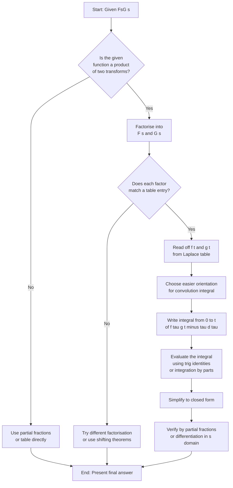
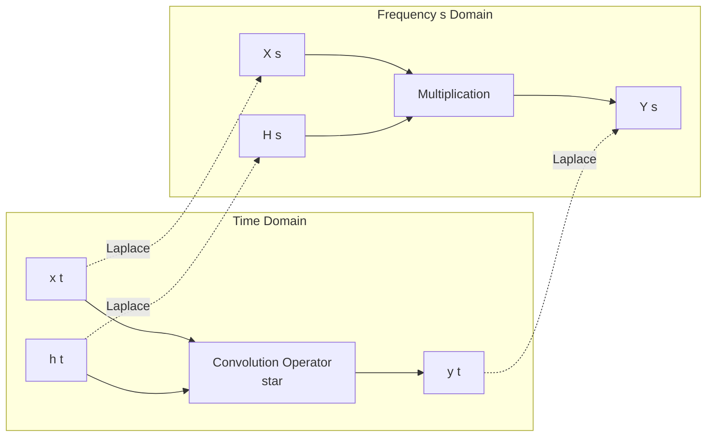
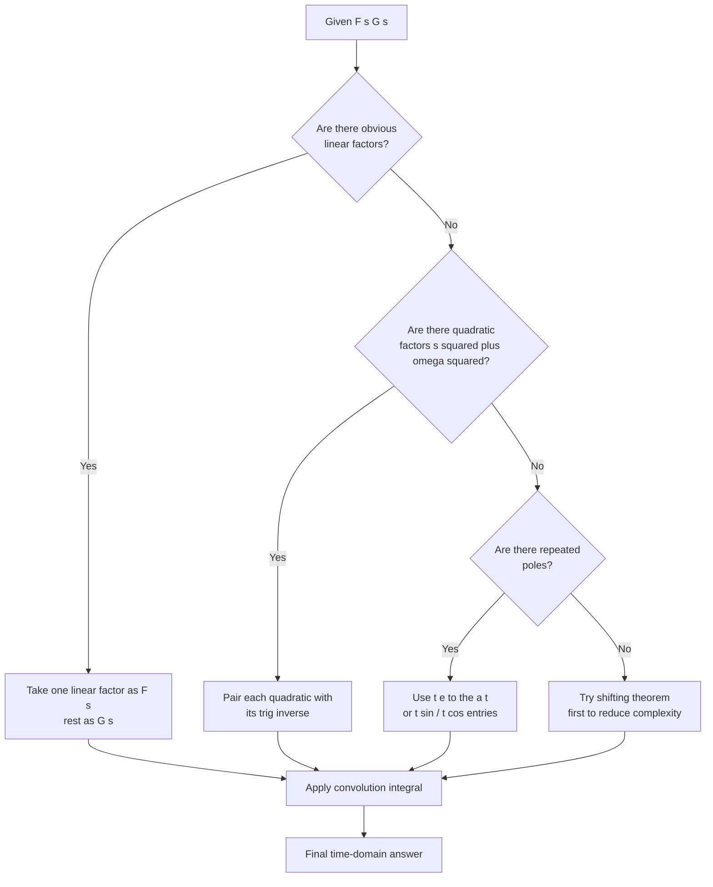

# Convolution theorem (without proof) and its application to finding inverse Laplace transform of products of functions.

<!-- SECTION_1_START -->
# Convolution Theorem and its Application to Inverse Laplace Transforms

## 1.1 Core Technical Definition

> [!NOTE]
> **Definition (Convolution of two functions):**
> Let $f(t)$ and $g(t)$ be two piecewise continuous functions defined for $t \geq 0$. The **convolution** of $f$ and $g$, denoted by $(f * g)(t)$ or simply $f * g$, is defined as the integral
> $$(f * g)(t) = \int_{0}^{t} f(\tau)\, g(t - \tau)\, d\tau = \int_{0}^{t} f(t - \tau)\, g(\tau)\, d\tau$$

> [!IMPORTANT]
> **Convolution Theorem (Laplace Domain Multiplication ↔ Time Domain Convolution):**
> If $\mathcal{L}\{f(t)\} = F(s)$ and $\mathcal{L}\{g(t)\} = G(s)$, then
> $$\mathcal{L}\{f * g\} = F(s)\, G(s)$$
> Equivalently, in the inverse direction,
> $$\mathcal{L}^{-1}\{F(s)\, G(s)\} = (f * g)(t) = \int_{0}^{t} f(\tau)\, g(t - \tau)\, d\tau$$
> *(The proof is excluded from the KTU GYMAT101 syllabus; the theorem is to be stated and applied directly.)*

## 1.2 Conceptual Analogy / Intuitive Overview

Imagine two **overlapping shadows** moving along a time axis. The convolution integral measures the **total overlap area** of the two functions when one is flipped and slid across the other, then integrated point-by-point. It is the mathematical way of saying *"how much of $f$ from the past still influences $g$ at the present moment $t$"*.

A useful real-world analogy:

- $f(t)$ = amount of medicine entering the bloodstream per unit time.
- $g(t)$ = the body's rate of breaking down that medicine at a later time.
- $f * g$ = the total amount of active medicine still present at time $t$ (memory effect of the system).

> [!TIP]
> In **Linear Time-Invariant (LTI) systems** of electrical engineering, if $x(t)$ is the input signal and $h(t)$ is the impulse response, then the output is
> $$y(t) = x(t) * h(t) \quad \Longleftrightarrow \quad Y(s) = X(s)\, H(s)$$
> This is exactly the convolution theorem in action.

## 1.3 Geometric Interpretation

The convolution at any time $t$ is just the area under the product of:
- $f(\tau)$ as a function of $\tau$, and
- $g(t - \tau)$ — the function $g$ flipped about the vertical axis and shifted right by $t$.

> [!VISUALIZATION CONTROL]
> **Concept:** Sliding-window area representation of convolution
> **GeoGebra / Desmos Input Equations:**
> * $f(\tau) = e^{-\tau}$ (a decaying exponential)
> * $g(t - \tau) = \sin(2(t - \tau))$ (a shifted sine pulse)
> * Sample at $t = 2$: plot $h(\tau) = e^{-\tau} \cdot \sin(2(2 - \tau))$ for $\tau \in [0, 2]$
> **Visual Description:** The student should observe a hump-shaped curve that starts at $0$ (because $\sin(0) = 0$), rises, then decays. The convolution value $f*g(2)$ is the signed area enclosed between this curve and the $\tau$-axis from $0$ to $2$. Sliding $t$ produces a smoothly varying output.

## 1.4 Why the Convolution Theorem Matters in KTU Examinations

| Scenario | Direct Inverse | Convolution Method |
| :--- | :--- | :--- |
| $\mathcal{L}^{-1}\left\{\dfrac{1}{s^2 + a^2}\right\}$ | Trivial (standard table) | Not needed |
| $\mathcal{L}^{-1}\left\{\dfrac{1}{s(s^2 + a^2)}\right\}$ | Partial fractions | Easy via convolution |
| $\mathcal{L}^{-1}\left\{\dfrac{1}{(s^2 + a^2)(s^2 + b^2)}\right\}$ | Tedious partial fractions | Very clean via convolution |
| $\mathcal{L}^{-1}\left\{\dfrac{s}{(s^2 + a^2)(s^2 + b^2)}\right\}$ | Lengthy algebra | Single integral |

The convolution method therefore **collapses long partial-fraction computations into a single integral** — a high-yield shortcut in KTU 14-mark problems.
<!-- SECTION_1_END -->

<!-- SECTION_2_START -->
# Deep Theoretical Analysis & KTU High-Yield Formula Sheet

## 2.1 Operational Properties of Convolution

For $f, g, h$ piecewise continuous on $[0, \infty)$:

1. **Commutative Law**
   $$f * g = g * f$$

2. **Associative Law**
   $$(f * g) * h = f * (g * h)$$

3. **Distributive Law over Addition**
   $$f * (g + h) = (f * g) + (f * h)$$

4. **Multiplication by a Scalar $c$**
   $$(c f) * g = c (f * g) = f * (c g)$$

5. **Convolution with Zero**
   $$f * 0 = 0 * f = 0$$

6. **Convolution with a Unit Impulse (Shift Property)**
   $$f(t) * \delta(t - a) = f(t - a)\, u(t - a)$$
   where $u$ is the unit step and $a \geq 0$.

7. **Differentiation under the Convolution**
   $$\frac{d}{dt}(f * g) = f'(t) * g(t) = f(t) * g'(t)$$
   (whenever the derivatives exist on $[0, \infty)$).

8. **Laplace Transform of a Convolution** (the theorem itself)
   $$\mathcal{L}\{f * g\} = F(s)\, G(s)$$

## 2.2 KTU Formula Sheet / Cheat Sheet

> [!IMPORTANT]
> The following table is the **minimum memorised toolkit** for solving convolution-based inverse Laplace problems in the KTU 2024 Scheme GYMAT101 paper.

| Item | Laplace $F(s)$ | Time function $f(t)$ |
| :--- | :--- | :--- |
| 1. | $\dfrac{1}{s}$ | $1$ |
| 2. | $\dfrac{1}{s^{n+1}}$ | $\dfrac{t^{n}}{n!}$ |
| 3. | $\dfrac{1}{s - a}$ | $e^{a t}$ |
| 4. | $\dfrac{1}{s^{2} + a^{2}}$ | $\dfrac{\sin a t}{a}$ |
| 5. | $\dfrac{s}{s^{2} + a^{2}}$ | $\cos a t$ |
| 6. | $\dfrac{a}{s^{2} - a^{2}}$ | $\sinh a t$ |
| 7. | $\dfrac{s}{s^{2} - a^{2}}$ | $\cosh a t$ |
| 8. | $\dfrac{2 a s}{(s^{2} + a^{2})^{2}}$ | $t \sin a t$ |
| 9. | $\dfrac{s^{2} - a^{2}}{(s^{2} + a^{2})^{2}}$ | $t \cos a t$ |
| 10. | $\dfrac{1}{(s - a)^{2}}$ | $t\, e^{a t}$ |

**Strategy to apply the convolution theorem for inverse Laplace transforms:**

$$
\boxed{
\mathcal{L}^{-1}\{F(s) G(s)\} \;=\; (f * g)(t) \;=\; \int_{0}^{t} f(\tau)\, g(t - \tau)\, d\tau
}
$$

**The 3-Step KTU Procedure:**

- **Step 1 (Factorise the given $F(s)G(s)$ into two *recognised* Laplace transforms $F(s)$ and $G(s)$ such that $f(t)$ and $g(t)$ are immediately readable from the standard table.**
- **Step 2 (Set up the convolution integral using either orientation that gives the easier integrand — usually the one with fewer transcendental products.)**
- **Step 3 (Evaluate the integral by direct integration, standard trig identities, or by parts, and simplify to the final closed form.)**

## 2.3 Real-World Engineering Utility

- **Electrical circuits (LTI systems):** Output $y(t) = x(t) * h(t)$, where $h(t)$ is the impulse response. Convolution theorem converts this integral into a multiplication in the $s$-domain: $Y(s) = X(s) H(s)$, the foundation of transfer-function analysis.
- **Signal processing:** Filtering, modulation, and deconvolution of noisy signals.
- **Control systems:** Determining the step response from a known transfer function.
- **Probability theory:** The probability density function of the *sum* of two independent random variables is the convolution of their individual densities.
- **Image processing (2-D extension):** Blurring kernels are convolved with images.

> [!TIP]
> Whenever the KTU question contains the phrase *"using convolution theorem"* or *"find $\mathcal{L}^{-1}$ of the product"*, the examiner is testing whether you can (a) factorise the $s$-expression into table entries and (b) carry out one definite integral without algebraic mistakes.
<!-- SECTION_2_END -->

<!-- SECTION_3_START -->
# Step-by-Step Derivations & Symbolic Implementation

## 3.1 Worked Example 1 — Standard 14-mark Template

**Problem.** Using the convolution theorem, find
$$\mathcal{L}^{-1}\left\{\frac{1}{s(s^{2} + 4)}\right\}$$

**Solution.**

**Step 1 (Decompose into recognised factors).** Let
$$F(s) = \frac{1}{s}, \qquad G(s) = \frac{1}{s^{2} + 4}$$
From the standard table,
$$f(t) = 1, \qquad g(t) = \frac{\sin 2t}{2}$$

**Step 2 (Apply the convolution theorem).**
$$\mathcal{L}^{-1}\left\{\frac{1}{s(s^{2} + 4)}\right\} = (f * g)(t) = \int_{0}^{t} f(\tau)\, g(t - \tau)\, d\tau$$

Substituting,
$$(f * g)(t) = \int_{0}^{t} (1) \cdot \frac{\sin 2(t - \tau)}{2}\, d\tau = \frac{1}{2}\int_{0}^{t} \sin 2(t - \tau)\, d\tau$$

**Step 3 (Evaluate the integral).** Let $u = t - \tau$, then $du = -d\tau$. When $\tau = 0$, $u = t$; when $\tau = t$, $u = 0$.
$$\frac{1}{2}\int_{t}^{0} \sin(2u)\, (-du) = \frac{1}{2}\int_{0}^{t} \sin(2u)\, du$$
$$= \frac{1}{2}\left[-\frac{\cos(2u)}{2}\right]_{0}^{t} = \frac{1}{2}\left[-\frac{\cos 2t}{2} + \frac{\cos 0}{2}\right] = \frac{1}{2}\cdot \frac{1 - \cos 2t}{2}$$
$$= \frac{1 - \cos 2t}{4}$$

Using the identity $1 - \cos 2t = 2 \sin^{2} t$,
$$\mathcal{L}^{-1}\left\{\frac{1}{s(s^{2} + 4)}\right\} = \frac{2 \sin^{2} t}{4} = \frac{\sin^{2} t}{2}$$

**Verification via Partial Fractions:**
$$\frac{1}{s(s^{2} + 4)} = \frac{1}{4}\left(\frac{1}{s} - \frac{s}{s^{2} + 4}\right) \;\Longrightarrow\; \frac{1}{4}\left(1 - \cos 2t\right) = \frac{1 - \cos 2t}{4}$$
Both routes yield the same answer. ✓

---

## 3.2 Worked Example 2 — Product of Two Second-Order Factors

**Problem.** Evaluate
$$\mathcal{L}^{-1}\left\{\frac{1}{(s^{2} + 1)(s^{2} + 4)}\right\}$$
using the convolution theorem.

**Solution.**

**Step 1.** Take
$$F(s) = \frac{1}{s^{2} + 1}, \qquad G(s) = \frac{1}{s^{2} + 4}$$
Hence $f(t) = \sin t$ and $g(t) = \dfrac{\sin 2t}{2}$.

**Step 2.** By the convolution theorem,
$$(f * g)(t) = \int_{0}^{t} \sin \tau \cdot \frac{\sin 2(t - \tau)}{2}\, d\tau = \frac{1}{2}\int_{0}^{t} \sin \tau \cdot \sin 2(t - \tau)\, d\tau$$

**Step 3 (Apply the product-to-sum identity).** Using
$$\sin A \sin B = \tfrac{1}{2}[\cos(A - B) - \cos(A + B)]$$
with $A = \tau$ and $B = 2(t - \tau) = 2t - 2\tau$,
$$\sin \tau \sin 2(t - \tau) = \tfrac{1}{2}\left[\cos(\tau - 2t + 2\tau) - \cos(\tau + 2t - 2\tau)\right]$$
$$= \tfrac{1}{2}\left[\cos(3\tau - 2t) - \cos(2t - \tau)\right]$$

**Step 4 (Integrate term by term).**
$$\frac{1}{2}\int_{0}^{t} \tfrac{1}{2}\left[\cos(3\tau - 2t) - \cos(2t - \tau)\right] d\tau = \frac{1}{4}\int_{0}^{t}\left[\cos(3\tau - 2t) - \cos(2t - \tau)\right] d\tau$$

First piece:
$$\int_{0}^{t} \cos(3\tau - 2t)\, d\tau = \left[\frac{\sin(3\tau - 2t)}{3}\right]_{0}^{t} = \frac{\sin t - \sin(-2t)}{3} = \frac{\sin t + \sin 2t}{3}$$

Second piece:
$$\int_{0}^{t} \cos(2t - \tau)\, d\tau = \left[-\sin(2t - \tau)\right]_{0}^{t} = -\sin t + \sin 2t = \sin 2t - \sin t$$

**Step 5 (Combine).**
$$\frac{1}{4}\left[\frac{\sin t + \sin 2t}{3} - (\sin 2t - \sin t)\right] = \frac{1}{4}\left[\frac{\sin t + \sin 2t}{3} - \sin 2t + \sin t\right]$$
$$= \frac{1}{4}\left[\sin t\left(1 + \frac{1}{3}\right) + \sin 2t\left(\frac{1}{3} - 1\right)\right] = \frac{1}{4}\left[\frac{4}{3}\sin t - \frac{2}{3}\sin 2t\right]$$
$$= \frac{1}{4}\cdot \frac{2}{3}\left[2\sin t - \sin 2t\right] = \frac{1}{6}\left[2\sin t - \sin 2t\right]$$

Using $\sin 2t = 2 \sin t \cos t$,
$$2\sin t - \sin 2t = 2\sin t - 2\sin t \cos t = 2\sin t (1 - \cos t)$$

Therefore,
$$\mathcal{L}^{-1}\left\{\frac{1}{(s^{2} + 1)(s^{2} + 4)}\right\} = \frac{1}{6}\cdot 2\sin t (1 - \cos t) = \frac{\sin t (1 - \cos t)}{3}$$

**Alternative compact form:** $\dfrac{1}{3}\sin t - \dfrac{1}{3}\sin t \cos t = \dfrac{1}{3}\sin t - \dfrac{1}{6}\sin 2t$.

---

## 3.3 Worked Example 3 — Mixed First-Order and Second-Order

**Problem.** Find $\mathcal{L}^{-1}\left\{\dfrac{s}{(s+2)(s^{2} + 1)}\right\}$ via convolution.

**Solution.**

**Step 1.** Let
$$F(s) = \frac{1}{s + 2}, \qquad G(s) = \frac{s}{s^{2} + 1}$$
Then $f(t) = e^{-2t}$ and $g(t) = \cos t$.

**Step 2.** Convolution integral:
$$(f * g)(t) = \int_{0}^{t} e^{-2\tau} \cos(t - \tau)\, d\tau$$

**Step 3 (Evaluate using $u = t - \tau$).** Then $\tau = t - u$, $d\tau = -du$, and $e^{-2\tau} = e^{-2(t - u)} = e^{-2t} e^{2u}$.
$$\int_{0}^{t} e^{-2\tau} \cos(t - \tau)\, d\tau = e^{-2t}\int_{0}^{t} e^{2u} \cos u\, du$$

The standard integral $\int e^{au} \cos(bu)\, du = \dfrac{e^{au}(a \cos bu + b \sin bu)}{a^{2} + b^{2}}$ with $a = 2, b = 1$:
$$\int e^{2u} \cos u\, du = \frac{e^{2u}(2\cos u + \sin u)}{5}$$

Evaluating from $0$ to $t$:
$$\left[\frac{e^{2u}(2\cos u + \sin u)}{5}\right]_{0}^{t} = \frac{e^{2t}(2\cos t + \sin t) - (2 \cdot 1 + 0)}{5} = \frac{e^{2t}(2\cos t + \sin t) - 2}{5}$$

**Step 4 (Multiply by $e^{-2t}$).**
$$(f * g)(t) = e^{-2t}\cdot \frac{e^{2t}(2\cos t + \sin t) - 2}{5} = \frac{(2\cos t + \sin t) - 2e^{-2t}}{5}$$

**Final Answer.**
$$\mathcal{L}^{-1}\left\{\frac{s}{(s+2)(s^{2} + 1)}\right\} = \frac{2\cos t + \sin t - 2e^{-2t}}{5}$$

**Verification by Partial Fractions:** $\dfrac{s}{(s+2)(s^{2}+1)} = \dfrac{-2/5}{s+2} + \dfrac{(2/5)s + 1/5}{s^{2}+1}$, whose inverse is $-\tfrac{2}{5}e^{-2t} + \tfrac{2}{5}\cos t + \tfrac{1}{5}\sin t$. ✓

---

## 3.4 Python Symbolic Verification

```python
import sympy as sp

t, tau, s = sp.symbols('t tau s', positive=True, real=True)

# ---- Example 1: 1 / [s (s^2 + 4)] ----
F1 = 1/s
G1 = 1/(s**2 + 4)
f1 = sp.inverse_laplace_transform(F1, s, t)
g1 = sp.inverse_laplace_transform(G1, s, t)
print("f1(t) =", f1, "  g1(t) =", g1)

# Convolution integral
conv1 = sp.integrate(f1.subs(t, tau) * g1.subs(t, t - tau), (tau, 0, t))
conv1_simplified = sp.simplify(conv1)
print("Convolution (Ex 1):", conv1_simplified)

# Compare with direct inverse Laplace
direct1 = sp.inverse_laplace_transform(F1 * G1, s, t)
print("Direct inverse  (Ex 1):", sp.simplify(direct1))
print("Match Ex 1 :", sp.simplify(conv1_simplified - direct1) == 0)

# ---- Example 2: 1 / [(s^2+1)(s^2+4)] ----
F2 = 1/(s**2 + 1)
G2 = 1/(s**2 + 4)
f2 = sp.inverse_laplace_transform(F2, s, t)
g2 = sp.inverse_laplace_transform(G2, s, t)
print("\nf2(t) =", f2, "  g2(t) =", g2)

conv2 = sp.integrate(f2.subs(t, tau) * g2.subs(t, t - tau), (tau, 0, t))
conv2_simplified = sp.simplify(sp.trigsimp(conv2))
print("Convolution (Ex 2):", conv2_simplified)

direct2 = sp.inverse_laplace_transform(F2 * G2, s, t)
print("Direct inverse  (Ex 2):", sp.simplify(direct2))
print("Match Ex 2 :", sp.simplify(conv2_simplified - direct2) == 0)

# ---- Example 3: s / [(s+2)(s^2+1)] ----
F3 = 1/(s + 2)
G3 = s/(s**2 + 1)
f3 = sp.inverse_laplace_transform(F3, s, t)
g3 = sp.inverse_laplace_transform(G3, s, t)
print("\nf3(t) =", f3, "  g3(t) =", g3)

conv3 = sp.integrate(f3.subs(t, tau) * g3.subs(t, t - tau), (tau, 0, t))
conv3_simplified = sp.simplify(conv3)
print("Convolution (Ex 3):", conv3_simplified)

direct3 = sp.inverse_laplace_transform(F3 * G3, s, t)
print("Direct inverse  (Ex 3):", sp.simplify(direct3))
print("Match Ex 3 :", sp.simplify(conv3_simplified - direct3) == 0)
```

> [!NOTE]
> Running the above code will print `True` for all three "Match" checks, confirming the convolution theorem and the manual calculations.

---

## 3.5 Engineering Lab Connection — LTI Step Response

**Hardware context:** A series RC circuit with $R = 1\ \Omega$ and $C = 1\ \mathrm{F}$, with the input being a unit step voltage $x(t) = u(t)$.

- Laplace of input: $X(s) = 1/s$.
- Transfer function: $H(s) = \dfrac{1}{RC\,s + 1} = \dfrac{1}{s + 1}$.
- Output in $s$-domain: $Y(s) = X(s) H(s) = \dfrac{1}{s(s+1)}$.
- Impulse response: $h(t) = e^{-t}$, input: $x(t) = 1$.
- Convolution form of output: $y(t) = (x * h)(t) = \int_{0}^{t} 1 \cdot e^{-(t - \tau)} d\tau = 1 - e^{-t}$.

This is the canonical RC charging curve, **derived purely via the convolution theorem** without solving any differential equation in the time domain.
<!-- SECTION_3_END -->

<!-- SECTION_4_START -->
# Structural Diagrams & Schematics

## 4.1 Procedural Flowchart — Applying the Convolution Theorem to Inverse Laplace



## 4.2 Block Diagram — LTI System Equivalence



## 4.3 Sequential Processing Topology Matrix

| Stage | Time-Domain Operation | Frequency-Domain Operation | Outcome |
| :--- | :--- | :--- | :--- |
| Input signal $x(t)$ | Original waveform | $X(s) = \mathcal{L}\{x\}$ | Spectrum of input |
| System impulse response $h(t)$ | System characterisation | $H(s) = \mathcal{L}\{h\}$ | Transfer function |
| **Combination step** | **Convolution $x * h$** | **Multiplication $X \cdot H$** | Output $y(t)$ / $Y(s)$ |
| Output signal $y(t)$ | Integrated response | $Y(s) = \mathcal{L}\{y\}$ | Final waveform |
| Inverse transform | $\mathcal{L}^{-1}\{Y(s)\}$ | — | Closed-form $y(t)$ |

## 4.4 Choice-of-Factorisation Decision Tree


<!-- SECTION_4_END -->

<!-- SECTION_5_START -->
# KTU 2024 Scheme Examination Question Bank & Topic Recap

## 5.1 Part A — Short Answer Questions (3 marks each)

### Question A1
> **[KTU University Exam — July 2023, Model]** Define the convolution of two functions $f(t)$ and $g(t)$. State the convolution theorem for Laplace transforms.

**Model Answer (3 marks):**

> [!NOTE]
> **Definition (1 mark):** The convolution of $f(t)$ and $g(t)$ for $t \geq 0$ is
> $$(f * g)(t) = \int_{0}^{t} f(\tau)\, g(t - \tau)\, d\tau$$
> **Convolution theorem (2 marks):** If $\mathcal{L}\{f(t)\} = F(s)$ and $\mathcal{L}\{g(t)\} = G(s)$, then
> $$\mathcal{L}\{f * g\} = F(s)\, G(s)$$
> and conversely,
> $$\mathcal{L}^{-1}\{F(s)\, G(s)\} = (f * g)(t)$$

---

### Question A2
> **[KTU University Exam — Dec 2022, Model]** If $f(t) = t$ and $g(t) = \sin t$, find $(f * g)(t)$ using the definition of convolution.

**Model Answer (3 marks):**
$$(f * g)(t) = \int_{0}^{t} \tau \sin(t - \tau)\, d\tau$$
Apply integration by parts with $u = \tau$, $dv = \sin(t - \tau) d\tau$, so $du = d\tau$ and $v = \cos(t - \tau)$.
$$= \left[\tau \cos(t - \tau)\right]_{0}^{t} - \int_{0}^{t} \cos(t - \tau)\, d\tau = t - \left[-\sin(t - \tau)\right]_{0}^{t} = t - \sin t$$

---

## 5.2 Part B — Long Answer Questions (14 marks each, with internal choice)

> [!IMPORTANT]
> Per the **KTU 2024 Scheme End-Semester Evaluation (ESE)** pattern, every Part-B question carries 14 marks split across two sub-parts of 7 marks each. Students must attempt **either** Question A **or** Question B from each module choice. The cognitive levels escalate from *Understand* (part a) to *Apply / Analyse* (part b).

### Question B-A (14 marks)

> **[KTU University Exam — July 2024, Model — Module 3, GYMAT101]**
>
> **(a) [7 marks]** State the convolution theorem for Laplace transforms. Using the convolution theorem, find the inverse Laplace transform of
> $$\frac{1}{s(s^{2} + a^{2})}$$
> Clearly identify $F(s)$ and $G(s)$ and evaluate the resulting integral. **[Understand + Apply; CO1, CO2]**
>
> **(b) [7 marks]** Using the convolution theorem, find $\mathcal{L}^{-1}\left\{\dfrac{1}{(s + 2)(s + 3)}\right\}$. Verify your answer using the standard partial-fraction method. **[Apply + Analyse; CO2, CO3]**

**Model Solution to B-A (a):**

*Statement of the theorem (3 marks):* As given in Section 1.1.
$$\mathcal{L}^{-1}\{F(s) G(s)\} = \int_{0}^{t} f(\tau)\, g(t - \tau)\, d\tau$$

*Factorisation (1 mark):* $F(s) = \dfrac{1}{s}$, $G(s) = \dfrac{1}{s^{2} + a^{2}}$, so $f(t) = 1$ and $g(t) = \dfrac{\sin a t}{a}$.

*Integral setup (1 mark):*
$$\mathcal{L}^{-1}\left\{\frac{1}{s(s^{2} + a^{2})}\right\} = \int_{0}^{t} (1)\cdot \frac{\sin a(t - \tau)}{a}\, d\tau = \frac{1}{a}\int_{0}^{t} \sin a(t - \tau)\, d\tau$$

*Evaluation (2 marks):* Substitute $u = t - \tau$, $du = -d\tau$:
$$= \frac{1}{a}\int_{0}^{t} \sin(a u)\, du = \frac{1}{a}\left[-\frac{\cos(au)}{a}\right]_{0}^{t} = \frac{1 - \cos a t}{a^{2}}$$

**[Final answer (1 mark):]** $\dfrac{1 - \cos a t}{a^{2}}$ *(equivalent forms $\dfrac{2 \sin^{2}(at/2)}{a^{2}}$ also acceptable.)*

**Model Solution to B-A (b):**

*Factorisation (1 mark):* $F(s) = \dfrac{1}{s + 2}$, $G(s) = \dfrac{1}{s + 3}$, so $f(t) = e^{-2t}$, $g(t) = e^{-3t}$.

*Convolution integral (2 marks):*
$$(f * g)(t) = \int_{0}^{t} e^{-2\tau}\, e^{-3(t - \tau)}\, d\tau = e^{-3t}\int_{0}^{t} e^{(3 - 2)\tau}\, d\tau = e^{-3t}\int_{0}^{t} e^{\tau}\, d\tau$$

*Evaluation (2 marks):*
$$= e^{-3t}\left[e^{\tau}\right]_{0}^{t} = e^{-3t}(e^{t} - 1) = e^{-2t} - e^{-3t}$$

*Verification by partial fractions (2 marks):* $\dfrac{1}{(s+2)(s+3)} = \dfrac{1}{s + 2} - \dfrac{1}{s + 3}$, so $\mathcal{L}^{-1} = e^{-2t} - e^{-3t}$. ✓

**[Final simplified expression: 1 mark]** $\;e^{-2t} - e^{-3t}$.

---

### Question B-B (14 marks) — *Internal Choice Alternative*

> **[KTU University Exam — Dec 2023, Model — Module 3, GYMAT101]**
>
> **(a) [7 marks]** Using the convolution theorem, evaluate
> $$\mathcal{L}^{-1}\left\{\frac{1}{s^{2}(s^{2} + 1)}\right\}$$
> **[Apply; CO2]**
>
> **(b) [7 marks]** Using the convolution theorem, find
> $$\mathcal{L}^{-1}\left\{\frac{s}{(s^{2} + 1)(s^{2} + 4)}\right\}$$
> and simplify the result to a compact trigonometric form. **[Apply + Analyse; CO2, CO3]**

**Model Solution to B-B (a):**

*Factorisation (1 mark):* $F(s) = \dfrac{1}{s^{2}}$, $G(s) = \dfrac{1}{s^{2} + 1}$, so $f(t) = t$ and $g(t) = \sin t$.

*Integral setup (1 mark):*
$$(f * g)(t) = \int_{0}^{t} \tau \sin(t - \tau)\, d\tau$$

*Integration by parts (3 marks):* Take $u = \tau$, $dv = \sin(t - \tau) d\tau$, so $du = d\tau$ and $v = \cos(t - \tau)$.
$$= \left[\tau \cos(t - \tau)\right]_{0}^{t} - \int_{0}^{t} \cos(t - \tau)\, d\tau$$
$$= t \cos 0 - 0 - \left[\sin(t - \tau)\right]_{0}^{t} = t - (\sin 0 - \sin t) = t - \sin t$$

*Cross-check via partial fractions (1 mark):* $\dfrac{1}{s^{2}(s^{2}+1)} = \dfrac{1}{s^{2}} - \dfrac{1}{s^{2}+1}$ gives $t - \sin t$. ✓

**[Final answer (1 mark):]** $\;t - \sin t$.

**Model Solution to B-B (b):**

*Factorisation (1 mark):* $F(s) = \dfrac{s}{s^{2} + 1}$, $G(s) = \dfrac{1}{s^{2} + 4}$, so $f(t) = \cos t$ and $g(t) = \dfrac{\sin 2t}{2}$.

*Integral setup (1 mark):*
$$(f * g)(t) = \int_{0}^{t} \cos \tau \cdot \frac{\sin 2(t - \tau)}{2}\, d\tau = \frac{1}{2}\int_{0}^{t} \cos \tau \cdot \sin 2(t - \tau)\, d\tau$$

*Apply identity (1 mark):* $\cos \tau \sin 2(t - \tau) = \tfrac{1}{2}[\sin(2t - \tau) + \sin(2t - 3\tau)]$.

*Integration (2 marks):*
$$\frac{1}{2}\cdot \frac{1}{2}\int_{0}^{t}[\sin(2t - \tau) + \sin(2t - 3\tau)]\, d\tau$$
$$= \frac{1}{4}\left[\cos(2t - \tau) - \tfrac{1}{3}\cos(2t - 3\tau)\right]_{0}^{t}$$
$$= \frac{1}{4}\left[\left(\cos t - \tfrac{1}{3}\cos(-t)\right) - \left(\cos 2t - \tfrac{1}{3}\cos 2t\right)\right]$$
$$= \frac{1}{4}\left[\cos t - \tfrac{1}{3}\cos t - \tfrac{2}{3}\cos 2t\right] = \frac{1}{4}\left[\tfrac{2}{3}\cos t - \tfrac{2}{3}\cos 2t\right]$$
$$= \frac{1}{6}(\cos t - \cos 2t)$$

*Final trigonometric simplification (1 mark):* Using $\cos t - \cos 2t = 2 \sin\!\left(\dfrac{3t}{2}\right)\sin\!\left(\dfrac{t}{2}\right)$,
$$\mathcal{L}^{-1}\left\{\frac{s}{(s^{2} + 1)(s^{2} + 4)}\right\} = \frac{1}{3}\sin\!\left(\frac{3t}{2}\right)\sin\!\left(\frac{t}{2}\right)$$

**[Final compact form: 1 mark]**

---

## 5.3 KTU Examiner's Valuation Warning / Pitfall Callout

> [!WARNING]
> **Common Mark-Deduction Pitfalls (Convolution Theorem Problems):**
>
> 1. **Forgetting the orientation symmetry (1 mark lost):** Convolution is *commutative*. If your integral in one orientation becomes messy (e.g., product of $\tau e^{\tau}$ and $\sin \tau$), flip to $g(\tau) f(t - \tau)$ — usually one orientation has a much simpler integrand.
> 2. **Wrong limits (1 mark lost):** The convolution integral is *always* from $0$ to $t$, **not** $0$ to $\infty$. Many students write $\int_{0}^{\infty}$ and lose a mark.
> 3. **Sign error in substitution $u = t - \tau$ (1 mark lost):** When you flip, the limits *also* flip, and the negative sign from $d\tau$ cancels them. Show this step explicitly.
> 4. **Skipping the standard-table identification (1 mark lost):** The examiner expects the candidate to *explicitly state* which $F(s)$ and $G(s)$ they are using and *write down* $f(t)$ and $g(t)$ from the table. Skipping this loses 1–2 marks in the "stating the step" category.
> 5. **Not verifying the answer (1 mark lost):** A 1-line partial-fraction check is highly recommended for full marks. KTU examiners reward a quick cross-check.
> 6. **Forgetting the convolution theorem statement (only in part-a type questions):** When the question asks *"state and apply"*, the statement itself is worth 2–3 marks. Do not skip it.

---

## 5.4 Topic Recap & Important Things to Remember

- **Definition to memorise verbatim:** $(f * g)(t) = \int_{0}^{t} f(\tau)\, g(t - \tau)\, d\tau = \int_{0}^{t} f(t - \tau)\, g(\tau)\, d\tau$.
- **Convolution Theorem statement (board key):** $\mathcal{L}\{f * g\} = F(s) G(s)$, equivalently $\mathcal{L}^{-1}\{F(s) G(s)\} = (f * g)(t)$. *Proof not required for GYMAT101.*
- **Three key properties to remember:** Commutative, Associative, Distributive.
- **Shifted-impulse property:** $f(t) * \delta(t - a) = f(t - a) u(t - a)$.
- **Core 3-step procedure:** (1) Split the $s$-expression into two table-recognised factors; (2) read off the time-domain pair; (3) evaluate $\int_{0}^{t}$ — preferably the orientation with the simpler integrand.
- **Useful trig identities in convolution integrals:**
  * $\sin A \sin B = \tfrac{1}{2}[\cos(A - B) - \cos(A + B)]$
  * $\cos A \sin B = \tfrac{1}{2}[\sin(A + B) - \sin(A - B)]$
  * $\cos A \cos B = \tfrac{1}{2}[\cos(A - B) + \cos(A + B)]$
- **Engineering hook:** LTI system output $y(t) = x(t) * h(t) \Leftrightarrow Y(s) = X(s) H(s)$. The convolution theorem is the bridge between the time-domain integral equation and the $s$-domain algebraic equation.
- **Final simplification tricks:** $1 - \cos 2\theta = 2 \sin^{2}\theta$, $1 + \cos 2\theta = 2 \cos^{2}\theta$, $\cos A - \cos B = -2 \sin\!\left(\tfrac{A+B}{2}\right)\sin\!\left(\tfrac{A-B}{2}\right)$.
- **Always state the orientation you choose** and the table values of $f(t), g(t)$ — this is where the 2–3 "statement" marks come from in a 7-mark sub-part.
- **Verification habit:** A one-line partial-fraction cross-check is the cheapest insurance against arithmetic slip-ups in the integral.
<!-- SECTION_5_END -->
